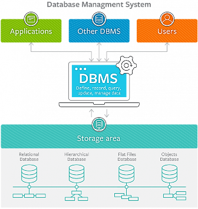

[< -- До розділу](../README.md)         [Зміст](../../contents.md)

# Вступ до баз даних та систем керування базами даних

**Про що:**

- про загальне розуміння баз даних та систем керування баз даних, моделі даних, архітектури систем керування базами даних, основні поняття реляційних бази даних

**Що отримаєте:**

- знання основи побудов баз даних та функції систем керування базами даних
- вміння створювати бази даних, таблиці, записи в таблицях, переглядати записи в таблицях з використанням спеціалізованих програмних засобів (тип залежить від практичного завдання)
- навики роботи з тестовими утилітами роботи з системами керування базами даних (тип залежить від практичного завдання)

**Що потрібно знати вже:**

- базові навики роботи з комп'ютером та операційною системою

**Необхідні інструменти:**

- посилання на усі необхідні програмні засоби надаються в практичному завданні

**Джерела:** 

- Матеріали курсу [Програмна інженерія в системах управління](https://pupenasan.github.io/ProgIngContrSystems)

## Теоретична частина

- [Вступ до баз даних та систем керування базами даних: теоретична частина](teor.md)
- [Утиліта для роботи з СКБД: HeidiSQL](heidisql.md)

## Практична частина

- [Основи роботи з СКБД MariaDB з використанням тестової утиліти HeidiSQL: практична частина](lab.md)

## Перевірка знань

todo

