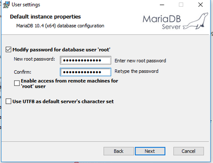
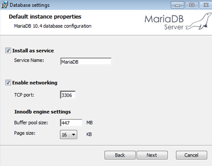
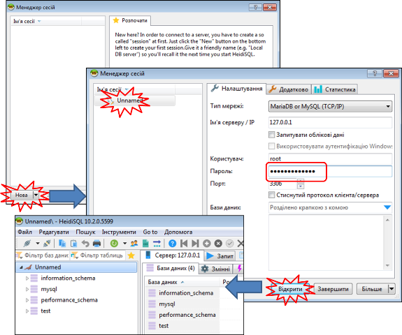
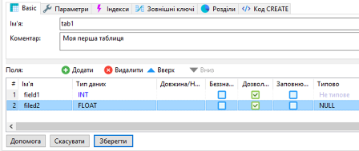
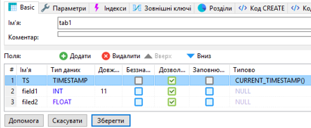
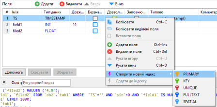
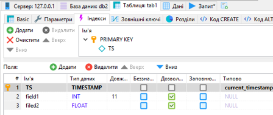

[<- До підрозділу](README.md)

# Основи роботи з СКБД MariaDB з використанням тестової утиліти HeidiSQL 

**Тривалість**:2 акад. години.

**Мета:** Навчитися працювати з базами даних

**Лабораторна установка**

- Апаратне забезпечення: ПК
- Програмне забезпечення: СКБД MariaDB

## Порядок виконання роботи 

### 1. Встановлення СКБД MariaDB 

- [ ] Перейти на  [сторінку завантаження](https://downloads.mariadb.org/mariadb/10.4.12/)

- [ ] Вибрати і завантажити версію для вашої платформи, наприклад `mariadb-10.4.12-win32.msi`

- [ ] Запустити інсталятор на виконання. Усе виставляти за замовченням, на сторінці встановлення паролю вказати пароль для користувача 'root'

  

- [ ] Залишити за замовченням налаштування запуску як сервісу. Це дасть можливість з'єднуватися не запускаючи СКБД. 

- [ ] всі інші налаштування залишити за замовченням

- [ ] Після інсталяції, запустити для перевірки клієнта `HeidiSQL`, який ставиться разом з MariaDB. Створити нову сесію, ввести пароль для `root`, після чого натиснути "Відкрити". Повинно з'явитися внутрішня структура з системними базами даних.  

  

### 2. Створення БД 

- [ ] ознайомтеся з довідником по роботі з клієнтською утилітою "HeidiSQL" за [посиланням](heidisql.md) 

- [ ] за допомогою редактору "Notepad++" або аналогічного створіть текстовий файл і виберіть мову відображення SQL 

- [ ] створіть нову базу даних з іменем "DB1"

- [ ] знайдіть відповідний SQL запит на створення у нижньому вікні журналу запитів, скопіюйте його в створений текстовий файл; **надалі усі запити, які буде вказано в роботі скопіювати, будете добавляти в цей файл в нижній рядок**.    

<iframe width="560" height="315" src="https://www.youtube.com/embed/AqTdbu5hUww" title="YouTube video player" frameborder="0" allow="accelerometer; autoplay; clipboard-write; encrypted-media; gyroscope; picture-in-picture" allowfullscreen></iframe>

### 3. Створення таблиці та полів таблиці за допомогою клієнтської утиліти

- [ ] натисніть один раз по базі даних, вона активується, про що буде вказувати відповідний запис в журналі запитів (`USE`); скопіюйте запит `USE` в текстовий файл;  

- [ ] створіть у базі даних таблицю з іменем `tab1_lastname`, де `lastanme` - ваше прізвище латинськими літерами, з двома записами `filed1` та `field2` 

рис.1. Створення таблиці.

- [ ] натисніть зберегти; буде створена нова таблиця;

- [ ] знайдіть відповідний запис `CREATE TABLE`, та скопіюйте його в текстовий файл;

<iframe width="560" height="315" src="https://www.youtube.com/embed/_9DifDYyZ6Q" title="YouTube video player" frameborder="0" allow="accelerometer; autoplay; clipboard-write; encrypted-media; gyroscope; picture-in-picture" allowfullscreen></iframe>

### 4. Ручне заповнення записів за допомогою клієнтської утиліти

- [ ] перейдіть на закладку "Дані"

- [ ] добавте 3 записи

- [ ] усі SQL запити `INSERT INTO` скопіюйте у файл;

<iframe width="560" height="315" src="https://www.youtube.com/embed/upOnGFBDvj4" title="YouTube video player" frameborder="0" allow="accelerometer; autoplay; clipboard-write; encrypted-media; gyroscope; picture-in-picture" allowfullscreen></iframe>

### 5. Добавлення поля та запису з `Timestamp`

- [ ] перейдіть на поле `Таблиця`, в якій конфігуруються поля;

- [ ] добавте нове поле `TS` типу `TIMESTAMP`, куди за замовчуванням буде записуватися плинний дата та час виражений в секундах з 1970 року (функція `CURRENT_TIMESTAMP()`), перемістіть поле, щоб воно було першим і натисніть "зберегти";  

рис.2. Добавлення поля та запису з `Timestamp`.

- [ ] знайдіть відповідний запис в журналі (`ALTER TABLE`) та скопіюйте його в текстовий файл;

- [ ] перейдіть на закладку `дані`, добавте ще один запис, але в поле `TS` не вписуйте жодного значення; 

- [ ] після добавлення натисніть `оновити`, буде видно що в поле `TS` записалося автоматично значення;

<iframe width="560" height="315" src="https://www.youtube.com/embed/UCWaV41f7sI" title="YouTube video player" frameborder="0" allow="accelerometer; autoplay; clipboard-write; encrypted-media; gyroscope; picture-in-picture" allowfullscreen></iframe>

### 6. Створення індексного поля

- [ ] Створіть первинний індекс для поля `TS`. 

рис.3. Створення індексного поля

- [ ] натисніть кнопку "Зберегти";

- [ ] у результаті може вийти помилка, що дані в полі не є унікальними, перейдіть на вкладку "Дані" та виправіть дату та час, щоб дані були унікальними, після чого знову перейдіть на вкладу "Таблиця" і натисніть зберегти

рис.4. Перегляд індексів

- [ ] скопіюйте запит `ALTER TABLE` зі зміною поля на індексне в текстовий файл 

<iframe width="560" height="315" src="https://www.youtube.com/embed/WykG-qcENQM" title="YouTube video player" frameborder="0" allow="accelerometer; autoplay; clipboard-write; encrypted-media; gyroscope; picture-in-picture" allowfullscreen></iframe>

### 7. Створення БД, таблиці та полів таблиці за допомогою запита SQL

- [ ] уважно передивіться текстовий файл з записами та проаналізуйте кожен з них

- [ ] змініть цей файл таким чином, щоб:

- він створював базу даних 'DB3', 
- таблицю в ньому, одразу з трьома полями, одне з яких індексне 
- створював  один запис;

- [ ] в утиліті "HeidiSQL" перейдіть на вкладку "Запит" і перенесіть туди цей зміст файлу

- [ ] натисніть "Виконати SQL", якщо виникає повідомлення про помилку, проаналізуйте і виправіть код і знову повторіть; можливо виникне необхідність видалення бази даних 'DB3'

<iframe width="560" height="315" src="https://www.youtube.com/embed/14M_CHQoSJU" title="YouTube video player" frameborder="0" allow="accelerometer; autoplay; clipboard-write; encrypted-media; gyroscope; picture-in-picture" allowfullscreen></iframe>

**Дана практична робота потребує доповнення**

todo

Практичне заняття розробив [Олександр Пупена](https://github.com/pupenasan). 
