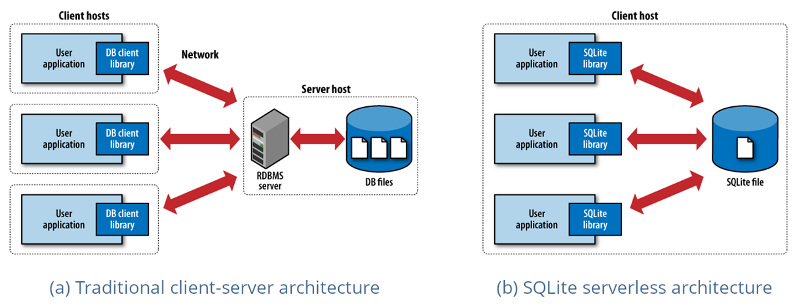
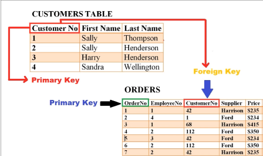
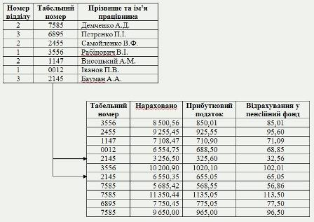
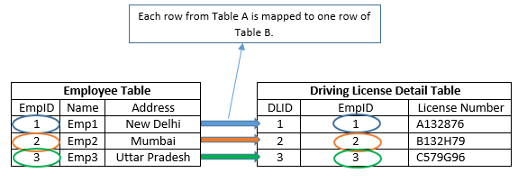
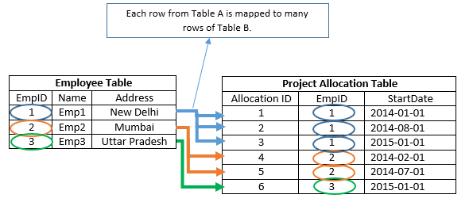
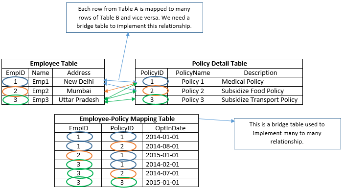

[<- До підрозділу](README.md)

# Вступ до баз даних та систем керування базами даних

## 1. Бази даних та системи керування базами даних  

**База даних** (*database*, надалі **БД**) – сукупність даних, організованих в єдину концептуальну сутність,  що описує характеристику цих даних і взаємозв'язки між їх елементами. У загальному випадку база даних містить схеми, таблиці, подання, збережені процедури та інші об'єкти. Таким чином, сучасна база даних, крім саме даних, містить їх опис та може містити засоби для їх обробки.

З базою даних можна працювати напряму з програмного застосунку. Для цього треба знати формат збереження даних та інших об'єктів, і проводити їх обробку. Враховуючи велику кількість рутини, яку треба для цього робити, як правило з БД напряму не працюють, а використовують спеціальні застосунки - СКБД. **Система керування базами даних** (Database Management Systems, СКБД, СУБД, DBMS) — це система, заснована на програмних та технічних засобах, яка забезпечує означення, створення, маніпулювання, контроль, керування та використання баз даних . Застосунки для роботи з базою даних можуть бути частиною СКБД або автономними. Найпопулярнішими [СКБД](https://uk.wikipedia.org/wiki/Система_керування_базами_даних) є [MySQL](https://uk.wikipedia.org/wiki/MySQL), [PostgreSQL](https://uk.wikipedia.org/wiki/PostgreSQL), [Microsoft SQL Server](https://uk.wikipedia.org/wiki/Microsoft_SQL_Server), [Oracle](https://uk.wikipedia.org/wiki/Oracle), [Sybase](https://uk.wikipedia.org/wiki/Sybase), [Interbase](https://uk.wikipedia.org/wiki/Interbase), [Firebird](https://uk.wikipedia.org/wiki/Firebird) та [IBM DB2](https://uk.wikipedia.org/wiki/IBM_DB2). СКБД дозволяють ефективно працювати з базами даних, обсяг яких робить неможливим їх ручне опрацювання. 

Через тісний зв'язок баз даних з СКБД під терміном «база даних» інколи необґрунтовано та неточно мають на увазі систему керування базами даних. Але варто розрізняти базу даних — сховище даних, та СКБД — засоби для роботи з базою даних. СКБД з інформаційної системи може бути видалена, але база даних продовжить існувати. І навпаки: СКБД може функціонувати без жодної бази даних. 

В загальному базу даних неможливо просто перемістити з однієї СКБД до іншої. Ти не менше СКБД використовують стандарти ([SQL](sql.md), [ODBC](https://uk.wikipedia.org/wiki/ODBC), [JDBC](https://uk.wikipedia.org/wiki/JDBC)), які уніфікують ряд операцій по роботі з даними і дозволяють різним застосункам працювати з базами даних різних СКБД. [СКБД](https://uk.wikipedia.org/wiki/Система_керування_базами_даних) часто класифікують за моделлю організації даних. Найвживаніші СКБД використовують реляційну модель, у якій дані подають у виді таблиць. Для кінцевого користувача (та прикладних програм) робота з базою даних напряму неможлива. Всі маніпуляції над даними здійснюють через спеціальні запити, які надсилають до СКБД. СКБД опрацьовує їх і повертає результат. Безпосередньо з базою даних працює виключно СКБД. 

Сучасні СКБД забезпечують функції щодо керування даними, які можна поділити на такі групи: 

- Оголошення даних — створення, зміна та видалення визначень, які описують організацію даних.
- Модифікація даних — додавання даних, їх редагування та видалення.
- Отримання даних — надання даних за запитом застосунку у формі,  яка дозволяє їх безпосереднє використання. Дані можуть надаватись або у     формі, в якій вони зберігаються у базі даних, або в іншій формі (наприклад, через поєднання різних даних).
- Адміністрування даних — реєстрування та відслідковування дій     користувачів, дотримання безпеки роботи з даними, забезпечення надійності     та цілісності даних, моніторинг продуктивності, резервне копіювання та     відновлення даних тощо.

## 2. Дані та моделі даних

Основоположними поняттями в концепції баз даних є узагальнені категорії «дані» і «модель даних».

Поняття ***дані*** в концепції баз даних - це набір конкретних значень, параметрів, що характеризують об'єкт, умову, ситуацію або будь-які інші чинники, Приклади даних: `Іваненко Іван`, `$ 30` і т. д. Дані не мають властивість структурності, вони стають інформацією тоді , коли користувач задає їм певну структуру, тобто усвідомлює їх смисловий зміст. Тому центральним поняттям в області баз даних є поняття моделі. Не існує однозначного означення цього терміну, у різних авторів ця абстракція означується з деякими відмінностями але, тим не менш, можна виділити щось загальне в цих означеннях.

***Модель даних*** - це деяка абстракція, яка, будучи застосовною до конкретних даних, дозволяє користувачам і розробникам трактувати їх уже як інформацію. Тобто це відомості, що містять не тільки дані, але і взаємозв'язок між ними.

За допомогою моделі даних можуть бути представлені об'єкти предметної області та взаємозв'язку між ними. Залежно від виду організації даних розрізняють такі моделі БД:

- ієрархічні

- мережні

- реляційні

- Об'єктно-орієнтовані

- [No-SQL](https://uk.wikipedia.org/wiki/NoSQL) бази даних, до яких відносять:

  - [ключ-значення](https://uk.wikipedia.org/wiki/База_даних_"ключ—значення") (Key/Value)

  - [граф ](https://uk.wikipedia.org/wiki/Графова_база_даних)[(graph](https://uk.wikipedia.org/wiki/Графова_база_даних)[)](https://uk.wikipedia.org/wiki/Графова_база_даних)

  - [документо](https://uk.wikipedia.org/wiki/Документо-орієнтована_система_керування_базами_даних)[-орієнтовані ](https://uk.wikipedia.org/wiki/Документо-орієнтована_система_керування_базами_даних)(document)

  - [стовпчик (](https://en.wikipedia.org/wiki/Column_(data_store))[Column](https://en.wikipedia.org/wiki/Column_(data_store))[)](https://en.wikipedia.org/wiki/Column_(data_store))

  - [мультимодельні](https://en.wikipedia.org/wiki/Multi-model_database)[ (](https://en.wikipedia.org/wiki/Multi-model_database)[Multi-model](https://en.wikipedia.org/wiki/Multi-model_database)[)](https://en.wikipedia.org/wiki/Multi-model_database)

На сьогоднішній день найпопулярнішими БД є ***реляційні*** , які отримали свою назву від англійського терміну relation (таблиця). Реляційна БД є сукупністю таблиць, пов'язаних відношеннями. Перевагами реляційної моделі даних є простота, гнучкість структури. Крім того її зручно реалізовувати на комп'ютері. Більшість сучасних БД для персональних комп'ютерів є реляційними.

## 3. Архітектури СКБД

Серед архітектур баз даних варто виділити «файл-сервер» та «клієнт-сервер».

Архітектура «файл-сервер»передбачає виділення однієї з машин мережі як головної (сервер). На такій машині зберігається спільна централізована БД (рис.1 праворуч). Усі інші машини мережі виконують функції робочих станцій, за допомогою яких підтримується доступ користувацької системи до бази даних. Файли бази даних відповідно до призначених для користувача запитів передаються на робочі станції, де в основному і проводиться обробка даних. При великій інтенсивності доступу до одних і тих же даних продуктивність інформаційної системи різко падає. Користувачі також можуть створювати на робочих станціях локальні БД, які використовуються ними монопольно. 

У сучасних мережевих інформаційних системах для роботи із загальною базою даних використовують архітектуру «клієнт-сервер»  (рис.1 ліворуч).. При цьому в мережі розміщують сервер баз даних. Ним виступає комп'ютер (або комп'ютери), який містить бази даних, СКБД та пов'язане з ними програмне забезпечення, і налаштований для надання користувачам інформаційної системи доступу до бази даних. Клієнти, які працюють із даними (вони можуть бути розташовані на різних комп'ютерах мережі), надсилають відповідні запити серверу. Сервер їх отримує, опрацьовує, та надсилає відповідь клієнту. Сучасні СКБД ([MySQL](https://uk.wikipedia.org/wiki/MySQL), [PostgreSQL](https://uk.wikipedia.org/wiki/PostgreSQL), [Microsoft SQL Server](https://uk.wikipedia.org/wiki/Microsoft_SQL_Server) та інші) працюють відповідно до цієї архітектури. Сервер баз даних, як правило, є достатньо потужною багатопроцесорною системою, яка використовує масиви дисків RAID для підвищення надійності зберігання даних. Використання дискових масивів RAID дозволяє відновити дані, навіть якщо один з дисків вийшов з ладу.

рис.1. Клієнт-серверна та файл-серверна архітектура

## 4. Реляційні бази даних

### Структура

Реляційна модель базується на представлені БД як пов'язаних ***таблиць***. Однак варто розуміти, що це логічне а не фізичне (у файлах) представлення. Рядками є записи (record), а стовпчиками поля (field) записів.  

рис.2. Принцип побудови таблиці в реляційних базах даних.

У наступному прикладі 3 записи і 6 полів. Для першого запису поле `City` має значення `Київ`. 

| Bno  | City  | Postcode | Street   | Tel_No  | Fax_No  |
| ---- | ----- | -------- | -------- | ------- | ------- |
| 23   | Київ  | 111111   | Бандери  | 1231112 | 1231113 |
| 24   | Рівне | 3334546  | Франка   | 1334456 | 1334455 |
| 25   | Львів | 456009   | Українки | 1213345 | 1213346 |

Таблиця має унікальне ім'я, поля в ній також мають унікальні імена.

### Ключі 

**Первинний ключ (primary key)**  – це поле, або набір полів, яке використовується для  забезпечення унікальності даних в таблиці. Це означає, що значення  (інформація) в полі первинного ключа в кожному рядку (запису) таблиці  має бути унікальним.

Унікальність необхідна для уникнення неоднозначності, коли невідомо  до якого запису таблиці потрібно звернутися, якщо в таблиці є записи що  повторюються (два записи мають однакові значення у всіх полях таблиці).

Нерідко бувають декілька варіантів вибору первинного ключа. Наприклад, це може бути унікальний табельний номер співробітника, або унікальна комбінація прізвища імені та по-батькові. У таких випадках при виборі первинного ключа перевага надається найбільш простому. Інші кандидати на роль первинного ключа називаються альтернативними. 

Вимоги до первинного ключа: унікальність в таблиці; не може містити пустих значень. 

За полями, які часто використовуються при пошуку та сортування даних встановлюються ***вторинні ключі***: вони допоможуть системі значно швидше знайти потрібні дані. На відміну від первинних ключів поля для ***індексів*** (***index***, вторинні ключі) можуть містити неунікальні значення.

Первинні ключі використовуються для встановлення зав'язків між таблицями в реляційній БД. В цьому випадку первинному ключу однієї таблиці (батьківської) відповідає зовнішній ключ іншої таблиці (дочірньої). Зовнішній ключ містить значення пов'язаного з ним поля, що є первинним ключем. Значення в зовнішньому ключі можуть бути не унікальні, але не повинні бути порожніми. Первинний і зовнішній ключі повинні бути однакового типу.

### Відношення між таблицями

Записи в таблиці можуть залежати від однієї або декількох записів іншої таблиці. Такі таблиці між таблицями називаються ***зв'язками*** Зв'язок означується наступним чином: поле або кілька полів однієї таблиці, зване ***зовнішнім ключем***(foreign key), посилається на первинний ключ іншої таблиці (рис.3). 

рис.3. Первинні ключі

Розглянемо приклад, в якому є дві таблиці - "Працівник", якій є перелік усіх співробітників з їх унікальним табельним номером, та "Зарплата" (рис.4), у яку заносяться усі нарахування зарплатні конкретному працівникові за його табельним номером. Ці таблиці зв'язані ключем "табельний номер" причому для таблиці "Працівник" це буде первинним ключем, тоді як для "Зарплата" - зовнішнім .  

рис.4. Використання первинних ключів. 

Тепер, наприклад, якщо потрібно пошукати нараховану заробітну плату в таблиці  “Зарплата” для працівника Баумана А.А., то потрібно виконати такі дії:

- знайти табельний номер працівника Баумана А.А у таблиці “Працівник”. Значення табельного номеру рівне 2145;
- у таблиці “Зарплата” знайти усі значення, що рівні 2145 (табельний номер);
- вибрати з таблиці “Зарплата” усі значення поля “Нараховано”, що відповідають табельному номеру 2145.

рис.5. Використання первинних ключів

Виникає резонне питання, чому б в таблиці "Зарплата" не містити замість поля "Табельний номер" безпосередньо прізвище працівника? Слід розуміти, що з таблицею "Працівник" може бути пов'язано набагато більше таблиць. Крім того, в таблиці працівник може міститися вся інформація про співробітників, яка може змінюватися (у тому числі і прізвище), окрім табельного номера, який залишається незмінним і унікальним.

Існує три типи зв'язків між таблицями: Один до одного, Один до багатьох та Багато до багатьох.

***Один до одного***  --- кожен запис батьківської таблиці пов'язаний тільки з одним записом дочірньої. Такий зв'язок зустрічається на практиці набагато рідше, ніж зв'язок один до багатьох і реалізується шляхом означення унікального зовнішнього ключа. Зв'язок "один до одного" використовують, якщо не хочуть, щоб таблиця «розпухала» від великої кількості полів. У наведеному нижче прикладі дочірня таблиця водійських прав (Driving License Detail) містить зовнішній ключ ідентифікатора працівника "EmpID", який посилається на первинний ключ батьківської таблиці працівників ("Employee"). Враховуючи, що у працівника не може бути більше ніж одних водійських прав, кожен запис таблиці працівників буде відповідати не більше одного запису в таблиці водійських прав і навпаки.      

рис.6. Співвідношення один "до одного" 

***Один до багатьох***  --- кожен запис батьківської таблиці пов'язаний з одним або декількома записами дочірньої. Наприклад, один працівник може бути задіяний в кількох проектах. Зв'язок "один до багатьох" є найпоширенішою для реляційних баз даних.

рис.7. Співвідношення один до багатьох. 

***Багато до багатьох***  --- декілька записів однієї таблиці пов'язані з декількома записами іншої. Наприклад, один працівник може мати кілька типів полісів (Policy Detail), і навпаки - кілька працівників можуть мати однаковий тип полісів.  У разі такого зв'язку в загальному випадку неможливо визначити, яка запис однієї таблиці відповідає обраному запису іншої таблиці, що робить неможливою фізичну (на рівні індексів і тригерів) реалізацію такого зв'язку між відповідними таблицями. Тому перед переходом до фізичної моделі всі зв'язки "багато до багатьох" повинні бути переозначені (деякі CASE-засоби, якщо такі використовуються при проектуванні даних, роблять це автоматично). Подібний зв'язок між двома таблицями реалізується шляхом створення третьої мостової (bridge) таблиці і реалізації зв'язку типу «один до багатьох» кожної з наявних таблиць з проміжною таблицею. У даному прикладі третя таблиця містить два зовнішні ключі.

 рис.8. Співвідношення багато до багатьох. 

### Індексація

***Індекс*** --- це структура даних, яка допомагає СКБД швидше знаходити окремі записи в таблицях, і тому дозволяє скоротити час виконання запитів користувача. Таблиці можуть мати велику кількість рядків, а так як рядки не йдуть в заздалегідь визначеному порядку, на їх пошук за вказаним значенням може знадобитися час. Функціонування Індексу в базі даних схоже на використання предметного покажчика, наведеного в кінці книги. Це структура, пов'язана з таблицею і призначена для пошуку інформації за тим же принципом, що і предметний покажчик в книзі.

Сутність індексів полягає в тому, що вони зберігають значення індексних полів (тобто полів, за якими побудований індекс) і покажчик на конкретний запис в таблиці.

При ***послідовному методі доступу*** для виконання запиту до отримання записів з таблиці БД проглядаються усі записи цієї таблиці, від першої до останньої. При ***індексно-послідовному методі доступу*** для виконання запиту, пошук відбувається в індексі, після чого покажчик встановлюється на перший рядок, що задовольняє умові запиту.

Визначення первинних і зовнішніх ключів таблиць БД призводять до створення індексів по полям, оголошеним в складі первинних або зовнішніх ключів.

## Запитання для самоперевірки

1. Що таке база даних?
2. Що таке система керування базами даних?
3. Які функції щодо керування даними забезпечують системи керування базами даних?
4. Назвіть кілька моделей відповідно до організації даних в баз даних.
5. Поясніть відмінності в архітектурах баз даних «файл-сервер» та «клієнт-сервер».
6. Яка типова структура реляційних баз даних.
7. Поясніть принципи використання первинних ключів та  вторинних ключів.
8. Поясніть, як формуються зв'язки між таблицями в реляційних базах даних.
9. Поясніть принципи роботи індексації реляційних баз даних.

Теоретичне заняття розробив [Олександр Пупена](https://github.com/pupenasan). 
