[<- До підрозділу](README.md)		[Коментувати](#feedback)

# Основи PostgreSQL: теоретична частина

## 1. Про PostgreSQL 

PostgreSQL – це розвинена, корпоративного рівня та відкрита реляційна система керування базами даних. PostgreSQL підтримує як SQL (реляційні запити), так і запити до JSON (нереляційні). 

PostgreSQL є дуже стабільною базою даних, яка розвивається спільнотою відкритого програмного забезпечення вже понад 20 років. PostgreSQL використовується як основна база даних для багатьох веб-застосунків, а також для мобільних та аналітичних застосунків. Спільнота PostgreSQL вимовляє PostgreSQL як /ˈpoʊstɡrɛs ˌkjuː ˈɛl/.

Проєкт PostgreSQL розпочався у 1986 році на кафедрі комп’ютерних наук Берклійського університету (University of California, Berkeley). Спочатку проєкт мав назву POSTGRES – на честь старішої бази даних Ingres, яка також була розроблена в Берклі. Метою проєкту POSTGRES було додати мінімально необхідні можливості для підтримки кількох типів даних. У 1996 році проєкт POSTGRES було перейменовано на PostgreSQL, щоб чітко показати підтримку SQL. Сьогодні PostgreSQL часто скорочено називають Postgres. З того часу PostgreSQL Global Development Group – спільнота розробників і учасників проєкту – продовжує випускати нові версії цієї відкритої та безкоштовної системи баз даних.

Спочатку PostgreSQL був розроблений для роботи на платформах типу UNIX. Пізніше система еволюціонувала і стала працювати на різних платформах, таких як Windows, macOS та Solaris.

Нижче наведено найпоширеніші варіанти використання PostgreSQL.

- Надійна база даних у стеку LAPP. LAPP означає Linux, Apache, PostgreSQL та PHP (або Python чи Perl). PostgreSQL використовується передусім як надійна серверна база даних, яка забезпечує роботу багатьох динамічних веб-сайтів та веб-застосунків.
- Універсальна транзакційна база даних. Як великі корпорації, так і стартапи використовують PostgreSQL як основну базу даних для підтримки своїх застосунків і продуктів.
- Геопросторова база даних. PostgreSQL разом із розширенням PostGIS підтримує геопросторові бази даних для геоінформаційних систем (GIS).

PostgreSQL підтримує найпопулярніші мови програмування: Python, PHP, Java, C#, C/C++, Ruby, JavaScript (Node.js), Perl, Go, Tcl

PostgreSQL має багато розширених можливостей, які пропонують інші корпоративні системи керування базами даних, зокрема:

- користувацькі типи даних
- успадкування таблиць
- складний механізм блокувань
- забезпечення цілісності за допомогою зовнішніх ключів
- подання (views), правила (rules), підзапити
- вкладені транзакції (savepoints)
- багатоверсійне керування паралельністю (MVCC)
- асинхронна реплікація

- нативну версію для Microsoft Windows Server
- tablespaces
- відновлення до визначеного моменту часу (point-in-time recovery)

PostgreSQL дозволяє означувати власні типи даних, типи індексів, функціональні мови та інші компоненти. Якщо вас не влаштовує будь-яка частина системи, ви можете створити власний плагін для її розширення відповідно до своїх вимог, наприклад додати новий оптимізатор.


## 2. Навчальна база даних PostgreSQL

### Опис

Для демонстрації можливостей PostgreSQL ми будемо використовувати базу даних прокату DVD. База даних прокату DVD моделює бізнес-процеси магазину прокату DVD. Вона містить багато об’єктів, зокрема:

- 15 таблиць
- 1 тригер
- 7 подань
- 8 функцій
- 1 домен
- 13 послідовностей

У базі даних DVD Rental є 15 таблиць:

- `actor` – зберігає дані акторів, включаючи ім’я та прізвище.
- `film` – зберігає дані про фільми, такі як назва, рік випуску, тривалість, рейтинг тощо.
- `film_actor` – зберігає зв’язки між фільмами та акторами.
- `category` – зберігає дані про категорії фільмів.
- `film_category` – зберігає зв’язки між фільмами та категоріями.
- `store` – містить дані про магазини, включаючи менеджера та адресу.
- `inventory` – зберігає дані інвентарю.
- `rental` – зберігає дані про прокат.
- `payment` – зберігає дані про платежі клієнтів.
- `staff` – зберігає дані персоналу.
- `customer` – зберігає дані клієнтів.
- `address` – зберігає адреси персоналу та клієнтів.
- `city` – зберігає назви міст.
- `country` – зберігає назви країн.

Ви можете завантажити навчальну базу даних PostgreSQL DVD Rental за [цим посиланням](https://neon.com/postgresqltutorial/dvdrental.zip). Файл бази даних знаходиться у форматі zip (dvdrental.zip), тому перед завантаженням у сервер PostgreSQL його потрібно розпакувати до файлу `dvdrental.tar`.

Окрім самої бази даних, доступна також ER-діаграма у форматі PDF, придатна для друку. Ви можете завантажити та роздрукувати її для використання під час практики PostgreSQL [звідси](https://neon.com/postgresqltutorial/printable-postgresql-sample-database-diagram.pdf).

### Завантаження бази даних DVD Rental за допомогою `psql` та `pg_restore`

Перед тим як продовжити, необхідно мати:

- сервер бази даних PostgreSQL
- навчальну базу даних PostgreSQL з назвою `dvdrental` посилання на яку наведено вище

`psql` – це консольний клієнт PostgreSQL. Він дозволяє вводити запити, передавати їх серверу PostgreSQL для виконання і відображати результати.

`pg_restore` – це утиліта для відновлення бази даних із архіву.

Щоб створити базу даних і завантажити дані з архівного файлу, виконайте такі кроки:

- підключіться до сервера PostgreSQL за допомогою `psql` або `pgAdmin`
- створіть порожню базу даних `dvdrental`
- завантажте дані з файлу навчальної бази даних у базу `dvdrental` за допомогою `pg_restore`

Надалі передбачається що PostgreSQL запущена в контейнері

1) Перейти у домашню директорію

```bash
cd ~
```

2) Завантажити архів із навчальною базою

```bash
wget https://neon.com/postgresqltutorial/dvdrental.zip
```

3) Встановити unzip

```bash
sudo apt update
sudo apt install unzip
```

4) Розпакувати архів

```bash
unzip dvdrental.zip
```

Після розпакування у домашній директорії з’явиться файл

```bash
dvdrental.tar
```

5) Скопіювати файл backup у контейнер PostgreSQL

```bash
sudo docker cp dvdrental.tar postgresdb:/tmp/
```

6) Створити базу даних `dvdrental`

```bash
sudo docker exec -it postgresdb psql -U postgresuser -d postgres -c "CREATE DATABASE dvdrental;"
```

7) Відновити базу даних із backup

```bash
sudo docker exec -it postgresdb pg_restore \
-U postgresuser \
-d dvdrental \
--no-owner \
/tmp/dvdrental.tar
```

8) Перевірити, що таблиці завантажені

```bash
sudo docker exec -it postgresdb psql -U postgresuser -d dvdrental -c "\dt"
```

У результаті має з’явитися список із 15 таблиць бази dvdrental.

```bash
               List of relations
 Schema |     Name      | Type  |    Owner
--------+---------------+-------+--------------
 public | actor         | table | postgresuser
 public | address       | table | postgresuser
 public | category      | table | postgresuser
 public | city          | table | postgresuser
 public | country       | table | postgresuser
 public | customer      | table | postgresuser
 public | film          | table | postgresuser
 public | film_actor    | table | postgresuser
 public | film_category | table | postgresuser
 public | inventory     | table | postgresuser
 public | language      | table | postgresuser
 public | payment       | table | postgresuser
 public | rental        | table | postgresuser
 public | staff         | table | postgresuser
 public | store         | table | postgresuser
(15 rows)

```

### Перевірка через Adminer 

Після цього база буде доступна через Adminer у браузері:

```
http://{ip}:8080
```

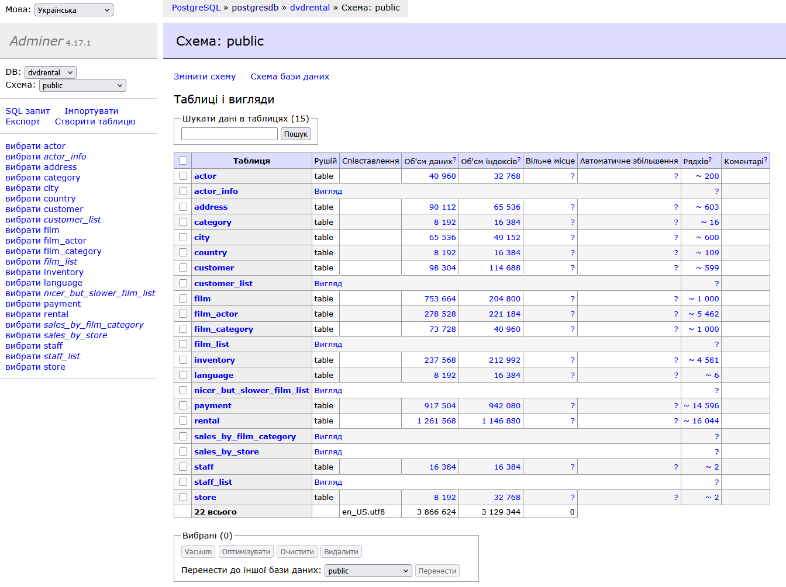

## 3. Об'єкти сервера та баз даних PostgreSQL

Після встановлення PostgreSQL, завантаження прикладної бази даних і підключення до сервера баз даних за допомогою графічного застосунку pgAdmin ви побачите, що PostgreSQL надає багато серверних і базових об’єктів. Щоб ефективно використовувати можливості кожного об’єкта, який надає PostgreSQL, слід добре розуміти, що являє собою кожен об’єкт і як його правильно використовувати. Розглянемо ці серверні та базові об’єкти PostgreSQL.

### Server service

Коли ви встановлюєте екземпляр PostgreSQL, створюється відповідна служба сервера PostgreSQL. Служба сервера PostgreSQL також називається сервером PostgreSQL. На одному фізичному сервері можна встановити кілька серверів PostgreSQL, використовуючи різні порти та різні розташування для зберігання даних.

### Databases

База даних є контейнером для інших об’єктів, таких як таблиці, подання, функції, збережені процедури та індекси. Усередині сервера PostgreSQL можна створити будь-яку кількість баз даних.

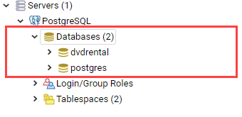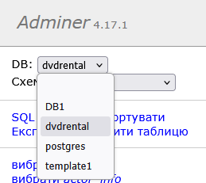

### Tables

Таблиці зберігають дані. Таблиця належить до певної бази даних, і кожна база даних містить багато таблиць. 

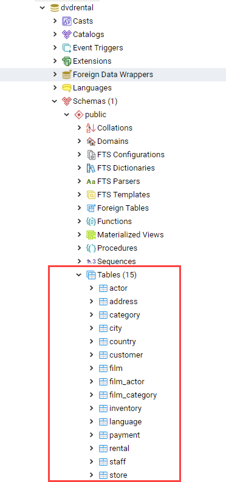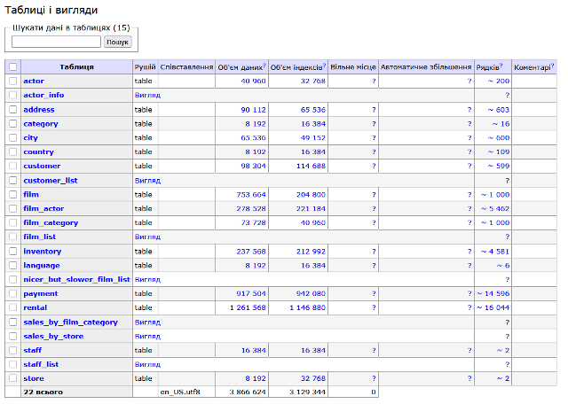

Особливою можливістю PostgreSQL є успадкування таблиць. Це означає, що одна таблиця (дочірня) може успадковувати іншу таблицю (батьківську), тому під час запиту даних із дочірньої таблиці також відображаються дані з батьківської таблиці.

### Schemas

Схема є логічним контейнером для таблиць та інших об’єктів усередині бази даних. Кожна база даних PostgreSQL може містити кілька схем.
Tablespaces

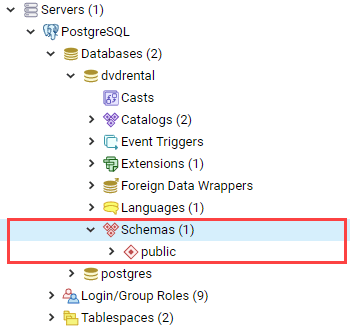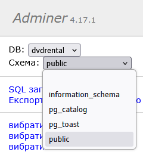

### Tablespaces

Табличні простори визначають місце, де PostgreSQL фізично зберігає дані. Табличні простори дозволяють легко переміщувати дані в різні фізичні розташування на дисках за допомогою простих команд. За замовчуванням PostgreSQL надає два табличні простори:

- `pg_default` використовується для зберігання користувацьких даних.
- `pg_global` використовується для зберігання системних даних.

На наступному рисунку показано стандартні табличні простори.

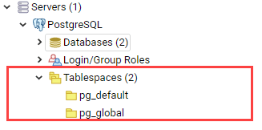

### Views

Подання є іменованими запитами, які зберігаються в базі даних. Окрім подань лише для читання, PostgreSQL підтримує подання, які можна оновлювати.

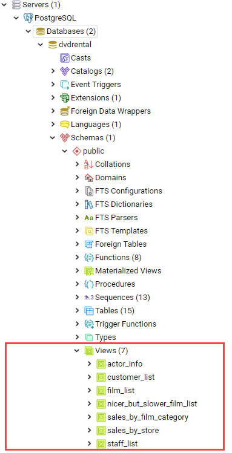

### Functions

Функція — це повторно використовуваний блок SQL-коду, який повертає скалярне значення або набір рядків.

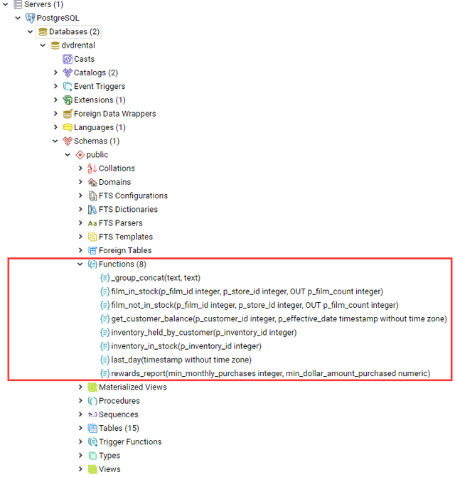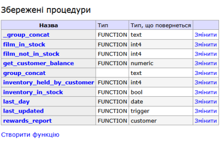

### Operators

Оператори є символічними функціями. PostgreSQL дозволяє означувати власні оператори.

### Casts

Перетворення типів (casts) дозволяють перетворювати один тип даних на інший. Перетворення виконуються за допомогою функцій. Також можна створювати власні перетворення, щоб перевизначити стандартні перетворення, які надає PostgreSQL.

### Sequence

Послідовності використовуються для керування автоінкрементними стовпцями, означеними в таблиці як стовпці типу `serial` або `identity`.

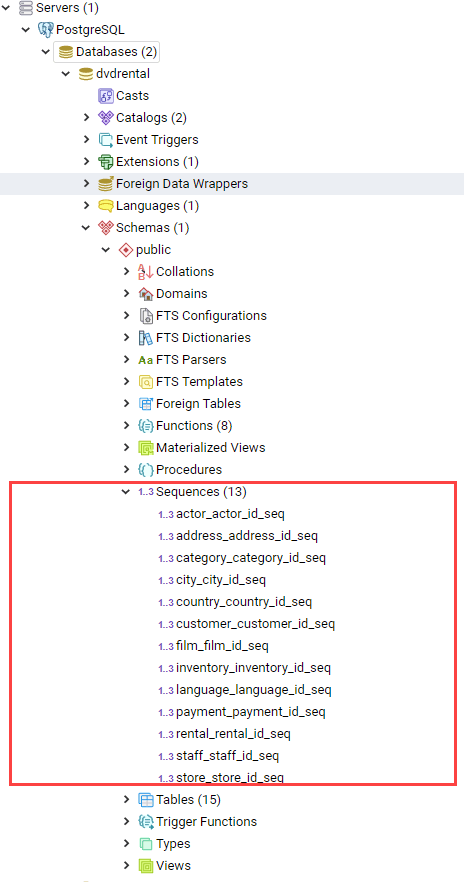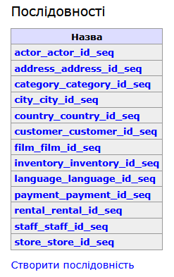

### Extension

Починаючи з версії 9.1 PostgreSQL запровадив концепцію розширень. Розширення дозволяють об’єднати інші об’єкти, зокрема типи, перетворення, індекси, функції тощо, в одну логічну одиницю. Метою розширень є спрощення супроводу та керування цими об’єктами.

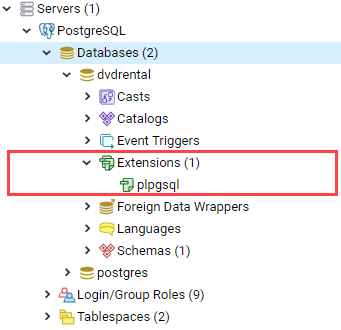


## 4. PostgreSQL vs. MySQL

Вибір між PostgreSQL і MySQL є важливим під час вибору відкритої системи керування реляційними базами даних. І PostgreSQL, і MySQL є перевіреними рішеннями, здатними конкурувати з корпоративними системами, такими як Oracle Database та SQL Server.

MySQL відома простотою використання та швидкістю, тоді як PostgreSQL має багато розширених можливостей, що принесло їй репутацію відкритого аналога Oracle Database.

Наведена нижче таблиця порівнює можливості PostgreSQL 16.x і MySQL 8.x.

| Feature                                     | PostgreSQL                                                   | MySQL                                                        |
| ------------------------------------------- | ------------------------------------------------------------ | ------------------------------------------------------------ |
| Known as                                    | PostgreSQL є відкритим проєктом.                             | Найсучасніша відкрита база даних у світі.                    |
| Development                                 | PostgreSQL є відкритим проєктом.                             | MySQL є відкритим програмним продуктом.                      |
| Pronunciation                               | post gress queue ell                                         | my ess queue ell                                             |
| Licensing                                   | Ліцензія типу MIT                                            | GNU General Public License                                   |
| Implementation programming language         | C                                                            | C/C++                                                        |
| GUI tool                                    | pgAdmin                                                      | MySQL Workbench                                              |
| ACID                                        | Так                                                          | Так                                                          |
| Storage engine                              | Один механізм зберігання                                     | Кілька механізмів зберігання, наприклад InnoDB і MyISAM      |
| Full-text search                            | Так                                                          | Так (обмежено)                                               |
| Drop a temporary table                      | У команді DROP TABLE немає ключових слів TEMP або TEMPORARY  | Підтримує ключові слова TEMP або TEMPORARY у DROP TABLE, що дозволяє видалити лише тимчасову таблицю |
| DROP TABLE                                  | Підтримує параметр CASCADE для видалення залежних об’єктів таблиці, наприклад таблиць і подань | Не підтримує параметр CASCADE                                |
| TRUNCATE TABLE                              | TRUNCATE TABLE підтримує додаткові можливості: CASCADE, RESTART IDENTITY, CONTINUE IDENTITY, транзакційну безпеку тощо | TRUNCATE TABLE не підтримує CASCADE і не є транзакційно безпечною, тобто після видалення дані не можна відкотити |
| Auto increment Column                       | SERIAL                                                       | AUTO_INCREMENT                                               |
| Identity Column                             | Так                                                          | Ні                                                           |
| Window functions                            | Так                                                          | Так                                                          |
| Data types                                  | Підтримує стандартні SQL типи та користувацькі типи          | Стандартні SQL типи                                          |
| Unsigned integer                            | Ні                                                           | Так                                                          |
| Boolean type                                | Так                                                          | Для Boolean внутрішньо використовується TINYINT(1)           |
| IP address data type                        | Так                                                          | Ні                                                           |
| Set a default value for a column            | Підтримує константи і виклики функцій                        | Має бути константа або CURRENT_TIMESTAMP для стовпців TIMESTAMP або DATETIME |
| CTE                                         | Так                                                          | Так (підтримується з MySQL 8.0)                              |
| EXPLAIN output                              | Детальніший                                                  | Менш детальний                                               |
| Materialized views                          | Так                                                          | Ні                                                           |
| CHECK constraint                            | Так                                                          | Так (підтримується з MySQL 8.0.16, раніше MySQL просто ігнорував CHECK) |
| Table inheritance                           | Так                                                          | Ні                                                           |
| Programming languages for stored procedures | Ruby, Perl, Python, TCL, PL/pgSQL, SQL, JavaScript тощо      | SQL:2003 синтаксис для збережених процедур                   |
| FULL OUTER JOIN                             | Так                                                          | Ні                                                           |
| INTERSECT                                   | Так                                                          | Так (INTERSECT з MySQL 8.0.31)                               |
| EXCEPT                                      | Так                                                          | Так                                                          |
| Partial indexes                             | Так                                                          | Ні                                                           |
| Bitmap indexes                              | Так                                                          | Ні                                                           |
| Expression indexes                          | Так                                                          | Так (functional index у MySQL 8.0.13)                        |
| Covering indexes                            | Так (з версії 9.2)                                           | Так. MySQL підтримує covering indexes, які дозволяють отримувати дані лише зі сканування індексу без доступу до таблиці. Це особливо корисно для великих таблиць із мільйонами рядків. |
| Triggers                                    | Підтримує тригери для більшості типів команд, крім тих, що впливають на базу даних глобально, наприклад ролі або tablespaces | Підтримка обмежена деякими командами                         |
| Partitioning                                | RANGE, LIST                                                  | RANGE, LIST, HASH, KEY і комбіноване розбиття з використанням RANGE або LIST разом із HASH або KEY |
| Task Scheduler                              | pgAgent                                                      | Scheduled event                                              |
| Connection Scalability                      | Кожне нове підключення є окремим процесом операційної системи | Кожне нове підключення є окремим потоком операційної системи |


## Джерела

1. https://neon.com/postgresql/tutorial


## Автори


Теоретичне заняття адаптував [Олександр Пупена](https://github.com/pupenasan). 

## Feedback

Якщо Ви хочете залишити коментар у Вас є наступні варіанти:

- [Обговорення у WhatsApp](https://chat.whatsapp.com/BRbPAQrE1s7BwCLtNtMoqN)
- [Обговорення в Телеграм](https://t.me/+GA2smCKs5QU1MWMy)
- [Група у Фейсбуці](https://www.facebook.com/groups/asu.in.ua)

Про проект і можливість допомогти проекту написано [тут](https://asu-in-ua.github.io/atpv/)
