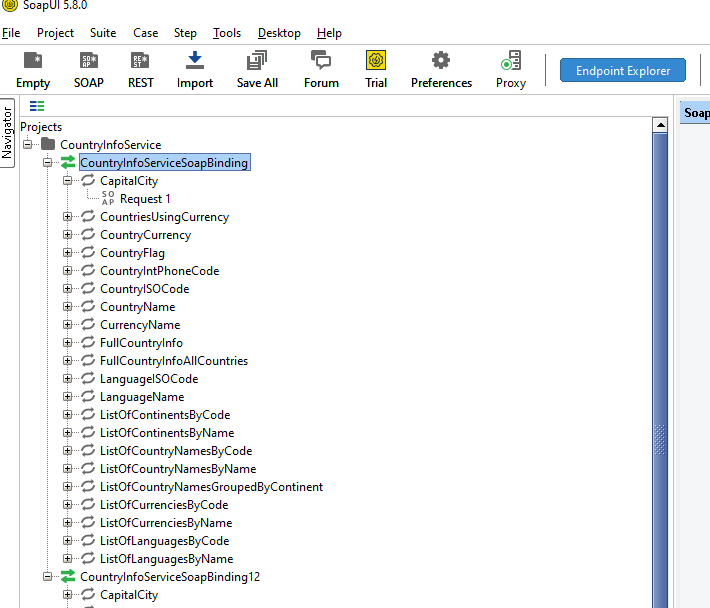
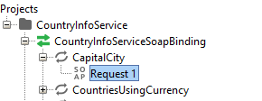
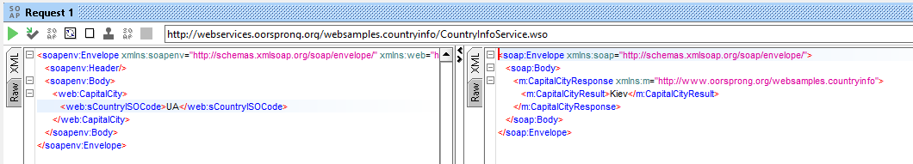

[<- До підрозділу](README.md)

# XML SOAP: практична частина

**Тривалість**: 0.5 год

**Мета:**  навчитися створювати простих SOAP клієнтів

## Лабораторна установка для проведення лабораторної роботи у віртуальному середовищі.

**Апаратне забезпечення, матеріали та інструменти для проведення віртуальної лабораторної роботи.** 

- ПК, Інтернет

**Програмне забезпечення, що використане у віртуальній лабораторній роботі.** 

-  SoapUI <https://www.soapui.org/>
- Node-RED

## Загальна постановка задачі

Цілі роботи: 

- навчитися користуватися утилітами типу SoapUI для ознайомлення з сервісами SOAP
- навчитися створювати клієнти SOAP в Node-RED

## Послідовність виконання роботи

### 1. Встановлення SoapUI

- [ ] Завантажте та встановіть <https://www.soapui.org/>

### 2. Створення проекту в SoapUI

- [ ] Відкрийте SoapUI і створіть новий проект:
- Меню → `File` → `New SOAP Project`
- У полі `Project Name` введіть: `CountryInfoService`
- У полі `Initial WSDL` вставте `http://webservices.oorsprong.org/websamples.countryinfo/CountryInfoService.wso?WSDL`
- Натисніть `OK`

SoapUI автоматично згенерує перелік доступних методів.



### 3. Створення і перевірка запиту в SoapUI

- [ ] У дереві проекту знайдіть і двічі клацність `Request 1` під `CapitalCity`:



SoapUI автоматично підставить шаблон тіла запиту:

- [ ] Замість `?` введіть `UA` в параметрі запиту `<web:sCountryISOCode>UA</web:sCountryISOCode>`. Після чого натисніть трикутник `Submit Request`. Повинна прийти відповідь.
- [ ] Натисніть XML на закладці відповіді для відображення її в форматі XML 



Практичне заняття розробив  


### 4. Самостійне створення запиту в SoapUI

- [ ] Зробіть аналогічний попередньому пункту запит на отримання прапору України і перевірте його роботу

### 5. Створення запиту в Node-RED 

- [ ] Імпортуйте потік в Node-RED та перевірте його роботу

```
[{"id":"inject1","type":"inject","z":"e1ebb847fc5afc1f","name":"Trigger","props":[{"p":"payload"}],"repeat":"","crontab":"","once":false,"onceDelay":0.1,"topic":"","payload":"","payloadType":"date","x":190,"y":80,"wires":[["template1"]]},{"id":"template1","type":"template","z":"e1ebb847fc5afc1f","name":"SOAP CapitalCity XML","field":"payload","fieldType":"msg","format":"handlebars","syntax":"mustache","template":"<?xml version=\"1.0\" encoding=\"utf-8\"?>\n<soap:Envelope xmlns:soap=\"http://schemas.xmlsoap.org/soap/envelope/\"\n               xmlns:xsi=\"http://www.w3.org/2001/XMLSchema-instance\"\n               xmlns:xsd=\"http://www.w3.org/2001/XMLSchema\">\n  <soap:Body>\n    <CapitalCity xmlns=\"http://www.oorsprong.org/websamples.countryinfo\">\n      <sCountryISOCode>UA</sCountryISOCode>\n    </CapitalCity>\n  </soap:Body>\n</soap:Envelope>","output":"str","x":370,"y":80,"wires":[["http1","179b791ca720f6d1"]]},{"id":"http1","type":"http request","z":"e1ebb847fc5afc1f","name":"POST to CountryInfoService","method":"POST","ret":"txt","paytoqs":"ignore","url":"http://webservices.oorsprong.org/websamples.countryinfo/CountryInfoService.wso","tls":"","persist":false,"proxy":"","insecureHTTPParser":false,"authType":"","senderr":false,"headers":[{"keyType":"Content-Type","keyValue":"","valueType":"other","valueValue":"text/xml; charset=utf-8"}],"x":620,"y":80,"wires":[["77d5f72c9abbf545","xml1"]]},{"id":"xml1","type":"xml","z":"e1ebb847fc5afc1f","name":"Parse XML","property":"payload","attr":"","chr":"","x":850,"y":80,"wires":[["debug1"]]},{"id":"debug1","type":"debug","z":"e1ebb847fc5afc1f","name":"Show CapitalCity","active":true,"tosidebar":true,"console":false,"tostatus":false,"complete":"payload","targetType":"msg","statusVal":"","statusType":"auto","x":1030,"y":80,"wires":[]},{"id":"77d5f72c9abbf545","type":"debug","z":"e1ebb847fc5afc1f","name":"debug 1","active":true,"tosidebar":true,"console":false,"tostatus":false,"complete":"true","targetType":"full","statusVal":"","statusType":"auto","x":795,"y":140,"wires":[],"l":false},{"id":"179b791ca720f6d1","type":"debug","z":"e1ebb847fc5afc1f","name":"debug 2","active":true,"tosidebar":true,"console":false,"tostatus":false,"complete":"true","targetType":"full","statusVal":"","statusType":"auto","x":535,"y":140,"wires":[],"l":false}]
```

