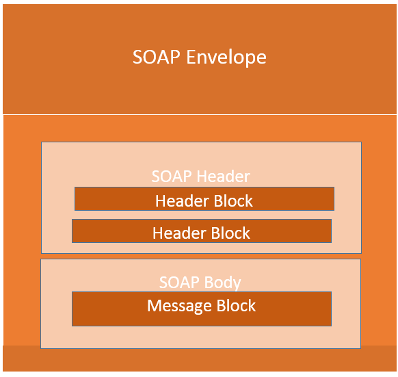

[<- До підрозділу](README.md)

# XML SOAP: теоретична частина

## 1. Загальні поняття про SOAP

Вебзастосунки повинні мати можливість обмінюватися даними через Інтернет. Найкращий спосіб взаємодії між застосунками — це протокол HTTP, оскільки його підтримують усі веббраузери та сервери. Саме для цього було створено SOAP. SOAP забезпечує можливість обміну даними між застосунками, які працюють на різних операційних системах, із використанням різних технологій і мов програмування.

Специфікація SOAP означує повідомлення SOAP, що надсилається до веб-служби та клієнтської програми. Повідомлення SOAP — це звичайний XML-документ, який містить такі елементи:

- Елемент **Envelope**, що визначає XML-документ як SOAP-повідомлення
- Елемент **Header**, що містить заголовкову інформацію
- Елемент **Body**, що містить інформацію про виклики та відповіді
- Елемент **Fault**, що містить повідомлення про помилки та статус



Усі наведені елементи оголошено в типовому просторі імен для конверта SOAP: `http://www.w3.org/2003/05/soap-envelope` А типовий простір імен для кодування SOAP та типів даних: `http://www.w3.org/2003/05/soap-encoding`

Ось кілька важливих правил синтаксису:

- Повідомлення SOAP **ПОВИННО** бути закодоване за допомогою XML
- Повідомлення SOAP **ПОВИННО** використовувати простір імен SOAP Envelope
- Повідомлення SOAP **НЕ ПОВИННО** містити посилання на DTD
- Повідомлення SOAP **НЕ ПОВИННО** містити інструкцій обробки XML

Структура повідомлення:

```xml
<?xml version="1.0"?>
<soap:Envelope
               xmlns:soap="http://www.w3.org/2003/05/soap-envelope"
               soap:encodingStyle="http://www.w3.org/2003/05/soap-encoding">

    <soap:Header>
        ...
    </soap:Header>

    <soap:Body>
        ...
        <soap:Fault>
            ...
        </soap:Fault>
    </soap:Body>

</soap:Envelope> 
```

###  SOAP Envelope Element

Обов’язковий елемент **SOAP Envelope** є кореневим елементом SOAP-повідомлення. Цей елемент визначає XML-документ як SOAP-повідомлення.

```xml
<?xml version="1.0"?>
<soap:Envelope
               xmlns:soap="http://www.w3.org/2003/05/soap-envelope"
               soap:encodingStyle="http://www.w3.org/2003/05/soap-encoding">
    ...
    Message information goes here
    ...
</soap:Envelope> 
```

Зверніть увагу на простір імен `xmlns:soap` у наведеному вище прикладі. Він завжди повинен мати значення: `"http://www.w3.org/2003/05/soap-envelope"`. Цей простір імен означує елемент Envelope як SOAP-конверт. Якщо буде використано інший простір імен, застосунок згенерує помилку та відхилить повідомлення.

Атрибут `encodingStyle` використовується для означення типів даних, що застосовуються в документі. Цей атрибут може з’являтися в будь-якому елементі SOAP і поширюється на вміст цього елемента та всі дочірні елементи. SOAP-повідомлення не має типового кодування. Синтаксис: `soap:encodingStyle="URI"`, наприклад:

```xml
<?xml version="1.0"?>
<soap:Envelope
               xmlns:soap="http://www.w3.org/2003/05/soap-envelope"
               soap:encodingStyle="http://www.w3.org/2003/05/soap-encoding">
    ...
    Message information goes here
    ...
</soap:Envelope> 
```

### SOAP Header Element

Необов’язковий елемент **SOAP Header** містить специфічну для застосунку інформацію (таку як автентифікація, оплата тощо) про SOAP-повідомлення. Якщо елемент Header присутній, він повинен бути першим дочірнім елементом елемента Envelope. Усі безпосередні дочірні елементи елемента Header мають бути кваліфіковані простором імен.

```xml
<?xml version="1.0"?>
<soap:Envelope
               xmlns:soap="http://www.w3.org/2003/05/soap-envelope"
               soap:encodingStyle="http://www.w3.org/2003/05/soap-encoding">

    <soap:Header>
        <m:Trans xmlns:m="https://www.w3schools.com/transaction/"
                 soap:mustUnderstand="1">234
        </m:Trans>
    </soap:Header>
    ...
    ...
</soap:Envelope> 
```

У наведеному вище прикладі заголовок містить елемент `Trans`, атрибут `mustUnderstand` зі значенням `1`, а також значення `234`. SOAP означує три атрибути в типовому просторі імен: `mustUnderstand`, `actor` та `encodingStyle`. Атрибути, означені в заголовку SOAP, вказують, як одержувач має обробляти SOAP-повідомлення.

Атрибут `mustUnderstand` у SOAP може використовуватись для вказівки, чи є обробка запису заголовка обов’язковою або необов’язковою для одержувача. Якщо додати `mustUnderstand="1"` до дочірнього елемента заголовка (`Header`), це означає, що одержувач, який обробляє заголовок, `повинен розпізнати цей елемент`. Якщо одержувач не розпізнає елемент, обробка заголовка завершиться помилкою. Синтаксис `soap:mustUnderstand="0|1"`. 

SOAP-повідомлення може передаватися від відправника до одержувача, проходячи через різні кінцеві точки на шляху повідомлення. Однак не всі частини SOAP-повідомлення можуть бути призначені для кінцевої точки; натомість вони можуть бути призначені для однієї або кількох проміжних точок. Атрибут `acto`r у SOAP використовується для адресації елемента Header конкретній кінцевій точці. `soap:actor="*URI*"`

```xml
<?xml version="1.0"?>
<soap:Envelope
               xmlns:soap="http://www.w3.org/2003/05/soap-envelope"
               soap:encodingStyle="http://www.w3.org/2003/05/soap-encoding">

    <soap:Header>
        <m:Trans xmlns:m="https://www.w3schools.com/transaction/"
                 soap:actor="https://www.w3schools.com/code/">234
        </m:Trans>
    </soap:Header>
    ...
    ...
</soap:Envelope> 
```

Атрибут `encodingStyle` використовується для визначення типів даних, що використовуються в документі. Цей атрибут може з’являтися в будь-якому елементі SOAP і поширюється на вміст цього елемента та всі його дочірні елементи. SOAP-повідомлення не має типового кодування.

### SOAP Body Element

Обов’язковий елемент SOAP Body містить власне SOAP-повідомлення, призначене для кінцевого одержувача. Безпосередні дочірні елементи елемента SOAP Body можуть бути кваліфіковані простором імен.

```xml
<?xml version="1.0"?>
<soap:Envelope
               xmlns:soap="http://www.w3.org/2003/05/soap-envelope"
               soap:encodingStyle="http://www.w3.org/2003/05/soap-encoding">
    <soap:Body>
        <m:GetPrice xmlns:m="https://www.w3schools.com/prices">
            <m:Item>Apples</m:Item>
        </m:GetPrice>
    </soap:Body>
</soap:Envelope> 
```

У наведеному вище прикладі запитується ціна на яблука. Зверніть увагу, що елементи `m:GetPrice` та `Item` є специфічними для застосунку. Вони не належать до простору імен SOAP. Відповідь SOAP може виглядати приблизно так:

```xml

<?xml version="1.0"?>

<soap:Envelope
               xmlns:soap="http://www.w3.org/2003/05/soap-envelope"
               soap:encodingStyle="http://www.w3.org/2003/05/soap-encoding">

    <soap:Body>
        <m:GetPriceResponse xmlns:m="https://www.w3schools.com/prices">
            <m:Price>1.90</m:Price>
        </m:GetPriceResponse>
    </soap:Body>

</soap:Envelope> 
```

### SOAP Fault Element

Необов’язковий елемент SOAP Fault використовується для вказівки на повідомлення про помилки. Елемент SOAP Fault містить інформацію про помилки та статус для SOAP-повідомлення. Якщо елемент Fault присутній, він має бути дочірнім елементом елемента Body. Елемент Fault може з’являтися лише один раз у SOAP-повідомленні. Елемент SOAP Fault має такі піделементи:

| Піделемент      | Опис                                                         |
| --------------- | ------------------------------------------------------------ |
| `<faultcode>`   | Код для ідентифікації помилки                                |
| `<faultstring>` | Зрозуміле для людини пояснення помилки                       |
| `<faultactor>`  | Інформація про того, хто спричинив помилку                   |
| `<detail>`      | Містить специфічну для застосунку інформацію про помилку, пов’язану з елементом Body |

Значення faultcode, наведені нижче, повинні використовуватись в елементі faultcode під час опису помилок:

| Помилка         | Опис                                                         |
| --------------- | ------------------------------------------------------------ |
| VersionMismatch | Виявлено недійсний простір імен для елемента SOAP Envelope   |
| MustUnderstand  | Безпосередній дочірній елемент елемента Header з атрибутом mustUnderstand, встановленим у "1", не був розпізнаний |
| Client          | Повідомлення було неправильно сформоване або містило некоректну інформацію |
| Server          | Виникла проблема на сервері, тому обробка повідомлення не могла бути продовжена |

### HTTP Protocol

HTTP здійснює обмін даними через TCP/IP. HTTP-клієнт підключається до HTTP-сервера за допомогою TCP. Після встановлення з’єднання клієнт може надіслати на сервер HTTP-запит:

```
POST /item HTTP/1.1  
Host: 189.123.255.239  
Content-Type: text/plain  
Content-Length: 200  
```

Потім сервер обробляє запит і надсилає клієнту HTTP-відповідь. У відповіді міститься статус-код, що вказує на стан запиту:

```
200 OK  
Content-Type: text/plain  
Content-Length: 200  
```

У наведеному прикладі сервер повернув статус-код 200 — це стандартний код успішного виконання в HTTP. Якщо сервер не зміг розпізнати запит, він міг би повернути, наприклад, таке:

```
400 Bad Request  
Content-Length: 0  
```

Детальніше про http можна почитати за [цим посиланням](../../nets/http/README.md)

#### Прив’язка SOAP (SOAP Binding)

Специфікація SOAP визначає структуру SOAP-повідомлень, але не описує, як саме ці повідомлення передаються. Цю прогалину заповнює поняття «SOAP-прив’язки». SOAP-прив’язки — це механізми, які дозволяють ефективно передавати SOAP-повідомлення за допомогою транспортного протоколу.

Більшість реалізацій SOAP надають прив’язки для типових транспортних протоколів, таких як HTTP або SMTP. HTTP є синхронним і широко використовуваним. У SOAP-запиті через HTTP обов’язково мають бути принаймні два заголовки: `Content-Type` і `Content-Length`. SMTP є асинхронним і застосовується як виняток або у специфічних випадках. Реалізації SOAP на Java зазвичай забезпечують окрему прив’язку до протоколу JMS (Java Messaging System).

#### Content-Type

Заголовок `Content-Type` у SOAP-запитах і відповідях означує MIME-тип повідомлення та кодування символів (необов’язкове), яке використовується в тілі XML-запиту чи відповіді.
 `Content-Type: MIMEType; charset=character-encoding`
 Приклад:

```
POST /item HTTP/1.1  
Content-Type: application/soap+xml; charset=utf-8  
```

#### Content-Length

Заголовок `Content-Length` у SOAP-запитах і відповідях вказує кількість байтів у тілі запиту або відповіді.
 `Content-Length: bytes`
 Приклад:

```
POST /item HTTP/1.1  
Content-Type: application/soap+xml; charset=utf-8  
Content-Length: 250  
```

### Приклад SOAP

У наведеному нижче прикладі до сервера надсилається запит `GetStockPrice`. Запит містить параметр `StockName`, а відповідь повертає параметр `Price`. Простір імен для функції визначено як `http://www.example.org/stock`.

SOAP-запит:

```xml
POST /InStock HTTP/1.1  
Host: www.example.org  
Content-Type: application/soap+xml; charset=utf-8  
Content-Length: nnn  

<?xml version="1.0"?>
<soap:Envelope
               xmlns:soap="http://www.w3.org/2003/05/soap-envelope"
               soap:encodingStyle="http://www.w3.org/2003/05/soap-encoding">

    <soap:Body xmlns:m="http://www.example.org/stock">
        <m:GetStockPrice>
            <m:StockName>IBM</m:StockName>
        </m:GetStockPrice>
    </soap:Body>

</soap:Envelope>
```

SOAP-відповідь:

```xml
HTTP/1.1 200 OK  
Content-Type: application/soap+xml; charset=utf-8  
Content-Length: nnn  

<?xml version="1.0"?>
<soap:Envelope
               xmlns:soap="http://www.w3.org/2003/05/soap-envelope"
               soap:encodingStyle="http://www.w3.org/2003/05/soap-encoding">

    <soap:Body xmlns:m="http://www.example.org/stock">
        <m:GetStockPriceResponse>
            <m:Price>34.5</m:Price>
        </m:GetStockPriceResponse>
    </soap:Body>

</soap:Envelope>
```

## 2. Загальні поняття про WSDL

WSDL (Web Services Description Language) — це мова на базі XML, яка призначена для формального опису вебсервісів, які базуються на протоколі SOAP. Документ WSDL виконує роль *контракту* між клієнтом і сервером, визначаючи, які функції доступні, які параметри вони приймають, як виглядає структура запиту та відповіді, а також за якою адресою можна звернутись до сервісу.

На відміну від SOAP-повідомлень, які передаються під час виконання, WSDL-файл використовується ще до цього — для генерації клієнтів, валідації структури викликів і автоматизації інтеграції.

Типовий WSDL-документ складається з п’яти основних розділів:

- **Types** — визначає типи даних, які використовуються у повідомленнях, зазвичай за допомогою XML Schema (XSD).
- **Message** — описує структуру вхідних і вихідних повідомлень, що використовуються у викликах функцій.
- **PortType** — перелік операцій (методів сервісу) з вказанням, які повідомлення вони приймають і повертають.
- **Binding** — визначає, як саме відбувається передача повідомлень (наприклад, через HTTP або SMTP) і які правила кодування використовуються.
- **Service** — вказує фактичні адреси (URL), за якими доступний вебсервіс, і до яких binding він прив’язаний.

Завдяки чіткому опису інтерфейсу, WSDL дозволяє інструментам (таким як наприклад SoapUI, Postman, або бібліотеки) автоматично генерувати клієнтський код або тести без ручного складання SOAP-повідомлень.

Таким чином, WSDL — це ключовий елемент SOAP-архітектури, який забезпечує формалізований, машиночитний опис сервісу та дозволяє значно спростити процес інтеграції між системами, реалізованими на різних платформах.

Для практичного розуміння структури WSDL та принципу роботи SOAP-сервісів, розглянемо приклад відкритого вебсервісу CountryInfoService, доступного за адресою:  `http://webservices.oorsprong.org/websamples.countryinfo/CountryInfoService.wso?WSDL`. Цей сервіс надає низку функцій, пов’язаних із країнами, наприклад:

- `CapitalCity` — отримання назви столиці за ISO-кодом країни (наприклад, UA → Kyiv)
- `CountryCurrency` — отримання валюти, яку використовує країна
- `CountryFlag` — отримання посилання на зображення прапора країни
- `FullCountryInfo` — повна структурована інформація про країну (назва, столиця, телефонний код, валюта, мова тощо)
- `ListOfCountryNamesByCode` — перелік усіх країн за їхніми ISO-кодами
- `CountriesUsingCurrency` — країни, які використовують задану валюту

Кожна функція описана у WSDL-файлі сервісу як окрема операція (operation). Для кожної операції означено:

- формат запиту (`message`)
- формат відповіді (`message`)
- типи вхідних та вихідних даних (`element`)
- спосіб передачі повідомлення (через `binding`)

Розділ `types` містить опис XML-схем, які визначають формат (структуру) вхідних і вихідних даних. Наприклад:

```xml
<types>
    <xs:schema elementFormDefault="qualified" targetNamespace="http://www.oorsprong.org/websamples.countryinfo">
        ...
        <xs:element name="CapitalCity">
            <xs:complexType>
                <xs:sequence>
                    <xs:element name="sCountryISOCode" type="xs:string"/>
                </xs:sequence>
            </xs:complexType>
        </xs:element>

        <xs:element name="CapitalCityResponse">
            <xs:complexType>
                <xs:sequence>
                    <xs:element name="CapitalCityResult" type="xs:string"/>
                </xs:sequence>
            </xs:complexType>
        </xs:element>
        ...
    </xs:schema>
</types>
```

де `CapitalCity` — це вхідний параметр методу (наприклад, `UA`), `CapitalCityResponse` — це структура відповіді, яка містить поле `CapitalCityResult` (наприклад, `Kyiv`). Всі елементи мають прості типи (`xs:string`), що спрощує використання.

У WSDL кожен метод описується через два повідомлення (`message`): для запиту та відповіді, наприклад

```xml
<message name="CapitalCitySoapRequest">
    <part name="parameters" element="tns:CapitalCity"/>
</message>

<message name="CapitalCitySoapResponse">
    <part name="parameters" element="tns:CapitalCityResponse"/>
</message>
```

де `CapitalCitySoapRequest` використовує елемент `CapitalCity` з розділу `types`, `CapitalCitySoapResponse` відповідно, використовує `CapitalCityResponse`; `part` - це обов’язковий елемент, який означує, які саме дані передаються в запиті або відповіді.

`<portType>` означує інтерфейс вебсервісу, тобто набір операцій, доступних клієнту, наприклад

```xml
<portType name="CountryInfoServiceSoapType">
    ...
    <operation name="CapitalCity">
        <documentation>Returns the name of the capital city for the passed country code</documentation>
        <input message="tns:CapitalCitySoapRequest"/>
        <output message="tns:CapitalCitySoapResponse"/>
    </operation>
</portType>
```

де `operation` описує окремий метод (`CapitalCity`), а `input` і `output` посилаються на `message`, означені вище. Коментар у `documentation` описує призначення методу.

У `<binding>` описується прив’язка до транспортного протоколу, наприклад, HTTP та спосіб кодування SOAP.

```xml
<binding name="CountryInfoServiceSoapBinding" type="tns:CountryInfoServiceSoapType">
    <soap:binding style="document" transport="http://schemas.xmlsoap.org/soap/http"/>
    <operation name="CapitalCity">
        <soap:operation soapAction="" style="document"/>
        <input>
            <soap:body use="literal"/>
        </input>
        <output>
            <soap:body use="literal"/>
        </output>
    </operation>
</binding>

```

де `<binding>` вказує, як саме реалізовано передачу даних (у цьому випадку — `document/literal` через HTTP). `soap:operation`  позначає одну з дій, прив’язаних до SOAP (може містити `soapAction`, але тут він порожній);`use="literal"` означає, що структура XML відповідає точно схемі (не кодується окремо).

У розділі `<service>` описується фактична служба, тобто де саме фізично розміщено вебсервіс.

```xml
<service name="CountryInfoService">
    <port name="CountryInfoServiceSoap" binding="tns:CountryInfoServiceSoapBinding">
        <soap:address location="http://webservices.oorsprong.org/websamples.countryinfo/CountryInfoService.wso"/>
    </port>
</service>
```

де `<soap:address>` вказано URL, за яким доступна служба, `CountryInfoServiceSoap` - порт, означений раніше і прив’язку до `binding`. Саме цю адресу використовує клієнт для надсилання SOAP-запитів.


Теоретичне заняття розробив [Прізвище або нік розробника Імя](https://github.com). 
