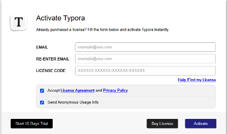
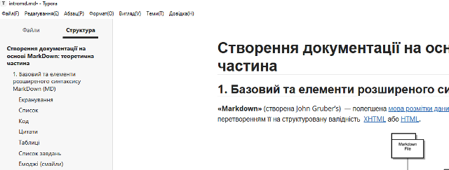
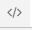

[<- До підрозділу](README.md)		[Коментувати](#feedback)

# Створення документації на основі MarkDown: практична частина

**Тривалість**: 1 акад година (0.5 пари)

**Мета:**  закріпити на практиці принципи роботи з MarkDown

## Послідовність виконання роботи

- [ ] Ознайомтеся з теоретичними відомостями [Створення документації на основі MarkDown: теоретична частина](teor.md)

### 1. Встановлення Notepad++ та плагінів

Ви можете використовувати будь які редактори або плагіни MarkDown для виконання цього завдання. У даному практичному занятті використовується Notepad++ з плагіном а також Typora. 

- [ ] Встановіть [Notepad++](https://notepad-plus-plus.org/), якщо Ви ще цього не зробили раніше.
- [ ] Запустіть Notepad++. У меню `Плагіни -> Адмінстрування плагнів` встановіть Markdown Panel

Плагін `Markdown Panel` дає можливість переглядати зміст Markdown документів у вигляді переглядача.

### 2. Створення та редагування документу Markdown

- [ ] Створіть на комп'ютері окрему папку, де буде зберігатися документ Markdown. 
- [ ] Використовуючи провідник створіть файл `intromd.md`.
- [ ] Відкрийте файл за допомогою Notepad++.
- [ ] Через меню `плагіни` або через кнопку на панелі швидкого доступу відкрийте Markdown Panel
- [ ] Завантажте документ, який необхідно зробити в Markdown за [цим посиланням](https://drive.google.com/file/d/1tp6mh7XUjm-iZQd3aZW6g46pGxPBm39y/view?usp=sharing)
- [ ] Подивіться на структуру документу (заголовки), зміст документу. Все це необхідно повторити в Markdown.
- [ ] Реалізуйте все до пункту  2 (LaTeX/Mathematics) так щоб документ на панелі Markdown виглядав як в версії pdf. Посилання та рисунки доступні в цьому документі, вони також мають відображатися і працювати аналогічно.

Робота з формулами та діаграмами Mermaid не підтримуються у рендері в Markdown Panel, тому вони будуть розроблятися в редакторі Typora.

### 3. Знайомство з редактором Typora

- [ ] Завантажте Typora з розділу завантаження офіційного сайте [typora.io](https://typora.io/)

- [ ] Встановіть Typora на свій ПК
- [ ] Запустіть Typora після завантаження.

рис.1.

Даний редактор є платним, але можна користуватися пробною версією з обмеженнями. Хоч вартість ліцензії невелика, і якщо Ви плануєте використовувати Markdown у Вашій професійній діяльності варто подумати над покупкою (власне автор даного практичного заняття купив ліцензію), у даному практичному занятті вважатиметься, що Ви користуєтеся пробною ліцензією.   

- [ ] Натисніть кнопку `Start 15 Days Trial` для активації 15-денної ліцензії

- [ ] Перейдіть в пункт меню `File->Refernces->General->Language`  і виберіть інтерфейс Українською мовою.
- [ ] Перезапустіть typora щоб налаштування вступили в силу. Кожного разу коли запускатимете Typora, вибирайте `Not Now`.

рис.2.

- [ ] Відкрийте в Typora файл `intromd.md`, який Ви створили і відредагували у попередньому пункті.
- [ ] Активуйте меню `Вигляд -> Структура`

Якщо все зроблено вірно, то в редакторі Ви повинні побачити структуру документу, рисунок, посилання і т.п. 

рис.3. 

- [ ] Ознайомтеся з контекстним меню, клікнувши праву кнопку миші.
- [ ] Переключіться в режим джерельного коду і в зворотному напрямку, використовуючи меню `Вигляд -> Режим джерельного коду` або відповідну кнопку в правому нижньому кутку екрану  .

### 4. Робота з формулами в Typora

- [ ] Зайдіть в меню `Файл->Параметри->Markdown` і активуйте опцію `Формули в рядку`. 

Це дає можливість створювати вбудовувані в рядки формули.

- [ ] Перезапустіть Typora
- [ ] Реалізуйте пункт 2 (LaTeX/Mathematics) з раніше [завантаженого](https://drive.google.com/file/d/1tp6mh7XUjm-iZQd3aZW6g46pGxPBm39y/view?usp=sharing) документу.

### 5. Робота з Mermaid в Typora

За замовченням в Typora активована можливість роботи в Mermaid, однак варто перевірити.

- [ ] Зайдіть в меню `Файл->Параметри->Markdown` і активуйте опцію Графіки в розділі `Підтримка синтаксису`, якщо ця опція не стоїть.  

- [ ] Реалізуйте пункт 3 Mermaid) з раніше [завантаженого](https://drive.google.com/file/d/1tp6mh7XUjm-iZQd3aZW6g46pGxPBm39y/view?usp=sharing) документу.

## Джерела

1. 

## Автори

Практичне заняття розробив  [Олександр Пупена](https://github.com/pupenasan). 

## Feedback

Якщо Ви хочете залишити коментар у Вас є наступні варіанти:

- [Обговорення у WhatsApp](https://chat.whatsapp.com/BRbPAQrE1s7BwCLtNtMoqN)
- [Обговорення в Телеграм](https://t.me/+GA2smCKs5QU1MWMy)
- [Група у Фейсбуці](https://www.facebook.com/groups/asu.in.ua)

Про проект і можливість допомогти проекту написано [тут](https://asu-in-ua.github.io/atpv/)
