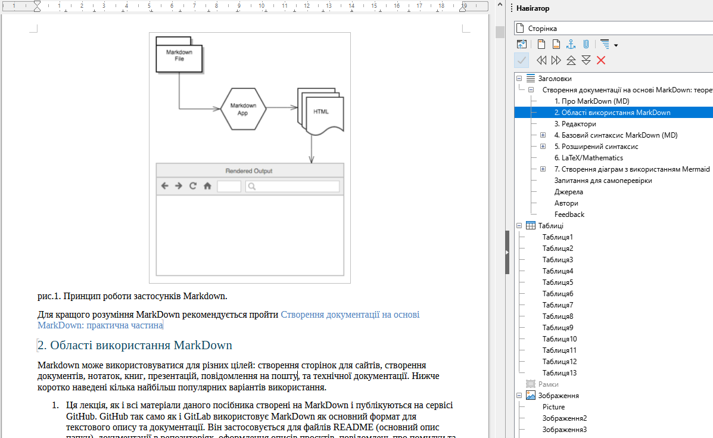
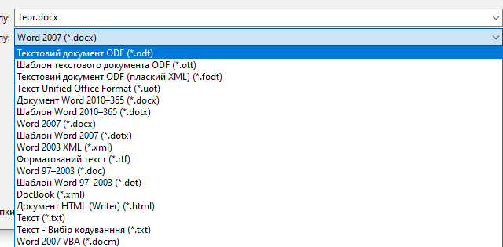
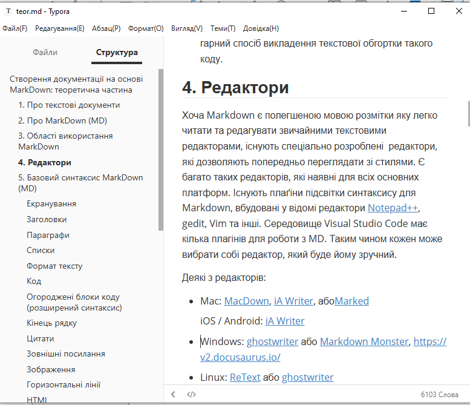
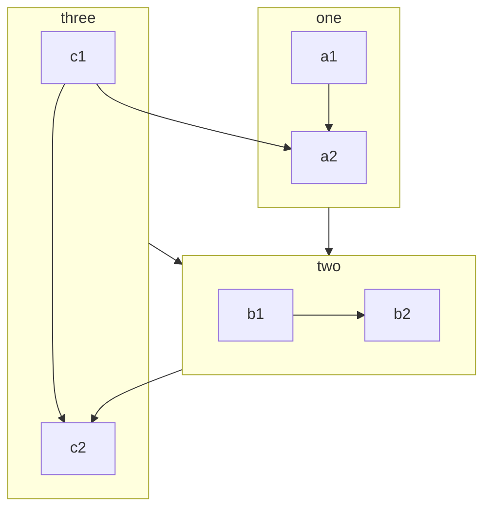
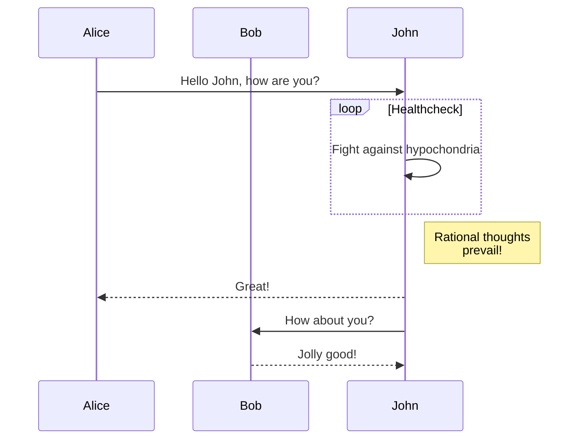
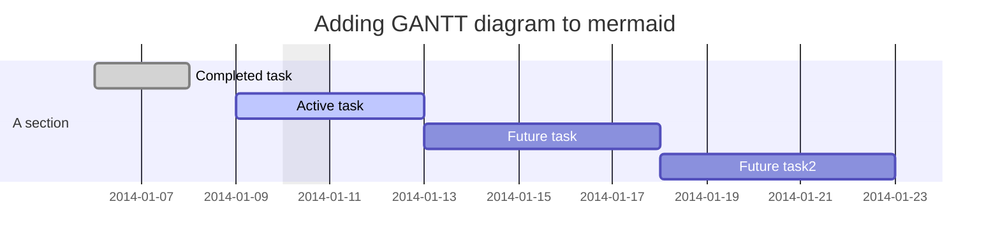
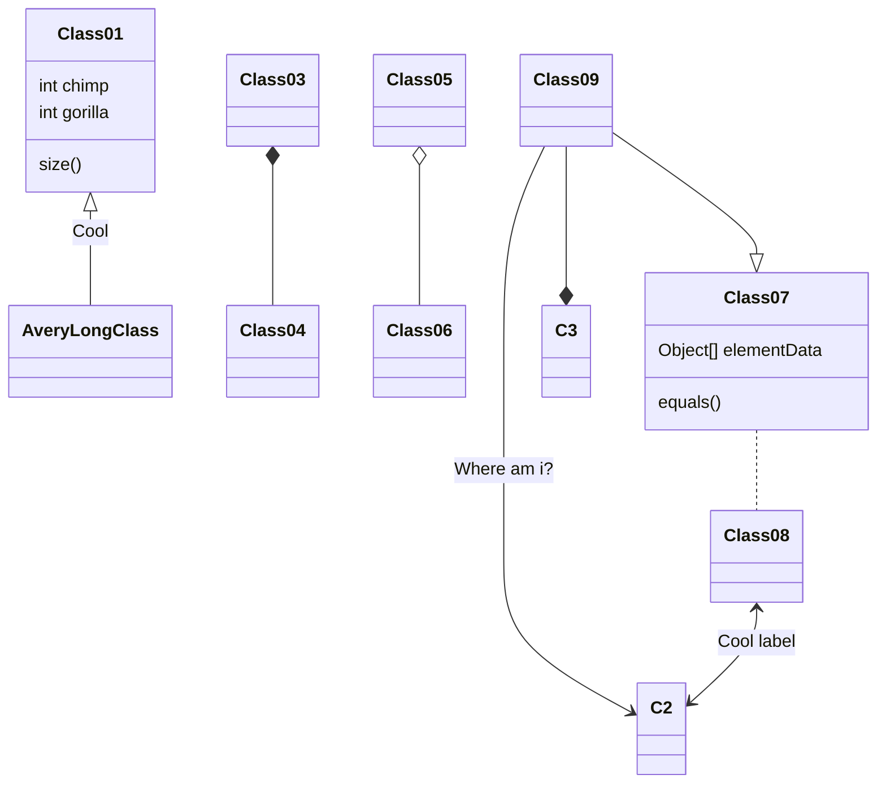
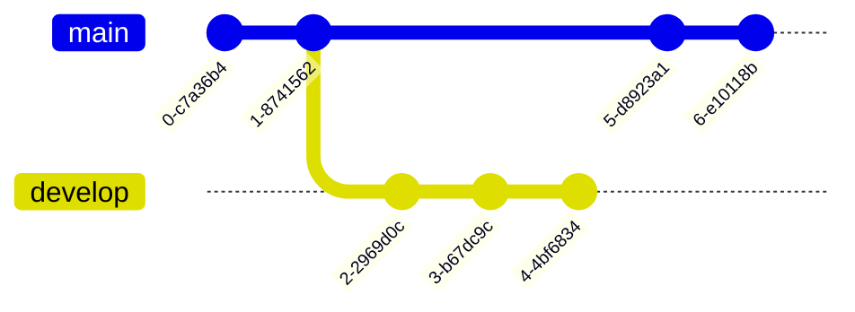
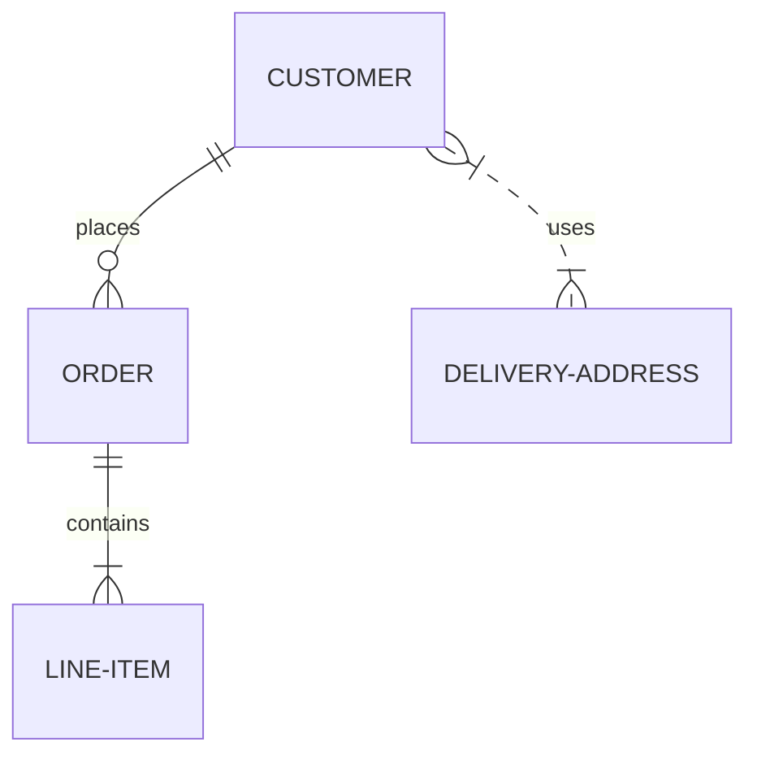
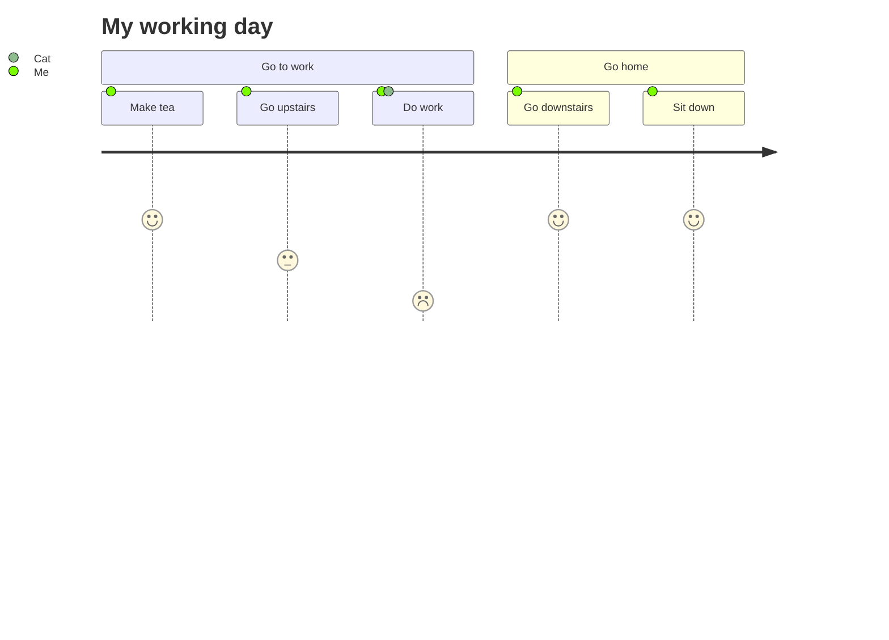

[<- До підрозділу](README.md)		[Коментувати](#feedback)

# Створення документації на основі MarkDown: теоретична частина

## 1. Про текстові документи

Текстовий документ виконує не лише роль носія інформації, а й задає її структуру та спосіб подання. Базовою функцією є підтримка звичайного тексту з переносами рядків і абзацами, поверх яких накладаються засоби форматування. Форматування тексту дає змогу виділяти фрагменти, змінювати стиль символів і абзаців, акцентувати увагу на окремих елементах, але при цьому не змінює саму логіку документа.

Наступним рівнем є структурні елементи. Заголовки різних рівнів формують ієрархію розділів і підрозділів, а відступи та вкладеність дозволяють відображати логічні зв’язки між частинами тексту. Списки, як маркеровані, так і нумеровані, використовуються для подання послідовностей, переліків і вкладених структур, які важко коректно передати суцільним текстом.

Окремі функції текстових документів пов’язані зі спеціалізованими блоками. Цитати, фрагменти коду та попередньо форматований текст потребують фіксованого подання і відокремлення від основного тексту. Таблиці застосовуються для структурованого представлення даних, а гіперпосилання та внутрішні якорі забезпечують навігацію і перехресні зв’язки всередині документа та з зовнішніми ресурсами.

Документ також може містити зображення і рисунки з підписами, службові секції, коментарі та метадані, що описують сам файл. Разом ці можливості перетворюють текстовий документ на формалізований об’єкт, придатний не лише для читання, а й для аналізу, обробки та повторного використання.

На практиці користувачі часто не дотримуються логічного структурування документа. Форматування застосовується не як інструмент відображення структури, а як спосіб "підправити вигляд" тексту: заголовки імітуються жирним шрифтом, відступи створюються пробілами, а візуальна симетрія ставиться вище за семантику. У результаті документ виглядає охайно, але його внутрішня структура залишається нечіткою або втраченою, що ускладнює подальшу роботу з ним. 

На рис.1 показаний зовнішній вигляд фрагменту текстового документу в редакторі LibreOffice. У навігаторі чітко видно структуру документу, що свідчить про використання правильного структурування документу та форматування з використанням стилів. Однак зовнішнє відображення можна б було досягнути і прямим форматуванням, що ускладнює подальшу навігацію документу та його редагування.    



рис.1. Приклад вигляду текстового документу формату docx у редакторі LibreOffice. 

Щоб наведені вище функції текстового документа могли бути реалізовані на практиці, необхідно визначитися не лише з інструментом редагування, а насамперед з форматом файлу, який здатен ці функції коректно і однозначно підтримувати. 

Формати файлів документів історично виникали як відповідь на конкретні потреби зберігання і відтворення тексту. Перші масові формати були тісно пов’язані з конкретними програмами і апаратними платформами. Класичні формати Word типу `doc` з’явилися як внутрішні робочі формати текстових процесорів і довгий час залишалися фактично закритими, орієнтованими на візуальне редагування, а не на прозору структуру даних. 



рис.2. Приклад збереження файлів в різному форматі 

З розвитком офісних пакетів з’явилися формати нового покоління, зокрема DOCX та ODT, які технічно базуються на XML і є контейнерами з окремими файлами. Це дозволило формалізувати внутрішню структуру документа, але водночас ускладнило його сприйняття як текстового об’єкта. Для користувача такий файл і далі виглядає як монолітний документ, хоча всередині містить складну ієрархію стилів, елементів і метаданих. 

Можна подивитися зміст цих документів, змінивши його розширення на `.zip` і відкривши програмою архіватором. На рис.3 показаний приклад вигляду папки розархівованого файлу docx. Він містить багато файлів з розширенням  `.xml`, які задають зміст а також інші ресурсні файли, наприклад рисунки. Звісно, ця інформація потрібна текстовим процесорам (редакторам), для користувача робота з цими файлами є прихованою.  


рис.3. Структура документу docx.

Паралельно існували і простіші формати, такі як TXT або RTF, які робили акцент на текстовості і мінімальному форматуванні. Вони були зручні для обміну і читання, але обмежені з точки зору структури і сучасних вимог до документування. HTML зайняв окрему нішу як формат публікації, де структура і посилання стали ключовими, але редагування безпосередньо в такому форматі залишалося незручним для більшості користувачів.

Формати типу docx створювалися насамперед для інтерактивного редагування у візуальному редакторі, а не для прозорого зберігання структури документа. У таких форматах структура, стилі і візуальне оформлення тісно переплетені, що ускладнює аналіз, автоматичну обробку і контроль змін. Контейнерна XML-природа файлу робить його непридатним для безпосередньої роботи як з текстом, зокрема для diff, версіонування і повторного використання фрагментів. У результаті документ зручний для перегляду, але погано масштабується як інженерний або навчальний артефакт.

## 2. Про MarkDown (MD) 

При необхідності відображення тексту у форматованому вигляді не обов'язково користуватися спеціальними форматами, наприклад DOCX. Альтернативою цьому є більш проста мова форматування Markdown, яка дозволяє відображати форматовані тексти на сторінках та використовувати мультикористувацькі функції. Крім того,  Markdown використовується в багатьох інструментах, наприклад GitHub для відображення текстового змісту репозиторіїв, або Node-RED для представлення всього текстового наповнення в файлі потоку.    

**Markdown** (створена John Gruber’s)  — полегшена [мова розмітки даних](https://uk.wikipedia.org/wiki/Мова_розмітки_даних), яку створено як для можливості читання людиною (навіть з форматуванням) так і  для публікації з подальшим перетворенням її на представлення в XHTML або HTML. Нижче наведений опис, який не є вичерпним переліком синтаксису Markdown. У багатьох  випадках можуть використовуватися додаткові елементи синтаксису, які відрізняються від використовуваного переглядача. Опис доступний також на сайті <https://www.markdownguide.org/> 

Кожен застосунок реалізує дещо іншу версію Markdown (надалі будемо також вживати **MD**). Ці варіанти Markdown зазвичай називають **ароматами(Flavors)**, це варто сприймати аналогічно як діалекти в мовах. У цій лекції наведені основні (базові) функції MD та деякі розширені, які доступні для багатьох застосунків.

Тексти Markdown зберігаються у текстовому файлі з розширенням `.md` або ` .markdown`.  Формувати тексти з форматуванням можна у звичайному редакторі, так як для позначення форматування використовуються звичайні символи, наприклад `#`, `*`, `-` тощо. Наприклад, текст виділений з обох боків символом `*` позначений як *курсив*  - `*цей текст позначено як курсивний*`. Однак для відображення цих текстових файлів у форматованому вигляді необхідний відповідний застосунок Markdown.  Доступно багато програм, які можуть це робити - від простих скриптів чи плагінів редакторів до окремих застосунків чи сервісів, схожих на Microsoft Word чи Google Docs. Незважаючи на візуальні відмінності, усі програми роблять одне і те саме - перетворюють текст у форматі Markdown у формат HTML, для того, щоб він міг відображатися у веб-браузерах. Для цих цілей застосунки Markdown використовують ***Markdown-обробники***  (їх також називають «парсерами» ). Є також онлайн сервіси, які можуть зробити це при введенні, наприклад https://dillinger.io/.


рис.4. Принцип роботи застосунків Markdown.

Для кращого розуміння MarkDown рекомендується пройти [Створення документації на основі MarkDown: практична частина](lab.md)

## 3. Області використання MarkDown

Markdown може використовуватися для різних цілей: створення сторінок для сайтів, створення документів, нотаток, книг, презентацій, повідомлення на пошту, та технічної документації. Нижче коротко наведені кілька найбільш популярних варіантів використання.

1) Ця лекція, як і всі матеріали даного посібника створені на MarkDown і публікуються на сервісі GitHub. GitHub так само як і GitLab використовує MarkDown як основний формат для текстового опису та документації. Він застосовується для файлів README (основний опис папки), документації в репозиторіях, оформлення описів проєктів, повідомлень про помилки та обговорень (issue).Також Markdown використовується у коментарях, запитах на злиття змін та внутрішніх вікі-сховищ, забезпечуючи уніфікований спосіб подання структурованого тексту. Про GitHub є окремий розділ в посібнику[Робота з віддаленими сховищами в Git/GitHub](../../vercontrol/github/README.md).

2. Markdown був розроблений для Інтернету, тому не дивно, що існує багато застосунків, спеціально розроблених для створення контенту веб-сайту на ньому. Тобто можна просто створювати MD-документи та публікувати їх як HTML файли. Зокрема є сервіси [blot.im](https://blot.im) та [smallvictori.es](https://smallvictori.es). Після реєстрації в одній із цих служб вони створюють папку Dropbox на комп’ютері. Для відображення змісту на ВебСайті необхідні файли Markdown просто копіюються у потрібну папку. Інший варіант - це утиліта [Jekyll](https://www.markdownguide.org/tools/jekyll/), яка є популярним генератором статичних сайтів, що приймає файли Markdown на вході та створює веб-сайт HTML. На базі нього працює сервіс [GitHub Pages](https://www.markdownguide.org/tools/github-pages/) який забезпечує безкоштовний хостинг для веб-сайтів, створених [Jekyll](https://www.markdownguide.org/tools/jekyll/) на github.io. Даний посібник також генерується і публікується на GitHub Pages, автоматично при зміні контенту. Тому Ви можете його читати як у вигляді MarkDown файлів перейшовши на [репозиторій GitHub](https://github.com/asu-in-ua/atpv) або перейти на HTML-версію сформованого сайту [за посиланням](https://asu-in-ua.github.io/atpv/). Це дуже зручно, так як достатньо створювати текстовий контент, який автоматично перетворюється в HTML-версію. 
3. У Markdown немає всіх можливостей текстових процесорів, таких як Microsoft Word, але він досить добре підходить для створення основних документів, таких як завдання, листи, конспекти, тощо, для яких важливий зміст з мінімальним форматуванням. Можна використовувати спеціальний застосунок для створення документів Markdown, експорту документів з формату Markdown у PDF, HTML чи DOCX, з якими далі можна робити будь які доступні для них операції. У цьому випадку документ в форматі MD можна вважати єдиним джерелом істини, і усі інші документи - їх відображенням у потрібному форматі. 
4. MD може використовуватися як типовий формат представлення супровідної документації в різних інструментах. Вже згадувалося про GitHub, де різні сервіси використовують MD в якості стандартної мови форматування. Варто згадати про Node-RED, в якому вся документальна начинка (допомога, примітки, коментарі) формується на MD. Також різноманітні сервіси AI GPT можуть формувати необхідний контент в форматі MD, що спрощує генерування форматованого тексту.   
5. MD можна використовувати для створення електронних книг. Для цього можна скористатися спеціальними сервісами, наприклад [Leanpub](https://leanpub.com/), який приймає вихідні файли у форматі Markdown, і видає книгу у форматі файлів PDF, EPUB та MOBI. Щоб дізнатися більше про написання та самостійне видання книги за допомогою Markdown, прочитайте [цю публікацію в блозі](https://medium.com/techspiration-ideas-making-it-happen/how-i-wrote-and-publisher-my -novel-using-only-open-source-tools-5cdfbd7c00ca).
6. Markdown - може використовуватися для ведення технічної документації. По факту це те саме що описано в п.1-2, однак з іншої точки зору. Якщо сприймати технічну документацію як код, то Markdown гарний спосіб викладення текстової обгортки такого коду.  

## 4. Редактори

Хоча Markdown є полегшеною мовою розмітки яку легко читати та редагувати звичайними текстовими редакторами, існують спеціально розроблені  редактори, які дозволяють попередньо переглядати зі стилями. Є багато таких редакторів, які наявні для всіх основних платформ. Існують плаґіни підсвітки синтаксису для Markdown, вбудовані у відомі редактори [Notepad++](https://notepad-plus-plus.org/), gedit, Vim та інші. Середовище Visual Studio Code має кілька плагінів для роботи з MD. Таким чином кожен може вибрати собі редактор, який буде йому зручний. 

Деякі з редакторів:

- Mac: [MacDown](https://www.markdownguide.org/tools/macdown/), [iA Writer](https://www.markdownguide.org/tools/ia-writer/), або[Marked](https://marked2app.com/)

  iOS / Android: [iA Writer](https://www.markdownguide.org/tools/ia-writer/)

- Windows: [ghostwriter](https://wereturtle.github.io/ghostwriter/) або [Markdown Monster](https://markdownmonster.west-wind.com/), https://v2.docusaurus.io/

- Linux: [ReText](https://github.com/retext-project/retext) або [ghostwriter](https://wereturtle.github.io/ghostwriter/)

- Web: [Dillinger](https://www.markdownguide.org/tools/dillinger/) або [StackEdit](https://www.markdownguide.org/tools/stackedit/)

Автору даної лекції найбільше подобається [Typora](https://typora.io/)  - редактор Markdown, що працює за принципом *Live Preview*, тобто після введення редагування тексту, він одразу показує результат. Підтримує багато мов локалізації, у тому числі українську. Завантажується [за посиланням](https://typora.io/#download). Це платний редактор, однак за дуже демократичну ціну (15 USD), має пробну версію. Typora використовує аромат Markdown сумісний з GitHub. 



рис.5. Зовнішній вигляд редактору Typora

## 5. Базовий синтаксис MarkDown (MD) 

Опис базового синтаксису наведений [за посиланням](https://www.markdownguide.org/basic-syntax/), тут тільки скорочена версія. Для перевірки роботи наведених прикладів, просто вставляйте текст за посиланням https://dillinger.io/

### Екранування

Для форматування в MD використовуються спеціалізовані літери. Для того щоб ці літери, які Markdown однозначно визначає як команди форматування, могли бути відображені як звичайні, вони можуть бути екрановані зворотною косою лінією. Наприклад, вище було сказано що символ `*` є спеціальним, який використовується для означення курсиву, однак вираз `\*` виведе саме зірочку (\*).

Також Markdown не перетворює текст із «сирим» [XHTML](https://uk.wikipedia.org/wiki/XHTML)-елементом блокового рівня. Це дозволяє включати секції XHTML у джерело Markdown  документа, обернувши їх в XHTML теги блокового рівня.

### Заголовки

HTML-заголовки створюються розміщенням тої кількості "решіток" перед текстом заголовка, що  відповідає бажаному рівню (HTML підтримує 6 рівнів заголовків),  наприклад:

```markdown
 # це заголовок першого рівня
 #### це заголовок четвертого рівня
```

Це матиме наступний вигляд:


Перші два рівні заголовків також мають альтернативний синтаксис:

```markdown
Заголовок першого рівня
=======================

Заголовок другого рівня
-----------------------
```

### Параграфи

Параграф є одним чи декількома послідовними рядками тексту, які розділяються  одним чи декількома порожніми рядками. Звичайні параграфи не повинні  мати відступи або табуляцію:

```markdown
Це параграф. Він містить два речення.

Це інший параграф. Він також містить два речення.
```

### Списки

Списки починаються з `* `,  `+ `, або  `- `. Кожен підпункт виділяється чотирма пробілами.

Нумеровані списки починаються з цифри, після якої йде крапка `.` або дужка `)`.  

```markdown
 * Пункт в маркованому (ненумерованому) списку
     * Підпункт, відділений 4 пробілами
         * підпункт третього рівня, виділений 4 пробілами
 * Інший пункт в маркованому списку

 1. Пункт в нумерованому списку
     1.1. Підпункт, відділений 4 пробілами
 2. Інший пункт в нумерованому списку
```

Це матиме наступний вигляд


### Формат тексту

Як вже зазначалося для формування тексту використовуються `*`. Альтернативним символом є `_`. Має значення кількість зірочок, 1 - *курсив*, 2 - **напівжирний**, 3 - ***напівжирний курсив***. 

```markdown
 *emphasis* або _emphasis_ (тобто нахил)

 **сильне виділення** або __сильне виділення__ (тобто напівжирний)
 
 ***виділення з курсивом***
```

```markdown
це ~~закреслений текст~~
```

### Код

Форматування шматка коду має особливе значення. По-перше, в коді часто використовуються текстові фрагменти, які сприймаються як службові символи форматування, або які заборонені в MD. По-друге, шматки коду візуально варто виділити, і навіть підсвітити синтаксис. Для включення коду (відформатованого), ви можете або оточити вбудований код зворотніми лапками (\`), наприклад, \`деякий код\`, або відділити декілька рядків коду щонайменше чотирма пробілами, як тут: 

```markdown
    перший рядок коду
    другий рядок коду
    третій рядок коду
```

Останній варіант за допомогою пробілів дозволяє зберігати і показувати синтаксис Markdown. Нижче ми розглянемо та

### Огороджені блоки коду (розширений синтаксис) 

Основний синтаксис Markdown дозволяє створити кодові блоки шляхом відступу рядків на чотири пробіли або одну вкладку. Однак це може бути незручно у багатьох випадках. До розширеного синтаксису (підтримується не всіма ароматами MD) входять огороджені кодові блоки. Залежно від процесора або редактора Markdown, можна використовувати три зворотні одинарні лапки ```` `або три тильди (` ~~~ `) на рядках до і після кодового блоку. Не потрібно відступати жодних рядків!

````
```
{
  "firstName": "John",
  "lastName": "Smith",
  "age": 25
}
```
````

Зрештою, це матиме наступний вигляд:

```
{
  "firstName": "John",
  "lastName": "Smith",
  "age": 25
}
```

Багато процесорів Markdown для огороджених блоків коду підтримують підсвічування синтаксису . Ця функція дозволяє додавати кольорове підсвічування для будь-якої мови, на якій був написаний код. Щоб додати підсвічування синтаксису, необхідно вказати мову одразу за позначками початку кодового блоку. Наступний шматок тексту

````
```json
{
  "firstName": "John",
  "lastName": "Smith",
  "age": 25
}
```
````

матиме такий вигляд з підсвіткою синтаксису:

```json
{
  "firstName": "John",
  "lastName": "Smith",
  "age": 25
}
```

### Кінець рядку

Якщо необхідно вставити закінчення рядка Markdown (символ `<BR>` в HTML), треба в кінці рядку вставити щонайменше два пробіли після чого ввести Enter. Наприклад:

```markdown
 def show_results space space  
 end
```

дасть результат:

def show_results  

end 

Варто зауважити, що деякі MD застосунки можуть сприймати `<BR>` і без наявності 2-х пробілів.

### Цитати

Цитати позначаються символом `>`

```markdown
 > Весь цей абзац тексту буде поміщений у HTML blockquote елемент.
 Blockquote елементи змінюються в залежності від потреби/пристрою виводу.
 Ви можете обернути довільний текст за власним смаком, та воно перетвориться
 на єдиний blockquote елемент.
```

Приклад вище перетвориться на такий HTML:

```html
<blockquote><p>Весь цей абзац тексту буде поміщений у HTML blockquote елемент.
 Blockquote елементи змінюються в залежності від потреби/пристрою виводу.
 Ви можете обернути довільний текст за власним смаком, та воно перетвориться
 на єдиний blockquote елемент.</p></blockquote>
```

І виглядатиме так:

 > Весь цей абзац тексту буде поміщений у HTML blockquote елемент.
 >  Blockquote елементи змінюються в залежності від потреби/пристрою виводу.
 >  Ви можете обернути довільний текст за власним смаком, та воно перетвориться
 >  на єдиний blockquote елемент.

Якщо необхідно цитату зробити в кілька рядків, кожен рядок починається з символу `>` Вкладеність цитат досягається подвійним символом  `>>`

### Зовнішні посилання

Посилання можуть бути вбудованими:

```markdown
[текст посилання](адреса посилання)
```

Наприклад: `[Markdown](http://en.wikipedia.com/wiki/Markdown)` матиме вигляд

[Markdown](http://en.wikipedia.com/wiki/Markdown)

Також посилання можуть бути розміщені у примітках поза параграфом. Наприклад, наступний формат тексту

```markdown
[текст посилання][1]
```

створить посилання, якщо додати примітку (як показано нижче) поза параграфом, або в кінці документу:

```markdown
 [1]: http://en.wikipedia.com/wiki/Markdown "Markdown на WiKi"
```

### Зображення

Зображення мають схожий із посиланнями синтаксис, але перед цим ставиться знак оклику. Посилання на зображення можуть бути як абсолютним шляхом так і відносним (відносно розміщення самого документу).  

```markdown

```

або:

```markdown

```

Як і посилання, зображення також можуть мати стиль синтаксису примітки, 

```markdown
![Альтернативний текст][id]
```

з пізнім посиланням в документі, яке визначає URL розміщення зображення.

```markdown
 [id]: url/to/image "Optional title attribute"
```

### Горизонтальні лінії

Горизонтальні лінії задаються розміщенням трьох або більшим дефісів, зірочок, або  підкресленням в рядку самостійно. Можна використовувати пробіли між  дефісами чи зірочками. Кожен з наведених нижче рядків створить  горизонтальну лінію:

```markdown
 * * *
 ***
 *****
 - - -
 ---------------------------------------
```

яка виглядатиме ось так:

---

### HTML

Деякі переглядачі дозволяють використовувати пряме вставлення тегів HTML. Але з точки зору безпеки не усі Markdown  застосунки підтримують HTML в документах Markdown. Деякі ж підтримують тільки деякі з тегів.  Необхідно використовувати пусті лінії для відділення блочних елементів HTML такі як `<div>`, `<table>`, `<pre>`, та `<p>` від їх контенту. 

## 6. Розширений синтаксис

Елементів базового синтаксису, що викладений в оригінальному проектному документі Джона Грубера, може бути недостатньо для деяких функцій. Декілька людей та організацій взяли на себе завдання розширити основний синтаксис, додавши додаткові елементи, такі як таблиці, кодові блоки (вже згадувалися вище), підсвічування синтаксису, автоматичне посилання URL-адрес та виноски. Ці елементи можна ввімкнути за допомогою легкої мови розмітки, що базується на базовому синтаксисі Markdown, або додавши розширення до сумісного процесора Markdown. Слід нагадати, що не всі програми Markdown підтримують розширені елементи синтаксису, а перелік цих елементів залежить від використовуваного Markdown-аромату. 

Існує кілька легких мов розмітки, які є *супер-наборами* у Markdown. Вони включають основний синтаксис Грубера та надбудовують його, додаючи додаткові елементи, такі як таблиці, кодові блоки, підсвічування синтаксису, автоматичне посилання URL-адрес та виноски. Зокрема це:

- [CommonMark](https://commonmark.org)
- [GitHub Flavored Markdown (GFM)](https://github.github.com/gfm/)
- [Markdown Extra](https://michelf.ca/projects/php-markdown/extra/)
- [MultiMarkdown](https://fletcherpenney.net/multimarkdown/)
- [R Markdown](https://rmarkdown.rstudio.com/)

### Таблиці

Щоб додати таблицю, використовуйте три чи більше дефісів (`---`), щоб створити заголовок кожного стовпця, а для розділення кожного стовпця використовуйте труби (` | `). Можна додатково додати труби на будь-якому кінці таблиці.

```markdown
| Syntax      | Description |
| ----------- | ----------- |
| Header      | Title       |
| Paragraph   | Text        |
```

Результат матиме наступний вигляд:

| Syntax    | Description |
| --------- | ----------- |
| Header    | Title       |
| Paragraph | Text        |

Ширина комірок може змінюватися, як показано нижче. Але результат матиме однаковий вигляд.

```markdown
| Syntax | Description |
| --- | ----------- |
| Header | Title |
| Paragraph | Text |
```

Створення таблиць з дефісами та трубами може бути втомливим. Щоб прискорити процес, спробуйте скористатися [Генератором таблиць Markdown](https://www.tablesgenerator.com/markdown_tables). Таблиця створюється за допомогою графічного інтерфейсу, а потім створений текст копіюється у форматі Markdown у свій файл. Крім того редактори можуть мати вбудовані редактори таблиць, аналогічно  як наприклад у MS Word.

Можна вирівнювати текст у стовпцях ліворуч, праворуч або по центру, додавши двокрапку (`:`) зліва, справа або з обох боків дефісів у рядку заголовка.

```
| Syntax      | Description | Test Text     |
| :---        |    :----:   |          ---: |
| Header      | Title       | Here's this   |
| Paragraph   | Text        | And more      |
```

Це матиме наступний вигляд:

| Syntax    | Description |   Test Text |
| :-------- | :---------: | ----------: |
| Header    |    Title    | Here’s this |
| Paragraph |    Text     |    And more |

Можна відформатувати текст у таблицях. Наприклад, можна додати посилання, код, і форматування. Але ви не можете додавати заголовки, блоки цитат, списки, горизонтальні правила, зображення чи теги HTML.

### Виноски

Виноски дозволяють додавати примітки та посилання, не захаращуючи тіло документа. Коли створюється виноска, з'являється надрядковий номер з посиланням на виноску. Читачі можуть натиснути посилання, щоб перейти до вмісту виноски внизу сторінки. Щоб створити посилання на виноску, додайте каретку та ідентифікатор всередині дужок (`[^1]`). Ідентифікатори можуть бути числами або словами, але вони не можуть містити пробілів чи вкладок. Ідентифікатори лише співвідносять посилання виноски із самою виноскою - у висновку виноски нумеруються послідовно.

Додайте виноску, використовуючи іншу каретку та цифру всередині дужок із двокрапкою та текстом (`[^1]: My footnote.`). Не потрібно ставити виноски в кінці документа. Ви можете розмістити їх куди завгодно, крім інших елементів, таких як списки, блокові лапки та таблиці.

```
Here's a simple footnote,[^1] and here's a longer one.[^bignote]  
[^1]: This is the first footnote.
[^bignote]: Here's one with multiple paragraphs and code.
    Indent paragraphs to include them in the footnote.
    `{ my code }`
    Add as many paragraphs as you like.
```

Це матиме вигляд:


### Ідентифікатори заголовків (Heading ID)

Багато процесорів Markdown підтримують власні ідентифікатори для заголовків - деякі процесори Markdown автоматично додають їх. Додавання спеціальних ідентифікаторів дозволяє безпосередньо посилатися на заголовки та змінювати їх за допомогою CSS. Щоб додати спеціальний ідентифікатор заголовка, додайте його до фігурних фігурних дужок у тому ж рядку, що й заголовка.

```
#### My Great Heading {#custom-id}
```

HTML матиме наступний вигляд:

```html
<h3 id="custom-id">My Great Heading</h3>
```

Ви можете зв’язати заголовки зі спеціальними ідентифікаторами у файлі, створивши стандартне посилання зі знаком цифри (`#`), за яким слідує ідентифікатор заголовку.

| Markdown                      | HTML                           | Вигляд                                                       |
| ----------------------------- | ------------------------------ | ------------------------------------------------------------ |
| `[Heading IDs](#heading-ids)` | ` [Heading IDs](#heading-ids)` | [Heading IDs](https://www.markdownguide.org/extended-syntax/#heading-ids) |

Інші веб-сайти можуть посилатися на заголовок, додавши спеціальний ідентифікатор заголовка до повної URL-адреси веб-сторінки (наприклад,

`[Heading IDs](https://www.markdownguide.org/extended-syntax#heading-ids)`.

### Списки означень

Деякі процесори Markdown дозволяють створювати *списки означень* термінів та їх відповідні означення. Щоб створити список означень, введіть термін у перший рядок. У наступному рядку введіть двокрапку, а потім пробіл та означення.

```markdown
First Term
: This is the definition of the first term.

Second Term
: This is one definition of the second term.
: This is another definition of the second term.
```

HTML матиме вигляд:

```html
<dl>
  <dt>First Term</dt>
  <dd>This is the definition of the first term.</dd>
  <dt>Second Term</dt>
  <dd>This is one definition of the second term. </dd>
  <dd>This is another definition of the second term.</dd>
</dl>
```

У переглядачі це матиме вигляд:


### Список завдань 

Списки завдань дозволяють створити список елементів за допомогою прапорців. У додатках Markdown, що підтримують списки завдань, поруч із вмістом відображатимуться прапорці. Щоб створити список завдань, перед пунктами списку завдань додайте тире (`-`) і дужки з пробілом (` [ ] `). Щоб встановити прапорець, додайте між дужками "x" (`[x]`).

```
- [x] Write the press release
- [ ] Update the website
- [ ] Contact the media
```

Це матиме вигляд:

- [x] Write the press release
- [ ] Update the website
- [ ] Contact the media


### Емоджі (смайли)

Є два способи додати смайли до файлів Markdown: скопіювати та вставити смайли у текст, відформатований Markdown, або ввести *короткий код емоджі*. У більшості випадків ви можете просто скопіювати емоджі з такого джерела, як [Emojipedia](https://emojipedia.org/), і вставити його у свій документ. Багато застосунків Markdown автоматично відображатимуть емоджі у тексті, відформатованому Markdown. Файли HTML та PDF, які ви експортуєте зі своєї програми Markdown, також повинні відображати емоджі.

Деякі програми Markdown дозволяють вставляти смайли, вводячи короткі коди смайлів. Вони починаються і закінчуються двокрапкою і включають назву емоджі.

```markdown
Gone camping! :tent: Be back soon.
That is so funny! :joy:
```

Матиме вигляд:

Gone camping! ⛺ Be back soon.

That is so funny! 😂

Ви можете використовувати цей [список коротких кодів емоджі](https://gist.github.com/rxaviers/7360908), але майте на увазі, що короткі коди емоджі відрізняються для різних застосунків. 

### Автоматичне зв'язування URL 

Багато процесорів Markdown автоматично перетворюють URL-адреси в посилання. Це означає, що якщо ви введете `http://www.example.com`, ваш процесор Markdown автоматично перетворить його на посилання, навіть якщо ви не використали спеціальні дужки. Якщо ви не хочете, щоб URL-адресу було автоматично пов’язано, можна позначаючи URL-адресу як код за допомогою зворотних лапок.

```
`http://www.example.com`
```

## 7. LaTeX/Mathematics

У Markdown можна використовувати формули в форматі LaTeX. Для цього формула пишеться в блоці математики, що позначається виділенням з двох боків позначенням `$$`. 

Підтримуються також грецькі літери, для спрощення їх введення можна скористатися детектором літер з переведення в LaTeX http://detexify.kirelabs.org/. 

Нижче наводяться приклади, з оригінальним текстом та відображенням в LaTeX.  Цей розділ варто сприймати як коротку довідку, у цьому випадку самі приклади є більш інформативними ніж їх пояснення.

`\cos (2\theta) = \cos^2 \theta - \sin^2 \theta` -> $\cos (2\theta) = \cos^2 \theta - \sin^2 \theta$

`\lim\limits_{x \to \infty} \exp(-x) = 0` -> $\lim\limits_{x \to \infty} \exp(-x) = 0$

`k_{n+1} = n^2 + k_n^2 - k_{n-1}` -> $k_{n+1} = n^2 + k_n^2 - k_{n-1}$

`n^{22}` -> $n^{22}$

`f(n) = n^5 + 4n^2 + 2 |_{n=17}` -> $f(n) = n^5 + 4n^2 + 2 \|_{n=17}$

`\frac{n!}{k!(n-k)!} = \binom{n}{k}` -> $\frac{n!}{k!(n-k)!} = \binom{n}{k}$

`\frac{\frac{1}{x}+\frac{1}{y}}{y-z}` -> $\frac{\frac{1}{x}+\frac{1}{y}}{y-z}$

`^3/_7` -> $^3/_7$

```
\begin{equation}
  x = a_0 + \cfrac{1}{a_1 
          + \cfrac{1}{a_2 
          + \cfrac{1}{a_3 + \cfrac{1}{a_4} } } }
\end{equation}
```

$$
\begin{equation}
  x = a_0 + \cfrac{1}{a_1 
          + \cfrac{1}{a_2 
          + \cfrac{1}{a_3 + \cfrac{1}{a_4} } } }
\end{equation}
$$

```
\begin{equation}
\frac{
    \begin{array}[b]{r}
      \left( x_1 x_2 \right)\\
      \times \left( x'_1 x'_2 \right)
    \end{array}
  }{
    \left( y_1y_2y_3y_4 \right)
  }
\end{equation}
```

$$
\begin{equation}
\frac{
    \begin{array}[b]{r}
      \left( x_1 x_2 \right)\\
      \times \left( x'_1 x'_2 \right)
    \end{array}
  }{
    \left( y_1y_2y_3y_4 \right)
  }
\end{equation}
$$

`\sqrt{\frac{a}{b}}` -> $\sqrt{\frac{a}{b}}$

`\sqrt[n]{1+x+x^2+x^3+\dots+x^n}` -> $\sqrt[n]{1+x+x^2+x^3+\dots+x^n}$

`\sum_{i=1}^{10} t_i` -> $\sum_{i=1}^{10} t_i$

`\displaystyle\sum_{i=1}^{10} t_i` -> $\displaystyle\sum_{i=1}^{10} t_i$

`\int_0^\infty \mathrm{e}^{-x}\,\mathrm{d}x` ->$\int_0^\infty \mathrm{e}^{-x}\,\mathrm{d}x$

`\sum` -> $\sum$ `\prod` -> $\prod$ `\coprod` -> $\coprod$ `\bigoplus` -> $\bigoplus$ `\bigotimes` -> $\bigotimes$ `\bigcup` -> $\bigcup$ `\bigcap` -> $\bigcap$ `\bigvee` -> $\bigvee$ `\bigwedge` -> $\bigwedge$ `\bigsqcup` -> $\bigsqcup$ `\int` -> $\int$ `\iint` -> $\iint$ `\iiint` -> $\iiint$

`\iiiint` -> $\iiiint$ `\idotsint` -> $\idotsint$ `\oint` -> $\oint$ `\bigodot` -> $\bigodot$ `\biguplus` -> $\biguplus$

```
\sum_{\substack{
   0<i<m \\
   0<j<n
  }} 
 P(i,j)
```

$$
\sum_{\substack{
   0<i<m \\
   0<j<n
  }} 
 P(i,j)
$$

`\int\limits_a^b` -> $\int\limits_a^b$

```
( a ), [ b ], \{ c \}, | d |, \| e \|,
\langle f \rangle, \lfloor g \rfloor,
\lceil h \rceil, \ulcorner i \urcorner,
/ j \backslash
```

$$
( a ), [ b ], \{ c \}, | d |, \| e \|,
\langle f \rangle, \lfloor g \rfloor,
\lceil h \rceil, \ulcorner i \urcorner,
/ j \backslash
$$

`\left(\frac{x^2}{y^3}\right)` -> $\left(\frac{x^2}{y^3}\right)$

`P\left(A=2\middle|\frac{A^2}{B}>4\right)` -> $P\left(A=2\middle\|\frac{A^2}{B}>4\right)$

`\left\{\frac{x^2}{y^3}\right\}` -> $\left\\{\frac\{x^2\}\{y^3\}\right\\}$

`\left.\frac{x^3}{3}\right|_0^1` -> $\left.\frac{x^3}{3}\right\|_0^1$

`( \big( \Big( \bigg( \Bigg(` -> $( \big( \Big( \bigg( \Bigg($

`\frac{\mathrm d}{\mathrm d x} \left( k g(x) \right)` -> $\frac{\mathrm d}{\mathrm d x} \left( k g(x) \right)$

`\frac{\mathrm d}{\mathrm d x} \big( k g(x) \big)`-> $\frac{\mathrm d}{\mathrm d x} \big( k g(x) \big)$

```
\begin{matrix}
  a & b & c \\
  d & e & f \\
  g & h & i
 \end{matrix}
```

$$
\begin{matrix}
  a & b & c \\
  d & e & f \\
  g & h & i
 \end{matrix}
$$

```
A_{m,n} = 
 \begin{pmatrix}
  a_{1,1} & a_{1,2} & \cdots & a_{1,n} \\
  a_{2,1} & a_{2,2} & \cdots & a_{2,n} \\
  \vdots  & \vdots  & \ddots & \vdots  \\
  a_{m,1} & a_{m,2} & \cdots & a_{m,n} 
 \end{pmatrix}
```

$$
A_{m,n} = 
 \begin{pmatrix}
  a_{1,1} & a_{1,2} & \cdots & a_{1,n} \\
  a_{2,1} & a_{2,2} & \cdots & a_{2,n} \\
  \vdots  & \vdots  & \ddots & \vdots  \\
  a_{m,1} & a_{m,2} & \cdots & a_{m,n} 
 \end{pmatrix}
$$

```
\begin{array}{c|c}
  1 & 2 \\ 
  \hline
  3 & 4
 \end{array}
```

$$
\begin{array}{c|c}
  1 & 2 \\ 
  \hline
  3 & 4
 \end{array}
$$

```
M = \begin{bmatrix}
       \frac{5}{6} & \frac{1}{6} & 0           \\[0.3em]
       \frac{5}{6} & 0           & \frac{1}{6} \\[0.3em]
       0           & \frac{5}{6} & \frac{1}{6}
     \end{bmatrix}
```

$$
M = \begin{bmatrix}
       \frac{5}{6} & \frac{1}{6} & 0           \\[0.3em]
       \frac{5}{6} & 0           & \frac{1}{6} \\[0.3em]
       0           & \frac{5}{6} & \frac{1}{6}
     \end{bmatrix}
$$

```
50 \text{ apples} \times 100 \text{ apples}
 = \text{lots of apples}^2
```

$$
50 \text{ apples} \times 100 \text{ apples}
 = \text{lots of apples}^2
$$

```
50 \textrm{ apples} \times 100
 \textbf{ apples} = \textit{lots of apples}^2
```

$$
50 \textrm{ apples} \times 100
 \textbf{ apples} = \textit{lots of apples}^2
$$

```
\boldsymbol{\beta} = (\beta_1,\beta_2,\dotsc,\beta_n)
```

$$
\boldsymbol{\beta} = (\beta_1,\beta_2,\dotsc,\beta_n)
$$

```
k = {\color{red}x} \mathbin{\color{blue}-} 2
```

$$
k = {\color{red}x} \mathbin{\color{blue}-} 2
$$

`\pm` -> $\pm$

`\mp` -> $\mp$

```
f(n) =
  \begin{cases}
    n/2       & \quad \text{if } n \text{ is even}\\
    -(n+1)/2  & \quad \text{if } n \text{ is odd}
  \end{cases}
```

$$
f(n) =
  \begin{cases}
    n/2       & \quad \text{if } n \text{ is even}\\
    -(n+1)/2  & \quad \text{if } n \text{ is odd}
  \end{cases}
$$

`\int y\; \mathrm{d}x` -> $\int y\; \mathrm{d}x$

```
\left(
    \begin{array}{c}
      n \\
      r
    \end{array}
  \right) = \frac{n!}{r!(n-r)!}
```

$$
\left(
    \begin{array}{c}
      n \\
      r
    \end{array}
  \right) = \frac{n!}{r!(n-r)!}
$$

| Code              | Output            | Comment                                    |
| ----------------- | ----------------- | ------------------------------------------ |
| `A_1,A_2,\dotsc,` | $A_1,A_2,\dotsc,$ | for "dots with commas"                     |
| `A_1+\dotsb+A_N`  | $A_1+\dotsb+A_N$  | for "dots with binary operators/relations" |
| `A_1 \dotsm A_N`  | $A_1 \dotsm A_N$  | for "multiplication dots"                  |
| `\int_a^b \dotsi` | $\int_a^b \dotsi$ | for "dots with integrals"                  |
| `A_1\dotso A_N`   | $A_1\dotso A_N$   | for "other dots" (none of the above)       |

| Symbol        | Script        |      | Symbol        | Script        |      | Symbol    | Script    |
| ------------- | ------------- | ---- | ------------- | ------------- | ---- | --------- | --------- |
| $<$           | `<`           |      | $>$           | `>`           |      | $=$       | `=`       |
| $\leq$        | `\leq`        |      | $\geq$        | `\geq`        |      | $\doteq$  | `\doteq`  |
| $\ll$         | `\ll`         |      | $\gg$         | `\gg`         |      | $\equiv$  | `\equiv`  |
| $\subset$     | `\subset`     |      | $\supset$     | `\supset`     |      | $\approx$ | `\approx` |
| $\subseteq$   | `\subseteq`   |      | $\supseteq$   | `\supseteq`   |      | $\cong$   | `\cong`   |
| $\nsubseteq$  | `\nsubseteq`  |      | $\nsupseteq$  | `\nsupseteq`  |      | $\simeq$  | `\simeq`  |
| $\sqsubset$   | `\sqsubset`   |      | $\sqsupset$   | `\sqsupset`   |      | $\sim$    | `\sim`    |
| $\sqsubseteq$ | `\sqsubseteq` |      | $\sqsupseteq$ | `\sqsupseteq` |      | $\propto$ | `\propto` |
| $\preceq$     | `\preceq`     |      | $\succeq$     | `\succeq`     |      | $\neq$    | `\neq`    |
| $\therefore$  | `\therefore`  |      | $\because$    | `\because`    |      |           |           |

| Symbol            | Script            |      | Symbol           | Script           |
| ----------------- | ----------------- | ---- | ---------------- | ---------------- |
| $\parallel$       | `\parallel`       |      | $\nparallel$     | `\nparallel`     |
| $\asymp$          | `\asymp`          |      | $\bowtie$        | `\bowtie`        |
| $\vdash$          | `\vdash`          |      | $\dashv$         | `\dashv`         |
| $\in$             | `\in`             |      | $\ni$            | `\ni`            |
| $\smile$          | `\smile`          |      | $\frown$         | `\frown`         |
| $\models$         | `\models`         |      | $\notin$         | `\notin`         |
| $\perp$           | `\perp`           |      | $\mid$           | `\mid`           |
| $\prec$           | `\prec`           |      | $\succ$          | `\succ`          |
| $\sphericalangle$ | `\sphericalangle` |      | $\measuredangle$ | `\measuredangle` |
|                   |                   |      |                  |                  |

| Sym        | Script     |      | Sym      | Script   |      | Sym                | Script             |      | Sym         | Script      |
| ---------- | ---------- | ---- | -------- | -------- | ---- | ------------------ | ------------------ | ---- | ----------- | ----------- |
| $\pm$      | `\pm`      |      | $\cap$   | `\cap`   |      | $\diamond$         | `\diamond`         |      | $\oplus$    | `\oplus`    |
| $\mp$      | `\mp`      |      | $\cup$   | `\cup`   |      | $\bigtriangleup$   | `\bigtriangleup`   |      | $\ominus$   | `\ominus`   |
| $\times$   | `\times`   |      | $\uplus$ | `\uplus` |      | $\bigtriangledown$ | `\bigtriangledown` |      | $\otimes$   | `\otimes`   |
| $\div$     | `\div`     |      | $\sqcap$ | `\sqcap` |      | $\triangleleft$    | `\triangleleft`    |      | $\oslash$   | `\oslash`   |
| $\ast$     | `\ast`     |      | $\sqcup$ | `\sqcup` |      | $\triangleright$   | `\triangleright`   |      | $\odot$     | `\odot`     |
| $\star$    | `\star`    |      | $\vee$   | `\vee`   |      | $\bigcirc$         | `\bigcirc`         |      | $\circ$     | `\circ`     |
| $\dagger$  | `\dagger`  |      | $\wedge$ | `\wedge` |      | $\bullet$          | `\bullet`          |      | $\setminus$ | `\setminus` |
| $\ddagger$ | `\ddagger` |      | $\cdot$  | `\cdot`  |      | $\wr$              | `\wr`              |      | $\amalg$    | `\amalg`    |

| Symbol     | Script     |      | Symbol               | Script                                                       |
| ---------- | ---------- | ---- | -------------------- | ------------------------------------------------------------ |
| $\exists$  | `\exists`  |      | $\to$                | `\rightarrow` or `\to`                                       |
| $\nexists$ | `\nexists` |      | $\gets$              | `\leftarrow` or `\gets`                                      |
| $\forall$  | `\forall`  |      | $\mapsto$            | `\mapsto`                                                    |
| $\neg$     | `\neg`     |      | $\implies$           | `\implies`                                                   |
| $\cap$     | `\cap`     |      |                      |                                                              |
| $\cup$     | `\cup`     |      | $\rightleftharpoons$ | `\rightleftharpoons`                                         |
| $\subset$  | `\subset`  |      | $\impliedby$         | `\impliedby`                                                 |
| $\supset$  | `\supset`  |      | $\implies$           | `\Rightarrow` or `\implies`                                  |
| $\in$      | `\in`      |      | $\leftrightarrow$    | `\leftrightarrow`                                            |
| $\notin$   | `\notin`   |      | $\iff$               | `\iff`                                                       |
| $\ni$      | `\ni`      |      | $\Leftrightarrow$    | `\Leftrightarrow` (preferred for equivalence (iff))          |
| $\land$    | `\land`    |      | $\top$               | `\top`                                                       |
| $\lor$     | `\lor`     |      | $\bot$               | `\bot`                                                       |
| $\angle$   | `\angle`   |      | $\emptyset$          | `\emptyset` and `\varnothing`[[1\]](https://en.wikibooks.org/wiki/LaTeX/Mathematics#endnote_symbolpackage) |

| Sym          | Script                                | Sym          | Script       | Sym       | Script    | Sym       | Script    |
| ------------ | ------------------------------------- | ------------ | ------------ | --------- | --------- | --------- | --------- |
| $\mid$       | `|` or `\mid` (difference in spacing) | $\|$         |              |           |           |           |           |
| $\\{$        | `\{`                                  | $\\}$        | `\}`         | $\langle$ | `\langle` | $\rangle$ | `\rangle` |
| $\uparrow$   | `\uparrow`                            | $\Uparrow$   | `\Uparrow`   | $\lceil$  | `\lceil`  | $\rceil$  | `\rceil`  |
| $\downarrow$ | `\downarrow`                          | $\Downarrow$ | `\Downarrow` | $\lfloor$ | `\lfloor` | $\rfloor$ | `\rfloor` |

Примітка. Щоб використовувати грецькі літери в LaTeX, які мають такий самий вигляд у латинському алфавіті, просто використовуйте латини: наприклад, `A` замість `Alpha`, `B` замість `Beta` тощо.

| Sym           | Script                             |      | Sym        | Script                             |
| ------------- | ---------------------------------- | ---- | ---------- | ---------------------------------- |
| $\alpha$      | `A` and `\alpha`                   |      | $\nu$      | `N` and `\nu`                      |
| $\beta$       | `B` and `\beta`                    |      | $\xi$      | `\Xi` and `\xi`                    |
| $\gamma$      | `\Gamma` and `\gamma`              |      | $o$        | `O` and `o`                        |
| $\delta$      | `\Delta` and `\delta`              |      | $\pi$      | `\Pi`, `\pi` and `\varpi`          |
| $\varepsilon$ | `E`, `\epsilon` and `\varepsilon`  |      | $\rho$     | `P`, `\rho` and `\varrho`          |
| $\zeta$       | `Z` and `\zeta`                    |      | $\sigma$   | `\Sigma`, `\sigma` and `\varsigma` |
| $\eta$        | `H` and `\eta`                     |      | $\tau$     | `T` and `\tau`                     |
| $\theta$      | `\Theta`, `\theta` and `\vartheta` |      | $\upsilon$ | `\Upsilon` and `\upsilon`          |
| $\iota$       | `I` and `\iota`                    |      | $\phi$     | `\Phi`, `\phi` and `\varphi`       |
| $\kappa$      | `K`, `\kappa` and `\varkappa`      |      | $\chi$     | `X` and `\chi`                     |
| $\lambda$     | `\Lambda` and `\lambda`            |      | $\psi$     | `\Psi` and `\psi`                  |
| $\mu$         | `M` and `\mu`                      |      | $\omega$   | `\Omega` and `\omega`              |

| Sym        | Script     |      | Sym      | Script   |      | Sym   | Script |
| ---------- | ---------- | ---- | -------- | -------- | ---- | ----- | ------ |
| $\partial$ | `\partial` |      | $\imath$ | `\imath` |      | $\Re$ | `\Re`  |
| $\eth$     | `\eth`     |      | $\jmath$ | `\jmath` |      | $\Im$ | `\Im`  |
| $\hbar$    | `\hbar`    |      | $\ell$   | `\ell`   |      | $\wp$ | `\wp`  |

| Sym      | Script   |      | Sym      | Script   |
| -------- | -------- | ---- | -------- | -------- |
| $\nabla$ | `\nabla` |      | $\aleph$ | `\aleph` |
| $\Box$   | `\Box`   |      | $\beth$  | `\beth`  |
| $\infty$ | `\infty` |      | $\gimel$ | `\gimel` |

| Sym    | Script |      | Sym       | Script    |      | Sym     | Script  |      | Sym    | Script |
| ------ | ------ | ---- | --------- | --------- | ---- | ------- | ------- | ---- | ------ | ------ |
| $\sin$ | `\sin` |      | $\arcsin$ | `\arcsin` |      | $\sinh$ | `\sinh` |      | $\sec$ | `\sec` |
| $\cos$ | `\cos` |      | $\arccos$ | `\arccos` |      | $\cosh$ | `\cosh` |      | $\csc$ | `\csc` |
| $\tan$ | `\tan` |      | $\arctan$ | `\arctan` |      | $\tanh$ | `\tanh` |      |        |        |
| $\cot$ | `\cot` |      |           |           |      | $\coth$ | `\coth` |      |        |        |

## 8. Створення діаграм з використанням Mermaid

Mermaid — це інструмент для створення схем і діаграм на основі JavaScript, який використовує текстові означення на основі Markdown і засіб візуалізації для створення та зміни складних діаграм. Для того щоб відобразити діаграму в Mermaid використовується блок коду, тобто з обох боків береться в \`\`\`, з позначенням мови `Mermaid`. 

Синтаксис наведений [за посиланням](https://mermaid.js.org/intro/n00b-syntaxReference.html).


Mermaid підтримує кілька типів діаграм. Їх перелік та можливості постійно збільшуються. Mermaid підтримується багатьма редакторами та відображається на GitHub. Нижче наведено тільки кілька прикладів для ілюстрації, детальніше варто познаймитися за посиланнями, які наведені в підрозділах. 

### Flowchart

[Синтаксис](https://mermaid.js.org/syntax/flowchart.html?id=flowcharts-basic-syntax)

```
graph TD;
    A-->B;
    A-->C;
    B-->D;
    C-->D
```


```
flowchart TB
    c1-->a2
    subgraph one
    	a1-->a2
    end
    subgraph two
    	b1-->b2
    end
    subgraph three
    	c1-->c2
    end
    one --> two
    three --> two
    two --> c2
```




### Sequence diagram

[Синтаксис](https://mermaid.js.org/syntax/sequenceDiagram.html) 

```
sequenceDiagram
    participant Alice
    participant Bob
    Alice->>John: Hello John, how are you?
    loop Healthcheck
        John->>John: Fight against hypochondria
    end
    Note right of John: Rational thoughts <br/>prevail!
    John-->>Alice: Great!
    John->>Bob: How about you?
    Bob-->>John: Jolly good!
```




### Gantt diagram

[Синтаксис](https://mermaid.js.org/syntax/gantt.html) 

```
gantt
dateFormat  YYYY-MM-DD
title Adding GANTT diagram to mermaid
excludes weekdays 2014-01-10

section A section
Completed task            :done,    des1, 2014-01-06,2014-01-08
Active task               :active,  des2, 2014-01-09, 3d
Future task               :         des3, after des2, 5d
Future task2               :         des4, after des3, 5d
```



### Class diagram

[Синтаксис](https://mermaid.js.org/syntax/classDiagram.html) 

```
classDiagram
Class01 <|-- AveryLongClass : Cool
Class03 *-- Class04
Class05 o-- Class06
Class07 .. Class08
Class09 --> C2 : Where am i?
Class09 --* C3
Class09 --|> Class07
Class07 : equals()
Class07 : Object[] elementData
Class01 : size()
Class01 : int chimp
Class01 : int gorilla
Class08 <--> C2: Cool label
```



### Git graph

[Синтаксис](https://mermaid.js.org/syntax/gitgraph.html) 

```
    gitGraph
       commit
       commit
       branch develop
       commit
       commit
       commit
       checkout main
       commit
       commit
```



### Entity Relationship Diagram 

[Синтаксис](https://mermaid.js.org/syntax/entityRelationshipDiagram.html) 

```
erDiagram
    CUSTOMER ||--o{ ORDER : places
    ORDER ||--|{ LINE-ITEM : contains
    CUSTOMER }|..|{ DELIVERY-ADDRESS : uses
```



### User Journey Diagram

[Синтаксис](https://mermaid.js.org/syntax/userJourney.html) 

```
journey
    title My working day
    section Go to work
      Make tea: 5: Me
      Go upstairs: 3: Me
      Do work: 1: Me, Cat
    section Go home
      Go downstairs: 5: Me
      Sit down: 5: Me
```



[Створення документації на основі MarkDown: практична частина](lab.md)

## Запитання для самоперевірки

1. Яка основна ідея використання MarkDown? Чому текстові формати подібні до MsWORD можуть не підійти для цих задач?
2. Прокоментуйте принципи роботи застосунків MarkDown. 
3. Поясніть що таке Flavors MD? У чому причина появи різних Flavors?  
4. Перерахуйте основні елементи синтаксису форматування MarkDown.
5. Розкажіть про області використання MarkDown.
6. Назвіть кілька редакторів для MarkDown.
7. Назвіть ряд елементів розширеного синтаксису форматування MarkDown. Які обмеження їх використання?
8. Як можна використовувати формули?
9. Як можна рисувати діаграми?


## Джерела

1. [Markdown Guide ](https://www.markdownguide.org/)
1. [Use Markdown to display mathematical expressions on GitHub](https://docs.github.com/en/get-started/writing-on-github/working-with-advanced-formatting/writing-mathematical-expressions).
1. [LaTeX/Mathematics](https://en.wikibooks.org/wiki/LaTeX/Mathematics)
1. [Mermaid](https://mermaid.js.org)

## Відеозаписи лекцій 

- [Лек.2.1. Створення документації на основі MarkDown](https://youtu.be/B-s3QVcrIwM)

## Автори


Теоретичне заняття розробив [Олександр Пупена](https://github.com/pupenasan) на основі матеріалів [Markdown Guide ](https://www.markdownguide.org/) зі змінами та доповненнями.

## Feedback

Якщо Ви хочете залишити коментар у Вас є наступні варіанти:

- [Обговорення у WhatsApp](https://chat.whatsapp.com/BRbPAQrE1s7BwCLtNtMoqN)
- [Обговорення в Телеграм](https://t.me/+GA2smCKs5QU1MWMy)
- [Група у Фейсбуці](https://www.facebook.com/groups/asu.in.ua)

Про проект і можливість допомогти проекту написано [тут](https://asu-in-ua.github.io/atpv/)
