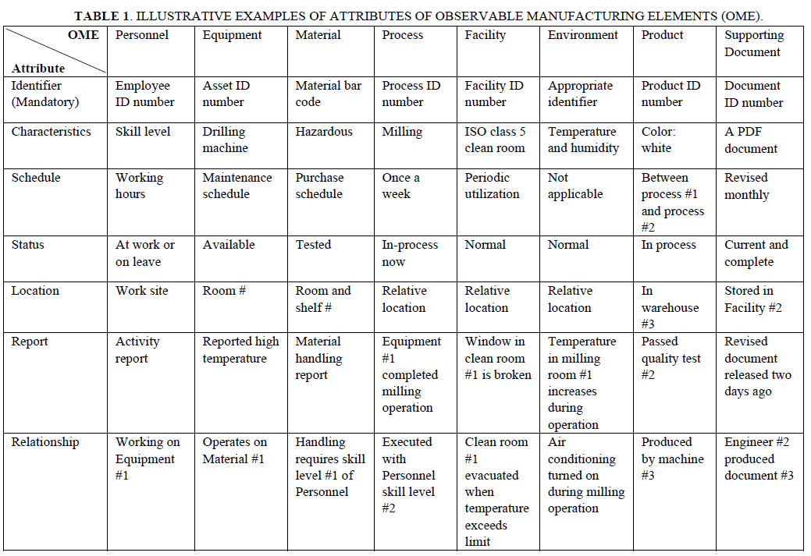
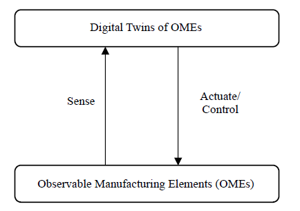
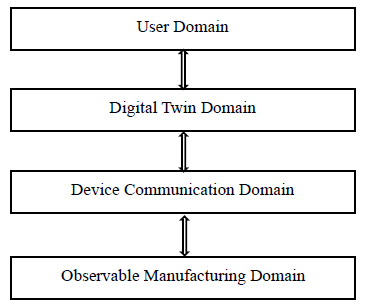
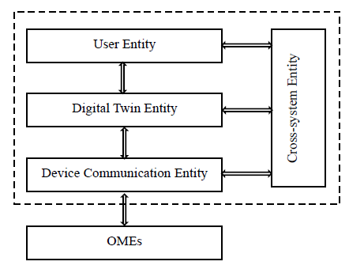

[<- До підрозділу](../README.md)

# Аналіз нової серії стандартів ISO 23247 щодо рамкової моделі цифрового двійника для виробництва.

Shao, G.  ,  Frechette, S.   and  Srinivasan, V. (2023), An Analysis of the New ISO 23247 Series of Standards on Digital Twin Framework for Manufacturing, 2023 MSEC Manufacturing Science &  Engineering Conference, New Brunswick, NJ, US, [online],  https://tsapps.nist.gov/publication/get_pdf.cfm?pub_id=935765   

Цей переклад зроблено за допомогою ChatGPT     

## Анотація

ISO нещодавно випустила серію стандартів (ISO 23247), що стосується рамкової моделі цифрового двійника для виробництва. Це загальна рамкова модель, яку можна адаптувати для підприємств із різними виробничими процесами — дискретними, порційними або неперервними. У цій статті представлено аналіз цієї серії стандартів із двома основними цілями: (1) проінформувати виробничу спільноту загалом і (2) оцінити можливості застосування цієї серії стандартів у нових галузях промисловості (наприклад, біовиробництво) та для новітніх виробничих технологій (наприклад, адитивне виробництво). Стаття застосовує підхід «знизу догори», починаючи з основних термінів і понять і поступово формуючи загальну рамкову модель. Подано інтерпретації й аналітичні міркування, які допомагають усвідомити, що саме стандарти ISO 23247 нормують і який простір відкривають для подальшого розвитку та практичного застосування в промисловості.

Ключові слова: ISO, стандарти, цифровий двійник, виробництво, аналіз, рамкова модель

## 1. Вступ

У виробничому секторі ми маємо справу з фізичними об'єктами, процесами та поведінкою, які часто абстрагуються у вигляді математичних моделей. Обчислювані представлення цих моделей еволюціонували впродовж останніх п’ятдесяти років і дали початок численним комп’ютеризованим системам підтримки. Сучасним втіленням цієї еволюції є концепція цифрового двійника у виробництві.

Цифровий двійник — це цифрова модель, створена для точного відображення фізичного об’єкта. До фізичного об’єкта прикріплюють датчики, які передають дані про його характеристики та роботу. Ці дані обробляються й застосовуються до цифрової моделі. Така модель може використовуватися для симуляцій, аналітичного аналізу, моніторингу або пошуку шляхів удосконалення, що потім можна реалізувати на фізичному об’єкті.

Цифрові двійники можуть також створюватися для процесів — на їхній основі можна проводити симуляції, орієнтовані на поточні дані. Дані надходять від сенсорів, які збирають потрібну інформацію для цифрового відображення.

Таким чином, цифровий двійник є віртуальним середовищем для перевірки ідей із мінімальними обмеженнями. З використанням IoT-платформи модель перетворюється на інтегровану, замкнену систему, яка впливає на стратегічні рішення компанії. Наприклад, цифровий двійник може дублювати реальні події й у реальному часі передавати дані. Це дозволяє інженеру оцінити ефективність і виявити потенційні вдосконалення.

Цей підхід придатний також для виробничих процесів — у реальному часі можна аналізувати стан і швидко реагувати на зміни вимог, умов чи навантаження.

Оскільки цифровий двійник — міждисциплінарне поняття, що охоплює багато технологій, виробникам складно реалізувати його без чітких визначень понять і моделей. Спільнота ISO, яка займається даними для автоматизації та інтеграції, відповіла на цей запит новою серією стандартів ISO 23247. Вона надає загальну рамкову модель, яку можна спеціалізувати для підприємств з різними виробничими процесами. У цій статті наведено аналіз цієї серії стандартів, зокрема щодо застосування в нових галузях і з новітніми технологіями. Аналіз починається з означення цифрового двійника.

У контексті виробництва цифровий двійник означується як "придатне до мети цифрове представлення спостережуваного виробничого елемента з синхронізацією між елементом і його цифровим представленням". У цьому означенні варто детальніше розглянути три ключові складові: (1) спостережуваний виробничий елемент (розділ 2), (2) придатність до мети (розділ 3), (3) синхронізація (розділ 4).

Решта статті присвячена обговоренню доменів і сутностей, які формують стандартизовану рамкову модель (розділ 5), перспективам її розвитку (розділ 6) і висновкам (розділ 7).

## 2. СПОСТЕРЕЖУВАНІ ВИРОБНИЧІ ЕЛЕМЕНТИ

Загальновизнано, що у виробництві існують фізичні артефакти, процеси та поведінкові дії, які мають обчислювані відповідники у вигляді цифрових представлень. Наприклад, тривимірна фізична деталь може мати цифрового двійника у вигляді тривимірної моделі в системі автоматизованого проєктування (CAD); фактично, виготовлення такої деталі часто починається саме з її тривимірної цифрової моделі (або з двовимірного креслення).

Одним із ключових внесків серії стандартів ISO 23247 є означення восьми типів спостережуваних виробничих елементів (Observable Manufacturing Elements, OME) і семи типів атрибутів для цифрового представлення кожного з них. Ці визначення поєднуються з іншими сутностями з різних доменів для побудови рамкової моделі. У таблиці 1 проілюстровано типову інформацію, яка міститься в семи типах атрибутів для кожного з восьми OME, на простих прикладах.

Вісім типів OME формально визначено в [1] і їх можна пояснити так:

1. **Персонал** — це працівники, які беруть участь у виробничих процесах безпосередньо або опосередковано. Цифровий двійник персоналу може містити дані про доступність, рівень кваліфікації або інші ключові характеристики. Він не обов’язково має бути тривимірною моделлю людини, як-от аватар. Проте, останні розробки, пов’язані зі стандартами метавсесвіту [5], можуть надавати більшого значення таким формам. У будь-якому разі, це цифрове представлення має бути «придатним до мети», тобто залежати від вимог заінтересованих сторін.
2. **Обладнання** — це фізичні об’єкти, які виконують операції, що прямо або опосередковано беруть участь у виробничому процесі. До обладнання належать ручні інструменти, верстати з числовим програмним керуванням (ЧПК), конвеєри, роботи тощо.
3. **Матеріал** — це фізична речовина, яка використовується для виготовлення продукції (наприклад, металевий зливок) або підтримує виробничий процес (наприклад, охолоджувальна рідина).
4. **Процес** — це спостережувана послідовність фізичних операцій у виробництві. У ширшому значенні процес може включати виготовлення, збирання, контроль, обслуговування або навіть управління.
5. **Об’єкт інфраструктури** (Facility) — це інфраструктура, пов’язана з виробництвом або така, що на нього впливає. Це можуть бути спеціалізовані приміщення, будівлі, системи постачання енергії, водопостачання тощо.
6. **Середовище** — це умови, забезпечені інфраструктурою для коректного виконання виробничого процесу. Прикладами є температура, вологість, освітлення.
7. **Продукт** — це результат виробничого процесу. Продукт може бути як проміжним, так і кінцевим.
8. **Супровідна документація** — будь-який артефакт (вимоги, план, модель, специфікація тощо), що підтримує виробництво. Серед усіх OME документація є найменш очевидним кандидатом на включення до спостережуваних елементів. Однак численні приклади фізичних книжок, друкованих документів і механічних макетів, що досі використовуються, виправдовують її включення.

Основне припущення полягає в тому, що кожен OME є фізичним (або хімічним/біологічним) елементом, що має матеріальне існування і може мати цифрового двійника. Цифровий двійник кожного OME має сім атрибутів (таблиця 1), кожен з яких може бути представлений у відповідній інформаційній моделі. Наведені приклади є спрощеними — на практиці атрибути можуть бути значно складнішими.

Інформаційний зміст семи атрибутів детальніше описано в [3], зокрема:

1. **Ідентифікатор** — значення, що відповідає ISO 8000-115 [6] і однозначно ідентифікує OME. Це єдиний обов’язковий атрибут. Приклади: UUID, URL, URN, OID, галузевий ID.
2. **Характеристика** — типова або помітна ознака OME. Може базуватись на IEC 62264-2 (B2MML), eCl@ss, ISO 13584-42 (PLIB) або IEC 61360 (CDD).
3. **Графік** — часова інформація, прив’язана до виробничого процесу. Може базуватись на ISO 8601 або бути простим повідомленням про початок/завершення.
4. **Стан** — поточний стан OME у контексті виробництва. Може базуватись на VDMA 24582.
5. **Розташування** — географічна або відносна позиція OME. Наприклад, координати GPS, ISO 6709, поштова адреса.
6. **Звіт** — опис дій, виконаних над OME або ним самим. Наприклад, може базуватись на QIF або MTConnect.
7. **Взаємозв’язок** — інформація про зв’язки між двома або більше OME. Наприклад, може базуватись на IEC 62264-2. Цей атрибут є основою для побудови структури типу «сутність-атрибут-зв’язок».

Бажано, щоб кожен із цих атрибутів був вимірюваним та/або обчислюваним. Наприклад, температура як характеристика середовища є вимірюваною; графік процесу — обчислюваним. Не всі спостережувані елементи обов’язково мають такі властивості [17], тому ISO 23247 враховує лише ті атрибути, які такими є.

Приклади XML-схем для OME та їх атрибутів надано в [3]. Рисунок 1 показує приклад XML-документа для свердлильного обладнання як OME з усіма сімома атрибутами.

Такі приклади у стандарті дозволяють зробити кілька важливих висновків. Інформаційні моделі для OME й атрибутів не стандартизовані в ISO 23247. Проте загальні визначення й пояснення, подані в стандарті, можуть бути використані для вибору відповідної моделі. Таким чином, ISO 23247 — це не стандарт для інформаційних моделей, а саме рамковий стандарт. Для реалізації цифрових двійників можна використовувати інші стандарти, як-от MTConnect (збір даних), STEP (представлення продукту), QIF (модель якості) тощо.



```xml
<?xml version="1.0" encoding="utf-8" ?>
<EquipmentInformation>
    <MandatoryInformationAttribute>
        <UUID>e78651cd-3401-4e9w-921c-e80f6324a1cc</UUID>
    </MandatoryInformationAttribute>
    <OptionalInformationAttributes>
        <EquipmentCharacteristics>
            <Functionality>drilling
            </Functionality>
        </EquipmentCharacteristics>
        <EquipmentSchedule>
            <value>Maintenance for Machine #2 is scheduled on every Monday</value>
        </EquipmentSchedule>
        <EquipmentStatus>
            < Up and running </
        </EquipmentStatus>
        <EquipmentLocation>
            <name>relative</name>
            <value>Machine 1 : Work Unit 2 in Room #3</value>
            <gps>
                < 77.1659474 </longitude>
                < 39.1865667 </latitude>
                <altitude>1 2 </altitude>
            </gps>
        </EquipmentLocation>
        <EquipmentReport>
            <MaintenanceReport timestamp="20 22 0 3 15T1 0 :10:35.153141">
                <startdate>202 2 05 14T 10 :00:10Z</startdate>
                <enddate>202 2 05 14T1 6 :00:10Z</enddate>
            </MaintenanceReport>
        </EquipmentReport>
        <EquipmentRelationship>
            <value>WorkUnit 3 must have at least 2 persons for safety reasons</v alue>
        </EquipmentRelationship>
        </
        </EquipmentInformation>
```

FIGURE 1. EXAMPLE OF AN XML INSTANCE FOR THE SEVEN ATTRIBUTES OF A DRILLING EQUIPMENT

## 3. ПРИДАТНІСТЬ ДО МЕТИ

Під час аналізу серії стандартів ISO 23247 природно виникає питання: чому для стандартизації було обрано саме вісім типів спостережуваних виробничих елементів (OME) і сім атрибутів для кожного з них? Відповідь полягає в тому, що згідно з численними вивченими прикладами та сценаріями застосування, вони виявилися «придатними до мети» у контексті виробництва. У додатках до стандарту ISO 23247-4 наведено низку прикладів застосування, які емпірично підтверджують цю тезу. Також під час розроблення стандарту було проведено дослідження для збирання вимог на основі реальних застосувань цифрових двійників [19]. Далі наведено кілька коротких прикладів таких сценаріїв:

• **Мінімізація впливу простоїв обладнання** [19]: Мета полягає у використанні даних про процеси та обладнання для моніторингу, діагностики, усунення несправностей і прогнозування відмов у виробничому обладнанні. Зібрані дані також можуть бути використані для керування самим обладнанням. У цьому випадку OME — це виробниче обладнання, цифровий двійник якого повинен містити принаймні атрибути: ідентифікатор, характеристику, графік, стан, розташування, звіт і взаємозв’язок. Аналогічно, сам виробничий процес (дискретний, порційний або неперервний) може бути представленим як OME з таким самим набором атрибутів у цифровому двійнику.

• **Оптимізація виробничого планування та графіків** [19]: Тут мета — збирання даних із цехових систем, таких як виробниче обладнання, MES (системи диспетчеризації виробництва) та ERP (системи планування ресурсів підприємства), з метою аналізу стану виробництва та змін у попиті, запасах і доступних ресурсах. Це дає змогу реалізувати постачання відповідно до попиту, оптимізувати використання ресурсів (матеріалів, персоналу, обладнання), скоротити цикл виробництва й зменшити витрати на запаси. З таблиці 1 видно, що для досягнення цієї мети знадобиться використання всіх восьми типів OME, і цифрові двійники кожного з них повинні мати всі сім атрибутів.

• **Передова метрологія** [4]: У цьому випадку цифрові двійники створюються для виготовлених деталей зі складною геометрією, як-от крила літака, з метою підбору кріплень належної довжини для зменшення ваги. Компоненти крила й кріплення виступають як продукти (OME), а відповідне вимірювальне обладнання — як окремий OME, кожен з яких має власний цифровий двійник з відповідними атрибутами.

З наведених прикладів випливає кілька загальних висновків. Немає формальних «доказів» необхідності й достатності саме цих типів OME і саме цих атрибутів цифрових двійників. Стандарти ISO 23247 виокремлюють ключові елементи, які були визнані необхідними в багатьох сценаріях. Проте цього може бути недостатньо для всіх випадків, і в деяких ситуаціях може знадобитися додавання додаткових атрибутів. У той же час, не всі OME або атрибути цифрових двійників є обов’язковими в кожному застосуванні. Найсильніше можливе твердження: стандартизовані типи OME та їхні атрибути є корисними в різних контекстах — іншими словами, вони «придатні до мети». Такі типології, що базуються на емпіричних спостереженнях, є звичайною практикою у стандартизації.

## 4. СИНХРОНІЗАЦІЯ

Ще одним природним питанням під час аналізу серії стандартів ISO 23247 є: чим цифровий двійник відрізняється від традиційних методів комп’ютерного моделювання та симуляції (наприклад, скінченно-елементного аналізу або дискретно-подійного моделювання)? Хоча як симуляції, так і цифрові двійники використовують цифрові моделі для відтворення виробів і процесів, між ними є ключові відмінності. Найважливіша з них полягає в тому, що цифровий двійник створює віртуальне середовище, здатне виконувати багато симуляцій, підкріплених синхронізованими реальними даними та двостороннім потоком інформації між цифровим двійником і датчиками, які збирають ці дані. Це підвищує точність аналітичних моделей прогнозування, забезпечуючи краще розуміння для управління й моніторингу виробів, політик і процедур. Така двостороння синхронізація є ключовою характеристикою цифрового двійника, яка відрізняє його від традиційного автономного моделювання чи симуляції.

Попередні напрацювання з моделювання в реальному часі для моніторингу та керування системами (наприклад, [20, 21]) можна вважати формами цифрових двійників.

Синхронізація може бути подієвою або часовою. У разі подієвої синхронізації оновлення відбуваються у відповідь на події. При часовій — оновлення здійснюються постійно або з певною періодичністю на основі потоку даних із часовими мітками. Як і раніше, «придатність до мети» визначає точність інформації та швидкість, з якою має відбуватись синхронізація. Питання автономної й реальної синхронізації та точності інформації розглядалися в ряді досліджень, зокрема в [19].

Усі ці дослідження, разом із прикладами застосування, наведеними в розділі 2, вказують на необхідність того, щоб датчики передавали інформацію від OME до його цифрового двійника, а виконавчі механізми або контролери — команди від цифрового двійника до OME. Це необхідно для забезпечення синхронізації. Така двостороння комунікація зображена на рисунку 2, який служить основою для рамкової моделі цифрового двійника, розглянутої в розділі 5.



Рисунок 2. Спрощене зображення двостороннього обміну інформацією для синхронізації.

Більш детальний опис двосторонньої синхронізації наведено в [1]. Коли датчики передають виміряні дані від OME для оновлення цифрового двійника — це називається керований цифровий двійник (driven digital twin). Коли цифровий двійник описує план або операцію для створення виробу (тобто OME) — це керуючий цифровий двійник (driving digital twin).

Така вимога щодо сильної двосторонньої взаємодії між OME та його цифровим двійником через механізм синхронізації стала поштовхом для подальшого розвитку й уточнення понять і визначень у серії стандартів ISO 23247. Ці уточнення реалізуються у вигляді доменів, подій і, зрештою, формалізованої рамкової моделі, описаної в наступному розділі.

## 5. РАМКОВА МОДЕЛЬ

Необхідність у датчиках і виконавчих механізмах/контролерах для підтримання синхронізації між спостережуваними виробничими елементами (OME) та їх цифровими двійниками (як показано на рисунку 2) є потужним аргументом для визначення чотирьох рівнів доменів у серії стандартів ISO 23247. Подальше уточнення цих доменів призвело до визначення кількох сутностей залежно від їхніх функцій — звідси походить поняття **функціональних сутностей**. Коли ці уточнення інтегруються у загальну інформаційну архітектуру підприємства, формується повна рамкова модель цифрового двійника для виробництва. Ці розробки описано нижче.

### 5.1 Домени

Двосторонню комунікацію між OME та їх цифровими двійниками, зображену на рисунку 2, можна формалізувати у вигляді взаємопов’язаних доменів. Рисунок 3 демонструє, як це реалізується у вигляді чотирьох взаємопов’язаних рівнів доменів у стандарті ISO 23247-2 [2].

Порівняння рисунків 2 і 3 демонструє структуру з чотирьох доменів:

- **Домен спостережуваного виробництва** (Observable Manufacturing Domain) — містить фізичні OME;
- **Домен цифрового двійника** (Digital Twin Domain) — містить цифрові представлення OME;
- **Домен пристроєвої комунікації** (Device Communication Domain) — охоплює датчики, виконавчі механізми та відповідні компоненти;
- **Користувацький домен** (User Domain) — верхній рівень, який взаємодіє з іншими доменами через програмні застосунки та інтерфейси.

Введення **Користувацького домену** як окремого верхнього шару потребує пояснення. Цей домен необхідний для того, щоб користувачі — включаючи прикладні системи, такі як PLM, MES, ERP, MOM, а також інтерфейси людина-машина — могли взаємодіяти з OME та їх цифровими двійниками. Такий домен може бути дуже великим і складним.

Хоча концепція чотирьох доменів забезпечує загальне уявлення, для промислового застосування їх слід деталізувати через сутності та підсутності — що й робиться далі.



Рисунок 3. Чотири рівні доменів

### 5.2 Сутності

Рамкова модель цифрового двійника для виробництва починає набувати завершеного вигляду на рисунку 4 з введенням **сутностей**, які представляють інформаційне наповнення трьох верхніх доменів. Крім того, в рамкову модель додається нова **міжсистемна сутність** (Cross-system Entity).

Основні чотири сутності в межах пунктирної рамки на рисунку 4:

- **Сутність користувача** (User Entity): розміщує прикладні програмні системи (PLM, ERP, MOM тощо), а також інтерфейси людина-машина.
- **Сутність цифрового двійника** (Digital Twin Entity) містить три підсутності:
  - **Операції та керування** — підтримує дані про OME: моделювання, представлення, синхронізація;
  - **Застосування та сервіси** — виконує симуляцію, аналіз даних, звітування;
  - **Доступ до ресурсів та обмін** — забезпечує обмін інформацією з користувачем, підтримуючи інтероперабельність (напр., через стандартизовані моделі даних).
- **Сутність пристроєвої комунікації** (Device Communication Entity) має дві підсутності:
  - **Збір даних** — зчитує дані з OME через датчики;
  - **Керування пристроями** — надсилає команди для керування OME.
- **Міжсистемна сутність** (Cross-system Entity): надає спільні функції (переклад даних, перевірка достовірності, безпека) для всіх доменів.

Ці сутності, разом з атрибутами цифрових двійників OME (у т.ч. атрибутом «взаємозв’язок»), забезпечують основу для побудови моделі типу «сутність-атрибут-зв’язок» у базах даних і схемах моделювання.



Рисунок 4. Сутності в рамковій моделі

### 5.3 Об’єднання компонентів

Рамкова модель цифрового двійника для виробництва майже готова до остаточного формування. Завершальним штрихом до рисунка 4 (в межах пунктирної рамки) є деталізація підсутностей, описаних у розділі 5.2, шляхом доповнення їх функціональними сутностями, як це подано в [2]. Замість перелічування всіх функціональних сутностей із [2], доцільно розглянути одну зі сутностей у рамці та дослідити, як її підсутності деталізуються у вигляді функціональних сутностей. Для цього прикладу обрано **сутність пристроєвої комунікації** (Device Communication Entity) з рисунка 4.

Нагадаємо, що сутність пристроєвої комунікації має дві підсутності:

- **Підсутність збору даних** (Data Collection Sub-entity) включає такі функціональні сутності:
  - **Функціональна сутність ідентифікації збору** — визначає, які дані необхідно зібрати з OME;
  - **Функціональна сутність збору даних** — виконує безпосереднє зчитування даних з OME;
  - **Функціональна сутність попередньої обробки даних** — виконує фільтрацію, агрегацію та інші форми попередньої обробки.
- **Підсутність керування пристроями** (Device Control Sub-entity) включає:
  - **Функціональна сутність ідентифікації керування** — визначає, який OME потребує керування;
  - **Функціональна сутність керування** — надсилає команди до пристрою мовою, яку він розуміє;
  - **Функціональна сутність активації** — активує OME у відповідь на запит від сутності користувача або цифрового двійника.

Інші підсутності з розділу 5.2 також аналогічно деталізуються на функціональні сутності в [2]. Ієрархічно це виглядає так: **сутності → підсутності → функціональні сутності**.

З рисунків 3 і 4 може здатись, що рівні доменів і сутностей мають ієрархічну структуру. Однак це не є строго обов’язковим. Наприклад, функціональна сутність активації розташована в сутності пристроєвої комунікації, але може взаємодіяти як із цифровим двійником (що на рівень вище), так і з користувачем (що ще на рівень вище). Така можливість забезпечує гнучкість рамкової моделі — як у повністю автоматизованому, так і в напівавтоматизованому режимі.

Наприклад:

- якщо цифровий двійник надсилає команду до OME у відповідь на отримані дані (через той самий пристроєвий рівень), то утворюється повний автоматичний цикл;
- якщо користувач надсилає команду до OME напряму (а цифровий двійник лише оновлюється), виробництво працює в напівавтоматичному режимі.

**Підсумок:** стандартизовані сутності, підсутності й функціональні сутності формують основу для створення легких метаданих у виробництві. Вони можуть містити посилання на докладні дані (наприклад, у стандартизованому форматі) з інших прикладних систем, що обслуговують підприємство. Це і є ключова відмінність рамкової моделі ISO 23247 від численних специфічних моделей даних, що існують для обміну інформацією у виробництві.

### 5.4 Приклади застосування

Стандарт ISO 23247 було апробовано в пілотних проєктах компаній **Boeing**, **Lockheed Martin** та **Sandvik** для дискретного виробництва (зокрема, роботизована комірка для свердління та заповнення, зниження маси обшивки літака, оптимізація ресурсу ріжучого інструменту при обробці редуктора) і він довів свою ефективність у промислових умовах [4, 22].

- У тестовому кейсі Boeing стандарт було використано для створення роботизованої системи «drill and fill» для виробництва елементів планера з можливістю гнучкого планування, яке автоматично адаптується до доступності роботів.
- У проєкті Lockheed Martin цифровий двійник допоміг зменшити масу планера шляхом оптимізації довжини кріпильних елементів, які з’єднують частини літака.
- У проєкті Sandvik стандарт використовувався для створення цифрового двійника, що оптимізує ресурс ріжучого інструменту, збільшуючи його строк служби при фрезеруванні на 15 %.

## 6. ПЕРСПЕКТИВИ РОЗВИТКУ

Початкові чотири частини серії стандартів ISO 23247 формують фундаментальну загальну рамкову модель цифрового двійника для виробництва. Передбачається, що ця рамкова модель може бути розширена та адаптована до різних галузей промисловості, які використовують різні виробничі процеси та технології. Наприклад, нова галузь біовиробництва може застосовувати загальну модель для створення своїх цифрових двійників — це потенційно може стати окремою частиною серії ISO 23247. Аналогічно, можуть бути створені цифрові двійники для адитивного виробництва (друку), й окрема частина серії ISO 23247 може бути присвячена саме домену адитивного виробництва.

Альтернативно, інші організації зі стандартизації можуть прийняти поточну серію ISO 23247 для створення цифрових двійників для своїх галузей. Усі ці варіанти наразі активно розглядаються. У наступних підрозділах описано кілька конкретних ідей щодо потенційних нових частин стандарту, які дозволять створювати цифрові двійники з використанням більш системного підходу — такого, що буде простішим у розробці, масштабованим (і інтегрованим), більш надійним та здатним до використання у метавсесвіті.

### 6.1 Розробка цифрового двійника з підтримкою цифрової нитки

Стандарт рамкової моделі цифрового двійника може слугувати орієнтиром для користувачів у реалізації їхніх власних цифрових двійників. За даними дослідження компанії Accenture, більшість компаній втрачають від 35 % до 65 % потенційної цінності інвестицій у цифрові двійники через те, що ті часто розробляються ізольовано, для окремої функціональної області. Такі цифрові двійники здебільшого:

1. орієнтовані лише на інтерфейс користувача, без цілісної стратегії інтеграції та обміну даними;
2. вимагають дубльованої інфраструктури для ізольованих і несвоєчасних даних;
3. можуть оптимізувати лише локальні функції, але не всю систему підприємства;
4. не використовують дані від клієнтів [23].

Наприклад, автономна симуляція на базі CAD дозволяє конструкторам тестувати різні сценарії відповідно до заданих параметрів — і це корисно для етапу проєктування. Однак цифровий двійник продукту повинен мати ширший охоплення — охоплювати всі етапи життєвого циклу виробу. Такий розширений обсяг дозволяє цифровому двійнику продукту відігравати роль не лише в проєктуванні, а й у вдосконаленні процесів і підтримці ширших управлінських рішень.

Втім, реалізація підходу до повного життєвого циклу є складною. Необхідні чіткі вказівки та методики щодо того, як підтримувати розробку цифрового двійника за допомогою **цифрової нитки** (Digital Thread), що охоплює дані на всіх етапах життєвого циклу продукту: проєктування, виробництво, контроль і експлуатація. Цифрова нитка використовує цифрові засоби й представлення для проєктування, оцінювання й управління життєвим циклом продукту, забезпечуючи швидкий, надійний і безпечний доступ цифрових двійників до відповідної інформації.

### 6.2 Інтеграція кількох цифрових двійників

Щоб досягти цифрової трансформації у виробничому середовищі, необхідно розробити та інтегрувати кілька цифрових двійників за підтримки цифрової нитки. Наприклад, цифрові двійники деталі та верстата, який її виготовляє, повинні взаємодіяти динамічно та безперешкодно; цифрові двійники ріжучого інструменту, верстата та деталі повинні співпрацювати для оцінки зношення інструменту, дотримання допусків і стану верстата; у ланцюгу постачання — цифрові двійники партнерів повинні координуватись і обмінюватися інформацією в реальному часі. Об’єднання та інтеграція кількох застосунків для досягнення нової мети завжди є складним завданням. Стандартизовані методи та рекомендації допоможуть зменшити час і ризики таких ініціатив.

Потенційна нова частина ISO 23247, присвячена цій темі, могла б містити вказівки щодо забезпечення ефективної комунікації та інтероперабельності між кількома цифровими двійниками. У ній можуть бути представлені загальні методології, принципи та приклади, які допоможуть користувачам зрозуміти проблему та сформулювати відповідні рішення. Для описаних вище прикладів можуть бути обрані відповідні стандарти й технології, які демонструють інтеграцію.

### 6.3 Створення цифрових двійників із повторно використовуваних компонентів

Цифрові двійники можна класифікувати як аналітичні інструменти:

- описові (що сталося?),
- діагностичні (чому це сталося?),
- прогностичні (що станеться?),
- прескриптивні (як зробити, щоб це сталося?).

Залежно від вимог, цифрові двійники можуть розроблятися для різних рівнів — від окремого обладнання до виробничих ліній, фабрик і ланцюгів постачання. Хоча деякі підходи для повторного використання компонентів існують [21], більшість із них не були створені спеціально для цифрових двійників. У результаті майже всі цифрові двійники розробляються «з нуля», що є трудомістким і дорогим. Індивідуальні проєкти ускладнюють модифікацію, розширення й повторне використання цифрових двійників. Знання, атрибути інформації та конфігурації прикладів використання часто створюються заново під кожен окремий застосунок.

Повторне використання компонентів цифрових двійників через бібліотеки може значно знизити витрати, час розробки та вимоги до кваліфікації. Потенційна нова частина ISO 23247 могла б містити вказівки щодо створення бібліотек компонентів, шаблонів організації інформації та моделей. До таких компонентів можуть входити шаблони збору даних, типові інформаційні атрибути, модульні моделі, відповідні технології та стандарти для реалізації функцій цифрового двійника. Нова частина може містити узагальнені методології, архітектури, бази знань і приклади для підтримки побудови та використання таких бібліотек.

### 6.4 Оцінювання достовірності цифрових двійників

Поточна серія стандартів ISO 23247 надає рамкову модель і рекомендації щодо впровадження цифрових двійників у виробництві; однак вона не охоплює аспект **верифікації, валідації та оцінки невизначеності (VVUQ)** — тобто перевірки достовірності цифрового двійника. Щоб забезпечити корисність цифрових двійників, результати, які вони генерують, мають бути надійними в умовах реального виробництва. Оцінка достовірності моделей, включно з VVUQ, має проводитись протягом усього життєвого циклу цифрового двійника.

- **Верифікація та валідація (V&V)** — забезпечують відповідність цифрового двійника його призначенню та проєктним цілям.
- **Оцінка невизначеності (UQ)** — дає змогу користувачеві кількісно оцінити рівень довіри до цифрового двійника.

Крім того, довіра до цифрового двійника охоплює довіру до:

- даних, отриманих з OME;
- математичних моделей, використаних у цифровому двійнику;
- процедур оновлення даних;
- рекомендацій щодо рішень і керування.

Усі ці аспекти мають певну міру невизначеності, тож валідація має розглядатися як статистичний процес. Порівняння реальних даних із результатами моделі дозволяє оцінити ймовірність того, що цифровий двійник є послідовним представленням OME.

Потенційна нова частина ISO 23247 може містити методології для:

- вимірювання невизначеності,
- тестування цифрових двійників,
- вибору або побудови рамки оцінювання достовірності (VVUQ),
- оцінки достовірності розроблених цифрових двійників.

### 6.5 Цифрові двійники і метавсесвіт

Сьогодні технології віртуальної реальності (VR), доповненої реальності (AR) та розширеної реальності (XR), які досягли високої зрілості в індустрії електронних ігор і відеорозваг, можуть бути використані для підвищення якості візуалізації у виробництві. Наприклад, вже продемонстровано, що AR-технології можуть інтегруватися з тривимірними стандартами геометричної специфікації продукту та практиками його перевірки [24]. Такі розробки у виробничому секторі формують тренд, який природно переходить у зацікавленість промисловості у метавсесвіті та його стандартах [5].

Ключовою особливістю метавсесвіту є занурювальний візуальний досвід у поєднанні з інтерфейсом "людина–машина". Апаратні й програмні технології, що розробляються в межах метавсесвіту, можуть бути використані в рамковій моделі цифрового двійника для виробництва, особливо в тих випадках, де зберігається важлива роль людини. Наприклад, домен користувача та сутність користувача на рисунках 3 і 4 можуть взаємодіяти через інтерфейси, реалізовані за допомогою засобів метавсесвіту. Крім того, метавсесвіт може існувати як паралельний віртуальний світ, який охоплює частину цифрових двійників виробничого підприємства, яке він представляє.

Таким чином, взаємодія цифрового двійника й метавсесвіту може реалізовуватись у кількох сценаріях:

- **Метавсесвіт як компонент у домені користувача цифрового двійника.** У цьому разі він має синхронізуватись із цифровим двійником, а той — зі своїм відповідним OME.
- **Метавсесвіт як окрема система, що представляє один або кілька OME, паралельно з цифровим двійником.** У цьому сценарії синхронізація з цифровим двійником не є обов’язковою.
- **Метавсесвіт як узагальнене віртуальне середовище, яке охоплює кілька OME і їх цифрових двійників.** За потреби метавсесвіт має бути періодично відкалібрований відповідно до виробничого середовища.

Ці сценарії інтеграції технологій метавсесвіту можуть бути оформлені як окрема частина серії ISO 23247, яка включатиме визначення поняття метавсесвіту, можливі сценарії взаємодії з цифровими двійниками, а також рекомендації та методики щодо такої інтеграції.

### 6.6 Розширення рамкової моделі для окремих галузей

На основі загальної рамкової моделі, представленої в перших чотирьох частинах ISO 23247, можуть бути створені нові частини стандарту, присвячені конкретним виробничим галузям, таким як біовиробництво, виробництво напівпровідників, адитивне виробництво тощо.

Нові частини можуть передбачати спеціалізацію рамкової моделі цифрового двійника шляхом додавання нових функціональних сутностей або заміни наявних, щоб відповідати специфічним вимогам. Наприклад, для реалізації вимог, розглянутих у підрозділах 6.1–6.4, можуть бути додані нові функціональні сутності: **сутність цифрової нитки**, **сутність оцінювання достовірності** тощо.

Також нові частини можуть містити реалізації прикладів застосування для відповідних виробничих секторів. У свою чергу, такі реалізації допоможуть виявити нові вимоги до цифрових двійників у цих галузях. Приклади застосування можуть бути оформлені у вигляді технічних звітів, які також можуть увійти до складу стандарту. Наприклад, в адаптивному керуванні процесами біовиробництва слід створити цифровий двійник на базі машинного навчання, який буде періодично оновлюватися [25].

Крім того, нові функціональні сутності, необхідні для таких галузевих потреб, можуть згодом бути узагальнені й сприяти розширенню чинних частин ISO 23247.

## 7. ПІДСУМКОВІ ЗАУВАЖЕННЯ

Серія стандартів ISO 23247 (Рамкова модель цифрового двійника для виробництва), що складається з чотирьох частин, була опублікована у жовтні 2021 року. Як перший стандарт ISO, присвячений рамковій моделі цифрового двійника у виробництві, він закладає основу для майбутніх стандартів у цій галузі.

Окрім прикладів впровадження, розглянутих у підрозділі 5.4, дедалі більше виробничих підприємств починають застосовувати цей стандарт для реалізації своїх цифрових двійників. Дослідницькі організації, органи стандартизації (SDO) та промислові консорціуми — такі як Industry IoT Consortium (IIC) та Digital Twin Consortium (DTC) — також посилаються на цей стандарт або приймають його для розроблення нових відповідних стандартів, методик, інструментів і прототипів цифрових двійників.

Означення «цифрового двійника у виробництві» стало загальноприйнятим серед науковців і практиків, і активно використовується. Також спостерігається багато міжнародних реалізацій і тестувань цього стандарту. Наприклад, європейський проєкт Change2Twin, який надає рішення цифрових двійників для малих і середніх підприємств, прийняв ISO 23247 як основу й застосовує його на практиці [26]. Інститут оптроніки Фраунгофера також застосував цей стандарт для створення цифрових двійників, сумісних з вимогами Індустрії 4.0 [27].

Такий міжнародний інтерес свідчить про глобальну потребу в загальній рамковій моделі цифрових двійників, описаній у цій статті. Це також вказує на те, що існуючий стандарт потребує оновлення, аби включити нові функціональні можливості для вирішення сучасних завдань — як запропоновано в цьому огляді.

### ПОДЯКИ

Автори висловлюють подяку членам комітету ISO TC 184 SC 4 WG 15 та Полу Чіріно за цінні обговорення.

Робота, представлена в цій статті, є офіційним внеском Національного інституту стандартів і технологій США (NIST) і не підлягає авторському праву на території Сполучених Штатів. У статті згадано деякі комерційні системи — таке згадування не означає рекомендації чи схвалення з боку NIST, а також не гарантує, що зазначені продукти є найкращими серед доступних для відповідного призначення.

## Посилання

[1] ISO 23247-1. ISO 23247-1: Automation Systems and Integration - Digital Twin Framework for Manufacturing – Part 1: Overview and general principles. International Organization for Standardization, Geneva, Switzerland (2021).
[2] ISO 23247-2. ISO 23247-2: Automation Systems and Integration - Digital Twin Framework for Manufacturing – Part 2: Reference architecture. International Organization for Standardization, Geneva, Switzerland (2021).
[3] ISO 23247-3. ISO 23247-3: Automation Systems and Integration - Digital Twin Framework for Manufacturing – Part 3: Digital representation of manufacturing elements. International Organization for Standardization, Geneva, Switzerland (2021).
[4] ISO 23247-4. ISO 23247-4: Automation Systems and Integration - Digital Twin Framework for Manufacturing – Part 4: Information exchange. International Organization for Standardization, Geneva, Switzerland (2021).
[5] Trevett, N. The Metaverse Standards Forum, Fostering Interoperability Standards for an Open Metaverse. 2022. https://metaverse-standards.org/
[6] ISO 8000-115. ISO 8000-115: Data quality - Part 115: Master data: Exchange of quality identifiers: Syntactic, semantic and resolution requirements (2018).
[7] IEC 62264-2. IEC 62264-2: Enterprise-control system integration - Part 2: Objects and attributes for enterprise-control system integration (2015).
[8] ECLASS. An ISO/IEC-compliant data standard for goods and services. https://eclass.eu/en.
[9] ISO 13584-42. ISO 13584-42: Industrial automation systems and integration - Parts library - Part 42: Description methodology: Methodology for structuring parts families (2010).
[10] IEC 61360-1. IEC 61360-1: Standard data element types with associated classification scheme - Part 1: Definitions - Principles and methods (2017).
[11] ISO 8601. ISO 8601: Date and time format (2017).
[12] VDMA 24582. VDMA 24582: Fieldbus Neutral Reference Architecture for Condition Monitoring in Production Automation (2014). Verband Deutscher Maschinen- und Anlagenbau e.V.
[13] ISO 6709. ISO 6709: Standard representation of geographic point location by coordinates (2008).
[14] QIF. The Quality Information Framework Standard. (2020). http://qifstandards.org/
[15] MTConnect. MTConnect standardizes factory device data. (2022). https://www.mtconnect.org/
[16] IEC 62264-2. IEC 62264: Enterprise-control system integration - Part 2: Objects and attributes for enterprise-control system integration (2015).
[17] P.A.M. Dirac, The Principles of Quantum Mechanics, Clarendon Press, U.K., 1982. ISBN-13: 978-1607965602.
[18] ISO 10303. ISO 10303-1: Industrial automation systems and integration - Product data representation and exchange - Part 1: Overview and fundamental principles (2021).
[19] G. Shao and M. Helu, “Framework for a digital twin in manufacturing: Scope and requirements,” Manufacturing Letters, vol. 24, pp. 105–107, 2020, DOI: 10.1016/J.MFGLET.2020.04.004.
[20] Y. J. Son, S. B. Joshi, R. A. Wysk, and J. S. Smith, “Simulation-based shop floor control,” Journal of Manufacturing Systems, vol. 21, issue 5, pp. 380-394, 2002. DOI: 10.1016/S0278-6125(02)80036-X.
[21] Y. J. Son, R. A. Wysk, and A. T. Jones, “Simulation-based shop floor control: formal model, model generation and control interface,” IIE Transactions, 35:1, pp. 29-48, 2003. DOI: 10.1080/07408170304428.
[22] ISO TC184 SC4 WG15. “Digital Twin Framework for Manufacturing – ISO 23247.” (2020). URL https://www.ap238.org/iso23247/.
[23] Accenture. “Think thread first: Surf the wave of product data.” (2020). URL https://www.accenture.com/us-en/insights/industry-x/thread-first-thinking.
[24] Vernica, T., Lipman, R., Kramer, T., Kwon, S., and Bernstein, W. Z. “Visualizing Standardized Model-Based Design and Inspection Data in Augmented Reality.” ASME. J. Comput. Inf. Sci. Eng. August 2022; 22(4): 041001. https://doi.org/10.1115/1.4053154
[25] Rathore, A., Mishra, S., Nikita, S., Priyanka, P. Bioprocess Control: Current Progress and Future Perspectives. Life 11, 557 (2021).
[26] Pileggi, P., Bujari, A, Barrowclough, O., Haenisch, J. and Woitsch, R. Overcoming Nine Digital Twin Barriers for Manufacturing SMEs. (2020). Change2Twin. https://www.change2twin.eu/about/download/
[27] Jacoby, M., Volz, F., Weißenbacher, C., Stojanovic, L. and Usländer T. “An approach for Industrie 4.0-compliant and data-sovereign Digital Twins: Realization of the Industrie 4.0 Asset Administration Shell with a data-sovereignty extension” at - Automatisierungstechnik, vol. 69, no. 12, 2021, pp. 1051-1061. https://doi.org/10.1515/auto-2021-0074