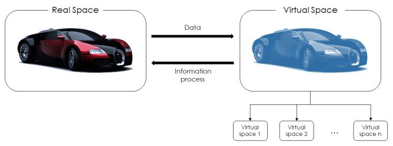
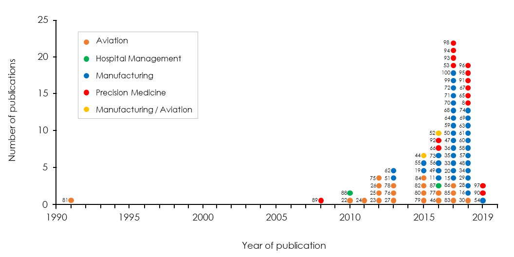
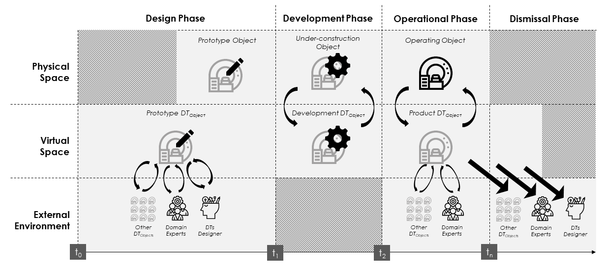
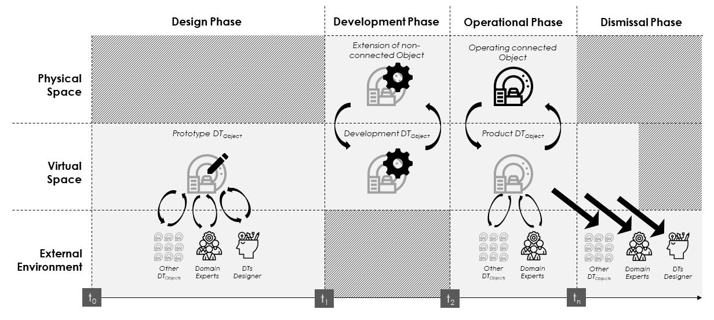

[<- До підрозділу](../README.md)

# Огляд цифрового двійника: визначення, характеристики, застосування та конструктивні аспекти

https://ieeexplore.ieee.org/document/8901113

B. R. Barricelli, E. Casiraghi and D. Fogli, "A Survey on Digital Twin: Definitions, Characteristics, Applications, and Design Implications," in IEEE Access, vol. 7, pp. 167653-167671, 2019, doi: 10.1109/ACCESS.2019.2953499.
keywords: {Artificial intelligence;Data models;Atmospheric modeling;Military aircraft;Big Data;Sensors;Artificial intelligence;digital twin;human-computer interaction;Internet of Things;machine learning;sensor systems},

Ця стаття перекладена з використанням ChatGPT.

## Анотація

 Коли у 1956 році штучний інтелект (AI) офіційно був проголошений як наукова галузь, ніхто не міг передбачити, який величезний вплив і значення матимуть його можливості щодо опису, прогнозування та ухвалення рішень у нашому повсякденному житті. Паралельно з безперервним розвитком AI, протягом останнього десятиліття відбулося поширення широкосмугового інтернету та повсюдної підключеності, поява (вбудованих) сенсорів, що збирають описові дані високої розмірності, а також удосконалення методів обробки великих даних і хмарних обчислень. Спільне використання цих технологій призвело до створення цифрових двійників — інтелектуальних віртуальних копій фізичних систем. Сьогодні технологія цифрових двійників (ЦД) активно розробляється та комерціалізується для оптимізації численних процесів у виробництві та авіації, тоді як у сфері охорони здоров’я та медицини вона ще перебуває на ранньому етапі розвитку. У цій статті представлено результати дослідження, спрямованого на аналіз сучасних визначень ЦД, вивчення основних характеристик, якими має володіти цифровий двійник, а також огляд галузей, у яких наразі розробляються застосування ЦД. Далі подаються конструктивні висновки дослідження, зосереджені на соціотехнічних аспектах проєктування та життєвому циклі ЦД. На завершення обговорюються відкриті питання та виклики, які потребують вирішення в майбутньому.

## I. ВСТУП

У 1956 році Джон Маккарті організував літню дослідницьку школу під назвою «Літній дослідницький проєкт з штучного інтелекту в Дартмуті», що нині вважається багатьма [1\][2] визначною подією, на якій штучний інтелект (AI) був офіційно проголошений як наукова галузь. На цьому семінарі дослідники з різних дисциплін зустрілися, щоб уточнити поняття, сформулювати ідеї та започаткувати дослідницьку програму щодо «мислячих машин». Вони обрали термін «штучний інтелект» у його широкому значенні, щоб не обмежувати сферу дослідження лише такими напрямами як кібернетика, теорія автоматів чи складна обробка інформації.

Сьогодні штучний інтелект, як визначено в словнику Merriam-Webster, «стосується теорії та розробки комп’ютеризованих систем, здатних імітувати та моделювати людський інтелект і поведінку», тобто, по суті, «бути схожими на людину, а не ставати людиною» [3], і «виконувати завдання, які зазвичай потребують людського інтелекту, такі як зорове сприйняття, розпізнавання мовлення, прийняття рішень та переклад між мовами» (English Oxford Living Dictionary).

З 1956 року дослідникам вдалось створити інтелектуальні системи, які дозволяють машинам не лише виконувати фізичну роботу, а й здійснювати міркування, прогнозування та прийняття рішень. Замість прагнення досягти ідеальної копії людського розуму, системи ШІ використовують процеси, що імітують людське мислення, як орієнтир для створення допоміжних інструментів і покращення сервісів.

Завдяки цьому, а також постійному розвитку обчислювальних потужностей, обробки великих даних, машинного навчання (ML) і розпізнавання шаблонів (PR), застосування ШІ стає невід’ємною частиною нашого повсякденного життя, приносячи значні переваги в різних сферах. Наприклад, у медичних дослідженнях розробляються алгоритми ШІ для виявлення нових біологічних залежностей [4] і методів лікування. Також ШІ використовується для моделювання біологічних структур і людського мислення: для створення комп’ютерних систем допомоги в діагностиці, які підтримують лікарів у щоденній роботі [5], або для вивчення функціонування органів та їхньої реакції на медикаментозне лікування [6\][7\][8], відкриваючи приховані закономірності у даних, зменшуючи їх розмірність шляхом усунення надлишкової інформації \[9].

Протягом останніх двадцяти років поява Інтернету речей (IoT) \[10\][11] змінила спосіб обміну даними між різними джерелами. Розповсюдження технологій, таких як вбудовані сенсори й виконавчі пристрої, підключені через Інтернет, забезпечує безперервний обмін великими даними. Під терміном «великі дані» мається на увазі: обсяг (висока розмірність і потреба у великих обсягах збереження), різноманітність (гетерогенні дані з різних джерел), швидкість (висока швидкість збору та обробки), цінність (інформаційна значущість даних) \[12\][13\][14]. На щастя, наукові досягнення в галузі злиття даних, обробки високовимірних даних [9], аналітики великих даних і хмарних обчислень дозволяють зберігати й обробляти ці дані для отримання цінних знань і підвищення ефективності фізичних систем.

Зокрема, інтеграція моделей ШІ (фізичних об’єктів) та аналітики великих даних для обробки IoT-даних [15\][16\][17] стала рушієм однієї з найновіших і, ймовірно, найважливіших технологічних інновацій — цифрового двійника (DT). Моделі цифрових двійників викликають усе більший інтерес завдяки своєму потенціалу та потужному впливу в таких галузях, як виробництво, аерокосмічна промисловість, охорона здоров’я та медицина.

Попри успіхи у розробці технологій цифрових двійників, які активно досліджуються в науці та широко впроваджуються в бізнес-середовищі, у літературі досі не подано детального опису характеристик типового цифрового двійника. Насправді кожна сучасна публікація зосереджена лише на розробці окремих його компонентів.

У цьому дослідженні ми шукали відповіді на три конкретні наукові запитання: які існують визначення цифрового двійника, які основні характеристики він повинен мати, і в яких галузях наразі розробляються його застосування. Після подання передумов дослідження (розділ II) і опису методології (розділ III), у трьох наступних розділах подано відповіді на ці запитання (розділи IV, V і VI). У розділі VII обговорено конструктивні висновки, які були отримані з аналізу, а в розділі VIII представлено відкриті проблеми та основні виклики, що залишаються актуальними для цієї галузі.

## II. ІСТОРИЧНЕ ПІДҐРУНТЯ ДОСЛІДЖЕННЯ

Починаючи з 1970 року, NASA створювала дзеркальні системи для моніторингу фізичних об'єктів у недоступних просторах (наприклад, космічних апаратів у польоті) та пошуку рішень у разі виникнення проблем. Першим і, ймовірно, найвідомішим прикладом є змодельоване середовище, розроблене під час місії Apollo 13 [18]. Через два дні після старту один із кисневих балонів вибухнув, і команда керування польотом NASA в Г’юстоні знайшла рішення, змоделювавши й проаналізувавши ситуацію на фізичній моделі (дзеркальній системі) космічного корабля Apollo 13 та його компонентів. Завдяки змодельованому середовищу інженери розробили й протестували можливі рішення, зокрема імпровізований очищувач повітря, і успішно надали інструкції астронавтам, як його зібрати з наявних у кораблі матеріалів. У той самий час інженери на Землі проводили симуляції у Г’юстоні та Космічному центрі Кеннеді, щоб перевірити процедури безпечного повернення екіпажу Apollo 13 на Землю.

Цей приклад демонструє потенціал віртуальних та симуляційних моделей, які нині вважаються попередниками цифрових двійників (ЦД), у подоланні розриву між фізичним і віртуальним простором. Однак ці моделі ще не вважаються повноцінними ЦД через відсутність безперервного з'єднання та обміну даними в реальному часі, що забезпечує постійне або принаймні періодичне «віддзеркалення» цифрової копії з фізичної.

Концепцію цифрового двійника неформально вперше представив Майкл Ґрівс у 2002 році під час доповіді про управління життєвим циклом продукту (PLM) під назвою «Ідеальна концепція PLM». Модель Ґрівса, пізніше формалізована в його аналітичному звіті [19] та у [20], складалася з трьох основних компонентів (див. Рис. 1):

1. реального простору з фізичним об'єктом;
2. віртуального простору з віртуальним об'єктом;
3. каналу передачі даних з реального простору у віртуальний (і його підпростори) та каналу передачі інформації з віртуального простору до реального.

Саме цей останній компонент забезпечує обмін даними, дозволяючи конвергенцію й синхронізацію віртуальних і фізичних систем.

РИСУНОК 1. Модель цифрового двійника. Зображення є адаптацією моделі Ґрівса [20].

Вже за рік після цього Фремлінг із співавторами [21] запропонували «архітектуру на основі агентів, де кожен продукт має віртуального двійника або агента, пов’язаного з ним». Завдяки безперервному з’єднанню, забезпеченому поширенням інтернет-технологій, передбачалося, що ці агенти (тобто цифрові двійники продукту або їхні попередники) гарантуватимуть синхронізацію з фізичним відповідником і надаватимуть відповідні послуги. Пропозиція авторів ґрунтувалася на розумінні, що ефективна система PLM має постійно мати доступ до достовірної інформації про стан і характеристики продукту — від його проєктування та виготовлення до використання й утилізації.

На початку 2000-х така інформація зазвичай передавалася у вигляді паперової документації, що супроводжувала виріб. Але цей підхід був неефективним, оскільки дані про продукт змінюються протягом усього життєвого циклу, і для адекватного відображення кожної фази потрібно було зберігати великі обсяги документації. У результаті постійна синхронізація між самими продуктами та їхніми даними була неможливою.

Очевидно, що запропоноване поєднання віртуального й фізичного об’єкта потребувало засобу для однозначної ідентифікації фізичного продукту, щоб забезпечити бієктивне (один-до-одного) з’єднання між цифровим двійником і його фізичним аналогом.

З прагненням поглибити розуміння концепції дзеркальних систем і зменшити витрати й використання ресурсів NASA почала дослідження та розробку цифрових двійників (ЦД) для своїх космічних об’єктів. Рівно через десять років після визначення Ґрівса, дослідники NASA у своїй дорожній карті [22], що нині вважається ключовою в аерокосмічних дослідженнях [23\][24], запропонували, що цифрові двійники можуть покращити ефективність у галузі авіації. У цьому контексті вони визначили ЦД як «інтегровану багатофізичну, багатомасштабну, імовірнісну симуляцію транспортного засобу або системи, що використовує найкращі доступні фізичні моделі, дані з сенсорів, історію парку тощо, щоб віддзеркалювати життєвий цикл свого літаючого аналога. Цифровий двійник є надзвичайно реалістичним і може охоплювати одну або кілька важливих і взаємозалежних систем, включаючи привід/накопичення енергії, авіоніку, життєзабезпечення, структуру апарата, теплове керування/теплозахист тощо».

У ті ж роки Тюгель та співавтори [24\][25\][26] запропонували концептуальну модель, у якій ЦД використовується як віртуальний сенсор для прогнозування строку служби конструкції літального апарата і контролю її структурної цілісності. Усі згадані дослідження призвели до формування поняття Airframe Digital Twin (ADT) [25\][26] — обчислювальної моделі окремого літака (з урахуванням індивідуального бортового номера). Ця модель мала потенціал покращити управління літаками ВПС США протягом усього їхнього життєвого циклу шляхом створення індивідуальних планів структурного обслуговування. ADT дозволяла забезпечити контроль конфігурації для кожного літака в парку, а завдяки чисельному моделюванню — діяти як віртуальний сенсор стану та прогнозувати майбутні потреби в обслуговуванні конкретного літака.

У 2013 році ВПС США [27] прямо згадали й використовували взаємозамінно поняття Digital Thread і Digital Twin, підкреслюючи, що обидва мають історичну пам’ять і здатність використовувати як минулі, так і поточні знання для підвищення обізнаності про стан системи та її прогнозування, забезпечуючи таким чином «гнучкість і адаптивність, необхідні для швидкої розробки й розгортання». Проте в інших роботах ці поняття розрізняються; наприклад, у [28] стверджується, що Digital Thread — це «комунікаційна структура, яка забезпечує зв’язність потоків даних і інтегрований погляд на дані активу протягом усього його життєвого циклу в межах традиційно розділених функціональних середовищ».

Як пояснюється у [29], digital thread — це структура, яка цифровим чином об’єднує всі дані про продукт (тобто модельні дані, структуру продукту, метадані, фактичні дані, опис процесів, у тому числі обладнання й інструменти), дозволяючи кожному користувачу доступ до єдиного узгодженого опису продукту й усіх його змін упродовж життєвого циклу. Для виробника це єдина точка доступу до всіх етапів: проєктування, інженерії та виробництва.

Фактично, digital thread дозволяє зв’язати й інтегрувати всі аспекти системи та моделі з різних дисциплін через спільні вхідні дані й потоки, створюючи єдине електронне подання, що завжди оновлюється і доступне кожному відповідальному за прийняття рішень. Це пришвидшує розробку та забезпечує взаємодію між зазвичай ізольованими дисциплінами [30]. Концепція digital thread встановлює новий стандарт для принципу «правильна інформація — у правильне місце — у правильний час» [28].

Після того як ВПС США вперше офіційно задекларували ці поняття [27], концепції digital thread і цифрового двійника почали викликати значний інтерес за межами аерокосмічної та оборонної промисловості. Як невід’ємна частина digital thread і засіб інтеграції цифрового виробництва та кіберфізичних систем, вони стали ключовими поняттями Індустрії 4.0 [31\][32\][33] та розумного виробництва [34].

Проте, згідно з початковими визначеннями, digital thread забезпечував лише з’єднання гетерогенних елементів, але не мав тих функціональних можливостей, які надає цифровий двійник — моніторинг, обслуговування, оптимізація фізичної системи. Саме тому, після того як до моделі ЦД додали можливості з’єднання, вона витіснила digital thread і нині вважається, наприклад, «Siemens Theorists and Dreamers» [35\][36], наступним поколінням digital thread.

На сьогодні існує багато оглядових робіт про цифрові двійники. Наша робота відрізняється від попередніх кількома аспектами. По-перше, ми не обмежувалися пошуком публікацій лише в певних галузях, тоді як більшість оглядів DT зосереджуються винятково на виробництві [37\][38\][39\][40\][41]. Натомість наше дослідження охоплює різні прикладні сфери та детально їх описує.

Щодо методології, ми провели систематичний огляд літератури без обмеження часовими рамками, тоді як інші праці зазвичай використовують часові межі (наприклад, з 2001 по 2006 р. [42], з 2014 р. [37], з 2005 по 2016 р. [38]).

Крім того, наше дослідження враховує соціотехнічні аспекти проєктування, зокрема взаємодію фахівців предметної області, проєктувальників і всіх зацікавлених сторін із машинами (фізичними або віртуальними). Наскільки нам відомо, цей критично важливий аспект для успішної розробки ЦД раніше не був виокремлений і описаний у сучасній науковій літературі.

І нарешті, варто зазначити, що наше дослідження базується на зацікавленості в цифрових двійниках як концепції, пов’язаній із ШІ. Разом з тим, ми повністю усвідомлюємо вагомий внесок інших дисциплін у розвиток DT і те, що цей самий концепт може досліджуватися з інших (не лише AI-центричних) точок зору.

## III. МЕТОДОЛОГІЯ

На початку нашого дослідження ми визначили три конкретні дослідницькі питання, які лягли в основу всієї роботи:

1. RQ1: Які визначення цифрового двійника опубліковано в науковій літературі?
2. RQ2: Які основні характеристики повинен мати цифровий двійник?
3. RQ3: У яких галузях були розроблені й описані застосування цифрових двійників?

Ми сформували два пошукові запити для Google Scholar: «digital twin artificial intelligence» та «digital twin model». Вибір Google Scholar було зроблено для уникнення упередженості щодо конкретного наукового видавництва, як рекомендовано у [43]. Ми не встановлювали часових обмежень. Пошук було здійснено в липні 2019 року, отже верхньою межею діапазону є ця дата.

Із результатів ми виключили дублікати, розширення попередніх робіт та публікації, не написані англійською мовою. Водночас ми включили всі документи, що описують застосування цифрових двійників (наприклад, технічні звіти, білі книги, онлайн-статті). Далі ми застосували метод "снігової кулі": з кожної відібраної публікації переглядали список літератури для виявлення нових джерел. Критерії включення/виключення залишалися тими самими. Пошук було завершено, коли нові джерела більше не з’являлися. У результаті було сформовано остаточну вибірку з 75 публікацій, що охоплюють технологію цифрових двійників.

## IV. ВИЗНАЧЕННЯ ЦИФРОВОГО ДВІЙНИКА

Щоб відповісти на RQ1, у цьому розділі подано результати аналізу публікацій, що містять визначення цифрового двійника (ЦД) або пов’язаних понять (як-от digital thread чи product avatar), які використовуються у схожому значенні.

ЦД можна визначити як (фізичні та/або віртуальні) машини або комп’ютерні моделі, які імітують, емулюють, віддзеркалюють або «твинять» життя фізичного об’єкта, яким може бути предмет, процес, людина чи пов’язана з людиною характеристика. Кожен ЦД пов’язаний зі своїм фізичним двійником через унікальний ідентифікатор [44\][45], що забезпечує бієктивний зв’язок між ними.

ЦД — це більше, ніж просто модель чи симуляція [19\][46\][47\][48]. Це «живий», інтелектуальний і еволюційний віртуальний аналог фізичного об’єкта чи процесу. Він супроводжує життєвий цикл фізичного двійника, щоб моніторити, керувати й оптимізувати його функції. Постійно прогнозує майбутні стани (наприклад, дефекти, пошкодження, збої) та дає змогу тестувати нові конфігурації для запобігання поломкам.

Процес «твінінгу» забезпечується безперервною взаємодією, комунікацією й синхронізацією (замкнуте оптимізаційне коло) між ЦД, його фізичним двійником і зовнішнім середовищем. Дані опису стану постійно оновлюються завдяки доступному сьогодні завантаженню в реальному часі та зберіганню великих даних. Отримуючи оновлення від свого фізичного аналога й інших ЦД у навколишньому середовищі, цифровий двійник постійно поінформований про події у фізичному світі.

Застосування алгоритмів злиття даних, аналітики великих даних та описових алгоритмів ШІ забезпечує його розвиток паралельно з фізичним об'єктом. Модульна і параметризована архітектура ЦД дозволяє швидке переналаштування. Він постійно синхронізований із фізичним двійником, і будь-які зміни відображаються й контролюються через властивості фізичного об’єкта.

Окрім цього, завдяки інтеграції з ШІ, ЦД здатен виявляти нову інформацію, опис системи, приховані закономірності та невідомі залежності. Можливість запису, моніторингу та контролю умов і змін у фізичній системі дозволяє застосовувати прогностичні й прескриптивні методи ШІ — для прогнозування збоїв, тестування рішень та активації самовідновлення. Це формує підхід предиктивного обслуговування, коли збої передбачаються заздалегідь, а ремонтні дії моделюються до того, як виникне проблема. Така оперативна адаптація системи приводить до значних покращень, наприклад, у виробництві чи медичній техніці.

ЦД забезпечує віддалений доступ до стану фізичного об’єкта для всіх зацікавлених сторін, що сприяє швидшій та ефективнішій взаємодії.

ЦД може бути складовою кіберфізичної системи (CPS) [49\][50], яка описується як набір фізичних об’єктів (пристроїв, обладнання, людей), що взаємодіють із віртуальним кіберпростором через комунікаційну мережу. Кожен об’єкт має цифрового представника — свого цифрового двійника.

У літературі ЦД також співвідносять з поняттям продукт-аватар (Product Avatar, PA) — цифрового аналога «інтелектуального продукту», здатного взаємодіяти з користувачами протягом усього свого життєвого циклу [44\][51\][52]. Основна відмінність полягає в тому, що ці два підходи виникли з різних дослідницьких традицій [44], мають різні функціональні можливості й використовуються для різних цілей. Зокрема, як пояснено в розділі VI.A, ЦД має інтелект для ініціювання дій щодо фізичного двійника, тоді як PA є лише точною віртуальною копією без керуючої здатності.

Підсумовуючи: злиття даних, ШІ та аналітика великих даних у поєднанні з IoT-сенсорами забезпечують інтелектуальну взаємодію між фізичними об’єктами (чи процесами) та їх цифровими двійниками [11]. Цю технологію можна застосовувати до будь-якого фізичного об’єкта, і, як зазначено в [53], завдяки здатності машин краще за людей збирати й передавати дані, стає можливим раннє виявлення проблем, що економить час, гроші й навіть життя.

Однак важливо розуміти, що хоча цифрові двійники є інтелектуальними системами, вони не завжди є повністю автономними. Їх застосування на базі ШІ все ще вимагає значної участі людини, особливо при тестуванні нових функцій або діагностичних і лікувальних сценаріїв. У промисловості чи медицині ШІ не завжди перевершує людську інтуїцію, але людські навички, посилені аналітикою й прогнозами ЦД, однозначно ефективніші.

Цим пояснюється зростаюча увага до цифрових двійників з боку великих компаній, а також інтерес до їх застосування в дослідженнях, що виконуються такими установами, як ВПС США та NASA [22].

Суттєво, що ЦД відрізняється від традиційних CAD/CAE моделей і симуляцій [54]. Ця відмінність стає очевидною з аналізу основних характеристик ЦД, наведених у розділі V.

Для відповіді на RQ1 було проаналізовано 75 публікацій, що безпосередньо стосуються понять цифрового двійника, digital thread або product avatar. На рисунку 2 показано хронологію джерел. Перша з проаналізованих статей опублікована у 1991 році. Як видно на графіку, між цією статтею та наступними (які з’явилися лише у 2008) існує значний розрив. Основне зростання кількості публікацій про цифрові двійники спостерігається лише в 2016–2017 роках.

У таблиці 1 всі 75 публікацій класифіковано відповідно до згадуваного ними поняття, а також позначено, чи надають вони визначення концепту.

Таблиця I  Класифікація літератури за концептом

| Концепт                                        | Посилання                                                    |
| ---------------------------------------------- | ------------------------------------------------------------ |
| Цифровий двійник (Digital Twin)  з визначенням | [11], [15], [16], [19], [20], [22], [24], [27], [33], [34], [46], [47], [49], [50], [53], [54], [55], [56], [57], [58], [59], [60], [61], [62], [63], [64], [65], [66], [67], [68], [69] |
| без визначення                                 | [8], [23], [25], [26], [48], [70], [71], [72], [73], [74], [75], [76], [77], [78], [79], [80], [81], [82], [83], [84], [85], [86], [87], [88], [89], [90], [91], [92], [93], [94], [95], [96], [97], [98], [99], [100] |
| Цифрова нитка (Digital Thread)  з визначенням  | [28], [29], [30]                                             |
| без визначення                                 | [35], [36]                                                   |
| Продукт-аватар (Product Avatar)  з визначенням | [44], [51]                                                   |
| без визначення                                 | [52]                                                         |

Ця таблиця класифікує проаналізовану літературу відповідно до поданого в ній концепту.

Таблиця II Класифікація літератури за галуззю застосування

| Галузь застосування                                   | Посилання                                                    |
| ----------------------------------------------------- | ------------------------------------------------------------ |
| Виробництво  з визначенням                            | [11], [15], [16], [19], [20], [28], [29], [33], [34], [44], [47], [49], [50], [51], [54], [55], [56], [57], [58], [59], [60], [61], [62], [63], [64], [68], [69] |
| без визначення                                        | [35], [36], [48], [52], [70], [71], [72], [73], [74], [99], [100] |
| Авіація  з визначенням                                | [22], [24], [27], [30], [44], [46]                           |
| без визначення                                        | [23], [25], [26], [52], [75], [76], [77], [78], [79], [80], [81], [82], [83], [84], [85], [86] |
| Управління закладами охорони здоров’я  без визначення | [87], [88]                                                   |
| Персоналізована медицина  з визначенням               | [53], [65], [66], [67]                                       |
| без визначення                                        | [8], [89], [90], [91], [92], [93], [94], [95], [96], [97], [98] |

У таблиці подано класифікацію літератури відповідно до галузі застосування. Два джерела ([44] і [52]) містять роботи, які належать до двох галузей (виробництво та авіація), тому вони зазначені двічі.

Як показано в таблиці I, 31 публікація з 75 містить визначення концепції цифрового двійника. Через повторення одного й того самого визначення в кількох роботах, було виявлено 29 унікальних визначень, які можна згрупувати за ключовими ознаками (див. таблицю III). 11 із 34 публікацій використовують ключові терміни «віртуальний», «дзеркальний» і «репліка» для формулювання поняття цифрового двійника, і 8 з них пов’язані з роботами у сфері виробничих застосувань.

РИСУНОК 2. Хронологія публікацій, проаналізованих у цьому дослідженні. Позначки відповідають номерам джерел. Кожна точка на графіку має колір, який вказує на галузь застосування, в межах якої виконано дослідження.

Таблиця III. Визначення цифрового двійника:

Ключові ознаки: Інтегрована система

| Визначення                                                   | Посилання        |
| ------------------------------------------------------------ | ---------------- |
| Інтегрована багатофізична, багатомасштабна та імовірнісна симуляція, що складається з фізичного продукту, віртуального продукту, даних, сервісів і зв’язків між ними. | [16], [59], [60] |
| Надреалістична інтегрована багатофізична, багатомасштабна, імовірнісна симуляція системи. | [22]             |
| Велика сукупність цифрових артефактів зі структурою, де всі елементи пов’язані, з метаданими та семантикою. | [55]             |
| Всеохопний фізичний та функціональний опис компонента, продукту або системи разом з усіма доступними експлуатаційними даними. | [57]             |
| Систематичний підхід, що охоплює сенсорику, зберігання, синхронізацію, системність та обслуговування. | [62]             |

Ключові ознаки: Клони, відповідники

| Визначення                                                   | Посилання |
| ------------------------------------------------------------ | --------- |
| Комп’ютеризовані клони фізичних активів.                     | [15]      |
| Віртуальний і комп’ютеризований аналог фізичної системи.     | [47]      |
| Функціональна система, створена шляхом кооперації фізичних виробничих ліній із цифровою копією. | [33]      |

Ключові ознаки: Зв’язки, інтеграція

| Визначення                                                   | Посилання |
| ------------------------------------------------------------ | --------- |
| Зв’язки даних та інформації, які поєднують віртуальний і фізичний продукт. | [19]      |
| Нові механізми для керування IoT-пристроями та IoT-системами систем. | [11]      |
| Технологія, яка пов’язує реальний і цифровий світи.          | [67]      |

Ключові ознаки: Опис, структура, інформація

| Визначення                                                   | Посилання |
| ------------------------------------------------------------ | --------- |
| Всеохопний фізичний і функціональний опис компонента, продукту або системи. | [46]      |
| Цифрова інформаційна структура щодо фізичної системи.        | [24]      |
| Уявлення, де дані на кожному етапі життєвого циклу продукту трансформуються в інформацію. | [64]      |

Ключові ознаки: Імітація, тестування, прогнозування

| Визначення                                                   | Посилання |
| ------------------------------------------------------------ | --------- |
| Безпечне середовище для тестування впливу потенційних змін на систему. | [53]      |
| Реінжинірингова обчислювальна модель прогнозування строку служби. | [20]      |
| Симуляція на основі експертних знань і даних з реальної системи. | [56]      |
| Віртуальні моделі фізичних об’єктів для моделювання їх поведінки. | [58]      |

Ключові ознаки: Віртуальність, віддзеркалення, репліка

| Визначення                                                   | Посилання |
| ------------------------------------------------------------ | --------- |
| Віртуальне представлення системи.                            | [27]      |
| Дзеркало фізичного світу.                                    | [63]      |
| Цифрова модель, яка динамічно відображає стан артефакту.     | [65]      |
| Детальна віртуальна модель нас самих (для людських цифрових двійників). | [66]      |
| Віртуальне представлення реального продукту.                 | [49]      |
| Цифрова копія фізичної системи.                              | [68]      |
| Віртуальна модель фізичного активу.                          | [69]      |
| Репліка реальної фізичної виробничої системи.                | [61]      |
| Кіберкопія фізичної системи.                                 | [50]      |
| Динамічна цифрова репрезентація фізичної системи.            | [54]      |
| Віртуальна модель фізичного об’єкта.                         | [34]      |

Примітка: Подані визначення є результатом переробки та узагальнення авторського аналізу і не повинні вважатися дослівними цитатами з оригінальних джерел.
 ^а Це визначення стосується людських цифрових двійників.

## V. ХАРАКТЕРИСТИКИ ЦИФРОВОГО ДВІЙНИКА

У цьому розділі розглядається дослідницьке питання RQ2. Аналіз відібраних публікацій дозволив нам визначити основні характеристики, якими повинен володіти цифровий двійник (ЦД). Як фізичний, так і цифровий двійники повинні бути обладнані мережевими пристроями, щоб забезпечити безперервне з’єднання та обмін даними — або через пряме фізичне з’єднання, або через хмарні сервіси.

Завдяки такому з’єднанню ЦД постійно отримує динамічні (зокрема, сенсорні) дані від фізичного двійника, які відображають його стан і змінюються впродовж життєвого циклу, а також дані про навколишнє середовище. Крім того, він надсилає у відповідь до фізичного двійника, експертів галузі та інших цифрових двійників прогнози та рекомендації щодо технічного обслуговування й оптимізації функцій.

Основними є три типи комунікацій, які необхідно розробити:

1. між фізичним та цифровим двійниками;
2. між цифровим двійником і іншими ЦД у навколишньому середовищі;
3. між цифровим двійником і галузевими експертами, які взаємодіють із ним через зручні інтерфейси.

Усі дані, що передаються, повинні зберігатися в системі збереження даних, доступній для цифрового двійника. Окрім динамічних даних, вона містить:

- історичні статичні дані, що зберігають інформацію про минулий стан фізичного двійника (надану людиною чи автоматично), та
- описові статичні дані, які не змінюються з часом (наприклад, вимоги чи обмеження продукту або пристрою [45]).

Оскільки ЦД постійно отримує дані з різних джерел, він повинен використовувати відповідні онтології для розуміння та формалізації даних. Онтології забезпечують спільну, машинно-інтерпретовану мову для обміну інформацією між розподіленими агентами (людьми або машинами) в гетерогенному розумному середовищі [101–105].

ЦД повинен обробляти високовимірні дані, отже має бути оснащений відповідними методами (де)кодування й аналізу, а також алгоритмами злиття даних (data fusion), які дозволяють інтегрувати кілька джерел інформації для формування більш надійної, точної та корисної інформації, ніж будь-яке окреме джерело.

Технологія ЦД включає постійно вдосконалюваний штучний інтелект (ШІ), що ґрунтується на контрольованому або неконтрольованому навчанні. Його здатність до прогнозування покращується завдяки постійній обробці сенсорних даних, що надходять від фізичного двійника та навколишнього середовища. Цей віртуальний «когнітивний мозок» застосовує описові, прогностичні та прескриптивні алгоритми, щоб виконувати завдання як інтелектуальний продукт.

Серед алгоритмів ШІ важливу роль відіграють виділення та вибір ознак (feature extraction/selection), які зменшують розмірність даних, зберігаючи водночас найбільш інформативні. Це дозволяє зберігати лише «потрібні» дані, знижуючи витрати на зберігання та обчислювальні ресурси [68]. Виділення ознак особливо важливе для роботи з великими даними, дозволяючи здійснювати ефективну синхронізацію в реальному часі та так звану оптимізацію із зворотним зв’язком (closed-loop optimization) [58\][45].

Оптимізація із зворотним зв’язком означає безперервний обмін даними між кібер- та фізичним середовищами з метою постійної оптимізації фізичних процесів. ЦД, як віртуальна модель фізичного об’єкта, здатен розуміти зміни стану завдяки сенсорним даним, аналізувати, прогнозувати й оптимізувати їх. Фізичний об’єкт повинен реагувати на зміни, отримані від цифрового двійника, надсилати актуальні дані й бути готовим до нових оптимізаційних команд. Така кіберфізична взаємодія дозволяє значно підвищити ефективність виробництва [45].

ЦД класифікує, групує, інтерпретує вхідні дані з фізичного двійника та IoT-середовища завдяки розпізнаванню шаблонів, навчанню (контрольованому й неконтрольованому), статистичним методам [68]. Це дозволяє виявляти зміни, закономірності та тенденції.

ЦД має властивості самоадаптації та самопараметризації, що дозволяють йому відповідати фізичному двійнику протягом усього життєвого циклу [99\][69]. Для цього модель ЦД має бути модульною й параметризованою. Модульність гарантує, що зміни в одному модулі не впливають на інші, а параметризація — легкість налаштування. Для оптимізації параметрів можуть застосовуватись еволюційні алгоритми [106] або стохастична оптимізація [61].

ЦД використовує прогностичну аналітику [107\][108] для прогнозування майбутніх станів і критичних змін (наприклад, відмов) у життєвому циклі продукту.

Він також застосовує результати описової та прогностичної аналітики як вхід для прескриптивної аналітики [109], щоб приймати рішення щодо подальших дій. Для цього використовується оцінка альтернативних рішень з урахуванням обмежень і цілей (на основі історичних та статичних даних). Остаточна оптимізація може здійснюватися через стохастичні алгоритми, що враховують невизначеність у даних [61].

Окрім застосування прогнозування й оптимізації, ЦД кодує рекомендації та оптимізаційні сценарії за допомогою онтологій і методів високовимірного кодування. Це дозволяє надсилати зворотний зв’язок як до фізичного об’єкта, так і до інших ЦД у середовищі. Кінцеві користувачі можуть взаємодіяти з ЦД через спеціальні інтерфейси для перегляду його статусу.

Нарешті, ЦД надає засоби моделювання й симуляції, що дозволяють реалістично відображати як поточний стан фізичного об’єкта, так і альтернативні сценарії типу «що, якби…».

## VI. ВИПАДКИ ЗАСТОСУВАННЯ ЦИФРОВОГО ДВІЙНИКА

Цей розділ присвячений відповіді на RQ3. Аналіз показав, що випадки застосування цифрового двійника (ЦД) найчастіше зустрічаються в трьох основних сферах: виробництво (включаючи інженерію на основі моделювання — MBSE), авіація та охорона здоров’я.

### A. ВИРОБНИЦТВО

У численних дослідженнях у сфері виробництва ЦД використовується для оптимізації всіх аспектів процесу виготовлення продукції та її життєвого циклу. Наприклад, Rosen та ін. [55] підкреслюють, що ЦД дає змогу створити комп’ютеризовану систему, яка здійснює нагляд за кожним етапом виробництва за модульним принципом. Зокрема, вони пропонують модульний підхід до Smart Manufacturing [110], в якому автономні модулі виконують високорівневі завдання без участі людини, самостійно вибираючи дії серед альтернатив і реагуючи на збої чи нештатні ситуації без порушення роботи інших модулів. Для цього модулі мають мати доступ до достовірної інформації про поточний стан виробництва та продуктів — саме таку інформацію забезпечує вірна віртуальна копія фізичних об’єктів, тобто цифровий двійник.

Хоча в роботі Rosen і співавт. [55] підкреслюється потенціал ЦД, він представлений як реалістична модель або симуляція, здатна до постійної взаємодії з фізичним двійником, що є надто спрощеним підходом. Важливо не плутати ЦД з симуляціями або аватарами з віртуальної/доповненої реальності [51]. Як зазначено в розділі IV, ЦД відрізняється від моделей тим, що має ШІ та постійний (або періодичний) обмін даними в реальному часі між фізичною моделлю та її цифровим аналогом.

ЦД також створюється шляхом інтеграції знань експертів із реальними (історичними) даними, зібраними попередніми системами [56]. Такі дані необхідні не лише для опису поведінки фізичного об’єкта, а й для формування релевантних рішень [46\][57]. По суті, ЦД — це особливі симуляційні моделі, створені з певною метою, які еволюціонують разом із реальними системами протягом усього їхнього життєвого циклу.

Qi та Tao [58] представили концепцію Data-Driven Smart Manufacturing (BDD-SM), що використовує ЦД, сенсори та IoT для збору й передачі великих даних. Ці дані аналізуються за допомогою ШІ та хмарних аналітичних інструментів для моніторингу процесів, виявлення збоїв і пошуку оптимальних рішень. ЦД дає змогу здійснювати двостороннє зіставлення між фізичним об’єктом і цифровою репрезентацією, підтримуючи «інтелектуальний, прогностичний і прескриптивний» підхід із цілеспрямованим моніторингом, оптимізацією та самовідновленням.

Tao і Zhang [59\][60] у своїй концепції Digital Twin Shop Floor приділяють особливу увагу інтелектуальним сервісам, вбудованим у цифрові компоненти, і об’єднаним даним з різних джерел. Окрім фізичного простору (PS), віртуального простору (VS), та їх з’єднання, вони вводять Систему Сервісів (SS) і Дані Цифрового Двійника (DTD). SS — це інтегрована програмна платформа для керування й оптимізації, а DTD — сховище поточних і історичних даних, що містить інформацію з PS, VS та зовнішнього середовища.

У [61] запропоновано аналогічну структуру з п’яти елементів: PS, VS, сенсори, технології інтеграції й аналітика. Сенсори забезпечують двосторонній обмін у реальному часі через інтерфейси зв’язку та механізми безпеки. Аналітичні інструменти обробляють дані для формування оптимізаційних рішень на основі результатів симуляцій.

Багато публікацій наголошують на важливості постійної взаємодії, конвергенції та самоналаштування ЦД для забезпечення повної синхронізації з фізичним двійником — що є основою для моніторингу, оптимізації, превентивного обслуговування тощо [58]. Наприклад, Uhlemann та ін. [70\][71], працюючи над Cyber-Physical Production System, виокремили ключову роль багатомодального збору даних у реальному часі для мінімізації затримки між збором даних і створенням ЦД.

Lee та ін. [62] описали своє бачення Cyber-Physical System для управління виробництвом, де всі процеси машин і обладнання координуються за допомогою ЦД. Вони подали модель ЦД як «зв’язану модель у хмарі», яка симулює стан здоров’я машини на основі історичних даних і фізичних моделей. Вона ґрунтується на підході 5S: Sensing, Storage, Synchronization, Synthesis, Service.

У [63] запропоновано використання ЦД у моделюванні заводу (MBSE). Модульна параметризована архітектура ЦД дозволяє швидко адаптуватися до змін у компонуванні, логістиці, обладнанні. Завдяки симуляції, проєктувальні рішення можуть бути перевірені, оптимізовані й затверджені. Модульність сприяє колективній роботі, а внесення змін потребує лише правки окремих модулів. ЦД «оживає» з моменту появи ідеї та розвивається разом із фабрикою до завершення проєкту. У фазі експлуатації така структура дозволяє швидке переналаштування [72].

Інша робота [73] представляє вебзастосунок для розробки цифрової фабрики (DF). DF — це ЦД виробничого підприємства, що використовує модульну архітектуру з онтологіями. DF моделює структуру обладнання, транспортних засобів, компонування. Завдяки цьому виробники й зовнішні замовники можуть краще розуміти технологічні можливості, ухвалювати рішення щодо ланцюгів постачання, оперативно адаптувати фабрику до змін. У [33] наголошено на перевагах такої оптимізації.

Завдяки модульності цифрові двійники дозволяють самоадаптацію в реальному часі. Abramovici та ін. [64] запропонували концепцію реконфігурації розумних продуктів, у якій фізичний об’єкт контролюється, налаштовується й оновлюється через свій ЦД. Як приклад, вони розглядають розумні автомобілі (на кшталт Tesla), які тимчасово змінюють свою конфігурацію під час експлуатації.

### B. АВІАЦІЯ

У той час як у виробництві технологія цифрових двійників (ЦД) цінується як за можливість реалізації прогнозного технічного обслуговування [59], так і за здатність оптимізувати та прискорювати виробництво [74], у сфері авіації ЦД здебільшого використовується як інструмент:

- прогнозного обслуговування (наприклад, для виявлення небезпечних змін у конструкції літака та активації механізмів самовідновлення),
- підтримки прийняття рішень,
- оптимізації та діагностики.

Сучасні дослідження, зокрема, спрямовані на оцінку точності прогнозів моделі ЦД. В одному з них запропоновано показник якості, який використовується як метрика для прийняття рішень щодо вибору моделі з найбільш адекватною точністю. Це дозволяє обирати цифровий двійник, що найкраще відображає мультифізичну взаємодію між аеродинамікою, тепловими і структурними процесами в умовах гіперзвукового потоку для авіації [75].

У роботі Yang та ін. [76] описано ЦД літака, що використовує метод автоматичного відстеження зображень для аналізу деформації краю тріщини й росту тріщини в сплавах алюмінію та сталі. Отримані дані дозволяють прогнозувати механізми росту втомних тріщин протягом усього життєвого циклу, що скорочує витрати на розробку й обслуговування [77].

Majumdar та ін. [78] розробили ЦД, який моделює вплив мультифізичного середовища (наприклад, електричного поля) на мікроструктурні зміни в композитних матеріалах конструкцій, що впливає на їхню міцність.

Bielefeldt та ін. [79] запропонували ЦД для виявлення втомних тріщин за допомогою скінченно-елементної моделі крила літака з вбудованими частинками зі сплаву з пам’яттю форми. Модель відтворює навантаження під час польоту й симулює поведінку матеріалів у критичних точках, дозволяючи виявити небезпечні зміни.

У [80] для забезпечення діагностики й прогнозування було використано метод чергування скінченних елементів (FEAM) для розрахунку коефіцієнта інтенсивності напружень [81] та вдосконалений метод найменших квадратів (MLS) для оцінки швидкості росту втомних тріщин [82]. Це дозволило передбачити та виявити пошкодження конструкції.

У [83] представлено ЦД, який використовує модифіковану динамічну байєсівську мережу для контролю стану крила. Подібну ідею реалізовано в [84], де поєднано моделювання втомних пошкоджень, ізогеометричний аналіз тонкостінних оболонок [111] та моніторинг структурної цілісності [112], щоб створити обчислювальну платформу для прогнозування пошкоджень у композитних конструкціях. Систему успішно протестували на лопатях вітрових турбін.

Для прогнозування пошкоджень у реальному часі деякі ЦД аналізують відгук направленої хвилі [85]. У місці пошкодження хвиля змінює напрямок, послаблюється або відбивається, що призводить до зміни амплітуди сигналу та фазового зсуву. Розмір, місце й орієнтація пошкодження обчислюються через сумарну оцінку сигналів із сенсорів за допомогою генетичного алгоритму [113].

У роботі Zakrajsek і Mall [86] запропоновано ЦД шини літака в момент посадки (DTw). Він створений на основі високоточних випробувальних даних і дозволяє прогнозувати зношення шини при посадці, щоб уникнути пошкоджень і високих витрат на програму, а також зменшити логістичне й екологічне навантаження. Оскільки більшість таких пошкоджень викликаються недосконалою посадкою (що викликає прокручування), DTw аналізує параметри: швидкість приземлення, вертикальне зниження, кут крену та стан шини (нова чи зношена), розраховуючи ймовірність відмови. Важливість цього прикладу полягає в тому, що він стосується компонента виробу (шини) у певний момент життєвого циклу (посадка). Це демонструє, що ЦД цілого продукту може складатися з кількох, можливо навіть складніших, ЦД окремих компонентів.

Зазначені ЦД — це приклади інтелектуальних систем, які не варто вважати повністю автономними [56]. Як буде зазначено в розділі VII, людський досвід, контроль і втручання — ключові чинники для їх ефективної розробки та використання. Кожен ЦД потребує постійного нагляду — як для запуску симуляцій та планування втручань у фізичну систему, так і для оновлення й удосконалення.

### C. ОХОРОНА ЗДОРОВ’Я

У сфері охорони здоров’я цифрові двійники (ЦД) спочатку застосовувалися для прогнозного технічного обслуговування медичного обладнання та оптимізації його продуктивності (наприклад, за швидкістю обстеження чи споживанням енергії). Інші застосування стосуються оптимізації життєвого циклу лікарень. Наприклад, компанія GE Healthcare розробила низку рішень для управління лікарнями, зосередивши увагу на платформі аналітики з прогнозуванням та ШІ для перетворення великих обсягів пацієнтських даних у дієву інформацію.

Метою є допомога лікарням і державним органам у координації надання медичних послуг із соціальної та демографічної перспективи. Так, у лікарні Джонса Хопкінса в Балтіморі GE Healthcare створила Capacity Command Center [87], що використовує моделювання та аналітику для прийняття рішень. Створивши ЦД пацієнтських потоків, лікарня змогла прогнозувати активність і планувати навантаження відповідно до попиту, що значно покращило сервіс, безпеку, досвід пацієнтів і обсяги обслуговування.

Siemens Healthineers розробила ЦД для оптимізації роботи лікарні Mater Private Hospital в Дубліні [88], яка стикалася з високим попитом, зростаючою складністю, застарілою інфраструктурою, обмеженням простору, збільшенням черг, перервами та швидкими змінами в медицині. Для вирішення цих проблем лікарня спільно з Siemens створила AI-модель відділення радіології, що дозволила оптимізувати цифрові процеси через симуляції робочих потоків та тестування нових сценаріїв. Реалістичні 3D-анімації та звіти, згенеровані ЦД, дають змогу прогнозувати сценарії та швидко оцінювати варіанти трансформації медичної допомоги.

У клінічній медицині основний інтерес до ЦД пов’язаний із побудовою цифрового двійника людини. Такий ЦД дозволив би в режимі in silico бачити процеси в тілі фізичного аналога, аналізувати особисту історію хвороб і контекст (місце, час, активність), щоб передбачити захворювання [65]. Це сприяє переходу від «універсального» лікування до персоналізованої медицини, яка враховує структурні, фізіологічні, біологічні й історичні особливості пацієнта.

Такий підхід підтримується точною медициною (precision medicine) [114], яка застосовує новітню діагностику й терапію, адаптовану до генетичних, фенотипічних, фізичних чи психосоціальних особливостей конкретної людини [115]. Мета — призначити правильне лікування, у правильний час, для правильної людини [116\][117].

Попередником ЦД людини вважається Віртуальна фізіологічна людина (VPH) [66] — комп’ютерна модель, створена наприкінці 1990-х для симуляцій у рамках уявної «віртуальної лабораторії людини». Персоналізований VPH дозволяє дослідникам і лікарям випробовувати методи лікування in silico, включаючи віртуальні клінічні випробування [118].

Такі напрацювання привели до створення моделей, зокрема AnyBody Modeling System (https://www.anybodytech.com), яка моделює тіло людини та взаємодію з навколишнім середовищем. З її допомогою можна обчислювати:

1. Сили окремих м’язів,
2. Сили та моменти в суглобах,
3. Метаболізм,
4. Еластичну енергію в сухожиллях,
5. Роботу антагоністичних м’язів.

Фізіологічна модель у складі ЦД дозволяє лікарям прогнозувати поведінку органу. Завдяки CAD-аналізу можна оцінити ефективність лікування, що сприяє розвитку персоналізованої медицини. У цьому допомагають ШІ, симуляції, віртуальна реальність і системи PACS [119], що забезпечують зберігання й доступ до медичних зображень з різних джерел.

На сьогодні вже створено ЦД органів — наприклад, серця та дихальної системи. Вони суттєво відрізняються від промислових ЦД, оскільки людина не має вбудованих сенсорів, а дані можна отримати лише з обстежень, тому безперервне з’єднання з ЦД неможливе.

The Living Heart, створений Dassault Systèmes у 2015 році [90], був першим ЦД органа, що враховує кровотік, механіку та електричні імпульси. Модель генерується на основі 2D-сканів, які перетворюються на точну 3D-модель. Це дозволяє лікарям проводити гіпотетичні сценарії (встановлення кардіостимулятора тощо) і передбачати наслідки.

Інший ЦД серця, розроблений Siemens Healthineers [91], використовується кардіологами клініки Гейдельберзького університету (Німеччина). Він побудований на базі 250 млн зображень, звітів та експлуатаційних даних. Під час випробування було створено 100 цифрових сердець пацієнтів із серцевою недостатністю, які потім порівнювали з реальними результатами. Попередні результати обнадійливі, але остаточні висновки ще не оприлюднені.

Інший приклад — ЦД дихальної системи, створений в Oklahoma State University [92–96]. Метою було оптимізувати доставку ліків через інгалятори. Виявилось, що точність потрапляння препарату в ціль — лише 25%, решта влучає у здорові тканини. Щоб це покращити, було створено індивідуалізований ЦД людини (Virtual Human V1.0) — 47-річного чоловіка з детальною моделлю легенів. Він дозволив моделювати вентиляцію, шкірне поглинання, осідання частинок тощо.

На його основі з’явився Virtual Human V2.0, персоналізований ЦД, який створюється шляхом сканування (КТ/МРТ) пацієнта. Було згенеровано віртуальну популяцію (VPG) — набір анатомічних моделей, що дозволяють моделювати індивідуальну доставку ліків. Ці симуляції показали, що локальна ефективність доставки препарату може сягати 90% [93].

Останній приклад — комерційний ЦД аневризми, розроблений французьким стартапом Sim&Cure (https://sim-and-cure.com/). Аневризми вражають 2% населення та можуть спричинити інсульт або смерть. Рішення полягає у встановленні стенту, але його розмір важко підібрати. ЦД, створений Sim&Cure, генерується з 3D-ангиографії пацієнта та дозволяє підбирати найкращий імплантат для конкретної аневризми. За кілька хвилин можна перевірити десятки варіантів, що суттєво підвищує ефективність втручання. Перші клінічні випробування вже демонструють позитивні результати [97\][98].

## VII. НАСЛІДКИ ДЛЯ ПРОЄКТУВАННЯ

У цьому розділі наводиться огляд наслідків для проєктування, отриманих у результаті цього дослідження. Зокрема, спершу розглядається необхідність соціотехнічного та колаборативного підходу до процесу проєктування, а потім описуються два різні життєві цикли, які характеризують життя цифрового двійника (ЦД) — від його проєктування до виведення з експлуатації.

### A. СОЦІОТЕХНІЧНЕ ТА КОЛАБОРАТИВНЕ ПРОЄКТУВАННЯ

Різноманіття, складність і зростаючі масштаби проєктів з розробки ЦД вимагають від усіх кінцевих користувачів (також званих «предметними експертами», оскільки вони спеціалізуються у прикладних галузях, відмінних від комп’ютерних наук) діяти злагоджено та співпрацювати в командах, застосовуючи свої знання для розширення чи модифікації системи. Це дозволяє задовольнити потреби й вимоги, які неможливо передбачити на етапі проєктування. Тому відкритим питанням є пошук нових стратегій для підтримки такої співпраці. Викликом стає подолання комунікаційних розривів між зацікавленими сторонами з різним культурним і професійним походженням. Необхідно розробляти відкриті програмні середовища, які можна еволюційно адаптувати та налаштовувати відповідно до коеволюції користувачів і систем [121].

Колаборативне проєктування за участю кінцевих користувачів виникло як відповідь на потреби різних організацій у адаптації ПЗ до специфічних середовищ і користувачів. При проєктуванні ЦД слід ураховувати, що з часом користувачі й середовища будуть еволюціонувати спільно [122].

Необхідний соціотехнічний підхід до проєктування, щоб подолати розриви в комунікації, що виникають під час спільної проєктної діяльності [123]. Такий підхід може бути вписаний у концепцію Human Work Interaction Design (HWID) [124], легковагову версію когнітивного аналізу роботи, що охоплює концепцію роботи у взаємодії людини з комп’ютером.

Щоб надати кінцевим користувачам, навіть якщо вони є предметними експертами, можливість змінювати та розширювати функції ЦД, можна впроваджувати методи й інструменти розробки кінцевим користувачем (End-User Development, EUD). Як зазначено у [125], EUD — це «набір методів, технік, інструментів і соціотехнічних середовищ, що дозволяють кінцевим користувачам діяти як фахівці в ІКТ-сферах, у яких вони не є професіоналами, створюючи, змінюючи, розширюючи й тестуючи цифрові артефакти без потреби в знаннях з традиційної інженерії програмного забезпечення».

EUD добре зарекомендувала себе як у літературі, так і на практиці при розробці спільних систем для предметних експертів, і наразі найбільш активно застосовується в галузі Інтернету речей [126\][127\][128\][129\][130].

### B. ЖИТТЄВІ ЦИКЛИ

У цьому дослідженні ми описали два можливих життєвих цикли ЦД — від проєктування до виведення з експлуатації. Перший стосується випадку, коли об’єкт, що підлягає «двійникуванню», ще не існує, і тоді процес проєктування одночасно охоплює і об’єкт, і його ЦД. Другий — це випадок, коли об’єкт уже існує, але наразі не має ЦД; у такому разі проєктування зосереджене на розширенні об’єкта для забезпечення його підключення.

Обидва життєві цикли мають однакову часову структуру: спочатку фаза проєктування (Design), потім фаза розробки (Development), експлуатаційна фаза (Operational) і, нарешті, фаза виведення з експлуатації (Dismissal). Для ілюстрації цих життєвих циклів ми використовуємо приклад медичного пристрою (об’єкта), наприклад комп’ютерного томографа.

Перший життєвий цикл показано на Рисунку 3. У цьому випадку ЦД починає існувати раніше за фізичний об’єкт як Прототип (Prototype DTObject), який потім використовується дизайнерами під час фази проєктування Прототипу Об’єкта. У початковій частині фази проєктування Прототип ЦД використовується як справжній прототип для симуляції, тестування, модифікації та остаточної валідації проєктних рішень, поки не буде знайдено найкраще рішення. У цій частині фази проєктування дизайнери використовують:

1. Історичні дані, які Прототип ЦД отримує від інших уже існуючих ЦД, пов’язаних із подібними пристроями.
2. Статичні дані (наприклад, дані про вимоги до продукту, побажання клієнтів, специфікації).
3. Результати симуляцій, прогнозів і оптимізацій, обчислених Прототипом ЦД.

РИСУНОК 3. Життєвий цикл комп’ютерного томографа та його цифрового двійника — від проєктування до виведення з експлуатації.
Спочатку, під час фази проєктування, створюється Прототип ЦД (Prototype DTObject), після чого розпочинається проєктування Прототипу Об’єкта, а Прототип ЦД адаптується відповідно до технічних вимог. Обидва прототипи потім використовуються у фазі розробки для отримання робочого Об’єкта та його Продуктового ЦД (Product DTObject). Під час експлуатаційної фази цифровий двійник функціонує разом з Об’єктом у синергетичній і безперервній взаємодії. Виведення з експлуатації спочатку починається для Об’єкта, а потім — для ЦД у другій частині фази виведення.

Коли проєктування Прототипу ЦД завершено, процес переходить до проєктування Прототипу Об’єкта, під час якого Прототип ЦД може бути змінений для врахування технічних обмежень, що виникають при створенні фізичного прототипу. У фазі розробки Прототип ЦД еволюціонує у ЦД Розробки (Development DTObject), який взаємодіє з виробничим обладнанням для керування та оптимізації процесу складання/створення об’єкта — тобто його фізичного двійника. Коли об’єкт завершено, ЦД Розробки стає Продуктовим ЦД (Product DTObject), і процес переходить до фази експлуатації. Продуктовий ЦД повністю відповідає об’єкту: він має ШІ, накопичений на попередніх етапах свого життя, і готовий супроводжувати та віддзеркалювати медичний пристрій (об’єкт) під час його використання.

Упродовж існування інтелект ЦД зростає й адаптується до об’єкта (наприклад, у випадку медичного обладнання він може навчитися, які обстеження найчастіше проводяться і в які дні).

Коли об’єкт припиняє використання (через застарілість або з інших причин), його демонтують, і починається фаза виведення з експлуатації, спочатку для об’єкта, а потім для ЦД. Історичні дані Продуктового ЦД архівуються і стають доступними іншим ЦД та предметним експертам; таким чином, дизайнери або інші фахівці можуть використовувати зібрану інформацію для оптимізації виробництва майбутніх пристроїв.

Другий життєвий цикл показано на Рисунку 4. Різниця між цим і попереднім циклом (Рисунок 3) полягає в тому, що об’єкт уже існує та використовується, але ще не має підключеного ЦД. У цьому випадку фаза проєктування стосується створення нового Прототипу ЦД (який тестується, змінюється та валідується), фаза розробки — створення зв’язків між існуючим об’єктом і ЦД (який на цьому етапі називається ЦД Розробки), а експлуатаційна фаза охоплює спільне функціонування обох двійників — Підключеного Об’єкта та Продуктового ЦД — аж до їх демонтажу на фазі виведення з експлуатації.

На завершення: упродовж усього життєвого циклу фізичний і цифровий двійники будують кожен свій крок на основі синергетичної та безперервної взаємодії, яка дозволяє моніторинг, прогнозування й оптимізацію усіх функцій. Така безперервна взаємодія стирає відмінності між ними, і вони можуть діяти як єдине ціле («Синергія — це створення цілого, що перевищує суму його частин» [131]).

РИСУНОК 4. Цей рисунок описує життєвий цикл уже існуючого комп’ютерного томографа, який, однак, ще не підключений до цифрового двійника. Оскільки об’єкт уже існує, він не зображений на фазі проєктування, а з’являється безпосередньо на фазі розробки. Натомість під час фази проєктування створюється Прототип ЦД (Prototype DTObject). У фазі розробки Об’єкт розширюється та підключається до свого ЦД, після чого обидва розпочинають (у зв’язаному вигляді) фазу експлуатації. Виведення з експлуатації, як і в попередньому життєвому циклі на рис. 3, передбачає демонтаж робочого Об’єкта, а потім — Продуктового ЦД.

## VIII. ВІДКРИТІ ПИТАННЯ ТА ВИКЛИКИ

У цьому розділі розглянуто важливі проблеми та виклики, які потребують подальшого вивчення та вирішення, і які стосуються різних аспектів, що мають значення для майбутнього досліджень у цій галузі.

### A. ЕТИЧНІ ПИТАННЯ

Розробники повинні враховувати етичні аспекти, пов’язані з обміном даними, які описують / створюються / аналізуються з боку різних джерел, як-от виробнича компанія, що використовує цифрових двійників, її партнери й клієнти, або ж пов’язані лікарні, клінічні експерти та пацієнти. Це вимагає обробки даних відповідно до політик конфіденційності та юридичних меж, які ще мають бути встановлені. Особливо це критично у випадку персональних медичних записів. У медичній сфері доступ до якісних даних з високою варіативністю буде вирішальним для навчання ефективних моделей ШІ. Такі набори даних можуть поєднувати відкриті дані, дані клінічних випробувань або співпрацю з лікарнями, а також деякі дані клієнтів. Регулювання має гарантувати анонімність усіх таких записів і використання лише за згодою пацієнтів.

### B. БЕЗПЕКА ТА КОНФІДЕНЦІЙНІСТЬ

У зв’язку з використанням IoT та хмарних обчислень будь-яке середовище DT повинно мати високу стійкість до атак і вірусів. Злам конфіденційної або цінної інформації може завдати шкоди всім джерелам у фізичному середовищі. Особливо це актуально в медицині, де безпека і конфіденційність повинні мати найвищий пріоритет.

### C. ВАРТІСТЬ РОЗРОБКИ

Розробка середовища DT потребує перегляду та реорганізації програмного забезпечення, а також апаратного забезпечення виробничого обладнання та їх хмарної / фізичної інтеграції. Це потребує великих витрат і може обмежити поширення технологій DT лише великими компаніями.
На щастя, ведеться активна дослідницька робота, і деякі DT вже були розроблені у виробничій та медичній сферах і частково стали доступними як відкриті репозиторії. Без відкритих репозиторіїв створення DT залишиться прерогативою промислових гігантів. Натомість розвиток хмарних платформ і модульна структура дозволять дослідникам і малим підприємствам розробляти окремі модулі, які інші зможуть купувати. Через велику кількість невідомих факторів у процесі розробки DT важливо створювати глобальні інфраструктури та дослідницькі групи, які б працювали над фундаментальними блоками [100].

### D. НЕОДНАКОВИЙ РОЗПОДІЛ РЕСУРСІВ

Розвиток розподілених середовищ DT вимагає наявності безперервного зв’язку, сенсорів і знань у всіх учасників. У країнах, що розвиваються, ці умови часто відсутні. Поширення технології DT у виробництві може поглибити розрив між багатими і бідними, містом і селом. У випадку DT людських органів необхідно навчати лікарів їх правильному використанню. Важливо створити спільну освітню платформу і систему підвищення кваліфікації, що сприятиме глобальному покращенню охорони здоров’я.

### E. ДЕРЖАВНЕ РЕГУЛЮВАННЯ МЕДИЧНИХ DT

Держави повинні встановити правила й методики валідації фізіологічних та біологічних моделей перед їх використанням лікарями. Тільки після цього можна буде довіряти діагнозам на основі віртуальних моделей. Також необхідно визначити межі віртуалізації людської істоти [132].

### F. HWID ТА EUD

DT повинні мати зручні й доступні інтерфейси для взаємодії з користувачами, зокрема для тих, хто не має ІТ-освіти.
 На жаль, проєктування з урахуванням HWID (Human Work Interaction Design) та EUD (End-User Development) часто ігнорується комп’ютерними науковцями. Застосування HWID з самого початку допоможе усвідомити потенціал соціотехнічного дизайну.

### G. ТЕХНІЧНІ ОБМЕЖЕННЯ

Існує багато технічних обмежень. Перш за все, слід розрізняти DT, пов’язані з об’єктами (DTObject), та з людьми (DTHuman). У той час як DTObject мають безперервний зв’язок зі своїм фізичним двійником, DTHuman взаємодіє через сторонні пристрої, що не завжди забезпечує безперервність і швидкість зв’язку (наприклад, мобільні додатки з вимірювання глюкози чи тиску). Це обмеження, адже повноцінна взаємодія могла б зробити DT більш гнучкими до змін. Однак зараз це недоступно з технічних та етичних причин.
Також DT вимагають швидкого та стабільного інтернету, що залишається недоступним у багатьох регіонах.
Ще одна критична проблема — візуалізація великих обсягів даних і ефективна взаємодія з користувачем. Потрібні дослідження у сфері візуалізації даних.

## IX. ВИСНОВКИ

Упродовж останніх двадцяти років безперервний розвиток штучного інтелекту, обробки великих даних, хмарних обчислень, сенсорних технологій та IoT сприяв активному розвитку цифрових двійників. Вже створено багато DT у різних сферах: виробництво, системна інженерія, робототехніка, охорона здоров’я. У цьому дослідженні ми описали найбільш значущі визначення і приклади DT, опубліковані в науковій літературі.

Ми відповіли на три дослідницькі питання:
 – Які визначення цифрового двійника вже опубліковані?
 – Якими характеристиками має володіти DT?
 – У яких галузях вже реалізовано DT?

Щодо застосувань: хоча в аналізі переважали сфери виробництва, авіації та медицини, ми розуміємо, що можливості DT значно ширші. У подальших дослідженнях ми плануємо вивчити нові тренди.

Важливим внеском цієї статті є також опис двох можливих життєвих циклів DT:

1. Коли DT створюється ще до появи фізичного об’єкта — він розвивається разом із ним.
2. Коли фізичний об’єкт уже існує, а DT під’єднується пізніше — наприклад, як частина цифровізації за концепцією Industry 4.0.

Нарешті, ми розглянули відкриті питання та основні виклики, що стримують подальший розвиток DT, водночас вказавши потенційні напрями розвитку.

## REFERENCES

[1] R. J. Solomoff, “Artificial intelligence, social effects, future developments,” Human Systems Management, vol. 32, no. 2, pp. 149-153, 1985.
[2] J. J. Moore, “The Dartmouth College Artificial Intelligence Conference: The Next Fifty years,” AI Magazine, vol. 27, no. 4, pp. 87-91, 2006.
[3] B. Marr, “The Key Definitions Of Artificial Intelligence (AI) That Explain Its Importance,” Forbes, 14 Feb. 2018, https://www.forbes.com/sites/bernardmarr/2018/02/14/the-key-definitions-of-artificial-intelligence-ai-that-explain-its-importance
[4] E. Casiraghi, M. Cossa, V. Huber, M. Tozzi, L. Rivoltini, A. Villa, B. Vergani, “Miaquant, a novel system for automatic segmentation, measurement, and localization comparison of different biomarkers from serialized histological slices,” European Journal of Histochemistry, vol. 61, pp. 270-275, 2017.
[5] S. C. Devi, T. S. Savithri, “Review: On segmentation of nodules from posterior and anterior chest radiographs,” International Journal on Biomedical Imaging, 2018, Article ID 9752638, 11 pages, 2018. DOI:10.1155/2018/9752638.
[6] P. J. Hunter, A. J. Pullan, B. H. Smaill, “Modeling total heart function,” Annual Review of Biomedical Engineering, vol. 5, no. 1, pp. 147-177, 2003. DOI:10.1146/annurev.bioeng.5.040202.121537.
[7] N. A. Trayanova, R. Winslow “Whole-heart modeling,” Circulation Research, vol. 108, no. 1, pp. 113-128, 2011.
[8] Y. Feng, X. Chen, J. Zhao, “Create the individualized digital twin for noninvasive precise pulmonary healthcare”, Significances of Bioengineering & Biosciences, vol. 1, no. 2. DOI: 10.31031/SBB.2018.01.000507.
[9] P. Campadelli, E. Casiraghi, C. Ceruti, A. Rozza, “Intrinsic dimension estimation: Relevant techniques and a benchmark framework,” Mathematical Problems in Engineering, Article ID 759567, 21 pages, 2015.
[10] K. Ashton, “That internet of things thing,” RFiD Journal, vol. 22, pp. 97-114, 2009.
[11] A. Canedo, “Industrial IoT lifecycle via digital twins,” in Proc. of the Eleventh IEEE/ACM/IFIP International Conference on Hardware/Software Codesign and System Synthesis, 2016, pp. 29.
[12] D. Laney, “3D data management: Controlling data volume, velocity, and variety,” META Group (2001). http://blogs.gartner.com/doug-laney/files/2012/01/ad949-3D-Data-Management-Controlling-Data-Volume-Velocity-and-Variety.pdf, Accessed on October 16, 2019.

[13] P. Zikopoulos, C. Eaton, “Understanding Big Data: Analytics for Enterprise”, Class Hadoop and Streaming Data, 1st Edition, McGraw-Hill (Osborne Media), 2011.
[14] M. Chen, S. Mao, Y. Liu, “Big data: A survey,” Mobile Networks and Applications, vol. 19, pp. 171-209, 2014. DOI: https://doi.org/10.1007/s11036-013-0489-0.
[15] A. Banerjee, R. Dalal, S. Mittal, K. P. Joshi, “Generating Digital Twin models using Knowledge Graphs for Industrial Production Lines,” in Proc. Workshop on Industrial Knowledge Graphs (ACM Web Science Conference), 2017.
[16] F. Tao, J. Cheng, Q. Qi, M. Zhang, Z. Zhang, F. Sui, “Digital twin-driven product design, manufacturing and service with big data”, The International Journal of Advanced Manufacturing Technology, vol 94, no. 9, pp. 3563-3576, 2018.
[17] H. Ikvalko, P. Turkama, A. Smedlund, “Value creation in the internet of things: Mapping business models and ecosystem roles,” Technology Innovation Management Review, vol. 8, pp. 5-15, 2018. DOI:10.22215/timreview/1142.
[18] NASA, “The ill-fated space odyssey of apollo 13”. https://er.jsc.nasa.gov/seh/pg13.htm, Accessed on October 16, 2019.
[19] M. Grieves, “Digital twin: Manufacturing excellence through virtual factory replication,” Digital Twin White Paper, 2015). https://research.fit.edu/media/site-specific/researchfitedu/camid/documents/1411.0_Digital_Twin_White_Paper_Dr_Grieves.pdf, Accessed on October 16, 2019.
[20] M. Grieves, J. Vickers, “Digital Twin: Mitigating Unpredictable, Undesirable Emergent Behavior in Complex Systems”, Springer International Publishing, pp. 85-113, 2017.
[21] K. Framling, J. Holmstrom, T. Ala-Risku, M. Karkkainen, “Product agents for handling information about physical objects,” Helsinki University of Technology Department of Computer Science and Engineering Series B TKO-B, Espoo, 2003.
[22] M. Shafto, M. Conroy, R. Doyle, E. Glaessgen, C. Kemp, J. LeMoigne, L. Wang, “Modeling, simulation, information technology & processing roadmap,” National Aeronautics and Space Administration, November 2010, https://www.nasa.gov/pdf/501321main_TA11-MSITP-DRAFT-Nov2010-A1.pdf, Accessed on October 16, 2019.
[23] E. Glaessgen, D. Stargel, “The digital twin paradigm for future NASA and U.S. Air Force Vehicles,” in Proc. 53rd Structures, Structural Dynamics, and Materials Conference: Special Session on the Digital Twin, pp. 818, 2012.
[24] E. J. Tuegel, A. R. Ingraffea, T. G. Eason, S. M. Spottswood, “Reengineering aircraft structural life prediction using a digital twin,” International Journal of Aerospace Engineering, Article ID 154798, 14 pages, 2011. DOI: https://doi.org/10.1155/2011/154798.
[25] E. Tuegel, “The airframe digital twin: some challenges to realization,” in Proc. 53rd Structures, Structural Dynamics and Materials Conference, pp. 1812, 2012.
[26] Gockel, B., Tudor, A., Brandyberry, M., Penmetsa, R., Tuegel, E., “Challenges with structural life forecasting using realistic mission profiles,” Proc. 53rd Structures, Structural Dynamics and Materials Conference, 1812 (2012).
[27] U.S. Air Force, “Global horizons final report: United states air force global science and technology vision,” AF/ST TR 13-01, United States Air Force, 2013, https://www.hsdl.org/?view&did=741377, Accessed on October 16, 2019.
[28] C. Leiva, “What is the digital thread?”, iBaseT, 23 December 2018, https://www.ibaset.com/blog/what-is-the-digital-thread/, Accessed on October 16, 2019.
[29] ItBase, Enabling the Digital Thread: Unify design, manufacturing and ERP in a Closed Loop Digital Thread that streamlines operations, improves Quality and boosts productivity. 23 December 2018, https://info.ibaset.com/enable-the-digital-thread?utm_campaign=eBook:%20Enabling%20the%20Digital%20Thread&utm_source=In-Text%20Link%20for%20Blogs,%20last%20accessed:%2027/07/2019, Accessed October 16, 2019.
[30] D. J. L. Siedlak, O. J. Pinon, P. R. Schlais, T. M. Schmidt, D. N. Mavris, “A digital thread approach to support manufacturing-influenced conceptual aircraft design,” Research in Engineering
Design, vol. 29, no. 2, pp. 285-308, 2018. DOI:10.1007/s00163-017-0269-0.
[31] M. Brettel, N. Friederichsen, M. Keller, M. Rosenberg, “How virtualization, decentralization and network building change the manufacturing land-scape: An industry 4.0 perspective,” International Journal of Mechanical, Industrial Science and Engineering, vol. 8, no. 1, pp. 37-44, 2014.
[32] M. Hermann, T. Pentek, B. Otto, “Design principles for industrie 4.0 scenarios,” in HICSS 2016, pp. 3928-3937, 2016. DOI:10.1109/HICSS.2016.488.
[33] J. Vachàlek, L. Bartalsky, O. Rovny, D. Sìsmìsovà, M. Morhàç, M. Loksk, “The digital twin of an industrial production line within the industry 4.0 concept”, in PC 2017, pp. 258-262, 2017. DOI: 10.1109/PC.2017.7976223.
[34] M. Mabkhot, A. Al-Ahmari, B. Salah, and H. Alkhalefah, “Requirements of the Smart Factory System: A Survey and Perspective,” Machines, vol. 6, no. 2, p. 23, 2018.
[35] D. Riemer, “Powering a&d business agility with digital integration,” Siemens, 8 April 2017, https://community.plm.automation.siemens.com/t5/Digital-Transformations/Powering-A-amp-D-business-agility-with-digital-integration/ba-p/426885, Accessed on October 16, 2019.
[36] D. Riemer, “How the digital thread transforms verification management,” Siemens, 9 November 2017, https://community.plm.automation.siemens.com/t5/Digital-Transformations/How-the-digital-thread-transforms-verification-management/ba-p/431699, Accessed on October 16, 2019.
[37] W. Kritzinger, M. Karner, G. Traar, J. Henjes, W. Sihn, “Digital Twin in manufacturing: A categorical literature review and classification,” IFAC-PapersOnLine, vol. 51, no. 11, pp. 1016-1022, 2018.
[38] R.Y. Zhong, X. Xu, E. Klotz, S.T. Newman, “Intelligent Manufacturing in the Context of Industry 4.0: A Review,” Engineering, vol. 3, no. 5, pp. 616-630, 2017.
[39] Y. Lu, C. Liu, K.I.K. Wang, H. Huang, X. Xu, “Digital Twin-driven smart manufacturing: Connotation, reference model, applications and research issues,” Robotics and Computer-Integrated Manufacturing, vol. 61, 2020.
[40] P. Zheng, H. Wang, Z. Sang, R.Y. Zhong, Y. Liu, C. Liu, K. Mubarok, S. Yu, X. Xu, “Smart manufacturing systems for Industry 4.0: Conceptual framework, scenarios, and future perspectives,” Frontiers of Mechanical Engineering, vol. 13, no. 2, pp. 137-150, 2018.
[41] F. Tao, J. Cheng, Q. Qi, M. Zhang, H. Zhang, F. Sui, “Digital twin-driven product design, manufacturing and service with big data,” The International Journal of Advanced Manufacturing Technology, vol. 94, no. 9-12, pp. 3563-3576, 2018.
[42] M. Holler, F. Uebernickel, W. Brenner, “Digital Twin Concepts in Manufacturing Industries - A Literature Review and Avenues for Further Research,” in 18th International Conference on Industrial Engineering (IJIE), 2016.
[43] C. Wohlin, “Guidelines for snowballing in systematic literature studies and a replication in software engineering,” In EASE'14, article 38, 2014.
[44] J. Rìos, J. Hernandez, M. Oliva M. F. Mas, “Product avatar as digital counterpart of a physical individual product: Literature review and implications in an aircraft,” Advances in Transdisciplinary Engineering, vol. 2, pp. 657-666, 2015.
[45] D. Kiritsis, “Closed-loop plm for intelligent products in the era of the internet of things,” Computer Aided Design, vol. 43, pp. 479-501, 2011.
[46] S. Boschert, R. Rosen, “Digital twin the simulation aspect,” Mechatronic Futures, pp. 59-74, 2016.
[47] E. Negri, L. Fumagalli, M. Macchi, “A review of the roles of digital twin in cps-based production systems,” Procedia Manufacturing, vol. 11, pp. 939-948, 2017. DOI: https://doi.org/10.1016/j.promfg.2017.07.198.
[48] W. Kritzinger, M. Karner, G. Traar, J. Henjes, W. Sihn, “Digital twin in manufacturing: A categorical literature review and classification,” IFAC-Papers On Line, vol. 51, no. 11, pp. 1016-1022, 2018.

[49] G. Schroeder, C. Steinmetz, C. Pereira, D. Espindola, “Digital twin data modeling with automation ML and a communication methodology for data exchange,” IFAC-Papers On Line, vol. 49, no. 30, pp. 12-17, 2016.
[50] K. M. Alam, A. El Saddik. “C2PS: A Digital Twin Architecture Reference Model for the Cloud-based Cyber-Physical Systems”. IEEE access, 2017.
[51] K. Hribernik, T. Wuest, K.-D. Thoben, “Towards product avatars representing middle-of-life information for improving design, development and manufacturing processes,” in: G. L. Kovàcs, D. Kochan (Eds.), Digital Product and Process Development Systems, Springer Berlin Heidelberg, Berlin, Heidelberg, pp. 85-96, 2013.
[52] J. Rìos, M. F. Mas, M. Oliva, J. C. Hernandez, “Framework to support the aircraft digital counterpart concept with an industrial design view”, International Journal of Agile Systems and Management, vol. 9, no. 3, pp. 212-231, 2016.
[53] V. Hempel, “Healthcare solution testing for future, digital twins in healthcare”, https://www.dr-hempel-network.com/digital-health-technolgy/digital-twins-in-healthcare/, Accessed on October 16, 2019.
[54] A. M. Madni, C. C. Madni, S. D. Lucero (2019), “Leveraging digital twin technology in model-based systems engineering”, Systems, vol. 7, no. 1. DOI: 10.3390/systems7010007.
[55] R. Rosen, G. von Wichert, G. Lo, K. D. Bettenhausen, “About the importance of autonomy and digital twins for the future of manufacturing,” IFAC-Papers On Line, vol. 48, no. 3, pp. 567-572, 2015.
[56] T. Gabor, L. Belzner, M. Kiermeier, M. T. Beck, A. Neitz, “A simulation-based architecture for smart cyber-physical systems,” in ICAC 2016, pp. 374-379, 2016. DOI:10.1109/ICAC.2016.29.
[57] S. Boschert, C. Heinrich, R. Rosen, “Next generation digital twin,” in TMCE 2018, pp. 209-218, 2018.
[58] Q. Qi, F. Tao, “Digital twin and big data towards smart manufacturing and industry 4.0: 360 degree comparison,” IEEE Access, pp. 3585-3593, 2018. DOI:10.1109/ACCESS.2018.2793265.
[59] F. Tao, M. Zhang, “Digital twin shop-floor: A new shop-floor paradigm towards smart manufacturing,” IEEE Access, vol. 5, pp. 20418–20427, 2017. DOI:10.1109/ACCESS.2017.2756069.
[60] F. Tao, M. Zhang, Y. Liu, A. Nee, “Digital twin driven prognostics and health management for complex equipment,” CIRP Annals, vol. 67, no. 1, pp. 169-172, 2018.
[61] K. Rajratna, V. Bavane, S. Jadhao, R. Marode, “Digital twin: Manufacturing excellence through virtual factory replication,” 2018. DOI:10.5281/zenodo.1493930.
[62] J. Lee, E. Lapira, B. Bagheri, H.-a. Kao, “Recent advances and trends in predictive manufacturing systems in big data environment,” Manufacturing Letters, vol. 1, no. 1, pp. 38-41, 2013. DOI:10.1016/j.mfglet.2013.09.005.
[63] J. Guo, N. Zhao, L. Sun, S. Zhang, “Modular based flexible digital twin for factory design,” Journal of Ambient Intelligence and Humanized Computing, vol. 10, no. 3, pp. 1189–12001, 2018. DOI:10.1007/s12652-018-0953-6.
[64] M. Abramovici, J. Göbel, P. Savarino, “Reconfiguration of smart products during their use phase based on virtual product twins”, CIRP Annals - Manufacturing Technology, pp. 69-78, 2017. DOI: 10.1016/j.cirp.2017.04.042.
[65] K. Bruynseels, F. S. di Sio, J. van den Hoven, “Digital twins in healthcare: Ethical implications of an emerging engineering paradigm,” Frontiers in Genetics, vol. 9, no. 31, 2018. DOI: doi.org/10.3389/fgene.2018.00031.
[66] T. Marshall, “Vph: The ultimate stage before your own medical digital twin,” 6 September 2016, https://www.linkedin.com/pulse/vph-ultimate-stage-before-your-own-medical-digital-twin-marchal/?trk=mp-reader-car, Accessed on October 16, 2019.
[67] F. Michelfeit, “Exploring the possibilities offered by digital twins in medical technology” Communications at RSNA 2018, November 21, 2018.
[68] K. Warmefjord, R. Sderberg, L. Lindkvist, B. Lindau, J. Carlson, “Inspection data to support a digital twin for geometry assurance,” in
ASME2017, V002T02A101, vol. 2, 2017. DOI: 10.1115/IMECE2017-70398.
[69] B. Ashtari Talkhestani, N. Jazdi, W. Schlgl, M. Weyrich, “Consistency check to synchronize the digital twin of manufacturing automation based on anchor points,” Procedia CIRP, vol. 72, pp. 159-164, 2018.
[70] T. H.-J. Uhlemann, C. Lehmann, R. Steinhilper, “The digital twin: Realizing the cyber-physical production system for industry 4.0,” Procedia Cirp, vol. 61, pp. 335–340, 2017.
[71] T. H.-J.Uhlemann, “The digital twin: Demonstrating the potential of real time data acquisition in production systems”, Procedia Manufacturing, vol. 9, pp. 113-120, 2017.
[72] J. Um, S. Weyer, F. Quint, “Plug-and-simulate within modular assembly line enabled by digital twins and the use of automation ml,” IFAC-Papers OnLine, vol. 50, no. 1, pp. 15904-15909, 2017.
[73] F. Ameri, R. Sabbagh, “Digital Factories for Capability Modeling and Visualization”, in APMS 2016, pp. 69-78. DOI: 10.1007/978-3-319-51133-7_9.
[74] S. Luscinski, “Digital twinning for smart industry,” EAI 2018, 2018. DOI: 10.4108/eai.6-11-2018.2279986.
[75] B. Smarslok, A. Culler, A. Mahadevan, “Error quantification and confidence assessment of aerothermal model predictions for hypersonic aircraft,” in AIAA 2012, 2012. DOI:10.2514/6.2012-1817.32.
[76] J. Yang, W. Zhang, Y. Liu, “Subcycle fatigue crack growth mechanism investigation for aluminum alloys and steel,” in AIAA 2013, 2013. DOI:10.2514/6.2013-1499.
[77] E. M. Kraft, “The air force digital thread/digital twin-life cycle integration and use of computational and experimental knowledge,” AIAA 2016, 2016.
[78] P. K. Majumdar, M. Faisal Haider, K. Reifsnider, “Multi-physics response of structural composites and framework for modeling using material geometry,” in AIAA 2013, 2013. DOI: 10.2514/6.2013-1577.
[79] B. Bielefeldt, J. Hochhalter, D. Hartl, “Computationally efficient analysis of sma sensory particles embedded in complex aerostructures using a substructure approach,” in. ASME 2015, 2015. DOI: 10.1115/SMASIS2015-8975.
[80] H.-K.Wang, R. Haynes, H.-Z. Huang, L. Dong, S. N. Atluri, “The use of high-performance fatigue mechanics and the extended kalman/particle filters, for diagnostics and prognostics of aircraft structures,” Computer Modeling in Engineering & Sciences, vol. 105, no. 1, pp. 1-24, 2015.
[81] C. Liao, S. Atluri, “A finite element alternating method for evaluation of stress intensity factors for part-circular cracks subjected to arbitrary loadings,” Computer Methods in Applied Mechanics and Engineering, vol. 91, no. 1, pp. 1253-1270, 1991.
[82] L. Dong, R. Haynes, N. Atluri, “On improving the celebrated paris’ power law for fatigue, by using moving least squares,” Computers, Materials and Continua, vol. 45, pp. 1-15, 2015.
[83] C. Li, S. Mahadevan, Y. Ling, S. Choze, L. Wang, “Dynamic Bayesian network for aircraft wing health monitoring digital twin,” AIAA Journal, vol. 55, no. 3, pp. 930-941, 2017.
[84] Y. Bazilevs, X. Deng, A. Korobenko, F. L. di Scalea, M. Todd, S. Taylor, “Isogeometric fatigue damage prediction in large-scale composite structures driven by dynamic sensor data,” Journal of Applied Mechanics, vol. 82, no. 9, pp. 091008-091008-12, 2015.
[85] B. R. Seshadri, T. Krishnamurthy, “Structural health management of damaged aircraft structures using digital twin concept,” in AIAA 2017, 2017. DOI:10.2514/6.2017-1675.
[86] A. J. Zakrajsek, S. Mall, “The development and use of a digital twin model for tire touchdown health monitoring,” in AIAA 2017, 2017.
[87] K. Polyniak, J. Matthews, “The Johns Hopkins Hospital Launches Capacity Command Center to Enhance Hospital Operations,” John Hopkins Medicine, 26 October 2016, https://www.hopkinsmedicine.org/news/media/releases/the_johns_hopkins_hospital_launches_capacity_command_center_to_enhance_hospital_operations, Accessed on October 16, 2019.
[88] S. Scharff, “From Digital Twin to Improved Patient Experience”, Siemens Healthineers, 10 september 2010, https://www.siemens-healthineers.com/news/mso-digital-twin-mater.html, Accessed on October 16, 2019.
[89] G. Clapworthy, M. Viceconti, P. V. Coveney, P. Kohl, “The virtual physiological human: building a framework for computational biomedicine (editorial),” Philosophical Transactions of the Royal Society. Series A, Mathematical, physical, and engineering sciences, vol. 366, no. 1878, pp. 2975-2978, 2008. DOI: 10.1098/rsta.2008.0103.
[90] The Living Heart Project, https://www.3ds.com/products-services/simulia/solutions/life-sciences/the-living-heart-project, Accessed on October 16, 2019.
[91] C. Copley, “Medical technology firms develop ‘digital twins’ for personalized health care”, 2018, https://www.theglobeandmail.com/business/article-medical-technology-firms-develop-digital-twins-for-personalized, Accessed on October 16, 2019.
[92] X. Chen, Y. Feng, W. Zhong, C. Kleinstreuer, “Numerical investigation of the interaction, transport and deposition of multicomponent droplets in a simple mouth-throat model,” Journal of Aerosol Science, vol. 105, pp. 108-127, 2016.
[93] Y. Feng, J. Zhao, X. Chen, J. Lin, “An in-silico subject-variability study of upper airway morphological influence on the airflow regime in a tracheo-bronchial tree,” Bioengineering, vol. 4, pp. 90-93, 2017.
[94] X. Chen, Y. Feng, W. Zhong, B. Sun, F. Tao, “Numerical study of gravitational and inertial particle deposition in a triple bifurcation airway,” Powder Technology, vol. 323, pp. 284-293, 2017.
[95] Y. Feng, J. Zhao, C. Kleinstreuer, Q. Wang, J. Wang, D. Wu, J. Lin, “An in-silico inter subject variability study of the extrathoracic morphology effect on the transport and deposition of inhaled particles in the trachea-bronchial tree,” Journal of Aerosol Science, vol. 123, pp. 185-207, 2018.
[96] Y. Feng, “Targeting a tumour,” ANSYS Advantage – Healthcare, XII, pp. 42-45, 2018.
[97] J. Ospel, G. Gascou, V. Costalat, L. Piergallini, K. Blackham, D. Zumofen, “Comparison of pipeline embolization device sizing based on conventional 2D measurements and virtual simulation using the Sim&Size software: An agreement study,” American Journal of Neuroradiology, (2019. DOI: 10.3174/ajnr.A5973.
[98] M. Holtmannspotter, M. Martinez-Galdamez, M. Isokangas, R. Ferrara, M. Sanchez, “Simulation in clinical practice: First experience with Sim&Cure before implantation of flow diverter (pipeline) or web-device for the treatment of intracranial aneurysm,” in ABC/WIN 2017, Val d’Isere, 2017.
[99] B. Schleich, N. Anwer, L. Mathieu, S. Wartzack, “Shaping the digital twin for design and production engineering,” CIRP Annals, vol. 66, no. 1, pp. 141-144, 2017. DOI: https://doi.org/10.1016/j.cirp.2017.04.040.
[100] S. P. A. Datta, “Emergence of digital twins - Is this the march of reason?” Journal of Innovation Management, vol. 5, no. 3, pp. 14-33, 2017.
[101] T. R. Gruber, “A translation approach to portable ontology specifications,” Knowledge Acquisition, vol. 5, pp. 199-220, 1993.
[102] S. Heymans, L. Ma, D. Anicic, Z. Ma, N. Steinmetz, Y. Pan, J. Mei,A. Fokoue, A. Kalyanpur, A. Kershenbaum, “Ontology reasoning with large data repositories,”, Ontology Management, pp. 89-128, 2008.
[103] S. Borgo, “An ontological approach for reliable data integration in the industrial domain,” Computers in Industry, vol. 65, no. 9, pp. 1242-1252, 2014.
[104] C. Legat, C. Seitz, S. Lamparter, S. Feldmann, “Semantics to the shop floor: towards ontology modularization and reuse in the automation domain,” IFAC Proceedings Volumes, vol. 47, no. 3, pp. 3444–3449, 2014.
[105] P. Witherell, I. R. Grosse, S. Krishnamurty, J. C. Wileden, “AIERO: an algorithm for identifying engineering relationships in ontologies”, Adv. Eng. Inform, vol. 27, pp. 555–565, 2013. DOI: 10.1016/j.aei.2013.06.003
[106] P. Vikhar, “Evolutionary algorithms: A critical review and its future prospects,”, in ICGTSPICC 2016, pp. 261-165, 2016. DOI: 10.1109/ICGTSPICC.2016.7955308.
[107] D. Abbott, “Applied predictive analytics: Principles and techniques for the professional data analyst,” John Wiley & Sons, 2014.
[108] A. Gandomi, M. Haider, “Beyond the hype: Big data concepts, methods, and analytics,” International journal of information management, vol. 35, no. 2, pp. 137-144, 2015.
[109] P. Selvaraj, P. Marudappa, “A journey from big data towards prescriptive analytics,” ARPN Journal of Engineering and Applied Sciences, vol. 11, pp. 11465-11474, 2016.
[110] J. Davis, T. Edgar, J. Porter, J. Bernaden, M. Sarli, “Smart manufacturing, manufacturing intelligence and demand-dynamic performance,” Computers & Chemical Engineering, vol. 47, pp. 145-156, 2012.
[111] J. Kiendl, K.-U. Bletzinger, J. Linhard, R. Wchner, “Isogeometric shell analysis with kirchhoff-love elements,” Computer Methods in Applied Mechanics and Engineering, vol. 198, pp. 3902-3914, 2009. DOI:10.1016/j.cma.2009.08.013.
[112] H. Sohn, C. R. Farrar, F. M. Hemez, J. J. Czarnecki, “A review of structural health monitoring literature: 1996-2001,” Los Alamos National Laboratory Report, LA-13976-MS, 2004.
[113] D. E. Goldberg, “Genetic Algorithms in Search, Optimization & Machine Learning,” Addison-Wesley, 1989.
[114] Genetics Home Reference, “What is precision medicine?”, U.S. National Library of Medicine, 14 May 2019, https://ghr.nlm.nih.gov/primer/precisionmedicine/definition, Accessed October 16, 2019.
[115] J. L. Jameson, D. L. Longo, “Precision Medicine-Personalized, Problematic, and Promising”, Obstetrical & Gynecological Survey, vol. 70, no. 10, pp. 612-614, 2015.
[116] S. Kohler, “Personalized medicine and global health,” Public Health Forum, vol. 25, no. 5, pp. 244-248, 2017. DOI: 10.1515/pubhef-2017-0032.
[117] S. Kohler, “Precision medicine moving away from one-size-fits-all,” Academy of Science of South Africa, vol. 14, 2018.
[118] M. Viceconti, A. Henney, E. Morley-Fletcher, “In silico clinical trials: how computer simulation will transform the biomedical industry,” International Journal of Clinical Trials, vol. 3, no. 2, pp. 37-46, 2016.
[119] R. Choplin, J. Boehme, C. Maynard, “Picture archiving and communication systems: an overview,” RadioGraphics, vol. 12, no. 1, pp. 127-129, 1992. DOI: 10.1148/radiographics.12.1.1734458.
[120] J. D. Kelleher, B. Mac Namee, A. D’arcy, “FUNDAMENTALS OF MACHINE LEARNING FOR PREDICTIVE DATA ANALYTICS - Algorithms, Worked Examples, and Case Studies,” MIT Press, Cambridge, (Massachusetts), London (England), 2015.
[121] L. Zhu, B. R. Barricelli, C. Iacob, “A Meta-Design Model for Creative Distributed Collaborative Design”, International Journal of Distributed Systems and Technologies, vol. 2, no. 4, pp. 1-16. DOI: https://doi.org/10.4018/jdst.2011100101.
[122] C. Ardito, B. R. Barricelli, P. Buono, M. F. Costabile, A. Piccinno, S. Valtolina, L. Zhu, “Visual Mediation Mechanisms for Collaborative Design and Development”, in UAHCI 2011, LNCS 6765, pp. 3-11, 2011. DOI: http://doi.org/10.1007/978-3-642-21672-5_1.
[123] L. Zhu, P. Mussio, B. R. Barricelli, C. Iacob, “A Habitable Space for Supporting Creative Collaboration”. In CTS2010, pp. 617-622, 2011. DOI: https://doi.org/10.1109/CTS.2010.5478455.
[124] J. Abdelnour-Nocera, B. R. Barricelli, A. Lopes, P. Campos, T. Clemmensen, “Human Work Interaction Design: Analysis and Interaction Design Methods for Pervasive and Smart Workplaces. Preface” in IFIP Advances in Information and Communication Technology, vol. 468. Springer New York LLC (2015). ISBN: 9783319270470.
[125] B. R. Barricelli, F. Cassano, D. Fogli, A. Piccinno, A. “End-User Development, End-User Programming and End-User Software Engineering: a Systematic Mapping Study”, Journal of Systems and Software, vol. 149, pp. 101-137, 2019. DOI: https://doi.org/10.1016/j.jss.2018.11.041.
[126] B. R. Barricelli, S. Valtolina, “A Visual Language and Interactive System for End-User Development of Internet of Things Ecosystems”, Journal of Visual Languages and Computing, vol. 40, pp. 1-19, 2017. DOI: https://doi.org/10.1016/j.jvlc.2017.01.004.

[127] B. R. Barricelli, S. Valtolina, “A Semiotic Approach to EUD for the Internet of Things”, in CoPDA2015, CEUR-WS, Vol. 1641, pp. 45-51, 2015.
[128] B. R. Barricelli, S. Valtolina, “Designing for End-User Development in the Internet of Things”, in IS-EUD 2015, LNCS 9083, pp. 9-24, 2015. DOI: http://doi.org/ 10.1007/978-3-319-18425-8_2.
[129] G. Desolda, C. Ardito, M. Matera, “Empowering end users to customize their smart environments: model, composition paradigms and domain-specific tools”, ACM Transaction on Computer-Human Interaction, vol. 24, no. 2, pp. 1-52, 2017. DOI: 10.1145/3057859
[130] G. Ghiani, M. Manca, F. Paternò, C. Santoro, “Personalization of Context-Dependent Applications Through Trigger-Action Rules”, ACM Transaction on Computer-Human Interaction, vol. 24, no. 2, 2017. DOI: https://doi.org/10.1145/3057861
[131] R. French, C. Rayner, G. Rees, S. Rumbles, “Organizational behaviour,” 3rd Edition, Wiley, 2008.
[132] E. A. Patterson, M. P. Whelan, “A framework to establish credibility of computational models in biology,” Progress in Biophysics and Molecular Biology, vol. 129, pp. 13-19, 2016.