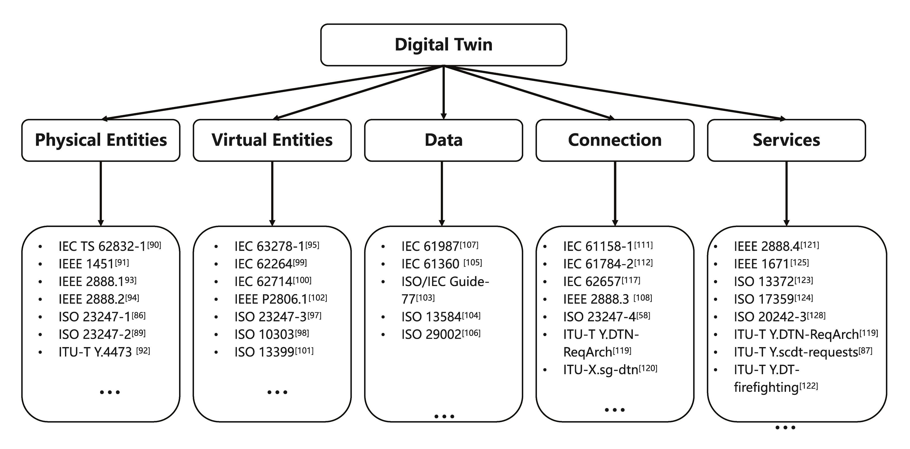

[<- До підрозділу](../README.md)

# Огляд технологічних стандартів для впровадження цифрового двійника

https://digitaltwin1.org/articles/2-4

Wang K, Wang Y, Li Y et al. A review of the technology standards for enabling digital twin [version 2; peer review: 2 approved]. Digital Twin 2022, 2:4 (https://doi.org/10.12688/digitaltwin.17549.2)

Ця стаття перекладена з використанням ChatGPT.

## Анотація

У процесі розроблення застосунків, що реалізують цифрові двійники, відсутність посилань на стандарти, пов’язані з термінами, архітектурою та моделями цифрових двійників, призводить до розбіжностей у розумінні цього поняття серед користувачів і ускладнює взаємозв’язок даних, моделей і сервісів між різними підприємствами або галузями. Тому цифровий двійник, за своєю природою як міждисциплінарна технологія, потребує стандартизації як інструменту впровадження. У цій статті подано передумови та вступ до технології цифрових двійників на основі п’ятивимірної моделі цифрового двійника, а також наведено огляд останніх розробок у сфері стандартизації цифрових двійників. Далі проаналізовано виклики та подано пропозиції щодо подальшої стандартизації цифрових двійників. Аналіз ландшафту стандартів у цій галузі узагальнює інформацію від таких організацій, як Міжнародна організація зі стандартизації (ISO), Міжнародна електротехнічна комісія (IEC), Міжнародний союз електрозв’язку (ITU) та Інститут інженерів з електротехніки та електроніки (IEEE).

## Вступ

Цифровий двійник (Digital Twin, DT) запропоновано професором Ґрівзом. Він розглядається як органічна єдність фізичного об’єкта (чи фізичної сутності) та його цифрового представлення, які взаємодіють між собою, впливають одне на одного та спільно еволюціонують завдяки двостороннім зв’язкам. Спершу концепція цифрового двійника виникла у військовій і аерокосмічній галузях, але згодом набула широкого поширення в промисловості та «розумних» містах. Упродовж останніх років цифрові двійники активно впроваджуються у вертикальні галузі, як-от транспорт і охорона здоров’я, для реалізації опису механізмів, діагностики відхилень, прогнозування ризиків, підтримки ухвалення рішень тощо.

Одним із головних викликів для «розумного» виробництва є потреба зробити кожен елемент фабрики інтелектуальним, здатним своєчасно реагувати на змінні вимоги. DT виступає засобом подолання цих викликів завдяки таким властивостям, як інтеграція з віртуальною реальністю, взаємодія в реальному часі, ітеративна робота та оптимізація, керування даними про всі елементи / процеси / бізнес-функції. Цифрові двійники активно досліджуються в науковій спільноті та промисловості. За статистикою, понад 1000 наукових установ із понад 50 країн (зокрема США, Китаю, Німеччини) займаються теорією та застосуванням цифрових двійників, а результати досліджень уже опубліковано. Водночас такі світові компанії, як Siemens, Tesla, ANSYS, GE, PTC, Dassault та інші впроваджують цифрові двійники на практиці у своїх галузях.

У процесі створення застосунків цифрових двійників неминучим є забезпечення взаємодії між підприємствами або галузями, а отже — необхідна наявність відповідних стандартів. Для побудови замкненого контуру системи оптимізації з інтелектуальним ухваленням рішень, застосування DT передбачає співпрацю всіх елементів з різних доменів. Стандарти забезпечують сумісність продуктів і сервісів, як у межах, так і між доменами. Вони є обов’язковими для комерціалізації продукції, слугують основою для розроблення продуктів і процесів, а також передбачають методи забезпечення зручності, передбачуваності та безпеки для всіх учасників. Отже, відповідні стандарти є необхідною умовою для впровадження цифрових двійників у різних сферах застосування.

Це дослідження містить огляд останніх розробок у сфері стандартизації цифрових двійників і надає загальну інформацію про саму технологію, включаючи модель п’яти вимірів цифрового двійника. Додатково аналізуються виклики й подаються пропозиції для подальшої стандартизації. Аналіз ландшафту стандартів ґрунтується на інформації від ISO, IEC, ITU та IEEE.

### Мотивація

Метою цієї статті є забезпечення розуміння застосування цифрових двійників для вдосконалення продуктів і процесів. У багатьох вертикалях, зокрема в розумному виробництві та «розумному» місті, цифрова система потребує системного проєктування, побудови, експлуатації, обслуговування та вдосконалення. Виникають труднощі із впровадженням DT, зокрема — уніфіковане розуміння між різними галузями, питання сумісності тощо. Тому стандартизація розглядається як важливий інструмент у цьому процесі. Метою цього дослідження є узагальнення наявних стандартів, пов’язаних із DT, аналіз досвіду їхнього застосування та формування рекомендацій щодо подальшої стандартизації. Окрім того, систематичний огляд стандартів може стати корисним джерелом інформації для дослідників і постачальників рішень DT.

### Огляд методу пошуку та аналізу

Методологія цього дослідження починається з пошуку літератури щодо технічних архітектур цифрових двійників. Враховуючи системний і деталізований підходи, було обрано відповідну архітектуру DT — п’ятивимірну модель, запропоновану Тао та ін. Ця модель слугує основою для роботи. На основі її складових сформовано область дослідження для кожного елемента DT, що підкріплюється аналізом наукових публікацій, а також ідентифіковано ключові потреби у стандартизації для кожної сфери. Одночасно здійснено пошук релевантних стандартів за звітами провідних органів стандартизації — ці стандарти віднесено до відповідних елементів моделі 5D.

Решта статті структурована так: у розділі 2 подано огляд літератури про цифрові двійники; у розділі 3 — детальний огляд відповідних стандартів; у розділі 4 — обговорення, включно з викликами й пропозиціями; у розділі 5 — висновки.

## Огляд літератури щодо цифрових двійників

У цьому розділі подано огляд досліджень, присвячених цифровим двійникам, орієнтованих на впровадження у різних галузях і міждисциплінарних сферах. З огляду на фокус основного дослідження на стандартах, що стосуються цифрових двійників, розглянуто технічну архітектуру, приклади застосування та виклики. Для проведення інформативної оцінки поточного стану стандартизації DT необхідна комплексна архітектура, що забезпечує систематичну декомпозицію технологій цифрового двійника.

### Архітектура цифрового двійника

Архітектура — це уніфікована структура, що слугує основою для впровадження технології. Вона дозволяє поділити технологію на ключові елементи й полегшує їхню інтеграцію в наявну або нову екосистему з мінімальними зусиллями. Існує багато варіантів архітектур цифрових двійників, які узагальнено в деяких оглядах літератури.

Огляд літератури виявив багато архітектур зі схожими дослідницькими підходами. Наприклад, у 2014 році Ґрівз опублікував аналітичну записку, згідно з якою базова модель цифрового двійника складається з трьох основних частин: (а) фізичний продукт у реальному просторі, (б) віртуальний продукт у віртуальному просторі, (в) зв’язки даних та інформації, що об’єднують ці два компоненти. У своєму звіті щодо цифрових двійників в Інтернеті речей (IoT) компанія Gartner зазначила, що для створення цифрового двійника фізичної сутності потрібні чотири ключові елементи: модель, дані, моніторинг і унікальність.

З погляду стандартизації перевага надається архітектурам із чітко виокремленими елементами, оскільки це полегшує зіставлення зі стандартами. Відповідно до цього принципу за основу нашого дослідження обрано п’ятивимірну архітектуру, запропоновану Тао та ін., через її високу деталізацію, що дає змогу зіставляти стандарти з архітектурними елементами з високою точністю.

Обрана архітектура складається з таких елементів: фізична сутність, віртуальна сутність, зв’язок, дані DT та сервіси. Віртуальна сутність є центральним елементом і репрезентує цифрове представлення фізичної сутності. Це не означає, що фізична й віртуальна сутності мають обов’язково існувати одночасно. Зв’язок об’єднує різні частини цифрового двійника. Дані DT поєднують усі пов’язані дані з фізичної й віртуальної частин, обробляються та забезпечують точнішу й повнішу інформацію. Сервіси (Ss) забезпечують функціональність цифрового двійника у стандартизованій і модульній формі, що спрощує їх застосування за запитом.

### Ключові елементи цифрового двійника

Цифровий двійник — це широка тема, що охоплює безліч застосувань. У цьому підрозділі розглянуто публікації, пов’язані з цифровими двійниками. Основну увагу приділено аспектам, важливим для «розумного» виробництва та «розумного» міста, які визначають класифікацію та відбір публікацій відповідно до моделі 5D.

#### Ключові аспекти огляду за моделлю 5D — фізична сутність

Фізична сутність є найнижчим рівнем у п’ятивимірній моделі. Вона виступає двійником віртуальної сутності. Посилання [15–20] стосуються фізичного рівня. Фізична сутність має ієрархічну будову. Залежно від функціонального призначення та структури, зазвичай виділяють: одиничну фізичну сутність, фізичну систему та систему систем фізичних сутностей.

Одним із ключових моментів щодо фізичної сутності є необхідність підвищення здатності до сенсорного сприйняття, що зумовлено вимогами багатьох прикладних сценаріїв. У процесі сприйняття фізичної сутності виникають такі проблеми, як неоднорідність інтерфейсів і протоколів, громіздкість компонентів, багатоджерельні перешкоди тощо [21,22]. Частина досліджень зосереджена на моделях всебічного сенсорного сприйняття, адаптивному аналізі протоколів [23,24].

Інший важливий аспект — це здатність до актуування (виконання дій). У таких галузях, як виробництво, вкрай важливе комплексне та автоматичне виконання керувальних впливів. Датчики збирають необроблені дані в реальному часі й передають їх у цифровий двійник. Вони відіграють вирішальну роль у вимірюванні фізичних параметрів, моніторингу, керуванні та підтримці ухвалення рішень.

З розвитком сенсорних і комунікаційних технологій спостерігається стрімке зростання типів і обсягів сенсорних даних [18,19]. Надійність вимірювань є критично важливою для ефективного керування та подальших дій. Тому окремі дослідження присвячено аналізу надійності сенсорних даних, розгортанню сенсорів, частоті збору даних у цифровому двійнику тощо [21,25]. Наприклад, у [15] запропоновано архітектуру з виявлення, ізоляції та компенсації відмов датчиків (SFDIA) на основі машинного навчання у трьох етапах.

Щодо стандартизації, протоколи для сенсорного сприйняття та актуування можуть значно спростити впровадження, тому повинні бути враховані в спільноті цифрових двійників.

#### Ключові аспекти огляду за моделлю 5D — віртуальна сутність

Віртуальна сутність є найважливішим елементом у п’ятивимірній моделі, оскільки саме на ній базуються всі інші можливості. Основною проблемою є моделювання [10,13,25–34]. Метою моделювання є репрезентація фізичної сутності у віртуальному просторі для виконання симуляцій, які надають цінну інформацію для експлуатації фізичної сутності. Ключовими напрямами досліджень є: класифікація моделей, технології моделювання, показники оцінки моделей тощо.

Багато дослідників намагалися класифікувати типи моделей у межах віртуальної сутності. Наприклад, у [9] віртуальні сутності поділено на: геометричні моделі, фізичні моделі, моделі поведінки та моделі правил. У цифровій мережі двійників розрізняють базову модель і функціональну модель; базова модель включає модель мережевих елементів і топології [34]. У транспортній сфері моделі поділяють на мікроскопічні, мезоскопічні та макроскопічні моделі симуляцій залежно від рівня деталізації й охоплення.

Тільки шляхом поєднання, комбінування та інтеграції всіх вимірних моделей можна сформувати цілісну модель віртуальної сутності з високою точністю на рівні інформаційного простору [10].

Два поширених методи моделювання домінують у дослідженнях: моделювання на основі знань [35–38] та моделювання на основі даних [13,39–41]. Модель може будуватися на основі знань і/або даних з метою підвищення її точності й інтерпретованості.

Методи на основі знань включають експертні системи, нечіткі системи, графи знань тощо. Вони поєднуються з апріорними знаннями та є інтерпретованими. Однак такі моделі не можна оновлювати в реальному часі та важко перенести в інші сценарії, тому трудовитрати на створення бази експертних знань є високими [42].

Моделювання на основі даних може вирішити ці проблеми й є придатним для побудови нелінійних, багатозв’язних і складних моделей. Застосовуються глибинне навчання, штучні нейронні мережі, інтегроване навчання, глибинне навчання з підкріпленням, transfer learning тощо. Водночас, як зазначають дослідження, метод моделювання на основі даних має високі вимоги до даних і слабку інтерпретованість [43].

Деякі дослідники намагаються інтегрувати ці два методи моделювання [42–46].

Окремі дослідження присвячені систематичним теоріям і методам оцінювання якості моделей [26,27]. Метою таких досліджень є спрощення побудови, управління, реконструкції й оптимізації моделей, а також їх перенесення та обміну.

Запропоновано критерій побудови моделі цифрового двійника, що включає «чотири модернізації», «чотири можливості» та «вісім застосувань». На основі досліджень критеріїв побудови було розроблено теоретичну систему моделювання цифрового двійника за шістьма аспектами [27].

Згодом Чжан і Тао деталізували вісім критеріїв оцінки моделей, запропонували систему оціночних індексів для моделі цифрового двійника та навели метод обчислення цих індексів [28].

Щодо стандартів, необхідні уніфікована структура сутностей, інформаційна модель, опис підмоделей, сумісність і структура для оцінювання.

#### Ключові аспекти огляду за моделлю 5D — дані цифрового двійника

Дані цифрового двійника є рушійною силою цифрового двійника. Одним із ключових аспектів є те, що дані, згенеровані фізичними та віртуальними сутностями, висувають додаткові вимоги до обробки й управління даними в межах цифрового двійника.

Ці вимоги охоплюють: подання даних, їх класифікацію, зберігання, попередню обробку, злиття, використання й обслуговування, тестування тощо.

У різних сферах дані мають різні характеристики. Наприклад, у промислових застосуваннях присутні структуровані, неструктуровані й напівструктуровані дані — такі як у PLM (керування життєвим циклом продукції) та SLM (керування життєвим циклом обслуговування) [47].

У мережі цифрових двійників сирі дані, зібрані з фізичних сутностей, мають характеристики багатоджерельності, багатомасштабності та високого рівня шуму [48]. Частина цих даних може спричинити перевантаження, якщо їх передавати безпосередньо через систему зв’язку. Тому необхідні очищення та злиття даних для підвищення їхньої надійності й стабільності [48].

У робототехнічному виявленні застосовується метод злиття даних з вагами за ентропією [49]. У проєктуванні для аерокосмічної галузі, де дані обмежені та невизначені, метод Байєса показує більшу стійкість [50]. Злиття даних досліджується в багатьох сферах [50–55], зокрема на виробництві, у розумному транспорті та в міському середовищі.

Ще один ключовий аспект — це безпека та конфіденційність даних. Дані як актив передаються між підприємствами та етапами життєвого циклу продукції, тому необхідні відповідні механізми захисту прав власності на дані. Блокчейн і федеративне навчання є перспективними технологіями для підвищення надійності й безпеки системи та посилення конфіденційності даних [56–58].

Щодо стандартів, необхідні уніфіковані настанови щодо обробки й управління даними, які включають: перетворення неоднорідних даних, правила синтаксичного й семантичного відображення багатоджерельних і мультимодальних даних, правила обміну даними — такі як тип елемента даних, структура даних, бібліотека даних і тип елемента даних.

#### Ключові аспекти огляду за моделлю 5D — з’єднання

З’єднання забезпечує взаємопов’язаність усіх компонентів цифрового двійника, включаючи з’єднання між:

- фізичними сутностями та віртуальними моделями,
- фізичними сутностями та даними,
- фізичними сутностями та сервісами,
- віртуальними моделями та даними,
- віртуальними моделями та сервісами,
- сервісами та даними.

З’єднання потребує уніфікованих комунікаційних інтерфейсів і протоколів. Проте існують проблеми сумісності. Наприклад, промислові системи передачі даних переважно організовані відповідно до "піраміди" автоматизації: на її вершині застосовуються стандартні ІТ-протоколи (наприклад, IP), а для міжмашинного та процесного зв’язку (рівень розподілених контролерів) використовуються системи на основі Ethernet — Profinet, EtherNet/IP, EtherCAT, Modbus/TCP, CC-Link IE, SERCOS III тощо.

Пристрої зазвичай контролюються за допомогою ПЛК, DCS, SCADA, FCS та інших систем.

У цій архітектурі існує три основні проблеми:

1. Велика кількість рівнів протоколів, розбіжності між протоколами на різних рівнях, фрагментованість інтерфейсних стандартів, складна сумісність.
2. Дані операційних технологій (OT) зазвичай потребують періодичної передачі для реалізації керування, тоді як дані ІТ (наприклад, документи, зображення, відео) є неперіодичними.
3. Через різні вимоги до реального часу ІТ- та OT-мережі мають відмінності. Для завдань з мікросекундною точністю (наприклад, керування рухом) потрібна мережа з дуже низькою затримкою та джитером. У той час як в ІТ-мережах іноді реального часу не вимагається, проте існують вимоги до пропускної здатності.

Отже, однією з важливих вимог до з’єднання є необхідність у потужніших і сумісніших технологіях зв’язку, щоб задовольнити вищезазначені вимоги. Слід розглядати інтеграцію технологій 5G і ближньомережевих (proximity network). Під proximity network [59] мається на увазі технологія доступу до мережі з боку кінцевих пристроїв (у рамках архітектури край-хмара), зокрема таких як:

- уніфікована архітектура OPC (OPC UA) [48,60–67],
- короткодіапазонні технології зв’язку (Sparklink, Wi-Fi),
- мережі з часовою чутливістю (TSN).

OPC UA пропонується як повна, безпечна, надійна та кросплатформна архітектура, сумісна з різними апаратними та програмними платформами. Вона забезпечує взаємодію на семантичному рівні між різними стандартами, проте збільшує затримку. TSN є ефективною технологією для забезпечення узгодженості між елементами цифрового двійника.

Інтеграція 5G і детермінованих мереж може допомогти вертикальним галузям реалізувати міжмережеву взаємодію та обмін даними між компонентами інтегрованої системи як у дротовому, так і в бездротовому середовищі. Вона дозволяє задовольнити обмежені бізнес-вимоги щодо низької затримки, малого джитеру й високої надійності в таких сценаріях, як детермінована передача даних та точна синхронізація годинників. Водночас це вирішує проблему ізольованих інформаційних островів, спричинену наявністю численних несумісних промислових протоколів.

Крім того, потрібне управління вищезазначеними технологіями з’єднання [48,57,67–74]. Побудова мережі цифрового двійника є ефективним способом підвищення ефективності та масштабованості з’єднань [48,67]. Запропоновано архітектуру мережі цифрового двійника, яка включає 6G, 5G і edge-мережі [36,64]. На основі таких мереж реалізуються функції виявлення відмов датчиків, прогнозного обслуговування, самооптимізації тощо. Блокчейн, федеративне навчання та інші технології асоціації на краю в цифрових двійниках можуть забезпечити нові можливості для мереж наступного покоління, таких як 6G [57,68–74].

Щодо стандартів, необхідні уніфіковані рекомендації для забезпечення інтероперабельності моделей, включаючи:

- специфікації інтелектуальної взаємодії та інтерфейсні протоколи для фізичних гетерогенних елементів,
- перетворення гетерогенних даних,
- стандарти зв’язку та протоколи,
- правила синтаксичного й семантичного зіставлення багатоджерельних і мультимодальних даних,
- інтерфейси синхронної взаємодії реального й віртуального для багатовимірних моделей [75].

#### Ключові аспекти огляду за моделлю 5D — сервіси

Сервіс є результатом роботи цифрового двійника і виступає невід’ємним компонентом цифрового двійника відповідно до парадигми «все-як-сервіс» (XaaS) [21]. Численні дослідження присвячено вивченню можливих сервісів, які можуть надавати цифрові двійники, та пов’язаних з ними технологій реалізації [21,76–84].

Деякі дослідники запропонували низку прикладів застосування цифрових двійників: супутникові та космічні комунікаційні мережі, кораблі, транспортні засоби, електростанції, літаки, складне електромеханічне обладнання тощо [9].

Огляд літератури показує, що до деяких сервісів виявляється значний інтерес як у загальному, так і в галузевому контексті. Наприклад, до універсальних сервісів належать прогнозно-діагностичне обслуговування (PHM) і керування життєвим циклом продукту (PLM). Серед галузевих сервісів — цифрова мережа двійників, цифровий двійник «розумного міста», цифрова фабрика тощо.

Сервіс цифрової мережі двійників охоплює планування мережі, автоматичне керування, технічне обслуговування й оптимізацію мережі, моніторинг трафіку, діагностику несправностей, оптимізацію розкладу тощо [81].

Для онлайн-прогнозування трудомісткості на основі даних у реальному часі застосовуються нейронні мережі, а в цифрових майстернях розглядається динамічне планування складання для аерокосмічних виробів [83].

У проєктах цифрового двійника «розумного міста» основну увагу приділено моніторингу енергоспоживання та будівель, міському плануванню, циркулярній економіці та сталому розвитку, керуванню мобільністю й автопарком, моніторингу забруднень, охороні здоров’я [84].

З метою розв’язання проблеми нечіткої продуктивності системи та низької оптимізації в системах роботизованого комплектування (RMFS) з розподіленим плануванням багатьох автоматизованих транспортних засобів (AGV) було запропоновано централізовану стратегію диспетчеризації на основі цифрового двійника [82].

Попри наявність досліджень і реалізацій сервісів цифрових двійників, у практичному застосуванні залишаються дві суттєві проблеми:

1. Більшість реалізацій цифрових двійників обмежені етапами проєктування та виконання процесу, і мають бути розширені до стадій моніторингу, керування й оптимізації.
2. У багатьох застосуваннях між окремими стадіями спостерігаються розриви сервісної взаємодії, і безперервний потік сервісів досі не реалізовано повною мірою.

Щодо стандартів, необхідні: уніфіковані вимоги, модель опису сервісів, управління сервісами, забезпечення якості сервісів (QoS) тощо.

## Стандарти для цифрових двійників

Стандарт — це документ, розроблений на основі консенсусу та затверджений визнаним органом, який встановлює правила, настанови або характеристики для загального й багаторазового використання щодо діяльності чи її результатів з метою досягнення оптимального рівня впорядкованості в заданому контексті [85].

### Організації зі стандартизації

До основних організацій, що займаються розробленням стандартів, належать (але не обмежуються) ISO, IEC, ITU та IEEE. Більшість із них здійснюють діяльність зі стандартизації цифрового двійника або пов’язаних з ним технологій.

*Міжнародна організація зі стандартизації (ISO)* — це міжнародна організація, яка розробляє стандарти, до складу якої входять національні органи стандартизації. Щодо цифрових двійників ISO приділяє найбільшу увагу промисловості та суміжним сферам. Технічний комітет 184 «Системи автоматизації та інтеграції» був першим, хто ініціював проєкт цифрового двійника. Його підкомітет 4 «Промислові дані» опублікував першу серію стандартів цифрових двійників для інтелектуального виробництва. Кілька проєктів у галузі стандартизації цифрових двійників, пов’язаних з промисловими даними та системами, розробляються в межах цього комітету.

ISO також створила робочу групу ISO/IEC JTC 1/SC 41/WG6, яка спеціально зосереджена на стандартизації цифрового двійника, включаючи поняття, термінологію, приклади використання та пов’язані технології.

*Міжнародна електротехнічна комісія (IEC)* — це міжнародна організація зі стандартизації у сфері електротехнологій, зокрема генерації та передавання електроенергії, напівпровідників, моделей і наборів даних тощо. Робоча група IEC/TC 65/WG 24 надає рекомендації щодо оболонки адміністрування активів (Asset Administration Shell, AAS), яку можна розглядати як один із способів реалізації цифрового двійника в інтелектуальному виробництві. AAS забезпечує представлення реальних активів в інформаційному середовищі за допомогою структур, властивостей і сервісів для підтримки виробничих і керівних процесів.

*Сектор стандартизації Міжнародного союзу електрозв’язку (ITU-T)* координує стандарти в галузі телекомунікацій та інформаційно-комунікаційних технологій. На відміну від ISO та IEC, діяльність ITU більше орієнтована на прикладні аспекти, зокрема розробку стандартів для цифрових двійників у контексті «розумних міст» і мереж — ці напрями активно розвиваються в межах ITU-T.

*Асоціація зі стандартизації Інституту інженерів з електротехніки та електроніки (IEEE-SA)* є структурним підрозділом IEEE, що розробляє глобальні стандарти для широкого спектра галузей. Робоча група IEEE-SA з цифрового представлення (Digital Representation Working Group, DR_WG) зосереджена на цифровому поданні та публікує серію стандартів цифрового представлення різних елементів цифрового двійника.

### Каркас стандартів цифрового двійника

У цьому розділі наведено зіставлення стандартів, пов’язаних із цифровими двійниками, до п’ятивимірної моделі цифрового двійника, розглянутої в розділі 2. Як показано на рисунку 1, кожен вимір відповідає певному набору стандартів. Наведені нижче стандарти стосуються безпосередньо цифрових двійників або технологій цифрових двійників; численні інші стандарти, що мають дотичне відношення (наприклад, стандарти опису фізичних сутностей, форматів даних або інтерфейсів), тут не згадуються.

Figure 1. Framework of digital twin standards.

Окрім п’яти ключових аспектів, окремо слід відзначити поняття цифрового двійника як основу для його застосування. Проте в межах організацій зі стандартизації досі не досягнуто консенсусу щодо визначення терміна «цифровий двійник». Наприклад, у сфері виробництва стандарт ISO 23247-1 означує цифровий двійник як «придатне до мети цифрове представлення спостережуваного виробничого елемента із засобом, що забезпечує зближення між елементом та його цифровим представленням із відповідною швидкістю синхронізації» [86]. У той час як у сфері розумних міст стандарт ITU-T Y.scdt-reqts означує цифровий двійник як «цифрове представлення об’єкта, що становить інтерес» [87].

Існуючі стандарти цифрових двійників залежать від сценаріїв застосування й об’єкта моделювання. Потрібно загальне означення цифрового двійника, що прояснить і формалізує його базову концепцію; робота над відповідним стандартом триває — це проєкт комітету ISO/IEC AWI 30173 «Digital twin — Concepts and terminology» [88].

**Фізичні сутності.** У системі цифрового двійника фізичні сутності виконують дві основні функції: збір даних і керування пристроями. Вони є джерелами даних і виконавчими елементами віртуальних сутностей.

Стандарти цифрових двійників у різних галузях дещо відрізняються у визначенні меж фізичних сутностей, що обумовлено специфікою прикладних сценаріїв. У сфері інтелектуального виробництва стандарт ISO 23247-2 ідентифікує «фізичний» об’єкт як «спостережуваний виробничий елемент», до якого відносять персонал, обладнання, матеріали, інфраструктуру, середовище, продукти, а також логічні об’єкти, такі як супровідні документи та процеси [89].

Стандарт IEC TS 62832-1 розширює поняття логічного об’єкта, включаючи нематеріальні об’єкти, такі як програмне забезпечення, концепції, патенти, ідеї, методи та будь-що, що може вважатися активом промисловості [90]. Водночас обидва стандарти орієнтовані на цифрові двійники в промисловості, тому потрібне уніфіковане означення цифрового двійника для міжгалузевого застосування.

Керування та актуування — це ще одна важлива функція фізичних сутностей. При застосуванні цифрового двійника до фізичних систем слід враховувати інтерфейси сенсорів і команд. Стандарт IEEE 1451 пропонує рішення для сенсорного інтерфейсу: він передбачає створення самодокументованих електронних паспортів (TEDS) та незалежної від мережі моделі смарт-трансдьюсера, що дозволяє виробникам сенсорів підтримувати кілька мереж і протоколів, полегшуючи їхнє підключення за принципом «plug and play» [91].

Стандарт ITU-T Y.4473 визначає прикладний програмний інтерфейс (API), який забезпечує каркас для з’єднання пристроїв Інтернету речей (IoT), даних і застосунків через веб, що дозволяє управляти спостереженнями й метаданими з гетерогенних сенсорних систем [92].

IEEE також ініціював серію стандартів IEEE 2888, яка комплексно описує інтерфейс між кіберпростором (цифровий двійник) і фізичним світом. Стандарти IEEE P2888.1 і IEEE P2888.2 визначають словник, вимоги, метрики, формати даних і API для отримання інформації від сенсорів і керування виконавчими пристроями, а також формалізують інтерфейси між цифровим і фізичним світами. Наразі ці стандарти перебувають у розробці [93,94].

**Каркас стандартів цифрового двійника**

У цьому розділі наведено зіставлення стандартів, пов’язаних із цифровими двійниками, до п’ятивимірної моделі цифрового двійника, розглянутої в розділі 2. Як показано на рисунку 1, кожен вимір відповідає певному набору стандартів. Наведені нижче стандарти стосуються безпосередньо цифрових двійників або технологій цифрових двійників; численні інші стандарти, що мають дотичне відношення (наприклад, стандарти опису фізичних сутностей, форматів даних або інтерфейсів), тут не згадуються.

Окрім п’яти ключових аспектів, окремо слід відзначити поняття цифрового двійника як основу для його застосування. Проте в межах організацій зі стандартизації досі не досягнуто консенсусу щодо визначення терміна «цифровий двійник». Наприклад, у сфері виробництва стандарт ISO 23247-1 означує цифровий двійник як «придатне до мети цифрове представлення спостережуваного виробничого елемента із засобом, що забезпечує зближення між елементом та його цифровим представленням із відповідною швидкістю синхронізації» [86]. У той час як у сфері розумних міст стандарт ITU-T Y.scdt-reqts означує цифровий двійник як «цифрове представлення об’єкта, що становить інтерес» [87].

Існуючі стандарти цифрових двійників залежать від сценаріїв застосування й об’єкта моделювання. Потрібно загальне означення цифрового двійника, що прояснить і формалізує його базову концепцію; робота над відповідним стандартом триває — це проєкт комітету ISO/IEC AWI 30173 «Digital twin — Concepts and terminology» [88].

#### Фізичні сутності

У системі цифрового двійника фізичні сутності виконують дві основні функції: збір даних і керування пристроями. Вони є джерелами даних і виконавчими елементами віртуальних сутностей.

Стандарти цифрових двійників у різних галузях дещо відрізняються у визначенні меж фізичних сутностей, що обумовлено специфікою прикладних сценаріїв. У сфері інтелектуального виробництва стандарт ISO 23247-2 ідентифікує «фізичний» об’єкт як «спостережуваний виробничий елемент», до якого відносять персонал, обладнання, матеріали, інфраструктуру, середовище, продукти, а також логічні об’єкти, такі як супровідні документи та процеси [89].

Стандарт IEC TS 62832-1 розширює поняття логічного об’єкта, включаючи нематеріальні об’єкти, такі як програмне забезпечення, концепції, патенти, ідеї, методи та будь-що, що може вважатися активом промисловості [90]. Водночас обидва стандарти орієнтовані на цифрові двійники в промисловості, тому потрібне уніфіковане означення цифрового двійника для міжгалузевого застосування.

Керування та актуування — це ще одна важлива функція фізичних сутностей. При застосуванні цифрового двійника до фізичних систем слід враховувати інтерфейси сенсорів і команд. Стандарт IEEE 1451 пропонує рішення для сенсорного інтерфейсу: він передбачає створення самодокументованих електронних паспортів (TEDS) та незалежної від мережі моделі смарт-трансдьюсера, що дозволяє виробникам сенсорів підтримувати кілька мереж і протоколів, полегшуючи їхнє підключення за принципом «plug and play» [91].

Стандарт ITU-T Y.4473 визначає прикладний програмний інтерфейс (API), який забезпечує каркас для з’єднання пристроїв Інтернету речей (IoT), даних і застосунків через веб, що дозволяє управляти спостереженнями й метаданими з гетерогенних сенсорних систем [92].

IEEE також ініціював серію стандартів IEEE 2888, яка комплексно описує інтерфейс між кіберпростором (цифровий двійник) і фізичним світом. Стандарти IEEE P2888.1 і IEEE P2888.2 визначають словник, вимоги, метрики, формати даних і API для отримання інформації від сенсорів і керування виконавчими пристроями, а також формалізують інтерфейси між цифровим і фізичним світами. Наразі ці стандарти перебувають у розробці [93,94].

Хоча наразі не існує опублікованого стандарту, присвяченого фізичним сутностям цифрового двійника, багато наявних стандартів можна повторно використати або послатися на них. Профілі польових шин, специфікації-супутники та інші специфікації, що визначають властивості пристроїв і компонентів, слід трансформувати у стандартизовані словники. Також слід включити до таких словників характеристики концептуальних активів, наприклад, документи з планування.

#### Віртуальні сутності

У системі цифрового двійника віртуальні сутності є цифровим представленням фізичних сутностей. Вони складаються з моделей, що описують фізичні об’єкти через мультишарові часові та просторові масштаби.

З погляду структури, стандарт IEC 63278-1 ED1 «Оболонка адміністрування активу (AAS) для промислових застосувань. Частина 1: Структура оболонки» є першим стандартом, пов’язаним із віртуальними сутностями. Він визначає семантичну модель для опису характеристик активів, а також формат серіалізації та обміну даними між моделями, підмодулями та AAS. Незважаючи на орієнтацію цього стандарту на промисловість, його можуть розглядати і в інших вертикалях, як-от «розумне місто» [95].

У галузі моделювання ще до активного поширення концепції цифрового двійника було здійснено чимало зусиль різними організаціями зі стандартизації. ISO 23247 [96] прямо заявляє про перевагу використання наявних стандартів моделювання. У ISO 23247-3 [97] перелічено кілька таких стандартів: серія ISO 10303 (обмін даними моделі виробу) [98], IEC 62264 (інтеграція систем управління підприємством) [99], IEC 62714 (AutomationML) [100], ISO 13399 (представлення та обмін даних про ріжучий інструмент) [101] тощо. Хоча ці стандарти не були створені спеціально для цифрового двійника, вони охоплюють більшість прикладних випадків завдяки реалізації XML, JSON, RDF, AML, OPC UA та інших мов опису даних.

Крім цього, ведеться розроблення спеціалізованих стандартів для цифрових двійників. Наприклад, IEEE P2806 [102] запропонував цифрове представлення для цифрових двійників, у якому визначено високошвидкісну конверсію протоколів, уніфіковане моделювання даних та інтерфейси доступу до даних у ситуаціях із гетерогенними джерелами.

Слід звернути особливу увагу на те, що цифрові двійники деяких поширених елементів, як-от шлюзи та камери, потребують міжгалузевої координації для повноцінного відображення всіх аспектів.

#### Дані

Дані — це рушійна сила цифрового двійника. У системі цифрового двійника моделі й інформаційні представлення не функціонують ізольовано. Часто відбувається обмін даними й моделями між різними системами цифрових двійників, тому необхідно стандартизувати структури даних і їхні властивості: тип, формат, типові значення.

Більшість технологій обробки й керування даними в цифровому двійнику можуть бути реалізовані за допомогою чинних стандартів. Наприклад, у розумному виробництві вже використовуються ISO/IEC Guide 77, ISO 13584, IEC 61360-1, ISO 29002 та IEC 61987 [103–107]. Вони встановлюють правила обміну даними та стандартизують типи елементів, структури, бібліотеки та типові значення даних для промислових систем.

ISO/IEC Guide 77 надає загальні рекомендації щодо опису продуктів і їхніх характеристик з використанням ISO 13584 та IEC 61360 — для створення машинно-оброблюваних словників посилань.

Водночас обробка даних, пов’язаних із віртуальними сутностями, може потребувати додаткової уваги. У деяких типових сценаріях застосування цифрового двійника (розумне виробництво, пожежна безпека тощо) висуваються вимоги до низької затримки, тому слід стандартизувати додаткові властивості, такі як мітки часу та умови чинності.

Крім того, дані, створені віртуальними сутностями, мають бути чітко відокремлені від даних фізичних сутностей — це вимагає внесення змін до стандартів і розроблення нових стандартів ідентифікації.

#### З’єднання

Під з’єднанням мається на увазі комунікація й взаємодія, що забезпечують зв’язок між сутностями. IEEE запропонував каркас можливостей для таких взаємодій — стандарт 2888.3, який описує можливості взаємодії між об’єктами в кіберсвіті та фізичному світі: зокрема, взаємодію між фізичними й цифровими сутностями, інтеграцію з бекенд-системами, доступ до сутностей авторизованими сторонами, опис фізичних і віртуальних пристроїв, а також будь-яких об’єктів, які можна змоделювати [108].

Для забезпечення взаємодії між компонентами цифрового двійника слід враховувати співіснування кількох мереж. Важливим стандартом для вирішення цього завдання є OPC UA [109]. Завдяки своїм семантичним можливостям OPC UA забезпечує не лише передавання даних, але й інформаційно-орієнтовану модель даних, яка перетворює гетерогенні дані в уніфіковану інформацію, забезпечуючи безпечний обмін даними в промислових системах.

Мережа цифрового двійника та підключення є ключовими аспектами його реалізації. З’єднання охоплює не лише обмін даними між різними системами цифрового двійника, а й сам передавальний канал. На відміну від звичайних IoT-комунікаційних систем, цифрові двійники вимагають більш детермінованої, високошвидкісної, синхронізованої передачі даних. Для задоволення цих вимог розробляються нові технології й відповідні стандарти.

У промислових системах IEC та IEEE вже пропонують складні рішення для дротової комунікації, які відповідають високим вимогам цифрового двійника, наприклад, серії IEEE 802.3, IEC 61158-1 та IEC 61784-2 [110–112]. Крім того, стандартизовано й радіозв’язок: IEC 62591:2016 (WirelessHART), IEC 62601 (WIA-PA), IEC 62734 (ISA100a) та IEC 62948 (WIA-FA) [113–116].

У зв’язку з розвитком комунікаційних технологій зростає інтерес до інтеграції гетерогенних мереж, оскільки цифрові двійники працюють у багатопротокольних середовищах. Багато з відповідних стандартів (TSN, 5G, WLAN, SmartMesh, 6LoWPAN) перебувають на стадії розроблення. Наприклад, серія стандартів IEC 62657 визначає вимоги до спектра бездротового зв’язку в умовах співіснування багатьох бездротових мереж, а також концепції та процедури управління сумісністю [117]. Організація 5G-ACIA у співпраці з IEEE та IEC досліджує інтеграцію 5G з TSN та OPC UA [118].

У галузі управління мережами ITU ініціювала новий проект Y.DTN-ReqArch “Вимоги та архітектура мережі цифрового двійника (DTN)” для управління мережевими ресурсами з метою аналізу, діагностики, моделювання та керування фізичною мережею [119]. Також ITU розробляє рекомендації з кібербезпеки цифрових двійникових мереж (X.sg-dtn), які містять вимоги та контрзаходи для посилення захисту [120].

Попри наявність придатних стандартів, необхідно вжити подальших заходів. По-перше, слід чітко визначити, які типи обладнання та параметри мають бути враховані для забезпечення взаємодії в мережі цифрових двійників, оскільки 3GPP, IEC та IEEE вже розробили багато стандартів. По-друге, поняття “реального часу” — ключова характеристика цифрового двійника — досі не стандартизоване. Слід визначити параметри та методики для оцінювання реального часу в різних галузях. По-третє, хоча вже є проєкти стандартів для основних мереж цифрового двійника, потрібно також розробити уніфікований стандарт для ближніх мереж (TSN, OPC UA, польові шини, Ethernet) з метою моніторингу та управління всіма співіснуючими мережами.

#### Сервіси

Надання сервісів — основна мета цифрового двійника. У стандартах вже зібрано приклади застосування з різних галузей.

У галузі розумного виробництва ISO 23247-4 містить приклади використання, зокрема "динамічне планування виробничих завдань між кількома роботами", де моделі цифрових двійників продукту, процесу й ресурсів використовуються для динамічного перепланування [59]. IEEE 2888.4 запропонував архітектуру для системи навчання реагування на надзвичайні ситуації у віртуальній реальності з шістьма ступенями свободи [121].

У сфері розумного міста проєкт ITU-T Y.scdt-requests [87] передбачає моделювання з використанням агентів для оптимізації стратегій паркування. Стандарт ITU-T Y.DTN-ReqArch [119] описує сервіси мережі цифрового двійника для операцій і техобслуговування, оптимізації, інновацій, вимірювань, кібербезпеки тощо.

У сфері цифрового двійника для пожежогасіння розглянуто два приклади: моніторинг пожежі та розробка/тренування стратегії порятунку [122].

На основі наведених прикладів слід розглядати стандарти цифрових двійникових сервісів, зокрема опис сервісів, тестування, QoS тощо.

Існує чимало стандартів, які, хоча й не були створені спеціально для цифрових двійників, можуть бути використані. Наприклад:

- Для опису сервісів цифрового двійника необхідно стандартизувати як загальні вимоги (PHM, PLM, моделювання, візуалізація), так і специфічні залежно від сценарію.
- Відповідні стандарти: ISO 13372:2004 [123], ISO 17359:2003 [124], IEEE Std 1671–2006 [125] тощо.

Стандарти тестування сервісів є відносно зрілими, наприклад: IEEE 1232.3-2014 [126], IEEE 1904.1 Conformance 01-2014 [127], ISO 20242-3-2011 [128], ISO 20242-4-2011 [129], ISO/IEC 14393-1996 [130] тощо. У міжнародній класифікації стандартів тестування сервісів охоплюється багато аспектів, зокрема системи автоматизації виробництва, інтеграція інформаційних технологій (ІТ), застосування ІТ, ІТ-термінали та інше периферійне обладнання, інтерфейси та засоби взаємозв’язку.

Наприклад, IEEE 1232.3-2014 стосується обміну інформацією та сервісами зі штучним інтелектом у всіх середовищах тестування. Стандарт ISO 20242-3-2011 визначає інтерфейси сервісів віртуальних пристроїв, які є незалежними від операційної системи комп’ютера, технології підключення пристрою, постачальників пристроїв і технологічного розвитку пристроїв у майбутньому.

Щодо якості сервісів (QoS), МСЕ (ITU) запропонувала серію відповідних стандартів. Деякі з них мають загальний характер. Наприклад, рекомендація ITU-T E.800 [131] містить набір поширених термінів, що застосовуються при вивченні та управлінні якістю сервісу (QoS), включаючи як технічні, так і нетехнічні. E.800 означує QoS сервісу як сукупний ефект продуктивності сервісу, що визначає задоволення користувача, враховуючи здатність до підтримки, експлуатації, надання послуг і безпеки в усіх компонентах продуктивності сервісу. Це комплексне означення QoS.

Стандарти ITU-T G.1010 [132] і ITU-T G.1000 [133] розширюють E.800. Зокрема, G.1000 ділить якість сервісу на функціональні складові та пов’язує їх із відповідними характеристиками мережі. Він розглядає критерії QoS за чотирма аспектами: вимоги користувача, QoS, яку надає (або планує надати) провайдер, фактично досягнута QoS та сприйняття QoS користувачем. G.1010 доповнює G.1000 і пропонує фреймворк для задоволення широкого спектра вимог кінцевих користувачів, таких як інтерактивність і стійкість до збоїв. ITU-T E.802 [134] визначає структуру та методології для визначення і застосування параметрів QoS.

Втім, у сфері сервісів цифрових двійників ще необхідно вирішити кілька питань:

1. Характерні особливості DT-сервісів, зокрема взаємозв’язок між сервісом і віртуальною сутністю, потребують оновлення деяких стандартів, включаючи фреймворк тестування DT-сервісів, стандарти QoS і управління DT-сервісами.
2. Відсутні нефункціональні стандарти QoS для DT-сервісів (наприклад, масштабованість, повторне використання), а також еталони тестування DT-сервісів.
3. Відсутня стандартизація рівнів DT-сервісів. Хоча у травні 2021 року в рамках ITU-T SG20 була запропонована рекомендація щодо моделі зрілості цифрового двійника, її було відхилено. Це важливе питання, що потребує спільних зусиль спільноти цифрових двійників і матиме значний вплив на дорожню карту застосування DT у різних вертикальних галузях.

Стандартизація тестів DT-сервісів, їх QoS і рівнів сервісів — це завдання для подальших робіт.

## Обговорення

На основі аналізу стандартів, пов’язаних із цифровими двійниками (ЦД), виявлено низку викликів у сфері стандартизації та запропоновано відповідні рекомендації. Одне з основних спостережень полягає в тому, що більшість стандартів були ініційовані лише протягом останніх двох років і перебувають на стадії розробки. Це частково пов’язано з тим, що концепція цифрового двійника є відносно новою, а її впровадження в промисловості наразі є рідкісним. Водночас той факт, що стандартизація випереджає масове впровадження технології, може бути корисним для галузі. Переконливим прикладом є стандартизаційна діяльність у межах 3GPP, яка сприяла зниженню витрат і підвищенню ефективності в телекомунікаційній індустрії. Оскільки цифрові двійники вимагають значної координації, взаємодії та обміну даними між різними провайдерами рішень і сервісів, стандартизація повинна бути рушієм упровадження.

### Виклики

Моделювання, сервіси, оптимізація керування та інші етапи цифрового двійника в окремих сферах можуть охоплювати кілька доменів, часових масштабів і просторових рівнів, що ускладнює постановку задач і породжує нові вимоги. Необхідно комплексно враховувати моделювання та вирішення в усіх вимірах, адже кожен з них може бути взаємопов’язаний із іншими, а традиційні підходи можуть виявитися непридатними. Наприклад, при моделюванні задачі оптимізації мережі в цифровому двійнику мережі слід враховувати не лише часову безперервність і просторову структуру самої мережі та її невизначеність, але й затримки, надійність і інші вимоги до реального часу від прикладної галузі. Як результат, задача ускладнюється настільки, що традиційні методи оптимізації не підходять.

Розуміння цифрових двійників різниться між галузями, що може призводити до конфліктів між системами. Навіть однакові приклади використання можуть реалізовуватися по-різному через відмінне розуміння, створюючи проблеми сумісності й інтероперабельності, а також унеможливлюючи масштабне розгортання.

У деяких стандартах спостерігаються суперечності в трактуванні понять. Наприклад, у сфері «розумних міст» у проєкті рекомендації ITU-T Y.scdt цифрове місто визначено як інструмент для розробки стратегій розвитку міста, тоді як рекомендація Y.DT-interoperability розглядає його як координацію між міськими функціональними адміністраціями.

Також відзначається недостатня участь усіх зацікавлених сторін у поточних проєктах. Створення системи цифрового двійника вимагає спільної участі виробників устатковання, інтеграторів систем, постачальників послуг тощо. Але багато поточних робіт виконуються силами лише однієї організації, що істотно ускладнює впровадження.

### Рекомендації

- Визначити мету та дорожню карту стандартизації цифрових двійників для кожної окремої галузі. Наприклад, у «розумному виробництві» ISO 23247 [96] задає загальні принципи та референсну архітектуру, тоді як IEC 63278 визначає один із варіантів реалізації — AAS [95]. Таку координацію слід наслідувати і в галузі «розумних міст».
- Визначити, які з наявних стандартів можуть бути адаптовані, а які потребують розробки. Для забезпечення сумісності слід максимально використовувати вже існуючі стандарти. Наприклад, у цифрових двійниках виробництва використовуються протоколи AP232, AP238, AP242 і AP239 з ISO 10303 для опису продуктів, процесів, оснастки та стану устатковання [98].
- Забезпечити координацію між ITU-T, ISO та IEC, щоби уникнути дублювання робіт. Для ключових технологій, які застосовуються в різних галузях (наприклад, 5G), стандарти цифрових двійників мають розроблятися з урахуванням інтересів як промисловості, так і міст.
- Визначити галузі, які дійсно потребують цифрових двійників. Це, зокрема:
  - галузі з продукцією високої вартості (автомобілебудування, авіація, електроніка, будівництво, енергетика), де помилки коштують мільйони, а цифрові двійники допомагають уникнути збоїв і зменшити витрати на тестування;
  - сервіси, пов’язані з життям людей (медицина, надзвичайні ситуації), де важлива не вартість, а результат — цифрові двійники забезпечують попередню підготовку, підвищують обізнаність і безпеку.
     У таких сферах користь від цифрового двійника перевищує витрати на його впровадження, тому стандарти для них є першочерговими.

Стандартизація сервісів, QoS та тестування цифрових двійників залишається завданням майбутніх робіт.

## Висновки

Цифрові двійники, як очікується, відіграватимуть провідну роль у проєктуванні, розробленні та експлуатації в усіх галузях промисловості в майбутньому, забезпечуючи нові можливості, що значно перевищують сучасний рівень керування життєвим циклом. Ключові технології цифрових двійників, такі як моделі, дані, з’єднання та комунікації, пришвидшують цифрову трансформацію галузей. Однак із розвитком концепції та технологій цифрових двійників виникає потреба в добре розвиненій системі стандартів для прискорення інженерного впровадження, забезпечення чіткості, гарантії якості та підтримки сервісів.

У цій роботі подано консолідований огляд літератури як базовий контекст і визначено сучасний стан розробок у галузі цифрових двійників. Аналіз технічних стандартів поділено за п’ятьма вимірами: фізична сутність, віртуальна сутність, дані, з’єднання та сервіси. У статті проаналізовано відповідні стандарти, окреслено наявні виклики та запропоновано можливі рекомендації.

Через складність технологій цифрових двійників у роботі охоплено лише ключові технології та загальну архітектуру. Багато прикладних аспектів, таких як засоби моделювання, платформи, процеси розроблення та інші інженерні методики, залишились поза межами цього дослідження. Автори вважають, що ці деталі краще стандартизовувати на рівні окремих компаній або галузей відповідно до специфічних вимог.

Ця робота може допомогти науковцям і практикам промисловості зрозуміти новітні тенденції у сфері технічних стандартів цифрових двійників. Дослідження також може бути корисним компаніям для впровадження застосунків цифрових двійників, оскільки пояснює стандарти у п’яти вимірах. Отримані результати сприятимуть формуванню нових ідей щодо стандартизації цифрових двійників у майбутніх дослідженнях.

## Посилання

1. Grieves M, Vickers J: Digital Twin: Mitigating Unpredictable, Undesirable Emergent Behavior in Complex Systems. Trans-disciplinary Perspectives on Complex Systems. Berlin Germany: Springer-Verlag, 2017. Publisher Full Text
2. Tao F, Cheng J, Qi Q, et al.: Digital twin-driven product design, manufacturing and service with big data. Int J Adv Manuf Technol. 2018; 94:
3563–76. Publisher Full Text
3. Glaessgen EH, Stargel DS: The digital twin paradigm for future NASA and U.S. air force vehicles. Proceedings of the 53rd Structures, Structural Dynamics, and Materials Conference: Special Session on the Digital Twin. Honolulu, Hawaii, USA: AIAA, 2012; 1–14. Publisher Full Text
4. Tao F, Zhang H, Qi QL, et al.: Ten questions towards digital twin: analysis and thinking. Comput Integr Manuf Syst. 2020; 26(1): 1–17.
5. Tao F, Zhang M, Cheng J, et al.: Digital twin workshop: a new paradigm for future workshop. Comput Integr Manuf Syst. 2017; 23(1): 1–9.
6. Ruohomki T, Airaksinen E, Huuska P, et al.: Smart City Platform Enabling Digital Twin. In: 2018 IEEE International Conference on Intelligent Systems (IS). 2019; 155–161. Publisher Full Text
7. Mohammadi N, Taylor JE: Smart city digital twins. In: 2017 IEEE Symposium Series on Computational Intelligence (SSCI). 2017. Publisher Full Text
8. Georgios M, Athanasios K, Georgios K, et al.: Digital Twins From Smart Manufacturing to Smart Cities: A Survey. IEEE Access. 2021; 9:
143222–143249. Publisher Full Text
9. Tao F, Liu W, Hu T, et al.: Five-dimension digital twin model and its ten applications. Comput Integr Manuf Syst. 2019; 25(1): 1–18. Publisher Full Text
10. Tao F, Cheng Y, Cheng J: Theories and technologies for cyber-physical fusion in digital twin shop-floor. Comput Integr Manuf Syst. 2017; 23(8): 1603–1611. Publisher Full Text
11. Grieves M: Digital twin: manufacturing excellence through virtual factory replication. White paper. Melbourne, FL: Florida Institute of Technology; 2014. Reference Source
12. Natis Y, Jacobson S, Reynolds M, et al.: Innovation insight for digital twins-driving better IoT-fueled decisions. 2017. Reference Source
13. Qin Y, Wu X, Luo J: Data-Model Combined Driven Digital Twin of Life-Cycle Rolling Bearing. IEEE Trans Industr Inform. 2022; 18(3): 1530–1540. Publisher Full Text
14. Zhang K, Chen H, Dai H: SpoVis: Decision Support System for Site Selection of Sports Facilities in Digital Twinning Cities. IEEE Trans Industr Inform. 2022; 18(2): 1424–1434. Publisher Full Text
15. Rosón E, Ciuonzo D, Rossi PS, et al.: Sensor-Fault Detection, Isolation and Accommodation for Digital Twins via Modular Data-Driven Architecture. IEEE Sens J. 2021; 21(4): 4827–4838. Publisher Full Text
16. Jörn T, Susanne F, Jürgen R, et al.: Scalable and Physical Radar Sensor Simulation for Interacting Digital Twins. IEEE Sens J. 2021; 21(3): 3184–3192. Publisher Full Text
17. Zhang S, Dong H, Maschek U, et al.: A digital-twin-assisted fault diagnosis of railway point machine. In: 2021 IEEE 1st International Conference on Digital Twins and Parallel Intelligence (DTPI). 2021; 430–433. Publisher Full Text
18. Ren S, He K, Girshick R, et al.: Faster R-CNN: Towards Real-Time Object Detection with Region Proposal Networks. IEEE Trans Pattern Anal Mach Intell. 2017; 39(6): 1137–1149.
19. Li Y, Yang C, et al.: Discussion on Key Technologies of Digital Twin in Process Industry. Acta Automat Sin. 2021; 47(3): 501–514.
20. Zhang K, Cao J, Zhang Y: Adaptive Digital Twin and Multiagent Deep Reinforcement Learning for Vehicular Edge Computing and Networks. IEEE Trans Industr Inform. 2022; 18(2): 1405–1413. Publisher Full Text
21. Qi Q, Tao F, Hu T, et al.: Enabling technologies and tools for digital twin. J Manuf Syst. 2021; 59: 3–21. Publisher Full Text
22. Bellavista P, Giannelli C, Mamei M, et al.: Application-Driven Network-Aware Digital Twin Management in Industrial Edge Environments. IEEE Trans Industr Inform. 2021; 17(11): 7791–7801. Publisher Full Text
23. Teodora S, George DM, Silviu F: Digital Twins in the Internet of Things Context. 29th Telecommunications forum TELFOR. 2021. Publisher Full Text
24. Vukovi M, Mazzei D, Chessa S, et al.: Digital Twins in Industrial IoT: a survey of the state of the art and of relevant standards. IEEE International Conference on Communications. IEEE, 2021.
25. Newrzell SR, Franklin DW, Haider S: 5-Dimension Cross-Industry Digital Twin Applications Model and Analysis of Digital Twin Classification Terms and Models. IEEE Access. 2021; 9: 131306–131321. Publisher Full Text
26. Tao F, Zhang H, et al.: Theory of digital twin modeling and its application. Comput Integr Manuf Syst. 2021; 27(1): 1–15.
27. Zhang C, Tao F: Evaluation index system for digital twin model. Comput Integr Manuf Syst. 2021; 27(8): 2171–2186.
28. Rasheed A, San O, Kvamsdal T: Digital Twin: Values, Challenges and Enablers From a Modeling Perspective. IEEE Access. 2021; 8: 21980–22012. Publisher Full Text
29. Zhang S, Kang C, Liu Z, et al.: A Product Quality Monitor Model With the Digital Twin Model and the Stacked Auto Encoder. IEEE Access. 2020; 8:
113826–113836. Publisher Full Text
30. Schroeder GN, Steinmetz C, Rodrigues RN, et al.: A Methodology for Digital Twin Modeling and Deployment for Industry 4.0. Proceedings of the IEEE. 2021; 109(4): 556–567. Publisher Full Text
31. Conde J , Munoz-Arcentales A, Alonso A, et al.: Modeling Digital Twin Data and Architecture: A Building Guide with FIWARE as Enabling Technology. IEEE Internet Comput. 2022; 26(3): 7–14. Publisher Full Text
32. Li X, He B, Zhou Y, et al.: Multisource Model-Driven Digital Twin System of Robotic Assembly. IEEE Syst J. 2021; 15(1): 114–123. Publisher Full Text
33. Minerva R, Lee GM, Crespi N: Digital Twin in the IoT Context: A Survey on Technical Features, Scenarios, and Architectural Models. Proceedings of the IEEE. 2020; 108(10): 1785–1824. Publisher Full Text
34. Sun T, Zhou C, Huaiguang J, et al.: Digital Twin Network (DTN): Concepts, Architecture, and Key Technologies. ACTA AUTOMATICA SINICA. 2021; 47(3):
569–582. Publisher Full Text
35. Tuli TB, Kohl L, Chala SA, et al.: Knowledge-Based Digital Twin for Predicting Interactions in Human-Robot Collaboration. In: 2021 26th IEEE International Conference on Emerging Technologies and Factory Automation (ETFA). 2021. Publisher Full Text
36. Zheng M, Tian L: Knowledge-based Digital Twin Model Evolution Management Method for Mechanical Products. In: 2021 IEEE 1st International Conference on Digital Twins and Parallel Intelligence (DTPI). 2021; 312–315. Publisher Full Text
37. Zhu Y, Chen D, Zhou C, et al.: A knowledge graph based construction method for Digital Twin Network. In: 2021 IEEE 1st International Conference on Digital Twins and Parallel Intelligence (DTPI). 2021; 262–265. Publisher Full Text
38. Sahlab N, Kamm S, Müller T, et al.: Knowledge Graphs as Enhancers of Intelligent Digital Twins. In: 4th IEEE International Conference on Industrial Cyber-Physical Systems (ICPS). 2021; 19–24. Publisher Full Text
39. Schrangl P, Tkachenko P, del Re L: Iterative Model Identification of Nonlinear Systems of Unknown Structure: Systematic Data-Based Modeling Utilizing Design of Experiments. IEEE Control Syst Mag. 2020; 40(3): 26–48. Publisher Full Text
40. Kapteyn MG, Willcox KE: Predictive Digital Twins: Where Dynamic Data- Driven Learning Meets Physics-Based Modeling. Springer, Cham, 2021; 232(2021): 1–13.
41. Yin M, Iannelli A, Smith RS: Maximum Likelihood Estimation in Data-Driven Modeling and Control. IEEE Trans Automat Contr. 2021; 1. Publisher Full Text
42. Pu Z, Yi J, Liu Z, et al.: Knowledge-Based and Data-Driven Integrating Methodologies for Collective Intelligence Decision Making: A Survey. ACTA AUTOMATICA SINICA. 2021. Publisher Full Text
43. Li XH, Cao CC, Shi Y, et al.: A Survey of Data-driven and Knowledge-aware eXplainable AI. IEEE Trans Knowl Data Eng. 2022; 34(1): 29–49. Publisher Full Text
44. Chang L, Fu C, Wu Z, et al.: A Data-Driven Method Using BRB With Data Reliability and Expert Knowledge for Complex Systems Modeling. IEEE Trans Syst Man Cybern Syst. 2021; 1–15. Publisher Full Text
45. Han H, Liu Z, Liu H, et al.: Knowledge-Data-Driven Model Predictive Control for a Class of Nonlinear Systems. IEEE Trans Syst Man Cybern Syst. 2021; 51(7):
4492–4504. Publisher Full Text
46. Wang X, Liu H: A knowledge- and data-driven soft sensor based on deep
47. learning for predicting the deformation of an air preheater rotor. IEEE Access. 2019; 7: 159651–159660. Publisher Full Text
47. Wang K: Data. Driven Dynamic Process Modeling and Monitoring. ZheJiang University, china, 2019.
48. Wu Y, Zhang K, Zhang Y: Digital Twin Networks: a Survey. IEEE Internet Things J. 2021; 8(18): 13789–13804. Publisher Full Text
49. He B, Cao X, Hua Y: Data fusion-based sustainable digital twin system of intelligent detection robotics. J Clean Prod. 2021; 280(Part 1): 124181. Publisher Full Text
50. Wang W, Zhang M: Tensor Deep Learning Model for Heterogeneous Data Fusion in Internet of Things. IEEE Trans Emerg Top Comput Intell. 2020; 4(1):
32–41. Publisher Full Text
51. Xiaomao C, Jianxin Y, Ziping G, et al.: Data fusion of target characteristic in multistatic passive radar. Journal of Systems Engineering and Electronics. 2021; 32(4): 811–821. Publisher Full Text
52. Rettore PHL, Santos BP, Lopes RRF, et al.: Road Data Enrichment Framework Based on Heterogeneous Data Fusion for ITS. IEEE trans Intell Transp Syst. 2020; 21(4): 1751–1766. Publisher Full Text
53. Alofi A, Alghamdi AA, Alahmadi R, et al.: A Review of Data Fusion Techniques. Int J Comput Appl. 2017; 167(7): 37–41. Publisher Full Text
54. Xiang F, Zhi Z, Jiang G: Digital twins technolgy and its data fusion in iron and steel product life cycle. In: 2018 IEEE 15th International Conference on Networking, Sensing and Control (ICNSC). 2018. Publisher Full Text
55. Tao F, Cheng Y, Cheng J, et al.: Theory and technologies for cyber-physical fusion in digital twin shop floor. Comput Integr Manuf Systems. 2017; 23(8):
1603–1611. Publisher Full Text
56. Lu Y, Huang X, Zhang K, et al.: Communication-Efficient Federated Learning and Permissioned Blockchain for Digital Twin Edge Networks. IEEE Internet Things J. 2021; 8(4): 2276–2288. Publisher Full Text
57. Lu Y, Huang X, Zhang K, et al.: Low-latency Federated Learning and Blockchain for Edge Association in Digital Twin empowered 6G Networks. IEEE Trans Industr Inform. 2021; 17(7): 5098–5107. Publisher Full Text
58. Altun C, Tavli B, Yanikomeroglu H: Liberalization of Digital Twins of IoT-Enabled Home Appliances via Blockchains and Absolute Ownership Rights. IEEE Commun Mag. 2019; 57(12): 65–71. Publisher Full Text
59. Automation systems and integration—Digital Twin framework for manufacturing—Part 4: Information exchange. document ISO 23247-4,
2020. Reference Source
60. Li Y, Jiang J, Lee C, et al.: Practical Implementation of an OPC UA TSN Communication Architecture for a Manufacturing System. IEEE Access. 2020; 8: 200100–200111. Publisher Full Text
61. Bruckner D, Stănică MP, Blair R, et al.: An Introduction to OPC UA TSN for Industrial Communication Systems. Proceedings of the IEEE. 2019; 107(6):
1121–1131. Publisher Full Text
62. Schriegel S, Jasperneite J: A Migration Strategy for Profinet Toward Ethernet TSN-Based Field-Level Communication: An Approach to Accelerate the Adoption of Converged IT/OT Communication. IEEE Ind Electron M. 2021; 15(4): 43–53. Publisher Full Text
63. Barzegaran M, Pop P: Communication Scheduling for Control Performance in TSN-Based Fog Computing Platforms. IEEE Access. 2021; 9: 50782–50797. Publisher Full Text
64. Li E, He F, Li Q, et al.: Bandwidth Allocation of Stream-Reservation Traffic in TSN. IEEE Transactions on Network and Service Management. 2022; 19(1):
741–755. Publisher Full Text
65. Lv J, Zhao Y, Wu X, et al.: Formal Analysis of TSN Scheduler for Real-Time Communications. IEEE Trans Reliab. 2021; 70(3): 1286–1294. Publisher Full Text
66. Proximity Networks Lifecycle Management Based on Digital Twin White Paper. China mobile institute. 2021.
67. 5G+Proximity network White Paper. China mobile institute. 2021.
68. Lu Y, Huang X, Zhang K, et al.: Communication-Efficient Federated Learning for Digital Twin Edge Networks in Industrial IoT. IEEE Internet Things J. 2020; 17(8): 5709–5718. Publisher Full Text
69. Jia P, Wang X, Shen X: Digital-Twin-Enabled Intelligent Distributed Clock Synchronization in Industrial IoT Systems. IEEE Internet Things J. 2021; 8(6):
4548–4559. Publisher Full Text
70. Val I, Seijo Ó, Torrego R, et al.: IEEE 802.1AS Clock Synchronization Performance Evaluation of an Integrated Wired-Wireless TSN Architecture. IEEE Trans Industr Inform. 2022; 18(5): 2986–2999. Publisher Full Text
71. Ashjaei M, Murselović L, Mubeen S: Implications of Various Preemption Configurations in TSN Networks. IEEE Embed Syst Lett. 2022; 14(1): 39–42. Publisher Full Text
72. Jiang L, Zheng H, Tian H, et al.: Cooperative Federated Learning and Model Update Verification in Blockchain-Empowered Digital Twin Edge Networks. IEEE Internet Things J. 2021; 9(13): 11154–11167. Publisher Full Text
73. Deng J, Zheng Q, Liu G, et al.: A Digital Twin Approach for Self-optimization of Mobile Networks. In: IEEE Wireless Communications and Networking Conference Workshops (WCNCW). 2021. Publisher Full Text
74. Liao S, Wu J, Bashir AK, et al.: Digital Twin Consensus for Blockchain-Enabled Intelligent Transportation Systems in Smart Cities. IEEE trans Intell Transp Syst. 2021; 1–11. Publisher Full Text
75. Sun W, Lei S, Wang L, et al.: Adaptive Federated Learning and Digital Twin for Industrial Internet of Things. IEEE Trans Industr Inform. 2021; 17(8):
5605–5614. Publisher Full Text
76. Tao F, Ma X, et al.: Research on digital twin standard system. Comput Integr Manuf. 2019; 25(10): 2405–2418.
77. Suhail S, Hussain R, Jurdak R, et al.: Trustworthy Digital Twins in the Industrial Internet of Things with Blockchain. IEEE Internet Comput. 2021; 26(3): 58–67 Publisher Full Text
78. Wang M, Wang C, Hnydiuk-Stefan A, et al.: Recent progress on reliability analysis of offshore wind turbine support structures considering digital twin solutions. Ocean Eng. 2021; 232(2021): 109168. Publisher Full Text
79. Dang HV, Tatipamula M, Nguyen HX: Cloud-based Digital Twinning for Structural Health Monitoring Using Deep Learning. IEEE Transactions on Industrial Informatics. 2021; 18(6): 3820–3830. Publisher Full Text
80. Li L, Gu F, Li H, et al.: Digital Twin Bionics: A Biological Evolution-Based Digital Twin Approach for Rapid Product Development. IEEE Access. 2021; 9:
121507–121521. Publisher Full Text
81. Chang L, Zhang L, Fu C��, et al.: Transparent Digital Twin for Output Control Using Belief Rule Base. IEEE Trans Cybern. 2022; 52(10): 10364–10378.. PubMed Abstract | Publisher Full Text
82. Sun T, Zhou C, Duan X, et al.: Digital Twin Network (DTN): Concepts, Architecture, and Key Technologies. Act Automatica Sin. 2021; 47(3): 569–582. Publisher Full Text
83. Sun Y, Zhao N: Centralized scheduling approach for multi‐AGV system based on digital twin. Comput Integr Manuf. 2021; 27(2): 569–584.
84. Cao Y, Xiong H, Zhuang C, et al.: Dynamic scheduling of complex product discrete assembly workshop based on digital twin. Computer Integrated Manufacturing Systems. 2021; 27(2): 557–568.
85. Standardization and related activities — General vocabulary. document ISO/IEC Guide 2, 2014.
86. Automation systems and integration — Digital twin framework for manufacturing — Part 1: Overview and general principles. document ISO 23247-1, 2021. Reference Source
87. Requirements and capabilities of a digital twin system for smart cities, document draft recommendation ITU-T Y.scdt-reqts TD2480. 2021.
88. Digital twin — Concepts and terminology. document ISO/IEC AWI 30173. Reference Source
89. Automation systems and integration — Digital Twin framework for manufacturing —Part 2: Reference architecture. document ISO 23247-2,
2021. Reference Source
90. Industrial-process measurement, control and automation – Digital Factory framework - Part 1: General principles. document IEC 62832-1. 2020. Reference Source
91. IEEE Standard for a Smart Transducer Interface for Sensors and Actuators. document IEEE1451, 1997–2010.
92. Sensor Things API - Sensing. document ITU-T Y.4473, 2020.
93. Specification of Sensor Interface for Cyber and Physical World. document IEEE 2888.1.
94. Standard for Actuator Interface for Cyber and Physical World. document IEEE 2888.2.
95. Asset administration shell (AAS) for industrial applications -Part 1: Administration shell structure. document IEC 63278-1 ED1.
96. Automation systems and integration—Digital Twin framework for
97. manufacturing. document ISO 23247, 2021. Reference Source
97. Automation systems and integration — Digital Twin framework for manufacturing — Part 3: Digital representation of manufacturing elements. document ISO 23247-3, 2021. Reference Source
98. Industrial automation systems and integration — Product data representation and exchange. document ISO 10303, 1994–2021. Reference Source
99. Enterprise-control system integration. document IEC 62264, 2013–2016. Reference Source
100. Engineering data exchange format for use in industrial automation systems engineering - Automation Markup Language. document IEC62714,
2015–2010. Reference Source
101. Cutting tool data representation and exchange. document IEC 13399,
2006–2016. Reference Source
102. Standard for Connectivity Requirements of Digital Representation for Physical Objects in Factory Environments. document IEEE P2806.1. Reference Source
103. Guide for specification of product properties and classes. document ISO/IEC guide-77, 2008. Reference Source
104. Industrial automation systems and integration — Parts library. document ISO 13584, 1998–2010. Reference Source
105. Standard data element types with associated classification scheme – Part 1: Definitions – Principles and methods. document IEC61360-1, 2017. Reference Source
106. Industrial automation systems and integration — Exchange of characteristic data. document ISO/TS 29002. 2009–2010. Reference Source
107. Industrial-process measurement and control – Data structures and elements in process equipment catalogues. document I IEC 61987,
2006–2018. Publisher Full Text
108. Orchestration of Digital Synchronization between Cyber and Physical World. document IEEE 2888.3. Reference Source
109. OPC Unified Architecture Specification. document OPCUA 10000, 2017–2021. Reference Source
110. IEEE Standard for Ethernet. document IEEE802.3, 2018. Publisher Full Text
111. IEC standards for Fieldbus and Real Time Ethernet. document IEC 61158,
2003-2019. Reference Source
112. Industrial communication networks – Profiles – Part 2: Additional fieldbus profiles for real-time networks based on ISO/IEC/IEEE 8802-3. document IEC 61784-2, 2019. Reference Source
113. Industrial networks – Wireless communication network and communication profiles –wireless TM. document IEC62591, 2016. Reference Source
114. Industrial networks - Wireless communication network and communication profiles - WIA-PA. document IEC 62601, 2015. Reference Source
115. Industrial networks – Wireless communication network and communication profiles – ISA 100.11a. document IEC 62734, 2019. Reference Source
116. Industrial networks – wireless communication network and communication profiles - WIA-FA. document IEC 62948, 2017. Reference Source
117. Industrial communication networks - Wireless communication networks - Part 1: Wireless communication requirements and spectrum considerations. IEC 62657-1, 2017. Reference Source
118. 5G-ACIA White Paper: Integration of 5G with Time-Sensitive Networking for Industrial Communications. 2021. Reference Source
119. Requirements and Architecture of Digital Twin Network. document draft new recommendation ITU-T Y.DTN-ReqArch TD4057. 2021. Reference Source
120. Requirements and Architecture of Digital Twin Network. document draft new recommendation ITU-T X.sg-dtn TD 4057. 2021.
121. Architecture for Virtual Reality Disaster Response Training System with Six degrees of Freedom (6 DoF). document IEEE 2888.4.
122. Requirements and capability framework of digital twin for smart firefighting. document recommendation ITU-T Y.dt-smartfirefighting TD2477-R1. 2021.
123. Condition monitoring and diagnostics of machines — Vocabulary. document ISO 13372, 2004. Reference Source
124. Condition monitoring and diagnostics of machines — General guidelines. document ISO 17359, 2003. Reference Source
125. IEEE Trial-Use Standard for Automatic Test Markup Language (ATML) for Exchanging Automatic Test Equipment and Test Information via XML. document IEEE Std 1671, 2006. Publisher Full Text
126. IEEE Guide for the Use of Artificial Intelligence Exchange and Service Tie to All Test Environments (AI-ESTATE). document IEEE 1232.3, 2014. Reference Source
127. IEEE Standard for Conformance Test Procedures for Service Interoperability in Ethernet Passive Optical Networks. document IEEE Std
1904.1, 2013. Publisher Full Text
128. Industrial automation systems and integration — Service interface for testing applications — Part 3: Virtual device service interface. document ISO 20242-3, 2011. Reference Source
129. Industrial automation systems and integration — Service interface for testing applications — Part 4: Device capability profile template. document ISO 20242-4, 2011. Reference Source
130. Information technology — Test methods for measuring conformance to directory services — Application Program Interface (API) (Language independent). document ISO/IEC 14393, 1996. Reference Source
131. Definitions of terms related to quality of service. document ITU-T E.800,
2008. Reference Source
132. End-user multimedia QoS categories. document ITU-T G.1010, 2001-2004. Reference Source
133. Communications Quality of Service: A framework and definitions. document ITU-T G.1000, 2002. Reference Source
134. Framework and methodologies for the determination and application of QoS parameters. document ITU-T E.802, 2007. Reference Source
135. Interoperability framework of digital twin systems in smart cities and communities. document recommendation ITU-T Y.DT-interop TD2218-R3. TD2256-R1, 2021.
136. Industrial automation systems and integration — Product data representation and exchange — Part 242: Application protocol: Managed model-based 3D engineering. document ISO 10303-242, 2020. Reference Source
137. Automation systems and integration — Quality information framework (QIF) — An integrated model for manufacturing quality information. document ISO 23952, 2020. Reference Source