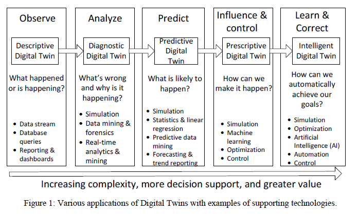
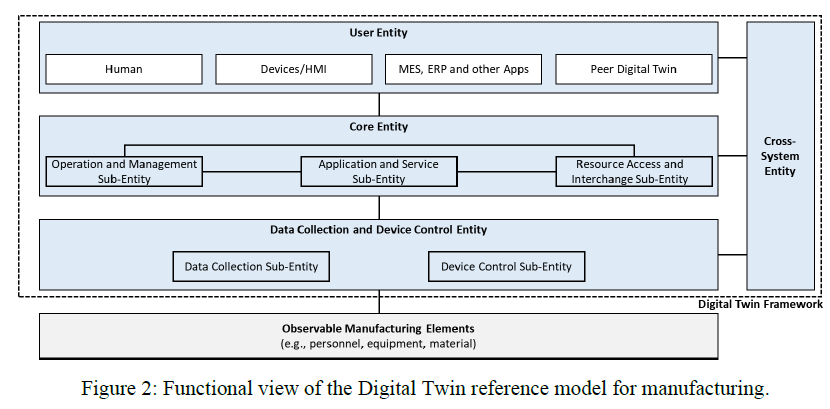
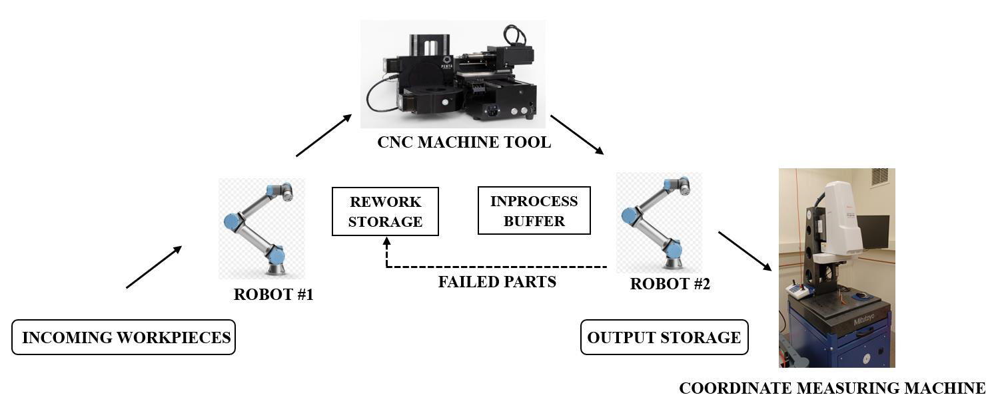
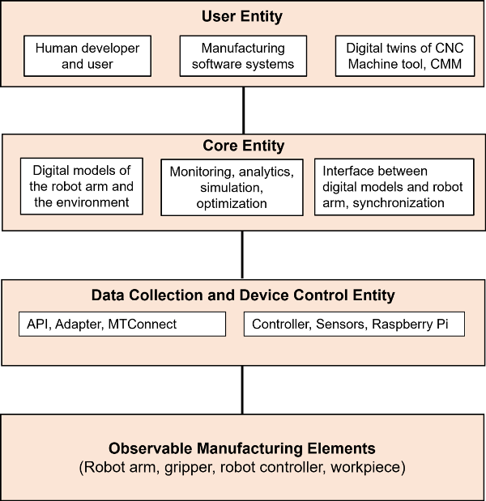
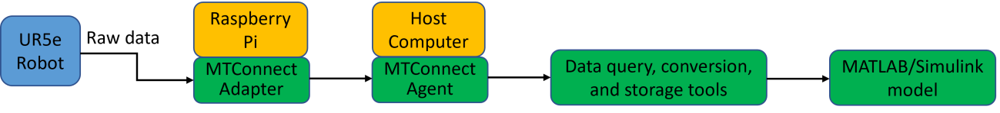
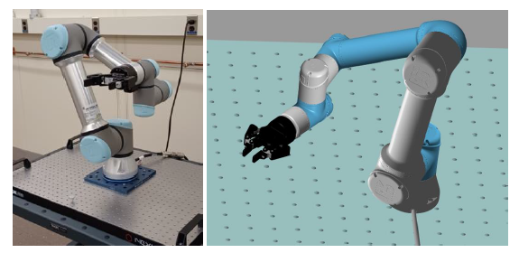

[<- До підрозділу](../README.md)

# Цифрові двійники для передового виробництва: стандартизований підхід

https://link.springer.com/chapter/10.1007/978-3-031-69107-2_7

Shao, G., Kibira, D., Frechette, S. (2024).  Digital Twins for Advanced  Manufacturing: The Standardized Approach.                      In: Grieves, M., Hua, E.Y. (eds) Digital Twins,  Simulation, and the Metaverse. Simulation Foundations, Methods and  Applications. Springer, Cham.  https://doi.org/10.1007/978-3-031-69107-2_7

Ця стаття перекладена з використанням ChatGPT

## Анотація

Цифрові двійники стають дедалі поширенішими в різних галузях — таких як виробництво, будівництво, розумні міста та охорона здоров’я — для цілей спостереження, прогнозування, оптимізації та керування. Цифрові двійники перебувають на етапі раннього впровадження. Наразі існує небагато стандартів, які безпосередньо стосуються цифрових двійників, а комерційна екосистема цифрових двійників ще недостатньо розвинена. Розроблення та впровадження цифрових двійників пов’язане зі значними викликами. Більшість сучасних застосунків цифрових двійників є індивідуальними рішеннями, які є дорогими у створенні та складними для інтеграції з іншими системами. Потрібна базова підготовка для підтримки відкритого ринку для розробників, користувачів і постачальників технологічних послуг цифрових двійників. Це включає розроблення стандартизованих фреймворків, еталонних моделей і інтерфейсів, які забезпечать надійну основу для гарантування інтероперабельності, надійності, достовірності, безпеки та довіри. У цьому розділі визначено виклики впровадження цифрових двійників у виробництві, розглянуто відповідні зусилля зі стандартизації, представлено стандарт ISO щодо фреймворку цифрового двійника для виробництва, наведено приклади застосування та обговорено потенційні напрями досліджень і подальшої стандартизації.

## 1 ВСТУП

Ідея створення фізичних макетів запланованих об’єктів, інфраструктури або середовищ використовується людьми протягом тисячоліть. Одним із відомих прикладів застосування підходу двійників є проєкти NASA 1960-х років, коли для планування та реалізації космічних місій створювалися два однакові космічні апарати. Один із них вирушав у політ, а його фізичний «двійник» залишався на Землі. Наземний апарат відтворював стан летючого двійника та використовувався для перевірки рішень проблем, що виникали в польоті [1].

З розвитком комп’ютерних технологій фізичні моделі поступово були замінені цифровими. Концепція цифрового двійника здобула більшу популярність у 2002 році після того, як доктор Грівз представив своє бачення реального простору, віртуального простору та потоку інформації між ними [2]. Ключовою ідеєю є синхронізація стану реального та віртуального просторів. Проте лише нещодавно ця концепція стала однією з провідних стратегічних технологій. Розвиток таких технологій, як Інтернет речей (IoT), розумні датчики, штучний інтелект (AI) і хмарні обчислення, сприяв реалізації цифрових двійників.

Цифрові двійники охоплюють складні функціональні підсистеми: збирання даних, обробку, комунікацію, моделювання, аналітику, візуалізацію, моделювання, оптимізацію та керування. Частина з них може бути реалізована як розподілені системи. Така складна система систем створює значні труднощі для виробників у розумінні та інтеграції різнорідних підсистем. Багато компаній уже реалізують цифрову трансформацію. Інші мають кілька цифрових рішень від різних постачальників. Деякі постачальники заявляють про повну підтримку створення цифрових двійників. Однак неможливо змусити всі компанії відмовитися від наявних цифрових систем і перейти на нові рішення одного постачальника, оскільки не всі мають технічну або фінансову можливість для повної заміни. Тому під час впровадження цифрових двійників потрібно інтегрувати існуючі системи та технології.

Потрібні стандарти інтероперабельності, які б підтримували зв’язок і інтеграцію між: (1) фізичними та віртуальними системами, (2) кількома цифровими двійниками, (3) цифровими двійниками та застарілими системами, як-от MES, ERP і PLM. Цифровий двійник складається з трьох основних компонентів: фізичної системи, віртуального представлення фізичної системи та двосторонньої комунікації між ними. Новітні дослідження додають ще два компоненти — дані та сервіси [3].

Відтак було визнано, що для реалізації цифрових двійників потрібен фреймворк, що складається з різних компонентів, які можна використовувати в різних застосунках і доменах. Незважаючи на різноманітність деталей реалізації, загальний фреймворк середнього або високого рівня може зменшити зусилля на розробку цифрового двійника. Було запропоновано багато фреймворків, зокрема ті, що акцентують на двосторонній комунікації між фізичним і цифровим двійниками [4, 5].

На сьогодні більшість цифрових двійників реалізовані для моніторингу стану в реальному часі. Наприклад, авіаційна промисловість багато років використовує цифрових двійників для моніторингу реактивних двигунів. Такі цифрові двійники працюють в односторонньому режимі — отримують дані з фізичного об'єкта, але не повертають керуючого впливу.

Галлі та ін. [6] проаналізували різні запропоновані фреймворки побудови цифрових двійників. У дослідженні визначено три типи архітектур. Перша — традиційна, базується на моделі Грівза і Віккерса [7]; вона забезпечує паралельність реальної та цифрової системи та їхню інтероперабельність з системами керування виробництвом. Друга — сервісно-орієнтована, з чотирма компонентами: фізичний цех, віртуальна модель цеху, система сервісів і дані цифрового двійника. Третя — фрактальна, де глобальний цифровий двійник складається з локальних або спеціалізованих, подібних за структурою.

Хан та ін. запропонували шестивимірний фреймворк, який охоплює: (1) фізичний актив, (2) його цифрову копію, (3) дані, що генеруються активом, (4) програми для оптимізації продуктивності, (5) ітерації за принципом спіралі, що ведуть до вдосконалення продукту або процесу, (6) синхронізацію фізичного та цифрового [4].

Незважаючи на ці зусилля, технологія цифрових двійників усе ще перебуває на ранньому етапі. Не існує універсального означення, фреймворку реалізації чи протоколів. Також бракує всебічного й глибокого аналізу концепцій, технологій та промислових застосувань цифрових двійників [8]. Крім того, екосистема цифрових двійників не сформована, більшість рішень є індивідуальними, що унеможливлює повторне використання і є дорогим та тривалим. Необхідний системний підхід до характеристики та керування підсистемами цифрових двійників, щоб забезпечити міждисциплінарну інтероперабельність і достовірність. Саме стандарти є засобом для досягнення такої інтероперабельності. Однак наразі розроблено лише небагато стандартів, присвячених цифровим двійникам.

Згідно з дослідженням компанії Accenture, підприємства не використовують повною мірою потенціал цифрових двійників, оскільки більшість їхніх застосувань є автономними і орієнтованими на окремі функції, зосередженими на функціональній оптимізації, а не на оптимізації підприємства в цілому, і не мають всеохопної стратегії інтеграції та обміну даними [9]. Крім того, якщо цифровий двійник є поточним представленням фізичного активу, то пов’язані з ним дані на будь-якому етапі життєвого циклу можуть бути корисними для майбутнього управління активами. Архітектура або механізм обміну інформацією про продуктивність і використання продукту на етапах проєктування, виробництва, експлуатації, утилізації та перероблення позначається як «цифрова нитка» (digital thread) [10]. Застосування цифрової нитки забезпечує простежуваність цифрових двійників від формування вимог до виведення фізичного активу з експлуатації. Інтероперабельність між цифровими двійниками для різних етапів життєвого циклу через цифрову нитку може допомогти подолати зазначені виклики. Стандартизоване представлення даних дозволить уникнути індивідуальної розробки цифрових двійників і дублювання зусиль. Цифрові нитки також надають цілісне представлення фізичного активу для побудови цифрового двійника, уникаючи надмірності при обміні інформацією.

Для ефективного використання цифрових двійників виробникам потрібно застосовувати стандарти інтероперабельності як з погляду систем систем, так і з урахуванням життєвого циклу. Крім того, стандарти щодо термінології, еталонної архітектури та надійності можуть допомогти забезпечити інтероперабельність, цінність і достовірність цифрових двійників. Такі стандарти дадуть змогу виробникам ефективніше створювати, управляти та впроваджувати цифрові двійники.

Цей розділ зосереджений на стандартизованому підході до побудови цифрових двійників для передового виробництва. У ньому визначаються поточні виклики, з якими стикаються виробники при впровадженні цифрових двійників, розглядаються відповідні стандарти, представлено новий стандарт ISO для цифрових двійників, описано сценарії застосування та окреслено потенційні напрями досліджень у сфері стандартизації. Структура розділу така: у розділі 2 розглянуто різноманітні застосування цифрових двійників; у розділі 3 показано, як стандарти допомагають вирішити проблеми впровадження та прийняття цифрових двійників; у розділі 4 представлено стандарт ISO 23247 — Фреймворк цифрових двійників для виробництва; у розділі 5 розглянуто інші релевантні стандарти; у розділі 6 наведено приклад застосування стандартів для створення цифрового двійника роботизованої комірки; у розділі 7 обговорюються потенційні теми й напрями досліджень у сфері стандартизації; у розділі 8 підсумовується матеріал і представлено перспективи подальшої роботи.

## 2 ЗАСТОСУВАННЯ ТА ТЕХНОЛОГІЇ, ЩО ЗАБЕЗПЕЧУЮТЬ ЦИФРОВІ ДВІЙНИКИ

Цифрові двійники стають дедалі поширенішими в різноманітних галузях, включаючи виробництво, будівництво, розумні міста та охорону здоров’я. Застосування цифрових двійників охоплює моніторинг систем, виявлення аномалій, прогнозування, оптимізацію та керування. Основні загальні класи цифрових двійників, наведені на рисунку 1, — це описові, діагностичні, прогностичні, приписувальні та інтелектуальні цифрові двійники. На рисунку 1 зліва направо зображено різні функціональні можливості цифрових двійників із зростанням складності — від простого моніторингу до інтелектуального керування — для підтримки прийняття рішень і автоматизації. У кожному блоці вказано приклади технологій, які забезпечують відповідний тип цифрових двійників. Нижче наведено опис кожної категорії [11].

• Описові цифрові двійники спостерігають за своїми фізичними відповідниками, щоб визначити, що сталося або що відбувається. Вони можуть генерувати різні подання зібраних даних за допомогою розумних датчиків залежно від призначення цифрового двійника. Згідно з вимогами зацікавлених сторін, дані та параметри можуть відображатися у вигляді тексту, таблиць або графіків. Наприклад, одним із важливих показників є цикл виробництва для кожного типу продукції. Технології підтримки: потокова передача даних у реальному часі, запити до бази даних, побудова звітів на панелях моніторингу.

• Діагностичні цифрові двійники аналізують, що саме пішло не так і чому це сталося або відбувається з фізичним об’єктом. Діагностика включає аналіз впливу вхідних даних та операційної стратегії на ключові показники ефективності (KPI). Наприклад, збільшення циклу виробництва може бути спричинене поломками обладнання або неефективним плануванням. Технології підтримки: моделювання, інтелектуальний аналіз даних, машинне навчання, аналітика.

• Прогностичні цифрові двійники передбачають, що станеться і коли. Вони можуть оцінити, коли зношування верстата або робота досягне критичної точки, що може призвести до відмови, на основі шаблонів попередніх даних. Вони також можуть виявити причину або джерело відмови. Технології підтримки: моделювання, симуляція, прогностичний аналіз даних, відстеження параметрів. У поєднанні з машинним навчанням цифрові двійники можуть прогнозувати цикл виконання виробничих замовлень [5].

• Приписувальні цифрові двійники забезпечують вплив і керування фізичним об’єктом і визначають, як досягти поставленої мети. Вони дозволяють знаходити найкращі стратегії й вхідні параметри для досягнення оптимальної ефективності. Наприклад, приписувальна аналітика допомагає підібрати такі параметри і методи, які дозволяють зменшити час циклу й підвищити продуктивність. Технології підтримки: моделювання, оптимізація, керування.

• Інтелектуальні цифрові двійники покликані самостійно керувати фізичними об’єктами на основі стратегій і параметрів, визначених приписувальними цифровими двійниками. Вони можуть навчатися новим стратегіям, збираючи дані, і відповідно адаптувати свої дії — наприклад, динамічно підлаштовуватися під зміни у фізичному об’єкті або підтримувати задані цілі. Основною моделлю для інтелектуальних цифрових двійників є штучний інтелект, включаючи великі мовні моделі. Інші технології підтримки: моделювання, оптимізація, автоматизація та керування.

Тип цифрового двійника, що впроваджується, залежить від конкретного випадку застосування і визначається метою та обсягом цифрового двійника.

## 3 ЯК СТАНДАРТИ ПІДТРИМУЮТЬ РОЗРОБКУ ТА ІНТЕГРАЦІЮ ЦИФРОВИХ ДВІЙНИКІВ

Як обговорювалося в розділі 1, виробники — особливо малі та середні підприємства (МСП) — стикаються зі значними труднощами під час ефективного впровадження застосунків цифрових двійників. Поточні реалізації здебільшого ґрунтуються на індивідуальних, нестандартизованих підходах. Такі рішення не лише збільшують час і вартість розробки, а й ускладнюють інтеграцію з іншими системами та не передбачають повторного використання. Щоб перейти від дорогих індивідуальних рішень до доступного ринку продуктів і засобів для цифрових двійників, виробникам потрібні стандарти.

Стандарти — такі як фреймворки, еталонні моделі та інтерфейси — забезпечують надійну основу для розробників, користувачів, а також постачальників технологій і послуг цифрових двійників для гарантування інтероперабельності, надійності, достовірності, безпеки та довіри. Вони спрощують складання та інтеграцію цифрових двійників шляхом надання настанов, методологій, спільної термінології, архітектурних підходів і специфікацій інтерфейсів.

Завдяки стандартам створення, інтеграція, оновлення та валідація цифрових двійників стає точнішими й послідовнішими. Стандарти також сприяють формалізації вимог до проєктів цифрових двійників, використанню будівельних блоків при реалізації, аналізу продуктивності, комунікації між постачальниками, партнерами та клієнтами, захисту інформації та конфіденційності, а також перевірці та валідації відповідно до вимог зацікавлених сторін. У підсумку стандарти сприятимуть досягненню «plug and play» — тобто забезпеченню інтероперабельності між цифровими двійниками, а також програмним і апаратним забезпеченням від різних постачальників.

У різних сферах стандарти підтримують наступне:

- Визначення спільної мови для представлення даних, протоколів зв’язку та програмних інтерфейсів (API), щоб цифрові двійники могли розуміти й обмінюватися даними між собою. Прикладами API є інтерфейси для запитів до даних, оновлення та синхронізації даних.
- Розроблення спільних метаданих та онтологій для опису властивостей, атрибутів і взаємозв’язків у цифрових двійниках, що полегшує зіставлення й трансформацію даних між ними.
- Створення інструментів або проміжного ПЗ (middleware), яке дозволяє перетворювати дані з одного формату цифрового двійника в інший з використанням трансформації, нормалізації або перекладу даних.
- Реалізацію надійних заходів безпеки, які забезпечують доступ і взаємодію тільки авторизованих цифрових двійників за допомогою автентифікації, шифрування та контролю доступу.

## 4 ФРЕЙМВОРК ЦИФРОВОГО ДВІЙНИКА ДЛЯ ВИРОБНИЦТВА

Стандарт ISO 23247 — «Фреймворк цифрового двійника для виробництва» — створено для полегшення впровадження цифрових двійників у виробничій сфері. У стандарті визначено «цифровий двійник у виробництві» як «цифрове представлення спостережуваного виробничого елемента, яке є придатним за призначенням і синхронізується з цим елементом» [12]. Стандарт надає загальні рекомендації, еталонну архітектуру та фреймворк для застосування цифрових двійників у виробництві. У ньому також подано приклади збирання даних, передачі даних, інтеграції, моделювання та застосування відповідних стандартів [12].

Стандарт описує процедури, за якими виробники та постачальники рішень можуть:

- аналізувати вимоги до цифрового двійника,
- визначати обсяг і цілі,
- використовувати спільну термінологію,
- дотримуватись еталонної архітектури,
- інтегрувати кілька існуючих стандартів залежно від потреб.

Фреймворк включає суб’єкти й компоненти як будівельні блоки, які виробники можуть обирати для конкретних випадків. Це допомагає системно ідентифікувати підсистеми й компоненти, їхні взаємозв’язки та характеристики взаємодії, на основі чого можливо обрати відповідні стандарти для забезпечення інтероперабельності.

Ключова особливість ISO 23247 полягає в підтримці впровадження цифрової нитки (digital thread), що означає включення стандартів інженерії на основі моделей для різних стадій життєвого циклу продукту. Наприклад, для цифрових двійників, що підтримують продукт на стадіях проєктування, виробництва й інспекції, можуть застосовуватися стандарти STEP (Standard for the Exchange of Product Model Data) [13], MTConnect [14] і QIF (Quality Information Framework) [15]. Таким чином, стандарт підтримує сумісність і інтероперабельність цифрових двійників протягом усього життєвого циклу, забезпечуючи повторне використання інформації та її простежуваність.

Серія стандартів складається з чотирьох частин:

1. огляд і загальні принципи,
2. еталонна архітектура,
3. цифрове представлення,
4. обмін інформацією.

Еталонна архітектура включає модель із доменами та сутностями. Є чотири домени (рівні), кожен із яких виконує логічно згруповані функції через функціональні сутності. Рисунок 2 ілюструє модель на основі сутностей та чотири домени й їхні взаємодії [16]. Стислий опис доменів:

• Домен спостережуваного виробництва (observable manufacturing domain): містить спостережувані виробничі елементи (OME) — фізичні об’єкти, процеси або поведінку, такі як персонал, обладнання, матеріали, процеси, об’єкти, активи та системи на виробництві. Саме ці елементи мають цифрових двійників.

• Домен комунікації пристроїв (device communication domain): є проміжним рівнем між OME та цифровими двійниками для забезпечення обміну даними та синхронізації. Тут відбувається моніторинг OME та збирання даних у реальному часі за допомогою сенсорів і стандартних протоколів, а також передача команд і сигналів для керування та впливу на OME.

• Домен цифрового двійника (Digital Twin domain): відповідає за моделювання, експлуатацію та управління цифровими двійниками. У цьому домені розміщені моделі, застосунки й сервіси, зокрема аналітика даних, симуляція, оптимізація, що забезпечують ініціалізацію, моніторинг, аналіз і синхронізацію. Він також взаємодіє з користувачами й іншими системами, включаючи цифрових двійників. Кожен цифровий двійник створюється «придатним за призначенням» (fit-for-purpose) — залежно від своїх цілей і контексту вимагає лише відповідні дані та моделі. Мета визначає зміст інформації, точність моделі та частоту синхронізації.

• Домен користувача (user domain): включає користувачів або системи (людину, пристрій, застосунок або систему), які використовують застосунки й сервіси домену цифрового двійника.

Сутність міждоменної взаємодії, зображена на рисунку 2, — це сутність, яка охоплює кілька доменів і забезпечує спільні функції, зокрема трансляцію даних, гарантування достовірності даних та підтримку безпеки. Цифрові двійники можуть створюватися на основі фреймворку цифрового двійника, зображеного в межах пунктирної лінії на рисунку 2. Цей фреймворк підтримує застосування інфраструктури IoT для збирання даних, протоколів зв’язку для передавання даних і потоків інформації між сутностями різних доменів — спостережуваними виробничими елементами (OME), збиранням даних і керуванням пристроями, ядром цифрового двійника та користувацьким рівнем.

Розробники протестували стандарт, реалізувавши кілька прикладних задач в промисловості з метою демонстрації та перевірки його ефективності. Ці приклади включали:

- цифровий двійник для свердління та заклепування за допомогою робота з метою підвищення використання обладнання;
- цифровий двійник для оптимізації розмірів кріплень у авіації;
- цифровий двійник для оптимізації ресурсу ріжучого інструменту верстата з числовим програмним керуванням (ЧПК).

Реалізація цих кейсів надала розробникам стандарту цінний зворотний зв’язок і підтвердила життєздатність фреймворку для створення цифрових двійників [17].

## 5 ДОДАТКОВІ ВІДПОВІДНІ СТАНДАРТИ

Стандарти цифрових двійників, зокрема архітектурні фреймворки, можуть слугувати настановами для їх реалізації. Інші чинні стандарти можуть підтримувати конкретні функції цифрових двійників — такі як збирання даних, передача даних, моделювання інформації, інтеграція систем, моделювання симуляцій, автоматизація й керування. У цьому розділі наведено приклади виробничих стандартів, які можуть бути застосовані на різних етапах розроблення цифрових двійників. Стандарти, пов’язані з інформаційною безпекою, достовірністю даних і довірою, тут не розглядаються, хоча також є необхідними.

### 5.1 Фреймворки та архітектури

• IEC 62832-1:2020, Digital Factory Framework — визначає фреймворк для створення та підтримки цифрових представлень виробничих систем протягом усього їхнього життєвого циклу. Цей фреймворк забезпечує узгоджений обмін інформацією між усіма процесами й учасниками. Інформація стає зрозумілою, повторновикористовуваною та взаємообмінною протягом життєвого циклу виробничої системи [18].

• IEEE P2806:2019, System Architecture of Digital Representation for Physical Objects in Factory Environments — підтримує створення цифрових фабрик, описує цілі, компоненти, джерела даних і процедури цифрового представлення у виробничих середовищах [19].

• IEC 63278-1, Asset Administration Shell (AAS) for industrial applications – Part 1: AAS structure (у розробленні, група IEC TC65 WG24) — AAS дає змогу одному або кільком програмним застосункам обмінюватися інформацією безпечно й надійно. Визначає з’єднувальний компонент між фізичним і віртуальним світом і включає модель оболонки, що охоплює основні концепції: Asset, Submodel і Concept Description. Визначає ідентифікатори для всіх елементів, описів понять і властивостей з репозиторіїв (наприклад, ECLASS, IEC CDD). Моделі AAS можуть бути представлені у форматах XML, JSON, RDF, OPC UA, AutomationML [20].

• ISO/IEC 30141:2018, IoT – Reference Architecture — надає спільну термінологію, повторно використовувані конструкції та кращі практики. Побудована на абстрагуванні основних характеристик IoT у концептуальну модель і подальшому деталізуванні її у п’яти архітектурних проєкціях [21].

• ISO/IEC 21823-1:2019, IoT – Interoperability for IoT systems – Part 1: Framework — надає огляд інтероперабельності в IoT-системах і між їхніми складовими. Підтримує побудову IoT-систем із можливістю ефективного обміну інформацією та однорангової взаємодії між різними IoT-системами [22].

• ISO/IEC/IEEE 15288:2015, Systems and software engineering – System life cycle processes — встановлює спільний фреймворк описів процесів життєвого циклу систем. Визначає набір процесів і відповідну термінологію, застосовну на будь-якому рівні структури системи. Містить процеси для визначення, контролю та вдосконалення життєвого циклу [23].

• Microsoft Digital Twin Definition Language (DTDL) — мова для опису моделей і інтерфейсів цифрових двійників у середовищі IoT. Заснована на JSON-LD, незалежна від мови програмування. Використовується в IoT Hub, IoT Central, Azure Digital Twins та інших сервісах Microsoft. Описує ресурси (інтерфейси), які містять телеметрію, властивості, команди, зв’язки та компоненти. Не охоплює виявлення та доступ до ресурсів [24].

• High-Level Architecture (HLA) — визначає архітектуру для розподіленої симуляції, її компоненти та правила для узгодженої взаємодії HLA-федератів і федерацій. Забезпечує підтримку збереження змісту й призначення моделей симуляції, а також обмін даними й синхронізацію часу між розподіленими системами [25].

### 5.2 Збирання, моделювання та обмін даними

• MTConnect забезпечує інтероперабельність, надаючи стандартизований словник для виробничого обладнання, що дозволяє формувати структуровані дані з контекстом і уникати пропрієтарних форматів. Джерелами даних MTConnect є обладнання, пакети датчиків та інше апаратне забезпечення на виробництві [14].

• OPC UA (Unified Architecture) — платформонезалежний стандарт для обміну повідомленнями між клієнтами та серверами через різні мережі з синтаксичною інтероперабельністю [26].

• MTConnect-OPC UA Companion Specification — забезпечує узгодженість і інтероперабельність між стандартами MTConnect і OPC UA, а також між пристроями та програмами, що їх реалізують [27].

• ISO/IEC 20922 (MQTT v3.1.1) — протокол обміну повідомленнями, який підтримує модель публікації/підписки для клієнтів і серверів. Має відкриту й просту архітектуру, придатну для M2M і IoT-комунікацій [28].

• ISO/IEC 17826 (CDMI) — стандарт для доступу до хмарних даних і управління ними [29].

• Серія ISO 13374, Моніторинг технічного стану та діагностика машин — встановлює базові вимоги до обробки, передачі та подання даних у відкритих програмних інтерфейсах [30].

• ISO/IEC 30161:2020 — визначає вимоги до платформи обміну IoT-даними, включаючи: сумісність із застарілими сервісами, продуктивність кінцевих точок, IoT-функціональність, мережеву інфраструктуру та настанови щодо впровадження IoT-сервісів [31].

• AutomationML (Automation Markup Language) — нейтральний формат даних на базі XML для зберігання й обміну інформацією в інженерії підприємств. Підтримує механічне проєктування, електротехніку, розробку HMI, програмування ПЛК і керування роботами [32].

• CMSD (Core Manufacturing Simulation Data) — стандарт, що визначає модель представлення й обміну даними між симуляцією та іншими виробничими застосунками [33].

• ISO 15531, Системи автоматизації виробництва — управління виробничими даними — підтримує обмін даними між програмами для планування, диспетчеризації, моделювання, керування та виконання виробництва [34].

• ISO 14649-201, Управління фізичними пристроями — модель даних для ЧПК — Частина 201: дані верстатів для процесів різання — описує специфічні характеристики для верстатів із ЧПК, включаючи елементи даних для обробки та параметри обладнання [35].

• ISO/IEC 21823-2:2020, Інтероперабельність IoT — Частина 2: транспортна інтероперабельність — встановлює вимоги для побудови систем IoT із підтримкою обміну інформацією, однорангового з’єднання та безперервного зв’язку між системами й сутностями [36].

• ISO/IEC 21823-3:2021, Інтероперабельність IoT — Частина 3: семантична інтероперабельність — визначає: (1) основні поняття й вимоги до онтологій, (2) найкращі практики створення предметно-орієнтованих застосунків, (3) порівняння онтологій за модулярністю, масштабованістю, сумісністю з базовими онтологіями, (4) сценарії використання, які ілюструють вимоги до семантичної інтероперабельності [37].

• ISO/IEC 21823-4:2022, Інтероперабельність IoT — Частина 4: синтаксична інтероперабельність — описує п’ять аспектів інтероперабельності: транспортну, семантичну, синтаксичну, поведінкову та політичну. Визначає специфікації для досягнення синтаксичної сумісності між IoT-пристроями, а також фреймворк для розроблення правил обміну інформацією [38].

### 5.3 Цифрове представлення

• ASME Y14.26M, Digital Representation for Communication of Product Definition Data — стандарт Американського товариства інженерів-механіків, присвячений представленню й обміну даними, що визначають виріб. Підтримує обмін інформацією у середовищах комп’ютеризованого виробництва (CAM) [39].

• ISO 10303, Системи автоматизації та інтеграції — Представлення та обмін даними про виріб (відомий як STEP) — підтримує обмін інформацією щодо виготовлення продукції між CAD/CAM/CAE-системами [13].

• ISO 10303-IR 105, Інтегрований прикладний ресурс: Кінематика — частина STEP, що зосереджена на представленні кінематичної інформації для механічних виробів [40].

• Quality Information Framework (QIF) — фреймворк-стандарт для збору, використання та повторного використання метрологічної інформації протягом усього життєвого циклу продукту (PLM, PDM). Підтримує створення цифрових ниток. Використовується на етапах проєктування, виробництва та контролю якості. Заснований на XML і містить бібліотеку схем XML. Забезпечує цілісність даних і інтероперабельність для реалізації концепцій model-based enterprise та IoT [15].

• ASME B5.59-2, Information Technology for Machine Tools – Part 2 — визначає властивості, необхідні для опису верстатів для фрезерування та токарної обробки [41].

• ISO 13399, Представлення та обмін даними про ріжучий інструмент — надає модель і довідник термінів для опису ріжучих інструментів. Для опису продукту використовується схема EXPRESS, і файли можна генерувати згідно з цією схемою [42].

• ISO 16400, Каталог поведінки обладнання (EBC) — визначає шаблон і правила для опису поведінки устатковання (наприклад, переходи станів, часові ряди результатів роботи), яка формується внаслідок дій машини та зберігається в спільному репозиторії. Визначає методологію для побудови таких каталогів з метою планування й аналізу продуктивності виробничих систем [43].

• Predictive Model Markup Language (PMML) — мова розмітки для створення прогностичних і описових моделей, а також для представлення оброблених даних до та після моделювання. Заснована на XML, PMML дає змогу представляти статистичні та дата-майнінгові моделі й обмінюватися ними між сумісними застосунками. Прикладами моделей є нейронні мережі, дерева рішень, процеси Гауса та байєсівські мережі [44].

Завдяки цим стандартам, що охоплюють різні функціональні категорії, користувачі можуть обирати відповідні для реалізації цифрових двійників у своїх конкретних випадках.

## 6 ПРИКЛАД РОЗРОБКИ ЦИФРОВОГО ДВІЙНИКА З ВИКОРИСТАННЯМ СТАНДАРТИЗОВАНОГО ПІДХОДУ

У цьому розділі розглядається приклад цифрового двійника роботизованої виробничої комірки для ілюстрації застосування відповідних стандартів. Комірка включає:

- співпрацюючі роботизовані маніпулятори для обробки матеріалів і обслуговування обладнання,
- верстат із ЧПК для механічної обробки,
- координатно-вимірювальну машину (CMM) для контролю геометрії виробу та забезпечення якості.

На рисунку 3 подано робочий процес і обладнання, яке використовується в сценарії.

Послідовність процесу:

1. Приймання деталей.
2. Завантаження деталей до ЧПК (роботом №1).
3. Обробка деталей.
4. Вивантаження деталей із ЧПК (роботом №1).
5. Завантаження деталей до CMM (роботом №2).
6. Інспекція деталей.
7. Вивантаження деталей із CMM (роботом №2).
8. Деталі, що не пройшли перевірку, надсилаються у буфер переробки (роботом №2).

Комірка має єдину вхідну й вихідну позицію. Роботи оснащені захоплювачем 2F-85, що дозволяє ефективно працювати з компонентами різної геометрії.

Мета дослідження — створити цифровий двійник процесу, що є композицією цифрових двійників окремих компонентів.

Застосовані стандарти:

- ISO 23247 — фреймворк цифрових двійників для виробництва;
- MTConnect — обмін структурованими даними з обладнання;
- STEP (ISO 10303) — обмін моделями виробів;
- QIF — вимірювальні дані та контроль якості;
- ASME VVUQ — перевірка, валідація та оцінка невизначеностей моделей.

Figure 3: Workflow through machines and equipment in the robot work cell.

### 6.1 ISO 23247

На основі фреймворку цифрового двійника, описаного в розділі 3, кожне обладнання в роботизованій комірці розглядається як OME (Observable Manufacturing Element), для якого необхідно збирати дані та розробити цифрові двійники для різних сценаріїв. У цьому підрозділі фокус зроблено на одному роботизованому маніпуляторі, щоб продемонструвати метод розробки цифрового двійника.

Інсталяція стандарту ISO 23247 здійснюється для маніпулятора UR5e, основні операції якого — захоплення та завантаження заготовки у верстат із ЧПК. На рисунку 4 показано, як фреймворк реалізується для цього маніпулятора.

Ключові моменти реалізації:

- Дані з UR5e збираються за допомогою адаптера MTConnect.
- Сутність цифрового двійника включає модель симуляції роботизованого маніпулятора та аналітичні моделі, що опрацьовують дані в реальному часі для підтримки прийняття рішень.
- Модельне середовище підтримує 3D-геометрію складових частин UR5e: основи, ланок, шарнірів, кінцевого виконавця (ефектора) та заготовки.
- Користувацька сутність (user entity) охоплює як розробника й кінцевого користувача цифрового двійника, так і виробничі програмні системи або інші цифрові двійники.

За аналогічною схемою можна реалізувати цифрові двійники для ріжучого інструмента, верстата з ЧПК і координатно-вимірювальної машини.

Figure 4: Implementation method of building a Digital Twin for the robot based on ISO 23247.

### 6.2 MTConnect

Процес отримання даних і побудови масштабованого каналу даних для виробничої комірки включає кілька складників:

1. збирання оперативних даних у реальному часі з робота;
2. використання стандарту MTConnect для подання даних у стандартизованому форматі;
3. розроблення інструментів для використання цих даних на стороні клієнта через агент MTConnect.

Збирання даних UR5e:
 Для отримання оперативних даних з маніпулятора UR5e застосовано інтерфейс UR-RTDE (Real-Time Data Exchange) від Universal Robots, який має API для збору даних. Серед зібраних параметрів — кутові положення, швидкості, прискорення, моменти, струми й температури для кожного з шести шарнірів маніпулятора. Виробник UR надає повний перелік доступних змінних та їхніх одиниць виміру через UR-RTDE.

Інтерфейс MTConnect:
 Реалізація стандарту MTConnect вимагає адаптера та агента:

- Адаптер — компонент, що збирає дані з обладнання та перетворює їх у формат, зрозумілий агенту;
- Агент — отримує дані від адаптера й надає інтерфейс доступу до них.

UR5e не має вбудованого адаптера, тому його було розгорнуто окремо на пристрої, підключеному до маніпулятора. За допомогою Python UR-RTDE API створено адаптер на основі сокетів, який передає дані у відповідності до MTConnect-стандарту.

Агент MTConnect отримує й надає дані в машинозчитуваному форматі. Рисунок 5 демонструє потік даних від фізичного пристрою UR5e до цифрового двійника.

Для зібраних фізичних даних UR5e побудовано семантичну структуру на основі стандарту MTConnect 2.0, що включає теги даних і одиниці виміру. Це забезпечує уніфіковану інтерпретацію й інтеграцію даних у цифровий двійник.

Figure 5: Data pipeline for the UR5e robot Digital Twin.

#### Інтеграція на стороні клієнта

Агент MTConnect реалізований на мові C++ і надає дані у форматі XML через HTTP-сервер.

Для моделювання роботизованої виробничої комірки використовується Simulink/Simscape, який підтримує введення даних у форматі CSV. У таких CSV-файлах зберігаються численні параметри, прив’язані до відповідних міток часу (UTC).

Для забезпечення сумісності з цим форматом було розроблено інструменти, які:

- зчитують XML-вивід агента MTConnect;
- перетворюють дані у двовимірний масив;
- зберігають цей масив у CSV-файл.

Це дозволяє здійснювати подальше моделювання й аналіз цифрового двійника в Simulink/Simscape із прив’язкою до часових міток і реальних даних, отриманих у стандарті MTConnect.

### 6.3 STEP

Для розробки фізичної моделі роботизованого маніпулятора необхідно використовувати CAD-моделі його компонентів і навколишнього робочого середовища. Такі моделі містять опис геометрії ланок та їхнього з’єднання в межах маніпулятора.

Ключові етапи:

- CAD-моделі імпортуються в середовище цифрового двійника для створення фізичної моделі маніпулятора UR5e.
- Модель захоплювача створюється в середовищі AutoCAD Inventor, де вона "збирається" як частина кінцевого ефектора.
- Потім ця модель експортується в середовище цифрового двійника та "прикріплюється" до моделі UR5e.

На рисунку 6 зображено фізичну та віртуальну моделі роботизованого маніпулятора з під’єднаним ефектором.

CAD-моделі деталі, верстата з ЧПК і координатно-вимірювальної машини (CMM) також можуть бути представлені у форматі STEP (ISO 10303), що спрощує обмін даними та їх візуалізацію.

Застосування STEP:

- модель проектованої деталі у форматі STEP використовується для порівняння з результатами вимірювання готового виробу, що забезпечує відповідність між проектом і фактичним виконанням.

Figure 6: The physical and virtual model of the UR5e robot arm with attached gripper.

### 6.4 Quality Information Framework (QIF)

QIF забезпечує інтегровану модель для обробки даних про якість у виробництві. У цьому прикладі:

- Координатно-вимірювальна машина (CMM) збирає дані про вимірювання виробу для перевірки його відповідності до специфікацій за GD&T (геометричні розміри та допуски).
- GD&T дозволяє враховувати варіації у виробництві, визначаючи допуски як допустимі відхилення від номіналу.
- Ці дані формуються вже на етапі проєктування й повинні бути доступні протягом усього життєвого циклу виробу.

Роль QIF:

- Дозволяє пов’язати вимірювальні дані з початковим CAD-файлом — єдиним джерелом проєктних даних.
- Забезпечує модельно-орієнтовані робочі процеси в рамках цифрової трансформації виробництва.
- Дає змогу цифровому двійнику CMM отримувати фактичні вимірювання з реальної машини та порівнювати їх із проєктними значеннями.

Таким чином, QIF виступає ключовим стандартом для обміну метрологічними даними між фізичним устаткованням і його цифровим двійником.

### 6.5 Верифікація та валідація

Цифрові двійники — це складні системи, які часто використовуються як віртуальні стенди для верифікації та валідації інших систем, особливо коли реальні випробування складні або дорогі. Однак якість рішень, що приймаються за допомогою цифрових двійників, безпосередньо залежить від достовірності моделей, що лежать в їх основі.

Ключові принципи:

- Валідний цифровий двійник повинен точно описувати систему, яка змінюється з часом.
- Перед використанням цифровий двійник має бути вивірений і підтверджений, щоб гарантувати коректність і доцільність його застосування.
- Застосовуються стандарти VVUQ (Verification, Validation, and Uncertainty Quantification) для забезпечення того, що:
  - модель створено правильно (верифікація),
  - створено правильну модель (валідація).

Методи:

- За Zhang et al. [46], методи верифікації та валідації поділяються на:
  - якісні (візуальна перевірка, експертна оцінка),
  - кількісні (порівняння числових значень),
  - інтегровані (комбіновані підходи).
- Метрики для оцінки цифрових двійників: правдоподібність (credibility), точність (fidelity), складність, ступінь стандартизації, рівень зрілості моделі.

Стратегії валідації (Hua et al. [47]):

- візуальний огляд згідно зі стандартами;
- тестування властивостей моделі;
- тестування на відповідність входу/виходу (model-based testing);
- тестування з використанням ML/AI.

Приклад Kibira & Weiss [48]:

- валідація цифрового двійника роботизованого маніпулятора методом збору даних про положення, орієнтацію, швидкість і прискорення реального робота.

Використовувані стандарти ASME V&V:

- V&V 10 — для твердотільної механіки;
- V&V 20 — для обчислювальної гідродинаміки та теплопередачі;
- V&V 40 — для медичних пристроїв;
- Розробляються також стандарти V&V 50 (адитивне виробництво), V&V 60, 70 (моделі з даних), V&V 80.

Ці стандарти забезпечують основу для обґрунтованого використання цифрових двійників у критично важливих застосуваннях.

### 7 Майбутні напрями досліджень для стандартизації

Поточна серія ISO 23247 у чотирьох частинах надає базовий узагальнений фреймворк цифрового двійника для виробництва. Цей фреймворк потенційно може бути розширений для інших галузей, що застосовують спеціалізовані виробничі процеси та технології.

Можливі напрями розвитку стандарту включають:

1. Цифрова нитка (digital thread) для цифрових двійників — забезпечення наскрізного зв’язку даних на всіх етапах життєвого циклу.
2. Композиція цифрових двійників — моделювання складних систем як складання цифрових двійників із підсистем.
3. Онтології фреймворку цифрових двійників — формалізація сутностей та взаємозв’язків для забезпечення семантичної сумісності.
4. Створення цифрових двійників з повторно використовуваних компонентів — зниження витрат і підвищення уніфікованості.
5. Оцінювання достовірності (credibility assessment) цифрових двійників — формування довіри та підвищення цінності для прийняття рішень.
6. Цифрові двійники й метавсесвіт — розробка настанов щодо їхньої інтеграції в індустріальні метавсесвіти.
7. Інтеграція “plug and play” — стандартизація інтерфейсів для автоматичної інтеграції в середовище замовника.
8. Розширення фреймворку для галузевих потреб, наприклад:
   - виробництво напівпровідників,
   - біотехнологічне виробництво,
   - адитивне виробництво (3D-друк).

Наступні підрозділи цього розділу обговорюють потенційні нові частини стандарту, які можуть зробити розробку цифрових двійників простішою та ефективнішою.

### 7.1 Цифрова нитка для цифрового двійника (ISO 23247-5)

Під час цифрової трансформації ізольовані цифрові двійники потребують значних повторюваних зусиль. Щоб уникнути дублювання, необхідно застосовувати підхід життєвого циклу. Але впровадження такого підходу — складне завдання, яке потребує спеціальних методик і настанов.

Мета нової частини ISO 23247-5 — описати, як цифрова нитка (digital thread) забезпечує:

- створення,
- зв’язок,
- керування,
- підтримку цифрових двійників протягом усього життєвого циклу продукту.

Зміст майбутнього стандарту включатиме:

- принципи цифрової трансформації та їх застосування до цифрових двійників;
- методики побудови цифрової нитки, що забезпечує доступ до інформації про:
  - проєктування,
  - виготовлення,
  - інспекцію,
  - експлуатацію;
- приклади сценаріїв використання;
- опис, як цифрова нитка підтримує еволюцію цифрових двійників, відображаючи зміни продукту в часі.

Цифрова нитка дозволяє:

- простежувати зміни в продукті на всіх етапах;
- забезпечити доступність, надійність, відстежуваність і безпеку даних;
- використовувати накопичену інформацію для покращення майбутніх версій продукту.

### 7.2 Композиція цифрового двійника (ISO 23247-6)

Композиція цифрового двійника означає створення та інтеграцію декількох цифрових двійників, що взаємодіють між собою за допомогою цифрової нитки.

Приклади:

- цифрові двійники деталі та обладнання, що її виготовляє, обмінюються даними в реальному часі;
- цифрові двійники ріжучого інструмента, верстата й деталі спільно дозволяють оцінити зношення інструмента, дотримання допусків і стан обладнання;
- у ланцюгу постачання цифрові двійники різних учасників координуються в реальному часі.

Виклики:

- агрегування, конфігурація, об’єднання та координація цифрових двійників — складна задача;
- без стандартів інтеграція ризикована, трудомістка й неуніфікована.

Мета частини ISO 23247-6:

- надати настанови для забезпечення сумісної роботи та комунікації між кількома цифровими двійниками;
- описати загальні методології та принципи, які допомагають користувачам сформулювати ціль цифрового двійника та створити відповідну конфігурацію для вирішення конкретних задач;
- показати приклади застосування стандартів і технологій для демонстрації інтеграції.

Зміст цієї частини:

- принципи побудови композицій цифрових двійників;
- методики конфігурації, обміну даними, агрегації, інтеграції та співпраці;
- приклади застосування в реальних сценаріях виробничих систем.

Таким чином, ISO 23247-6 має забезпечити формалізований підхід до структурованої побудови складених цифрових двійників, скоротити час розробки та зменшити ризики інтеграції.

### 7.3 Онтології для фреймворку цифрового двійника

Поточні чотири частини стандарту ISO 23247 визначають терміни, відношення, компоненти та процеси, необхідні для розробки цифрового двійника, і надають настанови для реалізації цифрового двійника. Проте це не підтримується логічним формалізмом, що може призвести до непослідовної реалізації. Онтології для фреймворку цифрового двійника дадуть змогу означити терміни, які є як зрозумілими для людини, так і оброблюваними комп’ютером, що забезпечить однозначне подання певної конструкції та послідовну інтерпретацію незалежно від початкового джерела даних. Це також уможливлює явне подання зв’язків між різними термінами; різні зв’язки забезпечують послідовну наявність і подання необхідних метаданих. Потенційна нова частина ISO 23247 з цієї теми могла б надати онтологію для фреймворку цифрового двійника.

### 7.4 Створення цифрових двійників з повторно використовуваних компонентів

Цифрові двійники можуть бути розроблені для різних рівнів керування залежно від застосування, зокрема для обладнання, робочих комірок, виробничих ліній, заводів і ланцюгів постачання. Хоча існують деякі підходи для підтримки повторного використання компонентів моделей [53], більшість із них не призначені безпосередньо для цифрових двійників. Тому майже всі цифрові двійники створюються з нуля, що робить реалізацію трудомісткою та дорогою. Індивідуальні проєкти також ускладнюють модифікацію, розширення й повторне використання цифрового двійника. Виробничі знання, атрибути інформації та конфігурації прикладних задач часто розробляються з використанням різних спеціалізованих абстракцій для кожного застосування. Повторне використання компонентів цифрових двійників із бібліотеки цифрових двійників може суттєво зменшити витрати на розробку, час і необхідний рівень експертизи.

Потенційна нова частина ISO 23247 з цієї теми могла б надати настанови щодо створення бібліотек компонентів і шаблонів для організації даних, інформації та моделей. Повторно використовувані компоненти цифрових двійників можуть включати шаблони для збору даних, типові атрибути інформації та модульні моделі. Розробка цифрових двійників буде підтримана за допомогою відповідних технологій і стандартів для різних функцій цифрових двійників. Нова частина могла б надати загальні методології, архітектури, фреймворки, бази знань і приклади для створення та використання бібліотек компонентів цифрових двійників.

### 7.5 Оцінювання достовірності цифрових двійників

Поточні чотири частини ISO 23247 не охоплюють VVUQ і тестування цифрових двійників. З огляду на потенційне використання цифрових двійників для прийняття критично важливих рішень у різних виробничих застосуваннях, результати, які генеруються цифровими двійниками, мають бути достовірними для реальних виробничих потреб. Оцінювання достовірності моделі, включно з методиками VVUQ, має застосовуватись протягом усього життєвого циклу цифрових двійників. VVUQ має бути вбудованим у проєктування, створення й розгортання цифрових двійників, щоб забезпечити довіру до моделі та її результатів [54]. Дії з перевірки й валідації (V&V) є необхідними для забезпечення того, що цифровий двійник відповідає своїй меті та проєктним цілям. Оцінка невизначеності (UQ) дає змогу отримати міру продуктивності, яку користувачі можуть застосовувати як частину оцінювання достовірності для певного цифрового двійника. VVUQ для цифрових двійників має бути постійним процесом, що адаптується до змін у OME та його цифровому поданні, вхідних даних і прийнятих рішень [54]. Оцінювання достовірності цифрових двійників також може включати фактори поза межами VVUQ.

Тестування цифрових двійників потребує тестової системи, яка включає набір тестів як для OME, так і для його цифрового двійника. Тестова система також повинна означити, яким має бути прийнятно валідований цифровий двійник. Grieves запропонував метод віртуального тестування для виготовлених продуктів, який можна адаптувати для цифрових двійників [55]. Наприклад, якщо тестова система може виконати набір тестів, і результати цифрового двійника не відрізняються від результатів OME у межах заданого порогу ймовірності, тоді цифровий двійник може розглядатись як прийнятне подання OME. Довіра до цифрового двійника також передбачає довіру до даних, зібраних з OME, моделі, використаної в цифровому двійнику, процедури оновлення даних і запропонованих рішень. Усі ці аспекти повинні мати вимірювану невизначеність, що означає, що валідація (порівняння з реальністю) має розглядатися як статистичний процес. Порівняння фактичних даних із результатами моделі може бути використано для оцінки ймовірності того, що цифровий двійник є послідовним поданням OME.

Наразі не існує стандартного процесу звітування VVUQ для цифрових двійників. Розробка надійних процесів VVUQ для цифрових двійників залишається проблемою. Потенційна нова частина ISO 23247 з цієї теми може надати настанови та методики щодо того, як вимірювати невизначеність, як виконувати VVUQ і тестування цифрових двійників, як обрати або створити фреймворк оцінювання достовірності, який підтримує ці дії, і як оцінювати достовірність розроблених цифрових двійників.

### 7.6 Цифрові двійники та метавсесвіт

Метавсесвіт може підтримувати моніторинг виробничої системи в реальному часі — як візуально, так і з погляду метрик. Він також може забезпечити користувачів зануреним (іммерсивним) досвідом. Це стало можливим завдяки зрілості технологій віртуальної реальності (VR), доповненої реальності (AR) та розширеної реальності (XR), які можуть підвищити ефективність візуалізації для потреб виробництва. Наприклад, було продемонстровано, що AR-технології можна інтегрувати зі стандартами та практиками тривимірного геометричного подання та верифікації виробів [56].

Значущою особливістю метавсесвіту є занурене візуалізаційне середовище разом з його людино-машинним інтерфейсом. Апаратні й програмні технології, розроблені для метавсесвіту, можуть бути використані у фреймворку цифрового двійника для виробництва, особливо у випадках, коли передбачається участь людини. Наприклад, домен користувача (показаний на рисунку 2) та сутність користувача у стандарті ISO 23247 можуть використовувати людино-машинні інтерфейси, що надаються метавсесвітом. Або ж метавсесвіт може бути паралельним віртуальним світом, який включає деякі цифрові двійники виробничого підприємства, яке він представляє.

Нова частина серії ISO 23247 може включати:

- поняття метавсесвіту,
- його означення,
- можливі сценарії інтеграції з виробничими цифровими двійниками (включаючи цифрові двійники людей),
- настанови й методики для такої інтеграції.

### 7.7 Розширення фреймворку для конкретних секторів

На основі загального фреймворку, наданого першими чотирма частинами серії ISO 23247, можуть бути розроблені розширення у вигляді нових частин стандарту для конкретних виробничих секторів, таких як біовиробництво, виробництво напівпровідників і адитивне виробництво. Нові частини можуть передбачати спеціалізацію фреймворку цифрових двійників шляхом додавання нових функціональних сутностей або модифікації наявних функціональних сутностей для задоволення нових вимог. У нових частинах також можуть бути представлені приклади застосування для цих виробничих секторів. Реалізація таких прикладів застосування, у свою чергу, може допомогти виявити нові потреби в стандартизації для відповідного виробничого сектору.

Новий сектор біовиробництва може використати загальний фреймворк для розроблення власних цифрових двійників, що може стати новою частиною серії ISO 23247. Аналогічно, цифрові двійники для адитивного виробництва можуть мати значний потенціал для покращення керування процесом, і нову частину серії ISO 23247 можна присвятити саме адитивному виробництву. У виробництві напівпровідників розширення стандарту може бути розроблено для вирішення таких задач, як отримання наборів даних для побудови моделей цифрових двійників і забезпечення кібербезпеки, пов’язаної з цифровими двійниками.

Інші організації зі стандартизації можуть прийняти поточну серію ISO 23247 для створення цифрових двійників у своїх галузях обслуговування.

## 8 ПІДСУМКИ

Цифрові двійники стають усе більш поширеними в різних галузях, зокрема у виробництві. Однак екосистема цифрових двійників на основі стандартів ще не сформована. Розробка та інтеграція цифрових двійників становить суттєві виклики. Необхідна фундаментальна робота для підтримки відкритого ринку для розробників цифрових двійників, користувачів, а також постачальників технологій і послуг. Це включає розроблення стандартизованих фреймворків, референтних моделей, специфікацій інтерфейсів і методик VVUQ для створення надійного підґрунтя, яке забезпечить взаємодію, достовірність, безпеку й довіру до цифрових двійників.

Цей розділ зосереджено на застосуванні цифрових двійників у виробництві в контексті нормативної бази: визначено поточні виклики, розглянуто відповідні зусилля зі стандартизації та представлено стандарт ISO для фреймворку цифрових двійників у виробництві — ISO 23247. Також подано приклади застосування та розглянуто можливі напрями майбутніх досліджень і нових тем для стандартизації.

Наводиться приклад, що ілюструє процес розробки цифрового двійника з використанням відповідних стандартів — на основі проєкту створення цифрового двійника для роботизованої виробничої комірки в Лабораторії цифрових двійників NIST.

Подальші зусилля включатимуть:

- проведення наукових досліджень у сфері метрології для підтримки розробки й інтеграції цифрових двійників у виробництві;
- співпрацю з галузевими консорціумами та організаціями зі стандартизації для визначення пріоритетів (наприклад, взаємодія та VVUQ);
- створення робочих груп і проєктних команд для розробки нових частин стандарту цифрових двійників;
- удосконалення Лабораторії цифрових двійників для використання як тестового стенду цифрових двійників з метою їхнього прототипування, розроблення й тестування стандартів.

ЗАСТЕРЕЖЕННЯ

У цьому розділі наведено згадки про деякі комерційні продукти та системи з метою полегшення розуміння. Таке згадування не означає, що ці програмні системи є обов’язково найкращими для відповідного призначення. NIST не надає жодного схвалення чи підтримки будь-якого комерційного продукту — прямо чи опосередковано.

[1] Allen, Danette. (2021) Digital Twins and Living Models at NASA [Slides], in ASME Digital Twin Summit. [Link](https://ntrs.nasa.gov/citations/20210023699)

[2] Grieves, M. (2002). Completing the Cycle: Using PLM Information in the Sales and Service Functions [Slides]. in SME Management Forum. 2002. Troy, MI.

[3] Khan, A., Shahid, F., Maple, C., Ahmad, A., and Jeon, G. (2022) Toward smart manufacturing using spiral Digital Twin framework and twin chain, IEEE Transactions on Industrial Informatics, 18(2): 1359-1366

[4] Negri, E., Berardi, S., Fumagalli, L., Macchi, M. (2020). MES-integrated Digital Twin frameworks, Journal of Manufacturing Systems, Volume 56, Pages 58-71.

[5] Jain, S., and A, Narayanan (2023), Digital Twin–Enabled Machine Learning for Smart Manufacturing, Smart and Sustainable Manufacturing Systems, 7(1):111-128.

[6] Galli, E., Fani, V., Bandinelli, R., Lacroix, S., Le Duigou, J., Eynard, B. and Godart, X. (2023) Literature review and comparison of Digital Twin frameworks in manufacturing. Proceedings European council for modelling and simulation, 2023, p428-434.

[7] Grieves, M., and Vickers, J. (2017) Digital Twin: Mitigating unpredictable, undesirable emergent behavior in complex systems. In F.-J. Kahlen, S. Flumerfelt, & A. Alves (Eds), Transdisciplinary Perspectives on Complex Systems, Springer International Publishing. p. 85–113. [Link](https://doi.org/10.1007/978-3-319-38756-7_4)

[8] Lu, Y., Liu, C., Kevin, I, Wang, K, Huang, H, and Xu, X. (2020). Digital Twin-driven smart manufacturing: connotation, reference model, applications and research issues. *Robotics and Computer-Integrated Manufacturing*, 61:101837.

[9] Accenture (2021). Think thread first: Surf the wave of product data. Retrieved October 6, 2023, from [https://www.accenture.com/us-en/insights/industry-x/thread-first-thinking](https://www.accenture.com/us-en/insights/industry-x/thread-first-thinking)

[10] Singh, V. and Willcox, K. E. (2018). Engineering design with digital thread. *AIAA Journal*, 56(11): 4515-4528.

[11] Shao, G., Jain, S., and Shin, J. (2014). Data analytics using simulation for smart manufacturing. In: Tolk A, Diallo SY, Ryzhov IO, Yilmaz L, Buckley S, and Miller JA (Eds) *Proc. of the 2014 Winter Simulation Conference*, p. 2192-2203, IEEE.

[12] ISO-23247-1. (2021). *Automation systems and integration - Digital Twin framework for manufacturing - Part 1: Overview and general principles*. Retrieved from [https://www.iso.org/standard/75066.html](https://www.iso.org/standard/75066.html)

[13] ISO-10303. (2021). *Industrial automation systems and integration - Product data representation and exchange - Part 1: Overview and fundamental principles*. Retrieved from [https://www.iso.org/standard/72237.html](https://www.iso.org/standard/72237.html)

[14] MTConnect. (2022). MTConnect standardizes factory device data. [https://www.mtconnect.org/](https://www.mtconnect.org/)

[15] ISO. (2020). ISO 23952-2020. *Automation Systems and Integration – Quality Information Framework (QIF) -An Integrated Model for Manufacturing Quality Information*. Retrieved from [https://www.iso.org/standard/77461.html](https://www.iso.org/standard/77461.html)

[16] ISO-23247-2. (2021). *Automation Systems and Integration - Digital Twin Framework for Manufacturing - Part 2: Reference Architecture*. Retrieved from [https://www.iso.org/obp/ui/en/#iso:std:iso:23247:-2:ed-1:v1:en](https://www.iso.org/obp/ui/en/#iso:std:iso:23247:-2:ed-1:v1:en)

[17] STEP Tools. (2020). Demonstration of Three ISO 23247 Digital Twin Use Cases. Retrieved from [https://www.youtube.com/watch?v=wbsC_qzB8us](https://www.youtube.com/watch?v=wbsC_qzB8us)

[18] IEC-62832 (2020). *Industrial process measurement, control and automation - Digital factory framework - Part 1: General principles*. Retrieved from [https://webstore.iec.ch/publication/65858](https://webstore.iec.ch/publication/65858)

[19] IEEE-P2806 (2019). *System architecture of digital representation for physical objects in factory environments*. Retrieved from [https://standards.ieee.org/project/2806.html](https://standards.ieee.org/project/2806.html)

[20] AAS (Asset Administration Shell) (2020). *Details of the asset administration shell – Part 1: The exchange of information between partners in the value chain of Industrie 4.0 (Version 3.0RC012.0)*, German Federal Ministry for Economic Affairs and Energy (BMWi). Retrieved from [https://www.plattform-i40.de/PI40/Redaktion/EN/Downloads/Publikation/Details_of_the_Asset_Administration_Shell_Part1_V3.html](https://www.plattform-i40.de/PI40/Redaktion/EN/Downloads/Publikation/Details_of_the_Asset_Administration_Shell_Part1_V3.html)

[21] ISO/IEC-30141. (2018). Internet of Things (IoT) - reference architecture, Retrieved on October 11, 2023, from https://www.iso.org/standard/65695.html. [22] ISO/IEC-21823-1. (2019). Internet of things (IoT) - interoperability for IoT systems - Part 1: Framework, Retrieved on October 11, 2023, from https://www.iso.org/standard/71885.html. [23] ISO/IEC/IEEE-15288. (2015). Systems and software engineering - system life cycle processes, Retrieved on October 24, 2023, from https://www.iso.org/standard/63711.html. [24] DTDL(Digital Twin Definition Language) (2022) Digital Twin Definition Language (DTDL) for models, Retrieved on September 29, 2023, from https://learn.microsoft.com/en-us/azure/digital-twins/concepts-models#digital-twin-definition-language-dtdl-for-models. 

[25] HLA (High Level Architecture). (2010) IEEE standard for Modeling and Simulation (M&S) High Level Architecture (HLA) - federate interface specification, IEEE Computer Society, 2010. 

[26] OPC-UA. (2017) OPC-UA services specification, Retrieved on October 11, 2023 from https://opcfoundation.org/developer-tools/specifications-unified-architecture#:~:text=OPC%20Unified%20Architecture%20Specification,more%20secure%20and%20scalable%20solution. 

[27] MTConnect-OPC UA. (2019). OPC-UA Companion specification for MTConnect, https://www.mtconnect.org/opc-ua-companion-specification. 

[28] ISO/IEC-20922. (2016). Information technology – Message Queuing Telemetry Transport (MQTT) v3.1.1, Retrieved on October 26, 2023, from https://www.iso.org/standard/69466.html.

[29] ISO/IEC-17826. (2016) Information technology - Cloud Data Management Interface (CDMI), Retrieved on October 26, 2023, from https://www.iso.org/standard/70226.html. 

[30] ISO-13374.(2007). Condition monitoring and diagnostics of machines - Data processing, communication and presentation - Part 2: Data processing, Retrieved on October 21, 2023, fromhttps://www.iso.org/standard/36645.html. 

[31] ISO/IEC-30161. (2022). Internet of Things (IoT) - requirements of IoT data exchange platform for various IoT services, Retrieved on October 23, 2023, from https://www.iso.org/standard/53281.html. 

[32] AutomationML (2021) Standard data exchange in the engineering process of production systems, Retrieved on October 10, 2023, from https://www.automationml.org/wp-content/uploads/2021/06/AutomationML-Brochure.pdf. 

[33]CMSD. (2010). Core Manufacturing Simulation Data (CMSD) standard, https://www.sisostds.org/DesktopModules/Bring2mind/DMX/API/Entries/Download?Command=Core_Download&EntryId=31457&PortalId=0&TabId=105. 

[34] ISO-15531. (2017) Industrial automation systems and integration - industrial manufacturing management data - Part 44: Information modelling for shop floor data acquisition, Retrieved on October 26, 2023, from https://www.iso.org/standard/71064.html. 

[35] ISO-14649.(2011). Industrial automation systems and integration - physical device control - data model for computerized numerical controllers - Part 201: Machine tool data for cutting processes, Retrieved on October 26, 2023, from https://www.iso.org/standard/60042.html. 

[36] ISO/IEC-21823-2. (2020). Internet of things (IoT) - interoperability for IoT systems - Part 2: Transport interoperability, Retrieved on October 11, 2023, from https://www.iso.org/standard/80986.html. 

[37] ISO/IEC-21823-3. (2021). Internet of things (IoT) - interoperability for IoT systems - Part 3: Semantic interoperability, https://www.iso.org/standard/83752.html. 

[38] ISO/IEC-21823-4. (2022). Internet of things (IoT) - interoperability for IoT systems - Part 4: Syntactic interoperability, Retrieved on October 11, 2023, from https://www.iso.org/standard/84773.html. 

[39] ASME (American Society of Mechanical Engineers) (1989) Digital representation for communication of product definition data. Retrieved on October 10, 2023, from https://standards.globalspec.com/std/437642/ASME%20Y14.26M. 

[40] ISO-10303-105. (2014) Industrial automation systems and integration - product data representation and exchange - Part 105: Integrated application resource: Kinematics, Retrieved on October 21, 2023, from https://www.iso.org/standard/64294.html. 

[41] ASME (American Society of Mechanical Engineers) (2009) Data specification for properties of machining and turning centers, ASME B5.59-2. 

[42] ISO-13399. (2006) Cutting tool data representation and exchange - Part 1: Overview, fundamental principles and general information model, Retrieved on October 26, 2023, from https://www.iso.org/standard/36757.html. 

[43] ISO-16400. (2020) Automation systems and integration - equipment behavior catalogues for virtual production system - Part 1: Overview, Retrieved on October 26, 2023, from https://www.iso.org/standard/73384.html. 

[44] PMML. (2018). The Predictive Model Markup Language (PMML) 4.3, Retrieved on October 11, 2023 from http://dmg.org/pmml/v4-3/GeneralStructure.html. 

[45] MTConnect. (2022b.) MTConnect R© Standard Part 5.0 – Interfaces interaction model, Version 2.0.0. 

[46] Zhang, L., Zhou, L and. Horn, B. K. (2021). Building a right Digital Twin with model engineering. Journal of Manufacturing Systems, 59:151–164.

[47] Hua, E.Y., Lazarova-Molnar, S., and Francis, D. P. (2022) Validation of Digital Twins: Challenges and Opportunities”. In Feng B, Pedrielli G, Peng Y, Shashaani S, Song E, Corlu C G, Lee L H, Chew E P, Roeder T, and Lendermann P, (eds) Proceedings of the 2022 Winter Simulation Conference, Singapore, p 2900–2911. 

[48] Kibira, D., and Weiss, B. A. (2022) Towards a Digital Twin of a robot workcell to support prognostics and health management. In: Feng B, Pedrielli G, Peng Y, Shashaani S, Song E, Corlu C G, Lee L H, Chew E P, Roeder T, and Lendermann P, (eds) Proceedings of the 2022 Winter Simulation Conference, p. 2968–2979, IEEE.

[49] ASME V&V 10-2019: Standard for verification and validation in computational Solid Mechanics. Retrieved on October 11, 2023, from https://webstore.ansi.org/standards/asme/asme102019.

[50] ASME V&V 20-2009: Standard for verification and validation in computational Fluid Dynamics and Heat Transfer. Retrieved on October 11, 2023, from https://www.asme.org/codes-standards/find-codes-standards/v-v-20-standard-verification-validation-computational-fluid-dynamics-heat-transfer.

[51] ASME V&V 40-2018: Assessing credibility of computational modeling through verification and validation: Application to medical devices. Retrieved on October 11, 2023, from https://www.asme.org/codes-standards/find-codes-standards/v-v-40-assessing-credibility-computational-modeling-verification-validation-application-medical-devices

[52] Shao, G., Frechette, S., and Srinivasan, V. 2023. An Analysis of the New ISO 23247 Series of Standards on Digital Twin Framework for Manufacturing, Proceedings of the 2023 International Manufacturing Science and Engineering Conference.

[53] Hussain, M., Masoudi, N., Mocko, G., and Paredis, C. Approaches for simulation model reuse in systems design — A review, SAE International Journal of Advances and Current Practices in Mobility 4, no. 2022-01-0355 p. 1457-1471.

[54] National Academies, Sciences, Engineering, Medicine. Foundational Research Gaps and Future Di-rections for Digital Twins. 2023. National Academies Press, Washington, DC. http://nap.na-tionalacademies.org/26894

[55] Grieves, M. (2006). Product lifecycle management: Driving the next generation of lean thinking, New York: McGraw Hill. 

[56] Pérez, L., Rodríguez-Jiménez, S., Rodríguez, N, Usamentiaga, R., and García, D. F. (2020). Digital Twin and virtual reality-based methodology for multi-robot manufacturing cell commissioning. Applied Sciences, 10:3633.