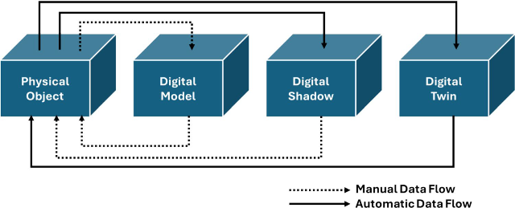
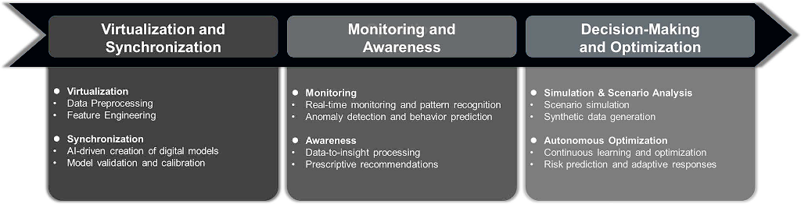
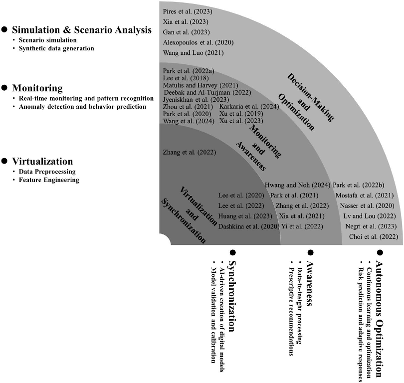
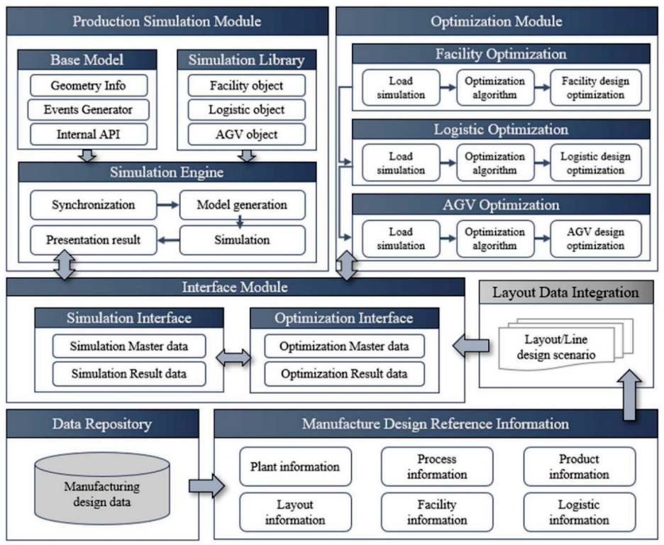
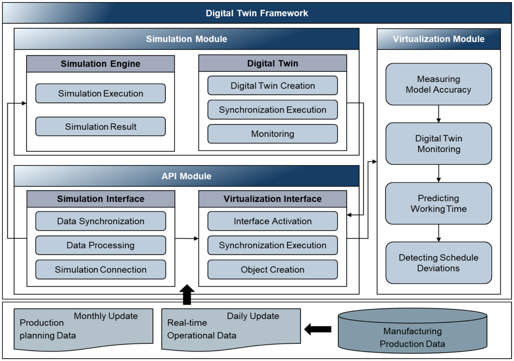
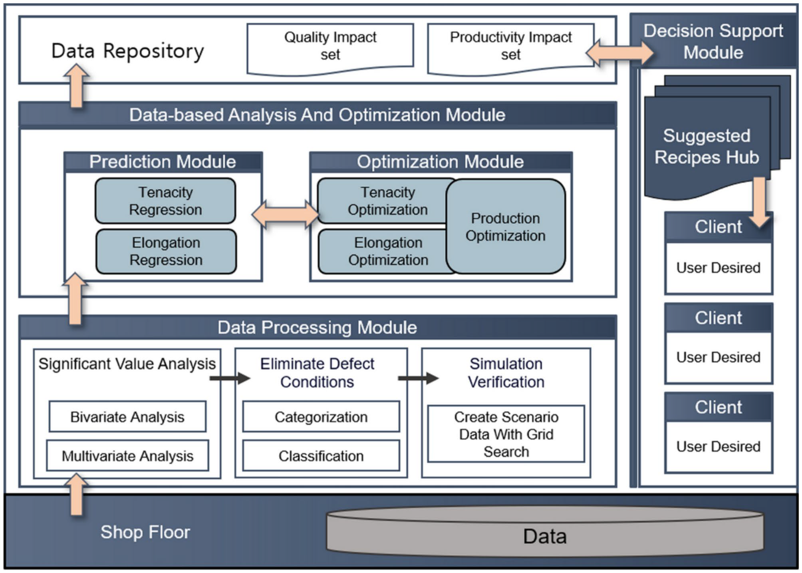

[<- До підрозділу](../README.md)

# Від імітаційного моделювання до автономії: Огляд інтеграції штучного інтелекту та цифрових двійників 

https://link.springer.com/article/10.1007/s40684-025-00750-z

Sajadieh, S.M.M., Noh, S.D. From Simulation to Autonomy: Reviews of the  Integration of Artificial Intelligence and Digital Twins.                    Int. J. of Precis. Eng. and Manuf.-Green Tech.  (2025). https://doi.org/10.1007/s40684-025-00750-z

Ця стаття перекладена з використанням ChatGPT.

## Анотація

Інтеграція штучного інтелекту (ШІ) із технологією цифрових двійників (ЦД) докорінно змінила промисловість, зробивши можливим створення автономних, адаптивних і стійких систем, що виходять за межі статичних цифрових копій. ЦД, підсилені ШІ, забезпечують моніторинг у реальному часі, прогнозне обслуговування, проактивне прийняття рішень та підвищення ефективності роботи, відповідаючи людиноцентричним цілям Індустрії 5.0. У цьому дослідженні представлено фреймворк інтеграції ШІ з ЦД, де ШІ системно впроваджується в життєвий цикл ЦД через фази віртуалізації та синхронізації, моніторингу та обізнаності, а також прийняття рішень і оптимізації. Завдяки використанню передових методів — таких як генеративне проєктування, прогнозна аналітика та моделювання сценаріїв — цей фреймворк підвищує автономність і стійкість ЦД, одночасно вирішуючи критичні проблеми взаємодії, масштабованості та безпеки даних. Кейс-стаді демонструють трансформаційний вплив ШІ на функціональність ЦД, зокрема на самостійну оптимізацію, адаптивне планування та зниження ризиків. Отримані результати підкреслюють потенціал ЦД, керованих ШІ, у революціонізації промисловості та міських систем, а також наголошують на необхідності глобальних стандартів і масштабованих архітектур для реалізації їхньої ролі як базових інструментів у стійких та адаптивних екосистемах Індустрії 5.0.

## 1 Вступ

Злиття технології цифрових двійників (ЦД) та штучного інтелекту (ШІ) є трансформаційною віхою в сучасному виробництві та розвитку міст. Спочатку концептуалізовані як статичні цифрові копії, ЦД еволюціонували у динамічні системи, здатні моделювати, оптимізувати та автономно керувати фізичними процесами. Ці досягнення узгоджуються з цілями Індустрії 4.0, яка акцентує увагу на автоматизації та підключенні, а також з людиноцентричним підходом Індустрії 5.0, яка ставить у пріоритет адаптивність, сталість і стійкість.

ШІ переосмислив можливості ЦД, вивівши системи за межі простої реплікації до проактивного прийняття рішень та автономної роботи. Завдяки моделюванню, прогнозуванню та динамічній адаптації ЦД, керовані ШІ, забезпечують самостійну оптимізацію, прийняття рішень у реальному часі та покращену адаптивність у різних сферах. У цьому дослідженні представлено фреймворк інтеграції ШІ–ЦД — системну модель, що впроваджує ШІ на кожному етапі життєвого циклу ЦД — від проєктування і моделювання до автономної експлуатації та управління ризиками. Вирішуючи ключові проблеми, такі як сумісність, масштабованість і безпека даних, цей фреймворк сприяє сталим практикам і розвитку співпраці людини з роботизованими системами.

У дослідженні розглянуто базові концепції, архітектури та підтримуючі технології ЦД, досліджено виклики та моделі зрілості, пов’язані з їх розробкою, а також проаналізовано, як інтеграція ШІ просуває ЦД до повної автономності та стійкості. Кейс-стаді ілюструють трансформаційний вплив ШІ на функціональність ЦД і надають уявлення про його потенціал у революціонізації продуктивності, сталості та адаптивності операцій. Структура цієї статті наступна: у розділі 2 розглядаються концепції ЦД, виклики та стандарти; розділ 3 представляє фреймворк інтеграції ШІ–ЦД та його роль у системному підсиленні можливостей ЦД; розділ 4 подає кейс-стаді впливу ШІ на ЦД у різних виробничих застосуваннях; у розділі 5 синтезуються висновки, обговорюються майбутні виклики та окреслюється внесок у розвиток сталих, адаптивних і автономних систем.

## 2 Цифровий двійник: концепції, етапи розробки, виклики та стандарти

### 2.1 Означення цифрового двійника та схема

Концепція цифрових двійників (ЦД) зазнала значної еволюції в різних галузях, і її визначення варіюються залежно від специфіки застосування та технологічних вимог. Спочатку ЦД розглядалися як віртуальні відповідники фізичних об’єктів, однак з часом вони поширилися на сфери виробництва, охорони здоров’я, аерокосмічної галузі та міського планування, адаптуючись до різних потреб (див. таблицю 1). Незважаючи на спільне походження — поєднання фізичного і цифрового світів — означення ЦД класифікуються на кілька кластерів відповідно до сфокусованості на керуванні життєвим циклом, операційній оптимізації, моделюванні, автономії та інтеграції в екосистему.

Базовий підхід розглядає ЦД як супутників життєвого циклу, які підтримують безперервний моніторинг і обслуговування завдяки синхронізації з даними в реальному часі. Це особливо важливо в аерокосмічній та автомобільній галузях для відстеження продуктивності й прогнозування потреб у технічному обслуговуванні [3, 7]. Інший кластер означує ЦД як інструменти для оптимізації операцій у реальному часі, що дозволяють ухвалювати рішення на основі даних для підвищення ефективності та стійкості в таких сферах, як виробництво та енергетика [4]. ЦД використовують дані з IoT-датчиків, хмарні обчислення та аналітику ШІ для швидкого реагування на зміни.

Третій кластер зосереджений на можливостях моделювання й прогнозування, де ЦД слугують інструментами для віртуального тестування й аналізу сценаріїв. Такий підхід корисний у фармацевтиці та високотехнологічному виробництві — для вдосконалення конструкцій і виявлення проблем до впровадження [10]. Сучасні визначення включають ШІ та машинне навчання, перетворюючи ЦД на автономні, самоналаштовувані системи, які здійснюють коригування в реальному часі без участі людини. Це особливо актуально для розумних міст і автономного транспорту [17].

Нарешті, ЦД дедалі частіше сприймаються як центральний елемент цифрової екосистеми. Такий погляд підкреслює їхню роль як взаємопов’язаних вузлів у ширших системах, що інтегрують дані з ERP, IoT і цифрових платформ для забезпечення узгодженості та оптимізації роботи в розумних фабриках і міській інфраструктурі [37]. Отже, функціональність ЦД охоплює відстеження життєвого циклу, автономне керування та системну інтеграцію — вони виступають основою цифрової трансформації. Важливо розрізняти цифрові моделі, цифрові тіні та цифрові двійники (рис. 1), адже ці терміни позначають різні рівні інтеграції та взаємодії між цифровим і фізичним середовищем.

Рис. 1 Цифрова модель, цифрова тінь і цифровий двійник

Цифрові моделі — це найпростіша форма цифрового представлення фізичних об’єктів. Вони є статичними та оновлюються вручну, не маючи зв’язку в реальному часі з фізичним прототипом [71, 72]. Такі моделі підходять для етапів раннього проєктування та передвиробничого моделювання, особливо у виробництві та аерокосмічній галузі [10]. Проте після запуску фізичного об’єкта у використання ефективність таких моделей знижується без актуалізації в реальному часі.

Цифрова тінь удосконалює модель, додаючи односторонній потік даних від фізичного об’єкта до його цифрового представлення, що дозволяє здійснювати оновлення в реальному часі. Такий підхід корисний для безперервного моніторингу, наприклад, для прогнозного технічного обслуговування [4, 71–73]. Проте через односторонність даних обмежується рівень інтеграції й можливості прогнозування.

Цифровий двійник є найрозвиненішим рівнем — забезпечує двосторонній обмін даними, що дозволяє не лише моніторити, а й активно керувати фізичним об’єктом [71–73]. ЦД пов’язує виробничі об’єкти з кібермоделями, поєднуючи моделювання та імітаційне моделювання з системами SCADA і DCS [74]. Вони підтримують прогнозне обслуговування, оптимізацію в реальному часі та автономне прийняття рішень завдяки інтеграції ШІ та машинного навчання [17]. У складних середовищах — як-от розумні міста чи виробництво — ЦД діють як центральні платформи екосистем, координуючи дані з мереж IoT, ERP-систем і хмарних сервісів, забезпечуючи ефективність міжсистемної взаємодії [37]. Просунута форма прогнозування на основі ЦД використовує аналітику великих даних для передбачення та проактивної оптимізації майбутніх станів і довгострокової ефективності [73].

Розуміння можливостей цифрових моделей, тіней і двійників є критично важливим для адаптації підприємств до Індустрії 4.0. Цифрові моделі забезпечують статичне уявлення для початкового проєктування та симуляції. Цифрова тінь дозволяє моніторинг у реальному часі з одностороннім потоком даних. Найвищий рівень — цифровий двійник — забезпечує двосторонній обмін даними, підтримує оптимізацію, прогнозування та саморегулювання. Із розвитком ШІ цифрові двійники перетворюються на інтелектуальних агентів, що стимулюють інновації, підвищують стійкість і формують майбутнє промислових процесів.

Таблиця 1. Означення цифрового двійника в науці та промисловості

| Джерело                   | Означення                                                    |
| ------------------------- | ------------------------------------------------------------ |
| Shafto et al. [1]         | Інтегрована мультифізична, багатомасштабна й імовірнісна симуляція транспортного засобу або системи, що використовує найкращі доступні фізичні моделі, оновлення від датчиків, історію експлуатації флоту тощо для відтворення життєвого циклу свого фізичного аналога. |
| Glaessgen and Stargel [2] | Інтегрована мультифізична, багатомасштабна й імовірнісна симуляція складного продукту з використанням найкращих наявних фізичних моделей, оновлень сенсорів тощо для відображення життєвого циклу відповідного двійника. |
| Tuegel [3]                | Модель «від колиски до могили» для оцінки здатності конструкції літака виконувати місії, включає підмоделі електроніки, систем керування польотом, рушійних систем та інших підсистем. |
| Lee [4]                   | Зв’язана модель цифрового двійника реальної машини, що функціонує в хмарному середовищі та моделює стан здоров’я з використанням знань на основі аналітики даних і фізичних моделей. Також описується як системний підхід 5S: Відчуття (Sensing), Зберігання (Storage), Синхронізація (Synchronization), Синтез (Synthesis) та Сервіс (Service). |
| Hochhalter et al. [5]     | Парадигма керування життєвим циклом та сертифікації, де моделі й симуляції включають фактичний стан апарата, отримані навантаження, середовища та інші історичні дані для моделювання індивідуальних літальних апаратів з високою точністю. |
| Grieves [6]               | Концепція віртуального, цифрового еквівалента фізичного продукту. |
| Rosen et al. [7]          | Дуже реалістичні моделі поточного стану процесу та їх взаємодії з навколишнім середовищем у реальному світі — зазвичай називаються «цифровий двійник». |
| Ríos et al. [8]           | Цифровий аналог продукту, що дозволяє визначати, моделювати, прогнозувати, оптимізувати й верифікувати продукт протягом його життєвого циклу: від концепції й дизайну до виробництва, використання й обслуговування. |
| Schluse and Rossmann [9]  | Віртуальні замінники реальних об’єктів, що включають віртуальні представлення й комунікаційні можливості, утворюючи «розумні» об’єкти в інтернеті речей та сервісів. |
| Boschert et al. [10]      | Опис компонента, продукту або системи через набір узгоджених виконуваних моделей: колекція цифрових артефактів, включаючи інженерні, експлуатаційні дані та моделі поведінки. Двійник розвивається паралельно з реальним об’єктом і використовується не лише для опису, а й для оптимізації його функціонування. |
| Schroeder et al. [11]     | Віртуальне представлення фізичного продукту з повною інформацією про нього — від створення до утилізації. Є цифровим аналогом фізичного пристрою в кіберфізичних системах (CPS). |
| Canedo [12]               | Створення цифрового представлення реального об’єкта з фокусом на самому об’єкті. |
| Gabor et al. [13]         | Завдяки зростанню обчислювальної потужності стало можливим створення комплексних симуляцій, що об’єднують моделі різних аспектів конструкції — ці симуляції називають цифровими двійниками систем. |
| Ciavotta et al. [14]      | Цифровий аватар, який включає дані та інтелект CPS, представляючи структуру, семантику та поведінку відповідної системи й забезпечуючи інтеграцію віртуального та фізичного світів. |
| Brenner and Hummel [15]   | Цифрова копія реального заводу, машини або працівника, яка може автономно оновлюватися, розширюватися та бути доступною в режимі реального часу. |
| Söderberg et al. [16]     | Швидші алгоритми оптимізації, потужніші комп’ютери та більші обсяги даних розширюють сферу симуляції до управління й оптимізації в реальному часі. |
| Grieves and Vickers [17]  | Набір віртуальних інформаційних конструкцій, що повністю описують потенційний або фактичний фізичний продукт — від мікрорівня до макрогеометричного рівня. |
| Banerjee et al. [18]      | Комп’ютеризовані клони фізичних активів для глибокого аналізу. Промислові виробничі лінії зазвичай мають безліч сенсорів для формування майже миттєвої інформації про стан виробництва. |

| Джерело                    | Означення                                                    |
| -------------------------- | ------------------------------------------------------------ |
| Vachálek et al. [19]       | Функціональна система безперервної оптимізації процесів, що формується через взаємодію фізичних виробничих ліній із цифровою «копією». Створює середовище цифрової фабрики, в якому підприємство може оптимізувати операції вздовж виробничого ланцюга, змінювати параметри й адаптувати продукт до ринкових вимог. Цифровий двійник збирає й оцінює інформацію, дозволяючи скоротити виробничий цикл, пришвидшити запуск нових продуктів і виявляти неефективні налаштування. |
| Negri et al. [20]          | Віртуальний та комп’ютеризований аналог фізичної системи, що використовується для її моделювання з використанням синхронізації даних у реальному часі. |
| Alam and El Saddik [21]    | Точна кібер-копія фізичної системи, яка повністю відображає її функціональність. |
| Tao and Zhang [22]         | Еталонна модель для реалізації конвергенції фізичного та віртуального простору. |
| Graessler and Poehler [23] | Кіберфізичний пристрій, пов'язаний із CPPS, який імітує працівника завдяки динамічно зміненим значенням у базі даних, що представляють характеристики, уподобання, графік роботи та навички. |
| Zhang et al. [24]          | Набір реалістичних моделей, які поєднують великі обсяги даних із швидкою симуляцією, дозволяючи оптимізувати продукт і виробництво в реальному часі. Особливо корисно на стадії проєктування для оцінки рішень щодо продуктивності та якості. |
| Schleich et al. [25]       | Двосторонній зв’язок між фізичним артефактом і його віртуальними моделями, який забезпечує ефективне проєктування, виробництво, обслуговування та інші етапи життєвого циклу продукту. |
| Shluse et al. [26]         | Один-до-одного віртуальний двійник «технічного активу» (машини, компонента тощо), який включає моделі даних, функціональності та інтерфейсів зв’язку. |
| Stark et al. [27]          | Унікальний екземпляр універсальної моделі Digital Master, що поєднує індивідуальну цифрову тінь і розумне зв’язування між ними (через алгоритми, симуляції, кореляції тощо). |
| Weber et al. [28]          | Цифрове представлення всіх станів і функцій фізичного активу. Через мережеву інфраструктуру цифрові двійники формують тип цілісного інтелекту, де учасники співпрацюють для досягнення спільної мети. |
| Yun et al. [29]            | Ідеальний цифровий об’єкт фізичної системи, який точно відображає її стан. Через цифрового двійника система може бути жорстко контрольована, а також моделювання дозволяє прогнозувати її роботу. |
| Bruynseels et al. [30]     | Інженерна парадигма, за якої фізичний артефакт пов'язується з цифровою моделлю, що динамічно відображає його стан. |
| He et al. [31]             | Динамічний цифровий двійник фізичних активів, процесів і систем, що забезпечує повний моніторинг усього їх життєвого циклу. |
| Liu et al. [32, 33]        | Живий цифровий образ фізичного об’єкта або системи, який постійно адаптується до змін на основі зібраних онлайн-даних і прогнозує майбутні стани. |
| Tao et al. [34]            | Інтегрована мультифізична, багатомасштабна, імовірнісна симуляція складного продукту з використанням найкращих доступних моделей і сенсорних даних для відтворення життєвого циклу. |
| Tao et al. [35]            | Еталонна модель для злиття фізичного та віртуального середовищ. |
| Boschert et al. [36]       | Опис компонента, продукту, системи або процесу за допомогою узгоджених, описових та виконуваних моделей. Цифровий двійник є семантично пов’язаною колекцією цифрових артефактів, яка розвивається разом із фізичним об’єктом і використовується не лише для опису поведінки, але й для пошуку рішень, що стосуються реального об’єкта. |

| Джерело                 | Означення                                                    |
| ----------------------- | ------------------------------------------------------------ |
| Qi and Tao [37]         | Загалом, віртуальні моделі фізичних об’єктів створюються цифровими засобами для симуляції їх поведінки в реальному середовищі. Це віртуалізація фізичних сутностей. Фізичний процес аналізується, прогнозується та оптимізується за допомогою віртуальних методів. Після симуляції та оптимізації процесів проєктування, виробництва й обслуговування — фізичні дії спрямовуються відповідно до оптимізованих рішень. |
| Kharat et al. [38]      | Моделює весь процес як віртуальну модель, дозволяючи двостороннє управління з фізичним процесом. Це репліка фізичної виробничої системи у вигляді цифрової моделі, яка використовується для оптимізації, моніторингу, діагностики та прогнозування з використанням ШІ, машинного навчання та аналітики на основі великих даних. |
| Talkhestani et al. [39] | Цифровий двійник — це віртуальна модель фізичного активу, здатна повністю відтворювати його характеристики та функціональність протягом усього життєвого циклу. Це підхід до управління всіма цифровими даними компонента чи системи із можливістю їх використання для симуляцій та оптимізації. |
| Batty [40]              | Дзеркальне відображення фізичного процесу, що діє паралельно з ним, зазвичай повністю відтворюючи його в реальному часі. |
| Eisenträger et al. [41] | Цифрова модель реального об’єкта, яка містить записи життєвого циклу та динамічні дані про стан, що синхронізуються в реальному часі. Модель використовується для здобуття знань, які можуть бути застосовані до фізичного об’єкта. |
| Asimov et al. [42]      | Віртуальна репліка фізичної установки, яка перевіряє достовірність даних моніторингу, виконує добування даних для виявлення наявних і прогнозування майбутніх проблем, використовуючи AI-движок знань для підтримки бізнес-рішень. |
| Lee et al. [43]         | Цифрове зображення фізичного об’єкта чи процесу майже в реальному часі, яке допомагає оптимізувати бізнес-процеси. Поєднання концепцій IoT та IoS для створення «розумної фабрики» на базі цифрового двійника. |
| Haag and Anderl [44]    | Комплексне цифрове представлення індивідуального продукту. Включає властивості, стан і поведінку фізичного об’єкта через моделі та дані. Розвивається паралельно з фізичним об’єктом протягом усього життєвого циклу. |
| Zhuang et al. [45]      | Динамічна модель у віртуальному світі, що повністю відповідає фізичній сутності у реальному світі та здатна моделювати характеристики, поведінку, життєвий цикл і продуктивність. |
| El Saddik [46]          | Цифрові репліки живих і неживих сутностей, які забезпечують безперервну передачу даних між фізичним і віртуальним світом. |
| Guo et al. [47]         | Цифровий двійник — це цифрове відображення фізичного світу, що картографує його продуктивність. |
| Stark et al. [48]       | Цифровий двійник — це цифрове представлення активного унікального продукту або продуктово-сервісної системи, що включає характеристики, властивості, стани та поведінку за допомогою моделей, інформації й даних на різних етапах життєвого циклу. |
| Leng et al. [49]        | Цифровий двійник — точна й оновлювана в реальному часі кібер-копія фізичної виробничої системи, яка повністю відображає її функціональність. |
| Luo et al. [50]         | Багатогалузева високоточна цифрова модель, яка охоплює механіку, електрику, гідравліку, керування та об'єднує етапи проєктування, виробництва, експлуатації, обслуговування й утилізації. |
| Nikolakis et al. [51]   | Багата цифрова репрезентація об’єктів, суб’єктів та процесів реального світу, включно з даними від сенсорів. Містить цифрову копію фізичного середовища разом з оператором, яка наслідує дії виконавчих механізмів фізичної системи. |
| Wang et al. [52]        | Цифровий двійник — це унікальна «жива» модель фізичної системи, підтримувана багатофізичними симуляціями, машинним навчанням, AR/VR і хмарними сервісами. |
| Xu et al. [53]          | Цифровий двійник представляє фізичні сутності з урахуванням їх функцій, поведінки й правил у динаміці. |
| Liu et al. [32]         | Нова технологія доступу до реалістичних моделей поточного стану процесу й їхньої поведінки у взаємодії з навколишнім середовищем. |
| Madni et al. [54]       | Віртуальний екземпляр фізичної системи (двійника), який постійно оновлюється даними про її продуктивність, обслуговування та стан здоров’я протягом усього життєвого циклу. |

| Джерело                        | Означення                                                    |
| ------------------------------ | ------------------------------------------------------------ |
| Wang et al. [55]               | Парадигма, за якою вибрані онлайн-вимірювання динамічно інтегруються в симуляційне середовище, а запущена модель симуляції адаптивно керує реальним світом у зворотному напрямку. |
| Brilakis et al. [56]           | Цифрова репліка фізичного об'єкта забудови. Вміст цифрового двійника та спосіб представлення фізичного активу залежать від його призначення. Його слід регулярно оновлювати, щоб відображати актуальний стан. Цифровий двійник має бути стандартизованим, розширюваним, хмароорієнтованим, масштабованим та верифікованим. |
| Arup [57]                      | Поєднання обчислювальної моделі та реальної системи, створене для моніторингу, керування та оптимізації її функціонування. Через дані й зворотний зв’язок (як симульовані, так і реальні) цифровий двійник здатен розвивати автономність і здатність до навчання. |
| Bao et al. [58]                | Віртуальна модель у цифровому просторі, яка використовується для симуляції поведінки та характеристик відповідного фізичного об'єкта в реальному часі. |
| Tao et al. [59]                | Набір віртуальних моделей, що є дзеркальним відображенням і відображенням фізичних продуктів у віртуальному просторі. Вони охоплюють увесь життєвий цикл і здатні симулювати, моніторити, діагностувати, прогнозувати й керувати станом і поведінкою відповідних фізичних сутностей. |
| Fotland et al. [60]            | Цифрова копія фізичного активу, яка збирає дані в реальному часі та виводить інформацію, що безпосередньо не вимірюється апаратно. |
| Rasheed et al. [61]            | Віртуальне представлення фізичного активу, реалізоване через дані та симулятори для прогнозування, оптимізації, моніторингу, керування й прийняття рішень у реальному часі. |
| Minerva et al. [62]            | Комплексне програмне представлення фізичного об'єкта, що містить його властивості, стани та поведінку через моделі й дані. DT є набором реалістичних моделей, які симулюють поведінку в експлуатаційному середовищі протягом усього життєвого циклу. |
| Melesse et al. [63]            | Віртуальне представлення фізичного продукту, активу, процесу, системи чи послуги, що дозволяє зрозуміти, прогнозувати й оптимізувати їхню ефективність задля покращення бізнес-результатів. |
| Semeraro et al. [64]           | Набір адаптивних моделей, які імітують поведінку фізичної системи у віртуальному середовищі, оновлюючись у реальному часі протягом життєвого циклу. Вони прогнозують відмови, пропонують зміни й рекомендують дії для оптимізації та пом’якшення непередбачуваних подій. |
| Dassault Systems [65] (IBM)    | Віртуальне представлення об'єкта або системи, яке охоплює життєвий цикл, оновлюється в реальному часі та використовує симуляцію, машинне навчання й логіку для підтримки прийняття рішень. |
| Dassault [66]                  | Виконувана віртуальна модель фізичного об’єкта або системи — від автомобіля чи літака до фармацевтичного препарату або самого виробничого процесу. Кожен продукт має визначені характеристики, які відображаються у цифровому двійнику. |
| Dertien et al. [67] (PTC)      | Цифрові моделі, які віртуально представляють фізичні аналоги — продукт, процес або завдання працівника. Вони використовуються для розуміння чи прогнозування поведінки фізичних об’єктів через поєднання даних з бізнес-систем і даних сенсорів. |
| Siemens [68]                   | Цифровий двійник — це віртуальне представлення фізичного продукту або процесу, що використовується для розуміння та прогнозування характеристик ефективності. Застосовується для симуляції, прогнозування й оптимізації до створення фізичного прототипу. |
| Ansys [69]                     | Аналітично керований, симуляційно орієнтований цифровий двійник — це підключена віртуальна репліка фізичного активу у вигляді інтегрованої багатогалузевої симуляції. Використовується для проєктування, оптимізації, прогнозного обслуговування та управління промисловими активами. |
| Tracy Swartzendruber (GE) [70] | Цифровий двійник найчастіше визначається як програмне представлення фізичного активу, системи або процесу, призначене для виявлення, запобігання, прогнозування й оптимізації за допомогою аналітики в реальному часі з метою підвищення бізнес-цінності. |

### 2.2 Архітектура цифрового двійника

Архітектури цифрових двійників (ЦД) являють собою багаторівневі фреймворки, розроблені для поєднання фізичного й віртуального середовищ, забезпечуючи цифрове представлення фізичних об’єктів у реальному часі (див. таблицю 2). Ці архітектури варіюються за складністю та зосереджені на аспектах обміну даними, обчисленнях та прийнятті рішень.

Schroeder та ін. [11] представили сервіс-орієнтовану архітектуру з рівнями для пристроїв, вебсервісів, сховищ даних та користувацьких інтерфейсів, яка забезпечує доступ до даних у реальному часі й прийняття рішень через стандартні протоколи.

Ponomarev та ін. [76] запропонували п’ятирівневу модель, зосереджену на кіберфізичних системах і розподілених обчисленнях, що є важливим для передового управління даними.

Tao та ін. [34] акцентували увагу на цілісній інтеграції фізичних і віртуальних сутностей (PE та VE) та моделюванні сервісів у реальному часі у своїй п’ятирівневій моделі.

Redelinghuys та ін. [77] запропонували шестирівневу архітектуру з пріоритетом на безперервному потоці даних від пристроїв на периферії до хмари — ідеальний варіант для масштабованих промислових застосувань, що залежать від інфраструктури IoT.

Boje та ін. [78] описали базову трирівневу архітектуру, що складається з фізичного, мережевого та обчислювального рівнів — переважно для базової взаємодії ЦД.

Al-Ali та ін. [79] розширили цю модель, додавши рівні периферійних обчислень і безпеки для посилення прийняття рішень у реальному часі в захищених середовищах через інтеграцію просторової аналітики.

Borangiu та ін. [80] додали двосторонній потік даних до чотиришарової архітектури з фокусом на зборі даних, віртуальних двійниках, аналізі та прийнятті рішень.

Кожна архітектура ЦД має різні вимоги — від базового обміну даними [78] до складних фреймворків із розширеною безпекою та двостороннім потоком даних [34, 76, 80]. Просунуті архітектури, як-от ті, що запропоновані Al-Ali та ін. [79], включають ШІ та периферійні обчислення, що вказує на майбутнє ЦД у вигляді самоадаптивних масштабованих систем, які підтримують автономне прийняття рішень.

Із продовженням впровадження ЦД у промисловості, вибір архітектури, що відповідає конкретним операційним вимогам, є критично важливим для ефективного використання інтелектуальних і автономних систем.

Таблиця 2. Архітектури цифрового двійника

| Джерело                   | Рівні архітектури                                            |
| ------------------------- | ------------------------------------------------------------ |
| Schroeder та ін. [11, 75] | Пристрої → Користувацькі інтерфейси → Вебсервіси → Рівень запитів → Сховища даних |
| Ponomarev та ін. [76]     | Кіберфізичний рівень → Рівень первинної обробки/зберігання даних → Рівень розподілених обчислень і зберігання → Рівень моделей і алгоритмів → Візуалізація та користувацький інтерфейс |
| Tao та ін. [34]           | Фізична сутність → Віртуальна сутність → Сервіси → Дані → З’єднання |
| Redelinghuys та ін. [77]  | Фізичний двійник (фізичні пристрої) → Фізичний двійник (локальні контролери) → Локальні сховища даних → IoT-шлюз → Хмарні інформаційні сховища → Емуляція та симуляція |
| Boje та ін. [78]          | Фізичний рівень → Мережевий рівень → Обчислювальний рівень   |
| Al-Ali та ін. [79]        | Рівень фізичного простору → Рівень комунікаційної мережі → Рівень віртуального простору (агрегація даних) → Рівень віртуального простору (моделювання даних) → Рівень аналітики даних і візуалізації → Рівень застосунків і безпеки |
| Borangiu [80]             | Збір і передача даних → Віртуальні двійники підпроцесів → Аналіз даних → Прийняття рішень |

### 2.3 Категорії цифрових двійників

У виробництві цифрові двійники (ЦД) класифікують за застосуванням, ієрархічним рівнем і підходом до моделювання, і кожен із цих аспектів забезпечує унікальні переваги з точки зору ефективності системи та продуктивності.

З точки зору застосування, ЦД поділяються на конструкторські (design twins) і операційні (operational twins). Конструкторські ЦД підтримують прототипування протягом життєвого циклу продукту, забезпечуючи віртуальне тестування й оптимізацію до початку виробництва [81]. Вони дозволяють проводити пілотні випробування обладнання та конфігурацій, допомагають у оптимізації розташування та знижують витрати. У контексті масової персоналізації ЦД дозволяють здійснювати індивідуальні налаштування, що є ключовим для продуктів з відкритою архітектурою (OAP) [82]. Навпаки, операційні ЦД зосереджені на моніторингу та керуванні — синхронізуючи дані від обладнання в реальному часі для прогнозного обслуговування та оптимізації логістики [81]. Вони підвищують продуктивність, запобігаючи простоям і покращуючи використання ресурсів [83].

З ієрархічної точки зору, ЦД функціонують на рівні компонентів, систем та систем систем (SoS). ЦД на рівні компонентів моделюють окремі частини, тоді як системні ЦД поєднують ці компоненти для оптимізації всієї виробничої системи [84–86]. SoS-двійники забезпечують цілісне уявлення про роботу підприємства, пов’язуючи різні підрозділи, наприклад, постачання та сервіс, для інтегрованого керування життєвим циклом. Melesse та ін. [63] розглядали ієрархічні ЦД від рівня компонента до рівня процесу, що дає змогу досягати комплексної прозорості у виробничому середовищі. Відповідно до ISO/IEC 30173 [87, 88], ЦД класифікують на: компонентні, активні, системні, процесні, залежно від охоплення цільової сутності. Компонентні ЦД представляють ключові елементи, що суттєво впливають на продуктивність (наприклад, складний двигун або насос). Активні ЦД охоплюють набори компонентних двійників і дають уявлення на рівні одиниці. Системні ЦД інтегрують взаємопов’язані сутності для функціонування на рівні систем або мереж, тоді як процесні ЦД зосереджуються на операціях і забезпечують аналітику процесів, а не фізичних об’єктів. Така класифікація відповідає ієрархічному підходу, забезпечуючи прозорість від рівня компонентів до рівня підприємства.

З точки зору моделювання, ЦД можуть бути: фізично-орієнтованими (physics-based), даними-орієнтованими (data-driven), гібридними (hybrid). Фізично-орієнтовані моделі імітують поведінку на основі фізичних законів, а моделі, орієнтовані на дані — на емпіричних спостереженнях. Гібридні ЦД поєднують обидва підходи для підвищення точності прогнозів, особливо в складних або застарілих середовищах [89]. Tao та ін. [34, 90] запропонували п’ятивимірну модель ЦД:  фізична сутність, віртуальна модель, з’єднання, дані та сервіс, яка включає підмоделі (геометричні, фізичні, поведінкові та на основі правил) для глибшого аналізу системи. Моделі на основі правил (наприклад, Kaur, Mishra і Maheshwari [91]) додають інтелектуальність ЦД, використовуючи історичні дані для підтримки прогнозного прийняття рішень.

Класифікація ЦД за застосуванням, ієрархією та підходом до моделювання дозволяє виробничим системам оптимізувати процеси та знижувати ризики. Особливо гібридні ЦД, що поєднують підходи на основі даних і фізики, підтримують самооптимізувальні середовища, прокладаючи шлях до ЦД, підсилених штучним інтелектом, і цифрової трансформації майбутнього у виробництві.

### 2.4 Технології, що забезпечують функціонування цифрових двійників

Цифрові двійники (ЦД) спираються на широкий спектр технологій для точного представлення фізичних об’єктів. Як зазначено у роботах Kuehn [92], Min та ін. [93], Qi та ін. [94] і Tao та ін. [90], ключовими технологіями є штучний інтелект (AI), машинне навчання (ML) та аналітика даних, які є критично важливими для підвищення точності та чутливості ЦД. П’ятимірна модель ЦД виокремлює наступні основні модулі: фізичні сутності, віртуальні моделі, дані ЦД, інтелектуальні сервіси та з’єднання. Технології сенсорики та вимірювання точно фіксують фізичні процеси, тоді як інструменти моделювання, імітаційного моделювання та візуалізації забезпечують моніторинг активів у реальному часі. Щоб моделі відображали зміни, ЦД використовують машинне навчання, імітаційні моделі та засоби валідації, такі як перевірка, валідація та акредитація (VV&A). Для ефективного керування даними можуть застосовуватися технології, такі як аналітика великих даних, нейронні мережі та злиття даних, що дозволяє синтезувати інформацію з кількох джерел і своєчасно отримувати інсайти. Інструменти візуалізації, такі як інформаційні панелі, чітко подають складні дані, підтримуючи ефективний моніторинг. Інтелектуальні сервіси отримують вигоду від архітектурних, програмних і платформних технологій, які керують життєвими циклами сервісів, у той час як комунікаційні технології забезпечують безперебійну інтеграцію модулів, підтриману засобами безпеки для збереження цілісності даних [90, 94]. Ji та ін. [95] додали, що кіберфізичні системи (CPS), імітаційне моделювання, IoT, великі дані та технології моделювання є критичними для розвитку ЦД. CPS, ключовий компонент Індустрії 4.0, з’єднує фізичні активи з кіберпростором через зворотні петлі у реальному часі, забезпечуючи обчислювальний аналіз і зворотний зв’язок для фізичних операцій. Хоча ЦД зосереджуються на високоточній віртуальній синхронізації, потужні комунікаційні та сенсорні технології CPS дозволяють ефективно відтворювати й прогнозувати фізичну поведінку.

Новітні технології, такі як IoT, великі дані, AI, хмарні обчислення та VR, ще більше розширили можливості ЦД. IoT підтримує обмін даними в реальному часі, великі дані й AI забезпечують інтелектуальний аналіз, хмарні обчислення задовольняють обчислювальні потреби, а VR забезпечує занурену взаємодію з моделями ЦД [95]. Сукупно ці технології стимулюють інновації ЦД, сприяючи розвитку прогнозних і автономних систем для виробництва, охорони здоров’я та міського планування.

### 2.5 Розробка цифрових двійників, виклики та стандарти

Розробка цифрових двійників (ЦД) у виробництві включає визначення цілей, встановлення очікувань щодо продуктивності відповідно до потреб зацікавлених сторін і формування чітких функцій моніторингу, прогнозування або оптимізації [34, 59, 96, 97]. Створення адаптивної інформаційної моделі є ключовим для розробки ЦД — Lu et al. [98] і Adamenko et al. [99] підкреслюють її роль у відображенні фізичних характеристик. Інструменти, такі як AutomationML та VREDI, згідно з Schroeder et al. [100] і Qamsane et al. [101], спрощують обробку даних і забезпечують інтероперабельність у складних системах. Встановлення двостороннього обміну даними забезпечує синхронізацію в реальному часі [102], тоді як стандартизація форматів покращує зрозумілість і передачу [103]. Методи іміатаційного моделювання дозволяють проводити аналіз продуктивності та тестування сценаріїв, при цьому Stark et al. [48] наголошують на інтеграції та взаємодії з людиною в межах «восьмимірної моделі цифрового двійника». Машинне навчання сприяє аналізу даних і прийняттю рішень, трансформуючи сирі дані в практичні інсайти [59, 96, 99]. Суворі процеси валідації перевіряють точність ЦД і відповідність фізичним системам [101, 104]. Реалізація ЦД в операційному середовищі передбачає постійний моніторинг, поступове вдосконалення та розгортання відповідно до життєвого циклу програмного забезпечення (SDLC), що сприяє повторному використанню [100, 105].

Керування даними, інтероперабельність і кібербезпека є суттєвими викликами. Проблеми довіри до даних, конфіденційності й кіберзахисту ускладнюють інтеграцію ЦД [106–108]. Pileggi et al. [109] визначили дев’ять ключових бар’єрів для впровадження ЦД, розділивши їх на організаційні та технологічні виклики. До організаційних належать відсутність стратегічного лідерства, опір змінам і складність екосистеми, що перешкоджає узгодженню з бізнес-цілями та призводить до фрагментованої реалізації. З технологічного боку, малі та середні підприємства (МСП) стикаються з труднощами у зборі якісних даних, підтримці надійних систем та керуванні масштабованими, інтероперабельними й захищеними ЦД. Багато хто не має необхідної інфраструктури й експертизи для постійного оновлення та ефективного керування даними, що ускладнює інтеграцію з наявними системами. Подолання цих бар’єрів є критично важливим для того, щоб МСП могли використовувати ЦД для прийняття рішень у реальному часі й прогнозного обслуговування. 

Складність комунікацій і надійність мереж — особливо в контексті IoT — вимагають використання розширених засобів керування доступом до даних (DAC) і захищених фреймворків, зокрема з використанням 5G [110, 111]. Як наголошують Gunes et al. [112], в умовах постійного розвитку технологій організації повинні залишатися пильними, оновлюючи свої системи та процеси для збереження конкурентоспроможності.

Крім того, стандартизовані фреймворки та якісний збір даних необхідні для керування масштабованими потоками даних у реальному часі [113, 114]. Проблеми сумісності з застарілими системами та відсутність універсальних фреймворків для ЦД ще більше ускладнюють їх реалізацію [61, 110]. Кібербезпека додає ще один рівень складності, який потребує особливої уваги до захисту даних [34].

Стандарти, такі як ISO 23247 [115] і оболонка керування активами (AAS, Asset Administration Shell), сприяють інтероперабельності, сумісності та масштабованості в екосистемах ЦД, тим самим підтримуючи аналітику на основі ШІ та глобальне впровадження [34, 116–118]. ISO 23247 [119] структурує ЦД для виробничих застосувань, що дозволяє виявляти дефекти та підвищувати ефективність у автомобільній галузі [120–123]. Стандарт AAS забезпечує обмін даними між платформами в інтелектуальних системах, сприяючи узгодженому обміну даними між пристроями [124, 125]. Безпека є ключовим елементом AAS для забезпечення стійкості даних [118, 126].

Встановлення надійних стандартів і вирішення ключових проблем інтероперабельності, інтеграції даних та етичного використання ШІ є критичними для того, щоб зробити системи ЦД масштабованими, захищеними й ефективними. Оскільки ці базові елементи формують стійкі та інтелектуальні екосистеми, інтеграція ШІ ще більше підвищує потенціал ЦД, перетворюючи їх на автономні адаптивні системи. У наступному розділі буде розглянуто, як можливості й інсайти, підсилені ШІ, надають ЦД змогу автономно вдосконалювати виробничі процеси й прийняття рішень у масштабі.

## 3 Штучний інтелект і цифровий двійник у виробництві

Інтеграція штучного інтелекту (ШІ) з технологією цифрового двійника (ЦД) є трансформаційним досягненням у сфері виробництва, що переосмислює проєктування, моніторинг і оптимізацію систем. У цьому розділі розглядається роль ШІ, що розвивається, у підвищенні ефективності ЦД протягом усього їхнього життєвого циклу, який структуровано на три послідовні фази: віртуалізація та синхронізація, моніторинг і усвідомлення, а також прийняття рішень і оптимізація. Ці фази демонструють здатність ШІ трансформувати ЦД зі статичних цифрових моделей у розумні, адаптивні та самооптимізувальні системи.

Цей розділ поділено на три частини:

- Застосування ШІ в життєвому циклі ЦД, де розглядаються внески ШІ через тематичні приклади;
- Фреймворк інтеграції ШІ–ЦД, який представляє системну модель інтеграції ШІ в системи ЦД з метою досягнення синхронізації, операційної досконалості, автономної оптимізації на основі контекстуалізованих кейсів і порівняння зі стандартами галузі;
- Фреймворк інтеграції ШІ–ЦД та наявні моделі зрілості, де пропонований фреймворк співвідноситься з усталеними моделями зрілості, підкреслюючи його актуальність і відповідність галузевим стандартам.

### 3.1 Застосування штучного інтелекту в життєвому циклі цифрового двійника

Комплексний огляд застосувань ШІ в екосистемах цифрових двійників підкреслює наявність обґрунтування для побудови систематичної рамки інтеграції ШІ в життєвий цикл цифрового двійника (ЦД). Досвід, отриманий із кейс-стаді та досліджень, узгоджується з трьома послідовними фазами рамки — віртуалізація та синхронізація, моніторинг та обізнаність, ухвалення рішень та оптимізація — і підкреслює ключову роль ШІ в підвищенні функціональності ЦД на кожному етапі.

Фаза віртуалізації та синхронізації зосереджена на створенні та узгодженні моделей ЦД для забезпечення їхньої точності щодо фізичних систем, які вони відображають. Ця фаза формує основу для адаптивності, точності та довготривалої надійності ЦД. ШІ відіграє центральну роль, впроваджуючи передові методи попередньої обробки даних, інженерії ознак та створення моделей. Ponnusamy та ін. [127] підкреслили роль ШІ у віртуальному прототипуванні, предиктивній аналітиці та симуляційній аналітиці для покращення початкових конфігурацій моделей. Подібно, Adamenko та ін. [99] акцентували на важливості інтеграції даних та точності симуляцій для побудови високоякісних ЦД. Renold і Kathayat [128], Singh і Bhambri [129] продемонстрували, як машинне навчання та глибоке навчання покращують аналіз даних для створення стійких цифрових моделей. Ці дослідження узгоджуються з двома ключовими компонентами фази: віртуалізацією, де ШІ обробляє необроблені дані у придатні цифрові моделі, та синхронізацією, яка забезпечує відповідність віртуальних моделей їхнім фізичним аналогам через валідацію та калібрування.

Фази моніторингу та обізнаності позначають перехід від статичних моделей до систем, які динамічно взаємодіють із даними в реальному часі. ШІ дозволяє ЦД моніторити, аналізувати та адаптуватися до постійно змінного середовища. Rathore та ін. [130], Bolla та ін. [131] підкреслили роль ШІ в моніторингу в реальному часі та виявленні аномалій, що є ключовими для цієї фази. Такий моніторинг забезпечує розпізнавання шаблонів, діагностику та предиктивне обслуговування. Shen та ін. [132], Bhambri та ін. [133] продемонстрували, як ШІ посилює обізнаність через обробку даних до інсайтів та надання приписів. Rana і Bhambri [134] досліджували інтеграцію ШІ та Інтернету речей (IoT) у цифрових двійниках у контексті Індустрії 4.0, зокрема як ЦД на основі ШІ використовують IoT-дані для моніторингу та діагностики в реальному часі. Vilas-Boas та ін. [135] проаналізували застосування ЦД, розподілених реєстрів, IoT і ШІ у харчовій логістиці. Chen та ін. [136], Kaur та ін. [91] показали, як аналітика на основі ШІ забезпечує ефективне управління ресурсами, продуктивністю й операційною ефективністю. Ця фаза демонструє здатність ШІ адаптувати ЦД до складних реальних умов.

Фази ухвалення рішень та оптимізації позиціонують ЦД як стратегічні інструменти, що використовують ШІ для поглибленої аналітики, довгострокового планування та автономної оптимізації. На цьому етапі ШІ дозволяє цифровим двійникам виходити за межі операцій в реальному часі, підтримуючи симуляції, оцінку стратегій і планування стійкості. Emmert-Streib [137], Salini і Ivy [138], Huang та ін. [139] показали, як ШІ використовується для моделювання сценаріїв, оцінювання ризиків і створення синтетичних даних для навчання моделей з підкріпленням. Samuel та ін. [140] наголосили на внеску ШІ в автономну оптимізацію, де безперервне навчання, проактивне управління ризиками та адаптивне прийняття рішень забезпечують автономність і гнучкість цифрових двійників.

Оглядові дослідження надають вагомі докази на користь побудови рамки інтеграції ШІ–ЦД, яка органічно вписується в життєвий цикл цифрових двійників. Узгодження застосувань ШІ з фазами віртуалізації та синхронізації, моніторингу та обізнаності, а також ухвалення рішень та оптимізації дозволяє системно покращувати обробку даних, адаптацію до операційних змін та стратегічну оптимізацію. У сукупності ці елементи гарантують, що ЦД є стійкими, адаптивними й трансформаційними інструментами для сучасного виробництва, здатними генерувати інновації, стійкість та довгостроковий розвиток. У той же час, ці дослідження вказують на потребу вирішення питань масштабованості, безпеки даних та стандартизації в різних галузях.

### 3.2 Рамка інтеграції штучного інтелекту й цифрового двійника

У міру цифровізації промисловості, інтеграція ШІ з технологією цифрового двійника відіграє ключову роль у створенні адаптивних, інтелектуальних та автономних систем. ШІ розширює можливості ЦД, забезпечуючи обробку великих обсягів даних у реальному часі, оптимізацію прийняття рішень та підтримку предиктивної аналітики. У цьому розділі представлено структуровану рамку інтеграції ШІ–ЦД, що описує послідовні фази, у яких ШІ трансформує цифрові двійники. Ці фази — віртуалізація та синхронізація, моніторинг та обізнаність, а також ухвалення рішень та оптимізація — формують шлях від статичних цифрових моделей до повністю автономних і здатних до самонавчання систем.

#### 3.2.1 Концептуалізація фреймворку інтеграції ШІ–ЦД

Інтеграція штучного інтелекту (ШІ) у життєвий цикл систем цифрових двійників (ЦД) є ключовою трансформацією в їх розробці, експлуатації та оптимізації. Зокрема, внесок ШІ структуровано у три послідовні фази, кожна з яких відповідає певному етапу життєвого циклу ЦД. Цей структурований підхід, ілюстрований на рис. 2, підкреслює здатність ШІ перетворювати ЦД зі статичних реплік у розумні, адаптивні та автономні системи. Кожна фаза додатково розділяється на компоненти й детальні кроки, що забезпечує комплексний шлях реалізації.

Інтеграція ШІ є необхідною для розширення можливостей ЦД за межі традиційних симуляційних моделей. Зростаюча складність промислових середовищ вимагає прийняття рішень у реальному часі на основі даних, де ШІ забезпечує автоматизацію, підтримує прогнозну аналітику та надає можливості самонавчання. Галузі, такі як виробництво, енергетика та охорона здоров’я, вже використовують ЦД, посилені ШІ, для оптимізації ефективності, зниження експлуатаційних витрат і підвищення стійкості систем.

Втім, для повної реалізації потенціалу фреймворку інтеграції ШІ–ЦД необхідно вирішити низку викликів, таких як обчислювальна складність, інтероперабельність і безпека даних.

Рис. 2 Структура інтеграції штучного інтелекту та цифрового двійника (ШІ–ЦД)

#### 3.2.2 Внесок ШІ у життєвий цикл цифрового двійника

Перша фаза — віртуалізація та синхронізація — зосереджена на створенні надійної та динамічної основи для цифрових двійників (ЦД). Ця фаза покращує здатність ЦД точно відображати фізичні системи та забезпечує безперервне узгодження віртуальних моделей із реальними об’єктами. Методи, керовані ШІ, відіграють ключову роль в удосконаленні даних і створенні надійних цифрових моделей. Компонент віртуалізації зосереджується на попередній обробці даних та інженерії ознак — критично важливих етапах підготовки й вилучення значущої інформації з сирих даних для побудови точних моделей. Ці процеси гарантують очищення, інтеграцію та перетворення даних у придатні формати, що створює основу для розширеного моделювання. Компонент синхронізації наголошує на створенні цифрових моделей за допомогою ШІ та їх узгодженні з фізичними системами. Застосовуються методи машинного навчання та моделювання для створення високоточних моделей, а валідація та калібрування забезпечують точне відображення поведінки реального світу. Ця фаза формує основу для динамічної роботи та розширеного прийняття рішень шляхом створення надійного та синхронізованого цифрового середовища.

Методи ШІ, такі як глибоке навчання та навчання з підкріпленням, суттєво сприяють підвищенню точності віртуалізації та надійності синхронізації. Наприклад, генеративні змагальні мережі (GAN) можуть створювати синтетичні набори даних для навчання моделей ЦД, підвищуючи їхню узагальнюваність. Крім того, підходи до обчислень на периферії (edge computing) та федеративного навчання сприяють зменшенню затримок при синхронізації фізичних і віртуальних компонентів у реальному часі.

Друга фаза — моніторинг та усвідомлення (awareness) — зміщує акцент на операційну досконалість, дозволяючи ЦД відстежувати дані в реальному часі, виявляти шаблони та динамічно реагувати на зміни в навколишньому середовищі. Ця фаза забезпечує обізнаність ЦД щодо змінних умов і формує аналітичні висновки для підтримання оптимальної роботи. Компонент моніторингу використовує ШІ для забезпечення моніторингу в реальному часі та розпізнавання шаблонів, при цьому експлуатаційні дані безперервно аналізуються для виявлення змін і підтримки стабільності ситуації. Також функції виявлення аномалій і прогнозування поведінки дають змогу ідентифікувати відхилення та передбачити потенційну поведінку системи, що забезпечує надійність в умовах динаміки. Компонент усвідомлення розширює цю можливість, трансформуючи отримані дані у змістовні інсайти. Обробка «дані–висновок» перетворює сирі спостереження на придатні знання, тоді як прескриптивні рекомендації забезпечують стратегії, керовані ШІ, для оптимізації операцій і ефективного вирішення проблем. Ця фаза підвищує адаптивність ЦД, гарантує надійність їхньої роботи та проактивну реакцію на складні сценарії.

Різноманітні методи ШІ, включно з комп’ютерним зором і обробкою природної мови (NLP), використовуються для автоматичного виявлення аномалій і ситуаційної обізнаності. Моделі навчання з підкріпленням допомагають оптимізувати прийняття рішень, безперервно адаптуючись до нових даних. Крім того, графи знань і семантичне міркування підвищують контекстуальне розуміння моніторингових даних, покращуючи точність рішень ЦД.

Третя фаза — прийняття рішень і оптимізація — підносить ЦД до рівня стратегічних інструментів, які використовують ШІ для передових симуляцій, автономної оптимізації та довгострокової стійкості. Ця фаза дозволяє ЦД забезпечувати операційну досконалість шляхом проактивного планування, оптимізації та безперервного навчання. Компоненти симуляції та аналізу сценаріїв зосереджені на симуляції сценаріїв, у межах якої ШІ віртуально оцінює різні стратегії для визначення найефективніших шляхів дій. Додатково, генерація синтетичних даних забезпечує цінні набори даних для тренування моделей навчання з підкріпленням, підвищуючи прогнозні можливості ЦД.

Компонент автономної оптимізації інтегрує безперервне навчання та оптимізацію, керовані ШІ, що дозволяє ЦД з часом автономно покращувати продуктивність системи. Крім того, прогнозування ризиків та адаптивні реакції дозволяють ЦД передбачати загрози та проактивно їх зменшувати, забезпечуючи тим самим стійкість в умовах динамічного й невизначеного середовища. Ця фаза є вершиною зрілості ЦД, у якій системи досягають автономії, дозволяючи організаціям приймати обґрунтовані й оптимізовані рішення у великому масштабі.

#### 3.2.3 Реальні приклади застосування фреймворку інтеграції ШІ–ЦД

Фреймворк інтеграції ШІ–ЦД ілюструє систематичну інтеграцію штучного інтелекту в життєвий цикл цифрових двійників (ЦД), що дозволяє їм переходити від статичних моделей до інтелектуальних, адаптивних і самооптимізувальних систем. Здійснюючи базові завдання через віртуалізацію та синхронізацію, підвищуючи адаптивність завдяки моніторингу та усвідомленню, а також забезпечуючи стратегічну оптимізацію за допомогою прийняття рішень, цей фреймворк пропонує цілісний і прикладний шлях до використання ШІ в технології ЦД. Такий структурований підхід дозволяє ЦД вирішувати складні задачі сучасних промислових екосистем, значно підвищуючи ефективність, адаптивність і стійкість.

У міру розвитку промисловості ЦД, доповнені ШІ, стають незамінними інструментами для реагування на динамічні виклики, стимулювання інновацій та досягнення сталого операційного успіху. Інтеграція ШІ в архітектуру ЦД докорінно змінила їх життєвий цикл, удосконалюючи точність, адаптивність і автономність. У цьому розділі демонструється, як фреймворк інтеграції ШІ–ЦД трансформує теоретичні концепції в реальні застосування, ілюстровані кейсами, що охоплюють фази: віртуалізація та синхронізація, моніторинг та усвідомлення, прийняття рішень та оптимізація. Завдяки точному віртуальному моделюванню, моніторингу в реальному часі та проактивному прийняттю рішень, ШІ дозволяє ЦД ефективно вирішувати складні виклики, пов'язані з ефективністю й стійкістю.

Рисунок 3 класифікує ці кейс-стаді за фазами, показуючи трансформаційну роль ШІ в розвитку ЦД — від статичних моделей до повністю автономних систем. Наступні приклади ілюструють ключові застосування та демонструють вплив ШІ протягом усього життєвого циклу ЦД.

Рис. 3 Класифікація прикладних досліджень за фазами інтеграції ШІ–ЦД

Починаючи з віртуалізації, Zhang et al. [141] запропонували концепцію даних ЦД (DTD) для вирішення проблем збору, злиття та використання точних ЦД-систем. Дослідження акцентувало увагу на інженерії ознак і гібридному моделюванні для перетворення сирих даних у придатні формати з метою забезпечення якісного побудування віртуальних моделей і ітеративної оптимізації. Інтегруючи фізичні, віртуальні та галузеві дані, дослідження забезпечує синхронізацію в реальному часі та підвищує продуктивність ЦД. Це відповідає підкатегорії віртуалізації у фазі віртуалізації та синхронізації.

Щодо синхронізації, Lee et al. [142] розробили ЦД, інтегрований із глибоким навчанням у межах фреймворку кіберфізичної системи 5С. Дослідження підкреслює значення збору даних у реальному часі, прогнозних сервісів і потенціалу мереж 5G, відносячись до підкатегорії синхронізації для підтримки розумного виробництва в контексті Industry 4.0.

Lee et al. [143] представили систему на базі цифрового двійника для адаптивного проєктування виробничої лінії. Поєднуючи симуляції, навчання з підкріпленням (RL) та евристичну оптимізацію, фреймворк дозволяє здійснювати аналіз і попередню валідацію конфігурацій у реальному часі, знижуючи витрати після впровадження та покращуючи ефективність. Це дослідження також належить до категорії віртуалізації, оскільки акцентує увагу на ітеративному вдосконаленні адаптивних виробничих процесів.

У частині валідації моделей, Huang et al. [144] запропонували гібридний фреймворк на основі навчання, який поєднує ШІ з галузевими знаннями про верстати. Система забезпечує моніторинг у реальному часі, адаптивне оновлення моделей, контроль якості та підтримання узгодженості між віртуальними моделями й фізичними умовами в рамках синхронізації.

Dashkina et al. [145] дослідили адаптивні ЦД з нейронними мережами, використовуючи багатоступеневу методологію. Дані в реальному часі забезпечують постійне вдосконалення моделей, підвищуючи точність і прийняття рішень, що також належить до фази синхронізації.

Щодо моніторингу в реальному часі, Park et al. [146] запропонували фреймворк ЦД із навчанням з підкріпленням для оптимізації управління виробництвом у повторно-завантажуваних виробництвах (RJS), де вироби багаторазово проходять ті самі ресурси. Замість традиційних евристичних методів, цей підхід використовує поєднання ЦД і RL для динамічного планування й розподілу ресурсів, застосовуючи дані в реальному часі. Фреймворк інтегрує горизонтально координовану модель, яка постійно подає дані з ЦД до мережі політик RL, покращуючи адаптивність. Побудований на принципах сервісно-орієнтованої архітектури (SOA), фреймворк включає бібліотеку логіки (SLL) для безшовного впровадження політик RL. Валідація на прикладі дільниці старіння літій-іонних батарей показала значні покращення у ключових показниках ефективності, використанні ресурсів та операційній ефективності.

Lee et al. [147] розробили кіберфізичну виробничу систему для прогнозування якості лиття металів. Інтеграція IoT-датчиків, машинного навчання та аналітики великих даних забезпечує виявлення дефектів у реальному часі та коригування виробництва. Це дослідження належить до категорії моніторингу в реальному часі.

Xu et al. [148] представили ЦД з покращенням на базі глибокого навчання для складних композитних структур. Використовуючи нейромережі, фреймворк прогнозує 3D-поля переміщень і напружень із високою точністю. Експерименти підтвердили здатність до адаптації й інтелектуального контролю в реальному часі.

Matulis і Harvey [149] розробили ЦД для управління роботизованою рукою, зосереджуючись на навчанні з підкріпленням у віртуальному середовищі та перенесенні навичок у фізичні завдання. Синхронізація в реальному часі забезпечує узгодженість продуктивності, що відповідає фазі моніторингу.

Jyeniskhan et al. [150] представили систему ЦД для адитивного виробництва, що використовує машинне навчання для виявлення дефектів у реальному часі. Інтерфейс Unity дозволяє операторам візуалізувати процеси й вносити корективи.

Zhou et al. [151] запропонували фреймворк SOD-DT для виявлення дрібних об’єктів у великомасштабному виробництві. Інтегруючи MobileNetv2, YOLOv4 та OpenPose, система забезпечує моніторинг і синхронізацію в реальному часі, належачи до категорії моніторингу та прескриптивних рекомендацій.

Park et al. [152] представили фреймворк на базі ЦД для кіберфізичних систем у мікро-розумних фабриках, зосереджений на персоналізованому виробництві. Фреймворк включає п’ять основних сервісів: планування, автоматизоване виконання, моніторинг, повідомлення про аномалії та динамічну реакцію, побудованих навколо моделі P4R.

Wang et al. [153] запропонували ЦД з глибоким навчанням для співпраці людини й робота, інтегруючи виявлення дій для забезпечення безпеки та ефективності. Система валідується на роботу Universal Robot 10.

Переходячи до виявлення аномалій, Karkaria et al. [154] запропонували фреймворк цифрового двійника (ЦД) для адитивного виробництва з лазерним направленим осадженням енергії. Поєднуючи моделі на основі довготривалої короткотермінової пам’яті (LSTM) та баєсівську оптимізацію, система прогнозує температури в реальному часі та коригує профілі потужності лазера для покращеного контролю. У поєднанні з виявленням аномалій і моделюванням сценаріїв це забезпечує ефективне та адаптивне керування процесом.

Розширюючи фокус на виявлення аномалій, Xu et al. [53] представили фреймворк діагностики несправностей, що використовує глибоке трансферне навчання (DFDD) для прогнозного технічного обслуговування. Симуляції на етапі проєктування діагностичних моделей поїздів були застосовані до фізичних систем, щоб забезпечити раннє виявлення несправностей і моніторинг у реальному часі. Це дослідження відповідає категоріям «Виявлення аномалій» та «Безперервне навчання», сприяючи вдосконаленій діагностиці несправностей і сталому функціонуванню.

Deebak і Al-Turjman [155] представили фреймворк для діагностики несправностей у реальному часі для металообробних інструментів з використанням глибокого трансферного навчання та сенсорів з підтримкою IoT. Система оптимізує умови роботи інструменту, покращує точність діагностики та забезпечує проактивне обслуговування. Це дослідження також відповідає категоріям «Виявлення аномалій» і «Безперервне навчання», сприяючи надійності на основі даних.

Щодо обробки даних у знання, Park et al. [156] запропонували фреймворк ЦД та навчання з підкріпленням (RL) для управління виробництвом у мікро-розумних фабриках (MSF), спрямований на підвищення стійкості та адаптивності у модульних виробничих системах (MMS). Цей підхід використовує віртуальні журнали подій, згенеровані ЦД, для фіксації даних про стан, дії та винагороди для підтримки навчання RL. Це, у свою чергу, забезпечує реакцію в реальному часі на динамічні умови виробництва. Завдяки вертикальній інтеграції потоків даних та горизонтальній координації ресурсів, система DT-RL динамічно регулює виробництво на основі навантаження та стану обладнання, оптимізуючи рішення «що далі» і «де далі» у реальному часі. Це дослідження відповідає фазі «Моніторинг і усвідомлення», зокрема категорії «Обробка даних у знання», забезпечуючи адаптивне прийняття рішень і контроль у реальному часі через аналітику на основі даних та інтеграцію з RL.

У продовження обробки даних у знання, Hwang і Noh [157] запропонували фреймворк ЦД для оптимізації параметрів роботи кластерних інструментів у виробництві напівпровідників. Використовуючи симуляції ЦД та інсайти на основі ШІ, система підвищує продуктивність, скорочує час циклу та запобігає відмовам обладнання, що відповідає фазі «Моніторинг і усвідомлення».

Zhang et al. [141] підкреслили значення передових методів добування знань і витягування знань для перетворення сирих даних ЦД у придатні до дії інсайти. Через злиття ознак і динамічну асоціацію даних це дослідження підтримує моніторинг у реальному часі, виявлення аномалій і прогностичні можливості. Дослідження також підкреслює використання даних за потребою, забезпечуючи управління виробництвом у реальному часі та прогностику для надання прескриптивних рекомендацій.

Ці внески узгоджуються з підкатегоріями «Обробка даних у знання» та «Прескриптивні рекомендації», демонструючи покращення точності прийняття рішень та операційної ефективності у динамічних системах цифрових двійників.

Планування та керування у розумному виробництві. Високоточне моделювання та синхронізоване керування забезпечують оптимізоване планування та прогнозування несправностей у реальному часі. Це дослідження узгоджується з підкатегоріями прескриптивних рекомендацій і моделювання сценаріїв. Завершуючи аспектами безпеки, Yi et al. [159] запропонували візуальний цифровий двійник для співпраці людини з роботом, який забезпечує безпечну експлуатацію за допомогою прогнозування скелетної структури на основі глибинного навчання. Моніторинг у реальному часі та уникнення зіткнень підвищують безпеку й ефективність, що узгоджується з прескриптивними рекомендаціями.

Переходячи до прийняття рішень, Pires et al. [160] розробили модель рекомендацій на основі навчання з підкріпленням для вирішення проблеми «холодного старту» у системах підтримки рішень для виробництва та для покращення ефективності виробництва. Це дослідження узгоджується з моделюванням сценаріїв. Розширюючи тематику моделювання, Xia et al. [161] запропонували цифровий двійник, інтегрований зі ШІ, для енергоефективного розгортання мереж 6G, зосереджуючись на оптимальному розподілі ресурсів. Шляхом оптимізації розподілу ресурсів і застосування аналізу сценаріїв система підтримує стратегічне планування та операційну ефективність.

Щоб глибше дослідити оптимізацію планування, Gan et al. [162] запропонували стратегію адаптивного планування на основі цифрового двійника, яка включає глибоке навчання з підкріпленням для вирішення складностей сучасного виробничого планування. Їхній фреймворк, заснований на алгоритмі оптимізації політики з наближенням (proximal policy optimisation), покращує планування цехових завдань завдяки функціям самонавчання та саморегуляції. Технологія цифрового двійника забезпечує взаємодію в реальному часі між віртуальними та фізичними виробничими цехами. Крім того, асинхронний механізм оновлення та стратегія вибору дій оптимізують процеси планування.

Alexopoulos et al. [163] запропонували фреймворк цифрового двійника для спрощення розробки застосунків машинного навчання з учителем шляхом генерування синтетичних датасетів через симуляції. Такий підхід суттєво зменшує потребу в дорогому зборі реальних даних, забезпечуючи швидшу та ефективнішу розробку моделей ШІ. Інтеграція в замкнене коло систем CPS і цифрового двійника автоматизує навчання моделей машинного навчання, покращуючи адаптивне керування, ефективність і гнучкість у виробничих системах.

Wang і Luo [164] інтегрували навчання на великих даних для віртуально-реальної конвергенції та ітеративної оптимізації з метою підвищення ефективності розумного виробництва. Цей підхід підсилює функції смарт-фабрики та підтримує ітеративне вдосконалення моделей, моніторинг у реальному часі й оптимізацію на основі сценаріїв.

Зосередившись на самовдосконаленні, Park et al. [165] представили фреймворк цифрового двійника для автономної самоконфігурації у розумному виробництві. Система використовує злиття інформації на основі ШІ та генерацію політик на основі машинного навчання, забезпечуючи оптимізацію в реальному часі та динамічну адаптацію відповідно до категорії автономної оптимізації.

Розвиваючи напрям адаптивних реакцій, Mostafa et al. [166] представили архітектуру цифрового двійника, розроблену для покращеного прийняття рішень та автономного керування у виробничому та гірничодобувному секторах. Ця шестирівнева архітектура, що складається з фізичного, приймального, збережувального, аналітичного, сервісного та споживчого шарів, забезпечує структурований потік даних, даючи змогу отримувати інсайти в реальному часі та реалізовувати автономні операції на основі ШІ. Ключовою особливістю фреймворку є петля зворотного зв’язку з оновленням метаданих, яка дозволяє цифровому двійнику динамічно адаптуватися до змін довкілля або бізнес-правил, забезпечуючи стійкість і адаптивність до змінних умов.

Переходячи до динамічної оптимізації, Nasser та ін. [167] запропонували фреймворк для автоматизації промисловості на основі ШІ, який включає інтелектуальні цифрові двійники, здатні автономно оптимізувати, адаптувати та переконфігурувати операції. Цей фреймворк реалізує інтелектуальний чотирикроковий процес (спостереження, аналіз, міркування та дія), що забезпечує адаптацію в реальному часі до змінних умов середовища. Упроваджений у модульну кіберфізичну виробничу систему, цифровий двійник самостійно генерує коди керування на основі динамічних параметрів, забезпечуючи самоконфігурацію та адаптивну роботу.

Для дослідження безпечної автономії Lv і Lou [168] запропонували гібридну обчислювальну архітектуру «край-туман-хмара» для посилення захисту збереження даних в інтелектуальному виробництві, зосереджуючись на безпеці даних у хмарних системах зберігання. Фреймворк інтегрує цифрові двійники з глибинним навчанням для автономного виявлення та запобігання вторгненням. Задіяно гомоморфне шифрування та захищені багатосторонні обчислення для реалізації шифрованого зберігання даних і прямого запиту до хмарних баз даних. Інтегруючи цифрові двійники з передовими методами шифрування та виявленням вторгнень на основі ШІ, цей фреймворк забезпечує автономне управління даними в реальному часі та надійну безпеку в умовах інтелектуального виробництва.

Зосереджуючись на стійких операціях, Negri та ін. [169] представили фреймворк планування на основі цифрового двійника, що інтегрує Індекс Технічного Стану Обладнання (Equipment Health Index, EHI) з генетичними алгоритмами. Завдяки вбудованню EHI-модулів система забезпечує предиктивне обслуговування, динамічне планування та стійкість виробничих систем.

Для підвищення безпеки взаємодії людини та робота Choi та ін. [170] розробили систему змішаної реальності, яка поєднує глибинне навчання та технологію цифрових двійників. Система відстежує дані скелета людини та синхронізує їх із роботами для підтримання безпечної дистанції та покращення ефективності співпраці.

У цьому розділі розглянуто інтеграцію ШІ в системи цифрових двійників через кейс-стаді та фреймворк інтеграції AI–DT, що підкреслює трансформаційну роль ШІ у підвищенні синхронізації, операційної досконалості та автономної оптимізації в життєвому циклі цифрових двійників. Структуруючи внесок ШІ у три фази — віртуалізація та синхронізація, моніторинг і обізнаність, прийняття рішень та оптимізація — фреймворк демонструє, як ШІ трансформує цифрові двійники в інтелектуальні, адаптивні та автономні системи.

Фази віртуалізації та синхронізації закладають основу для синхронізованих операцій через обробку даних, інженерію ознак та ітеративне калібрування, покращуючи точність віртуальних моделей. Фаза моніторингу й обізнаності використовує інсайти в реальному часі та виявлення аномалій для впровадження предиктивного обслуговування та оптимізації операцій, забезпечуючи адаптивність до динамічних умов. Нарешті, фаза прийняття рішень та оптимізації надає цифровим двійникам змогу виконувати моделювання сценаріїв, автономну оптимізацію та управління ризиками, забезпечуючи стійкість і стратегічне ухвалення рішень.

Окрім підвищення операційної ефективності, кейс-стаді демонструють потенціал ШІ сприяти інноваціям і сталому розвитку. Хоча фреймворк пропонує всебічну дорожню карту для підвищення зрілості цифрових двійників, подальші дослідження повинні зосередитися на вирішенні проблем масштабованості, міжгалузевої стандартизації та інтеграції новітніх технологій, таких як генеративний ШІ. Завдяки впровадженню цих досягнень промисловість зможе досягти безпрецедентного рівня ефективності, адаптивності та інновацій у цифровому виробництві.

### 3.3 Інтеграція AI–DT та існуючі моделі зрілості

Щоб повністю зрозуміти потенціал штучного інтелекту (ШІ) у технології цифрових двійників (ЦД), важливо розглянути й порівняти моделі зрілості, які надають структуровану дорожню карту для розробки та інтеграції ЦД в різних галузях. Ці моделі встановлюють контекст ролі ШІ у підвищенні можливостей ЦД, зокрема щодо автономності, адаптивності та прогностичної здатності. Аналізуючи ці моделі, організації можуть визначити поточний рівень розвитку своїх систем ЦД і розставити пріоритети у використанні ресурсів, технологічних оновленнях і розвитку навичок для просування їх впровадження. Така еволюція особливо критична для динамічних секторів, як-от виробництво, охорона здоров’я та міське планування, де ЦД оптимізують процеси, керують активами та підтримують прийняття рішень на основі даних.

Модель зрілості ETRI [171, 172], розроблена Інститутом електроніки та телекомунікаційних досліджень (ETRI), пропонує п’ятирівневу структуру для оцінки еволюції цифрових двійників.

- На 1-му рівні (віддзеркалення) статичні цифрові моделі забезпечують базове візуальне представлення без операційної динаміки.
- 2-й рівень (моніторинг) вводить можливості збору та моніторингу даних у реальному часі, хоча прийняття рішень залишається реактивним і залежним від втручання людини.
- На 3-му рівні (моделювання та симуляція) моделі віртуальної поведінки імітують динаміку роботи, дозволяючи здійснювати прогностичну аналітику та прийняття рішень на основі сценаріїв.
- 4-й рівень (федеративний) зосереджений на синхронізації та взаємодії між кількома ЦД, сприяючи кооперативній роботі та інтегрованим інсайтам.
- Нарешті, 5-й рівень (автономний) представляє найвищий рівень зрілості, на якому цифрові двійники працюють незалежно з синхронізацією в реальному часі, автоматизованим прийняттям рішень і проактивною адаптивністю.

На додаток до фреймворку ETRI, стандарт ISO 30186 [173] пропонує багатовимірну перспективу оцінки зрілості цифрових двійників через чотири ключові аспекти:

- Конвергенція (Convergence) відображає прогрес від роз'єднаної цифрової системи до повністю уніфікованого та кооперативного середовища.
- Можливості (Capability) вимірюють складність систем ЦД, переходячи від базових описових моделей до прогностичних, прескриптивних і автономних.
- Інтегроване бачення (Integrated View) підкреслює еволюцію від задач-орієнтованих застосувань до міжфункціональної співпраці на рівні підприємства.
- Час (Time) відстежує перехід від статичних, не пов’язаних представлень до динамічної синхронізації в реальному часі для моніторингу, прогнозування та оптимізації.

Разом ці аспекти формують всебічну основу для оцінки зрілості ЦД, пропонуючи організаціям чіткий шлях до зростання й інтеграції технологій штучного інтелекту.

У Таблиці 3 окреслено цю еволюцію зрілості, ілюструючи, як системи цифрових двійників (ЦД) пройшли шлях від базових представлень до повністю автономних систем. Порівняння з фреймворком інтеграції AI–DT демонструє взаємодоповнюючі сильні сторони: тоді як модель ETRI пропонує високорівневу дорожню карту для технологічного розвитку, а модель ISO підкреслює багатовимірне зростання за ключовими аспектами, фреймворк AI надає практичні стратегії для інтеграції ШІ на кожній фазі життєвого циклу ЦД.

Таблиця 3. Моделі зрілості цифрових двійників

| Джерело                 | Рівень 1                       | Рівень 2                       | Рівень 3                             | Рівень 4                          | Рівень 5                          | Рівень 6                         | Рівень 7            | Рівень 8               |
| ----------------------- | ------------------------------ | ------------------------------ | ------------------------------------ | --------------------------------- | --------------------------------- | -------------------------------- | ------------------- | ---------------------- |
| Velosa et al. [174]     | 3D-візуалізація та моделювання | Моніторинг у реальному часі    | Аналіз, прогнозування та оптимізація | –                                 | –                                 | –                                | –                   | –                      |
| Kucera et al. [175]     | Частковий цифровий двійник     | Клон цифрового двійника        | Доповнений цифровий двійник          | –                                 | –                                 | –                                | –                   | –                      |
| Weber et al. [28]       | Відсутня ІТ-інтеграція         | Інтеграція даних та систем     | Інтеграція даних життєвого циклу     | Орієнтація на сервіси             | Цифровий двійник                  | Самооптимізуюча фабрика          | –                   | –                      |
| Evans et al. [176, 177] | Захоплення реальності          | 2D/3D-моделювання              | Підключення до статичних даних       | Збагачення даних у реальному часі | Двостороння інтеграція            | Автономні операції               | –                   | –                      |
| Madni et al. [54]       | Передцифровий двійник          | Цифровий двійник               | Адаптивний цифровий двійник          | Інтелектуальний цифровий двійник  | –                                 | –                                | –                   | –                      |
| Stark et al. [48, 178]  | Ширина інтеграції              | Режим підключення              | Частота оновлення                    | Інтелект CPS                      | Можливості симуляції              | Насиченість цифрової моделі      | Взаємодія з людиною | Життєвий цикл продукту |
| Russel [179]            | Описовий цифровий двійник      | Інформативний цифровий двійник | Прогнозний цифровий двійник          | Комплексний цифровий двійник      | Трансформаційний цифровий двійник | –                                | –                   | –                      |
| Rook [180]              | Цифрова візуалізація           | Цифровий розвиток              | Цифрове підприємство                 | Екосистема цифрових двійників     | Оркестрування цифрових двійників  | –                                | –                   | –                      |
| Burande [181]           | Початківці                     | Учасники                       | Експерти                             | Майстри                           | –                                 | –                                | –                   | –                      |
| Socha [182]             | Звітність                      | Аналіз                         | Прогнозування                        | Інтеграція                        | Призначення рекомендацій          | Автономне прийняття рішень       | –                   | –                      |
| Kim et al. [183]        | Віддзеркалення                 | Моніторинг і контроль          | Моделювання та симуляція             | Федеративність                    | Автономність                      | –                                | –                   | –                      |
| Lueth [184]             | Інформаційні ЦД                | Цифровізація                   | Візуалізація                         | Симуляція                         | Емуляція                          | Витяг                            | Оркестрування       | Прогнозування          |
| Chen et al. [185]       | Несвідомий                     | Ідентифікований                | Усвідомлений                         | Комунікативний                    | Інтерактивний                     | Інструктивний та інтелектуальний | –                   | –                      |
| San et al. [186]        | Окремий                        | Описовий                       | Діагностичний                        | Прогнозний                        | Призначальний                     | Автономний                       | –                   | –                      |
| Reiche et al. [187]     | Рівень 1 (інформативний)       | Рівень 2 (моделювання)         | Рівень 3 (інтерактивний)             | Рівень 4 (навчальний)             | –                                 | –                                | –                   | –                      |
| Medina et al. [188]     | Моніторинг                     | Діагностика                    | Прогнозування                        | Призначення                       | –                                 | –                                | –                   | –                      |
| Uhlenkamp et al. [189]  | Контекстуальні дані            | Обчислювальні можливості       | Інтеграція моделей                   | Контроль                          | Людино-машинний інтерфейс         | –                                | –                   | –                      |
| Jones [190]             | Описовий двійник               | Інформативний двійник          | Прогнозний двійник                   | Комплексний двійник               | Автономний двійник                | –                                | –                   | –                      |
| Klar et al. [191]       | Реплікація активів             | Підключення                    | Синхронізація                        | Взаємодія                         | Автоматизація                     | –                                | –                   | –                      |
| Klar et al. [192]       | Реплікація                     | Підключення                    | Синхронізація                        | Взаємодія                         | Автоматизація                     | Інтероперабельність між ЦД       | –                   | –                      |
| Hu et al. [193]         | Базовий рівень                 | Рівень підключення             | Рівень інтеграції                    | Рівень сприйняття                 | Рівень взаємодії                  | Рівень автономності              | –                   | –                      |

У фазах віртуалізації та синхронізації фреймворку AI основні дії — такі як попередня обробка даних, інженерія ознак і побудова моделей на основі ШІ — відповідають рівням 1 і 2 моделі ETRI та відображають аспект конвергенції стандарту ISO 30186. Ця фаза зосереджена на створенні точних і динамічних цифрових моделей та їх синхронізації з фізичними системами, тим самим закладаючи основу для майбутнього розвитку.

У фазах моніторингу та усвідомлення можливості, такі як моніторинг у реальному часі, розпізнавання шаблонів, виявлення аномалій та прескриптивні рекомендації, узгоджуються з ETRI рівнями 3 і 4. Ці дії покращують прогностичне моделювання та синхронізовані операції, підтримуючи аспекти Можливостей (Capability) та Часу (Time) стандарту ISO 30186. Аналітика на основі ШІ дозволяє ЦД динамічно адаптуватися до змін, забезпечуючи гнучкість та оптимізовану роботу в реальному часі.

Фази прийняття рішень та оптимізації відповідають ETRI рівню 5 та аспектам Інтегрованого бачення (Integrated View) і Можливостей (Capability) ISO 30186. Основні дії, як-от симуляції сценаріїв, генерація синтетичних даних, безперервне навчання та прогнозування ризиків, дозволяють ЦД досягати автономного прийняття рішень і проактивної оптимізації. Ця фаза представляє вершину зрілості ЦД, сприяючи стійкості та інтеграції на рівні підприємства.

Таблиця 4 надає візуальне узагальнення того, як фреймворк AI–DT інтеграції відповідає рівням зрілості ETRI та аспектам ISO 30186. Це порівняння підкреслює взаємодоповнюючі переваги трьох підходів. Хоча моделі ETRI та ISO забезпечують високорівневі орієнтири для оцінки та просування зрілості, фреймворк AI пропонує практичний, покроковий підхід до інтеграції можливостей штучного інтелекту на кожному етапі життєвого циклу ЦД.

Використовуючи інсайти з цих фреймворків, організації можуть системно розвивати свої системи ЦД до інтелектуальних, адаптивних та автономних можливостей. Така узгодженість гарантує, що цифрові двійники забезпечують операційну досконалість, інновації та стійкість, задовольняючи вимоги сучасних промислових екосистем.

Таблиця 4. Порівняння рівнів зрілості моделі ETRI та фаз фреймворку інтеграції AI–цифрових двійників

| Рівні зрілості                                         | Модель ETRI                      | Аспекти ISO 30186            | Фреймворк AI–DT |
| ------------------------------------------------------ | -------------------------------- | ---------------------------- | --------------- |
| Рівень 1                                               | Віддзеркалення                   | Конвергенція: Незв’язане     |                 |
| Здатність: Описове                                     |                                  |                              |                 |
| Інтегрований погляд: Орієнтація на завдання            |                                  |                              |                 |
| Час: Невзаємопов’язаний                                | Віртуалізація та синхронізація:  |                              |                 |
| Попередня обробка даних,                               |                                  |                              |                 |
| інженерія ознак                                        |                                  |                              |                 |
| Рівень 2                                               | Моніторинг                       | Конвергенція: Синхронізоване |                 |
| Здатність: Діагностичне                                |                                  |                              |                 |
| Інтегрований погляд: Зв’язане                          |                                  |                              |                 |
| Час: Пов’язане                                         | Віртуалізація та синхронізація:  |                              |                 |
| AI-орієнтоване створення цифрових моделей,             |                                  |                              |                 |
| валідація та калібрування моделей                      |                                  |                              |                 |
| Рівень 3                                               | Моделювання та                   |                              |                 |
| симуляція                                              | Конвергенція: Федеративне        |                              |                 |
| Здатність: Прогнозне                                   |                                  |                              |                 |
| Інтегрований погляд: Системне                          |                                  |                              |                 |
| Час: Розширене                                         | Моніторинг та усвідомлення:      |                              |                 |
| Моніторинг у реальному часі та розпізнавання патернів, |                                  |                              |                 |
| виявлення аномалій та прогнозування поведінки          |                                  |                              |                 |
| Рівень 4                                               | Федеративне                      | Конвергенція: Співпраця      |                 |
| Здатність: Оптимізоване                                |                                  |                              |                 |
| Інтегрований погляд: Система систем                    |                                  |                              |                 |
| Час: Синхронізоване                                    | Моніторинг та усвідомлення:      |                              |                 |
| Обробка даних до інсайту,                              |                                  |                              |                 |
| прескриптивні рекомендації                             |                                  |                              |                 |
| Рівень 5                                               | Автономне                        | Конвергенція: Уніфіковане    |                 |
| Здатність: Автономне                                   |                                  |                              |                 |
| Інтегрований погляд: На рівні підприємства             |                                  |                              |                 |
| Час: Інтегроване                                       | Прийняття рішень та оптимізація: |                              |                 |
| Симуляція сценаріїв,                                   |                                  |                              |                 |
| генерація синтетичних даних,                           |                                  |                              |                 |
| безперервне навчання та оптимізація,                   |                                  |                              |                 |
| прогнозування ризиків та адаптивні реакції             |                                  |                              |                 |

## 4 Випадки застосування інтеграції AI–DT

 У цьому розділі розглядаються три приклади, щоб дослідити практичні застосування цифрових двійників, посилених штучним інтелектом, у різних виробничих контекстах. Ці дослідження демонструють, як технологія цифрових двійників, інтегрована з передовими методами ШІ, такими як машинне навчання та навчання з підкріпленням, вирішує складні промислові виклики, включаючи оптимізацію процесів, динамічне планування та вдосконалення компонування фабрик. Кожен приклад підкреслює синергію між ШІ та цифровими двійниками, узгоджену з фреймворком інтеграції AI–DT, запропонованим у розділі 3, щоб продемонструвати їхній потенціал у досягненні масштабованих, ефективних та адаптивних виробничих систем.

### 4.1 Віртуалізація та синхронізація у проєктуванні фабрик

 Choi та ін. [198] розглянули постійну проблему оптимізації компонування фабрик і виробничих потоків з метою підвищення операційної ефективності та зниження витрат у складних виробничих середовищах шляхом використання технології цифрових двійників у поєднанні з навчанням з підкріпленням (RL). Це дослідження зосереджується на фазах віртуалізації та синхронізації, які є основою фреймворку інтеграції AI–DT, і включають створення цифрових моделей та їх синхронізацію з реальними системами для реалізації ітеративного проєктування та процесів оптимізації. Традиційні компонування фабрик часто мають недоліки через неефективне розташування обладнання, неоптимальні логістичні шляхи та надмірну залежність від автоматизованих керованих транспортних засобів (AGV). Ці обмеження збільшують операційні витрати та знижують продуктивність і пропускну здатність.

Для вирішення цих проблем дослідники запропонували інноваційний фреймворк (рис. 4), який інтегрує виробниче моделювання та навчання з підкріпленням для досягнення комплексної оптимізації фабрики. Фреймворк побудований на багатокомпонентній системі, призначеній для задоволення складних вимог сучасного виробництва. Система включає інтерфейсний модуль, модуль DT-моделювання, модуль виробничого моделювання та модуль оптимізації. Кожен компонент виконує окрему, але взаємопов’язану роль. Інтерфейсний модуль забезпечує безперешкодний обмін даними та синхронізацію між рівнями моделювання та оптимізації. Модуль DT-моделювання використовує програмне забезпечення Siemens Plant Simulation для моделювання елементів фабрики, включаючи компонування обладнання, логістичні шляхи та роботу AGV у віртуальному середовищі. Модуль оптимізації використовує ієрархічну систему на основі RL для ітеративного вдосконалення компонування фабрики, логістичних стратегій та використання AGV. Інтеграція цих компонентів дозволяє проводити ітеративні симуляції, які постійно вдосконалюють дизайни компонування та стратегії виробничих потоків.

Рис. 4 Структура оптимізації планування заводу (Choi та ін. [198])

Визначальною особливістю цього дослідження є використання технології цифрового двійника як віртуального відповідника фізичної фабрики. Ця технологія дозволяє створювати детальні моделі, що точно представляють обладнання, логістичні системи та операції AGV. Через ітеративні симуляції цифровий двійник оцінює різні сценарії, тестує альтернативні компонування та забезпечує відповідність виробничим обмеженням. Такий підхід, заснований на моделюванні, дозволяє зацікавленим сторонам приймати обґрунтовані рішення та тонко налаштовувати компонування без втручання в реальні операції. Крім того, DT забезпечує безперервний моніторинг та коригування в реальному часі, забезпечуючи динамічність та адаптивність зусиль з оптимізації до змінних виробничих вимог. Ця узгодженість демонструє, як AI та DT системи можуть колективно вирішувати складні виробничі завдання.

В основі фреймворку лежить навчання з підкріпленням, яке використовується для вирішення взаємозалежного та багатофункціонального характеру оптимізації фабрик. У цьому дослідженні застосовано ієрархічний алгоритм Q-навчання, що працює на трьох рівнях. Перший рівень оптимізує розміщення обладнання для зменшення просторових неефективностей і спрощення робочих потоків. Другий рівень зосереджується на вдосконаленні логістичних шляхів, зменшуючи час транспортування та усуваючи затори. Нарешті, третій рівень визначає оптимальну кількість і розподіл завдань для AGV для забезпечення збалансованого навантаження та мінімізації простоїв. Такий багаторівневий підхід дозволяє алгоритму одночасно вирішувати різноманітні завдання, що призводить до високої адаптивності та динамічності процесу оптимізації.

Застосування цього фреймворку призвело до помітного покращення ефективності роботи фабрики. Основні результати включали збільшення пропускної здатності на 0,3%, що свідчить про зростання виробничої потужності, та зменшення відстані логістичних переміщень на 3,8%, що вказує на покращення ефективності обробки матеріалів. Крім того, оптимізоване компонування дозволило зменшити кількість необхідних AGV на 11%, що сприяло скороченню витрат і раціоналізації операцій. Хоча в дослідженні було виявлено незначні компроміси, такі як невелике зменшення коефіцієнта використання площі та ефективності роботи AGV, вони були компенсовані загальними досягненнями в продуктивності. Важливо, що модульний дизайн фреймворку демонструє його гнучкість і адаптивність до різних виробничих середовищ, що робить його життєздатним рішенням для різних промислових застосувань.

Окрім операційних показників, це дослідження підкреслює ширші наслідки інтеграції технології цифрових двійників з навчанням з підкріпленням у виробництві. Поєднання передових інструментів моделювання та методів оптимізації на основі ШІ створює надійну платформу для вирішення давніх проблем у проєктуванні фабрик і керуванні виробничими потоками. Використовуючи ці технології, виробники можуть досягти сталого покращення ефективності, економічності та адаптивності. Це дослідження підкреслює важливість підходів, заснованих на даних, у сучасному виробництві та демонструє, як технології можуть подолати розрив між теоретичною оптимізацією та практичним впровадженням.

Choi та ін. [198] представили переконливий приклад того, як технологія цифрових двійників і навчання з підкріпленням можуть бути синергетично застосовані для трансформації компонування фабрик і виробничих потоків. Результати їх фреймворку не лише підтверджують його практичну ефективність, а й закладають основу для майбутніх досліджень та інновацій у сфері виробничої оптимізації. Вирішуючи критичні неефективності та демонструючи масштабовані рішення, це дослідження встановлює орієнтир для застосування передових технологій у сталому виробництві. Отримані висновки пропонують цінні рекомендації для промислових практиків і прокладають шлях до подальшого розвитку розумних виробничих систем. Інтеграція ієрархічної оптимізації на основі RL з DT безпосередньо відповідає фреймворку AI–DT, зокрема фазі Operation для оптимізації логістики в реальному часі та фазі Utilisation для адаптивних і масштабованих виробничих стратегій.

### 4.2 Моніторинг і обізнаність у виробничих системах залізничної галузі

Sajadieh та ін. [199] дослідили застосування фреймворку на основі цифрових двійників (рис. 5) для вирішення проблем планування виробництва та динамічного диспетчеризації у виробничих системах проєктного типу, зосередившись на дільниці збирання корейського виробника поїздів. Це середовище стикається з унікальними викликами через складність і великомасштабність операцій, зокрема високими запасами у виробництві (WIP), значними витратами на працю та частими збоями в ланцюгах постачання.

Рис. 5 Digital twin framework [199]

У відповідності до фази Моніторинг і обізнаність у фреймворку інтеграції AI–DT, дослідження акцентує увагу на моніторингу в реальному часі, виявленні аномалій та аналітичних рекомендаціях для підтримки ефективності операцій і створення систем, здатних адаптуватися до змін в реальному часі, оптимізуючи розподіл ресурсів та виробничі потоки.

Для цього дослідники розробили інноваційний фреймворк, що поєднує технологію цифрових двійників із проактивним моделюванням. Він містить чотири основні компоненти:

1. ієрархічну модель даних для фіксації критичних параметрів виробництва;
2. модуль симуляції для проактивного аналізу та тестування сценаріїв;
3. API-модуль для синхронізації даних у реальному часі з середовищем моделювання;
4. модуль віртуалізації для створення 3D-візуалізацій виробничих процесів.

Ці компоненти утворюють єдину динамічну систему, що посилює моніторинг, моделювання та контроль упродовж усього виробничого циклу. Такий підхід гарантує ефективне захоплення, аналіз і використання даних у реальному часі для підтримки стабільної роботи й активного реагування на збої.

Розроблений у дослідженні цифровий двійник є детальною віртуальною моделлю середовища виробництва залізничного транспорту, що поєднує статичні та динамічні елементи. Ієрархічна структура даних охоплює інформацію про ресурси, виробничі операції та логістику планування. Це дозволяє моделювати різні виробничі сценарії, прогнозувати наслідки та формувати обґрунтовані рекомендації для ухвалення рішень. Постійний моніторинг та оперативні коригування допомагають узгодити графіки виробництва з цілями функціонування, зменшуючи неефективність.

Особливістю є використання бібліотеки SimPy для дискретно-подієвого моделювання, що дозволяє з високою точністю моделювати динамічні події, зокрема поломки машин та зміну розкладу. Це забезпечує адаптивність системи до збоїв і дозволяє гнучко перерозподіляти ресурси й оптимізувати виробничий процес. Крім того, модуль віртуалізації перетворює складні симуляційні дані у зрозумілі 3D-візуалізації, що допомагає зацікавленим сторонам краще розуміти виробничі процеси та оцінювати наслідки рішень.

Впровадження цієї системи дало відчутне підвищення ефективності: точність прогнозування графіків сягнула 88%, що свідчить про узгодження запланованих і фактичних результатів. Проактивне моделювання дозволило раніше виявляти вузькі місця й усувати неефективності, зменшуючи простої та підвищуючи ефективність розподілу ресурсів. Наприклад, перебої в ланцюзі постачання були ефективно локалізовані, що зберігало виробничі потоки стабільними. 3D-модуль також сприяв прийняттю колективних рішень завдяки наочній подачі інформації.

Поза операційними результатами, це дослідження підкреслює потенціал цифрових двійників у трансформації виробничих систем проєктного типу. Запропонований фреймворк є масштабованим і адаптивним рішенням для керування складними динамічними виробничими середовищами. Поєднання симуляцій, моніторингу в реальному часі та візуалізації підтримує гнучке управління, скорочує втрати й сприяє ухваленню обґрунтованих рішень на основі даних.

Це також демонструє, як цифрові двійники можуть бути ефективними у галузях із нерухомими продуктами та мобільними ресурсами, таких як залізнична техніка, авіабудування та суднобудування.

Sajadieh та ін. [199] всебічно показали, як цифрові двійники у поєднанні з AI-симуляціями та візуалізацією можуть змінити планування виробництва та динамічну диспетчеризацію. Їхні результати підтверджують ефективність фреймворку як інструменту підвищення продуктивності, передбачуваності й адаптивності в реальному часі. Це дослідження задає орієнтир для подальших розробок і демонструє переваги цифрових двійників у сучасному виробництві.

Фреймворк чітко відповідає AI–DT Integration Framework, зокрема фазі Operation — моніторинг і контроль у реальному часі, а також фазі Utilisation — забезпечення стійкості та управління ризиками. Дослідження демонструє, як інтеграція AI та ЦД забезпечує предиктивні й адаптивні можливості в складних виробничих середовищах.

### 4.3 Прийняття рішень у виробництві волокон за допомогою AI та цифрових двійників

Choi та ін. [200] розглянули критичну проблему оптимізації процесів опромінення волокон у текстильній промисловості шляхом інтеграції технології цифрових двійників з передовими методами машинного навчання та багатокритеріального навчання з підкріпленням (MORL). Традиційне текстильне виробництво значною мірою залежить від ручного втручання, що призводить до неефективності, високих показників браку та нестабільної якості. У відповідності до фази прийняття рішень і оптимізації фреймворку інтеграції AI–DT, це дослідження використовує симуляцію, аналіз сценаріїв і безперервну оптимізацію для покращення результатів процесу через надійний фреймворк (рис. 6), який одночасно оптимізує якість і продуктивність виробництва. Таким чином ефективно вирішуються стійкі проблеми галузі.

Рис. 6 Архітектура системи «розумної фабрики» з оптимізацією на основі ШІ (Choi та ін. [200])

Розроблений фреймворк цифрового двійника виконує три основні функції: моніторинг, симуляцію та оптимізацію. Моніторинг збирає дані в реальному часі з виробничого процесу, тоді як модуль симуляції використовує ці дані разом із мережею довготривалої короткочасної памʼяті (LSTM) для прогнозування ключових фізичних властивостей волокон, таких як міцність на розрив і подовження. Модуль оптимізації, керований MORL, визначає найкращі параметри процесу для досягнення балансу між кількома суперечливими цілями, включно з якістю, виходом продукції та рівнем дефектів. Така архітектура забезпечує адаптивність у реальному часі до змін у виробничих умовах.

Багатокритеріальне навчання з підкріпленням (MORL) є основою процесу оптимізації. На відміну від традиційних методів, які зводять задачі оптимізації до однієї мети або виконуються покроково, MORL ефективно працює з конфліктними критеріями, досліджуючи ширший простір рішень. У цьому дослідженні використано алгоритм на основі Q-learning, де стани відповідають налаштуванням параметрів процесу, дії — їхнім змінам, а нагороди обчислюються з покращень властивостей волокна та виробничих показників. Динамічне оновлення Q-значень дозволяє моделі досягати оптимального балансу між якістю та виходом, що забезпечило зростання продуктивності на 7,25% і суттєво зменшило потребу у методі проб і помилок.

Архітектура оптимізованої розумної фабрики, запропонована в дослідженні, додатково підсилює його практичну цінність. Вона об’єднує декілька модулів — обробки даних, прогнозування та оптимізації — в єдину систему підтримки прийняття рішень. Модуль обробки даних очищає і нормалізує дані, усуває викиди та використовує сітковий пошук на основі симуляцій для забезпечення надійності. Модуль прогнозування, тісно інтегрований з модулем оптимізації, використовує моделі LSTM для передбачення фізичних властивостей на основі поточних налаштувань. Нарешті, модуль оптимізації надає практичні рекомендації щодо параметрів для досягнення високої якості продукції при максимізації продуктивності.

Гнучкість архітектури забезпечує легку інтеграцію різних змінних процесу та дозволяє сформувати оптимальні рецептури з урахуванням реальних виробничих обмежень. Наприклад, такі критичні параметри, як температура прядіння, швидкість роликів і тиск, були виявлені та класифіковані для формування конкретних параметричних рецептів. Ці рецепти були перевірені у тестових сценаріях і показали високу точність у досягненні бажаних властивостей волокон та зменшенні дефектів.

Застосувавши цей фреймворк на текстильному заводі з виробництва високоміцних PLA-волокон, дослідження підтвердило його здатність ефективно вирішувати складні задачі оптимізації. Зокрема, оптимізація на основі MORL не лише прискорила налаштування параметрів, а й забезпечила виробництво текстилю з винятковими фізичними властивостями. Тестування 22 рецептів підтвердило практичну цінність фреймворку — зниження рівня браку, покращення стабільності якості та значну економію.

На завершення, інтеграція технології цифрових двійників з MORL і архітектурою розумної фабрики задає новий стандарт для оптимізації процесів опромінення волокон. Завдяки збалансуванню між якістю та продуктивністю, це дослідження пропонує масштабоване та адаптивне рішення для викликів сучасного текстильного виробництва. Результати підкреслюють потенціал методів на основі AI трансформувати традиційні галузі та прокласти шлях до більш ефективних, гнучких і сталих виробничих систем.

Фреймворк тісно відповідає AI–DT Integration framework, описаному в розділі 3, особливо у фазі Composition — для проєктування, та Operation Phase — для оптимізації в реальному часі. Інтеграція MORL у систему цифрового двійника демонструє цінність поєднання AI та DT для досягнення сталого та масштабованого виробничого прогресу.

Розглянуті в цьому розділі кейси ілюструють трансформаційний вплив цифрових двійників, посилених AI, у подоланні критичних виробничих викликів. Від оптимізації процесів опромінення волокон і динамічного планування до вдосконалення логістики та компоновки фабрик — ці дослідження демонструють практичні переваги інтеграції AI-методів із технологією цифрових двійників. Узгодження цих застосувань з фреймворком AI–DT Integration підкреслює їхню адаптивність, масштабованість та ефективність у створенні розумніших і стійкіших виробничих процесів. Ці результати підтверджують ключову роль синергії AI–DT у формуванні майбутнього Індустрії 4.0.

## 5 Обговорення та Висновки

Інтеграція штучного інтелекту (AI) з фреймворками цифрових двійників (DT) є трансформаційним кроком уперед, що дозволяє системам еволюціонувати в інтелектуальні, адаптивні та автономні інструменти, здатні вирішувати складні промислові завдання. У цьому розділі узагальнюються висновки, отримані з фреймворку інтеграції AI–DT, розглядаються приклади застосування та нові напрямки, що відповідають ключовим дослідницьким питанням щодо основних концепцій, викликів і ролі AI у просуванні цифрових двійників до повної автономності та стійкості.

Фази віртуалізації та синхронізації формують основу систем цифрових двійників, керованих AI, забезпечуючи точне представлення та узгодження з фізичними системами. AI-техніки, такі як попередня обробка даних та інженерія ознак, перетворюють сирі дані на придатні до дії вхідні параметри та дозволяють створювати цифрові моделі високої точності. Як показано в кейсах з виробництва, симуляційна оптимізація, керована AI, та навчання з підкріпленням значно підвищують ефективність віртуальних прототипів, оптимізуючи виробничі компоновки, розподіл ресурсів і загальну ефективність [201, 202]. Валідація моделей і ітераційне калібрування додатково забезпечують синхронізацію між віртуальним і фізичним середовищем, зменшуючи відхилення та забезпечуючи адаптацію.

Фаза моніторингу та усвідомлення перетворює статичні моделі на динамічні та чутливі інструменти через взаємодію з даними в реальному часі. AI-підходи до моніторингу та виявлення аномалій підвищують обізнаність про ситуацію, дозволяють раннє виявлення відхилень, зменшують простої та забезпечують надійність. Обробка даних до інсайтів і прескриптивні рекомендації перетворюють складні набори даних на стратегії дій, забезпечуючи адаптивне прийняття рішень та оптимізацію [203]. Такі можливості дозволяють цифровим двійникам зберігати ефективність і стійкість у динамічних середовищах, як було продемонстровано в адитивному виробництві та точних системах.

Фази прийняття рішень та оптимізації піднімають зрілість цифрових двійників, дозволяючи стратегічне планування й автономну оптимізацію. AI-симуляції сценаріїв і генерація синтетичних даних дозволяють цифровим двійникам передбачати результати, оптимізувати робочі процеси й навчати моделі навчання з підкріпленням для адаптивної роботи. Механізми безперервного навчання покращують здатність до самостійної оптимізації, а прогнозування ризиків і адаптивні реакції забезпечують стійкість до порушень. Наприклад, фреймворки, що поєднують генетичні алгоритми й AI, динамічно оптимізують планування та управління технічним станом обладнання для досягнення операційної ефективності та адаптивності [204].

Запропонований фреймворк інтеграції AI–DT тісно узгоджується з існуючими моделями зрілості, такими як модель ETRI та стандарт ISO 30186, які забезпечують структуровані траєкторії розвитку DT. Фази віртуалізації та синхронізації відповідають базовим рівням — 1 (дзеркальне відображення) і 2 (моніторинг) у моделі ETRI, а також аспекту зближення (convergence) в ISO 30186, де наголос робиться на точних цифрових копіях і узгодженості з фізичними системами. Фаза моніторингу та усвідомлення відповідає проміжним рівням, включаючи рівень 3 (моделювання і симуляція) ETRI та аспектам Capability і Time ISO 30186, демонструючи синхронізацію в реальному часі, розпізнавання шаблонів і прогностичні можливості. Фази прийняття рішень та оптимізації відображають найвищі рівні зрілості — рівень 4 (федерація) і 5 (автономність), які підкреслюють автономне прийняття рішень та самостійну оптимізацію. Ці узгодження ілюструють, як фреймворк послідовно розвиває можливості цифрових двійників, забезпечуючи чіткий шлях до повної автономності й стійкості.

Попри значний потенціал, цифрові двійники стикаються з важливими викликами впровадження. Технічні барʼєри, такі як інтеграція даних, інтероперабельність і управління потоками даних у реальному часі, залишаються критичними. Стандарти ISO 23247 та Asset Administration Shell (AAS) пропонують шляхи до створення модульних і масштабованих архітектур DT. Перспективні рішення, як-от федеративне навчання для децентралізованого обміну даними та блокчейн для забезпечення цілісності даних, пропонують рішення проблем інтероперабельності та конфіденційності. Організаційні барʼєри, включаючи культурний спротив і суверенітет даних, вимагають наявності сильного управління та співпраці для успішного впровадження AI. Як показано в кейсах, галузі з високим рівнем цифрової зрілості, такі як авіація та високотехнологічне виробництво, вже демонструють переваги цифрових двійників, підсилених AI, у прогностичному обслуговуванні, оптимізації та управлінні в реальному часі [201, 202, 204].

Ці фреймворки відкривають значні можливості не лише у виробництві, а й в управлінні міським середовищем. Дослідження Саджадієха та ін. [205] і Саджадієха й Ноха [206] підкреслили роль промислового AI та цифрових двійників як рушіїв розвитку розумних міст і представили моделі зрілості для оцінювання готовності міських фабрик. Крім того, Сюй та ін. [203] продемонстрували інтеграцію генеративного AI у цифрові двійники міст (UDTs), що дало змогу генерувати сценарії в реальному часі, моделі 3D і приймати рішення для таких підсистем міста, як транспорт, енергетика та водопостачання. Подібним чином Хуан та ін. [207] показали роль великих мовних моделей (LLM) у трансформації цифрових двійників із статичних симуляцій у прогностичні та адаптивні системи, що підтримують міське планування й охорону здоров’я. Генеративні AI-фреймворки, такі як FabAi [201] та GIPP [208], додатково демонструють потенціал AI в оптимізації робочих процесів і проєктування у виробництві та міських екосистемах. Водночас для досягнення таких передових застосувань необхідно далі досліджувати стандарти даних, кібербезпеку та етичні практики застосування AI. Забезпечення інтероперабельності, управління даними й конфіденційності залишається ключовим для побудови масштабованих і гнучких екосистем цифрових двійників.

Сучасна література також підтверджує релевантність фреймворку інтеграції AI–DT, демонструючи низку реалізацій, що відповідають його трьом фазам розвитку: віртуалізація та синхронізація, моніторинг та усвідомлення, прийняття рішень та оптимізація.

У фазі віртуалізації та синхронізації Рахул і Чіддарвар [209] інтегрували цифровий двійник із глибокими нейронними мережами для обробки кромок роботами, досягнувши помітного підвищення енергоефективності та точності процесу, повністю відповідно до цілей замкненого управління Індустрії 4.0. Лі та ін. [210] розробили кіберфізичну систему для прогнозної метрології у виробництві напівпровідників, підкресливши важливість синхронізованих сенсорних мереж і потоків даних у реальному часі. Далі, Джонг [211] продемонстрував, як AI і цифрові двійники трансформують логістику виробництва, переходячи від традиційних моделей до стратегій синхронізації, заснованих на даних.

У фазі моніторингу та усвідомлення Ян і Ан [212] впровадили контролер на основі нечіткої нейронної мережі для покращення точності стеження і придушення вібрацій у прецизійних переміщеннях. Кім та ін. [213] провели критичний огляд трансформації до «розумних фабрик», показавши, як цифрові двійники з AI підтримують моніторинг, орієнтований на ESG, і прозорість. Селварадж і Мін [214] досліджували орієнтовану на людину збірку, підтриману багатомодальним сенсорним аналізом і виявленням аномалій, тоді як Лі та ін. [215] застосували моделювання скінченними елементами в рамках цифрового двійника для вібраційного аналізу електродвигунів з метою прогнозного обслуговування. Доповнюючи ці зусилля, Раоф та ін. [216] представили всебічний огляд компонентного рівня прогнозування та управління технічним станом, підкресливши, як цифрові двійники й AI-техніки підтримують виявлення несправностей і прогнозування залишкового ресурсу в робототехніці, сенсорах і двигунах.

У фазі прийняття рішень та оптимізації Парк та ін. [217] розробили систему цифрового двійника з алгоритмом Proximal Policy Optimization (PPO) для автономної заміни сопел роботами на АЕС — продемонстровано адаптивне планування в умовах високого ризику. Нох та ін. [218] реалізували модель ситуаційної обізнаності для точкового зварювання злиттям сенсорних даних і логіки прийняття рішень для оптимізації в реальному часі. Гічане та ін. [219] представили людиноцентричний фреймворк роботизованої збірки, що поєднує цифрові двійники з VR-інтерфейсами для покращення обізнаності й спільного прийняття рішень у середовищах зі спільним управлінням. Чой та ін. [220] розробили фреймворк мультидисциплінарної та багатокритеріальної оптимізації на базі цифрового двійника для автоматизації конструкції структур з негативною жорсткістю, показавши, як інтегровані з DT AI-моделі дозволяють здійснювати генеративне проєктування та підтримку рішень для складних механічних цілей. Нарешті, Прінц та ін. [221] підкреслили стратегічну роль цифрових двійників з AI у розвитку сталого виробництва, визначаючи їх як ключові рушії автономії, федеративного навчання та трансформації промисловості відповідно до принципів ESG.

Майбутні дослідження мають бути спрямовані на вдосконалення злиття кіберфізичних даних для забезпечення безшовної інтеграції реальних і змодельованих даних. Розробка масштабованих генеративних AI-моделей, орієнтованих на конкретні галузі, такі як міське середовище й охорона здоров’я, відкриє нові можливості для моделювання сценаріїв і адаптивної оптимізації. Крім того, стандарти інтероперабельності між галузями є вирішальними для застосування цифрових двійників у різних сферах. Фреймворки етичного впровадження AI мають вирішувати питання суверенітету даних, конфіденційності та відповідального управління, зміцнювати довіру та забезпечувати людиноцентричні інновації. Спільні зусилля таких організацій, як Консорціум цифрових двійників і Консорціум Інтернету речей для промисловості, будуть ключовими для просування глобального впровадження, стандартизації та інновацій.

Фреймворк інтеграції AI–DT забезпечує структурований підхід до розвитку цифрових двійників протягом усього їхнього життєвого циклу — віртуалізації та синхронізації, моніторингу та усвідомлення, прийняття рішень та оптимізації. Поєднуючи AI-техніки з усталеними моделями зрілості та вирішуючи технічні й організаційні виклики, фреймворк системно просуває цифрові двійники до інтелектуальних, адаптивних і автономних можливостей. Майбутні дослідження та інновації через співпрацю будуть ключовими для подолання наявних перешкод і реалізації повного потенціалу цифрових двійників, посилених AI, у промисловості та міському управлінні для роботи в складних і динамічних умовах.

## Подяки 

Це дослідження було підтримано проєктом з інновацій у сфері «розумного» виробництва, що фінансується Міністерством малих і середніх підприємств та стартапів Республіки Корея у 2022 році (№ проєкту RS-2022-00140261), а також програмою міжнародного коопераційного НДДКР (№ проєкту P0022807), що фінансується Міністерством торгівлі, промисловості та енергетики (MOTIE) та Корейським інститутом просування технологій (KIAT).

Внесок авторів
 S.M.M. Sajadieh: методологія, візуалізація, написання чорнового варіанту, концептуалізація, рецензування та редагування.
 Sang Do Noh: концептуалізація, керування проєктом, наукове керівництво, рецензування та редагування.

Фінансування
 Відкритий доступ до публікації забезпечений та організований університетом Сунгкюнкван.

Доступність даних
Обмін даними не застосовується до цієї статті, оскільки нові дані в межах дослідження не створювалися та не аналізувалися.

Заяви
 Конфлікт інтересів: Автори повідомляють, що не мають конфлікту інтересів.

Відкритий доступ
 Ця стаття ліцензована за умовами ліцензії Creative Commons Attribution 4.0 International, яка дозволяє використання, поширення, адаптацію, розповсюдження та відтворення в будь-якому форматі або на будь-якому носії за умови належного зазначення авторства оригінальної роботи та джерела, надання посилання на ліцензію Creative Commons і зазначення змін, якщо такі були. Зображення або інші матеріали третіх сторін, що містяться в цій статті, включені до ліцензії Creative Commons цієї статті, якщо інше не зазначено в підписі до матеріалу. Якщо матеріал не включений до ліцензії Creative Commons цієї статті, а ваше передбачуване використання не дозволено законодавством або перевищує дозволене використання, вам потрібно отримати дозвіл безпосередньо від власника авторських прав. Щоб ознайомитися з умовами ліцензії, відвідайте: http://creativecommons.org/licenses/by/4.0/.

