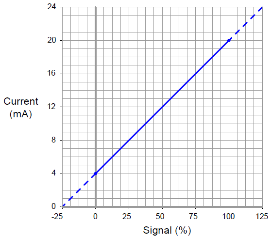
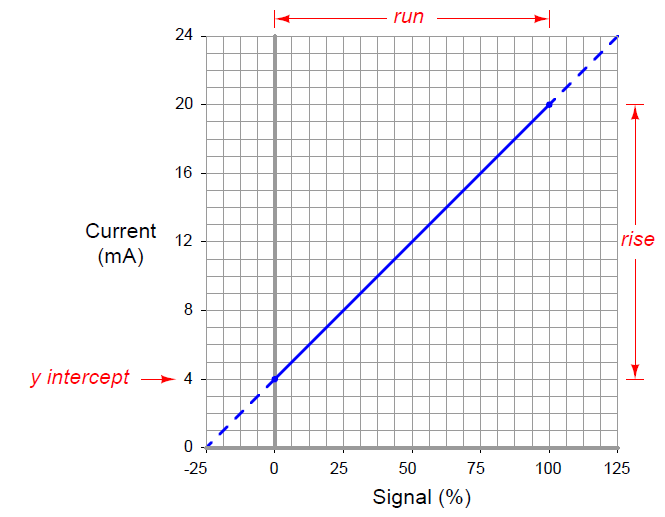
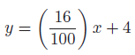
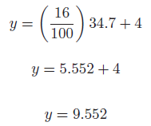
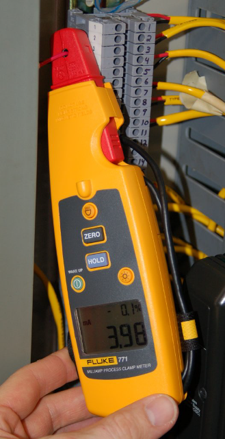
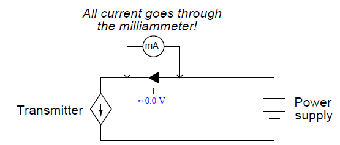

[<- До підрозділу](README.md)

# Аналогові електронні прилади

Це частоковий переклад частини 13 (Analog electronic instrumentation) з посібника  Lessons In Industrial Instrumentation by Tony R Kuphaldt (Author)

«Аналоговий» електронний сигнал — це напруга або струм, пропорційні значенню деякого фізичного вимірювання або керованої величини. Прилад часто класифікують як «аналоговий» просто через використання стандарту аналогового сигналу для передачі інформації, навіть якщо внутрішня конструкція та дизайн приладу можуть бути здебільшого цифровими за своєю природою. Це робиться для того, щоб відрізняти такі прилади від тих, які взагалі не використовують аналогові електронні сигнали (наприклад, бездротові прилади або прилади Fieldbus).

## 13.1 Аналоговий сигнал по струму від 4 до 20 мА

Найпопулярнішою формою передачі сигналу, яка використовується в сучасних промислових системах вимірювання (на момент написання цієї статті), є стандарт постійного струму від 4 до 20 міліампер. Це аналоговий стандарт сигналу, тобто електричний струм використовується для пропорційного представлення вимірювань або командних сигналів. Як правило, значення струму в 4 міліампер відповідає 0% шкали, значення струму в 20 міліампер відповідає 100% шкали, а будь-яке значення струму в діапазоні від 4 до 20 міліампер представляє відповідний відсоток від 0% до 100%. У наведеній нижче таблиці показано відповідні поточні та відсоткові значення для кожного кроку 25% від 0% до 100%. Кожен технік КВПіА, якому доручено підтримувати прилади 4-20 мА, зберігає ці значення в пам’яті, оскільки на них так часто посилаються:

- 4 mA - 0%
- 8 mA - 25%
- 12 mA - 50%
- 16 mA - 75%
- 20 mA - 100%

Наприклад, якщо ми повинні відкалібрувати датчик температури 4-20 мА для діапазону вимірювань від 50 до 250 градусів C, ми могли б співвіднести поточні та виміряні значення температури на графіку таким чином:

Це мало чим відрізняється від стандарту пневматичного сигналу 3-15 фунтів на квадратний дюйм (PSI), де змінний сигнал тиску повітря пропорційно представляє деяку змінну процесу. Обидва стандарти сигналу 3-15 PSI і 4-20 мА називаються живими нулями, оскільки їхні діапазони починаються з ненульового значення. Цей «живий» нуль забезпечує простий засіб розрізнення між допустимим значенням сигналу 0% і несправним сигналом (наприклад, протікання трубки або обірваний кабель)1.

Важлива концепція, яку слід зрозуміти для всіх аналогових приладів, полягає в тому, що прилади, які надсилають і приймають аналогові сигнали, повинні бути сумісними в діапазоні, щоб належним чином представляти бажану змінну. Для ілюстрації розглянемо систему вимірювання температури, що складається з термопари, датчика температури, резистора 250 Ом (для перетворення аналогового сигналу 4-20 мА в аналоговий сигнал 1-5 вольт) і спеціального функціонуючого вольтметра як індикатору температури:

Зверніть увагу на те, як вихідний діапазон кожного пристрою-відправника відповідає діапазону вхідного сигналу відповідного приймального пристрою. Якщо ми розглядаємо цю систему як шлях для потоку інформації від наконечника термопари до передавача до резистора і, нарешті, до вольтметра/індикатора, ми побачимо, що діапазон аналогового виходу кожного пристрою повинен відповідати діапазону аналогового входу наступного пристрою,  інакше реальне значення аналогового сигналу буде втрачено.

Ця відповідність не відбувається автоматично, а має бути встановлена техніком з приладів, який створює систему. У цьому випадку відповідальним за належне налаштування діапазону передавача температури, а також за те, щоб шкала відображення індикатора була належним чином позначена, відповідальним буде технік. І термопара, і резистор є нерегульованими пристроями, їхні вхідні/вихідні характеристики фіксуються фізичними законами.

Не всі промислові вимірювальні та контрольні сигнали є «нульовими», як стандарти 3-15 PSI і 4-20 мА. Від 0 до 10 вольт постійного струму є звичайним стандартом сигналу «мертвого нуля», хоча він набагато більш поширений у системах керування навколишнім середовищем (опалення та охолодження будівель), ніж у промислових системах керування. Одного разу я зіткнувся зі старою аналоговою системою керування, яка використовувала діапазон аналогового сигналу від -10 вольт до +10 вольт, що означало, що 0 вольт представляв 50% сигналу! Помилка шляху сигналу в такій системі могла ввести в оману, оскільки 50 % значення сигналу анітрохи не викликає підозр.

Сигнали постійного струму також використовуються в системах керування для керування позиціонуванням кінцевого елемента керування, такого як регулювальний клапан або двигун із змінною швидкістю (VSD). У цих випадках значення в міліамперах безпосередньо не відображає вимірювання процесу, а скоріше те, якою мірою кінцевий елемент керування впливає на процес. Як правило (але не завжди!), 4 міліампер сигналізують про закритий (закритий) регулювальний клапан або зупинку двигуна, тоді як 20 міліампер сигналізують про те, щоб клапан був повністю відкритий або двигун працює на повній швидкості. Кінцеві елементи керування часто оснащені регульованими діапазонами, щоб можна було забезпечити точну відповідність між аналоговим сигналом і бажаною дією керування.

Таким чином, більшість промислових систем керування використовують принаймні два різних сигнали 4-20 мА: один для представлення змінної процесу (PV), а інший для представлення командного сигналу кінцевому елементу керування («регульована змінна» або MV):

Співвідношення між цими двома сигналами повністю залежить від реакції регулятора. Немає жодних причин очікувати, що сигнали струму PV і MV будуть рівними один одному, за винятком кількох випадків, оскільки вони представляють абсолютно різні змінні. Насправді, якщо регулятор має зворотну дію, цілком нормально, що два сигнали струму будуть обернено пов’язані: у міру збільшення PV-сигналу, що надходить до регулятора зворотної дії, вихідний сигнал зменшуватиметься. Якщо оператор-людина переведе регулятор у «ручний» режим, вихідний сигнал взагалі не матиме автоматичного відношення до PV-сигналу, натомість повністю визначатиметься примхою оператора.

## 13.2 Зв’язок сигналів від 4 до 20 мА зі змінними приладу

Сигнал струму від 4 до 20 мА представляє певний сигнал на шкалі від 0 до 100 відсотків. Зазвичай ця шкала є лінійною, як показано на цьому графіку:

Будучи лінійною функцією, ми можемо використовувати стандартне лінійне рівняння нахилу та перетину, щоб зв’язати відсоток сигналу з поточни`ми значеннями:

y = mx + b

де,

y = вихід з інструмента 

x = вхід в інструмент 

m = нахил

b = точка перетину y (тобто живий нуль діапазону приладу)

Як тільки ми визначимо відповідні значення для m і b, ми можемо використовувати це лінійне рівняння, щоб передбачити будь-яке значення для `y` при заданому `x`, і навпаки. Це дуже корисно для прогнозування вихідного сигналу 4-20 мА передавача процесу або очікуваного положення штока регульованого клапана 4-20 мА або будь-якої іншої відповідності між сигналом 4-20 мА та деякою фізичною змінною.

Перш ніж ми зможемо використовувати це рівняння для будь-яких практичних цілей, ми повинні визначити значення нахилу (m) і перетину (b), які відповідають інструменту, до якого ми хочемо застосувати рівняння. Далі ми побачимо кілька прикладів того, як це зробити.

Для показаної лінійної функції ми можемо визначити значення нахилу (м), поділивши підйом лінії на її протяжність. Два набори зручних точок, які ми можемо використовувати для розрахунку підйому за пробіг, це 4 і 20 міліампер (для підйому), а також 0 і 100 відсотків (за пробіг):

Щоб обчислити точку перетину y (b), усе, що нам потрібно зробити, це знайти b у деякій відомій парі координат x і y. Знову ж таки, ми знаходимо зручні точки для цього завдання при 0 відсотках і 4 міліамперах:

Ми могли б так само легко вибрати 100 відсотків для x і 20 міліампер для y, оскільки це дало б той самий результат b = 4.

Тепер у нас є повна формула для перетворення значення у відсотках у значення в міліамперах:

Тепер ми можемо використати цю формулу, щоб обчислити, скільки міліампер відповідає будь-якому заданому відсотку сигналу. Наприклад, припустімо, що нам потрібно перетворити відсоток 34,7% у відповідний струм 4-20 мА. Ми б зробили це так:

Таким чином, 34,7% еквівалентно 9,552 міліамперам у діапазоні сигналу 4-20 мА.

Формула нахилу для лінійних функцій може бути застосована до будь-якого лінійного інструменту, як показано в наведених нижче прикладах.

### 13.2.1 Приклад розрахунку: вихід регулятора на клапан

Електронний регулятор контуру виводить сигнал 8,55 мА на регулюючий клапан прямого реагування (де 4 мА закрито, а 20 мА повністю відкрито). Наскільки відкритим повинен бути регулюючий клапан при цьому рівні сигналу середнього напруги?

Щоб визначити відсоток ходу штока (x) при 8,55 міліампер струму сигналу (y), ми можемо використати лінійне рівняння, розроблене раніше, щоб передбачити струм у міліамперах (y) на основі значення сигналу у відсотках (x):

Таким чином, ми повинні очікувати, що клапан буде відкритий на 28,4% при прикладеному сигналі середнього напруги 8,55 міліампер.

13.2.2. Example calculation: flow transmitter

13.2.3. Example calculation: temperature transmitter

13.2.4 Example calculation: pH transmitter

13.2.5 Example calculation: reverse-acting I/P transducer signal

### 13.2.6 Example calculation: PLC analog input scaling

Програмований логічний контролер (ПЛК) Allen-Bradley SLC500 використовує 16-розрядний аналого-цифровий перетворювач у своїй платі аналогового входу моделі 1746-NI4 для перетворення сигналів 4-20 мА в цифрові значення в діапазоні від 3277 (при 4 мА) до 16384 (при 20 мА). Однак ці необроблені числа з аналогової карти ПЛК повинні бути математично масштабовані всередині ПЛК, щоб представити реальні одиниці вимірювання, у цьому випадку від 0 до 700 GPM потоку. Сформулюйте рівняння масштабування для програмування в ПЛК так, щоб 4 мА регістрів струму реєструвалося як 0 GPM, а 20 мA регістрів струму як 700 GPM.

Нам уже надано необроблені числові значення зі схеми аналого-цифрового перетворювача (АЦП) аналогової карти для 4 мА та 20 мА: 3277 та 16384 відповідно. Ці значення визначають область визначення нашого лінійного графіка:

Розрахунок і заміна значення нахилу (м) у це рівняння, використовуючи повне перевищення лінійної функції:

Розв’язування значення перетину y за допомогою значень координат 0 GPM і 3277 ADC:

Таким чином, наше масштабне рівняння ПЛК для цього конкретного витратоміра виглядає наступним чином:

Цей тип обчислення масштабування настільки поширений у додатках ПЛК, що Allen-Bradley надав спеціальну інструкцію SCL («масштаб») саме для цієї мети. Замість «нахилу» (m) і «перетину» (b) інструкція пропонує людині-програмісту ввести значення «швидкість» і «зміщення» відповідно. Крім того, швидкість в інструкції SCL Аллена-Бредлі виражається як чисельник дробу, де знаменник фіксований на 10000, що дозволяє вказувати дробові (менше одиниці) значення нахилу за допомогою цілих чисел. Окрім цих деталей, концепція точно така ж.

Вираз нашого нахилу у вигляді дробу зі знаменником 10000 є простим завданням розв’язання чисельника за допомогою перехресного множення та ділення:

13.2.7 Graphical interpretation of signal ranges

13.2.8 Thinking in terms of per unit quantities

## 13.3 Контури вихідного струму регулятора

Найпростіша форма струмової петлі 4-20 мА — це тип, який використовується для представлення вихідного сигналу контролера процесу, який надсилає командний сигнал кінцевому елементу керування. Тут контролер подає як електричне живлення, так і сигнальну інформацію на кінцевий керуючий елемент, який діє як електричне навантаження. Для ілюстрації розглянемо приклад контролера, який посилає сигнал 4-20 мА на перетворювач сигналу I/P (струм-тиск), який потім пневматично приводить в дію регулюючий клапан:

Цей конкретний контролер має два цифрові дисплеї, один для змінної процесу (PV) і один для заданого значення (SP), з гістограмою для відображення вихідного значення (Out). Одна кнопка надає оператору можливість перемикатися між автоматичним і ручним режимами (A/M), тоді як дві інші кнопки надають засоби для зменшення або збільшення значення заданого значення (в автоматичному режимі) або вихідного значення (у ручному режимі).

Всередині контролера залежне джерело струму забезпечує сигнал постійного струму 4-20 мА на перетворювач I/P. Як і всі джерела струму, його призначення полягає в підтримці струму в ланцюзі «петлі» незалежно від опору ланцюга або будь-яких зовнішніх джерел напруги. На відміну від постійного джерела струму, «залежне» джерело струму (представлене формою ромба замість форми кола) змінює своє значення струму відповідно до зовнішнього стимулу. У цьому випадку або математична функція контролера (автоматичний режим), або довільна дія людини-оператора (ручний режим) повідомляє джерелу струму, скільки постійного струму воно повинно підтримувати в ланцюзі.

Наприклад, якщо оператор перемкнув контролер у ручний режим і встановив вихідне значення на 50%, належна величина постійного струму для цього відсотка сигналу становитиме 12 мА (рівно посередині між 4 мА та 20 мА). Якщо все працює належним чином, струм у ланцюзі «петлі» до перетворювача I/P має залишатися рівним 12 мА, незалежно від незначних змін опору дроту, опору котушки I/P або будь-чого іншого: джерело струму всередині контролера буде «боротися» настільки сильно, наскільки це необхідно, щоб підтримувати цю встановлену величину струму. Цей струм, проходячи через дротяну котушку механізму I/P перетворювача, створює магнітне поле всередині I/P для приведення в дію пневматичного механізму та створення вихідного сигналу тиску 9 PSI на регулюючий клапан (9 PSI становить рівно половину -від 3 PSI до 15 PSI у стандартному діапазоні сигналу 3-15 PSI). Це має перевести регулюючий клапан у напівходове положення.

Деталі внутрішнього джерела струму контролера не дуже важливі. Зазвичай він має форму схеми операційного підсилювача, керованого вихідною напругою ЦАП (цифро-аналогового перетворювача). ЦАП перетворює двійкове число (або з автоматичних обчислень контролера, або з ручних налаштувань людини-оператора) у малу напругу постійного струму, яка потім дає команду схемі операційного підсилювача регулювати вихідний струм на пропорційному значенні.

Сценарій майже такий самий, якщо ми замінимо I/P і регулюючий клапан на двигун із змінною швидкістю. З точки зору контролера, єдиною різницею, яку він бачить, є резистивне навантаження замість індуктивного. Вхідний опір схеми приводу двигуна перетворює сигнал 4-20 мА в аналоговий сигнал напруги (зазвичай 1-5 В, але не завжди). Потім цей сигнал напруги дає команду схемі приводу двигуна, вказуючи йому модулювати потужність, що надходить до електродвигуна, щоб рухати його на бажаній швидкості:

Тут двигун із змінною швидкістю – це потужна електронна схема, яка приймає трифазне живлення змінного струму та перетворює його на живлення постійного струму зі змінною напругою (рівень напруги, який контролюється сигналом 4–20 мА з виходу контролера). Інший тип «приводу» двигуна — це той, який приймає змінний струм і видає трифазний змінний струм із змінною напругою та частотою для живлення асинхронного двигуна змінного струму. Останній тип зазвичай називають приводом із змінною частотою або VFD, але він виглядає так само на виході контролера: фіксоване резистивне навантаження приймає вихідний сигнал 4-20 мА.

У деяких технологічних програмах кінцевий елемент керування є «зворотної дії», оскільки значення вихідного струму контролера в 4 мА повідомляє FCE перейти на «повну» (100%) потужність, а значення вихідного струму контролера в 20 мА дає команду FCE має вийти на мінімальну (0%) потужність. Це стосується датчика I/P, який керує пневматичним регулюючим клапаном «повітря-закрити», де пружина клапана працює, щоб відкрити дросельний механізм, а тиск повітря на діафрагму клапана працює, щоб закрити дросельний механізм. Практична причина розробки такої системи керування полягає в тому, що вимоги безпеки технологічного процесу вимагають, щоб клапан відкривався навстіж, якщо коли-небудь припиняється подача повітря в прилад або ланцюг вихідного сигналу 4-20 мА.

У таких програмах нам потрібно налаштувати контролер таким чином, щоб вихідний дисплей (цифрове зчитування та/або гістограма) мав зворотну індикацію, щоб уникнути плутанини будь-якого оператора, який використовує контролер. Оскільки 4 мА означає повністю відкритий регулюючий клапан, а 20 мА означає повністю закритий регулюючий клапан, контролер із зворотною індикацією відображатиме 0% вихідного сигналу, коли струмовий сигнал становить 20 мА, і 100% вихідного сигналу, коли струмовий сигнал становить 4 мА (тобто дисплей контролера є прямим відображенням положення штока регулювального клапана, а не самого поточного сигналу):

Слід зазначити, що пряма або зворотна індикація на передній панелі контролера не пов’язана з прямою або зворотною керуючою дією алгоритму контролера. Перший — це лише спосіб, у який вихідний сигнал графічно представляється людині-оператору, тоді як другий — це зв’язок між сигналом змінної процесу (PV) і вихідним сигналом контролера (MV), необхідним для керування негативним зворотним зв’язком. Задля аргументації, автоматична дія цього контролера все ще може бути прямою (тобто більший сигнал PV = більший вихідний сигнал), навіть якщо індикація вихідної гістограми є зворотною, щоб достовірно показати положення штока клапана людині-оператору.

13.4	4-wire (“self-powered”) transmitter current loops

DC electric current signals may also be used to communicate process measurement information from transmitters to controllers, indicators, recorders, alarms, and other input devices. Recall that the purpose of a transmitter is to sense some physical variable (e.g. pressure, temperature, flow) and then report that quantity in the form of a signal, in this case a 4 to 20 milliamp DC current proportional to that measured quantity. The simplest form of 4-20 mA measurement loop is one where the transmitter has two terminals for the 4-20 mA signal wires to connect, and two more terminals where a power source connects. These transmitters are called “4-wire” or “self-powered” units. The current signal from the transmitter connects to the process variable input terminals of the controller to complete the loop:

## 13.4 4-провідні («автономні») петлі струму передавача

Сигнали електричного струму постійного струму також можуть використовуватися для передачі вимірювальної інформації процесу від передавачів до контролерів, індикаторів, реєстраторів, сигналізацій та інших пристроїв введення. Пам’ятайте, що мета передавача полягає в тому, щоб сприймати певну фізичну змінну (наприклад, тиск, температуру, потік), а потім повідомляти про цю величину у вигляді сигналу, у цьому випадку струму постійного струму від 4 до 20 міліампер, пропорційного цій виміряній величині. Найпростіша форма вимірювальної петлі 4-20 мА — це така, у якій передавач має дві клеми для підключення сигнальних проводів 4-20 мА та ще дві клеми для підключення джерела живлення. Ці передавачі називаються «4-провідними» або «з автономним живленням». Поточний сигнал від передавача підключається до вхідних клем змінної процесу контролера для завершення циклу:

Деякі контролери процесу не обладнані для безпосереднього прийому міліамперних вхідних сигналів, а можуть лише інтерпретувати сигнали напруги постійного струму. У таких випадках ми повинні підключити прецизійний резистор до вхідних клем контролера, щоб перетворити сигнал передавача 4-20 мА в стандартизований аналоговий сигнал напруги, який контролер може зрозуміти. Діапазон сигналу напруги від 1 до 5 вольт є стандартним, хоча деякі моделі контролерів використовують інші діапазони напруги, а отже, вимагають інших точних значень резисторів. Якщо діапазон напруги становить 1-5 вольт, а діапазон струму становить 4-20 мА, значення точного резистора має бути 250 Ом відповідно до закону Ома.

Оскільки це цифровий контролер, вхідна напруга на клемах контролера інтерпретується схемою аналого-цифрового перетворювача (АЦП), яка перетворює виміряну напругу в цифрове число, яке може інтерпретувати мікропроцесор контролера.

У деяких установках живлення передавача подається через додаткові дроти в кабелі від джерела живлення, розташованого поблизу контролера:

Явним недоліком такої схеми є необхідність наявності в кабелі ще двох провідників. Більша кількість провідників означає, що кабель матиме більший діаметр і дорожчий для заданої довжини. Кабелі з більшою кількістю провідників вимагатимуть більшої електричної труби, щоб підійти до неї, і всі панелі польової проводки повинні містити більше клемних блоків для розподілу додаткових провідників. Однак, якщо в місці розташування передавача немає відповідного джерела електроенергії, для обслуговування 4-провідного передавача потрібен 4-жильний кабель.

## 13.5 2-провідні («живлення від контуру») петлі струму передавача

Можна передавати електроенергію та передавати аналогову інформацію по тих самих двох проводах, використовуючи від 4 до 20 міліампер постійного струму, якщо ми сконструюємо передавач для живлення від контуру. Передавач з живленням від контуру підключається до контролера процесу лише за допомогою двох проводів, тому передавачі з живленням від контуру відомі як 2-провідні передавачі:

Тут передавач насправді не є джерелом струму в тому сенсі, як 4-провідний передавач. Натомість схема 2-провідного передавача розроблена, щоб діяти як регулятор струму, обмежуючи струм у послідовній петлі до значення, що представляє вимірювання процесу, покладаючись на віддалене джерело живлення для стимулювання електричного струму. Будь ласка, зверніть увагу на напрямок стрілки на символі джерела струму, що залежить від передавача, і на те, як вона пов’язана з позначками полярності напруги. Для порівняння зверніться до ілюстрації схеми 4-провідного передавача. «Джерело» струму в цьому передавачі з живленням від контуру фактично поводиться як електричне навантаження, тоді як джерело струму в 4-провідному передавачі функціонувало як справжнє джерело електрики.

Передавач, що живиться від контуру, отримує свою робочу потужність від мінімальної напруги на клемах і струму, доступних на двох його клемах. Оскільки типова напруга джерела становить 24 вольта постійного струму, а максимальна напруга, що падає на 250-омний резистор контролера, становить 5 вольт постійного струму, на клемах передавача завжди має бути щонайменше 19 вольт. Враховуючи нижню межу діапазону сигналу 4-20 мА, передавач завжди повинен мати принаймні 4 мА струму для роботи. Таким чином, передавач завжди матиме певну мінімальну кількість електроенергії, доступної для роботи, водночас регулюючи струм, щоб сигналізувати вимірювання процесу на приймальний прилад.

Внутрішньо електронне обладнання 2-провідного передавача нагадує наступну (спрощену) схему. Зауважте, що все, що показано в межах заштрихованого прямокутника, представлено колом «2-провідний передавач» на попередній діаграмі:

Усі схеми вимірювання, масштабування та налаштування вихідного сигналу всередині передавача мають бути розроблені для роботи при струмі постійного струму менше ніж 4 мА та за помірної напруги на клемах. Щоб створити контурні струми, що перевищують 4 мА - як передавач повинен робити, щоб охопити весь діапазон сигналу від 4 до 20 міліампер - схема передавача використовує транзистор для шунтування (шунтування) додаткового струму від однієї клеми до іншої, якщо це необхідно для зробити загальний струм індикативним для вимірювання процесу. Наприклад, якщо внутрішній робочий струм передавача становить лише 3,8 мА, і він повинен регулювати струм петлі на значенні 16 мА, щоб представити умову 75% вимірювання процесу, шунтовий транзистор керуватиметься операційним підсилювачем, щоб обійти рівно 12,2 мА. струму (оскільки 3,8 мА + 12,2 мА = 16,0 мА).

Дуже низька кількість електроенергії, доступна на терміналах 2-провідного передавача, обмежує його функціональність. Якщо передавач потребує більше електроенергії, ніж може бути забезпечено за допомогою 4 міліампер і 19 вольт (мінімум кожен), єдиним рішенням є 4-провідний передавач, у якому провідники живлення відокремлені від провідників сигналу. Прикладом передавача процесу, який має бути 4-провідним, є хімічний аналізатор, такий як хроматограф, який потребує достатньої потужності для роботи електричного нагрівача, електромагнітних клапанів і бортового комп’ютера для обробки даних датчика. Просто немає способу керувати такою складною та енергоємною машиною, як хроматограф 2010 року на 4 міліамперах і 19 вольтах!

Ранні промислові передавачі на основі струму не могли працювати на таких низьких рівнях електроенергії, тому використовували інший стандарт сигналу струму: від 10 до 50 міліампер постійного струму. Джерела живлення для цих передавачів мали напругу понад 90 вольт, щоб забезпечити достатню потужність для передавача. З міркувань безпеки стандарт 10-50 мА став непридатним для деяких промислових установок, а сучасні мікроелектронні схеми зі зниженим енергоспоживанням зробили стандарт 4-20 мА практичним для майже всіх типів технологічних передавачів.

## 13.6 4-провідні «пасивні» проти «активних» вихідних передавачів

Деякі аналогові електронні передавачі з автономним живленням (4-провідні) призначені для роботи як електричні навантаження, а не як джерела електрики. Такі передавачі зазвичай називаються такими, що мають пасивні або sinking виходи 4-20 мА, на відміну від активних або вихідних 4-провідних передавачів, описаних раніше:

Спочатку це здається непотрібним заплутаним. Навіщо будувати передавач з автономним живленням, який потребує другого джерела живлення в ланцюзі для передачі сигналу 4-20 мА? Причиною існування цього типу передавача є величезна популярність 2-провідних передавачів 4-20 мА з живленням по контуру. Польові прилади з живленням від контуру стали настільки популярними в промисловості, що багато систем керування, ПЛК, індикатори та інші приймальні пристрої мають вбудований власний джерело живлення від контуру, так що ці системи можуть підключатися лише до навантажень і, отже, несумісні з джерелом струму 4 -дротові передавачі. Таким чином, «пасивні» або «поглинаючі» 4-провідні передавачі були розроблені для розміщення систем керування, призначених для роботи (лише) з приладами, що живляться від контуру.

Деякі 4-провідні передавачі можна конфігурувати як для пасивної, так і для активної роботи (тобто sinking versus sourcing) роботи, що вимагає від технічного спеціаліста, який встановлює, приділяти пильну увагу, щоб схема працювала належним чином.

## 13.7 Усунення несправностей петель струму

Фундаментальним принципом усунення несправностей системи приладів є те, що кожен прилад має принаймні один вхід і принаймні один вихід, і що вихід (виходи) повинні точно відповідати входу (входам). Якщо вихід приладу не відповідає належним чином його входу згідно з функцією конструкції приладу, з цим інструментом має бути щось не так.

Розглянемо входи та виходи кількох поширених приладів: передавачів, контролерів, індикаторів і регулюючих клапанів. Кожен із цих інструментів приймає (вводить) дані в певній формі та генерує (виводить) дані в певній формі. У будь-якому «циклі» інструменту вихід одного інструменту передається на вхід наступного, таким чином інформація переходить від одного інструменту до іншого. Перехоплюючи дані, що передаються між компонентами системи приладів, ми можемо знаходити та ізолювати несправності. Щоб правильно зрозуміти перехоплені дані, ми повинні розуміти вхідні та вихідні дані відповідних інструментів і основні функції цих інструментів.

На наступних ілюстраціях показано входи та виходи для приладів, які зазвичай зустрічаються в системах керування:

Щоб перевірити належну відповідність між входами та виходами приладів, ми повинні мати можливість використовувати відповідне тестове обладнання для перехоплення сигналів, що надходять і виходять з цих приладів. Для приладів на основі аналогового сигналу 4-20 мА це означає, що ми повинні мати можливість використовувати електролічильники, здатні точно вимірювати струм і напругу.

### 13.7.1 Використання стандартного міліамперметра для вимірювання струму петлі

Оскільки цікавий сигнал представлений електричним струмом у ланцюзі «петлі» приладового струму, очевидним інструментом для усунення несправностей є мультиметр, здатний точно вимірювати постійний струм у міліамперах. Однак, на жаль, використання міліамперметра має серйозний недолік: ланцюг повинен бути «розірваний» в певний момент, щоб meter лічильник послідовно до струму, і це означає, що струм впаде до 0 мА, поки meter не буде підключено (потім впаде до 0 мА, коли meter буде вилучено з ланцюга). Переривання струму означає переривання потоку інформації, що передається цим струмом, будь то вимірювання процесу або командний сигнал кінцевому елементу керування. Це матиме негативний вплив на систему контролю, якщо не вжити певних підготовчих заходів.

Перш ніж «розірвати цикл» для підключення лічильника, потрібно спочатку попередити весь відповідний персонал про те, що сигнал буде перервано принаймні двічі, щоразу знижуючись до значення -25%. Якщо сигнал, який потрібно перервати, надходить від передавача процесу до контролера, контролер слід перевести в ручний режим, щоб він не викликав збоїв у процесі (через переміщення кінцевого елемента керування у відповідь на раптову втрату фотоелектричного сигналу ). Крім того, слід тимчасово вимкнути сигналізацію процесу, щоб не викликати паніку. Якщо цей поточний сигнал також викликає сигнали тривоги про завершення процесу, їх слід тимчасово вимкнути, щоб нічого не вимикалося після переривання сигналу.

Якщо поточний сигнал, який потрібно перервати, є командним сигналом від контролера до кінцевого елемента керування, кінцевий елемент керування потрібно або вручну змінити, щоб підтримувати фіксоване налаштування, поки сигнал змінюється, або його потрібно повністю обійти за допомогою деякі інші пристрої. Якщо кінцевим регулюючим елементом є регулюючий клапан, це зазвичай має форму відкриття перепускного клапана та закриття принаймні одного запірного клапана:

Оскільки перепускний клапан з ручним керуванням тепер виконує роботу, яку раніше виконував автоматичний регулюючий клапан, людина-оператор має залишатися біля перепускного клапана, щоб ретельно дроселювати його та підтримувати контроль над процесом.

Запірні та перепускні клапани для великого клапана регулювання потоку газу можна побачити на наступній фотографії:

Беручи до уваги роботу, необхідну для безпечного переривання сигналу струму до регулюючого клапана під час активного процесу, ми бачимо, що, здавалося б, просте завдання послідовного з’єднання міліамперметра з сигналом струму 4-20 мА не таке просте, як може спочатку з'являтися. Кращі способи повинні існувати, чи не так?

### 13.7.2 Використання затискного міліамперметра для вимірювання струму петлі

Один кращий спосіб виміряти сигнал 4-20 мА, не перериваючи його, - зробити це магнітним способом за допомогою міліамперметра з затискачем. Сучасні датчики Холла достатньо чутливі та точні, щоб контролювати слабкі магнітні поля, створювані проходженням малих постійних струмів у проводах. Амперметри, що використовують датчики на ефекті Холла, абсолютно безпечні, оскільки вони просто затискаються навколо дроту, без необхідності «розривати» ланцюг. Прикладом такого вимірювача струму з кліщами є модель Fluke 771, показана на цій фотографії:

Зверніть увагу, що цей міліамперметр не лише реєструє струм петлі (3,98 мА, як показано на фотографії), але й перетворює значення міліампер у відсоток діапазону відповідно до стандарту сигналу від 4 до 20 мА. Одним із недоліків міліамперметрів із затискачами, про які слід пам’ятати, є сприйнятливість до похибок від сильних зовнішніх магнітних полів. Постійні магнітні поля (від постійних магнітів або електромагнітів, що живляться постійним струмом) можна компенсувати, виконавши налаштування «нуля» за допомогою приладу, який тримається в подібній орієнтації перед вимірюванням контурного струму через дріт.

### 13.7.3 Використання «тестових» діодів для вимірювання струму петлі

Інший спосіб вимірювання сигналу 4-20 мА без його переривання передбачає використання випрямного діода, спочатку встановленого в ланцюзі контуру під час його введення в експлуатацію. «Тестовий» діод може бути розміщений у будь-якому місці послідовно в контурі таким чином, щоб він був зміщеним прямо. Під час нормальної роботи діод впаде приблизно на 0,7 вольта, як це типово для будь-якого кремнієвого випрямного діода при прямому зміщенні. На наступній принциповій схемі показано такий діод, встановлений у 2-провідній схемі передавача:

Однак якщо хтось під’єднає міліамперметр паралельно цьому діоду, дуже низький вхідний опір амперметрів «замикає» діод і запобігає будь-якому значному падінню напруги на ньому. Без необхідного прямого падіння напруги діод фактично вимикається і проводить 0 мА, залишаючи весь струм петлі проходити через амперметр:

Коли міліамперметр від’єднано, з’являється необхідне падіння напруги 0,7 вольта, щоб увімкнути діод, і весь струм петлі знову проходить через діод. Жодного разу струм петлі не переривається, а це означає, що технік може проводити вимірювання струму таким чином і ніколи не хвилюватиметься про генерацію помилкових індикацій змінних процесу, спрацьовування сигналів тривоги або порушення процесу.

Такий діод можна встановити в найближчій розподільній коробці, між клемами на клемній колодці або навіть включити в сам передавач. Деякі передавачі процесу мають додаткову пару клем із позначкою «Тест» саме для цієї мети. Діод уже встановлено в передавач, і ці «тестові» клеми служать точками для підключення міліамперметра.

На наступній фотографії показано приклад цього на датчику перепаду тиску Rosemount моделі 3051:

Зверніть увагу на дві контрольні точки, позначені «ТЕСТ» нижче та праворуч від основних гвинтових клем, де приєднується шлейф. Підключення амперметра до цих двох контрольних точок дозволяє здійснювати пряме вимірювання сигналу струму 4-20 мА без необхідності від’єднувати будь-які дроти в ланцюзі.

Передавачі, оснащені аналоговими механізмами вимірювання для прямої візуальної індикації сигналу 4-20 мА, зазвичай підключають аналоговий міліамперметр паралельно саме такому діоду. Причина цього полягає в тому, щоб зберегти безперервність контуру на випадок, якщо котушка з тонким дротом всередині механізму міліамперметра випадково розірветься.

### 13.7.4 Використання шунтуючих резисторів для вимірювання струму петлі

Подібний метод для неінвазивного вимірювання струму в ланцюзі приладів 4-20 мА полягає у встановленні послідовного прецизійного резистора. Якщо значення опору точно відоме, фахівець просто повинен виміряти напругу на ньому вольтметром і використовувати закон Ома для обчислення струму:

В електроніці такий прецизійний резистор, який використовується для вимірювання струму, часто називають шунтуючим резистором. Значення шунтуючих резисторів зазвичай дуже малі, оскільки вони допомагають вимірювати струм без надмірного падіння напруги в ланцюзі. Рідко можна зустріти резистор на 250 Ом, який використовується виключно як діагностичний шунтуючий резистор, тому що додаткове падіння напруги (від 1 до 5 вольт, залежно від рівня поточного сигналу) може «знищити» прилади, що живляться від контуру, від напруги, необхідної для роботи. Шунтуючий резистор зі значеннями всього 1 Ом може бути встановлений у контурах струму 4-20 мА в стратегічних місцях, де технікам може знадобитися виміряти струм контуру. Звичайно, резистор на 1 Ом впаде на 4 мВ при контурному струмі 4 мА та на 20 мВ при 20 мА. Ці малі значення напруги вимагають високоточного вольтметра постійного струму для вимірювання поля!

### 13.7.5 Усунення несправностей контурів струму за допомогою вимірювання напруги

Якщо жоден компонент (діод або шунтовий резистор) не встановлено в ланцюзі, і якщо прецизійний міліамперметр на ефекті Холла (затискач) недоступний, технік все одно може виконати корисні вимірювання для усунення несправностей, використовуючи лише вольтметр постійного струму. Тут, однак, слід бути обережним, як інтерпретувати ці вимірювання напруги, оскільки вони можуть не відповідати прямо струму петлі, як це було у випадку вимірювань, проведених паралельно з прецизійним резистором.

Візьмемо, наприклад, цю петлю 4-20 мА, де контролер надсилає командний сигнал на датчик I/P:

Немає стандартизованого значення опору для котушок перетворювача I/P, тому величина напруги, що падає на клемах I/P для будь-якої заданої величини струму петлі, буде унікальною для кожної окремої моделі I/P. Перетворювач Fisher моделі 567 I/P, створений для сигналів 4-20 мА, має нормальний опір котушки 176 Ом. Таким чином, ми очікуємо падіння напруги приблизно на 0,7 вольта при 4 мА та падіння приблизно на 3,5 вольта при 20 мА на клемах I/P. Оскільки вихідні клеми контролера розташовані безпосередньо паралельно клемам I/P, ми очікуємо, що там також буде приблизно однакова напруга (трохи більша через опір дроту). Відсутність відомої точності опору котушки I/P ускладнює точно визначити, скільки струму в контурі для будь-якого вимірювання напруги, яке ми виконуємо за допомогою вольтметра. Однак, якщо ми знаємо приблизний опір котушки I/P, ми можемо принаймні отримати оцінку контурного струму, яка зазвичай є достатньою для діагностичних цілей.

Якщо опір котушки I/P абсолютно невідомий, вимірювання напруги стають марними для кількісного визначення струму петлі. Вимірювання напруги буде корисним лише для якісного визначення безперервності контуру (тобто чи є розрив проводки між контролером та I/P).

Іншим прикладом для розгляду є цей передавач із живленням від контуру 4–20 мА та схема контролера, де контролер забезпечує живлення постійного струму для контуру:

Дуже часто можна зустріти контролери з власними вбудованими джерелами живлення від контуру через популярність передавачів із живленням від контуру (2-дротових) 4–20 мА. Якщо ми знаємо, що для живлення передавача потрібне джерело постійного струму десь у ланцюзі, має сенс включити його в контролер, чи не так?

Єдине вимірювання напруги, яке прямо і точно відповідає струму петлі, це напруга безпосередньо на прецизійному резисторі 250 Ом. Струм у контурі 4 мА призведе до падіння напруги на 1 вольт, 12 мА впаде на 3 вольта, 20 мА впаде на 5 вольт тощо.

Вимірювання напруги на клемах передавача покаже нам різницю в напрузі між джерелом живлення 26 вольт і напругою, що впала на резисторі 250 Ом. Іншими словами, напруга на клемах передавача – це просто те, що залишилося від напруги джерела 26 вольт після віднімання падіння напруги на резисторі. Це робить напругу на клемі передавача обернено пропорційною струму петлі: передавач бачить приблизно 25 вольт при струмі петлі 4 мА (сигнал 0%) і приблизно 21 вольт при струмі петлі 20 мА (сигнал 100%).

Використання слова «приблизний» тут дуже навмисне, оскільки джерела живлення контуру зазвичай нерегульовані. Іншими словами, номінал «26 вольт» є приблизним і може бути змінений! Однією з переваг схеми передавача, що живиться від контуру, є те, що напруга джерела в основному не має значення, доки воно перевищує мінімальне значення, необхідне для забезпечення адекватної потужності передавача. Якщо з будь-якої причини напруга джерела буде дрейфувати, це не матиме жодного впливу на сигнал вимірювання, оскільки передавач побудований як регулятор струму, регулюючи струм у контурі до будь-якого значення, яке представляє вимірювання процесу, незалежно від незначних змін у контурі напруга джерела, опір дроту тощо. Ця відмова від змін напруги джерела живлення означає, що джерело живлення контуру не потрібно регулювати, і тому на практиці це відбувається рідко.

Це підводить нас до загальної проблеми в схемах передавачів із живленням від контуру 4–20 мА: підтримка достатньої робочої напруги на клемах передавача. Пам’ятайте, що передавач, що живиться від контуру, покладається на напругу, що падає на його клемах (у поєднанні зі струмом менше 4 мА), щоб живити свою внутрішню роботу. Це означає, що напруга на клемі не повинна опускатися нижче певного мінімального значення, інакше передавач не матиме достатньо електроенергії для продовження нормальної роботи. Це дає можливість «голодувати» передавач напруги, якщо напруга живлення петлі недостатня та/або якщо опір петлі є надмірним. Щоб проілюструвати, як це може бути проблемою, розглянемо наступний контур вимірювання 4-20 мА, де контролер подає лише 20 вольт постійного струму для живлення контуру, а індикатор включений у схему, щоб забезпечити операторів індикацією на місці вимірювання передавача:

Індикатор містить власний резистор на 250 Ом, який забезпечує сигнал 1-5 вольт для вимірювання механізмом вимірювача. Це означає, що загальний опір петлі тепер зріс з 250 Ом до 500 Ом (плюс будь-який опір дроту). При повному струмі (20 мА) цей загальний опір кола впаде (принаймні) на 10 вольт, залишаючи 10 вольт або менше на клемах передавача для живлення внутрішньої роботи передавача. Однак 10 вольт може бути недостатньо для успішної роботи передавача. Наприклад, датчик тиску Rosemount моделі 3051 потребує мінімум 10,5 вольт на клемах для роботи.

Однак передавач працюватиме нормально при нижчих рівнях струму петлі. Наприклад, коли струм петлі становить лише 4 мА, загальне падіння напруги на двох резисторах 250 Ом становитиме лише 2 вольта, залишаючи приблизно 18 вольт на клемах передавача: більш ніж достатньо для практично будь-якої моделі петлі 4-20 мА. для успішної роботи передавача. Таким чином, проблема недостатньої напруги живлення проявляється лише тоді, коли вимірювання процесу наближається до 100% діапазону. Цю проблему може бути важко діагностувати, оскільки вона з’являється лише за певних умов процесу, а не за інших. Технік, який шукає лише несправності проводки (слабкі з’єднання, корозійні клеми тощо), ніколи не знайде проблеми.

Коли передавач, що живиться від контуру, відчуває брак напруги, його поведінка стає нестабільною. Особливо це стосується «розумних» передавачів із вбудованою схемою мікропроцесора. Якщо напруга на клемі падає нижче необхідного мінімуму, схема мікропроцесора вимикається. Коли ланцюг вимикається, споживання струму відповідно зменшується. Це призводить до того, що напруга на клемі знову підвищується, після чого мікропроцесор отримує достатню напругу для запуску. Коли мікропроцесор «завантажується» знову, він збільшує струм петлі, щоб відобразити майже 100% вимірювання процесу. Це призводить до падіння напруги на клемі, що згодом викликає повторне відключення мікропроцесора. Результатом є повільне циклічне вмикання/вимикання струму передавача, що змушує контролер процесу вважати, що змінна процесу шалено зростає. Однак проблема зникає, як тільки вимірювання процесу зменшується настільки, що передавач отримує достатню напругу на клемах для нормальної роботи.

### 13.7.6 Використання калібраторів петлі

Електронні вимірювальні прилади спеціального призначення, які називаються калібраторами петлі, існують спеціально для пошуку несправностей у ланцюзі струмової петлі 4-20 мА. Ці універсальні прилади, як правило, здатні не тільки вимірювати струм, але й подавати струм на знеструмлені пристрої в петлі, а також імітувати передавачі 4-20 мА з живленням від петлі.

Дуже популярним калібратором петлі є модель Altek 334A, ручний пристрій із живленням від батареї з поворотною ручкою для регулювання струму та перемикачами для налаштування режиму. На наступній ілюстрації показано, як цей калібратор буде використовуватися для вимірювання струму в функціонуючому контурі вхідного сигналу:

...

### 13.7.7 Рівні сигналу NAMUR

Одна з суттєвих переваг стандарту аналогового сигналу «живого нуля», такого як 4-20 мА, полягає в тому, що обрив дроту (відкрите замикання) можна негайно виявити за відсутності струму в ланцюзі. Якби шкала сигналу починалася з нуля (наприклад, 0-20 мА), не було б способу електрично відрізнити обірваний дріт від законного значення сигналу 0%. Іншими словами, «жива» точка LRV сигналу 4-20 мА дає нам спосіб вказати певний тип несправності ланцюга на додаток до вказівки аналогового вимірювання під час нормальної роботи.

Стандарт сигналу NAMUR просуває цю філософію на крок далі, визначаючи конкретне діагностичне значення для значень струму, що знаходяться за межами діапазону 4-20 мА:

| **Signal level**         | **Fault condition**                      |
| ------------------------ | ---------------------------------------- |
| Output < 3.6 mA          | Sensing transducer failed low            |
| 3.6 mA < Output < 3.8 mA | Sensing transducer failed (detected) low |
| 3.8 mA < Output < 4.0 mA | Measurement under-range                  |
| 21.0 > Output > 20.5 mA  | Measurement over-range                   |
| Output > 21.0 mA         | Sensing transducer failed high           |

Передавачі, сумісні з NAMUR, сконструйовані для обмеження вихідних сигналів від 3,8 мА до менше ніж 21 мА за умови належного функціонування. Сигнали, що знаходяться за межами цього діапазону, вказують на те, що сталася якась несправність передавача або проводки схеми.

Системи керування, сумісні з NAMUR, розпізнають ці помилкові значення в міліамперах як стани несправності та можуть бути запрограмовані на виконання певних дій після отримання цих значень сигналу. Такі дії включають примусовий перехід контролерів у ручний режим, ініціювання процедур автоматичного вимкнення або вжиття будь-якої іншої форми безпечної дії, яка відповідає відомостям про несправний передавач процесу.

## 13.8 Огляд основних принципів

Тут показано частковий перелік принципів, застосованих до теми цього розділу, наданий з метою розширення уявлення читача про концепції цього розділу та їхні загальні взаємозв’язки з концепціями в інших частинах книги. Ваші здібності як розв’язувача проблем і як людини, яка навчається протягом усього життя, значно покращаться, якщо ви освоїте застосування цих принципів до широкого розмаїття тем, чим різноманітніше, тим краще.

- Лінійні рівняння: будь-яка функція, представлена прямою лінією на графіку, може бути представлена символічно за допомогою формули кута нахилу y = mx + b. Має відношення до масштабування введення/виведення приладу.

- Електричні джерела проти навантажень: джерела електричної енергії видають вихідний струм (звичайний потік) на своїх позитивних клемах, а вхідний струм — на негативних клемах (наприклад, батареї та генератори). Електричні навантаження діють навпаки (наприклад, резистори). Доречно для визначення падінь напруги та напрямків струму в аналогових ланцюгах контуру струму, а також для узгодження полярності між польовими приладами та контролерами.

- Напруга проти джерел струму: джерела напруги намагаються підтримувати постійну напругу за допомогою змінного струму, а джерела струму намагаються підтримувати постійний струм за допомогою змінної напруги. Відповідно до роботи сигнальних ланцюгів 4-20 мА: петлевий передавач діє як джерело струму (або в деяких випадках як регулятор струму), знижуючи стільки чи менше напруги, скільки потрібно для підтримки бажаної величини струму в ланцюзі.

- Схеми операційного підсилювача з самобалансуванням: усі схеми операційного підсилювача з самобалансуванням працюють за принципом негативного зворотного зв’язку, підтримуючи майже нульову диференціальну вхідну напругу на операційному підсилювачі. Створення «спрощеного припущення», що диференціальна вхідна напруга операційного підсилювача дорівнює рівному нулю, допомагає в аналізі схеми, як і припущення, що вхідні клеми споживають незначний струм.

