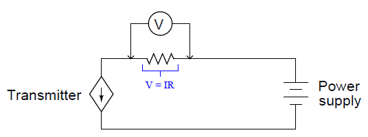

[<- До підрозділу](README.md)

# Аналогові електричні сигнали: теоретична частина

Цей матеріал розроблено на основі матеріалу частини 8.3 (Electrical signal and control wiring) з посібника  Lessons In Industrial Instrumentation by Tony R Kuphaldt (Author)

## Аналоговий сигнал по струму від 4 до 20 мА

Аналоговий електричний сигнал — це напруга або струм, пропорційні значенню деякого фізичного вимірювання або керованої величини. Прилад часто класифікують як «аналоговий» через використання стандарту аналогового сигналу для передачі інформації, навіть якщо внутрішня конструкція та дизайн приладу можуть бути здебільшого цифровими за своєю природою. Це робиться для того, щоб відрізняти такі прилади від тих, які взагалі не використовують аналогові електронні сигнали (наприклад, бездротові прилади або прилади Fieldbus).

Найпопулярнішимм формами передачі сигналу, які використовуються в сучасних промислових системах вимірювання є стандарти уніфікованого сигналу:

- 0-10 В
- 0-20 мА
- 4-20 мА

Серед них найкращим вважається аналоговий стандарт сигналу, де використовується електричний струм від 4 до 20 мА (міліампер). Струмовий сигнал має перевагу над напругою із-за меншої чутливості до наводок та потенційно більшої відстані передачі, бо падіння напруги по довжині проводу не має значення.  4-20 мА має перевагу над 0-20 мА в наявності "живого" нуля.

У будь якому випадку значення сигналу використовується для пропорційного представлення вимірювань або сигналів керування. Як правило, значення струму в 4 міліампер відповідає 0% шкали, значення струму в 20 міліампер відповідає 100% шкали, а будь-яке значення струму в діапазоні від 4 до 20 міліампер представляє відповідний відсоток від 0% до 100%. У наведеному нижче списку показано відповідні поточні та відсоткові значення для кожного кроку 25% від 0% до 100%. Маючи такий простий список технік КВПіА може досить швидко зробити перевірку:

- 4 мA - 0%
- 8 мA - 25%
- 12 мA - 50%
- 16 мA - 75%
- 20 мA - 100%

Стандартний сигнал 4-20 мА називають також сионалом з живим нулем, оскільки їхні діапазони починаються з ненульового значення. Цей "живий" нуль забезпечує простий засіб розрізнення між допустимим значенням сигналу 0% і несправним сигналом (наприклад, обірваний кабель або дрот).

Не всі промислові вимірювальні та контрольні сигнали є з "живим" нулем. Наприклад сигнал від 0 до 10 вольт постійного струму є звичайним стандартом сигналу "мертвого" нуля, хоча він набагато більш поширений у системах керування мікрокліматом (опалення та охолодження будівель). 

Сигнали постійного струму також використовуються в системах керування для керування позиціонуванням кінцевого елемента керування, такого як регулювальний клапан або двигун із змінною швидкістю через ПЧ. У цих випадках значення в міліамперах безпосередньо не відображає вимірювання процесу, а скоріше те, якою мірою кінцевий елемент керування впливає на процес. Як правило (але не завжди), 4 міліампер сигналізують про закритий (закритий) регулювальний клапан або зупинку двигуна, тоді як 20 міліампер сигналізують про те, щоб клапан був повністю відкритий або двигун працює на повній швидкості. Кінцеві елементи керування часто оснащені регульованими діапазонами, щоб можна було забезпечити точну відповідність між аналоговим сигналом і бажаною дією керування. Таким чином, більшість промислових систем керування використовують принаймні два різних сигнали 4-20 мА: один для представлення змінної процесу (PV), а інший для представлення командного сигналу кінцевому елементу керування («регульована змінна» або MV). 

Сигнал струму від 4 до 20 мА представляє певний сигнал на шкалі від 0 до 100 відсотків. Зазвичай ця шкала є лінійною, як показано на рис.1.3.28:


рис.1.3.28. Залежність струму сигналу від значення вимірювальної величини у %

Будучи лінійною функцією, ми можемо використовувати стандартне лінійне рівняння нахилу та перетину, щоб зв’язати відсоток сигналу з поточними значеннями:

```
y = mx + b
```

де,

`y` = вихід з приладу

`x` = вхід в прилад 

`m` = нахил

`b` = точка перетину y (тобто живий нуль діапазону приладу)

Як тільки ми визначимо відповідні значення для `m` і `b`, ми можемо використовувати це лінійне рівняння, щоб передбачити будь-яке значення для `y` при заданому `x`, і навпаки. Це дуже корисно для прогнозування вихідного сигналу 4-20 мА передавача процесу або очікуваного положення штока регульованого клапана 4-20 мА або будь-якої іншої відповідності між сигналом 4-20 мА та деякою фізичною змінною.

Перш ніж ми зможемо використовувати це рівняння для будь-яких практичних цілей, ми повинні визначити значення нахилу (m) і перетину (b), які відповідають інструменту, до якого ми хочемо застосувати рівняння. Далі ми побачимо кілька прикладів того, як це зробити.

Для показаної лінійної функції ми можемо визначити значення нахилу (м), поділивши підйом лінії (rise)на її протяжність (run). Два набори зручних точок, які ми можемо використовувати для розрахунку підйому за пробіг, це 4 і 20 міліампер (для підйому), а також 0 і 100 відсотків (за пробіг):


рис.1.3.29. До розрахунку коефіцієнтів


Щоб обчислити точку перетину y (b), усе, що нам потрібно зробити, це знайти b у деякій відомій парі координат x і y. Знову ж таки, ми знаходимо зручні точки для цього завдання при 0 відсотках і 4 міліамперах:


Тепер у нас є повна формула для перетворення значення у відсотках у значення в міліамперах:


Тепер ми можемо використати цю формулу, щоб обчислити, скільки міліампер відповідає будь-якому заданому відсотку сигналу. Наприклад, припустімо, що нам потрібно перетворити відсоток 34,7% у відповідний струм 4-20 мА. Ми б зробили це так:


Таким чином, 34,7% еквівалентно 9,552 міліамперам у діапазоні сигналу 4-20 мА.

Формула нахилу для лінійних функцій може бути застосована до будь-якого лінійного інструменту, як показано в наведених нижче прикладах.

## Контури виходу регулятора

Найпростіша форма струмової петлі 4-20 мА — це тип, який використовується для представлення вихідного сигналу регулятору процесу, який надсилає командний сигнал кінцевому елементу керування. Тут регулятор (controller) подає як електричне живлення, так і сигнальну інформацію на кінцевий керуючий елемент, який діє як електричне навантаження. Для ілюстрації розглянемо приклад регулятора, який посилає сигнал 4-20 мА на перетворювач сигналу I/P (електро-пневмоперетворювач), який потім пневматично приводить в дію регулюючий клапан:


рис.1.3.30. Контур вихідного струму регулятора

Цей конкретний регулятор має два цифрові дисплеї, один для змінної процесу (PV) і один для заданого значення (SP), з гістограмою для відображення вихідного значення (Out). Одна кнопка надає оператору можливість перемикатися між автоматичним і ручним режимами (A/M), тоді як дві інші кнопки надають засоби для зменшення або збільшення значення заданого значення (в автоматичному режимі) або вихідного значення (у ручному режимі).

Всередині регулятора залежне джерело струму забезпечує сигнал постійного струму 4-20 мА на перетворювач I/P. Як і всі джерела струму, його призначення полягає в підтримці струму в колі «петлі» незалежно від опору ланцюга або будь-яких зовнішніх джерел напруги. На відміну від постійного джерела струму, «залежне» джерело струму (представлене формою ромба замість форми кола) змінює своє значення струму відповідно до зовнішнього стимулу. У цьому випадку або математична функція регулятора (автоматичний режим), або довільна дія людини-оператора (ручний режим) повідомляє джерелу струму, скільки постійного струму воно повинно підтримувати в колі.

Наприклад, якщо оператор перемкнув регулятор у ручний режим і встановив вихідне значення на 50%, належна величина постійного струму для цього відсотка сигналу становитиме 12 мА (рівно посередині між 4 мА та 20 мА). Якщо все працює належним чином, струм у колі «петлі» до перетворювача I/P має залишатися рівним 12 мА, незалежно від незначних змін опору дроту, опору котушки I/P або будь-чого іншого: джерело струму всередині регулятора буде «боротися» настільки сильно, наскільки це необхідно, щоб підтримувати цю встановлену величину струму. Цей струм, проходячи через дротяну котушку механізму I/P перетворювача, створює магнітне поле всередині I/P для приведення в дію пневматичного механізму та створення вихідного сигналу тиску 9 PSI на регулюючий клапан (9 PSI становить рівно половину - від 3 PSI до 15 PSI у стандартному діапазоні сигналу 3-15 PSI). Це має перевести регулюючий клапан у положення 50%.

Деталі внутрішнього джерела струму регулятору не дуже важливі. Зазвичай він має форму схеми операційного підсилювача, керованого вихідною напругою ЦАП (цифро-аналогового перетворювача). ЦАП перетворює двійкове число (або з автоматичних обчислень контролера, або з ручних налаштувань людини-оператора) у малу напругу постійного струму, яка потім дає команду схемі операційного підсилювача регулювати вихідний струм на пропорційному значенні.

## 4-провідні схеми підключення передавача

Сигнали електричного струму постійного струму також можуть використовуватися для передачі вимірювальної інформації процесу від передавачів до регуляторів, індикаторів, реєстраторів, сигналізацій та інших пристроїв введення. Пам’ятайте, що мета передавача полягає в тому, щоб сприймати певну фізичну змінну (наприклад, тиск, температуру, витрату), а потім повідомляти про цю величину у вигляді сигналу, у цьому випадку струму постійного струму від 4 до 20 міліампер, пропорційного цій виміряній величині. Найпростіша форма вимірювальної петлі 4-20 мА — це така, у якій передавач має дві клеми для підключення сигнальних проводів 4-20 мА та ще дві клеми для підключення джерела живлення. Ці передавачі називаються «4-провідними» або «з незалежними живленням». Поточний сигнал від передавача підключається до вхідних клем змінної процесу регулятору для завершення петлі (рис.1.3.31).


рис.1.3.31. 4-х провідна схема підключення

Деякі регулятори процесу не обладнані для безпосереднього прийому міліамперних вхідних сигналів, а можуть лише інтерпретувати сигнали напруги постійного струму. У таких випадках необхідно підключити прецизійний резистор до вхідних клем регулятору, щоб перетворити сигнал передавача 4-20 мА в стандартизований аналоговий сигнал напруги, який регулятяор може зрозуміти. Діапазон сигналу напруги від 1 до 5 вольт є стандартним, хоча деякі моделі регуляторів використовують інші діапазони напруги, а отже, вимагають інших точних значень резисторів. Якщо діапазон напруги становить 1-5 вольт, а діапазон струму становить 4-20 мА, значення точного резистора має бути 250 Ом відповідно до закону Ома.

Оскільки це цифровий контролер, вхідна напруга на клемах контролера інтерпретується схемою аналого-цифрового перетворювача (АЦП), яка перетворює виміряну напругу в цифрове число, яке може інтерпретувати мікропроцесор контролера. У деяких установках живлення передавача подається через додаткові дроти в кабелі від джерела живлення, розташованого поблизу регулятору. 

## 2-провідні схеми підключення передавача з живленням в петлі

Можна передавати електроенергію та передавати аналогову інформацію по тих самих двох проводах, використовуючи від 4 до 20 міліампер постійного струму, якщо ми сконструюємо передавач для живлення від петлі. Передавач з живленням від петлі підключається до регулятора процесу лише за допомогою двох проводів, тому передавачі з живленням від петлі відомі як 2-провідні передавачі (рис.1.3.32)


рис.1.3.32. 2-х провідне підключення передавача

Тут передавач насправді не є джерелом струму в тому сенсі, як 4-провідний передавач. Натомість схема 2-провідного передавача розроблена, щоб діяти як регулятор струму, обмежуючи струм у послідовній петлі до значення, що представляє вимірювання процесу, покладаючись на віддалене джерело живлення для стимулювання електричного струму. Зверніть увагу на напрямок стрілки на символі джерела струму, що залежить від передавача, і на те, як вона пов’язана з позначками полярності напруги. Для порівняння зверніться до ілюстрації схеми 4-провідного передавача. «Джерело» струму в цьому передавачі з живленням від контуру фактично поводиться як електричне навантаження, тоді як джерело струму в 4-провідному передавачі функціонувало як справжнє джерело електрики.

Передавач, що живиться від контуру, отримує свою робочу потужність від мінімальної напруги на клемах і струму, доступних на двох його клемах. Оскільки типова напруга джерела становить 24 вольта постійного струму, а максимальна напруга, що падає на 250-омний резистор регулятору, становить 5 вольт постійного струму, на клемах передавача завжди має бути щонайменше 19 вольт. Враховуючи нижню межу діапазону сигналу 4-20 мА, передавач завжди повинен мати принаймні 4 мА струму для роботи. Таким чином, передавач завжди матиме певну мінімальну кількість електроенергії, доступної для роботи, водночас регулюючи струм, щоб сигналізувати вимірювання процесу на приймальний прилад.

Усі схеми вимірювання, масштабування та налаштування вихідного сигналу всередині передавача мають бути розроблені для роботи при струмі постійного струму менше ніж 4 мА та за помірної напруги на клемах. Щоб створити контурні струми, що перевищують 4 мА - як передавач повинен робити, щоб охопити весь діапазон сигналу від 4 до 20 міліампер - схема передавача використовує транзистор для шунтування (шунтування) додаткового струму від однієї клеми до іншої, якщо це необхідно для зробити загальний струм індикативним для вимірювання процесу. Наприклад, якщо внутрішній робочий струм передавача становить лише 3,8 мА, і він повинен регулювати струм петлі на значенні 16 мА, щоб представити умову 75% вимірювання процесу, шунтовий транзистор керуватиметься операційним підсилювачем, щоб обійти рівно 12,2 мА. струму (оскільки 3,8 мА + 12,2 мА = 16,0 мА).

Дуже низька кількість електроенергії, доступна на терміналах 2-провідного передавача, обмежує його функціональність. Якщо передавач потребує більше електроенергії, ніж може бути забезпечено за допомогою 4 міліампер і 19 вольт (мінімум кожен), єдиним рішенням є 4-провідний передавач, у якому провідники живлення відокремлені від провідників сигналу. Прикладом передавача процесу, який має бути 4-провідним, є хімічний аналізатор, такий як хроматограф, який потребує достатньої потужності для роботи електричного нагрівача, електромагнітних клапанів і бортового комп’ютера для обробки даних датчика. Просто немає способу керувати такою складною та енергоємною машиною, як хроматограф 2010 року на 4 міліамперах і 19 вольтах!

## 4-провідні схеми з пасивними виходами предеавачів

Деякі аналогові електронні передавачі з автономним живленням (4-провідні) призначені для роботи як електричні навантаження, а не як джерела електрики. Такі передавачі зазвичай називаються такими, що мають пасивні або sinking виходи 4-20 мА, на відміну від активних або вихідних 4-провідних передавачів, описаних раніше (рис.1.3.33).


рис.1.3.33. 4-х провідне підключення передавача з пасивним виходом

Причиною існування цього типу передавача є величезна популярність 2-провідних передавачів 4-20 мА з живленням по контуру. Польові прилади з живленням від контуру стали настільки популярними в промисловості, що багато систем керування, ПЛК, індикатори та інші приймальні пристрої мають вбудований власний джерело живлення від контуру, так що ці системи можуть підключатися лише до навантажень і, отже, несумісні з джерелом струму 4 -дротові передавачі. Таким чином, «пасивні» або «поглинаючі» 4-провідні передавачі були розроблені для розміщення систем керування, призначених для роботи (лише) з приладами, що живляться від контуру.

Деякі 4-провідні передавачі можна конфігурувати як для пасивної, так і для активної роботи (тобто sinking versus sourcing) роботи, що вимагає від технічного спеціаліста, який встановлює, приділяти пильну увагу, щоб схема працювала належним чином.

## Усунення несправностей петель струму

Фундаментальним принципом усунення несправностей системи приладів є те, що кожен прилад має принаймні один вхід і принаймні один вихід, і що вихід (виходи) повинні точно відповідати входу (входам). Якщо вихід приладу не відповідає належним чином його входу згідно з функцією конструкції приладу, з цим інструментом має бути щось не так.

Розглянемо входи та виходи кількох поширених приладів: передавачів, контролерів, індикаторів і регулюючих клапанів. Кожен із цих приладів приймає (вводить) дані в певній формі та генерує (виводить) дані в певній формі. У будь-якій «петлі» приладу вихід одного приладу передається на вхід наступного, таким чином інформація переходить від одного приалду до іншого. Перехоплюючи дані, що передаються між компонентами системи приладів, ми можемо знаходити та ізолювати несправності. Щоб правильно зрозуміти перехоплені дані, ми повинні розуміти вхідні та вихідні дані відповідних інструментів і основні функції цих інструментів.

Щоб перевірити належну відповідність між входами та виходами приладів, ми повинні мати можливість використовувати відповідне тестове обладнання для перехоплення сигналів, що надходять і виходять з цих приладів. Для приладів на основі аналогового сигналу 4-20 мА це означає, що ми повинні мати можливість використовувати електролічильники, здатні точно вимірювати струм і напругу.

### Використання стандартного міліамперметра для вимірювання струму петлі

Оскільки сигнал що потрібно перевірити представлений електричним струмом у ланцюзі «петлі» приладового струму, очевидним інструментом для усунення несправностей є мультиметр, здатний точно вимірювати постійний струм у міліамперах. Однак, на жаль, використання міліамперметра має серйозний недолік: петля повинна бути «розірвана» в певний момент, щоб мультиметр був послідовно в петлі струму, і це означає, що струм впаде до 0 мА, поки мультиметр не буде підключено (потім впаде до 0 мА, коли мультиметр буде вилучено з петлі). Переривання струму означає переривання потоку інформації, що передається цим струмом, будь то вимірювання процесу або командний сигнал кінцевому елементу керування. Це матиме негативний вплив на систему контролю, якщо не вжити певних підготовчих заходів. Перш ніж «розірвати петлю» для підключення мультиметра, потрібно спочатку попередити весь відповідний персонал про те, що сигнал буде перервано принаймні двічі, щоразу знижуючись до значення -25%. Якщо сигнал, який потрібно перервати, надходить від передавача процесу до ргеулятору, отсанній слід перевести в ручний режим, щоб він не викликав збоїв у процесі (через переміщення кінцевого елемента керування у відповідь на раптову втрату сигналу ). Крім того, слід тимчасово вимкнути сигналізацію процесу, щоб не викликати паніку. Якщо цей поточний сигнал також викликає сигнали тривоги про завершення процесу, їх слід тимчасово вимкнути, щоб нічого не вимикалося після переривання сигналу.

Якщо поточний сигнал, який потрібно перервати, є сигналом керування від регулятора до кінцевого елемента керування, кінцевий елемент керування потрібно або вручну змінити, щоб підтримувати фіксоване налаштування, поки сигнал змінюється, або його потрібно повністю обійти за допомогою деякі інші пристрої. Якщо кінцевим регулюючим елементом є регулюючий клапан, це зазвичай має форму відкриття перепускного клапана та закриття принаймні одного запірного клапана.  

Беручи до уваги роботу, необхідну для безпечного переривання сигналу струму до регулюючого клапана під час активного процесу, варто розглянути інші можливі підходи, які розглянуті нижче.

### Використання затискного міліамперметра для вимірювання струму петлі

Одним з способів виміряти сигнал 4-20 мА, не перериваючи його, - зробити це магнітним способом за допомогою міліамперметра з затискачем. Сучасні датчики Холла достатньо чутливі та точні, щоб контролювати слабкі магнітні поля, створювані проходженням малих постійних струмів у проводах. Амперметри, що використовують датчики на ефекті Холла, абсолютно безпечні, оскільки вони просто затискаються навколо дроту, без необхідності «розривати» ланцюг. Приклад такого вимірювача струму з кліщами є показаний на рис.1.3.34.


рис.1.3.34. Приклад використання затискного міліамперметра для вимірювання струму петлі

Зверніть увагу, що цей міліамперметр не лише реєструє струм петлі (3,98 мА, як показано на фотографії), але й перетворює значення міліампер у відсоток діапазону відповідно до стандарту сигналу від 4 до 20 мА. Одним із недоліків міліамперметрів із затискачами, про які слід пам’ятати, є сприйнятливість до похибок від сильних зовнішніх магнітних полів. Постійні магнітні поля (від постійних магнітів або електромагнітів, що живляться постійним струмом) можна компенсувати, виконавши налаштування «нуля» за допомогою приладу, який тримається в подібній орієнтації перед вимірюванням контурного струму через дріт.

### Використання тестових діодів для вимірювання струму петлі

Інший спосіб вимірювання сигналу 4-20 мА без його переривання передбачає використання випрямного діода, спочатку встановленого в ланцюзі контуру під час його введення в експлуатацію. «Тестовий» діод може бути розміщений у будь-якому місці послідовно в контурі таким чином, щоб він був зміщеним прямо. Під час нормальної роботи напруга на діоді впаде приблизно на 0,7 вольта, як це типово для будь-якого кремнієвого випрямного діода при прямому зміщенні. На наступній принциповій схемі показано такий діод, встановлений у 2-провідній схемі передавача.


рис.1.3.35. Приклад вставлення тестового діоду

Однак якщо хтось під’єднає міліамперметр паралельно цьому діоду, дуже низький вхідний опір амперметрів шунтує діод і запобігає будь-якому значному падінню напруги на ньому. Без необхідного прямого падіння напруги діод фактично вимикається і проводить 0 мА, залишаючи весь струм петлі проходити через амперметр (рис.1.1.36)


рис.1.3.36. Приклад вимірювання на тестовому діоді

Коли міліамперметр від’єднано, з’являється необхідне падіння напруги 0,7 вольта, щоб увімкнути діод, і весь струм петлі знову проходить через діод. Жодного разу струм петлі не переривається, а це означає, що технік може проводити вимірювання струму таким чином і ніколи не хвилюватиметься про генерацію помилкових індикацій змінних процесу, спрацьовування сигналів тривоги або порушення процесу.

Такий діод можна встановити в найближчій розподільній коробці, між клемами на клемній колодці або навіть включити в сам передавач. Деякі передавачі процесу мають додаткову пару клем із позначкою «Тест» саме для цієї мети. Діод уже встановлено в передавач, і ці «тестові» клеми служать точками для підключення міліамперметра.

Передавачі, оснащені аналоговими механізмами вимірювання для прямої візуальної індикації сигналу 4-20 мА, зазвичай підключають аналоговий міліамперметр паралельно саме такому діоду. Причина цього полягає в тому, щоб зберегти безперервність контуру на випадок, якщо котушка з тонким дротом всередині механізму міліамперметра випадково розірветься.

### Використання шунтуючих резисторів для вимірювання струму в петлі

Подібний метод для вимірювання струму в петлі приладів 4-20 мА полягає у встановленні послідовного прецизійного резистора. Якщо значення опору точно відоме, фахівець просто повинен виміряти напругу на ньому вольтметром і використовувати закон Ома для обчислення струму:



рис.1.3.37. Використання резистора в петлі для вимірювання струму.

В електроніці такий прецизійний резистор, який використовується для вимірювання струму, часто називають шунтуючим резистором. Значення шунтуючих резисторів зазвичай дуже малі, оскільки вони допомагають вимірювати струм без надмірного падіння напруги в ланцюзі. Рідше можна зустріти резистор на 250 Ом, який використовується виключно як діагностичний шунтуючий резистор, тому що додаткове падіння напруги (від 1 до 5 вольт, залежно від рівня поточного сигналу) може «знищити» прилади, що живляться від контуру, від напруги, необхідної для роботи. Шунтуючий резистор зі значеннями всього 1 Ом може бути встановлений у контурах струму 4-20 мА в стратегічних місцях, де технікам може знадобитися виміряти струм контуру. Звичайно, резистор на 1 Ом впаде на 4 мВ при контурному струмі 4 мА та на 20 мВ при 20 мА. Ці малі значення напруги вимагають високоточного вольтметра постійного струму для вимірювання поля!

### Усунення несправностей контурів струму за допомогою вимірювання напруги

Якщо жоден компонент (діод або шунтовий резистор) не встановлено в ланцюзі, і якщо прецизійний міліамперметр на ефекті Холла (затискач) недоступний, технік все одно може виконати корисні вимірювання для усунення несправностей, використовуючи лише вольтметр постійного струму. Тут, однак, слід бути обережним, як інтерпретувати ці вимірювання напруги, оскільки вони можуть не відповідати прямо струму петлі, як це було у випадку вимірювань, проведених паралельно з прецизійним резистором.

Якщо опір елементу де проводиться вимірювання абсолютно невідомий, вимірювання напруги стають марними для кількісного визначення струму петлі. Вимірювання напруги буде корисним лише для якісного визначення безперервності контуру (тобто чи є розрив проводки між приладами).

## Питання для самоконтролю

1) Які здебільшого рівні уніфікованого аналогового сигналу використовуються сьогодні? Який вважається найкращим з них?
2) Розкажіть як визначити вимірювальну величину сигналу за струмом з приладу? Покажіть на прикладі.
3) Розкажіть про 4-х провідну схему підключення приладів по 4-20 мА.
4) Розкажіть 2-провідні схеми підключення передавача з живленням в петлі.
5) Як правильно перевірити струм в петлі за допомогою міліамперметра? У чому проблема прямої перевірки в петлі?
6) Розкажіть про використання затискного міліамперметра при перевірці струму.
7) Розкажіть про використання тестових діодів в петлі для перевірки струму.
8) Розкажіть про використання шунтуючих резисторів для вимірювання струму в петлі.
9) Як можна перевірити струм в петлі знаючи опір лінії?    


Теоретичне заняття адаптував [Олександр Пупена](https://github.com/pupenasan). 
