[<- До підрозділу](README.md)

# Електрична сигнальна та контрольна проводка

Це частоковий переклад частини 8.3 (Electrical signal and control wiring) з посібника  Lessons In Industrial Instrumentation by Tony R Kuphaldt (Author)

Про акуратність монтажу електропроводки можна сказати багато. Незважаючи на те, що електронам «байдуже», наскільки акуратно прокладені дроти, людям, які мають підтримувати систему, це точно важливо. Охайні установки не тільки легші для навігації та усунення несправностей, але вони, як правило, надихають на подібний стандарт акуратності під час внесення змін. Ніхто не хоче стати відомим як людина, яка «зіпсувала» чиюсь акуратну електромонтажну роботу!

Наступні фотографії ілюструють чудову практику монтажу електропроводки. Уважно вивчіть їх і намагайтеся наслідувати той самий рівень професіоналізму у своїй власній роботі.

Тут ми бачимо проводку розподілу живлення змінного струму 120 вольт. Зверніть увагу на те, що обручоподібні дроти «перемички» обрізані (майже) однакової довжини, і як кожна з міток на дротах орієнтована таким чином, що друк легко читається:

На наступній фотографії показано чудовий спосіб підключення багатожильного сигнального кабелю до клемних колодок. Кожну з пар скручували разом за допомогою ручного дриля, налаштованого на дуже повільну швидкість. Зверніть увагу, як кінець кабелю загорнутий у короткий відрізок термозбіжної трубки для акуратного вигляду:

Окрім естетичних уподобань щодо проводки сигналу приладів, існує кілька методів, які базуються на надійній електричній теорії. У наступних підрозділах описано та пояснено ці методи підключення.

## 8.3.1 З'єднання та закінчення проводів

Існує багато різних методів з’єднання електричних провідників разом: скручування, пайка, обтиск (з використанням компресійних з’єднувачів) і затискання (або за допомогою натягу пружини, або під стисненням гвинта) є популярними прикладами. У більшості промислових польових з’єднань електропроводки використовується комбінація компресійних «наконечників» (часто їх називають наконечниками або компресійними клемами) і гвинтових затискачів для приєднання проводів до інструментів та інших проводів.

На наступній фотографії зображено типову клемну колодку або масив клемних колодок, за допомогою яких сигнальні кабелі витої пари з’єднуються з іншими сигнальними кабелями крученої пари. Металеві стрижні всередині кожної пластикової клемної секції утворюють з’єднання горизонтально, так що дроти, прикріплені зліва, з’єднані з проводами, закріпленими з правого боку:

Якщо ви уважно подивіться на цю фотографію, ви побачите основи гофрованих наконечників на кінцях проводів, саме там, де вони вставляються в модулі клемних блоків. Ці клемні колодки використовують гвинти для застосування сили, яка утримує дроти в тісному електричному контакті з металевою планкою всередині кожного блоку, але металеві наконечники були гофровані на кінці кожного дроту, щоб забезпечити більш міцний наконечник для кріплення гвинта клемної колодки. Збільшене зображення показує, як виглядає один із цих наконечників на кінці дроту:

На фотографії крупним планом однієї секції клемної колодки показано, як працює система гвинтових затискачів. У правій стороні цього блоку надійно затиснутий одиночний дріт (з прямим наконечником для стиснення). Жоден провід не вставляється в ліву сторону:

Якби інший провід був закріплений гвинтовим затискачем з лівого боку цієї клемної колодки, він був би електрично спільним з проводом з правого боку завдяки металевій шині, що з’єднує обидві сторони.

Деякі клемні колодки є безгвинтовими, у них використовується пружинний затиск для встановлення міцного механічного та електричного контакту з кінцем дроту:

Щоб витягнути або вставити кінець дроту з або до «безгвинтової» клемної колодки, ви повинні вставити вузьку викрутку в отвір у блоці біля точки введення, а потім повернути викрутку (як важіль), щоб застосувати силу до пружинний затиск. Безгвинтові клемні колодки, як правило, швидше закріплюються та від’єднуються, ніж гвинтові клемні колодки, а натискання інструменту для роз’єднання м’якше впливає на корпус, ніж скручування, необхідне для послаблення та затягування гвинтів. Професійною небезпекою для техніків, які виконують роботи з гвинтовими наконечниками, є синдром зап’ястного каналу, коли повторювані рухи зап’ястя (такі як рухи, необхідні для послаблення та затягування гвинтових клем) пошкоджують частини зап’ястя, де проходять сухожилля.

Багато різних типів модульних клемних колодок виготовляються відповідно до різних потреб у проводці. Деякі модулі термінальних блоків, наприклад, мають декілька «рівнів» замість одного. На наступній фотографії показана дворівнева клемна колодка з безгвинтовими затискачами для дроту:

На наступній фотографії показана трирівнева клемна колодка з гвинтовими затискачами:

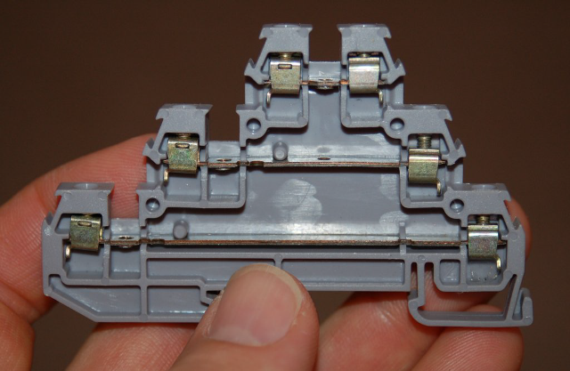

Деякі багаторівневі клемні колодки забезпечують можливість внутрішніх перемичок для з’єднання двох або більше рівнів разом, щоб вони були електрично спільними, а не електрично ізольованими. Таке використання багаторівневої клемної колодки краще, ніж практика вставляння кількох проводів в одну клему, коли дроти потрібно зробити спільними один для одного.

Інші модульні клемні блоки включають такі функції, як світлодіодні індикаторні лампи, перемикачі, запобіжники та навіть автоматичні вимикачі з можливістю перезавантаження у своїй вузькій ширині, що дозволяє розміщувати фактичні компоненти схеми поблизу точок з’єднання. На наступній фотографії показаний модуль клемної колодки з запобіжником, що відкривається, у відкритому положенні:

Модульні клемні колодки корисні для підключення як одножильних, так і багатожильних металевих проводів. Сила затиску, прикладена до кінчика дроту гвинтовим механізмом всередині одного з цих блоків, є прямою, без ковзання чи інших рухів. Деякі клеми, однак, менш складні за конструкцією. На наступній фотографії зображена пара «ізотермічних» клем, призначених для з’єднання проводів термопар. Тут ви можете побачити, як оголений кінчик гвинта тисне на дріт, вставлений у блок:

Поворотна сила, прикладена цими гвинтами до кожного кінчика дроту, вимагає використання суцільного дроту. Від такої комбінації сил багатожильний дріт розірветься.

Багато польових приладів, однак, взагалі не мають точок з’єднання «блокового» типу. Натомість вони оснащені машинними гвинтами з круглою головкою, призначеними для стиснення кінчиків дроту безпосередньо між головками гвинтів і металевою пластиною знизу.

Суцільні дроти можна належним чином з’єднати з такою точкою з’єднання з головкою гвинта, частково обернувши оголений кінець дроту навколо кола гвинта та затягнувши головку зверху дроту, як у випадку з двома короткими заглушками дроту на цьому інструменті:

Проблема безпосереднього стиснення наконечника дроту під головкою гвинта полягає в тому, що наконечник піддається як стискаючим, так і поперечним силам. У результаті кінчик дроту має тенденцію спотворюватися під час повторних з’єднань. Крім того, натяг дроту буде мати тенденцію повертати гвинт, потенційно послаблюючи його з часом.

Ця техніка закріплення абсолютно не підходить для багатожильного дроту, оскільки зусилля зсуву, викликані обертанням головки гвинта, мають тенденцію «розтирати» окремі жилки (Винятком є випадки, коли гвинт оснащено квадратною шайбою під головкою, призначеною для стиснення кінця багатожильного дроту без зсуву. Багато промислових приладів мають подібні кінцеві точки, спеціально призначені для зручного підключення до одножильних або багатожильних кінців дроту.). Найкращий спосіб приєднати наконечник багатожильного дроту безпосередньо до точки гвинтового з’єднання – це спершу обжати на дроті компресійну клему. Потім плоска металева «наконечник» (наконечник) клеми вставляється під головку гвинта, де вона може легко витримувати сили зсуву та стиснення, які чинить головка. 

На цій наступній фотографії показано п’ять таких багатожильних мідних проводів, під’єднаних до гвинтових точок з’єднання на польовому приладі за допомогою компресійних клем:

Компресійні клеми бувають двох основних різновидів: вилкові та кільцеві. Ілюстрація кожного типу показана тут:

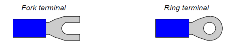

Вилкові клеми легше встановлювати та знімати, оскільки вони потребують лише послаблення гвинта з’єднувача, а не видалення гвинта. Кільцеві клеми надійніші, оскільки вони не можуть «відпасти» від точки з’єднання, якщо гвинт випадково послабиться.

Подібно до того, як пряме закінчення під головкою гвинта абсолютно не підходить для багатожильних проводів, клеми типу стиснення абсолютно непридатні для суцільного дроту. Незважаючи на те, що початковий обжим може здатися надійним, клеми стиснення швидко втрачають натяг на суцільному дроті, особливо коли є рух або вібрація, що напружує з’єднання. Наконечники компресійного дроту повинні бути обжаті лише до багатожильного дроту!

Щоб правильно встановити компресійну клему на кінці дроту, потрібно використовувати спеціальний обтискний інструмент. На наступній фотографії показано використання одного з цих інструментів:

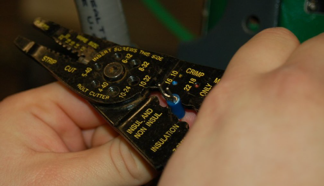

Зверніть увагу на різні місця на обжимному інструменті, позначені для різних розмірів дроту (калібру). Одне місце використовується для дроту калібру від 16 до 10, а місце, яке використовується на фотографії, – для дроту калібру від 22 до 18 (дріт всередині гофрованої клеми має 18 калібру).

Ця конкретна версія «обтискного» інструменту виконує більшу частину стиснення на нижній стороні стовбура клеми, залишаючи верхню частину непорушеною. Останній обтиснутий термінал виглядає так, якщо дивитися зверху:

## 8.3.2 DIN-рейка

Промислова стандартна конструкція для кріплення клемних блоків і невеликих електричних компонентів до плоских металевих панелей — це те, що називається DIN-рейкою. Це вузький металевий канал, виготовлений із гнутої листової сталі або екструдованого алюмінію, з краями, призначеними для «закріплення» пластикових компонентів. На наступній фотографії показано клемні колодки, розетки реле, запобіжники та інші клемні колодки, встановлені на горизонтальній довжині DIN-рейки в корпусі системи керування:

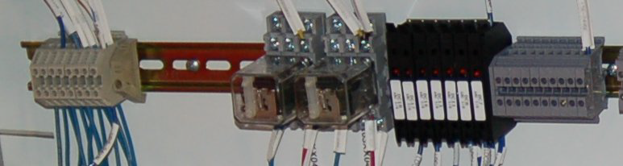

Дві фотографії кластера клемної колодки, закріпленої на DIN-рейці (одна зверху та друга знизу), показують, як спеціально сформовані плечі на кожному модулі клемної колодки підходять до країв DIN-рейки для надійного кріплення:

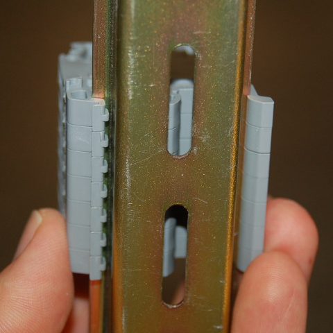

Сама DIN-рейка кріпиться на будь-якій плоскій поверхні за допомогою гвинтів, які вставляються через прорізи в основі. У більшості випадків плоска поверхня, про яку йдеться, є металевою підпанеллю електричного корпусу, до якої прикріплені всі електричні компоненти цього корпусу.

Очевидна перевага використання DIN-рейки для кріплення електричних компонентів у порівнянні з окремим прикріпленням цих компонентів до підпанелі за допомогою власних наборів гвинтів полягає в зручності: для монтажу та демонтажу компонента, прикріпленого на DIN-рейку, потрібно набагато менше праці, ніж для компонента, прикріпленого власним набір спеціальних гвинтів. Ця зручність істотно полегшує завдання зміни конфігурації панелі. З такою кількістю різних пристроїв, виготовлених для монтажу на DIN-рейку, можна легко оновити або змінити компонування панелі, просто від’єднавши компоненти, перемістивши їх у нові місця на рейці або замінивши їх на інші типи чи стилі компонентів.

Наступна фотографія демонструє різноманітність доступних компонентів для монтажу на DIN-рейку. Зліва направо ми бачимо чотири реле, блок живлення та три перетворювачі протоколу HART, усі вони закріплені на тій самій екструдованій алюмінієвій DIN-рейці:

Як згадувалося раніше, DIN-рейка доступна як у формі штампованої листової сталі, так і у формі екструдованого алюмінію. Тут показано порівняння двох матеріалів: листова сталь ліворуч і алюміній праворуч:

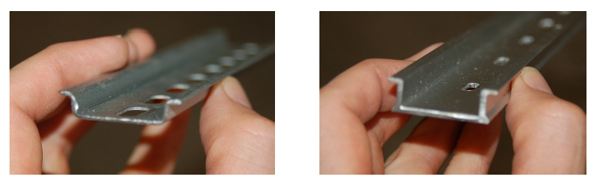

Форма DIN-рейки, показана на всіх фотографіях, відома як DIN-рейка «top hat». Різновидом конструкції DIN-рейки є так звана рейка «G» із значно іншою формою:

На щастя, багато модульних клемних колодок сформовані з можливістю кріплення до будь-якого стилю DIN-рейки, як-от ці два спеціальні блоки, лівий приклад – це клемна колодка з вбудованим роз’єднувальним вимикачем, а правий приклад будучи «заземлюючим» клемним блоком, точки закінчення якого є електрично спільними для самої DIN-рейки:

Якщо ви оглянете нижню конструкцію кожного блоку, ви побачите утворення, призначені для закріплення або до країв стандартної («циліндра») DIN-рейки, або до DIN-рейки у формі «G».

Також існують менші стандарти DIN-рейок, хоча вони набагато менш поширені, ніж стандартний розмір 35 мм:

Приємною особливістю багатьох клемних колодок типу DIN-рейки є можливість приєднання попередньо надрукованих номерів клем. Це значно спрощує документування електропроводки, оскільки кожне клемне з’єднання має власний унікальний ідентифікаційний номер:

## 8.3.3 Прокладка кабелю

В інтересах безпеки та довговічності не можна просто прокладати електричні силові та сигнальні кабелі випадковим чином між різними місцями. Електричні кабелі повинні бути належним чином підтримані, щоб зменшити механічні навантаження на провідники, і захищені від важких умов, таких як стирання, яке може погіршити ізоляцію.

Традиційним і надійним способом прокладання кабелю є металевий або пластиковий (ПВХ) канал. Трубопровід нагадує труби, які використовуються для транспортування рідин, за винятком того, що він має набагато тонші стінки, ніж труба для рідини, і не розрахований на витримку внутрішнього тиску, як труба. Насправді, різьбовий трубопровід використовує ті самі стандарти кроку різьби та діаметра, що й з’єднання труб для рідини NPT (National Pipe Taper).

Металева труба природним чином утворює безперервно заземлену оболонку для провідників, яка не лише забезпечує певний захист від ураження електричним струмом (усі корпуси та пристрої, приєднані до труби, надійно заземлюються через трубу), але й захищає від електростатичних перешкод. Це особливо важливо для проводки живлення до та від таких пристроїв, як випрямлячі та блоки приводів із змінною частотою (VFD), які мають тенденцію випромінювати велику кількість електромагнітного шуму.

Звичайно, пластиковий трубопровід не забезпечує електричного заземлення чи екранування, оскільки пластик не є провідником електрики. Однак він перевершує металеві труби щодо стійкості до хімічної корозії, тому його використовують для прокладки проводів у місцях, що містять воду, кислоти, їдкі речовини та інші вологі хімікати.

Тонкостінний трубопровід виготовляється з настільки тонкого металу, що в ньому неможливо врізати нитки. Замість цього використовуються спеціальні з’єднувачі для з’єднання «стрижнів» тонкостінного кабелепроводу разом і для приєднання тонкостінного трубопроводу до електричних корпусів. На цій наступній фотографії з’являються кілька прогонів тонкостінного трубопроводу. Два з цих трубопроводів були розірвані після зміни проводки, оголивши провідники всередині:

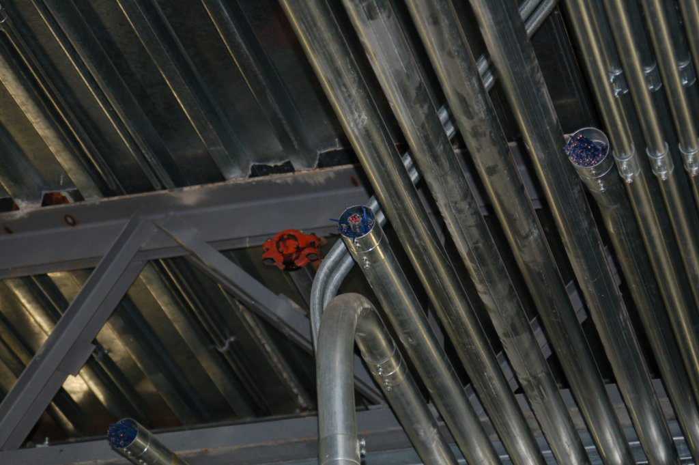

Встановлення кабелю в електричну трубу – це завдання, яке називають протягуванням кабелю, і це щось на зразок мистецтва. «Витягування» кабелю може бути особливо складним, якщо трубопровід містить багато вигинів і/або близький до потужності з точки зору кількості та розміру провідників, які він уже містить. Хороша практика полягає в тому, щоб завжди залишати відрізок нейлонової мотузки всередині кожної довжини труби, готової до використання для протягування нового дроту або кабелю. Під час «тягнення» дроту нову довжину нейлонової нитки протягують у трубу разом із новими дротами, щоб замінити стару тягучу нитку, коли її витягують із труби. Спеціальне мастило, розроблене для електропроводки, можна наносити на провідники, втягнуті в трубу, щоб зменшити тертя між цими новими провідниками та провідниками, які вже знаходяться всередині труби.

Під час підключення електричного кабелепроводу до кінцевих пристроїв зазвичай використовують гнучкий, непроникний для рідини канал як з’єднувач між жорстким металевим (або пластиковим) каналом і кінцевим пристроєм. Це забезпечує деяке зменшення напруги в каналі, якщо пристрій рухається або вібрує, а також дає більше свободи в позиціонуванні пристрою відносно каналу. Тут ми бачимо регулюючий клапан з двигуном і двома лініями герметичних трубопроводів, що підводять до нього:

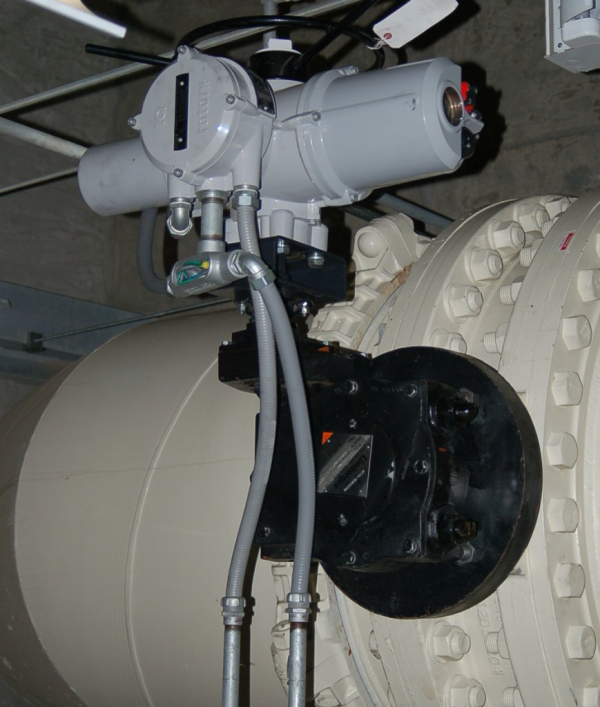

Водонепроникні труби бувають двох основних різновидів: металеві та неметалічні. Металевий тип містить спіралеподібну металеву оболонку безпосередньо під пластиковим зовнішнім покриттям, щоб забезпечити безперервно заземлений екран майже так само, як це робить жорсткий металевий канал. Неметалевий водонепроникний трубопровід — це не що інше, як пластиковий шланг, який забезпечує фізичний захист від впливу рідини та стирання, але не має електричного заземлення чи екранування.

Ще один спосіб прокладки кабелю – використання кабельного лотка. Лотки можуть бути виготовлені з суцільного сталевого дроту для легких застосувань, таких як сигнальні кабелі інструментів або кабелі комп’ютерної мережі, або вони можуть бути виготовлені зі сталевого чи алюмінієвого каналу для важких застосувань, таких як електропроводка. На відміну від кабелепроводу, кабельні лотки відкриті, залишаючи кабелі відкритими для зовнішнього середовища. Для цього часто потрібна спеціальна ізоляція кабелю, розрахована на вплив ультрафіолетового випромінювання, вологи та інших чинників навколишнього середовища. Перевагою кабельних лотків є простота монтажу кабелю, особливо в порівнянні з електричними трубами.

Хоча кабельний лоток забезпечує безперервно заземлену поверхню для електричної безпеки так само, як металевий канал, кабельний лоток природно не забезпечує екранування провідників, оскільки він не повністю огороджує провідники, як це робить металевий канал.

Тут показано приклад легкого кабельного лотка, який використовується для підтримки кабелів Ethernet біля стелі кімнати в університетському містечку. Кабельний лоток виготовлений із суцільного сталевого дроту, зігнутого в «кошик» для підтримки десятків жовтих кабелів Ethernet:

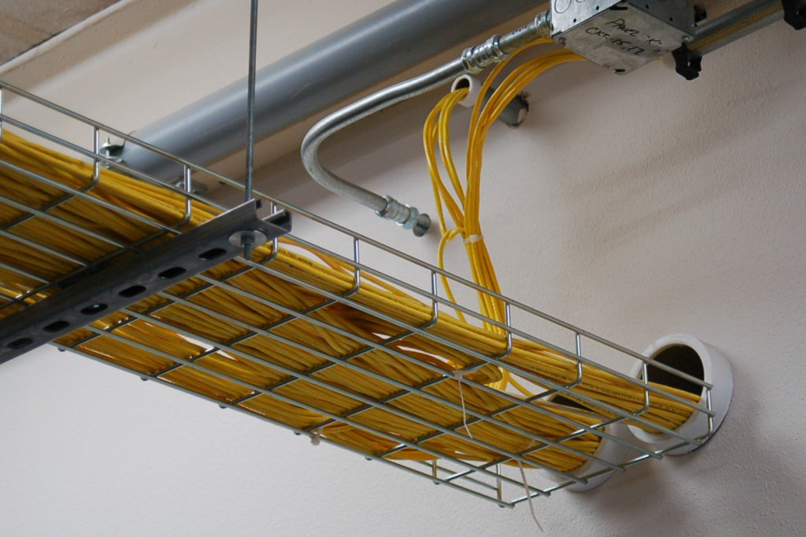

Надпотужний кабельний лоток з’являється на цій наступній фотографії, що підтримує провідники живлення великого калібру для електрогенераторів на газотурбінній електростанції. Тут кабельний лоток виглядає як алюмінієва драбина з екструдованими металевими рейками та щаблями, які забезпечують фізичну підтримку кабелів:

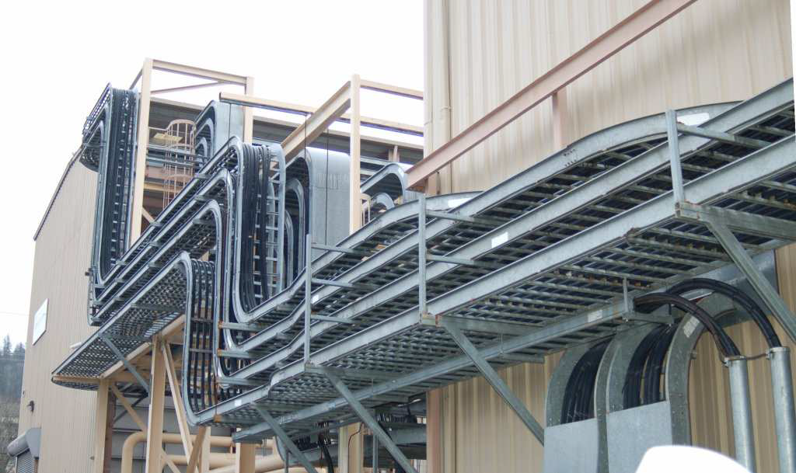

Подібні кабельні лотки з’являються на наступній фотографії, підтримуючи живильні кабелі від стаціонарного трансформатора та розподільних шаф:

Спеціальна форма електропроводки, яку часто можна побачити на промислових об’єктах для розподілу електроенергії, – це шинопровод, також відомий як шинний канал. Це прямокутні труби з листового металу, які містять попередньо виготовлені мідні шини для передачі трифазного змінного струму. Спеціальні розподільні коробки, «трійники» та відводні коробки дозволяють подовжувати шини та розгалужуватися на інші шини та/або стандартну провідникову проводку.

Шинопроводи використовуються в приміщеннях, часто в центрах керування двигунами (MCC) і центрах розподілу електроенергії для маршрутизації електроенергії до та від великих роз’єднувачів, запобіжників і автоматичних вимикачів. На цій фотографії ми бачимо шину, яка використовується для розподілу електроенергії вздовж стелі кімнати MCC, поряд зі звичайним жорстким трубопроводом:

Якими б корисними та акуратними не були зовні шини, вони безперечно обмежені за призначенням. Шинопроводи використовуються лише для розподілу електроенергії; не для вимірювання, керування чи сигналізації.

Двома матеріалами, корисними для акуратної прокладки силових, сигнальних і контрольно-вимірювальних провідників усередині корпусу, є дротяний канал і дротова стрічка wire duct and wire loom. Канал для дроту — це пластиковий канал із прорізами, призначений для кріплення до підпанелі корпусу разом із усіма електричними пристроями всередині цього корпусу. Дроти проходять від пристроїв до каналу через прорізи (щілини) з боків каналу та закриті знімною пластиковою кришкою, яка фіксується на верхній частині каналу. Загальна торгова марка дротяних повітропроводів у галузі – Panduit, тому ви часто чуєте, як люди називають дротяні повітропроводи «Panduit», незалежно від того, чи використовується саме ця марка (Це схоже на те, як люди називають лейкопластири «пластирами» або щипці для шипування суглобів). Wire loom is a loose spiral пластикова трубка, яка використовується для утримання групи окремих проводів разом у акуратний пучок. Дротовий верстат часто використовується, коли група провідників повинна була спочатку згинатися, як у випадку з пучком дроту, який з’єднує пристрої всередині панелі з іншими пристроями, встановленими на шарнірних дверцятах цієї панелі. 

Тут з’являється фотографія, на якій показано дротяну трубу та дротяний верстат в приладі внутрішньої панелі. Канал дроту — це прямокутний пластиковий канал сірого кольору, встановлений вертикально та горизонтально в середині панелі, тоді як wire loom — це пластикова спіраль сірого кольору, що відочує пучок проводів біля дверної петлі:

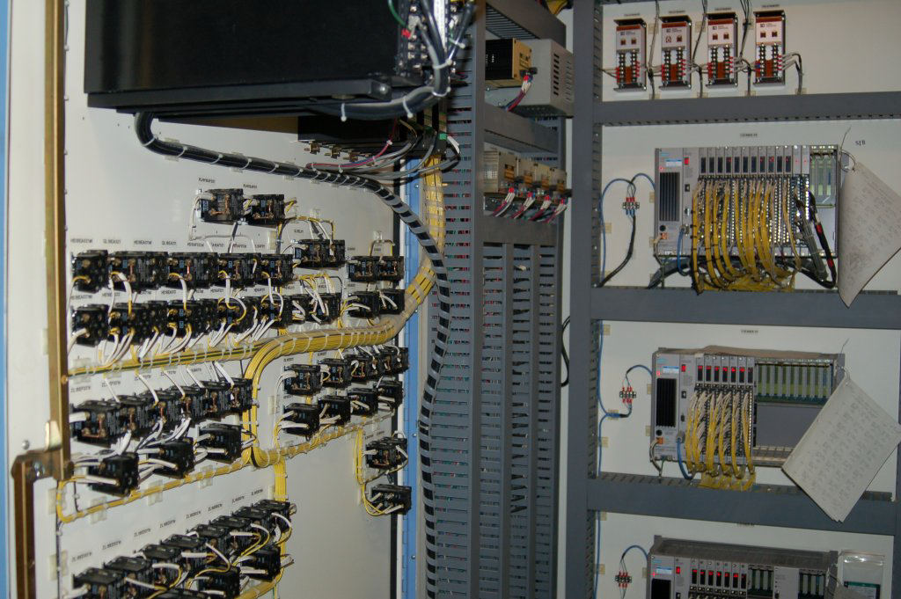

## 8.3.4 З’єднання сигналу та розділення кабелю

Якщо комплекти проводів пролягають занадто близько один до одного, електричні сигнали можуть «переходити» від одного проводу (або комплекту проводів) до іншого (інших). Це може бути особливо шкідливим для цілісності сигналу, коли зв’язок виникає між провідниками живлення змінного струму та проводкою сигналу приладу низького рівня, наприклад, кабелями термопари або датчика pH.

Існує два механізми електричного «зчеплення»: ємнісний та індуктивний. Ємність — властивість, притаманна будь-якій парі провідників, розділених діелектриком (ізоляційною речовиною), завдяки чому енергія накопичується в електричному полі, утвореному напругою між дротами. Природна ємність, що існує між взаємно ізольованими дротами, утворює «міст» для проходження сигналів змінного струму між цими дротами, сила цього «мосту» обернено пропорційна ємнісному реактивному опору (Xq = 2nfC). Індуктивність — властивість, притаманна будь-якому провіднику, за допомогою якої енергія накопичується в магнітному полі, утвореному струмом через дріт. Взаємна індуктивність, що існує між паралельними проводами, утворює ще один «міст», за допомогою якого змінний струм через один провід може індукувати змінну напругу вздовж іншого дроту.

Ємнісний зв’язок між провідником живлення змінного струму та провідником сигналу датчика постійного струму показано на наступній схемі:

Якщо датчиком, що генерує напругу, є термопара, а приймаючим приладом є індикатор температури, результатом цього ємнісного зв’язку буде «шумовий» сигнал температури, який інтерпретується приладом. Цей шум буде пропорційний як напрузі, так і частоті мережі змінного струму.

Індуктивний зв’язок між провідником живлення змінного струму та провідником сигналу датчика постійного струму показано на наступній схемі:

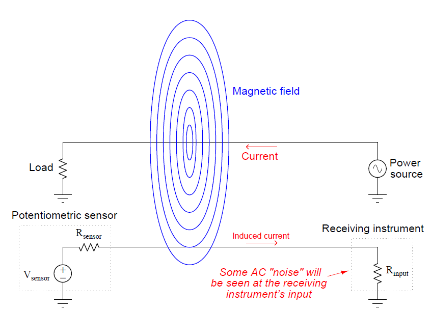

Тоді як кількість шуму, викликаного сигналом низького рівня через ємнісний зв’язок, була функцією напруги та частоти, кількість шуму, індукованого сигналом через індуктивний зв’язок, є функцією струму та частоти. Тут працює принцип напруженості поля, створюваного провідником, що передає шум: напруженість електричного поля (за допомогою ємнісного зв’язку) прямо пропорційна напрузі, тоді як напруженість магнітного поля (задіяного з індуктивним зв’язком) прямо пропорційна струму. .

Хороший спосіб звести до мінімуму зчеплення сигналів - це просто розділити провідники, що передають несумісні сигнали. Ось чому провідники електричного живлення та сигнальні кабелі приладів майже ніколи не зустрічаються в одному каналі або в одній системі повітропроводу разом. Роз'єднання зменшує ємність між провідниками

Якщо провідники, що передають несумісні сигнали, мають перетинатися, бажано орієнтувати провідники перпендикулярно один до одного, а не паралельно, як це:

Тут показано два сигнали в поєднанні з однаковою напругою шуму:

Амплітуда шуму аналогового сигналу від піку до піку становить майже 20% від усього діапазону сигналу (відстань між нижнім і верхнім значеннями діапазону), що представляє суттєве погіршення цілісності сигналу. Аналогові сигнали мають нескінченну роздільну здатність, що означає, що будь-яка зміна амплітуди сигналу має значення. Таким чином, будь-який шум, введений в аналоговий сигнал, буде інтерпретуватися як зміна величини, яку цей сигнал має представляти.

Та сама кількість шуму, що накладається на цифровий сигнал, не спричиняє погіршення якості сигналу, за винятком одного моменту часу, коли сигнал намагається досягти «низького» стану, але не може перетнути поріг через шум. Окрім цього одного інциденту, представленого у формі імпульсу, решта сигналу абсолютно не впливає на шум, оскільки цифрові сигнали мають значення лише вище «високого» порогу стану та нижче «низького» порогу стану. Зміни рівня напруги сигналу, спричинені індукованим шумом, не вплинуть на значення цифрових даних, доки амплітуда цього шуму не стане достатньо сильною, щоб запобігти переходу сигналу через порогове значення (коли він повинен перетнути), або спричинить перетин сигналу поріг (коли не повинен).

З того, що ми побачили тут, цифрові сигнали набагато більш стійкі до індукованого шуму, ніж аналогові сигнали, за всіх інших факторів. Якщо коли-небудь ви опинитеся в ситуації, коли вам доведеться прокласти сигнальний дріт біля провідників змінного струму, і вам трапиться вибір: аналоговий сигнал (наприклад, 4-20 мА, 0-10 В) чи цифровий сигнал (наприклад, EIA/TIA-485, Ethernet), найкращим варіантом є вибір цифрового сигналу, який буде співіснувати разом із проводами живлення змінного струму.

## 8.3.5 Розв’язка електричного поля (ємнісного).

Фундаментальний принцип екранування провідника(ів) сигналу від зовнішніх електричних полів полягає в тому, що в твердому провіднику не може існувати значне електричне поле. Електричні поля виникають через дисбаланс електричних зарядів. Якби такий дисбаланс зарядів коли-небудь існував у провіднику, носії заряду (як правило, електрони) у цьому провіднику швидко рухалися б, щоб вирівняти дисбаланс, таким чином усуваючи електричне поле. Іншим способом сказати це є те, що електричні поля існують лише між точками з різним потенціалом і, отже, не можуть існувати між еквіпотенціальними точками. Таким чином, лінії електричного потоку можна знайти лише в діелектрику (ізоляційному середовищі) між провідниками, а не в твердому провіднику:

Це також означає, що лінії електричного потоку не можуть охоплювати діаметр порожнистого провідника:

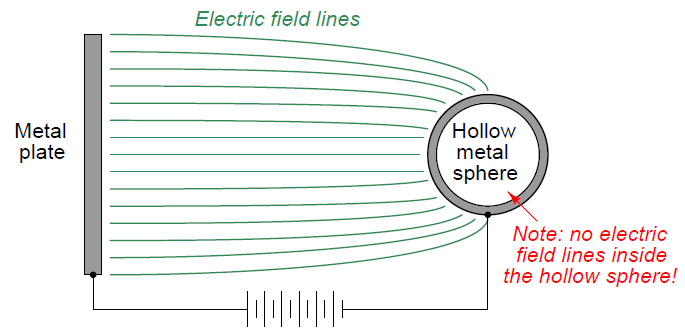

Електропровідність стінки порожнистої кулі забезпечує еквіпотенціальність усіх точок на окружності кулі. Це, у свою чергу, забороняє утворення будь-яких ліній електричного потоку у внутрішньому повітряному просторі порожнистої сфери. Таким чином, усі точки всередині порожнистої сфери захищені від будь-яких електричних полів, що виникають поза сферою.

Єдиний спосіб дозволити зовнішньому електричному полю проникнути в порожнистий провідник ззовні - це залишити цю провідну оболонку «плаваючою» відносно іншого провідника, розміщеного всередині оболонки. У цьому випадку лінії електричного потоку існують не між різними точками на провідній сфері, а між оболонкою сфери та провідником у центрі сфери, оскільки це точки, між якими існує різниця потенціалів (напруга). Щоб проілюструвати:

Однак, якщо ми зробимо порожнисту оболонку електрично загальною для негативної сторони джерела високої напруги, лінії потоку всередині сфери зникають, оскільки між внутрішнім провідником і провідною оболонкою немає різниці потенціалів:

Якщо провідник усередині порожнистої сфери підняти до потенціалу, відмінного від негативного виводу джерела високої напруги, лінії електричного потоку знову існуватимуть усередині сфери, але вони відображатимуть цей другий потенціал, а не потенціал початкового високого - джерело напруги. Іншими словами, електричне поле існуватиме всередині порожнистої сфери, але воно буде повністю ізольовано від електричного поля поза сферою. Знову ж таки, провідник всередині захищений від зовнішніх електростатичних перешкод:

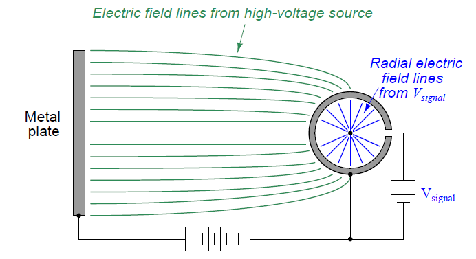

Якщо провідники, розташовані всередині порожнистої оболонки, таким чином захищені від зовнішніх електричних полів, це означає, що між зовнішніми провідниками та внутрішніми (екранованими) провідниками не може бути жодної ємності. Якщо між провідниками немає ємності, ніколи не буде ємнісного зв’язку сигналів між цими провідниками, а саме цього ми хочемо, щоб промислові сигнальні кабелі захищали ці сигнали від зовнішніх перешкод. До речі, екранування кабелю також захищає від сильних електричних полів усередині кабелю від ємнісного зв’язку з провідниками поза кабелем. Це означає, що ми можемо вибрати екранування «зашумлених» силових кабелів замість (або на додаток до) екранування сигнальних кабелів низького рівня. У будь-якому випадку хороше екранування запобігатиме ємнісному зв’язку між провідниками по обидві сторони екрана.

Усе це обговорення порожнистих металевих сфер є лише вступом до обговорення екранованого кабелю, де електричні кабелі сконструйовані з обгорткою провідної металевої фольги або провідної металевої оплітки, що оточує внутрішні провідники. Таким чином, фольга або обплетення створює провідну трубку, яка може бути з’єднана з потенціалом землі («загальна» точка між зовнішніми та внутрішніми джерелами напруги), щоб запобігти ємнісному зв’язку між будь-якими зовнішніми джерелами напруги та провідниками всередині кабелю:

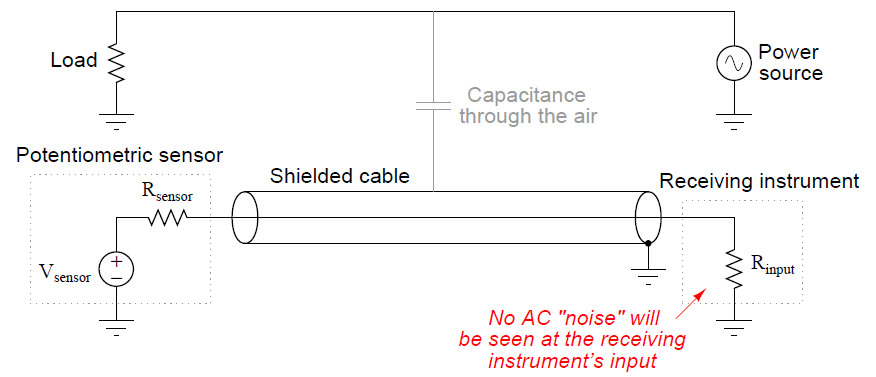

На наступній фотографії показано набір сигнальних кабелів із екранованими провідниками в обплетенні, які підключені до загальної мідної «шини заземлення». Ця конкретна застосування знаходиться в панелі керування вимикача 500 кВ, розташованого на великій електричній підстанції, де є сильні електричні поля:

На цій наступній фотографії зображено чотирижильний USB-кабель, який був зачищений на одному кінці, показуючи екран із металевої фольги, а також сріблясті дротяні нитки в прямому контакті з фольгою, обмотані навколо чотирьох кольорових провідників живлення та сигналу:

На кінцевому кінці ми зазвичай скручуємо вільні нитки провідника екрана разом, щоб утворити провід, який потім приєднується до точки заземлення, щоб зафіксувати екран кабелю на потенціалі Землі.

Дуже важливо заземлити лише один кінець екрану кабелю, інакше ви створите можливість для контуру заземлення: шлях для проходження струму через екран кабелю внаслідок різниці потенціалів землі на кінцях кабелю. Контури заземлення можуть не тільки спричиняти шум у провіднику (провідниках) кабелю, але в серйозних випадках вони можуть навіть перегріти кабель і, таким чином, створити небезпеку пожежі:

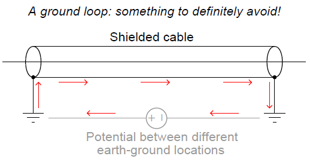

Важливою характеристикою шумової напруги з ємнісним зв’язком є те, що вона є синфазною за своєю природою: шум з’являється однаково на кожному провіднику в кабелі, оскільки ці провідники розташовані дуже близько один до одного (тобто через величину ємності, що існує між кожним провідником і джерело шуму те саме). Одним із способів використання цієї характеристики, щоб уникнути небажаних ефектів ємнісного зв’язку, є використання диференціальної сигналізації. Замість того, щоб посилатися на напругу сигналу на землю, ми дозволяємо напрузі сигналу «плавати». На наступній схематичній діаграмі показано, як це працює:

Відсутність заземлення в ланцюзі сигналу постійного струму запобігає ємнісному зв’язку з напругою змінного струму від спотворення вимірювального сигналу, який «бачить» прилад. Шумова напруга все ще з’являтиметься між будь-яким сигнальним проводом і землею як синфазна напруга, але шумова напруга не з’являтиметься між двома сигнальними проводами, де існує наш цікавий сигнал. Іншими словами, ми обходимо проблему синфазної шумової напруги, роблячи синфазну напругу невідповідною для датчика та приймача сигналу. Деякі промислові стандарти передачі даних, такі як EIA/TIA-485 (RS-485), використовують цю техніку для мінімізації руйнівного впливу електричного шуму. Щоб побачити практичний приклад того, як це працює в ланцюзі передачі даних, зверніться до ілюстрації в розділі 15.6.2, що починається на сторінці 1057 цієї книги.

## 8.3.6 Розв’язка магнітного поля (індуктивна). 

Магнітні поля, на відміну від електричних, надзвичайно важко повністю екранувати. Лінії магнітного потоку не закінчуються, а обертаються. Таким чином, неможливо «зупинити» магнітне поле, а лише змінити його шлях. Загальний метод для магнітного екранування чутливого приладу полягає в тому, щоб укласти його в корпус, виготовлений з матеріалу, що має надзвичайно високу магнітну проникність (p): оболонка забезпечує набагато легше проходження ліній магнітного потоку, ніж повітря. Матеріалом, який часто використовують для цього застосування, є мю-метал або р-метал, названий так за його чудову магнітну проникність:

Цей вид екранування є непрактичним для захисту сигнальних кабелів від індуктивного зв’язку, оскільки муметал є досить дорогим і має бути нанесений відносно товстим шаром, щоб забезпечити шлях із достатньо низьким опором для шунтування більшості зовнішніх ліній магнітного потоку.

Найпрактичніший метод надання стійкості до магнітного поля сигнальному кабелю слідує методу диференціальної сигналізації, який обговорюється в розділі про розв’язку електричного поля, з поворотом (буквально). Якщо ми скрутимо пару дротів, а не дозволимо їм лежати вздовж паралельних прямих ліній, вплив електромагнітної індукції буде значно мінімізовано.

Причину, по якій це працює, найкраще можна проілюструвати малюнком схеми диференціального сигналу з двома товстими дротами, спочатку протягнутими без скручування. Припустімо, що магнітне поле, показане тут (з трьома лініями потоку, що входять у дротяну петлю), зростає за силою в момент часу, зображений на ілюстрації:

Відповідно до закону Ленца, струм буде індукуватися в дротяній петлі такої полярності, щоб протидіяти збільшенню напруженості зовнішнього поля. Іншими словами, індукований струм намагається «боротися» з накладеним полем, щоб підтримувати нульову чисту зміну. Згідно з правилом правої руки електромагнетизму (відстеження струму в традиційному позначенні потоку), індукційний струм повинен рухатися проти годинникової стрілки, якщо дивитися зверху на дротяну петлю, щоб створити магнітне поле, яке протидіє зростанню зовнішнього магнітного поля. поле. Цей індукований струм протидіє постійному струму, що створюється датчиком, погіршуючи сигнал, отриманий приладом.

Коли напруженість зовнішнього магнітного поля зменшується, а потім зростає у протилежному напрямку, індукційний струм змінюється. Таким чином, коли магнітне поле змінного струму коливається, індукційний струм також буде коливатися в ланцюзі, викликаючи появу «шумової» напруги змінного струму на вимірювальному приладі. Це саме той ефект, який ми хочемо пом'якшити.

Відразу ми бачимо значну різницю між шумовою напругою, спричиненою магнітним полем, і шумовою напругою, спричиненою електричним полем: у той час як шум з ємнісним зв’язком завжди був синфазним, тут ми бачимо шум з індуктивним зв’язком як диференціальний. Це не означає, що магнітні поля не можуть викликати синфазну шумову напругу: навпаки, магнітні поля здатні індукувати напругу в будь-якій електропровідній петлі. З цієї причини як диференціальні сигнали, так і сигнали, прив’язані до землі, чутливі до перешкод від магнітних полів.

Якщо ми скручуємо дроти таким чином, щоб створити серію петель замість однієї великої петлі, ми побачимо, що індуктивні ефекти зовнішнього магнітного поля мають тенденцію скасовуватися:

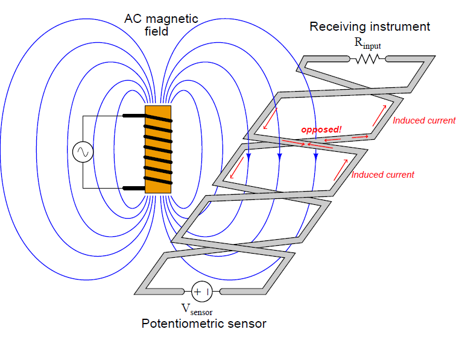

Не всі лінії потоку проходять через одну петлю. Кожна петля являє собою зміну напрямку струму в сигнальному ланцюзі приладу, тому напрямок магнітно-індукованого струму в одній петлі прямо протилежний напрямку магнітно-індукованого струму в наступному. Поки петель достатньо в кількості та вони розташовані близько один до одного, сумарний ефект буде повним і повним протилежністю між усіма індукційними струмами, в результаті чого на приладі не з’явиться чистий індукований струм і, отже, напруга змінного струму «шум».

Щоб користуватися перевагами подавлення магнітних і електричних полів, інструментальні кабелі зазвичай виготовляються як скручені екрановані пари. Витки захищають від магнітних (індуктивних) перешкод, тоді як заземлений екран захищає від електричних (ємнісних) перешкод. Якщо кілька пар проводів скручено в одному кабелі, швидкість скручування кожної пари може бути різною, щоб уникнути магнітного зв’язку від пари до пари. Прикладом цього є кабель UTP (неекранована кручена пара), який використовується для цифрових мереж Ethernet, де чотири пари проводів із різною швидкістю скручування укладено в одну оболонку кабелю.

## 8.3.7 Високочастотні сигнальні кабелі

Електронні сигнали, що використовуються в традиційних приладових схемах, мають постійний або низькочастотний змінний струм. Значення вимірювань і контролю представлені в аналоговій формі цими сигналами, як правило, величиною електронного сигналу (скільки вольт, скільки міліампер тощо). Однак сучасні електронні прилади часто передають дані процесу та керування в цифровій, а не аналоговій формі. Ці цифрові дані приймають форму високочастотних імпульсів напруги та/або струму вздовж провідників приладу. Найпотужніші прилади польової шини повністю відмовляються від аналогової сигналізації, передаючи всі дані в цифровій формі на відносно високих швидкостях.

Якщо період часу імпульсу напруги або струму менший за час, необхідний для проходження сигналу по кабелю (майже зі швидкістю світла!), можуть виникнути дуже цікаві ефекти. Коли імпульс поширюється двожильним кабелем і досягає кінця цього кабелю, енергія, що міститься в цьому імпульсі, повинна бути поглинена приймальним контуром або відбита назад по кабелю.  Чесно кажучи, це відбувається в усіх схемах, незалежно від того, наскільки довгими або короткими можуть бути імпульси, але ефекти «відбитого» імпульсу стають очевидними лише тоді, коли час імпульсу короткий порівняно з часом поширення сигналу. Це використання терміну повністю відрізняється від використання того самого терміну в електроенергетиці, де «лінія електропередачі» — це набір провідників, які використовуються для передачі великої кількості електричної енергії на великі відстані. У таких застосуваннях з коротким імпульсом прийнято називати кабель лінією передачі і розглядати його як компонент схеми зі своїми власними характеристиками (а саме безперервний імпеданс, який «бачить» рухомий імпульс). Щоб отримати докладніші відомості про цю тему, зверніться до розділу 5.10, який починається на сторінці 475. 

Ця проблема має знайому аналогію: «луна» в кімнаті. Якщо ви увійдете у велику кімнату з твердими стінами, підлогою та стелею, ви одразу помітите відлуння від будь-якого звуку, який ви видаєте. Вести розмову в такій кімнаті може бути досить складно, оскільки звуки, що відтворюються, накладаються на останні вимовлені звуки, що ускладнює розпізнавання сказаного. Чим більша кімната, тим довша затримка відлуння і тим більша плутанина в розмові.

Ехо-сигнали також виникають у невеликих кімнатах, але вони, як правило, занадто короткі, щоб викликати занепокоєння. Якщо відбитий(-і) звук(-и) повертається(-ються) досить швидко після того, як він був промовлений, затримка між вимовленим (випадковим) звуком і луною (відбитим) звуком буде занадто короткою, щоб помітити, і розмова триватиме безперешкодно.

Ми можемо вирішити проблему «відлуння» двома абсолютно різними способами. Одним із способів є повне усунення відлуння, додавши в кімнату звукопоглинаючі покриття (килим, акустичну стельову плитку) та/або предмети (дивани, крісла, подушки). Ще один спосіб вирішити проблему луни, яка перериває розмову, - уповільнити темп мови. Якщо слова вимовляються досить повільно, часова затримка відлуння буде відносно короткою порівняно з періодом кожного вимовленого звуку, і розмова може тривати без перешкод (хоча й зі зниженою швидкістю). Один мій студент якось зауважив, що робить це за звичкою щоразу, коли розмовляє з будь-ким на ракетбольному майданчику. Усі тверді поверхні (підлога, стіни) на майданчику для ракетболу створюють сильний відлуння, змушуючи гравців говорити повільніше, щоб уникнути плутанини від відлуння.

І проблема, і рішення для відбитих сигналів в електричних кабелях слідують тим же шаблонам, що і проблема і рішення для звукової луни в приміщенні з твердим покриттям. Якщо електронна схема, що отримує імпульси, що надсилаються по кабелю, приймає і падаючий імпульс, і ехо-сигнал (відбитий імпульс) зі значною затримкою в часі, що розділяє ці два імпульси, цифрова «розмова» буде перешкоджати так само, як вербальна розмова між двома або більше людей заважає луна в кімнаті. Ми можемо вирішити цю проблему, повністю усунувши відбиті імпульси (переконавшись, що вся енергія імпульсу поглинається відповідним навантаженням, розміщеним на кінці кабелю), або уповільнивши швидкість передачі даних (тобто довші імпульси, нижчі частоти), щоб відбитий і падаючий імпульсні сигнали практично перекривають один одного в приймачі.

Високошвидкісні мережі приладів «fieldbus» застосовують перше рішення (усувають відбиття), тоді як застарілий стандарт сигналу приладів HART застосовує друге (повільна швидкість передачі даних). У високошвидкісних мережах передачі даних відбиття усувається завдяки тому, що обидва найвіддаленіші кінці кабелю «закінчені» значенням опору належного розміру (що відповідає характеристичному опору кабелю). Розробники аналогово-цифрового гібридного стандарту HART вирішили використовувати натомість повільні швидкості передачі даних, щоб їхні прилади нормально працювали на застарілих сигнальних кабелях, де характеристичний опір не стандартизований.

Можливість появи відбитих імпульсів у високошвидкісному кабелі польової шини є причиною занепокоєння серед техніків приладів, оскільки це являє собою нове явище, яке може спричинити збої в системі приладів. Більше недостатньо мати щільні з’єднання, чисті кінці проводів, хорошу ізоляцію та належне екранування для сигнального кабелю, щоб вірно передавати сигнал приладу 4–20 мА постійного струму від одного пристрою до іншого. Тепер технік повинен забезпечити належне закінчення та відсутність будь-яких розривів (гострих вигинів або згинів) по всій довжині кабелю, на додаток до всіх традиційних критеріїв, щоб точно передавати цифровий сигнал польової шини від одного пристрою до іншого.

Характеристика, або «стрибковий», імпеданс кабелю є функцією геометрії його провідника (діаметр дроту та відстань) і діелектричного значення ізоляції між провідниками. Кожного разу, якщо сигнал різко змінює імпеданс, частина (або вся) його енергії відбивається у зворотному напрямку. Ось чому відображення виникає на кінці кабелю без завершення: «розрив» — це нескінченний імпеданс, який є величезним відхиленням від кінцевого опору, який «бачить» сигнал під час його проходження по кабелю. Це також означає, що будь-яка раптова зміна геометрії кабелю, наприклад згинання, надрізи, скручування або різкий вигин, може відбити частину сигналу. Таким чином, високошвидкісні цифрові кабелі даних повинні бути встановлені більш ефективними, ніж низькочастотні або аналогові сигнальні кабелі постійного струму.

