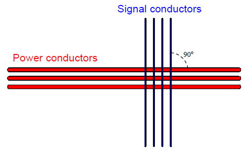

[<- До підрозділу](README.md)

# З'єднання та підключення електричних кіл

Цей матеріал розроблено на основі матеріалу частини 8.3 (Electrical signal and control wiring) з посібника  Lessons In Industrial Instrumentation by Tony R Kuphaldt (Author)

## З'єднання та закінчення проводів

Існує багато різних методів з’єднання електричних провідників разом, зокрема: скручування, пайка, обтиск (з використанням компресійних з’єднувачів) і клема (затискання за допомогою натягу пружини, або під стисненням гвинта). При цьому у більшості промислових польових з’єднань електропроводки для приєднання проводів до приладів та інших проводів використовується компресійні «наконечники» (часто їх називають наконечниками або компресійними клемами) і гвинтових затискачів. 

Клема — затискач для з'єднування електричних проводів з машиною, приладом і т. ін. Клеми часто використовуються у вигляді блоків - клемних колодок. На рис.1 зображено типову модульну клемну колодку, за допомогою якої сигнальні кабелі витої пари з’єднуються з іншими сигнальними кабелями витої пари. Металеві стрижні всередині кожної пластикової клемної секції (прохідної клеми) утворюють з’єднання горизонтально, так що дроти, прикріплені зліва, з’єднані з проводами, закріпленими з правого боку. Модульність передбачає що клемна колодка набирається з секцій (модулів), які вміщують клеми.  

рис.1. Приклад клемної колодки

На кінцях проводів (як правило багатожильних), саме там, де вони вставляються в секції клемних блоків, використовуються наконечники (рис.2), які зажимаються спеціальним інструментом. Наведені на рис.1 клемні колодки використовують гвинти, які зажимають і утримують дроти в тісному електричному контакті з металевою планкою всередині кожного блоку. Щоб забезпечити більш міцне кріплення наконечника гвинтом клемної колодки, інструменти обжимання (обжимки) додатково створюють гофровану поверхню. 

рис.2. Зовнішній вигляд наконечника

На фотографії крупним планом однієї секції клемної колодки показано (рис.3), як працює система гвинтових затискачів. Часто секції називають просто клемами, хоча вони можуть мати кілька пар клем. У правій стороні цього блоку надійно затиснутий одиночний дріт (з прямим наконечником для стиснення), з лівого боку наразі нічого на вставлено.

рис.3. Зовнішній вигляд секції клемної колодки (прохідна клема) під гвинт

Якби інший провід був закріплений гвинтовим затискачем з лівого боку клемної колодки, що показана на рис.3, він був би електрично спільним з проводом з правого боку завдяки металевій шині, що з’єднує обидві сторони. Тому у даному випадку кажуть що секція (клема) є прохідною, бо перепускає струм між двома з'єднаними клемами. 

Є як гвинтові так і безгвинтові клеми. У останніх для встановлення міцного механічного та електричного контакту з кінцем дроту використовується пружинний затиск  (рис.4).

рис.4. Зовнішній вигляд секції клемної колодки з пружинним затискачем

Щоб витягнути або вставити кінець дроту з або до «безгвинтової» клемної секції, необхідно вставити вузьку викрутку в отвір у блоці біля точки введення, а потім повернути викрутку (як важіль), щоб застосувати силу до пружинного затиску. Пружинні клемні колодки, як правило, швидше закріплюються та від’єднуються, ніж гвинтові клемні колодки, а натискання інструменту для роз’єднання м’якше впливає на корпус, ніж скручування, необхідне для послаблення та затягування гвинтів. 

Відповідно до різних потреб у організації проводки виготовляються різні типи модульних клемних колодок. Деякі секції клемних колодок можуть мати декілька «рівнів» замість одного. На рис.5 показана дворівнева секція клемної колодки з безгвинтовими затискачами для дроту.

рис.5. Зовнішній вигляд секції клемної колодки з двома рівнями

На рис.6 показана трирівнева секція з гвинтовими затискачами:

рис.6. Зовнішній вигляд секції клемної колодки з трьома рівнями

Багаторівневі клеми особливо популярні у випадках трьох-провідного підключення датчиків, де окремо подається живлення та сигнал, наприклад для датчиків наближення.

Надалі, замість слово секція модульної клемної колодки будемо вживати слово "клема" . 

Деякі багаторівневі клеми в клемних колодках забезпечують можливість внутрішніх перемичок для з’єднання двох або більше рівнів разом, щоб вони були електрично спільними, а не електрично ізольованими. Таке використання багаторівневої клемної колодки краще, ніж практика вставляння кількох проводів в одну клему, коли дроти потрібно зробити спільними один для одного.

Клеми можуть включати у своїй вузькій ширині такі функції, як світлодіодні індикаторні лампи, перемикачі, запобіжники та навіть автоматичні вимикачі з можливістю заміни. Це дозволяє розміщувати фактичні компоненти схеми поблизу точок з’єднання. На рис.7 показана клема з запобіжником, що відкривається (показаний у відкритому положенні)

рис.7. Клема з функціями запобіжника

Модульні клемні колодки корисні для підключення як одножильних, так і багатожильних металевих проводів. Сила затиску, прикладена до кінчика дроту гвинтовим механізмом всередині одного з цих блоків, є прямою, без ковзання чи інших рухів. 

Деякі клеми, однак, менш складні за конструкцією. На рис.8 зображена пара «ізотермічних» клем, призначених для з’єднання проводів термопар. Тут можна побачити, як оголений кінчик гвинта тисне на дріт, вставлений у блок.

рис.8. Підключення до клем приладу.

Поворотна сила, прикладена цими гвинтами до кожного кінчика дроту, вимагає використання суцільного дроту. Від такої комбінації сил багатожильний дріт розірветься, тому його треба обжимати наконечником.

Багато польових приладів, однак, взагалі не мають точок з’єднання «блокового» типу. Натомість вони оснащені машинними гвинтами з круглою головкою, призначеними для стиснення кінчиків дроту безпосередньо між головками гвинтів і металевою пластиною знизу.

Суцільні дроти можна належним чином з’єднати з такою точкою з’єднання з головкою гвинта, частково обернувши оголений кінець дроту навколо кола гвинта та затягнувши головку зверху дроту, як у випадку з двома короткими заглушками дроту на цьому приладі.

рис.9. Підключення до гвинтів

Проблема безпосереднього стиснення наконечника дроту під головкою гвинта полягає в тому, що наконечник піддається як стискаючим, так і поперечним силам. У результаті під час повторних з’єднань кінчик дроту має тенденцію спотворюватися. Крім того, натяг дроту буде мати тенденцію повертати гвинт, потенційно послаблюючи його з часом. Ця техніка закріплення абсолютно не підходить для багатожильного дроту, оскільки зусилля зсуву, викликані обертанням головки гвинта, мають тенденцію «розтирати» окремі жилки. Найкращий спосіб приєднати наконечник багатожильного дроту безпосередньо до точки гвинтового з’єднання – це спершу обжати на дроті спеціальний металевий наконечник (компресійна клема), який вставляється під головку гвинта, де він може легко витримувати сили зсуву та стиснення, які чинить головка. На рис.10 показано п’ять таких багатожильних мідних проводів, під’єднаних до гвинтових точок з’єднання на польовому приладі за допомогою компресійних клем.

рис.10. Підключення через компресійні клеми

Компресійні клеми бувають двох основних різновидів: вилкові та кільцеві. Ілюстрація кожного типу показана тут:

рис.11. Вигляд компресійних клем

Вилкові клеми легше встановлювати та знімати, оскільки вони потребують лише послаблення гвинта з’єднувача, а не видалення гвинта. Кільцеві клеми надійніші, оскільки вони не можуть «відпасти» від точки з’єднання, якщо гвинт випадково послабиться. Подібно до того, як пряме закінчення під головкою гвинта абсолютно не підходить для багатожильних проводів, компресійні клеми абсолютно непридатні для одножильного дроту. Незважаючи на те, що початковий обжим може здатися надійним, компресійні клеми швидко втрачають натяг на суцільному дроті, особливо коли є рух або вібрація, що напружує з’єднання. Наконечники компресійного дроту повинні бути обжаті лише до багатожильного дроту.

Щоб правильно встановити компресійну клему на кінці дроту, потрібно використовувати спеціальний обтискний інструмент. На рис.11 показано використання одного з цих інструментів:

рис.11. Обжимка для компресійних клем

Зверніть увагу на різні місця на обжимному інструменті, позначені для різних розмірів дроту (калібру). Одне місце використовується для дроту калібру від 16 до 10, а місце, яке використовується на фотографії, – для дроту калібру від 22 до 18 (дріт всередині гофрованої клеми має 18 калібр). Ця конкретна версія «обтискного» інструменту виконує більшу частину стиснення на нижній стороні стовбура клеми, залишаючи верхню частину непорушеною. Останній обтиснутий термінал виглядає так, як на рис.12.

рис.12. Вигляд обжатої компресійної клеми

## DIN-рейка

DIN-рейка - це промислова стандартна конструкція для кріплення клемних блоків і невеликих електричних компонентів до плоских металевих панелей. Це вузький металевий канал, виготовлений із гнутої листової сталі або екструдованого алюмінію, з краями, призначеними для «закріплення» пластикових компонентів. На рис.13 показано клемні колодки, розетки реле, запобіжники та інші клемні колодки, встановлені на горизонтальній довжині DIN-рейки в корпусі системи керування.

рис.13. Приклад використання клемної колодки  

Дві фотографії кластера клемної колодки, що показані на рис.14, закріпленої на DIN-рейці (одна зверху та друга знизу), показують, як спеціально сформовані плечі на кожному модулі клемної колодки підходять до країв DIN-рейки для надійного кріплення:

рис.14. Крпілення на DIN-рейку

Сама DIN-рейка кріпиться на будь-якій плоскій поверхні за допомогою гвинтів, які вставляються через прорізи в її основі. У більшості випадків плоска поверхня, про яку йдеться, є металевою підпанеллю електричного корпусу, до якої прикріплені всі електричні компоненти цього корпусу. 

Очевидна перевага використання DIN-рейки для кріплення електричних компонентів у порівнянні з окремим прикріпленням цих компонентів до підпанелі за допомогою власних наборів гвинтів полягає в зручності: для монтажу та демонтажу компонента, прикріпленого на DIN-рейку, потрібно набагато менше праці, ніж для компонента, прикріпленого власним набором спеціальних гвинтів (рис.15). Ця зручність істотно полегшує завдання зміни конфігурації панелі. З такою кількістю різних пристроїв, виготовлених для монтажу на DIN-рейку, можна легко оновити або змінити компонування панелі, просто від’єднавши компоненти, перемістивши їх у нові місця на рейці або замінивши їх на інші типи чи стилі компонентів.

рис.15. Кріплення на DIN-рейку

Як згадувалося раніше, DIN-рейка доступна як у формі штампованої листової сталі, так і у формі екструдованого алюмінію. На рис.16 показано порівняння двох матеріалів: листова сталь ліворуч і алюміній праворуч:

рис. 16. Різні види DIN-рейок 

Форма DIN-рейки, показана на всіх фотографіях, відома як DIN-рейка «top hat». Є й інші, менш популярні різновиди DIN-рейки.

## Прокладка кабелю

В інтересах безпеки та довговічності не можна просто прокладати електричні силові та сигнальні кабелі випадковим чином між різними місцями. Електричні кабелі повинні бути належним чином підтримані, щоб зменшити механічні навантаження на провідники, і захищені від важких умов, таких як стирання, яке може погіршити ізоляцію.  

Традиційним і надійним способом прокладання кабелю є металевий або пластиковий (ПВХ) канал. Трубопровід нагадує труби, які використовуються для транспортування рідин, за винятком того, що він має набагато тонші стінки, ніж труба для рідини, і не розрахований на витримку внутрішнього тиску, як труба. 

Металева труба природним чином утворює безперервно заземлену оболонку для провідників, яка не лише забезпечує певний захист від ураження електричним струмом (усі корпуси та пристрої, приєднані до труби, надійно заземлюються через трубу), але й захищає від електростатичних перешкод. Це особливо важливо для проводки живлення до та від таких пристроїв, як випрямлячі та перетворювачі частоти, які мають тенденцію випромінювати велику кількість електромагнітного шуму.

Звичайно, пластиковий трубопровід не забезпечує електричного заземлення чи екранування, оскільки пластик не є провідником електрики. Однак він перевершує металеві труби щодо стійкості до хімічної корозії, тому його використовують для прокладки проводів у місцях, що містять воду, кислоти, їдкі речовини та інші вологі хімікати.

Металевий трубопровід виготовляється з дуже тонкого металу. На фотографії з рис.17 є кілька прогонів тонкостінного трубопроводу. Два з цих трубопроводів були розірвані після зміни проводки, оголивши провідники всередині.

рис. 17. Металеві трубопроводи

Встановлення кабелю в електричну трубу – це завдання, яке називають протягуванням кабелю. «Витягування» кабелю може бути особливо складним, якщо трубопровід містить багато вигинів і/або близький до заповненості з точки зору кількості та розміру провідників, які він уже містить. Хороша практика полягає в тому, щоб завжди залишати відрізок нейлонової мотузки всередині кожної довжини труби, готової до використання для протягування нового дроту або кабелю. Під час «тягнення» дроту нову довжину нейлонової нитки протягують у трубу разом із новими дротами, щоб замінити стару тягучу нитку, коли її витягують із труби. Спеціальне мастило, розроблене для електропроводки, можна наносити на провідники, втягнуті в трубу, щоб зменшити тертя між цими новими провідниками та провідниками, які вже знаходяться всередині труби.

Під час підключення електричного кабелепроводу до кінцевих пристроїв зазвичай використовують гнучкий, непроникний для рідини канал як з’єднувач між жорстким металевим (або пластиковим) каналом і кінцевим пристроєм. Це забезпечує деяке зменшення напруги в каналі, якщо пристрій рухається або вібрує, а також дає більше свободи в позиціонуванні пристрою відносно каналу. На рис.18 показано регулюючий клапан з двигуном і двома лініями герметичних трубопроводів, що підводять до нього:

рис. 18. Під'єднання регулюючого клапану до металевого кабелепроводу 

Водонепроникні труби бувають двох основних різновидів: металеві та неметалічні. Металевий тип містить спіралеподібну металеву оболонку безпосередньо під пластиковим зовнішнім покриттям, щоб забезпечити безперервно заземлений екран майже так само, як це робить жорсткий металевий канал. Неметалевий водонепроникний трубопровід — це не що інше, як пластиковий шланг, який забезпечує фізичний захист від впливу рідини та стирання, але не має електричного заземлення чи екранування.

Ще один спосіб прокладки кабелю – використання кабельного лотка. Лотки можуть бути виготовлені з суцільного сталевого дроту для легких застосувань, таких як сигнальні кабелі приладів або кабелі комп’ютерної мережі, або вони можуть бути виготовлені зі сталевого чи алюмінієвого каналу для важких застосувань, таких як електропроводка. На відміну від кабелепроводу, кабельні лотки відкриті, залишаючи кабелі відкритими для зовнішнього середовища. Для цього часто потрібна спеціальна ізоляція кабелю, розрахована на вплив ультрафіолетового випромінювання, вологи та інших чинників навколишнього середовища. Перевагою кабельних лотків є простота монтажу кабелю, особливо в порівнянні з електричними трубами.

Хоча кабельний лоток забезпечує безперервно заземлену поверхню для електричної безпеки так само, як металевий канал, кабельний лоток природно не забезпечує екранування провідників, оскільки він не повністю огороджує провідники, як це робить металевий канал. На рис. 19 показано приклад легкого кабельного лотка, який використовується для підтримки кабелів Ethernet. Кабельний лоток виготовлений із суцільного сталевого дроту, зігнутого в «кошик» для підтримки десятків жовтих кабелів Ethernet:

рис.19. Кабельні лотки типу "кошик"

На фотографії з рис.20 показаний кабельний лоток, що підтримує провідники живлення великого калібру для електрогенераторів. Тут кабельний лоток виглядає як алюмінієва драбина з екструдованими металевими рейками та щаблями, які забезпечують фізичну підтримку кабелів.

рис.20. Кабельні лотки для силових кабелів

Спеціальна форма електропроводки, яку часто можна побачити на промислових об’єктах для розподілу електроенергії, – це шинопровод, також відомий як шинний канал. Це прямокутні труби з листового металу, які містять попередньо виготовлені мідні шини для передачі трифазного змінного струму. Спеціальні розподільні коробки, «трійники» та відводні коробки дозволяють подовжувати шини та розгалужуватися на інші шини та/або стандартну провідникову проводку. Шинопроводи використовуються лише для розподілу електроенергії; не для вимірювання, керування чи сигналізації.

Двома матеріалами, корисними для акуратної прокладки силових, сигнальних і контрольно-вимірювальних провідників усередині корпусу, є дротяний канал (wire duct), який також відомий як кабельний короб, і спіральна стрічка для дроту (wire loom). Кабельний короб (рис.21) — це пластиковий канал, часто гофорваний (із прорізами), призначений для кріплення до задньої панелі шафи разом із усіма електричними пристроями. Дроти проходять від пристроїв до коробу через прорізи (щілини) з боків каналу та закриті знімною пластиковою кришкою, яка фіксується на верхній частині коробу. Спіральна стрічка - це пластикова трубка, яка використовується для утримання групи окремих проводів разом у акуратний пучок - джгут. 

рис.21. Щит з кабельним коробом та спіральною стрічкою.

## Взаємний влив електричних кіл та розділення кабелю

Якщо комплекти проводів пролягають занадто близько один до одного, електричні сигнали можуть «переходити» від одного проводу (або комплекту проводів) до іншого (інших). Це може бути особливо шкідливим для цілісності сигналу, коли зв’язок виникає між провідниками живлення змінного струму та проводкою сигналу приладу низького рівня, наприклад, кабелями термопари або іншого датчика.

Існує два механізми електричного «зчеплення»: ємнісний та індуктивний. Ємність — властивість, притаманна будь-якій парі провідників, розділених діелектриком (ізоляційною речовиною), завдяки чому енергія накопичується в електричному полі, утвореному напругою між дротами. Природна ємність, що існує між взаємно ізольованими дротами, утворює «міст» для проходження сигналів змінного струму між цими дротами. Сила цього «мосту» обернено пропорційна ємнісному реактивному опору. Індуктивність — властивість, притаманна будь-якому провіднику, за допомогою якої енергія накопичується в магнітному полі, утвореному струмом через дріт. Взаємна індуктивність, що існує між паралельними проводами, утворює ще один «міст», за допомогою якого змінний струм через один провід може індукувати змінну напругу вздовж іншого дроту.

Якщо датчиком, що генерує напругу, є термопара, а приймаючим приладом є індикатор температури, результатом ємнісного зв’язку між кабелем живлення та контрольним кабелем буде зашумлений сигнал температури, який інтерпретується приладом. Цей шум буде пропорційний як напрузі, так і частоті мережі змінного струму.

Тоді як кількість шуму, викликаного сигналом низького рівня через ємнісний зв’язок, є функцією напруги та частоти, кількість шуму, індукованого сигналом через індуктивний зв’язок, є функцією струму та частоти. Тут працює принцип напруженості поля, створюваного провідником, що передає шум: напруженість електричного поля (за допомогою ємнісного зв’язку) прямо пропорційна напрузі, тоді як напруженість магнітного поля (задіяного з індуктивним зв’язком) прямо пропорційна струму.

Хороший спосіб звести до мінімуму вплив ємнісного та індуктивного впливу на сигнали - це просто розділити провідники, що передають несумісні сигнали та живлення. Ось чому провідники електричного живлення та сигнальні кабелі приладів майже ніколи не зустрічаються в одному каналі або в одній системі повітропроводу разом. Роз'єднання зменшує ємність між провідниками. Якщо провідники, що передають несумісні сигнали, мають перетинатися, бажано орієнтувати провідники перпендикулярно один до одного, а не паралельно (рис.22):

рис.22. Силові та сигнальні кабелі мають перетинатися тільки під прямим кутом.

Для аналогового сигналу будь-яка зміна амплітуди сигналу має значення. Тому будь-який шум, введений в аналоговий сигнал, буде інтерпретуватися як зміна величини, яку цей сигнал має представляти. Однак для дискретного або цифрового сигналу, який має всього два значення, та сама кількість шуму не спричиняє погіршення якості сигналу, за винятком одного моменту часу, коли сигнал намагається досягти протилежного стану. Тому цифрові сигнали набагато більш стійкі до індукованого шуму, ніж аналогові сигнали, за всіх інших факторів. Тому згідно цього критерію аналоговий сигнал (наприклад, 4-20 мА, 0-10 В) програє цифровому сигналу (наприклад, EIA/TIA-485, Ethernet).

## Розв’язка електричного поля (ємнісного)

Фундаментальний принцип екранування провідника(ів) сигналу від зовнішніх електричних полів полягає в тому, що в твердому провіднику не може існувати значне електричне поле. Електричні поля виникають через дисбаланс електричних зарядів. Якби такий дисбаланс зарядів коли-небудь існував у провіднику, носії заряду (як правило, електрони) у цьому провіднику швидко рухалися б, щоб вирівняти дисбаланс, таким чином усуваючи електричне поле. Іншим способом сказати це є те, що електричні поля існують лише між точками з різним потенціалом і, отже, не можуть існувати між еквіпотенціальними точками. Таким чином, лінії електричного потоку можна знайти лише в діелектрику (ізоляційному середовищі) між провідниками, а не в твердому провіднику. Це також означає, що лінії електричного потоку не можуть охоплювати середину порожнистого провідника (рис.23), бо потенціал його поверхні однаковий.  

рис.23. Відсутність електричного поля всередині порожнистого провідника. 

Електропровідність стінки порожнистої кулі забезпечує еквіпотенціальність усіх точок на окружності кулі. Це, у свою чергу, забороняє утворення будь-яких ліній електричного потоку у внутрішньому повітряному просторі порожнистої сфери. Таким чином, усі точки всередині порожнистої сфери захищені від будь-яких електричних полів, що виникають поза сферою.

Однак, якщо всередині буде інший провідник, в якому буде інший потенціал, то між оболонкою сфери та провідником у центрі сфери будуть лінії, оскільки це точки, між якими існує різниця потенціалів (рис.24). 

рис.24. Електричні лінії всередині порожнистої рубки спричинені різницею потенціалів між провідником та трубкою 

Однак, якщо провідник всередині в трубка матимуть однакові потенціали лінії потоку всередині трубки зникнуть. Якщо ж потенціал провідника буде більшим за потенціал поверхні трубки, лінії електричного потоку знову існуватимуть усередині сфери, але вони відображатимуть потенціал провідника (рис.25). Іншими словами, електричне поле існуватиме всередині порожнистої трубки, але воно буде повністю ізольовано від електричного поля поза трубкою. Знову ж таки, провідник всередині захищений від зовнішніх електростатичних перешкод.

рис.25. Електричні лінії всередині порожнистої рубки з потенціалом всередині провідника 

Якщо провідники, розташовані всередині порожнистої оболонки, таким чином захищені від зовнішніх електричних полів, це означає, що між зовнішніми провідниками та внутрішніми (екранованими) провідниками не може бути жодної ємності. Якщо між провідниками немає ємності, ніколи не буде ємнісного зв’язку сигналів між цими провідниками. Це означає, що ми можемо вибрати екранування «зашумлених» силових кабелів замість (або на додаток до) екранування сигнальних кабелів низького рівня. У будь-якому випадку хороше екранування запобігатиме ємнісному зв’язку між провідниками по обидві сторони екрана.

Електричні екрановані кабелі сконструйовані саме за такими принципом. У них є обгортка з провідної металевої фольги або провідної металевої оплітки, що оточує внутрішні провідники. Таким чином, фольга або обплетення створює провідну трубку, яка може бути з’єднана з потенціалом землі («загальна» точка між зовнішніми та внутрішніми джерелами напруги), щоб запобігти ємнісному зв’язку між будь-якими зовнішніми джерелами напруги та провідниками всередині кабелю (рис.25).

рис.25. Екранування кабелю та заземлення екрану  

Для проводів з аналоговими сигналами дуже важливо заземлити лише один кінець екрану кабелю, інакше можна створити контур заземлення: шлях для проходження струму через екран кабелю внаслідок різниці потенціалів землі на кінцях кабелю (рис.26). Контури заземлення можуть не тільки спричиняти шум у провіднику (провідниках) кабелю, але в серйозних випадках вони можуть навіть перегріти кабель і, таким чином, створити небезпеку пожежі. 

рис.26. Заземлення екрану кабелю з обох боків створює контур заземплення

Ти не менше для екранованих кабелів високочастотних промислових мереж (>1 Мбіт/с) заземлення екрану роблять в кількох місцях. Тому звертайте увагу на вимоги в документації.  

Важливою характеристикою шумової напруги з ємнісним зв’язком є те, що вона є синфазною за своєю природою: шум з’являється однаково на кожному провіднику в кабелі, оскільки ці провідники розташовані дуже близько один до одного (тобто через величину ємності, що існує між кожним провідником і джерело шуму те саме). Одним із способів уникнути небажаних ефектів ємнісного зв’язку є використання диференціальної передачі. Замість того, щоб передавати сигнал між сигнальним провідником та землею, передається сигнал між двома сигнальними проводами. Відсутність заземлення в ланцюзі сигналу постійного струму запобігає ємнісному зв’язку з напругою змінного струму від спотворення вимірювального сигналу, який «бачить» прилад. Шумова напруга все ще з’являтиметься між будь-яким сигнальним проводом і землею як синфазна напруга, але шумова напруга не з’являтиметься між двома сигнальними проводами, де існує корисний сигнал. Іншими словами, ми обходимо проблему синфазної шумової напруги, роблячи синфазну напругу невідповідною для датчика та приймача сигналу.

## Розв’язка магнітного поля (індуктивна)

Магнітні поля, на відміну від електричних, надзвичайно важко повністю екранувати. Лінії магнітного потоку не закінчуються, а обертаються. Таким чином, неможливо «зупинити» магнітне поле, а лише змінити його шлях. Загальний метод для магнітного екранування чутливого приладу полягає в тому, щоб укласти його в корпус, виготовлений з матеріалу, що має надзвичайно високу магнітну проникність (p): оболонка забезпечує набагато легше проходження ліній магнітного потоку, ніж повітря. Матеріалом, який часто використовують для цього застосування, є мю-метал або р-метал, названий так за його чудову магнітну проникність.

Цей вид екранування є непрактичним для захисту сигнальних кабелів від індуктивного зв’язку, оскільки мю-метал є досить дорогим і має бути нанесений відносно товстим шаром, щоб забезпечити шлях із достатньо низьким опором для шунтування більшості зовнішніх ліній магнітного потоку. Найпрактичніший метод надання стійкості до магнітного поля сигнальному кабелю слідує методу диференціальної передачі, наведений вище, з додатковим поворотом (буквально) провідника. Якщо скрутити дроти таким чином, щоб створити серію петель замість однієї великої петлі, ми побачимо, що індуктивні ефекти зовнішнього магнітного поля мають тенденцію взаємно компенсуватися (рис.27)

рис.27. Принцип магнітної компенсації через скручення проводів

Щоб користуватися перевагами подавлення магнітних і електричних полів, приладові кабелі зазвичай виготовляються як скручені екрановані пари. Витки захищають від магнітних (індуктивних) перешкод, тоді як заземлений екран захищає від електричних (ємнісних) перешкод. Якщо кілька пар проводів скручено в одному кабелі, швидкість скручування кожної пари може бути різною, щоб уникнути магнітного взаємного впливу від пари до пари. Прикладом цього є кабель UTP (неекранована кручена пара), який використовується для цифрових мереж Ethernet, де чотири пари проводів із різною швидкістю скручування укладено в одну оболонку кабелю.

Теоретичне заняття адаптував [Олександр Пупена](https://github.com/pupenasan). 

## Питання для самоконтролю

1) Що таке клема та клемна колодка?
2) Навіщо використовуються наконечники?
3) Розкажіть про різницю між гвинтовою та пружинною клемою.
4) Яке призначення багаторівневих клем?
5) Розкажіть про використання секцій (клем) з вбудованими додатковими функціями.
6) Навіщо використовуються компресійні клеми?
7) Що таке DIN-рейка і навіщо вона використовується?
8) Розкажіть про особливості прокладки кабелів в металевих та пластикових трубопроводах.
9) Розкажіть про особливості прокладки кабелів в кабельних лотках.
10) Що таке шинопровід?
11) Розкажіть про особливості прокладки кабелів та дротів в коробах.
12) Розкажіть про взаємний влив електричних кіл, та складність викликану цим.
13) Які вимоги щодо взаємного розміщення силових та інформаційних кабелів?
14) Чому цифровий сигнал менше піддається спотворенню ніж аналоговий?
15) Розкажіть про необхідність екранування кабелю та заземлення екрану.
16) Де правильно заземляти екран для кабелю з аналоговим сигналом?
17) Яка перевага використання диференціальної передачі?
18) Яка перевага використання витої пари?
