[<- До підрозділу](README.md)		[Коментувати](#feedback)

# Узгодження електроніки в Raspberry Pi 

Це переклад розділу 4 "Interfacing Electronics" з посібника [Molloy, Derek. *Exploring Raspberry Pi: Interfacing to the Real World*. Chichester: Wiley, 2016](http://www.exploringrpi.com)

Цей розділ знайомить із тими практичними аспектами електроніки, які необхідні для коректної та ефективної роботи з електронними схемами у поєднанні з платформою Raspberry Pi (RPi). Розділ починається з опису обладнання, яке може бути дуже корисним під час розроблення та налагодження електронних схем. Далі подається практичний вступний посібник з проєктування та аналізу схем, у межах якого читача заохочують самостійно збирати схеми та використовувати обладнання, описане на початку розділу. Після цього розглядаються типові дискретні компоненти, які можуть підключатися до ліній загального призначення введення/виведення (GPIO) Raspberry Pi, зокрема діоди, конденсатори, транзистори, оптопари, перемикачі та логічні елементи. Наприкінці описуються важливі принципи аналого-цифрового перетворення (ADC), оскільки ці знання потрібні в розділі 9 для побудови схем, що забезпечують взаємодію Raspberry Pi з аналоговими датчиками.

Обладнання, необхідне для цього розділу:

- Компоненти для цього розділу (у разі виконання практичних прикладів). Повний перелік наведено наприкінці розділу.
- Digilent Analog Discovery (версії 1 або 2) або доступ до цифрового мультиметра, генератора сигналів та осцилоскопа.

Додаткові матеріали до цього розділу доступні на сайті [www.exploringrpi.com/chapter4/](http://www.exploringrpi.com/chapter4/).

Примітка. Один розділ не може замінити повноцінні підручники з цифрової та аналогової електроніки. Водночас існують поняття, з якими необхідно бути обізнаним перед підключенням електроніки до інтерфейсного роз’єму GPIO Raspberry Pi, оскільки неправильні конфігурації можуть легко призвести до пошкодження плати. Наступні розділи значною мірою спираються на електронні поняття, описані тут, однак не є критично важливим засвоїти весь матеріал цього розділу перед подальшим читанням. Насамперед цей розділ слугує довідковим матеріалом з електронних понять, на які посилаються у наступних розділах.

## Аналіз ваших схем

Під час розроблення електронних схем для платформи Raspberry Pi (RPi) корисно мати набір інструментів, який дозволяє проаналізувати схему перед її підключенням до входів і виходів RPi, щоб зменшити ризик пошкодження плати. Зокрема, бажано мати доступ до цифрового мультиметра та осцилографа зі змішаними сигналами.

Примітка. Інструменти, наведені нижче, подані для ознайомлення. Перед вибором будь-якого з таких виробів слід самостійно зібрати інформацію та отримати незалежні рекомендації. Жоден із згаданих продуктів не є результатом домовленостей про розміщення або просування. Усі ціни наведено орієнтовно.

### Цифровий мультиметр

Цифровий мультиметр (DMM) є надзвичайно корисним інструментом для вимірювання напруги, струму та опору або перевірки цілісності кіл у схемах з Raspberry Pi. Якщо у вас ще немає мультиметра, варто звернути увагу на наявність таких функцій:

- автоматичне вимкнення живлення: батареї легко розрядити, якщо забути прилад увімкненим;
- автоматичний вибір діапазону: важливо мати можливість вимірювати різні діапазони значень; мультиметри середнього цінового рівня часто мають автоматичний вибір діапазону, що скорочує час вимірювань;
- перевірка цілісності: ця функція має супроводжуватися звуковим сигналом за відсутності обриву провідника або надмірного опору;
- вимірювання True RMS: більшість недорогих мультиметрів використовують усереднення для обчислення змінного струму або напруги. Мультиметри з підтримкою True RMS виконують обчислення за справжнім середньоквадратичним значенням, що дозволяє враховувати спотворення форми сигналу під час вимірювань. Це особливо корисно для аналізу фазокерованого обладнання, твердотілих пристроїв, електроприводів тощо;
- інші корисні можливості: ці функції не є обов’язковими, але можуть бути корисними, зокрема підсвічування дисплея, фіксація результату вимірювання, великі символи індикації, більша кількість значущих цифр, підключення до ПК (бажано з оптичним розв’язуванням), температурний датчик, режим перевірки діодів;
- корпус: варто обирати прилад з якісним прогумованим пластиковим корпусом.

Загалом більшість перелічених функцій доступні в мультиметрах середнього цінового сегмента, які забезпечують достатню точність вимірювань (1 % або краще), високий вхідний опір (понад 10 МОм) та широкий діапазон вимірювань. Мультиметри високого класу зазвичай відрізняються більшою швидкістю вимірювань і вищою точністю; деякі з них також підтримують вимірювання ємності, частоти, температури за допомогою інфрачервоного датчика, вологості та коефіцієнта підсилення транзисторів. Серед найвідоміших виробників можна назвати Fluke, Tenma, Agilent, Extech та Klein Tools.

### Осцилографи

Стандартні цифрові мультиметри надають універсальний інструмент для вимірювання середніх значень напруги, струму та опору. Осцилографи зазвичай вимірюють лише напругу, однак дозволяють спостерігати, як напруга змінюється з часом. Як правило, можна одночасно відображати дві або більше форм напруги, захоплених у межах певної смуги пропускання та з визначеною кількістю аналогових відліків (пам’яті).

Смуга пропускання визначає діапазон частот сигналу, який осцилограф здатен вимірювати з прийнятною точністю (зазвичай до точки 3 дБ, тобто частоти, на якій амплітуда синусоїдального сигналу приблизно на 30 % менша за його істинну амплітуду). Для отримання точних результатів кількість аналогових відліків має бути кратною смузі пропускання; причину цього буде пояснено далі в розділі під час розгляду частоти Найквіста. Для сучасних осцилографів це значення зазвичай у чотири–п’ять разів перевищує смугу пропускання, тому осцилограф зі смугою 25 МГц повинен мати швидкість дискретизації 100 мільйонів відліків за секунду або більше. Саме смуга пропускання та кількість аналогових відліків мають найбільший вплив на вартість осцилографа.

На ринку доступні кілька недорогих двоканальних осцилографів, зокрема Owon PDS5022S 25 МГц (приблизно 200 дол. США), функціонально насичений Siglent SDS1022DL 25 МГц (приблизно 325 дол. США), Rigol DS1052 50 МГц (приблизно 325 дол. США) та Owon SDS6062 60 МГц (приблизно 349 дол. США). Із зростанням смуги пропускання ціни суттєво підвищуються і сягають близько 1500 дол. США для осцилографів із смугою 300 МГц. Цифрові осцилографи з пам’яттю (DSOX) та осцилографи зі змішаними сигналами (MSOX) серій Agilent належать до середнього або високого класу і коштують від 3000 дол. США (100 МГц) до 16 000 дол. США (1 ГГц). Осцилографи зі змішаними сигналами також надають інструменти аналізу цифрових шин.

Digilent Analog Discovery з програмним забезпеченням Waveforms (див. рисунок 4-1) використовується для перевірки всіх електричних кіл у цій книзі. Analog Discovery (та дуже схожий Analog Discovery 2) є USB-осцилографом, генератором форм сигналів, цифровим генератором шаблонів і логічним аналізатором для середовища Windows. Нещодавно випущене програмне забезпечення Waveforms 2015 тепер підтримує Linux (у тому числі ARM) та Mac OS X. Analog Discovery зазвичай доступний за ціною 259–279 дол. США. Якщо ви лише починаєте або оновлюєте свої навички з електроніки, це справді дуже вдалий вимірювальний прилад за свою вартість.

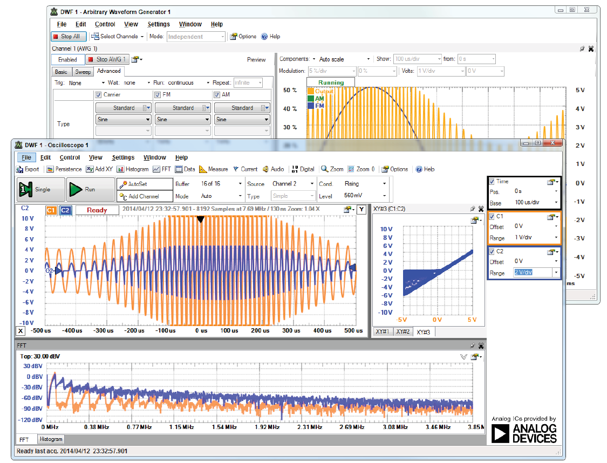

Рисунок 4-1: застосунок Waveforms генерує сигнал і відображає відгук фізичного електричного кола

Примітка. Відео, яке я створив про використання Analog Discovery, доступне на вебсторінці цього розділу: [www.exploringrpi.com/chapter4](http://www.exploringrpi.com/chapter4). У ньому продемонстровано три різні вимірювальні застосування Analog Discovery: аналоговий аналіз випрямного діода; використання цифрового генератора шаблонів і логічного аналізатора для дослідження поведінки JK-тригера; а також використання логічного аналізатора з інтерпретатором I2C для підключення до шини I2C плати BeagleBone Black і аналізу її роботи. Виконаний аналіз був би ідентичним і для платформи Raspberry Pi.

Analog Discovery використовується для формування всіх осцилограм, наведених у цій книзі, оскільки всі приклади реалізовані з використанням реальних електричних кіл. Прилад обмежений двома каналами з частотою до 5 МГц на канал і швидкістю дискретизації 50 мільйонів відліків за секунду як для генератора форм сигналів, так і для диференційного осцилографа. У зв’язку з цим Analog Discovery насамперед орієнтований на студентів і тих, хто навчається; водночас він може бути корисним і для визначення набору «обов’язкових» характеристик майбутнього, більш дорогого вимірювального обладнання.

Існують також альтернативні USB-осцилографи зі змішаними сигналами, наприклад PicoScope, ціна яких коливається приблизно від 160 до 10 000 дол. США ([www.picotech.com](http://www.picotech.com/)), а також BitScope DSO в діапазоні від 150 до 1000 дол. США ([www.bitscope.com](http://www.bitscope.com/)), який має підтримку Linux. Втім, з огляду на поточний набір можливостей USB-осцилографів, у деяких випадках настільний осцилограф у поєднанні з USB-логічним аналізатором (для забезпечення змішаного режиму роботи, наприклад логічним аналізатором Saleae, [www.saleae.com](http://www.saleae.com/)) може забезпечити найкраще співвідношення можливостей і вартості.

Примітка. BitScope Micro (приблизно 145 дол. США) є спеціальною версією BitScope, розробленою саме для Raspberry Pi. Подібно до Analog Discovery, це двоканальний осцилограф (20 МГц), логічний аналізатор (6 каналів) і спектральний аналізатор. BitScope Micro призначений для безпосереднього підключення до Raspberry Pi і може використовуватися для створення автономної або мережевої платформи вимірювання та збору даних. Крім того, він містить програмні бібліотеки, які можна використовувати для розроблення власних застосунків збору даних. Докладніше див. bitscope.com/pi/.

## Основні принципи електричних кіл

Електронні кола містять поєднання компонентів, які можна класифікувати як пасивні або активні. Активні компоненти, наприклад транзистори, здатні керувати потоком струму в адаптивний спосіб, тоді як пасивні компоненти цього не роблять (наприклад, резистори, конденсатори, діоди). Основна складність під час побудови електричних кіл полягає в проєктуванні відповідної конфігурації потрібних компонентів. На щастя, для цього існують рівняння аналізу електричних кіл, які допомагають у проєктуванні.

### Напруга, струм, опір і закон Ома

Найважливішим рівнянням, яке необхідно розуміти, є закон Ома. Він формулюється дуже просто:

$$
V = I \cdot R
$$

де:

- Напруга $V$, що вимірюється у вольтах (В), є різницею потенціальної енергії, яка змушує електричний струм протікати в електричному колі. Для уявлення напруги зручно використовувати водяну аналогію: у багатьох будинках на горищі є бак з водою, з’єднаний із кранами. Вода тече, коли кран відкривають, завдяки висоті бака та дії сили тяжіння. Якби кран знаходився на тій самій висоті, що й верх баку, вода не текла б, оскільки не було б потенціальної енергії. Напруга поводиться подібним чином: коли напруга з одного боку компонента, наприклад резистора, більша, ніж з іншого, через компонент може протікати електричний струм.

- Струм $I$, що вимірюється в амперах (А), є потоком електричного заряду. Продовжуючи водяну аналогію, струм відповідає потоку води з бака з вищим потенціалом до крана з нижчим потенціалом. Варто пам’ятати, що сам кран також має певний потенціал, і вода витікатиме в злив раковини, якщо тільки вона не знаходиться на рівні землі (GND). Для розуміння масштабів струму: під час побудови кіл для взаємодії з GPIO Raspberry Pi зазвичай джерело або стік струму становить лише близько $3\ {mA}$, де міліампер є тисячною частиною ампера.

- Опір $R$, що вимірюється в омах ($\Omega$), перешкоджає протіканню заряду. Резистор є компонентом, який зменшує струм у колі за рахунок розсіювання потужності. Це відбувається лінійно, причому потужність, що розсіюється у ватах (Вт, W), визначається як: $P = V \cdot I$  або, з урахуванням закону Ома: $P = I^2 R =  \frac{V^2}{R}$. Потужність розсіюється у вигляді тепла, і всі резистори мають максимально допустиме значення розсіюваної потужності. Типові металоплівкові або вугільні резистори зазвичай розсіюють від $0.125 \ Вт$ до $1 \ Вт$, а вартість різко зростає, якщо необхідно перевищити значення $3 \ Вт$. Завершуючи водяну аналогію, опір можна уявити як тертя між водою та трубою, яке призводить до нагрівання і зменшення потоку води. Опір можна збільшити, підвищуючи площу поверхні, з якою контактує вода, зберігаючи при цьому поперечний переріз труби (наприклад, розміщуючи тонкі трубки всередині основної труби).

Як приклад, уявімо, що потрібно підібрати резистор, який обмежує струм до $100 \ мА$ при використанні джерела живлення $5 \ В$, як показано на рисунку 4-2(a). Який резистор слід вибрати? Напруга, що падає на резисторі $V_R$, повинна дорівнювати $5\ В$, оскільки він є єдиним компонентом у колі. Оскільки
$$
V_R = I_R \cdot R
$$
то отримаємо:
$$
R = \frac{V_R}{I_R}
$$

$$
R = \frac{5 \ В}{100 \ мА} = 50 \ Ом
$$

Потужність, що розсіюється цим резистором, можна обчислити за будь-якою з загальних формул:
$$
P = V \cdot I = I^2 R = \frac{V^2}{R} = 0.5 \ Вт
$$
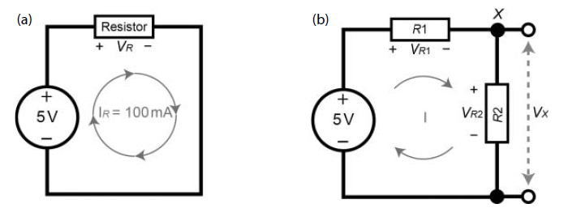

Рисунок 4-2: (a) приклад електричного кола за законом Ома; (b) приклад подільника напруги

Придбання одного вивідного металоплівкового резистора з фіксованим номіналом і допуском 1 % (точність) коштує приблизно 0.10 дол. США для резистора з розсіюваною потужністю 0.33 Вт і близько 0.45 дол. США для резистора з потужністю 1 Вт. Під час використання резисторів у електричних колах слід уважно ставитися до їх допустимої потужності, оскільки резистори з недостатнім запасом по потужності можуть виходити з ладу. Резистор на 30 Вт коштуватиме близько 2.50 дол. США і може сильно нагріватися — не всі резистори однакові.

Попередження. Чому є поганою практикою з’єднувати позитивний вивід джерела напруги з негативним без резистора? Така ситуація називається коротким замиканням і є найшвидшим способом пошкодити чутливий пристрій, наприклад Raspberry Pi. З’єднувальний провід за своєю природою є добрим провідником і має дуже малий опір. Бухта з’єднувального проводу довжиною 100 м (328 футів) і діаметром 0.6 мм (0.023”) має сумарний опір приблизно $5 \ \Omega$. Отже, підключення відрізка з’єднувального проводу довжиною 6 дюймів між джерелом $3.3 \ В$ Raspberry Pi та його виводом GND теоретично призвело б до струму

$$
I = \frac{V}{R} = \frac{3.3 \ В}{0.0076 \ \Omega} \approx 433 \ А
$$

На практиці цього не відбудеться, однак доступний максимальний струм із великою ймовірністю пошкодив би Raspberry Pi. Також слід пам’ятати, що світлодіоди не мають фіксованого внутрішнього опору, тому при прямому зміщенні вони поводяться подібно до короткого замикання. Саме з цієї причини світлодіоди майже завжди потребують резисторів для обмеження струму.

### Поділ напруги

Якщо електричне коло на рисунку 4-2(a) модифікувати, додавши ще один резистор послідовно, як показано на рисунку 4-2(b), який вплив це матиме на коло?

- Оскільки один резистор підключений після іншого (тобто вони з’єднані послідовно), повний опір, через який повинен протікати струм у колі, дорівнює сумі двох значень:
  $$
  R_T = R_1 + R_2
  $$

- Напруга джерела повинна розподілитися між двома резисторами, тому можна записати:
  $$
  V_{supply} = V_{R1} + V_{R2}
  $$
  Напруга, що падає на кожному резисторі, є обернено пропорційною до його опору. Таке коло називається подільником напруги.

Припустімо, що потрібно аналітично обчислити значення напруги в точці X на рисунку 4-2(b), якщо $R_1 = 25 \ \Omega$ і $R_2 = 75 \ \Omega$. Повний опір у колі становить $ R_T = 25 + 75 = 100 \ \Omega $ а загальне падіння напруги на резисторах має дорівнювати $5 \ В$. Отже, відповідно до закону Ома, струм, що протікає в колі, дорівнює $ I = \frac{V}{R} = \frac{5 \ В}{100 \ \Omega} = 50 \ мА $ . Якщо опір $R_1$ становить $25 \ \Omega$, тоді падіння напруги на ньому дорівнює $ V_{R1} = I \cdot R = 0.05 \ А \cdot 25 \ \Omega = 1.25 \ В $
а падіння напруги на $R_2$ дорівнює $ V_{R2} = I \cdot R = 0.05 \ А \cdot 75 \ \Omega = 3.75 \ В $ . Можна бачити, що сума цих напруг дорівнює $5 \ В$, що відповідає закону напруг Кірхгофа, згідно з яким сума падінь напруг у послідовному колі дорівнює прикладеній напрузі джерела.

Щоб повністю відповісти на запитання: у цьому колі $1.25 \ В$ падає на $R_1$, а $3.75 \ В$ — на $R_2$. Якою ж є напруга в точці X? Щоб це визначити, необхідно вимірювати напругу в точці X відносно деякої іншої точки. Якщо вимірювати X відносно негативного виводу джерела, то напруга $V_X$ на рисунку 4-2(b) дорівнює падінню напруги на $R_2$, тобто $3.75 \ В$. Однак так само коректно поставити запитання: «Яка напруга в точці X відносно позитивного виводу джерела?» У цьому випадку вона дорівнюватиме від’ємному значенню падіння напруги на $R_1$ (оскільки X має $3.75 \ В$ відносно негативного виводу, а позитивний вивід має $+5 \ В$ відносно негативного). Отже, напруга в точці X відносно позитивного виводу джерела дорівнює $-1.25 \ В$.

Для обчислення значення $V_X$ на рисунку 4-2(b) правило подільника напруги можна узагальнити таким чином:

$$
V_X = V \frac{R_2}{R_1 + R_2}
$$

Це правило дозволяє визначити напругу $V_X$, однак на практиці така конфігурація має суттєві обмеження, оскільки коло, до якого підключається ця напруга $V_X$, майже напевно матиме власний опір (або навантаження). Це змінює характеристики подільника напруги і, відповідно, значення $V_X$. Проте в більшості випадків після подільників напруги використовуються вхідні кола з дуже високим вхідним опором, тому вплив навантаження на $V_X$ є мінімальним.

На рисунку 4-3(a) показано змінний резистор, або потенціометр, а також пов’язане з ним коло, у якому він використовується як автономний подільник напруги. Опір між виводами 1 і 3 є фіксованим значенням — $10 \ к\Omega$ у випадку багатообертового потенціометра; водночас опір між виводом 3 і повзунком (вивід 2) змінюється в межах від $0 \ \Omega$ до $10 \ к\Omega$. Отже, якщо опір між виводами 2 і 3 дорівнює $2 \ к\Omega$, то опір між виводами 1 і 2 становитиме $10 \ к\Omega - 2 \ к\Omega = 8 \ к\Omega$. У такому випадку вихідна напруга $V_{out}$ дорівнюватиме $1 \ В$ і може змінюватися в діапазоні від $0 \ В$ до $5 \ В$ шляхом обертання маленького гвинта потенціометра за допомогою регулювального інструмента або викрутки.

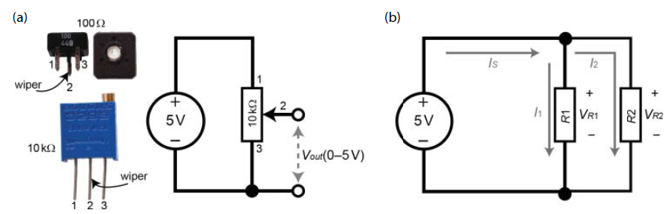

Рисунок 4-3: (a) потенціометри та використання змінного джерела напруги; (b) приклад подільника струму

### Поділ струму

Якщо електричне коло модифікувати, як показано на рисунку 4-3(b), підключивши два резистори паралельно, отримаємо коло подільника струму. Струм прямує шляхом найменшого опору, тому якщо $R_1 = 100 \ \Omega$ і $R_2 = 200 \ \Omega$, то більша частка струму протікатиме через $R_1$. Якою ж є ця пропорція? У цьому випадку падіння напруги на $R_1$ і $R_2$ в обох гілках однакове і становить $5 \ В$. Отже, струм $I_1$ дорівнює

$$
I_1 = \frac{V}{R} = \frac{5 \ В}{100 \ \Omega} = 50 \ мА
$$

а струм $I_2$ дорівнює

$$
I_2 = \frac{5 \ В}{200 \ \Omega} = 25 \ мА
$$

Таким чином, через резистор $100 \ \Omega$ протікає вдвічі більший струм, ніж через резистор $200 \ \Omega$. Очевидно, що струм віддає перевагу шляху з меншим опором.

Закон струмів Кірхгофа стверджує, що сума струмів, які входять у вузол, дорівнює сумі струмів, що виходять із цього вузла. Це означає, що

$$
I_S = I_1 + I_2 = 25 \ мА + 50 \ мА = 75 \ мА
$$

Правило подільника струму в загальному вигляді можна записати так:

$$
I_1 = I \frac{R_2}{R_1 + R_2}, \quad I_2 = I \frac{R_1}{R_1 + R_2}
$$

Однак для цього необхідно знати значення струму $I$ (у цьому випадку $I_S$), який входить у вузол. Щоб безпосередньо обчислити $I_S$, потрібно визначити еквівалентний опір $R_T$ двох паралельно з’єднаних резисторів, який задається як

$$
\frac{1}{R_T} = \frac{1}{R_1} + \frac{1}{R_2}, \quad \text{або} \quad R_T = \frac{R_1 R_2}{R_1 + R_2}
$$

Для кола на рисунку 4-3(b) це дає $R_T = 66.66 \ \Omega$; отже,

$$
I_S = \frac{V}{R} = \frac{5 \ В}{66.66 \ \Omega} = 75 \ мА
$$

що узгоджується з початковими обчисленнями.

Потужність, яку віддає джерело живлення, становить

$$
P = V I = 5 \ В \cdot 0.075 \ А = 0.375 \ Вт
$$

Це значення має дорівнювати сумі потужностей, що розсіюються резисторами:

$$
P_{R1} = \frac{V^2}{R} = \frac{5^2}{100} = 0.25 \ Вт, \quad
P_{R2} = \frac{V^2}{R} = \frac{5^2}{200} = 0.125 \ Вт
$$

що в сумі дає $0.375 \ Вт$, підтверджуючи виконання закону збереження енергії!

### Реалізація електричних кіл Raspberry Pi на макетній платі

Макетна плата є дуже зручною платформою для прототипування електричних кіл і чудово підходить для роботи з Raspberry Pi. На рисунку 4-4 показано макетну плату та пояснено, як можна використовувати дві горизонтальні шини живлення для подачі напруги $3.3 \ В$ і $5 \ В$. Роз’єм GPIO Raspberry Pi складається з штифтових (male) контактів, а це означає, що для безпосереднього з’єднання зазвичай потрібні відносно дорогі з’єднувальні дроти з гніздовими (female) роз’ємами. Плати-розширення GPIO для Raspberry Pi (наприклад, Adafruit Pi T-Cobbler Plus), як показано на рисунку 4-4, широко доступні для роботи з макетними платами. Вони розв’язують проблему підключення до штифтового роз’єму Raspberry Pi за допомогою гніздових з’єднувальних кабелів, забезпечують дуже стабільне з’єднання та дозволяють використовувати недорогий монтажний провід для побудови електричних кіл. Під час підключення кабелю плати-розширення GPIO до Raspberry Pi слід бути особливо уважним, оскільки роз’єм не має ключа і може бути підключений у зворотному напрямку.

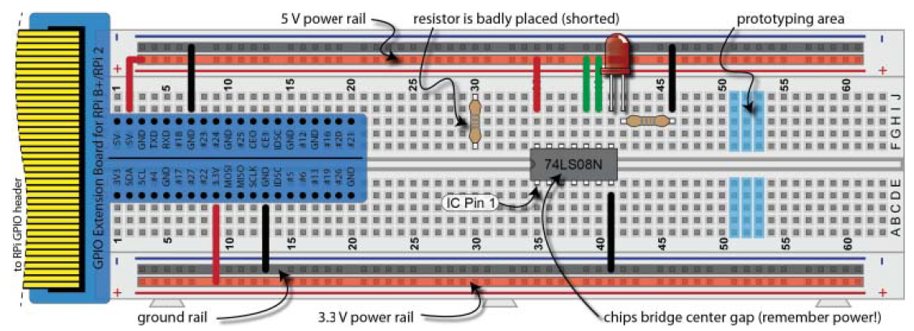

Рисунок 4-4: макетна плата з платою-розширення GPIO для Raspberry Pi та мікросхемою 7408 (чотири логічні елементи І з двома входами)

Якісна макетна плата, подібна до показаної на рисунку 4-4 (830 точок з’єднання), коштує приблизно від 6 до 10 дол. США. Великі макетні плати (3220 точок з’єднання) доступні приблизно за 20 дол. США. Нижче наведено кілька порад щодо використання макетних плат:

- За можливості розміщуйте вивід 1 (Pin 1) мікросхем у нижньому лівому куті, щоб полегшити налагодження електричних кіл. Перед тим як натискати і фіксувати мікросхему в платі, завжди акуратно вирівнюйте її виводи з отворами макетної плати. Також пам’ятайте, що мікросхемам потрібне живлення.
- Залишений непідключеним провід — це не те саме, що підключення до GND (це розглядається далі в цьому розділі).
- Для акуратного виймання мікросхем із макетної плати використовуйте плоску викрутку, повільно підважуючи мікросхему з обох боків, щоб не погнути її виводи.
- Слідкуйте, щоб не з’єднувати резистори та інші компоненти помилково, вставляючи два їхні виводи в одну й ту саму вертикальну шину. Також перед встановленням у плату обрізайте довгі виводи резисторів, оскільки вони можуть випадково торкатися один одного і ускладнювати налагодження кола.
- Кнопки миттєвої дії зазвичай мають чотири виводи, з’єднані у дві пари; переконайтеся, що ви орієнтуєте їх правильно (використовуйте режим перевірки цілісності мультиметра).
- Канцелярські скріпки чудово підходять для створення перемичок.
- Деякі макетні плати мають розрив у шинах живлення; за потреби цей розрив слід з’єднати перемичкою.
- Макетні плати зазвичай мають крок $0.1$ дюйми між точками з’єднання, що відповідає $2.54 \ мм$ у метричній системі. Намагайтеся купувати всі компоненти та роз’єми з таким самим кроком. Для мікросхем обирайте корпуси DIP або PDIP (код мікросхеми закінчується літерою N), а для інших компонентів — виконання з виводами для монтажу в отвори.
- Використовуйте колір монтажного проводу зі змістом, наприклад червоний для $5 \ В$ і чорний для GND; це суттєво допомагає під час налагодження електричних кіл. Суцільний провід 22 AWG є ідеальним монтажним проводом і доступний з ізоляцією різних кольорів. Готові з’єднувальні дроти також існують, однак довгі дроти призводять до неохайних схем. Набір монтажних проводів різних кольорів і якісний інструмент для зняття ізоляції дозволяють створювати найбільш акуратні та стабільні макетні компонування.

#### Приклад: виготовлення власних кабелів для роз’єму GPIO Raspberry Pi

Як альтернативу використанню плат-розширень GPIO або готових з’єднувальних дротів з обтиснутими гніздовими контактами можна виготовляти власні кабелі для роз’єму DuPont на платі Raspberry Pi. Власноруч виготовлені кабелі дозволяють отримати надійні з’єднання, придатні для встановлення в готові прототипи, підібрати потрібну довжину кабелю, сформувати зручний напрямок виведення сигналів, а також комбінувати гніздові та штирьові роз’єми на кінцях кабелю. На рисунку 4-5(a) показано саморобний роз’єм, підключений до GPIO Raspberry Pi. На рисунку 4-5(b) наведено типовий недорогий інструмент для обтискання контактів (20–35 дол. США). Відео, присвячене цій темі, доступне на вебсторінці цього розділу, а також за посиланням tiny.cc/erpi401.

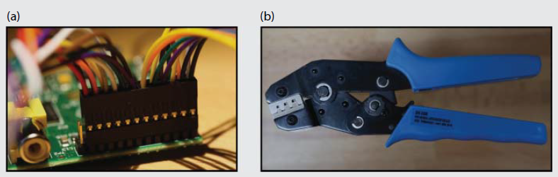

Рисунок 4-5: (a) саморобний роз’єм, підключений до Raspberry Pi (модель B); (b) недорогий інструмент для обтискання контактів

### Цифрові мультиметри (DMM) і макетні плати

Вимірювання напруги, струму та опору є досить простим, якщо дотримуватися кількох правил (див. рисунок 4-6):

- Напруга постійного струму (DCV) вимірюється паралельно компоненту, тобто безпосередньо на його виводах, між якими спостерігається падіння напруги. Чорний щуп мультиметра при цьому має бути підключений до входу COM (загальний).
- Струм постійного струму (DCA) вимірюється послідовно, тому необхідно «розірвати» з’єднання в електричному колі та підключити мультиметр так, ніби він є послідовно ввімкненим компонентом у тій ділянці кола, де вимірюється струм. Використовуйте чорний щуп у вході COM і червоний щуп у вході μA/mA (або еквівалентному). Не використовуйте незахищений запобіжником вхід на 10 А.
- Опір зазвичай не можна коректно виміряти безпосередньо в колі, оскільки інші резистори або компоненти створюватимуть паралельні або послідовні навантаження, що спотворюють результат. Компонент слід ізолювати, підключити червоний щуп мультиметра до входу VΩ і встановити режим вимірювання опору Ω. Режим перевірки цілісності можна з певною обережністю використовувати безпосередньо в колі, за умови що воно знеструмлене.

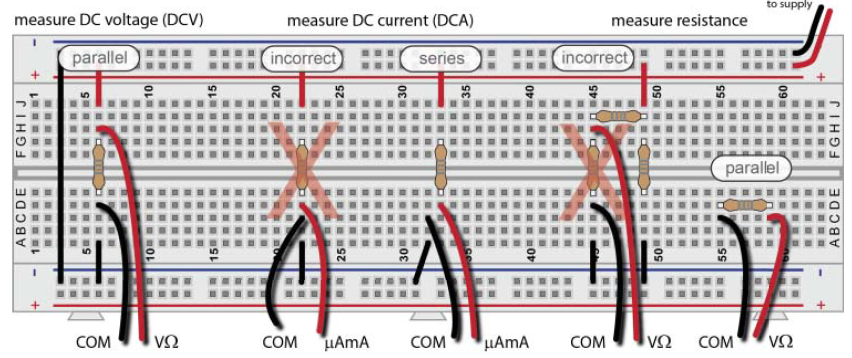

Рисунок 4-6: вимірювання напруги, струму та опору

Якщо цифровий мультиметр відмовляється працювати, можливо, перегорів його внутрішній запобіжник. Від’єднайте щупи мультиметра і відкрийте корпус, щоб знайти невеликий скляний запобіжник. Якщо у вас є другий мультиметр, можна виконати перевірку цілісності, щоб визначити, чи справний запобіжник. Замінюйте його на запобіжник з таким самим номіналом (або на PTC-запобіжник), але не на мережевий запобіжник.

Попередження. Вимірювання струму шляхом безпосереднього підключення мультиметра паралельно до джерела напруги (навіть до батареї $9 \ В$) без навантаження є найшвидшим способом спалити запобіжник мультиметра, оскільки більшість із них розраховані приблизно на $200 \ мА$. Перед вимірюванням напруги завжди перевіряйте, що щуп підключений до входу VΩ.

### Приклад електричного кола: стабілізація напруги

Тепер, після ознайомлення з основними принципами, у цьому підрозділі розглядається більш складне електричне коло, а в наступних підрозділах його компоненти аналізуються детальніше. Не збирайте електричне коло, описане в цьому підрозділі; воно наведене лише як приклад для введення поняття взаємопов’язаних компонентів.

Стабілізатор напруги є складним за внутрішньою будовою, але простим у використанні пристроєм, який приймає змінну вхідну напругу і видає стабільну вихідну напругу, майже незалежно від підключеного навантаження, причому на рівні, нижчому за вхідну напругу. Стабілізатор підтримує вихідну напругу в межах заданого допуску, запобігаючи тому, щоб коливання напруги пошкодили підключені електронні пристрої.

Моделі Raspberry Pi B+ та Raspberry Pi 2/3 мають подвійний високоефективний понижувальний DC–DC перетворювач на основі ШІМ (PAM2306 у вузлі U3), який може забезпечувати різні фіксовані рівні напруги для бортових пристроїв, а також має захист від короткого замикання. Наприклад, доступні виходи $5 \ В$, $3.3 \ В$ та $1.8 \ В$. Виходи $5 \ В$ і $3.3 \ В$ можна використовувати як джерела живлення на роз’ємі GPIO Raspberry Pi для живлення зовнішніх електричних кіл, але лише в межах певних обмежень за струмом. Raspberry Pi може забезпечити до $200–300 \ мА$ на виводах $5 \ В$ (виводи 2 і 4) та приблизно $50 \ мА$ на виводах $3.3 \ В$ (виводи 1 і 17).

Якщо потрібно споживати більші струми, наприклад для керування електродвигунами, може виникнути потреба у використанні окремих стабілізаторів напруги, подібних до показаного на рисунку 4-7. Таке електричне коло можна зібрати безпосередньо на макетній платі або придбати готовий модуль типу «breadboard power supply stick 5 V/3.3 V» від SparkFun приблизно за 15 дол. США.

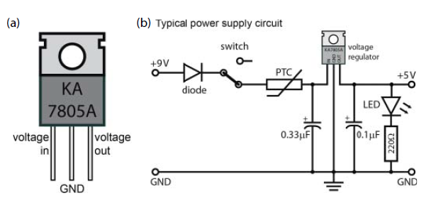

Рисунок 4-7: стабілізатор напруги KA7805A/LM7805 та приклад кола стабілізації

Як показано на рисунку 4-7, вивід зліва на стабілізаторі є входом живлення. За струму навантаження $500 \ мА$ стабілізатор напруги KA7805/LM7805 приймає вхідну напругу в діапазоні від $8 \ В$ до $20 \ В$ і формує на виході (праворуч) напругу в межах від $4.8 \ В$ до $5.2 \ В$. Середній вивід повинен бути підключений до шини землі. Алюмінієва пластина на задній частині стабілізатора призначена для відведення тепла. Отвір у корпусі дозволяє закріпити радіатор, що дає змогу працювати з більшими вихідними струмами — до $1 \ А$.

Мінімальна вхідна напруга, необхідна для роботи стабілізатора KA7805/LM7805, становить приблизно $8 \ В$. Якщо напруга джерела є нижчою, можна використати стабілізатор з малим падінням напруги (LDO), який для формування $5 \ В$ може потребувати живлення на рівні близько $6 \ В$. Реалізаційне коло на рисунку 4-7 містить такі додаткові компоненти, що дозволяють отримати стабільне та чисте джерело $5 \ В$, $1 \ А$:

- Діод забезпечує захист кола у разі помилкового підключення джерела живлення з неправильною полярністю (наприклад, коли $9 \ В$ і GND випадково переплутані місцями). Такі діоди, як 1N4001 (на струм $1 \ А$), є дуже дешевими, проте їхнім недоліком є невелике пряме падіння напруги (приблизно $1 \ В$ при $1 \ А$) перед стабілізатором.

- Вимикач може використовуватися для вмикання та вимикання живлення кола. Повзунковий вимикач дозволяє залишати коло постійно увімкненим.

- Самовідновлюваний запобіжник з позитивним температурним коефіцієнтом (PTC) є дуже корисним для захисту від аварійних струмів, наприклад при випадковому короткому замиканні або відмові компонента. PTC пропускає робочий струм із дуже малим опором (близько $0.25 \ \Omega$), але після перевищення струму спрацювання його опір різко зростає, і він поводиться подібно до автоматичного вимикача. Після зняття живлення PTC охолоджується (протягом кількох секунд) і повертається до початкових характеристик. У цьому колі доречним є запобіжник типу 60R110 або еквівалентний Polyfuse, який має струм утримання $1.1 \ А$ і струм спрацювання $2.2 \ А$ при максимальній напрузі $60 \ В$ постійного струму.

- Конденсатор $0.33 \ \mu\text{Ф}$ встановлюється з боку входу стабілізатора, а конденсатор $0.1 \ \mu\text{Ф}$ — з боку виходу. Саме ці значення рекомендовані в технічній документації для зменшення шумів і пульсацій напруги живлення. Конденсатори розглядаються далі в цьому розділі.

- Світлодіод разом із відповідним резистором обмеження струму використовується як індикатор, що наочно показує наявність живлення.

Примітка. Існують два основні способи позначення напрямку протікання струму. Перший — це електронний струм, тобто потік негативного заряду. Другий — умовний напрямок струму, який є протилежним і відповідає потоку позитивного заряду; саме він використовується у всіх позначеннях напівпровідникових елементів. У цій книзі для опису напрямку струму використовується умовний напрямок струму.

## Дискретні компоненти

У попередньому прикладі електричного кола для побудови автономного джерела живлення було використано низку дискретних компонентів. У цьому підрозділі типи компонентів, з яких складається таке коло живлення, розглядаються детальніше. Ці компоненти можуть застосовуватися в багатьох різних схемних рішеннях, і важливо обговорити їх саме зараз, оскільки значна їх частина використовується під час проєктування електричних кіл, що взаємодіють із входами та виходами Raspberry Pi у розділі 6.

### Діоди

Простими словами, діод — це дискретний напівпровідниковий компонент, який дозволяє протіканню струму в одному напрямку і блокує його в протилежному. Як випливає з назви, напівпровідник не є ані провідником, ані ізолятором. Кремній є напівпровідниковим матеріалом, але він набуває значно цікавіших властивостей після легування домішками, наприклад фосфором. Таке негативне (n-типу) легування призводить до появи слабко зв’язаного електрона у валентній зоні. Можливе також позитивне легування (p-типу), за якого у валентній зоні утворюється «дірка», наприклад за рахунок домішок бору. Коли невеликий об’єм кремнію p-типу з’єднується з кремнієм n-типу, утворюється p–n-перехід — діод. Вільні електрони з валентної зони кремнію n-типу переходять у кремній p-типу, утворюючи збіднений шар і потенціальний бар’єр напруги, який необхідно подолати, щоб струм міг протікати.

Коли діод зміщений у прямому напрямку, він дозволяє протікання струму; коли ж він зміщений у зворотному напрямку, струм через нього не протікає. Діод перебуває у прямому зміщенні, коли напруга на аноді (позитивний вивід) є більшою, ніж напруга на катоді (негативний вивід). Водночас величина прикладеної напруги має перевищувати потенціальний бар’єр збідненого шару (порогову, або «колінну», напругу), перш ніж струм почне протікати. Для кремнієвого діода це значення зазвичай знаходиться в межах від $0.5 \ В$ до $0.7 \ В$. Якщо діод зміщений у зворотному напрямку, тобто на катод подано більшу напругу, ніж на анод, то струм практично не протікає (порядку $1 \ нА$). Проте зі збільшенням зворотної напруги зрештою настає пробій діода, і струм починає протікати у зворотному напрямку. Якщо струм при цьому є малим, діод не буде пошкоджений. Більше того, існує спеціальний тип діодів — стабілітрони (діоди Зенера), які спеціально призначені для роботи в області пробою і можуть бути налаштовані так, щоб поводитися подібно до стабілізатора напруги.

1N4001 — це недорогий кремнієвий діод, який можна використати в простому електричному колі (див. рисунок 4-8) для демонстрації принципів роботи та поведінки діодів. Діод 1N4001 має пікову зворотну напругу пробою $50 \ В$. У цьому колі до входу подається синусоїдальний сигнал, який змінюється від $+5 \ В$ до $-5 \ В$, за допомогою генератора форм сигналів Analog Discovery. Коли вхідна напруга $V_{in}$ є додатною і перевищує порогову напругу, струм починає протікати, і на навантажувальному резисторі виникає падіння напруги $V_{load}$, яке є трохи меншим за $V_{in}$. На самому діоді присутнє невелике падіння напруги $V_d$, і з осцилографічних вимірювань видно, що воно становить приблизно $0.67 \ В$, що цілком відповідає очікуваному діапазону для кремнієвого діода.

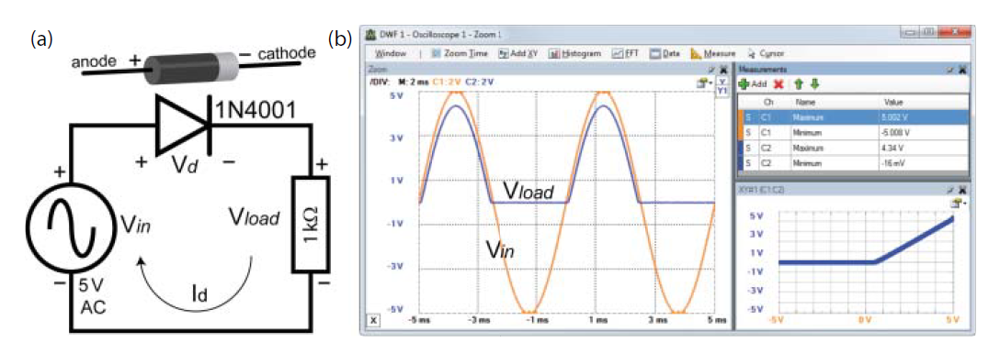

Рисунок 4-8: електричне коло та поведінка діода 1N4001 при живленні змінною напругою $5 \ В$ і навантажувальному резисторі $1 \ к\Omega$

Діод використовується в електричному колі на рисунку 4-7 як елемент захисту від зворотної полярності. З графіка на рисунку 4-8 добре видно, чому такий захист є ефективним: коли вхідна напруга $V_{in}$ є від’ємною, напруга на навантаженні $V_{load}$ дорівнює нулю. Це пояснюється тим, що струм не може протікати через діод у разі його зворотного зміщення. Якби прикладена напруга перевищила напругу пробою діода, струм почав би протікати, однак для діода 1N4001 напруга пробою становить $50 \ В$, тому в цьому випадку це неможливо.

Зверніть увагу, що в правому нижньому куті рисунка 4-8 наведено XY-графік залежності вихідної напруги (вісь $y$) від вхідної напруги (вісь $x$). Можна побачити, що для від’ємної вхідної напруги вихідна напруга дорівнює нулю, але після досягнення порогової напруги (близько $0.67 \ В$) вихідна напруга зростає лінійно разом зі збільшенням вхідної напруги.

Таке електричне коло називається однопівперіодним випрямлячем. Можливо також з’єднати чотири діоди за мостовою схемою, щоб отримати двопівперіодний випрямляч.

### Світлодіоди (LED)

Світлодіод (LED) — це напівпровідникове джерело світла, яке часто використовується як індикатор стану в пристроях різного призначення. Сьогодні потужні світлодіоди застосовуються в автомобільному освітленні, у підсвічуванні телевізорів і навіть як заміна ламп розжарювання для загального освітлення (наприклад, у побуті, світлофорах тощо), головним чином завдяки їх довговічності та надзвичайно високій ефективності перетворення електричної енергії на світлове випромінювання. Світлодіоди надають дуже корисну інформацію про стан і процес налагодження електричного кола, часто використовуючись для індикації істинного або хибного стану.

Як і звичайні діоди, світлодіоди є поляризованими компонентами. Умовне позначення світлодіода показано на рисунку 4-9. Щоб світлодіод світився, він повинен бути зміщений у прямому напрямку, тобто анод (+) має бути підключений до більш позитивного потенціалу, ніж катод (−). Наприклад, анод можна підключити до $+3.3 \ В$, а катод — до GND; водночас такий самий ефект було б досягнуто, якби анод підключили до $0 \ В$, а катод — до $-3.3 \ В$.

На рисунку 4-9 показано світлодіод, у якого один вивід довший за інший. Довший вивід є анодом (+), а коротший — катодом (−). Пластиковий корпус світлодіода також має пласку грань, яка позначає катод (−). Ця ознака особливо корисна, коли світлодіод уже встановлений у електричному колі і його виводи обрізані.

Рисунок 4-9: приклад світлодіода та електричне коло для керування світлодіодом із відповідними рівнями струму та напруги

Світлодіоди мають певні робочі вимоги, які визначаються прямою напругою та прямим струмом. Кожен світлодіод є індивідуальним, тому для визначення цих параметрів необхідно звертатися до його технічної документації. Світлодіод не має суттєвого внутрішнього опору, тому якщо підключити його безпосередньо до джерела $3.3 \ В$ Raspberry Pi, світлодіод поводитиметься подібно до короткого замикання. У такому випадку через нього протікатиме дуже великий струм, що призведе до його пошкодження, а що важливіше — до пошкодження Raspberry Pi. Тому для роботи світлодіода в допустимих режимах необхідно використовувати послідовний резистор, який називається резистором обмеження струму. Значення цього резистора слід підбирати обережно, щоб досягти максимальної яскравості світлодіода і водночас захистити електричне коло.

Попередження. Не підключайте світлодіоди безпосередньо до виводів GPIO Raspberry Pi без використання резисторів обмеження струму та/або транзисторного комутаційного елемента, оскільки це з великою ймовірністю призведе до пошкодження плати. Максимальний струм, який Raspberry Pi повинен віддавати або приймати через один вивід GPIO, слід обмежувати приблизно значенням $2–3 \ мА$.

Звертаючись до рисунка 4-9, якщо живлення світлодіода здійснюється від джерела $3.3 \ В$ Raspberry Pi і потрібно забезпечити падіння прямої напруги на світлодіоді $1.3 \ В$, то різниця напруги $2 \ В$ має падати на резисторі обмеження струму. Згідно з вимогами світлодіода, струм необхідно обмежити значенням $9 \ мА$, тому номінал резистора обчислюється так:

$$
R = \frac{V}{I} = \frac{2 \ В}{0.009 \ А} = 222 \ \Omega
$$

Отже, електричне коло для увімкнення світлодіода має вигляд, показаний на рисунку 4-9. У ньому резистор $220 \ \Omega$ увімкнений послідовно зі світлодіодом. Комбінація джерела $3.3 \ В$ і цього резистора забезпечує протікання струму $9 \ мА$ через світлодіод у прямому напрямку. За такого струму на резисторі падає $2 \ В$, а відповідно на світлодіоді — $1.3 \ В$. Слід зауважити, що такий струм є допустимим при живленні від виходу $3.3 \ В$ Raspberry Pi, але є неприйнятним для безпосереднього підключення до виводів GPIO, оскільки реалістичний максимальний струм, який Raspberry Pi може віддавати з одного виводу GPIO, становить лише близько $2–3 \ мА$. Рішення цієї проблеми буде розглянуто далі, а також у розділі 6.

Також варто зазначити, що затемнення світлодіодів не слід виконувати шляхом зменшення напруги на світлодіоді. Світлодіод слід розглядати як пристрій, керований струмом: саме протікання струму визначає падіння прямої напруги. Тому керування світлодіодом за допомогою змінної напруги не працює так, як можна було б очікувати. Для зменшення яскравості світлодіода доцільно використовувати сигнал з широтно-імпульсною модуляцією (PWM), тобто швидко вмикати та вимикати світлодіод. Наприклад, якщо до світлодіода подати швидкий PWM-сигнал, який половину часу перебуває у вимкненому стані, а половину — у ввімкненому, світлодіод сприйматиметься як такий, що світить приблизно з половиною своєї номінальної яскравості. Наш зір не сприймає окремі швидкі перемикання, а усереднює інтервали світла і темряви, формуючи відчуття постійного, але тьмянішого світла.

На рисунку 4-10 показано прямокутний PWM-сигнал з різними коефіцієнтами заповнення. Коефіцієнт заповнення — це відсоток часу, протягом якого сигнал перебуває у високому рівні, відносно часу, коли він перебуває у низькому рівні. У цьому прикладі високий рівень відповідає напрузі $3.3 \ В$, а низький — напрузі $0 \ В$. Коефіцієнт заповнення $0 %$ означає, що сигнал постійно перебуває у низькому рівні, а коефіцієнт заповнення $100 %$ означає, що сигнал постійно перебуває у високому рівні.

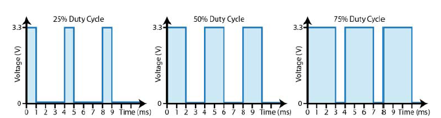

Рисунок 4-10: коефіцієнти заповнення сигналів широтно-імпульсної модуляції (PWM)

Широтно-імпульсна модуляція може використовуватися для керування рівнем яскравості світлодіодів, але також широко застосовується для керування швидкістю двигунів постійного струму, положенням сервоприводів та в багатьох інших задачах. Приклад такого використання буде розглянуто в розділі 6, де застосовується вбудована функціональність PWM Raspberry Pi.

Період $T$ повторюваного сигналу (періодичного сигналу) — це час, необхідний для завершення одного повного циклу. У прикладі на рисунку 4-10 період сигналу в усіх трьох випадках становить $4 \ мс$. Частота $f$ періодичного сигналу описує, скільки разів сигнал проходить повний цикл за одиницю часу. Отже, для сигналу з періодом $4 \ мс$ він повторюється $250$ разів за секунду $\left( \frac{1}{0.004} \right)$, що відповідає частоті $250 \ Гц$.

Ці співвідношення можна записати так: $f = \frac{1}{T}$ або $T = \frac{1}{f}$

Деякі мультиметри вищого класу мають можливість вимірювання частоти, однак зазвичай для цього використовується осцилограф. PWM-сигнали повинні перемикатися з частотою, яка відповідає пристрою, яким керують; для керування електродвигунами така частота зазвичай лежить у діапазоні кілогерців.

### Згладжувальні та розв’язувальні конденсатори

Конденсатор — це пасивний електричний компонент, який може використовуватися для накопичення електричної енергії між двома ізольованими обкладками за наявності різниці напруг між ними. Енергія зберігається в електричному полі між цими двома обкладками: на одній обкладці накопичується позитивний заряд, а на іншій — негативний. Коли різниця напруг знімається або зменшується, конденсатор віддає накопичену енергію в підключене електричне коло.

Наприклад, якщо змінити діодне коло на рисунку 4-8, додавши згладжувальний конденсатор $10 \ \mu\text{Ф}$ паралельно до навантажувального резистора, вихідна напруга матиме вигляд, показаний на рисунку 4-11. Коли діод зміщений у прямому напрямку, між виводами конденсатора існує різниця потенціалів, і він швидко заряджається (при цьому струм також протікає через навантажувальний резистор, підключений паралельно). Коли ж діод зміщений у зворотному напрямку, зовнішнє джерело більше не створює різниці потенціалів на комбінації «конденсатор–резистор», тому напруга на виводах конденсатора (зумовлена накопиченим зарядом) спричиняє протікання струму через навантажувальний резистор, і конденсатор починає розряджатися.

Результатом такої модифікації є те, що на навантажувальному резисторі формується значно стабільніша напруга, яка змінюється в межах від $2.758 \ В$ до $4.222 \ В$ (пульсація напруги становить $1.464 \ В$), замість зміни від $0 \ В$ до $4.34 \ В$.

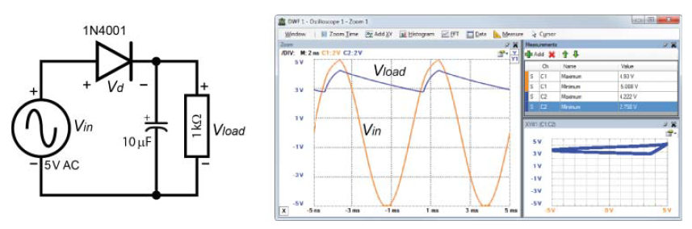

Рисунок 4-11: електричне коло та поведінка діода 1N4001 при живленні змінною напругою $5 \ В$, навантаженні $1 \ к\Omega$ та паралельному конденсаторі $10 \ \mu\text{Ф}$

У конденсаторах для ізоляції двох заряджених обкладок використовується діелектричний матеріал, наприклад кераміка, скло, папір або пластик. Два найбільш поширені типи конденсаторів — керамічні та електролітичні. Керамічні конденсатори мають невеликі розміри, є недорогими та з часом деградують. Електролітичні конденсатори здатні накопичувати значно більші запаси енергії, проте також схильні до деградації з часом. Скляні, слюдяні та танталові конденсатори зазвичай є надійнішими, але водночас значно дорожчими.

На рисунку 4-12 показано керамічний конденсатор номіналом $100 \ нФ$ ($0.1 \ \mu\text{Ф}$) та електролітичний конденсатор номіналом $47 \ \mu\text{Ф}$. Зверніть увагу, що електролітичний конденсатор є поляризованим: його негативний вивід позначений смугою на корпусі. Як і у світлодіода, негативний вивід є коротшим за позитивний.

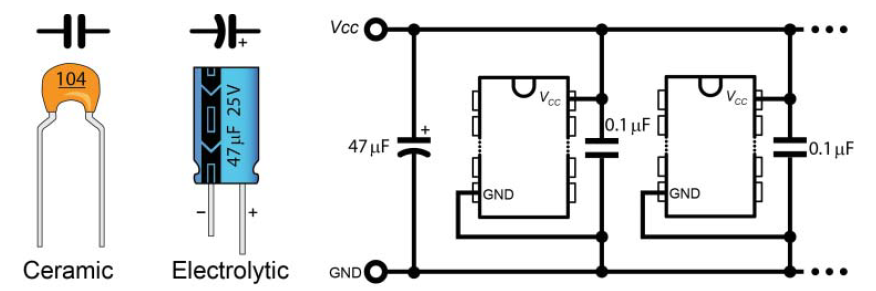

Рисунок 4-12: керамічні (неполяризовані) та електролітичні (поляризовані) конденсатори і приклад кола розв’язування

Маркування конденсаторів є відносно простим, однак на керамічних конденсаторах воно часто має дуже малий розмір і його складно прочитати:

- Перша цифра є першою значущою цифрою номіналу конденсатора.
- Друга цифра є другою значущою цифрою номіналу конденсатора.
- Третя цифра визначає кількість нулів, при цьому номінал задається в пікофарадах (pF).
- Додаткові літери позначають допуск і робочу напругу конденсатора, але на даному етапі їх можна ігнорувати.

Отже, наприклад:

- 104 = $100000 \ \text{pF} = 100 \ \text{nF} = 0.1 \ \mu\text{Ф}$
- 102 = $1000 \ \text{pF} = 1 \ \text{nF}$
- 472 = $4700 \ \text{pF} = 4.7 \ \text{nF}$

У колі стабілізатора напруги, розглянутому раніше (див. рисунок 4-7), використовувалися два конденсатори для згладжування пульсацій напруги живлення шляхом заряджання та розряджання у протифазі до цих пульсацій. Конденсатори також можуть застосовуватися для спорідненої функції, яка називається розв’язуванням.

Рисунок 4-7: стабілізатор напруги KA7805A/LM7805 та приклад кола стабілізації

Зв’язування часто є небажаним явищем, що виникає між різними частинами електричного кола через спільне використання ліній живлення. Такий зв’язок означає, що у разі раптового зростання споживаної потужності в одній частині кола напруга живлення дещо знижується, що впливає на напругу живлення інших частин кола. Інтегральні мікросхеми створюють змінне навантаження на шини живлення; більше того, швидкі зміни навантаження спричиняють високочастотні коливання напруги на лініях живлення інших мікросхем. Зі збільшенням кількості інтегральних мікросхем у колі ця проблема лише посилюється.

Невеликі конденсатори, які називаються розв’язувальними конденсаторами, можуть виконувати роль локального запасу енергії та пригнічувати шумові сигнали, що з’являються на лініях живлення внаслідок змін навантаження мікросхем. Приклад такого кола показано на рисунку 4-12, де більший конденсатор $47 \ \mu\text{Ф}$ фільтрує низькочастотні коливання, а конденсатори $0.1 \ \mu\text{Ф}$ — високочастотні шуми. В ідеалі виводи конденсаторів $0.1 \ \mu\text{Ф}$ повинні бути якомога коротшими, щоб уникнути небажаних ефектів, пов’язаних з індуктивністю, які обмежують ефективність фільтрації найвищих частот. Навіть поверхнево змонтовані конденсатори, що використовуються на платі Raspberry Pi для розв’язування виводів корпусу BGA мікросхеми SoC BCM2835/6/7, створюють невеликі паразитні індуктивності (приблизно $1–2 \ \text{nH}$).

### Транзистори

Транзистори є одним із базових елементів мікропроцесора Raspberry Pi і, загалом, майже кожної електронної системи. Якщо говорити просто, їх призначення полягає в підсиленні сигналу або у вмиканні та вимиканні сигналу — залежно від поставленого завдання. Виводи GPIO Raspberry Pi здатні працювати лише з дуже малими струмами, тому для узгодження їх із електронними колами, які потребують більших робочих струмів, необхідно використовувати транзистори.

Біполярні транзистори з p–n-переходом (bipolar junction transistors, BJT), які зазвичай просто називають транзисторами, утворюються шляхом додавання ще одного легованого шару до діодної структури з p–n-переходом, у результаті чого формується транзистор типу p–n–p або n–p–n. Існують також інші типи транзисторів, наприклад польові транзистори (FET), які буде розглянуто далі. Назва «біполярний» походить від того, що перенос струму в таких транзисторах здійснюється як електронами, так і дірками. Біполярний транзистор має три виводи, причому третій вивід підключений до середнього шару в цій «сендвіч»-структурі, який є дуже тонким, як показано на рисунку 4-13.

На рисунку 4-13 наведено значний обсяг інформації про транзистори, зокрема позначення їхніх виводів: база (B), колектор (C) та емітер (E). Хоча існують два основні типи біполярних транзисторів — NPN і PNP, — найпоширенішим є транзистор типу NPN. Фактично всі приклади з транзисторами в цьому розділі використовують один тип — NPN-транзистор BC547.

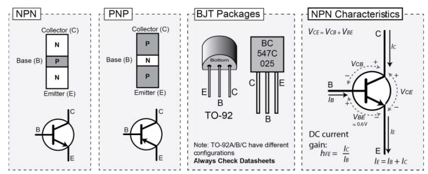

Рисунок 4-13: біполярні транзистори з p–n-переходом (BJT)

BC547 — це транзистор загального призначення на $45 \ В$ і $100 \ \text{мА}$, який є широко доступним, недорогим і постачається в корпусі з виводами типу TO-92. Ідентифікацію виводів транзистора BC547 наведено на рисунку 4-13, однак слід пам’ятати, що таке розташування виводів не є універсальним для всіх транзисторів — завжди необхідно перевіряти документацію (datasheet).

Максимальна напруга між колектором і емітером $V_{CE}$ (також позначається як $V_{CEO}$) для BC547 становить $45 \ В$, а максимальний струм колектора $I_C$ — $100 \ \text{мА}$. Типове значення статичного коефіцієнта підсилення струму за постійним струмом ($h_{FE}$) лежить у межах від 180 до 520, залежно від групи транзистора (наприклад A, B або C). Ці характеристики пояснюються в наступних підрозділах.

### Транзистори як ключі

Примітка. У подальших розділах цієї книги для комутації навантажень у колах Raspberry Pi використовуються польові транзистори (FET), а не біполярні транзистори. Якщо деталі цього підрозділу видадуться надто складними, можна перейти безпосередньо до FET, які дещо простіші у практичному застосуванні.

Розглянемо характеристики NPN-транзистора, показані на рисунку 4-13 (правий варіант схеми). Якщо перехід база–емітер зміщений у прямому напрямку і в базу протікає невеликий струм $I_B$, то властивості транзистора такі, що через колектор протікатиме пропорційний, але значно більший струм:

$$
I_C = h_{FE} \cdot I_B
$$

Для транзистора типу BC547 значення $h_{FE}$ може становити від 180 до 520. Оскільки $I_B$ значно менший за $I_C$, можна також вважати, що струм емітера $I_E$ приблизно дорівнює струму колектора.

На рисунку 4-14 наведено приклад використання біполярного транзистора як ключа. У частині (a) рівні напруг підібрані відповідно до тих, які доступні на платі Raspberry Pi. Резистор у колі бази має номінал $2.2 \ \text{к}\Omega$, тому струм бази буде малим і становитиме:

$$
I = \frac{V}{R} = \frac{3.3 \ В - 0.7 \ В}{2200 \ \Omega} \approx 1.2 \ \text{мА}
$$

Резистор у колі колектора має малий опір, тому струм колектора буде відносно великим:

$$
I = \frac{V}{R} = \frac{5 \ В - 0.2 \ В}{100 \ \Omega} \approx 48 \ \text{мА}
$$

Цей приклад показує, як невеликий струм, керований через GPIO Raspberry Pi, може використовуватися для комутації значно більшого струму в навантаженні за допомогою транзистора.

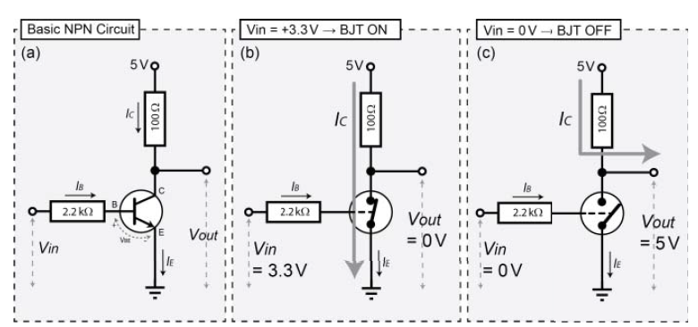

Рисунок 4-14: біполярний транзистор як ключ

На рисунку 4-14(b) показано, що відбувається, коли на вивід бази подається вхідна напруга $3.3 \ В$. Невеликий струм бази змушує транзистор поводитися як замкнений ключ (з дуже малим опором) між колектором і емітером. Це означає, що падіння напруги між колектором і емітером є майже нульовим, а практично вся напруга падає на навантажувальному резисторі $100 \ \Omega$, унаслідок чого струм безпосередньо протікає на землю через емітер. Транзистор перебуває в режимі насичення, оскільки він уже не може пропустити більший струм. Через те, що падіння напруги між колектором і емітером майже відсутнє, вихідна напруга $V_{out}$ також буде близькою до $0 \ В$.

На рисунку 4-14(c) показано ситуацію, коли на вивід бази подається вхідна напруга $V_{in} = 0 \ В$ і струм бази відсутній. У цьому випадку транзистор поводиться як розімкнений ключ (дуже великий опір). Струм через перехід колектор–емітер протікати не може, оскільки цей струм завжди є кратним струму бази, а струм бази дорівнює нулю. Тому практично вся напруга падає між колектором і емітером. У цьому випадку вихідна напруга $V_{out}$ може досягати значення до $+5 \ В$ (хоча, як випливає з показаного напрямку протікання $I_C$ через вихідний вивід, точне значення $V_{out}$ залежить від величини $I_C$, оскільки будь-який струм, що протікає через резистор $100 \ \Omega$, спричиняє падіння напруги на ньому). Таким чином, ключ у такій конфігурації поводиться подібно до інвертора. Якщо вхідна напруга дорівнює $0 \ В$, вихідна напруга становить $+5 \ В$, а якщо вхідна напруга дорівнює $+3.3 \ В$, вихідна напруга буде близькою до $0 \ В$. Реальні виміряні значення для цього кола наведені на рисунку 4-15, коли на вивід бази подається напруга $3.3 \ В$. У цьому випадку генератор сигналів Analog Discovery використовується для формування прямокутного сигналу з частотою $1 \ \text{kHz}$, амплітудою $1.65 \ В$ і зсувом $+1.65 \ В$ (тобто сигналу від $0 \ В$ до $3.3 \ В$). Таким чином, сигнал еквівалентний джерелу $3.3 \ В$, що вмикається і вимикається 1000 разів за секунду. Усі вимірювання на цьому рисунку виконані при вхідній напрузі $3.3 \ В$. Перехід база–емітер зміщений у прямому напрямку і, як і у випадку з діодом, має пряме падіння напруги приблизно $0.7 \ В$. Фактичне падіння напруги між базою і емітером становить $0.83 \ В$, отже падіння напруги на базовому резисторі дорівнює $2.440 \ В$. Реальний струм бази становить $1.1 \ \text{мА}$: $I = \frac{V}{R} = \frac{2.44 \ В}{2185 \ \Omega}$ Цей струм відкриває транзистор і переводить його в режим насичення, тому падіння напруги між колектором і емітером є дуже малим (виміряне значення — $0.2 \ В$). Відповідно, струм колектора становить приблизно $49.8 \ \text{мА}$:$I = \frac{V}{R} = \frac{(4.93 \ В - 0.2 \ В)}{96 \ \Omega}.$ Для вибору відповідного резистора в колі бази, щоб забезпечити глибоке насичення BJT, використовується така практична формула:$R_{Base} = \frac{V_B - V_{BE(sat)}}{2 \times \left(\frac{I_C}{h_{FE(min)}}\right)}.$  Для випадку живлення бази від $3.3 \ В$, при струмі колектора $50 \ \text{мА}$ і мінімальному коефіцієнті підсилення $h_{FE(min)} = 100$, отримаємо:
$$
R_{Base} = \frac{(3.27 - 0.83)}{2 \times (0.05/100)} = 2440 \ \Omega.
$$
Усі ці значення можна знайти в даташиті транзистора. Напруга $V_{BE(sat)}$ зазвичай подається у вигляді графіка залежності $V_{BE}$ від $I_C$ при кімнатній температурі; у нашому випадку необхідно забезпечити $I_C = 50 \ \text{мА}$. Значення $V_{BE(sat)}$ для BC547 лежить у межах від $0.6 \ В$ до $0.95 \ В$ залежно від струму колектора та температури. Значення резистора додатково ділиться на два, щоб гарантовано перевести транзистор у глибоку область насичення (максимізуючи $I_C$). Тому в цьому прикладі використовується резистор номіналом $2.2 \ \text{k}\Omega$ як найближче стандартне значення.

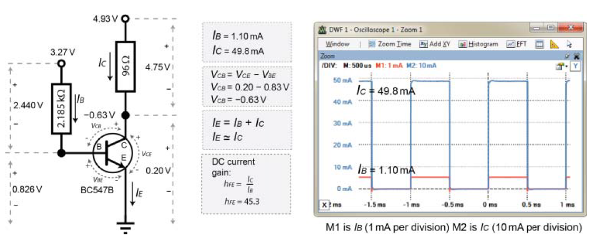

Рисунок 4-15: реалізація транзистора як ключа (режим насичення) та підтвердження виконання всіх співвідношень

Чому це важливо у контексті Raspberry Pi? Тому що Raspberry Pi може віддавати або приймати через свої виводи GPIO лише дуже малі струми. Водночас ви можете під’єднати GPIO-вивід Raspberry Pi до бази транзистора так, що дуже малий струм, який надходить у базу транзистора, зможе вмикати значно більший струм і працювати з набагато ширшим діапазоном напруг. Згадайте приклад на рисунку 4-15: струм $1.1 \ \text{мА}$ дозволяє керувати значно більшим струмом $49.8 \ \text{мА}$ (у 45 разів більшим, але все ще меншим за граничні $100 \ \text{мА}$ для BC547). Використання такої транзисторної схеми разом із Raspberry Pi дає змогу безпечно керувати струмом $100 \ \text{мА}$ при напрузі до $45 \ В$, використовуючи лише близько $5 \ \text{мА}$ при $3.3 \ В$ з GPIO Raspberry Pi, за умови правильного вибору номіналів резисторів.

Одним з обмежень під час використання транзисторів для керування електричними колами є максимальна частота перемикання. Якщо збільшити частоту вхідного сигналу в колі на рисунку 4-16 до $500 \ \text{kHz}$, вихідний сигнал стає спотвореним, хоча все ще відбувається перемикання між низьким і високим рівнями. Проте при подальшому збільшенні частоти до $1 \ \text{MHz}$ кероване коло вже не встигає вимикатися.

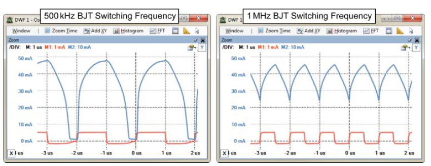

Рисунок 4-16: частотна характеристика кола з біполярним транзистором (частота $500 \ \text{kHz}$ та $1 \ \text{MHz}$)

За допомогою диференціального входу Analog Discovery можна «вимірювати» струм, розмістивши щупи по обидва боки резистора (тобто вимірюючи напругу на ньому), а потім створивши власний математичний канал, який ділить виміряну форму сигналу на відоме значення опору цього резистора. Після цього в налаштуваннях каналу можна встановити одиниці вимірювання в амперах.

#### Польові транзистори (FET) як ключі

Простіша альтернатива використанню біполярних транзисторів як ключів — це застосування польових транзисторів (FET). Польові транзистори відрізняються від біполярних тим, що протікання струму в колі навантаження керується напругою, а не струмом, на керувальному вході. Тому кажуть, що FET є пристроями, керованими напругою, тоді як BJT є пристроями, керованими струмом. Керувальний вивід FET називається затвором (G), а керований струм протікає між стоком (D) і витоком (S).

На рисунку 4-17 показано, як можна використовувати n-канальний FET як ключ. На відміну від біполярного транзистора, резистор у керувальному колі (номіналом $1 \ \text{M}\Omega$) підключений між входом і GND, тобто до землі протікає дуже малий струм $I = V/R$, але напруга на затворі при цьому дорівнює вхідній напрузі $V_{in}$. Важливою перевагою FET є те, що в керувальний вхід затвора практично не протікає струм. Натомість саме напруга на затворі вмикає або вимикає керований струм $I_D$, який у цьому прикладі протікає від стоку до витоку.

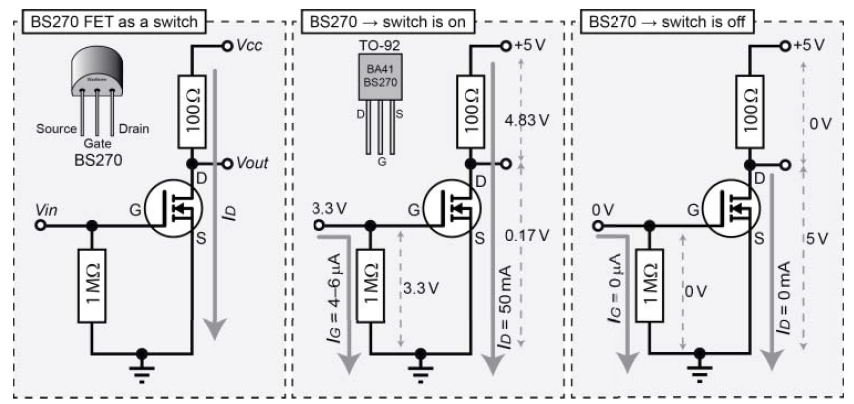

Рисунок 4-17: польовий транзистор (FET) як ключ

Коли вхідна напруга є високою ($3.3 \ В$), через перехід сток–витік протікає струм ($I_D = 50 \ \text{мА}$), тому напруга на вихідному виводі становить $0.17 \ В$. Коли ж вхідна напруга є низькою ($0 \ В$), струм між стоком і витоком не протікає. Так само, як і у випадку з біполярним транзистором, якщо вимірювати напругу на виводі стоку, вихідна напруга $V_{out}$ буде високою, коли вхідна напруга є низькою, і низькою, коли вхідна напруга є високою. При цьому фактичне значення «високого» рівня вихідної напруги знову ж таки залежить від струму, який споживає наступне коло.

N-канальний польовий транзистор режиму збагачення BS270 виробництва Fairchild Semiconductor є недорогим елементом (близько $0.10$) у корпусі TO-92, який здатний забезпечувати безперервний струм стоку $I_D$ до $400 \ \text{мА}$ при напрузі сток–витік до $60 \ В$. Проте при напрузі на затворі $V_G = 3.3 \ В$ транзистор BS270 може комутувати максимальний струм стоку приблизно $130 \ \text{мА}$. Це робить його добре придатним для використання з Raspberry Pi, оскільки рівні напруг GPIO відповідають потрібному діапазону, а струм, необхідний для відкривання FET, становить лише близько $3–6 \ \mu\text{А}$ залежно від вибраного резистора в колі затвора.

Ще однією перевагою використання FET як ключа є здатність працювати на значно вищих частотах перемикання, що показано на рисунку 4-18. Згадайте, що на рисунку 4-16 форма сигналу перемикання для біполярного транзистора є сильно спотвореною вже при частоті $1 \ \text{MHz}$. З рисунка 4-18 чітко видно, що коло з FET здатне працювати з набагато вищими частотами перемикання, ніж коло з BJT.

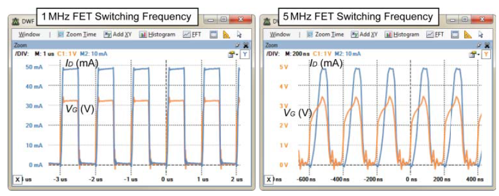

Рисунок 4-18: частотна характеристика кола з FET при встановленні частоти перемикання $1 \ \text{MHz}$ та $5 \ \text{MHz}$

Транзистор BS270 також має вбудований діод великої потужності, який використовується для захисту затвора від зворотних індуктивних перенапруг, що можуть виникати, наприклад, у випадку, коли FET керує двигуном постійного струму.

Як уже зазначалося, одним із незначних недоліків BS270 є те, що при напрузі на затворі $3.3 \ В$ він може комутувати максимальний струм стоку приблизно $130 \ \text{мА}$. Однак високий вхідний опір затвора означає, що можна підключити два (або навіть більше) транзистори BS270 паралельно, щоб подвоїти максимально допустимий струм приблизно до $260 \ \text{мА}$ при тій самій напрузі на затворі. Крім того, BS270 можна використовувати як драйвер затвора для силових польових транзисторів, які здатні комутувати значно більші струми.

### Оптопари / оптоізолятори

Оптопари (або оптоізолятори) — це малі та недорогі цифрові комутаційні пристрої, які використовуються для електричної ізоляції двох кіл між собою. Це може бути особливо важливо для колів Raspberry Pi у випадках, коли існує ризик, що помилка в підключеному колі може призвести до відбору або підведення великого струму до GPIO Raspberry Pi.

Такі компоненти доступні у вигляді недорогих (близько $0.15) чотирививідних корпусів DIP.

Оптопара використовує світлодіодний випромінювач, розміщений поблизу фототранзистора, які відокремлені ізоляційною плівкою всередині силіконового корпусу. Коли через виводи світлодіодного випромінювача протікає струм $I_f$, світло від світлодіода падає на фототранзистор і дозволяє окремому струму $I_c$ протікати через перехід колектор–емітер фототранзистора (див. рисунок 4-19). Коли світлодіодний випромінювач вимкнений, світло на фототранзистор не потрапляє, і струм колектор–емітер $I_c$ практично відсутній. Між двома сторонами корпусу немає електричного з’єднання, оскільки передавання сигналу здійснюється виключно за допомогою світла. Це забезпечує електричну ізоляцію до $5300 \ \text{В}_{\text{RMS}}$ для оптопари на кшталт SFH617A. Оптопари також можна використовувати з PWM-сигналами, оскільки такі сигнали мають бінарний характер (увімкнено / вимкнено).

На рисунку 4-19 показано приклад кола з оптопарою та відповідні осцилограми для вибраних значень резисторів і напруг. Ці значення підібрані так, щоб відповідати типовим умовам використання з Raspberry Pi. Номінал резистора $470 \ \Omega$ було вибрано для того, щоб вихід $3.3 \ В$ забезпечував прямий струм світлодіода $I_f$ приблизно $4.5 \ \text{мА}$. З рисунка 4 у даташиті випливає, що за такого струму пряме падіння напруги на світлодіоді становить приблизно $1.15 \ В$. Тоді: $R = \frac{V}{I} = \frac{(3.3 \ В - 1.15 \ В)}{0.0045 \ \text{А}} = 478 \ \Omega.$
Отже, коло було зібране з використанням найближчого стандартного номіналу резистора — $470 \ \Omega$.

Рисунок 4-19: коло з оптопарою (617A) та зафіксовані вхідні й вихідні характеристики

Осцилограф відображає струм, використовуючи диференціальні входи Analog Discovery для вимірювання напруги на відомих номіналах резисторів, а також два математичні канали для ділення сигналу на відповідні значення опору. На рисунку 4-19 видно, що $I_f = 4.571 \ \text{мА}$, а $I_c = 2.766 \ \text{мА}$. Пропорційне співвідношення між цими струмами називається коефіцієнтом передавання струму (current transfer ratio, CTR) і воно змінюється залежно від рівня $I_f$ та робочої температури. Отже, передавання струму при $4.571 \ \text{мА}$ становить $60.5%$:
$$
100 \times \frac{I_c}{I_f},
$$
що узгоджується з даними даташита.

Час наростання і час спаду також відповідають значенням, наведеним у даташиті: $t_r = 4.6 \ \mu\text{с}$ і $t_f = 15 \ \mu\text{с}$. Ці параметри обмежують максимальну частоту перемикання. Крім того, якщо для кола важливо досягти високого значення CTR, існують оптопари з вбудованими конфігураціями транзистора Дарлінгтона, які забезпечують CTR до $2000%$ (наприклад, 6N138 або HCPL2730). Нарешті, доступні також високоточні лінійні аналогові оптопари (наприклад, HCNR200 від Avago), які можна використовувати для оптичної ізоляції аналогових сигналів.

Примітка. У розділі 6 наведено приклади колів, що показують, як використовувати оптопару для захисту GPIO Raspberry Pi як від незалежно живленого вихідного кола (рисунок 6-7), так і від незалежно живленого вхідного кола (рисунок 6-8).

### Перемикачі та кнопки

Іншими компонентами, з якими вам імовірно доведеться працювати, є перемикачі та кнопки. Вони існують у багатьох різновидах: тумблерні, кнопкові, селекторні, безконтактні, джойстики, герконові, датчики тиску, температурні тощо. Однак усі вони працюють за однаковим бінарним принципом — або переривають протікання струму (розімкнений стан), або дозволяють протікання струму (замкнений стан). На рисунку 4-20 показано кілька поширених типів перемикачів і наведено загальну схему їх підключення.

Кнопкові перемикачі миттєвої дії (SPST — single pole, single throw), подібні до зображеного на рисунку 4-20, можуть бути нормально розімкненими (NO) або нормально замкненими (NC). NO означає, що для протікання струму кнопку необхідно натиснути, тоді як NC означає, що при натисканні кнопки струм не протікає. Для конкретної кнопки, показаної на рисунку, обидва виводи 1 завжди з’єднані між собою, так само як і обидва виводи 2. Протягом часу, коли кнопка натиснута, усі чотири виводи з’єднані разом.

Розглядаючи повзункові перемикачі (SPDT — single pole, double throw), можна побачити, що спільний контакт (COM) з’єднується або з виводом 1, або з виводом 2 залежно від положення повзунка. У випадку мікроперемикачів і кнопок великого струму контакт COM з’єднується з NC, коли перемикач натиснутий, і з’єднується з NO, коли перемикач відпущений. Нарешті, тумблерний перемикач, показаний на рисунку, часто має вбудований світлодіод, який світиться, коли перемикач замкнений, з’єднуючи вивід живлення (VCC) з виводом кола (CCT).

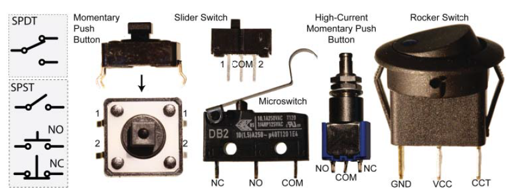

Рисунок 4-20: різні типи перемикачів і їх конфігурації

Усі ці типи перемикачів страждають від явища механічного дребезгу контактів, що може бути надзвичайно проблематичним під час узгодження з мікропроцесорами, такими як Raspberry Pi. Перемикачі є механічними пристроями, і під час натискання сила контакту спричиняє багаторазові короткочасні відскоки контактів у момент замикання. Хоча цей дребезг триває дуже недовго (зазвичай мілісекунди), цього часу достатньо, щоб на вході мікропроцесора з’явилася послідовність імпульсів.

На рисунку 4-21(a) показано цю проблему в дії з використанням режиму запуску за фронтом/спадом осцилографа Analog Discovery. Кнопка миттєвої дії включена в просте послідовне коло з резистором $10 \ \text{k}\Omega$, і напруга вимірюється на цьому резисторі. Коли кнопка торкається контакту, вихідна напруга різко зростає, але потім контакт відскакує, і напруга знову падає. Приблизно через $2–3 \ \text{мс}$ (або довше) сигнал майже повністю стабілізується. На жаль, навіть такий короткий дребезг може призвести до хибних спрацьовувань у цифровому колі. Наприклад, якщо порогове значення становить $3 \ В$, система може зчитати послідовність `101010101` замість коректнішого значення `000001111`.

Існує кілька способів боротьби з дребезгом контактів під час узгодження з мікропроцесорами:

- Можна додати фільтр нижніх частот у вигляді RC-кола (резистор–конденсатор), як показано на рисунку 4-21(c), використовуючи конденсатор $1 \ \mu\text{Ф}$. Недоліком цього підходу є поява затримки сигналу. Якщо подивитися на часову шкалу, приблизно $2 \ \text{мс}$ потрібно для того, щоб вхідна напруга досягла $1 \ В$. Умови дребезгу можуть додатково збільшити цю затримку. Значення елементів підбираються з урахуванням сталої часу RC-кола $\tau = R \times C$, тобто $\tau (\text{с}) = 1000 \ \Omega \times 10^{-6} \ \text{Ф} = 1 \ \text{мс},$ що відповідає часу, за який конденсатор заряджається приблизно до $63.2%$ або розряджається до $36.8%$. Це значення позначене на рисунку 4-21(b) на рівні приблизно $1.9 \ В$.

- Можна реалізувати програмне рішення, за якого після фіксації фронту сигналу робиться затримка в кілька мілісекунд, після чого зчитується «реальний» стан входу.

- Для повзункових перемикачів (SPDT) можна використати SR-тригер.

- Для кнопок миттєвої дії (SPST) можна застосувати тригер Шмітта (74HC14N), який розглядається в наступному підрозділі, у поєднанні з RC-фільтром нижніх частот, як на рисунку 4-21(c).

Примітка. На вебсторінці, пов’язаній із цим розділом, доступні відео з прикладами усунення дребезгу контактів для перемикачів SPDT і SPST.

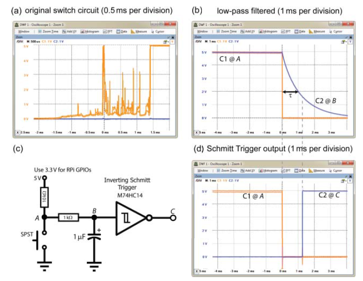

Рисунок 4-21: (a) дребезг контактів перемикача без будь-яких компонентів, окрім перемикача та резистора $10 \ \text{k}\Omega$; (b) вихід сигналу після фільтра нижніх частот у точці B; (c) коло з тригером Шмітта; (d) вихід тригера Шмітта в точці C у порівнянні з входом у точці A

#### Гістерезис

Гістерезис навмисно закладається в електронні кола для уникнення надто частого перемикання, яке могло б призводити до зношування елементів кола. Тригер Шмітта має властивість гістерезису, тобто його вихід залежить не лише від поточного значення вхідного сигналу, а й від історії попередніх вхідних значень. Це зручно пояснити на прикладі духовки, у якій випікають торт при температурі 350 градусів за Фаренгейтом:

- Без гістерезису. Нагрівальний елемент розігріває духовку до 350°F. Щойно температура досягнута, елемент вимикається. Температура знижується нижче 350°F, елемент знову вмикається. Відбувається дуже швидке перемикання.

- З гістерезисом. Коло спроєктоване так, що духовка нагрівається до 360°F, після чого нагрівальний елемент вимикається. Далі духовка охолоджується, але повторне вмикання відбувається лише тоді, коли температура знижується до 340°F. Перемикання відбувається нечасто, що захищає обладнання, але водночас з’являється більший діапазон коливань температури випікання.

Для духовки, спроєктованої з гістерезисом, чи ввімкнений нагрівальний елемент при температурі 350°F? Це залежить від історії вхідних впливів: елемент увімкнений, якщо духовка нагрівається, і вимкнений, якщо вона охолоджується.

Тригер Шмітта в колі на рисунку 4-21(c) демонструє саме таку поведінку. Для тригера Шмітта M74HC14 при живленні $5 \ В$ порогова напруга перемикання вгору $V_{T+}$ становить $2.9 \ В$, а порогова напруга перемикання вниз $V_{T-}$ — $0.93 \ В$. Це означає, що зростаюча вхідна напруга повинна досягти $2.9 \ В$, перш ніж вихід змінить свій стан на високий рівень, а спадна вхідна напруга повинна знизитися до $0.93 \ В$, перш ніж вихід перемкнеться на низький рівень. Будь-який дребезг сигналу в межах цього діапазону просто ігнорується.

Фільтр нижніх частот зменшує ймовірність високочастотного дребезгу. Відповідь кола наведена на рисунку 4-21(d). Зверніть увагу, що часовий масштаб становить $1 \ \text{мс}$ на поділку, що добре ілюструє, наскільки «чистим» є вихідний сигнал. У цій конфігурації використовується підтягувальний резистор (pull-up), необхідність якого буде пояснена далі.

## Логічні елементи

Функції булевої алгебри мають лише два можливі результати — істина або хибність, що робить їх зручними для побудови формального опису електронних колів, які перебувають або у ввімкненому, або у вимкненому стані (високий або низький рівень). Логічні елементи реалізують ці булеві функції та операції і становлять основу функціонування сучасних мікропроцесорів, зокрема SoC BCM2835/6/7, що використовується в Raspberry Pi. Булеві значення не є тотожними двійковим числам. Двійкові числа — це подання цілих і дробових чисел у системі числення з основою 2, тоді як булеві значення описують тип даних, який має лише два можливі стани: істина або хибність.

Досить часто виникає потреба взаємодіяти з різними типами логічних елементів і логічних систем за допомогою GPIO Raspberry Pi для виконання таких операцій, як маскування (gating) входів або передавання даних у зсувні регістри. Логічні елементи поділяються на дві основні категорії:

- Комбінаційна логіка. Поточний вихід залежить лише від поточних вхідних сигналів (наприклад, AND, OR, декодери, мультиплексори тощо).
- Послідовнісна логіка. Поточний вихід залежить як від поточних, так і від попередніх вхідних сигналів. Такі схеми можна вважати такими, що мають стани, і реакція на вхідний сигнал визначається тим, у якому стані перебуває схема (наприклад, защіпки, тригери, пам’ять, лічильники тощо).

Комбінаційні логічні кола завжди формують однаковий вихід для одного й того самого набору вхідних сигналів незалежно від порядку, у якому ці сигнали були подані. На рисунку 4-22 показано базові комбінаційні логічні елементи з їхніми логічними позначеннями, таблицями істинності та номерами інтегральних мікросхем. Таблиця істинності визначає вихідний сигнал, який формується логічним елементом для заданих комбінацій входів.

Примітка. На вебсторінці, пов’язаній із цим розділом, доступне відео з прикладом підключення логічного елемента AND.

Інтегральні мікросхеми мають маркування, яке описує виробника, функціональне призначення, логічну сім’ю та тип корпусу. Наприклад, мікросхема MM74HC08N, показана на рисунку 4-23(a), має код виробника MM (Fairchild Semiconductor), реалізує функцію 7408 (чотири логічні елементи AND з двома входами), належить до логічної сім’ї HC (CMOS) і виконана в корпусі типу N (пластиковий корпус DIP).

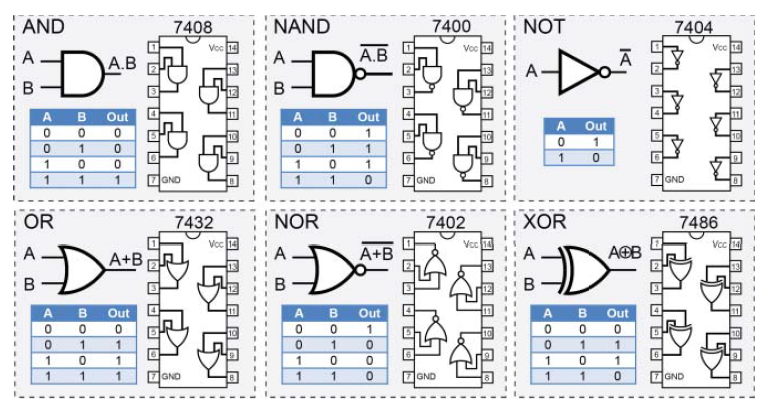

Рисунок 4-22: загальні логічні елементи

Інтегральні мікросхеми випускаються в різних типах корпусів. На рисунку 4-23(a) у масштабі показано корпус PDIP (plastic dual in-line package) та малогабаритний корпус TSSOP (thin shrink small outline package). Існує багато типів корпусів: для поверхневого монтажу, плоскі корпуси, корпуси типу small outline, корпуси з масштабом кристала (chip-scale package) та корпуси з кульковими виводами (ball grid array, BGA). Під час замовлення інтегральних мікросхем необхідно бути уважним і переконатися, що у вас є можливість працювати з обраним типом корпусу.

Мікросхеми у корпусах DIP/PDIP ідеально підходять для прототипування на макетних платах, оскільки мають крок виводів $0.1"$ ( $2.54 \ \text{мм}$ ). Існують також адаптерні плати, які дозволяють перетворювати корпуси типу small outline на стандартний крок виводів $0.1"$. На жаль, мікросхеми в корпусах BGA, такі як BCM2835/6/7, потребують складного спеціалізованого обладнання для паяння.

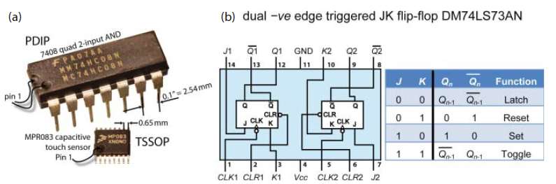

Рисунок 4-23: (a) приклади корпусів інтегральних мікросхем (у масштабі) та (b) JK-тригер

Сімейства інтегральних мікросхем, які сьогодні найчастіше використовуються, зазвичай належать або до транзисторно-транзисторної логіки (TTL) з малопотужними діодами Шотткі (LS), або до різновидів комплементарної метал–оксид–напівпровідникової логіки (CMOS). У таблиці 4-1 порівнюються два варіанти мікросхем 7408 з цих сімейств на основі їхніх даташитів. Час поширення сигналу — це максимальна затримка між моментом зміни вхідного сигналу та моментом зміни вихідного сигналу для всіх можливих комбінацій входів логічного елемента. Саме ця затримка обмежує швидкодію логічного елемента.

Таблиця 4-1: Порівняння двох комерційно доступних TTL- та CMOS-мікросхем для ІМС 7408 (чотири логічні елементи AND з двома входами)

| Характеристика                               | SN74LS08N                                                    | SN74HC08N                                         |
| -------------------------------------------- | ------------------------------------------------------------ | ------------------------------------------------- |
| Сімейство                                    | Texas TTL PDIP, Low-power Schottky (LS)                      | Texas CMOS PDIP, High-speed CMOS (HC)             |
| Напруга живлення $V_{CC}$                    | $4.5 \ \text{В} \dots 5.5 \ \text{В}$ (типово $5 \ \text{В}$) | $2 \ \text{В} \dots 6 \ \text{В}$                 |
| Мін. рівень логічної “1” на вході $V_{IH}$   | мін. $2 \ \text{В}$                                          | при $V_{CC}=5 \ \text{В}$: мін. $3.5 \ \text{В}$  |
| Макс. рівень логічного “0” на вході $V_{IL}$ | макс. $0.8 \ \text{В}$                                       | при $V_{CC}=5 \ \text{В}$: макс. $1.5 \ \text{В}$ |
| Час поширення сигналу $T_{PD}$               | типово $12 \ \text{нс}$ (↑), $17.5 \ \text{нс}$ (↓)          | типово $8 \ \text{нс}$ (↑↓)                       |
| Споживана потужність (при $5 \ \text{В}$)    | $5 \ \text{мВт}$ (макс.)                                     | $0.1 \ \text{мВт}$ (макс.)                        |

На рисунку 4-24 показано допустимі рівні вхідних і вихідних напруг для логічних елементів TTL і CMOS при VDD = 5 В. Запас за шумом визначається як абсолютна різниця між рівнями вихідної напруги та відповідними рівнями вхідної напруги. Цей запас гарантує, що якщо вихід одного логічного елемента з’єднано з входом іншого, то завади не призведуть до хибного визначення логічного стану.

Для сімейства CMOS рівні логічних сигналів на вході залежать від напруги живлення VDD: поріг логічної “1” становить 0.7 × VDD, а поріг логічного “0” — 0.3 × VDD. З рисунка 4-24 видно, що поведінка TTL і CMOS відрізняється. Наприклад, якщо вхідна напруга дорівнює 2.5 В, то TTL-елемент сприйматиме її як логічну “1”, тоді як CMOS-елемент (при VDD = 5 В) вважатиме цей рівень невизначеним. Також вихід CMOS-елемента при VDD = 3.3 В забезпечує достатню напругу для формування логічної “1” на вході TTL-елемента, але вже не є достатнім для CMOS-елемента з VDD = 5.0 В.

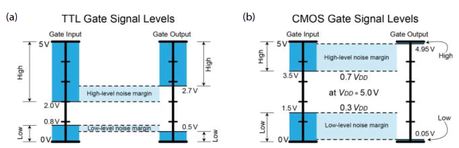

Рисунок 4-24: Рівні сигналів на входах і виходах логічних елементів: (a) TTL, (b) CMOS при $5 \ \text{В}$

Високошвидкісна CMOS-логіка (HC) підтримує широкий діапазон рівнів напруг, зокрема рівні $3.3 \ \text{В}$, що використовуються на входах і виходах Raspberry Pi. Позначення GND зазвичай використовується для позначення опорної (земляної) напруги живлення. Позначення VEE часто застосовується для пристроїв на біполярних транзисторах (BJT), а VSS — для пристроїв на польових транзисторах (FET). Історично VCC використовувалося для позначення позитивної напруги живлення в BJT-пристроях, а VDD — у FET-пристроях; однак нині дуже часто VCC застосовують для обох типів.

На рисунку 4-23(b) показано приклад послідовнісного логічного кола — JK-тригер. JK-тригери є базовими будівельними блоками таких схем, як лічильники. Вони відрізняються від комбінаційних логічних колів тим, що їхній поточний стан залежить як від поточних вхідних сигналів, так і від попереднього стану. Із таблиці істинності видно, що якщо на входах $J = 0$ і $K = 0$, то значення виходу $Q_n$ залишається таким самим, яким воно було на попередньому кроці (тригер поводиться як однобітна пам’ять). Часовий крок визначається тактовим входом CLK, який є синхронізувальним сигналом у вигляді прямокутної хвилі. Аналогічний тип тактового сигналу присутній і в Raspberry Pi — це системна тактова частота, яка на Raspberry Pi 3 сягає до $1{,}200{,}000{,}000$ циклів прямокутного сигналу за секунду.

Примітка. На вебсторінці, пов’язаній із цим розділом, доступне відео з детальним поясненням роботи JK-тригерів, а також відео зі збирання кола таймера 555, який можна використовувати як низькочастотне джерело тактового сигналу для тестування логічних колів.

### Плаваючі входи

Однією з найпоширеніших помилок під час роботи з цифровими логічними колами є залишення невикористаних входів логічних елементів у «плаваючому» стані, тобто не підключеними ні до якого потенціалу. Сімейство мікросхеми суттєво впливає на наслідки такої помилки.

Для логіки TTL такі входи зазвичай «спливають» до високого рівня і з великою ймовірністю сприймаються як логічна «1». Проте навіть у випадку TTL-мікросхем вважається правильною практикою «прив’язувати» (тобто підключати) всі входи або до землі, або до напруги живлення, щоб у будь-який момент часу логічний рівень на вході був однозначно визначений.

У CMOS-колах входи є дуже чутливими до високих напруг, які можуть виникати через статичну електрику та електричні завади, тому їх також ніколи не слід залишати у плаваючому стані. На рисунку 4-25 показано ймовірний вихід логічного елемента AND, підключеного так, як зображено на рисунку. Правильний результат наведено у стовпці «Required (A·B)».

Невикористані CMOS-входи, залишені у плаваючому стані (між VDD і GND), можуть поступово заряджатися через струми витоку і, залежно від конструкції мікросхеми, створювати хибні вхідні сигнали або призводити до зайвого споживання енергії через протікання постійного струму (від VDD до GND). Для усунення цієї проблеми використовують підтягувальні або стягувальні резистори (pull-up або pull-down) залежно від бажаного стану входу. Це звичайні резистори з відповідними номіналами; «підтягування» або «стягування» визначається саме їхньою роллю в колі. Ці елементи розглядаються в наступному підрозділі.

Рисунок 4-25: логічний елемент AND із входами, які випадково залишені у плаваючому стані, коли перемикачі розімкнені

### Підтягувальні та стягувальні резистори

Щоб уникнути плаваючих входів, застосовують підтягувальні (pull-up) або стягувальні (pull-down) резистори, як показано на рисунку 4-26. Стягувальні резистори використовують у випадках, коли потрібно гарантувати, що входи логічного елемента мають низький рівень, коли перемикачі розімкнені. Підтягувальні резистори, відповідно, застосовують тоді, коли необхідно гарантувати високий рівень на входах при розімкнених перемикачах.

Наявність резисторів є принципово важливою, оскільки при замкненні перемикача без них утворився б короткий замикання на землю або на напругу живлення, якби замість резисторів були просто провідники. Значення підтягувальних або стягувальних резисторів також має значення: опір повинен бути достатньо малим, щоб надійно встановлювати низький або високий рівень на вході, коли перемикачі розімкнені, але водночас достатньо великим, щоб обмежити струм, коли перемикачі замкнені.

В ідеальному логічному елементі вхідний опір є нескінченним, і будь-яке (не нескінченне) значення резистора було б достатнім. Проте реальні логічні елементи мають струми витоку, які необхідно компенсувати. Щоб мінімізувати споживання енергії, слід обирати максимально можливий опір, який усе ще забезпечує надійне встановлення потрібного рівня на вході.

Як правило, резистори в діапазоні від $3.3 \ \text{k}\Omega$ до $10 \ \text{k}\Omega$ працюють без проблем. При напрузі $3.3 \ \text{В}$ через них протікає струм приблизно від $1 \ \text{мА}$ до $0.33 \ \text{мА}$ відповідно, а потужність, що розсіюється, становить від $3.3 \ \text{мВт}$ до $1 \ \text{мВт}$ відповідно, коли перемикач замкнений. Для застосувань, чутливих до енергоспоживання, можна експериментально перевірити використання резисторів з більшим опором, наприклад $50 \ \text{k}\Omega$ або більше.

Рисунок 4-26: підтягувальні та стягувальні резистори, які використовуються для того, щоб перемикачі не створювали плаваючих входів

Raspberry Pi має вбудовані слабкі підтягувальні та стягувальні резистори, які можна використовувати з цією ж метою. Це питання розглядається в розділі 6. Ще один аспект полягає в тому, що вхідні виводи мають певну паразитну ємність відносно землі. Додавання резистора на вході разом із цією ємністю утворює RC-фільтр нижніх частот, який може вносити затримку у вхідний сигнал.

Для кнопок, що натискаються вручну, така затримка не має суттєвого значення, оскільки в наведеному прикладі вона становить порядку $0.1 \ \mu\text{с}$. Однак для швидкісних цифрових інтерфейсів і шин передавання даних така затримка може впливати на швидкодію обміну.

### Виходи з відкритим колектором і відкритим стоком

До цього моменту в розділі всі розглянуті інтегральні мікросхеми мали звичайні виходи, у яких рівень напруги активно встановлюється або близько до GND, або близько до напруги живлення мікросхеми (VCC). Якщо вихід підключається до іншої мікросхеми чи компонента, що працює з тим самим рівнем напруги, зазвичай це не викликає проблем. Однак якщо перша мікросхема живиться від $3.3 \ \text{В}$, а потрібно керувати входом мікросхеми з живленням $5 \ \text{В}$, виникає потреба в узгодженні рівнів напруги.

Багато інтегральних мікросхем випускаються з виходами типу «відкритий колектор», які особливо зручні для узгодження різних логічних сімейств і для перетворення рівнів напруги. Це пов’язано з тим, що такий вихід не формує фіксований рівень напруги, а фактично підключений до колекторного виводу NPN-транзистора, що знаходиться всередині мікросхеми. Колектор цього транзистора є «відкритим» і виведений назовні як вихід мікросхеми, а емітер транзистора з’єднаний із GND мікросхеми.

Замість біполярного транзистора всередині мікросхеми може використовуватися польовий транзистор, наприклад у 74HC03 замість 74LS01. Хоча принцип дії залишається тим самим, такий вихід називається виходом з відкритим стоком. На рисунку 4-27 показано цю ідею та наведено приклад кола з використанням мікросхеми 74HC03 (чотири двовходові елементи NAND з виходами з відкритим стоком) для керування колом на $5 \ \text{В}$. Перевага конфігурації з відкритим стоком полягає в тому, що CMOS-мікросхеми підтримують рівень $3.3 \ \text{В}$, який доступний на GPIO Raspberry Pi. По суті, резистор у колі стоку, який у прикладі з польовим транзистором був показаний на рисунку 4-17, у цьому випадку винесений за межі корпусу мікросхеми, як показано на рисунку 4-27; у наведеному прикладі його номінал становить $10 \ \text{k}\Omega$.

Цікаво, що логічний елемент NAND з одним входом, підключеним до високого рівня (або з двома входами, з’єднаними разом), поводиться як елемент NOT. Насправді елементи NAND або NOR, кожен сам по собі, можуть відтворювати функціональність будь-якого логічного елемента, і з цієї причини їх називають універсальними логічними елементами.

Виходи з відкритим колектором часто використовують для підключення кількох пристроїв до спільної шини. Ви побачите це в розділі 8 під час розгляду шин I2C Raspberry Pi. Якщо звернутися до таблиці істинності в даташиті мікросхеми, наприклад 74HC03, можна побачити використання літери Z для позначення вихідного стану (як на рисунку 4-27). Це означає, що вихід перебуває у високоомному стані, і зовнішній підтягувальний резистор може встановити на ньому високий логічний рівень.

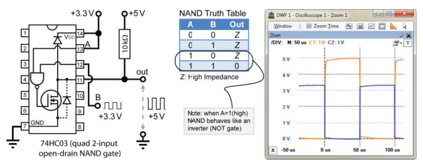

Рисунок 4-27: приклад узгодження рівнів з використанням виходу з відкритим стоком

### З’єднання логічних елементів

Для побудови корисних схем логічні елементи з’єднують між собою та з іншими компонентами. Важливо розуміти, що можливості таких з’єднань мають свої обмеження.

Перше обмеження під час з’єднання логічних елементів пов’язане зі здатністю виходу логічного елемента віддавати або поглинати струм. Коли вихід логічного елемента перебуває у стані логічної “1”, він працює як джерело струму, забезпечуючи струм для підключених логічних елементів або світлодіодів, показаних на рисунку 4-26. Коли ж вихід перебуває у стані логічного “0”, логічний елемент працює як поглинач струму, тобто струм протікає в напрямку до виходу.

На рисунку 4-28(a) це продемонстровано шляхом підключення світлодіода та обмежувального резистора між VCC і виходом логічного елемента, при цьому катод світлодіода підключений до виходу логічного елемента. Коли вихід логічного елемента має високий рівень, різниці потенціалів немає, і світлодіод вимкнений. Коли ж вихід має низький рівень, виникає різниця потенціалів, струм протікає через світлодіод і поглинається виходом логічного елемента. Згідно з даташитом на 74HC08, допустимий вихідний струм $I_O$ становить $\pm 25 \ \text{мА}$, тобто мікросхема може як віддавати, так і поглинати струм до $25 \ \text{мА}$. Перевищення цих значень призведе до пошкодження мікросхеми.

Досить часто виникає необхідність підключити вихід одного (керуючого) логічного елемента до входів кількох інших логічних елементів. Кожен із підключених входів споживає певний струм, що обмежує загальну кількість елементів, які можна під’єднати. Параметр fan-out визначає кількість логічних елементів, підключених до виходу керуючого елемента. Як показано на рисунку 4-28(b), для TTL-логіки максимальний fan-out залежить від співвідношення вихідного струму та вхідного струму у стані логічного “0” ($I_{OL(\text{max})} / I_{IL(\text{max})}$) і у стані логічної “1” ($I_{OH(\text{max})} / I_{IH(\text{max})}$). Для оцінки fan-out беруть менше з цих двох значень, яке зазвичай становить 10 або більше. Параметр fan-in мікросхеми — це кількість входів, які вона має. Для 7408 це логічні елементи AND з двома входами, отже їх fan-in дорівнює 2.

Входи CMOS-логіки мають надзвичайно великий опір і практично не споживають струму, що дозволяє реалізувати великий fan-out (понад 50). Проте кожен вхід додає невелику ємність ($C_L \approx 3–10 \ \text{пФ}$), яку вихід попереднього елемента повинен заряджати та розряджати. Чим більший fan-out, тим більшим є ємнісне навантаження на керуючий елемент, що збільшує час поширення сигналу.

Наприклад, мікросхема 74HC08 має час поширення сигналу $t_{pd}$ приблизно $11 \ \text{нс}$ і вхідну ємність $C_I$ близько $3.5 \ \text{пФ}$. Якщо припустити для спрощення, що це відповідає затримці $t_{pd} = R \times C = 3.5 \ \text{нс}$ на одне підключення, то в разі, коли один 74HC08 керує десятьма іншими такими ж мікросхемами, сумарна затримка становитиме $ 11 + (10 \times 3.5) = 46 \ \text{нс},$ що зменшить максимальну робочу частоту з приблизно $91 \ \text{МГц}$ до близько $22 \ \text{МГц}$.

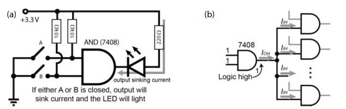

Рисунок 4-28: (a) поглинання струму виходом логічного елемента, (b) приклад fan-out для TTL-логіки

## Аналого-цифрове перетворення

Аналого-цифрові перетворювачі (ADC) використовуються для перетворення аналогового сигналу в його цифрове подання. Підключення зовнішніх ADC до Raspberry Pi (див. розділ 9) дає змогу працювати з багатьма типами датчиків, зокрема з датчиками відстані, температури, освітленості тощо. Водночас з такими входами потрібно бути обережним, оскільки вони не повинні ні віддавати, ні поглинати струм. Аналогові виходи датчиків зазвичай є дуже чутливими до будь-якого додаткового навантаження, підключеного паралельно до виходу. Для розв’язання цієї проблеми спочатку необхідно розглянути принцип роботи операційних підсилювачів.

Аналогові сигнали є неперервними сигналами, які відображають вимірювання певного фізичного явища. Наприклад, мікрофон є аналоговим пристроєм, який зазвичай називають перетворювачем, і він використовується для перетворення звукових хвиль в електричний сигнал. Такий сигнал, наприклад, може змінюватися в діапазоні від −5 В до +5 В залежно від амплітуди звукової хвилі. Аналогові сигнали використовують неперервний діапазон значень для подання інформації. Проте якщо потрібно обробляти цей сигнал за допомогою Raspberry Pi, необхідне його дискретне цифрове подання.

Цифрове подання формується шляхом вибірки сигналу в дискретні моменти часу та подальшої квантизації до дискретних значень напруги або струму. Наприклад, аудіосигнали змінюються з часом, тому для цифрового захоплення мовлення людини (наприклад, у задачах розпізнавання мовлення) під час вибірки сигналу з перетворювача необхідно враховувати два чинники:

- Частота дискретизації. Визначає, як часто виконується вибірка сигналу. Очевидно, що якщо формувати цифрову вибірку напруги раз на секунду, мовлення буде неможливо розпізнати.

- Роздільна здатність дискретизації. Визначає кількість цифрових рівнів, які використовуються для подання напруги в момент вибірки сигналу. Якщо, наприклад, використовувати лише один біт, можна буде зафіксувати лише те, ближче сигнал до +5 В чи до −5 В, і в такому разі мовлення також буде нерозбірливим.

### Частота дискретизації

Для ідеального подання неперервного сигналу в дискретній формі теоретично потрібна нескінченна кількість цифрових даних. На щастя, можливості людського слуху мають природні обмеження, тому можна встановити практичні межі обсягу даних, які необхідно дискретизувати. Наприклад, частоти дискретизації $44.1 \ \text{кГц}$ і $48 \ \text{кГц}$ є типовими для цифрового аудіо під час кодування MP3-файлів. Це означає, що у випадку частоти $44.1 \ \text{кГц}$ потрібно зберігати $44{,}100$ відліків напруги з перетворювача щосекунди.

Частота дискретизації зазвичай визначається вимогами до збереження певного частотного вмісту сигналу. Наприклад, людина (особливо в дитячому віці) здатна сприймати звукові сигнали з частотами приблизно від $20 \ \text{Гц}$ до $20 \ \text{кГц}$. Теорема Найквіста про дискретизацію стверджує, що частота дискретизації повинна бути щонайменше вдвічі більшою за найвищу частотну складову, присутню в сигналі. Отже, якщо потрібно дискретизувати аудіосигнал, необхідно використовувати частоту дискретизації не менше ніж $2 \times 20 \ \text{кГц} = 40 \ \text{кГц}$. Це пояснює порядок величин частот дискретизації, які застосовуються під час кодування MP3-аудіо, — зазвичай близько $44{,}100$ відліків за секунду, тобто $44.1 \ \text{kS/s}$.

### Квантизація

У розділі 9 до Raspberry Pi підключаються 10-бітні та 12-бітні аналого-цифрові перетворювачі для знімання даних з аналогових датчиків. Якщо використовується 12-бітний ADC з опорною напругою $3.3 \ \text{В}$, то дискретизація відбувається в діапазоні від $0 \ \text{В}$ до $3.3 \ \text{В}$. Це означає, що для такої роздільної здатності існує $2^{12} = 4096$ можливих дискретних представлень (числових значень).

Якщо напруга дорівнює точно $0 \ \text{В}$, для її подання використовується десяткове число 0. Якщо напруга дорівнює точно $3.3 \ \text{В}$, для її подання використовується число 4095. Тоді виникає запитання: яку напругу представляє десяткове число 1? Вона дорівнює $\frac{1 \times 3.3}{4096} = 0.00080566 \ \text{В}$. Отже, кожне десяткове число між 0 і 4095 (усього 4096 значень) відповідає кроку приблизно $0.8 \ \text{мВ}$. Наведений раніше приклад із дискретизацією аудіосигналу також ілюструє одну з проблем, з якими доводиться мати справу при роботі з Raspberry Pi. Якщо датчик формує напругу в діапазоні від $-5 \ \text{В}$ до $+5 \ \text{В}$ або, що трапляється частіше, від $0 \ \text{В}$ до $5 \ \text{В}$, необхідно перетворити цей діапазон до $0 \ \text{В} \dots 3.3 \ \text{В}$, щоб він був сумісний з обраним ADC. У розділі 9 буде показано, як розв’язати цю задачу.

Друга, більш складна проблема полягає в тому, що зазвичай не можна відбирати або підводити струм до колів ADC. Для її розв’язання необхідно коротко ознайомитися з потужним поняттям, яке з’явилося ще до цифрових комп’ютерів, — операційним підсилювачем.

### Операційні підсилювачі

Операційні підсилювачі (op-amp) складаються з багатьох BJT або FET, інтегрованих в одному ІС (наприклад, LM741). Вони можуть використовуватися для побудови кількох дуже корисних схем, одна з яких знадобиться в розділі 9 для коректного підключення аналогових датчиків.

#### Ідеальні операційні підсилювачі

На рис. 4-29(a) показано ідеальний операційний підсилювач, увімкнений у найпростішу схему без зворотного зв’язку (тобто з відкритим контуром). Операційний підсилювач має два входи: неінвертуючий (+) та інвертуючий (−), і формує вихідну напругу, пропорційну різниці між ними, тобто
Vout = G (V1 − V2), де V1 і V2 — напруги на відповідних входах.

До основних характеристик ідеального операційного підсилювача належать:

- нескінченний коефіцієнт підсилення у відкритому контурі G;
- нескінченний вхідний опір;
- нульовий вихідний опір.

Жоден реальний операційний підсилювач не має нескінченного коефіцієнта підсилення у відкритому контурі, але значення 200 000–30 000 000 є цілком типовими. Такі величини можна вважати практично нескінченними, що теоретично означає: навіть дуже мала різниця між входами призвела б до абсолютно неприйнятної вихідної напруги. Наприклад, різниця 1 В між V1 і V2 дала б на виході щонайменше 200 000 В. Очевидно, у реальності цього не відбувається, оскільки вихідна напруга обмежується напругами живлення (VCC+ і VCC− на рис. 4-29(a)). Тому, якщо живити операційний підсилювач від Raspberry Pi з VCC+ = +5 В і VCC− = 0 В (GND), максимальна реальна вихідна напруга буде приблизно в діапазоні 0…5 В, залежно від конкретного типу підсилювача.

Аналогічно, реальні операційні підсилювачі не мають нескінченного вхідного опору, але зазвичай він лежить у межах від 250 кΩ до 2 МΩ. Тут використовується термін «імпеданс», а не «опір», оскільки на вході може бути не лише постійна, а й змінна напруга. Так само нульовий вихідний опір недосяжний, але зазвичай він становить менше 100 Ω.

Для наведених далі конфігурацій схем використовується подвійний операційний підсилювач LM358. Це восьмививідна мікросхема в корпусі PDIP, яка містить два операційні підсилювачі з типовим диференціальним коефіцієнтом підсилення у відкритому контурі близько 100 дБ, що відповідає коефіцієнту підсилення за напругою приблизно 100 000 (підсилення в децибелах: 20 × log(Vout/Vin)). Однією з переваг цієї мікросхеми є широкий діапазон напруг живлення — від 3 В до 32 В, що дозволяє використовувати як шину 3.3 В, так і 5 В Raspberry Pi. LM358 зазвичай може віддавати до 30 мА або споживати до 20 мА на виході.

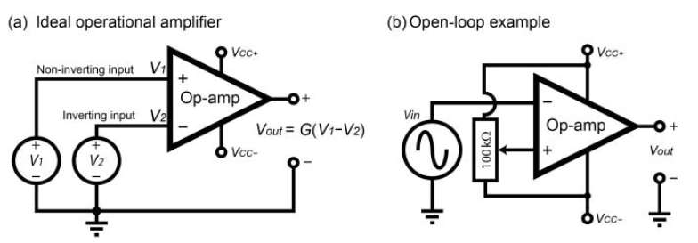

Рисунок 4-29: (a) ідеальний операційний підсилювач, (b) приклад компаратора з відкритим контуром

Поведінку операційного підсилювача з відкритим контуром найзручніше пояснити на прикладі, показаному на рис. 4-29(b). Зверніть увагу, що в цьому випадку вхідна напруга підключена до інвертуючого входу операційного підсилювача (−), а не до неінвертуючого (+). Це означає, що Vout буде додатною тоді, коли Vin є меншою за опорну напругу. Схему зібрано на LM358 з живленням VCC+ = 5 В і VCC− = 0 В (GND). Потенціометр 100 кΩ використовується для зміни напруги на неінвертуючому вході (+). Саме з цією напругою фактично порівнюється вхідна напруга, тому така схема називається компаратором. Коли напруга на інвертуючому вході (−) стає більшою за напругу на неінвертуючому вході (+) навіть на дуже малу величину, вихід швидко насичується в негативному напрямку до 0 В. Коли ж напруга на (−) вході є меншою за напругу на (+) вході, вихід Vout миттєво насичується в позитивному напрямку до максимально можливого рівня, визначеного напругою живлення VCC у цій конфігурації.

Реальний вихід цієї схеми показано на рис. 4-30(a). У цьому випадку потенціометр налаштовано так, що напруга на вході V+ дорівнює 1.116 В. Коли V− є меншою за це значення, вихід Vout насичується до максимального додатного рівня, який у цьому випадку становить 3.816 В (позитивна напруга насичення LM358). Коли V− перевищує 1.116 В, вихід Vout насичується до мінімального рівня, практично рівного нулю (−2 мВ). Зверніть увагу на інверсію, що відбувається.

Якщо всі інші умови залишаються незмінними, але потенціометр налаштувати на інше значення V+, у цьому випадку 0.645 В, вихідний сигнал буде таким, як показано на рис. 4-30(b), де зміниться коефіцієнт заповнення вихідного сигналу Vout. Цю схему компаратора також можна використати для виявлення зниження напруги, наприклад для вмикання попереджувального світлодіода, якщо напруга батареї опуститься нижче заданого рівня. Схема на рис. 4-29(b) може також застосовуватися для формування PWM-сигналу з керованим коефіцієнтом заповнення, який визначається керувальною напругою V+.

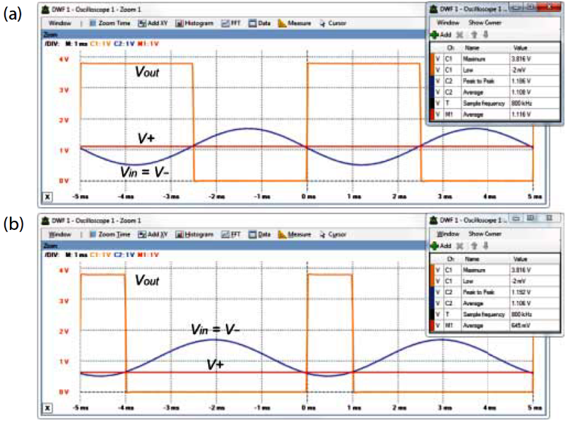

Рисунок 4-30: Вихід компараторної схеми

Дуже велике підсилення у відкритому контурі означає, що операційні підсилювачі зазвичай використовуються зі зворотним зв’язком, який подається на інвертуючий або неінвертуючий вхід ОП. Саме зворотний зв’язок відкриває надзвичайно широкий спектр інших застосувань операційних підсилювачів.

#### Негативний зворотний зв’язок і повторювач напруги

Негативний зворотний зв’язок утворюється тоді, коли вихід операційного підсилювача (Vout) з’єднується з інвертуючим входом (V−). Якщо на неінвертуючий вхід (V+) подати напругу Vin і повільно її збільшувати, то зі зростанням Vin зростала б і різниця між V+ та V−. Однак вихідна напруга також зростає відповідно до залежності $ V_{out} = G ,(V_{+} - V_{-})$ і ця напруга через зворотний зв’язок подається на вхід V−, зменшуючи різницю між входами. По суті, операційний підсилювач намагається підтримувати напругу на інвертуючому вході (V−) рівною напрузі на неінвертуючому вході (V+), регулюючи свій вихід. Наслідком цього є те, що значення Vout стабілізується і стає рівним напрузі Vin на вході V+. Чим більший коефіцієнт підсилення операційного підсилювача, тим меншою буде різниця між V+ і V−, тобто тим ближче вона буде до нуля.

Сам по собі цей ефект не надто корисний, за винятком важливого факту: струм, необхідний для задання напруги на вході, є дуже малим, тоді як операційний підсилювач здатний керувати значно більшими струмами на виході. Оскільки негативний зворотний зв’язок утримує вихідну напругу рівною вхідній, така конфігурація в цілому має коефіцієнт підсилення, рівний 1. Ця схема називається повторювачем напруги або буфером з одиничним підсиленням і показана на рис. 4-31.

Ця конфігурація є дуже важливою, оскільки вона використовується в розділі 9 для захисту АЦП, підключеного до RPi, а також для того, щоб опорна напруга АЦП не змінювалася при підключенні її до зовнішнього кола.

Рисунок 4-31: Схема операційного підсилювача у конфігурації повторювача напруги

#### Позитивний зворотний зв’язок

Негативний зворотний зв’язок є найпоширенішим типом зворотного зв’язку, що використовується з операційними підсилювачами, завдяки його стабілізувальному впливу. Операційний підсилювач у конфігурації з позитивним зворотним зв’язком — це такий підсилювач, у якому вихідна напруга повертається на позитивний, неінвертуючий вхід операційного підсилювача.

У цьому випадку сигнал зворотного зв’язку підсилює вхідний сигнал, а не компенсує його. Наприклад, позитивний зворотний зв’язок можна використати для введення гістерезису в компараторну схему на операційному підсилювачі з відкритим контуром, з’єднавши Vout з входом V+ через резистор позитивного зворотного зв’язку. Такий підхід дає змогу зменшити чутливість компаратора до шумів на вхідному сигналі.

## Завершальні поради

У цьому розділі розглянуто дуже багато матеріалу. Тому на завершення наведено кілька загальних порад щодо роботи з електронними компонентами та Raspberry Pi:

- Ніколи не залишайте входи «плаваючими». Використовуйте підтягувальні (pull-up) або стягувальні (pull-down) резистори для всіх кнопок і перемикачів. Перевіряйте, чи не потрібно невикористані виводи мікросхем під’єднати до логічної «1» або «0».
- Переконайтеся, що всі точки GND у схемі з’єднані між собою.
- Завжди подавайте на мікросхеми правильний рівень живлення.
- Не припускайте, що новий діод, FET, BJT або логічний елемент має таке саме розташування виводів, як попередній компонент, який ви використовували.
- Як і в програмуванні, спочатку зберіть просту схему, перевірте її роботу, і лише потім додавайте наступний рівень складності. Ніколи не вважайте, що «воно й так працює».
- Не залишайте з’єднання дротів і крокодильчики підвішеними так, щоб вони могли випадково торкнутися один одного. Те саме стосується резисторів на макетній платі.
- Використовуйте пласку викрутку для виймання мікросхем з макетної плати, оскільки дуже легко зігнути їхні виводи так, що вони стануть непридатними.
- CMOS-мікросхеми чутливі до статичної електрики. Дотик до них пальцями може пошкодити їх через накопичення статичного заряду на тілі. Перед роботою торкніться задньої частини комп’ютера або іншого заземленого металевого предмета.
- Не припускайте, що компоненти мають точні або стабільні параметри, зокрема це стосується коефіцієнта підсилення транзисторів і допусків резисторів.

## Підсумок

Після завершення цього розділу ви, ймовірно, зможете:

- Описувати базові принципи роботи електричних кіл, збирати схеми на макетних платах і вимірювати напругу та струм.
- Використовувати дискретні компоненти, такі як діоди, світлодіоди, транзистори та конденсатори, у власних схемах.
- Застосовувати транзистори та FET як ключі для керування струмами та напругами, більшими за ті, які можуть безпосередньо забезпечити виходи Raspberry Pi.
- З’єднувати та узгоджувати логічні елементи, приділяючи особливу увагу проблемам «плаваючих» входів.
- Пояснювати принципи аналого-цифрового перетворення та проєктувати базові схеми на операційних підсилювачах.
- Поєднувати всі ці навички для побудови схем, необхідних для безпечного підключення до GPIO Raspberry Pi.

## Додаткові джерела

Документи та посилання для подальшого читання наведені по всьому розділу, але також варто звернути увагу на такі матеріали:

- T. R. Kuphaldt, “Lessons in Electric Circuits” — безкоштовна серія підручників з електрики та електроніки: [www.ibiblio.org/kuphaldt/electricCircuits/](http://www.ibiblio.org/kuphaldt/electricCircuits/).
- All About Circuits: [www.allaboutcircuits.com](http://www.allaboutcircuits.com/) — багато прикладних пояснень і схем з електроніки.
- The Electronics Club: [www.electronicsclub.info](http://www.electronicsclub.info/) — електронні проєкти для початківців і довідкові матеріали.
- Neil Storey, Electronics: A Systems Approach, 5-те видання, Нью-Йорк: Pearson, 2013.

Повний перелік компонентів, використаних у цьому розділі:

- Макетна плата
- Діоди: 1N4001, світлодіод загального призначення
- Транзистори: NPN — BC547, FET — BS270
- Стабілізатор напруги: KA7805 / LM7805
- PTC: 60R110
- Кнопки та перемикачі: загального призначення SPST і SPDT
- Мікросхеми: 74HC73N, 74HC03N, 74LS08N, 74HC08N, 74HC14, LM358N
- Резистори: 1 MΩ, 2.2 kΩ, 2 × 10 kΩ, 50 kΩ, 100 Ω, 50 Ω, 1 kΩ, 470 Ω, 220 Ω, потенціометр 100 kΩ
- Конденсатори: 10 μF, 1 μF, 0.33 μF, 0.1 μF
- Оптоізолятор: SFH617A

## Джерела

1.  [Molloy, Derek. *Exploring Raspberry Pi: Interfacing to the Real World*. Chichester: Wiley, 2016](http://www.exploringrpi.com)

## Автори

Molloy, Derek. *Exploring Raspberry Pi: Interfacing to the Real World*. Chichester: Wiley, 2016

## Feedback

Якщо Ви хочете залишити коментар у Вас є наступні варіанти:

- [Обговорення у WhatsApp](https://chat.whatsapp.com/BRbPAQrE1s7BwCLtNtMoqN)
- [Обговорення в Телеграм](https://t.me/+GA2smCKs5QU1MWMy)
- [Група у Фейсбуці](https://www.facebook.com/groups/asu.in.ua)

Про проект і можливість допомогти проекту написано [тут](https://asu-in-ua.github.io/atpv/)