[<- До підрозділу](README.md)		[Коментувати](#feedback)

# Загальні поняття в Eplan: теоретична частина

Це чернетка зроблена зі старих матеріалів, потребує зміни копій екранів з російськомовного інтерфейсу на англійську мову. Хто готовий допомогти -  доєднуйтеся до  [однієї з груп](#feedback)

## 1. Основні програмні продукти Eplan

Eplan Electric P8 — програмне забезпечення з класу систем автоматизованого проектування (САПР), для проектування електротехнічних рішень та створення відповідної документації.

Eplan PPE — програмне забезпечення САПР для проектування апаратурно-технологічних схем і польового обладнання АСУ ТП. Доступний як у вигляді окремого пакету, так і додаткового модуля, який інтегрується в Eplan Electric P8.

Eplan Fluid — програмне забезпечення САПР для проектування пневмогідравлічних рішень (Fluid-техніка) разом з електротехнічними рішеннями, і автоматичного створення відповідної проектної документації. Доступний як у вигляді окремого пакету, так і додаткового модуля, який інтегрується в Eplan Electric P8.

Eplan Pro Panel — додатковий програмний модуль, який дозволяє за вибором розміщувати електротехнічні пристрої та пристрої fluid-техніки з проекту Eplan, з бази даних виробів Eplan або з Eplan Data Portal. У з'єднанні з такими механічними компонентами, як кабельканали, несучі шини, монтажні плати або цілі електрошафи, Eplan Pro Panel дозволяє реалізувати складні креслення монтажних поверхонь в тривимірному зображенні.

Eplan Data Portal — додатковий програмний модуль, за допомогою якого можна використовувати вироби різних виробників, доступні в онлайн з WEB-сервера Eplan.

## 2. Проєкт

### Поняття проекту

Проєкт — це база даних, в якій міститься вся інформація стосовно розроблюваної (проектованої) системи. До проекту відноситься файл проекту (`. elk`), а також каталог, в якому зберігається база даних і специфічні для проекту основні дані. Файли проектів можуть мати різні розширення типу файлу, в залежності від особливості їх використання, наприклад:

- `.elk`: стандартний проект;
- `.elp`: упакований проект (стиснутий в один файл);
- `.elr`: закритий проект / початковий проект (з захистом від запису).

### Графіка та логіка

Проект Eplan містить графічну і логічну інформацію. Графічні дані зберігаються в відображуваних на схемах символах. Логічні дані зберігаються в базі даних проекту у вигляді визначень функцій.

У зв'язку з цим в системі Eplan підтримуються обидва підходи до розробки проекту: 

- графічні креслярські принципи роботи (починаючи від схеми): наприклад, подібно AutoCAD можна копіювати сторінки, розміщувати графічні символи, малювати елементарні фігури і т.д; при цьому автоматично створюються дані про пристрої з прив'язаними функціями;
- логічні принципи роботи (починаючи від даних): наприклад робота з пристроями і виробами (створення нових, вставка існуючих) з можливим подальшим їх розміщенням на схемах.

Обидва підходи можна поєднувати. 

### Об'єкти та властивості

У Eplan підтримується об'єктно-орієнтований підхід, тобто, всі елементи проекту є об'єктами з набором специфічних для нього властивостей. Кожна властивість характеризується унікальним ім'ям властивості і номером властивості. Для відображення номера властивості має бути активований пункт: `File -> Settings -> User -> Display -> User Interface ->Display Identifying Numbers`

Для зручності перегляду властивостей, вони поділені на різні категорії властивостей. Таким чином, вибравши конкретну категорію можна відобразити тільки властивості, що належать цій категорії. На рис.1 показані властивості всього проєкту. Ідентифікатор властивості вказані в межах знаків `<` та `>`. Наприклад, з усім проектом пов'язаний однойменний об'єкт, що володіє своїм набором властивостей, наприклад `Project description <10011>`.

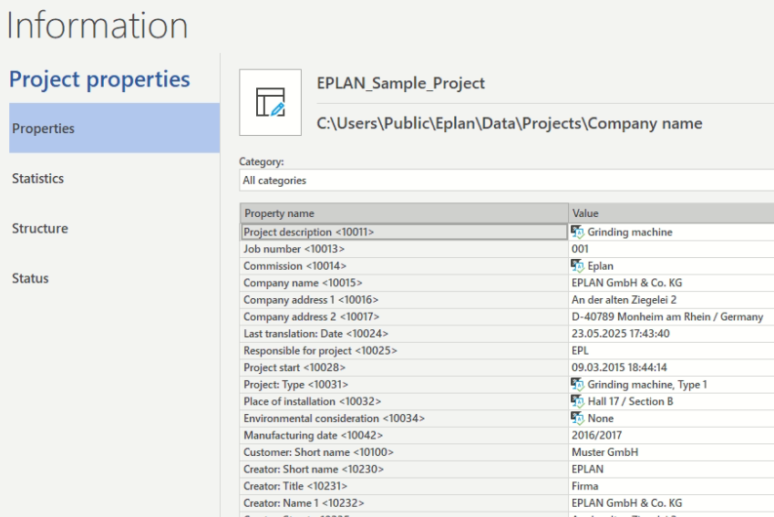

Рис.1. Вікно властивостей проекту

Для декількох вибраних об'єктів можна провести групову обробку властивостей, тоді змінені однойменні властивості змінюються одночасно для всіх вибраних об'єктів.

### Структурні ідентифікатори

Всі сторінки Eplan повинні мати унікальне ім'я, а пристрої - унікальне позначення. Повне ім'я сторінки та повне позначення пристрою включають структурні ідентифікатори рівнів і підрівнів, в яких вони знаходяться, таким чином, організовуючи ієрархічну структуру. Це дає додаткові зручності при роботі з проектом. Детально про формування структурних ідентифікаторів можна почитати в посібнику в розділі [Формування структурованих позначень відповідно до IEC81346: теоретична частина](../../prjdocsdstu/refdesig/teor.md). 

Так, наприклад, повне ім'я сторінки `Air conditioning unit` з Рис.2 включає структурні ідентифікатори, які описані в таблиці 1.

Табл.1. Структурні ідентифікатори для повного імені сторінки `=EC1+A3&EFS1/1`

| Ідентифікатор | Значення                                                     |
| ------------- | ------------------------------------------------------------ |
| `=`           | Функціональна ознака                                         |
| `EC1`         | ідентифікатор функції  ->  `Cooling` (див. рис.4)            |
| `+`           | просторова ознака (де розміщено)                             |
| `A3`          | ідентифікатор місця розміщення -> `Air conditioning unit` (див. рис.4) |
| `&`           | тип документу                                                |
| `EFS1`        | ідентифікатор типу документу -> `Electrical engeeniring schematic` (див. рис.4) |
| `/`           | Розділювачі перед ім'ям сторінки                             |
| `1`           | Ім'я сторінки                                                |

Як видно, таке ієрархічне будова імен сторінок дає можливість переглядати всі сторінки в навігаторі сторінок у вигляді дерева, але це не єдина перевага в структуруванні. Крім того, структура ідентифікаторів Eplan може відповідати системі позначення згідно певним стандартам (див. [Стандарти в Eplan: теоретична частина](../standards/teor.md)).

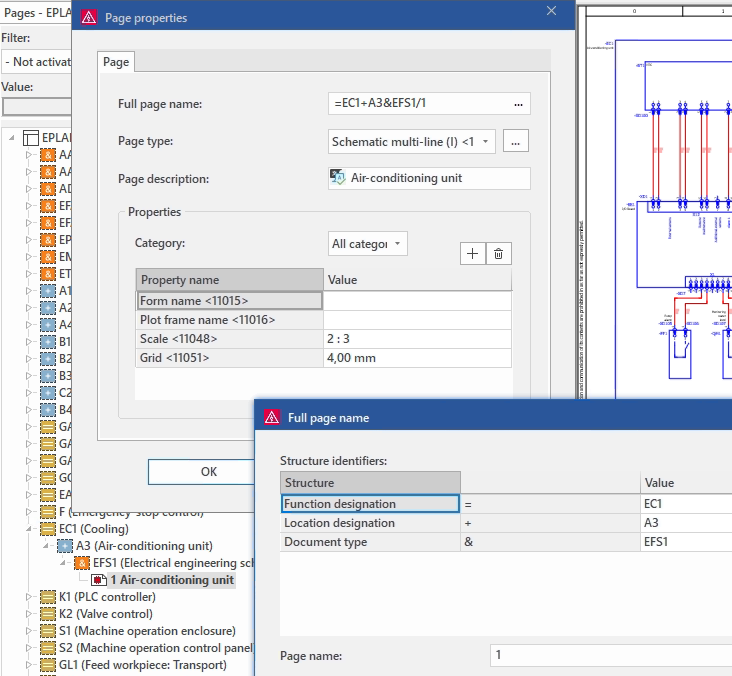

Рис.2. Приклад формування повного імені сторінки

В системі Eplan під структурою проекту розуміється об'єднання всіх використаних в проекті структур ідентифікаторів для об'єктів, сторінок, пристроїв і функцій. Для різних типів об'єктів проекту можна означити свою структуру (глибину вкладення) використовуючи відповідні налаштування, або обумовлену групу налаштувань (схему налаштувань), які вказуються у властивостях проекту, у розділі `Structure` (рис.3). У цих настройках вибирається наявність кожного рівня в структурі ідентифікатора конкретного типу об'єкта.

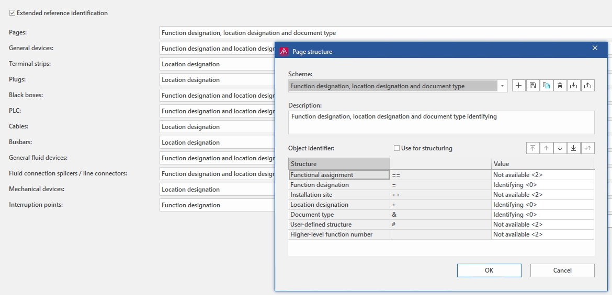

Рис.3. Означення структури проекту

Позначити необхідні ідентифікатори (задати позначення ідентифікаторів і їх опис) можна централізовано через пункт меню: `Tools -> Strucuture  identifiers`  

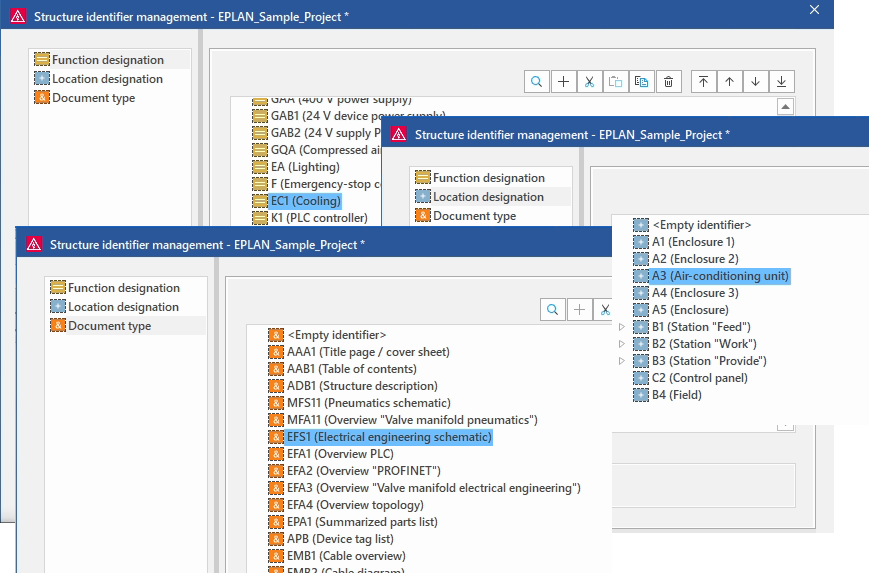

рис.4. Вікно налаштування структурних індентифікаторів  

Перелік структурних ідентифікаторів можна вивести в звіт (див. [Звіти в Eplan: теоретична частина ](../reports/teor.md))

### Операції з проєктом

Проєкт може бути створений на базі шаблонів проектів або базових проєктів, з яких в проект копіюється деяка інформація. Більш детально про шаблони і базових проектах буде розглянуто в розділі 6.

Проєкти можна створювати, перейменовувати, видаляти, відкривати і закривати через меню "File". Для зручності перенесення проект можна запакувати та розпакувати.

## 3. Обробка логічних і графічних даних проекту

### Сторінки

Всі схеми, креслення, описи робляться в сторінках. Тобто сторінки містять графічну частину проекту. З іншого боку сторінка - це об'єкт зі своїм набором властивостей. Перелік сторінок доступний через навігатор сторінок, приклад фрагменту якого показано на рис.2. Більш детально про сторінках і схемах розглянуто в розділі [Створення схем в Eplan](../pages/README.md).

### Функції та символи

В Eplan логічні та графічні дані керуються окремо. Логічні дані зберігаються у означеннях функцій (function definitions), а графічні дані – у символах (symbols). Такий поділ є важливим під час роботи за інженерним підходом і надає низку додаткових переваг для сучасного CAE-продукту, зокрема незалежність від стандартів.

Eplan підтримує як символо-орієнтований підхід до креслення (копіювання сторінок, додавання макросів, розміщення символів тощо), так і пристроє-орієнтований підхід, що базується на інженерному підході (робота з пристроями, попередньо означені списки, навігатори, «використати наявне» тощо).

- Під час роботи за символним підходом не потрібно перейматися функціями та означеннями функцій. Означення функцій уже призначені символам у стандартних бібліотеках символів. Необхідно просто розмістити символ або макрос, і призначені за замовчуванням означення функцій автоматично додаються.

- Натомість, якщо працювати за пристроє-орієнтованим інженерним підходом або необхідно змінювати звіти, нумерацію тощо, необхідно розуміти концепцію функцій.

Таким чином, логічні дані Eplan представляються через функції. **Функція** (**function**) є найменшою логічною одиницею, якою керує Eplan в моделі даних. Наприклад, замикаючі контакти, котушки й дроти є функціями. Графічно (на схемах) функції представляються через символи. **Символ** (**symbol**) – це уніфікована графіка для представлення функцій. Детальніше про символи нижче.

### Означення функції

Набір властивостей функцій, а також правила їх обробки залежать від того, до якого **означення функції** (**function definition**) вони належать. Тобто, функції є конкретними екземплярами означення функції. Можна провести аналогію з об'єктно-орієнтованим програмуванням: означення функції можна вважати класом об'єкта, а функції - екземплярами. Таким чином, наприклад, частина контактів будуть прив'язані до означення `NO contact, general`, А частина до `NC contact, general`. Кількість функцій в проекті обмежена тільки пам'яттю ПК, тоді як означення функцій є базовою частиною Eplan і не можуть змінюватися користувачем.

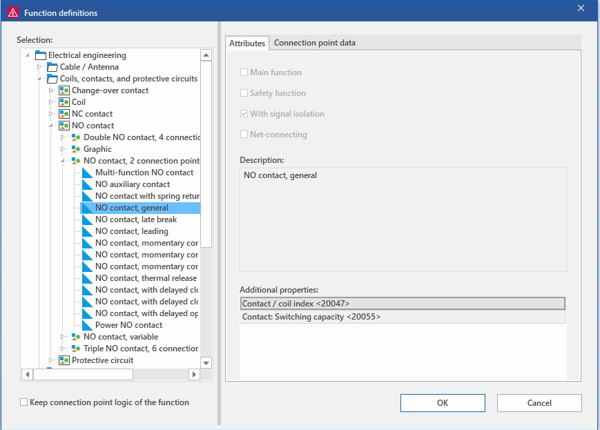

рис.5. Приклад вибору означення функції

Означення функцій і символи знаходяться в бібліотеках Eplan. Кожне означення функції прив'язане до одного основного символу, а кожному символу приписані означення функцій. Завдяки цьому можна скористатися двома підходами при створенні проектної документації:

- одразу рисувати схеми з'єднань, розміщуючи компоненти (див. нижче), вибираючи символ прямо з бібліотеки: після розміщення компонентів, в логічних даних проекту з'являються функції, на підставі означення функції, приписаного для цього символу;

- створювати функції в проекті, після чого (при необхідності) розміщувати їх на схемах з'єднань, означуючи символ, або залишаючи основний символ (за замовчуванням) для цієї функції.

### Компонент (component)

Розміщена на схемі функція через символ  в Eplan називається **component** (в локалізаціях зустрічається термін "умовне позначення"). Таким чином, компонент з'єднує логіку з графікою. Символ містить тільки графіку, в той час як з функції потрапляє логічна інформація (точніше з означення функцій). Так, наприклад, розміщуючи функцію котушки на схемі з'єднань, означують його графічне відображення через один із доступних символів з бібліотеки проекту, при цьому залишається зв'язок між символом і функцією. На рис.6 зображене налаштування компоненту

Рис.6 Вікно налаштування компоненту через функції та її відображення 

Для компоненту можна змінити як означення функції так і символ. На рис.6 означення функції змінюється через кнопку в полі  `Definition`, після чого розробник може вибрати потрібне означення з вікна вибору, показаного на рис.5. Так само він може змінити символ для компоненту через вікно вибору символу з бібліотеки (рис.7)

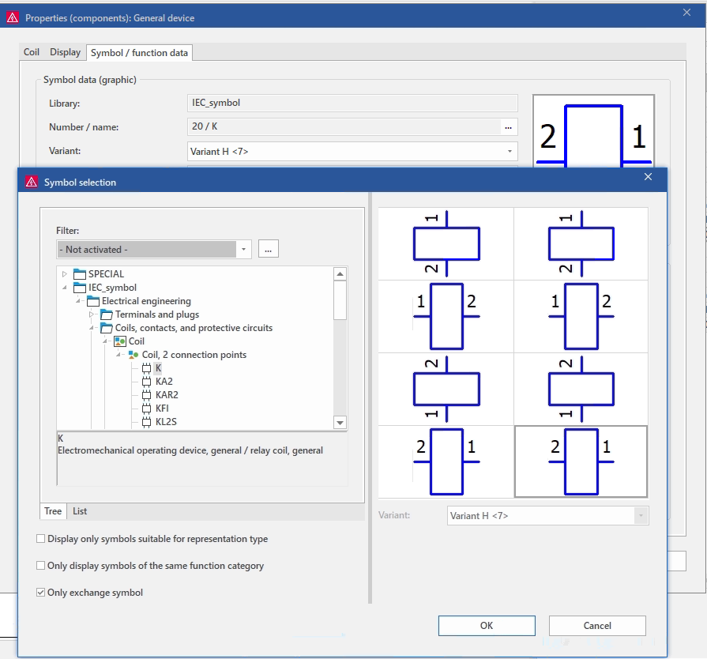

 рис.7. Приклад вибору символу для компоненту

### Пристрої, тег пристрою (DT), елемент пристрою

У системі Eplan функції можуть бути тільки в складі пристроїв. **Пристрої (devices)** – це логічні електричні або гідравлічні чи пневматичні вузли, які ідентифікуються як окремі сутності. 

Пристрій складається з однієї або кількох функцій (двигун, котушка, нормально розімкнутий контакт NO, нормально замкнутий контакт NC тощо). Так, наприклад, пристрій типу контактор складається з однієї функції котушки і однієї або кілька функцій контактів.

Кожен пристрій в проекті ідентифікується через унікальне позначення пристрою або **тег пристрою** (**DT**, **device tag**). На схемі тег відображається у спрощеному вигляді, зручному для читання, наприклад: `M1`, `K1`, `X1`, `XS1`, `W1`. Це є відображуваний тег (Diasplayed DT). У той же час повний тег пристрою (Full DT) забезпечує унікальну ідентифікацію пристрою в межах всього проєкту.  На рис.8  тег пристрою для відображення - `K1`, тоді як повний тег - `=EC1-A3-EC1-QA1-K1`.   

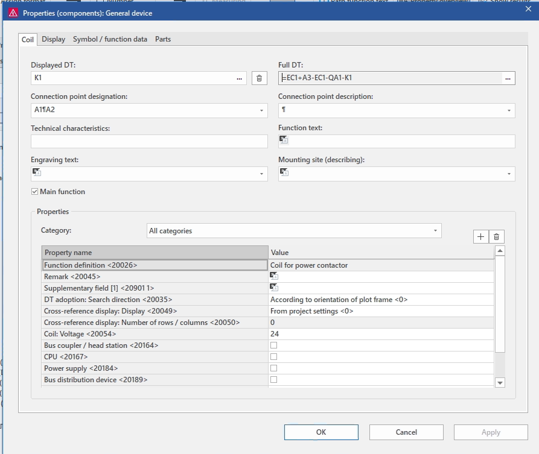

рис.8. Властивості пристрою котушка

Повний тег пристрою складається з ідентифікатора структурної частини та структурного DT, що включає всі рівнів вкладеності пристроїв. Як формується повний тег пристрою можна подивитися і модифікувати через кнопку вибору в цьому ж полі. Вікно перегляду має вигляд як на рис.9.

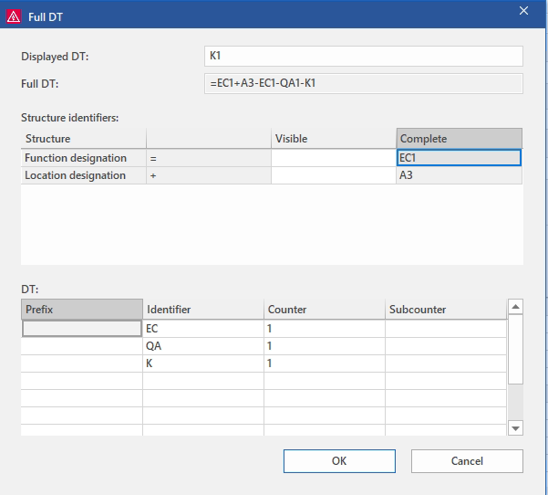

рис.9. Означення повного тегу пристрою

Пристрої можна подивитися у навігаторі пристроїв (Device Navigator), які надають деревовидну навігацію саме через ієрахічність. Варто зауважити, що навігатор пристроїв не показує функції з типом представлення `External` та `Graphic`, бо ці типи не є елементами (див. ничже) в моделі даних Eplan, а лише формами графічного або зовнішнього представлення. Детальншіе про це буде розглянуто в інших розділах посібника.

Зрештою, ієрархічність тега пристрою співпадає з ієрархією в продуктному аспекті, згідно  IEC 81346 (див [Формування структурованих позначень відповідно до IEC81346: теоретична частина](../../prjdocsdstu/refdesig/teor.md)).  На рис.10 видно що `-K1`  є частиною `-QA1` , який є частино `-EC1`.    

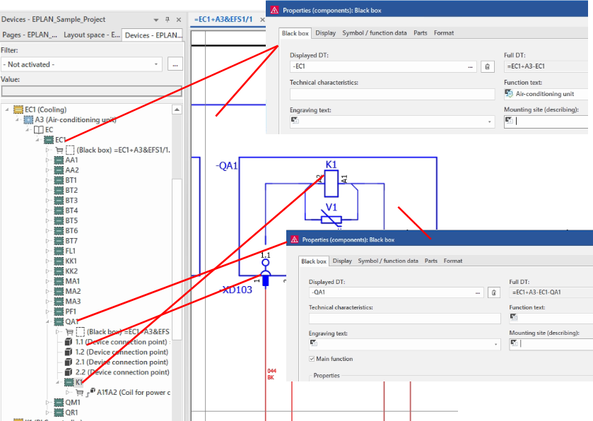

рис.10. Принципи формування ієрархічного тегу пристрою.

При створенні в проекті функції, їй присвоюють тег пристрою (DT), тобто вказують, якому пристрою вона належить. Таким чином, кілька функцій з однаковим DT належать одному пристрою. Наприклад, функція котушки і контактів, що мають один і той же DT `+EB3+ETA-К1` будуть частиною одного й того ж контактора. Якщо, при створенні функції, пристрої з вказаним DT не існує, то Eplan автоматично створює його. Якщо ж DT не вказано, то функція буде розміщена в спеціальному пристрої без DT. 

Одна з функцій пристрою позначається як **основна функція** (**main function**) і саме вона представляє пристрій у логічній моделі проєкту. Вона означує ідентичність пристрою, несе його повний DT та використовується для призначення виробу. Інші функції з тим самим DT належать до цього ж пристрою, але не є його представниками в навігаторі.

Пристрій може складатися з одного або кількох елементів. **Елемент** (**item**) — це складова частина пристрою, яку не можна далі структурно розкласти в межах логічної моделі Eplan, наприклад двигун, клема, штекер (male), допоміжний блок або кабель. Елементу може бути призначений номер виробу (part number), тобто зазвичай елемент відповідає конкретному виробу. Елементи можуть графічно відображатися, зокрема, на монтажній панелі.

### Вироби 

**Виріб** (**part**) – це конкретна реалізація елемента, доступна через базу даних виробів. Кожен виріб характеризується економічними та технічними характеристиками і має конкретний унікальний в межах проекту номер виробу.

Вироби можуть містити шаблони використаних функцій, макроси, що дає можливість створювати пристрої з набором функцій шляхом вибору потрібного виробу. Інший шлях використання – прив'язка до елементу пристрою, вказавши номер виробу в головній функції.

На рис.11 показаний елемент котушки `K1` прив'язаний до виробу з конкретним ідентифікатором.  

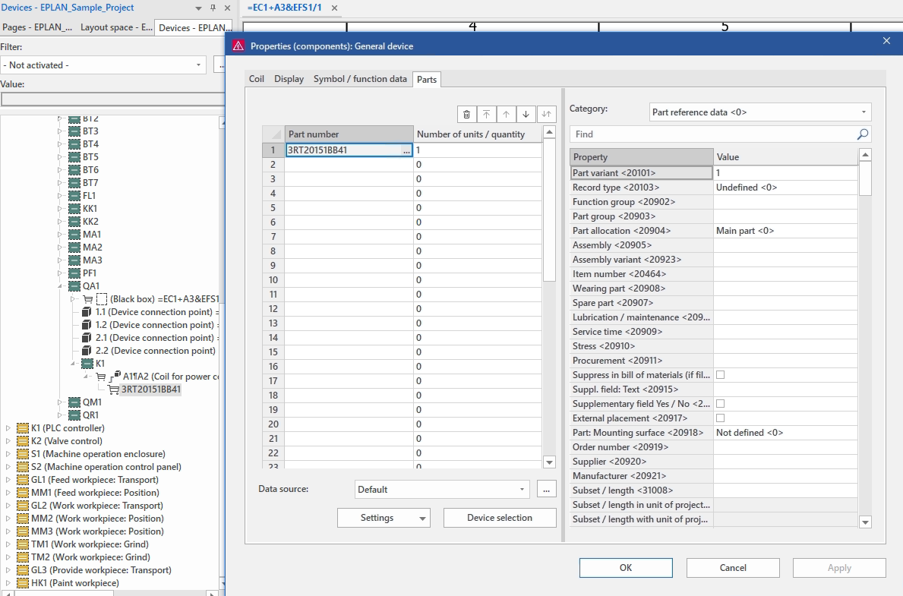

рис.11. Приклад виробів

База даних виробів доступна для редагування, імпорту та експорту. Детальніше робота з виробами розглянута в [Вироби в Eplan: теоретична частина ](../parts/teor.md).

### Збираючи все докупи

Тепер варто ще раз розібрати наведені вище сутності ієрархії (див. також  [Формування структурованих позначень відповідно до IEC81346: теоретична частина](../../prjdocsdstu/refdesig/teor.md)).  У контексті IEC 81346 об’єкт може описуватися в різних аспектах, це повністю відображається в концепції Eplan: функції в Eplan належать до функціонального аспекту (префікс `=`) і відображають, яку роль виконує об’єкт у системі. Пристрої та їх елементи (items) належать до продуктного аспекту (префікс `-`) і описують фізичну структуру виробу. Монтажний аспект (префікс `+`) означує місце встановлення об’єкта (просторовий аспект). Повний DT формується як комбінація цих аспектів. Отже:

- Функція може бути пов’язана з елементом пристрою, але сама по собі не є окремим елементом. Наприклад, релейний вихід ПЛК містить функції котушки та контакту, однак вони не є самостійними елементами виробу і не розглядаються як окремі замінні складові.
- Розміщена на схемі функція є розміщеною функцією (placed function) і відображається за допомогою символу. Компонент у цьому сенсі поєднує логіку та графіку: символ містить лише графіку, тоді як логічна інформація визначається функцією, точніше - з означення функції (function definition), яке означує тип об’єкта та його поведінку в проєкті. Це означає, що на принципових схемах розміщуються функції, а не елементи. На монтажних сторінках відображаються вироби та їх елементи.
- Електрична, гідравлічна або пневматична поведінка описується функціями, а не елементами, тому кожен елемент може містити одну або кілька функцій.
- Пристрій складається з елементів, які реалізують певні функції та можуть бути пов’язані з виробами. Виріб має власний ідентифікатор (наприклад, артикул виробника) і означує конкретний фізичний засіб реалізації пристрою.
- Функції з однаковим DT (device tag) формують один пристрій, незалежно від місця їх розміщення в проєкті. У межах пристрою одна з функцій позначається як головна (main function) і представляє його в навігаторах та під час призначення виробу.

Розглянемо цю ідею через пояснення на рис.12. 

Усі функції, що мають однакове позиційне позначення пристрою `K1`, належать до одного пристрою. Отже, пристрій `K1` складається з таких функцій:

- котушка силового контактора `A1`;`A2`
- силові замикаючі контакти `1;2`, `3;4` та `5;6`
- допоміжний замикаючий контакт `13`;`14`
- допоміжний розмикаючий контакт `21;22` (не розміщений)
- допоміжний розмикаючий контакт `58;59`.

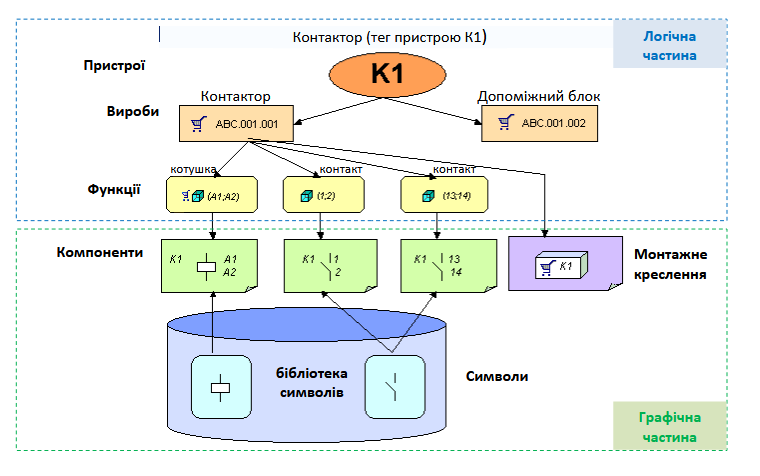

Рис.12. Структура пристроїв і їх відображення на прикладі контактора

Отже з рис.12 можемо сказати наступне:

- Два вироби введені як елементи на основній функції `A1;A2`: 
  - силовий контактор з шаблонами функцій:
    - `котушка силового контактора A1;A2` 
    - `силові замикаючі контакти 1;2, 3;4 і 5;6`, 
  - допоміжний контактний блок із шаблонами функцій:
    -  `допоміжний замикаючий контакт 13;14`, 
    - `допоміжний розмикаючий контакт 21;22`, 
    - `допоміжний розмикаючий контакт 31;32` 
    - `допоміжний замикаючий контакт 43;44`.
- Допоміжні контакти `43;44` і `31;32` ще відсутні в проєкті та відображаються в навігаторі як вільні шаблони над шаблонами функцій, збереженими у виробі. Відповідно, їх можна вставити на схему, при цьому буде створено відповідний компонент.

- Допоміжний контакт `21;22` наявний у проєкті, але не розміщений на жодній сторінці.

- Допоміжний контакт `58;59` також належить до пристрою `K1`, але не відповідає жодному з шаблонів функцій призначених виробів. Відповідна перевірка може повідомити про таку ситуацію.

### Точки підключення та з'єднання

Взаємодія між функціями в проекті Eplan може проводитися через **точки підключення** (**connection point**), які  впроваджені в неї і керуються нею, і тому розглядаються тільки в зв'язку з функцією. Зв'язок точоr підключення відбувається графічно через **з'єднання** (**connection**). З'єднання створюються в схемах з'єднань автоматично, шляхом розміщення точко підключення компонентів один напроти одного.

Так, наприклад на рис.17 показані два компонента (котушка та контакт), кожен з яких має по дві точки підключення, можуть бути з'єднані між собою. Наприклад, точка підключення А2 котушки К3 з'єднується з точкою підключення 13 контакту К1. Слід зазначити, що цей зв'язок буде не тільки графічним (між символами), а і логічним (між точками підключень функцій). Іншими словами, система Eplan відстежує ті функції, з якими буде пов'язана кожна точка підключення функції.

Більш детально про з'єднаннях буде розглянуто в розділі [З'єднання в Eplan: теоретична частина ](../connection/teor.md).

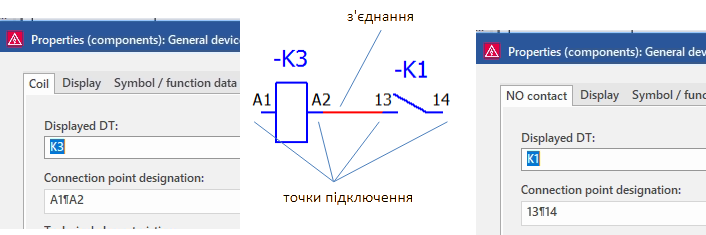

Рис.17. точки підключення пристрою функції, їх позначення і з'єднання

### Властивості функції 

Кожна функція і її точки підключення мають властивості, значення яких використовується при логічній обробці даних (наприклад, при генеруванні специфікацій за даними проєкту). Для котушок, наприклад, існує властивість `Coil: Voltage` (рис.18). Таким чином, наприклад, при формуванні звітів, ці властивості можна вивести у потрібному місці у потрібній формі. Також ці та інші властивості функцій / точко підключення використовуються для генерування інших типів звітів, перевірки коректності з'єднань і ін.

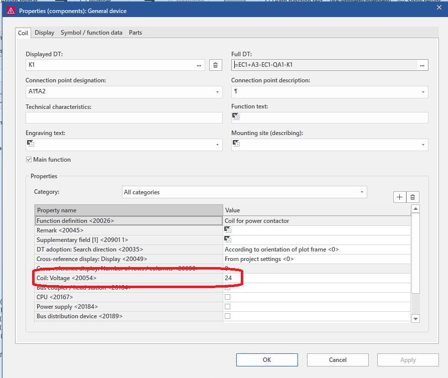

рис.18. Властивості функцій

### Представлення функцій на різних схемах

Одна і та ж функція, може бути представлена на різних схемах. Наприклад, головна функція пристрою `K1` (котушка) може бути розміщена одночасно на багатополюсній і однополюсній схемі з'єднань, а також на схемі типу огляд. При цьому її зображення на цих схемах буде відрізнятися. При обробці виділеного компоненту, наприклад функціонального тексту, будуть оброблятися тільки властивості цього компоненту. Однак використовуючи режим `Properties (Global)...` можна одночасно обробляти властивості (наприклад, функціональний текст) для всіх представлень головної функції. С

### Перевірка даних проєкту

Під час опрацювання проєкту може виникнути протиріччя, електротехнічні та логічні помилки. Такі помилки при проєктуванні можуть призвести до невірних або неповних звітів. Eplan дозволяє виконати логічну перевірку сторінок схеми з'єднань. Інформація про невідповідності, виявлених при перевірці, виводиться у вікні керування повідомленнями `Tools->Messages`

рис.19. Повідомлення при перевірці проєкту

Для перевірки правильності даних необхідно зробити перевірку: `Tools -> Check`.  Більш тонка настройка перевірки проводиться через налаштування проєкту. 

### Поняття звітів

**Звіти** (**Reports**) – це результат автоматичної обробки логічних даних проекту у вигляді графічних сторінок звітів (графічні звіти) або зовнішнього файлу Excel (маркування або зовнішні звіти). Процес обробки для графічних звітів називається генеруванням звіту, а для зовнішніх – вивід маркування. Прикладом графічного звіту може бути згенерувала схема підключення пристроїв, зовнішнього – перелік елементів в таблиці Excel.

Звіти можна розміщувати безпосередньо в існуючу сторінку проекту (вбудовані звіти), наприклад для переліку умовних позначень. Спосіб обробки даних і формування результату означується типом звітів. Більш детально про звіти буде розглянуто в розділі [Звіти в Eplan: теоретична частина ](../reports/teor.md).

## Джерела

1. Методичні рекомендації до використання САПР Eplan Electric P8 в навчальному процесі для студ. напряму 6.050202 «Автоматизація та комп’ютерно-інтегровані технології» денної та заочної форм навчання./Уклад.: Д.В.Мацебула, О.М.Пупена,. – К.: НУХТ, 2013. – 76 с.
2. https://www.Eplan.help
3. https://www.Eplan.help/en-us/Infoportal/Content/Plattform/2026/Content/htm/xfctdefbrowsergui_k_betriebsmittel.htm?tocpath=Eplan%20Platform%7CUsing%20Functions%20and%20Devices%7CFunctions%7CBasics%7C_____2

## Автори

Теоретичне заняття розробив [Олександр Пупена](https://github.com/pupenasan). 

## Feedback

Якщо Ви хочете залишити коментар у Вас є наступні варіанти:

- [Обговорення у WhatsApp](https://chat.whatsapp.com/BRbPAQrE1s7BwCLtNtMoqN)
- [Обговорення в Телеграм](https://t.me/+GA2smCKs5QU1MWMy)
- [Група у Фейсбуці](https://www.facebook.com/groups/asu.in.ua)

Про проект і можливість допомогти проекту написано [тут](https://asu-in-ua.github.io/atpv/)
