[<- До підрозділу](README.md)		[Коментувати](#feedback)

# ПЛК в Eplan: теоретична частина 

Це чернетка

Багато програмованих контролерів (програмованих логічних контролерів, PLC) є проєктно-компонованими виробами, тобто можуть набиратися з модулів залежно від задачі. Наприклад, це можуть бути процесорні модулі, модулі вводу/виводу, модулі живлення, комунікаційні модулі, модулі спеціального призначення.

Для підключення до PLC зовнішніх кіл вимірювання та керування модулі оснащуються різними типами точок підключення (гвинтові, пружинні, роз’ємні тощо). Однак доступ до вхідних і вихідних даних здійснюється як до логічних каналів, яким у межах PLC призначається унікальна адреса. Схеми підключення зовнішніх кіл до точко підключення модулів PLC, призначення каналів, а також їх адресація залежать від виробника та типу PLC.

## Логічна структура PLC в EPLAN

У термінах EPLAN наведені вище модулі називаються **картами PLC** (**PLC cards**). Таким чином, контролер може містити одну або декілька карт PLC. На одній карті PLC може бути розташовано кілька каналів PLC (PLC Channels). Кожному каналу PLC присвоюється однозначна адреса каналу PLC.

В EPLAN карти PLC є пристроями, що містять кілька типів функцій: блок PLC і різні варіації виводів пристрою PLC. Блок PLC містить властивості модуля в конфігурації PLC. На схемах з’єднання він за замовчуванням відображається символом, подібним до чорного ящика. Одна карта може бути зображена розподілено кількома блоками. У цьому випадку дані карти PLC необхідно вводити в тому блоці PLC, який оголошений головною функцією. В інших блоках також можна вказати дані, але вони не враховуються в логіці проєкту.

Вивід пристрою PLC належить до карти PLC або до каналу на карті та відповідає звичайному виводу пристрою EPLAN, але містить додаткову інформацію (наприклад, адресу, символічну адресу). Вивід пристрою PLC вноситься в схему з’єднань як звичайна клема. Позначення виводу пристрою завжди присвоюється карті PLC.

На рисунку показані блоки PLC і виводи пристрою PLC для відповідного модуля.

Графічно виводи пристрою PLC можуть розміщуватися всередині блоків PLC або поза ними. Якщо виводи пристрою PLC графічно розміщуються поза блоками PLC, їм необхідно присвоїти ОП карти PLC, таким чином вони прив’язуються до одного з блоків PLC.

Для перегляду всіх даних карт PLC існує навігатор PLC. У прикладі в навігаторі PLC видно, що карта DI1 містить чотири блоки PLC, умовні позначення яких розміщені на різних схемах у вигляді прямокутників. Крім того, є один блок PLC для відображення в огляді PLC. У межах цих прямокутників розміщені умовні позначення виводів пристрою PLC.

## Точки підключення PLC

Вивід пристрою PLC повинен мати позначення і може мати опис виводу пристрою. Опис виводу пристрою для кожного каналу може бути налаштований лише один раз, але для кожної карти можливе багаторазове відображення. Позначення виводу пристрою для кожної карти може бути налаштоване лише один раз, але для кожного PLC можливе багаторазове відображення. Живлення модулів також може мати однакові описи виводу пристрою.

Адреса не є ідентифікаційною ознакою для виводу пристрою PLC, і під час проєктування її вводити необов’язково. Пізніше адреси можуть задаватися в EPLAN через автоматичну адресацію або зчитуватися через список призначень.

Виводи пристрою PLC відрізняються за своїми означеннями функції.

Тип сигналу також аналізується під час формування перехресних посилань на сторінці огляду. За допомогою відповідного налаштування перехресні посилання можна відобразити не лише на виводах пристрою, що використовуються як входи та виходи, але й на точках підведення живлення.

Вивід пристрою PLC має, зокрема, такі дані.

Символічна адреса. Символічну адресу можна вносити вручну або задавати автоматично.

Функціональний текст. Функціональний текст можна внести вручну або автоматично скопіювати з шляху сторінки схеми з’єднань, якщо такий існує і у функції не внесено інший текст. Під час роботи з символами каналу для копіювання функціонального тексту релевантною є точка вставки символу, а не відповідний вивід входу чи виходу пристрою.

ОП штекера. Тут указується позначення пристрою штекера (наприклад, -X1), на якому знаходиться вивід пристрою або канал на карті. Застосовується на клемах зліва або зверху. Штекер карти PLC не з’являється в навігаторі як незалежний об’єкт. ОП штекера є лише інформацією на виводах пристрою або каналах PLC, що підтримує ідентифікацію окремого виводу пристрою PLC. Якщо вивід пристрою PLC є ціллю звіту, у ньому також відображається ОП штекера (наприклад, -A1-X1:1).

Позначення каналу. Позначення каналу можна вносити вручну або задавати автоматично. При використанні функцій PLC, які не мають виводів входу або виходу пристрою (точок підведення живлення), призначення зазвичай здійснюється графічно. Позначення каналу необхідно вводити вручну лише в разі неможливості графічного призначення. Однакових позначень каналу в межах одного штекера карти достатньо для розпізнавання їх належності до одного каналу.

Тип даних. Тип даних указує область адресації (наприклад, BYTE або WORD) і враховується під час автоматичної адресації.

Окрім сигнального виводу пристрою, канал може містити кілька взаємопов’язаних виводів пристрою PLC. Наприклад, деякі виробники розміщують на картах PLC додаткові точки підведення живлення для кожного каналу. Завдяки цьому можна, наприклад, трипровідний безконтактний перемикач підключити безпосередньо до карти PLC.

У такому випадку два виводи пристрою PLC подають необхідну робочу напругу на датчик, а третій вивід пристрою PLC приймає сигнал цього датчика.

Якщо входи та виходи проєктуються в EPLAN із точками підведення живлення, призначення каналів здійснюється графічно або за допомогою позначень каналів.

Для каналу релевантними є всі дані, що мають значення і в списках призначень, наприклад символічна адреса або функціональний текст. Ці дані записуються або передаються на той вивід пристрою PLC, означення функції якого є DE = дискретний вхід, AE = аналоговий вхід, DA = дискретний вихід або AA = аналоговий вихід.

## Терміни

Конфігураційні проєкти (Configuration projects)  — це підмножини PLC-пристроїв у межах проєкту EPLAN. Для їх означення використовується однойменна властивість, доступна в PLC-блоках і bus-портах. Усі об’єкти, яким призначено однаковий configuration project, належать до однієї групи та разом формують PLC-конфігурацію. Дані цієї визначеної сукупності пристроїв можуть обмінюватися з PLC-конфігураційними програмами різних виробників PLC.

PLC-блоки (**PLC boxes**) використовуються для представлення PLC-пристроїв. Графічно вони виглядають так само, як black box, однак функціонально відрізняються від них.

**PLC cards** — це апаратні компоненти PLC, зазвичай виконані у вигляді змінних модулів. Наприклад, PLC-карти можуть містити блок живлення, центральний процесор (CPU) або так звані signal modules, такі як модулі аналогових чи дискретних входів і виходів. В EPLAN PLC-карти реалізуються як графічні та логічні об’єкти за допомогою PLC-блоків. Одна карта може бути зображена розподілено кількома блоками. У цьому випадку дані карти вводяться в тому PLC-блоці, який означений як головна функція. Дані, введені в інших блоках, не враховуються у звітах.

Шинні порти (bus ports) - Термін bus port в EPLAN використовується як скорочена назва для PLC-точок підключення з означенням функції категорії `Network / bus cable connection`. Такі точки підключення за замовчуванням є мережез’єднувальними та сигналопередавальними і застосовуються для проєктування bus-портів та мережевих з’єднань. Bus port представляє штекер разом з усіма його контактами і в керуванні виробами описується лише одним шаблоном функції. Карти PLC отримують робочу напругу через окремі точки підключення живлення карти (card power supply). Точки живлення карти та точки живлення каналу зазвичай зображуються окремо. В EPLAN кілька точок живлення карти можуть мати однаковий опис точки підключення.

Термін Station означає робочу станцію або ПК користувача. Для PLC: Station — це підмножина PLC-пристроїв у межах configuration project.

**Rack** (стійка, шасі) -Карти PLC зазвичай встановлюються на стійку або підключаються до головної станції (**head station**). Стійка конфігурується в EPLAN як PLC-блок. Вважається, що пристрої на одній стійці з’єднані через внутрішню шину backplane, яка окремо не конфігурується.

Головна станція (head station) є першою картою PLC станції і містить шинні порти. Вона одночасно є стійкою. Додаткові карти PLC можуть розміщуватися поряд із головною станцією, встановлюватися на неї або інтегруватися в неї.

A network structure — це представлення PLC-конфігурацій на принципових схемах, яке показує, які мережеві компоненти з’єднані між собою. Зазвичай мережеву структуру креслять на однолінійних принципових сторінках.

PLC connection point (точка підключення PLC) відповідає точці підключення пристрою, але містить додаткову інформацію, наприклад `symbolic address`. На схемі PLC connection point зображається так само, як звичайна клема. Однак PLC connection point визначається лише своїми властивостями точки підключення, оскільки це не окремий виріб, а точка підключення до PLC-карти. Позначення точки підключення завжди призначається PLC-карті.

[Configuration project].[Station ID].[CPU identifier].

## Приклад

`EES_BP_Exchange_PLC_Tags_DE_EN`

### Configuration project і станції

`EES` - Configuration project

| PLC Station ID     | PLC Station: Type |      |
| ------------------ | ----------------- | ---- |
| S71500_01          | S71500            |      |
| ET200SP_Digital_01 | ET200SP           |      |
| ET200SP_Analog_01  | ET200SP           |      |
| Switch_XB8         | Generic           |      |
|                    |                   |      |

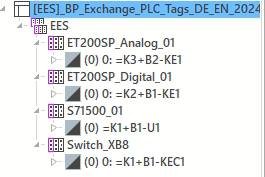

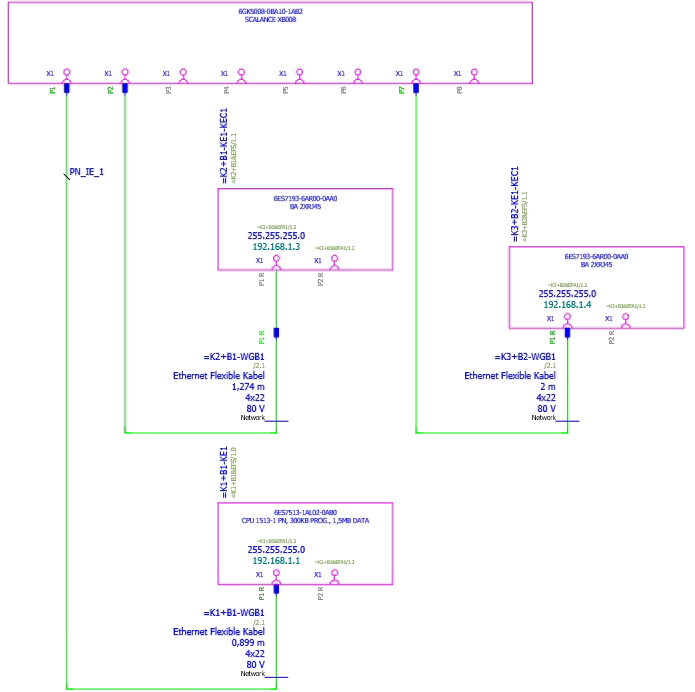

### Station `Switch_XB8`

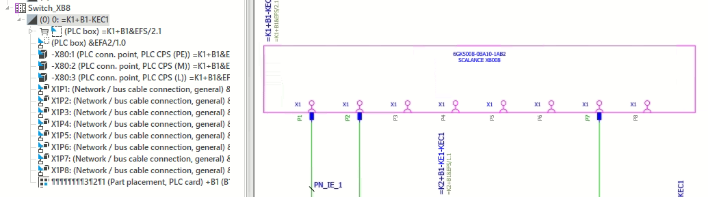

PLC Box - відображаються на 2-х схемах:

- одна головною функцією 
- одна додатковою (рис.вище)

#### PLC Box `&EFS.2.1`

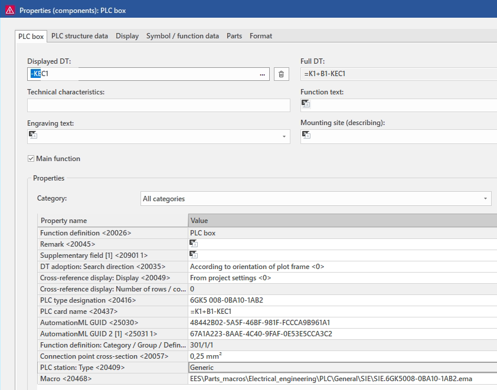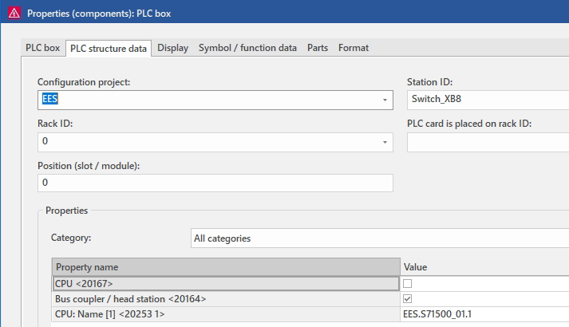

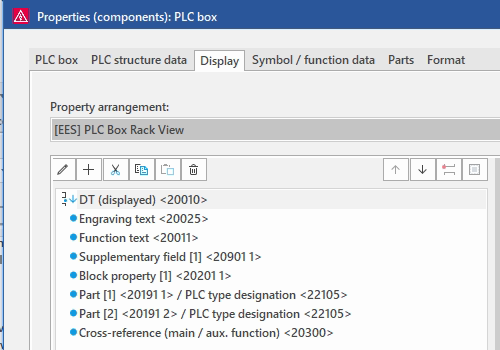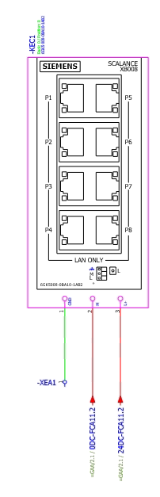

#### PLC Box `&EFA2/1.0`

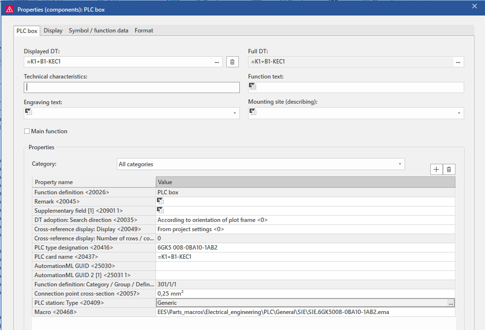

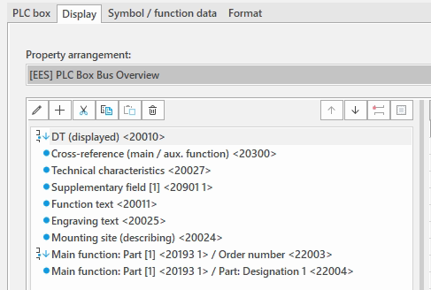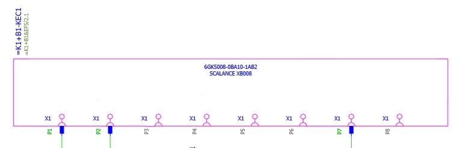

#### PLC Connection Points

##### PE

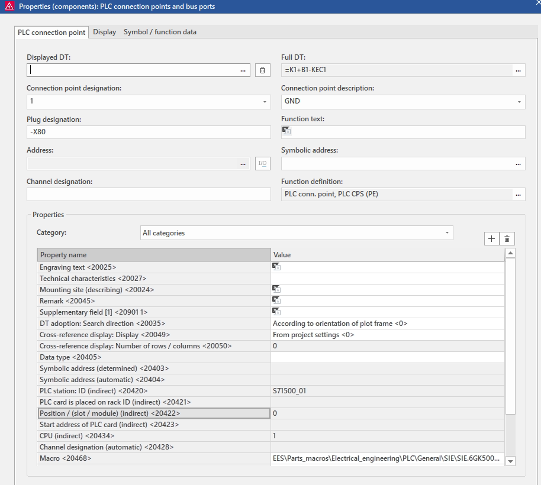

##### XIP1

fucntion definition: Network/bus cable connection, general

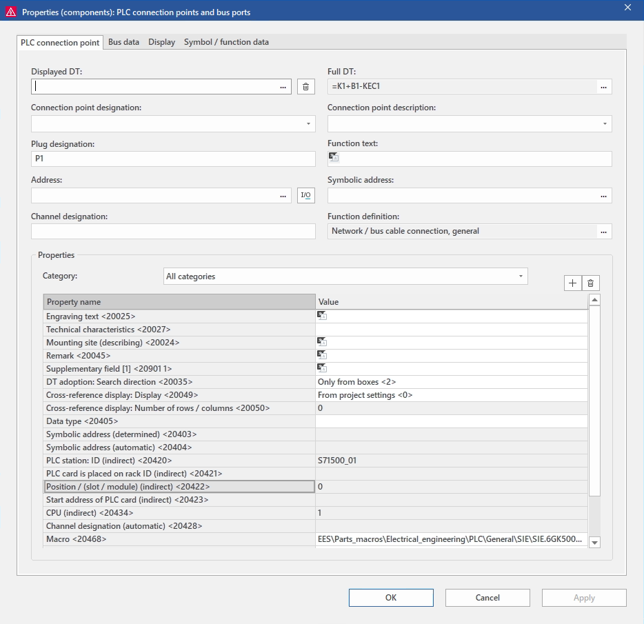

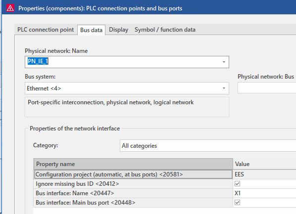

### Station `S71500_01`

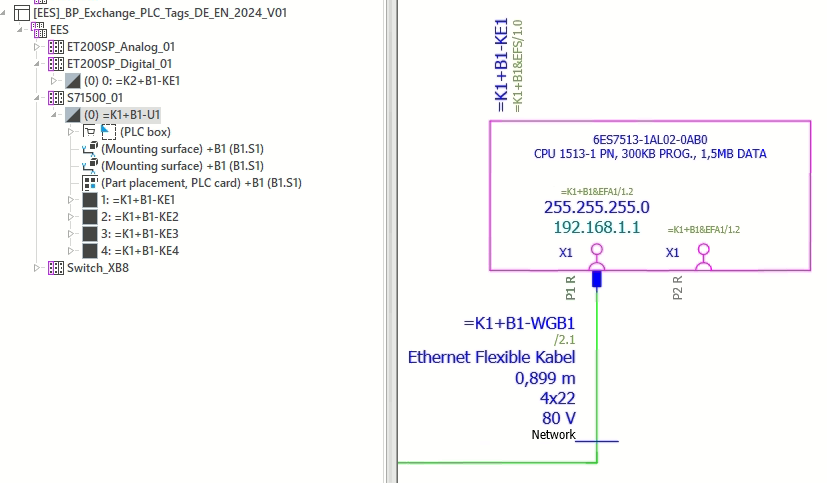

#### Rack - PLC BOX  

Профільна шина SIE.6ES7590-1AB60-0AA0 для 1500

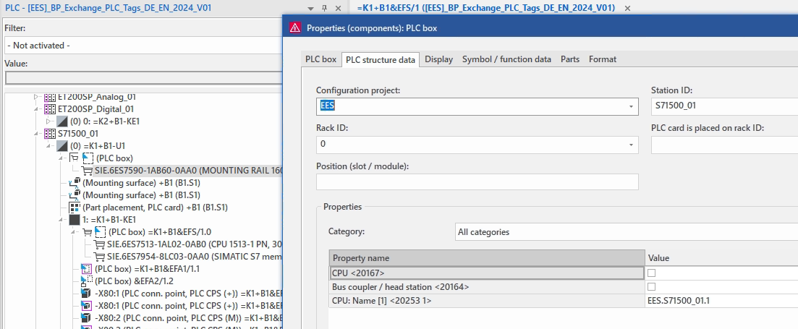

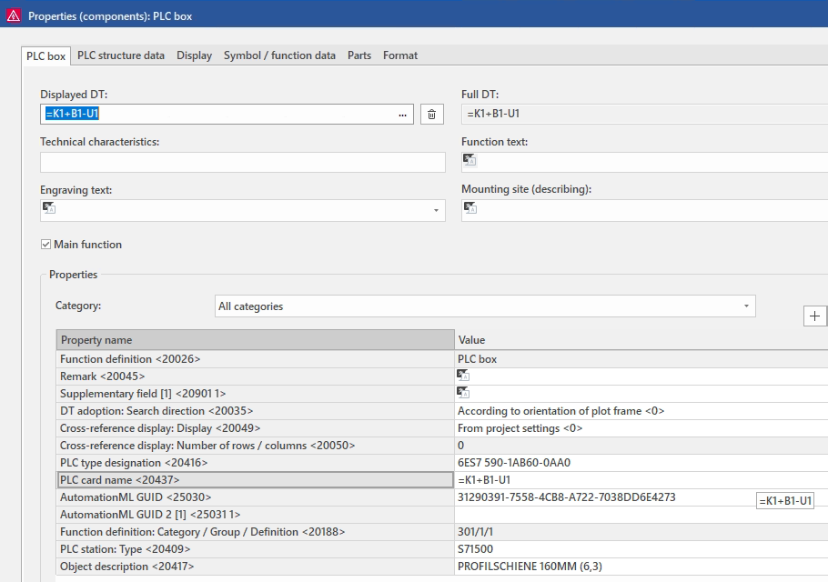

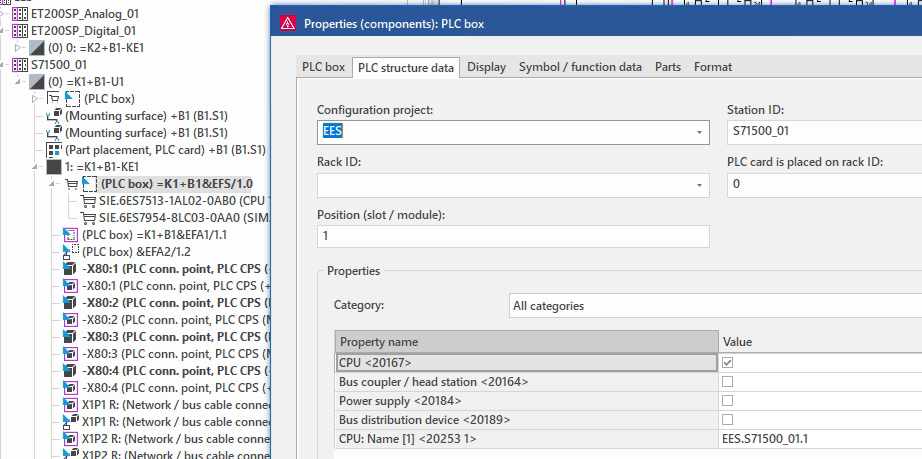

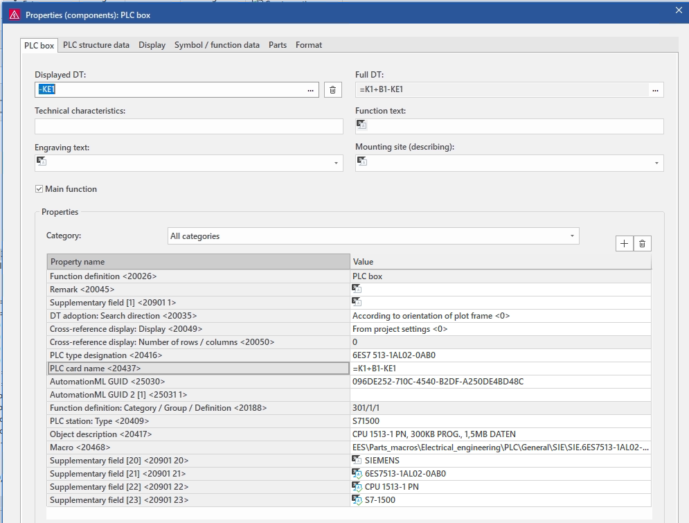

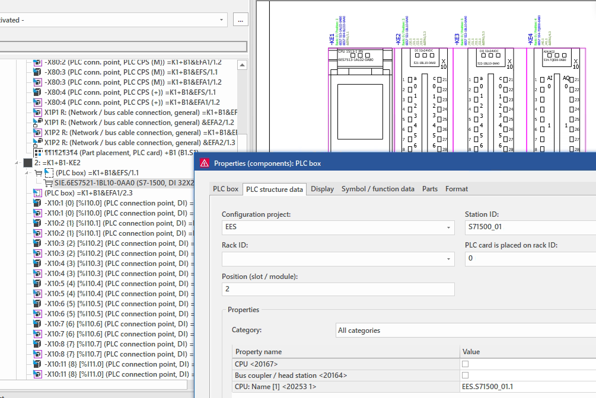

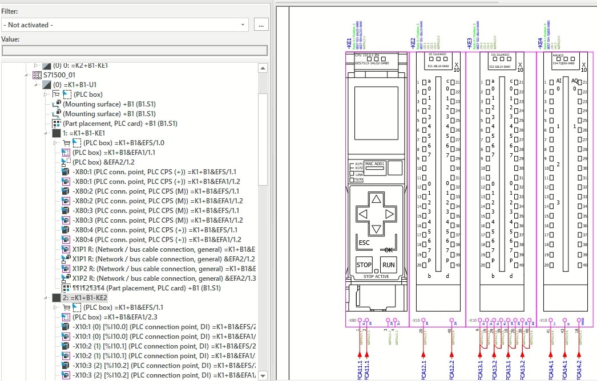

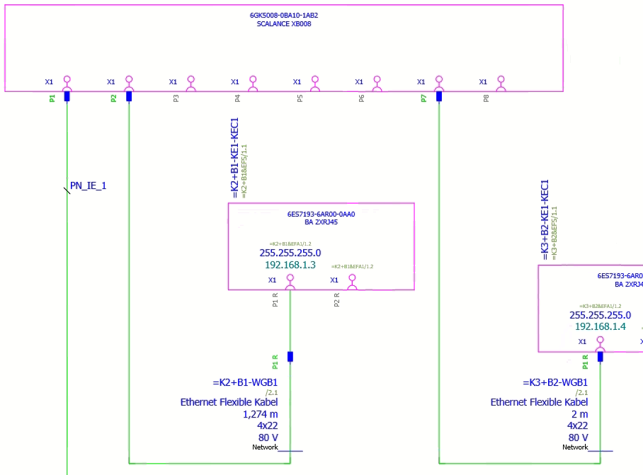

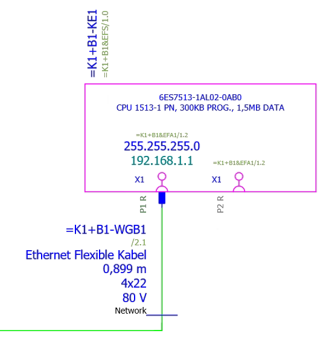

## Джерела

1. https://www.eplan.help/en-us/Infoportal/Content/Plattform/2025/Content/htm/plcgui_k_start.htm?tocpath=EPLAN%20Platform%7CEditing%20PLC%20Information%7CPLC%7CBasics%7C_____1
2. 

## Автори

Теоретичне заняття розробив [Олександр Пупена](https://github.com/pupenasan). 

## Feedback

Якщо Ви хочете залишити коментар у Вас є наступні варіанти:

- [Обговорення у WhatsApp](https://chat.whatsapp.com/BRbPAQrE1s7BwCLtNtMoqN)
- [Обговорення в Телеграм](https://t.me/+GA2smCKs5QU1MWMy)
- [Група у Фейсбуці](https://www.facebook.com/groups/asu.in.ua)

Про проект і можливість допомогти проекту написано [тут](https://asu-in-ua.github.io/atpv/)
