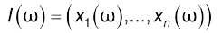

[<- До підрозділу](README.md)

# Системи підтримки прийняття рішень

Це частина розділу навчального посбіника [Системний аналіз складних систем управління: Навч. посіб. /А.П. Ладанюк, Я.В. Смітюх, JI.O. Власенко та ін. — К.: НУХТ, — 274 с](https://dspace.nuft.edu.ua/server/api/core/bitstreams/a264d75f-5e98-41b9-994e-991b4bcc93eb/content)

## Про СППР

У літературі наводиться  кілька визначень систем підтримки прийняття рішень (**СППР**):

1) СППР — людино-машинні об’єкти, що дають змогу особам, які приймають розв’язку (**ОПР**), використовувати дані, знання, об’єктивні та суб’єктивні моделі для аналізу і розв’язання слабкоструктурованих проблем. Слабкоструктуровані задачі — охоплюють як кількісні, так і якісні змінні, причому домінують якісні аспекти. Неструктуровані проблеми мають лише якісний опис.

2) СППР — комп’ютерна система, яка дає можливість ОПР поєднувати власні суб’ктивні переваги з комп’ютерним аналізом ситуації під час вироблення рекомендацій у процесі прийняття рішень. При цьому головним є поєднання суб’єктивних переваг з комп’ютерними методами.
3) СППР — комп’ютерна інформаційна система, яка використовується для різних видів діяльності під час прийняття рішень у ситуаціях, коли неможливо чи небажано мати автоматичну систему, яка повністю виконує весь процес розв’язку.

Робота колективів, технічних систем управління ґрунтується на обміні, обробленні інформації та прийнятті рішень, основою яких є аналіз цієї інформації. Для складних систем зростає обсяг інформації, підвищуються вимоги до надійності й оперативності оброблення інформації та прийняття рішень.

## Розподілені СППР

***Розподілені системи підтримки*** прийняття рішень виконують такі функції:

- генерують варіанти рішень;
- оцінюють та моделюють можливі наслідки рішень, дають можливість вибрати кращий варіант з існуючих не на основі досвіду та інтуїції, а на основі формалізованих оцінок та прогнозу результатів;
- дають змогу узгодити групові розв’язку.

Головним є те, що СППР допомагають спеціалісту, який приймає розв’язку, чіткіше сформулювати, дослідити та прийняти обгрунтовану дію (розв’язку), основою якої є глибше розуміння ситуації. Конкретна система може виконувати не всі, а частину названих функцій.

Розподілені системи підтримки прийняття рішень складаються з експертних систем, розташованих у зв’язаних між собою вузлах обчислювальної мережі, кожен з яких може незалежно розв’язувати свої частинні задачі. Проте для розв’язання загальної проблеми жоден із них не має достатніх знань, інформації та ресурсів (чи деяких із них), тобто загальну задачу вони розв’язують лише спільно, об’єднуючи свої локальні можливості та узгоджуючи частинні розв’язку.

Доцільність застосування розподілених систем:

1. Складні задачі розв’язуються з використанням методів декомпозиціії, не зважаючи на величезні можливості обчислювальної техніки.
1. Сучасні комп’ютерні технології орієнтуються на використання мережевих структур, де задачі розв’язуються не централізовано, а розподілено.
1. Технологічні та виробничі процеси є розподіленими (функціонально, територіально, функціонально та територіально одночасно) тому й системи управління відповідно розподілені так само.
1. Розподілені в просторі системи полегшують обмін інформацією та прийняття узгоджених рішень групами спеціалістів.
1. Принцип модульної побудови найкраще реалізовується саме в розподілених системах підтримки прийняття рішень.

Таким чином, розподілені системи підтримки прийняття рішень (РСППР) дають змогу здійснювати:

- постійний обмін інформацією про ситуацію та можливі розв’язку;
- знаходити локальні оптимальні розв’язку, отримані перебиранням можливих варіантів;
- моделювати наслідки рішень для оцінювання їх правильності та ефективності;

- узгоджувати групові розв’язку.

Варіанти СППР:

1) Розв’язку приймається в автоматичному режимі в одному вузлі (ЕОМ, система автоматичного чи ручного введення інформації, засоби візуалізації). Експертна система визначає ситуацію (ідентифікує), приймає та/чи реалізовує управління.
2) Розв’язку ухвалює спеціаліст, у розпорядженні якого є СППР, а експертні системи пропонують варіанти.
3) Розв’язку пропонуються різними експертними системами, які є в одному вузлі, але оцінюють ситуацію з різних поглядів. Вони можуть запропонувати різні розв’язку, які коригують спеціалісти.
4) Розв’язку пропонуються різними експертними системами, які є в різних вузлах мережі, але й спеціалісти можуть перебувати в різних вузлах. У різних вузлах можуть прийматися різні розв’язку.
5) Розв’язку пропонують різні спеціалісти на різних вузлах мережі, і ці розв’язку потрібно узгоджувати.
6) Можливий варіант, коли різні розв’язку пропонуються і експертними системами, і спеціалістом - експертом

​	Варіанти 3 — 6  належать до розподілених СППР.

## Про експертні системи

*Експертні системи* — клас інтелектуальних інформаційно-вимірювальних та управлінських систем. Інтелектуальні системи завжди оперують знаннями, тобто замість традиційних технологій накопичення та оброблення даних тут використовується технологія накопичення та оброблення знань.

Експертні системи (ЕС) належать до інтелектуальних комп’ютерних систем і призначені для моделювання (імітації) поведінки досвідчених спеціалістів-експертів при розв’язанні задач з певної предметної області.

Є різні визначення експертних систем. Наприклад, Комітет Britich Computer Societu зазначає, що ЕС — втілені в ЕОМ компоненти досвіду експерта, які ґрунтуються на знаннях, у такій формі, що комп’ютер може дати інтелектуальну пораду чи прийняти інтелектуальне розв’язку щодо розв’язуваної функції. Важливо також, щоб система мала додаткову властивість (інколи саме її вважають головною) – здатність на вимогу пояснити хід своїх міркувань зрозумілим для користувача способом. Усе це забезпечується в результаті програмування на основі формальних правил. На рис. 9.3 представлена загальна структура ЕС.


Рис.9.3. Компоненти експертної системи

Ознаки експертних систем (ЕС):

- ЕС обмежена певною сферою експертизи;

- здатна міркувати за наявності сумнівних даних;

- може пояснити ланцюжок міркувань зрозумілим способом;

- факти і механізми висновків  чітко відокроемлені один від одного;

- ЕС будується так, щоб була можливість поступового нарощування її можливостей (функцій); 

- ЕС ґрунтується на використанні правил;

- на виході ЕС видає пораду — не таблицю з цифр, не картинки на екрані,  а чітку відповідь;

- ЕС економічно вигідна (вимога до її роботи!).

## Основні особливості експертних систем

Зі створенням та розвитком ЕС роль програміста змінюється: від розроблення детальних процедур до складання переліку — вимог до системи.

Створення, оброблення та зберігання масивів знань — виключно трудомісткий процес, для реалізації якого потрібні значна ємність пам’яті та швидкодія.

Для ЕС характерно:

- наявність евристичних засобів для формування та перевірки гіпотез і закономірностей;

- використання для спілкування природної мови;
- можливість аналізувати значні масиви інформації для пошуку елементів, які відповідають певним вхідним сигналам;
- основою функціонування має бути формальний математичний апарат — різновид апарату дедуктивних систем (дедуктивна система складається із аксіом і правил висновків, а механізм її функціонування  — генерація висновків в алфавіті вибраного обчислення);

​	Експертні системи мають таку основну термінологію :

- аксіоми та результати оброблення дедуктивної системи  — факти,з яких складається база даних;
- продукційні правила, отримувані від експертів — зміст бази знань;
- спеціалісти з надання даних і знань — інженери зі знань;
- побудова доведень — міркування;
- обґрунтування способів досягнення рішень — пояснення;
- алгоритм для побудови доведень — машинний висновок.

Функціональну схему ЕС подано на рис. 9.4

*Блок спілкування* дає змогу вводити та виводити інформацію природною (для певної професійної сфери) мовою, організовує спілкування з користувачем, пропонує йому набір дій і допомагає зрозуміти допущені помилки.

*Блок навчання* допомагає недосвідченому користувачу освоїти роботу з ЕОМ у діалоговому режимі, навчає на простих прикладах.

*У розв**’**язувачі* блок попереднього висновку перевіряє принципову можливість отримання факту, формує фактор впевненості в отримуваних фактах. На основі знань із бази знань здійснюється пошук потрібного розв’язку. В ЕОМ  V покоління розв’язувач замінює програміста і будує програми за словесним описом задачі користувачем.


Рис.9.4. Функціональна схема експертної системи

*У базі знань* інформація за допомогою спеціальних засобів класифікується, узагальнюється, оцінюється її суперечливість, об’єднуються інформаційні одиниці. У результаті цього виникає структурована модель проблемної області, в якій відображені особливості, закономірності та способи розв’язання задач. Цими процесами керує блок підтримки бази знань.

*Блок пояснення* — один із основних, що ЕС виділяє в окремий клас. Користувач може звертатися до цього блока із запитанням:

- “що таке *Х*?”. Тоді ЕС після пошуку в базі знань видає всю наявну інформацію про *Х*. Часто логічним шляхом потрібно отримати на основі фактів,що зберігаються, нові факти;

- “як отримано *У*?”. Користувач бажає ознайомитися з міркуваннями системи з отриманням фактів чи висновків;

- “чому отримано *У*, а не *Z*?”— пояснення альтернатив;

- “навіщо потрібен *Х*?”. Обґрунтування беруться з моделі проблемної області, яка зберігається в базі знань.

Це фактично розподіл праці між користувачем, системним аналітиком, системним та прикладним програмістом і ЕОМ у процесі постановки та розв’язання на ній різних задач.

Функціональну модель інтелектуальної системи наведено на рис. 9.5.


Рис.9.5. Функціональна модель інтелектуальної системи

*Інтелектуальний інтерфейс* призначений для спілкування системи із зовнішнім середовищем (користувачем) перетворенняя текстової, графічної, образної чи мовної інформації у внутрішню форму подання і навпаки*. Інтелектуальний інтерфейс*  синтезує програму для ЕОМ і має два блоки: процесор спілкування і планувальний.

Підсистема логічного висновку здійснює постановку задачі та прийняття рішень на основі аналізу тематики вхідного повідомлення та наявних знань. Логічний висновок використовує правила дедукції і факти з бази знань.

Генератор розв’язків програм формує програму розв’язання задачі з використанням знань про методи її розв’язання.

Інтерпретатор задач виконує запрограмоване оброблення інформації.

*Інтерфейсні знання —* інформація про принципи взаємодії із зовнішнім середовищем (мови спілкування, способи комунікації, форми подання інформації).

*Проблемні знання* — формалізована інформація про навколишній світ (змістовні питання, відношення, зразки поведінки, способи формування нових понять).

*Процедурні знання* відображають евристичний аспект розвитку досвіду системи в розв’язанні задач, включають базу алгоритмів у вигляді процедурно заданих моделей типових рішень, методів доведень, стандартних форм перетворень тощо.

*Структурні знання* відображають технологічний аспект розвитку системи і містять інформацію про саме операційне середовище — ресурси, способи доступу, принципи взаємодії, алгоритми управління, контролю та відновлення. Наявність структурних знань забезпечують гнучкість і адаптивність системи.

Різновидність інтелектуальних систем — ЕОМ (сучасні й наступних поколінь), які мають:

- сприймати усну мову;
- “розуміти” графічний текст, рисунки;
- друкувати з голосу;
- сортувати дані й вибирати з них необхідні для конкретної задачі;
- адаптувати і вдосконалювати власний досвід, програмне забезпечення;
- вибирати алгоритми розв’язання і синтезувати необхідні програми за умовами задачі.

## Побудова бази знань 

База знань (БЗ) спочатку пуста.  Інженер зі знань опитуванням спеціалістів-експертів з’ясовує формулювання закономірностей (продукційних правил) та фактів, характерних для досліджуваної предметної області. Це інтерактивний процес, який здійснюється методом спроб і помилок. База знань створюється накопиченням фактологічної інформації, тестуванням створеної ЕС та додаванням нових знань за потреби (рис. 9.6).


Рис.9.6. Схема побудови бази знань

​	Інженер зі знань має вміти:

- отримувати потрібні знання, формувати модель предметної області та підтримувати її при функціонуванні ЕС;
- знаходити у спеціальній літературі необхідні знання;
- обробляти думки експертів, знаходити узгоджені формулювання, подавати їх у логічному зв’язку і послідовності;
- вибирати методи формалізації знань;
- організовувати в БЗ необхідні моделі та підтримувати в робочому стані.

При побудові ЕС формулюється велика кількість правил, які можуть бути неповними чи суперечливими, а точно передбачити поведінку системи неможливо, тобто використовуються способи евристичного програмування.

За призначенням розрізняють такі ЕС:

- консультаційні (інформаційні);
- дослідницькі;
- керувальні.

За складністю та обсягом бази знань ЕС поділяють на:

- неглибокі;

- глибокі.

Неглибокі ЕС створюються за короткий час (2-3 місяці) і мають відносно малі БЗ і БД (кілька сотень правил і фактів, причому фактів значно більше). Більшість висновків є прямими наслідками інформації з БЗ, причому це в основному емпіричні знання, не пов’язані з моделями процесів та явищ. Такі ЕС призначені для розв’язання простих задач на зразок відповіді на запити (технічна інформація).

Глибокі ЕС формують висновки з моделей процесів, які є в БЗ, а модель — набір правил, призначених для пояснення великої кількості даних. Часто знання, отримані з глибоких ЕС, вражають своєю неочевидністю.

Експертна система не обов’язково має бути глибокою. Наприклад, консультативна медична ЕС порівнює за правилами симптоми хвороби з накопиченими в БЗ. Це неглибокі ЕС, але вони працюють швидко, точніше, ніж люди, і мають переваги у виборі альтернатив.

Відомі ЕС в комп’ютерних фірмах, наприклад ІВМ, призначені для консультацій з випробувань та ремонту накопичувачів інформації (рис 9.7).


Рис.9.7. Структура експертної системи

## Подання знань в ЕС 

Під час розробленняі ЕС виконуються такі етапи:

- ідентифікація (вибір мети, задач, ресурсів, ключових понять);
- концептуалізація (аналіз проблемної області, типів даних, зв’язки між ними, методи розв’язання задач);
- формалізація (способи подання знань, формалізація понять, методів розв’язання, моделювання роботи системи, оцінювання адекватності понять меті, способи маніпулювання даними);
- наповнення бази знань;
- тестування ЕС, перевірка її компетентності;
- дослідна ескплуатація.

Способи подання знань:

- логічні моделі;
- мережеві моделі;
- продукційні моделі;
- фреймові.

Для ЕС керування ТП найзручнішими є фреймові, які використовують каузальні (причинні) сценарії. Це ієрархічна структура знань, наочний опис об’єкта, доступність, можливість використання взаємозв’язків між характерними об’єктами предметної області.

*Фрейм* – фрагмент знань, який асоціюється із стереотипними ситуаціями і має вигляд структурованих наборів даних. Кожний набір даних — “слот”, який може вказувати на інший фрейм, тобто встановлювати між ними зв’язки. У фреймі можуть бути очікувані параметри ситуації. Ідея фрейму подібна до ідеї запису під час оброблення даних: усі атрибути об’єкта зібрані разом в єдиній комбінаційній структурі. Таким чином, фрейм  — засіб організації знань.

На рис. 9.8 наведено варіанти структур систем з дистанційним керуванням оператором (а); автоматизованим керуванням (б) та з використанням ЕС (в). Для створення каузальних сценаріїв важливою є предметна область, схема якої представлена на рис. 9.9.

Для ЕС (рис. 9.10), які використовуються при управлінні технологічними об’єктами, застосовують казуальні сценарії у вигляді фреймоподібних списочних структур. Сценарій — основна структурна одиниця бази знань, це формалізований опис стандартної послідовності взаємозв’язаних фактів, які визначають типову ситуацію предметної області. 


Рис.9.8. Структури автоматичних систем:

а — дистанційне керування оператором; б — автоматиоване керування; в — використання ЕС


Рис. 9.9. Схема предметної області

### Каузальність у сценарії

Каузальність у сценарії: будь-яка попередня дія створює умови для наступної. Використовуються такі відношення: 

$n_1$ — необхідна і достатня причина; 

$n_2$ — достатня причина;

$n_3$ — обумовлена причина.


Рис.9.10.Структура експертної системи

Зводяться множини: 

- дій чи рекомендацій

                         

- конструкцій об’єкта 

                         

- властивостей конструкцій 

               

- ситуацій 

      

- управлінь 

             

На множині дій допускаються  відношення:

$R_1$ —  дія $d_i$ виконується раніше, ніж $d_j$;

$R_2$ — дія $d_i$ є частиною $d_j$;

$R_3$ — дія $d_i$ приводить до $d_j$;

$R_4$ — дія $d_i$ супроводжується $d_j$.

Для БЗ використовується список сценаріїв у вигляді фреймів однакової структури.

Каузальний сценарій (КСЦ ім’я):

- виконавець;
- мета;
- порядок дій; 
- ситуації;
- умови;
- результати.

Можливі схеми міркувань на сценаріях, які використовуються при висновках

1. У КСЦ слот “мета” має дію $d^*\in D$ *,* а слот “порядок дій”  —  список дій ($d_1,d_2...d_n$). Тоді маємо відношення 


2. Для кожної дії $d_i$ слота “порядок дій”  виконуються відношення 


3. Для значення слота «мета» $d^*\in D$ і значень слота “результати” маємо відношення 


4. Для $d^*\in D$  (слот “порядок дій”) та  $U_j\in U$ (слот “результати”) справедливе відношення


5. Для кожного $d_j$ у полі “порядок дій” може існувати КСЦ, у полі “мета” якого є $d_j$, а в полі “порядок дії” ($d_1,..d_n$).

6. Для кожної ситуації $w\in W$ у слоті “ситуації” та дії ($d_1,..d_n$). виконується 


7. Якщо для виконання  КСЦ 1 потрібно виконати дії  слота “порядок дій” КСЦ 2, то 


​	База даних описує всі необхідні конструкції об’єкта і представлена одноранговою мережею фреймів, кожен з яких має таку структуру:

- ім’я конструкції (значення);
- ім’я властивості (значення);
- поточне значення (величина);
- номінальне значення (величина);
- одиниці вимірювань (значення);
- допустима різниця (величина).

### Приклади сценаріїв БЗ

```
*Сценарій

КЦЛ Пуск сушильної установки

[Виконавець]

​    Оператор

[Мета]

​    Почати процес сушіння

[Порядок дій]

​	    Подати сигнал про пуск

​	    Увімкнути систему вентиляції

​	    Відкрити клапан топкової труби

​	    Почати подачу палива в топку

​	    Увімкнути двигун конвеєра сухого вугілля

​	    Увімкнути живильник розвантажувальної камери

​                      .

​                      .

​                      .

​                      .

​	[Причина]

​	  Розпорядження про пуск СУ

​	[Умови]

​	  ? Чи є дозвіл на пуск

​	[Результати]

​	Топка — клапан @ закритий

​	Топка — шибер @  відкритий

​	Топка — живильник @ увімкнений

​                            .

​                            .

​                            .

​	Димосос — температура перед @ 100

​	Димосос — температура підшипників @ 40

​	КСЦ  Зупинка  СУ

​                            .

​                            .

​                            .
```

```
	*Сценарій

​	КСЦ Нормалізація розрідження

​                    перед димососом

​	[Виконавець]

​	 Оператор (або робітник)

​	[Мета]

​	   Ліквідувати зменшення розрідження перед димососом

​	[Порядок дій]

​	   Усунути несправність димососа

​	   Усунути підсос повітря в сушильному тракті

​	   Очистити давач розрідження

​	[Причини]

​	   Зменшити розрідження перед димососом

​	[Умови]

​	    Немає

​	[Результати]

​	    Димосос — двигун @ увімкнений
```

## Процес формування розв’язку

Етапи:

- розпізнавання ситуації;
- вироблення рекомендацій на основі логічного висновку.

Розпізнавання ситуації відбувається на основі класичної теорії розпізнавання образів. Образ — структурований наближений опис досліджуваного об’єкта (явища), причому існує лише часткова визначеність опису як ідентичності, схожості (подібності). При цьому порівняння образів — основне завдання розпізнавання та штучного інтелекту в цілому.

Для задач керування ТП розпізнавання образів — це визначення технологічної ситуації та віднесення її до певного класу. В цих задачах немає формалізованого опису та використовується різнорідна, в тому числі якісна інформація.

Методи розпізнавання: 

- моделі з використанням принципу розділення (*R**-*моделі);

- статистичні моделі;

- моделі з використанням методу потенціальних функцій (П-моделі);

- моделі обчислення оцінок (Г-моделі);

- методи, що ґрунтуються  на алгебрі логіки (Л-моделі).

Основні вимоги до вибору методу — кількість обчислень та час.

Розглянемо модель обчислення оцінок (Г-модель). Постановка задачі:

- дано: множина $М$ об’єктів $\omega$, і на якій існує розбиття на кінцеве число підмножин (класів)  ;                                       

- розбиття визначено не повністю, задано лише деяку інформацію $I_0$ про класи $\Omega$ .  
- об’єкти $\omega$ задаються значеннями деяких ознак . Сукупність значень  $X_j$, $j=\overline{1,n}$ визначає опис $I(\omega)$ об’єкта $\omega$;  
- кожна з ознак може набувати значення з різних множин допустимих значень, наприклад {0,1} *—* ознака не виконана чи виконана; {0, 1, *d*-1} *—* ступінь визначеності ознаки має різні градації, d>2

Опис об’єкта  називають стандартним, якщо $x_j(\omega)$ набуває значення з множини допустимих значень.

​	Тоді задача зі стандартною інформацією полягає в тому, щоб для  об’єкта $\omega$ та наборів класів $\Omega_1...\Omega_m$ за навчальною інформацією  $I_0(\Omega_1...\Omega_m)$ про класи та описи $I(\omega)$ обчислити значення предикатів $P_i(\omega\in \Omega_i),=1,m$. Апріорна інформація в задачі розпізнавання з класами, які не перетинаються, може задаватись у вигляді таблиці $T_{N,M}$  (табл.9.1).

​	В основі алгоритмів розпізнавання лежить природний евристичний підхід — принцип прецедентності, тобто прийняття розв’язку за аналогією в  аналогічних ситуаціях діяти однаково.

Один із простих алгоритмів передбачає обчислення оцінок на основі частинної прецедентності, а саме: порівняння опису розпізнаваного об’єкта $I(\omega')$ з описом об’єктів $T_N,M$ у  і визначення класу, до якого цей об’єкт належить. Розв’язку виноситься на основі обчислення ступеня подібності розпізнаваного об’єкта (рядка) до рядків, належність яких до заданих класів відома.

*Таблиця 9.1.* **Вихідні дані навчання** 


**Контрольні запитання і завдання**

1. Визначення та сфера застосування систем підтримки прийняття рішень.
2. Призначення та склад експертних систем.
3. Як відбувається побудова бази знань експертних систем?
4. Що таке каузальні сценарії?
5. У чому полягає прецедентне управління?

Теоретичне заняття розробили А.П. ЛАДАНЮК, Я.В. СМІТЮХ, Л.О. ВЛАСЕНКО, Н.А. ЗАЄЦЬ, І.В. ЕЛЬПЕРІН
