[<- До підрозділу](README.md)		[Коментувати](#feedback)

# AutomationML - Automation Markup Language

Це чорнова версія розділу, публікується для можливого залучення зацікавлених сторін. 


Цей розділ передбачає, що Ви ознайомлені з CAEX, спочатку прочитайте [CAEX - Computer Aided Engineering eXchange](caex.md).

## Про AutomationML і стандарт IEC 62714

Стандарт IEC 62714 (AutomationML) означує універсальний формат обміну інженерними даними між програмними засобами в автоматизації промислових систем. Його мета — забезпечити безперервний обмін даними між різними дисциплінами інженерії: механічною, електричною, процесною, керування, HMI-розробкою, програмуванням PLC і роботів. Формат базується на XML-схемі і поєднує наявні галузеві формати без їх модифікації, використовуючи для цього в якості верхнього рівня опису формат CAEX .

Серія складається з кількох частин, кожна з яких описує окремий аспект інженерних даних:

1. Архітектура та загальні вимоги. Означує базову архітектуру AutomationML, містить опис структури документів AML, основні елементи (класи, екземпляри, відношення, посилання, ієрархії), бібліотеки ролей та інтерфейсів. Ця частина встановлює правила представлення об’єктів, їхніх атрибутів і зв’язків, закладаючи основу для сумісного моделювання фізичних і логічних компонентів установки.

2. Бібліотеки ролей. Розширює базові бібліотеки, означуючи стандартні класи ролей (`RoleClass`) і інтерфейсів (`InterfaceClass`), які використовуються для опису функцій, властивостей і взаємодій між об’єктами. Вона формує спільний словник понять для опису обладнання, з’єднань, сигналів і логічних зв’язків, необхідний для міждисциплінарного обміну.

3. Геометрія та кінематика. Означує інтеграцію геометричної та кінематичної інформації у моделі AML. Описує розширення бібліотек для геометрії, положення об’єкта у просторі, правила приєднання об’єктів один до одного, а також способи посилань на зовнішні файли COLLADA (ISO/PAS 17506). Додатки містять приклади моделювання: лінійних осей, роботів, схоплювачів, робочих деталей тощо, а також схеми XML-представлення бібліотек. Таким чином ця частина забезпечує інтеграцію просторової моделі (3D-геометрії й руху) у загальну структуру AML.

4. Логіка. Присвячена логічній інформації, що описує поведінку, послідовність дій і взаємні блокування. У ній означено схему AML Logic XML, засновану на IEC 61131-10 (`PLCopen XML`), що уніфікує представлення різних логічних моделей, а також правила зв’язування логічних об’єктів із фізичними у межах CAEX. Додатки наводять приклади зберігання й посилання на логічні моделі та міжблокування. Містить три типи логічних моделей:

   - послідовні (`sequencing`) — наприклад, діаграми Ганта, мережі «активність-на-вузлі», діаграми часу;

   - поведінкові (`behaviour`) — такі як послідовні функціональні діаграми (SFC) або блок-діаграми (FBD);

   - захисні (`interlocking`) — для опису умов безпечного функціонування.

Таким чином, серія IEC 62714 формує цілісну систему для опису й обміну всіма аспектами даних промислової установки — від структури обладнання і його просторової конфігурації до поведінкової логіки керування, забезпечуючи сумісність інженерних засобів у рамках концепції «цифрового інжинірингу».

### Архітектура AML

AML зберігає інженерну інформацію відповідно до об’єктно-орієнтованої парадигми й дає змогу моделювати фізичні та логічні компоненти установки як об’єкти даних, що інкапсулюють різні аспекти. Об’єкт може складатися з підоб’єктів і водночас бути частиною більшої композиції чи агрегації. Типові об’єкти в системах автоматизації містять інформацію про топологію, геометрію, кінематику та логіку, причому логіка охоплює послідовність дій, поведінку та керування. Отже, важливим аспектом обміну інженерними даними є передавання об’єктно-орієнтованих структур даних, а також геометрії, кінематики та логіки.

AML поєднує наявні галузеві формати даних, розроблені для зберігання та обміну різними видами інженерної інформації. Ці формати використовуються у своїх початкових специфікаціях без модифікації під потреби AML.

CAEX тут використовується в якості метамоделі для зв’язування різних форматів даних, що дає можливість робити розподілену архітектуру документів. На рис.1 показано базову архітектуру AML та розподіл інформації про топологію, геометрію, кінематику й логіку.

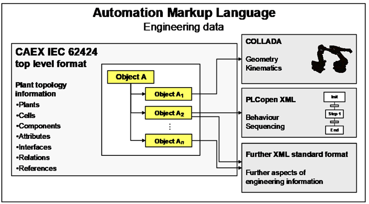

Рис.1 Представлення базової архітектури AML (Джерело IEC 62714-1)

Основною структурою даних для інженерної інформації про якийсь промислових об'єкт (надалі вживатимемо термін "установка") є його топологія, яка моделюється за допомогою формату CAEX відповідно до IEC 62424:2016 (CAEX 3.0). При цьому IEC 62714 не змінює синтаксис формату даних CAEX, а лише використовує його з певними семантичним розширеннями, що дозволяється CAEX. Для побудови кількох перехресних ієрархічних структур застосовується концепція дзеркальних об’єктів CAEX. Оскільки  дзеркальний об’єкт вважається ідентичним основному, це дозволяє розміщувати один екземпляр об’єкта в різних ієрархіях установки і таким чином моделювати складні мережі об’єктів із перехресними структурами. У описі топології установки пов’язані елементи відображаються через елементи `ExternalInterface`.  AML широко застосовує можливість CAEX зв'язуватися з зовнішніми даними за допомогою механізмів посилань. 

Як вже зазначалося, дані про геометрію та кінематику повинні зберігатися у форматі COLLADA™ (1.5.0 - ISO/PAS 17506, версії 1.4.1), а інтерфейси COLLADA, які необхідно зв’язати в межах формату верхнього рівня, слід опублікувати як CAEX `ExternalInterface`. При цьому синтаксис формату даних COLLADA не змінюється. На основі геометричної інформації COLLADA для різних об’єктів можна автоматично створити повну сцену. Такі файли можуть бути пов’язані з CAEX і між собою через механізми зв’язування CAEX.

Логічна інформація повинна зберігатися у форматі PLCopen XML (2.0/2.1). Якщо логічні елементи, наприклад змінні чи сигнали, потрібно зв’язати в межах формату верхнього рівня, їх слід опублікувати як CAEX `ExternalInterface`. Усі елементи PLCopen XML, опубліковані у форматі верхнього рівня, повинні мати унікальний ідентифікатор у межах PLCopen XML. Логічна інформація описує послідовності дій і внутрішню поведінку об’єктів, зокрема з’єднання вводу/виводу та логічні змінні. 

IEC 62714 може бути розширена в майбутньому новими частинами стандарту, які означуватимуть інтеграцію додаткових XML-форматів даних з використанням механізмів посилань AML. 

### Структура документу XML

Як і CAEX, формат даних AML не забезпечує перевірку узгодженості обмежень, значень атрибутів, відношень, посилань або семантичної коректності даних. Це залишається відповідальністю вихідного чи цільового програмного засобу або відповідної програми імпорту/експорту. AML дозволяє лише синтаксичну перевірку документа відповідно до зазнечених XML схем.

Кореневим вузлом AML є `CAEXFile`.

```xml
<CAEXFile xmlns="http://www.dke.de/CAEX" 
    xmlns:xsi="http://www.w3.org/2001/XMLSchema-instance" 
    SchemaVersion="3.0" 
    FileName="AutomationML2.10BaseLibraries" 
    xsi:schemaLocation="http://www.dke.de/CAEX CAEX_ClassModel_V_3.0.xsd">
    <SuperiorStandardVersion>AutomationML 2.10</SuperiorStandardVersion>
</CAEXFile>
```

У елементі CAEX `SuperiorStandardVersion` містить значення рівним `AutomationML 2.10`.  Кожен пов’язаний документ CAEX, а також повязані з ним документи повинні відповідати тій самій версії AML, що й кореневий документ. Змішування документів із різними версіями AML категорично заборонено. 

Кожна стандартна бібліотека AML і кожна користувацька бібліотека AML повинна визначати свій номер версії за допомогою елемента CAEX `Version`. 

Кожен документ AML повинен містити інформацію про інструмент, який створив цей документ. У ланцюжку засобів обміну даними всі задіяні інструменти повинні зберігати цю інформацію в документі CAEX однаковим способом. Таким чином, документ може містити дані про кілька інструментів, що беруть участь в обміні. Інструмент може видалити інформацію про інших записувачів, проте це може ускладнити подальший ітераційний обмін даними з цими інструментами; тому видалення відомостей про інші інструменти не рекомендується. Для цього для ідентифікації вихідного інструмента кожного екземпляра об’єкта AML (`InternalElement`, `ExternalInterface`) рекомендується використовувати необов’язковий елемент CAEX `SourceObjectInformation` з атрибутами `OriginID` і `SourceObjID` відповідно. Нижче показано приклад необхідного XML-фрагмента, що містить інформацію про походження документа. Приклад демонструє вихідну інформацію для стандартних бібліотек, які надаються разом із цією частиною стандарту IEC 62714.

```xml
<SourceDocumentInformation 
    OriginID="IEC SC65E WG 9" 
    OriginName="IEC SC65E WG 9" 
    OriginVersion="2.10.0" 
    LastWritingDateTime="2016-08-25T09:58:00.0Z" 
    OriginProjectID="Automation Markup Language Standard Library" 
    OriginRelease="2.10.0" 
    OriginVendor="IEC" 
    OriginVendorURL="www.iec.ch" 
    OriginProjectTitle="Automation Markup Language Standard Libraries"/>
```

## Особливості об'єктної моделі AML

**Об’єкт AML** повинен моделюватися як елемент CAEX типу `InternalElement` у межах структури `InstanceHierarchy` або `SystemUnitClass`. Він може бути одиничним (singleton), тобто існувати без зв’язку з будь-яким `SystemUnitClass`. У той же час об’єкти AML завжди мають зв’язок зі стандартним класом ролей AML, тільки користувацькі об'єкти CAEX можуть не містити посилання на роль.

Для відношень між екземплярами діють такі правила:

-  Елементи `ExternalInterface` повинні прямо або опосередковано походити від стандартного класу інтерфейсу AML, який означує семантику інтерфейсу, а отже — семантику зв’язку. 
-  Об'єкти COLLADA можуть бути взаємопов’язані через `ExternalInterface` класу інтерфейсу `COLLADAInterface`. 
-  Об'єкти PLCopen XML можуть бути взаємопов’язані через `ExternalInterface` класу інтерфейсу `PLCopenXMLInterface` .

Елементи типів `InternalElement` і `ExternalInterface`  рекомендується ідентифікувати за допомогою GUID. При цьому два ідентифікатори вважаються однаковими, якщо збігається їхнє числове значення, тобто дужки, фігурні дужки, дефіси або пропуски допускаються, але не мають значення для порівняння. 

## Базова бібліотека класів ролей

Клас ролей `AutomationMLBaseRole` є базовим абстрактним типом ролі та батьківським класом для всіх стандартних або користувацьких класів ролей.

| Клас ролей   | Призначення                                                  |      |
| ------------ | ------------------------------------------------------------ | ---- |
| Group        | використовуються для групування дзеркальних об’єктів, які належать один до одного з певної інженерної точки зору. |      |
| Facet        | як підпредставлення атрибутів або інтерфейсів об’єкта AML    |      |
| Resource     | базовим абстрактним типом ролі та базовим класом для всіх ролей ресурсів AML. Він описує установки, обладнання або інші виробничі ресурси. |      |
| Product      | Клас ролей Product є базовим абстрактним типом ролі та базовим класом для всіх ролей продуктів AML. Він описує продукти, частини продуктів або матеріали, пов’язані з продуктами, які обробляються на описаній установці. |      |
| Process      | Клас ролей Process є базовим абстрактним типом ролі та базовим класом для всіх ролей процесів AML. Він описує процеси, пов’язані з виробництвом. |      |
| Structure    | Клас ролей Structure є базовим абстрактним типом ролі для об’єктів, що використовуються як структурні елементи в ієрархії установки, наприклад теку, майданчик або виробничу лінію. <br />- ProductStructure<br />- ProcessStructure<br />- ResourceStructure |      |
| ExternalData | Клас інтерфейсу ExternalDataConnector є базовим абстрактним типом інтерфейсу та повинен використовуватися для опису інтерфейсів-з’єднувачів, що посилаються на зовнішні документи. Від цього класу походять класи COLLADAInterface та PLCopenXMLInterface. Усі наявні та майбутні класи інтерфейсів-з’єднувачів повинні бути похідними від цього класу безпосередньо або опосередковано. |      |

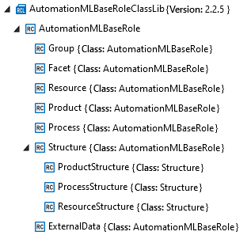

рис.2. Вигляд структури бібліотеки ролей AML в AML Editor

### Facet

**Фасета (Facet)** базуються на концепції дзеркалювання Атрибутів або Інтерфейсів, яка дає можливість розміщувати одні і ті самі Атрибути/Інтерфейси в різних екземплярах (про концепцію дзеркалювання детально можна прочитати в [CAEX - Computer Aided Engineering eXchange](caex.md)). Таким чином властивості оригінальних об'єктів які реалізуються через Атрибути або Інтерфейси AutomationML можуть об'єднуватися в різні угрупування за різними ознаками, що може бути використано для зручності доступу до них. Отже Фасет надає саме те, що потрібно з одного або кількох об'єктів через відповідну групу, що можна використати наприклад для фільтрації Атрибутів та Інтерфейсів і дозволяє зосередитися лише на потрібних даних. 

Розглянемо це на прикладі, що зображено на рис.3. Об’єкт `Conveyor1` містить атрибути `A` і `B`, а також інтерфейси `X` і `Y`. Призначений фасет `PLCFacet` посилається на атрибут `A` та інтерфейс `X`, тоді як фасет `HMIFacet` посилається на атрибути `A` і `B`, а також на інтерфейс `Y`. Таким чином, обидва фасети надають відфільтрований погляд на певну інженерну інформацію, яка є релевантною для різних інженерних завдань.

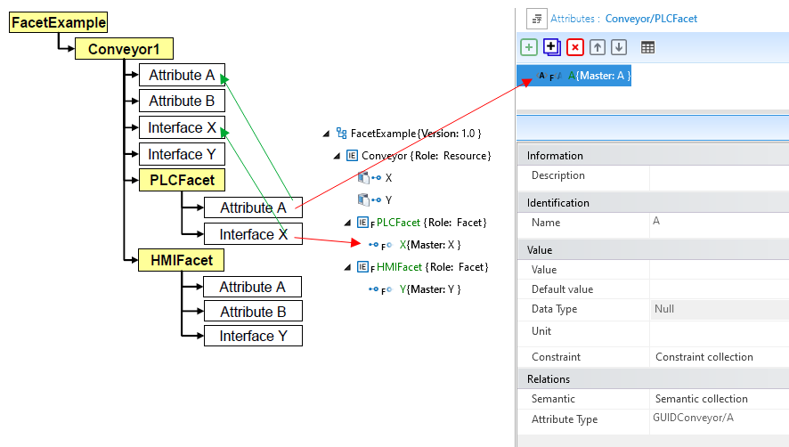

рис.3. Приклад Фасет `PLCFacet` та `HMIFacet` для `Conveyor1` у вигляді структури та в AutomationML Editor 

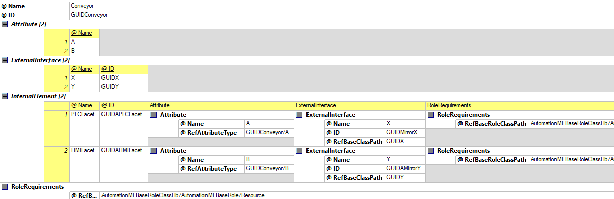

рис.4. Приклад Фасет `PLCFacet` та `HMIFacet` для `Conveyor1` у XML редакторі

Фасет моделюється наступним чином:

- Спочатку означуються атрибути та інтерфейси `InternalElement` або `SystemUnitClass`, які є важливими і повинні бути відфільтровані. На рис.1 та рис.2 для `Conveyor1` показані означені два Атрибути (з іменами `A` та `B`) і два Інтерфейси (з `ID` рівними `GUIDX`  та `GUIDY` відповідно).   
- Далі всередині батьківського створеного елементу моделюється один або кілька Фасетів як `InternalElement`, який має пряме або опосередковане посилання на клас ролей `Facet`.  Так, наприклад Фасета з іменем `PLCFacet` має роль `AutomationMLBaseRoleClassLib/AutomationMLBaseRole/Facet` 
- Фасети ідентифікуються своїм унікальним `ID`, їхні імена є лише відображуваними назвами. Так, наприклад Фасета з іменем `PLCFacet` має `ID` рівною `GUIDAPLCFacet`.  
- Допускається дзеркалювати тільки ті Атрибути Фасети, які належать безпосередньо до батьківського об’єкта, і тільки ті Інтерфейси, які належать до батьківського об’єкта, або вкладених в нього елементів.
- Фасети не повинні містити нових дочірніх об’єктів, атрибутів або інтерфейсів.

- Зв'язок з Інтерфейсами (`<ExternalInterface>` ) дзеркального Інтерфейсу відбувається через зазначення `ID` його основного об'єкту у полі `RefBaseClassPath`. Так на рис.2 видно що `PLCFacet` має Інтерфейс `X` який має посилання через `RefBaseClassPath = GUIDX` 

- Зв'язок з Атрибутами  (`<Attribute>`) дзеркального Атрибуту відбувається через поле `RefAttributeType`, де зазначається `ID` батьківського екземпляра основного атрибуту, за яким слідує символ `/` і шлях до атрибуту. Так на рис.2 видно що `PLCFacet` має Атрибут `A` який має посилання через `RefAttributeType = GUIDConveyor/A` 

### Group

Група (Group) базується на концепції дзеркалювання, яка дає можливість розмістити один і той самий екземпляр в кількох ієрархіях шляхом представлення єдиного об'єкту у вигляді його дзеркал (про концепцію дзеркалювання детально можна прочитати в [CAEX - Computer Aided Engineering eXchange](caex.md)). 

Таким чином об'єкти можуть об'єднуватися в різні угрупування за різними ознаками, що може бути використано для зручності доступу до них. 

Ідея концепції груп полягає в тому, що ієрархія екземплярів може містити сотні різних об’єктів AutomationML, але для певного інженерного завдання цікавими є лише деякі з них. Було б дуже зручно підготувати об’єкти таким чином, щоб зовнішні програмні алгоритми (поза межами AutomationML) могли легко отримати лише ті об’єкти, які є важливими для їхнього завдання.

Наприклад, розглянемо інженерний алгоритм, який шукає всі конвеєри установки, щоб автоматично згенерувати відповідні функціональні блоки конвеєрів. На рис.3 показаний приклад групування. Cтанціz `Station` містить об’єкти `Conveyor1`, `Conveyor2`, `Robot` і `PLC`. Додатково об’єкти `Group1` і `Group2` віддзеркалюють потрібні об’єкти. `Group1` забезпечує фокусований вигляд лише на конвеєри, тоді як `Group2` містить тільки об’єкти, пов’язані з `PLC`.

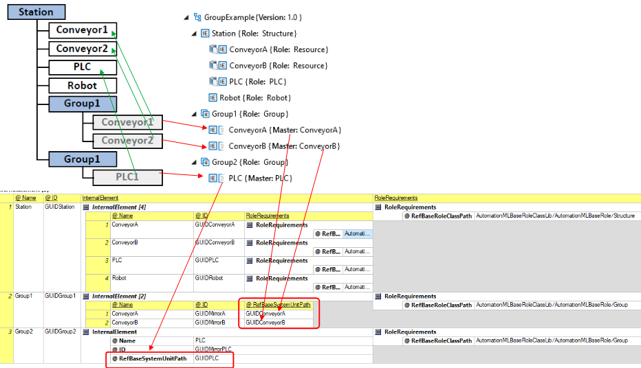

рис.5.  Приклад Груп `Group1` та `Group2` для об'єднання різних Internal Element

Група моделюється наступним чином:

- Спочатку означуються потрібні об’єкти в наявній об’єктній моделі
- Створюється Група як CAEX `InternalElement` у будь-якому місці структури `InstanceHierarchy` або `SystemUnitClass`, який має пряме або опосередковане посилання на клас ролей Group (`RefBaseRoleClassPath = AutomationMLBaseRoleClassLib/AutomationMLBaseRole/Group`)
- Групи ідентифікуються за їхнім унікальним `ID`, а їхні імена є лише відображуваними назвами.
- Група має містити лише дзеркальні `InternalElement` та/або інші Групи (вкладені групи) 
- Вкладені Групи не повинні використовуватись для опису ієрархії установки
- Група може зберігати додаткову інформацію у вигляді Атрибутів або Інтерфейсів для опису специфічних властивостей Групи. Ці додаткові Атрибути або Інтерфейси не є ідентичними Атрибутам чи Інтерфейсам дзеркальних об’єктів, які вона містить
- Заборонено змінювати існуючі Атрибути, Інтерфейси або Порти дзеркальних об’єктів, а також додавати до них нову інформацію.
- Якщо використовується атрибут `AssociatedFacet`, він повинен містити значення, яке є дійсною назвою існуючого фасету кожного дзеркального об’єкта. Застосування цього атрибута описане в розділі 2.6.5.

### Групи з Фасетами

На рис.4 показаний приклад поєднання концепцій `Group` і `Facet`. Наведена ієрархія екземплярів показує об’єкт `Station`, який містить об’єкти `Conveyor1` і `Conveyor2`. Кожен конвеєр має два Атрибути (`A` і `B`) та два Інтерфейси (`X` і `Y`). Крім того, два Фасети — `PLCFacet` і `HMIFacet` — фільтрують Атрибути та Інтерфейси, що становлять інтерес.

Об’єкт `Groups` містить вкладені Групи `Group1` і `Group2`, які посилаються на об’єкти конвеєрів, але мають різні асоціації з Фасетами.

У даному випадку якщо цю модель використовує алгоритм генерації коду для PLC, він може пройти через ієрархію екземплярів, визначити всі групи, що мають асоціацію з `PLCFacet`, і виконати генерацію коду, використовуючи дані з відповідного фасету `PLCFacet`. Аналогічно, алгоритм генерації коду для HMI може пройти через ієрархію екземплярів, визначити всі Групи, що мають асоціацію з `HMIFacet`, і виконати генерацію HMI, використовуючи дані з відповідного Фасету `HMIFacet`.

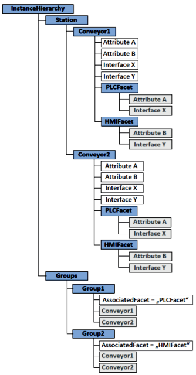

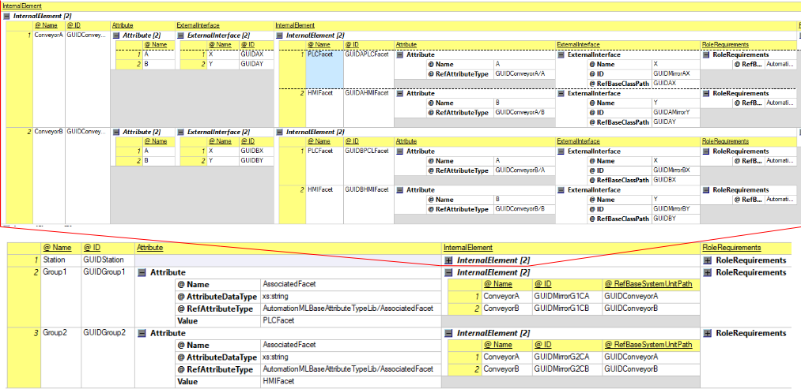

рис.6. Приклад використання Групи з Фасетами 

### Structure

Клас ролей `Structure` є базовим абстрактним типом ролі для об’єктів, що використовуються як структурні елементи в ієрархії установки, наприклад теку, майданчик або виробничу лінію.  Він не описує функціональну поведінку чи технологічні властивості об’єкта, а задає його місце та призначення в структурі установки. Такі ролі застосовуються для формування топології підприємства або установки і слугують контейнерами для інших елементів, зокрема ресурсів, процесів і продуктів, забезпечуючи однозначну навігацію та впорядкування моделі. Наступні ролі наслідують роль Structure, приклади використання яких наведені в наступному пункті:

- `ProductStructure`
- `ProcessStructure`
- `ResourceStructure`

### Process, Product, Resource

Концепція (Process-Product-Resource) **PPR** походить з концепції цифрової фабрики та пов’язана з необхідністю електронного опису всіх даних планування, які беруть участь у виробничому процесі. У процесі структурування складних інженерних даних виробничих установок поділ даних на ресурси, процеси та продукти на практиці показав свою ефективність. Ця концепція застосовується в різних галузях, наприклад у засобах цифрової фабрики або на рівні систем керування виробництвом (MES) відповідно до IEC 62264.

- У ресурсно-орієнтованому поданні ресурси є центральним компонентом моделі: вони виконують процеси та обробляють продукти. В AutomationML ресурсом є сутність, задіяна у виробництві, включно з установками, роботами, машинами, їх станами, обладнанням, можливими повідомленнями тощо. Відповідно, ресурсами можуть бути як апаратні компоненти виробничої системи, так і програмні системи, наприклад SCADA. В AutomationML ресурси зазвичай моделюються в ієрархії установки, що формує топологію підприємства.

- У продуктно-орієнтованому поданні в центрі уваги перебуває виготовлюваний продукт. Саме він визначає, які процеси мають бути застосовані до матеріалів або напівфабрикатів і яке обладнання для цього слід використовувати. Це справедливо для безперервного, дискретного та пакетного керування. Продукт в AutomationML описує виготовлений виріб і може мати ієрархічну структуру. Важливо, що продукти не обов’язково є кінцевими виробами. До продуктів належать також результати випробувань, дані про продукт і відповідна документація.

- У процесно-орієнтованому поданні центральними елементами моделі є процеси. Процес в AutomationML представляє виробничий процес, включно з підпроцесами. До процесів належать параметри процесу, ланцюг процесів і планування процесів. У технічному сенсі процеси модифікують продукти. Це відповідає використанню в AutomationML, оскільки кінцеві продукти виготовляються з різних підпродуктів або, наприклад, хімічні обробки змінюють речовини. Водночас процеси мають зв’язки з ресурсами і навпаки.

У кожному випадку представлення ресурсу, продукту та процесу пов’язані між собою (див. рис.5). Обґрунтованим є, наприклад, зіставлення процесу «транспортування» з ресурсом «конвеєр». «Прес» може створювати «кубики брухту». А процес «зварювання» може з’єднувати два «метали» між собою.


Рис.7. базові елементи концепції «Продукт–Процес–Ресурс» (Джерело IEC 62714-1)

Для створення зв’язку між цими елементами потрібен інтерфейс. Для цього в AutomationML означено стандартний клас інтерфейсу **PPRConnector** (див. рис.6). PPRConnector описаний нижче. За допомогою цього інтерфейсу зв’язки між елементами можуть встановлюватися з використанням стандартних CAEX `InternalLinks`. Таким чином, ресурси можуть бути пов’язані з продуктами, якими вони можуть маніпулювати.

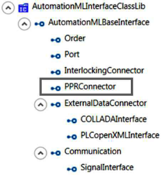

Рис.8. PPRConnector interface  (Джерело IEC 62714-1)

Наступний приклад (див. рис. 7) ілюструє застосування цієї концепції в AutomationML. Він складається з двох конвеєрів (`C1` і `C2`), поворотного столу (`TT1`) та робота (`RB1`). Усі вони є ресурсами установки. Робот здійснює складання коліс на автомобілі. Колеса так само, як і автомобілі, є продуктами. Виробничими процесами в цьому прикладі є транспортування, поворот і складання.

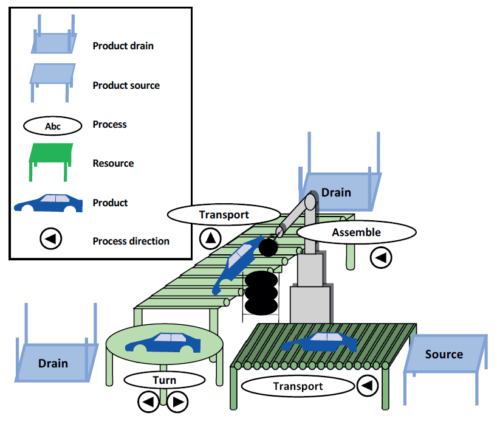

Рис.9. Приклад концепції «Продукт–Процес–Ресурс»  (Джерело IEC 62714-1)

На рис.7 конвеєрні стрічки, поворотний стіл і робот з наведеного прикладу призначені ролі `Resource`. Кузов із колесами, кузов без коліс, а також самі колеса призначені ролі `Product`. Роль `Process` відповідає процесам транспортування, повороту та збирання. Усі ці елементи зберігаються як незалежні ієрархії екземплярів у відповідних піддеревах.

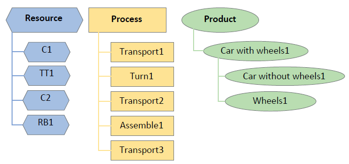

Рис.10: елементи прикладу PPR (Джерело "AutomationML. A Practical Guide" )

Кожен елемент у прикладі має інтерфейс `PPRConnector`. Повні зв’язки прикладу показані на рис.8. Суцільні лінії відображають зв’язки між ресурсами та процесами, пунктирні лінії — між процесами та продуктами, а штрихові — між ресурсами та продуктами. Це демонструє складність структури. Таким чином, надлишкові зв’язки можуть бути опущені.

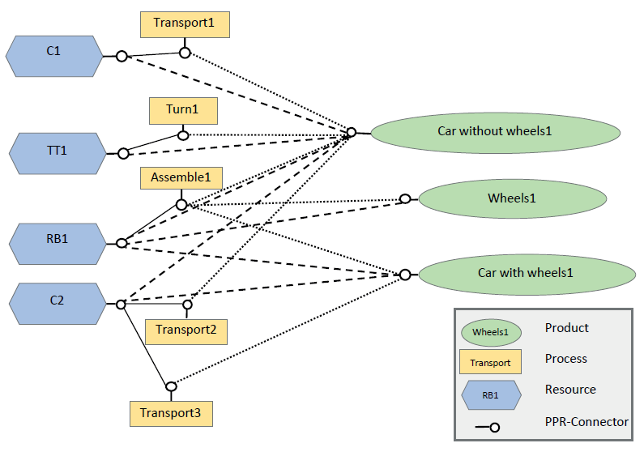

Рис. 11: зв’язки в межах прикладу (Джерело "AutomationML. A Practical Guide" )

Для моделювання наведеного вище прикладу спочатку потрібно створити три внутрішні елементи (`InternalElement`), пов’язані зі стандартними класами ролей `ProductStructure`, `ProcessStructure` або `ResourceStructure` (див. рис.9).

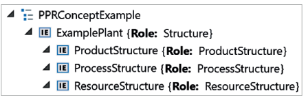

Рис. 12: крок 1 — моделювання концепції PPR 

На другому етапі потрібно змоделювати визначені продукти, етапи процесів і ресурси (див. рис.10).

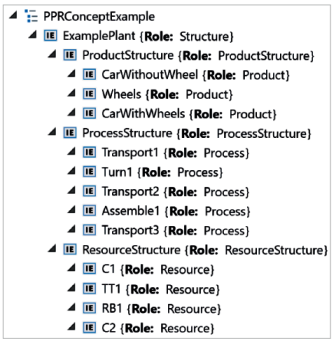

Рис.13: крок 2 — моделювання концепції PPR

Щоб можна було змоделювати зв’язки між елементами, усі елементи забезпечуються інтерфейсом `PPRConnector` (див. рис.11). Через цей інтерфейс можна використовувати елементи CAEX  для створення зв’язків між елементами, що дозволяє семантично відповісти на питання, хто з ким пов’язаний. Кілька прикладів: ресурс може бути пов’язаний із продуктами, які він може обробляти; або ресурс може описувати процеси, що можуть виконуватись на ньому. У наведеному прикладі кожен з елементів має інтерфейс PPRConnector. Кількість зв’язків швидко зростає і може стати складною для огляду; її можна зменшити, опустивши надлишкові зв’язки.

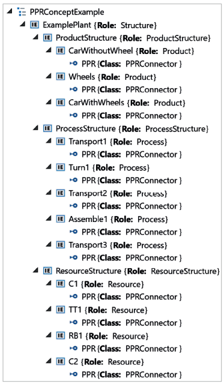

Рис. 14: крок 3 — моделювання концепції PPR

На останньому етапі потрібно змоделювати зв’язки між відповідними етапами процесів, продуктами та ресурсами. 

### ExternalData

Клас інтерфейсу `ExternalDataConnector` є базовим абстрактним типом інтерфейсу та повинен використовуватися для опису інтерфейсів-з’єднувачів, що посилаються на зовнішні документи. Від цього класу походять класи `COLLADAInterface` та `PLCopenXMLInterface`. Усі наявні та майбутні класи інтерфейсів-з’єднувачів повинні бути похідними від цього класу безпосередньо або опосередковано.

## Базова бібліотека класів інтерфейсів

Клас інтерфейсів AutomationMLBaseInterface є базовим абстрактним типом інтерфейсу і має використовуватися як батьківський для опису всіх класів інтерфейсів AML.

| Клас інтерфейсів      |                                                              |      |
| --------------------- | ------------------------------------------------------------ | ---- |
| Order                 | Клас інтерфейсів Order є абстрактним класом, який використовується для опису послідовностей, наприклад наступників або попередників. |      |
| Port                  | Клас інтерфейсів Port є типом інтерфейсу для інтерфейсів, які можуть містити кілька вкладених інтерфейсів. Це дозволяє описувати складні інтерфейси. |      |
| PPRConnector          | Клас інтерфейсів PPRConnector використовується для встановлення зв’язків між ресурсами, продуктами та процесами. |      |
| ExternalDataConnector | Клас інтерфейсів ExternalDataConnector є базовим абстрактним типом інтерфейсу і використовується для опису інтерфейсів-з’єднувачів, які посилаються на зовнішні документи. Класи COLLADAInterface і PLCopenXMLInterface походять від цього класу. Усі існуючі та майбутні класи з’єднувачів мають безпосередньо або опосередковано успадковувати цей клас. |      |
| Communication         | Клас інтерфейсів Communication є абстрактним типом інтерфейсу і використовується для опису інтерфейсів, пов’язаних із комунікацією. <br />SignalInterface -  використовується для моделювання сигналів. Цей тип інтерфейсу є конфігурованим і дозволяє описувати цифрові та аналогові входи і виходи, а також комбіновані вхідно-вихідні сигнали. |      |

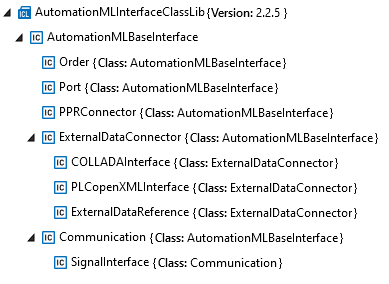

рис.15.

### Order

### Port

На практиці інтерфейси часто поєднуються у комбіновані штекери або розетки (див. рис. 16). Суперконектори об’єднують кілька підконекторів у єдиний формат верхнього рівня. Це полегшує, наприклад, з’єднання між собою модулів конвеєра. Такі об’єднані інтерфейси називають **Портами (Port)**. Коли Порти з’єднуються, вкладені Порти автоматично зв’язуються між собою — наприклад, пневматика, сигнали безпеки, мережеві дані й живлення. Порти часто мають таку механічну конструкцію, що з’єднати можна лише сумісні порти. З’єднання Портів автоматично означає правильне з’єднання вкладених Інтерфейсів.

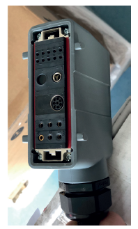

Рис. 16: складний вкладений електричний інтерфейс

Правила моделювання Портів використовують можливість CAEX 3.0 створювати вкладені інтерфейси. Для моделювання порту необхідно виконати такі кроки:

1. Змоделювати порт як Інтерфейс CAEX, пов’язаний з відповідним об’єктом AML; цей інтерфейс повинен бути прямо або опосередковано успадкований від стандартного класу інтерфейсів AML `Port`.
2. Змоделювати вкладені Інтерфейси. Вони можуть бути будь-якого типу. Вкладені Інтерфейси можуть мати власні вкладення, і глибина ієрархії не обмежена.
3. Щоб з’єднати два порти, створити між ними елемент CAEX `InternalLink`. Саме це з’єднання вже означає, що вкладені інтерфейси пов’язані коректно без додаткових зв’язків.
4. За бажанням можна змоделювати з’єднання між вкладеними Інтерфейсами окремо.
5. Можна встановити Атрибут `Direction` для порту; дозволені значення — `In`, `Out` і `InOut`. Це дає змогу перевіряти сумісність напрямків автоматично.
6. Можна встановити Атрибут `Cardinality`, який дозволяє моделювати мінімальну або максимальну кількість з’єднань.
7. Можна встановити Атрибут `Category`, щоб визначити категорію порту. Синтаксис задається користувачем. Це корисно для автоматичної перевірки сумісності.

На рис.17 продемонстровано приклад концепції порту AML. Об’єкт Station містить підоб’єкти `Module A` та `Module B`. Обидва підоб’єкти мають порт із вкладеними підінтерфейсами. Кожен порт змодельовано за допомогою інтерфейсу `Port`, успадкованого від стандартного класу інтерфейсів AML `Port`, і він містить набір вкладених інтерфейсів. Стандартні інтерфейси з’єднані за допомогою елемента CAEX `InternalLink`. Це з’єднання означає, що обидва порти з’єднані між собою. Внутрішні зв’язки між підінтерфейсами детально не моделюються — з’єднуються лише самі порти. На додачу до цього концепту AML також дозволяє моделювати й зберігати кожен окремий зв’язок між підінтерфейсами.

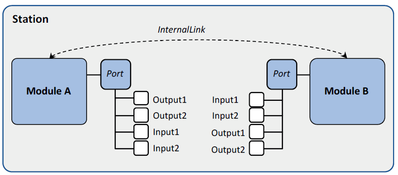

Рис. 17: концепція порту

Рис. 18 ілюструє об’єктну модель, а рис.19 показує реалізацію прикладної системи з рис. 17 у форматі AML.


Рис. 18: Object-oriented modelling of the modules

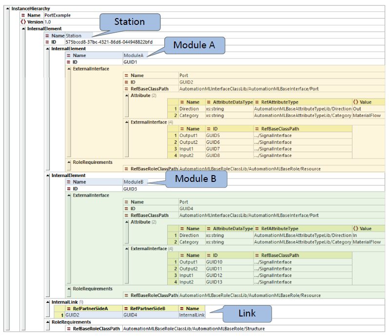

Рис. 19: структура AML для прикладу з портом

### PPRConnector

### ExternalDataConnector

### Communication

Клас інтерфейсів Communication є абстрактним типом інтерфейсу і використовується для опису інтерфейсів, пов’язаних із комунікацією. 

`SignalInterface` -  використовується для моделювання сигналів. Цей тип інтерфейсу є конфігурованим і дозволяє описувати цифрові та аналогові входи і виходи, а також комбіновані вхідно-вихідні сигнали.

## Базова бібліотека типів атрибутів

| Назва атрибута          | Семантика                                                    |
| ----------------------- | ------------------------------------------------------------ |
| AssociatedExternalValue | Цей атрибут містить підатрибути, які дозволяють з’єднувати атрибут CAEX з елементом у зовнішньому документі. Підатрибути описані в таблиці 26. Використання атрибута AssociatedExternalValue описане в розділі 2.5.5. Сам атрибут AssociatedExternalValue не має значення.  AttributeDataType: порожній  Parent: AutomationMLBaseAttributeTypeLib  Path: AutomationMLBaseAttributeTypeLib/AssociatedExternalValue |
| AssociatedFacet         | Цей атрибут використовується для визначення назви пов’язаної фасети (Facet). Використання описане в розділі 2.6.5.  Приклад: AssociatedFacet = “PLCFacet”.  AttributeDataType: xs:string  Parent: AutomationMLBaseAttributeTypeLib/AssociatedFacet |
| Cardinality             | Цей атрибут належить до зовнішнього інтерфейсу CAEX (ExternalInterface) і використовується для опису дозволеної максимальної та мінімальної кількості з’єднань з/до цього інтерфейсу. Атрибут Cardinality є складним і не повинен мати власного значення. Відповідні підатрибути описані в таблиці 2-28.  AttributeDataType: цей атрибут не має типу даних, оскільки не має значення.  Path: AutomationMLBaseAttributeTypeLib/Category |
| Category                | Цей атрибут належить до зовнішнього інтерфейсу CAEX і описує категорію цього інтерфейсу. Значення атрибута визначається користувачем. З’єднуватися дозволяється лише інтерфейсам з однаковим значенням категорії. Стандарт не визначає фіксованих категорій.  Приклад: Category = “MaterialFlow”  AttributeDataType: xs:string  Path: AutomationMLBaseAttributeTypeLib/Category |
| Direction               | Цей атрибут використовується для опису напрямку інтерфейсу CAEX, наприклад сигналу або з’єднання. Дозволені значення: In, Out або InOut.  Інтерфейси CAEX, що використовують цей атрибут, повинні дотримуватись таких положень:  – Інтерфейси з напрямком In можуть з’єднуватися лише з інтерфейсами Out або InOut.  – Інтерфейси з напрямком Out можуть з’єднуватися лише з інтерфейсами In або InOut.  Цю інформацію можна використовувати, наприклад, для перевірки правильності з’єднання.  Приклади:  Direction = “Out” (наприклад, штекер)  Direction = “In” (наприклад, розетка)  Direction = “InOut”  AttributeDataType: xs:string  Path: AutomationMLBaseAttributeTypeLib/Direction |
| DocLang                 | Атрибут DocLang описує мову посилального документа. Атрибут повинен мати значення відповідно до стандарту RFC1766.  Приклади:  DocLang = de – документ німецькою мовою, чинний у Німеччині.  DocLang = fr-CA – документ французькою мовою, чинний у Канаді.  AttributeDataType: xs:string  Parent: AutomationMLBaseAttributeTypeLib  Path: AutomationMLBaseAttributeTypeLib/DocLang |
| Frame                   | Атрибут Frame описує геометричне положення відповідного InternalElement відносно його батьківського елемента. Він визначає такі вкладені атрибути:  x: зсув уздовж осі x батьківської системи координат у метрах  y: зсув уздовж осі y у метрах  z: зсув уздовж осі z у метрах  rx: обертання навколо осі x у градусах (°)  ry: обертання навколо осі y у градусах (°)  rz: обертання навколо осі z у градусах (°)  Усі вкладені атрибути мають тип xs:string. Використання та приклади описані в розділі 2.2.8.5. |
| ListType                | Цей атрибут використовується для атрибутів, які містять невпорядкований список атрибутів. |
| OrderedListType         | Атрибут OrderedListType використовується для атрибутів, що містять упорядкований список атрибутів. |
| LocalizedAttribute      | Цей атрибут використовується для підатрибутів, що описують мовну альтернативу свого батьківського атрибута. Концепція описана в розділі 2.6.7.3.  AttributeDataType: xs:string  Parent: AutomationMLBaseAttributeTypeLib/LocalizedAttribute |
| MIMEType                | Атрибут MIMEType описує тип документа, на який створено посилання. Атрибут повинен мати значення відповідно до стандарту Multipurpose Internet Mail Extensions (MIME).  Приклади:  MIMEType = “application/pdf” – документ типу PDF.  MIMEType = “application/xml” – документ типу XML.  MIMEType = “application/msword” – документ типу DOC.  MIMEType = “application/msexcel” – документ типу XLS.  AttributeDataType: xs:string  Parent: AutomationMLBaseAttributeTypeLib  Path: AutomationMLBaseAttributeTypeLib/MIMEType |
| refURI                  | Цей атрибут використовується для збереження шляху до зовнішнього документа.  AttributeDataType: xs:anyURI  Path: AutomationMLBaseAttributeTypeLib/refURI |

Таблиця 2-28: Підатрибути атрибута Cardinality

| Атрибут  | AttributeDataType | Опис                                                         | Приклад                                                      |
| -------- | ----------------- | ------------------------------------------------------------ | ------------------------------------------------------------ |
| MinOccur | xs:unsignedInt    | Значення MinOccur описує мінімально можливу кількість з’єднань до або від відповідного класу інтерфейсу. Атрибут повинен мати значення, більше або рівне 0. | MinOccur = 1 — цей порт повинен бути під’єднаний принаймні до одного іншого порту. |
| MaxOccur | xs:unsignedInt    | Значення MaxOccur описує максимально можливу кількість з’єднань до або від відповідного класу інтерфейсу. Атрибут повинен мати значення, більше або рівне MinOccur, або 0, що означає нескінченність. | MaxOccur = 3 — цей порт може бути під’єднаний максимум до трьох інших портів. |


### ListType і OrderedListType (списки і масиви)

Припустімо, ми хочемо змоделювати список частот, які розпізнає наш радіоприймач. Для цього потрібна можливість моделювання списків. Або розглянемо інший випадок: температура зовнішнього датчика має архівуватися з часом. Для цього потрібна можливість моделювання масивів — тобто списків із кількома записами; у цьому прикладі це пари значень «дата/температура». Або робот має зберігати свої позиції з плином часу разом із часовими позначками — це також можна змоделювати у вигляді масиву.

#### List

Списки (List) складаються з елементів одного типу даних і можуть містити вкладені списки, що дає змогу моделювати масиви довільної розмірності. Список у AML моделюється як атрибут списку, що містить вкладені дочірні атрибути. Атрибут списку виконує роль контейнера для елементів списку. Атрибути CAEX не моделюють порядок елементів явно, тому впорядковані та невпорядковані списки потрібно моделювати окремо.

Правила моделювання списків такі:

- Для невпорядкованого списку створити атрибут CAEX і послатися на стандартний атрибут AML ListType. Для впорядкованого списку послатися на стандартний атрибут `OrderedListType`. Цей атрибут CAEX не має значення Value, DefaultValue або Unit. Заголовкова інформація дозволена.
- Елементи списку моделюються як дочірні атрибути списку. Усі елементи повинні мати один і той самий тип.
- Для невпорядкованого списку записи повинні мати унікальні імена в межах списку. Для впорядкованого списку записи повинні ідентифікуватися послідовними номерами: 1, 2 тощо. Допускаються провідні нулі — 0001, 0002 і т. д.

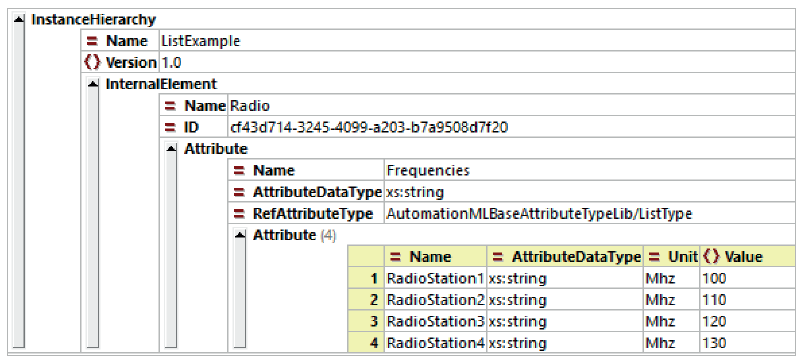

Рис. 2-100: невпорядкований список

#### Array

Масив моделюється як список списків. Правила моделювання масивів такі:

- Створити атрибут CAEX і послатися на стандартний атрибут AML `ListType` або `OrderedListType`. Цей атрибут CAEX не має значень `Value`, `DefaultValue` чи `Unit`. Заголовкова інформація дозволена.
- Змоделювати рядки масиву як дочірні атрибути списку. Усі елементи повинні мати тип `ListType` або `OrderedListType.
- Змоделювати стовпці масиву як дочірні атрибути кожного підсписку.
- Цю техніку можна застосовувати багаторазово для моделювання багатовимірних масивів.

Рис. 2-101 показує приклад із роботом, позиції якого зберігаються в масиві `Positions` з часом. Кожна позиція містить чотири записи: `Time`, `X`, `Y`, `Z`.

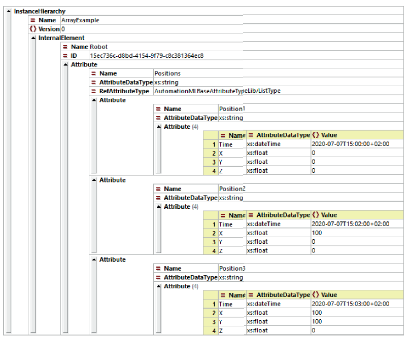

Рис. 2-101: масив

### LocalizedAttribute (Інтернаціоналізація, багатомовні атрибути) 

Інженерні дані часто розробляються кількома мовами. Миттєве перемикання між мовами в міжнародних командах для глобальної співпраці є корисним, але вимагає підтримки багатомовності під час моделювання та обміну даними. Концепція багатомовних виразів має на меті забезпечити зберігання багатомовної інформації в межах одного файлу AML.

 Правила моделювання для багатомовних виразів такі:

- Багатомовний атрибут моделюється як атрибут CAEX. Значення цього атрибута є стандартним виразом, який використовується, якщо не запитано конкретну мову або якщо запитана мова відсутня в моделі.
- Мовний вираз атрибута моделюється як вкладений атрибут, що посилається на стандартний тип атрибута AutomationML `LocalizedAttribute`.
- Назва кожного дочірнього атрибута повинна відповідати позначенню мови згідно з RFC 1766, наприклад `de` для німецької, `fr` для французької або `en` для англійської. Значення мовних атрибутів повинно бути перекладеним текстом відповідною мовою.
- Складені позначення мов, наприклад `en-US` для американського варіанту англійської або `fr-CA` для канадського варіанту французької.
- Список абревіатур доступний [за посиланням](https://docs.microsoft.com/en-us/windows/win32/wmformat/language-strings)

Рис. 2-98 демонструє це на прикладі робота, атрибут Price якого зберігається кількома мовами.

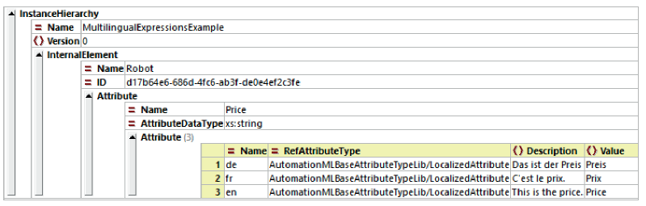

Рис. 2-98: багатомовні атрибути

Рекомендується моделювати багатомовні вирази у бібліотеці типів атрибутів, що допомагає усунути надлишковість. Після визначення такі багатомовні атрибути можуть бути інстанційовані, а переклади можуть бути видалені з окремих екземплярів. Рис. 2-99 ілюструє це, показуючи перероблену модель атрибута з рис. 2-98.


Рис. 2-99: бібліотека типів атрибутів із підтримкою багатомовності

Бібліотеки AML можуть зберігатися як окремі файли, що зменшує складність основного проєктного файлу та спрощує повторне використання. Початковою точкою є документ AML, який містить як дані проєкту, так і бібліотеку типів атрибутів. Кроки для ручного винесення бібліотеки багатомовних атрибутів у зовнішній файл:

- Крок 1: Створити копію проєктного документа AML. Виконати такі дії з копією:
  - Перейменувати копію відповідним чином, наприклад `MultiLanguageAttributes.aml`.
  - Відкрити документ і видалити весь нерелевантний вміст, залишивши лише потрібну бібліотеку типів атрибутів.

- Крок 2: В оригінальному файлі:
  - Видалити бібліотеку типів атрибутів.
  - Створити новий елемент CAEX .
  - Створити псевдонім (Alias), надати йому ім’я та вказати шлях до зовнішнього документа AML.
  - Оновити всі посилання на атрибути, замінивши початковий шлях новим псевдонімом.

У результаті отримуємо два файли:

1. основний проєктний файл без бібліотеки;
2. окремий документ AML, який містить лише бібліотеку багатомовних атрибутів.

### AssociatedExternalValue

Цей атрибут містить підатрибути, які дозволяють з’єднувати атрибут CAEX з елементом у зовнішньому документі. Підатрибути описані в таблиці 26. Використання атрибута AssociatedExternalValue описане в розділі 2.5.5. Сам атрибут AssociatedExternalValue не має значення.  AttributeDataType: порожній  Parent: AutomationMLBaseAttributeTypeLib  Path: AutomationMLBaseAttributeTypeLib/AssociatedExternalValue

### Cardinality

Цей атрибут належить до зовнішнього інтерфейсу CAEX (ExternalInterface) і використовується для опису дозволеної максимальної та мінімальної кількості з’єднань з/до цього інтерфейсу. Атрибут Cardinality є складним і не повинен мати власного значення. Відповідні підатрибути описані в таблиці 2-28.  AttributeDataType: цей атрибут не має типу даних, оскільки не має значення.  Path: AutomationMLBaseAttributeTypeLib/Category

### Category  

Цей атрибут належить до зовнішнього інтерфейсу CAEX і описує категорію цього інтерфейсу. Значення атрибута визначається користувачем. З’єднуватися дозволяється лише інтерфейсам з однаковим значенням категорії. Стандарт не визначає фіксованих категорій.  Приклад: Category = “MaterialFlow”  AttributeDataType: xs:string  Path: AutomationMLBaseAttributeTypeLib/Category

### Direction  

Цей атрибут використовується для опису напрямку інтерфейсу CAEX, наприклад сигналу або з’єднання. Дозволені значення: In, Out або InOut.  Інтерфейси CAEX, що використовують цей атрибут, повинні дотримуватись таких положень:  – Інтерфейси з напрямком In можуть з’єднуватися лише з інтерфейсами Out або InOut.  – Інтерфейси з напрямком Out можуть з’єднуватися лише з інтерфейсами In або InOut.  Цю інформацію можна використовувати, наприклад, для перевірки правильності з’єднання.  Приклади:  Direction = “Out” (наприклад, штекер)  Direction = “In” (наприклад, розетка)  Direction = “InOut”  AttributeDataType: xs:string  Path: AutomationMLBaseAttributeTypeLib/Direction

### DocLang  

Атрибут DocLang описує мову посилального документа. Атрибут повинен мати значення відповідно до стандарту RFC1766.  Приклади:  DocLang = de – документ німецькою мовою, чинний у Німеччині.  DocLang = fr-CA – документ французькою мовою, чинний у Канаді.  AttributeDataType: xs:string  Parent: AutomationMLBaseAttributeTypeLib  Path: AutomationMLBaseAttributeTypeLib/DocLang

### Frame  

Атрибут Frame описує геометричне положення відповідного InternalElement відносно його батьківського елемента. Він визначає такі вкладені атрибути:  x: зсув уздовж осі x батьківської системи координат у метрах  y: зсув уздовж осі y у метрах  z: зсув уздовж осі z у метрах  rx: обертання навколо осі x у градусах (°)  ry: обертання навколо осі y у градусах (°)  rz: обертання навколо осі z у градусах (°)  Усі вкладені атрибути мають тип xs:string. Використання та приклади описані в розділі 2.2.8.5.

### MIMEType  

Атрибут MIMEType описує тип документа, на який створено посилання. Атрибут повинен мати значення відповідно до стандарту Multipurpose Internet Mail Extensions (MIME).  Приклади:  MIMEType = “application/pdf” – документ типу PDF.  MIMEType = “application/xml” – документ типу XML.  MIMEType = “application/msword” – документ типу DOC.  MIMEType = “application/msexcel” – документ типу XLS.  AttributeDataType: xs:string  Parent: AutomationMLBaseAttributeTypeLib  Path: AutomationMLBaseAttributeTypeLib/MIMEType

### refURI  

Цей атрибут використовується для збереження шляху до зовнішнього документа.  AttributeDataType: xs:anyURI  Path: AutomationMLBaseAttributeTypeLib/refURI


 [2.5 Referencing external documents.md](..\..\..\..\books\AutomationML\practical_guide\2.5 Referencing external documents.md) 

 [2.6 Extended AutomationML Concepts.md](..\..\..\..\books\AutomationML\practical_guide\2.6 Extended AutomationML Concepts.md) 

 [2.7 Best practice recommendations for AML modelling.md](..\..\..\..\books\AutomationML\practical_guide\2.7 Best practice recommendations for AML modelling.md) 

 [iec62714-1ed2.0b_unprot.pdf](..\..\..\..\standarts\IEC 62714  Automation Markup Language\iec62714-1ed2.0b_unprot.pdf) 

 [iec62714-2ed1.0b_unprot.pdf](..\..\..\..\standarts\IEC 62714  Automation Markup Language\iec62714-2ed1.0b_unprot.pdf) 

 [AML стнадарт](..\..\..\..\standarts\GitVerTranslation\AML) 

## Джерела

1. AutomationML. A Practical Guide. Edited by Rainer Drath, 2021 ISBN 978-3-11-074622-8, e-ISBN (PDF) 978-3-11-074623-5, e-ISBN (EPUB) 978-3-11-074659-4
2. Schmidt, N.; Lüder, A. *AutomationML in a Nutshell.* AutomationML e.V. Office, State: November 2015.
3. https://www.automationml.org
4. Whitepaper AutomationML Edition 2.1 Part 1 – Architecture and General Requirements State: July 2018  https://www.automationml.org/download-archive/


## Автори


Теоретичне заняття розробив [Олександр Пупена](https://github.com/pupenasan). 

## Feedback

Якщо Ви хочете залишити коментар у Вас є наступні варіанти:

- [Обговорення у WhatsApp](https://chat.whatsapp.com/BRbPAQrE1s7BwCLtNtMoqN)
- [Обговорення в Телеграм](https://t.me/+GA2smCKs5QU1MWMy)
- [Група у Фейсбуці](https://www.facebook.com/groups/asu.in.ua)

Про проект і можливість допомогти проекту написано [тут](https://asu-in-ua.github.io/atpv/)

