[<- До підрозділу](README.md)		[Коментувати](#feedback)

# AutomationML Communication

Це переклад [Whitepaper AutomationML Communication Document Identifier: WP Comm, V 1.0.0 State: September 2014 ](https://www.automationml.org/download-archive/)

## 1 Вступ / Область застосування

Інженерні процеси технічних систем та вбудованих у них систем автоматизації мають виконуватися з дедалі вищою ефективністю та якістю. При цьому тривалість проєкту має скорочуватися, тоді як складність спроєктованої системи зростає. Для розв’язання цієї проблеми інженерний процес усе більше реалізується із застосуванням програмних інженерних інструментів, які обмінюються інженерною інформацією та артефактами вздовж ланцюга інструментів, пов’язаного з інженерним процесом.

Системи зв’язку є важливою складовою сучасних технічних систем і, зокрема, систем автоматизації, вбудованих у них. У зв’язку зі зростаючою децентралізацією систем автоматизації та майбутнім широким застосуванням польових шин і технологій Ethernet вони з’єднують пристрої автоматизації та інші взаємодіючі сутності і мають задовольняти спеціальні вимоги щодо якості зв’язку, безпеки та захищеності. Таким чином, у процесі інженерії сучасних технічних систем також повинні обмінюватися інженерна інформація та артефакти, пов’язані із системами зв’язку, вздовж ланцюга інженерних інструментів.

На кожній фазі інженерного процесу технічних систем може створюватися інформація, пов’язана із системами зв’язку, яка може використовуватися на пізніших етапах інженерії. Типовим прикладом є створення конфігураційної інформації для компонентів зв’язку пристроїв автоматизації, зокрема комунікаційних адрес і структурування пакетів зв’язку, у середовищах програмування PLC на етапі програмування керування та її подальше використання в інструментах конфігурування пристроїв. Іншим типовим прикладом є передавання конфігурацій комунікаційних пристроїв до інструментів віртуального введення в дію, засобів документування або діагностичних інструментів.

Проте узгоджене та безвтратне передавання інженерної інформації систем зв’язку вздовж усього інженерного ланцюга технічних систем досі не розв’язане. Хоча користувацькі організації та компанії надали формати обміну даними для окремих частин відповідної інформації, такі як FCDML, EDDL і GSDML, зазначені вище приклади застосування не можуть бути повністю охоплені жодним форматом обміну даними. Зокрема, мережна інформація, що описує комунікаційні зв’язки, їхні властивості та якість, не може бути змодельована за допомогою формату обміну даними.

Цей white paper покликаний закрити цю прогалину. У ньому запропоновано нейтральну, незалежну від виробника та комунікаційної технології, XML-орієнтовану методологію обміну інформацією про системи зв’язку між інженерними інструментами, розроблену AutomationML e.V.

## 2 Терміни, визначення та скорочення

### 2.1 Терміни та визначення

Для цілей цього документа застосовуються наведені нижче терміни та визначення.

2.1.1 AML-атрибут - властивість, що належить AML-об’єкту. Примітка. AML-атрибути описуються як XML-елементи відповідно до IEC 62424:2008.

2.1.2 AML-документ - певний CAEX-документ відповідно до IEC 62714, включно з усіма піддокументами, на які є посилання. Примітка. AML-документи можуть зберігатися у вигляді файлів, а також, наприклад, у вигляді рядків або потоків даних.

2.1.3 AML-клас - попередньо визначений тип AML-об’єкта. Примітка. AML-класи зберігаються в AML-бібліотеках. Примітка. AML-класи визначають повторно використовувані зразкові рішення, що характеризуються атрибутами, інтерфейсами або агрегованими об’єктами. Примітка. AML-класи можуть використовуватися для множинних інстанціювань.

2.1.4 AML-файл - певний CAEX-файл відповідно до IEC 62714 з розширенням .aml, без урахування всіх підфайлів, на які є посилання

2.1.5 AML-інтерфейс - окрема точка з’єднання, що належить AML-об’єкту та може бути зв’язана з іншим інтерфейсом. Примітка. Інтерфейси дозволяють описувати відношення між об’єктами шляхом визначення CAEX InternalLink. Прикладами є сигнальний інтерфейс, продуктний інтерфейс або інтерфейс живлення.

2.1.6 AML-бібліотека - бібліотека, що містить AML-класи

2.1.7 AML-об’єкт - подання даних об’єкта автоматизації або групи об’єктів автоматизації. Примітка. AML-об’єкт є базовим елементом AML. Він може містити адміністративні дані, атрибути, інтерфейси, відношення або посилання. AML-об’єкт є окремою інстанцією та походить від стандартних AML-класів. Примітка. AML-об’єкти мають зв’язок зі своїм відповідним AML-класом. Примітка. Прикладами відношень є відношення тип–інстанція та копія–інстанція. Окремі інстанції можуть бути розширені, наприклад, агрегованими об’єктами або атрибутами. Примітка. AML-об’єкти мають відношення копія–інстанція зі своїм AML-класом.

2.1.8 AutomationML / AML - XML-орієнтований формат обміну даними для інженерних даних промислових установок

2.1.9 Об’єкт автоматизації - сутність в автоматизованій системі. Примітка. Прикладом об’єкта автоматизації є компонент автоматизації, клапан або сигнал.

2.1.10 Інстанція (Екземпляр) - подання даних конкретного реального об’єкта або конкретного логічного інженерного об’єкта

2.1.11 Ієрархія інстанцій - ієрархія AML-об’єктів

2.1.12 Зв’язок - з’єднання між об’єктами верхньорівневого формату CAEX. Примітка. Зв’язок моделюється за допомогою CAEX InternalLink.

### 2.2 Скорочення

Для цілей цього документа застосовуються скорочення, наведені в таблиці 1.

### 2.3 Нормативні посилання

Наведені нижче документи є обов’язковими для застосування цього документа. Для датованих посилань застосовується лише зазначене видання. Для недатованих посилань застосовується останнє видання відповідного документа (включно з усіма змінами).

IEC 60027 (усі частини), Літерні позначення, що застосовуються в електротехніці

IEC 60050, Міжнародний електротехнічний словник

IEC 62424:2008, Подання інженерії керування процесами. Запити на P&I-діаграмах та обмін даними між інструментами P&ID і PCE-CAE

ISO/IEC 9834-8, Інформаційні технології. Взаємозв’язок відкритих систем. Процедури функціонування реєстраційних органів OSI: генерування та реєстрація універсально унікальних ідентифікаторів (UUID) та їх використання як компонентів ASN.1 Object Identifier

IEC 62714 (усі частини), Формат обміну інженерними даними для використання в інженерії промислових систем. AutomationML

ISO 80000-1, Величини та одиниці. Частина 1: Загальні положення

Extensible Markup Language (XML) 1.0:2004, Рекомендація W3C (доступно за адресою http://www.w3.org/TR/2004/REC-xml-20040204/)

IEC 61158, Промислові комунікаційні мережі. Специфікації польових шин

IEC 61784, Промислові комунікаційні мережі. Профілі

IEC 61346, Промислові системи, установки та обладнання і промислові вироби. Принципи структурування та референтні позначення

## 3 Варіанти використання та розглянуті мережеві структури

Моделювання систем зв’язку на основі AutomationML орієнтоване на подання широкого спектра інформації, яка створюється, обмінюється та використовується в інженерному процесі проєктування виробничих систем. Водночас не вся можлива інформація, пов’язана із системами зв’язку, підлягає моделюванню. У цьому розділі визначено варіанти використання моделювання систем зв’язку, а також відповідні набори інформації в їх межах.

### 3.1 Варіанти використання

Інформація, пов’язана із системами зв’язку, є релевантною для різних інженерних діяльностей уздовж інженерного ланцюга виробничих систем. У процесі інженерії виробничих систем система зв’язку може проєктуватися на етапі детального проєктування з використанням різних інструментів. При цьому створюється інформація, пов’язана із системою зв’язку, яка надалі повинна застосовуватися під час детального проєктування пристроїв і введення їх в дію. На рисунку 1 наведено прикладовий набір інженерних діяльностей, релевантних у загальному інженерному процесі виробничих систем, а також вбудовану в нього інженерію систем зв’язку.

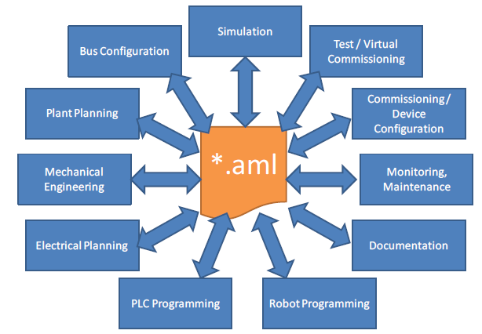

Рисунок 1 – Загальні інженерні діяльності, у які вбудовано інженерію систем зв’язку

У межах зазначених інженерних діяльностей істотний вплив мають інженерні інструменти, зокрема (але не обмежуючись ними):

- інструменти планування установок;
- інструменти механічного проєктування (MCAD);
- інструменти електротехнічного проєктування (ECAD);
- інструменти програмування PLC;
- інструменти програмування роботів;
- інструменти програмування HMI;
- інструменти конфігурування систем OPC;
- інструменти конфігурування пристроїв;
- інструменти конфігурування шин;
- інструменти моделювання;
- системи SCADA;
- інструменти віртуального введення в дію;
- інструменти документування;
- інструменти безпеки систем зв’язку;
- інструменти конфігурування систем зв’язку;
- інструменти керування системами зв’язку;
- інструменти діагностики систем зв’язку.

Ці інструменти створюють та/або споживають інженерну інформацію, пов’язану із системами зв’язку, залежно від конкретного варіанта використання в інженерному ланцюгу.

Водночас у цьому інженерному ланцюгу існують, серед іншого, два основні варіанти застосування, у яких інформація, пов’язана із системами зв’язку, повинна передаватися між інженерними інструментами. Саме ці два варіанти використання є основною ціллю моделювання систем зв’язку на основі AutomationML.

#### 3.1.1 UI031: Безвтратне передавання інформації про інстанції комунікаційних пристроїв

У межах загального інженерного процесу цей варіант використання охоплює передавання інформації, релевантної для конфігурування комунікаційних компонентів датчиків і виконавчих механізмів, від інструментів програмування PLC та подібних інструментів до інструментів конфігурування або програмування датчиків і виконавчих механізмів. Він включає передавання інформації, необхідної як для коректного зв’язку (наприклад, адрес і каналів), так і для правильного структурування комунікаційних пакетів даних, що передаються під час обміну (наприклад, передаваних точок даних датчиків).

У відповідних інженерних діяльностях можуть бути залучені інженери з такими ролями: програміст PLC, програміст HMI, інженер з електротехнічного проєктування, спеціаліст з введення в дію систем зв’язку, спеціаліст з введення в дію PLC та програміст роботів. Вони виконують таку послідовність інженерних і обмінних операцій з даними, яку слід розглядати як прикладову.

Крок 1. Проєктування інструментування системи, визначення використовуваних і взаємопов’язаних пристроїв
Крок 2. Експорт інформації про пристрої з інструмента інструментування системи
Крок 3. Імпорт інформації про пристрої до інструментів програмування PLC та конфігурування пристроїв
Крок 4. Інтеграція описів пристроїв (наприклад, GSDML) в інструмент програмування PLC
Крок 5. Проєктування програм PLC і конфігурацій в інструменті програмування PLC
Крок 6. Експорт інформації, релевантної для комунікаційних пристроїв, з інструмента програмування PLC
Крок 7. Імпорт інформації, релевантної для комунікаційних пристроїв, до інструмента конфігурування пристроїв
Крок 8. Використання інформації для параметризації комунікаційного компонента пристрою (адреси тощо) та для структурування комунікаційних пакетів (передавані точки даних)

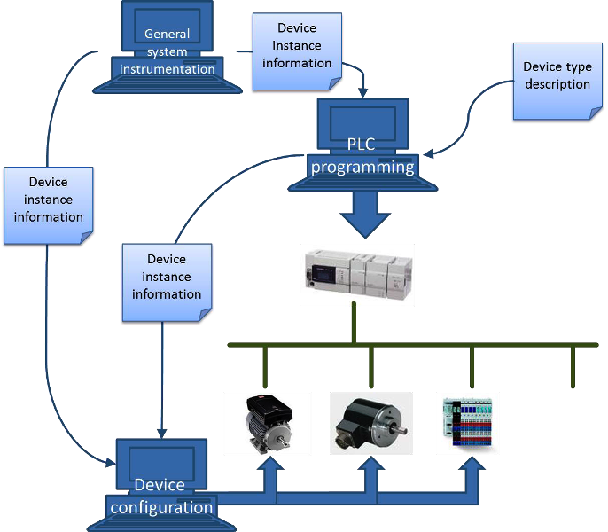

Рисунок 2 – Послідовність виконання варіанта використання UI031

Можливі різні альтернативи, які зазвичай не застосовуються. Нижче наведено послідовності, які є можливими та перебувають у фокусі цього варіанта використання.

Послідовність A:
Крок 1. Проєктування конфігурацій системи зв’язку в сторонньому інструменті
Крок 2. Інтеграція описів пристроїв
Крок 3. Експорт інформації, релевантної для комунікаційних пристроїв
Крок 4. Імпорт інформації, релевантної для комунікаційних пристроїв, до інструмента конфігурування або програмування пристроїв
Крок 5. Використання інформації для параметризації комунікаційного компонента пристрою (адреси тощо) та для структурування комунікаційних пакетів (передавані точки даних)

Послідовність B:
Крок 1. Сторонній інструмент, наприклад інструмент конфігурування пристроїв, надає інформацію, таку як сигнали та обсяг даних, що описує інстанційні дані
Крок 2. Виробник пристрою надає описи пристроїв, які описують типові дані
Крок 3. Інструмент конфігурування шини споживає ці фрагменти даних та описи пристроїв
Крок 4. Конфігуратор шини генерує конфігурацію шини
Крок 5. Імпорт конфігурації шини до інструмента програмування PLC
Крок 6. Використання інформації з периферійних пристроїв усередині програми PLC

Обидві послідовності зазвичай подані на рисунку 3.

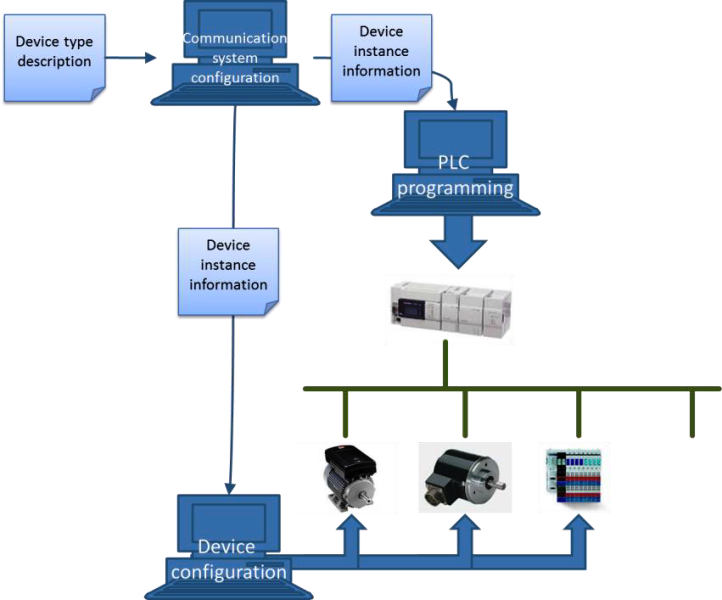

Рисунок 3 – Альтернативна послідовність виконання варіанта використання UI031

Можливими інструментами, що експортують інформацію про систему зв’язку, можуть бути, наприклад, інструменти програмування PLC. Вони охоплюють проєкти програмування PLC з точками даних (змінними), конфігураціями пристроїв та непрямими описами комунікаційних мереж. Окрім цього, джерелами даних можуть бути інструменти інженерії систем зв’язку, а також інструменти інструментування, зокрема ECAD-інструменти.

Приймачами даних обміну можуть бути інструменти конфігурування зв’язку датчиків, програмування HMI, програмування роботів, конфігурування систем OPC або конфігурування зв’язку виконавчих механізмів. Здебільшого вони охоплюють програмні проєкти з точками даних (змінними), конфігураціями пристроїв та непрямими описами комунікаційних мереж. До релевантних інструментів належать FDT-інструменти, інструменти програмування HMI та інструменти програмування роботів.

На основі цього варіанта використання моделювання систем зв’язку на основі AutomationML має охоплювати інформацію про списки IO, зв’язування змінних (I/O) з комунікаційними пакетами даних, а також параметри пристроїв для параметризації комунікаційних пристроїв, такі як адреси (наприклад, IP-адреси), доступ до середовища (наприклад, MAC-адреси), маски підмереж, адреси шлюзів та використовувані комунікаційні об’єкти, зокрема профільну інформацію.

Крім того, моделювання має задовольняти такі нефункціональні вимоги. Список параметрів пристрою повинен бути розширюваним користувачами для охоплення майбутніх технологій. Повинні бути визначені відповідні RoleClassLib та/або SystemUnitClassLib, які забезпечують ідентифікацію семантики об’єктів.

#### 3.1.2 UI032: Безвтратне передавання інформації про систему зв’язку

Окрім конфігурування комунікаційних пристроїв, інформація про систему зв’язку використовується в різних інженерних, моніторингових, сервісних та інших інструментах. Тому цей варіант використання охоплює передавання інформації про конфігурацію та структуру комунікаційної мережі, включно з конфігурацією інфраструктурних пристроїв, конфігурацією кінцевих пристроїв щодо параметрів системи зв’язку, мережевою структурою та проводкою, якістю обслуговування тощо. Ця інформація має надаватися інструментам конфігурування пристроїв, інструментам документування та обслуговування, а також інструментам керування мережею. Вони повинні забезпечувати поєднання фізичної проводки з логічними комунікаційними з’єднаннями для виявлення помилок.

У межах цього варіанта використання задіяні інженери з такими ролями: програміст PLC, програміст HMI, інженер з електротехнічного проєктування, спеціаліст з введення в дію систем зв’язку, спеціаліст з введення в дію PLC, програміст роботів та оператор. Вони виконують такий інженерний процес, який слід розглядати як прикладову послідовність.

Крок 1. Проєктування наборів змінних, що передаються в системі зв’язку, в інструментах програмування PLC та інструментах програмування або конфігурування датчиків і виконавчих механізмів
Крок 2. Експорт цих наборів змінних з інструментів програмування PLC та інструментів програмування або конфігурування датчиків і виконавчих механізмів
Крок 3. Імпорт наборів змінних до інструментів інженерії комунікаційних мереж
Крок 4. Проєктування списків відображення змінних та проєктування фізичної проводки
Крок 5. Експорт проєкту системи зв’язку з інструментів інженерії комунікаційних мереж
Крок 6. Імпорт проєкту системи зв’язку до подальших інженерних або виконавчих інструментів

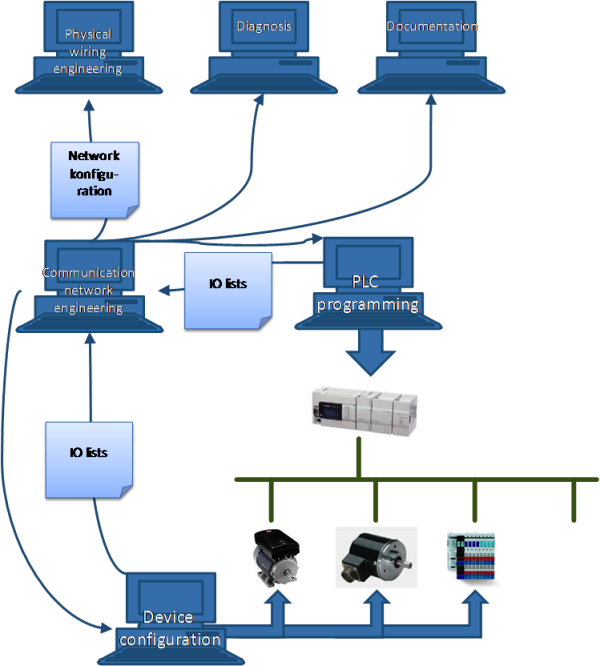

Рисунок 4 – Послідовність виконання варіанта використання UI032

Джерелами інженерних даних, що передаються, можуть бути інструменти програмування PLC, які охоплюють проєкти програмування PLC з точками даних (змінними), конфігураціями пристроїв та непрямими описами комунікаційних мереж; інструменти інженерії систем зв’язку, що охоплюють проєкти систем зв’язку з конфігураціями пристроїв і властивостями комунікаційних з’єднань; інструменти конфігурування зв’язку датчиків; інструменти програмування HMI; інструменти програмування роботів; інструменти конфігурування систем OPC; а також інструменти конфігурування зв’язку виконавчих механізмів, які загалом охоплюють програмні проєкти з точками даних (змінними), конфігураціями пристроїв та непрямими описами комунікаційних мереж.

Приймачами даних обміну можуть бути інструменти моніторингу безпеки систем зв’язку, інструменти конфігурування систем зв’язку, інструменти керування системами зв’язку та інструменти діагностики систем зв’язку.

На основі цього варіанта використання моделювання систем зв’язку на основі AutomationML має охоплювати інформацію про топологію мережі, списки конекторів пристроїв та їхні властивості, фізичні з’єднання між конекторами пристроїв та їхні властивості, логічні зв’язки між прикладними застосуваннями на рівні пристроїв та їхні властивості, відображення логічних зв’язків на фізичні з’єднання, а також прив’язування атрибутів зв’язків та/або з’єднань до зв’язків або з’єднань, зокрема адрес відправника й одержувача, якості обслуговування, використовуваних протоколів тощо.

Крім того, з цього випливають деякі нефункціональні вимоги. Перелік атрибутів зв’язків і з’єднань має бути розширюваним користувачами для охоплення майбутніх технологій. Повинні бути визначені відповідні RoleClassLib та/або SystemUnitClassLib, які забезпечують ідентифікацію семантики об’єктів.

### 3.2 Обмеження області моделювання

У межах наведених вище варіантів використання можуть розглядатися різні комунікаційні технології, стратегії використання систем зв’язку та їх життєві цикли, а також архітектури комунікаційних мереж. Далі цей широкий теоретичний діапазон обмежується найбільш поширеними випадками застосування.

#### 3.2.1 Розглянуті структури взаємодії та життєві цикли

Відповідно до описаних вище варіантів використання моделювання систем зв’язку на основі AutomationML має зосереджуватися на описі циклічного обміну даними на основі фіксованого призначення між комунікаційними партнерами. Ці комунікаційні партнери виконують (більш або менш складні) частини логіки керування прикладних застосувань на різних взаємодіючих керувальних пристроях.

Таким чином, для системи зв’язку релевантні принаймні два різні подання: логічне та фізичне. На високорівневому логічному поданні існують прикладні застосування оброблення даних, які логічно обмінюються прикладними даними (змінними). Для фізичної реалізації прикладних застосувань оброблення даних використовуються керувальні пристрої. Ці пристрої фізично обмінюються даними за допомогою систем зв’язку. В обох поданнях змодельовані об’єкти (частини застосувань, пристрої, з’єднання тощо) мають специфічні властивості, що є релевантними для коректного використання та поведінки системи зв’язку. Такі системи та інформація, що їх описує, входять до області розгляду подальших викладів.

Поза межами моделювання систем зв’язку на основі AutomationML, наприклад, є:

- ациклічні сервісно-орієнтовані та лише тимчасово використовувані комунікаційні структури, які зазвичай притаманні використанню всесвітньої павутини;
- питання, пов’язані з безпекою або захищеністю;
- складна інформація про поведінку та структуру пристроїв, яка зазвичай охоплюється мовами опису пристроїв.

Водночас використання AutomationML для моделювання систем зв’язку з такими властивостями не виключається, але також не є ціллю цього документа.

Описи систем зв’язку можуть охоплювати різні рівні деталізації. Вони можуть варіюватися від дуже абстрактних описів, що лише визначають комунікаційних партнерів та їхні залежності, до детального опису комунікаційних з’єднань та їхніх властивостей, а також пристроїв і частин прикладних застосувань з їхніми властивостями. Усі ці рівні деталізації входять до області призначеного моделювання систем зв’язку.

Системи зв’язку є складними системами, що охоплюють різні технології в межах однієї системи зв’язку. Як приклад можна навести PLC-орієнтовані системи керування. Зазвичай вони поєднують різні польові шини, Ethernet-орієнтований зв’язок, мідну та волоконно-оптичну проводку, бездротовий зв’язок, різні активні елементи інфраструктури тощо. На одному фізичному середовищі можуть працювати різні комунікаційні протоколи. На пристроях виконуються кілька частин прикладних застосувань керування. Таким чином, різні комунікаційні технології є перехресно пов’язаними та взаємозалежними. Ця складність і взаємопов’язаність повинні бути виражені засобами AutomationML і входять до області розгляду подальших описів.

Системи зв’язку розглядаються на різних фазах інженерії виробничої системи, таких як детальне проєктування та введення в дію, і використовуються на різних фазах життєвого циклу виробничої системи, зокрема під час конфігурування пристроїв, нарощування виробництва, нормальної виробничої експлуатації, діагностики та обслуговування. Ці різні фази інженерії та використання виробничих систем, а також їхній вплив на вміст і застосування моделей, повинні бути охоплені моделюванням систем зв’язку на основі AutomationML.

#### 3.2.2 Розглянуті мережеві об’єкти

Далі деталізуються розглянуті мережеві структури та набори інформації, що їх описують.

Кожна комунікаційна мережа розглядається як дворівнева: логічний рівень і фізичний рівень. Якщо співвіднести це подання з часто згадуваною семирівневою моделлю ISO OSI комунікаційних систем, фізичний рівень охоплює рівні 1 і 2 моделі ISO OSI, тоді як логічний рівень охоплює рівні з 3 по 7 моделі ISO OSI, а також прикладні застосування керування, що знаходяться вище рівня 7.

На логічному рівні можна виокремити такі сутності, що підлягають моделюванню. Прикладні застосування керування зазвичай складаються з кількох розподілених частин застосувань, які забезпечують різні функціональні можливості процесу керування та утворюють логічні пристрої. Як приклад, наведений на рисунку 5, можна розглянути головний застосунок керування, що обмінюється інформацією з датчиків і виконавчих механізмів із двома функціями введення-виведення. Загалом ці логічні пристрої (частини прикладних застосунків керування) мають обмінюватися інформацією різних типів, у нашому прикладі різними сигналами датчиків і станами виконавчих механізмів. Це можна розглядати як точки підключення до логічних пристроїв і як кінцеві точки обміну інформацією між логічними пристроями. Сам обмін інформацією здійснюється за допомогою різних логічних зв’язків.

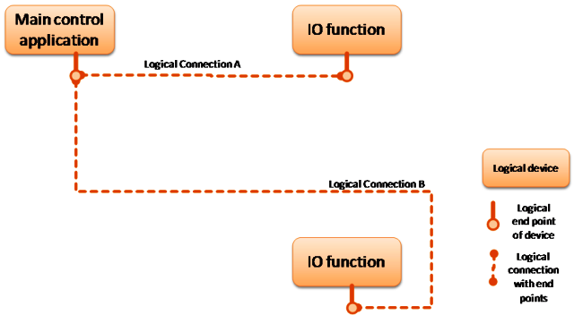

Рисунок 5 – Приклад логічного подання системи зв’язку

Логічна мережа може містити різні об’єкти з різними описовими властивостями. Так, логічні керувальні пристрої можуть мати унікальні ідентифікатори, циклові часи та ресурсну характеристику (це лише кілька прикладів), логічні кінцеві точки можуть мати тип даних, а логічні з’єднання можуть мати вимоги до швидкості передавання. У будь-якому випадку ці описові властивості можна розглядати як атрибути відповідних об’єктів.

На фізичному рівні наявні фізичні пристрої з фізичними інтерфейсами. У прикладі, наведеному на рисунку 6, PLC підключений через активну інфраструктуру до двох пристроїв введення-виведення. Фізичні пристрої мають фізичні кінцеві точки, що представляють мережеві інтерфейси, такі як роз’єми та гнізда, і з’єднані з системою зв’язку за допомогою фізичних з’єднань. Порівняно з логічним поданням, на фізичному рівні додатково присутні фізичні сутності, що представляють інфраструктурні компоненти мережі (наприклад, комутатори тощо).

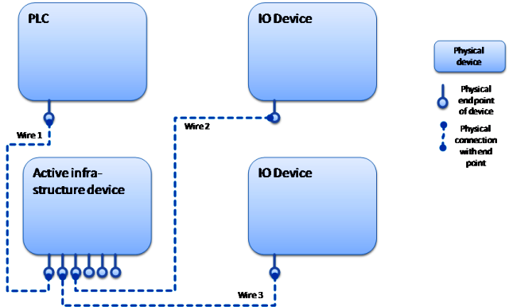

Рисунок 6 – Приклад фізичного подання системи зв’язку

Аналогічно до логічної мережі, об’єкти фізичної мережі можуть мати різні описові властивості. Так, фізичні пристрої можуть мати обчислювальну потужність процесора або ідентифікатори, фізичні кінцеві точки можуть мати адресу або максимальну швидкість передавання даних, а фізичні з’єднання можуть мати допустиму швидкість передавання, тип кабелю або номер документації. У будь-якому разі ці описові властивості знову ж таки можна розглядати як атрибути відповідних об’єктів.

Для отримання повного опису мережі обидва подання мають бути поєднані. Тому логічні пристрої розміщуються на фізичних пристроях. У прикладі, наведеному на рисунку 7, PLC розміщує головний застосунок керування, тоді як пристрої введення-виведення розміщують функції IO. Крім того, здійснюється відображення між фізичними інтерфейсами та логічними інтерфейсами. У такий спосіб кожне логічне з’єднання віртуально відображається на набір фізичних з’єднань, які його реалізують. При цьому не є строго необхідним, щоб існував унікальний ланцюг фізичних з’єднань, що представляє цю реалізацію, як це має місце не в усіх комунікаційних технологіях.

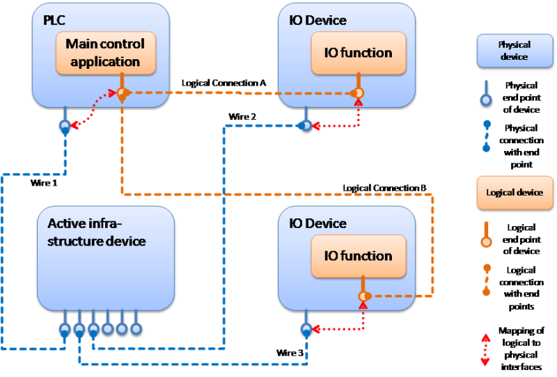

Рисунок 7 – Поєднані подання систем зв’язку

#### 3.2.3 Розглянуті мережеві структури

У промислових системах зв’язку можуть застосовуватися різні мережеві архітектури. З одного боку, можна виділити різні топології проводки. З іншого боку, можливі різні структури інтеграції мереж. Подане тут моделювання систем зв’язку повинно бути придатним для застосування до всіх цих варіантів.

Що стосується топологій проводки, призначене моделювання має охоплювати щонайменше зіркову, лінійну та кільцеву топології, включно з їх комбінаціями. Деякі приклади наведено на рисунках 8, 9 і 10.

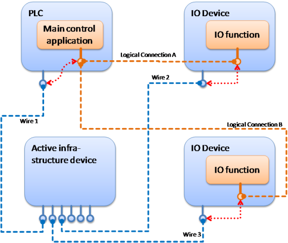

Рисунок 8 – Приклад зіркової топології

На рисунку 8 подано стандартну зіркову топологію, у якій активний інфраструктурний пристрій встановлює з’єднання між різними фізичними пристроями, тоді як логічні з’єднання залишаються двосторонніми з’єднаннями між логічними пристроями.

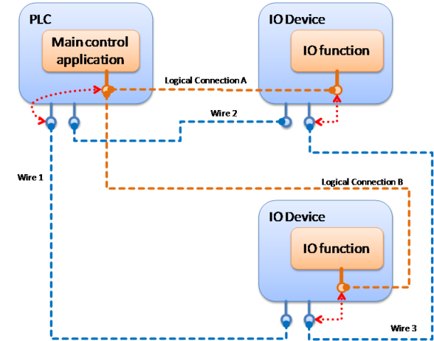

Рисунок 9 – Приклад кільцевої топології

На рисунку 9 подано стандартну кільцеву топологію, у якій кожен фізичний пристрій має два фізичні інтерфейси, що з’єднують пристрої у фізичне кільце. Як і раніше, логічні з’єднання залишаються двосторонніми з’єднаннями між логічними пристроями.

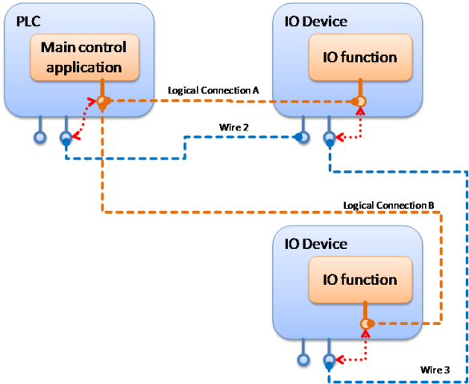

Рисунок 10 – Приклад лінійної топології

На рисунку 10 подано стандартну лінійну топологію. У цьому випадку кожен фізичний пристрій знову має два фізичні інтерфейси, які з’єднують пристрої у фізичну лінію. Таким чином, це відкрита кільцева топологія. Логічні з’єднання залишаються двосторонніми з’єднаннями між логічними пристроями.

Що стосується мережевої інтеграції, моделювання повинно забезпечувати подання простих мереж із безпосереднім з’єднанням компонентів, мереж з активною інфраструктурою, мереж, з’єднаних через шлюзи, а також ієрархічних мереж (тобто мереж, у яких один мережевий компонент містить повноцінну вкладену мережу, наприклад внутрішню шину backplane у модульному контролері). Приклади таких мережевих структур наведено на рисунках 11, 12, 13 і 14.

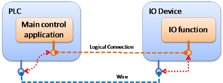

Рисунок 11 – Проста мережа з безпосереднім з’єднанням

На рисунку 11 подано найпростіший варіант мережі, у якому два фізичні пристрої з’єднані безпосередньо, утворюючи логічне з’єднання між відповідними логічними пристроями. Такий варіант можна розглядати як мінімальну мережу, яка має підлягати поданню.

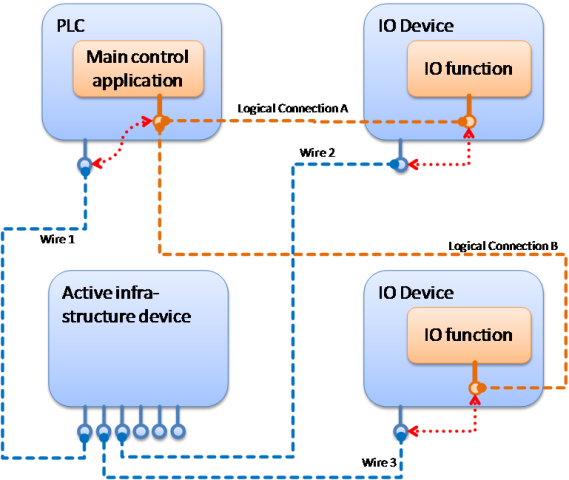

Рисунок 12 – Мережа з активною інфраструктурою

На рисунку 12 подано мережу, що містить активні інфраструктурні пристрої, як це зазвичай має місце в Ethernet-орієнтованих мережах, де для переспрямування комунікації використовуються комутатори, концентратори та маршрутизатори.

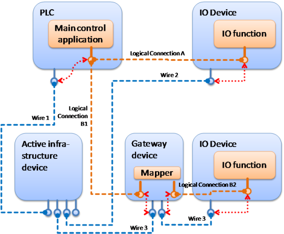

Рисунок 13 – Мережі, з’єднані через шлюзи

На рисунку 13 подано мережу, у якій логічне з’єднання охоплює дві різні мережі з використанням прикладного шлюзу для відображення логічних з’єднань. Показано, що всередині цього шлюзу елементи даних двох відповідних з’єднань відображаються один на одного.

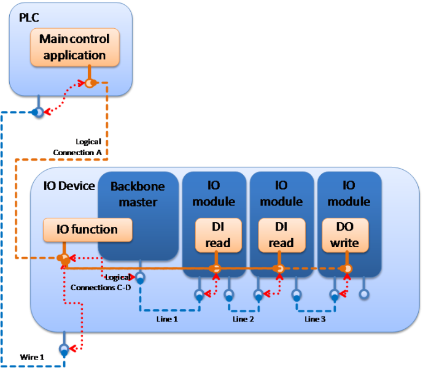

Рисунок 14 – Ієрархічно структуровані мережі

На рисунку 14 подано ієрархічну мережеву структуру, як це зазвичай має місце у випадку системи зв’язку, що містить фізичний пристрій із магістральною (backbone) мережею, яка з’єднує різні внутрішні компоненти фізичного пристрою. Така ситуація виникає, коли в мережі використовуються модульні польові шинні з’єднувачі.

Окрім можливого застосування різних топологій і структур мережевої взаємодії в промислових системах зв’язку, зазвичай до системи зв’язку підключаються різні прикладні застосування, наприклад керування та конфігурування або програмування системи. Мережі, що охоплюють кілька прикладних застосувань, також повинні підлягати моделюванню.

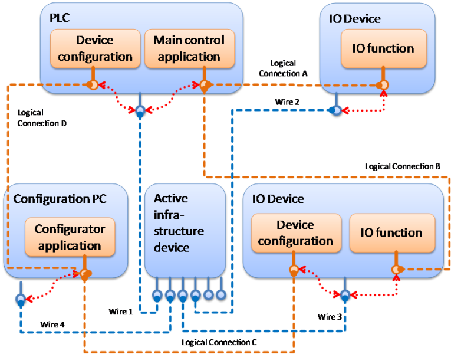

Рисунок 15 – Мережа, що охоплює кілька прикладних застосувань

#### 3.2.4 Розглянутий комунікаційний вміст

У системах зв’язку між частинами прикладних застосувань керування передаються комунікаційні датаграми (відомі як Protocol Data Units, PDU). Отже, вони належать до логічного з’єднання.

Кожна PDU містить керувальну інформацію (сигнали датчиків і виконавчих механізмів, стани, аварійні повідомлення тощо), яка в AutomationML моделюється на основі інтерфейсів типу `PLCopenXMLInterface` (див. AutomationML Whitepaper Part 4 – Logic Description).

Таким чином, кожне логічне з’єднання має містити об’єкти PDU, що обмінюються через це з’єднання. Кожен з об’єктів PDU пов’язується з `PLCopenXMLInterface` або `SignalInterface`, які моделюють передану інформацію.

Ця структура подана на рисунку 16.

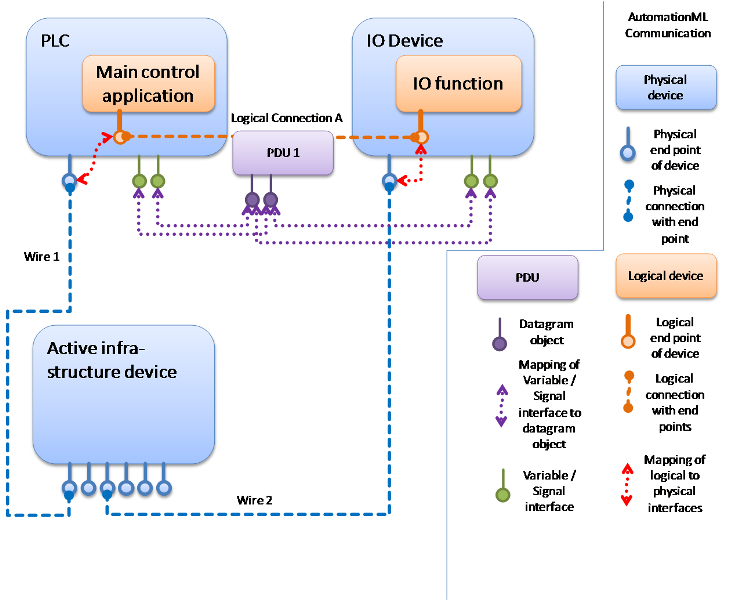

Рисунок 16 – Загальна стратегія моделювання PDU

### 3.3 Похідні вимоги до моделювання

На основі спостережень, наведених у цьому розділі, моделюється така загальна інформація:

1. Інформація логічного рівня
   - a. Логічні пристрої, що представляють частини прикладних застосувань, разом з їх описовими властивостями
   - b. Кінцеві точки логічних з’єднань, приєднані до логічних пристроїв і такі, що представляють інтерфейс прикладної частини, разом з їх описовими властивостями
   - c. Логічні з’єднання, що представляють обмін інформацією між частинами прикладних застосувань, разом з їх описовими властивостями
   - d. Одиниці процесних даних, що моделюють передавані пакети даних
2. Інформація фізичного рівня
   - a. Фізичні пристрої, що представляють фізично взаємодіючі сутності, разом з їх властивостями
   - b. Кінцеві точки фізичних з’єднань, приєднані до фізичних пристроїв і такі, що представляють фізичні інтерфейси пристроїв (роз’єми), разом з їх описовими властивостями
   - c. Фізичні з’єднання, що представляють фізичну проводку або використовувані бездротові канали, разом з їх описовими властивостями
3. Відношення між логічним і фізичним рівнями
   - a. Відображення кінцевих точок для представлення реалізації логічних з’єднань за допомогою фізичних з’єднань
   - b. Відношення між передаваними змінними та застосованою комунікаційною технологією або протоколом, зокрема шляхом відображення змінних на структури комунікаційних пакетів
4. Мережеві системи
   - a. Однозначне віднесення пристроїв і з’єднань до мереж
   - b. Однозначна ієрархічна структуризація мереж
   - c. Залежності між мережами
   - d. Залежності між пристроями, зокрема властивості резервування
   - e. Залежності між з’єднаннями, зокрема властивості резервування

### 3.4 Можливі подальші розвитку

Моделювання систем зв’язку за допомогою AutomationML передусім орієнтоване на наявні прикладні застосування керування, а також на наявні комунікаційні технології. Проте з огляду на ініціативу Industry 4.0 у Німеччині можливі додаткові прикладні сценарії, навіть якщо вони детально не описані в цьому white paper.

Industry 4.0 передбачає проєктування структур взаємодії системних сутностей на вимогу. Зокрема, з’являтимуться виробничі компоненти, реалізовані у вигляді кіберфізичних виробничих систем (CPPS), які взаємодіють між собою, з сутностями керування продуктами та з хмарними сервісами. Такі взаємодії на вимогу потребують відповідного подання сервісів, що надаються CPPS і хмарними сервісами, включно з їх технічними шляхами доступу та семантикою. Такі описи можуть базуватися на описі логічних і фізичних пристроїв, наведеному вище, які можуть автоматично використовуватися для встановлення взаємодії.

Крім того, у контексті Industry 4.0 моделювання повних систем зв’язку може використовуватися для журналювання застосованих з’єднань і збереження таких журналів з метою документування керування виробничими процесами.

У подальшому викладі можливостей моделювання систем зв’язку ці перспективні варіанти застосування загалом враховуються.

## 4 UML-модель

Далі наведено детальніший опис об’єктів і властивостей, пов’язаних із системами зв’язку, а також описової інформації щодо них, яка моделюється за допомогою AutomationML.

### 4.1 Огляд

UML-модель використовує діаграми класів, що показують статичні зв’язки між сутностями. Сутності тут завжди описуються як типи. Реальна реалізація цієї моделі залежить від уподобань інструмента. Наприклад, агрегація в цьому документі демонструє асоціацію або відношення типу «має» (“has a”) між інстанціями класів, і агрегація є більш специфічною, ніж асоціація [1].

Найважливішими в UML-діаграмах класів є визначені кратності. Якщо кратність не визначена, тоді ми не можемо визначити її однозначно.

На рисунку 17 пояснено ключові точки змодельованої комунікаційної структури однієї комунікаційної мережі. Фізичний пристрій є центральним об’єктом подальших описів. Зокрема, змодельовану структуру поділено на логічне та фізичне топологічні подання.

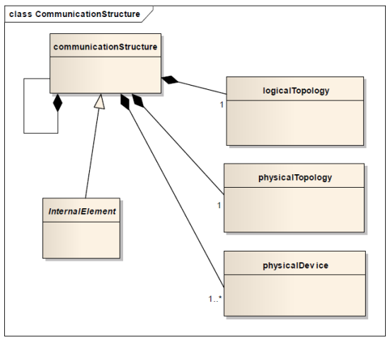

Рисунок 17 – Структура комунікації

Відношення комунікаційної структури до самої себе (рефлексивна асоціація) дозволяє подання вкладених комунікаційних мереж або подання кількох взаємопов’язаних мережевих сегментів.

### 4.2 Логічна топологія

Логічна топологія описує логічне подання комунікаційних партнерів. Вона представляє комунікаційні відношення з точки зору прикладних програм. На рисунку 18 показано три задіяні (абстрактні) елементи та їх взаємозв’язки:

- `logicalTopology`
- `logicalConnection` 
- `logicalEndPoint`

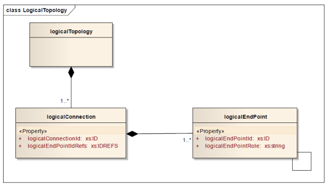

Рисунок 18 – Подання логічної топології

#### 4.2.1 Елемент logicalTopology

Клас `logicalTopology` є точкою входу для моделювання логічної топології мережі автоматизації. Він агрегує всі комунікаційні відношення між логічними кінцевими точками, пов’язаними з пристроями автоматизації.

Реальним похідним варіантом `logicalTopology` може бути подання логічних мереж у межах установки.

#### 4.2.2 Елемент logicalConnection

Сутність `logicalConnection` описує комунікаційне відношення між двома логічними кінцевими точками.

Властивість `logicalConnectionId` є GUID у межах установки та ідентифікує `logicalConnection`.

Властивість `logicalEndPointIdRefs` є масивом, що містить усі GUID логічних кінцевих точок (`logicalEndPoint`), пов’язаних із даним `logicalConnection`. Таким чином можуть бути змодельовані відношення типу `m:n` у межах комунікаційного зв’язку.

Реальним похідним варіантом `logicalConnection` може бути з’єднання в межах відношення типу peer-to-peer.

#### 4.2.3 Елемент logicalEndPoint

Сутність `logicalEndPoint` представляє комунікаційного партнера в такому відношенні.

Властивість `logicalEndPointId` є GUID у межах системи автоматизації та ідентифікує `logicalEndPoint`.

Властивість `logicalEndPointRole` має тип даних `string` і може використовуватися для задання логічної ролі `logicalEndPointId` у комунікаційному відношенні. Можливими значеннями можуть бути пари типу `source – destination`, `source – sink`, `publisher – subscriber` або `master – slave` тощо.

Похідними прикладами такої кінцевої точки комунікації можуть бути IP-порт або peer.

### 4.3 Фізична топологія

Фізична топологія описує фізичне подання комунікаційних партнерів. Вона представляє комунікаційні відношення з точки зору проводки або налаштувань каналів. На рисунку 19 показано три задіяні (абстрактні) елементи та їх взаємозв’язки:

- `physicalTopology` 
- `physicalConnection`
- `physicalEndPoint`

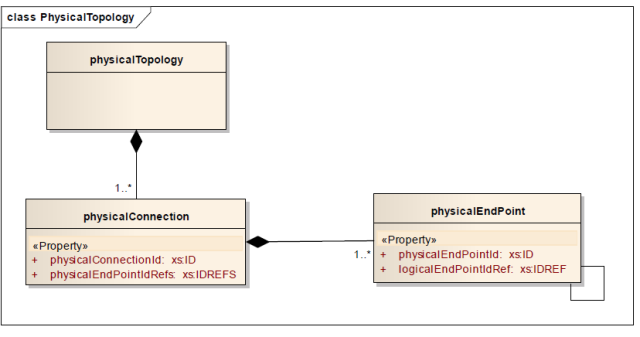

Рисунок 19 – Подання фізичної топології

#### 4.3.1 Елемент physicalTopology

Клас `physicalTopology` є точкою входу для моделювання фізичної топології мережі автоматизації. Він агрегує всі комунікаційні відношення між фізичними кінцевими точками, пов’язаними з пристроями автоматизації.

Реальним похідним варіантом `physicalTopology` може бути подання фізичних мереж у межах установки.

#### 4.3.2 Елемент physicalConnection

Сутність `physicalConnection` описує комунікаційне відношення між двома фізичними кінцевими точками.

Властивість `physicalConnectionId` є GUID у межах установки та ідентифікує `physicalConnection`.

Властивість `physicalEndPointIdRefs` є масивом, що містить усі GUID фізичних кінцевих точок (`physicalEndPoint`), пов’язаних із даним `physicalConnection`. Таким чином можуть бути змодельовані з’єднання типу m:n у комунікаційній мережі.

Реальним похідним варіантом `physicalConnection` може бути кабель, що з’єднує роз’єми у відношенні типу peer-to-peer.

#### 4.3.3 Елемент physicalEndPoint

Сутність `physicalEndPoint` представляє реальну кінцеву точку зв’язку в такому відношенні.

Властивість `physicalEndPointId` є GUID у межах системи автоматизації та ідентифікує `physicalEndPoint`.

Властивість `logicalEndPointIdRef` є GUID логічної кінцевої точки (`logicalEndPoint`), пов’язаної з даним `physicalEndPoint`.

Похідним прикладом такої кінцевої точки комунікації може бути Ethernet-порт.

### 4.4 Пристрій

Модель пристрою є найскладнішою в UML-моделі. На рисунку 20 показано її першу частину, а на рисунку 21 – другу.

#### 4.4.1 Елемент physicalDevice

Центральним компонентом є `physicalDevice`. Атрибути дозволяють однозначно ідентифікувати його інстанції та підінстанції. Крім того, існує агрегаційне відношення до самого себе. За допомогою цього відношення можуть моделюватися модульні пристрої. Агрегація елемента `informationItem` узагальнює всі важливі описи продукту, ідентифікатори, документацію тощо в межах центрального об’єкта, який також може використовуватися інстанціями `logicalDevice`. `physicalDevice` або його підмодулі агрегують `logicalDevice`. Крім того, фізичні кінцеві точки, наприклад порти, призначаються `physicalDevice` за допомогою `physicalEndPointList`. Той самий шаблон використовується для фізичних каналів. У випадку, якщо physicalDevice є PLC, він може містити кілька `deviceResource`.

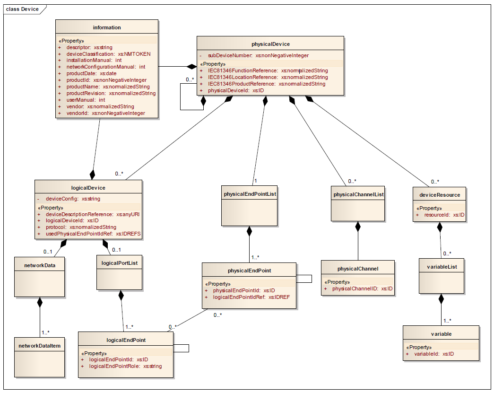

Рисунок 20 – Частина 1 моделі пристрою

Властивість `physicalDeviceId` є GUID у межах системи автоматизації та ідентифікує `physicalDevice`. Якщо це підмодуль у складі пристрою, властивість `subDeviceNumber` визначає специфічний для виробника порядок розташування підмодуля в пристрої.

Властивість `IEC81346FunctionReference` описує функціональний аспект `physicalDevice` відповідно до правил IEC 81346.

Властивість `IEC81346LocationReference` описує розташування `physicalDevice` в установці відповідно до правил IEC 81346.

Властивість `IEC81346ProductReference` описує інформацію про продукт `physicalDevice` відповідно до правил IEC 81346.

#### 4.4.2 Елемент Information

Елемент `Information` є заповнювачем для будь-якого типу інформації, пов’язаної з типом пристрою. Він використовується для детального опису типових даних інстанції пристрою. Запропоновані властивості можуть розширюватися за потреби.

#### 4.4.3 Елемент variable

Елемент `variable` представляє змінну, наприклад змінну програми PLC або іншого типу контролера. Тип даних тут явно не моделюється. Змінні перелічуються за допомогою `variableList`.

Властивість `variableId` є GUID у межах системи автоматизації та ідентифікує змінну.

#### 4.4.4 Елемент physicalChannel

Елемент `physicalChannel` представляє точку підключення до сигналу, наприклад аналоговий або дискретний вхід чи вихід. Тип даних тут явно не моделюється. `physicalChannel` перелічується за допомогою `physicalChannelList`.

Властивість `physicalChannelId` є GUID у межах системи автоматизації та ідентифікує канал або сигнал.

#### 4.4.5 Елемент logicalDevice

Елемент `logicalDevice` представляє нефізичні аспекти реального пристрою. Часто більш складні польові пристрої містять кілька `logicalDevice` з власною адресною інформацією та специфічними завданнями.

`logicalDevice` агрегує `networkData`, що використовується для задач конфігурування. Також логічні кінцеві точки агрегуються за допомогою `logicalEndPointList`. Окрім подання логічної топології, описаної в розділі 4.2, `logicalEndPoint` також агрегує одиниці протокольних даних, що обмінюються через логічне з’єднання.

Властивість `deviceConfig` описує інформацію, яка використовується під час запуску `logicalDevice`. Залежно від системи зв’язку, вона може обмінюватися під час виконання між різними комунікаційними партнерами.

Властивість `deviceDescriptionReference` є посиланням на зовнішній файл опису пристрою.

Властивість `logicalDeviceId` є GUID у межах системи автоматизації та ідентифікує `logicalDevice`.

Властивість `protocol` описує використовуваний комунікаційний протокол, наприклад `PROFINET` або `PROFIBUS` тощо.

Властивість `usedPhysicalEndPointIdRef` представляє список GUID, пов’язаних із `physicalEndPoint`. Це означає, що відповідні кінцеві точки використовуються даним `logicalDevice`.

#### 4.4.6 Елемент pduList

Елемент `pduList` представляє допустимі `Protocol Data Unit`, що обмінюються через `logicalEndPoint`.

#### 4.4.7 Елемент pdu

Елемент `pdu` представляє одну конкретну `Protocol Data Unit`, яка передається за допомогою `logicalConnection`. Він агрегує `protocolData` та `payload`. `payload` може бути спеціалізований як `processDataItemList` або `parameterItemList`.

#### 4.4.8 Елемент protocolData

Елемент `protocolData` може використовуватися для опису протокольного накладного навантаження, яке зазвичай не моделюється за допомогою `processDataItem` або `parameterItem`. Для реальних комунікаційних протоколів можуть бути визначені спеціалізації цих елементів.

#### 4.4.9 Елемент payload

Елемент `payload` представляє `processDataItem` та `parameterItem` як узагальнений абстрактний елемент. Необов’язкова властивість `address` може використовуватися з міркувань адресації або ідентифікації `dataItem`.

#### 4.4.10 Елемент processDataItemList

Цей елемент є шаблоном для переліку всіх допустимих `processDataItem`.

#### 4.4.11 Елемент parameterItemList

Цей елемент є шаблоном для переліку всіх допустимих `parameterItem`. Крім того, `pdu` цього типу має специфічну для комунікаційного протоколу адресу.

#### 4.4.12 Елемент dataItem

Елемент `dataItem` представляє об’єкт даних, що передається через `logicalConnection`.

Властивість `octetOffset` визначає байтове зміщення об’єкта даних у корисному навантаженні PDU. Відлік починається з першого байта корисного навантаження з індексом `0` для першого байта, що передається або приймається.

Властивість `bitOffset` визначає бітове зміщення об’єкта даних у межах адресованого байта корисного навантаження PDU.

Властивості `octetOffset` і `bitOffset` можуть використовуватися альтернативно. Якщо використовуються обидві властивості, їх необхідно додати для обчислення бітової позиції.

Властивість `numberOfBits` визначає довжину об’єкта даних у бітах.

#### 4.4.13 Елемент processDataItem

Елемент `processDataItem` представляє об’єкт процесних даних, що передається через `logicalConnection`. Такі об’єкти даних часто передаються за допомогою циклічних сервісних примітивів системи зв’язку.

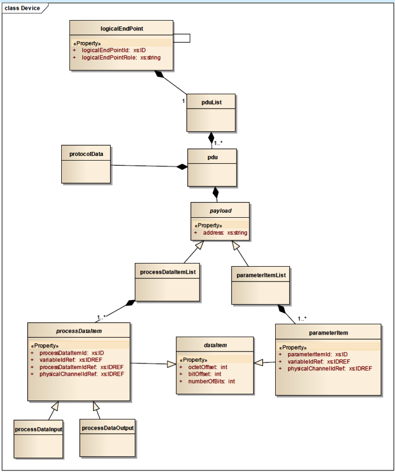

Рисунок 21 – Частина 2 моделі пристрою

Властивість `processDataItemId` є GUID у межах системи автоматизації та ідентифікує `processDataItem`.

Властивість `variableIdRef` є посиланням на `processDataItem` у образі процесних даних, пов’язаному зі змінною програми PLC або програми контролера. Це посилання встановлюється, якщо `physicalDevice` є PLC або контролером.

Властивість `processDataItemIdRef` є посиланням на `processDataItem` у образі процесних даних, пов’язаному зі змінною програми пристрою. Це посилання встановлюється, якщо `physicalDevice` не є PLC або не є контролером.

Властивість `physicalChannelIdRef` є посиланням `processDataItem` на `physicalChannel` пристрою.

#### 4.4.14 Елемент processDataInput

Елемент `processDataInput` є спеціалізацією `processDataItem` і представляє потік процесних даних як вхідні дані від керованого процесу.

#### 4.4.15 Елемент processDataOutput

Елемент `processDataOutput` є спеціалізацією `processDataItem` і представляє потік процесних даних як вихідні дані до керованого процесу.

#### 4.4.16 Елемент parameterItem

Елемент `parameterItem` представляє параметричний об’єкт, що передається через `logicalConnection`. Такі об’єкти даних часто передаються за допомогою ациклічних сервісних примітивів системи зв’язку.

Властивість `parameterItemId` є GUID у межах системи автоматизації та ідентифікує `parameterItem`.

Властивість `variableItemIdRef` є посиланням на змінну програми PLC. Це посилання встановлюється, якщо `physicalDevice` є PLC або контролером.

Властивість `physicalChannelIdRef` є посиланням `parameterItem` на `physicalChannel` пристрою.

## 5 Подання в AutomationML

### 5.1 Огляд відображення

Метод моделювання систем зв’язку в AutomationML базується на використанні спеціалізованих  класів Ролей та класів Інтерфейсів , а також на спеціальному прикладному процесі. Цей метод враховує розрізнення між прикладними мережами та фізичними мережами, а також їх взаємозв’язок, як це описано в розділах 3 і 4.

#### 5.1.1 Загальні правила відображення

Для подання різних сутностей, наведених у розділах 3 і 4, застосовуються такі правила відображення. При цьому розрізняється, яким чином представлено семантику об’єкта та як моделюється пов’язана з ним сутність.

Таблиця 2 – Правила відображення

| Information entity of UML model | Semantik modelling                             | Entity modelling       |
| ------------------------------- | ---------------------------------------------- | ---------------------- |
| logicalTopology                 | RoleClass LogicalNetwork                       | InternalElement        |
| logicalConnection               | RoleClass LogicalConnection                    | InternalElement        |
| logicalEndPoint                 | InterfaceClass LogicalEndPoint                 | Interface              |
| physicalTopology                | RoleClass PhysicalNetwork                      | InternalElement        |
| physicalConnection              | RoleClass PhysicalConnection                   | InternalElement        |
| physicalEndPoint                | InterfaceClass PhysicalEndPoint                | Interface              |
| physicalDevice                  | RoleClass PhysicalDevice                       | InternalElement        |
| variable                        | InterfaceClass VariableInterface               | Interface              |
| physicalChannel                 | InterfaceClass SignalInterface                 | Interface              |
| logicalDevice                   | RoleClass LogicalDevice                        | InternalElement        |
| pduList                         | Implicitly modelled by hosting InternalElement |                        |
| pdu                             | RoleClass CommunicationPackage                 | InternalElement        |
| protocolData                    | Attribute or InterfaceClass DatagrammObject    | Attribute or Interface |
| payload                         | InterfaceClass DatagrammObject                 | Interface              |
| processDataItemList             | Implicitly modelled by hosting InternalElement |                        |
| parameterItemList               | Implicitly modelled by hosting InternalElement |                        |
| DataItem                        | InterfaceClass DatagrammObject                 | Interface              |
| processDataItem                 | InterfaceClass DatagrammObject                 | Interface              |
| parameterItem                   | InterfaceClass DatagrammObject                 | Interface              |

#### 5.1.2 Основи

Основою методу моделювання є визначення бібліотеки класів ролей AutomationML та бібліотеки класів інтерфейсів AutomationML для моделювання систем зв’язку, а також похідне визначення відповідних класів ролей і класів інтерфейсів для спеціальних прикладних випадків на їх основі відповідно до правил застосування класів ролей і класів інтерфейсів, визначених у частині 1 специфікації AutomationML [4].

Бібліотека класів ролей AutomationML для систем зв’язку міститиме ролі, призначені для ідентифікації внутрішніх елементів як фізичних пристроїв, фізичних з’єднань і фізичних мереж, а також внутрішніх елементів як логічних пристроїв, логічних з’єднань і логічних мереж.

Бібліотека класів інтерфейсів AutomationML міститиме класи інтерфейсів для фізичних кінцевих точок і логічних кінцевих точок.

Обидві бібліотеки — бібліотека класів ролей AutomationML і бібліотека класів інтерфейсів AutomationML — подано на рисунку 22.

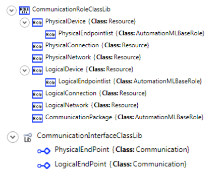

Рисунок 22 – Бібліотека класів ролей систем зв’язку та бібліотека класів інтерфейсів систем зв’язку

На основі цих базових ролей і класів інтерфейсів можуть бути створені спеціалізовані класи, що ідентифікують пристрої та з’єднання, пов’язані зі спеціальними прикладними застосуваннями та комунікаційними технологіями. Таким чином будуть розроблятися бібліотеки класів ролей і бібліотеки класів інтерфейсів спеціального призначення. Приклад наведено на рисунку 23.

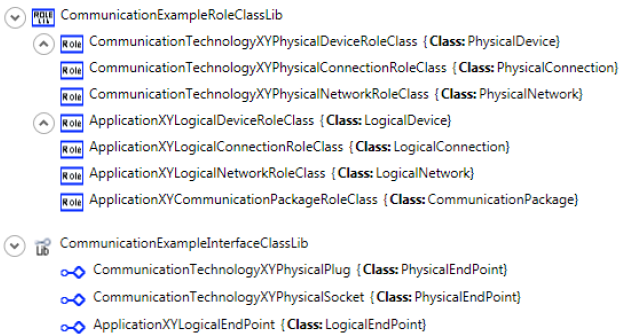

Рисунок 23 – Похідні бібліотеки класів ролей і бібліотеки класів інтерфейсів для спеціального прикладу

#### 5.1.3 Прикладний процес

Визначені бібліотеки класів ролей і класів інтерфейсів, пов’язані з прикладним випадком, далі застосовуються для визначення типово використовуваних фізичних пристроїв і з’єднань, а також логічних пристроїв і з’єднань шляхом визначення відповідних `<SystemUnitClass>` у пов’язаних `<SystemUnitClassLib>`. З метою однозначної ідентифікації семантики різних визначених класів системних одиниць використовуються та на них посилаються визначені класи ролей. У прикладному сценарії визначено чотири бібліотеки класів системних одиниць: для фізичних пристроїв, логічних пристроїв, фізичних з’єднань і логічних з’єднань (див. рисунок 24).

Кожен фізичний пристрій оснащується такою кількістю об’єктів фізичних кінцевих точок, яка відповідає кількості фізичних портів, що доступні в пристрої; вони інтегруються в `Endpointlist` у вигляді `<InternalElement>`. Кожен логічний пристрій оснащується такою кількістю об’єктів логічних кінцевих точок, яка відповідає кількості логічних точок доступу прикладних застосувань. Вони також інтегруються в `Endpointlist` `<InternalElement>`.

Кожен об’єкт фізичного з’єднання оснащується такою кількістю об’єктів фізичних кінцевих точок, яку з’єднання може поєднувати на фізичних пристроях. Зазвичай у випадку фізичної проводки це два об’єкти кінцевих точок. Кожен об’єкт логічного з’єднання оснащується такою кількістю об’єктів логічних кінцевих точок, яку з’єднання може поєднувати на логічних пристроях. У випадку комунікації типу `master–slave` це два об’єкти кінцевих точок, у випадку мультикаст-комунікації їх може бути більше двох.

Для подання специфічних властивостей різних класів системних одиниць слід застосовувати відповідні атрибути.

На основі розроблених бібліотек класів системних одиниць тепер може бути змодельована потрібна система зв’язку. Для цього всі необхідні фізичні та логічні пристрої інстанціюються як `<InternalElement>` у відповідній `<InstanceHierarchy>`. Особливо важливо, щоб ієрархічна структура змодельованої системи була відображена та збережена. Це є критично важливим для інтеграції логічних пристроїв у фізичні пристрої, як це показано на рисунку 25 для логічного пристрою `IODevice1` у складі фізичного пристрою `AXLBKPN`.

Після визначення всіх пристроїв необхідно заповнити відповідні атрибути пристроїв і задати їх значення.

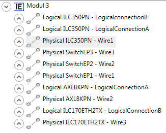

Рисунок 24 – Приклади SystemUnitClassLib для моделювання систем зв’язку

Після завершення опису пристроїв вони можуть бути з’єднані за допомогою з’єднань. Для цього в `<InstanceHierarchy>` мережі інстанціюються два `<InternalElement>`, що містять ролі `<PhysicalNetwork>` та `<LogicalNetwork>`. Вони виконують роль контейнерів для всіх об’єктів фізичних і логічних з’єднань.

У межах внутрішнього елемента з роллю `<PhysicalNetwork>`  для кожного  фізичного з’єднання інстанціюється один `<InternalElement>` з роллю фізичного з’єднання з відповідної бібліотеки класів системних одиниць. Він доповнюється відповідними атрибутами та їх значеннями. Аналогічно, у межах внутрішнього елемента з роллю `<LogicalNetwork>` для кожного логічного з’єднання інстанціюється один `<InternalElement>` з роллю логічного з’єднання з відповідної бібліотеки класів системних одиниць. Він також доповнюється відповідними атрибутами та їх значеннями.

Після інстанціювання всіх необхідних пристроїв і з’єднань вони з’єднуються із застосуванням `<InternalLink>`. Для цього для кожного логічного пристрою та кожного логічного з’єднання, які взаємопов’язані, відповідні логічні кінцеві точки пов’язуються між собою за допомогою об’єкта `internal link`. Аналогічно, для кожного фізичного пристрою та кожного фізичного з’єднання, які взаємопов’язані, відповідні фізичні кінцеві точки пов’язуються між собою за допомогою об’єкта `internal link`. Для відображення логічних кінцевих точок на фізичні кінцеві точки, що реалізують відповідні з’єднання, також використовуються об’єкти `internal link`, які з’єднують фізичні кінцеві точки з логічними кінцевими точками.

Для прикладу отриману структуру наведено на рисунку 25.

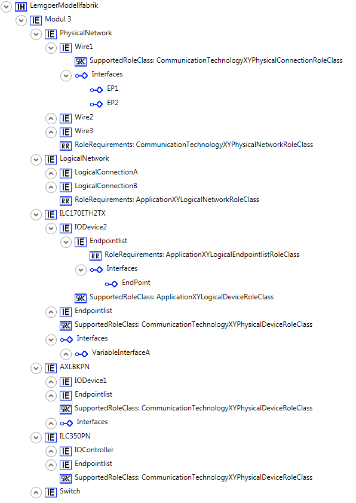

Рисунок 25 – Приклад фінальної мережевої моделі

Слід зауважити, що залежно від прикладного випадку окремі етапи процесу моделювання, описані вище, можуть бути пропущені. Наприклад, у разі моделювання лише фізичних мереж визначення класів ролей логічної мережі, класів інтерфейсів і класів системних одиниць може не виконуватися. Крім того, можливе послідовне моделювання системи, коли спочатку створюється або фізична, або логічна мережа, а інша додається пізніше.

### 5.2 Базова бібліотека класів ролей систем зв’язку

#### 5.2.1 Загальні положення

У цьому підрозділі визначено базову бібліотеку основних стандартних класів ролей, необхідних для моделювання базових концепцій систем зв’язку (рисунки 26–28). Усі ролі є технологічно незалежними, але слугують основою для бібліотек, залежних від конкретних технологій. Детальний опис кожного класу ролей наведено в пунктах 5.2.2–5.2.9.

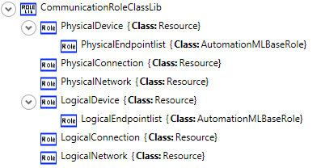

Рисунок 26 – Базова бібліотека класів ролей систем зв’язку


Рисунок 27 – CommunicationRoleClassLib

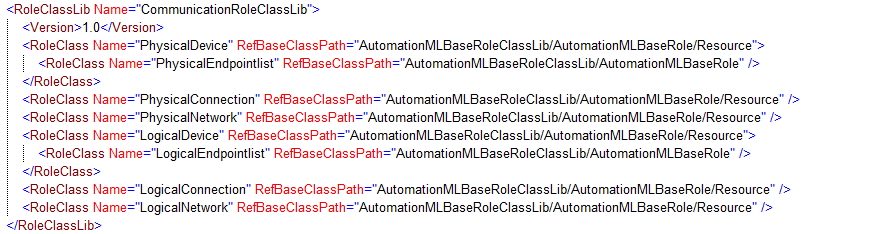

Рисунок 28 – XML-текст бібліотеки класів ролей систем зв’язку

#### 5.2.2 Клас ролі PhysicalDevice

Таблиця 3 – Клас ролі `PhysicalDevice`

| Поле              | Зміст                                                        |
| ----------------- | ------------------------------------------------------------ |
| Назва класу       | PhysicalDevice                                               |
| Опис              | Клас ролі «PhysicalDevice» є типом ролі для об’єктів, що представляють фізичні пристрої, які є частиною системи зв’язку. Усі об’єкти, що описують фізичні пристрої в системі зв’язку, повинні прямо або опосередковано посилатися на цю роль. Прикладами фізичних пристроїв є плати IO, PLC або з’єднувач Profibus. |
| Батьківський клас | AutomationMLBaseRoleClassLib/AutomationMLBaseRole/Resource   |
| Атрибути          | Немає                                                        |

#### 5.2.3 Клас ролі PhysicalEndpointlist

Таблиця 4 – Клас ролі `PhysicalEndpointlist`

| Поле              | Зміст                                                        |
| ----------------- | ------------------------------------------------------------ |
| Назва класу       | PhysicalEndpointlist                                         |
| Опис              | Клас ролі «PhysicalEndpointlist» моделює ієрархічний елемент, що збирає фізичні інтерфейси фізичного пристрою. Оскільки фізичний пристрій може містити один або кілька фізичних інтерфейсів зв’язку (наприклад, фізичні роз’єми), список фізичних портів повинен бути дочірнім елементом фізичного пристрою, а всі фізичні інтерфейси зв’язку повинні бути дочірніми елементами об’єкта списку портів. Це дозволяє моделювати фізичні пристрої з кількома комунікаційними інтерфейсами, наприклад роз’ємами Profibus і Profinet. |
| Батьківський клас | AutomationMLBaseRoleClassLib/AutomationMLBaseRole            |
| Атрибути          | Немає                                                        |

#### 5.2.4 Клас ролі PhysicalConnection

Таблиця 5 – Клас ролі `PhysicalConnection`

| Поле              | Зміст                                                        |
| ----------------- | ------------------------------------------------------------ |
| Назва класу       | PhysicalConnection                                           |
| Опис              | Клас ролі «PhysicalConnection» є абстрактним типом ролі, що описує фізичне з’єднання між фізичними інтерфейсами фізичних пристроїв, наприклад кабель або бездротовий канал зв’язку. |
| Батьківський клас | AutomationMLBaseRoleClassLib/AutomationMLBaseRole/Resource   |
| Атрибути          | Немає                                                        |

------

#### 5.2.5 Клас ролі PhysicalNetwork

Таблиця 6 – Клас ролі `PhysicalNetwork`

| Поле              | Зміст                                                        |
| ----------------- | ------------------------------------------------------------ |
| Назва класу       | PhysicalNetwork                                              |
| Опис              | Клас ролі «PhysicalNetwork» є типом ролі, що описує мережу фізичних з’єднань у системі зв’язку, наприклад перелік кабелів та їх інтерфейсів. |
| Батьківський клас | AutomationMLBaseRoleClassLib/AutomationMLBaseRole/Resource   |
| Атрибути          | Немає                                                        |

#### 5.2.6 Клас ролі LogicalDevice

Таблиця 7 – Клас ролі `LogicalDevice`

| Поле              | Зміст                                                        |
| ----------------- | ------------------------------------------------------------ |
| Назва класу       | LogicalDevice                                                |
| Опис              | Клас ролі «LogicalDevice» є типом ролі для об’єктів, що представляють логічні пристрої. Один фізичний пристрій може містити кілька логічних пристроїв, які підключені до наявних фізичних інтерфейсів фізичного пристрою. |
| Батьківський клас | AutomationMLBaseRoleClassLib/AutomationMLBaseRole/Resource   |
| Атрибути          | Немає                                                        |

#### 5.2.7 Клас ролі LogicalEndpointlist

Таблиця 8 – Клас ролі `LogicalEndpointlist`

| Поле              | Зміст                                                        |
| ----------------- | ------------------------------------------------------------ |
| Назва класу       | LogicalEndpointlist                                          |
| Опис              | Клас ролі «LogicalEndpointlist» моделює ієрархічний елемент, що збирає логічні інтерфейси логічного пристрою. Оскільки логічний пристрій може містити один або кілька логічних інтерфейсів зв’язку, список логічних портів повинен бути дочірнім елементом логічного пристрою, а всі логічні інтерфейси зв’язку повинні бути дочірніми елементами об’єкта списку портів. Це дозволяє моделювати логічні пристрої з кількома комунікаційними інтерфейсами. |
| Батьківський клас | AutomationMLBaseRoleClassLib/AutomationMLBaseRole            |
| Атрибути          | Немає                                                        |

#### 5.2.8 Клас ролі LogicalConnection

Таблиця 9 – Клас ролі `LogicalConnection`

| Поле              | Зміст                                                        |
| ----------------- | ------------------------------------------------------------ |
| Назва класу       | LogicalConnection                                            |
| Опис              | Клас ролі «LogicalConnection» є абстрактним типом ролі, що описує логічне з’єднання між логічними інтерфейсами логічних пристроїв. |
| Батьківський клас | AutomationMLBaseRoleClassLib/AutomationMLBaseRole/Resource   |
| Атрибути          | Немає                                                        |

#### 5.2.9 Клас ролі LogicalNetwork

Таблиця 10 – Клас ролі `LogicalNetwork`

| Поле              | Зміст                                                        |
| ----------------- | ------------------------------------------------------------ |
| Назва класу       | LogicalNetwork                                               |
| Опис              | Клас ролі «LogicalNetwork» є типом ролі, що описує мережу логічних з’єднань у системі зв’язку. |
| Батьківський клас | AutomationMLBaseRoleClassLib/AutomationMLBaseRole/Resource   |
| Атрибути          | Немає                                                        |

### 5.3 Базова бібліотека класів інтерфейсів систем зв’язку

#### 5.3.1 Загальні положення

У цьому підрозділі визначено базову бібліотеку основних стандартних класів інтерфейсів, необхідних для моделювання базових концепцій систем зв’язку (рисунки 29–31). Усі інтерфейси є технологічно незалежними, але слугують основою для бібліотек, залежних від конкретних технологій. Детальний опис кожного класу інтерфейсів наведено в пунктах 5.3.2 і 5.3.3.

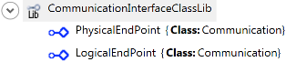

Рисунок 29 – Базова бібліотека класів інтерфейсів систем зв’язку

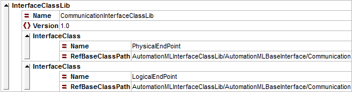

Рисунок 30 – `CommunicationInterfaceClassLib`

```xml
<InterfaceClassLib Name="CommunicationInterfaceClassLib">
<Version>1.0</Version>
<InterfaceClass Name="PhysicalEndPoint"
RefBaseClassPath="AutomationMLInterfaceClassLib/AutomationMLBaseInterface/Communication"/>
<InterfaceClass Name="LogicalEndPoint"
RefBaseClassPath="AutomationMLInterfaceClassLib/AutomationMLBaseInterface/Communication"/>
</InterfaceClassLib>
```

Рисунок 31 – XML-текст бібліотеки класів інтерфейсів систем зв’язку

#### 5.3.2 Клас інтерфейсу PhysicalEndPoint

Таблиця 11 – Клас інтерфейсу `PhysicalEndPoint`

| Поле              | Зміст                                                        |
| ----------------- | ------------------------------------------------------------ |
| Назва класу       | PhysicalEndPoint                                             |
| Опис              | Клас інтерфейсу «PhysicalEndPoint» є типом інтерфейсу, що використовується для моделювання фізичних кінцевих точок фізичного об’єкта, наприклад фізичних роз’ємів. Інстанції цього класу повинні бути піделементами Endpointlist фізичних пристроїв (physicalDevice). |
| Батьківський клас | AutomationMLInterfaceClassLib/AutomationMLBaseInterface/Communication |
| Атрибути          | Немає                                                        |

#### 5.3.3 Клас інтерфейсу LogicalEndPoint

Таблиця 12 – Клас інтерфейсу `LogicalEndPoint`

| Поле              | Зміст                                                        |
| ----------------- | ------------------------------------------------------------ |
| Назва класу       | LogicalEndPoint                                              |
| Опис              | Клас інтерфейсу «LogicalEndPoint» є типом інтерфейсу, що використовується для моделювання логічних кінцевих точок. Інстанції цього класу повинні бути піделементами Endpointlist логічних пристроїв (logicalDevice). |
| Батьківський клас | AutomationMLInterfaceClassLib/AutomationMLBaseInterface/Communication |
| Атрибути          | Немає                                                        |

### 5.4 Кроки моделювання технологічно-специфічних бібліотек

#### 5.4.1 Загальні положення

Описані базові класи ролей і класи інтерфейсів є незалежними від конкретних технологій. Для моделювання систем зв’язку на основі конкретних технологій, таких як Profinet, EthernetIP, Interbus або Sercos, необхідно створювати відповідні технологічно-специфічні класи. Цей розділ присвячено визначенню технологічно-специфічних бібліотек у три кроки. Такий покроковий підхід призначений для поступового розвитку моделі системи зв’язку. Логічні та фізичні мережі не обов’язково розробляти одночасно. Розроблення відповідних класів пояснюється на прикладі абстрактної технології `CommunicationTechnologyXY` та прикладного застосування `ApplicationXY`. Бібліотеки для конкретних технологій виходять за межі цього white paper.

#### 5.4.2 Крок 1: Розроблення технологічно-специфічних класів ролей

На першому кроці має бути створена технологічно-специфічна бібліотека класів ролей, у якій кожен спеціалізований клас ролі наслідується від відповідного базового класу. У наведеному прикладі результуюча бібліотека має назву `CommunicationExampleRoleClassLib` (див. рисунок 32).

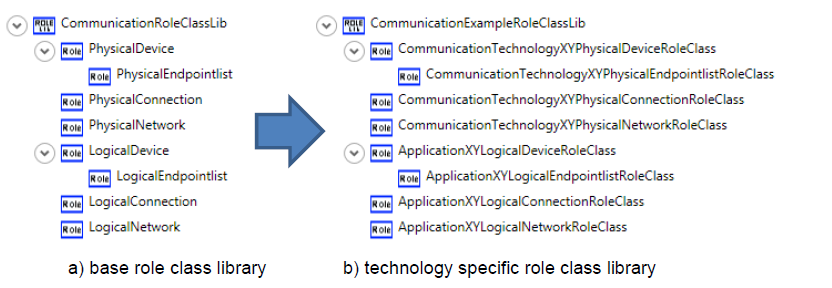

Рисунок 32 – Наслідування технологічно-специфічної бібліотеки класів ролей від базової бібліотеки класів ролей

На практиці для кожної конкретної комунікаційної технології, такої як Profinet, EthernetIP, Interbus або Sercos, має бути розроблена окрема бібліотека на основі ролей, пов’язаних із фізичною мережею. Крім того, для кожного конкретного прикладного застосування, такого як сервіс конфігурування пристроїв, керування приводами, керування лінійною станцією тощо, може бути створена окрема бібліотека на основі ролей, пов’язаних із логічною мережею.

Найменування класів ролей і їхніх параметрів повинно виконуватися відповідно до вимог відповідних технологічних стандартів.

#### 5.4.3 Крок 2: Розроблення технологічно-специфічних класів інтерфейсів

На другому кроці має бути створена технологічно-специфічна бібліотека класів інтерфейсів, у якій кожен спеціалізований клас інтерфейсу наслідується від відповідного базового класу. Оскільки більшість комунікацій базується на роз’ємах і гніздах, у цьому прикладі клас `PhysicalEndPoint` приводить до двох класів. У наведеному прикладі результуюча бібліотека має назву `CommunicationExampleInterfaceClassLib`.


Рисунок 33 – Наслідування технологічно-специфічної бібліотеки класів інтерфейсів від базової бібліотеки класів інтерфейсів

Найменування класів інтерфейсів і їхніх параметрів повинно виконуватися відповідно до вимог відповідних технологічних стандартів.

#### 5.4.4 Крок 3: Розроблення бібліотек класів системних одиниць

На основі технологічно-специфічних бібліотек класів ролей і класів інтерфейсів усі необхідні фізичні пристрої та фізичні з’єднання мають бути змодельовані як `<SystemUnitClass>`  у відповідній `<SystemUnitClassLib>`, які посилаються на відповідні класи ролей. Їхні інтерфейси посилаються на відповідні класи інтерфейсів.

У наведеному прикладі змодельовано три фізичні пристрої з одним фізичним інтерфейсом кожен, комутатор із шістьма інтерфейсами та три логічні пристрої. Крім того, змодельовано класи з’єднань. Отримані бібліотеки подано на рисунку 34.

Найменування класів системних одиниць і їхніх параметрів повинно виконуватися відповідно до вимог відповідних технологічних стандартів.

Моделювання специфічних атрибутів окремих фізичних або логічних пристроїв і з’єднань, а також їхніх інтерфейсів, здійснюється за допомогою атрибутів CAEX, які приєднуються до відповідних `<InternalElement>`, `<SystemUnitClass>` , або `<InterfaceClass>`.

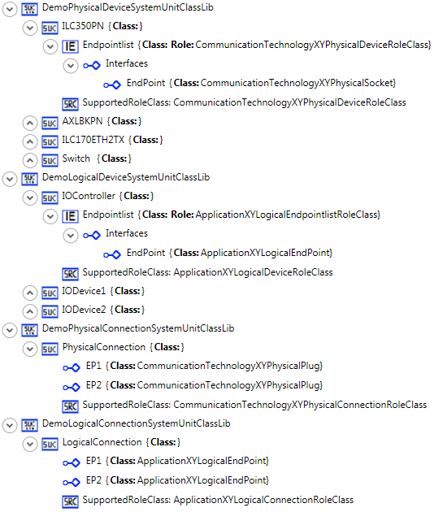

Рисунок 34 – Технологічно-специфічні

#### 5.4.5 Крок 4: Моделювання мережі

Після моделювання технологічно-специфічних класів на кроці 4 виконується моделювання реальних логічних і фізичних пристроїв. Для цього всі необхідні фізичні та логічні пристрої мають бути інстанційовані як нові `<InternalElement>` у `<InstanceHierarchy>`  з дотриманням потрібної ієрархічної структури. Усі релевантні атрибути отримують відповідні значення для опису індивідуальних властивостей пристроїв.

#### 5.4.6 Крок 5: Моделювання з’єднань

Останній крок 5 призначений для взаємного з’єднання пристроїв. Фізична та логічна мережі мають бути змодельовані кожна як окремий `<InternalElement>` у `<Instancehierarchy>` з посиланням відповідно на клас ролі `<PhysicalNetwork>` або `<LogicalNetwork>` відповідно. Вони слугують контейнерами для фізичних або логічних з’єднань, які створюються шляхом інстанціювання відповідних `<SystemUnit-Class>` та задання їх індивідуальних параметрів. Зв’язки між пристроями та з’єднаннями зрештою моделюються як CAEX `<InternalLink>`, що з’єднують відповідні інтерфейси. На рисунку 35 наведено приклад комунікаційної мережі.

 

Рисунок 35 – Технологічно-специфічна комунікаційна мережа

### 5.5 Моделювання PDU

Відповідно до розділів 3.2.4 і 4.4 логічні пристрої обмінюються комунікаційними пакетами даних (PDU) через свої логічні інтерфейси.

У цьому підрозділі визначено розширення бібліотек систем зв’язку за рахунок основних стандартних класів ролей і класів інтерфейсів, а також наведено необхідні кроки моделювання PDU в межах моделі системи зв’язку, потрібні для подання комунікаційних пакетів даних.

#### 5.5.1 Клас ролі CommunicationPackage

Базова бібліотека класів ролей систем зв’язку розширюється додатковим класом ролі `CommunicationPackage`, як описано в таблиці 13 та показано на рисунках 36–38.

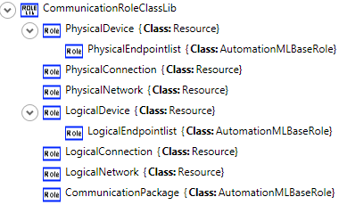

Рисунок 36 – Розширена бібліотека класів ролей систем зв’язку

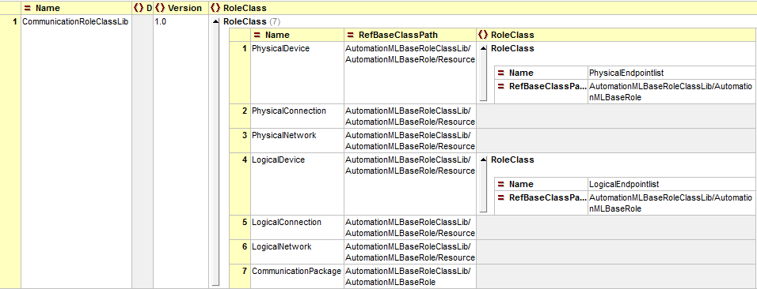

Рисунок 37 – Розширена `CommunicationRoleClassLib`

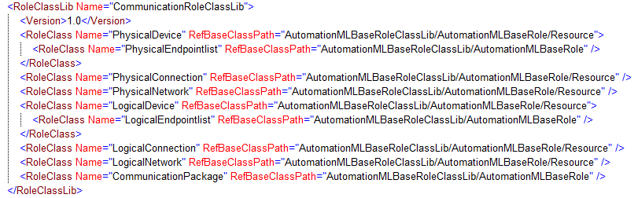

Рисунок 38 – XML-текст розширеної бібліотеки класів ролей систем зв’язку

Таблиця 13 – Клас ролі CommunicationPackage

| Поле              | Зміст                                                        |
| ----------------- | ------------------------------------------------------------ |
| Назва класу       | CommunicationPackage                                         |
| Опис              | Клас ролі «CommunicationPackage» є типом ролі для об’єктів, що представляють комунікаційні пакети даних (Protocol Data Units, PDU), які передаються між логічними кінцевими точками в межах логічного з’єднання. |
| Батьківський клас | AutomationMLBaseRoleClassLib/AutomationMLBaseRole            |
| Атрибути          | Немає                                                        |

#### 5.5.2 Клас інтерфейсу DatagrammObject

Базова бібліотека класів інтерфейсів систем зв’язку розширюється додатковим класом інтерфейсу `DatagrammObject`, як описано в таблиці 14 та подано на рисунках 39–41.

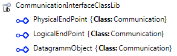

Рисунок 39 – Розширена бібліотека класів інтерфейсів систем зв’язку

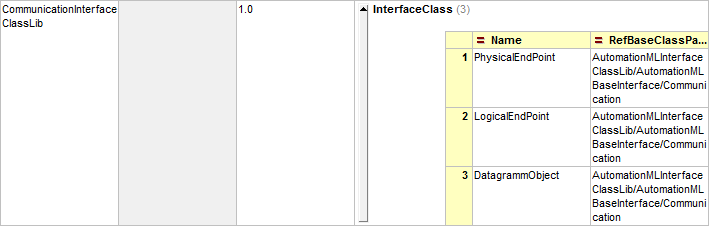

Рисунок 40 – Розширена `CommunicationInterfaceClassLib`

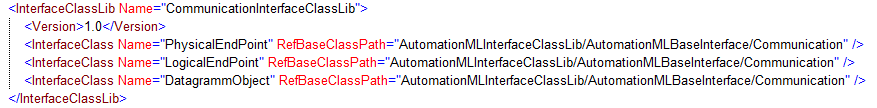

Рисунок 41 – XML-текст розширеної бібліотеки класів інтерфейсів систем зв’язку

Таблиця 14 – Клас інтерфейсу DatagrammObject

| Поле              | Зміст                                                        |
| ----------------- | ------------------------------------------------------------ |
| Назва класу       | DatagrammObject                                              |
| Опис              | Клас інтерфейсу «DatagrammObject» є типом інтерфейсу, що використовується для моделювання частин комунікаційного пакета, який передається через логічне з’єднання між логічними пристроями. Він представляє узгоджений набір інформації, що обмінюється, і відповідає інформаційному набору, представленому PLCopenXMLInterface, як визначено в частині 4 специфікації AutomationML. |
| Батьківський клас | AutomationMLInterfaceClassLib/AutomationMLBaseInterface/Communication |
| Атрибути          | Немає                                                        |

#### 5.5.3 Кроки моделювання технологічно-специфічних бібліотек

##### 5.5.3.1 Загальні положення

Як описано в розділі 5.4, розширені класи ролей і класи інтерфейсів залишаються незалежними від конкретних технологій. Для моделювання систем зв’язку на основі конкретних технологій, таких як Profinet, EthernetIP, Interbus або Sercos, необхідно створювати відповідні технологічно-специфічні класи. Цей підрозділ присвячений розширенню визначення технологічно-специфічних бібліотек, наведеного в розділі 5.4, з метою моделювання PDU.

Розроблення відповідних класів пояснюється на прикладі абстрактної технології з назвою `CommunicationTechnologyXY` та абстрактного прикладного застосування `ApplicationXY`. Бібліотеки для конкретних технологій виходять за межі цього white paper.

##### 5.5.3.2 Крок 1: Розроблення технологічно-специфічних класів ролей

Перший крок, описаний у розділі 5.4.2, розширюється для моделювання PDU шляхом наслідування додаткового технологічно-залежного класу ролі для `CommunicationPackage`, як показано на рисунку 42. При цьому клас ролі `ApplicationXYCommunicationPackageRoleClass` наслідується від класу ролі `CommunicationPackage`.

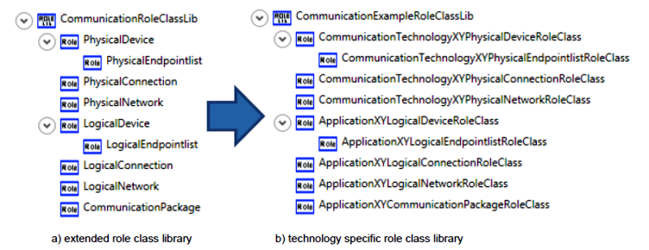

Рисунок 42 – Наслідування технологічно-специфічної бібліотеки класів ролей від розширеної бібліотеки класів ролей

##### 5.5.3.3 Крок 2: Розроблення технологічно-специфічних класів інтерфейсів

Другий крок, наведений у розділі 5.4.3, розширюється для моделювання PDU шляхом наслідування додаткового технологічно-залежного класу інтерфейсу для об’єкта даних, що передається разом із комунікаційним пакетом, як показано на рисунку 49. При цьому клас інтерфейсу `ApplicationXYDatagrammObject` наслідується від класу інтерфейсу `DatagrammObject`.

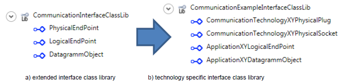

Рисунок 43 – Наслідування технологічно-специфічної бібліотеки класів інтерфейсів від розширеної бібліотеки класів інтерфейсів

##### 5.5.3.4 Крок 3: Розроблення бібліотек класів системних одиниць

Третій крок, наведений у розділі 5.4.4, розширюється для моделювання PDU шляхом визначення додаткового технологічно-залежного класу системної одиниці для комунікаційного пакета, як показано на рисунку 44. При цьому визначається клас системної одиниці `ApplicationXYDataPackage`.

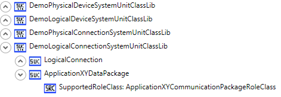

Рисунок 44 – Технологічно-специфічні розширені

##### 5.5.3.5 Кроки 4 і 5 – Моделювання комунікаційної мережі

Кроки 4 і 5 моделювання системи зв’язку залишаються без змін.

##### 5.5.3.6 Крок 6: Моделювання комунікаційних пакетів

Для моделювання комунікаційних пакетів додається додатковий крок 6. У межах цього кроку для кожного комунікаційного пакета, що передається через логічне з’єднання, у відповідному з роллю `ApplicationXYLogicalConnectionRoleClass` інстанціюється , похідний від класу системної одиниці `ApplicationXYDataPackage`. У межах цього для кожного інформаційного об’єкта, що передається і підлягає моделюванню, інстанціюється , похідний від класу інтерфейсу `ApplicationXYDatagrammObject`.

Для моделювання властивостей, пов’язаних із PDU, а також властивостей об’єктів датаграм використовуються атрибути, призначені відповідним та .

Інтерфейс типу `ApplicationXYDatagrammObject` з’єднується двома об’єктами з інтерфейсами типу `PLCopenXMLInterface` або `SignalInterface`, які представляють передану інформацію на стороні відправника та на стороні приймача.

Цю структуру подано на рисунку 45.


Рисунок 45 – Технологічно-специфічна комунікаційна мережа з моделями комунікаційних пакетів

### 5.6 Посилання на атрибути

Як зазначено в розділах 5.4.4 та 5.5.3.6, атрибути, пов’язані з комунікаційними пристроями, інтерфейсами, з’єднаннями, PDU та об’єктами датаграм, моделюються за допомогою атрибутів CAEX. У наведеній нижче таблиці наведено приклади можливих атрибутів, пов’язаних із системами зв’язку, а також їх опис.

Таблиця 15 – Атрибути, пов’язані з комунікацією

| Тип атрибута | Назва            | Опис                                                         | Тип даних, діапазон значень                                  | Обмеження використання                                       | Приклад   |
| ------------ | ---------------- | ------------------------------------------------------------ | ------------------------------------------------------------ | ------------------------------------------------------------ | --------- |
| Attribute    | Address          | Параметр address задає будь-яку адресну інформацію (наприклад, IEC address, IP address, port number, OPCTag, MAC address) для сутності (наприклад, сигналу). | String                                                       |                                                              | 10.7.8.12 |
| Attribute    | AdressOffSet     | Атрибут address offset задає, на який біт у карті пам’яті I/O відображається I/O сигнал. Зсув першого I/O дорівнює 0. | UINT                                                         | Не для логічних і фізичних пристроїв                         | 8.5       |
| Attribute    | BitCount         | Атрибут bit count задає довжину елемента даних у бітах. Мінімальне значення 1 для булевого сигналу. Значення може бути виведене з IEC data type, якщо він доступний. | UINT, > 0                                                    |                                                              | 8         |
| Attribute    | BitOffset        | Атрибут задає, який біт певного байта в карті пам’яті I/O призначеної I/O одиниці відповідає I/O сигналу. Зсув першого біта в першому байті I/O дорівнює 0. | Derived from AdressOffSet                                    | Не для логічних і фізичних пристроїв                         | 5         |
| Attribute    | BitOrder         | Атрибут bit order задає значущість першого біта (найбільш або найменш значущий). Допустимі значення: “MSBFirst”, “LSBFirst”. | Enumeration: “MSBFirst”, “LSBFirst”                          |                                                              | MSBFirst  |
| Attribute    | OctetOffset      | Атрибут задає номер октета в карті пам’яті I/O призначеної I/O одиниці, до якого відображається I/O сигнал. Зсув першого I/O дорівнює 0. Октети рахуються від наймолодшого октета. | Derived from AdressOffSet                                    | Не для логічних і фізичних пристроїв                         | 8         |
| Attribute    | Direction        | Атрибут direction задає напрямок сигналу: або з точки зору контролера (hard-wired I/Os), або з точки зору master device (fieldbus connections). | Enumeration: “In”, “Out”, “InOut”                            | Не для логічних і фізичних пристроїв                         | IN        |
| Attribute    | EncodingType     | Порядок байтів (byteorder) кодування даних у AML документі та всередині PDU під час виконання. | Enumeration: BigEndian, LittleEndian                         |                                                              | BigEndian |
| Attribute    | IECDataType      | Параметр IEC data type задає тип даних IEC 61131-3 для сигналу. | Enumeration з IEC 61131-3: BOOL, BYTE, WORD, DWORD, LWORD, SINT, INT, DINT, LINT, USINT, UINT, UDINT, ULINT, REAL, LREAL, TIME, LTIME, DATE, LDATE |                                                              | BOOL      |
| Attribute    | InitialValue     | Параметр initial value задає значення I/O сигналу, яке використовується під час старту. | Bytearray відповідно до IECDataType                          |                                                              | 0         |
| Attribute    | LogicalUnit      | Атрибут logical unit задає інженерну одиницю пристрою, підключеного до аналогового входу або виходу (наприклад, “mm” для датчика відстані або “%” для клапана). | String                                                       | Лише для логічних кінцевих точок                             | °C        |
| Attribute    | MaxLogicalValue  | Атрибут задає логічне значення, що відповідатиме максимальному фізичному значенню. Логічні значення дають змогу працювати з I/O сигналами через логічні величини, а не фізичні. Застосовується лише для аналогових сигналів. | String (2)                                                   | Лише для логічних кінцевих точок                             | 30        |
| Attribute    | MaxPhysicalValue | Атрибут задає фізичне значення, що відповідатиме максимальному бітовому значенню. Фізичне значення безпосередньо відповідає значенню I/O сигналу, тобто величині напруги або струму, яку задає датчик. Застосовується лише для аналогових сигналів. | String (1)                                                   | Лише для логічних і фізичних кінцевих точок та фізичних з’єднань | 20        |
| Attribute    | MinLogicalValue  | Мінімальне логічне значення виміряного фізичного значення.   | String (2)                                                   | Лише для логічних кінцевих точок                             | 10        |
| Attribute    | MinPhysicalValue | Мінімальне фізичне значення виміряного фізичного значення.   | String (2)                                                   | Лише для логічних і фізичних кінцевих точок та фізичних з’єднань | 4         |
| Attribute    | PhysicalUnit     | Атрибут physical unit задає одиницю I/O сигналу, наприклад “mA”, “V”. Застосовується лише для аналогових сигналів. | String                                                       | Лише для логічних і фізичних кінцевих точок та фізичних з’єднань | mA        |

Примітки з оригіналу (позначки 1 і 2): формат вмісту рядка має відповідати типу даних, заданому атрибутом IECDataType.

### 5.7 Використання метаданих

Метадані моделюються відповідно до IEC 62424:2014 і містять інформацію про джерело даних, версію та редакцію. CAEX-документ, який надає поточні бібліотеки, пов’язані з комунікацією, повинен містити такі метадані в частині SourceDocumentInformation (таблиця 16).

Таблиця 16 – Поле SourceDocumentInformation відповідно до бібліотек, пов’язаних із комунікацією


Інформація, пов’язана з версією та редакцією, повинна моделюватися відповідно до IEC 62424:2014.

## 6 Приклади

У цьому розділі змодельовано два приклади систем зв’язку з метою надати орієнтири для застосування моделювання систем зв’язку, описаного вище.

### 6.1 Модель лабораторної виробничої системи

Далі моделюється комунікаційна частина моделі лабораторної виробничої системи, зображеної на рисунку 46.

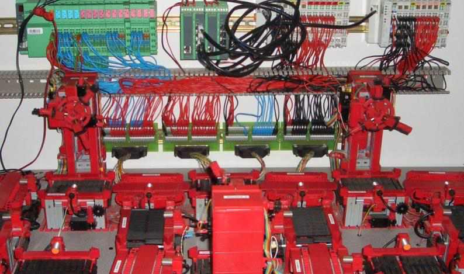

Рисунок 46 – Модель лабораторної виробничої системи

Ця система зв’язку складається з трьох логічно з’єднаних керувальних пристроїв, на яких розміщено прикладне застосування керування, одного комутатора та трьох Ethernet-кабелів, що формують фізичну мережу. Фізичну та логічну топології цього прикладу мережі подано на рисунку 47.

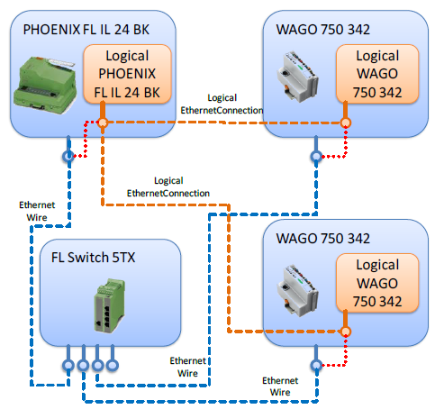

Рисунок 47 – Фізична та логічна топологія прикладу мережі

Для моделювання наведених далі артефактів системи зв’язку застосовано кроки моделювання, подані в розділі 5.4. Повний файл `.aml` доступний на вебсторінці AutomationML [за адресою](https://www.automationml.org/o.red.c/dateien.html).

#### 6.1.1 Класи ролей

Наведену нижче бібліотеку класів ролей було похідно визначено відповідно до розділу 5.4.2 на основі базових класів ролей, визначених у розділі 5.2.

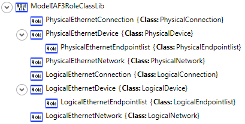

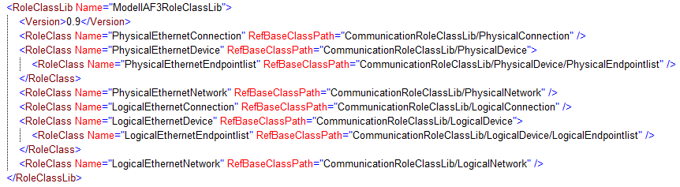

Рисунок 48 – Бібліотека класів ролей для прикладу моделі виробничої установки

Таблиця 17 – Клас ролі `PhysicalEthernetConnection`

| Поле              | Зміст                                                        |
| ----------------- | ------------------------------------------------------------ |
| Назва ролі        | PhysicalEthernetConnection                                   |
| Опис              | Фізичні мережеві з’єднання, спеціалізовані для Ethernet-мереж |
| Батьківський клас | CommunicationRoleClassLib/PhysicalConnection                 |

Таблиця 18 – Клас ролі `PhysicalEthernetDevice`

| Поле              | Зміст                                                        |
| ----------------- | ------------------------------------------------------------ |
| Назва ролі        | PhysicalEthernetDevice                                       |
| Опис              | Фізичні мережеві пристрої, спеціалізовані для Ethernet-мереж |
| Батьківський клас | CommunicationRoleClassLib/PhysicalDevice                     |

Таблиця 19 – Клас ролі `PhysicalEthernetEndpointlist`

| Поле              | Зміст                                                        |
| ----------------- | ------------------------------------------------------------ |
| Назва ролі        | PhysicalEthernetEndpointlist                                 |
| Опис              | Список портів фізичних мережевих пристроїв, спеціалізований для Ethernet-мереж |
| Батьківський клас | CommunicationRoleClassLib/PhysicalEndpointlist               |

Таблиця 20 – Клас ролі `PhysicalEthernetNetwork`

| Поле              | Зміст                                     |
| ----------------- | ----------------------------------------- |
| Назва ролі        | PhysicalEthernetNetwork                   |
| Опис              | Фізична Ethernet-мережа                   |
| Батьківський клас | CommunicationRoleClassLib/PhysicalNetwork |

Таблиця 21 – Клас ролі `LogicalEthernetConnection`

| Поле              | Зміст                                                        |
| ----------------- | ------------------------------------------------------------ |
| Назва ролі        | LogicalEthernetConnection                                    |
| Опис              | Логічне мережеве з’єднання, спеціалізоване для Ethernet-мереж |
| Батьківський клас | CommunicationRoleClassLib/LogicalConnection                  |

Таблиця 22 – Клас ролі `LogicalEthernetDevice`

| Поле              | Зміст                                                        |
| ----------------- | ------------------------------------------------------------ |
| Назва ролі        | LogicalEthernetDevice                                        |
| Опис              | Логічний мережевий пристрій, спеціалізований для Ethernet-мереж |
| Батьківський клас | CommunicationRoleClassLib/LogicalDevice                      |

Таблиця 23 – Клас ролі `LogicalEthernetEndpointlist`

| Поле              | Зміст                                                        |
| ----------------- | ------------------------------------------------------------ |
| Назва ролі        | LogicalEthernetEndpointlist                                  |
| Опис              | Список портів логічних мережевих пристроїв, спеціалізований для Ethernet-мереж |
| Батьківський клас | CommunicationRoleClassLib/LogicalEndpointlist                |

Таблиця 24 – Клас ролі `LogicalEthernetNetwork`

| Поле              | Зміст                                                      |
| ----------------- | ---------------------------------------------------------- |
| Назва ролі        | LogicalEthernetNetwork                                     |
| Опис              | Логічна Ethernet-мережа, спеціалізована для Ethernet-мереж |
| Батьківський клас | CommunicationRoleClassLib/LogicalNetwork                   |

#### 6.1.2 Класи інтерфейсів

Наведену нижче бібліотеку класів інтерфейсів було похідно визначено відповідно до розділу 5.4.3 на основі базових класів інтерфейсів, визначених у розділі 5.2.

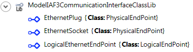

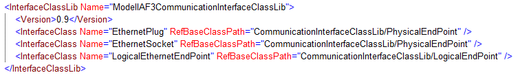

Рисунок 49 – Бібліотека класів інтерфейсів для прикладу моделі виробничої установки

Таблиця 25 – Клас інтерфейсу `EthernetPlug`

| Поле              | Зміст                                                |
| ----------------- | ---------------------------------------------------- |
| Назва класу       | EthernetPlug                                         |
| Опис              | Мережевий штекер, спеціалізований для Ethernet-мереж |
| Батьківський клас | CommunicationInterfaceClassLib/PhysicalEndPoint      |

Таблиця 26 – Клас інтерфейсу `EthernetSocket`

| Поле              | Зміст                                               |
| ----------------- | --------------------------------------------------- |
| Назва класу       | EthernetSocket                                      |
| Опис              | Роз’єм (гніздо), спеціалізований для Ethernet-мереж |
| Батьківський клас | CommunicationInterfaceClassLib/PhysicalEndPoint     |

Таблиця 27 – Клас інтерфейсу `LogicalEthernetEndPoint`

| Поле              | Зміст                                                        |
| ----------------- | ------------------------------------------------------------ |
| Назва класу       | LogicalEthernetEndPoint                                      |
| Опис              | Кінцеві точки, спеціалізовані для логічної Ethernet-мережі; пов’язані з EthernetPlug і EthernetSocket у фізичній Ethernet-мережі |
| Батьківський клас | AutomationMLInterfaceClassLib/AutomationMLBaseInterface      |

#### 6.1.3 Класи системних одиниць

Наведені нижче бібліотеки класів системних одиниць було похідно визначено відповідно до розділу 5.4.4.

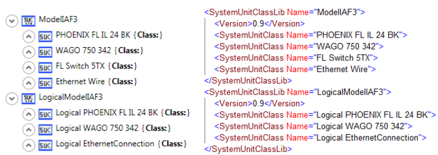

Рисунок 50 – Бібліотека класів системних одиниць для прикладу моделі виробничої установки

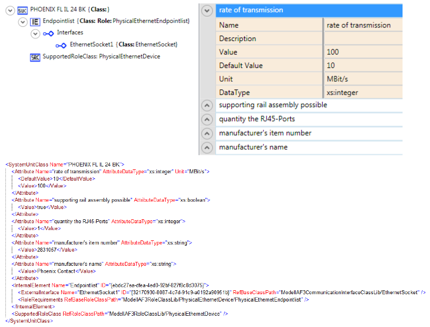

Рисунок 51 – Клас системної одиниці для прикладу фізичного пристрою 1

Таблиця 28 – Клас системної одиниці `PHOENIX FL IL 24 BK`

| Поле               | Підполе                     | Значення                                                |
| ------------------ | --------------------------- | ------------------------------------------------------- |
| Name               |                             | PHOENIX FL IL 24 BK                                     |
| Description        |                             | Шинний з’єднувач Modbus/TCP                             |
| Attributes         | Name                        | швидкість передавання                                   |
|                    | Value                       | 100                                                     |
|                    | Default Value               | 10                                                      |
|                    | Unit                        | Mbit/s                                                  |
|                    | Data Type                   | xs:integer                                              |
| Attributes         | Name                        | можливість монтажу на монтажну рейку                    |
|                    | Value                       | 1                                                       |
|                    | Data Type                   | xs:boolean                                              |
| Attributes         | Name                        | кількість RJ45-портів                                   |
|                    | Value                       | 1                                                       |
|                    | Data Type                   | xs:integer                                              |
| Attributes         | Name                        | номер виробу виробника                                  |
|                    | Value                       | 2831057                                                 |
|                    | Data Type                   | xs:string                                               |
| Attributes         | Name                        | виробник                                                |
|                    | Value                       | Phoenix Contact                                         |
|                    | Data Type                   | xs:string                                               |
| Endpointlist       | Role                        | ModellIAF3RoleClassLib/PhysicalEthernetEndpointlist     |
| Endpointlist       | EthernetSocket1 ParentClass | ModellIAF3CommunicationInterfaceClassLib/EthernetSocket |
| SupportedRoleClass |                             | ModellIAF3RoleClassLib/PhysicalEthernetDevice           |

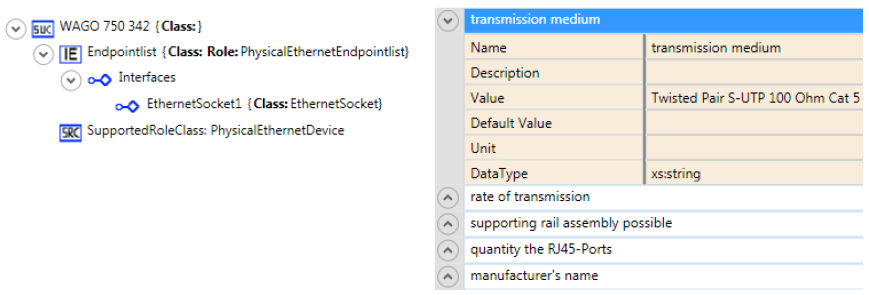

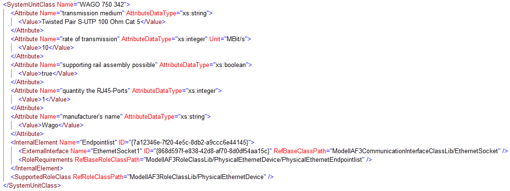

Рисунок 52 – Клас системної одиниці для прикладу фізичного пристрою 2

Таблиця 29 – Клас системної одиниці `WAGO 750 342`

| Поле               | Підполе                     | Значення                                                |
| ------------------ | --------------------------- | ------------------------------------------------------- |
| Name               |                             | WAGO 750 342                                            |
| Description        |                             | Шинний з’єднувач Modbus/TCP                             |
| Attributes         | Name                        | середовище передавання                                  |
|                    | Value                       | Вита пара S-UTP 100 Ом Cat 5                            |
|                    | Data Type                   | xs:string                                               |
| Attributes         | Name                        | швидкість передавання                                   |
|                    | Value                       | 100                                                     |
|                    | Default Value               | 10                                                      |
|                    | Unit                        | Mbit/s                                                  |
|                    | Data Type                   | xs:integer                                              |
| Attributes         | Name                        | можливість монтажу на монтажну рейку                    |
|                    | Value                       | 1                                                       |
|                    | Data Type                   | xs:boolean                                              |
| Attributes         | Name                        | кількість RJ45-портів                                   |
|                    | Value                       | 1                                                       |
|                    | Data Type                   | xs:integer                                              |
| Attributes         | Name                        | виробник                                                |
|                    | Value                       | Wago                                                    |
|                    | Data Type                   | xs:string                                               |
| Endpointlist       | Role                        | ModellIAF3RoleClassLib/PhysicalEthernetEndpointlist     |
| Endpointlist       | EthernetSocket1 ParentClass | ModellIAF3CommunicationInterfaceClassLib/EthernetSocket |
| SupportedRoleClass |                             | ModellIAF3RoleClassLib/PhysicalEthernetDevice           |

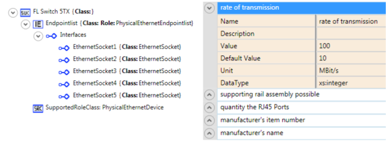

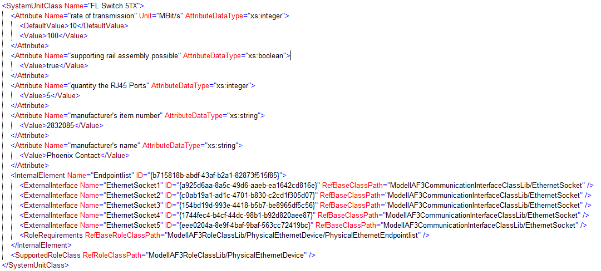

Рисунок 53 – Клас системної одиниці для прикладу фізичного пристрою 3

Таблиця 30 – Клас системної одиниці `FL Switch 5TX`

| Поле               | Підполе                       | Значення                                                |
| ------------------ | ----------------------------- | ------------------------------------------------------- |
| Name               |                               | FL Switch 5TX                                           |
| Description        |                               | 5-портовий Ethernet-комутатор                           |
| Attributes         | Name                          | швидкість передавання                                   |
|                    | Value                         | 100                                                     |
|                    | Default Value                 | 10                                                      |
|                    | Unit                          | Mbit/s                                                  |
|                    | Data Type                     | xs:integer                                              |
| Attributes         | Name                          | можливість монтажу на монтажну рейку                    |
|                    | Value                         | 1                                                       |
|                    | Data Type                     | xs:boolean                                              |
| Attributes         | Name                          | кількість RJ45-портів                                   |
|                    | Value                         | 5                                                       |
|                    | Data Type                     | xs:integer                                              |
| Attributes         | Name                          | номер виробу виробника                                  |
|                    | Value                         | 2832085                                                 |
|                    | Data Type                     | xs:string                                               |
| Attributes         | Name                          | виробник                                                |
|                    | Value                         | Phoenix Contact                                         |
|                    | Data Type                     | xs:string                                               |
| Endpointlist       | Role                          | ModellIAF3RoleClassLib/PhysicalEthernetEndpointlist     |
| Endpointlist       | EthernetSocket1–5 ParentClass | ModellIAF3CommunicationInterfaceClassLib/EthernetSocket |
| SupportedRoleClass |                               | ModellIAF3RoleClassLib/PhysicalEthernetDevice           |

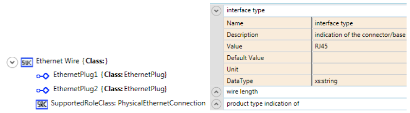

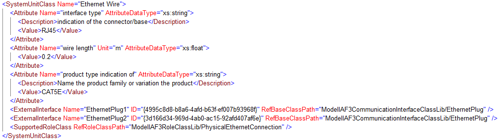

Рисунок 54 – Клас системної одиниці для прикладу фізичного з’єднання

Таблиця 31 – Клас системної одиниці `Ethernet Wire`

| Поле               | Підполе     | Значення                                              |
| ------------------ | ----------- | ----------------------------------------------------- |
| Name               |             | Ethernet Wire                                         |
| Description        |             | Мережевий кабель                                      |
| Attributes         | Name        | тип інтерфейсу                                        |
|                    | Value       | RJ45                                                  |
|                    | Data Type   | xs:string                                             |
| Attributes         | Name        | довжина кабелю                                        |
|                    | Value       | 0.2                                                   |
|                    | Unit        | m                                                     |
|                    | Data Type   | xs:real                                               |
| Attributes         | Name        | позначення типу виробу                                |
|                    | Value       | CAT5E                                                 |
|                    | Data Type   | xs:string                                             |
| EthernetPlug1–2    | ParentClass | ModellIAF3CommunicationInterfaceClassLib/EthernetPlug |
| SupportedRoleClass |             | ModellIAF3RoleClassLib/PhysicalEthernetConnection     |

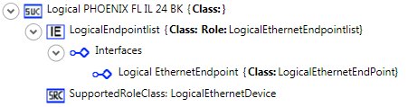

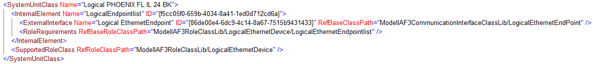

Рисунок 55 – Клас системної одиниці для прикладу логічного пристрою 1

 Таблиця 32 – Клас системної одиниці `Logical PHOENIX FL IL 24 BK`

| Поле                | Підполе                             | Значення                                                     |
| ------------------- | ----------------------------------- | ------------------------------------------------------------ |
| Name                |                                     | Logical PHOENIX FL IL 24 BK                                  |
| Description         |                                     | Шинний з’єднувач Modbus/TCP – логічний пристрій              |
| LogicalEndpointlist | Role                                | ModellIAF3RoleClassLib/LogicalEthernetEndpointlist           |
| LogicalEndpointlist | LogicalEthernetEndpoint ParentClass | ModellIAF3CommunicationInterfaceClassLib/LogicalEthernetEndpoint |
| SupportedRoleClass  |                                     | ModellIAF3RoleClassLib/LogicalEthernetDevice                 |

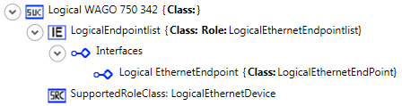

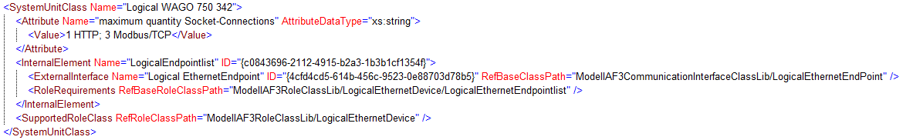

Рисунок 56 – Клас системної одиниці для прикладу логічного пристрою 2

Таблиця 33 – Клас системної одиниці `Logical WAGO 750 342`

| Поле                | Підполе                             | Значення                                                     |
| ------------------- | ----------------------------------- | ------------------------------------------------------------ |
| Name                |                                     | Logical WAGO 750 342                                         |
| Description         |                                     | Шинний з’єднувач Modbus/TCP – логічний пристрій              |
| Attributes          | Name                                | максимальна кількість сокет-з’єднань                         |
|                     | Value                               | 1 HTTP; 3 Modbus/TCP                                         |
|                     | Data Type                           | xs:string                                                    |
| LogicalEndpointlist | Role                                | ModellIAF3RoleClassLib/LogicalEthernetEndpointlist           |
| LogicalEndpointlist | LogicalEthernetEndpoint ParentClass | ModellIAF3CommunicationInterfaceClassLib/LogicalEthernetEndpoint |
| SupportedRoleClass  |                                     | ModellIAF3RoleClassLib/LogicalEthernetDevice                 |

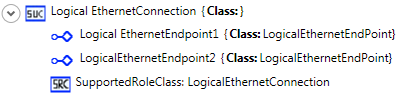

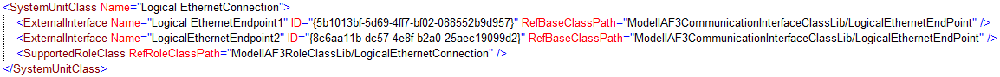

Рисунок 57 – Клас системної одиниці для прикладу логічного з’єднання

Таблиця 34 – Клас системної одиниці `LogicalEthernetConnection`

| Поле                       | Підполе     | Значення                                                     |
| -------------------------- | ----------- | ------------------------------------------------------------ |
| Name                       |             | LogicalEthernetConnection                                    |
| Description                |             | логічне з’єднання, Ethernet-кабель на логічному рівні        |
| LogicalEthernetEndpoint1–2 | ParentClass | ModellIAF3CommunicationInterfaceClassLib/LogicalEthernetEndpoint |
| SupportedRoleClass         |             | ModellIAF3RoleClassLib/LogicalEthernetDevice                 |

#### 6.1.4 Ієрархія екземплярів

Використовуючи визначені класи системних одиниць, можна побудувати таку ієрархію екземплярів, яка моделює приклад системи зв’язку лабораторної виробничої установки.

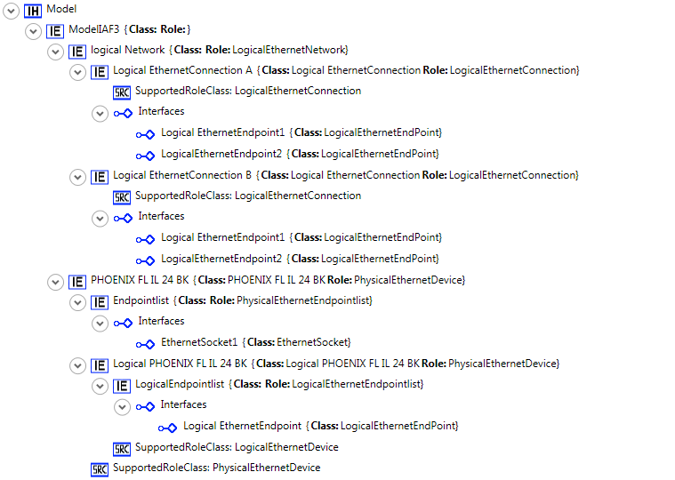

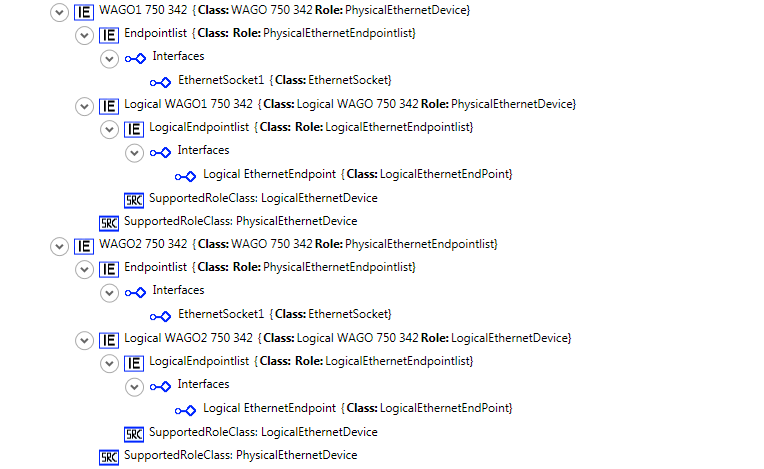

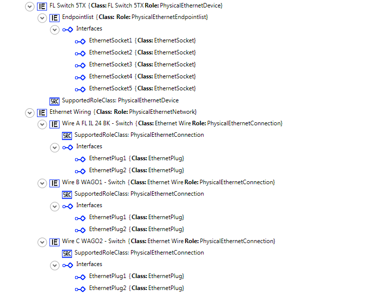

Рисунок 58 – Ієрархія екземплярів для прикладу системи зв’язку

#### 6.1.5 Зв’язки

Для з’єднання відповідних елементів ієрархії екземплярів, наведеної в розділі 6.1.4, можуть бути використані такі внутрішні зв’язки.

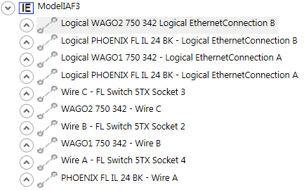

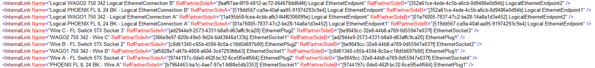

Рисунок 59 – Внутрішні зв’язки, пов’язані з ієрархією екземплярів для прикладу системи зв’язку

### 6.2 Демонстратор PROFINET

Другий приклад демонструє використання AutomationML для опису невеликої виробничої системи, що складається з PLC, вхідного пристрою та вихідного пристрою. У цьому прикладі основну увагу приділено моделюванню пакетів даних зв’язку (PDU) (див. Рисунок 60).

Вхідний пристрій надає два дані типу Boolean, які споживаються головним контролером, тоді як вихідний пристрій споживає один параметр Boolean, що обчислюється та надається головним контролером на основі вхідних сигналів.

Це три булеві параметри `D1`, `D2` і `D3`, які відображаються всередині PLC (програма тут детально не описується). Змінні `D1` і `D2` відображаються на `PN_1_1_IN00` та `PN_1_1_IN03` як вхідні порти. PLC обчислює вихідну змінну `D3`, яка відображається на `PN_1_2_OUT01`. Ці значення також циклічно передаються на вихідний пристрій як булеві параметри.

Протокол зв’язку, що використовується в цьому прикладі, – PROFINET. Пристрої з’єднані в лінійній топології. Відповідно, пристрої мають по два Ethernet-сокети. Усередині ці сокети з’єднані за допомогою комутатора, тому датаграми пересилаються далі (див. Рисунок 61).


Рисунок 60 – Фізична та логічна топологія демонстратора PROFINET

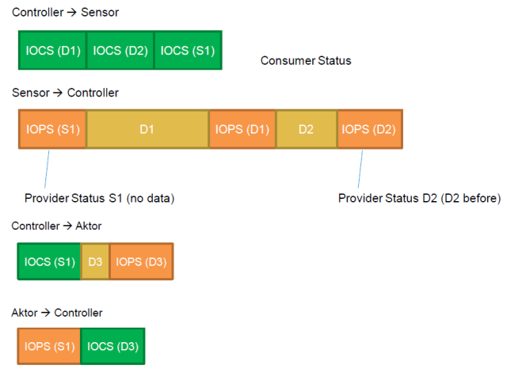


Рисунок 61 – Комунікаційні пакети демонстратора PROFINET

Для моделювання наведених далі артефактів системи зв’язку застосовано кроки моделювання, подані в розділі 5.5. Повний файл `.aml` доступний на вебсторінці AutomationML [за адресою](https://www.automationml.org/o.red.c/dateien.html).

#### 6.2.1 Класи ролей

Наведену нижче бібліотеку класів ролей було похідно визначено відповідно до розділів 5.4.2 і 5.5.3.2 на основі базових класів ролей, визначених у розділі 5.2, та розширених класів ролей, визначених у розділі 5.5.

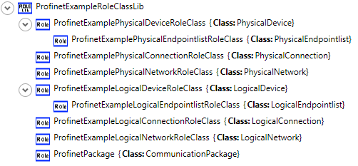

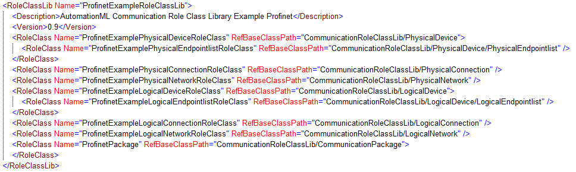

Рисунок 62 – Бібліотека класів ролей для прикладу демонстратора PROFINET

Таблиця 35 – Клас ролі `ProfinetExamplePhysicalConnectionRoleClass`

| Поле              | Зміст                                                        |
| ----------------- | ------------------------------------------------------------ |
| Назва ролі        | ProfinetExamplePhysicalConnectionRoleClass                   |
| Опис              | Фізичні мережеві з’єднання, спеціалізовані для мереж PROFINET |
| Батьківський клас | CommunicationRoleClassLib/PhysicalConnection                 |

Таблиця 36 – Клас ролі `ProfinetExamplePhysicalDeviceRoleClass`

| Поле              | Зміст                                                        |
| ----------------- | ------------------------------------------------------------ |
| Назва ролі        | ProfinetExamplePhysicalDeviceRoleClass                       |
| Опис              | Фізичні мережеві пристрої, спеціалізовані для мереж PROFINET |
| Батьківський клас | CommunicationRoleClassLib/PhysicalDevice                     |

Таблиця 37 – Клас ролі `ProfinetExamplePhysicalEndpointlistRoleClass`

| Поле              | Зміст                                                        |
| ----------------- | ------------------------------------------------------------ |
| Назва ролі        | ProfinetExamplePhysicalEndpointlistRoleClass                 |
| Опис              | Список портів фізичних мережевих пристроїв, спеціалізований для мереж PROFINET |
| Батьківський клас | CommunicationRoleClassLib/PhysicalEndpointlist               |

Таблиця 38 – Клас ролі `ProfinetExamplePhysicalNetworkRoleClass`

| Поле              | Зміст                                             |
| ----------------- | ------------------------------------------------- |
| Назва ролі        | ProfinetExamplePhysicalNetworkRoleClass           |
| Опис              | Фізична мережа, спеціалізована для мереж PROFINET |
| Батьківський клас | CommunicationRoleClassLib/PhysicalNetwork         |

Таблиця 39 – Клас ролі `ProfinetExampleLogicalConnectionRoleClass`

| Поле              | Зміст                                                        |
| ----------------- | ------------------------------------------------------------ |
| Назва ролі        | ProfinetExampleLogicalConnectionRoleClass                    |
| Опис              | Логічне мережеве з’єднання, спеціалізоване для мереж PROFINET |
| Батьківський клас | CommunicationRoleClassLib/LogicalConnection                  |

Таблиця 40 – Клас ролі `ProfinetExampleLogicalDeviceRoleClass`

| Поле              | Зміст                                                        |
| ----------------- | ------------------------------------------------------------ |
| Назва ролі        | ProfinetExampleLogicalDeviceRoleClass                        |
| Опис              | Логічний мережевий пристрій, спеціалізований для мереж PROFINET |
| Батьківський клас | CommunicationRoleClassLib/LogicalDevice                      |

Таблиця 41 – Клас ролі `ProfinetExampleLogicalEndpointlistRoleClass`

| Поле              | Зміст                                                        |
| ----------------- | ------------------------------------------------------------ |
| Назва ролі        | ProfinetExampleLogicalEndpointlistRoleClass                  |
| Опис              | Список портів логічних мережевих пристроїв, спеціалізований для мереж PROFINET |
| Батьківський клас | CommunicationRoleClassLib/LogicalEndpointlist                |

Таблиця 42 – Клас ролі `ProfinetExampleLogicalNetworkRoleClass`

| Поле              | Зміст                                             |
| ----------------- | ------------------------------------------------- |
| Назва ролі        | ProfinetExampleLogicalNetworkRoleClass            |
| Опис              | Логічна мережа, спеціалізована для мереж PROFINET |
| Батьківський клас | CommunicationRoleClassLib/LogicalNetwork          |

Таблиця 43 – Клас ролі `ProfinetPackage`

| Поле              | Зміст                                              |
| ----------------- | -------------------------------------------------- |
| Назва ролі        | ProfinetPackage                                    |
| Опис              | Пакет PROFINET, спеціалізований для мереж PROFINET |
| Батьківський клас | CommunicationRoleClassLib/CommunicationPackage     |

#### 6.2.2 Класи інтерфейсів

Наведену нижче бібліотеку класів інтерфейсів було похідно визначено відповідно до розділів 5.4.3 та 5.5.3.3 на основі базових класів інтерфейсів, визначених у розділі 5.2, а також розширених класів інтерфейсів, визначених у розділі 5.5.

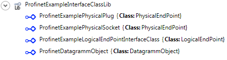

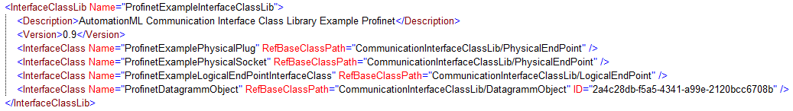

Рисунок 63 – Бібліотека класів інтерфейсів для прикладу демонстратора PROFINET

Таблиця 44 – Клас інтерфейсу `ProfinetExamplePhysicalPlug`

| Поле              | Зміст                                                        |
| ----------------- | ------------------------------------------------------------ |
| Назва класу       | ProfinetExamplePhysicalPlug                                  |
| Опис              | Фізичний мережевий штекер, спеціалізований для фізичних мереж PROFINET |
| Батьківський клас | CommunicationInterfaceClassLib/PhysicalEndPoint              |

Таблиця 45 – Клас інтерфейсу `ProfinetExamplePhysicalSocket`

| Поле              | Зміст                                                        |
| ----------------- | ------------------------------------------------------------ |
| Назва класу       | ProfinetExamplePhysicalSocket                                |
| Опис              | Фізичне мережеве гніздо, спеціалізоване для фізичних мереж PROFINET |
| Батьківський клас | CommunicationInterfaceClassLib/PhysicalEndPoint              |

Таблиця 46 – Клас інтерфейсу `ProfinetExampleLogicalEndPointInterfaceClass`

| Поле              | Зміст                                                      |
| ----------------- | ---------------------------------------------------------- |
| Назва класу       | ProfinetExampleLogicalEndPointInterfaceClass               |
| Опис              | Кінцеві точки, спеціалізовані для логічної мережі PROFINET |
| Батьківський клас | AutomationMLInterfaceClassLib/AutomationMLBaseInterface    |

Таблиця 47 – Клас інтерфейсу `ProfinetProfinetDatagrammObject`

| Поле              | Зміст                                          |
| ----------------- | ---------------------------------------------- |
| Назва класу       | ProfinetProfinetDatagrammObject                |
| Опис              | Елемент вмісту PDU в межах мережі PROFINET     |
| Батьківський клас | CommunicationInterfaceClassLib/DatagrammObject |

#### 6.2.3 Класи системних одиниць

Наведені нижче бібліотеки класів системних одиниць було похідно визначено відповідно до розділів 5.4.4 та 5.5.3.4.

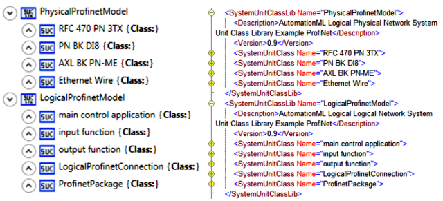

Рисунок 64 – Бібліотека класів системних одиниць для прикладу демонстратора PROFINET

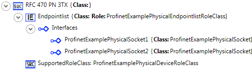

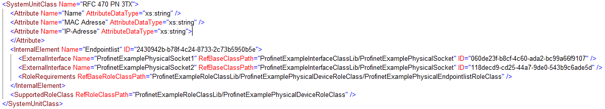

Рисунок 65 – Клас системної одиниці для прикладу фізичного пристрою PROFINET 1

Table 48 - SystemUnitClass `RFC 470 PN 3TX`

| Поле               | Підполе                        | Значення                                                     |
| ------------------ | ------------------------------ | ------------------------------------------------------------ |
| Name               |                                | RFC 470 PN 3TX                                               |
| Description        |                                | Апаратний пристрій головного контролера                      |
| Attributes         | Name                           | Name                                                         |
|                    | DataType                       | xs:string                                                    |
| Attributes         | Name                           | MAC-адреса                                                   |
|                    | DataType                       | xs:string                                                    |
| Attributes         | Name                           | IP-адреса                                                    |
|                    | DataType                       | xs:string                                                    |
| Endpointlist       | Role                           | ProfinetExampleRoleClassLib/ProfinetExamplePhysicalEndpointlistRoleClass |
| Endpointlist       | ProfinetExamplePhysicalSocket1 | ProfinetExampleInterfaceClassLib/ProfinetExamplePhysicalSocket |
| Endpointlist       | ProfinetExamplePhysicalSocket2 | ProfinetExampleInterfaceClassLib/ProfinetExamplePhysicalSocket |
| SupportedRoleClass |                                | ProfinetExampleRoleClassLib/ProfinetExamplePhysicalDeviceRoleClass |

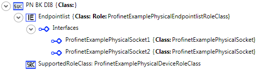

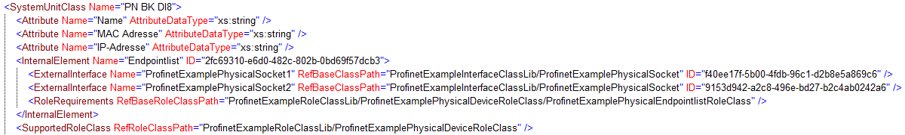

Рисунок 66 – Клас системної одиниці для прикладу фізичного пристрою PROFINET 2
 Таблиця 49 – Клас системної одиниці `PN BK DI8`

| Поле               | Підполе                        | Значення                                                     |
| ------------------ | ------------------------------ | ------------------------------------------------------------ |
| Name               |                                | PN BK DI8                                                    |
| Description        |                                | IO-пристрій / шинний з’єднувач керуючих входів               |
| Attributes         | Name                           | Name                                                         |
|                    | DataType                       | xs:string                                                    |
| Attributes         | Name                           | MAC-адреса                                                   |
|                    | DataType                       | xs:string                                                    |
| Attributes         | Name                           | IP-адреса                                                    |
|                    | DataType                       | xs:string                                                    |
| Endpointlist       | Role                           | ProfinetExampleRoleClassLib/ProfinetExamplePhysicalEndpointlistRoleClass |
| Endpointlist       | ProfinetExamplePhysicalSocket1 | ProfinetExampleInterfaceClassLib/ProfinetExamplePhysicalSocket |
| Endpointlist       | ProfinetExamplePhysicalSocket2 | ProfinetExampleInterfaceClassLib/ProfinetExamplePhysicalSocket |
| SupportedRoleClass |                                | ProfinetExampleRoleClassLib/ProfinetExamplePhysicalDeviceRoleClass |

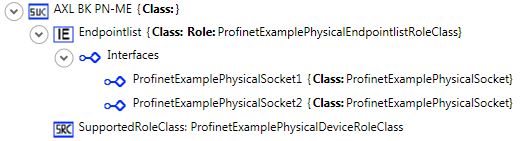

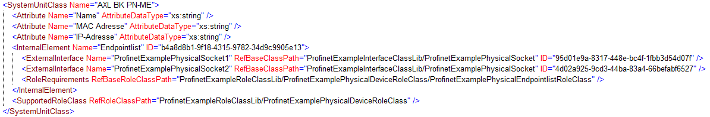

Рисунок 67 – Клас системної одиниці для прикладу фізичного пристрою PROFINET 3

Таблиця 50 – Клас системної одиниці `AXL BK PN-ME`

| Поле               | Підполе                        | Значення                                                     |
| ------------------ | ------------------------------ | ------------------------------------------------------------ |
| Name               |                                | AXL BK PN-ME                                                 |
| Description        |                                | IO-пристрій / шинний з’єднувач керуючих виходів              |
| Attributes         | Name                           | Name                                                         |
|                    | DataType                       | xs:string                                                    |
| Attributes         | Name                           | MAC-адреса                                                   |
|                    | DataType                       | xs:string                                                    |
| Attributes         | Name                           | IP-адреса                                                    |
|                    | DataType                       | xs:string                                                    |
| Endpointlist       | Role                           | ProfinetExampleRoleClassLib/ProfinetExamplePhysicalEndpointlistRoleClass |
| Endpointlist       | ProfinetExamplePhysicalSocket1 | ProfinetExampleInterfaceClassLib/ProfinetExamplePhysicalSocket |
| Endpointlist       | ProfinetExamplePhysicalSocket2 | ProfinetExampleInterfaceClassLib/ProfinetExamplePhysicalSocket |
| SupportedRoleClass |                                | ProfinetExampleRoleClassLib/ProfinetExamplePhysicalDeviceRoleClass |

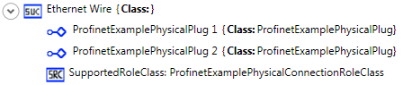

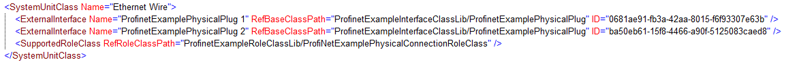

Рисунок 68 – Клас системної одиниці для прикладу фізичного з’єднання PROFINET

Таблиця 51 – Клас системної одиниці `Ethernet Wire`

| Поле                        | Значення                                                     |
| --------------------------- | ------------------------------------------------------------ |
| Name                        | Ethernet Wire                                                |
| Description                 | Мережевий кабель для прокладання PROFINET                    |
| EthernetPlug1–2 ParentClass | ProfinetExampleInterfaceClassLib/ProfinetExamplePhysicalPlug |
| SupportedRoleClass          | ProfinetExampleRoleClassLib/ProfinetExamplePhysicalConnectionRoleClass |

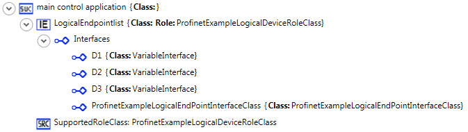


Рисунок 69 – Клас системної одиниці для прикладу логічного пристрою PROFINET 1

Таблиця 52 – Клас системної одиниці `main control application`

| Поле                | Підполе                                      | Значення                                                     |
| ------------------- | -------------------------------------------- | ------------------------------------------------------------ |
| Name                |                                              | main control application                                     |
| Description         |                                              | Головна функція керування, що обчислює дії виконавчих механізмів на основі сигналів датчиків |
| LogicalEndpointlist | Role                                         | ProfinetExampleRoleClassLib/ProfinetExampleLogicalEndpointlistRoleClass |
| LogicalEndpointlist | ProfinetExampleLogicalEndPointInterfaceClass | ProfinetExampleInterfaceClassLib/ProfinetExampleLogicalEndPointInterfaceClass |
| LogicalEndpointlist | D1                                           | AutomationMLInterfaceClassLib/AutomationMLBaseInterface/ExternalDataConnector/PLCopenXMLInterface/VariableInterface |
| LogicalEndpointlist | D2                                           | AutomationMLInterfaceClassLib/AutomationMLBaseInterface/ExternalDataConnector/PLCopenXMLInterface/VariableInterface |
| LogicalEndpointlist | D3                                           | AutomationMLInterfaceClassLib/AutomationMLBaseInterface/ExternalDataConnector/PLCopenXMLInterface/VariableInterface |
| SupportedRoleClass  |                                              | ProfinetExampleRoleClassLib/ProfinetExampleLogicalDeviceRoleClass |

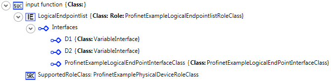

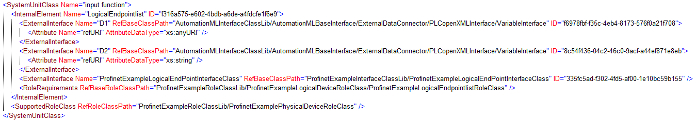

Рисунок 70 – Клас системної одиниці для прикладу логічного пристрою PROFINET 2

Таблиця 53 – Клас системної одиниці `Input function`

| Поле                | Підполе                                      | Значення                                                     |
| ------------------- | -------------------------------------------- | ------------------------------------------------------------ |
| Name                |                                              | Input function                                               |
| Description         |                                              | Функція IO, що надає доступ до сигналів датчиків             |
| LogicalEndpointlist | Role                                         | ProfinetExampleRoleClassLib/ProfinetExampleLogicalEndpointlistRoleClass |
| LogicalEndpointlist | ProfinetExampleLogicalEndPointInterfaceClass | ProfinetExampleInterfaceClassLib/ProfinetExampleLogicalEndPointInterfaceClass |
| LogicalEndpointlist | D1                                           | AutomationMLInterfaceClassLib/AutomationMLBaseInterface/ExternalDataConnector/PLCopenXMLInterface/VariableInterface |
| LogicalEndpointlist | D2                                           | AutomationMLInterfaceClassLib/AutomationMLBaseInterface/ExternalDataConnector/PLCopenXMLInterface/VariableInterface |
| SupportedRoleClass  |                                              | ProfinetExampleRoleClassLib/ProfinetExampleLogicalDeviceRoleClass |


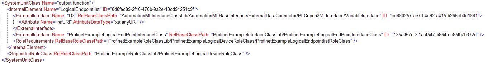

Рисунок 71 – Клас системної одиниці для прикладу логічного пристрою PROFINET 3

Таблиця 54 – Клас системної одиниці `Output function`

| Поле                | Підполе                                      | Значення                                                     |
| ------------------- | -------------------------------------------- | ------------------------------------------------------------ |
| Name                |                                              | Output function                                              |
| Description         |                                              | Функція IO, що надає доступ до сигналів виконавчих механізмів |
| LogicalEndpointlist | Role                                         | ProfinetExampleRoleClassLib/ProfinetExampleLogicalEndpointlistRoleClass |
| LogicalEndpointlist | ProfinetExampleLogicalEndPointInterfaceClass | ProfinetExampleInterfaceClassLib/ProfinetExampleLogicalEndPointInterfaceClass |
| LogicalEndpointlist | D3                                           | AutomationMLInterfaceClassLib/AutomationMLBaseInterface/ExternalDataConnector/PLCopenXMLInterface/VariableInterface |
| SupportedRoleClass  |                                              | ProfinetExampleRoleClassLib/ProfinetExampleLogicalDeviceRoleClass |


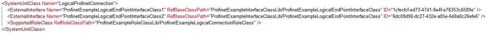

Рисунок 72 – Клас системної одиниці для прикладу логічного з’єднання PROFINET

Таблиця 55 – Клас системної одиниці `LogicalProfinetConnection`

| Поле                                            | Підполе     | Значення                                                     |
| ----------------------------------------------- | ----------- | ------------------------------------------------------------ |
| Name                                            |             | LogicalProfinetConnection                                    |
| Description                                     |             | Логічне з’єднання між логічними пристроями PROFINET          |
| ProfinetExampleLogicalEndPointInterfaceClass1–2 | ParentClass | ProfinetExampleInterfaceClassLib/ProfinetExampleLogicalEndPointInterfaceClass |
| SupportedRoleClass                              |             | ProfinetExampleRoleClassLib/ProfinetExampleLogicalConnectionRoleClass |


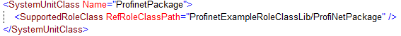

Рисунок 73 – Клас системної одиниці для прикладу комунікаційного пакета PROFINET

Таблиця 56 – Клас системної одиниці `ProfinetPackage`

| Поле               | Підполе | Значення                                                     |
| ------------------ | ------- | ------------------------------------------------------------ |
| Name               |         | ProfinetPackage                                              |
| Description        |         | PDU PROFINET, що передається через логічне з’єднання між логічними пристроями PROFINET |
| SupportedRoleClass |         | ProfinetExampleRoleClassLib/ProfinetPackage                  |

#### 6.2.4 Ієрархія екземплярів

Використовуючи визначені класи системних одиниць, можна побудувати таку ієрархію екземплярів, яка моделює приклад демонстратора PROFINET.


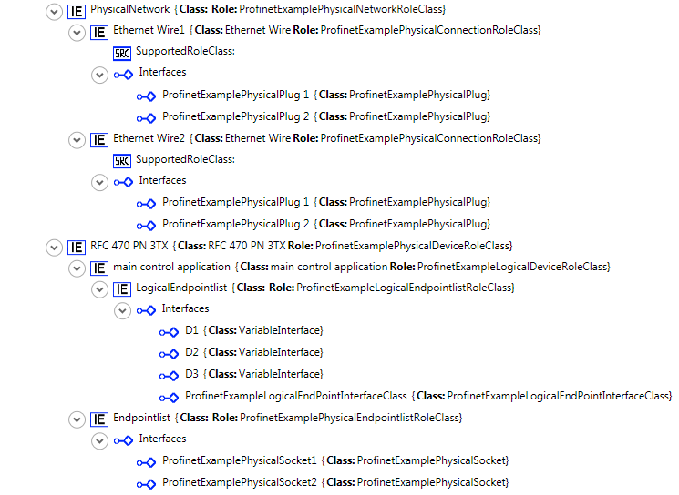

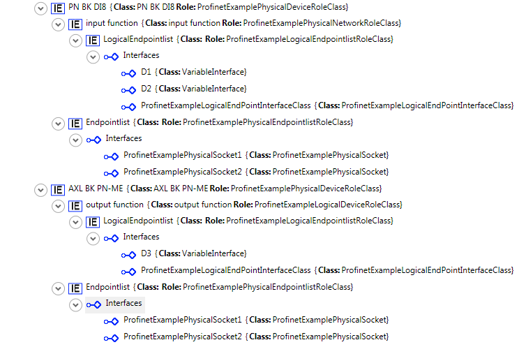

Рисунок 74 – Ієрархія екземплярів для прикладу демонстратора PROFINET

Слід зазначити, що в цьому прикладі вміст комунікаційного пакета даних ґрунтується на змінних задіяних пристроїв, змодельованих за допомогою `PLCopenXMLInterface`. Аналогічним чином для моделювання вмісту PDU можуть використовуватися і `SignalInterface`.

#### 6.2.5 Зв’язки

Для з’єднання відповідних елементів ієрархії екземплярів, наведеної в розділі 6.2.4, можуть бути використані такі внутрішні зв’язки.

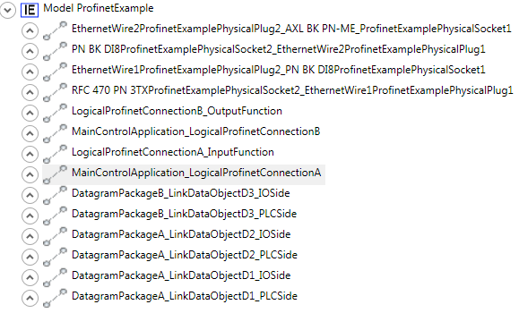

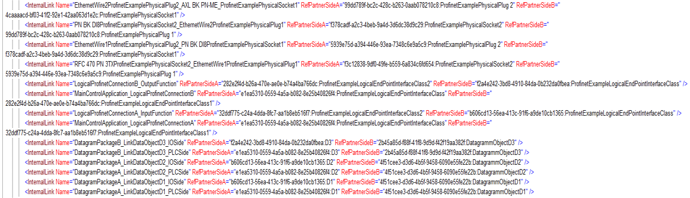

## 7 Bibliography

- [1] Object Management Group: UML Class Diagram, http://www.uml.org/, 2012
- [2] H. Zimmermann: OSI Reference Model--The ISO Model of Architecture for Open Systems Interconnection, IEEE Transactions on Communications, Volume 28, Issue 4, pp. 425-432.
- [3] H. Kagermann, W. Wahlster, J. Helbig (Editoren): Umsetzungsempfehlungen für das Zukunftsprojekt Industrie 4.0 – Deutschlands Zukunft als Industriestandort sichern, Forschungsunion Wirtschaft und Wissenschaft, Arbeitskreis Industrie 4.0, http://www.plattform-i40.de/sites/default/files/Umsetzungsempfehlungen%20 Industrie 4.0_0. pdf, last access Nov. 2013.
- [4] IEC 62714 (all parts), Engineering data exchange format for use in industrial systems engineering – AutomationML

## Джерела

1.  [Whitepaper AutomationML Communication Document Identifier: WP Comm, V 1.0.0 State: September 2014 ](https://www.automationml.org/download-archive/)


## Автори


Переклав  [Олександр Пупена](https://github.com/pupenasan). 

## Feedback

Якщо Ви хочете залишити коментар у Вас є наступні варіанти:

- [Обговорення у WhatsApp](https://chat.whatsapp.com/BRbPAQrE1s7BwCLtNtMoqN)
- [Обговорення в Телеграм](https://t.me/+GA2smCKs5QU1MWMy)
- [Група у Фейсбуці](https://www.facebook.com/groups/asu.in.ua)

Про проект і можливість допомогти проекту написано [тут](https://asu-in-ua.github.io/atpv/)