[<- До підрозділу](README.md)

# AutomationML у двох словах.

Це частковий переклад білої книги "AutomationML in a Nutshell WP AutomationML in a Nutshell, Version 1.0.0, State November 2015", оригінал якої доступний на сайті www.automationml.org а саме [тут](https://www.automationml.org/wp-content/uploads/2021/06/AutomationML-in-a-Nutshell_151104.pdf). авторів Nicole Schmidt та Arndt Lüder

## Анотація

Світ виробничих систем перебуває на переломному етапі. Зростання значущості потреб замовників та прискорення технологічного прогресу спонукають власників виробничих систем підвищувати гнучкість цих систем щодо номенклатури продукції та використання ресурсів [1]. Однак досягти такої гнучкості непросто. Потрібні нові підходи до проєктування та експлуатації виробничих систем, як це передбачено концепцією Industrie 4.0 [2], [3].

Industrie 4.0 передбачає посилену інтеграцію у багатьох напрямках, пов’язаних із виробничими системами. Вона охоплює інтеграцію різних фаз життєвого циклу виробничих систем, інтеграцію на різних рівнях керування — від польового рівня до корпоративних мереж, а також інтеграцію вздовж інженерного ланцюга виробничих систем, тобто ланцюга інженерних дій, які виконуються інженерами відповідними інженерними засобами.

Зростання гнучкості потребує збільшення частоти інженерних робіт (проєктування та перепроєктування). Тому інженерія стає вагомішою в життєвому циклі виробничої системи, адже її частка у часі та вартості в загальному життєвому циклі збільшується. Інтеграція інженерних дій та задіяних інструментів уздовж інженерного ланцюга має стати одним із засобів скорочення часу та витрат на інженерні роботи шляхом уникнення зайвого дублювання діяльності, підвищення безперервності інженерних інструментальних ланцюгів та покращення співпраці між інженерами (це лише кілька очікуваних ефектів).

Одним із засобів забезпечення інтеграції інженерних дій та інструментів уздовж інженерних ланцюгів виробничих систем, а також можливості застосування інженерних даних на етапі використання виробничої системи, є відповідний формат обміну даними. Згідно з дорожньою картою Industrie 4.0 має бути розроблено такий формат даних. У цій статті розглядається формат обміну даними AutomationML. Подано діапазон представлення даних у AutomationML, щоб можна було оцінити, чи може AutomationML бути кандидатом для реалізації інтеграції в інженерному ланцюзі виробничих систем відповідно до підходу Industrie 4.0.

## 1 Вступ

Інженерія виробничих систем є складним процесом, у якому беруть участь багато інженерів різних інженерних дисциплін, виконуючи різні інженерні дії та використовуючи або створюючи різноманітні інженерні артефакти, необхідні для того, щоб у підсумку можна було побудувати, експлуатувати та підтримувати виробничу систему [1].

Як показали різні дослідження, інженерія виробничих систем включає значну кількість людської праці [5]. Водночас багато інженерних дій доводиться повторювати в різних інженерних інструментах, оскільки відсутні належні засоби обміну даними між цими інструментами [6], [7]. Відповідно, повинні існувати засоби безвтратного обміну даними вздовж усього інженерного інструментального ланцюга.

Для забезпечення безвтратного обміну даними розглядалися різні підходи. Багато інженерних організацій і компаній розробили власні програмні рішення. Серед усіх цих підходів можна виокремити три основні філософії забезпечення безвтратного обміну даними в межах інженерних дій та інструментальних ланцюгів: філософія «One Tool For All», філософія «Best of Breed» та філософія «Integration Framework». Кожна з них потребує різних моделей даних, різних методологій і технологій обміну даними та різних програмних систем. Усі вони мають власні специфічні переваги та недоліки [8].

У межах філософії «Best of Breed» (див. рисунок 1), яку зазвичай застосовують у проєктах інженерії для малих і середніх підприємств та/або в проєктах з участю кількох компаній, а також у межах філософії «Integration Framework» (див. рисунок 2), наявні інженерні інструменти поєднуються через двосторонній обмін даними або через централізований брокер даних. Щоб забезпечити необхідний обмін даними між інженерними інструментами, які потенційно змінюватимуться, бажано застосовувати стандартизовані формати обміну даними, такі як AutomationML [9] і STEP [10]. Вони мають бути здатні охопити щонайменше більшу частину, а бажано всі дані, потрібні та/або створювані в процесі інженерії виробничих систем.

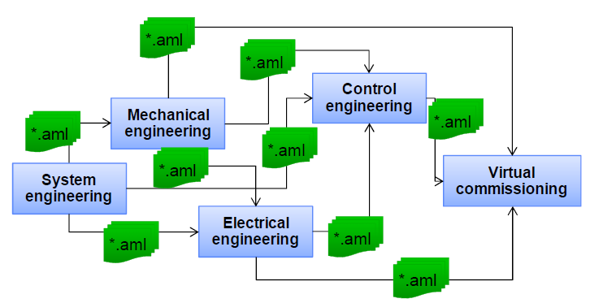

Рисунок 1 – Приклад інженерної мережі на основі підходу «Best of Breed»

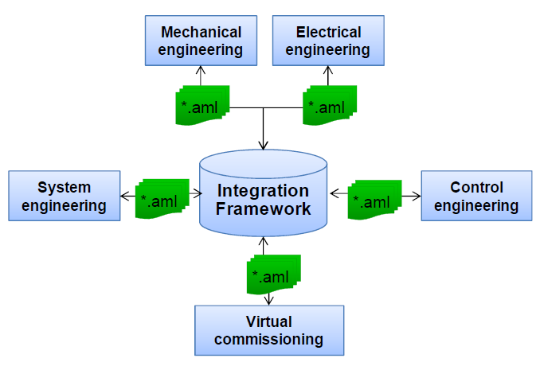

Рисунок 2 – Приклад інженерної мережі на основі підходу «Integration Framework»

Для таких форматів обміну даними необхідно виконати низку (інколи суперечливих) вимог:

- формат даних має бути придатним до різних сценаріїв застосування та гнучким щодо розширень і змін;
- подання даних має бути ефективним;
- подання даних має бути зрозумілим для людини;
- подання даних має ґрунтуватися на міжнародних стандартах.

Такі вимоги природно приводять до формату даних, заснованого на XML [6].

Як зазначено в [11], обмін даними між інженерними інструментами потребує двох рівнів стандартизації: синтаксичного та семантичного. На синтаксичному рівні визначається коректне технічне подання об’єктів даних у форматі обміну — тобто задається словник обміну даними. Натомість семантичний рівень визначає інтерпретацію об’єктів даних, тобто їх значення в концептуалізації об’єктів уздовж інженерного ланцюга.

Формати обміну даними можна визначати двома способами: або синтаксис і семантика визначаються разом, як у підході STEP, або визначаються окремо, як у підході AutomationML. Оскільки окреме визначення семантики забезпечує більшу гнучкість і придатність формату обміну даними до різних сценаріїв застосування, цей підхід видається більш доцільним.

У подальшому Automation Mark-up Language (AutomationML) буде описано детально. Буде представлено:

- які інженерні процеси й інженерні дані охоплює AutomationML у поточній версії відповідно до потреб підходу Industrie 4.0 (розділ 2),
- якою є загальна архітектура AutomationML (розділ 4),
- як AutomationML представляє топологію виробничої системи та її ієрархію системних компонентів і пристроїв (розділ 5),
- як елементи моделі AutomationML можуть бути доповнені семантичними ідентифікаціями (розділ 6),
- як AutomationML моделює геометричну інформацію та кінематику (розділ 7),
- як AutomationML моделює інформацію про поведінку (розділ 8),
- як у AutomationML моделюються мережі (розділ 9),
- як до моделей AutomationML можна додавати додаткову інформацію, пов’язану з компонентами та пристроями системи (розділ 10), і нарешті
- що слід враховувати при застосуванні AutomationML для реалізації інтеграції інженерного ланцюга відповідно до підходу Industrie 4.0 (розділ 11).

## 2 Охоплені інженерні процеси та інженерні дані

Основною сферою застосування, для якої розроблено AutomationML, є інженерія виробничих систем і введення їх в експлуатацію. Якщо врахувати життєві цикли різних систем, що входять до складу виробничих систем (виробнича система, виробнича технологія, продукт, замовлення), як це подано в [12], то релевантними фазами життєвого циклу є розроблення компонентів і технологій, відповідальне за проєктування та створення компонентів і пристроїв виробничої системи; інженерія виробничих систем, що виконує детальне проєктування виробничої системи; а також введення виробничої системи в експлуатацію, яке охоплює тестування системи, монтаж та нарощування продуктивності (див. рисунок 3). Надалі ці фази разом називатимуться процесом планування установки.

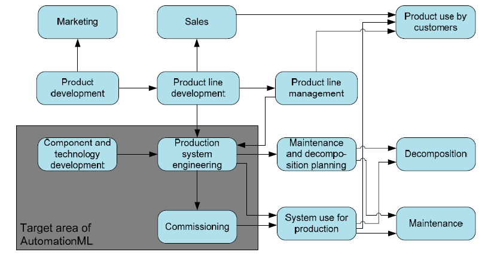

Рисунок 3 – Розглянутий інженерний процес

Зосередившись на процесі планування установки, у літературі [13] описано різні інженерні процеси, які загалом подібні між собою, але наголошують на різних аспектах залежно від потреб застосування [14]. Рисунок 4 демонструє огляд цього процесу. Він складається з п’яти фаз: аналіз, базове планування, детальна інженерія, системна інтеграція та введення в експлуатацію та використання.

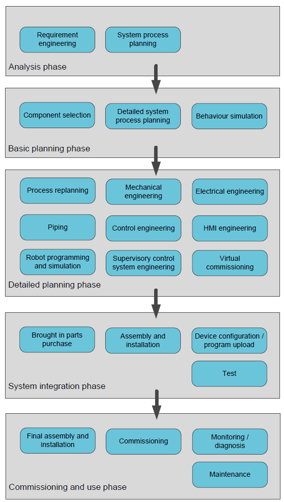

Рисунок 4 – Процес планування установки

Фаза аналізу спрямована на збирання всіх вимог до поведінки виробничої системи, що випливають із продукту, який має бути виготовлений, технологічного процесу виробництва, а також додаткових вимог, пов’язаних з економічною ефективністю, правовими аспектами, захистом довкілля тощо. Тому фаза аналізу містить діяльності з визначення вимог та планування системного процесу: визначення вимог збирає вимоги, а системне планування процесу деталізує виробничий процес, який має бути виконаний, охоплюючи всі технічні та допоміжні функції, необхідні для його реалізації. Виходами цієї фази є опис процесу виробництва, що має бути виконаний, та технічні вимоги до виробничої системи.

Фаза базового планування пов’язана з грубим проєктуванням виробничої системи без урахування деталей реалізації, таких як обмеження розміщення в цеху. Вона містить вибір компонентів, детальне системне планування процесу та моделювання поведінки. Вибір компонентів відповідає за визначення та підбір виробничих ресурсів, які будуть застосовані для реалізації виробничого процесу. З використанням вибраних компонентів виробничий процес деталізується шляхом відображення процесів ресурсів на потреби виробничого процесу й додавання всіх необхідних вторинних процесів. Тепер детальний процес на вибраних ресурсах можна змоделювати для первинної верифікації економічних вимог до виробничої системи. Результатами фази базового планування є набір вибраних компонентів установки та деталізовані процеси, які вони виконують.

Фаза детальної інженерії пов’язана з функціональною інженерією виробничої системи, що в підсумку приводить до детального опрацювання всіх частин виробничої системи з урахуванням обмежень планування цеху. Вона охоплює механічну, електричну, трубопровідну, керувальну інженерію, інженерію роботів та HMI, перепланування процесу та віртуальне введення в експлуатацію.

- Механічна інженерія створює механічну структуру виробничої системи, необхідну для фізичного виконання виробничих процесів. Тому всі фізичні частини виробничої системи, включаючи пристрої керування, вибираються та розміщуються.
- Електрична інженерія відповідає за електричне з’єднання, а також за інженерію комунікаційної системи. Вона враховує енергоживлення пристроїв та проєктування сигнальної проводки. Інженерія комунікаційних систем визначає структуру комунікаційної системи й вибирає компоненти та технології комунікації. У підсумку електрична інженерія формує сигнальні списки.
- Трубопровідна інженерія розробляє гідравлічні, пневматичні тощо системи, які забезпечують компоненти виробничої системи відповідним середовищем, включаючи труби, фітинги та блоки живлення.
- Інженерія керування реалізує необхідний керувальний код, потрібний для керування поведінкою виробничої системи.
- Програмування та моделювання роботів створює код для виконання запланованої поведінки роботів. Цей код дозволяє моделювати роботизовані комірки та тестувати код на коректність і здійсненність.
- Інженерія HMI визначає змінні як інтерфейси між операторами та машинами, проєктує та реалізує інтерфейси користувача й можливості втручання у системний процес.

Перепланування процесу виконується паралельно з усіма іншими видами діяльності цієї фази. У межах цієї роботи всі зміни постійно збираються та обробляються для адаптації компонування та процесів виробничої системи. Нарешті, віртуальне введення в експлуатацію охоплює всі програмні аналітичні дії, пов’язані з керувальним кодом, що виконуються ще до фізичного запуску системи. Виходами фази детальної інженерії є креслення MCAD та ECAD, списки пристроїв, списки проводки, інструкції з монтажу, керувальний код тощо — усе необхідне для правильного створення виробничої системи.

Фаза системної інтеграції призначена для монтажу частин виробничої системи на основі детальної інженерії попередньої фази. Необхідні частини виробничої системи закуповуються, усі компоненти збираються та монтуються, пристрої керування конфігуруються та програми завантажуються до контролерів, роботів і HMI, після чого компоненти системи тестуються. Отже, виходами фази системної інтеграції є набір попередньо встановлених і протестованих компонентів виробничої системи.

Фаза введення в експлуатацію та використання стосується остаточного розгортання виробничої системи на призначеному місці та її використання для виготовлення продукції. Під час діяльності з фінального монтажу та встановлення попередньо змонтовані компоненти переміщуються на остаточне місце, монтуються та тестуються в повній виробничій системі. Після цього система проходить етап нарощування продуктивності в діяльності з введення в експлуатацію та може бути використана. Паралельно з використанням виконуються моніторинг і діагностика, а також технічне обслуговування, необхідні для забезпечення майбутньої придатності встановленої виробничої системи та її ремонту за потреби.

Як показано на рисунку 4, різні інженерні дії залежать одна від одної, тобто потребують результатів попередніх інженерних робіт. Кожна з них використовує різні інженерні інструменти, зазвичай оптимально налаштовані для ефективного виконання необхідних робіт у межах окремої інженерної діяльності, тобто для оптимального ухвалення проєктних рішень і створення потрібних інженерних артефактів [8]. Вони ґрунтуються на власному типі моделі та власній структурі даних, оптимізованих під використання інструмента й структуру програмного забезпечення. Однак уздовж ланцюга інженерних дій складно забезпечити узгоджений і безвтратний обмін інженерними даними (цифровими інженерними артефактами або їх частинами) між інженерними інструментами [6].

Щоб забезпечити такий обмін інженерними даними одним форматом на кшталт AutomationML, цей формат має бути здатним представляти всю інженерну інформацію, яка є релевантною щонайменше для двох із названих інженерних дій. Узагальнюючи інженерні дії п’яти описаних фаз, формат обміну даними має охоплювати принаймні такі набори інформації:

- Топологічні дані. Цей набір охоплює ієрархічну структуру ресурсів виробничої системи — від рівня установки через рівні комірок і функцій до пристроїв та механічних частин [15], описові атрибути елементів ієрархії, зв’язки між цими елементами та описові атрибути цих зв’язків.
- Механічні дані. Цей набір включає механічну конструкцію виробничої системи, представлену геометрією та кінематикою. Зазвичай він задається механічними кресленнями (MCAD). Крім того, він містить фізичні властивості, такі як сили, швидкість і крутний момент, або хімічні властивості, такі як інформація про матеріали.
- Електричні, пневматичні та гідравлічні дані. Цей набір представляє повну структуру електропроводки та трубопроводів системи, розроблену засобами електротехнічної інженерії у вигляді електричних схем (ECAD) та засобами трубопровідної інженерії у вигляді планів трубопроводів. Він містить з’єднані компоненти та їх характеристичні властивості, а також з’єднання між компонентами, їх різні типи, роз’єми та їх характеристики.
- Дані, що описують функції. Цей набір охоплює інформацію, релевантну для характеристики функцій компонента виробничої системи. Він містить функціональні моделі керованої та некерованої поведінки, функціональні параметри, технологічні параметри тощо, необхідні для коректного опису виробничого процесу та інших процесів, які може виконувати компонент.
- Дані керування процесом. Цей набір містить усю інформацію, пов’язану з пристроями керування, таку як апаратна конфігурація, керувальний код, параметри керування тощо.
- Загальні дані. Цей набір узагальнює іншу організаційну, технічну, економічну та іншу інформацію, наприклад дані замовлень, посібники та інструкції.

Ці набори інформації показано на рисунку 5. AutomationML здатний представляти всі ці набори інформації, що буде продемонстровано в наступному розділі.

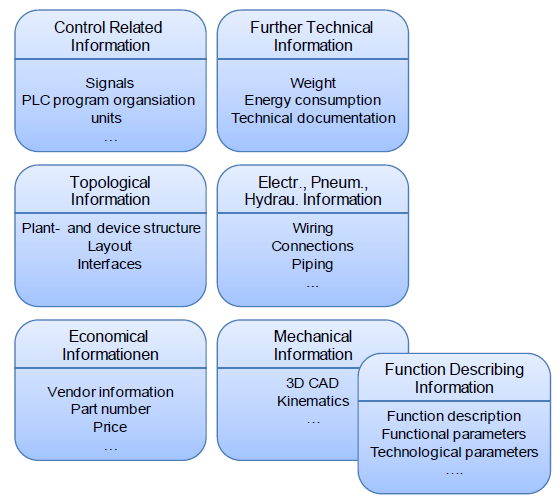

Рисунок 5 – Необхідні набори інформації

## 3 Приклад для демонстрації

У цьому розділі подано моделювання визначеної інформації. Щоб доповнити абстрактний виклад правил моделювання, для кращого розуміння використано приклад, що розгортається. Цей приклад є частиною виробничої системи лабораторного масштабу, розташованої в IAF Університету Отто-фон-Геріке в Магдебурзі. Вона складається з набору багатофункціональних машин, поворотних столів і конвеєрів та під’єднана через польові ввід-вивід модулі (Field IOs) до контролерів на базі Raspberry Pi, як показано на рисунку 6.

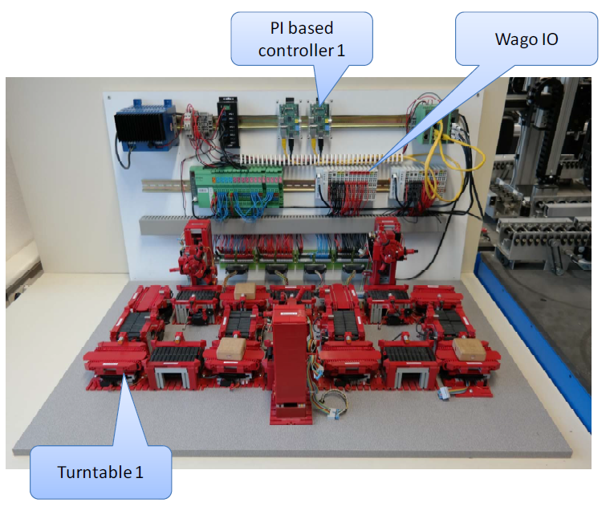

Рисунок 6 – Виробнича система лабораторного масштабу як приклад

У цій виробничій системі лабораторного масштабу використано лише невелику, але показову частину (див. рисунок 7). Вона включає один поворотний стіл, що містить принаймні два пристрої: індуктивний датчик для виявлення матеріалу та привід для обертання столу. Обидва пристрої мають принаймні один контакт (pin) для під’єднання до модульного Field-IO через провід. Цей Field-IO реалізовано за допомогою Modbus TCP Ethernet польового шинного шлюзу, який використовує контролер для доступу до фізичних входів і виходів. Field-IO, у свою чергу, під’єднаний до контролера на базі Raspberry Pi через Ethernet-кабель. На контролері Raspberry Pi виконується програма PLC, що керує поворотним столом.

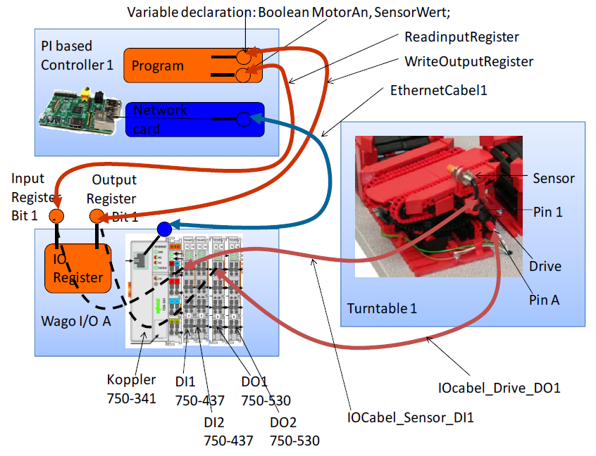

Рисунок 7 – Розглянута частина прикладу

## 4 Загальна архітектура AutomationML

Формат даних AutomationML був розроблений організацією AutomationML e.V. (див. [16]) як рішення для обміну даними, орієнтоване на інженерію автоматизаційних систем, але здатне охоплювати всю інформацію, релевантну для інженерії виробничих систем. Це відкритий, нейтральний щодо постачальників, заснований на XML і безкоштовний формат обміну даними, який забезпечує передачу інженерних даних виробничих систем між різними доменами та компаніями в неоднорідному середовищі інженерних інструментів.

AutomationML зберігає інженерну інформацію, дотримуючись об’єктноорієнтованої парадигми, і дає змогу моделювати фізичні та логічні компоненти установки як об’єкти даних, що інкапсулюють різні аспекти. Об’єкти можуть утворювати ієрархію, тобто об’єкт може складатися з підоб’єктів і сам бути частиною більшої композиції або агрегації. Крім того, кожен об’єкт може містити властивості, що описують об’єкт, охоплюючи геометрію, кінематику, логіку (послідовності, поведінку та інформацію для керування), а також інші характеристики.

AutomationML має модульну структуру, інтегруючи та розширюючи/адаптуючи різні наявні XML-формати даних під єдиним верхнім рівнем, так званим top level format (див. рисунок 8).

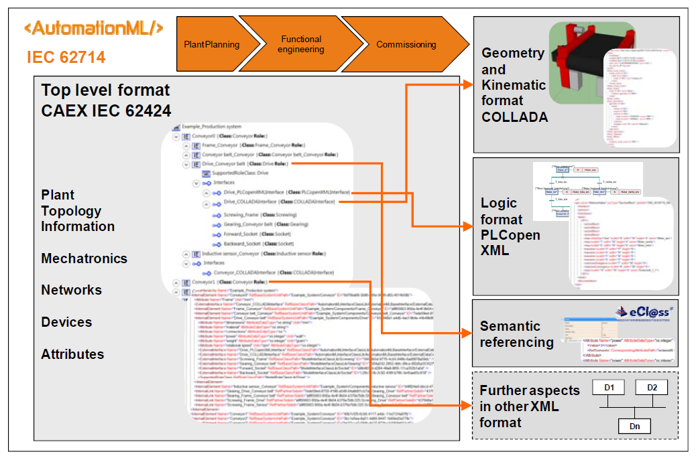

Рисунок 8 – Структура проєктів AutomationML

Ці формати даних використовуються «як є» відповідно до їхніх власних специфікацій і не модифікуються для потреб AutomationML. Логічно AutomationML поділено на такі частини:

- Опис топології компонентів і мережевої інформації, включно з властивостями об’єктів, поданий як ієрархія об’єктів AutomationML і описаний за допомогою CAEX відповідно до IEC 62424 [17].

- Опис геометрії та кінематики об’єктів AutomationML, представлений засобами COLLADA 1.4.1 і 1.5.0 (ISO/PAS 17506:2012) [18].

- Опис логічних даних, пов’язаних із керуванням, для різних об’єктів AutomationML, поданий засобами PLCopen XML 2.0 і 2.0.1 [19].

- Опис зв’язків між об’єктами AutomationML та посилань на інформацію, що зберігається в документах поза верхнім рівнем формату, за допомогою засобів CAEX.

AutomationML наразі стандартизовано в серії стандартів IEC 62714 [20]. Детальніший опис AutomationML наведено в [9] та [16].

Основою AutomationML є застосування CAEX як формату верхнього рівня та визначення відповідного способу його використання, який задовольняє всі релевантні потреби AutomationML щодо моделювання інженерної інформації виробничих систем, інтеграції трьох згаданих форматів даних — CAEX, COLLADA та PLCopen XML — і забезпечення можливості розширення в майбутньому, якщо це буде потрібно.

CAEX забезпечує об’єктноорієнтований підхід (див. рисунок 9), де семантика системних об’єктів може бути визначена за допомогою ролей, що визначаються й зберігаються у бібліотеках класів ролей. Інтерфейси між системними об’єктами можуть бути визначені за допомогою класів інтерфейсів, які задаються та зберігаються в бібліотеках класів інтерфейсів. Класи системних об’єктів можуть бути визначені за допомогою класів системних одиниць (SUC), що визначаються та зберігаються у бібліотеках класів системних одиниць. Нарешті, індивідуальні об’єкти проєкту моделюються в ієрархії екземплярів (IH) як ієрархія внутрішніх елементів (IE), які посилаються як на класи системних одиниць, від яких вони походять, так і на класи ролей, що визначають їх семантику, а також на інтерфейсні об’єкти, які використовуються для зв’язування об’єктів між собою або з інформацією, що зберігається зовні (наприклад, у файлах COLLADA або PLCopen XML). Докладніше про цю структуру можна знайти у відповідних whitepaper AutomationML, доступних за адресою [16].

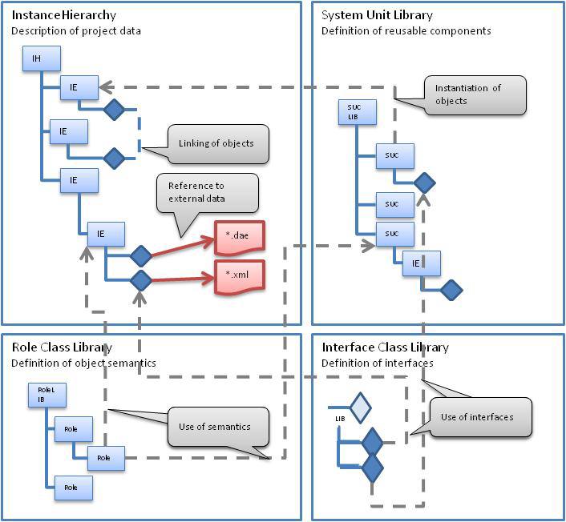

Рисунок 9 – Архітектура опису топології в AutomationML

Додатковими та ключовими особливостями AutomationML є:

- розділення синтаксису та семантики об’єктів даних на основі бібліотек класів ролей і класів системних одиниць та посилання на бібліотечні елементи з ієрархії екземплярів;
- надання можливостей ідентифікації об’єктів на основі UUID;
- надання інформації про версію, включно з її ідентифікацією та історією версій на основі відповідних атрибутів об’єктів;
- надання інформації про джерело даних на основі відповідних атрибутів об’єктів;
- надання можливостей структурування даних, що виходять за межі звичайних ієрархій об’єктів, завдяки використанню концепцій facet і group.

## 5 Топологія системи та моделювання елементів системи

Як зазначено в попередньому розділі, AutomationML використовує CAEX для моделювання топології системи та її елементів. Відповідно, AutomationML надає чотири основні засоби моделювання.

Перший засіб складається з класів ролей, зібраних у бібліотеках класів ролей. Клас ролі описує абстрактну функціональність без визначення технічної реалізації, тому його слід розглядати як індикатор семантики об’єкта. Це можуть бути, наприклад, класи ролей `MechanicalPart` і `Device`, що вказують на семантику структурних елементів системи, або `LogisticalDevice` і `PhysicalDevice`, що представляють семантику комунікаційних систем. 

AutomationML визначає набір базових класів ролей, поданий на рисунку 10. Існують бібліотека `AutomationMLBaseRoleClassLib` з фундаментальними класами ролей, визначеними в частині 1 стандарту AutomationML [20], та `CommunicationRoleClassLib`, визначена в частині 5 [16].

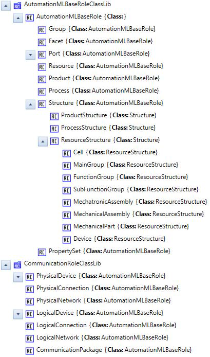

Рисунок 10 – Бібліотека AutomationML BaseRoleClass та бібліотека CommunicationRoleClass

У частині 2 стандарту AutomationML [16] визначено додаткові класи ролей. Кожен користувач AutomationML може визначати нові класи ролей відповідно до своїх сценаріїв застосування та потреб в обміні даними. AutomationML визначає лише деякі правила для створення класів ролей.

Кожен клас ролей має мати унікальне ім’я в дереві ролей бібліотеки класів ролей. Завдяки цьому його можна однозначно посилатися за шляхом у цій ієрархії. Наприклад, клас ролей `Port`, зображений на рисунку 11, має шлях ідентифікації `AutomationMLBaseRoleClassLib/AutomationMLBaseRole/Port`. Крім того, кожен клас ролей має бути прямо або опосередковано успадкований від `AutomationMLBaseRole` через атрибут `RefBaseClassPath`.

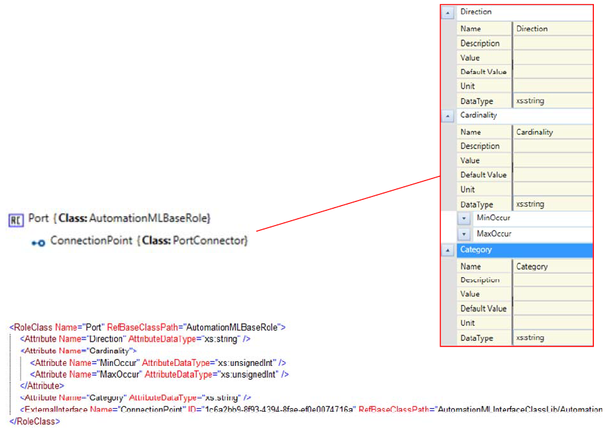

Рисунок 11 – Клас ролей Port як приклад визначення ролі

Кожен клас ролей може мати атрибути та інтерфейси. Ці атрибути та інтерфейси повинні давати змогу імпортуючому інженерному інструменту правильно інтерпретувати та опрацьовувати отриману інформацію.

Прикладом користувацького класу ролей може бути `ModbusTCPPhysicalDevice` з атрибутами `MACaddress` та `IPAddress`, як у прикладі, що розгортається. Він представляє пристрій керування, здатний до комунікації через Modbus TCP.

Другим засобом моделювання є класи інтерфейсів. Клас інтерфейсу описує абстрактний зв’язок, який елемент може мати з іншими елементами або з інформацією, що не представлена в моделі, заснованій на CAEX (див. моделювання геометрії, кінематики та поведінки). Наприклад, це можуть бути інтерфейси `SignalInterface` та `PhysicalEndPoint`, що вказують на інтерфейси для обробки сигналів або підключення кабелів, або `ExternalDataConnector`, що представляє зв’язок з інформацією, збереженою зовні.

AutomationML визначає набір базових інтерфейсів, показаний на рисунку 12. 

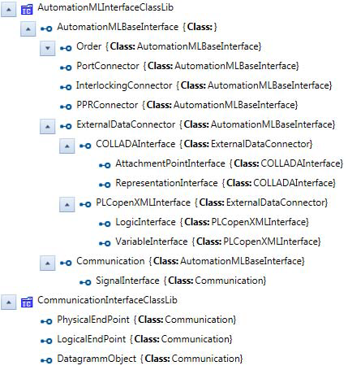

Рисунок 12 – Бібліотека AutomationML `InterfaceClass` та бібліотека `CommunicationInterfaceClass`

Існують бібліотека `AutomationMLInterfaceClassLib` з фундаментальними інтерфейсами, визначеними в частині 1 [20], та `CommunicationInterfaceClassLib`, визначена у майбутній частині 5 [16]. Кожен користувач AutomationML може визначати нові класи інтерфейсів відповідно до своїх потреб. AutomationML визначає лише деякі правила щодо створення класів інтерфейсів:

- Кожен клас інтерфейсу має мати унікальне ім’я в дереві класів інтерфейсів відповідної бібліотеки, щоб до нього можна було однозначно звертатися за ієрархічним шляхом. Наприклад, клас інтерфейсу `COLLADAInterface` на рисунку 13 має шлях `AutomationMLInterfaceClassLib/AutomationMLBaseInterface/ExternalDataConnector/COLLADAInterface`
- Кожен клас інтерфейсу має бути прямо або опосередковано успадкований від `AutomationMLBaseInterface` за допомогою атрибута `RefBaseClassPath`.
- Клас інтерфейсу може мати атрибути, які мають бути заповнені в кожному екземплярі цього інтерфейсу.

Прикладом користувацького класу інтерфейсу може бути `ModbusTCPSocket`, який у наведеному прикладі представляє точку підключення Ethernet-кабелю для пристрою керування, здатного до комунікації через Modbus TCP.

Рисунок 13 – Клас `COLLADAInterface` як приклад визначення інтерфейсу

Третім засобом моделювання є класи системних одиниць (`system unit classes`). Класи системних одиниць можна розглядати як багаторазові компоненти системи або як шаблони для моделювання системи. Залежно від точки зору, вони зазвичай представляють або залежну від постачальника бібліотеку компонентів чи пристроїв, або набір шаблонів, що використовуються інженерним інструментом для структурування модельної інформації конкретної дисципліни.

У стандарті AutomationML не визначено базову бібліотеку класів системних одиниць. Таким чином, створення таких бібліотек покладається на користувача. AutomationML визначає лише деякі правила:

- Кожен клас системної одиниці має мати унікальне ім’я.
- Кожен клас системної одиниці має мати принаймні один призначений клас ролей, який надає цьому класу системної одиниці семантику (через елемент `SupportedRoleClass`).
- Клас системної одиниці може мати підоб’єкти типу `InternalElement`, атрибути та інтерфейси, що представляють структуру моделюваного класу об’єктів, його властивості та можливі зв’язки.
- Клас системної одиниці може бути успадкований від іншого класу системної одиниці через атрибут `RefBaseClassPath`. У такому разі він успадковує всі підтримувані класи ролей, підоб’єкти, інтерфейси та атрибути.

Приклад бібліотеки системних одиниць наведено на рисунку 14, а приклад користувацького класу Motor — на рисунку 15.

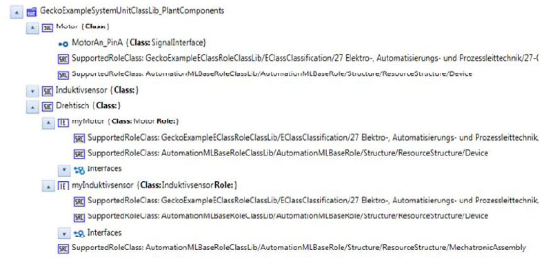

Рисунок 14 – Приклад бібліотеки класів системних одиниць

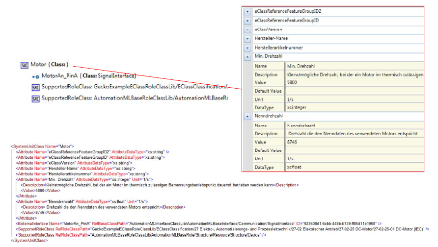

Рисунок 15 – Клас Motor як приклад визначення класу системної одиниці

Усі концепції моделювання можуть мати атрибути. Атрибути розглядаються як властивості, які можна призначати класам ролей, класам інтерфейсів, класам системних одиниць та внутрішнім елементам.

AutomationML визначає правила для атрибутів:

- кожен атрибут має мати унікальне ім’я в межах свого батьківського елемента;
- він може мати DataType, Unit та підоб’єкти опису, типового значення, значення та семантичного посилання.

Приклад користувацького атрибута наведено на рисунку 16.

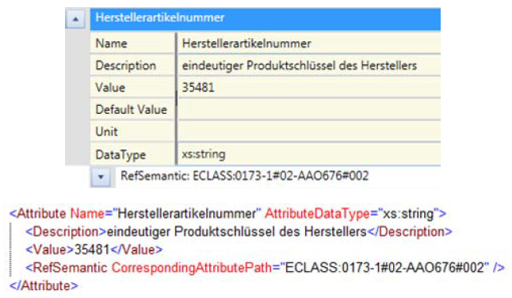

Рисунок 16 – Атрибут Herstellerartikelnummer як приклад визначення атрибута

Найважливішим засобом моделювання є `InstanceHierarchy` з інтегрованою ієрархією `InternalElements`. Саме вона представляє фактичні інженерні дані, які моделюються засобами CAEX відповідно до об’єктноорієнтованої й ієрархічної структури.

Основним робочим елементом у представленні фактичних інженерних даних є `InternalElement`. Він є представником об’єкта виробничої системи, що моделюється. Залежно від рівня абстракції це може бути фізичний компонент, як-от уся установка, функціональний компонент, наприклад машина чи поворотний стіл, пристрій — привід або контролер, або просто механічна частина — конвеєрна стрічка чи провід. Також `InternalElement` може представляти логічні компоненти, як-от програму PLC, опис продукту або замовлення.

`InternalElements` в `InstanceHierarchy` здебільшого визначаються користувачем. Вони можуть містити атрибути та екземпляри інтерфейсів, успадкованих від будь-якого класу інтерфейсів. Вони можуть посилатися на клас системної одиниці з будь-якої бібліотеки системних одиниць за допомогою атрибута `RefBaseSystemUnitPath`. Це посилання визначає відповідний клас системної одиниці як батьківський, від якого походить `InternalElement`, і тим самим визначає клас системної одиниці як шаблон для `InternalElement`. У результаті `InternalElement` має мати ту саму підструктуру, інтерфейси та атрибути, що й клас системної одиниці. Крім того, `InternalElement` має посилатися принаймні на один (але можливо і кілька) клас ролей з будь-якої бібліотеки класів ролей. Для цього використовуються підоб’єкти `RoleRequirements` і `SupportedRoleClass`. Посилання на клас ролей визначає семантику `InternalElement`. Структуру `InternalElement` показано на рисунку 17.

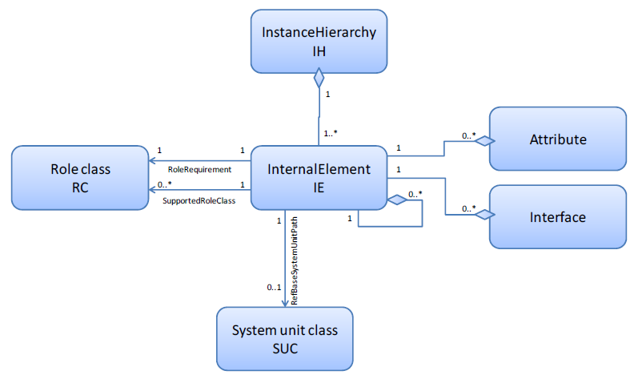

Рисунок 17 – Спрощена структура InstanceHierarchy

Приклад `InternalElement` наведено на рисунку 18. Він показує провід, що з’єднує привід із польовим IO. Цей `InternalElement` має кілька атрибутів, наприклад `Polzahl`, який визначає кількість жил у проводі, та `min. zulässige Kabelaußentemperatur`, що визначає мінімально допустиму температуру поверхні кабелю. Крім того, він має два інтерфейси, які представляють обидва кінці дроту.

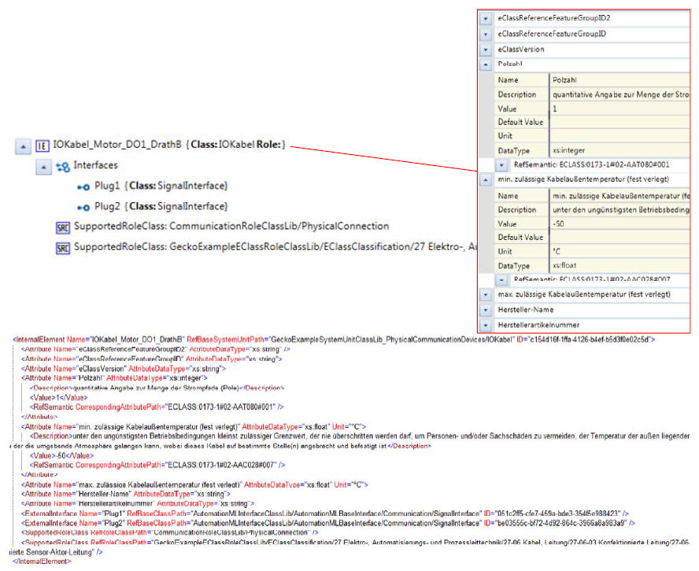

Рисунок 18 – IOKabel_Motor_DO1_DrathB як приклад InternalElement

Приклад `InstanceHierarchy` для демонстраційного прикладу наведено на рисунку 19. Тут показано ієрархію фізичних і логічних сутностей — від найвищого `InternalElement` `FlexibleManufacturingSystem`, через `InternalElements`, що представляють поворотний стіл (`Drehtisch1`), польовий IO-модуль (`WagoIOA`) і контролер (`PIBasedControllerA`), і аж до `InternalElements`, що представляють керувальну програму (`MyPIProgram`), привід (`myMotor`) або дроти (`IOKabel_Motor_DO1_DrathB`).

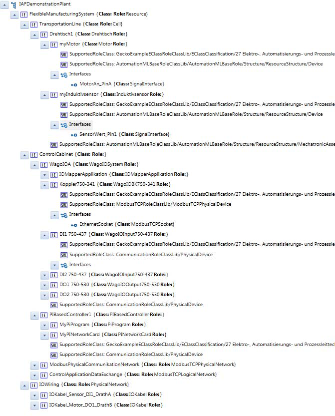
 Рисунок 19 – Ієрархія екземплярів (фрагмент) для прикладу

## 6 Інтеграція семантики об’єктів

Критичним моментом під час імпорту даних у інженерні інструменти є відображення отриманих даних на модель даних інструмента-імпортера. Тому для кожного даного елементу потрібно визначити, яку семантику він має в контексті інструмента, що імпортує дані.

Під час імпорту даних, заснованих на AutomationML, передані дані подаються в `InstanceHierarchy` або як `InternalElements`, або як атрибути.

Для визначення семантики `InternalElements` AutomationML надає два основні механізми:

- посилання на класи ролей,
- посилання на класи системних одиниць.

Для посилання на класи ролей використовуються підоб’єкти `RoleRequirements` і `SupportedRoleClass`. У них може бути повне ім’я класу ролей, включно зі шляхом до нього. Для представлення семантики атрибута застосовується підатрибут `RefSemantic`, який має кожен атрибут AutomationML. На рисунку 20 узагальнено всі ці засоби для подання семантики.

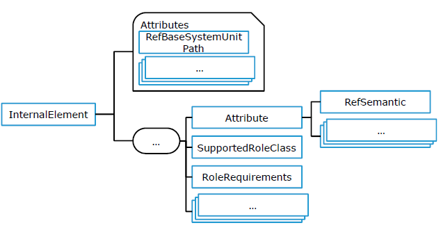

Рисунок 20 – Засоби семантичної інтеграції у InternalElements та атрибутах

AutomationML не визначає семантику компонентів виробничої системи самостійно. Натомість він інтегрує наявні семантичні системи, такі як класифікаційний стандарт eCl@ss [21].

eCl@ss — це ієрархічна семантична система для групування матеріалів, продукції та послуг згідно з логічною структурою з рівнем деталізації, що відповідає властивостям продукції, описуваним стандартними характеристиками. eCl@ss класифікує матеріали, продукти та послуги, забезпечуючи однозначну ідентифікацію класів компонентів виробничих систем, наприклад типів пристроїв або монтажних матеріалів. Для кожного класу визначено стандартизовані властивості, придатні для опису індивідуальних характеристик екземплярів цього класу.

Ключовим елементом специфікації eCl@ss є IRDI (International Registration Data Identifier), заснований на стандартах ISO/IEC 11179-6, ISO 29002 та ISO 6532. IRDI забезпечує унікальний ідентифікаційний код для кожного атрибута та кожного класу об’єктів.

Щоб прив’язати семантику атрибута, AutomationML використовує посилання на IRDI властивостей eCl@ss. Для цього атрибут `CorrespondingAttributePath` елемента `RefSemantic` у схемі CAEX має формуватися як рядок “ECLASS: ” + IRDI властивості eCl@ss, що визначає семантику атрибута AutomationML.

На рисунку 21 наведено приклад використання `RefSemantic` для задання семантики атрибута AutomationML. Тут подано атрибут max. `Versorgungsspannung`, що представляє максимально допустиму напругу живлення індуктивного датчика. Семантику цього атрибута визначає IRDI 0173-1#02-AAC962#006.

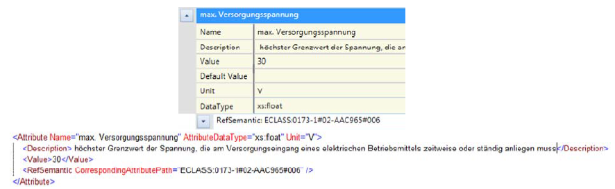

Рисунок 21 – Приклад семантичного подання атрибутів

Семантичне подання `InternalElements` є складнішим. Воно використовує поняття класів ролей. Класифікація з відповідного стандарту (у цьому випадку eCl@ss) моделюється як бібліотека класів ролей, створена користувачем AutomationML. Таким чином, зберігається ієрархічна структура класифікації, а кожен похідний клас ролей має мати три атрибути, потрібні для ідентифікації класу: інформацію про версію стандарту, ідентифікатор класу та IRDI класу. Приклад такої бібліотеки для демонстраційного прикладу наведено на рисунку 22.

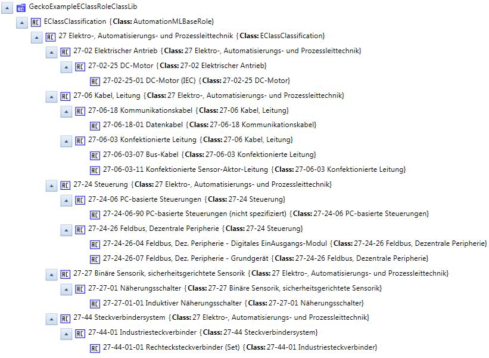

Рисунок 22 – Приклад бібліотеки класів ролей для семантичного подання

Створені класи ролей потім прив’язуються до `InternalElements` через `RoleRequirements` і `SupportedRoleClass`. Приклад для приводу з демонстраційного прикладу наведено на рисунку 23. Тут показано, що `InternalElement` `myMotor` позначено як IEC-тип двигуна постійного струму з ідентифікацією класу 27-02-25-01.

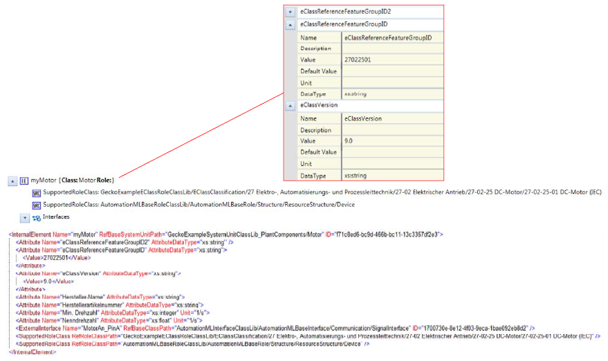

Рисунок 23 – Приклад семантичного подання для InternalElements

## 7 Геометрія та кінематика

Як зазначалося вище, AutomationML використовує міжнародний стандарт COLLADA 1.4.1 і 1.5.0 для представлення інформації про геометрію та кінематику, який стандартизовано як ISO/PAS 17506:2012 [18]. Для цього AutomationML розробив двоетапний процес. Спочатку релевантні геометрії та кінематика моделюються як файли COLLADA. Потім ці файли та об’єкти даних у них посилаються з файлу CAEX.

COLLADA розшифровується як COLLAborative Design Activity. Вона була розроблена асоціацією KHRONOS під керівництвом Sony як проміжний формат у сфері створення цифрового контенту ігрової індустрії. Формат призначений для представлення 3D-об’єктів у 3D-сценах, охоплюючи всі релевантні візуальні, кінематичні та динамічні властивості, необхідні для анімації об’єктів.

COLLADA [26] є XML-форматом даних із модульною структурою, що дає змогу визначати бібліотеки візуальних і кінематичних елементів. Вона може містити бібліотеки геометрій, матеріалів, джерел світла, камер, візуальних сцен, кінематичних моделей, кінематичних сцен тощо. Приклад файла COLLADA наведено на рисунку 24. Верхнє ліве зображення — це реальний конвеєр із демонстраційного прикладу, нижнє ліве — відповідна модель, а праве зображення — файл COLLADA цієї моделі.

Найважливішою властивістю, що забезпечує інтеграцію файлів COLLADA у проєкти AutomationML, є наявність унікальних ідентифікаторів об’єктів у файлі COLLADA. Ряд об’єктів у цьому файлі мають унікальний ID, наприклад геометрії, візуальні сцени, кінематичні моделі та кінематичні сцени.

Для посилань на ці об’єкти AutomationML визначає спеціальний клас інтерфейсу в AutomationMLInterfaceClassLib під назвою COLLADAInterface, який застосовується для створення потрібних інтерфейсів для інтеграції геометрії. Цей клас інтерфейсу (див. рисунок 25) успадкований від класу ExternalDataConnector і має атрибут refURI. Цей атрибут використовується для посилань на файл COLLADA, вказуючи на ID об’єкта, змодельованого у цьому файлі. Значення refURI має бути рядком виду:
 `file:///filename.dae#ID`
 Атрибут refType використовується для визначення способу вбудовування об’єкта в сцену моделі, що дає змогу моделювати приєднання об’єктів, наприклад деталі, прикріпленої до конвеєрної стрічки та такої, що рухається разом із нею.

Рисунок 24 – Приклад файла COLLADA (фрагмент)

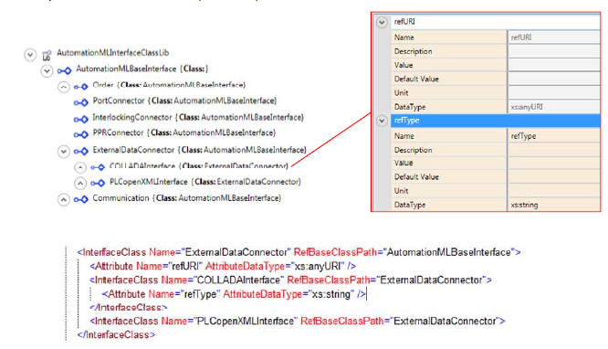

Рисунок 25 – Визначення класу інтерфейсу COLLADAInterface

Приклад інтеграції геометрії у проєкт AutomationML показано на рисунку 26. Тут видно, як клас системної одиниці Motor може бути доповнений геометричним представленням.

Звичайно, InstanceHierarchy може містити більше ніж один InternalElement із призначеною геометрією. Щоб забезпечити правильне розташування цих геометрій у загальній композиції, кожен InternalElement може мати атрибут, який задає положення призначеної геометрії відносно системи координат батьківського елемента. Цей атрибут frame, показаний на рисунку 27, дає змогу визначати зсув геометрії в напрямках x, y, z, а також обертання довкола цих осей.

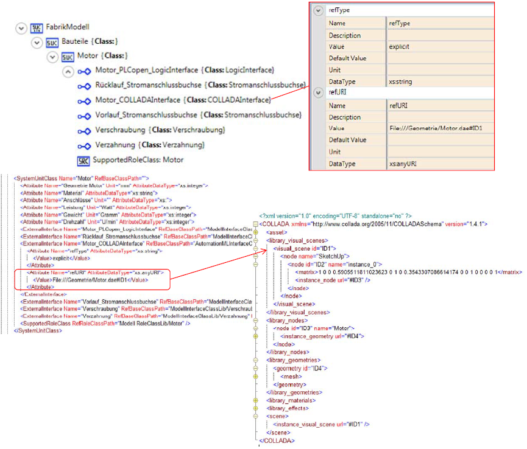

Рисунок 26 – Приклад інтеграції геометрії

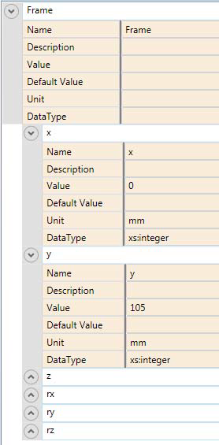

Рисунок 27 – Приклад атрибута Frame

## 8 Моделювання поведінки

Так само, як під час моделювання геометрії та кінематики, для представлення поведінки AutomationML використовує додатковий XML-формат даних під назвою PLCopen XML [19], розроблений асоціацією PLCopen. AutomationML також застосовує двоетапний процес: спочатку релевантна поведінка моделюється як файли PLCopen XML, а потім ці файли та об’єкти даних у них посилаються з файла CAEX.

PLCopen — це незалежна від постачальника та продукту міжнародна асоціація, мета якої полягає у вирішенні питань, пов’язаних із програмуванням систем керування, для підтримки використання міжнародних стандартів у цій сфері. Вона особливо просуває стандарт IEC 61131-3 для промислового програмування контролерів. Формат PLCopen XML було розроблено як відкритий інтерфейс між різними програмними середовищами для передавання проєктної інформації програм PLC на інші платформи. AutomationML використовує версію 2.01 схеми PLCopen XML, опубліковану в травні 2009 року. Ця версія охоплює більшість стандарту IEC 61131-3 другого видання.

Файл PLCopen XML структурований таким чином, щоб відображати всі основні частини проєкту програмування PLC за IEC 61131. Він містить інформацію про інструмент, програмний код зі збереженням структури програми та інформацію про апаратне забезпечення PLC. Найважливішим для AutomationML є представлення програмних організаційних одиниць (POU), як показано на рисунку 28. Кожен POU описує одну структурну одиницю програми PLC, що містить вихідний код у одному з п’яти мов програмування IEC 61131 та оголошення змінних. Кожен із цих елементів може мати глобальний ідентифікатор, за допомогою якого його можна однозначно ідентифікувати.

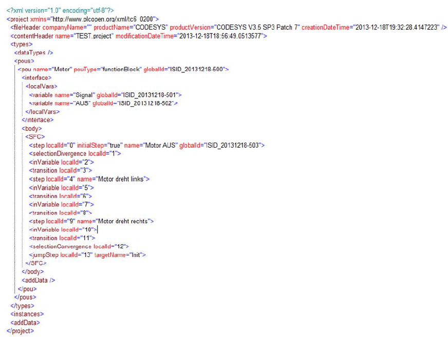

Рисунок 28 – Приклад файла PLCopen XML

Оскільки AutomationML має охоплювати повний інженерний процес виробничої системи, слід враховувати різні рівні моделювання поведінки. Як показано на рисунку 29, вони варіюються від абстрактного планування процесів, змодельованого як послідовності у вигляді діаграм Ґантта або PERT, через моделювання послідовностей і взаємних блокувань сигналів польових пристроїв за допомогою імпульсних діаграм та логічних мереж, і аж до детального подання коду у вигляді програм PLCopen або детального моделювання поведінки компонентів на основі автомата за підходом діаграм станів Харела [22].

AutomationML вирішив не використовувати всі мови програмування IEC 61131 для представлення поведінки. Оскільки більшість релевантних типів моделей описують дискретні динамічні системи, було прийнято рішення представляти моделі послідовностей за допомогою SFC (Sequential Function Charts). Тому AutomationML визначає правила перетворення, які відображають засоби моделювання перелічених типів моделей у модельні елементи SFC. Докладніше це описано в [9], [16] та [22]. Для представлення логічних мереж застосовуються FBD (Function Block Diagrams). І SFC, і FBD можуть бути виражені у PLCopen XML.

Рисунок 29 – Типи моделей, які охоплюються логічним описом AutomationML

Для посилання на вміст файлів PLCopen AutomationML визначає спеціальний клас інтерфейсу в AutomationMLInterfaceClassLib під назвою `PLCopenXMLInterface`, який використовується для створення потрібних інтерфейсів для інтеграції поведінки. Цей клас інтерфейсу (див. рисунок 30) також успадковується від `ExternalDataConnector` і містить атрибут `refURI`. Цей атрибут можна використати для посилання на файл PLCopen XML, указуючи на `globalID` або всього POU, або змінної, що використовується в цьому POU. Значення `refURI` повинно мати структуру:
 `file:///filename.xml#globalID`

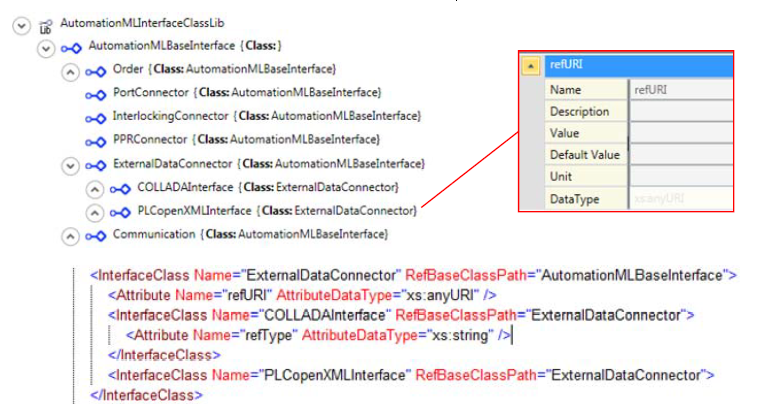

Рисунок 30 – Визначення класу інтерфейсу PLCopenXMLInterface

Приклад інтеграції моделі поведінки у проєкт AutomationML наведено на рисунку 31. Він показує, як клас системної одиниці `Motor` може бути доповнений описом своєї поведінки.

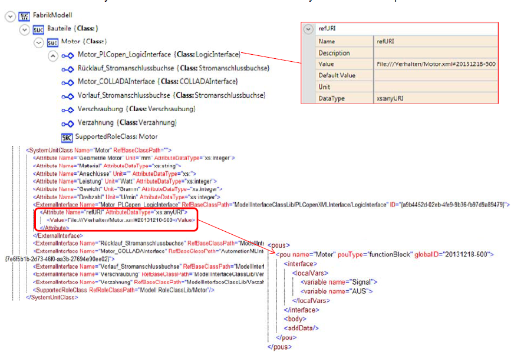

Рисунок 31 – Приклад інтеграції поведінки

## 9 Моделювання мереж

Виробничі системи можуть містити різні типи мереж — електричні та трубопровідні мережі, мережі зв’язку або транспортні мережі. Усі ці мережі мають спільну властивість: їх можна представити структурою, заснованою на графах. Тому AutomationML розробив методологію моделювання структур на основі графів і застосував її до різних типів мереж [24].

Граф G = (V(G), E(G)) визначається двома непорожніми множинами: множиною вершин V(G) та множиною ребер E(G). Ці множини мають властивість E(G) ⊆ V(G) × V(G), тобто ребра з’єднують пари вершин [25]. Якщо до об’єктів графа додається інформація, її можна вважати мітками відповідних об’єктів. Мітки можуть мати різний вигляд — наприклад, дійсні числа або текстові поля. Для побудови моделей графів такі мітки є одним із найважливіших елементів. Для промаркованих графів визначення розширюється. Промаркований граф LG = (V(G), E(G), L1, L2) — це граф із двома додатковими відображеннями L1 та L2. Існують множини анотацій A1 та A2 такі, що

- L1 : V(G) → A1 відображає вершини у множину анотацій 1,
- L2 : E(G) → A2 відображає ребра у множину анотацій 2.

Вихідною точкою для моделювання графів є визначення правил перетворення, які відображають об’єкти графа — вершини та ребра — у об’єкти AutomationML засобами CAEX. Таким чином, створюється InternalElement, який представляє весь граф. Характеристики та додаткова інформація, що описує граф (тобто мітки), можуть бути додані до цього елемента як атрибути. Потім елементи множини вершин і множини ребер створюються як нащадки батьківського елемента графа.

Спочатку всі вершини графа та їхні мітки трансформуються у вигляді InternalElement та його атрибутів. Далі ребра моделюються схожим чином. Для більшої ясності рекомендується створювати об’єкти ребер як дочірні елементи окремого InternalElement, що представляє множину ребер. Для вираження зв’язків між вершинами та ребрами використовуються інтерфейси. Тому кожен InternalElement, що представляє вершину, має стільки інтерфейсів, скільки ребер до нього інцидентні, а кожен InternalElement, що представляє ребро, зазвичай має два інтерфейси. Інтерфейси інцидентних вершини та ребра з’єднуються внутрішніми зв’язками. Приклад наведено на рисунку 32.

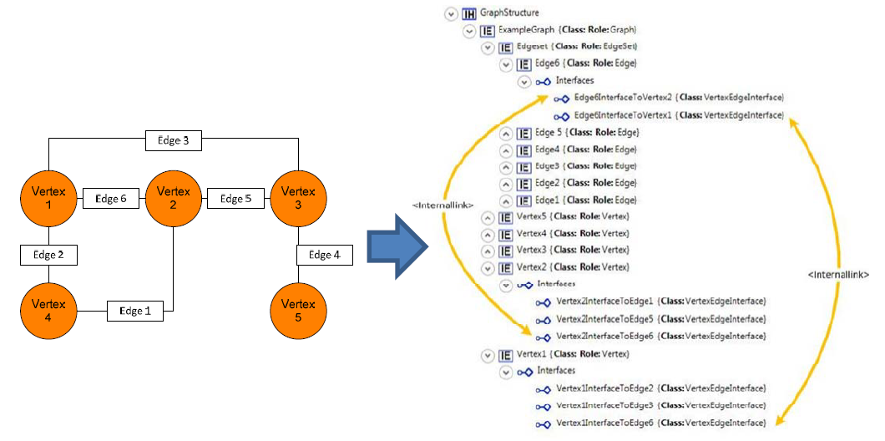

Рисунок 32 – Приклад моделі графа в AutomationML

Першим AutomationML застосував цю методологію для моделювання мереж зв’язку. Тому були визначені всі релевантні об’єкти, які потрібно моделювати як структуру графа, визначені відповідні класи ролей та інтерфейсів і запропонована методика моделювання (див. частину 5 [16]).

Кожну мережу зв’язку розглядають на двох рівнях:

-  логічний рівень,
-  фізичний рівень.

Логічний рівень складається з будівельних блоків прикладних програм керування, які забезпечують різні функції процесу керування та утворюють логічні пристрої. Зазвичай ці логічні пристрої мають обмінюватися різними типами інформації, що моделюється як кінцеві точки логічних пристроїв. Сам обмін інформацією здійснюється через логічні з’єднання. Логічна мережа містить об’єкти з різними характеристиками — наприклад, у логічних пристроїв можуть бути унікальні ідентифікатори, цикли виконання, обсяг пам’яті; у кінцевих точок — тип даних; у логічних з’єднань — вимоги до пропускної здатності. Усі ці властивості розглядаються як атрибути.

На фізичному рівні знаходять фізичні пристрої. Вони мають фізичні кінцеві точки — мережеві інтерфейси, такі як роз’єми. Вони з’єднані фізичними з’єднаннями. На відміну від логічного рівня, на фізичному є додаткові об’єкти, такі як комутатори. Фізичні пристрої можуть мати характеристики процесора або ідентифікатори, фізичні кінцеві точки — адресу або максимальну швидкість, а фізичні з’єднання — тип проводу, можливу швидкість передавання або номер документації. Усі ці властивості також моделюються як атрибути.

Обидва рівні потрібно об’єднати для отримання повного опису мережі. Логічні пристрої розміщують на фізичних пристроях. Фізичні та логічні інтерфейси відображаються один на один. Кожне логічне з’єднання віртуально відображається на набір фізичних з’єднань, які його реалізують. Не завжди існує унікальний ланцюг фізичних з’єднань — як і в деяких технологіях зв’язку. Результуючу структуру показано на рисунку 33.

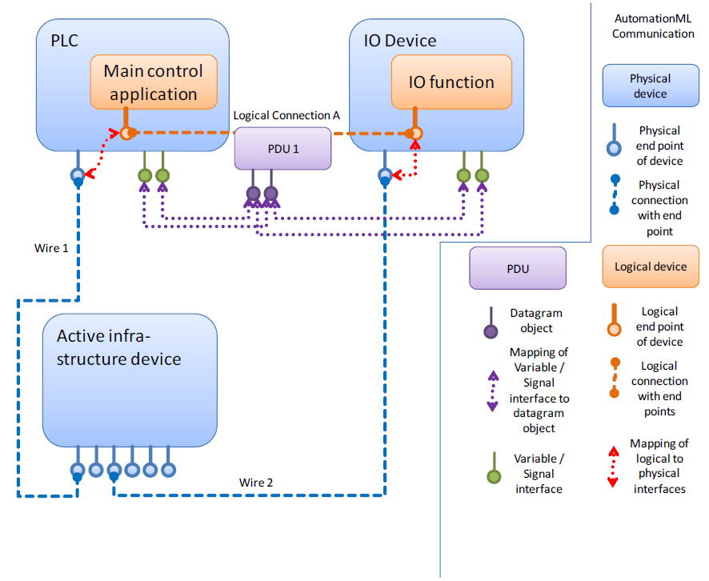

Рисунок 33 – Структура комунікаційної системи, представлена AutomationML

У комунікаційних системах між частинами прикладної програми керування обмінюються комунікаційні датаграми (Protocol Data Units / PDU). Вони належать логічним з’єднанням. Кожна PDU містить інформацію керування (сигнали датчиків і виконавчих механізмів, стани, тривоги тощо) та моделюється в AutomationML інтерфейсами типу PLCopenXMLInterface (див. вище). Тому кожне логічне з’єднання має містити об’єкти PDU, які передаються через це з’єднання. Кожен об’єкт PDU з’єднаний з PLCopenXMLInterface або SignalInterface, що моделює його вміст.

Основою методики моделювання комунікаційної системи в AutomationML є визначення бібліотеки класів ролей та бібліотеки класів інтерфейсів, а також похідних класів ролей та інтерфейсів для конкретних застосувань. Бібліотека класів ролей зв’язку містить ролі для позначення InternalElements як фізичних пристроїв, фізичних з’єднань та фізичних мереж, а також як логічних пристроїв, логічних з’єднань, логічних мереж і комунікаційних пакетів. Бібліотека інтерфейсів зв’язку містить інтерфейси для фізичних кінцевих точок, логічних кінцевих точок та об’єктів датаграм. Обидві бібліотеки показано у верхній частині рисунку 34 (CommunicationRoleClassLib та CommunicationInterfaceClassLib).

На їх основі можна створювати спеціалізовані класи для конкретних технологій зв’язку. Приклад — нижня частина рисунку 34, де наведено ModbusTCPRoleClassLib та ModbusTCPInterfaceClassLib.

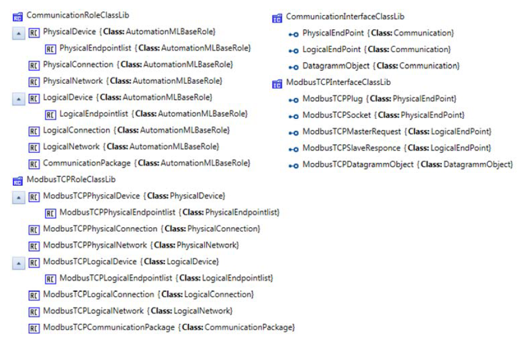

Рисунок 34 – Основні класи ролей і інтерфейсів та похідні спеціалізовані класи для моделювання комунікаційної системи

Визначені бібліотеки класів ролей та інтерфейсів використовуються для створення класів системних одиниць, що відповідають фізичним і логічним пристроям та з’єднанням. Для унікальної семантичної ідентифікації цих класів використано відповідні класи ролей.

Кожен фізичний пристрій містить стільки фізичних кінцевих точок, скільки фізичних портів він має; вони об’єднані в Endpointlist. Кожен логічний пристрій має стільки логічних кінцевих точок, скільки має логічних точок доступу прикладної програми; вони також об’єднані в Endpointlist.

Кожне фізичне з’єднання має дві кінцеві точки (якщо це кабель), а кожне логічне з’єднання — стільки логічних кінцевих точок, скільки пристроїв воно з’єднує (дві для master–slave, більше для multicast).

Для подання спеціальних властивостей класів системних одиниць використовуються атрибути.

Для подання PDU створюються відповідні класи системних одиниць, що мають роль, похідну від CommunicationPackage. Усередині них створюються інтерфейси, похідні від DatagrammObject, для кожного інформаційного об’єкта. Властивості PDU та датаграм задаються атрибутами. Така бібліотека системних одиниць для демонстраційного прикладу наведена на рисунку 35.

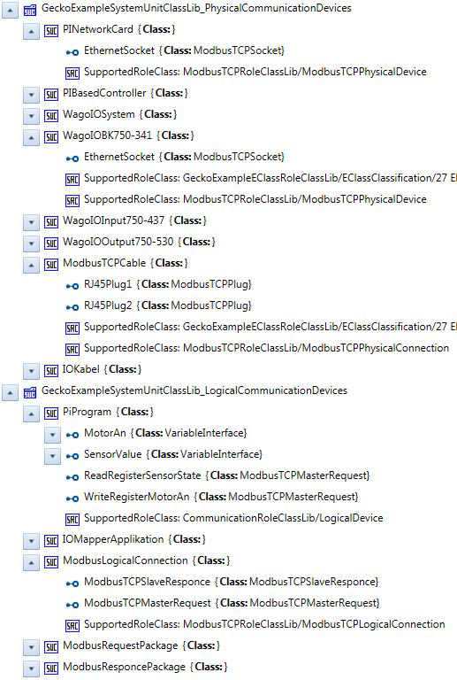

Рисунок 35 – Бібліотека класів системних одиниць для PDU (приклад)

Далі моделюється сама мережа. Потрібні фізичні та логічні пристрої створюються як InternalElements у відповідній InstanceHierarchy. Особливо важливо зберегти ієрархічну структуру моделі, що показано в рисунку 36, де логічний пристрій MyPIProgram знаходиться всередині фізичного пристрою PIBasedController1.

Після визначення всіх пристроїв необхідно заповнити їхні релевантні атрибути відповідними значеннями.

Коли пристрої повністю описані, їх можна з’єднати за допомогою з’єднань. Для цього в InstanceHierarchy мережі створюються два InternalElement: один для фізичної мережі та один для логічної мережі. Кожен з них реалізує клас ролей, успадкований відповідно від PhysicalNetwork та LogicalNetwork. Вони є контейнерами для всіх фізичних і логічних об’єктів з’єднань.

Для кожного фізичного з’єднання створюється InternalElement із класом ролей, успадкованим від PhysicalConnection. Він доповнюється відповідними атрибутами та їхніми значеннями. Для кожного логічного з’єднання створюється InternalElement із класом ролей, успадкованим від LogicalConnection, який також доповнюється потрібними атрибутами та значеннями.

Після того як усі необхідні пристрої та з’єднання створені, вони з’єднуються за допомогою InternalLinks. Для кожного логічного пристрою та кожного логічного з’єднання, які взаємодіють, відповідні логічні кінцеві точки з’єднуються внутрішнім зв’язком. Аналогічно, для кожного фізичного пристрою та кожного фізичного з’єднання, що пов’язані між собою, відповідні фізичні кінцеві точки з’єднуються внутрішнім зв’язком. Для відображення логічних кінцевих точок на фізичні кінцеві точки, які реалізують відповідні з’єднання, також застосовуються внутрішні зв’язки. Для прикладу, який розгортається, така структура показана на рисунку 37.

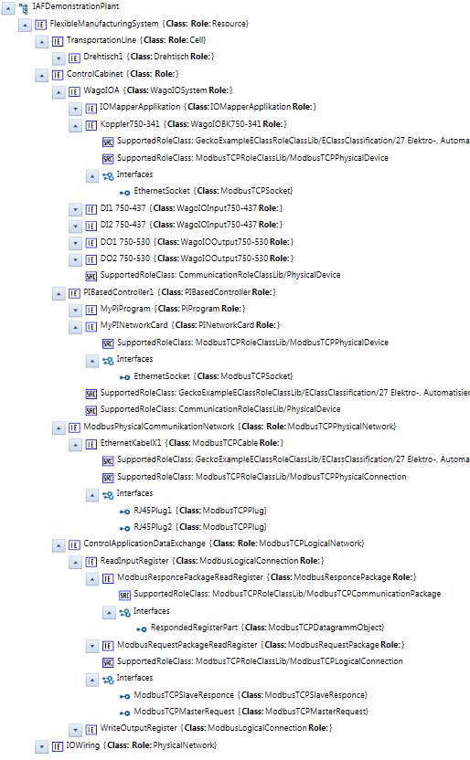

Рисунок 36 – Приклад ієрархії комунікаційної системи для прикладу

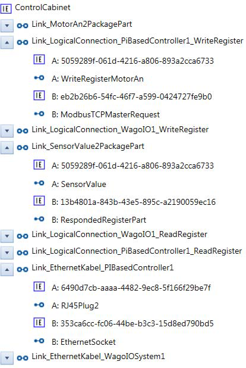

Рисунок 37 – Внутрішні зв’язки в демонстраційному прикладі

Для моделювання PDU створюється InternalElement із класом ролей, успадкованим від CommunicationPackage, для кожного комунікаційного пакета, що передається логічним з’єднанням у відповідному InternalElement. Усередині цього InternalElement створюється інтерфейс, успадкований від DatagrammObject, для кожного інформаційного об’єкта, який передається та має бути змодельований. Для подання властивостей PDU та властивостей датаграм використовуються атрибути на відповідних InternalElement та інтерфейсах. Інтерфейси типу DatagrammObject з’єднуються внутрішніми зв’язками з інтерфейсами типу PLCopenXMLInterface або SignalInterface, які представляють обмінювану інформацію на стороні відправника та отримувача.

## 10 Інтеграція додаткової зовнішньої інформації

AutomationML завдяки інтерфейсам має засіб моделювання, який можна використовувати для пов’язування зовнішньо збереженої інформації з змодельованими об’єктами. Це застосовується при інтеграції геометричної та кінематичної інформації, а також інформації про поведінку, шляхом посилання на файли COLLADA та PLCopen XML. Для цього відповідні класи інтерфейсів успадковуються від узагальненого класу ExternalDataConnector.

Цей клас інтерфейсу або його похідні можна використати для моделювання нових класів інтерфейсів, які інтегрують зовнішньо збережену інформацію, наприклад технічні паспорти, ілюстрації, посібники тощо. Приклад такого підходу — використання DocumentationInterface, успадкованого від ExternalDataConnector. Такий інтерфейс зазвичай містить атрибут refURI, що вказує на зовнішній документ, і атрибут MIMEType, який визначає тип документа відповідно до стандарту MIME (Multipurpose Internet Mail Extensions). Якщо об’єкт має мати кілька пов’язаних документів, то для кожного створюється дочірній InternalElement.

Додатково моделюється бібліотека класів ролей, яка задає конкретну семантику, наприклад рольові класи для специфікацій, технічних паспортів, ілюстрацій, посібників тощо. Один або кілька таких класів ролей призначаються відповідному InternalElement.

Таким чином, додаткові набори інформації можна моделювати як InternalElement зі семантикою, визначеною класом ролей, та DocumentationInterface, який посилається на документ і визначає його тип.

Ці технології можна застосовувати до різних форматів даних [23]. Приклад інтеграції посібників як частини додаткових інформаційних аспектів у форматі PDF наведено на рисунку 38.

На даний момент асоціація AutomationML працює над детальною специфікацією механізмів для пов’язання зовнішньо збереженої інформації зі змодельованими об’єктами.

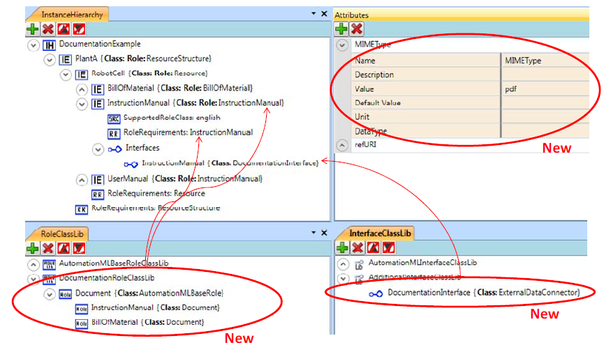

Рисунок 38 – Приклад інтеграції PDF-документа в AutomationML

## 11 Процес застосування

Специфікація AutomationML визначає лише подання інформації на основі використання CAEX, COLLADA та PLCopen XML. Проте застосування AutomationML фактично накладає певний процес використання, який визначений радше імпліцитно. Цей процес ґрунтується на загальному погляді на обмін даними й складається з двох основних фаз: по-перше, ідентифікації набору даних, що підлягає обміну, і по-друге, моделювання цього набору даних.

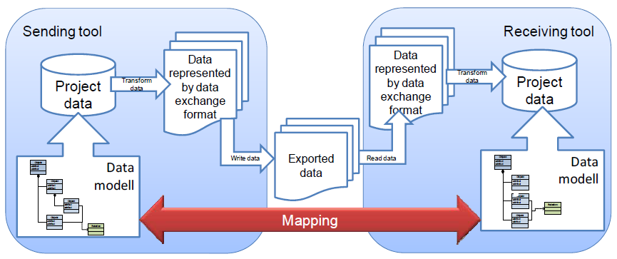

Рисунок 39 – Необхідне відображення моделей даних для застосування AutomationML

Основою застосування AutomationML є загальний погляд на обмін даними між двома або більше інженерними інструментами (див. рисунок 39). Кожен інженерний інструмент, залучений у процес, зазвичай має власну модель даних, пристосовану до його призначення. Тому моделі даних різних інструментів, як правило, відрізнятимуться. Щоб забезпечити обмін даними, інструмент-відправник повинен записати свої дані у формат обміну та здійснити перетворення своєї моделі даних у формат AutomationML. Інструмент-одержувач має інтерпретувати отримані дані з огляду на власну внутрішню модель даних. Таким чином, експорт і імпорт разом утворюють відображення моделей даних задіяних інструментів. Перед використанням AutomationML це відображення моделей і структуру задіяних даних необхідно прояснити.

Отже, першою дією під час застосування AutomationML є детальний аналіз інженерного процесу, який має бути підтриманий цим форматом. У межах цього аналізу слід врахувати інженерні дії, які потрібно охопити, артефакти, що плануються до обміну, та інструменти, які будуть використовуватися. Необхідно визначити, які дані мають бути передані та як ці дані пов’язані між собою, тобто які залежності існують між окремими точками даних. У результаті формується певна загальна модель даних, що підлягають обміну. Для кожного інструмента визначається, які елементи його внутрішньої моделі даних відповідають яким сутностям сформованої загальної моделі.

Коли ці моделі й відповідності визначено, можна розробляти подання загальної моделі даних у термінах AutomationML. Цей процес (див. рисунок 40) починається з ідентифікації основних типів об’єктів із семантичної точки зору та їх потенційних зв’язків. Відповідно визначаються класи ролей у бібліотеках класів ролей та класи інтерфейсів у бібліотеках класів інтерфейсів, які доповнюються описовими властивостями у вигляді атрибутів. Наступним кроком є визначення багаторазово використовуваних об’єктів, тобто компонентів певної предметної області. Ці компоненти представляються класами системних одиниць у бібліотеках системних одиниць, з усіма їх релевантними підструктурами, інтерфейсами, атрибутами тощо. Такі класи можуть бути розпізнані експортерами й імпортерами інженерних інструментів, що прискорює процес відображення інформації. Коли визначення всіх бібліотек завершено, можна переходити до безпосереднього моделювання даних, що підлягають обміну.

Очевидно, що розроблення бібліотек зазвичай виконується один раз, тоді як моделювання даних для обміну виконується багаторазово в процесі розроблення. Проте можлива й поступова, інкрементальна розробка бібліотек паралельно з інженерним процесом, у якому вони застосовуються.

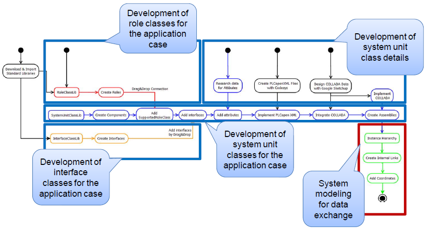

Рисунок 40 – Фази імпліцитного процесу застосування AutomationML

## 12 Висновки

У цій статті було представлено поточний стан розвитку формату обміну даними AutomationML. За останні десять років — від моменту його створення дев’ятьма компаніями та дослідницькими організаціями — було розроблено універсальний формат обміну даними, здатний охопити потреби інженерії виробничих систем. Він може представляти результати інженерії структури виробничої системи, механічної, електричної, трубопровідної, керувальної інженерії, віртуального введення в експлуатацію, а також монтажу та реального введення в експлуатацію. Відповідно, він придатний для інтеграції інженерних інструментів у неоднорідних середовищах інженерних засобів, як цього вимагають підходи Industrie 4.0.

Сьогодні, маючи понад 30 учасників, асоціація AutomationML прискорює процес стандартизації AutomationML і розробляє настанови до застосування для низки спеціалізованих випадків. З одного боку, ці випадки охоплюють обмін спеціалізованою інженерною інформацією. З іншого боку, досліджуються структури та процедури інженерних процесів, у які вбудовано сценарії обміну інженерними даними. Щодо спеціалізованої інженерної інформації розглядаються, наприклад, моделювання конфігурації мереж пристроїв автоматизації, моделювання виробничих процесів і використання ресурсів у них для створення продукції, а також визначення спеціалізованих бібліотек ролей для елементів транспортних систем.

Стосовно сценаріїв обміну даними нинішній фокус полягає у використанні OPC UA для обміну даними, змодельованими в AutomationML, інтеграції даних AutomationML у системи керування даними та визначенні вимог, що виникають у різних типах інженерних мережевих структур, сформованих за каскадними або спіральними процесами інженерії.

Подальший розвиток AutomationML у напрямку оптимального налаштування формату даних і зручності його застосування для повного виконання вимог інтеграції інженерного ланцюга в Industrie 4.0 є головною метою учасників AutomationML. Кожна компанія та кожна наукова установа, зацікавлена в участі в цьому процесі, є бажаною.

## Література

[1] W. Terkaj, T. Tolio, A. Valente: Focused Flexibility in Production Systems, in Changeable and Reconfigurable Manufacturing Systems, Springer Series in Advanced Manufacturing, 2009, I, 47–66.

[2] H. Kagermann, W. Wahlster, J. Helbig (ред.): Umsetzungsempfehlungen für das Zukunftsprojekt Industrie 4.0 – Deutschlands Zukunft als Industriestandort sichern, Forschungsunion Wirtschaft und Wissenschaft, Arbeitskreis Industrie 4.0, [http://www.plattform-i40.de/sites/default/files/Umsetzungsempfehlungen%20Industrie4.0_0.pdf](http://www.plattform-i40.de/sites/default/files/Umsetzungsempfehlungen Industrie4.0_0.pdf), останній доступ — листопад 2013.

[3] J. Jasperneite: Industrie 4.0 — Alter Wein in neuen Schläuchen? Computer&Automation (12/12), с. 24–28, грудень 2012.

[4] T. Schaeffler, M. Foehr, R. Kodes, A. Lüder: Regionalization of Engineering, 20th ICE Conference, Bergamo, Italy, June 2014, Proceedings, DOI: 10.1109/ICE.2014.6871579

[5] A. Alonso-Garcia, A. Hirzle, A. Burkhardt: Steuerungstechnische Standards als Fundament für die Leitechnik, ATP, 2008, № 9, с. 42–47.

[6] R. Drath, A. Fay, M. Barth: Interoperabilität von Engineering-Werkzeugen, at – Automatisierungstechnik 59 (2011), № 7, с. 451–460.

[7] N. Schmidt, A. Lüder, H. Steininger, S. Biffl: Analyzing Requirements on Software Tools According to the Functional Engineering Phase in the Technical Systems Engineering Process, 19th IEEE International Conference on Emerging Technologies and Factory Automation (ETFA), вересень 2014, Барселона, Іспанія, Proceedings.

[8] L. Hundt, A. Lüder: Development of a method for the implementation of interoperable tool chains applying mechatronical thinking – Use case engineering of logic control, 17th IEEE International Conference on Emerging Technologies and Factory Automation (ETFA 2012), Краків, Польща, вересень 2012, Proceedings.

[9] R. Drath (ред.): Datenaustausch in der Anlagenplanung mit AutomationML, Springer Verlag, 2010.

[10] X. Xu, A. Nee: Advanced Design and Manufacturing Based on STEP, Springer Publisher, 2009.

[11] Ch. Diedrich, A. Lüder, L. Hundt: Bedeutung der Interoperabilität bei Entwurf und Nutzung von automatisierten Produktionssystemen, at – Automatisierungstechnik 59 (2011), № 7, с. 426–438.

[12] VDI/VDE – GMA Fachausschuss 7.21 „Industrie 4.0“: VDI-Statusreport Industrie 4.0 – Wertschöpfungsketten, VDI, Frankfurt/Main, http://www.vdi.de/fileadmin/vdi_de/redakteur_dateien/gma_dateien/VDI_Industrie_4.0_Wertschoepfungsketten_2014.pdf

[13] A. Lüder, M. Foehr, L. Hundt, M. Hoffmann, Y. Langer, St. Frank: Aggregation of engineering processes regarding the mechatronic approach, 16th IEEE International Conference on Emerging Technologies and Factory Automation (ETFA 2011), Тулуза, Франція, вересень 2011, Proceedings.

[14] U. Lindemann: Methodische Entwicklung technischer Produkte, Springer, 2007.

[15] Kiefer J., Baer T., Bley H. (2006): Mechatronic-oriented Engineering of Manufacturing Systems Taking the Example of the Body Shop, 13th CIRP International Conference on Life Cycle Engineering, Leuven, Belgium, June 2006, Proceedings, http://www.mech.kuleuven.be/lce2006/064.pdf

[16] AutomationML e.V.: AutomationML web page, [www.automationml.org](http://www.automationml.org/), останній доступ — лютий 2015.

[17] International Electrotechnical Commission: IEC 62424 – Representation of process control engineering – Requests in P&I diagrams and data exchange between P&ID tools and PCE-CAE tools, [www.iec.ch](http://www.iec.ch/), 2008.

[18] International Organization for Standardization: ISO/PAS 17506:2012 – Industrial automation systems and integration — COLLADA digital asset schema specification for 3D visualization of industrial data, [www.iso.org](http://www.iso.org/), 2012.

[19] PLCopen association: PLCopen XML, [www.plcopen.org](http://www.plcopen.org/), 2012.

[20] International Electrotechnical Commission: IEC 62714 – Engineering data exchange format for use in industrial automation systems engineering – AutomationML, [www.iec.ch](http://www.iec.ch/), 2014.

[21] eCl@ss association: eCl@ss classification system, http://wiki.eclass.de/wiki/Main_Page

[22] L. Hundt: Durchgängiger Austausch von Daten zur Verhaltensbeschreibung von Automatisierungssystemen, PhD Thesis, Faculty of Mechanical Engineering, Otto-von-Guericke University Magdeburg, April 2012.

[23] A. Lüder, N. Schmidt, R. Rosendahl, M. John: Integrating different information types within AutomationML, 19th IEEE International Conference on Emerging Technologies and Factory Automation (ETFA), вересень 2014, Барселона, Іспанія, Proceedings.

[24] A. Lüder, N. Schmidt, S. Helgermann: Lossless exchange of graph based structure information of production systems by AutomationML, 18th IEEE International Conference on Emerging Technologies and Factory Automation (ETFA 2013), Кальярі, Італія, вересень 2013, Proceedings.

[25] R. Balakrishnan, K. Ranganathan: A Textbook of Graph Theory, Springer, 2012.

[26] Arnaud, R.; Barnes, M.: COLLADA – Sailing the Gulf of 3D Digital Content Creation, A K Peters, Ltd., Wellesley, Massachusetts, USA, ISBN 1-56881-287-6, 2006.