[<- До підрозділу](README.md)		[Коментувати](#feedback)

# Application Recommendation Automation Project Configuration (AR APC)

Це переклад [AR APC v1.4 ](https://www.automationml.org/news/new-version-of-the-ar-apc-is-now-available/)

## 1 Вступ

Дуже поширеним завданням у межах процесу проєктування виробничих і автоматизаційних систем є обмін інформацією конфігурації автоматизаційного проєкту щодо пристроїв систем автоматизації між системами ECAD та PLC. Щоб уникнути дублювання інженерних робіт у задіяних системах, системи ECAD і PLC повинні мати інтерфейс для спільного використання цієї інформації. У разі початку інженерних робіт в інструменті ECAD необхідно дотримуватися певних правил, щоб апаратна інформація була розміщена у правильному місці в інструменті PLC. У разі початку інженерних робіт в інструменті PLC нерозміщені функції повинні бути розміщені та опрацьовані в інструменті ECAD.

Ця рекомендація щодо застосування описує зазначені робочі процеси та метод моделювання конфігурації апаратного забезпечення з використанням AutomationML.

### 1.1 Основи

Формат обміну даними AutomationML, який стандартизується в межах стандарту IEC 62714, є нейтральним, вільним та заснованим на XML форматом даних. Його було розроблено з метою підтримки обміну даними між інженерними інструментами в гетерогенному середовищі інженерних засобів. З огляду на різні аспекти AutomationML стандарт IEC 62714 складається з кількох частин.

Таблиця 1 – Огляд частин AutomationML

| Частина / ідентифікатор документа                   | Назва                             | Опис                                                         |
| --------------------------------------------------- | --------------------------------- | ------------------------------------------------------------ |
| Part 1 / WP Arch, V 2.0.0                           | Архітектура та загальні вимоги    | Ця частина визначає загальну архітектуру AutomationML, моделювання інженерних даних, класів, екземплярів, відношень, посилань, ієрархій, базових бібліотек AutomationML та розширених концепцій AutomationML. |
| Part 2 / WP Lib V 2.0.0                             | Бібліотеки класів ролей           | Ця частина визначає додаткові бібліотеки AutomationML.       |
| Whitepaper / WP Comm V 1.0.0                        | Комунікація                       | Цей Whitepaper описує моделювання комунікаційних механізмів в AutomationML. |
| Whitepaper / WP eCl@ss V 2.0.0                      | Інтеграція AutomationML та eCl@ss | Цей Whitepaper описує інтеграцію eCl@ss в AutomationML.      |
| Best Practice Recommendation / BPR MlingExp V 1.0.0 | Багатомовні вирази в AutomationML | Цей Whitepaper описує роботу з різними текстами для різних мов в AutomationML. |
| Best Practice Recommendation / BPR RefDes V 1.0.0   | Моделювання референтних позначень | Цей Whitepaper описує роботу з референтними позначеннями відповідно до IEC 81346-1:2009-07 в AutomationML. |
| Best Practice Recommendation / BPR MlingList Attr.  | Моделювання атрибутів списків     | Ця рекомендація описує, як моделювати типи даних списків в AutomationML. |

Подальші частини можуть бути додані в майбутньому, наприклад, з метою інтеграції додаткових стандартів даних з AutomationML.

### 1.2 Область застосування

Ця рекомендація щодо застосування пропонує метод моделювання даних конфігурації автоматизаційного проєкту з використанням інженерного формату даних AutomationML. У ній описується рекомендоване використання класів ролей і класів інтерфейсів, а також рекомендовані структури, які слід враховувати в ієрархії екземплярів проєкту AutomationML.

### 1.3 Нормативні посилання

Наведені нижче документи є посилальними в цьому документі та є обов’язковими для його застосування. Для датованих посилань застосовується лише наведене видання. Для недатованих посилань застосовується останнє видання відповідного документа (включно з усіма змінами).

- Extensible Markup Language (XML) 1.0:2004, рекомендація W3C (доступна за адресою http://www.w3.org/TR/2004/REC-xml-20040204/)
- IEC 62424:2008, Representation of process control engineering – Requests in P&I diagrams and data exchange between P&ID tools and PCE-CAE tools
- Whitepaper AutomationML Part 1 – AutomationML Architecture, November 2018
- Whitepaper AutomationML Part 2 – AutomationML Role Libraries, October 2014
- Whitepaper AutomationML – AutomationML Communication, September 2014
- Whitepaper AutomationML – AutomationML and eCl@ss Integration, November 2021
- Best Practice Recommendation Multilingual expressions in AutomationML, March 2017
- Best Practice Recommendation Modelling of Reference Designations, September 2017
- Best Practice Recommendation Modelling of List Attributes in AutomationML, January 2016

## 2 Загальні зауваження щодо обміну даними конфігурації автоматизаційного проєкту

Інструменти ECAD і інструменти PLC мають різні подання інформації про систему автоматизації. Якщо інструменти ECAD відображають усі електричні деталі пристроїв, що застосовуються в автоматизаційних системах, то в інструментах PLC використовується лише логічна композиція пристроїв автоматизації. Так, в інструментах ECAD визначаються, наприклад, пристрої, задіяні в системі автоматизації, клеми напруги, що використовуються для живлення пристроїв, а також типи проводів, якими з’єднуються пристрої. Однак ці елементи не використовуються в інструментах PLC.

З іншого боку, в інструментах PLC визначаються умови, специфічні для пристроїв і прикладних програм керування, наприклад швидкості передавання даних, що використовуються в комунікаційних з’єднаннях, змінні керуючого коду, пов’язані з входами та виходами керувальних пристроїв, а також прикладні коди керування. Ця інформація, у свою чергу, не потрібна в інструментах ECAD.

Водночас обидва типи інструментів мають спільну інформацію. Наприклад, підключення певного пристрою автоматизації до PLC визначає адресу, за якою до цього пристрою можна звертатися в PLC. Це необхідно враховувати під час розроблення засобів імпорту та експорту. На рисунку 1 показано область застосування цієї рекомендації щодо застосування.

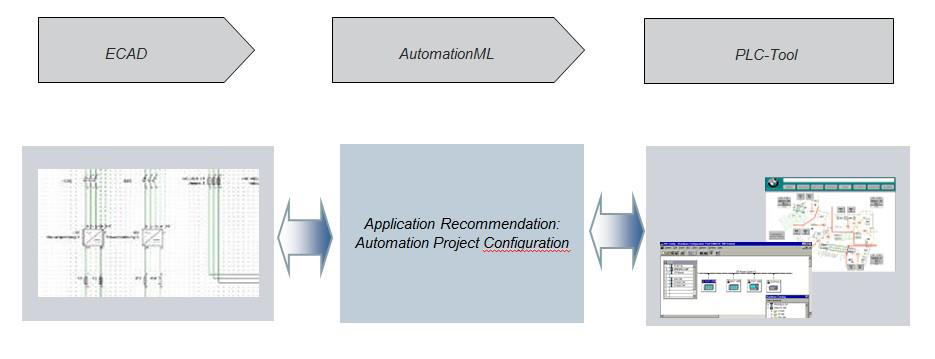

Рисунок 1 – Конфігурація автоматизаційного проєкту між інструментами ECAD та PLC

Окрім зазначених інженерних інструментів для ECAD і програмування PLC, спільним набором даних обох інструментів можуть бути зацікавлені й інші засоби. Наприклад, інструменти механічного проєктування (MCAD) можуть бути зацікавлені у пристроях, що підлягають підключенню, а інструменти документації – у сформованій структурі з’єднань. Проте в межах цього документа розглядаються лише інструменти ECAD і програмування PLC, з урахуванням того, що й інші інженерні інструменти можуть отримати користь від імпорту змодельованої інформації.

Системи, що містять приводи, можуть включати різні аспекти, відмінні від електричної конфігурації. Тому окрема рекомендація щодо застосування «Drive for MCAD» (AR Drive MCAD) пропонуватиме метод моделювання механічних аспектів конфігурацій приводів, тоді як спеціальне розширення для приводів оброблятиме електричну конфігурацію приводів. У ній буде описано рекомендоване використання класів ролей і класів інтерфейсів для приводів, а також рекомендовані структури, які слід враховувати в ієрархії екземплярів проєкту AutomationML.

### 2.1 Робочий процес обміну даними

Зазвичай у процесі інженерії виробничої системи етап побудови в проєкті PLC починається пізніше, ніж у системі ECAD, оскільки завершення ECAD-документації є основою для виготовлення шафи керування. Поєднання з програмним забезпеченням на об’єкті та подальше введення в експлуатацію не відбуваються до завершення виготовлення всіх шаф керування.

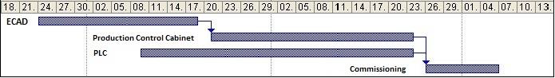

Рисунок 2 – Робочий процес обміну даними

Отже, інженер PLC зазвичай залучається до проєкту пізніше, ніж інженер ECAD. Водночас уже на ранньому етапі (під час виконання ECAD-інженерії) конфігурація автоматизаційного проєкту об’єкта має бути визначена, оскільки необхідно сформувати ECAD-документацію та замовити комплектувальні вироби.

### 2.2 Можливості конфігурації

Системи ECAD зазвичай можуть працювати з компонентами різних виробників PLC, які з точки зору електричного апаратного забезпечення мають певні аналогії. Однак, окрім цього, існують системно-специфічні та виробник-специфічні параметри. Тому лише інженерна система виробника PLC може гарантувати повну та зручну роботу з усіма параметрами апаратного компонента. Отже, конфігурацію системи PLC слід, наскільки це можливо, виконувати в інженерній системі виробника PLC.

### 2.3 Рекомендований робочий процес

Відповідно до описаних критеріїв у більшості випадків встановлюється такий робочий процес:

- виконання базової конфігурації пристроїв у проєкті PLC в інструменті програмування PLC та експорт її до інструмента ECAD;
- імпорт проєкту PLC в інструмент ECAD, виконання ECAD-проєкту та експорт ECAD-проєкту до інструмента програмування PLC;
- імпорт ECAD-проєкту в інструмент програмування PLC та виконання інженерних робіт у проєкті PLC.

#### 2.3.1 Надання початкового проєкту PLC як основи для електротехнічного проєктування

Якщо ECAD-проєкт на цей момент ще не існує, інженер ECAD насамперед створює початковий проєкт в інженерній системі виробника PLC, тобто в інструменті програмування PLC. Інженер ECAD вибирає всі необхідні компоненти та визначає топологію шини у тісній співпраці з інженером PLC, який згодом реалізовуватиме необхідні функції. Така тісна співпраця забезпечує високу узгодженість щодо вибраних апаратних компонентів. Конфігурація автоматизаційного проєкту експортується з інженерної системи виробника PLC та імпортується в інструмент ECAD.

#### 2.3.2 ECAD-інженерія

На основі наявного ECAD-проєкту інженер ECAD виконує повну апаратну побудову, інколи з незначними коригуваннями. Під час цього процесу також можуть бути визначені символьні імена змінних, тегів або сигналів. Таким чином, конфігурація PLC виконується за таких умов:

- конфігурація PLC може бути імпортована з системи програмування PLC;
- конфігурація виконується шляхом графічного розміщення на оглядовій сторінці або в навігаторі;
- вибір PLC-пристроїв здійснюється з бази даних ECAD;
- використовується перетягування Drag&Drop зі сторінок навігатора.

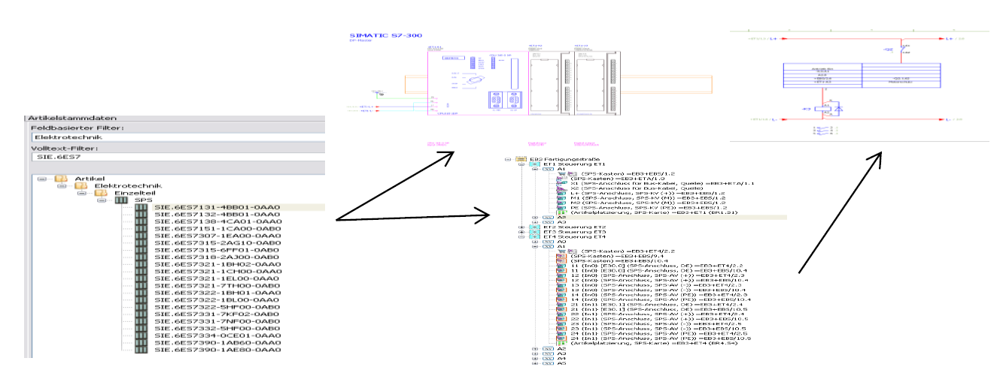

Рисунок 3 – Приклад конфігурації PLC та графічного розміщення

Після завершення конфігурації PLC виконується проєктування станцій і даних шин. Зазвичай це здійснюється шляхом ручного призначення модулів до CPU та пристроїв до шини через властивості пристроїв.

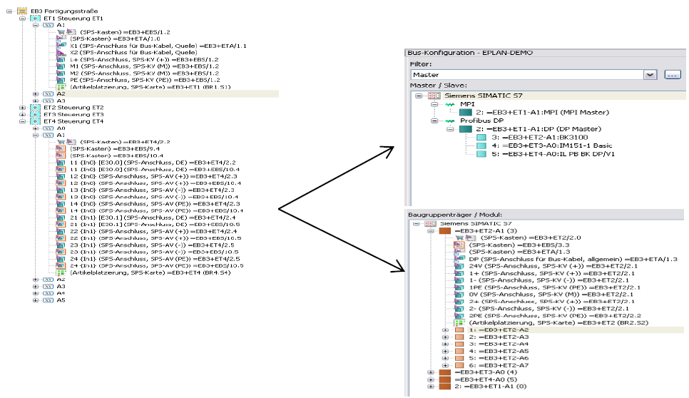

Рисунок 4 – Приклад конфігурації станцій і даних шин

На наступному кроці виконується проєктування списку тегів, тобто переліку тегів, змінних або сигналів (символьних адрес), пов’язаних з апаратними тегами:

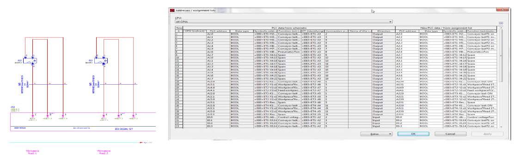

Рисунок 5 – Приклад конфігурації символьних адрес

Нарешті слід виконати просту перевірку на помилки, наприклад:

- подвійне використання адрес I/O, шинних або символьних адрес;
- відсутні адреси;
- прості правила, наприклад резервування слота 3 для модуля IM.

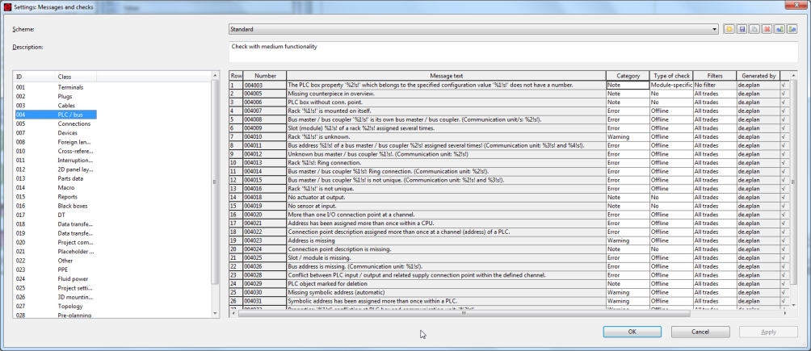

Рисунок 6 – Приклад перевірки на помилки

Після цього ECAD-проєкт може бути експортований у формат AutomationML залежно від реалізації в інструменті ECAD та імпортований в інструмент програмування PLC.

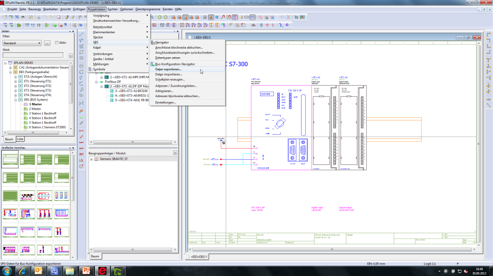

Рисунок 7 – Приклад експорту з інструмента ECAD

#### 2.3.3 PLC-інженерія

На пізнішому етапі інженер програмування PLC розпочинає роботи на основі вже розробленого ECAD-проєкту. На цьому етапі інженерного процесу слід використовувати функцію експорту системи ECAD та функцію імпорту системи PLC для перевірки можливих змін і підтвердження еквівалентності обох конфігурацій.

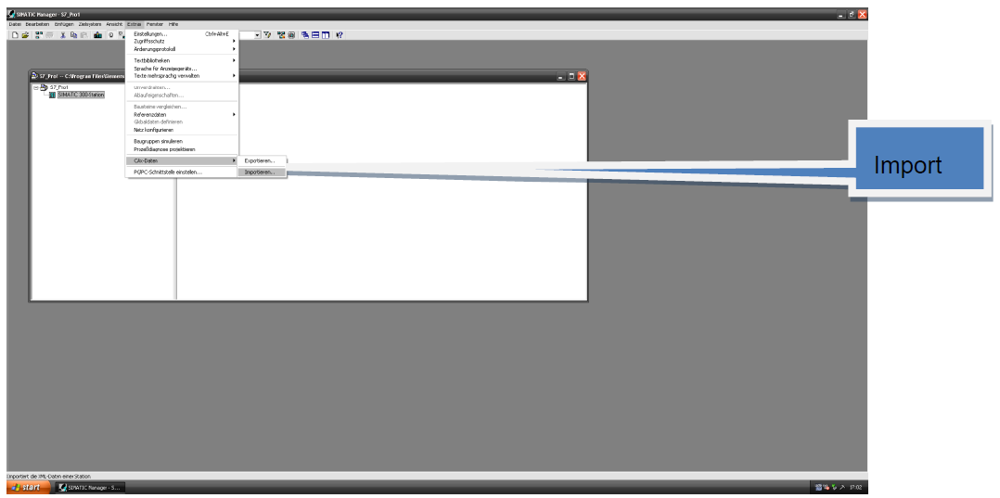

Рисунок 8 – Приклад імпорту в систему PLC

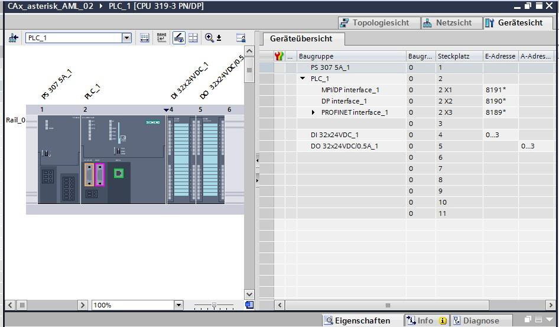

Рисунок 9 – Приклад результату імпорту в систему PLC

## 3 Структури даних конфігурації автоматизаційного проєкту в AutomationML

У цьому розділі визначається концепція подання даних конфігурації автоматизаційного проєкту в AutomationML.

### 3.1 Базова концепція

Для використання AutomationML як нейтрального формату обміну даними конфігурації автоматизаційного проєкту необхідно відокремити PLC-специфічні інтерфейси різних виробників PLC. Це забезпечує незалежність як подальшого розвитку інструментів PLC, так і подальшого розвитку інструментів ECAD. Крім того, перетворення та впровадження мають бути максимально простими як для постачальників ECAD, так і для постачальників PLC. Тому вже наявні моделі слід використовувати настільки, наскільки це можливо.

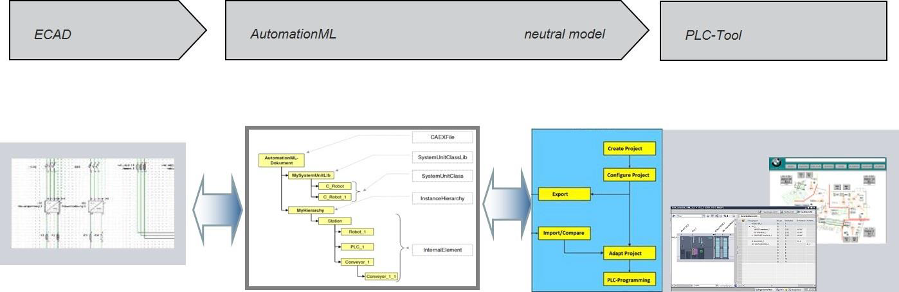

Рисунок 10 – Базова концепція обміну даними між ECAD та PLC

Використання нейтральної моделі дає змогу:

- визначати в AutomationML ролі, незалежні від конкретного інструмента PLC;
- визначати в AutomationML PLC-специфічні SystemUnitClass для різних інструментів ECAD і PLC та різних виробників;
- визначати в AutomationML PLC-специфічні InterfaceClass.

#### 3.1.1 Експорт з ECAD до AutomationML

На наведеному нижче рисунку показано детальний процес експорту даних конфігурації автоматизаційного проєкту на основі прикладу EPLAN.

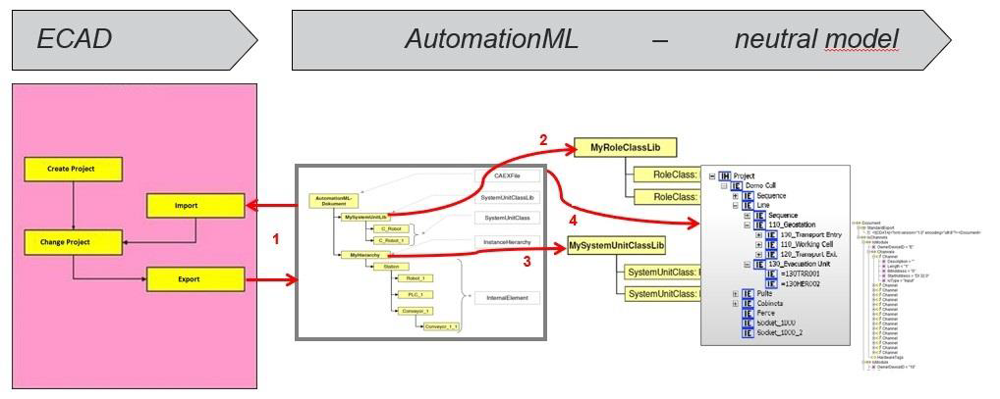

Рисунок 11 – Базова концепція експорту з ECAD (приклад EPLAN)

1. Експорт та імпорт даних конфігурації автоматизаційного проєкту з AutomationML та до AutomationML
2. Незалежні від виробника ролі в AutomationML
3. Нейтральні SystemUnitClass в AutomationML
4. Топологія в AutomationML (нейтральна модель)

#### 3.1.2 Імпорт з AutomationML у PLC

На наведеному нижче рисунку показано детальний процес імпорту даних конфігурації автоматизаційного проєкту на основі прикладу Step 7.


Рисунок 12 – Базова концепція імпорту в PLC (приклад Step 7)

1. Імпорт даних ECAD з AutomationML (нейтральна модель)
2. Імпорт з нейтральної моделі в PLC-інструмент, специфічний для виробника (приклад S7)

### 3.2 Нейтральна модель: дані конфігурації автоматизаційного проєкту

Метою є підтримка інженерного робочого процесу між системами ECAD та інженерними системами PLC. Надання стандартизованих інтерфейсів для обміну даними між системами PLC і ECAD є обов’язковим. Інтерфейсування з системами ECAD як додаткову цільову групу охоплює всіх виробників ECAD.


Рисунок 13 – Зв’язування CAE та PLC

Отже, необхідно враховувати різні системи ECAD та виробників CAE. Тому термін «ECAD» використовується як узагальнення для різних форматів CAE, E-CAD та E-CAE залежно від наявних систем ECAD. На цій основі в наступному розділі визначається реалізація нейтрального формату «proxy ECAD» в AutomationML. Крім того, слід враховувати вже наявні концепції провідних виробників інструментів ECAD і виробників PLC, щоб забезпечити максимально просту реалізацію цієї нейтральної моделі для всіх виробників ECAD і PLC.

#### 3.2.1 Базові ідеї

Дані конфігурації автоматизаційного проєкту можуть бути змодельовані з використанням AutomationML. Відповідно, методологія моделювання ґрунтується на концепціях моделювання топології AutomationML з використанням CAEX, визначених у частині 1 стандарту AutomationML. До базових визначень додаються додаткові положення для виконання спеціальних вимог, що виникають під час обміну даними з інструментами ECAD. Методологія моделювання даних конфігурації автоматизаційного проєкту дає змогу створити самодостатню модель. Обов’язкові залежності від інших моделей відсутні.

Для моделювання даних конфігурації автоматизаційного проєкту визначається виробниконезалежна структура даних конфігурації автоматизаційного проєкту. У своїй базовій структурі вона відображає нейтральну об’єктну модель систем PLC.

Обмін даними базується на повній інформації про об’єкти. Це означає, що дані конфігурації автоматизаційного проєкту завжди містять повні дані про сам об’єкт, а не лише дельта-інформацію.

Гранулярність експорту та імпорту відповідає рівню апаратних станцій, оскільки інженерні системи PLC завжди працюють на рівні станції. Експорт та імпорт або підтримують обмін даними, що стосуються однієї чи кількох станцій (наприклад, усього проєкту), або лише частин станції (наприклад, одного окремого модуля). При цьому завжди вимагається, щоб «оточення», в якому існує ця частина, також було складовою обміну даними.

До області цього обміну даними входить лише інформація про апаратну конфігурацію PLC пристроїв автоматизації, включно з деякими релевантними параметрами та символами або тегами, пов’язаними з апаратними об’єктами. Додатково до формату обміну включається інформація про мережі, до яких підключені ці апаратні конфігурації.

Лише підмножина всіх даних, що надаються апаратною конфігурацією PLC, є релевантною для обміну даними з системами ECAD. З огляду на електричне подання об’єкта, з яким працюють інструменти ECAD, ці інструменти можуть надавати лише дуже загальну підмножину інформації, що належить до апаратних об’єктів PLC. Специфічні параметричні налаштування належать до сфери відповідальності інструментів апаратної конфігурації PLC та відповідних менеджерів об’єктів, специфічних для виробника. Вони можуть оброблятися лише у виробник-специфічному інструменті.

Окрім стандартних пристроїв у каталогах апаратного забезпечення PLC, існують деякі типи елементів пристроїв, які потребують додаткових описів. Прикладами цього є описи GSD або GSDML. Пристрої та елементи пристроїв, такі як стандартні slave-пристрої або IODevices на основі GSDML, можуть бути створені в конфігурації PLC лише за умови встановлення відповідного опису або пакета. Відповідальність за наявність коректної та актуальної інформації про елементи пристроїв (GSD тощо) покладається на програміста PLC. Водночас файл обміну даними ECAD на основі AutomationML може містити інформацію про необхідні описи елементів пристроїв.

Деякі системи ECAD здатні надавати інформацію про необхідний файл опису. Інші також можуть передавати сам файл. Тому допускається передавання цих додаткових даних із системи ECAD до інженерної системи PLC. Очікується, що файли передаватимуться, наприклад, у вигляді zip-архіву та розпаковуватимуться в той самий каталог, що й файл імпорту. Таким чином, має бути можливим зазначити та посилатися на файл у файлі обміну даними. Користувач системи PLC, який імпортує файл, може очікувати знайти частину або всі необхідні описи в тому самому каталозі, що й файл імпорту. Посилання на файл опису додається як окрема властивість для модуля та слугує прив’язкою до опису елемента.

#### 3.2.2 Вміст обміну даними

Аналіз уже наявних пропрієтарних XML-орієнтованих файлів обміну даними провідних виробників PLC та ECAD щодо даних конфігурації автоматизаційного проєкту показав, що всі дані, які підлягають обміну, можна згрупувати в три основні категорії.

1. Апаратні дані (HW Data): Це дані, що стосуються частин або пристроїв, таких як центральна стійка, slave-пристрій або комутатор. Тому для цієї групи компонентів переважно використовується термін «пристрій» (`device`).  Усередині таких пристроїв існують інші пристрої або елементи пристроїв, наприклад стійки, CPU, джерела живлення, модулі I/O, підмодулі. Для цієї групи компонентів зазвичай використовується термін `DeviceItem`. Додаткові елементи пристроїв, такі як маршрутизатори, комутатори, концентратори та повторювачі, також підтримуються форматом експорту. Пристрої часто групуються в ієрархічну структуру «папок» (`folder`).
2. Символи / теги: Експортуються та імпортуються «символи» (`symbols`) і «теги» (`tags`), призначені елементам пристроїв. Тут розглядаються лише апаратно орієнтовані символи та теги. Символи і теги експортуються разом із цільовим елементом пристрою контролера (тобто CPU), а не з іншими елементами пристроїв, на які вони можуть посилатися (наприклад, модулем I/O). Як і пристрої, теги часто групуються в «таблиці тегів» (`tag tables`) та в ієрархічну структуру «папок» (`folder`).
3. Мережі: Мережі моделюються безпосередньо під проєктом як глобальні об’єкти підмереж. Зв’язок між мережею та елементами пристроїв моделюється як посилання на об’єкт підмережі. Параметри мережі зберігаються в об’єкті мережі. Параметри, що стосуються мережевого інтерфейсу конкретного елемента пристрою, підключеного до мережі, зберігаються в об’єкті вузла цього елемента пристрою. Обмін даними часто регулюється з використанням «каналів», «портів» та «інтерфейсів».

Крім того, у документі «Whitepaper AutomationML Part 5 – AutomationML Communication» уже визначено XML-орієнтовану методологію обміну інформацією про комунікаційні системи між інженерними інструментами, розроблену AutomationML e.V. Ці методи також слід враховувати під час моделювання даних конфігурації автоматизаційного проєкту.

#### 3.2.3 Сумісність з WP Automation Component

Наступна рекомендація має факультативний характер.

Для досягнення інтеграції AR APC з моделями Automation Component рекомендується додавати RoleClass `AutomationComponent` та відповідну інформацію `Nameplate` до кожного ідентифікованого фізичного компонента автоматизації в проєкті AR APC і, за можливості, також до вузлів типу `Device` та `DeviceItem`.

#### 3.2.4 Модель даних обміну даними конфігурації автоматизаційного проєкту

Урахування всіх згаданих та вже наявних моделей приводить до такої базової діаграми обміну даними конфігурації автоматизаційного проєкту.

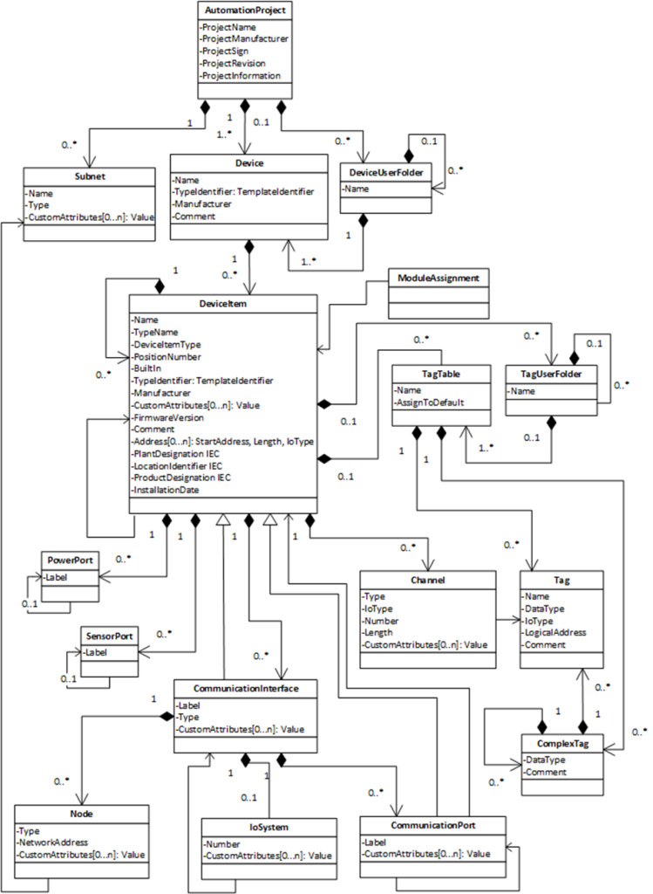

Рисунок 14 – Об’єкти та параметри обміну даними конфігурації автоматизаційного проєкту

Оскільки цей документ також слугує основою для шинно-специфічних визначень і розширень, які описуються в окремих документах, визначено абстрактні RoleClass `DeviceItemBusExtension`, `NodeBusExtension` та `CommunicationInterfaceBusExtension` з метою підготовки простої реалізації майбутніх розширень.

На наступному рисунку ці абстрактні ExtensionRoleClass показані з міркувань наочності лише в області батьківських об’єктів.

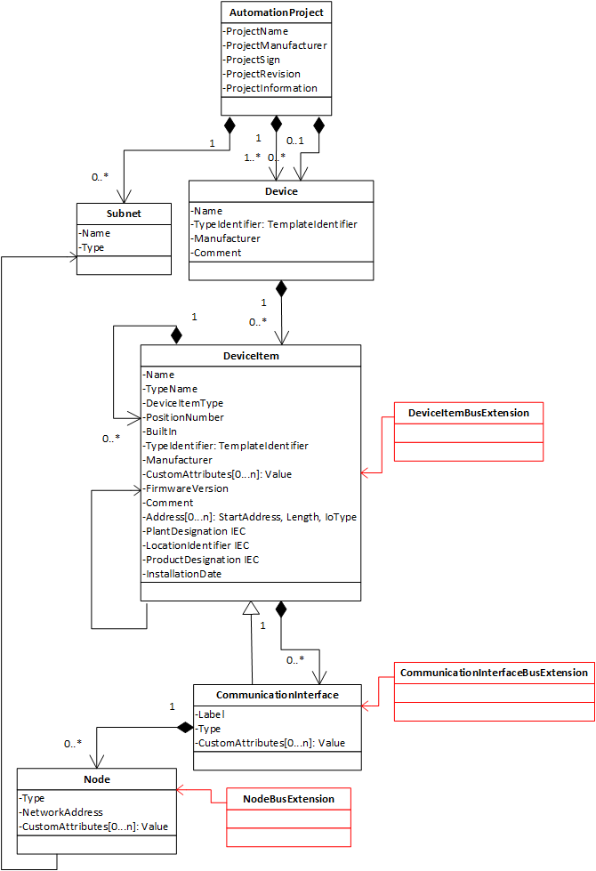

Рисунок 15 – Об’єкти та параметри обміну даними конфігурації автоматизаційного проєкту для розширень

Експорт даних конфігурації автоматизаційного проєкту в AutomationML базується на використанні `InstanceHierarchy`, яка охоплює експортовані дані конфігурації автоматизаційного проєкту. `InternalElement` цієї ієрархії екземплярів посилаються на відповідні елементи в бібліотеках `RoleClass`, `SystemUnitClass` та `InterfaceClass`.

Об’єкти та параметри, показані на наведеному вище рисунку, описуються нижче. Усі об’єкти моделюються як класи ролей або класи інтерфейсів, похідні від класів, визначених у Whitepaper AutomationML Communication, та доповнюються додатковими атрибутами, які вже використовуються в інструментальному середовищі виробників PLC. Додаткові параметри можуть бути визначені з використанням механізмів інтеграції eCl@ss, як описано в документі «Whitepaper AutomationML – AutomationML and eCl@ss Integration». `RoleClass` і `InterfaceClass`, а також об’єкти та атрибути, які не визначені AR APC, можуть ігноруватися відповідно до «AutomationML Whitepaper – Architecture and general requirements» і не зберігатимуться в сценарії roundtrip. Залежно від різних комунікаційних систем і шинних систем деякі об’єкти можуть містити додаткові, невикористані або обмежені атрибути. Ці атрибути та шинно-специфічні параметри описуються в окремих специфікаціях шин. Для отримання додаткової інформації слід звертатися до відповідних специфікацій шин.

Деякі атрибути визначені на основі рядків. Усі рядки визначені у відповідних описах точно з дотриманням написання (використання малих літер, великих літер тощо). Однак з огляду на допустиму похибку всі інструменти імпорту повинні, наскільки це можливо, підтримувати толерантну інтерпретацію цих рядків (змішане написання).

##### 3.2.4.1 AutomationProject

Об’єкт `AutomationProject` представляє проєкт, з якого походить експорт. Він агрегує всі інші об’єкти нижчого рівня. Стандартними параметрами проєкту є його name (string), виробник проєкту (string), позначення проєкту виробника (string), номер ревізії проєкту (string) та `project information` (string), що містить коментар до проєкту.

##### 3.2.4.2 DeviceUserFolder

`DeviceUserFolder` підтримує структурування пристроїв у межах проєкту. Єдиним стандартним параметром `DeviceUserFolder` є його `name` (string).

##### 3.2.4.3 Subnet

Об’єкт `Subnet` відповідає за зберігання та керування властивостями і функціональністю мереж, таких як Ethernet, PROFIBUS, MPI тощо. Підмережа визначається логічною доступністю всіх учасників підмережі. Усі учасники підмережі мають різні, однозначні адреси. Стандартні параметри об’єкта `Subnet` наведені нижче:

- `Name` (string): назва підмережі;
- `Type` (string): тип підмережі (наприклад, PROFIBUS, MPI тощо). Тип має бути визначений у шинно-специфічному описі;
- `CustomAttributes` (ListType): додаткова виробник-специфічна інформація для підмережі. Містить імена та значення властивостей, специфічних для виробника;
- `Subnet` має рівно один `LogicalEndpoint` для з’єднання підмережі з вузлами.

##### 3.2.4.4 Device

Об’єкт `Device` представляє колекцію, в якій об’єднуються окремі апаратні об’єкти slave-пристрою або стійки, включно з самим апаратним елементом slave або стійки. Таким чином, `Device` є контейнером `DeviceItem`, який слугує колекцією елементів `DeviceItem` (зокрема апаратних елементів). `Device` повинен мати унікальне ім’я в межах автоматизаційного проєкту. Пристрій може бути:

- центральна конфігурація з кількома стійками (станція системи автоматизації з центральними та розширювальними стійками);
- фіксована комбінація CPU та кількох модулів I/O (наприклад, C7);
- станція на базі ПК, де ПК представляє пристрій;
- польовий пристрій;
- комутатор.

Стандартні параметри об’єкта `Device` наведені нижче:

- `Name` (string): ім’я пристрою;
- `TypeIdentifier` (string): ідентифікатор типу пристрою. Необов’язковий додатковий підатрибут `TemplateIdentifier` посилається на шлях до елемента бібліотеки;
- `Manufacturer` (string): додаткова інформація для опису виробника пристрою;
- `Comment` (string): необов’язковий коментар до пристрою.

##### 3.2.4.5 DeviceItem

`DeviceItem` агрегується об’єктом `Device` і представляє узагальнений клас для апаратних модулів і підмодулів (CPU, модуль I/O, стійка тощо). Якщо `Device` представляє логічну оболонку, то `DeviceItem` більшою мірою представляє фізичні апаратні об’єкти.

`DeviceItem` може бути вставлений в інший `DeviceItem` (наприклад, CPU у стійку, підмодуль у модуль). Відносне положення щодо батьківського об’єкта визначається параметром `PositionNumber`.

`DeviceItem` також може бути вбудованим в інший `DeviceItem`. Такі `DeviceItem` можуть моделювати фіксовану комбінацію, яка не може бути розділена (наприклад, `C7`). Стандартні параметри об’єкта `DeviceItem` наведені нижче:

- `Name` (string): ім’я `DeviceItem`;
- `TypeName` (string): додаткова інформація про тип. Необов’язкова, але корисна для користувача у разі помилки;
- `DeviceItemType` (string): класифікація `DeviceItem` (наприклад, CPU). `DeviceItemType` є додатковою інформацією, яка може бути корисною користувачу у разі помилки;
  - `Customized` (boolean): підатрибут `Customized` вказує, чи містить `DeviceItemType` виробник-специфічну інформацію (`Customized = “true”`), чи ні (`Customized = “false”`). Якщо атрибут відсутній або має значення `“false”`, `DeviceItemType` містить уже стандартизовану інформацію (наприклад, CPU);
- `Manufacturer` (string): додаткова інформація для опису виробника `DeviceItem`;
- `CustomAttributes` (ListType): додаткова виробник-специфічна інформація для `DeviceItem`. Визначає імена та значення властивостей, специфічних для виробника;
- `PositionNumber` (int): номер слота, у який вставлено цей `DeviceItem`;
- `BuiltIn` (Boolean): ознака, що вказує на те, що цей модуль є вбудованою частиною іншого модуля. Такий модуль створюється автоматично, оскільки є фіксованою частиною іншого модуля. Якщо параметр відсутній, за замовчуванням має значення false;
- `TypeIdentifier` (string): ідентифікатор типу елемента пристрою. Необов’язковий додатковий підатрибут `TemplateIdentifier` посилається на шлях до елемента бібліотеки;
- `FirmwareVersion` (string): задає версію прошивки, наприклад CPU, і може бути необхідною для коректної ідентифікації модуля (інколи номера замовлення недостатньо);
- `Comment` (string): необов’язковий коментар до модуля;
- `Address` (OrderedListType): адресна інформація елемента пристрою в межах пристрою. Більшість модулів мають призначені діапазони адрес. Наприклад, можуть існувати діапазони адрес для входів і виходів, які описуються початковим значенням і довжиною. Address визначає початок, довжину та тип I/O. Він моделюється як впорядкований список адресних параметрів. Порядок необхідний для ідентифікації коректного підпристрою у разі кількох початкових адрес для одного модуля. Підпараметри наведені нижче:
  - `StartAddress` (int): початок адреси;
  - `Length` (int): загальна ширина модуля (виробник-специфічна). У більшості випадків відповідає ширині всіх каналів;
  - `IoType` (string): вхід або вихід;
  - `BitOffset` (int): початок бітової адреси в межах байта;
  - `InstallationDate` (dateTime): дата встановлення елемента пристрою.

Примітка: Окрім наведених стандартних документів можуть бути додані атрибути, що дають змогу представляти референтні позначення відповідно до IEC 81346. Нижче наведено три можливі приклади таких атрибутів.

- `PlantDesignation IEC` (string): позначення установки для цього елемента пристрою. `PlantDesignation` є референтним позначенням, орієнтованим на продукт, відповідно до IEC 81346-1:2009-07, 5.3 – функціонально орієнтована структура;
- `LocationIdentifier IEC` (string): позначення розташування для цього елемента пристрою. `LocationIdentifier` є референтним позначенням, орієнтованим на розташування, відповідно до IEC 81346-1:2009-07, 5.5 – структурa, орієнтована на розташування;
- `ProductDesignation IEC` (string): позначення продукту для цього елемента пристрою. `ProductDesignation` є референтним позначенням, орієнтованим на продукт, відповідно до IEC 81346-1:2009-07, 5.4 – структурa, орієнтована на продукт.

##### 3.2.4.6 TagTable

`TagTable` підтримує структурування тегів. Стандартні параметри об’єкта `TagTable` наведені нижче:

- `Name` (string): назва `TagTable`;
- `AssignToDefault` (Boolean): під час імпорту, якщо `TagTable` має атрибут `AssignToDefault` зі значенням `True`, усі теги всередині будуть імпортовані до наявної стандартної таблиці тегів. У цьому випадку назва `TagTable` ігнорується інструментом імпорту. Якщо атрибут AssignToDefault відсутній під час імпорту, за замовчуванням вважається значення False.

##### 3.2.4.7 TagUserFolder

`TagUserFolder` підтримує структурування `TagTable` в межах `DeviceItem`. Єдиним стандартним параметром `TagUserFolder` є `name` (string).

##### 3.2.4.8 Tag

`Tag` представляє символьне ім’я даних I/O. Він забезпечує логічне подання каналу модуля і безпосередньо пов’язується з відповідним каналом.

Теги можуть агрегуватися лише таблицею тегів CPU. CPU представляється конкретним `DeviceItem`. Стандартні параметри об’єкта Tag наведені нижче:

- `Name` (string): назва тегу;
- `DataType` (string): тип даних;
  - `Customized` (Boolean): підатрибут `Customized` вказує, чи містить `DataType` виробник-специфічні типи даних (Customized = “true”), чи ні (Customized = “false”). Якщо атрибут відсутній або має значення “false”, DataType містить уже стандартизовані типи даних згідно з IEC 61131 (наприклад, BOOL, BYTE, WORD);
- `IoType` (string): вхід або вихід;
- `LogicalAddress` (string): логічна адреса, що визначає адресу тегу;
- `Comment` (string): необов’язковий коментар до тегу.

Можливі теги без призначених каналів і канали без призначених тегів (неповна інженерія).

##### 3.2.4.9 ComplexTag

`ComplexTag` представляє символьне ім’я структурованих даних I/O. Він забезпечує логічну структуру та агрегує теги для безпосереднього посилання на відповідний канал.

`ComplexTag` може агрегуватися таблицею тегів CPU або іншими `ComplexTag`. CPU представляється конкретним `DeviceItem`. Стандартні параметри об’єкта `ComplexTag` наведені нижче:

- `DataType` (string): назва типу структури;
- `Comment` (string): необов’язковий коментар до `ComplexTag`.

##### 3.2.4.10 Channel

`Channel` є частиною модуля I/O і представляє технологічний інтерфейс (наприклад, цифровий або аналоговий вхід чи вихід). Канал є частиною `DeviceItem`, що представляє модуль I/O, і може використовуватися лише в межах `DeviceItem`. Канал посилається на теги за допомогою зв’язку. Стандартні параметри об’єкта `Channel` наведені нижче:

- `Type` (string): аналоговий або цифровий;
- `IoType` (string): вхід або вихід;
- `Number` (int): номер каналу, починаючи з 0;
- `Length` (int): ширина каналу (наприклад, 1 для біта, 8 для байта, 16 для слова);
- `CustomAttributes` (ListType): додаткова виробник-специфічна інформація для каналу, що визначає імена та значення властивостей виробника.

Канал за допомогою LinkToTag посилається на відповідні теги, які зберігаються в DeviceItem CPU.

##### 3.2.4.11 CommunicationInterface

`CommunicationInterface` є спеціальним типом `DeviceItem`, який виступає точкою підключення пристрою до мережі (наприклад, мережева карта). Тому `CommunicationInterface` має `LogicalEndpoint`. Залежно від типу `CommunicationInterface` він може містити різні параметри, специфічні для цього типу. Відповідні шинно-специфічні параметри описуються в окремій специфікації шини. Стандартні параметри об’єкта `CommunicationInterface` наведені нижче:

- `Label` (string): назва, надрукована на елементі, наприклад унікальний ідентифікатор;
- `Type` (string): тип `CommunicationInterface` (наприклад, `ExtensionRack`);
- `CustomAttributes` (ListType): додаткова виробник-специфічна інформація для `CommunicationInterface`, що визначає імена та значення властивостей виробника.

##### 3.2.4.12 Node

`Node` визначає всю мережеву інформацію, пов’язану з інтерфейсом вузла мережі (наприклад, логічну адресу, маску підмережі). `Node` належить `CommunicationInterface` (`DeviceItem`). Параметри вузла є шинно-специфічними характеристиками. Це топологічний об’єкт фізичного з’єднання (кабель, оптоволокно) між двома мережевими станціями. Залежно від типу вузла він може містити різні параметри, специфічні для цього типу. Відповідні шинно-специфічні параметри описуються в окремій специфікації шини. Стандартні параметри об’єкта `Node` наведені нижче:

- `Type` (string): тип мережі (наприклад, `Ethernet`, `MPI`), як визначено у специфікації шини;
- `NetworkAddress` (string): мережева адреса цього елемента пристрою. Формат залежить від типу `Node` (наприклад, TCP/IP-адреса для IP-мережі);
- `CustomAttributes` (ListType): додаткова виробник-специфічна інформація для `Node`, що визначає імена та значення властивостей виробника.

##### 3.2.4.13 CommunicationPort

`CommunicationPort` є фізичним підключенням до мережі. Це топологічний об’єкт фізичного з’єднання (кабель, оптоволокно) між двома мережевими станціями. Стандартні параметри об’єкта `CommunicationPort` наведені нижче:

- `Label` (string): назва, надрукована на елементі пристрою, наприклад унікальний ідентифікатор;
- `CustomAttributes` (ListType): додаткова виробник-специфічна інформація для CommunicationPort, що визначає імена та значення властивостей виробника.

Порти агрегуються на інтерфейсі, який неявно визначає зв’язок між логічною (інтерфейс) і фізичною (порт) мережевою з’єднуваністю. Цю агрегацію не потрібно явно моделювати в AutomationML, оскільки вона вже наявна через наслідування `Interface` та `Port` від `DeviceItem`, що визначає узагальнену агрегацію `DeviceItem`–`DeviceItem`.

##### 3.2.4.14 IoSystem

Об’єкт `IoSystem` відповідає за подання відношення `master–slave`, характерного для польових шин. Хоча це відношення залежить від підключення підмережі між інтерфейсами, модель об’єктів цього не примушує (неповна інженерія). Батьківським об’єктом `IoSystem` є інтерфейс, який виконує роль `master`. Усі інтерфейси, що виконують роль `slave` для цього `master`, пов’язані з об’єктом `IoSystem`. Слід зауважити, що інтерфейс `master` і інтерфейси `slave` є різними екземплярами об’єктів, хоча в моделі об’єктів вони мають один і той самий клас. Стандартні параметри об’єкта `IoSystem` наведені нижче:

- `Number` (int): номер `IoSystem`;
- `CustomAttributes` (ListType): додаткова виробник-специфічна інформація для `IoSystem`, що визначає імена та значення властивостей виробника.

##### 3.2.4.15 PowerPort

`PowerPort` є фізичним з’єднанням між модулями для передавання живлення. Це топологічний об’єкт фізичного з’єднання (кабель) між двома силовими модулями. Стандартні параметри об’єкта `PowerPort` наведені нижче:

- `Label` (string): назва, надрукована на модулі, наприклад унікальний ідентифікатор.

`PowerPort` має рівно один `PowerPortInterface` для з’єднання `PowerPort` між модулями для передавання живлення. `PowerPortInterface` виступає точкою підключення силового модуля.

##### 3.2.4.16 SensorPort

`SensorPort` є фізичним з’єднанням між модулями для передавання сигналів датчиків. Це топологічний об’єкт фізичного з’єднання (кабель) між двома сенсорними модулями. Стандартні параметри об’єкта `SensorPort` наведені нижче:

- `Label` (string): назва, надрукована на модулі, наприклад унікальний ідентифікатор.

`SensorPort` має рівно один `SensorPortInterface` для з’єднання `SensorPort` між модулями для передавання сигналів датчиків. `SensorPortInterface` виступає точкою підключення сенсорного модуля.

##### 3.2.4.17 ModuleAssignment

Клас інтерфейсу `ModuleAssignment` використовується для визначення призначення модуля до CPU в багатопроцесорній системі. За допомогою внутрішнього зв’язку між інтерфейсами `ModuleAssignment` модуль призначається CPU. Модуль може бути призначений кільком CPU, а CPU може керувати кількома модулями. Кожен `DeviceItem` повинен мати щонайбільше один інтерфейс `ModuleAssignment`, який може використовуватися кількома внутрішніми зв’язками. Якщо існує лише один CPU, інтерфейс `ModuleAssignment` може бути відсутнім, і вважається, що всі модулі керуються цим CPU.

##### 3.2.4.18 Шинно-специфічні розділи

Шинно-специфічні визначення та розширення описуються в окремих документах. AR APC визначає такі абстрактні `RoleClass`: `DeviceItemBusExtension`, `NodeBusExtension` та `CommunicationInterfaceBusExtension`.

##### 3.2.4.18.1 DeviceItemBusExtension

Абстрактний `RoleClass` `DeviceItemBusExtension` використовується для визначення додаткових шинно-специфічних атрибутів для `DeviceItem`.
Примітка: `DeviceItemBusExtension` слід використовувати лише для об’єктів `DeviceItem`, а не для похідних об’єктів `DeviceItem` (наприклад, портів).

##### 3.2.4.18.2 NodeBusExtension

Абстрактний `RoleClass` `NodeBusExtension` використовується для визначення додаткових шинно-специфічних атрибутів для `Node`.
Примітка: `NodeBusExtension` слід використовувати лише для об’єктів `Node`.

##### 3.2.4.18.3 CommunicationInterfaceBusExtension

Абстрактний `RoleClass` `CommunicationInterfaceBusExtension` використовується для визначення додаткових шинно-специфічних атрибутів для `CommunicationInterface`.
Примітка: `CommunicationInterfaceBusExtension` слід використовувати лише для об’єктів `CommunicationInterface`.

Примітка:
Похідні від цих абстрактних `RoleClass` визначаються в окремих бібліотеках `RoleClass`. Рекомендується така схема іменування:
`AutomationProjectConfiguration[BusTypeName]RoleClassLib`.

Правила іменування для похідних від абстрактних базових класів такі: `DeviceItem[BusTypeName]`, `Node[BusTypeName]` та `CommunicationInterface[BusTypeName]`.

`BusTypeName` має точно відповідати рядку атрибута type.

Якщо клас потребує додаткових атрибутів, вводяться додаткові `RoleClass` для застосування як `SupportedRoleClass`.

Як рекомендація щодо реалізації, додаткові `RoleClass` мають оброблятися інструментами толерантно. Це означає, що інструмент імпорту повинен враховувати додаткові атрибути навіть у разі, якщо відповідний `RoleClass` не вказаний для об’єкта в ієрархії екземплярів.

## 4 Настанови щодо використання моделі ECAD у практичних застосуваннях

Для використання раніше описаного методу моделювання ECAD в AutomationML необхідно виконати чотири кроки.

На першому кроці має бути створена або імпортована бібліотека ролей ECAD, тобто визначена відповідна `RoleClassLib`. Ця бібліотека ролей містить похідні ролей ECAD від узагальненої комунікаційної моделі AutomationML.

Далі мають бути створені або імпортовані інтерфейси, тобто визначена відповідна `InterfaceClassLib`. Ця бібліотека інтерфейсів містить похідні ролей ECAD від узагальненої комунікаційної моделі AutomationML.

На третьому кроці ідентифікуються та моделюються `SystemUnitClass` для інженерної предметної області як шаблони для подальшого використання. Тут може бути змодельована структура `Device`, `DeviceItem` тощо, зокрема з урахуванням релевантних властивостей, які необхідно врахувати. Для цього додаються відповідні `InternalElement` та атрибути.

Нарешті, визначена структура може бути використана для моделювання практичної системи в `InstanceHierarchy`.

Цю процедуру показано на наступному рисунку.

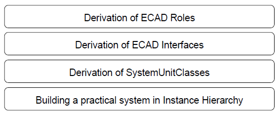

Рисунок 16 – Процедура використання ECAD в AutomationML

## 5 Моделювання даних конфігурації автоматизаційного проєкту з використанням AutomationML

### 5.1 Бібліотека класів ролей

Основою моделювання є необхідні класи ролей. З огляду на потрібні елементи моделі, для моделювання даних конфігурації автоматизаційного проєкту потрібні спеціальні класи ролей, похідні від класів ролей, що використовуються для моделювання комунікаційних систем і визначені в документі AutomationML Whitepaper – Communication, або похідні від базових ролей AutomationML, визначених у документі AutomationML Whitepaper – Architecture and general requirements.

На наступних рисунках наведено визначену бібліотеку класів ролей.

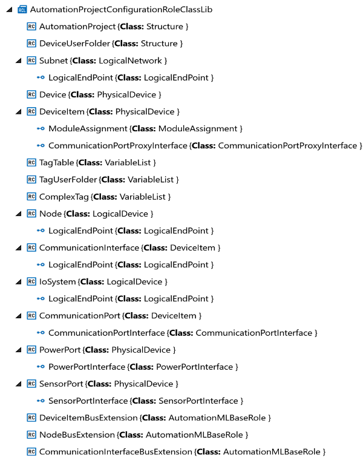

Рисунок 17 – AutomationProjectConfigurationRoleClassLib у поданні редактора AutomationML

```xml
<RoleClassLib Name="AutomationProjectConfigurationRoleClassLib">
	<Description>Automation Markup Language Automation Project Configuration Data Class Library</Description>
	<Version>1.4.0</Version>
	<RoleClass Name="AutomationProject" RefBaseClassPath="AutomationMLBaseRoleClassLib/AutomationMLBaseRole/Structure">
		<Attribute Name="ProjectManufacturer" AttributeDataType="xs:string"/>
		<Attribute Name="ProjectSign" AttributeDataType="xs:string"/>
		<Attribute Name="ProjectRevision" AttributeDataType="xs:string"/>
		<Attribute Name="ProjectInformation" AttributeDataType="xs:string"/>
	</RoleClass>
	<RoleClass Name="DeviceUserFolder" RefBaseClassPath="AutomationMLBaseRoleClassLib/AutomationMLBaseRole/Structure"/>
	<RoleClass Name="Subnet" RefBaseClassPath="CommunicationRoleClassLib/LogicalNetwork">
		<Attribute Name="Type" AttributeDataType="xs:string"/>
		<Attribute Name="CustomAttributes">
			<RefSemantic CorrespondingAttributePath="ListType"/>
			<Attribute Name="AttributeName1" AttributeDataType="xs:string"/>
			<Attribute Name="AttributeName2" AttributeDataType="xs:string"/>
		</Attribute>
		<ExternalInterface Name="LogicalEndPoint" RefBaseClassPath="CommunicationInterfaceClassLib/LogicalEndPoint" ID="3e661cba-acfc-43b8-a02b-14ad7061f137"/>
	</RoleClass>
	<RoleClass Name="Device" RefBaseClassPath="CommunicationRoleClassLib/PhysicalDevice">
		<Attribute Name="TypeIdentifier" AttributeDataType="xs:string">
			<Attribute Name="TemplateIdentifier" AttributeDataType="xs:string"/>
		</Attribute>
		<Attribute Name="Comment" AttributeDataType="xs:string"/>
		<Attribute Name="Manufacturer" AttributeDataType="xs:string"/>
	</RoleClass>
	<RoleClass Name="DeviceItem" RefBaseClassPath="CommunicationRoleClassLib/PhysicalDevice">
		<Attribute Name="TypeName" AttributeDataType="xs:string"/>
		<Attribute Name="DeviceItemType" AttributeDataType="xs:string">
			<Attribute Name="Customized" AttributeDataType="xs:boolean">
				<DefaultValue>false</DefaultValue>
			</Attribute>
		</Attribute>
		<Attribute Name="PositionNumber" AttributeDataType="xs:int"/>
		<Attribute Name="BuiltIn" AttributeDataType="xs:boolean">
			<DefaultValue>false</DefaultValue>
		</Attribute>
		<Attribute Name="TypeIdentifier" AttributeDataType="xs:string">
			<Attribute Name="TemplateIdentifier" AttributeDataType="xs:string"/>
		</Attribute>
		<Attribute Name="Manufacturer" AttributeDataType="xs:string"/>
		<Attribute Name="CustomAttributes">
			<RefSemantic CorrespondingAttributePath="ListType"/>
			<Attribute Name="AttributeName1" AttributeDataType="xs:string"/>
			<Attribute Name="AttributeName2" AttributeDataType="xs:string"/>
		</Attribute>
		<Attribute Name="FirmwareVersion" AttributeDataType="xs:string"/>
		<Attribute Name="PlantDesignation IEC" AttributeDataType="xs:string">
			<Description>Function oriented reference designation following IEC 81346</Description>
			<RefSemantic CorrespondingAttributePath="IEC 81346-1:2009-07#5.3 - Function-oriented structure"/>
		</Attribute>
		<Attribute Name="LocationIdentifier IEC" AttributeDataType="xs:string">
			<Description>Location oriented reference designation following IEC 81346</Description>
			<RefSemantic CorrespondingAttributePath="IEC 81346-1:2009-07#5.5 - Location-oriented structure"/>
		</Attribute>
		<Attribute Name="ProductDesignation IEC" AttributeDataType="xs:string">
			<Description>Product oriented reference designation following IEC 81346</Description>
			<RefSemantic CorrespondingAttributePath="IEC 81346-1:2009-07#5.4 - Product-oriented structure"/>
		</Attribute>
		<Attribute Name="InstallationDate" AttributeDataType="xs:dateTime"/>
		<Attribute Name="Comment" AttributeDataType="xs:string"/>
		<Attribute Name="Address">
			<RefSemantic CorrespondingAttributePath="OrderedListType"/>
			<Attribute Name="1">
				<Attribute Name="StartAddress" AttributeDataType="xs:int"/>
				<Attribute Name="Length" AttributeDataType="xs:int"/>
				<Attribute Name="IoType" AttributeDataType="xs:string"/>
				<Attribute Name="BitOffset" AttributeDataType="xs:int"/>
			</Attribute>
			<Attribute Name="2">
				<Attribute Name="StartAddress" AttributeDataType="xs:int"/>
				<Attribute Name="Length" AttributeDataType="xs:int"/>
				<Attribute Name="IoType" AttributeDataType="xs:string"/>
				<Attribute Name="BitOffset" AttributeDataType="xs:int"/>
			</Attribute>
			<Attribute Name="3">
				<Attribute Name="StartAddress" AttributeDataType="xs:int"/>
				<Attribute Name="Length" AttributeDataType="xs:int"/>
				<Attribute Name="IoType" AttributeDataType="xs:string"/>
				<Attribute Name="BitOffset" AttributeDataType="xs:int"/>
			</Attribute>
		</Attribute>
		<ExternalInterface Name="ModuleAssignment" RefBaseClassPath="AutomationProjectConfigurationInterfaceClassLib/ModuleAssignment" ID="110c6f0b-75b7-4c3c-9d05-1b28eeeec5df"/>
		<ExternalInterface Name="CommunicationPortProxyInterface" ID="0bfb4d8a-63d2-4d32-ad0a-3bb3f6673165" RefBaseClassPath="AutomationProjectConfigurationInterfaceClassLib/CommunicationPortProxyInterface"/>
	</RoleClass>
	<RoleClass Name="TagTable" RefBaseClassPath="CommunicationRoleClassLib/PhysicalDevice/VariableList">
		<Attribute Name="AssignToDefault" AttributeDataType="xs:boolean"/>
	</RoleClass>
	<RoleClass Name="TagUserFolder" RefBaseClassPath="CommunicationRoleClassLib/PhysicalDevice/VariableList"/>
	<RoleClass Name="ComplexTag" RefBaseClassPath="CommunicationRoleClassLib/PhysicalDevice/VariableList">
		<Attribute Name="DataType" AttributeDataType="xs:string">
			<DefaultValue>Mandatory</DefaultValue>
		</Attribute>
		<Attribute Name="Comment" AttributeDataType="xs:string">
			<DefaultValue>Optional</DefaultValue>
		</Attribute>
	</RoleClass>
	<RoleClass Name="Node" RefBaseClassPath="CommunicationRoleClassLib/LogicalDevice">
		<Attribute Name="Type" AttributeDataType="xs:string"/>
		<Attribute Name="NetworkAddress" AttributeDataType="xs:string"/>
		<Attribute Name="CustomAttributes">
			<RefSemantic CorrespondingAttributePath="ListType"/>
			<Attribute Name="AttributeName1" AttributeDataType="xs:string"/>
			<Attribute Name="AttributeName2" AttributeDataType="xs:string"/>
		</Attribute>
		<ExternalInterface Name="LogicalEndPoint" RefBaseClassPath="CommunicationInterfaceClassLib/LogicalEndPoint" ID="9562e3ae-8c2b-4055-a327-3ab66f949d5e"/>
	</RoleClass>
	<RoleClass Name="CommunicationInterface" RefBaseClassPath="AutomationProjectConfigurationRoleClassLib/DeviceItem">
		<Attribute Name="Label" AttributeDataType="xs:string"/>
		<Attribute Name="Type" AttributeDataType="xs:string"/>
		<ExternalInterface Name="LogicalEndPoint" RefBaseClassPath="CommunicationInterfaceClassLib/LogicalEndPoint" ID="dedad3eb-1a51-4d7e-accb-fdc8213c6c23"/>
	</RoleClass>
	<RoleClass Name="IoSystem" RefBaseClassPath="CommunicationRoleClassLib/LogicalDevice">
		<Attribute Name="Number" AttributeDataType="xs:int"/>
		<Attribute Name="CustomAttributes">
			<RefSemantic CorrespondingAttributePath="ListType"/>
			<Attribute Name="AttributeName1" AttributeDataType="xs:string"/>
			<Attribute Name="AttributeName2" AttributeDataType="xs:string"/>
		</Attribute>
		<ExternalInterface Name="LogicalEndPoint" RefBaseClassPath="CommunicationInterfaceClassLib/LogicalEndPoint" ID="003f6b58-c95a-4346-8a0c-aaad895a6492"/>
	</RoleClass>
	<RoleClass Name="CommunicationPort" RefBaseClassPath="AutomationProjectConfigurationRoleClassLib/DeviceItem">
		<Attribute Name="Label" AttributeDataType="xs:string"/>
		<ExternalInterface Name="CommunicationPortInterface" RefBaseClassPath="AutomationProjectConfigurationInterfaceClassLib/CommunicationPortInterface" ID="b0f1bb7c-1df9-494e-8352-0cae067e357d"/>
	</RoleClass>
	<RoleClass Name="PowerPort" RefBaseClassPath="CommunicationRoleClassLib/PhysicalDevice">
		<Attribute Name="Label" AttributeDataType="xs:string"/>
		<ExternalInterface Name="PowerPortInterface" ID="6c3e2230-64d8-42e6-9ddd-3dbdf3310064" RefBaseClassPath="AutomationProjectConfigurationInterfaceClassLib/PowerPortInterface"/>
	</RoleClass>
	<RoleClass Name="SensorPort" RefBaseClassPath="CommunicationRoleClassLib/PhysicalDevice">
		<Attribute Name="Label" AttributeDataType="xs:string"/>
		<ExternalInterface Name="SensorPortInterface" ID="32d38c98-80cb-4850-b3a2-ad789e4ab96a" RefBaseClassPath="AutomationProjectConfigurationInterfaceClassLib/SensorPortInterface"/>
	</RoleClass>
	<RoleClass Name="DeviceItemBusExtension" RefBaseClassPath="AutomationMLBaseRoleClassLib/AutomationMLBaseRole"/>
	<RoleClass Name="NodeBusExtension" RefBaseClassPath="AutomationMLBaseRoleClassLib/AutomationMLBaseRole"/>
	<RoleClass Name="CommunicationInterfaceBusExtension" RefBaseClassPath="AutomationMLBaseRoleClassLib/AutomationMLBaseRole"/>
</RoleClassLib>
```

Рисунок 18 – AutomationProjectConfigurationRoleClassLib у вигляді XML-представлення

Примітка: Атрибути ролей можуть бути «обов’язковими» або «необов’язковими»:
• обов’язкові: інструмент експорту експортує атрибут, а інструмент імпорту імпортує атрибут. Інструмент імпорту може коригувати значення;
• необов’язкові: інструмент експорту може експортувати цей атрибут. Інструмент імпорту імпортує атрибут, якщо інструмент експорту його експортував і він існує на стороні імпорту. Інструмент імпорту може коригувати значення.

#### 5.1.1 AutomationProject

AutomationProject є похідним від Structure відповідно до документа AutomationML Whitepaper – Architecture and general requirements. Він визначається таким чином.

Таблиця 2 – Визначення AutomationProject

...

5.1.2 DeviceUserFolder

...

### 5.2 InterfaceClassLibrary

...

### 5.3 Моделювання складних значень

Для подання складних типів даних, наприклад для CustomAttributes, підпорядковані атрибути можуть бути додатково деталізовані з використанням вкладених списків. Такі списки мають бути типу ListType або OrderedListType з урахуванням рекомендації BPR «Modelling of List Attributes in AutomationML». За допомогою цього розширення складні типи даних, такі як структури, таблиці або масиви, у підпорядкованих значеннях CustomAttributes можуть бути змодельовані.

Приклади наведено в додатку B.

## Додаток A Наскрізна інженерія та ідентифікація логічних об’єктів AR APC

У цьому додатку описано різні сценарії використання, що стосуються наскрізної інженерії між інструментами ECAD та PLC. Ці сценарії показують відмінності в обробці UUID тегів. У кожному сценарії перший «Потік подій» ілюструє випадок, коли інструмент PLC не зберігає UUID як сталий, унаслідок чого життєвий цикл тегу завершується на кожному кроці імпорту або експорту.

Другий «Потік подій» ілюструє випадок, коли UUID тегу зберігається сталим протягом усього двонапрямленого процесу обміну даними, що призводить до збереження тегу на кожному кроці імпорту та експорту.

...

## Додаток B CustomAttributes – складні типи даних

У цьому додатку описано різні сценарії використання, що стосуються розширення CustomAttributes складними типами даних, такими як структури, таблиці або масиви.

...

## Додаток C CommunicationPortProxyInterface – підключувані порти

У цьому додатку описано сценарій використання, що стосується розширення для моделювання підключуваних портів.

CommunicationPortProxyInterface представляє з’єднання між батьківським підключуваним модулем та його вбудованими портами у випадку, коли вбудовані порти передаються як частина головного модуля.

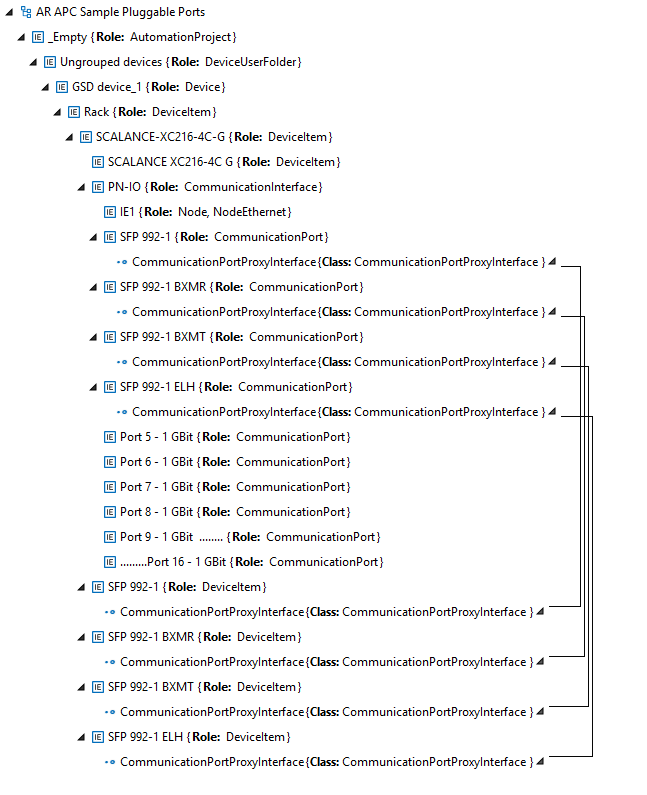

## Джерела

1. AR APC v1.4 https://www.automationml.org/news/new-version-of-the-ar-apc-is-now-available/


## Автори


Переклав  [Олександр Пупена](https://github.com/pupenasan). 

## Feedback

Якщо Ви хочете залишити коментар у Вас є наступні варіанти:

- [Обговорення у WhatsApp](https://chat.whatsapp.com/BRbPAQrE1s7BwCLtNtMoqN)
- [Обговорення в Телеграм](https://t.me/+GA2smCKs5QU1MWMy)
- [Група у Фейсбуці](https://www.facebook.com/groups/asu.in.ua)

Про проект і можливість допомогти проекту написано [тут](https://asu-in-ua.github.io/atpv/)