[<- До підрозділу](README.md)		[Коментувати](#feedback)

# Application Recommendation Automation Project Configuration (AR APC)

Це переклад [AR APC v1.4 ](https://www.automationml.org/news/new-version-of-the-ar-apc-is-now-available/)

## 1 Вступ

Дуже поширеним завданням у межах процесу проєктування виробничих і автоматизаційних систем є обмін інформацією конфігурації автоматизаційного проєкту щодо пристроїв систем автоматизації між системами ECAD та PLC. Щоб уникнути дублювання інженерних робіт у задіяних системах, системи ECAD і PLC повинні мати інтерфейс для спільного використання цієї інформації. У разі початку інженерних робіт в інструменті ECAD необхідно дотримуватися певних правил, щоб апаратна інформація була розміщена у правильному місці в інструменті PLC. У разі початку інженерних робіт в інструменті PLC нерозміщені функції повинні бути розміщені та опрацьовані в інструменті ECAD.

Ця рекомендація щодо застосування описує зазначені робочі процеси та метод моделювання конфігурації апаратного забезпечення з використанням AutomationML.

### 1.1 Основи

Формат обміну даними AutomationML, який стандартизується в межах стандарту IEC 62714, є нейтральним, вільним та заснованим на XML форматом даних. Його було розроблено з метою підтримки обміну даними між інженерними інструментами в гетерогенному середовищі інженерних засобів. З огляду на різні аспекти AutomationML стандарт IEC 62714 складається з кількох частин.

Таблиця 1 – Огляд частин AutomationML

| Частина / ідентифікатор документа                   | Назва                             | Опис                                                         |
| --------------------------------------------------- | --------------------------------- | ------------------------------------------------------------ |
| Part 1 / WP Arch, V 2.0.0                           | Архітектура та загальні вимоги    | Ця частина визначає загальну архітектуру AutomationML, моделювання інженерних даних, класів, екземплярів, відношень, посилань, ієрархій, базових бібліотек AutomationML та розширених концепцій AutomationML. |
| Part 2 / WP Lib V 2.0.0                             | Бібліотеки класів ролей           | Ця частина визначає додаткові бібліотеки AutomationML.       |
| Whitepaper / WP Comm V 1.0.0                        | Комунікація                       | Цей Whitepaper описує моделювання комунікаційних механізмів в AutomationML. |
| Whitepaper / WP eCl@ss V 2.0.0                      | Інтеграція AutomationML та eCl@ss | Цей Whitepaper описує інтеграцію eCl@ss в AutomationML.      |
| Best Practice Recommendation / BPR MlingExp V 1.0.0 | Багатомовні вирази в AutomationML | Цей Whitepaper описує роботу з різними текстами для різних мов в AutomationML. |
| Best Practice Recommendation / BPR RefDes V 1.0.0   | Моделювання референтних позначень | Цей Whitepaper описує роботу з референтними позначеннями відповідно до IEC 81346-1:2009-07 в AutomationML. |
| Best Practice Recommendation / BPR MlingList Attr.  | Моделювання атрибутів списків     | Ця рекомендація описує, як моделювати типи даних списків в AutomationML. |

Подальші частини можуть бути додані в майбутньому, наприклад, з метою інтеграції додаткових стандартів даних з AutomationML.

### 1.2 Область застосування

Ця рекомендація щодо застосування пропонує метод моделювання даних конфігурації автоматизаційного проєкту з використанням інженерного формату даних AutomationML. У ній описується рекомендоване використання класів ролей і класів інтерфейсів, а також рекомендовані структури, які слід враховувати в ієрархії екземплярів проєкту AutomationML.

### 1.3 Нормативні посилання

Наведені нижче документи є посилальними в цьому документі та є обов’язковими для його застосування. Для датованих посилань застосовується лише наведене видання. Для недатованих посилань застосовується останнє видання відповідного документа (включно з усіма змінами).

- Extensible Markup Language (XML) 1.0:2004, рекомендація W3C (доступна за адресою http://www.w3.org/TR/2004/REC-xml-20040204/)
- IEC 62424:2008, Representation of process control engineering – Requests in P&I diagrams and data exchange between P&ID tools and PCE-CAE tools
- Whitepaper AutomationML Part 1 – AutomationML Architecture, November 2018
- Whitepaper AutomationML Part 2 – AutomationML Role Libraries, October 2014
- Whitepaper AutomationML – AutomationML Communication, September 2014
- Whitepaper AutomationML – AutomationML and eCl@ss Integration, November 2021
- Best Practice Recommendation Multilingual expressions in AutomationML, March 2017
- Best Practice Recommendation Modelling of Reference Designations, September 2017
- Best Practice Recommendation Modelling of List Attributes in AutomationML, January 2016

## 2 Загальні зауваження щодо обміну даними конфігурації автоматизаційного проєкту

Інструменти ECAD і інструменти PLC мають різні подання інформації про систему автоматизації. Якщо інструменти ECAD відображають усі електричні деталі пристроїв, що застосовуються в автоматизаційних системах, то в інструментах PLC використовується лише логічна композиція пристроїв автоматизації. Так, в інструментах ECAD визначаються, наприклад, пристрої, задіяні в системі автоматизації, клеми напруги, що використовуються для живлення пристроїв, а також типи проводів, якими з’єднуються пристрої. Однак ці елементи не використовуються в інструментах PLC.

З іншого боку, в інструментах PLC визначаються умови, специфічні для пристроїв і прикладних програм керування, наприклад швидкості передавання даних, що використовуються в комунікаційних з’єднаннях, змінні керуючого коду, пов’язані з входами та виходами керувальних пристроїв, а також прикладні коди керування. Ця інформація, у свою чергу, не потрібна в інструментах ECAD.

Водночас обидва типи інструментів мають спільну інформацію. Наприклад, підключення певного пристрою автоматизації до PLC визначає адресу, за якою до цього пристрою можна звертатися в PLC. Це необхідно враховувати під час розроблення засобів імпорту та експорту. На рисунку 1 показано область застосування цієї рекомендації щодо застосування.

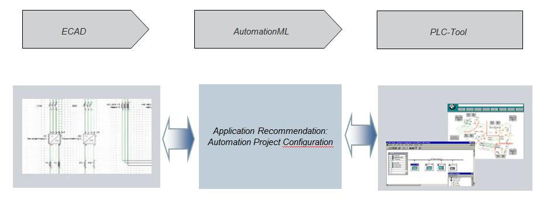

Рисунок 1 – Конфігурація автоматизаційного проєкту між інструментами ECAD та PLC

Окрім зазначених інженерних інструментів для ECAD і програмування PLC, спільним набором даних обох інструментів можуть бути зацікавлені й інші засоби. Наприклад, інструменти механічного проєктування (MCAD) можуть бути зацікавлені у пристроях, що підлягають підключенню, а інструменти документації – у сформованій структурі з’єднань. Проте в межах цього документа розглядаються лише інструменти ECAD і програмування PLC, з урахуванням того, що й інші інженерні інструменти можуть отримати користь від імпорту змодельованої інформації.

Системи, що містять приводи, можуть включати різні аспекти, відмінні від електричної конфігурації. Тому окрема рекомендація щодо застосування «Drive for MCAD» (AR Drive MCAD) пропонуватиме метод моделювання механічних аспектів конфігурацій приводів, тоді як спеціальне розширення для приводів оброблятиме електричну конфігурацію приводів. У ній буде описано рекомендоване використання класів ролей і класів інтерфейсів для приводів, а також рекомендовані структури, які слід враховувати в ієрархії екземплярів проєкту AutomationML.

### 2.1 Робочий процес обміну даними

Зазвичай у процесі інженерії виробничої системи етап побудови в проєкті PLC починається пізніше, ніж у системі ECAD, оскільки завершення ECAD-документації є основою для виготовлення шафи керування. Поєднання з програмним забезпеченням на об’єкті та подальше введення в експлуатацію не відбуваються до завершення виготовлення всіх шаф керування.

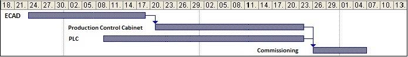

Рисунок 2 – Робочий процес обміну даними

Отже, інженер PLC зазвичай залучається до проєкту пізніше, ніж інженер ECAD. Водночас уже на ранньому етапі (під час виконання ECAD-інженерії) конфігурація автоматизаційного проєкту об’єкта має бути визначена, оскільки необхідно сформувати ECAD-документацію та замовити комплектувальні вироби.

### 2.2 Можливості конфігурації

Системи ECAD зазвичай можуть працювати з компонентами різних виробників PLC, які з точки зору електричного апаратного забезпечення мають певні аналогії. Однак, окрім цього, існують системно-специфічні та виробник-специфічні параметри. Тому лише інженерна система виробника PLC може гарантувати повну та зручну роботу з усіма параметрами апаратного компонента. Отже, конфігурацію системи PLC слід, наскільки це можливо, виконувати в інженерній системі виробника PLC.

### 2.3 Рекомендований робочий процес

Відповідно до описаних критеріїв у більшості випадків встановлюється такий робочий процес:

- виконання базової конфігурації пристроїв у проєкті PLC в інструменті програмування PLC та експорт її до інструмента ECAD;
- імпорт проєкту PLC в інструмент ECAD, виконання ECAD-проєкту та експорт ECAD-проєкту до інструмента програмування PLC;
- імпорт ECAD-проєкту в інструмент програмування PLC та виконання інженерних робіт у проєкті PLC.

#### 2.3.1 Надання початкового проєкту PLC як основи для електротехнічного проєктування

Якщо ECAD-проєкт на цей момент ще не існує, інженер ECAD насамперед створює початковий проєкт в інженерній системі виробника PLC, тобто в інструменті програмування PLC. Інженер ECAD вибирає всі необхідні компоненти та визначає топологію шини у тісній співпраці з інженером PLC, який згодом реалізовуватиме необхідні функції. Така тісна співпраця забезпечує високу узгодженість щодо вибраних апаратних компонентів. Конфігурація автоматизаційного проєкту експортується з інженерної системи виробника PLC та імпортується в інструмент ECAD.

#### 2.3.2 ECAD-інженерія

На основі наявного ECAD-проєкту інженер ECAD виконує повну апаратну побудову, інколи з незначними коригуваннями. Під час цього процесу також можуть бути визначені символьні імена змінних, тегів або сигналів. Таким чином, конфігурація PLC виконується за таких умов:

- конфігурація PLC може бути імпортована з системи програмування PLC;
- конфігурація виконується шляхом графічного розміщення на оглядовій сторінці або в навігаторі;
- вибір PLC-пристроїв здійснюється з бази даних ECAD;
- використовується перетягування Drag&Drop зі сторінок навігатора.

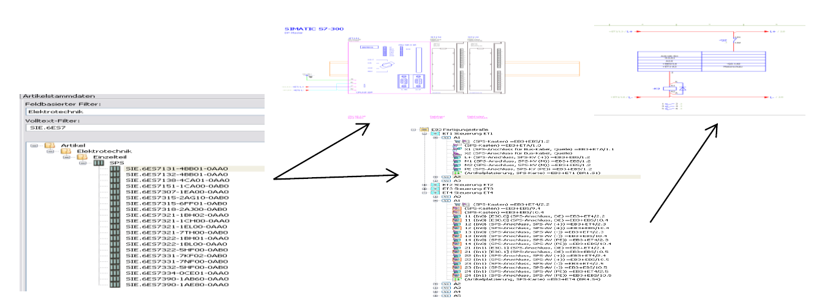

Рисунок 3 – Приклад конфігурації PLC та графічного розміщення

Після завершення конфігурації PLC виконується проєктування станцій і даних шин. Зазвичай це здійснюється шляхом ручного призначення модулів до CPU та пристроїв до шини через властивості пристроїв.

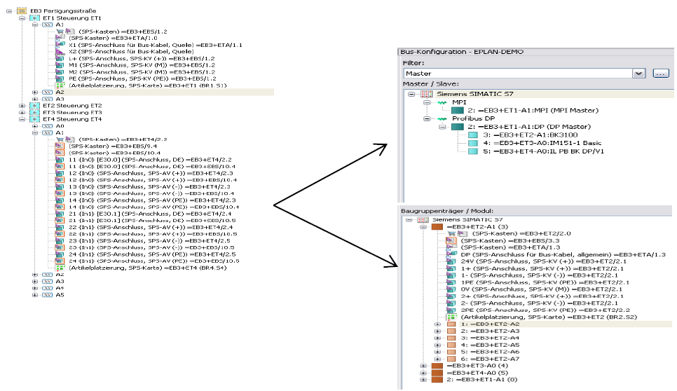

Рисунок 4 – Приклад конфігурації станцій і даних шин

На наступному кроці виконується проєктування списку тегів, тобто переліку тегів, змінних або сигналів (символьних адрес), пов’язаних з апаратними тегами:

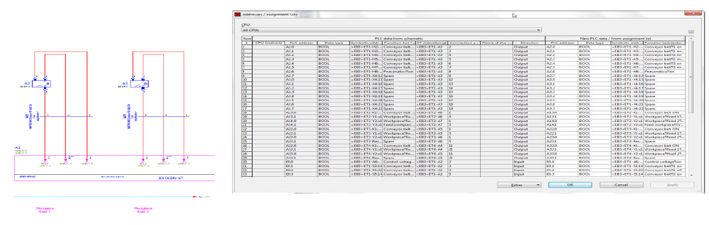

Рисунок 5 – Приклад конфігурації символьних адрес

Нарешті слід виконати просту перевірку на помилки, наприклад:

- подвійне використання адрес I/O, шинних або символьних адрес;
- відсутні адреси;
- прості правила, наприклад резервування слота 3 для модуля IM.

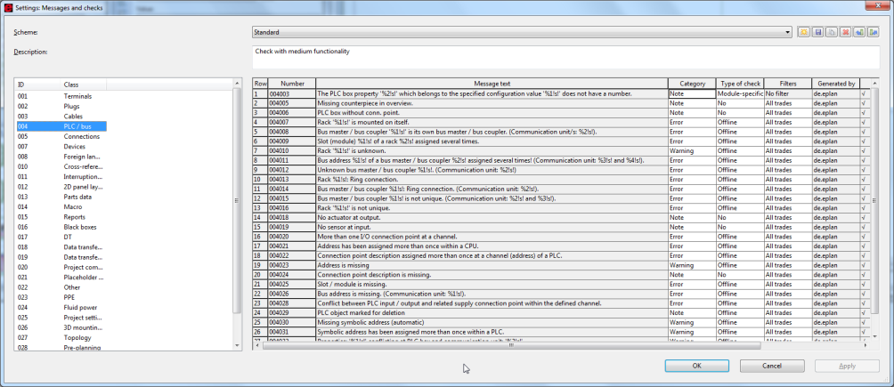

Рисунок 6 – Приклад перевірки на помилки

Після цього ECAD-проєкт може бути експортований у формат AutomationML залежно від реалізації в інструменті ECAD та імпортований в інструмент програмування PLC.

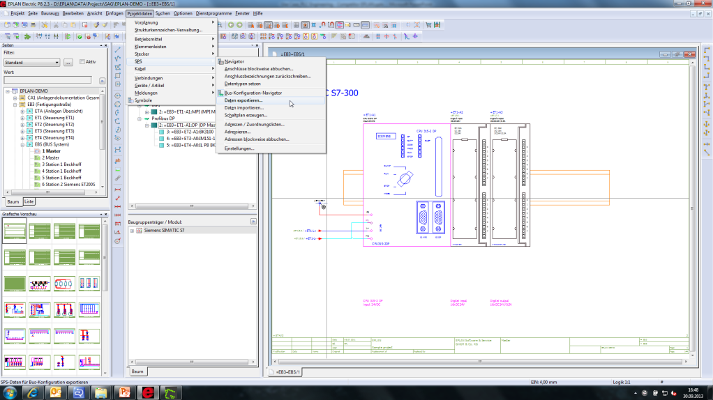

Рисунок 7 – Приклад експорту з інструмента ECAD

#### 2.3.3 PLC-інженерія

На пізнішому етапі інженер програмування PLC розпочинає роботи на основі вже розробленого ECAD-проєкту. На цьому етапі інженерного процесу слід використовувати функцію експорту системи ECAD та функцію імпорту системи PLC для перевірки можливих змін і підтвердження еквівалентності обох конфігурацій.

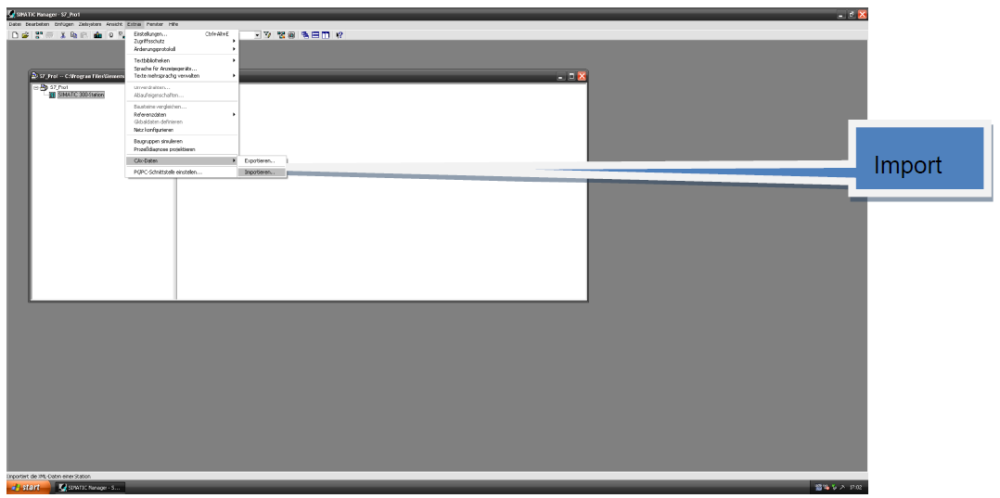

Рисунок 8 – Приклад імпорту в систему PLC

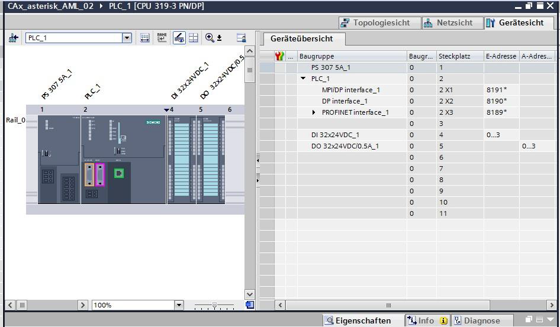

Рисунок 9 – Приклад результату імпорту в систему PLC

## 3 Структури даних конфігурації автоматизаційного проєкту в AutomationML

У цьому розділі визначається концепція подання даних конфігурації автоматизаційного проєкту в AutomationML.

### 3.1 Базова концепція

Для використання AutomationML як нейтрального формату обміну даними конфігурації автоматизаційного проєкту необхідно відокремити PLC-специфічні інтерфейси різних виробників PLC. Це забезпечує незалежність як подальшого розвитку інструментів PLC, так і подальшого розвитку інструментів ECAD. Крім того, перетворення та впровадження мають бути максимально простими як для постачальників ECAD, так і для постачальників PLC. Тому вже наявні моделі слід використовувати настільки, наскільки це можливо.

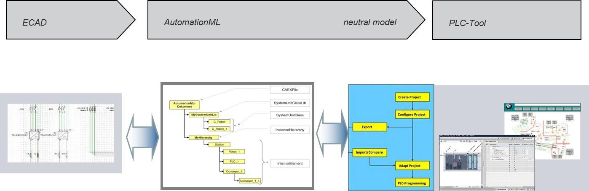

Рисунок 10 – Базова концепція обміну даними між ECAD та PLC

Використання нейтральної моделі дає змогу:

- визначати в AutomationML ролі, незалежні від конкретного інструмента PLC;
- визначати в AutomationML PLC-специфічні SystemUnitClass для різних інструментів ECAD і PLC та різних виробників;
- визначати в AutomationML PLC-специфічні InterfaceClass.

#### 3.1.1 Експорт з ECAD до AutomationML

На наведеному нижче рисунку показано детальний процес експорту даних конфігурації автоматизаційного проєкту на основі прикладу EPLAN.

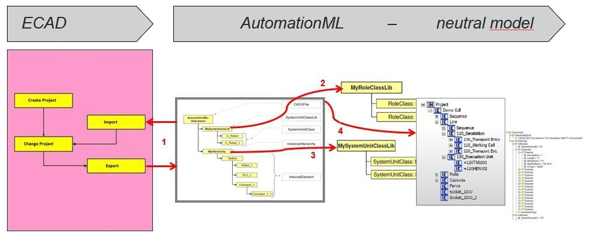

Рисунок 11 – Базова концепція експорту з ECAD (приклад EPLAN)

1. Експорт та імпорт даних конфігурації автоматизаційного проєкту з AutomationML та до AutomationML
2. Незалежні від виробника ролі в AutomationML
3. Нейтральні SystemUnitClass в AutomationML
4. Топологія в AutomationML (нейтральна модель)

#### 3.1.2 Імпорт з AutomationML у PLC

На наведеному нижче рисунку показано детальний процес імпорту даних конфігурації автоматизаційного проєкту на основі прикладу Step 7.

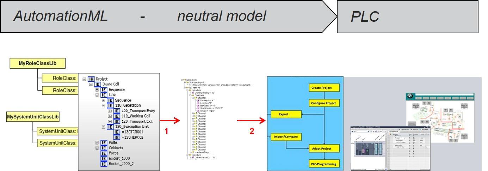

Рисунок 12 – Базова концепція імпорту в PLC (приклад Step 7)

1. Імпорт даних ECAD з AutomationML (нейтральна модель)
2. Імпорт з нейтральної моделі в PLC-інструмент, специфічний для виробника (приклад S7)

### 3.2 Нейтральна модель: дані конфігурації автоматизаційного проєкту

Метою є підтримка інженерного робочого процесу між системами ECAD та інженерними системами PLC. Надання стандартизованих інтерфейсів для обміну даними між системами PLC і ECAD є обов’язковим. Інтерфейсування з системами ECAD як додаткову цільову групу охоплює всіх виробників ECAD.

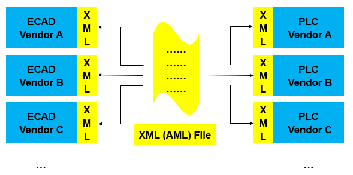

Рисунок 13 – Зв’язування CAE та PLC

Отже, необхідно враховувати різні системи ECAD та виробників CAE. Тому термін «ECAD» використовується як узагальнення для різних форматів CAE, E-CAD та E-CAE залежно від наявних систем ECAD. На цій основі в наступному розділі визначається реалізація нейтрального формату «proxy ECAD» в AutomationML. Крім того, слід враховувати вже наявні концепції провідних виробників інструментів ECAD і виробників PLC, щоб забезпечити максимально просту реалізацію цієї нейтральної моделі для всіх виробників ECAD і PLC.

#### 3.2.1 Базові ідеї

Дані конфігурації автоматизаційного проєкту можуть бути змодельовані з використанням AutomationML. Відповідно, методологія моделювання ґрунтується на концепціях моделювання топології AutomationML з використанням CAEX, визначених у частині 1 стандарту AutomationML. До базових визначень додаються додаткові положення для виконання спеціальних вимог, що виникають під час обміну даними з інструментами ECAD. Методологія моделювання даних конфігурації автоматизаційного проєкту дає змогу створити самодостатню модель. Обов’язкові залежності від інших моделей відсутні.

Для моделювання даних конфігурації автоматизаційного проєкту визначається виробниконезалежна структура даних конфігурації автоматизаційного проєкту. У своїй базовій структурі вона відображає нейтральну об’єктну модель систем PLC.

Обмін даними базується на повній інформації про об’єкти. Це означає, що дані конфігурації автоматизаційного проєкту завжди містять повні дані про сам об’єкт, а не лише дельта-інформацію.

Гранулярність експорту та імпорту відповідає рівню апаратних станцій, оскільки інженерні системи PLC завжди працюють на рівні станції. Експорт та імпорт або підтримують обмін даними, що стосуються однієї чи кількох станцій (наприклад, усього проєкту), або лише частин станції (наприклад, одного окремого модуля). При цьому завжди вимагається, щоб «оточення», в якому існує ця частина, також було складовою обміну даними.

До області цього обміну даними входить лише інформація про апаратну конфігурацію PLC пристроїв автоматизації, включно з деякими релевантними параметрами та символами або тегами, пов’язаними з апаратними об’єктами. Додатково до формату обміну включається інформація про мережі, до яких підключені ці апаратні конфігурації.

Лише підмножина всіх даних, що надаються апаратною конфігурацією PLC, є релевантною для обміну даними з системами ECAD. З огляду на електричне подання об’єкта, з яким працюють інструменти ECAD, ці інструменти можуть надавати лише дуже загальну підмножину інформації, що належить до апаратних об’єктів PLC. Специфічні параметричні налаштування належать до сфери відповідальності інструментів апаратної конфігурації PLC та відповідних менеджерів об’єктів, специфічних для виробника. Вони можуть оброблятися лише у виробник-специфічному інструменті.

Окрім стандартних пристроїв у каталогах апаратного забезпечення PLC, існують деякі типи елементів пристроїв, які потребують додаткових описів. Прикладами цього є описи GSD або GSDML. Пристрої та елементи пристроїв, такі як стандартні slave-пристрої або IODevices на основі GSDML, можуть бути створені в конфігурації PLC лише за умови встановлення відповідного опису або пакета. Відповідальність за наявність коректної та актуальної інформації про елементи пристроїв (GSD тощо) покладається на програміста PLC. Водночас файл обміну даними ECAD на основі AutomationML може містити інформацію про необхідні описи елементів пристроїв.

Деякі системи ECAD здатні надавати інформацію про необхідний файл опису. Інші також можуть передавати сам файл. Тому допускається передавання цих додаткових даних із системи ECAD до інженерної системи PLC. Очікується, що файли передаватимуться, наприклад, у вигляді zip-архіву та розпаковуватимуться в той самий каталог, що й файл імпорту. Таким чином, має бути можливим зазначити та посилатися на файл у файлі обміну даними. Користувач системи PLC, який імпортує файл, може очікувати знайти частину або всі необхідні описи в тому самому каталозі, що й файл імпорту. Посилання на файл опису додається як окрема властивість для модуля та слугує прив’язкою до опису елемента.

#### 3.2.2 Вміст обміну даними

Аналіз уже наявних пропрієтарних XML-орієнтованих файлів обміну даними провідних виробників PLC та ECAD щодо даних конфігурації автоматизаційного проєкту показав, що всі дані, які підлягають обміну, можна згрупувати в три основні категорії.

1. Апаратні дані (HW Data): Це дані, що стосуються частин або пристроїв, таких як центральна стійка, slave-пристрій або комутатор. Тому для цієї групи компонентів переважно використовується термін «пристрій» (`device`).  Усередині таких пристроїв існують інші пристрої або елементи пристроїв, наприклад стійки, CPU, джерела живлення, модулі I/O, підмодулі. Для цієї групи компонентів зазвичай використовується термін `DeviceItem`. Додаткові елементи пристроїв, такі як маршрутизатори, комутатори, концентратори та повторювачі, також підтримуються форматом експорту. Пристрої часто групуються в ієрархічну структуру «папок» (`folder`).
2. Символи / теги: Експортуються та імпортуються «символи» (`symbols`) і «теги» (`tags`), призначені елементам пристроїв. Тут розглядаються лише апаратно орієнтовані символи та теги. Символи і теги експортуються разом із цільовим елементом пристрою контролера (тобто CPU), а не з іншими елементами пристроїв, на які вони можуть посилатися (наприклад, модулем I/O). Як і пристрої, теги часто групуються в «таблиці тегів» (`tag tables`) та в ієрархічну структуру «папок» (`folder`).
3. Мережі: Мережі моделюються безпосередньо під проєктом як глобальні об’єкти підмереж. Зв’язок між мережею та елементами пристроїв моделюється як посилання на об’єкт підмережі. Параметри мережі зберігаються в об’єкті мережі. Параметри, що стосуються мережевого інтерфейсу конкретного елемента пристрою, підключеного до мережі, зберігаються в об’єкті вузла цього елемента пристрою. Обмін даними часто регулюється з використанням «каналів», «портів» та «інтерфейсів».

Крім того, у документі «Whitepaper AutomationML Part 5 – AutomationML Communication» уже визначено XML-орієнтовану методологію обміну інформацією про комунікаційні системи між інженерними інструментами, розроблену AutomationML e.V. Ці методи також слід враховувати під час моделювання даних конфігурації автоматизаційного проєкту.

#### 3.2.3 Сумісність з WP Automation Component

Наступна рекомендація має факультативний характер.

Для досягнення інтеграції AR APC з моделями Automation Component рекомендується додавати RoleClass `AutomationComponent` та відповідну інформацію `Nameplate` до кожного ідентифікованого фізичного компонента автоматизації в проєкті AR APC і, за можливості, також до вузлів типу `Device` та `DeviceItem`.

#### 3.2.4 Модель даних обміну даними конфігурації автоматизаційного проєкту

Урахування всіх згаданих та вже наявних моделей приводить до такої базової діаграми обміну даними конфігурації автоматизаційного проєкту.

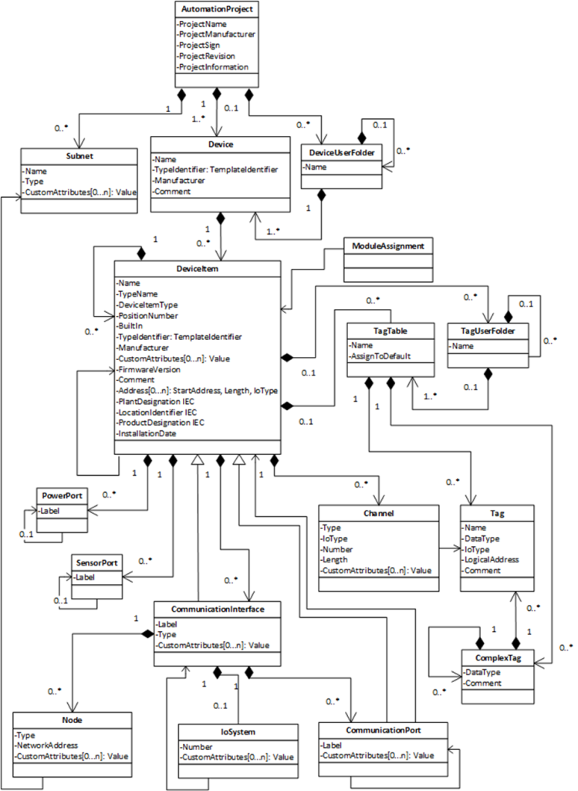

Рисунок 14 – Об’єкти та параметри обміну даними конфігурації автоматизаційного проєкту

Оскільки цей документ також слугує основою для шинно-специфічних визначень і розширень, які описуються в окремих документах, визначено абстрактні RoleClass `DeviceItemBusExtension`, `NodeBusExtension` та `CommunicationInterfaceBusExtension` з метою підготовки простої реалізації майбутніх розширень.

На наступному рисунку ці абстрактні ExtensionRoleClass показані з міркувань наочності лише в області батьківських об’єктів.

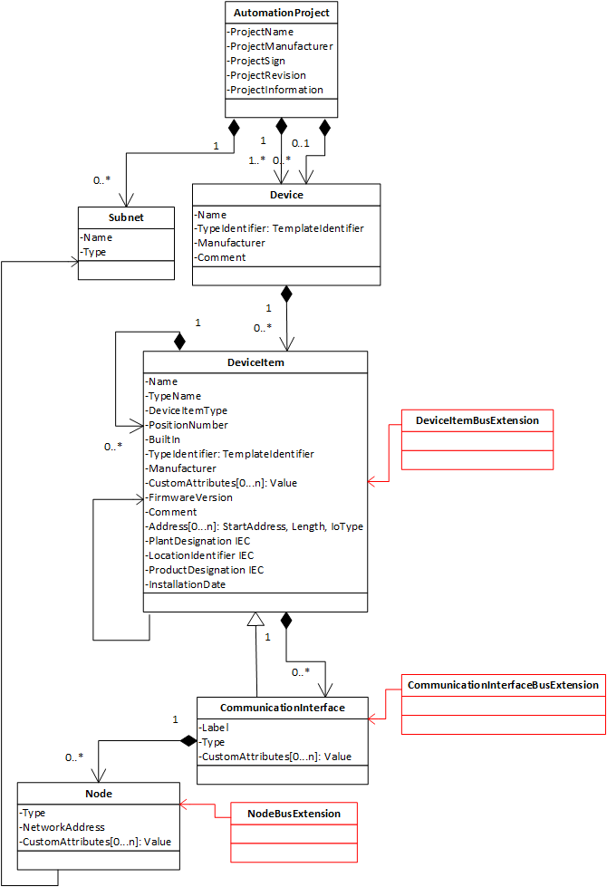

Рисунок 15 – Об’єкти та параметри обміну даними конфігурації автоматизаційного проєкту для розширень

Експорт даних конфігурації автоматизаційного проєкту в AutomationML базується на використанні `InstanceHierarchy`, яка охоплює експортовані дані конфігурації автоматизаційного проєкту. `InternalElement` цієї ієрархії екземплярів посилаються на відповідні елементи в бібліотеках `RoleClass`, `SystemUnitClass` та `InterfaceClass`.

Об’єкти та параметри, показані на наведеному вище рисунку, описуються нижче. Усі об’єкти моделюються як класи ролей або класи інтерфейсів, похідні від класів, визначених у Whitepaper AutomationML Communication, та доповнюються додатковими атрибутами, які вже використовуються в інструментальному середовищі виробників PLC. Додаткові параметри можуть бути визначені з використанням механізмів інтеграції eCl@ss, як описано в документі «Whitepaper AutomationML – AutomationML and eCl@ss Integration». `RoleClass` і `InterfaceClass`, а також об’єкти та атрибути, які не визначені AR APC, можуть ігноруватися відповідно до «AutomationML Whitepaper – Architecture and general requirements» і не зберігатимуться в сценарії roundtrip. Залежно від різних комунікаційних систем і шинних систем деякі об’єкти можуть містити додаткові, невикористані або обмежені атрибути. Ці атрибути та шинно-специфічні параметри описуються в окремих специфікаціях шин. Для отримання додаткової інформації слід звертатися до відповідних специфікацій шин.

Деякі атрибути визначені на основі рядків. Усі рядки визначені у відповідних описах точно з дотриманням написання (використання малих літер, великих літер тощо). Однак з огляду на допустиму похибку всі інструменти імпорту повинні, наскільки це можливо, підтримувати толерантну інтерпретацію цих рядків (змішане написання).

##### 3.2.4.1 AutomationProject

Об’єкт `AutomationProject` представляє проєкт, з якого походить експорт. Він агрегує всі інші об’єкти нижчого рівня. Стандартними параметрами проєкту є його name (string), виробник проєкту `manufacturer` (string), позначення проєкту виробника (string), номер ревізії проєкту (string) та `project information` (string), що містить коментар до проєкту.

##### 3.2.4.2 DeviceUserFolder

`DeviceUserFolder` підтримує структурування пристроїв у межах проєкту. Єдиним стандартним параметром `DeviceUserFolder` є його `name` (string).

##### 3.2.4.3 Subnet

Об’єкт `Subnet` відповідає за зберігання та керування властивостями і функціональністю мереж, таких як Ethernet, PROFIBUS, MPI тощо. Підмережа визначається логічною доступністю всіх учасників підмережі. Усі учасники підмережі мають різні, однозначні адреси. Стандартні параметри об’єкта `Subnet` наведені нижче:

- `Name` (string): назва підмережі;
- `Type` (string): тип підмережі (наприклад, PROFIBUS, MPI тощо). Тип має бути визначений у шинно-специфічному описі;
- `CustomAttributes` (ListType): додаткова виробник-специфічна інформація для підмережі. Містить імена та значення властивостей, специфічних для виробника;
- `Subnet` має рівно один `LogicalEndpoint` для з’єднання підмережі з вузлами.

##### 3.2.4.4 Device

Об’єкт `Device` представляє колекцію, в якій об’єднуються окремі апаратні об’єкти slave-пристрою або стійки, включно з самим апаратним елементом slave або стійки. Таким чином, `Device` є контейнером `DeviceItem`, який слугує колекцією елементів `DeviceItem` (зокрема апаратних елементів). `Device` повинен мати унікальне ім’я в межах автоматизаційного проєкту. Пристрій може бути:

- центральна конфігурація з кількома стійками (станція системи автоматизації з центральними та розширювальними стійками);
- фіксована комбінація CPU та кількох модулів I/O (наприклад, C7);
- станція на базі ПК, де ПК представляє пристрій;
- польовий пристрій;
- комутатор.

Стандартні параметри об’єкта `Device` наведені нижче:

- `Name` (string): ім’я пристрою;
- `TypeIdentifier` (string): ідентифікатор типу пристрою. Необов’язковий додатковий підатрибут `TemplateIdentifier` посилається на шлях до елемента бібліотеки;
- `Manufacturer` (string): додаткова інформація для опису виробника пристрою;
- `Comment` (string): необов’язковий коментар до пристрою.

##### 3.2.4.5 DeviceItem

`DeviceItem` агрегується об’єктом `Device` і представляє узагальнений клас для апаратних модулів і підмодулів (CPU, модуль I/O, стійка тощо). Якщо `Device` представляє логічну оболонку, то `DeviceItem` більшою мірою представляє фізичні апаратні об’єкти.

`DeviceItem` може бути вставлений в інший `DeviceItem` (наприклад, CPU у стійку, підмодуль у модуль). Відносне положення щодо батьківського об’єкта визначається параметром `PositionNumber`.

`DeviceItem` також може бути вбудованим в інший `DeviceItem`. Такі `DeviceItem` можуть моделювати фіксовану комбінацію, яка не може бути розділена (наприклад, `C7`). Стандартні параметри об’єкта `DeviceItem` наведені нижче:

- `Name` (string): ім’я `DeviceItem`;
- `TypeName` (string): додаткова інформація про тип. Необов’язкова, але корисна для користувача у разі помилки;
- `DeviceItemType` (string): класифікація `DeviceItem` (наприклад, CPU). `DeviceItemType` є додатковою інформацією, яка може бути корисною користувачу у разі помилки;
  - `Customized` (boolean): підатрибут `Customized` вказує, чи містить `DeviceItemType` виробник-специфічну інформацію (`Customized = “true”`), чи ні (`Customized = “false”`). Якщо атрибут відсутній або має значення `“false”`, `DeviceItemType` містить уже стандартизовану інформацію (наприклад, CPU);
- `Manufacturer` (string): додаткова інформація для опису виробника `DeviceItem`;
- `CustomAttributes` (ListType): додаткова виробник-специфічна інформація для `DeviceItem`. Визначає імена та значення властивостей, специфічних для виробника;
- `PositionNumber` (int): номер слота, у який вставлено цей `DeviceItem`;
- `BuiltIn` (Boolean): ознака, що вказує на те, що цей модуль є вбудованою частиною іншого модуля. Такий модуль створюється автоматично, оскільки є фіксованою частиною іншого модуля. Якщо параметр відсутній, за замовчуванням має значення false;
- `TypeIdentifier` (string): ідентифікатор типу елемента пристрою. Необов’язковий додатковий підатрибут `TemplateIdentifier` посилається на шлях до елемента бібліотеки;
- `FirmwareVersion` (string): задає версію прошивки, наприклад CPU, і може бути необхідною для коректної ідентифікації модуля (інколи номера замовлення недостатньо);
- `Comment` (string): необов’язковий коментар до модуля;
- `Address` (OrderedListType): адресна інформація елемента пристрою в межах пристрою. Більшість модулів мають призначені діапазони адрес. Наприклад, можуть існувати діапазони адрес для входів і виходів, які описуються початковим значенням і довжиною. Address визначає початок, довжину та тип I/O. Він моделюється як впорядкований список адресних параметрів. Порядок необхідний для ідентифікації коректного підпристрою у разі кількох початкових адрес для одного модуля. Підпараметри наведені нижче:
  - `StartAddress` (int): початок адреси;
  - `Length` (int): загальна ширина модуля (виробник-специфічна). У більшості випадків відповідає ширині всіх каналів;
  - `IoType` (string): вхід або вихід;
  - `BitOffset` (int): початок бітової адреси в межах байта;
  - `InstallationDate` (dateTime): дата встановлення елемента пристрою.

Примітка: Окрім наведених стандартних документів можуть бути додані атрибути, що дають змогу представляти референтні позначення відповідно до IEC 81346. Нижче наведено три можливі приклади таких атрибутів.

- `PlantDesignation IEC` (string): позначення установки для цього елемента пристрою. `PlantDesignation` є референтним позначенням, орієнтованим на продукт, відповідно до IEC 81346-1:2009-07, 5.3 – функціонально орієнтована структура;
- `LocationIdentifier IEC` (string): позначення розташування для цього елемента пристрою. `LocationIdentifier` є референтним позначенням, орієнтованим на розташування, відповідно до IEC 81346-1:2009-07, 5.5 – структурa, орієнтована на розташування;
- `ProductDesignation IEC` (string): позначення продукту для цього елемента пристрою. `ProductDesignation` є референтним позначенням, орієнтованим на продукт, відповідно до IEC 81346-1:2009-07, 5.4 – структурa, орієнтована на продукт.

##### 3.2.4.6 TagTable

`TagTable` підтримує структурування тегів. Стандартні параметри об’єкта `TagTable` наведені нижче:

- `Name` (string): назва `TagTable`;
- `AssignToDefault` (Boolean): під час імпорту, якщо `TagTable` має атрибут `AssignToDefault` зі значенням `True`, усі теги всередині будуть імпортовані до наявної стандартної таблиці тегів. У цьому випадку назва `TagTable` ігнорується інструментом імпорту. Якщо атрибут AssignToDefault відсутній під час імпорту, за замовчуванням вважається значення False.

##### 3.2.4.7 TagUserFolder

`TagUserFolder` підтримує структурування `TagTable` в межах `DeviceItem`. Єдиним стандартним параметром `TagUserFolder` є `name` (string).

##### 3.2.4.8 Tag

`Tag` представляє символьне ім’я даних I/O. Він забезпечує логічне подання каналу модуля і безпосередньо пов’язується з відповідним каналом.

Теги можуть агрегуватися лише таблицею тегів CPU. CPU представляється конкретним `DeviceItem`. Стандартні параметри об’єкта Tag наведені нижче:

- `Name` (string): назва тегу;
- `DataType` (string): тип даних;
  - `Customized` (Boolean): підатрибут `Customized` вказує, чи містить `DataType` виробник-специфічні типи даних (Customized = “true”), чи ні (Customized = “false”). Якщо атрибут відсутній або має значення “false”, DataType містить уже стандартизовані типи даних згідно з IEC 61131 (наприклад, BOOL, BYTE, WORD);
- `IoType` (string): вхід або вихід;
- `LogicalAddress` (string): логічна адреса, що визначає адресу тегу;
- `Comment` (string): необов’язковий коментар до тегу.

Можливі теги без призначених каналів і канали без призначених тегів (неповна інженерія).

##### 3.2.4.9 ComplexTag

`ComplexTag` представляє символьне ім’я структурованих даних I/O. Він забезпечує логічну структуру та агрегує теги для безпосереднього посилання на відповідний канал.

`ComplexTag` може агрегуватися таблицею тегів CPU або іншими `ComplexTag`. CPU представляється конкретним `DeviceItem`. Стандартні параметри об’єкта `ComplexTag` наведені нижче:

- `DataType` (string): назва типу структури;
- `Comment` (string): необов’язковий коментар до `ComplexTag`.

##### 3.2.4.10 Channel

`Channel` є частиною модуля I/O і представляє технологічний інтерфейс (наприклад, цифровий або аналоговий вхід чи вихід). Канал є частиною `DeviceItem`, що представляє модуль I/O, і може використовуватися лише в межах `DeviceItem`. Канал посилається на теги за допомогою зв’язку. Стандартні параметри об’єкта `Channel` наведені нижче:

- `Type` (string): аналоговий або цифровий;
- `IoType` (string): вхід або вихід;
- `Number` (int): номер каналу, починаючи з 0;
- `Length` (int): ширина каналу (наприклад, 1 для біта, 8 для байта, 16 для слова);
- `CustomAttributes` (ListType): додаткова виробник-специфічна інформація для каналу, що визначає імена та значення властивостей виробника.

Канал за допомогою `LinkToTag` посилається на відповідні теги, які зберігаються в DeviceItem CPU.

##### 3.2.4.11 CommunicationInterface

`CommunicationInterface` є спеціальним типом `DeviceItem`, який виступає точкою підключення пристрою до мережі (наприклад, мережева карта). Тому `CommunicationInterface` має `LogicalEndpoint`. Залежно від типу `CommunicationInterface` він може містити різні параметри, специфічні для цього типу. Відповідні шинно-специфічні параметри описуються в окремій специфікації шини. Стандартні параметри об’єкта `CommunicationInterface` наведені нижче:

- `Label` (string): назва, надрукована на елементі, наприклад унікальний ідентифікатор;
- `Type` (string): тип `CommunicationInterface` (наприклад, `ExtensionRack`);
- `CustomAttributes` (ListType): додаткова виробник-специфічна інформація для `CommunicationInterface`, що визначає імена та значення властивостей виробника.

##### 3.2.4.12 Node

`Node` визначає всю мережеву інформацію, пов’язану з інтерфейсом вузла мережі (наприклад, логічну адресу, маску підмережі). `Node` належить `CommunicationInterface` (`DeviceItem`). Параметри вузла є шинно-специфічними характеристиками. Це топологічний об’єкт фізичного з’єднання (кабель, оптоволокно) між двома мережевими станціями. Залежно від типу вузла він може містити різні параметри, специфічні для цього типу. Відповідні шинно-специфічні параметри описуються в окремій специфікації шини. Стандартні параметри об’єкта `Node` наведені нижче:

- `Type` (string): тип мережі (наприклад, `Ethernet`, `MPI`), як визначено у специфікації шини;
- `NetworkAddress` (string): мережева адреса цього елемента пристрою. Формат залежить від типу `Node` (наприклад, TCP/IP-адреса для IP-мережі);
- `CustomAttributes` (ListType): додаткова виробник-специфічна інформація для `Node`, що визначає імена та значення властивостей виробника.

##### 3.2.4.13 CommunicationPort

`CommunicationPort` є фізичним підключенням до мережі. Це топологічний об’єкт фізичного з’єднання (кабель, оптоволокно) між двома мережевими станціями. Стандартні параметри об’єкта `CommunicationPort` наведені нижче:

- `Label` (string): назва, надрукована на елементі пристрою, наприклад унікальний ідентифікатор;
- `CustomAttributes` (ListType): додаткова виробник-специфічна інформація для CommunicationPort, що визначає імена та значення властивостей виробника.

Порти агрегуються на інтерфейсі, який неявно визначає зв’язок між логічною (інтерфейс) і фізичною (порт) мережевою з’єднуваністю. Цю агрегацію не потрібно явно моделювати в AutomationML, оскільки вона вже наявна через наслідування `Interface` та `Port` від `DeviceItem`, що визначає узагальнену агрегацію `DeviceItem`–`DeviceItem`.

##### 3.2.4.14 IoSystem

Об’єкт `IoSystem` відповідає за подання відношення `master–slave`, характерного для польових шин. Хоча це відношення залежить від підключення підмережі між інтерфейсами, модель об’єктів цього не примушує (неповна інженерія). Батьківським об’єктом `IoSystem` є інтерфейс, який виконує роль `master`. Усі інтерфейси, що виконують роль `slave` для цього `master`, пов’язані з об’єктом `IoSystem`. Слід зауважити, що інтерфейс `master` і інтерфейси `slave` є різними екземплярами об’єктів, хоча в моделі об’єктів вони мають один і той самий клас. Стандартні параметри об’єкта `IoSystem` наведені нижче:

- `Number` (int): номер `IoSystem`;
- `CustomAttributes` (ListType): додаткова виробник-специфічна інформація для `IoSystem`, що визначає імена та значення властивостей виробника.

##### 3.2.4.15 PowerPort

`PowerPort` є фізичним з’єднанням між модулями для передавання живлення. Це топологічний об’єкт фізичного з’єднання (кабель) між двома силовими модулями. Стандартні параметри об’єкта `PowerPort` наведені нижче:

- `Label` (string): назва, надрукована на модулі, наприклад унікальний ідентифікатор.

`PowerPort` має рівно один `PowerPortInterface` для з’єднання `PowerPort` між модулями для передавання живлення. `PowerPortInterface` виступає точкою підключення силового модуля.

##### 3.2.4.16 SensorPort

`SensorPort` є фізичним з’єднанням між модулями для передавання сигналів датчиків. Це топологічний об’єкт фізичного з’єднання (кабель) між двома сенсорними модулями. Стандартні параметри об’єкта `SensorPort` наведені нижче:

- `Label` (string): назва, надрукована на модулі, наприклад унікальний ідентифікатор.

`SensorPort` має рівно один `SensorPortInterface` для з’єднання `SensorPort` між модулями для передавання сигналів датчиків. `SensorPortInterface` виступає точкою підключення сенсорного модуля.

##### 3.2.4.17 ModuleAssignment

Клас інтерфейсу `ModuleAssignment` використовується для визначення призначення модуля до CPU в багатопроцесорній системі. За допомогою внутрішнього зв’язку між інтерфейсами `ModuleAssignment` модуль призначається CPU. Модуль може бути призначений кільком CPU, а CPU може керувати кількома модулями. Кожен `DeviceItem` повинен мати щонайбільше один інтерфейс `ModuleAssignment`, який може використовуватися кількома внутрішніми зв’язками. Якщо існує лише один CPU, інтерфейс `ModuleAssignment` може бути відсутнім, і вважається, що всі модулі керуються цим CPU.

##### 3.2.4.18 Шинно-специфічні розділи

Шинно-специфічні визначення та розширення описуються в окремих документах. AR APC визначає такі абстрактні `RoleClass`: `DeviceItemBusExtension`, `NodeBusExtension` та `CommunicationInterfaceBusExtension`.

##### 3.2.4.18.1 DeviceItemBusExtension

Абстрактний `RoleClass` `DeviceItemBusExtension` використовується для визначення додаткових шинно-специфічних атрибутів для `DeviceItem`.
Примітка: `DeviceItemBusExtension` слід використовувати лише для об’єктів `DeviceItem`, а не для похідних об’єктів `DeviceItem` (наприклад, портів).

##### 3.2.4.18.2 NodeBusExtension

Абстрактний `RoleClass` `NodeBusExtension` використовується для визначення додаткових шинно-специфічних атрибутів для `Node`.
Примітка: `NodeBusExtension` слід використовувати лише для об’єктів `Node`.

##### 3.2.4.18.3 CommunicationInterfaceBusExtension

Абстрактний `RoleClass` `CommunicationInterfaceBusExtension` використовується для визначення додаткових шинно-специфічних атрибутів для `CommunicationInterface`.
Примітка: `CommunicationInterfaceBusExtension` слід використовувати лише для об’єктів `CommunicationInterface`.

Примітка:
Похідні від цих абстрактних `RoleClass` визначаються в окремих бібліотеках `RoleClass`. Рекомендується така схема іменування:
`AutomationProjectConfiguration[BusTypeName]RoleClassLib`.

Правила іменування для похідних від абстрактних базових класів такі: `DeviceItem[BusTypeName]`, `Node[BusTypeName]` та `CommunicationInterface[BusTypeName]`.

`BusTypeName` має точно відповідати рядку атрибута type.

Якщо клас потребує додаткових атрибутів, вводяться додаткові `RoleClass` для застосування як `SupportedRoleClass`.

Як рекомендація щодо реалізації, додаткові `RoleClass` мають оброблятися інструментами толерантно. Це означає, що інструмент імпорту повинен враховувати додаткові атрибути навіть у разі, якщо відповідний `RoleClass` не вказаний для об’єкта в ієрархії екземплярів.

## 4 Настанови щодо використання моделі ECAD у практичних застосуваннях

Для використання раніше описаного методу моделювання ECAD в AutomationML необхідно виконати чотири кроки.

На першому кроці має бути створена або імпортована бібліотека ролей ECAD, тобто визначена відповідна `RoleClassLib`. Ця бібліотека ролей містить похідні ролей ECAD від узагальненої комунікаційної моделі AutomationML.

Далі мають бути створені або імпортовані інтерфейси, тобто визначена відповідна `InterfaceClassLib`. Ця бібліотека інтерфейсів містить похідні ролей ECAD від узагальненої комунікаційної моделі AutomationML.

На третьому кроці ідентифікуються та моделюються `SystemUnitClass` для інженерної предметної області як шаблони для подальшого використання. Тут може бути змодельована структура `Device`, `DeviceItem` тощо, зокрема з урахуванням релевантних властивостей, які необхідно врахувати. Для цього додаються відповідні `InternalElement` та атрибути.

Нарешті, визначена структура може бути використана для моделювання практичної системи в `InstanceHierarchy`.

Цю процедуру показано на наступному рисунку.

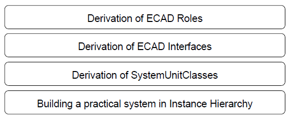

Рисунок 16 – Процедура використання ECAD в AutomationML

## 5 Моделювання даних конфігурації автоматизаційного проєкту з використанням AutomationML

### 5.1 Бібліотека класів ролей

Основою моделювання є необхідні класи ролей. З огляду на потрібні елементи моделі, для моделювання даних конфігурації автоматизаційного проєкту потрібні спеціальні класи ролей, похідні від класів ролей, що використовуються для моделювання комунікаційних систем і визначені в документі AutomationML Whitepaper – Communication, або похідні від базових ролей AutomationML, визначених у документі AutomationML Whitepaper – Architecture and general requirements.

На наступних рисунках наведено визначену бібліотеку класів ролей.

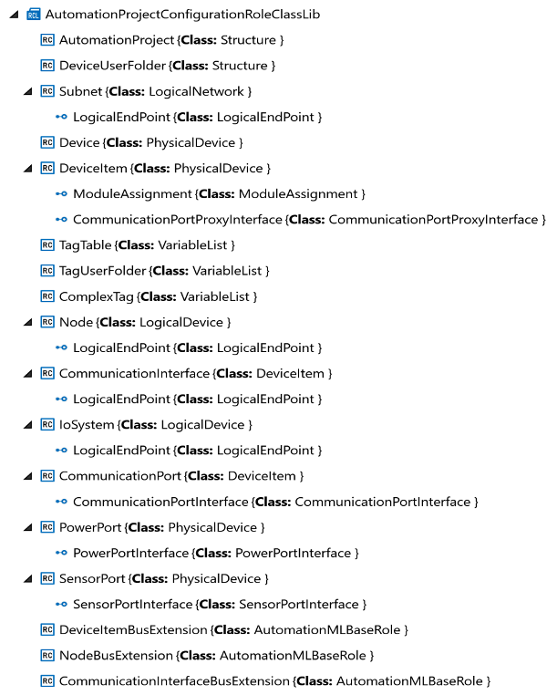

Рисунок 17 – AutomationProjectConfigurationRoleClassLib у поданні редактора AutomationML

```xml
<RoleClassLib Name="AutomationProjectConfigurationRoleClassLib">
	<Description>Automation Markup Language Automation Project Configuration Data Class Library</Description>
	<Version>1.4.0</Version>
	<RoleClass Name="AutomationProject" RefBaseClassPath="AutomationMLBaseRoleClassLib/AutomationMLBaseRole/Structure">
		<Attribute Name="ProjectManufacturer" AttributeDataType="xs:string"/>
		<Attribute Name="ProjectSign" AttributeDataType="xs:string"/>
		<Attribute Name="ProjectRevision" AttributeDataType="xs:string"/>
		<Attribute Name="ProjectInformation" AttributeDataType="xs:string"/>
	</RoleClass>
	<RoleClass Name="DeviceUserFolder" RefBaseClassPath="AutomationMLBaseRoleClassLib/AutomationMLBaseRole/Structure"/>
	<RoleClass Name="Subnet" RefBaseClassPath="CommunicationRoleClassLib/LogicalNetwork">
		<Attribute Name="Type" AttributeDataType="xs:string"/>
		<Attribute Name="CustomAttributes">
			<RefSemantic CorrespondingAttributePath="ListType"/>
			<Attribute Name="AttributeName1" AttributeDataType="xs:string"/>
			<Attribute Name="AttributeName2" AttributeDataType="xs:string"/>
		</Attribute>
		<ExternalInterface Name="LogicalEndPoint" RefBaseClassPath="CommunicationInterfaceClassLib/LogicalEndPoint" ID="3e661cba-acfc-43b8-a02b-14ad7061f137"/>
	</RoleClass>
	<RoleClass Name="Device" RefBaseClassPath="CommunicationRoleClassLib/PhysicalDevice">
		<Attribute Name="TypeIdentifier" AttributeDataType="xs:string">
			<Attribute Name="TemplateIdentifier" AttributeDataType="xs:string"/>
		</Attribute>
		<Attribute Name="Comment" AttributeDataType="xs:string"/>
		<Attribute Name="Manufacturer" AttributeDataType="xs:string"/>
	</RoleClass>
	<RoleClass Name="DeviceItem" RefBaseClassPath="CommunicationRoleClassLib/PhysicalDevice">
		<Attribute Name="TypeName" AttributeDataType="xs:string"/>
		<Attribute Name="DeviceItemType" AttributeDataType="xs:string">
			<Attribute Name="Customized" AttributeDataType="xs:boolean">
				<DefaultValue>false</DefaultValue>
			</Attribute>
		</Attribute>
		<Attribute Name="PositionNumber" AttributeDataType="xs:int"/>
		<Attribute Name="BuiltIn" AttributeDataType="xs:boolean">
			<DefaultValue>false</DefaultValue>
		</Attribute>
		<Attribute Name="TypeIdentifier" AttributeDataType="xs:string">
			<Attribute Name="TemplateIdentifier" AttributeDataType="xs:string"/>
		</Attribute>
		<Attribute Name="Manufacturer" AttributeDataType="xs:string"/>
		<Attribute Name="CustomAttributes">
			<RefSemantic CorrespondingAttributePath="ListType"/>
			<Attribute Name="AttributeName1" AttributeDataType="xs:string"/>
			<Attribute Name="AttributeName2" AttributeDataType="xs:string"/>
		</Attribute>
		<Attribute Name="FirmwareVersion" AttributeDataType="xs:string"/>
		<Attribute Name="PlantDesignation IEC" AttributeDataType="xs:string">
			<Description>Function oriented reference designation following IEC 81346</Description>
			<RefSemantic CorrespondingAttributePath="IEC 81346-1:2009-07#5.3 - Function-oriented structure"/>
		</Attribute>
		<Attribute Name="LocationIdentifier IEC" AttributeDataType="xs:string">
			<Description>Location oriented reference designation following IEC 81346</Description>
			<RefSemantic CorrespondingAttributePath="IEC 81346-1:2009-07#5.5 - Location-oriented structure"/>
		</Attribute>
		<Attribute Name="ProductDesignation IEC" AttributeDataType="xs:string">
			<Description>Product oriented reference designation following IEC 81346</Description>
			<RefSemantic CorrespondingAttributePath="IEC 81346-1:2009-07#5.4 - Product-oriented structure"/>
		</Attribute>
		<Attribute Name="InstallationDate" AttributeDataType="xs:dateTime"/>
		<Attribute Name="Comment" AttributeDataType="xs:string"/>
		<Attribute Name="Address">
			<RefSemantic CorrespondingAttributePath="OrderedListType"/>
			<Attribute Name="1">
				<Attribute Name="StartAddress" AttributeDataType="xs:int"/>
				<Attribute Name="Length" AttributeDataType="xs:int"/>
				<Attribute Name="IoType" AttributeDataType="xs:string"/>
				<Attribute Name="BitOffset" AttributeDataType="xs:int"/>
			</Attribute>
			<Attribute Name="2">
				<Attribute Name="StartAddress" AttributeDataType="xs:int"/>
				<Attribute Name="Length" AttributeDataType="xs:int"/>
				<Attribute Name="IoType" AttributeDataType="xs:string"/>
				<Attribute Name="BitOffset" AttributeDataType="xs:int"/>
			</Attribute>
			<Attribute Name="3">
				<Attribute Name="StartAddress" AttributeDataType="xs:int"/>
				<Attribute Name="Length" AttributeDataType="xs:int"/>
				<Attribute Name="IoType" AttributeDataType="xs:string"/>
				<Attribute Name="BitOffset" AttributeDataType="xs:int"/>
			</Attribute>
		</Attribute>
		<ExternalInterface Name="ModuleAssignment" RefBaseClassPath="AutomationProjectConfigurationInterfaceClassLib/ModuleAssignment" ID="110c6f0b-75b7-4c3c-9d05-1b28eeeec5df"/>
		<ExternalInterface Name="CommunicationPortProxyInterface" ID="0bfb4d8a-63d2-4d32-ad0a-3bb3f6673165" RefBaseClassPath="AutomationProjectConfigurationInterfaceClassLib/CommunicationPortProxyInterface"/>
	</RoleClass>
	<RoleClass Name="TagTable" RefBaseClassPath="CommunicationRoleClassLib/PhysicalDevice/VariableList">
		<Attribute Name="AssignToDefault" AttributeDataType="xs:boolean"/>
	</RoleClass>
	<RoleClass Name="TagUserFolder" RefBaseClassPath="CommunicationRoleClassLib/PhysicalDevice/VariableList"/>
	<RoleClass Name="ComplexTag" RefBaseClassPath="CommunicationRoleClassLib/PhysicalDevice/VariableList">
		<Attribute Name="DataType" AttributeDataType="xs:string">
			<DefaultValue>Mandatory</DefaultValue>
		</Attribute>
		<Attribute Name="Comment" AttributeDataType="xs:string">
			<DefaultValue>Optional</DefaultValue>
		</Attribute>
	</RoleClass>
	<RoleClass Name="Node" RefBaseClassPath="CommunicationRoleClassLib/LogicalDevice">
		<Attribute Name="Type" AttributeDataType="xs:string"/>
		<Attribute Name="NetworkAddress" AttributeDataType="xs:string"/>
		<Attribute Name="CustomAttributes">
			<RefSemantic CorrespondingAttributePath="ListType"/>
			<Attribute Name="AttributeName1" AttributeDataType="xs:string"/>
			<Attribute Name="AttributeName2" AttributeDataType="xs:string"/>
		</Attribute>
		<ExternalInterface Name="LogicalEndPoint" RefBaseClassPath="CommunicationInterfaceClassLib/LogicalEndPoint" ID="9562e3ae-8c2b-4055-a327-3ab66f949d5e"/>
	</RoleClass>
	<RoleClass Name="CommunicationInterface" RefBaseClassPath="AutomationProjectConfigurationRoleClassLib/DeviceItem">
		<Attribute Name="Label" AttributeDataType="xs:string"/>
		<Attribute Name="Type" AttributeDataType="xs:string"/>
		<ExternalInterface Name="LogicalEndPoint" RefBaseClassPath="CommunicationInterfaceClassLib/LogicalEndPoint" ID="dedad3eb-1a51-4d7e-accb-fdc8213c6c23"/>
	</RoleClass>
	<RoleClass Name="IoSystem" RefBaseClassPath="CommunicationRoleClassLib/LogicalDevice">
		<Attribute Name="Number" AttributeDataType="xs:int"/>
		<Attribute Name="CustomAttributes">
			<RefSemantic CorrespondingAttributePath="ListType"/>
			<Attribute Name="AttributeName1" AttributeDataType="xs:string"/>
			<Attribute Name="AttributeName2" AttributeDataType="xs:string"/>
		</Attribute>
		<ExternalInterface Name="LogicalEndPoint" RefBaseClassPath="CommunicationInterfaceClassLib/LogicalEndPoint" ID="003f6b58-c95a-4346-8a0c-aaad895a6492"/>
	</RoleClass>
	<RoleClass Name="CommunicationPort" RefBaseClassPath="AutomationProjectConfigurationRoleClassLib/DeviceItem">
		<Attribute Name="Label" AttributeDataType="xs:string"/>
		<ExternalInterface Name="CommunicationPortInterface" RefBaseClassPath="AutomationProjectConfigurationInterfaceClassLib/CommunicationPortInterface" ID="b0f1bb7c-1df9-494e-8352-0cae067e357d"/>
	</RoleClass>
	<RoleClass Name="PowerPort" RefBaseClassPath="CommunicationRoleClassLib/PhysicalDevice">
		<Attribute Name="Label" AttributeDataType="xs:string"/>
		<ExternalInterface Name="PowerPortInterface" ID="6c3e2230-64d8-42e6-9ddd-3dbdf3310064" RefBaseClassPath="AutomationProjectConfigurationInterfaceClassLib/PowerPortInterface"/>
	</RoleClass>
	<RoleClass Name="SensorPort" RefBaseClassPath="CommunicationRoleClassLib/PhysicalDevice">
		<Attribute Name="Label" AttributeDataType="xs:string"/>
		<ExternalInterface Name="SensorPortInterface" ID="32d38c98-80cb-4850-b3a2-ad789e4ab96a" RefBaseClassPath="AutomationProjectConfigurationInterfaceClassLib/SensorPortInterface"/>
	</RoleClass>
	<RoleClass Name="DeviceItemBusExtension" RefBaseClassPath="AutomationMLBaseRoleClassLib/AutomationMLBaseRole"/>
	<RoleClass Name="NodeBusExtension" RefBaseClassPath="AutomationMLBaseRoleClassLib/AutomationMLBaseRole"/>
	<RoleClass Name="CommunicationInterfaceBusExtension" RefBaseClassPath="AutomationMLBaseRoleClassLib/AutomationMLBaseRole"/>
</RoleClassLib>
```

Рисунок 18 – AutomationProjectConfigurationRoleClassLib у вигляді XML-представлення

Примітка: Атрибути ролей можуть бути «обов’язковими» або «необов’язковими»:
• обов’язкові: інструмент експорту експортує атрибут, а інструмент імпорту імпортує атрибут. Інструмент імпорту може коригувати значення;
• необов’язкові: інструмент експорту може експортувати цей атрибут. Інструмент імпорту імпортує атрибут, якщо інструмент експорту його експортував і він існує на стороні імпорту. Інструмент імпорту може коригувати значення.

#### 5.1.1 AutomationProject

`AutomationProjec`t є похідним від `Structure` відповідно до документа AutomationML Whitepaper – Architecture and general requirements. Він визначається таким чином.

Таблиця 2 – Визначення AutomationProject

| Поле                                                | Значення                                                     |
| --------------------------------------------------- | ------------------------------------------------------------ |
| Назва класу ролі                                    | AutomationProject                                            |
| Опис                                                | Клас ролі AutomationProject використовується для подання проєкту, з якого походить експорт. |
| Батьківський клас                                   | AutomationMLBaseRoleClassLib/AutomationMLBaseRole/Structure  |
| Шлях для посилання на елемент                       | AutomationProjectConfigurationRoleClassLib/AutomationProject |
| Атрибути                                            |                                                              |
| ProjectName (AttributeDataType="xs:string")         | Атрибут ProjectName визначає назву проєкту. Цей атрибут є обов’язковим. Примітка: цей атрибут змодельований стандартним атрибутом Name відповідного об’єкта CAEX. |
| ProjectManufacturer (AttributeDataType="xs:string") | Атрибут ProjectManufacturer визначає виробника проєкту. Цей атрибут є необов’язковим. |
| ProjectSign (AttributeDataType="xs:string")         | Атрибут ProjectSign визначає унікальну ідентифікацію проєкту. Цей атрибут є необов’язковим. |
| ProjectRevision (AttributeDataType="xs:string")     | Атрибут ProjectRevision визначає номер ревізії проєкту. Цей атрибут є необов’язковим. |
| ProjectInformation (AttributeDataType="xs:string")  | Атрибут ProjectInformation визначає коментарну інформацію про проєкт. Цей атрибут є необов’язковим. |

#### 5.1.2 DeviceUserFolder

`DeviceUserFolder` є похідним від `Structure`. Він визначається таким чином.

Таблиця 3 – Визначення DeviceUserFolder

| Поле                                 | Значення                                                     |
| ------------------------------------ | ------------------------------------------------------------ |
| Назва класу ролі                     | DeviceUserFolder                                             |
| Опис                                 | Клас ролі DeviceUserFolder використовується для підтримки структури пристрою в межах проєкту. |
| Батьківський клас                    | AutomationMLBaseRoleClassLib/AutomationMLBaseRole/Structure  |
| Шлях для посилання на елемент        | AutomationProjectConfigurationRoleClassLib/DeviceUserFolder  |
| Атрибути                             |                                                              |
| Name (AttributeDataType="xs:string") | Атрибут Name визначає назву DeviceUserFolder. Цей атрибут є обов’язковим. Примітка: цей атрибут змодельований стандартним атрибутом Name відповідного об’єкта CAEX. |

#### 5.1.3 Subnet

`Subnet` є похідним від `LogicalNetwork` відповідно до документа AutomationML Whitepaper – `Communication`. Він визначається таким чином.

Таблиця 4 – Визначення Subnet

| Поле                                                         | Значення                                                     |
| ------------------------------------------------------------ | ------------------------------------------------------------ |
| Назва класу ролі                                             | Subnet                                                       |
| Опис                                                         | Клас ролі Subnet використовується для подання зберігання та керування властивостями і функціональністю мереж. |
| Батьківський клас                                            | CommunicationRoleClassLib/LogicalNetwork                     |
| Шлях для посилання на елемент                                | AutomationProjectConfigurationRoleClassLib/Subnet            |
| Атрибути                                                     |                                                              |
| Name (AttributeDataType="xs:string")                         | Атрибут Name визначає назву підмережі. Цей атрибут є обов’язковим. Примітка: цей атрибут змодельований стандартним атрибутом Name відповідного об’єкта CAEX. |
| Type (AttributeDataType="xs:string")                         | Атрибут Type визначає ідентифікатор типу підмережі. Значення типу визначається у шинно-специфічній специфікації. Цей атрибут є обов’язковим. |
| CustomAttributes (ListType)[0..n] / AttributeName (AttributeDataType="xs:string") | Назва CustomAttribute визначає ім’я властивості в цільовій системі. Значення визначає значення цього CustomAttribute. Атрибут AttributeName є обов’язковим, якщо існує атрибут CustomAttributes. AttributeName має бути унікальним. Відображення кількох користувацьких атрибутів з однаковим іменем можливе лише шляхом забезпечення унікальності ключа додаванням лічильника #1, #2, #3. CustomAttributes можуть мати прості або складні типи даних. Опис складних значень наведено в розділі 5.3. |
| Інтерфейси                                                   |                                                              |
| LogicalEndPoint (RefBaseClassPath="CommunicationInterfaceClassLib/LogicalEndPoint") | Цей інтерфейс використовується для зв’язування елементів вузлів з підмережею. Напрямок зв’язку не має значення. Підмережа має рівно один LogicalEndPoint для з’єднання підмережі з вузлами. |

Залежно від різних комунікаційних систем і шинних систем об’єкт Subnet може містити додаткові атрибути. Ці атрибути та шинно-специфічні параметри описуються в окремих шинних специфікаціях. Для отримання додаткової інформації слід звертатися до відповідних шинних специфікацій.

#### 5.1.4 Device

`Device` є похідним від `PhysicalDevice` відповідно до документа AutomationML Whitepaper – `Communication`. Він визначається таким чином.

Таблиця 5 – Визначення Device

| Поле                                               | Значення                                                     |
| -------------------------------------------------- | ------------------------------------------------------------ |
| Назва класу ролі                                   | Device                                                       |
| Опис                                               | Клас ролі Device використовується для подання колекції, в якій об’єднуються окремі апаратні об’єкти slave-пристрою або стійки, включно з самим апаратним елементом slave або стійки. |
| Батьківський клас                                  | CommunicationRoleClassLib/PhysicalDevice                     |
| Шлях для посилання на елемент                      | AutomationProjectConfigurationRoleClassLib/Device            |
| Атрибути                                           |                                                              |
| Name (AttributeDataType="xs:string")               | Атрибут Name визначає назву пристрою. Цей атрибут є обов’язковим. Примітка: цей атрибут змодельований стандартним атрибутом `Name` відповідного об’єкта CAEX. |
| TypeIdentifier (AttributeDataType="xs:string")     | Атрибут TypeIdentifier визначає ідентифікатор сімейства типу пристрою. Цей атрибут є необов’язковим. |
| TemplateIdentifier (AttributeDataType="xs:string") | Атрибут TemplateIdentifier посилається на шлях до елемента шаблону, наприклад елемента бібліотеки. Синтаксис визначається відповідним елементом цільової системи. Цей атрибут є необов’язковим. |
| Manufacturer (AttributeDataType="xs:string")       | Атрибут Manufacturer визначає виробника пристрою. Назва виробника має бути однозначною та унікально прив’язаною до виробника. Цей атрибут є необов’язковим. |
| Comment (AttributeDataType="xs:string")            | Атрибут Comment визначає коментар до пристрою. Атрибут Comment відповідає рекомендації Best Practice Recommendation Multilingual expressions in AutomationML. Цей атрибут є необов’язковим. |

Примітка: атрибут `TypeIdentifier` має префікс, який описує семантику подальшого ідентифікатора і відокремлюється символом `:`. Дозволені такі префікси: `OrderNumber`, `GSD`, `System`, `CSP+`. У разі відсутності `TypeIdentifier` інструмент імпорту повинен застосувати стратегію заміщення. Не гарантується, що стратегія заміщення буде успішною в усіх випадках.

Приклади:
TypeIdentifier = `GSD:SIEM8139.GSD/DAP`
TypeIdentifier = `System:Device.Generic`
TypeIdentifier = `System:Device.S7-1500`
TypeIdentifier = `System:Device.IQ-R`
TemplateIdentifier = `GlobalLib://TemplateLibrary/Master copies/S7-1500/preconfigured/PLCs/s7-1518F`

#### 5.1.5 DeviceItem

DeviceItem є похідним від `PhysicalDevice` відповідно до документа AutomationML Whitepaper – `Communication`. Він визначається таким чином.

Таблиця 6 – Визначення `DeviceItem`

| Поле                          | Значення                                                     |
| ----------------------------- | ------------------------------------------------------------ |
| Назва класу ролі              | DeviceItem                                                   |
| Опис                          | Клас ролі DeviceItem використовується для подання узагальненого класу об’єктів для апаратних модулів і підмодулів. |
| Батьківський клас             | CommunicationRoleClassLib/PhysicalDevice                     |
| Шлях для посилання на елемент | AutomationProjectConfigurationRoleClassLib/DeviceItem        |
| Атрибути                      |                                                              |

| Атрибут                                            | Опис                                                         |
| -------------------------------------------------- | ------------------------------------------------------------ |
| Name (AttributeDataType="xs:string")               | Атрибут Name визначає назву DeviceItem. Атрибут є обов’язковим. Примітка: цей атрибут змодельований стандартним атрибутом Name відповідного об’єкта CAEX. |
| TypeName (AttributeDataType="xs:string")           | Атрибут TypeName визначає додаткову інформацію про тип. Атрибут є необов’язковим. |
| DeviceItemType (AttributeDataType="xs:string")     | Атрибут DeviceItemType визначає класифікацію DeviceItem (наприклад, CPU). Атрибут є необов’язковим. |
| Customized (AttributeDataType="xs:boolean")        | Підатрибут Customized вказує, чи містить DeviceItemType виробник-специфічну інформацію (true), чи ні (false). Якщо Customized відсутній або має значення false, DeviceItemType містить уже стандартизовану інформацію. Стандартні значення: CPU, HeadModule, Accessory. Атрибут є необов’язковим. |
| PositionNumber (AttributeDataType="xs:int")        | Атрибут PositionNumber визначає номер слота, у який вставлено DeviceItem. Атрибут є необов’язковим. Атрибут є обов’язковим для підключуваних DeviceItem та для DeviceItem, які можуть містити підключувані DeviceItem. |
| BuiltIn (AttributeDataType="xs:boolean")           | Атрибут BuiltIn визначає, що цей модуль є вбудованою частиною іншого модуля. Атрибут є необов’язковим. Значення за замовчуванням – false. |
| TypeIdentifier (AttributeDataType="xs:string")     | Атрибут TypeIdentifier визначає ідентифікатор типу DeviceItem. Атрибут є обов’язковим, якщо BuiltIn = false. Атрибут є необов’язковим, якщо BuiltIn = true. Дозволяється використання шаблонного значення “*”. |
| TemplateIdentifier (AttributeDataType="xs:string") | Атрибут TemplateIdentifier посилається на шлях до елемента шаблону, наприклад елемента бібліотеки. Синтаксис визначається відповідним елементом цільової системи. Атрибут є необов’язковим. |
| Manufacturer (AttributeDataType="xs:string")       | Атрибут Manufacturer визначає виробника DeviceItem. Назва виробника має бути однозначною та унікально прив’язаною до виробника. Атрибут є необов’язковим. |
| FirmwareVersion (AttributeDataType="xs:string")    | Атрибут FirmwareVersion визначає версію прошивки, наприклад для CPU. Може бути необхідним для коректної ідентифікації модуля, оскільки інколи номера замовлення недостатньо. Атрибут є необов’язковим. |
| Comment (AttributeDataType="xs:string")            | Атрибут Comment визначає коментар до DeviceItem. Атрибут відповідає рекомендації Best Practice Recommendation Multilingual expressions in AutomationML. Атрибут є необов’язковим. |
| InstallationDate (AttributeDataType="xs:dateTime") | Атрибут InstallationDate визначає дату встановлення елемента DeviceItem. Атрибут є необов’язковим. |

Address (OrderedListType) – адресна інформація DeviceItem у межах Device. Більшість модулів мають призначені діапазони адрес. Address моделюється як впорядкований список адресних параметрів. Порядок є обов’язковим для однозначної ідентифікації у разі кількох адрес для одного модуля.

Підпараметри Address:

| Підатрибут         | Опис                                                         |
| ------------------ | ------------------------------------------------------------ |
| StartAddress (int) | Початкова адреса.                                            |
| Length (int)       | Загальна ширина модуля (виробник-специфічна). У більшості випадків відповідає ширині всіх каналів. |
| IoType (string)    | Тип I/O: Input або Output.                                   |
| BitOffset (int)    | Початок бітової адреси в межах байта.                        |

Додаткові атрибути для референтних позначень відповідно до IEC 81346 (можуть бути додані на додаток до стандартних атрибутів):

| Атрибут                         | Опис                                                         |
| ------------------------------- | ------------------------------------------------------------ |
| PlantDesignation IEC (string)   | Позначення установки для DeviceItem. Референтне позначення, орієнтоване на функцію, відповідно до IEC 81346-1:2009-07, 5.3. |
| LocationIdentifier IEC (string) | Позначення розташування DeviceItem. Референтне позначення, орієнтоване на розташування, відповідно до IEC 81346-1:2009-07, 5.5. |
| ProductDesignation IEC (string) | Позначення продукту DeviceItem. Референтне позначення, орієнтоване на продукт, відповідно до IEC 81346-1:2009-07, 5.4. |

#### 5.1.6 TagTable

TagTable є похідним від VariableList відповідно до документа AutomationML Whitepaper – Communication. Тому VariableList є обов’язковим відповідно до AutomationML Whitepaper – Communication. Визначення наведено нижче.

Таблиця 7 – Визначення TagTable

| Поле                          | Значення                                                     |
| ----------------------------- | ------------------------------------------------------------ |
| Назва класу ролі              | TagTable                                                     |
| Опис                          | Клас ролі TagTable використовується для структурування тегів. |
| Батьківський клас             | CommunicationRoleClassLib/VariableList                       |
| Шлях для посилання на елемент | AutomationProjectConfigurationRoleClassLib/TagTable          |
| Атрибути                      |                                                              |

| Атрибут                                          | Опис                                                         |
| ------------------------------------------------ | ------------------------------------------------------------ |
| Name (AttributeDataType="xs:string")             | Атрибут Name визначає назву TagTable. Атрибут є обов’язковим. Примітка: цей атрибут змодельований стандартним атрибутом Name відповідного об’єкта CAEX. |
| AssignToDefault (AttributeDataType="xs:boolean") | Під час імпорту, якщо TagTable має атрибут AssignToDefault зі значенням true, усі теги всередині неї імпортуються до наявної стандартної TagTable. У цьому випадку назва TagTable ігнорується інструментом імпорту. Якщо атрибут відсутній, за замовчуванням вважається значення false. |

Примітка: під час імпорту, якщо TagTable має атрибут AssignToDefault зі значенням true, тоді всі теги всередині неї імпортуються до вже існуючої стандартної TagTable. У цьому випадку ім’я TagTable ігнорується інструментом імпорту. Якщо атрибут AssignToDefault відсутній під час імпорту, за замовчуванням приймається значення false.

Інтерфейси

“Tag” [0..n] - Клас інтерфейсу Tag використовується для подання елементів як символічних імен даних I/O та для зв’язування тегів із Channel.

#### 5.1.7 TagUserFolder

TagUserFolder є похідним від VariableList відповідно до документа AutomationML Whitepaper – Communication. Визначення наведено нижче.

Таблиця 8 – Визначення TagUserFolder

| Поле                          | Значення                                                     |
| ----------------------------- | ------------------------------------------------------------ |
| Назва класу ролі              | TagUserFolder                                                |
| Опис                          | Клас ролі TagUserFolder використовується для підтримки структури TagTable в межах DeviceItem. |
| Батьківський клас             | CommunicationRoleClassLib/PhysicalDevice/VariableList        |
| Шлях для посилання на елемент | AutomationProjectConfigurationRoleClassLib/TagUserFolder     |
| Атрибути                      |                                                              |

| Атрибут                              | Опис                                                         |
| ------------------------------------ | ------------------------------------------------------------ |
| Name (AttributeDataType="xs:string") | Атрибут Name визначає назву TagUserFolder. Атрибут є обов’язковим. Примітка: цей атрибут змодельований стандартним атрибутом Name відповідного об’єкта CAEX. |

#### 5.1.8 ComplexTag

ComplexTag є похідним від VariableList відповідно до документа AutomationML Whitepaper – Communication. Визначення наведено нижче.

Таблиця 9 – Визначення ComplexTag

| Поле                          | Значення                                                     |
| ----------------------------- | ------------------------------------------------------------ |
| Назва класу ролі              | ComplexTag                                                   |
| Опис                          | Клас ролі ComplexTag використовується для подання символічної назви структурованих даних I/O. ComplexTag дозволяється використовувати лише в межах TagTable. |
| Батьківський клас             | CommunicationRoleClassLib/PhysicalDevice/VariableList        |
| Шлях для посилання на елемент | AutomationProjectConfigurationRoleClassLib/ComplexTag        |
| Атрибути                      |                                                              |

| Атрибут                                  | Опис                                                         |
| ---------------------------------------- | ------------------------------------------------------------ |
| DataType (AttributeDataType="xs:string") | Атрибут DataType визначає назву структури. Атрибут є обов’язковим. |
| Comment (AttributeDataType="xs:string")  | Атрибут Comment визначає коментар для ComplexTag. Атрибут відповідає рекомендації Best Practice Recommendation Multilingual expressions in AutomationML. Атрибут є необов’язковим. |

| Інтерфейси |                                                              |
| ---------- | ------------------------------------------------------------ |
| Tag [0..n] | Клас інтерфейсу Tag використовується для подання структурованих елементів як символічних імен даних I/O та для зв’язування тегів із Channel. ComplexTag представляє символічну назву структурованих даних I/O, забезпечує логічну структуру та агрегує теги для безпосереднього посилання на відповідний канал. ComplexTag може агрегуватися TagTable CPU або іншими ComplexTag. |

#### 5.1.9 Node

Node є похідним від logicalDevice відповідно до документа AutomationML Whitepaper – Communication. Визначення наведено нижче.

Таблиця 10 – Визначення Node

| Поле                          | Значення                                                     |
| ----------------------------- | ------------------------------------------------------------ |
| Назва класу ролі              | Node                                                         |
| Опис                          | Клас ролі Node використовується для визначення всієї мережевої інформації, пов’язаної з інтерфейсом мережевого вузла. Примітка: ім’я Node моделюється стандартним атрибутом Name відповідного об’єкта CAEX. |
| Батьківський клас             | CommunicationRoleClassLib/logicalDevice                      |
| Шлях для посилання на елемент | AutomationProjectConfigurationRoleClassLib/Node              |
| Атрибути                      |                                                              |

| Атрибут                                                      | Опис                                                         |
| ------------------------------------------------------------ | ------------------------------------------------------------ |
| Type (AttributeDataType="xs:string")                         | Атрибут Type визначає тип мережі. Значення типу визначається в шинно-специфічній специфікації. Атрибут є обов’язковим. |
| NetworkAddress (AttributeDataType="xs:string")               | Атрибут NetworkAddress визначає мережеву адресу цього DeviceItem. Атрибут є обов’язковим. |
| CustomAttributes (ListType)[0..n] / AttributeName (AttributeDataType="xs:string") | Ім’я CustomAttribute визначає ім’я властивості в цільовій системі. Значення визначає значення цього CustomAttribute. Атрибут AttributeName є обов’язковим, якщо існує атрибут CustomAttributes. AttributeName має бути унікальним. Відображення кількох користувацьких атрибутів з однаковим іменем можливе лише шляхом забезпечення унікальності ключа додаванням лічильника #1, #2, #3. CustomAttributes можуть мати прості або складні типи даних. Опис складних значень наведено в розділі 5.3. |

| Інтерфейси                                                   |                                                              |
| ------------------------------------------------------------ | ------------------------------------------------------------ |
| LogicalEndPoint (RefBaseClassPath="CommunicationInterfaceClassLib/LogicalEndPoint") | Цей інтерфейс використовується для зв’язування вузла з підмережею. Напрямок зв’язку не має значення. У разі підключення до більше ніж однієї підмережі єдиний логічний кінцевий пункт повинен містити всі з’єднання. |

Примітка: ідентифікація має визначатися на основі ідентифікації CommunicationInterface.

Залежно від різних комунікаційних систем і шинних систем об’єкт Node може містити додаткові, невикористовувані або обмежені атрибути. Ці атрибути та шинно-специфічні параметри описані в окремих шинних специфікаціях. Для отримання додаткової інформації слід звертатися до відповідних шинних специфікацій.

#### 5.1.10 CommunicationInterface

CommunicationInterface є похідним від DeviceItem відповідно до документа AutomationML Whitepaper – Communication. Визначення наведено нижче.

Таблиця 11 – Визначення CommunicationInterface

| Поле                          | Значення                                                     |
| ----------------------------- | ------------------------------------------------------------ |
| Назва класу ролі              | CommunicationInterface                                       |
| Опис                          | Клас ролі CommunicationInterface використовується для визначення точки підключення пристрою до мережі. Примітка: ім’я CommunicationInterface моделюється стандартним атрибутом Name відповідного об’єкта CAEX. |
| Батьківський клас             | AutomationProjectConfigurationRoleClassLib/DeviceItem        |
| Шлях для посилання на елемент | AutomationProjectConfigurationRoleClassLib/CommunicationInterface |
| Атрибути                      |                                                              |

| Атрибут                                                      | Опис                                                         |
| ------------------------------------------------------------ | ------------------------------------------------------------ |
| Label (AttributeDataType="xs:string")                        | Атрибут Label визначає ім’я, надруковане на елементі. Атрибут є обов’язковим, якщо BuiltIn = true. |
| Type (AttributeDataType="xs:string")                         | Атрибут Type визначає тип CommunicationInterface. Значення типу визначається в шинно-специфічній специфікації. Атрибут є необов’язковим. |
| CustomAttributes (ListType)[0..n] / AttributeName (AttributeDataType="xs:string") | Ім’я CustomAttribute визначає ім’я властивості в цільовій системі. Значення визначає значення цього CustomAttribute. Атрибут AttributeName є обов’язковим, якщо існує атрибут CustomAttributes. AttributeName має бути унікальним. Відображення кількох користувацьких атрибутів з однаковим іменем можливе лише шляхом забезпечення унікальності ключа додаванням лічильника #1, #2, #3. CustomAttributes можуть мати прості або складні типи даних. Опис складних значень наведено в розділі 5.3. |

| Інтерфейси                                                   |                                                              |
| ------------------------------------------------------------ | ------------------------------------------------------------ |
| LogicalEndPoint (RefBaseClassPath="CommunicationInterfaceClassLib/LogicalEndPoint") | Цей інтерфейс використовується для зв’язування CommunicationInterface з IoSystem. Напрямок зв’язку не має значення. У разі підключення до більше ніж одного IoSystem єдиний логічний кінцевий пункт повинен містити всі з’єднання. |

#### 5.1.11 IoSystem

IoSystem є похідним від LogicalDevice. Визначення наведено нижче.

Таблиця 12 – Визначення IoSystem

| Поле                          | Значення                                                     |
| ----------------------------- | ------------------------------------------------------------ |
| Назва класу ролі              | IoSystem                                                     |
| Опис                          | Клас ролі IoSystem використовується для моделювання відношення master–slave, яке зазвичай зустрічається у промислових мережах. Примітка: ім’я IoSystem моделюється стандартним атрибутом Name відповідного об’єкта CAEX. |
| Батьківський клас             | CommunicationRoleClassLib/LogicalDevice                      |
| Шлях для посилання на елемент | AutomationProjectConfigurationRoleClassLib/IoSystem          |
| Атрибути                      |                                                              |

| Атрибут                                                      | Опис                                                         |
| ------------------------------------------------------------ | ------------------------------------------------------------ |
| Number (AttributeDataType="xs:int")                          | Атрибут Number визначає унікальний номер IoSystem. Атрибут є необов’язковим. |
| CustomAttributes (ListType)[0..n] / AttributeName (AttributeDataType="xs:string") | Ім’я CustomAttribute визначає ім’я властивості в цільовій системі. Значення визначає значення цього CustomAttribute. Атрибут AttributeName є обов’язковим, якщо існує атрибут CustomAttributes. AttributeName має бути унікальним. Відображення кількох користувацьких атрибутів з однаковим іменем можливе лише шляхом забезпечення унікальності ключа додаванням лічильника #1, #2, #3. CustomAttributes можуть мати прості або складні типи даних. Опис складних значень наведено в розділі 5.3. |

| Інтерфейси                                                   |                                                              |
| ------------------------------------------------------------ | ------------------------------------------------------------ |
| LogicalEndPoint (RefBaseClassPath="CommunicationInterfaceClassLib/LogicalEndPoint") | Цей інтерфейс використовується для зв’язування IoSystem з CommunicationInterface. Напрямок зв’язку не має значення. У разі підключення до більше ніж одного CommunicationInterface єдиний логічний кінцевий пункт повинен містити всі з’єднання. |

Примітка: ідентифікація має визначатися на основі ідентифікації CommunicationInterface.

#### 5.1.12 CommunicationPort

CommunicationPort є похідним від DeviceItem. Визначення наведено нижче.

Таблиця 13 – Визначення CommunicationPort

| Поле                          | Значення                                                     |
| ----------------------------- | ------------------------------------------------------------ |
| Назва класу ролі              | CommunicationPort                                            |
| Опис                          | Клас ролі CommunicationPort використовується для моделювання елемента DeviceItem, що застосовується для фізичного та/або логічного встановлення з’єднання з мережею. Примітка: ім’я CommunicationPort моделюється стандартним атрибутом Name відповідного об’єкта CAEX. |
| Батьківський клас             | AutomationProjectConfigurationRoleClassLib/DeviceItem        |
| Шлях для посилання на елемент | AutomationProjectConfigurationRoleClassLib/CommunicationPort |
| Атрибути                      |                                                              |

| Атрибут                                                      | Опис                                                         |
| ------------------------------------------------------------ | ------------------------------------------------------------ |
| Label (AttributeDataType="xs:string")                        | Атрибут Label визначає ім’я, надруковане на порті. Атрибут є обов’язковим, якщо BuiltIn = true. Атрибут PositionNumber є обов’язковим, якщо BuiltIn = false. |
| CustomAttributes (ListType)[0..n] / AttributeName (AttributeDataType="xs:string") | Ім’я CustomAttribute визначає ім’я властивості в цільовій системі. Значення визначає значення цього CustomAttribute. Атрибут AttributeName є обов’язковим, якщо існує атрибут CustomAttributes. AttributeName має бути унікальним. Відображення кількох користувацьких атрибутів з однаковим іменем можливе лише шляхом забезпечення унікальності ключа додаванням лічильника #1, #2, #3. CustomAttributes можуть мати прості або складні типи даних. Опис складних значень наведено в розділі 5.3. |

| Інтерфейси                                                   |                                                              |
| ------------------------------------------------------------ | ------------------------------------------------------------ |
| CommunicationPortInterface (RefBaseClassPath="AutomationProjectConfigurationInterfaceClassLib/CommunicationPortInterface") | Цей інтерфейс використовується для зв’язування порту з іншим портом. Напрямок зв’язку не має значення. У разі підключення до більше ніж одного порту єдиний інтерфейс повинен містити кілька логічних кінцевих пунктів для різних з’єднань. |

Примітка: ідентифікація визначається на основі ідентифікації CommunicationInterface та мітки порту.

Залежно від різних комунікаційних систем і шинних систем CommunicationPort може містити додаткові, невикористовувані або обмежені атрибути. Ці атрибути та шинно-специфічні параметри описані в окремих шинних специфікаціях. Для отримання додаткової інформації слід звертатися до відповідних шинних специфікацій.

#### 5.1.13 PowerPort

PowerPort є похідним від PhysicalDevice. Визначення наведено нижче.

Таблиця 14 – Визначення PowerPort

Таблиця 14 – Визначення PowerPort

| Поле                          | Значення                                                     |
| ----------------------------- | ------------------------------------------------------------ |
| Назва класу ролі              | PowerPort                                                    |
| Опис                          | Клас ролі PowerPort використовується для моделювання фізичного з’єднання між модулями для передавання живлення. Примітка: ім’я PowerPort моделюється стандартним атрибутом Name відповідного об’єкта CAEX. |
| Батьківський клас             | AutomationProjectConfigurationRoleClassLib/PhysicalDevice    |
| Шлях для посилання на елемент | AutomationProjectConfigurationRoleClassLib/PowerPort         |
| Атрибути                      |                                                              |

| Атрибут                               | Опис                                                         |
| ------------------------------------- | ------------------------------------------------------------ |
| Label (AttributeDataType="xs:string") | Атрибут Label визначає ім’я, надруковане на порті. Атрибут є обов’язковим. |

| Інтерфейси                                                   |                                                              |
| ------------------------------------------------------------ | ------------------------------------------------------------ |
| PowerPortInterface (RefBaseClassPath="AutomationProjectConfigurationInterfaceClassLib/PowerPortInterface") | Цей інтерфейс використовується для зв’язування порту з іншим портом. Дозволяється лише один PowerPortInterface. Напрямок зв’язку не має значення. |

#### 5.1.14 SensorPort

SensorPort є похідним від PhysicalDevice. Визначення наведено нижче.

Таблиця 15 – Визначення SensorPort

| Поле                          | Значення                                                     |
| ----------------------------- | ------------------------------------------------------------ |
| Назва класу ролі              | SensorPort                                                   |
| Опис                          | Клас ролі SensorPort використовується для моделювання фізичного з’єднання між сенсорними модулями для передавання сигналів датчиків. Примітка: ім’я SensorPort моделюється стандартним атрибутом Name відповідного об’єкта CAEX. |
| Батьківський клас             | AutomationProjectConfigurationRoleClassLib/PhysicalDevice    |
| Шлях для посилання на елемент | AutomationProjectConfigurationRoleClassLib/SensorPort        |
| Атрибути                      |                                                              |

| Атрибут                               | Опис                                                         |
| ------------------------------------- | ------------------------------------------------------------ |
| Label (AttributeDataType="xs:string") | Атрибут Label визначає ім’я, надруковане на порті. Атрибут є обов’язковим. |

| Інтерфейси                                                   |                                                              |
| ------------------------------------------------------------ | ------------------------------------------------------------ |
| SensorPortInterface (RefBaseClassPath="AutomationProjectConfigurationInterfaceClassLib/SensorPortInterface") | Цей інтерфейс використовується для зв’язування порту з іншим портом. Дозволяється лише один SensorPortInterface. Напрямок зв’язку не має значення. |

#### 5.1.15 DeviceItemBusExtension

DeviceItemBusExtension є похідним від AutomationMLBaseRole. Визначення наведено нижче.

Таблиця 16 – Визначення DeviceItemBusExtension

| Поле                          | Значення                                                     |
| ----------------------------- | ------------------------------------------------------------ |
| Назва класу ролі              | DeviceItemBusExtension                                       |
| Опис                          | Клас ролі DeviceItemBusExtension використовується для визначення додаткових шинно-специфічних атрибутів для DeviceItem. Примітка: DeviceItemBusExtension слід використовувати лише для об’єктів DeviceItem, а не для похідних від DeviceItem. |
| Батьківський клас             | AutomationMLBaseRole                                         |
| Шлях для посилання на елемент | AutomationProjectConfigurationRoleClassLib/DeviceItemBusExtension |

Абстрактний клас ролі DeviceItemBusExtension використовується для визначення додаткових шинно-специфічних атрибутів для DeviceItem. Ці шинно-специфічні атрибути повинні визначатися у похідному класі в окремій RoleClassLibrary для використання як додатковий SupportedRoleClass.

Примітка: DeviceItemBusExtension слід використовувати лише для об’єктів DeviceItem.

#### 5.1.16 NodeBusExtension

NodeBusExtension є похідним від AutomationMLBaseRole. Визначення наведено нижче.

Таблиця 17 – Визначення NodeBusExtension

| Поле                          | Значення                                                     |
| ----------------------------- | ------------------------------------------------------------ |
| Назва класу ролі              | NodeBusExtension                                             |
| Опис                          | Клас ролі NodeBusExtension використовується для визначення додаткових шинно-специфічних атрибутів для Node. Примітка: NodeBusExtension слід використовувати лише для об’єктів Node. |
| Батьківський клас             | AutomationMLBaseRole                                         |
| Шлях для посилання на елемент | AutomationProjectConfigurationRoleClassLib/NodeBusExtension  |

Абстрактний клас ролі NodeBusExtension використовується для визначення додаткових шинно-специфічних атрибутів для Node. Ці шинно-специфічні атрибути повинні визначатися у похідному класі в окремій RoleClassLibrary для використання як додатковий SupportedRoleClass.

Примітка: NodeBusExtension слід використовувати лише для об’єктів Node.

#### 5.1.17 CommunicationInterfaceBusExtension

CommunicationInterfaceBusExtension є похідним від AutomationMLBaseRole. Визначення наведено нижче.

Таблиця 18 – Визначення CommunicationInterfaceBusExtension

| Поле                          | Значення                                                     |
| ----------------------------- | ------------------------------------------------------------ |
| Назва класу ролі              | CommunicationInterfaceBusExtension                           |
| Опис                          | Клас ролі CommunicationInterfaceBusExtension використовується для визначення додаткових шинно-специфічних атрибутів для CommunicationInterface. Примітка: CommunicationInterfaceBusExtension слід використовувати лише для об’єктів CommunicationInterface. |
| Батьківський клас             | AutomationMLBaseRole                                         |
| Шлях для посилання на елемент | AutomationProjectConfigurationRoleClassLib/CommunicationInterfaceBusExtension |

Абстрактний клас ролі CommunicationInterfaceBusExtension використовується для визначення додаткових шинно-специфічних атрибутів для CommunicationInterface. Ці шинно-специфічні атрибути повинні визначатися у похідному класі в окремій RoleClassLibrary для використання як додатковий SupportedRoleClass.

Примітка: CommunicationInterfaceBusExtension слід використовувати лише для об’єктів CommunicationInterface.

### 5.2 InterfaceClassLibrary

Другим основним підґрунтям моделювання є необхідні класи інтерфейсів. Виходячи з потрібних елементів моделі, для моделювання даних конфігурації автоматизаційного проєкту потрібні спеціальні класи інтерфейсів, похідні від класів інтерфейсів, що використовуються для моделювання комунікаційних систем і визначені в документі AutomationML Whitepaper – Communication, або похідні від базових класів інтерфейсів AutomationML, визначених у документі AutomationML Whitepaper – Architecture and general requirements.

На наступних рисунках наведено бібліотеку класів інтерфейсів.

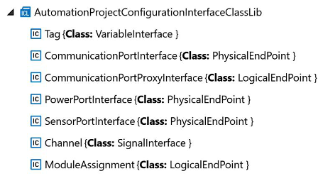

Рисунок 19 – AutomationProjectConfigurationInterfaceClassLib у поданні редактора AutomationML

```xml
<InterfaceClassLib Name="AutomationProjectConfigurationInterfaceClassLib">
	<Description>Automation Markup Language Automation Project Configuration InterfaceClass Library</Description>
	<Version>1.4.0</Version>
	<InterfaceClass Name="Tag" RefBaseClassPath="AutomationMLInterfaceClassLib/AutomationMLBaseInterface/ExternalDataConnector/PLCopenXMLInterface/VariableInterface">
		<Attribute Name="DataType" AttributeDataType="xs:string">
			<Attribute Name="Customized" AttributeDataType="xs:boolean">
				<DefaultValue>false</DefaultValue>
			</Attribute>
		</Attribute>
		<Attribute Name="IoType" AttributeDataType="xs:string"/>
		<Attribute Name="LogicalAddress" AttributeDataType="xs:string"/>
		<Attribute Name="Comment" AttributeDataType="xs:string"/>
	</InterfaceClass>
	<InterfaceClass Name="CommunicationPortInterface" RefBaseClassPath="CommunicationInterfaceClassLib/PhysicalEndPoint"/>
	<InterfaceClass Name="CommunicationPortProxyInterface" RefBaseClassPath="CommunicationInterfaceClassLib/LogicalEndPoint"/>
	<InterfaceClass Name="PowerPortInterface" RefBaseClassPath="CommunicationInterfaceClassLib/PhysicalEndPoint"/>
	<InterfaceClass Name="SensorPortInterface" RefBaseClassPath="CommunicationInterfaceClassLib/PhysicalEndPoint"/>
	<InterfaceClassName="Channel" RefBaseClassPath="AutomationMLInterfaceClassLib/AutomationMLBaseInterface/Communication/SignalInterface">
		<Attribute Name="Type" AttributeDataType="xs:string"/>
		<Attribute Name="IoType" AttributeDataType="xs:string"/>
		<Attribute Name="Number" AttributeDataType="xs:int"/>
		<Attribute Name="Length" AttributeDataType="xs:int"/>
		<Attribute Name="CustomAttributes">
			<RefSemantic CorrespondingAttributePath="ListType"/>
			<Attribute Name="AttributeName1" AttributeDataType="xs:string"/>
			<Attribute Name="AttributeName2" AttributeDataType="xs:string"/>
		</Attribute>
	</InterfaceClass>
	<InterfaceClass Name="ModuleAssignment" RefBaseClassPath="CommunicationInterfaceClassLib/LogicalEndPoint"/>
</InterfaceClassLib>
```

Рисунок 20 – AutomationProjectConfigurationInterfaceClassLib у вигляді XML-представлення

#### 5.2.1 Tag

Tag є похідним від VariableInterface відповідно до документа AutomationML Whitepaper – Logic. Визначення наведено нижче.

Таблиця 19 – Визначення Tag

| Поле                          | Значення                                                     |
| ----------------------------- | ------------------------------------------------------------ |
| Назва класу інтерфейсу        | Tag                                                          |
| Опис                          | Клас інтерфейсу Tag використовується для подання символічного імені даних I/O. Tag дозволяється використовувати лише в межах TagTable. |
| Батьківський клас             | VariableInterface                                            |
| Шлях для посилання на елемент | AutomationProjectConfigurationInterfaceClassLib/Tag          |
| Атрибути                      |                                                              |

| Атрибут                                        | Опис                                                         |
| ---------------------------------------------- | ------------------------------------------------------------ |
| Name (AttributeDataType="xs:string")           | Атрибут Name визначає ім’я тегу. Атрибут є обов’язковим. Примітка: цей атрибут змодельований стандартним атрибутом Name відповідного об’єкта CAEX. |
| DataType (AttributeDataType="xs:string")       | Атрибут DataType визначає тип даних. Атрибут є обов’язковим. |
| Customized (AttributeDataType="xs:boolean")    | Підатрибут Customized вказує, чи містить DataType виробник-специфічні типи даних (true) або ні (false). Якщо Customized відсутній або має значення false, DataType містить уже визначені типи відповідно до IEC 61131 (наприклад, BOOL, BYTE, WORD). |
| IoType (AttributeDataType="xs:string")         | Атрибут IoType визначає напрямок тегу. Можливі значення: Input або Output. Атрибут є необов’язковим. |
| LogicalAddress (AttributeDataType="xs:string") | Атрибут LogicalAddress визначає адресу тегу. Атрибут не повинен містити напрямок (див. примітку нижче). Атрибут є необов’язковим. |
| Comment (AttributeDataType="xs:string")        | Атрибут Comment визначає коментар до тегу. Атрибут відповідає рекомендації Best Practice Recommendation Multilingual expressions in AutomationML. Атрибут є необов’язковим. |

Теги без призначених каналів і канали без призначених тегів є допустимими (неповна інженерія). У випадку тегів без призначених каналів рекомендується використовувати ім’я тегу для ідентифікації, якщо UUID не збігається.

Примітка: атрибут IoType введений починаючи з AR APC 1.1.0. З міркувань зворотної сумісності з AR APC V 1.0.0 атрибут LogicalAddress може містити напрямок (наприклад, "I" або "O"), а атрибут IoType може бути відсутнім. У такому випадку надалі застосовується правило з AR APC 1.0.0:

Інструмент ECAD, що виконує експорт, визначає мовну мнемоніку атрибута. Інструмент PLC, що виконує імпорт, може змінити цю мнемоніку.

Інструмент PLC, що виконує експорт, може використовувати міжнародну мнемоніку. Інструмент ECAD, що виконує імпорт, не змінює цю мнемоніку.

Тому у випадку наскрізної інженерії рекомендується використовувати міжнародну або незалежну мнемоніку в усіх залучених інструментах.

Сценарії використання наведено в додатку A.

#### 5.2.2 Channel 

Channel є похідним від SignalInterface відповідно до документа AutomationML Whitepaper – Architecture and general requirements. Визначення наведено нижче.

Таблиця 20 – Визначення Channel

| Поле                          | Значення                                                     |
| ----------------------------- | ------------------------------------------------------------ |
| Назва класу ролі              | Channel                                                      |
| Опис                          | Клас ролі Channel використовується для визначення процесного інтерфейсу. Channel дозволяється використовувати лише в межах DeviceItem. Примітка: ім’я Channel моделюється стандартним атрибутом Name відповідного об’єкта CAEX. |
| Батьківський клас             | SignalInterface                                              |
| Шлях для посилання на елемент | AutomationProjectConfigurationInterfaceClassLib/Channel      |
| Атрибути                      |                                                              |

| Атрибут                                                      | Опис                                                         |
| ------------------------------------------------------------ | ------------------------------------------------------------ |
| Type (AttributeDataType="xs:string")                         | Атрибут Type визначає аналоговий або дискретний тип каналу (наприклад, “Digital”, “Analog”). Атрибут є обов’язковим. |
| IoType (AttributeDataType="xs:string")                       | Атрибут IoType визначає напрямок (наприклад, “Input”, “Output”). Атрибут є обов’язковим. |
| Number (AttributeDataType="xs:int")                          | Атрибут Number визначає номер каналу, починаючи з 0. Атрибут є обов’язковим. |
| Length (AttributeDataType="xs:int")                          | Атрибут Length визначає загальну ширину каналу. Атрибут є необов’язковим. |
| CustomAttributes (ListType)[0..n] / AttributeName (AttributeDataType="xs:string") | Ім’я CustomAttribute визначає ім’я властивості в цільовій системі. Значення визначає значення цього CustomAttribute. Атрибут AttributeName є обов’язковим, якщо існує атрибут CustomAttributes. AttributeName має бути унікальним. Відображення кількох користувацьких атрибутів з однаковим іменем можливе лише шляхом забезпечення унікальності ключа додаванням лічильника #1, #2, #3. CustomAttributes можуть мати прості або складні типи даних. Опис складних значень наведено в розділі 5.3. |

Channel встановлює посилання на відповідні Tag за допомогою внутрішнього зв’язку (Internal Link). Ці Tag зберігаються в DeviceItem типу CPU. Напрямок зв’язку не має значення.

Примітка: ідентифікація визначається на основі UUID першого DeviceItem у батьківській ієрархії з атрибутом BuiltIn = false, номера Channel, типу Channel та IoType каналу. Якщо будь-який із цих ідентифікаційних атрибутів змінюється, вважається, що сам канал змінився.

#### 5.2.3 CommunicationPortInterface

CommunicationPortInterface є похідним від PhysicalEndPoint відповідно до документа AutomationML Whitepaper – Communication. Визначення наведено нижче.

Таблиця 21 – Визначення CommunicationPortInterface

| Поле                          | Значення                                                     |
| ----------------------------- | ------------------------------------------------------------ |
| Назва класу інтерфейсу        | CommunicationPortInterface                                   |
| Опис                          | Клас інтерфейсу CommunicationPortInterface використовується для визначення фізичного підключення до мережі. |
| Батьківський клас             | PhysicalEndPoint                                             |
| Шлях для посилання на елемент | AutomationProjectConfigurationInterfaceClassLib/CommunicationPortInterface |

#### 5.2.4 CommunicationPortProxyInterface

CommunicationPortProxyInterface є похідним від LogicalEndpoint відповідно до AutomationML Whitepaper – Architecture and general requirements. Визначення наведено нижче.

Таблиця 22 – Визначення CommunicationPortProxyInterface

| Поле                          | Значення                                                     |
| ----------------------------- | ------------------------------------------------------------ |
| Назва класу інтерфейсу        | CommunicationPortProxyInterface                              |
| Опис                          | Клас інтерфейсу CommunicationPortProxyInterface використовується для опису різниці між логічним і фізичним призначенням CommunicationPort до DeviceItem. |
| Батьківський клас             | LogicalEndpoint                                              |
| Шлях для посилання на елемент | AutomationProjectConfigurationInterfaceClassLib/CommunicationPortProxyInterface |

#### 5.2.5 PowerPortInterface

PowerPortInterface є похідним від PhysicalEndPoint відповідно до AutomationML Whitepaper – Communication. Визначення наведено нижче.

Таблиця 23 – Визначення PowerPortInterface

| Поле                          | Значення                                                     |
| ----------------------------- | ------------------------------------------------------------ |
| Назва класу інтерфейсу        | PowerPortInterface                                           |
| Опис                          | Клас інтерфейсу PowerPortInterface використовується для визначення фізичного з’єднання між силовими модулями. |
| Батьківський клас             | PhysicalEndPoint                                             |
| Шлях для посилання на елемент | AutomationProjectConfigurationInterfaceClassLib/PowerPortInterface |

#### 5.2.6 SensorPortInterface 

SensorPortInterface є похідним від PhysicalEndPoint відповідно до AutomationML Whitepaper – Communication. Визначення наведено нижче.

Таблиця 24 – Визначення SensorPortInterface

| Поле                          | Значення                                                     |
| ----------------------------- | ------------------------------------------------------------ |
| Назва класу інтерфейсу        | SensorPortInterface                                          |
| Опис                          | Клас інтерфейсу SensorPortInterface використовується для визначення фізичного з’єднання між сенсорними модулями. |
| Батьківський клас             | PhysicalEndPoint                                             |
| Шлях для посилання на елемент | AutomationProjectConfigurationInterfaceClassLib/SensorPortInterface |

#### 5.2.7 ModuleAssignment

ModuleAssignment є похідним від LogicalEndpoint відповідно до AutomationML Whitepaper – Architecture and general requirements. Визначення наведено нижче.

Таблиця 25 – Визначення ModuleAssignment

| Поле                          | Значення                                                     |
| ----------------------------- | ------------------------------------------------------------ |
| Назва класу інтерфейсу        | ModuleAssignment                                             |
| Опис                          | Клас інтерфейсу ModuleAssignment використовується для визначення призначення модулів CPU. |
| Батьківський клас             | LogicalEndpoint                                              |
| Шлях для посилання на елемент | AutomationProjectConfigurationInterfaceClassLib/ModuleAssignment |

Клас інтерфейсу ModuleAssignment використовується для визначення призначення модуля CPU в багатопроцесорній системі. За допомогою внутрішнього зв’язку між інтерфейсами ModuleAssignment модуль призначається певній CPU. Один модуль може бути призначений кільком CPU, і одна CPU може керувати кількома модулями.

Кожен DeviceItem повинен мати не більше одного інтерфейсу ModuleAssignment, який може використовуватися кількома внутрішніми зв’язками. Якщо існує лише одна CPU, інтерфейс ModuleAssignment може бути опущений, і вважається, що всі модулі керуються цією CPU. Напрям внутрішніх зв’язків не має значення.

#### 5.2.8 Naming and Escaping

Для всіх CAEX-Path виразів правила іменування та екранування CAEX визначені таким чином:

- Якщо ім’я в межах шляху містить символи “[” або “]”, ці символи повинні бути екрановані шляхом заміни на “\ [” та “\ ]”
  (наприклад: „R1/R1.[1]/R1.1.1” ⇒ [R1]/[R1.[1]]/[R1.1.1]).
- Якщо у значенні шляху з’являється один із символів “@”, “.”, “:” або “/”, кожна частина шляху повинна бути взята у квадратні дужки (“[” і “]”).
  Приклад: RefPartnerSideA="[4EA36EB0-8159-4829-8F4B-A829F3320E27]:[My.Tag]"
- Значення атрибутів Name не змінюються.
- Семантика операторів “@” та “.” не застосовується і не повинна підтримуватися.

### 5.3 Моделювання складних значень

Для подання складних типів даних, наприклад для CustomAttributes, підпорядковані атрибути можуть бути додатково деталізовані з використанням вкладених списків. Такі списки мають бути типу ListType або OrderedListType з урахуванням рекомендації BPR «Modelling of List Attributes in AutomationML». За допомогою цього розширення складні типи даних, такі як структури, таблиці або масиви, у підпорядкованих значеннях CustomAttributes можуть бути змодельовані.

Приклади наведено в додатку B.

## Додаток A Наскрізна інженерія та ідентифікація логічних об’єктів AR APC

У цьому додатку описано різні сценарії використання, що стосуються наскрізної інженерії між інструментами ECAD та PLC. Ці сценарії показують відмінності в обробці UUID тегів. У кожному сценарії перший «Потік подій» ілюструє випадок, коли інструмент PLC не зберігає UUID як сталий, унаслідок чого життєвий цикл тегу завершується на кожному кроці імпорту або експорту.

Другий «Потік подій» ілюструє випадок, коли UUID тегу зберігається сталим протягом усього двонапрямленого процесу обміну даними, що призводить до збереження тегу на кожному кроці імпорту та експорту.

| Поле          | Значення                                                     |
| ------------- | ------------------------------------------------------------ |
| Use Case      | Новий тег без призначення каналу та без подальших змін       |
| UseCaseID     | 1                                                            |
| Extends       | –                                                            |
| Includes      | –                                                            |
| Actor         | ECAD-інженер, PLC-інженер                                    |
| Короткий опис | ECAD-інженер створює новий тег з новим іменем (“rpm”) та новим UUID (“4711”) без призначення каналу. |

Послідовність подій у випадку завершеного життєвого циклу UUID

1. PLC-інструмент імпортує тег. PLC-інженер не змінює ім’я.
2. PLC-інструмент експортує тег з тим самим іменем (“rpm”) без призначення каналу.
3. ECAD-інструмент імпортує та ідентифікує тег за його іменем.

Послідовність подій у випадку персистентного життєвого циклу UUID

1. PLC-інструмент імпортує тег. PLC-інженер не змінює ім’я.
2. PLC-інструмент експортує тег з тим самим іменем (“rpm”) без призначення каналу.
3. ECAD-інструмент імпортує та ідентифікує тег за його UUID. Якщо UUID не знайдено в проєкті ECAD, інструмент ECAD може ідентифікувати тег за його іменем і записати UUID (“4711”) для цього тегу або створити новий тег із заданим UUID.

| Поле          | Значення                                                     |
| ------------- | ------------------------------------------------------------ |
| Use Case      | Новий тег без призначення каналу та зі зміною імені тегу     |
| UseCaseID     | 2                                                            |
| Extends       | –                                                            |
| Includes      | –                                                            |
| Actor         | ECAD-інженер, PLC-інженер                                    |
| Короткий опис | ECAD-інженер створює новий тег з новим іменем (“rpm”) та новим UUID (“4711”) без призначення каналу. |

Послідовність подій у випадку завершеного життєвого циклу UUID

1. PLC-інструмент імпортує тег. PLC-інженер змінює ім’я тегу (“rpm” → “voltage”).
2. LC-інструмент експортує тег з новим іменем (“voltage”) без призначення каналу.
3. ECAD-інструмент імпортує тег з новим іменем. У результаті виникають два теги. Імпортер ECAD повинен вирішити, як обробити дублювання.

Послідовність подій у випадку персистентного життєвого циклу UUID

1. PLC-інструмент імпортує тег. PLC-інженер змінює ім’я тегу (“rpm” → “voltage”).
2. PLC-інструмент повинен визначити (наприклад, через взаємодію з користувачем, автоматично тощо), чи це новий тег, чи редагування існуючого. Якщо це новий тег, старий тег видаляється, і створюється новий з новим UUID (“4712”). Якщо тег відредаговано, UUID (“4711”) зберігається.
3. PLC-інструмент експортує тег без призначення каналу з новим іменем (“voltage”) та з початковим UUID (“4711”) або з новим UUID (“4712”) залежно від рішення PLC-інструмента (наприклад, попереднього рішення, взаємодії з користувачем тощо).
4. ECAD-інструмент імпортує та ідентифікує тег за його UUID. Якщо UUID не знайдено в проєкті ECAD, інструмент ECAD може ідентифікувати тег за його іменем і записати UUID (“4711” або “4712”) для цього тегу або створити новий тег із заданим UUID.

| Поле          | Значення                                                     |
| ------------- | ------------------------------------------------------------ |
| Use Case      | Новий тег із призначенням каналу та без подальших змін       |
| UseCaseID     | 3                                                            |
| Extends       | –                                                            |
| Includes      | –                                                            |
| Actor         | ECAD-інженер, PLC-інженер                                    |
| Короткий опис | ECAD-інженер створює новий тег з новим іменем (“rpm”) та новим UUID (“4711”) із призначенням каналу (“Channel 5”). |

Послідовність подій у випадку завершеного життєвого циклу UUID

1. PLC-інструмент імпортує тег. PLC-інженер нічого не змінює.
2. PLC-інструмент експортує тег з тим самим іменем (“rpm”) і з тим самим призначенням каналу (“Channel 5”).
3. ECAD-інструмент імпортує та ідентифікує тег за його призначенням каналу.

Послідовність подій у випадку персистентного життєвого циклу UUID

1. PLC-інструмент імпортує тег. PLC-інженер нічого не змінює.
2. PLC-інструмент експортує тег з тим самим іменем (“rpm”) і з тим самим призначенням каналу (“Channel 5”).
3. ECAD-інструмент імпортує та ідентифікує тег за його UUID і призначенням каналу.

| Поле          | Значення                                                     |
| ------------- | ------------------------------------------------------------ |
| Use Case      | Новий тег із призначенням каналу та зі зміною призначення каналу |
| UseCaseID     | 4                                                            |
| Extends       | Roundtrip після UseCaseID 3                                  |
| Includes      | –                                                            |
| Actor         | ECAD-інженер, PLC-інженер                                    |
| Короткий опис | ECAD-інженер змінює призначення каналу (“Channel 5” → “Channel 7”). |

Послідовність подій у випадку завершеного життєвого циклу UUID

1. ECAD-інженер імпортує результат із варіанта 3.
2. ECAD-інженер змінює призначення каналу (з “Channel 5” на “Channel 7”) для тегу (“rpm”).
3. PLC-інструмент імпортує тег (“rpm”) та змінює призначення каналу на новий канал (“Channel 7”).
4. PLC-інженер нічого не змінює.
5. PLC-інструмент експортує тег (“rpm”) із призначенням каналу (“Channel 7”).
6. ECAD-інструмент імпортує та ідентифікує тег за його призначенням каналу.

Послідовність подій у випадку персистентного життєвого циклу UUID

1. ECAD-інженер імпортує результат із варіанта 3.
2. ECAD-інженер змінює призначення каналу (з “Channel 5” на “Channel 7”) для тегу (“rpm”).
3. PLC-інструмент імпортує тег (“rpm”) та змінює призначення каналу на новий канал (“Channel 7”).
4. PLC-інженер нічого не змінює.
5. PLC-інструмент експортує тег (“rpm”) із призначенням каналу (“Channel 7”) та зберігає UUID.
6. ECAD-інструмент імпортує та ідентифікує тег за його UUID та призначенням каналу.

| Поле          | Значення                                                     |
| ------------- | ------------------------------------------------------------ |
| Use Case      | Новий тег із призначенням каналу та зі зміною імені тегу     |
| UseCaseID     | 5                                                            |
| Extends       | –                                                            |
| Includes      | –                                                            |
| Actor         | ECAD-інженер, PLC-інженер                                    |
| Короткий опис | ECAD-інженер створює новий тег з новим іменем (“rpm”) та новим UUID (“4711”) із призначенням каналу (“Channel 5”). |

Послідовність подій у випадку завершеного життєвого циклу UUID

1. PLC-інструмент імпортує тег. PLC-інженер змінює ім’я тегу (“rpm” → “voltage”) і зберігає призначення каналу (“Channel 5”).
2. PLC-інструмент експортує тег з новим іменем (“voltage”) і з призначенням каналу (“Channel 5”).
3. ECAD-інструмент імпортує та ідентифікує тег за його призначенням каналу.

Послідовність подій у випадку персистентного життєвого циклу UUID

1. PLC-інструмент імпортує тег. PLC-інженер змінює ім’я тегу (“rpm” → “voltage”).
2. PLC-інструмент повинен визначити (наприклад, через взаємодію з користувачем, автоматично тощо), чи це новий тег, чи редагування існуючого. Якщо це новий тег, старий тег видаляється, і створюється новий з новим UUID (“4712”). Якщо тег відредаговано, UUID (“4711”) зберігається.
3. PLC-інструмент експортує тег із новим іменем (“voltage”) та з початковим UUID (“4711”) або з новим UUID (“4712”) залежно від рішення PLC-інструмента.
4. ECAD-інструмент імпортує та ідентифікує тег за його UUID. Якщо UUID не знайдено в проєкті ECAD, інструмент ECAD може ідентифікувати тег за його іменем і призначенням каналу та записати UUID (“4711” або “4712”) для цього тегу або створити новий тег із заданим UUID.

| Поле          | Значення                                                     |
| ------------- | ------------------------------------------------------------ |
| Use Case      | Новий тег із призначенням каналу та зі зміною призначення каналу |
| UseCaseID     | 6                                                            |
| Extends       | –                                                            |
| Includes      | –                                                            |
| Actor         | ECAD-інженер, PLC-інженер                                    |
| Короткий опис | ECAD-інженер створює новий тег з новим іменем (“rpm”) та новим UUID (“4711”) із призначенням каналу (“Channel 5”). |

Послідовність подій у випадку завершеного життєвого циклу UUID

1. PLC-інструмент імпортує тег. PLC-інженер змінює призначення каналу тегу (“Channel 5” → “Channel 7”) шляхом зміни логічної адреси (наприклад, “I1.1” → “I1.2”, “X4” → “X6”).
2. PLC-інструмент експортує тег з тим самим іменем (“rpm”) і з новим призначенням каналу (“Channel 7”).
3. ECAD-інструмент імпортує та ідентифікує тег за його іменем і змінює призначення каналу.

Послідовність подій у випадку персистентного життєвого циклу UUID

1. PLC-інструмент імпортує тег. PLC-інженер змінює призначення каналу (“Channel 5” → “Channel 7”) шляхом зміни логічної адреси (наприклад, “I1.1” → “I1.2”, “X4” → “X6”).
2. PLC-інструмент повинен визначити (через взаємодію з користувачем, автоматично тощо), чи це новий тег, чи редагування існуючого. Якщо це новий тег, старий тег видаляється і створюється новий з новим UUID (“4712”). Якщо тег відредаговано, UUID (“4711”) зберігається.
3. PLC-інструмент експортує тег з тим самим іменем (“rpm”), новим призначенням каналу (“Channel 7”) та з початковим UUID (“4711”) або новим UUID (“4712”) залежно від рішення PLC-інструмента.
4. ECAD-інструмент імпортує та ідентифікує тег за його UUID. Якщо UUID не знайдено в проєкті ECAD, інструмент ECAD може ідентифікувати тег за його іменем і призначенням каналу та записати UUID (“4711” або “4712”) для цього тегу або створити новий тег із заданим UUID.

| Поле          | Значення                                                     |
| ------------- | ------------------------------------------------------------ |
| Use Case      | Новий тег із призначенням каналу та зі зміною початкової адреси |
| UseCaseID     | 8                                                            |
| Extends       | –                                                            |
| Includes      | –                                                            |
| Actor         | ECAD-інженер, PLC-інженер                                    |
| Короткий опис | ECAD-інженер створює новий тег з новим іменем (“rpm”) та новим UUID (“4711”) із призначенням каналу (“Channel 5”). |

Послідовність подій у випадку завершеного життєвого циклу UUID

1. PLC-інструмент імпортує тег. PLC-інженер змінює початкову адресу тегу.
2. PLC-інструмент експортує тег з новою початковою адресою.
3. ECAD-інструмент імпортує та ідентифікує тег за його іменем і змінює початкову адресу.

Послідовність подій у випадку персистентного життєвого циклу UUID

1. PLC-інструмент імпортує тег. PLC-інженер змінює початкову адресу тегу.
2. PLC-інструмент повинен визначити (через взаємодію з користувачем, автоматично тощо), чи це новий тег, чи редагування існуючого. Якщо це новий тег, старий тег видаляється і створюється новий з новим UUID (“4712”). Якщо тег відредаговано, UUID (“4711”) зберігається.
3. PLC-інструмент експортує тег з новою початковою адресою та з початковим UUID (“4711”) або новим UUID (“4712”) залежно від рішення PLC-інструмента.
4. ECAD-інструмент імпортує та ідентифікує тег за його UUID. Якщо UUID не знайдено в проєкті ECAD, інструмент ECAD може ідентифікувати тег за його іменем і призначенням каналу та записати UUID (“4711” або “4712”) для цього тегу або створити новий тег із заданим UUID.


## Додаток B CustomAttributes – складні типи даних

У цьому додатку описано різні сценарії використання, що стосуються розширення CustomAttributes складними типами даних, такими як структури, таблиці або масиви.

### B.1 Structures

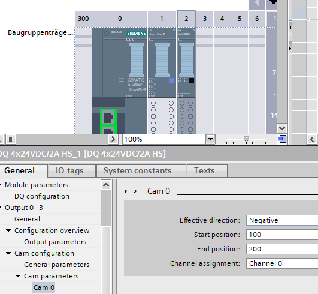

- Модуль підтримує декілька режимів роботи, зокрема керування клапаном і керування кулачком.
- У режимі керування кулачком кожен канал може керувати кількома кулачками.
- Керування кулачком здійснюється через набір параметрів, що складається з [напрям дії, початкова позиція, кінцева позиція, призначення каналу].

```xml
<Attribute Name="CustomAttributes">
	<Attribute Name="Cam 0”> <RefSemanticCorrespondingAttributePath=”ListType"/>
	<Attribute Name="EffectiveDirection" AttributeDataType="xs:string">
		<Value>Negative</Value>
	</Attribute>
	<Attribute Name="StartPosition" AttributeDataType="xs:string">
		<Value>100</Value>
	</Attribute>
	<Attribute Name="EndPosition" AttributeDataType="xs:string">
		<Value>200</Value>
	</Attribute>
	<Attribute Name="Channel Assignment" AttributeDataType="xs:string">
		<Value>0</Value>
	</Attribute>
</Attribute>
```

### B.2 Tables

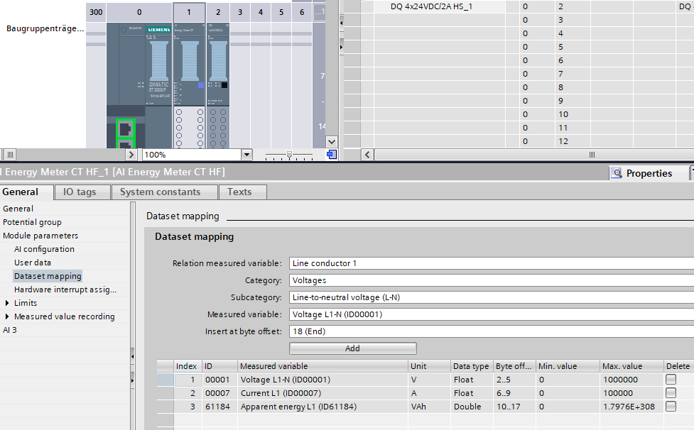

- Модуль підтримує різні вимірювання енергії.
- Для різних вимірювань можуть бути визначені записи з однаковим параметром.
- Призначення вимірюваних змінних до областей I/O може визначатися варіативно.

```xml
<Attribute Name="CustomAttributes">
	<Attribute Name="Dataset mapping">
		<RefSemanticCorrespondingAttributePath="OrderedListType"/>
		<Attribute Name="1">
			<RefSemanticCorrespondingAttributePath="ListType"/>
			<Attribute Name="MappingID" AttributeDataType="xs:string">
				<Value>00001</Value>
			</Attribute>
			<Attribute Name="MappingMeasuredVariable" AttributeDataType="xs:string">
				<Value>Voltage L1-N (ID00001)</Value>
			</Attribute>
			<Attribute Name="MappingUnit" AttributeDataType="xs:string">
				<Value>V</Value>
			</Attribute>
		</Attribute>
		<Attribute Name="2">
			<RefSemanticCorrespondingAttributePath="ListType"/>
			<Attribute Name="MappingID" AttributeDataType=" xs:string">
				<Value>00007</Value>
			</Attribute>
			<Attribute Name="MappingMeasuredVariable" AttributeDataType=" xs:string">
				<Value>Current L1 (ID00007)</Value>
			</Attribute>
			<Attribute Name="MappingUnit" AttributeDataType=" xs:string">
				<Value>A</Value>
			</Attribute>
		</Attribute>
	</Attribute>
</Attribute>
```

### B.3 Arrays

У цьому варіанті використання конфігурація Profinet DNS може бути вибрана з масиву IP-адрес.

```xml
<Attribute Name="CustomAttributes">
	<Attribute Name=„PnDnsConfiguration"> 
		<RefSemantic CorrespondingAttributePath=" OrderedListType"/>
		<Attribute Name=„1" AttributeDataType=" xs:string">
			<Value>192.168.3.3</Value>
		</Attribute>
		<Attribute Name=„2" AttributeDataType=" xs:string">
			<Value>192.168.3.4</Value>
		</Attribute>
		<Attribute Name=„3" AttributeDataType=" xs:string">
			<Value>192.168.3.5</Value>
		</Attribute>
	</Attribute>
</Attribute>
```


## Додаток C CommunicationPortProxyInterface – підключувані порти

У цьому додатку описано сценарій використання, що стосується розширення для моделювання підключуваних портів.

CommunicationPortProxyInterface представляє з’єднання між батьківським підключуваним модулем та його вбудованими портами у випадку, коли вбудовані порти передаються як частина головного модуля.

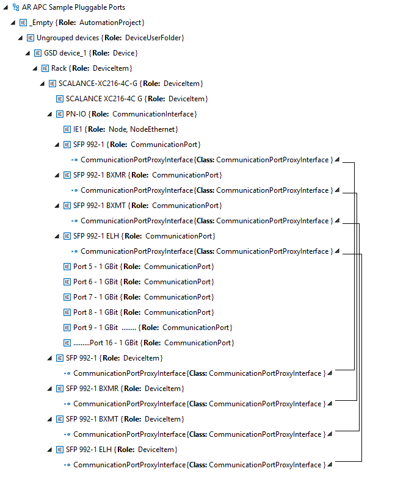

## Джерела

1. AR APC v1.4 https://www.automationml.org/news/new-version-of-the-ar-apc-is-now-available/


## Автори


Переклав  [Олександр Пупена](https://github.com/pupenasan). 

## Feedback

Якщо Ви хочете залишити коментар у Вас є наступні варіанти:

- [Обговорення у WhatsApp](https://chat.whatsapp.com/BRbPAQrE1s7BwCLtNtMoqN)
- [Обговорення в Телеграм](https://t.me/+GA2smCKs5QU1MWMy)
- [Група у Фейсбуці](https://www.facebook.com/groups/asu.in.ua)

Про проект і можливість допомогти проекту написано [тут](https://asu-in-ua.github.io/atpv/)