# Підхід багатовимірної коеволюції на основі AutomationML, підтриманий технологією блокчейн: проєктування архітектури та приклад для інтелектуальних виробничих ліній у контексті Industry 4.0

Це переклад статті [Ding, Kai & Gerhard, Detlef & Fan, Liuqun. (2025). AML-Based Multi-Dimensional Co-Evolution Approach Supported by Blockchain: Architecture Design and Case Study on Intelligent Production Lines for Industry 4.0. Information. 16. 243. 10.3390/info16030243. ](https://www.researchgate.net/publication/389964413_AML-Based_Multi-Dimensional_Co-Evolution_Approach_Supported_by_Blockchain_Architecture_Design_and_Case_Study_on_Intelligent_Production_Lines_for_Industry_40)

Анотація: На основі AutomationML (AML) інтелектуальні виробничі лінії (IPLs) для Industry 4.0 здатні ефективно організовувати багатовимірні дані та моделі. Проте цей процес потребує міждисциплінарної та багатокомандної взаємодії, що часто супроводжується подвійним тиском щодо шифрування приватних даних і спільного використання публічних даних. Блокчейн як прозора децентралізована мережа має обмежену сумісність із викликами процесів спільної роботи в AML, забезпечення безпеки даних і конфіденційності.

У статті запропоновано новий метод підвищення ефективності колаборативної коеволюції IPLs. Його новизна полягає у такому: по-перше, розроблено комплексну дворівневу модель керування, що поєднує блокчейн із Interplanetary File System (IPFS) для створення інтегрованого рішення гібридних приватно-публічних контейнерів на основі колаборативної моделі; по-друге, спроєктовано метод керування версійною коеволюцією шляхом поєднання робочих процесів смартконтрактів і багатовимірного моделювання AML; водночас запропоновано спеціально розроблений механізм розв’язання конфліктів на основі графової моделі для забезпечення узгодженості у багатопакетному керуванні версіями; нарешті, для верифікації використано тестові кейси, реалізовані в лабораторному середовищі I5Blocks.

## 1. Вступ

Коеволюція моделей є ключовим напрямом досліджень у межах модельно-орієнтованої інженерії систем, забезпечуючи ефективну координацію діяльності систем між командами та дисциплінами [1,2]. У контексті побудови інтелектуальних виробничих ліній (IPLs) часто необхідно враховувати управлінські аспекти багатовимірної складності, зокрема геометрії, фізики, поведінки та правил [3,4]. Shi та ін. [5] дослідили геометричні та фізичні означення IPLs і запропонували багатовимірний метод побудови на основі поведінки та правил функціонування; Lu та ін. [6] розробили метод проєктування, придатний для універсального проєктування виробничих ліній із використанням багатовимірних компонентів.

На практиці модель IPLs зазвичай складається з дискретних підмодулів, що потребують спільної розробки та верифікації кількома учасниками. Така співпраця може створювати виклики, зокрема синхронізацію оновлень, неузгодженість версій, неоднозначний розподіл прав інтелектуальної власності та обтяжливі процедури ручної перевірки. Automation Markup Language (AML) є ефективним інструментом для багатовимірного моделювання та обміну даними між різними зацікавленими сторонами завдяки відкритості, масштабованості, а також структурованій і стандартизованій побудові інженерної документації IPLs [7].

Lueder та ін. [8] дослідили інтеграцію AML з наявними форматами даних і означили, як їх можна використовувати для опису геометрії, кінематики, поведінки об’єкта та його взаємозв’язків з іншими об’єктами в ієрархічній топології фабрики, що забезпечує багатовимірний опис придатності виробничої системи; Lasi та ін. [9] розглянули, як AML може задовольняти змінні потреби через гнучке, автоматизоване та прозоре конфігурування виробничих процесів в епоху Industry 4.0 і забезпечувати інформаційний обмін у міждисциплінарних інженерних середовищах. Очевидно, що ці інноваційні роботи є важливими для розвитку багатовимірного керування колаборативною коеволюцією IPLs.

Однак саме через залучення багатьох зацікавлених сторін посилення колаборативного керування ефективними засобами стає особливо актуальним. У цій статті запропоновано підхід до керування контейнерами, призначений для IPLs. Спочатку підхід передбачає використання AML у процесі багатовимірного моделювання та серіалізації інженерної документації. Далі, з урахуванням вимог конфіденційності та безпеки спільної роботи, інтегруються компоненти консорціумного блокчейна та IPFS разом із графовим алгоритмом розгалуження версій для створення децентралізованого контейнера керування активами, що встановлює обмеження для багатьох зацікавлених сторін. Нарешті, у статті наведено детальні приклади реалізації.

Для досягнення цієї мети дослідження проводиться з двох позицій: методу багатовимірного моделювання на основі AML та методу керування колаборативною коеволюцією. Перша позиція полягає у системному аналізі сумісності гетерогенних компонентів і моделей на основі AML. Друга позиція, як продовження першої, додатково досліджує методи керування колаборативною коеволюцією багатовимірних моделей і формалізує дослідницьку проблему цієї статті.

## 2. Пов’язані роботи

### 2.1. Методи багатовимірного моделювання на основі AML

На основі сумісності та масштабованості AML подальша організація гетерогенних даних і моделей IPLs є фундаментом для розвитку колаборативної коеволюції [10,11]. Цей підхід ґрунтується на технологічній архітектурі RAMI4.0 (Reference Architecture Model Industrie 4.0) і широко застосовується в екосистемі технологій Industry 4.0 [12]. Спираючись на аналіз наявних форматів обміну даними, метою є впровадження стандартизованого формату для цифрового виробництва.

Berardinelli та ін. [13] продемонстрували інтероперабельність між AML та System Modelling Language (SysML) на прикладі маломасштабної виробничої системи. Дослідження спрямоване на забезпечення міждисциплінарного моделювання поведінкових моделей, незалежних від інструментів, шляхом виявлення спільних рис і відмінностей між AML і SysML. Ferreire та ін. [14] запропонували сервісно-орієнтований підхід до інтегрованої прототипної платформи для проєктування багаторазово використовуваних модульних IPLs із розширенням AML, що забезпечує повторне використання обладнання в процесі.

У межах багатовимірного моделювання IPLs обмін даними між цифровими двійниками (DT) та Asset Administration Shell (AAS) посилюється завдяки семантичному відображенню або розширенню AML [15,16]. Lehner та ін. [17] запропонували модельно-орієнтований фреймворк, спрямований на спрощення створення та підтримки інфраструктури DT із використанням моделей AML. Фреймворк продемонстрував ефективність інтеграції кількох моделей AML з точки зору масштабованості.

Zhang та ін. [18] представили підхід до інформаційного моделювання кіберфізичної виробничої системи на основі AML та запропонували метод інтеграції через розширені моделі для розв’язання проблем стандартизованого моделювання даних і безвтратної передачі під час проєктування виробничих систем. Lüder та ін. [19] дослідили метод моделювання цифрового двійника на основі евристичних алгоритмів із інтеграцією стандартів AML.

Окремо слід зазначити, що серіалізація метамоделі AAS за допомогою AML реалізується шляхом означення відповідних правил серіалізації, а також ролей, інтерфейсів і SystemUnitClass, пов’язаних із ними [20,21], що додатково підтримує роль AAS у моделюванні виробничих систем. Ding та ін. [22] дослідили метод інтеграції масштабованості AML та AAS для побудови цифрової виробничої системи; Backhaus та ін. [23] запропонували концепцію AML-моделювання продуктів, процесів і ресурсів в assembly-системах на основі навичок різних виробників; Bhosale та ін. [24] зосередилися на AAS і мові моделювання AML, а також на перевагах інтероперабельності та комплексному оцінюванні ризиків для ідентифікації, оцінювання й мінімізації потенційних ризиків промислових систем керування в інженерних застосуваннях.

Загалом еволюційні переваги AML чітко проявляються у безшовній інтеграції та відображенні різних моделей, які узгоджуються з AML за єдиною структурою та семантичним індексом і виражаються через інтеграцію кількох моделей AML. Водночас це актуалізує подальші дослідження щодо посилення керування колаборативною коеволюцією за допомогою технологічних засобів.

### 2.2. Методи керування коеволюцією

Багатовимірне моделювання та спільне використання активів на основі AML неминуче посилюють взаємодію кількох осіб або команд [25]. Сутність цього підходу полягає у створенні безпечної та надійної інфраструктури, що поєднує процеси ітеративної еволюції.

У робочих процесах розроблення моделей традиційні підходи до співпраці часто ґрунтуються на інтегрованому програмному спільному доступі або зв’язуванні моделей [26]. Наприклад, BIM-орієнтовані програмні засоби, такі як Revit, передбачають послідовні модифікації, коли кожна версія базується на попередній із додаванням або видаленням елементів. Однак такий послідовний підхід потребує значних обчислювальних ресурсів у разі великих моделей і обмежує ефективну паралельну співпрацю. Поява хмарних систем співпраці частково усунула ці обмеження [27], зокрема через рішення на кшталт Revit Server.

Разом із тим для сервісно-орієнтованих централізованих систем керування колаборативна робота на основі моделей пов’язана з ризиками підробки даних і неузгодженої трасованості [28]. Крім того, відсутність уніфікованих стандартів істотно знижує ефективність міжкомандної взаємодії.

У контексті досліджень Industry 4.0 особливо важливим є забезпечення безшовного з’єднання для обміну даними між різними командами [29]. Серед типових архітектурних парадигм можна виділити MAS-RECON [30], ADACOR і CASOA [31]. У реалізації агентних платформ на основі RAMI4.0 формується інтелектуальна система на базі багатьох агентів через розмежування можливостей взаємодії та додаткових функціональних атрибутів AAS [32,33].

Однак ці роботи переважно зосереджені на функціональному аспекті архітектури й не враховують ефективне забезпечення узгодженості версій моделей та ефективності співпраці в умовах багатокористувацького режиму. Надалі дослідники почали використовувати прозорість і незмінність технології блокчейн для розв’язання проблем безпеки даних.

Zheng та ін. [34] запропонували використовувати блокчейн для фіксації інформації BIM-креслень після кожного етапу створення, використовуючи властивості незмінності та трасованості для повного протоколювання процесу розроблення. Dietz та ін. [35] запропонували фреймворк безпечного обміну даними цифрових двійників на основі розподіленого реєстру з можливістю офлайн-зберігання структурованих і неструктурованих даних.

Подальше застосування блокчейна в децентралізованих механізмах керування проявляється у використанні смартконтрактів [36]. Zheng та ін. [37] використали смартконтракти для означення процесу коеволюції механічних виробів на основі блокчейна; Tao та ін. [38] розглянули проблему обміну та зберігання великих BIM-файлів і запропонували метод керування версіями PLM із інтеграцією IPFS та блокчейна з урахуванням багатопакетної версійної співпраці; Huang та ін. [39] дослідили методи керування даними продуктів на основі смартконтрактів із окремим опрацюванням конфігураційних файлів і даних датчиків.

Крім того, Tao та ін. [40] зазначили, що складність систем часто потребує конфіденційності колаборативних даних у різних просторових або часових вимірах, тоді як блокчейн використовує механізм «прозорої конфіденційності», що створює суттєвий виклик для забезпечення узгодженості та незмінності даних у процесі застосування.

## 3. Прогалини дослідження

З наведених вище двох перспектив видно, що мапування та моделювання багатовимірних гетерогенних компонентів IPLs на основі AML уже отримали широке визнання. Проте під час інтеграції керованого блокчейном колаборативного еволюційного керування IPLs залишаються такі проблеми:

1. Сумісність процесів еволюції AML-моделі з блокчейном. У межах спільної роботи над системою IPLs недостатньо досліджено питання мапування процесів на відстежувані в блокчейні механізми для реалізації багатовимірної декомпозиції та керування колаборативними процесами на основі AML.
2. Сумісність блокчейн-контейнерів для ключових активностей. У складних колаборативних процесах IPLs деякі підмоделі розробляються кількома командами, тоді як інші можуть бути завершені в межах однієї команди, що формує виражену публічно-приватну взаємодію. Блокчейн є незмінним механізмом, орієнтованим на прозорі процеси та блокові транзакції, і не може бути безпосередньо застосований до керування версіями AML для складних і великих файлів. Тому в роботі створено публічні та приватні версії виробничої системи між командами та всередині команд на основі блокчейну та IPFS, а також визначено відповідні робочі процеси керування.
3. Сумісність процесів керування версіями. Новизна роботи полягає в тому, що у стратегії публічно-приватної взаємодії змінюється ефективність паралельної та послідовної обробки версій. Тому на основі графової моделі інформація про активності версії мапується на вузли та ребра графа й поєднується з активностями процесора версій для підвищення ефективності багатократної міжпакетної взаємодії версій.

Як показано на рисунку 1, у роботі на основі чотиривимірної теорії [7,41,42] інтегровано AML із блокчейн-мережами для забезпечення колаборативного керування еволюцією моделей версій активів і сформульовано такі дослідницькі запитання:

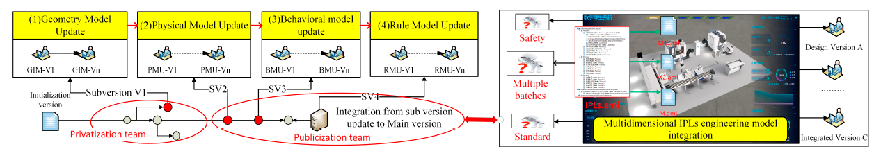

Рисунок 1. Концептуальний процес побудови IPLs у багатьох вимірах.

## 4. Методологія

Як показано на рисунку 2, методологія цієї статті починається з означення об’єкта дослідження та дослідницької проблеми, далі пропонуються відповідні рішення і, насамкінець, проводиться цільове тестування на прикладі. Ключові рішення досліджуються у трьох кроках:

1. На основі чотиривимірного методу моделювання формується шаблон багатовимірної колаборативної роботи на базі семантики AML, а також створюється абстрактний трасований процес конфігурації блокчейна, що спирається на моделювання в AML.
2. Запропоновано гібридну модель керування версіями IPLs, що поєднує блокчейн та IPFS. На цій основі сформовано метод колаборативного керування, заснований на гібридній моделі публічних і приватних версій. Одночасно в межах цього підходу розроблено інноваційний механізм керування конфліктами пакетів версій на основі графової моделі та метод керування роєм смартконтрактів;
3. Поєднуючи підхід рою смартконтрактів із керуванням життєвим циклом активностей, спроєктовано та детально розглянуто механізм функціонування архітектури системи.

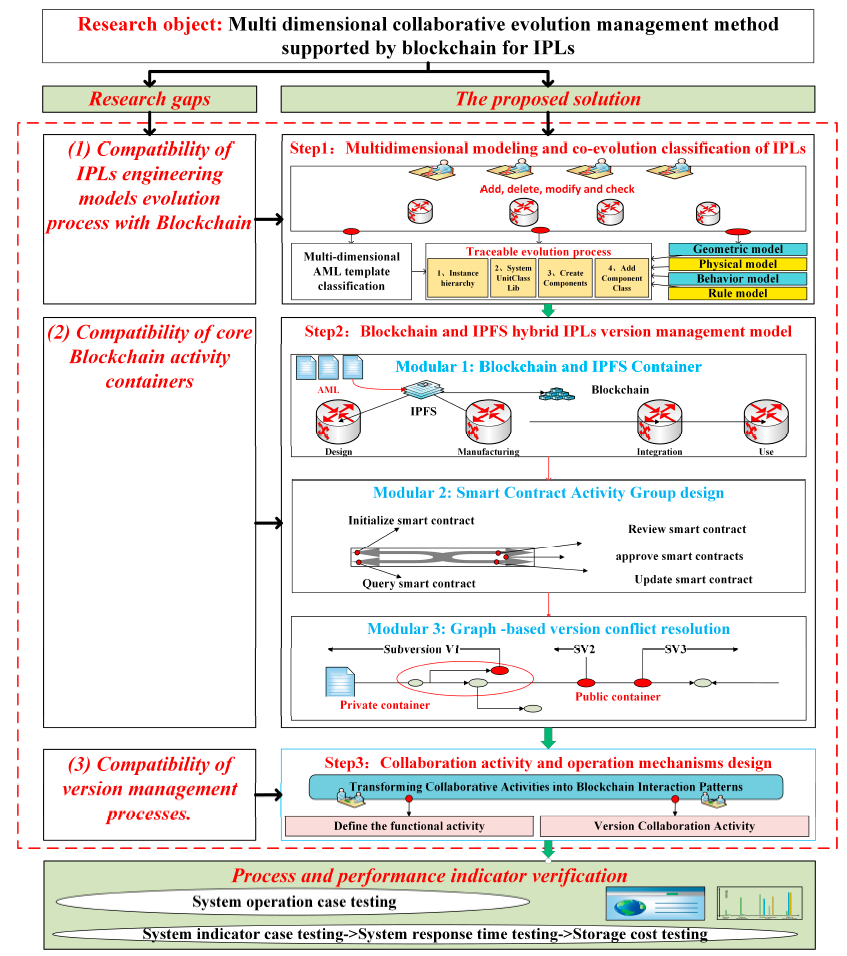

Рисунок 2. Методологія дослідження цієї статті.

### 4.1. Багатовимірне моделювання та класифікація коеволюції IPLs

Як показано на рисунку 3, моделювання на основі AML забезпечує багатокомандне колаборативне проєктування та оновлення, формуючи основу для спільної розробки IPLs.

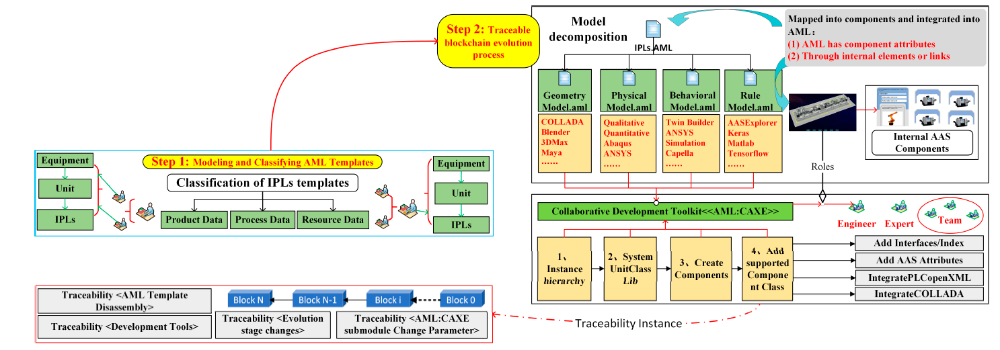

Рисунок 3. Трасований процес конфігурації моделі AML.

#### 1. Класифікація багатовимірних шаблонів AML

Оскільки стандарт AML не визначає конкретних деталей моделювання та підтримує розширення, у цій роботі інноваційно сформовано теорію моделювання IPLs у чотирьох вимірах на основі джерел [11,42,43]. По суті, використовується взаємозв’язок між розробленням компонентів, їх відображенням і референсуванням у межах стандарту AML та багатовимірним інструментарієм моделювання для побудови робочого процесу означення екземплярів, створення системних одиниць, створення компонентів і додавання типів компонентів. Крім того, ієрархічна структура IPLs формується на основі моделі CAEX (Computer Aided Engineering Exchange) стандарту IEC 62424 [12].

Геометрична модель. Для опису геометричних моделей AML інтегрує модель даних COLLADA, що забезпечує опис геометрії та кінематики різних об’єктів через COLLADA 1.4.1 і 1.5.0 (ISO/PAS 17506:2012) [44]. Типові інструменти колаборативної розробки включають Blender, 3DMax, Maya тощо. Наприклад, компонент розроблення Unity3D може інтерпретувати FBX-моделі, які підтримують специфікацію COLLADA, а потім виконувати їх порівняння та верифікацію з 2D/3D-кресленнями, наведеними у вимогах.

Фізична модель. Фізичні параметри зазвичай пов’язані зі структурою, матеріалами, умовами середовища тощо. Через відмінності у фізичних властивостях, цілях і умовах складно застосовувати універсальні методи оцінювання узгодженості, оскільки необхідно повністю враховувати індивідуальні характеристики фізичних об’єктів. У моделях AML опис фізичних моделей зазвичай поділяється на «якісні параметри» та «кількісні параметри» відповідно до визначених властивостей, що часто відображаються у моделі COLLADA. «Якісні параметри» стосуються положень, які мають суб’єктивну оцінку певної сфери застосування та змісту проєктування і тлумачаться людиною. Такі положення оцінюються групою експертів і відображаються у вигляді нормативних керівних документів. «Кількісні параметри» встановлюють чіткі обмеження для конкретних елементів конструкції, наприклад детальні розміри перерізу станини верстата, коефіцієнт армування або жорсткість шпинделя. Типові інструментальні засоби включають Abaqus, ANSYS, Simulink тощо.

Модель поведінки. Поведінкова модель призначена для оцінювання коректності послідовності дій і реакцій, що відображається в OpenPLC, підтримуваному AML [13]. Наприклад, типові методи логічного моделювання використовують діаграми послідовностей і діаграми станів для представлення поведінкових характеристик. Діаграми послідовностей SysML застосовуються для опису взаємодії системи з оточенням і взаємного впливу її частин. Діаграми станів SysML використовуються для опису переходів станів системи та операцій у відповідь на події. Також можуть застосовуватися допоміжні засоби, такі як діаграми активностей і діаграми варіантів використання. Типові інструменти включають Capella та інші засоби з підтримкою SysML.

Модель правил. Модель правил описує загальновизнані закономірності та правила, що реалізуються в IPLs. Вона також охоплює правила, пов’язані з геометричними, фізичними та поведінковими моделями, які зазвичай формуються на основі накопиченого досвіду та аналізу даних. Модель на основі правил здатна виконувати оцінювання, розвиток і логічне виведення. З огляду на широку сферу застосування моделей правил, наприклад правила планування, оптимізації параметрів, керування виробничими процесами, складно досягти їх моделювання й оцінювання однаковими засобами. Тому часто використовуються програмні можливості, зокрема AAS із підтримкою відображення AML, для побудови відповідних підмоделей різних правил. Поширеним підходом є інтеграція MATLAB, TensorFlow тощо через інструменти з відкритим кодом, такі як AASExplorer або OpenAAS, для розроблення інтелектуальних моделей правил AAS.

#### 2. Трасований процес еволюції на основі блокчейна

Багатовимірна модель відображає або інтегрує компоненти в AML на основі інструментів розроблення. Це реалізується через створення двох компонентів, які інтегруються в AML через внутрішні елементи або зв’язки для забезпечення трасованості.

Розглянемо як приклад модель правил «RM.aml»:

1. Означення InstanceHierarchy. Ієрархія екземплярів є топологічними даними моделі зберігання. Наприклад, у кейсі визначено «i5BlocksInstanceHierarchy-RM». Внутрішні елементи в ієрархії можуть бути створені як екземпляри SystemUnitClass, а їх семантика доступу може визначатися через посилання на RoleClass.
2. Створення SystemUnitClass. AML визначає правила створення SystemUnitClass, що дозволяє користувачам формувати їх відповідно до заданих правил. Бібліотека SystemUnitClass включає різні рівні, такі як обладнання, виробничі одиниці або виробничі лінії, і складається з багаторазово використовуваних шаблонів системних компонентів.
3. Створення компонентів. Компоненти деталізують конкретні функції SystemUnitClass. Окрім чіткого означення власних функцій, вони можуть додавати пов’язані моделі через посилання на інтерфейси. Interface використовується для опису зв’язків між об’єктами та їхніх посилань на зовнішню інформацію і зберігається в бібліотеці InterfaceClass.

Наприклад, AAS як цифрове представлення інтелектуального обладнання інтерпретує свої загальні дані, семантичну систему, модельну інформацію, зовнішні дані та зв’язки між ними, після чого відображає інформаційну модель AAS на правила інформаційної моделі AML. Для уточнення інтерфейсних зв’язків InterfaceClass деталізується в «InternalElements» або «SystemUnitClasses» чи Interface; бібліотека SystemUnitClass деталізується як «AssetAdministrationShell-SystemUnitClasses».

4) Додавання ComponentClass. У виробничій інженерії компоненти часто розробляються навколо RoleClass. Відповідно до опису їхніх прав доступу функції компонентів додатково розширюються (наприклад, роль визначається як інженер, відповідальний за моделювання AAS обладнання).

Таким чином, відповідно до базової бібліотеки RoleClass у IEC 62714-1, функціональну модель AML можна ефективно декомпозувати для проєктування та оновлення різними командами.

Отже, IPLs можна декомпозувати з багатовимірної моделі, використати контейнери на основі блокчейна та IPFS для забезпечення безпеки блоків даних і зберігання великих файлів із можливістю індексування, а потім відобразити їх у ієрархії AML через наявні або розширені компоненти розроблення.

### 4.2. Проєктування керувального контейнера

Інтеграція блокчейна та IPFS є основою бекенд-функціонування версій IPLs. Новизна роботи полягає в тому, що в умовах переходу між головною та пакетною версіями і за участю різних команд використовується концептуальна модель блокчейна, де кожен вузол зберігає ідентичну копію лише доданих даних, що запобігає централізованому втручанню.

IPFS використовує механізм CID (Content Identifier) для зберігання та індексування файлів, поєднуючи розподілені хеш-таблиці, BitTorrent і самосертифіковані файлові системи. Спільно блокчейн і IPFS забезпечують ефективну індексацію записів і зберігання великих і малих пакетів даних.

Для забезпечення конфіденційності конкретних версій у гібридній моделі можуть створюватися окремі контейнерні простори. Деякі контейнери призначені для співпраці в межах однієї команди, інші — для міжкомандної взаємодії. Остаточний реліз може бути опублікований у публічному контейнері («перехідний канал») за авторизованим підписом керівника команди.

#### 4.2.1. Проєктування гібридної моделі керування

Як показано на рисунку 4, у роботі використано модель співпраці на основі публічних і приватних контейнерів.

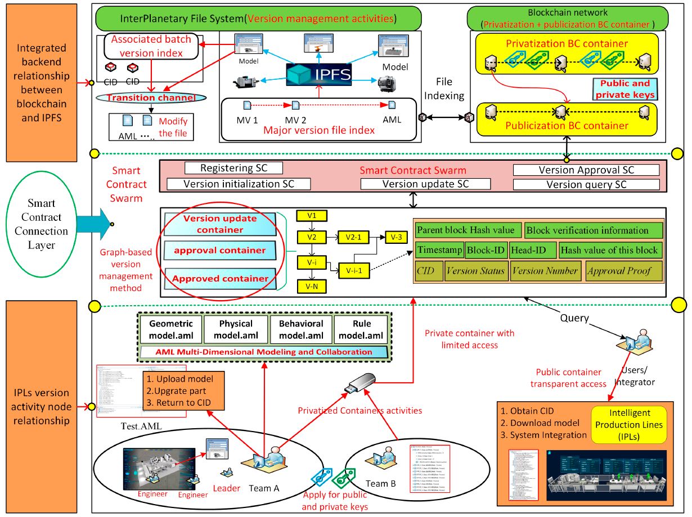

Рисунок 4. Гібридна модель керування IPLs на основі блокчейну та IPFS.

Зокрема, у запропонованій схемі в кожному контейнері формується окрема IPFS-мережа, до якої входять ініціатори змін версії та особи, що здійснюють затвердження. У межах цього контейнера відбувається обмін моделями IPLs, які очікують на оновлення та погодження.

Крім того, між простором зберігання великих файлів IPFS і контейнерами розподіленого реєстру додано спеціальний перехідний канал затвердження. Його призначення — керування процесом оновлення гілкових версій через прив’язку номерів гілок, а також надання окремих контейнерів для випадків, коли певні процесні моделі потребують спеціальних дозволів перед публікацією.

Після затвердження версії IPLs передаються до спільного контейнера, який є іншою приватною IPFS-мережею з інформацією, спільно підтвердженою всіма авторизованими учасниками.

У загальному механізмі керування версіями кожен незалежний контейнер складається з чотирьох частин: контейнера процесу оновлення версії, контейнера затвердження оновлення, контейнера затверджених версій і блокчейн-реєстру з механізмом узгодженої простежуваності.

Поява гілкових версій зумовлена тим, що IPLs вимагають від постачальників послуг конфіденційного оновлення власних функцій, зокрема алгоритмів. У такому разі система автоматично виділяє спеціалізований контейнер для забезпечення колаборативного оновлення версій між різними постачальниками.

Для забезпечення простежуваності історії версій і їх узгодженості записи про оновлення синхронізуються в блокчейн-мережі. Таким чином, контейнер гілкової версії зберігає функції подання, оновлення, затвердження та публікації версій IPLs у межах гілки.

Після отримання запиту на зміну версії затверджувач із числа учасників проєкту перевіряє блокчейн-реєстр своєї команди або міжкомандної взаємодії та використовує CID для завантаження підмоделей і пов’язаних проблем із IPFS.

Окрім порівняння моделі з планом постачання та узгодженими стандартами, затверджувач перевіряє відповідність вимогам узгодженості та коректність версії у модулі перегляду версій. У реальних проєктах кроки оновлення часто накладаються один на одного, і кожен крок потребує погодження. У такому випадку акцент робиться на перевірці узгодженості IPLs і автоматизованому перегляді версій.

Остаточно затверджена версія IPLs повторно інтегрується системним інтегратором або користувачами, після чого процес керування проєктом завершується. Якщо попередні гілкові версії та процедури затвердження були виконані коректно, версія публікується й архівується.

Для аномальних версій, тобто таких, що не проходять перевірку узгодженості або ревізію версії, затверджувач кожного вузла формує детальний перелік зауважень для відповідних розробників або команд з метою повторного доопрацювання.

1) Взаємозв’язок вузлів активностей версій IPLs

Замовники або системні інтегратори публікують вимоги до виробничих систем IPLs через блокчейн-платформу, після чого учасники проєкту створюють або модифікують моделі IPLs у своїх локальних базах даних.

Перед тим як поширити оновлену модель серед усіх учасників, розробник подає модель IPLs і пов’язані проблеми до контейнера затвердження IPFS для погодження зміни версії. Непогоджені метадані моделі, зокрема CID і номер версії, доступні лише учасникам рівня затвердження, тобто в межах виділеної IPFS-мережі.

У разі затвердження зміна статусу відображається в транзакції та транслюється до блокчейну через виклик смартконтракту. Усі учасники проєкту отримують інформацію про те, що модель IPLs затверджена або перебуває в процесі затвердження, і можуть переходити до наступного етапу роботи.

2) Внутрішній зв’язок між блокчейном і IPFS

У статті механізм функціонування контейнерної моделі аналізується у двох аспектах.

На рисунку 5(1) представлено приватні та публічні контейнери. Публічний контейнер забезпечує узгодженість і прозорість основної версії, дозволяючи будь-якій приватній команді відстежувати її стан і проблеми. Приватний контейнер відповідає за координацію версій і керування проблемами в межах окремих або локальних команд.

Хоча ці контейнери функціонують незалежно, вони підтримують взаємодію на рівні окремих гілок.

На рисунку 5(2) механізм роботи додатково пояснюється з точки зору робочого процесу.

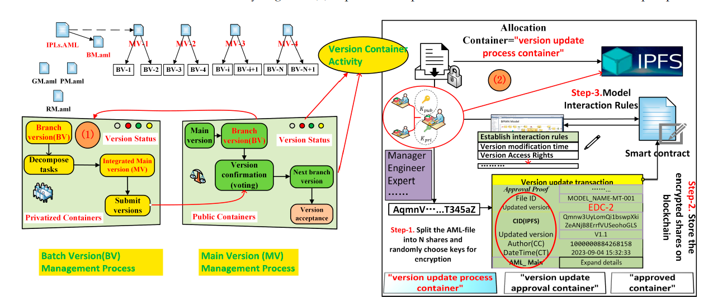

Рисунок 5. Розподіл контейнерів і робочий процес.

Крок 1: У будь-якому виділеному контейнері модель IPLs поділяється на модулі відповідно до правил генерації AML, і кожному модулю в IPFS присвоюється унікальний хеш-відбиток. Хеш-відбиток є унікальним рядком, що відповідає блоку даних, подібно до відбитка пальця людини, і дозволяє інженерам знаходити дані моделі IPLs за цим хешем.

Крок 2: Кожен виділений контейнер використовує розподілену хеш-таблицю для зберігання даних кількох вузлів. Під час пошуку або завантаження моделі IPLs спочатку обчислюється хеш-відбиток файлу. Цей відбиток разом із мережею спільного обміну Bit-Swap дозволяє отримати модель IPLs з інших вузлів.

Крок 3: Команди, замовники або експерти, які мають відповідні права доступу до контейнера, встановлюють обмежувальні правила шляхом співпраці. Наприклад, такі правила можуть включати вимоги до параметрів версії, строки постачання, частоту виникнення проблем і навіть штрафні умови для транзакцій.

Для кожного контейнера, що бере участь у вузлі активності та контейнерному просторі, «рівень з’єднання смартконтрактів» виступає як перехідний рівень між прикладним застосуванням і ядром контейнера.

З одного боку, він розширює функціональність консорціумного блокчейну. Наприклад, Hyperledger Fabric є зрілою блокчейн-платформою з багатофункціональними модулями проєктування, такими як розподілені реєстри, механізми прийняття рішень у межах консорціуму та смартконтракти.

З іншого боку, цей рівень сумісний із контейнерною архітектурою IPFS для «основної версії» MV та «гілкової версії» BV. Завдяки інтеграції функції «перехідного каналу» підтримується оновлення та затвердження гілкової версії без впливу на процес керування основною версією.

Загалом запропоноване рішення є більш придатним для системної інтеграції.

#### 4.2.2. Проєктування розв’язання конфліктів версій на основі графової моделі

У контексті переходів між публічними та приватними командами багатогілкові версії часто спричиняють плутанину. У цій статті управління процесом еволюції версій розглядається з позицій як послідовної, так і паралельної розробки.

Для традиційних послідовних робочих процесів після ініціювання еволюції версії моделі IPLs учасники отримують запит, досягають узгодження, витягують інформацію про версію AML та номери CID моделі, інкапсульовані в блокчейні, і послідовно виконують відповідні операції для оновлення моделі IPLs. Перевагою послідовної обробки є забезпечення узгодженості версій, проте її недоліком є низька ефективність.

З розвитком паралельної інженерії та інших методів управління розробленням продукції робочі процеси проєктів дедалі більше паралелізуються, що скорочує цикли розроблення. Відповідно, учасники, залучені до моделювання IPLs, часто виконують паралельні ітерації еволюції моделі, що може призводити до конфліктів під час синхронізації змін. Якщо такі конфлікти виникають між кількома зацікавленими сторонами, це може спричинити взаємні звинувачення.

У статті запропоновано інноваційний метод відображення інформації про перемикання версій у графову модель та побудови відповідної моделі розв’язання і керування конфліктами версій. Переваги та принципи застосування графових моделей у багатогілковому управлінні системами детально розглянуті в літературі [45,46], тому тут вони не розкриваються повторно.

У межах моделювання конфліктів версій, як показано на рисунку 6, побудовано модель конфлікту версій у вигляді орієнтованого графа

G = {N, E},

де N — множина вузлів версій, а E — інформація про еволюцію між відповідними вузлами версій. Ключові параметри вузлів і ребер докладно описані в таблиці 1 та можуть бути адаптовані відповідно до прикладних сценаріїв у реальних блоках.

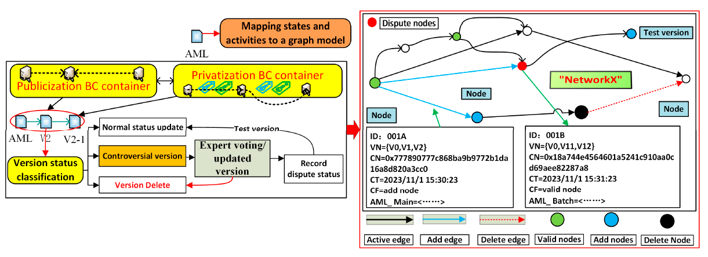

Рисунок 6. Механізм конфліктів версій на основі графової моделі.

**Таблиця 1. Означення параметрів для вузлів і ребер**

| Ключові параметри | Означення                                                    |
| ----------------- | ------------------------------------------------------------ |
| ID                | Унікальний числовий індекс вузла або ребра                   |
| Vₙ                | Набір версій {V₀, V₁, V₂}, що відповідно представляє загальний номер версії, номер попередньої версії та номер поточної версії |
| C_C               | Множина авторів вузла або ребра                              |
| C_T               | Часова мітка створення або оновлення вузла чи версії         |
| C_F               | Позначка статусу проблемної версії; деталі версії передаються через розширений блок даних «type struct()» |

Механізм оброблення конфліктів версій наведено в Додатку A, таблиця A1.

У цій роботі формується орієнтований граф «DG = nx.DiGraph()» у середовищі з відкритим кодом NetworkX. Відповідно до описаних характеристик, інтеграцію процесів оброблення конфліктів і керування смартконтрактами під час синхронізації моделей можна поділити на три кроки.

Крок 1: Перевірка наявності конфліктних версій. Коли певний операційний вузол зчитує кешовані еволюційні операції з IPFS та блокчейн-системи, він фіксує ID вузлів версій і значення CID, пов’язані з вузлами та ребрами (CF), після чого завантажує та інтерпретує відповідну версію AML.

Крок 2: Оброблення проблеми гілки. У конкретному процесі оновлення версії вузол-адміністратор (зазвичай користувач або керівник команди) послідовно виконує операції еволюції, що підлягають синхронізації в тілі блоку, і визначає, чи були відповідні вузли та ребра зафіксовані на попередньому кроці.

У цьому процесі перевірки зазвичай можливі три ситуації:

1. Нормальна операція. Передбачає перевірку узгодженості моделі, підтвердження того, що версія перебуває в допустимих межах, після чого інформація про оновлення вузла інтегрується та публікується в блокчейн і IPFS для подальшої обробки наступним вузлом.
2. Операція видалення. Застосовується до некоректних або аномальних версій (зазвичай після виявлення проблем у певній підмоделі під час перевірки узгодженості). Адміністратори керування версіями або експерти виконують автоматичну чи ручну перевірку та надають зворотний зв’язок щодо аномальної версії попередньої моделі. Якщо операція видалення зачіпає локально змінені вузли або ребра, ID проблеми та значення CID фіксуються в переліку конфліктів, а в IPFS створюється «перехідний канал». Після повного видалення в ланцюгу зберігається запис про видалення та повторно публікується актуальний запис версії.
3. Операція оновлення. Застосовується у разі появи гілкових версій. У цьому випадку ID і CID версії фіксуються в переліку конфліктів, а також створюються нові вузли версій і канали кешування IPFS для відображення формування нової гілки версії.

Крок 3: Після розв’язання конфлікту версій синхронізація моделі повторно виконується в системах блокчейн та IPFS. На цьому етапі відповідальні особи обох команд розроблення та відповідні технічні експерти беруть участь у підтвердженні. Після додавання «підтвердження схвалення» до «контейнера затверджених версій» ініціюється наступний пакет еволюції.

Таким чином, відображення процесу еволюції на вузли та ребра графової моделі та інтеграція механізмів трасованості й процесного керування з багатогілковим керуванням версіями дають змогу ефективно долати конфлікти в умовах паралельного керування.

### 4.3. Функціонування системи на основі групи смартконтрактів

Для повного пояснення процесу еволюції на основі транзакційної моделі, як показано в таблиці 2, у роботі виконано конфігурування та класифікацію основних активностей смартконтрактів відповідно до різних ролей у проєкті. З позиції абстракції активностей та проєктування інтерфейсів визначено ключові активності смартконтрактів, зокрема реєстрацію смартконтрактів (UR), ініціалізацію смартконтрактів (IC), оновлення смартконтрактів (UC), затвердження смартконтрактів (AC) та запит смартконтрактів (QC).

**Таблиця 2. Приклад проєктування інтерфейсу рою смартконтрактів**

| Основні активності                | Інтерфейс | Функції інтерфейсу           | Ролі користувачів інтерфейсу                                 |
| --------------------------------- | --------- | ---------------------------- | ------------------------------------------------------------ |
| Активність реєстрації користувача | UR()      | Реєстрація смартконтракту    | Замовники, інженери команди, керівники проєкту, експерти з перевірки, виробничі інженери |
| Активність публікації вимог       | IC()      | Ініціалізація смартконтракту | Замовники, керівники проєкту, експерти з перевірки           |
| Активність публікації вимог       | UC()      | Оновлення смартконтракту     | Інженери команди, керівники проєкту, експерти з перевірки    |
| Активність спільної модифікації   | UC()      | Оновлення смартконтракту     | Інженери команди, керівники проєкту, експерти з перевірки    |
| Активність спільної модифікації   | AC()      | Затвердження смартконтракту  | Замовники, керівники проєкту, експерти з перевірки           |
| Активність спільної модифікації   | QC()      | Запит смартконтракту         | Замовники, інженери команди, керівники проєкту, експерти з перевірки, виробничі інженери |
| Активність відстеження статусу    | QC()      | Запит смартконтракту         | Замовники, інженери команди, керівники проєкту, експерти з перевірки, виробничі інженери |

На цій основі, як показано на рисунку 7, у статті поєднуються інтерфейсні активності шляхом комбінування вузлів активностей та діаграм функціональної структури. При цьому контейнер підтримується платформами блокчейн та IPFS і охоплює розподілені реєстри, технології консенсусу, автентифікацію ідентичності, P2P-мережі, дерево Меркла тощо; сервісні вузли є конкретними вузлами активностей і включають замовників або ініціаторів вимог, системних інтеграторів, проєктувальників або команди, експертів або команди тощо; процес активностей основної версії на базі AML зосереджується навколо сервісного вузла та ініціалізує, оновлює або затверджує стан моделі основного вузла, включаючи ключові еволюційні активності, такі як модель вимог, декомпозиція моделі та інтеграційна модель; процес активностей підверсії додатково відгалужується від процесу активностей основної версії та відповідає подальшій ініціалізації, оновленню або затвердженню вузла або групи підактивностей у межах основної версії.

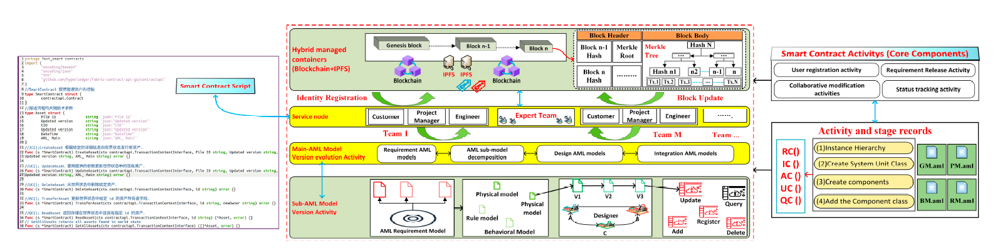

Рисунок 7. Колаборативні вузли та функціональна структура.

1. Активність реєстрації користувача

Користувач або команда, що беруть участь у діяльності публічно-приватного контейнера, ініціюють запит на реєстрацію, надсилають реєстраційну інформацію до вузла користувача, визначеного системою, викликають інтерфейс UR(), щоб активувати контракт реєстрації користувача, застосовують алгоритм еліптичної кривої для генерації унікальної пари відкритого та закритого ключів і пов’язують реєстраційні дані з цією парою ключів, тобто private key = Map [username, user password]. Після цього вузол повертає користувачу пару відкритого ключа Kpub та закритого ключа Kpri.

Реєстраційна інформація користувача визначається так:
user = {name, pwd, id_encryption, role},

де відповідно зазначаються ім’я користувача, пароль, зашифрований ідентифікатор користувача та роль, отримані із застосуванням функції SHA1().

2) Активність публікації вимог

Для зареєстрованих замовників, системних інтеграторів або експертів ініціалізується модель вимог, тобто основна версія, або «Genesis»-модель.

У межах цього експерименту з додатковим використанням графової моделі, окрім наявної версійної інформації Vn, відповідальної особи CC та часової мітки CT, сервісний вузол отримує CID AML-моделі та завантажує інформацію про екземпляр «AML_Main», розширену сутністю через CF. Вона детальніше описує інформацію про проєкт, організацію, конкретного розробника тощо.

Окрім основного ланцюга версії існують пакетні версії, які пов’язуються з «AML_Main» через «AML_Batch».

Приклад означення AML_Main:
AML_Main = {GUID, project_Name, per, org, action, T, mod_Date, mod_user, status}.

Поля означають відповідно: глобальний унікальний ідентифікатор (GUID), назву проєкту IPLs, інформацію про розробника, організацію розробника, етап конфігурації AML, часову мітку, дату модифікації, користувача, що виконав зміну, та статус використання. Для деяких проєктів частина цих полів може бути порожньою.

Початкова інформація про модель BV у ланцюзі записується як AML_Init.

Означення AML_Batch:
AML_Batch = {GUID, up_name, version, main_hash, uploader_sign, root_hash, T, uploader_pub},

де містяться GUID IPLs, ім’я завантажувача, версія, хеш основної моделі, підпис закритим ключем завантажувача, кореневий хеш, часову мітку та відкритий ключ завантажувача.

3) Активності спільної модифікації

Після автентифікації рецензент версії IPLs ініціює запит на подання інформації про модифікацію. Далі активується контракт перевірки цифрового підпису, який визначає, чи є поточний користувач уповноваженим на зміну версії. Якщо перевірка успішна, виконуються наступні дії, інакше запит відхиляється.

Після цього викликається інтерфейс QC() для отримання останньої інформації про зміну AML-версії. Порівняння виконується за допомогою CID та IPFS між поточною версією в ланцюзі та локальною версією до модифікації. Якщо виявляються проблеми або обмеження доступу до контейнера, вони публікуються в «transition channel», а спірні моделі доопрацьовуються.

Транзакція AC() успадковує всі метадані QC() та додає атрибути «Approval Status» і «Approval Proof». Перший передає рішення затверджувача, другий містить сертифікат членства та назву смартконтракту для підтвердження відповідальності.

Опис процесу спільного оновлення версій є ключовим етапом цього розділу. Послідовність прикладу така:

1. Дизайнери DA і DB одночасно отримують версію BN = 1 для модифікації.
2. DA завершує зміни, перевіряє останню версію в ланцюзі, отримує 1, збільшує її на 1 і публікує V2.
3. DB після завершення змін бачить BN = 2. Відповідно до правил, виконується злиття локальної версії з останньою версією в ланцюзі та публікується V3 (AB). Дизайнер DE отримує V3 (AB).
4. DE після перевірки бачить значення 2, яке менше за локальну версію плюс 1, тому публікує V4.
5. Якщо виникає гілка через заперечення щодо узгодженості, створюється нова гілкова версія. Наприклад, дизайнер BVC модифікує V4, перевіряє номер BN = 3, виконує злиття з останньою версією та публікує V5.
6. Після завершення оновлень користувач або системний інтегратор через QC() отримує CID з блокчейну в IPFS та може переглянути повний журнал змін через консорціумний ланцюг для забезпечення простежуваності під час подальшої інтеграції або експлуатації системи.

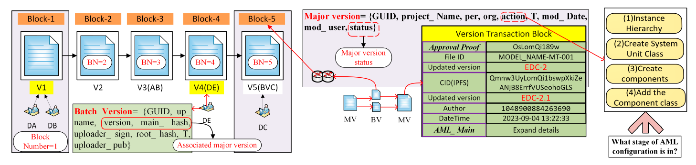

Рисунок 8. Колаборативний процес зміни версій.

Наведене вище є детальним поясненням процесу багатокористувацької спільної модифікації та подання версії IPLs. Принципи є однаковими як для публічних, так і для приватних контейнерів, тому повторно їх не розглядаємо.

4) Активність відстеження статусу

Останньою ключовою активністю є можливість для користувачів або системних інтеграторів автоматично ідентифікувати активності блокчейну та відстежувати їх через інтерфейси смартконтрактів.

У межах відстеження статусу будь-який вузол активності може переглянути поточну версію процесу. Реалізація передбачає визначення кількох унікальних прапорцевих полів для простежуваності пов’язаної інформації, яка уніфіковано підтримується через документ AML_Main.

Наприклад, «ID» є унікальним ключем AML-моделі, який використовується протягом усього процесу проєктування і не змінюється. Члени проєкту можуть переглянути історію змін версій у блокчейні за номером ID AML-файлу.

«Update version» — це новий номер версії для оновлення AML-моделі, а «Status» вказує на застосовність поточної версії.

«Author» і «Approver» означають зацікавлені сторони, які виступають ініціаторами та повинні надавати підтвердження.

«CID» є гіперпосиланням для доступу до відповідної AML-моделі в IPFS.

«Issue ID» і «Issue CID» мають аналогічну логіку до «ID» та «CID» AML-моделі й представляють журнали змін, додані до оновленої моделі.

## 5. Представлення кейсу та обговорення

В експериментальних умовах у статті спрощено складність системи. На рисунку 9(1) як приклад розглядається IPLs на базі AML: кожна організація має одну службу сертифікації та три вузли, з яких два вузли належать Команді 1 (що означає необхідність спільної роботи двох підкоманд над проєктуванням), а один вузол належить Команді 2, яка відповідає за проєктування решти зв’язків.

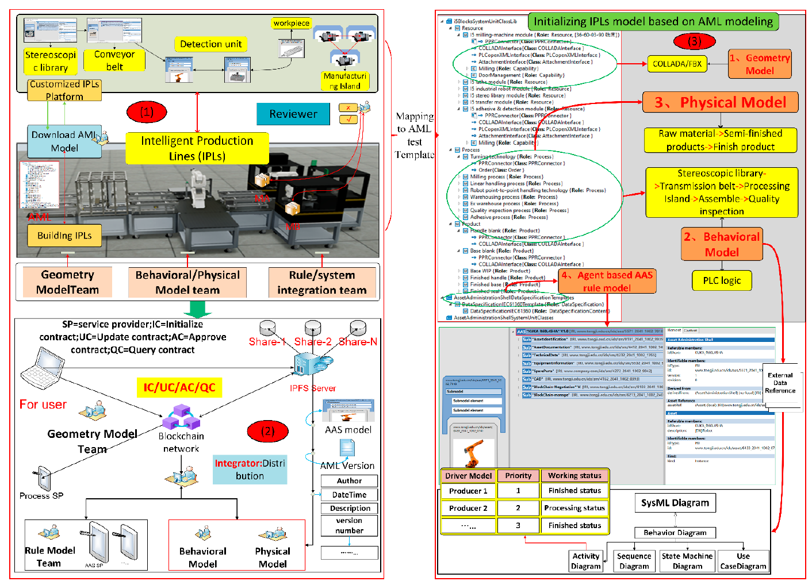

Рисунок 9. Тестові кейси та мапування AML-шаблону.

Поточний користувач або інтегратор публікує вимоги до побудови IPLs через платформу на основі опису AML і розподіляє підвимоги між командою проєктування User1, командою проєктування User2 та командою системної інтеграції AML User3.

Водночас у межах кожної команди є вузол ідентифікації (керівник команди), який відповідає за фактичну участь у спільному оновленні версії.

Рисунок 9 відображає налаштування віртуальної машини для середовища тестування:

1. система Ubuntu 20.04, 8-ядерний Intel(R) i7-1700HK CPU @ 2.40 GHz, 32 ГБ оперативної пам’яті, що використовуються для запуску тестових мереж;
2. експериментальне середовище Kafka складається з трьох сервісів Zookeeper і чотирьох сервісів Kafka;
3. IPFS V1.8.0 та Hyperledger Fabric V1.4.9 застосовуються для побудови розподілених мереж;
4. смартконтракти програмуються мовою Go, а алгоритми графової моделі інтегровані в середовище NetworkX;
5. тестова платформа верифікації розроблена на базі Unity3D.

### 5.1. Тестування роботи системи

(1) Ініціалізація AML-моделі та компонентів: у статті передбачається, що користувач або системний інтегратор є ініціатором версії IPLs, а керівник команди ініціалізує параметри вимог для фінальної версії. Як показано на рисунку 9 (3), у цьому прикладі спрощено функціональні означення чотирьох модулів.

① Геометрична модель: охоплює планування та моделювання повторно використовуваних системних компонентів відповідно до продуктової лінійки «I5Blocks».

② Фізична модель: фізичні атрибути застосовуються для автентифікації ідентифікаційної інформації логічної моделі виробничих факторів у логічному просторі та відтворення окремих параметрів оброблення реальних виробничих факторів, зокрема типового номера, назви фактора, фізичних параметрів і стану виробництва та оброблення, швидкості передавання, сили різання та інших даних.

③ Поведінкова модель: поведінка є абстракцією реальних виробничих і технологічних ресурсів. Логічна модель фізичної сутності переважно описує поведінковий стан відповідних елементів у виробничому процесі через виробничу поведінку.

④ Модель правил: у цьому прикладі модель правил відображається на AAS, який має вбудований алгоритм аналізу власного стану. Для інструментів спільної роботи з підмоделями AML, як запропоновано в розділі 4.1, застосовуються чотири кроки відображення процесу керування блокчейном: створення ієрархії екземплярів, налаштування класів одиниць, створення компонентів і модифікація властивостей компонентів. Геометрична модель описується за допомогою «lightweight FBX» (модель COLLADA), фізична — із використанням ANSYS, поведінкова — із використанням SysML, а модель правил керування AAS реалізується через вбудовану бібліотеку алгоритмів. Для початкової версії, з одного боку, застосовується уніфіковане керування на основі опису атрибутів AML, а з іншого — великі файли, пов’язані з атрибутами, додаються до тегів AML у вигляді індексів.

(2) Графоорієнтована спільна робота з версіями: оновлення версій IPLs ґрунтуються на вимогах та початкових версіях. Зокрема, команда розроблення ресурсів відповідає за проєктування моделі пристрою AAS. Для будь-якої оновленої версії гілки підверсії AML «V2-1» вузол проєктування «A001Test» виступає затверджувачем у команді. Він/вона завантажує модель «MODEL-GAAS-001» та використовує транзакцію UC() для отримання вбудованого CID опублікованого файла.

«A001Test» перевіряє якість моделі та узгодженість версії в межах AML-версії. Далі, викликавши смартконтракт UC(), він/вона позначає статус версії та додає підтвердження затвердження до транзакції AC(). Успішне поширення транзакції UC() означає, що версію «Behavior model-1.aml» затверджено і її можуть використовувати інші спеціалізації проєкту. Після затвердження транзакції UC() не лише фіксують зміни версії та оновлюють її значення в блокчейні, а й публікують затверджені моделі в IPFS. На рисунку 10 (1,2) показано результати операцій затвердження та оновлення версій у IPFS і блокчейні. Затверджувач викликає смартконтракт для підвищення значення версії до «V2-2» і синхронізує його з усіма системами реєстру.

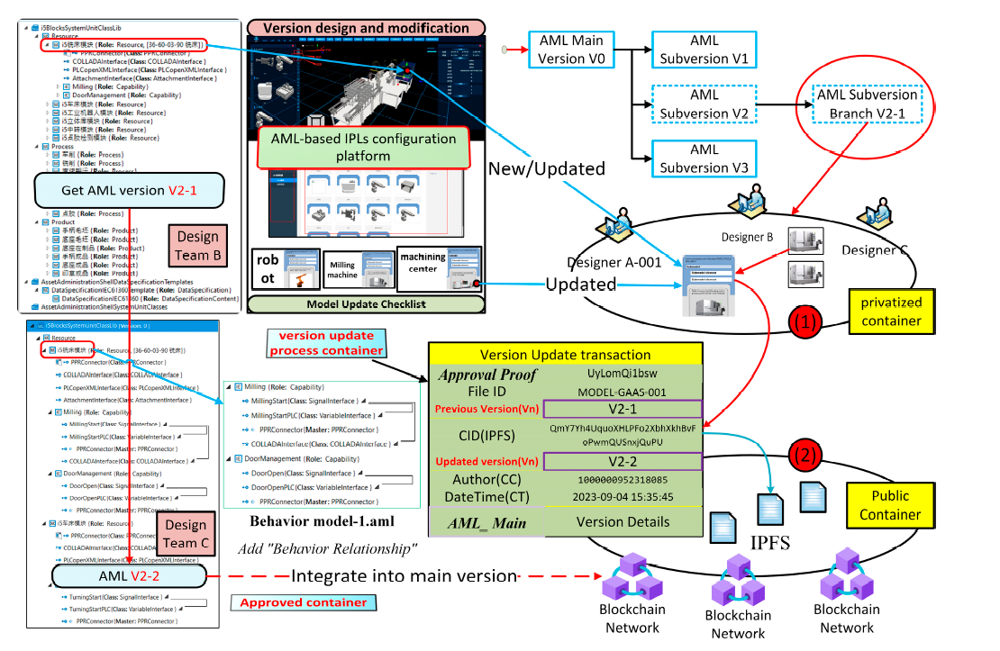

Рисунок 10. Приклад пакетного спільного тестування.

Якщо під час оновлення виникають проблеми (тобто з’являється проблемна версія), затверджувач версії публікує поточну версію в IPFS-мережі буферного каналу. Як показано на рисунку 11 (1), у статті тестування виконується на платформі цифрового двійника, де рецензенти окремо обговорюють спірну версію.

У межах перевірки прикладу було створено систему налагодження логіки виробничої лінії на базі Unity3D для моделювання процесного потоку SysML. Далі програмне забезпечення налагодження PLC (Programmable Logic Controller) використовувалося для перевірки ключових параметрів, зазначених вище. Також проводилося моделювання для геометрії, фізики та правил, зокрема перевірка «lightweight FBX» шляхом порівняння з CAD-кресленнями, перевірка типів відмов і відповідних описів відмов через налаштування технологічних завдань, а також перевірка підтримки взаємодії між пристроями та механізмів узгодження завдань. Цей процес потребує багаторазового тестування й перевірки, а також участі відповідних технічних експертів.

Для оброблення подій конфліктів версій, таких як аномалії або конфлікти у версії «V2-1», вона затверджується як проблемна та додатково передається до мережі IPFS для міждисциплінарного й експертного спільного доопрацювання та рецензування. Водночас учасники інших проєктних команд можуть використовувати смартконтракт QC() для запиту наявних транзакцій і відповідних CID з метою доступу до даних IPLs.

Механізми перегляду версій і розв’язання конфліктів реалізуються на основі вузлів і ребер графа. Під час перевірки версії можна оновлювати або видаляти конфліктні версії через графову мережу без порушення узгодженості версійної структури. Як показано на рисунку 11 (2), відображається нова гілкова версія «V2-1-1», і всі інші вузли доступу можуть отримати відповідну модель IPLs, оновити параметри, узгодити інтерфейси між пристроями. Конкретні операції доступу реалізуються через API-інтерфейс QC().

(3) Запит і візуалізація: функції запиту та візуалізації версій є важливою складовою процесу еволюції версій IPLs. З одного боку, вони забезпечують механізми ідентифікації та маркування активів для розробників і кінцевих користувачів у межах спільної роботи з версіями. Це означає, що рівні доступу, сфери застосування та функціональні обмеження можуть керуватися через ліцензування активів IPLs. Ключовим у цьому процесі є унікальність версії та підтвердження всіх її атрибутів, як показано в додатку A, таблиця A2. Вхідні параметри смартконтракту QC() запитуються через унікальний ідентифікатор ID файла AML.

З іншого боку, система забезпечує візуальне підтвердження як для внутрішніх команд, так і для міжпроєктної взаємодії. У візуальному прикладі стаття припускає, що після кількох ітерацій версії IPLs, як показано на рисунку 11 (3), система автоматизованої виробничої лінії остаточно сконфігурована. Для конкретних версій моделей машин можна індексувати останні блоки та відповідні вказівники IPFS для отримання й завантаження відповідної версії моделі AAS, яка містить базову інформацію AAS, параметри проєктування та правила технологічного процесу.

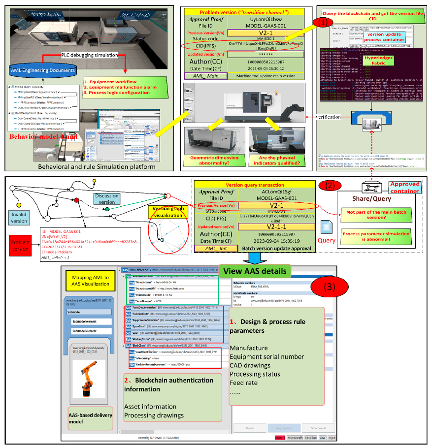

Рисунок 11. Тестування конфліктних версій та візуалізації у приватних контейнерах.

### 5.2. Тестування показників системи

Окрім аналізу механізмів роботи, було проведено тестування та комплексну оцінку показників продуктивності системи для визначення впливу блокчейн-мережі та IPFS-мережі.

Швидкість відгуку є важливим показником ефективності смартконтрактів. Як показано на рисунку 12, виконано 10 раундів порівняльного тестування.

Загалом, UC() має найбільший час відгуку — у середньому 53,3 мс. Основна причина полягає в тому, що необхідно не лише оновити записи транзакцій, а й обробити зміну версії.

Інші три типи смартконтрактів демонструють час відгуку в межах мілісекунд — приблизно 33–55 мс.

Порівняння публічних і приватних контейнерів показує, що через більшу кількість паралельних операцій у приватних контейнерах значення часу для IC(), AC() та UC() є нижчими, ніж у публічних. Водночас для QC() у публічному контейнері час є більшим, ніж у приватному.

Це пояснюється тим, що в умовах приватних паралельних операцій необхідно отримувати значний обсяг верифікаційних даних із публічного контейнера.

Загалом система забезпечує мілісекундний рівень відгуку, що повністю відповідає вимогам реальних промислових застосувань.

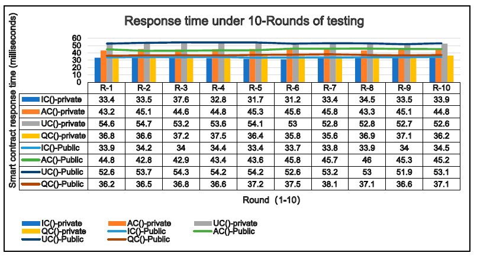

Рисунок 12. Час відгуку рою смартконтрактів.

Відгук IPFS оцінюється шляхом порівняльного тестування моделей IPLs різного розміру за умов множинних паралельних вузлів. У статті якісно змодельовано тринадцять варіантів кількості вузлів доступу: 5, 10, 15, 20, 25, 30, 35, 40, 45, 50, 55, 60, 65. Для них виконано тестування оновлення IPFS для чотирьох типів lightweight-моделей розміром 2 МБ, 4 МБ, 6 МБ та 8 МБ.

Як показано на рисунку 13, зі збільшенням розміру AML-файлу загальний час відгуку поступово зростає. Крім того, зі збільшенням кількості вузлів зростає обчислювальне навантаження, а завантаження AML-файлу потребує додаткового часу.

Порівняння деталей демонструє, що на відміну від традиційних файлових сховищ, загальний час відгуку системи не зростає лінійно. Наприклад, для моделі 2 МБ «test.aml» при 10 паралельних вузлах час відгуку становить 0,55 с. Якщо розмір залишається незмінним, але кількість вузлів зростає до 50, час відгуку становить 0,84 с. Тобто при п’ятикратному збільшенні кількості паралельних вузлів зростання часу складає приблизно третину, що свідчить про підвищення ефективності читання IPFS зі збільшенням кількості вузлів.

З іншого боку, при зменшенні розміру «test.aml» загальна ефективність не зростає пропорційно. Це пояснюється тим, що зі зменшенням граничного ефекту зберігання частка часу ініціалізації та встановлення мережевого з’єднання стає відносно більшою. Таким чином, розподілена файлова система не потребує багатьох копій зберігання, як централізована система, а ефективно масштабується відповідно до кількості вузлів. Це також показує, що IPFS як розподілена файлова система суттєво залежить від кількості вузлів.

Додатково проведено оцінювання вартості зберігання на основі моделі транзакційних блоків з метою визначення вимог до дискового простору.

Тестування враховує базу даних реєстру блокчейну, тобто модель транзакційних даних. Для розрахунків прийнято частоту генерації 1 блока на хвилину. У розрахунках враховано максимально можливий розмір транзакційної моделі, у середньому 284 байти, щоб оцінити граничну вартість зберігання.

Як показано в таблиці 3, припускається, що кожні 10 транзакцій об’єднуються в один блок для додавання до мережі. На рисунку 14 дерево Merkle блоку формується з 20 хеш-значень. Використовується хеш-функція SHA256, яка відображає дані довільного розміру у 256-бітне (32 байти) резюме. Підсумок дерева Merkle додається до транзакційного блока. Для тестування прийнято фіксоване пакування: 20 хешів × 32 байти = 640 байтів.

Загальний розмір одного блока становить приблизно 3595 байтів, або 3,6 КБ. Відповідно, добовий обсяг зберігання блокчейну становить:

3,6 КБ × 1 блок/хв × 60 хв × 24 год = 5184 КБ ≈ 5,18 МБ/добу.

Такий обсяг є прийнятним. За умови наявності 50 ГБ дискового простору система в ідеальному випадку може працювати понад 33 роки без вичерпання сховища.

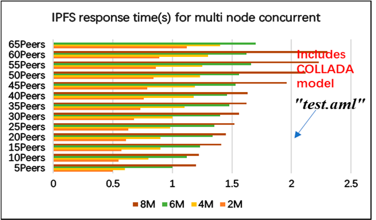

Рисунок 13. Час відгуку при багатовузловій паралельній обробці.

Таблиця 3. Розмір блока для кожної транзакції.

| Елемент             | Розмір | Опис                                                       |
| ------------------- | ------ | ---------------------------------------------------------- |
| Номер блока         | 2 B    | 12                                                         |
| Хеш блока           | 32 B   | h4UquoXh4UquoXHLPFo2XbhHLPFo2Xbh                           |
| Попередній хеш      | 32 B   | oPwmQUSnxjQuPU87yuro58ad801qmklpm                          |
| Часова мітка        | 18 B   | yyyyMMdd hh:mm:ssss                                        |
| Корінь Merkle блока | 32 B   | Фіксовані параметри тесту (256-bit / 32 B)                 |
| Дерево Merkle блока | 640 B  | Фіксовані параметри тесту (32 B зведення × 20 Hash number) |
| Дані транзакцій     | 2840 B | 284 B × 10 (пакування кожних 10 транзакцій)                |
| Разом               | 3596 B | Приблизно 3.6 KB                                           |

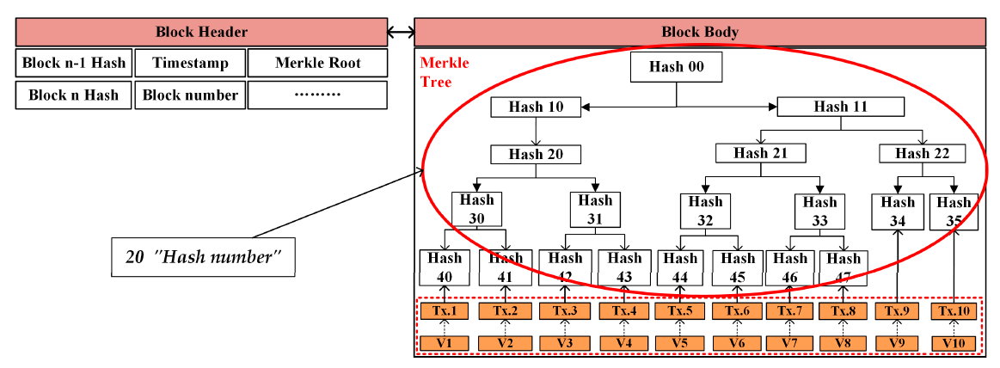

Рисунок 14. Дерево Merkle для тестування.

## 6. Висновки

Це дослідження не є універсальною системою, а використовує технологічні переваги AML для багатовимірної побудови IPLs, зосереджуючись на сумісності керування багатовимірними моделями на основі AML-мапування, що підтримується блокчейном, на сумісності гібридних контейнерів у публічно-приватних процесах керування та на сумісності між традиційними централізованими моделями керування і керуванням смартконтрактами на основі транзакційної моделі. Проведено подальший аналіз методів колаборативної еволюції, керованих блокчейном, і на цій основі визначено вузькі місця дослідження та запропоновано конкретні рішення для підтримки проєктування архітектури системи й тестування кейсів.

З точки зору механізму функціонування системи, AML як ефективний інструмент інтеграції багатовимірних гетерогенних моделей даних забезпечує узгодженість IPLs навколо гетерогенних компонентів, таких як цифрові двійники та AAS. Водночас перехідна централізована модель керування неминуче породжує проблеми узгодженості версій і безпеки в процесі колаборативного керування між кількома зацікавленими сторонами.

З одного боку, у статті запропоновано гібридну децентралізовану архітектуру на основі блокчейну та IPFS для забезпечення надійної взаємодії учасників IPLs. Процес колаборативної еволюції AML інтегровано в транзакційну модель, що забезпечує гнучкий механізм фіксації та верифікації змін версій у виробничих системах і значно зменшує суперечки щодо оновлень версій.

З іншого боку, у проєктуванні гібридної моделі враховано вимоги захисту приватності різних учасників під час взаємодії у публічних і приватних контейнерах. Інтеграція графової моделі керування версіями дозволяє ефективно розв’язувати конфлікти під час паралельної еволюції версій за умови безпечного перемикання між контейнерами.

З точки зору ключових експлуатаційних показників, хоча публічні контейнери потребують частіших інтерфейсних взаємодій і мають більший час відгуку порівняно з приватними, загальний час відгуку обох типів контейнерів утримується на рівні мілісекунд, що є достатнім для практичних інженерних застосувань.

Крім того, запропоновано транзакційну модель AML-версії з розділенням великих файлів моделей і індексних даних. Із зростанням кількості паралельних операцій час відгуку залишається стабільним. Згідно з розрахунками для дискових операцій, система може функціонувати понад 33 роки на носії обсягом 50 ГБ, що підтверджує придатність для практичного застосування.

Разом із тим залишаються напрями для подальших досліджень. Наприклад, у процесі спільної роботи деякі модулі можуть потребувати розширеного врахування питань інтелектуальної власності, зокрема декларування активів у просторі даних. Крім того, у лабораторному середовищі застосування публічних і приватних контейнерів виконувалося вручну. У реальних умовах необхідно враховувати вплив експлуатаційних витрат на загальне керування системою.

Внесок авторів: концептуалізація — K.D. і D.G.; методологія — K.D. і D.G.; програмне забезпечення — K.D.; підготовка первинного тексту — K.D.; рецензування та редагування — D.G.; наукове керівництво — L.F. і D.G.; адміністрування проєкту — L.F. і D.G.; залучення фінансування — L.F. і D.K. Усі автори ознайомилися та погодилися з опублікованою версією рукопису.

Фінансування: дослідження підтримано Національною ключовою програмою НДДКР Китаю (2022YFE0114100) та Програмою міжнародного обміну для аспірантів Університету Тунцзі (2023020019).

Заява інституційної комісії з етики: не застосовується.
Заява про інформовану згоду: не застосовується.
Доступність даних: вихідні матеріали дослідження наведені в статті; додаткову інформацію можна отримати у відповідальних авторів.
Конфлікт інтересів: автори заявляють про відсутність конфлікту інтересів.

## Додаток A

Таблиця A1. Процес керування версіями на основі графової моделі.

