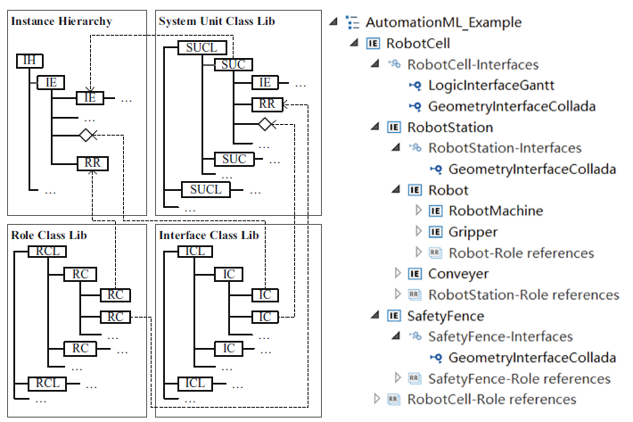
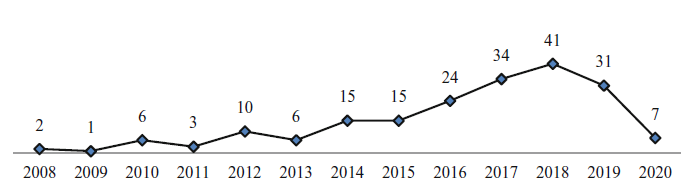
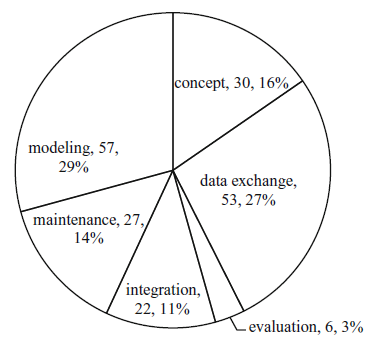

# AutomationML у середовищі Індустрії 4.0: систематичний огляд літератури

Це переклад статті [Zhao, Jiaqi & Schamp, Matthias & Hoedt, Steven & Aghezzaf, El-Houssaine & Cottyn, Johannes. (2021). AutomationML in Industry 4.0 Environment: A Systematic Literature Review. 162-169. 10.1007/978-3-662-62962-8_19. ](https://www.researchgate.net/publication/352042845_AutomationML_in_Industry_40_Environment_A_Systematic_Literature_Review#fullTextFileContent)

Анотація. AutomationML — це відкритий нейтральний формат обміну даними на основі XML, який використовується в системах автоматизації. Він існує понад 10 років і застосовується в багатьох різних напрямах у виробничих застосуваннях, зокрема для цифрових двійників, реконфігурованих виробничих систем, обміну гетерогенними даними тощо. Однак із моменту створення AutomationML не було виявлено комплексного огляду літератури щодо стану досліджень і практичного застосування AutomationML.

На основі вивчення та аналізу публікацій, пов’язаних із AutomationML, у цій статті подано детальний опис сучасного стану розвитку AutomationML. Спочатку представлено передумови та термінологію, пов’язані з AutomationML. Далі описано методологію збору публікацій щодо AutomationML, на основі яких проведено аналіз із використанням багатовимірної класифікації літератури. Після цього, відповідно до результатів аналізу, обговорено сучасний стан досліджень і те, чи може AutomationML задовольнити вимоги середовища Індустрії 4.0. Наприкінці наведено висновки та окреслено подальші перспективи.

## 1 Вступ

У виробничому середовищі Індустрії 4.0 протягом усього життєвого циклу продукту залучено багато різних інженерних дисциплін [1]. Інструменти, які використовують ці дисципліни, суттєво відрізняються, що призводить до формування широкого «гетерогенного ландшафту інструментів» [2]. Для ефективної інтеграції цього ландшафту обмін даними між цими інструментами є очевидним вузьким місцем, яке потребує вирішення [3].

Для розв’язання цієї проблеми компанія Daimler AG у 2006 році ініціювала створення консорціуму разом із провідними постачальниками та користувачами технологій автоматизації [4]. Метою створення консорціуму була розробка нейтрального формату обміну даними, придатного для використання в інженерних процесах виробничих систем з метою обміну даними між міждисциплінарними інструментами. Консорціум назвав цей нейтральний формат обміну даними «AutomationML» — скорочення від Automation Markup Language. Перша версія AutomationML була представлена громадськості на виставці Hannover Messe у 2008 році [3]. Початковим сценарієм застосування було описування статичної структури виробничої дільниці підприємства [5].

Із безперервним розвитком технологій Індустрії 4.0 виробничі підприємства змушені працювати в динамічному режимі, щоб задовольняти різноманітні потреби замовників [6]. Це вимагає, щоб виробничі системи були достатньо гнучкими та реконфігурованими для реагування на замовлення клієнтів [7]. Наразі автори намагаються знайти рішення для цифрового двійника з можливістю реконфігурації в реальному часі, у якому цифрова модель може автоматично змінюватися відповідно до поточного стану виробничої системи залежно від реконфігурації фізичної системи. «Цифровий двійник» — це інтегрована багатофізична, багатомасштабна, імовірнісна симуляція складного продукту, яка використовує найкращі доступні фізичні моделі, оновлення від датчиків тощо для відображення життєвого циклу свого фізичного відповідника [8]. Це означає, що цифрова модель повинна завжди бути узгодженою з фізичною моделлю.

З огляду на зростаючу гнучкість сучасних систем автоматизації підтримання актуального цифрового двійника у будь-який момент часу є значним викликом. Тому ефективний спосіб двонапрямного обміну даними між фізичною системою та її цифровою копією є необхідною умовою. Автори вважають, що AutomationML може надати відповідь на цю потребу.

У цій статті представлено сучасний стан розвитку AutomationML на основі систематичного огляду літератури. Головне питання, на яке намагаються відповісти автори, полягає в тому, чи може AutomationML задовольнити вимоги застосувань Індустрії 4.0 загалом і, зокрема, вимоги до створення цифрових двійників.

Структура статті є такою. У розділі 2 наведено загальний огляд AutomationML на основі прикладу. Розглянуто як зміст, так і архітектуру AutomationML. У розділі 3 подано методологію, яка використовується для збору публікацій, пов’язаних з AutomationML. Представлено метод аналізу на основі багатовимірної класифікації літератури. На підставі проведеного аналізу описано сучасний стан розвитку AutomationML та обговорено, чи може AutomationML задовольнити вимоги до створення реконфігурованих систем цифрових двійників у середовищі Індустрії 4.0. У розділі 4 сформульовано висновки та окреслено подальші перспективи досліджень.

## 2 Огляд AutomationML

AutomationML — це формат даних на основі XML, який є відкритим, нейтральним і безкоштовним [4]. Верхнім рівнем ядра AutomationML є CAEX, який використовується для взаємопов’язування різних форматів даних. Оскільки CAEX є об’єктно-орієнтованим, усі види інженерної інформації можуть зберігатися в об’єктах AutomationML. У ієрархії AutomationML ці об’єкти називаються внутрішніми елементами.

Типові категорії інформації, що зберігається у внутрішніх елементах, включають інформацію про топологію виробничої системи, геометрію та кінематику, логічну інформацію, інформацію про посилання та зв’язки, а також інші формати даних [9]. Приклад моделі AutomationML наведено на правій частині рис. 1. Представлена ієрархія відображає топологічну структуру роботизованої комірки. З ієрархії безпосередньо видно, що:

- (1) роботизована комірка складається з роботизованої станції та захисної огорожі;
- (2) роботизована станція містить робота і конвеєр;
- (3) робот включає роботизовану машину та захоплювач.

Окрім топологічної інформації, вузол “GeometryInterfaceCollada” містить геометричну інформацію компонента роботизованої комірки, яка пов’язана із зовнішнім геометричним файлом у форматі Collada. Вузол “LogicInterfaceGantt” містить логічну інформацію про роботизовану комірку, що пов’язана із зовнішнім логічним файлом, запрограмованим у вигляді діаграми Ґанта.

Оскільки AutomationML містить різноманітну міждисциплінарну взаємопов’язану інформацію, важливо забезпечити ефективність моделювання. Тому введено три бібліотеки класів: бібліотеку рольових класів (RCL), бібліотеку інтерфейсних класів (ICL) та бібліотеку класів системних одиниць (SUCL) [9].

RCL є контейнером рольових класів (RC), які означують семантику внутрішніх елементів (IE), причому кожен внутрішній елемент повинен посилатися на відповідний рольовий клас. Аналогічно, ICL є контейнером інтерфейсних класів (IC), і інтерфейсний клас може використовуватися для встановлення зв’язку між двома внутрішніми елементами або для посилання на зовнішній файл. SUCL є бібліотекою класів системних одиниць (SUC), які можуть використовуватися під час моделювання ієрархії екземплярів шляхом простого перетягування.

Застосування цих бібліотек суттєво підвищує ефективність моделювання в AutomationML.

Рис. 1. Архітектура AutomationML та приклад моделі AutomationML

## 3 Методологія та обговорення

У цій статті подано систематичний огляд літератури щодо AutomationML. Спочатку було ретельно проаналізовано офіційний вебсайт AutomationML [4]. На цьому ресурсі представлено всі дослідницькі проєкти та технічні документи, пов’язані з AutomationML. На основі цього автори сформували цілісне розуміння AutomationML.

Далі для збору публікацій, що містять термін «AutomationML», було використано пошукові системи Scopus, IEEE Xplore та Google Scholar. У такий спосіб було виявлено 195 публікацій, пов’язаних із AutomationML. Серед них 174 — це матеріали конференцій, 18 — журнальні статті. Решта публікацій включає 2 технічні звіти та 1 докторську дисертацію.

Кількість публікацій, пов’язаних із AutomationML, за роками наведено на рис. 2. З нього видно, що з 2008 по 2018 рік спостерігається переважно зростаюча тенденція кількості публікацій. Це свідчить про те, що AutomationML привертає дедалі більшу увагу дослідників. Автори вважають, що кількість публікацій у 2019 році перевищить показник 2018 року, оскільки частина публікацій 2019 року ще очікує офіційного оприлюднення. Аналогічно на статистику впливає і 2020 рік.

Рис. 2. Кількість публікацій, пов’язаних із AutomationML, за роками станом на 30 червня 2020 року

На рис. 3 показано відсотковий розподіл напрямів досліджень, пов’язаних із AutomationML. Відповідно до ролі AutomationML, напрями досліджень поділено на 6 категорій: моделювання, обмін даними, концепції, супровід, інтеграція та оцінювання.

Моделювання (29%) та обмін даними (27%) разом охоплюють понад половину всіх публікацій, що підтверджує: моделювання систем автоматизації на основі AutomationML і гетерогенний обмін даними на основі AutomationML є основними дослідницькими напрямами.

Крім того, публікації, пов’язані з концепціями, супроводом та інтеграцією, займають суттєву частку від загальної кількості — відповідно 16%, 14% та 11%. Дослідження, присвячені оцінюванню, представлені найменше — лише 3% від загальної кількості публікацій.

Рис. 3. Напрями досліджень, пов’язаних із AutomationML

- Моделювання: Цей напрям досліджень передбачає використання методів моделювання на основі AutomationML для представлення відповідної інформації у форматі даних AutomationML. Основне питання полягає в тому, який саме метод моделювання слід застосовувати для опису відповідної інформації. Згідно з публікаціями, моделювання на основі AutomationML охоплює різні аспекти, зокрема: моделювання систем автоматизації [10, 11], моделювання комунікаційних систем [12, 13], моделювання поведінки [14], моделювання процесів [15], моделювання продукт–процес–ресурс (PPR) [16], моделювання Asset Administration Shell (AAS) [17], моделювання відповідно до ISA-95 [18] тощо.

- Обмін даними: Цей напрям зосереджений на реалізації обміну даними на основі AutomationML. Він поділяється на дві частини:
  (1) обмін даними між інструментами в межах однієї галузі на основі AutomationML;
  (2) обмін даними між AutomationML та іншими форматами даних.
  Для першого випадку прикладами є обмін даними між системами 3D-моделювання [19, 20], між програмними засобами логічного програмування [21, 22], між системами моделювання та симуляції [23, 24] тощо. Для другого випадку розроблено методи обміну даними між AutomationML та OPC UA [25], SysML [26], RDF [27], OWL [28], PMIF [29] тощо.

- Концепції: Цей напрям охоплює нові концептуальні підходи в інженерії, пов’язані з AutomationML. Breckle та ін. [30] запропонували підхід еволюційної цифрової фабрики, яка містить і візуалізує всю згенеровану інформацію на основі метамоделі AutomationML. Kiesel та ін. [31] представили підхід AAS на основі AutomationML, здатний працювати з гетерогенними даними. Wally та ін. [32] використали інформацію, збережену в окремому документі B2MML, для узгодження двох промислових стандартів — ISA-95 та AutomationML.

- Супровід: Цей напрям зосереджений на розробленні нових підходів до роботи з AutomationML. Winkler та ін. [33] запропонували процес AML-Review для рецензування елементів моделей AutomationML із підтримкою інструментів. Wimmer та ін. [34] розробили спеціалізовану мову запитів для AutomationML. Hua та ін. [35] запропонували підхід навчання концептів в AutomationML із використанням фреймворку DL-Learner. Ananieva та ін. [36] розробили метод виявлення та виправлення невідповідностей у системах, змодельованих за допомогою AutomationML.

- Інтеграція: У цьому напрямі AutomationML виступає компонентом, який інтегрується в різні цифрові системи автоматизації. Panda та ін. [37] розробили платформу Plug&Play для модернізації виробництва на основі AutomationML і OPC UA, у межах якої сенсорні системи, сумісні з Індустрією 4.0, можуть автоматично підключатися, виявлятися та конфігуруватися в існуючому виробничому середовищі.

- Оцінювання: Цей напрям присвячений оцінюванню аспектів, пов’язаних із AutomationML. Meixner та ін. [38] запропонували нову гнучку методику оцінювання у контексті зберігання, модифікації та вибірки AML-моделей, а також для порівняння двох підходів до зберігання даних.

На основі класифікації публікацій можна зробити кілька висновків. AutomationML — формат даних, який з’явився у відкритому доступі трохи більше ніж 10 років тому — привертає дедалі більшу увагу дослідників. За допомогою AutomationML можливо моделювати різні види інформації виробничих систем і реалізовувати обмін даними на основі поєднання AutomationML з OPC UA, AAS, ISA-95 тощо. Можна стверджувати, що AutomationML є перспективним форматом даних із великим потенціалом для моделювання швидкозмінних систем автоматизації з метою ефективного створення та підтримання актуального цифрового двійника.

Водночас кількість публікацій, присвячених реконфігурованим цифровим двійникам на основі AutomationML, є дуже обмеженою. Лише 6 статей описують зв’язок AutomationML із цифровими двійниками. З них 3 належать до напряму моделювання [39–41], 2 описують лише концептуальний дизайн [42, 43], а 1 стаття демонструє метод автоматичного генерування цифрової моделі на основі AutomationML [44]. У літературі не представлено жодної реконфігурованої системи цифрового двійника.

Зростання інтересу до цифрових двійників і їх застосування у поєднанні з тенденцією до масової кастомізації посилює потребу в реконфігурованому цифровому двійнику [45]. Це може суттєво зменшити витрати зусиль для виробничих підприємств, оскільки створення та підтримання цифрового двійника є трудомістким процесом.

Тому автори планують розробити таку реконфігуровану систему цифрового двійника. AutomationML буде використовуватися не лише для цифрового моделювання геометричної та кінематичної інформації, інформації про поведінку та логіку, процесної інформації тощо для всієї фізичної системи, але й як міст обміну даними між цифровою моделлю та фізичною системою. З обох сторін буде розроблено плагіни для забезпечення передавання даних на основі AutomationML. Також планується реалізувати обмін даними в реальному часі на основі AutomationML.

## 4 Висновки та перспективи

У цій статті подано систематичний огляд літератури щодо сучасного стану розвитку AutomationML. Автори класифікували публікації, пов’язані з AutomationML, на 6 категорій відповідно до ролі AutomationML. Більшість публікацій присвячено питанням того, які методи моделювання можуть використовуватися для AutomationML (29%) та як здійснювати обмін даними на основі AutomationML (27%).

Крім того, частина публікацій зосереджена на концептуальних підходах (16%), супроводі файлів AutomationML (14%) та інтеграції AutomationML у реальні застосування (11%). Лише 3% публікацій присвячені оцінюванню аспектів, пов’язаних із AutomationML.

На основі багатовимірної класифікації літератури можна стверджувати, що AutomationML є перспективним форматом даних для використання в середовищі Індустрії 4.0. Подальші вдосконалення, зумовлені поточними дослідженнями, імовірно, ще більше підвищать його потенціал.

У майбутньому автори планують розробити методологію на основі AutomationML для створення реконфігурованої системи цифрового двійника в реальному часі, у якій цифрова модель може змінюватися синхронно з реконфігурацією фізичної моделі. Технологія обміну даними в реальному часі на основі AutomationML використовуватиметься для забезпечення узгодженості між фізичною системою та її віртуальною копією.

Подяки. Це дослідження фінансово підтримано China Scholarship Council (CSC) — неприбутковою організацією, підпорядкованою Міністерству освіти Китаю.

1. Lüder, A., et al.: Validation of behavior specifications of production systems within different phases of the engineering process. In: ETFA, IEEE (2013).

2. Drath, R., et al.: Concept for interoperability between independent engineering tools of heterogeneous disciplines. In: ETFA, IEEE (2011).

3. Drath, R., et al.: AutomationML – the glue for seamless Automation Engineering. In: ETFA, pp. 616–623. IEEE (2008).

4. AutomationML Homepage. https://www.automationml.org. Accessed 30 June 2020.

5. Wally, B.: Application Recommendation Provision for MES and ERP – Support for IEC 62264 and B2MML, 1st edn. AutomationML e. V. (2018).

6. Vogel-Heuser, B., et al.: Evolution of software in automated production systems: challenges and research directions. Journal of Systems and Software, 110, 54–84 (2015).

7. Hoang, X., et al.: An Interface-Oriented Resource Capability Model to Support Reconfiguration of Manufacturing Systems. In: SysCon, IEEE (2019).

8. Kritzinger, W., et al.: Digital Twin in manufacturing: A categorical literature review and classification. In: IFAC World Congress, pp. 1016–1022. IFAC (2018).

9. AutomationML consortium: Whitepaper AutomationML Part 1 – Architecture and General Requirements. 2nd edn. AutomationML e. V. (2018).

10. Peres, R., et al.: GO0DMAN Data Model – Interoperability in Multistage Zero Defect Manufacturing. In: INDIN, pp. 815–821. IEEE (2018).

11. Najafi, E., et al.: Model-Based Design Approach for an Industry 4.0 Case Study: A Pick and Place Robot. In: ICMT, IEEE (2019).

12. Patzer, F., et al.: Towards the modeling of complex communication networks in AutomationML. In: ETFA, IEEE (2017).

13. Drath, R., et al.: Modeling and exchange of IO-Link configurations with AutomationML. In: CASE, pp. 1530–1535. IEEE (2018).

14. Brandenbourger, B., et al.: Behavior modeling of automation components using cross-domain interdependencies. In: ETFA, IEEE (2016).

15. Danny, P., et al.: An Event-Based AutomationML Model for the Process Execution of ‘Plug-and-Produce’ Assembly Systems. In: INDIN, pp. 49–54. IEEE (2018).

16. Schleipen, M., et al.: AutomationML to describe skills of production plants based on the PPR concept. In: AutomationML User Conference (2014).

17. Drath, R., et al.: The AutomationML Component Description in the context of the Asset Administration Shell. In: ETFA, IEEE (2019).

18. Wally, B., et al.: IEC 62264–2 for AutomationML. In: AutomationML User Conference (2019).

19. Babcinschi, M., et al.: AutomationML for Data Exchange in the Robotic Process of Metal Additive Manufacturing. In: ETFA, IEEE (2019).

20. Fechter, M., et al.: From 3D product data to hybrid assembly workplace generation using the AutomationML exchange file format. In: CMS, CIRP (2019).

21. Hundt, L., et al.: Development of a method for the implementation of interoperable tool chains applying mechatronical thinking – Use case engineering of logic control. In: ETFA, IEEE (2012).

22. Estévez, E., et al.: A novel approach for flexible automation production systems. In: INDIN, pp. 695–699. IEEE (2017).

23. Bigvand, P.G., et al.: Concept and development of a semantic based data hub between process design and automation system engineering tools. In: ETFA, IEEE (2016).

24. Laemmle, A., et al.: Automatic layout generation of robotic production cells in a 3D manufacturing simulation environment. In: CIRP Design Conference, pp. 316–321. CIRP (2019).

25. Henßen, R., et al.: Interoperability between OPC UA and AutomationML. In: DET, pp. 297–304. CIRP (2014).

26. Berardinelli, L., et al.: Cross-disciplinary engineering with AutomationML and SysML. Automatisierungstechnik, 64(4), 253–269 (2016).

27. Hua, Y., et al.: From AutomationML to ROS: A Model-driven Approach for Software Engineering of Industrial Robotics using Ontological Reasoning. In: ETFA, IEEE (2016).

28. Hua, Y., et al.: Interpreting OWL Complex Classes in AutomationML based on Bidirectional Translation. In: ETFA, IEEE (2019).

29. Berardinelli, L., et al.: Integrating Performance Modeling in Industrial Automation through AutomationML and PMIF. In: INDIN, pp. 383–388. IEEE (2016).

30. Breckle, T., et al.: The evolving digital factory – new chances for a consistent information flow. In: ICME, pp. 251–256. CIRP (2019).

31. Kiesel, M., et al.: AutomationML in a continuous products life cycle: a technical implementation of RAMI 4.0. In: AutomationML User Conference (2018).

32. Wally, B., et al.: Entwining Plant Engineering Data and ERP Information: Vertical Integration with AutomationML and ISA-95. In: ICCAR, pp. 356–364 (2017).

33. Winkler, D., et al.: AutomationML Review Support in Multi-Disciplinary Engineering Environments. In: ETFA, IEEE (2016).

34. Wimmer, M., et al.: From AutomationML to AutomationQL: A By-Example Query Language for CPPS Engineering Models. In: CASE, pp. 1394–1399. IEEE (2018).

35. Hua, Y., et al.: Concept Learning in Engineering based on Refinement Operator. In: ILP (2018).

36. Ananieva, S., et al.: Model-Driven Consistency Preservation in AutomationML. In: CASE, pp. 1536–1541. IEEE (2018).

37. Panda, S.K., et al.: Plug & Play Retrofitting Approach for Data Integration to the Cloud. In: WFCS, IEEE (2020).

38. Meixner, K., et al.: Investigating the Performance of selected Data Storage Concepts for AutomationML Models. In: IECON, pp. 2785–2791. IEEE (2019).

39. Schroeder, G.N., et al.: Digital Twin Data Modeling with AutomationML and a Communication Methodology for Data Exchange. In: IFAC World Congress, pp. 12–17. IFAC (2016).

40. Zhang, H., et al.: Information modeling for cyber-physical production system based on digital twin and AutomationML. International Journal of Advanced Manufacturing Technology, 107, 1927–1945 (2020).

41. Peng, G., et al.: Data Exchange of Digital Twins Based on AML in Space Science Experiment Equipment. In: IOP Conference (2020).

42. Um, J., et al.: Plug-and-Simulate within Modular Assembly Line enabled by Digital Twins and the use of AutomationML. In: IFAC World Congress, pp. 15904–15909. IFAC (2017).

43. Lou, X., et al.: An idea of using Digital Twin to perform the functional safety and cybersecurity analysis. In: INFORMATIK Workshops, pp. 283–294 (2019).

44. Spellini, F., et al.: Production Recipe Validation through Formalization and Digital Twin Generation. In: DATE, pp. 1698–1703. IEEE (2020).

45. Zhang, C., et al.: A Reconfigurable Modeling Approach for Digital Twin-based Manufacturing System. In: IPSS, pp. 118–125. CIRP (2019).