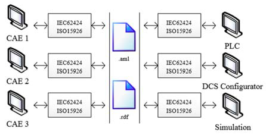
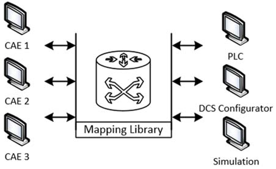
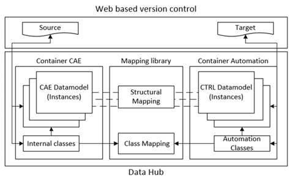
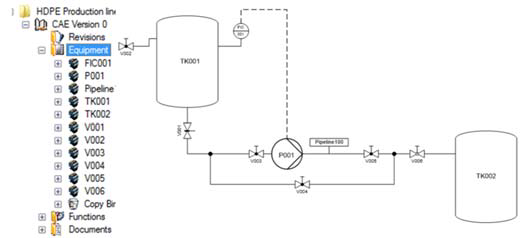
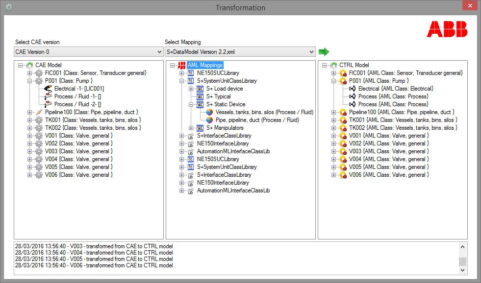
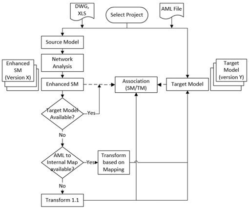
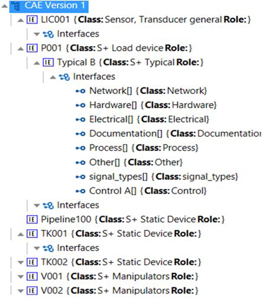

# Концепція та розроблення семантично орієнтованого хабу даних між інструментами проєктування технологічних процесів і інжинірингу систем автоматизації

Це переклад статті [Bigvand, Pouria & Fay, Alexander & Drath, Rainer & Carrion, Pablo. (2016). Concept and development of a semantic based data hub between process design and automation system engineering tools. 1-8. 10.1109/ETFA.2016.7733734.](https://www.researchgate.net/publication/309758550_Concept_and_development_of_a_semantic_based_data_hub_between_process_design_and_automation_system_engineering_tools)

Анотація. У цій статті описано інноваційний підхід та інфраструктуру для безперервної передачі даних між інструментами CAE та інжиніринговими засобами систем автоматизації. У запропонованому підході синтаксис, семантика та графічні представлення різних CAE-інструментів можуть бути захоплені, проаналізовані, візуалізовані та відображені в проміжний синтаксис і семантику в межах хабу даних.

Різні набори даних із різних джерел можуть бути об’єднані та проаналізовані з метою збагачення даних у хабі. Отримані результати можуть бути сформовані та відображені в будь-який цільовий синтаксис і семантику в середовищі sandbox для подальшого експорту з хабу.

Цей підхід забезпечує двонаправлений потік даних між кількома джерелами CAE та системами автоматизації за допомогою багаторівневої бібліотеки відображень. Усі вхідні та вихідні потоки хабу керуються веб-орієнтованою системою контролю версій, яка забезпечує перегляд дельти між різними версіями незалежно від їх початкового синтаксису або семантики.

Після одного проходу даних між джерелом і ціллю у хабі формується стійкий міст, який збагачується та вдосконалюється з кожним наступним проходом даних. Було виконано прототипну реалізацію, а повний цикл обміну даними перевірено з використанням прикладу P&ID та списку сигналів із різних CAE-інструментів, а також результату у форматі AutomationML, сумісного з інженерним інструментом ABB як цільовою системою автоматизації.

## I. ОБМІН ДАНИМИ МІЖ ПРОЄКТУВАННЯМ ТЕХНОЛОГІЧНИХ ПРОЦЕСІВ ТА СИСТЕМАМИ АВТОМАТИЗАЦІЇ

Гетерогенний характер даних, що генеруються на етапах базового та детального інжинірингу установки, традиційно є джерелом трудомісткого, схильного до помилок і ручного вилучення та реконструкції даних з метою виконання таких завдань, як проєктування автоматизації, моделювання та конфігурування [1].

Тому обмін даними між проєктуванням технологічних процесів і системами автоматизації визначено як одне з вузьких місць у циклі проєктування автоматизованих виробничих установок. Значні зусилля були спрямовані на специфікацію та реалізацію нейтрального стандартного формату для обміну даними між цими двома розділеними дисциплінами. Зокрема стандарти IEC 62424 [2], ISO 15926 [3] та IEC 62714 [4] можна вважати найуспішнішими прикладами таких зусиль, які досі перебувають у процесі розвитку [5].

### A. Сучасні методи та концепції

Загальноприйнятий підхід до покращення передачі даних між CAE та системами автоматизації полягає у використанні нейтрального проміжного формату, що відповідає глобальному стандарту та забезпечує інтероперабельність між CAE- та інструментами автоматизації. Цей підхід перебував у центрі численних дослідницьких проєктів і дискусій протягом останніх років [4, 6–9].

В ідеальному випадку такий глобальний і універсальний проміжний формат може забезпечити безперервний перехід даних між цими двома інженерними світами незалежно від постачальників програмного забезпечення та, відповідно, зменшити витрати часу й коштів на етапі проєктування та конфігурування автоматизації установки.

ISO 15926 [3], NE 100 [10] та STEP [11] були детально опрацьовані як стандартизовані моделі даних для численних потреб обміну даними. Крім того, різні розширення XML-схем, такі як AutomationML (AML) [12–14], надають можливість заповнення прогалин універсальних стандартів і їх адаптації до потреб конкретних груп постачальників та інтеграторів систем автоматизації.

Наразі тривають різні ініціативи, ініційовані виробниками програмного забезпечення та практиками, основною метою яких є досягнення узгодження щодо комплексного стандартизованого синтаксису та семантики. Технічний комітет GMA 6.16 [6] представив результати промислової та наукової співпраці, спрямованої на подолання глухого кута стандартизації шляхом зосередження на обміні даними запитів PCE.

Окрім діяльності зі стандартизації, на основі нейтрального стандартного формату AML були реалізовані й перебувають у процесі впровадження інші рішення, такі як підтримка версіонування обміну даними [15], автоматичне генерування моделей моделювання на основі CAE-даних [16] та базове конфігурування DCS із використанням шаблонів контролерів безпосередньо в CAE-інструментах.

На рисунку 1 зображено концепцію використання універсального нейтрального стандарту як засобу обміну даними.

Рисунок 1 — Універсальний нейтральний стандартний синтаксис і семантика як засіб обміну даними між CAE та системами автоматизації

### B. Чому потрібні альтернативні підходи?

Незважаючи на всі практично доведені переваги нейтрального стандартного формату даних, промислова реалізація такої концепції передбачає дві базові передумови:

- Постачальники CAE мають прийняти необхідність відкриття своїх систем для нового двонаправленого формату імпорту та експорту. Крім того, вони повинні інвестувати в реалізацію функціональності, що забезпечує трансляцію їхньої нативної моделі даних у нейтральний стандартний формат і навпаки. В ідеальному випадку такі інвестиції та ризик підвищення відкритості CAE-системи можуть бути виправданими з огляду на конкурентність теми та мотивацію користувачів CAE. Проте стандартизація за своєю природою є ітеративною та постійно еволюціонуючою діяльністю, що зазнає численних змін через появу нових технологій, нових інженерних потреб і нових можливостей оптимізації робочих процесів. Для постачальників CAE це означає постійні інтелектуальні зусилля та інвестиції для оновлення функціональності інтероперабельності відповідно до найновішої, попередньо узгодженої версії стандарту. Поєднання еволюції стандарту з розвитком технологій у CAE-інструментах, нових моделей даних і програмних архітектур, а також відсутність коротко- або середньострокової віддачі від інвестицій поступово створює складну ситуацію для постачальників CAE щодо підтримки такої концепції [17].
- Стандартизовані синтаксис і семантика є двома фундаментальними принципами нейтрального формату обміну інженерними даними [18]. Для створення «супермоделі даних», яка задовольняє більшість ключових інженерних моделей даних і забезпечує чітке та безвтратне відображення, необхідна постійна та систематична участь експертів із базового та детального проєктування процесів, інженерії керування та автоматизації, фахівців CAE та розробників систем автоматизації. Хоча така взаємодія та внесок фахівців є критично важливими для життєвого циклу стандарту й високо оцінюються його користувачами, конкурентний характер учасників може призводити до конфліктів інтересів, що спричиняє відхилення специфічних проєктних рішень від універсального стандарту.

Такі складні передумови разом із незрілістю стандартів для сучасних промислових проєктів стимулюють розроблення альтернативних концепцій реалізації маршрутів обміну даними між CAE-інструментами та системами автоматизації.

## II. КОНЦЕПЦІЯ ТА ЕЛЕМЕНТИ ХАБУ ДАНИХ ІЗ «ПЛИВНОЮ СЕМАНТИКОЮ» ТА СИСТЕМИ SANDBOX

### A. Концепція хабу даних із пливною семантикою

Для забезпечення передавання даних між CAE-інструментами та інжиніринговими інструментами систем автоматизації основою будь-якого підходу є міст даних, який надає не лише сирі дані, але й універсальну функціональність обміну, чого сам формат даних забезпечити не може.

У новій концепції пропонується застосувати проміжне сховище-мост даних, здатне містити будь-які довільні, але логічно узгоджені моделі даних. Така система не обмежує дані конкретним синтаксисом або семантикою і може вільно адаптуватися, подібно до рідини, що набуває форми контейнера.

Над гнучким проміжним сховищем-мостом створюється застосунок, який реалізує функціональність хабу з вхідними та вихідними шлюзами даних. Таким чином, цей міст забезпечує універсальну функціональність відображення та керування версіями й зрештою виконує роль препроцесора для фінального експорту через AutomationML.

Завдяки використанню пливної проміжної моделі мосту даних у поєднанні із застосунком хабу, що також слугує користувацьким інтерфейсом системи, можна захоплювати та інтегрувати різні дані й графічні представлення, експортовані з CAE-інструментів, які зазвичай мають гетерогенні моделі та структури даних. Підтримуються різні типи джерел — від нативних форматів CAE до стандартних форматів файлів, таких як Excel або AutoCAD (із блоками та атрибутами), а також нейтральні стандартні формати, зокрема AML.

Після захоплення даних через відображення джерела до проміжної (нестандартизованої) моделі мосту перша версія захоплених даних зберігається в хабі. Цей пакет даних може бути у будь-який момент відтворений у своєму початковому синтаксисі та семантиці через уже створене відображення джерела.

Далі ця версія може бути перетворена через інші стійкі відображення в інші цільові моделі даних, наприклад у нативний вхідний формат інжинірингового інструмента системи автоматизації, після чого формується перша версія трансформованих даних. На рисунку 2 наведено концептуальне зображення хабу даних і sandbox між CAE та системами автоматизації.

Рисунок 2 — Хаб даних і sandbox між CAE та системами автоматизації

Під час першого проходу даних від CAE-інструмента до інжинірингового інструмента системи автоматизації формується бібліотека відображень, яка забезпечує двонаправлене розуміння, захоплення та генерування синтаксису й семантики одного джерела та однієї цільової системи.

Рисунок 3 — Огляд архітектури хабу даних

Починаючи з цього етапу забезпечується безперервна взаємодія між хабом і двома зазначеними сторонами незалежно від характеристик джерела та цілі. З подальшим підключенням нових джерел і цільових систем бібліотека відображень стає більш зрілою. На рисунку 3 наведено огляд архітектури хабу даних.

### B. Методи та концепції приймання даних

Одним із ключових сегментів хабу є захоплення даних із CAE-інструментів. У принципі існує два методи отримання даних, незалежні від подальшого розвитку цих інструментів. Перший метод полягає у використанні нативних форматів, другий — у застосуванні стандартних функцій експорту до поширених форматів, таких як DWG для графічного представлення та XLS для табличних масивів даних. Далі обидва підходи будуть детально розглянуті, порівняні, а приклади їх застосування наведено в розділі III.

Захоплення нативних даних різних CAE-інструментів видається найбільш надійним способом отримання оригінальних даних у їх початковому форматі та логіці. Майже всі сучасні постачальники CAE надають відкритий API, який дозволяє отримувати доступ до моделі даних кожного проєкту в інструменті. Через цей відкритий інтерфейс можна вилучати необхідні дані та зв’язки [19].

На перший погляд цей підхід має суттєві недоліки:

1. доступ через API потребує наявності щонайменше однієї ліцензії для кожного CAE-інструмента;
2. проєкти, створені в одному CAE, але в різних його версіях, можуть спричиняти невідповідність версій;
3. робота з API потребує глибоких знань програмування конкретного API, який може змінюватися від версії до версії.

З огляду на це доступ до нативного формату здається малопрактичним. Проте з урахуванням еволюції CAE-інструментів і тенденцій розвитку більшість постачальників поступово переводять свої API частково або повністю в онлайн-технології, такі як вебсервіси.

Вебсервіси CAE-постачальників:

1. дозволяють отримувати доступ до нативних даних через Інтернет без встановлення та ліцензування CAE-інструмента;
2. є незалежними від версії, оскільки команди переважно виконують роль викликів внутрішніх функцій;
3. здебільшого дотримуються універсальних протоколів, що зменшує потребу у спеціалізованих знаннях конкретного CAE-інструмента.

З огляду на ці тенденції підхід виглядає перспективним і був реалізований у прикладі захоплення даних P&ID та зв’язків разом зі списками сигналів через вебсервіси Engineering Base — продукту AUCOTEC AG.

Другий підхід до захоплення даних полягає у використанні стандартного експорту до поширених форматів, таких як DWG і XLS. У цьому випадку хаб здатний аналізувати кожен блок і клас атрибутів у файлах DWG, а також кожну колонку у файлах XLS.

Використовуючи цю інформацію разом із функціональністю перетягування (drag & drop) класів атрибутів, класів пристроїв і структурного стійкого відображення, користувач може повністю відновити графічне представлення разом зі зв’язками та масивами даних оригінального проєкту в проміжному сховищі мосту даних. Те саме відображення може використовуватися під час кількох циклів імпорту та створення різних версій даних. Після кожного імпорту у разі відсутності певних блоків відображення прогалини заповнюються, а ефективність трансляції зростає.

### C. Багаторівнева концепція відображення

Концепція відображення, що використовується на різних етапах роботи хабу, зокрема під час приймання даних, має чотирирівневу архітектуру.

Перший рівень — відображення класів атрибутів. Користувач може зіставляти класи атрибутів джерела або цілі з класами атрибутів у хабі. Функціональність drag & drop у поєднанні з розпізнаванням тексту забезпечує гнучке створення таких відображень.

Другий рівень — відображення класів об’єктів. Класи об’єктів містять набір пов’язаних класів атрибутів і правила та поведінку для екземплярів об’єктів. Так само як і класи атрибутів, класи об’єктів джерела або цілі можуть бути відображені на класи об’єктів хабу.

Третій рівень — структурне відображення. У межах цього рівня кожен клас об’єкта джерела або цілі може бути відображений на певну структуру класів об’єктів і пов’язаних із ними атрибутів. Наприклад, клас вимірювального тегу може бути відображений на структуру, що включає всі необхідні та допоміжні сигнали. А насос може бути відображений на модуль, що включає двигун, пускач, датчик вібрації та пов’язані сигнали. Усі допоміжні об’єкти створюються під час імпорту зі своїх власних класів і структуризуються відповідно до використаного відображення.

Четвертий рівень — відображення шарів. Шари можуть бути візуалізаційними або реляційними. Прикладами візуалізаційних шарів є основні пристрої, керування та КВП на P&ID, допоміжні шари. Прикладами реляційних шарів можуть бути трубопровідні шари, логіка керування або логіка безпеки. Кожен із цих шарів може бути індивідуально або групово відображений на відповідні шари даних або представлення в хабі. Використання відображення шарів дозволяє внутрішнім алгоритмам хабу аналізувати різні зв’язки між пристроями, наприклад трубопровідні з’єднання або концепції керування.

### D. Об’єднання даних із кількох джерел і sandbox

Одним із викликів для інженерів автоматизації є робота з різними форматами та аспектами одного й того самого проєкту. У великих проєктах автоматизація зазвичай виконується на пізніх етапах циклу проєктування. До цього часу різні інженерні дисципліни в різних географічних і культурних контекстах уже використовували різні інструменти та експортували свої результати для подальших етапів.

Такий паралельний інжиніринг підвищує конкурентоспроможність, але водночас збільшує ризик невідповідностей у синтаксисі, правилах найменування, інженерних стандартах і форматах постачання в межах одного проєкту, який має бути автоматизований головним інтегратором автоматизації.

Саме тому описана раніше концепція відображення забезпечує можливість об’єднання та уніфікації різних входів одного проєкту в межах однієї версії. Кожен вхід розглядається як шар даних, який накладається на інші, формуючи інтегровану та узгоджену версію імпортованих даних проєкту.

У хабі кожен шар може автоматично об’єднуватися через відображення з іншими шарами або зберігатися як окремий шар у sandbox-середовищі для певної імпортованої версії. У sandbox користувач може вручну об’єднувати різні входи одного проєкту та поступово відновлювати повну інтегровану модель даних. Кожне ручне об’єднання може бути збережене як нове правило у бібліотеці відображень і сприяти її зрілості. Після кількох циклів імпорту та об’єднання бібліотека стає достатньо зрілою для повного розуміння синтаксису та семантики проєкту незалежно від формату або послідовності входів.

### E. Перетворення даних у AutomationML

Після відновлення моделі даних проєкту за допомогою розширених відображень, автоматичного об’єднання або sandbox-хабу як певної версії імпорту з боку CAE ці дані можуть бути трансформовані в синтаксис і семантику систем автоматизації для різних цілей.

Фінальне перетворення в AML може здійснюватися двома основними способами:

1. пряме перетворення з генерацією всіх необхідних класів «на льоту»;
2. перетворення на основі відображення на попередньо визначені цільові бібліотеки класів AML.

У разі прямого перетворення спочатку створюються всі доступні класи разом із їх атрибутами в AML, після чого структура моделі даних відтворюється з хабу в AML. У результаті AML відображає ту саму модель класів, що й хаб, але в нейтральному синтаксисі.

У другому підході атрибутні класи, класи об’єктів і структура хабу відображаються на одну або кілька попередньо визначених бібліотек класів AML, орієнтованих на конкретну цільову систему. У результаті трансформації формується цільова модель класів, зрозуміла для інжинірингового інструмента системи автоматизації.

В обох випадках усі зв’язки між пристроями, включаючи електричні з’єднання або трубопроводи, представляються через зв’язки AML, а фізичне положення графічного об’єкта зберігається в атрибутах X та Y. Надалі ці координати можуть бути використані для автоматичного формування ескізу HMI.

### F. Версіонування, дельта та керування змінами

У будь-якому промисловому проєкті ітерації проєктування є неминучою частиною розвитку. Керування змінами на кожному етапі проєктування та їхніми наслідками для інших дисциплін є складним завданням для інженерів і керівників інженерних проєктів. Керування змінами та дельтою зазвичай є однією з ключових функцій сучасних CAE-інструментів, і в цій сфері досягнуто значного прогресу.

Водночас, коли йдеться про дані або креслення, що є результатами роботи CAE-інструментів, керування змінами та дельтою зазвичай обмежується опрацюванням різних редакцій документів. Найчастіше це перебуває під контролем систем керування документами (DMS). Такий рівень абстракції є практично недостатнім для ефективного керування змінами в контексті автоматизації установки.

З цієї причини в новому підході кожен вхідний або вихідний пакет даних у хабі має власну версію, пов’язану з конкретним проєктом. Кожна версія імпорту з боку CAE може бути трансформована для сторони автоматизації, утворюючи нову версію.

Під час першого проходу імпорту та трансформації формується стійка відповідність 1×1 між екземплярами об’єктів. У подальших проходах даних — під час повторних імпортів із боку CAE, експортів до сторони автоматизації або повторного імпорту зі сторони автоматизації — створюються нові версії пакетів даних, при цьому асоціація залишається стійкою, але її характер змінюється з 1×1 на m×n.

Такий тип асоціації m×n дозволяє здійснювати детальне керування дельтою та відстежувати кожну зміну між різними версіями з боку CAE або автоматизації, а також аналізувати наслідки змін із боку CAE для автоматизації і навпаки.

Розподілена ІТ-структура та вимоги безпеки систем автоматизації створюють чітку межу між машиною, яка виконує роль «воронки» та приймає різні типи й формати даних із різних CAE-інструментів, і машинами, на яких розгорнута система автоматизації.

Тому хаб може бути розгорнутий на машині-воронці, а всі результати його роботи у вигляді AML-файлів можуть бути завантажені до вебзастосунку. Такий вебзастосунок забезпечує:

1. можливість відстеження змін між різними версіями трансформацій у межах проєкту;
2. перегляд дельти між двома версіями з можливістю прийняття або відхилення змін;
3. завантаження актуальної версії AML до системи автоматизації.

## III. РОЗРОБЛЕННЯ ПРОТОТИПУ ТА ПЕРЕВІРКА КОНЦЕПЦІЇ

### A. Принципи, складові та робочий процес

Перевірка запропонованого хабу даних вимагала реалізації двох компонентів: сховища даних та самого хабу.

Як сховище даних було використано комерційний продукт “Engineering Base Explorer” від AUCOTEC. Архітектура цього інструмента базується на трирівневій структурі: SQL Server як база даних, деревоподібний навігатор бази даних і MS Visio для представлення креслень.

На рисунку 4 показано модель даних прикладу “Engineering Base Explorer” від AUCOTEC.

Рисунок 4 — Engineering Base Explorer від AUCOTEC як сховище даних

Над рівнем сховища даних розроблено та розгорнуто хаб даних. Хаб має повний контроль над сховищем і керує транзакціями даних. Він складається з двох основних частин: одна відповідає за керування транзакціями з боку CAE-інструментів, інша — з боку інженерних інструментів автоматизації.

У хабі для кожного проєкту може бути створена нова бібліотека відображень або використана похідна від центральної бібліотеки. Кожне відображення може містити різні сегменти, що застосовуються до різних форматів файлів, конкретних джерел, цілей або їх частин.

В інтерфейсі відображення користувач може застосовувати функціональність drag & drop для створення відображень класів атрибутів, класів об’єктів, структур і шарів. Кожен новий елемент відображення може бути збережений у бібліотеці відображень для конкретного призначення, для проєкту або в глобальній бібліотеці.

Хаб даних містить наявну комплексну та розширювану бібліотеку класів, які розглядаються як контейнери для певних наборів атрибутів і потенційно правил або евристик.

Після заповнення бібліотеки відображень проєкту необхідними елементами проєкт CAE може бути захоплений, проаналізований хабом і збережений у сховищі даних із певною версією. Як описано раніше, ці дані можуть бути трансформовані або ідентично, або через відображення до синтаксису та семантики конкретних систем автоматизації.

Рисунок 5 демонструє функціональність трансформації від імпортованої з CAE моделі даних до моделі даних автоматизації шляхом вибору відповідного відображення. Ліва частина показує структуру даних CAE, імпортовану в хаб; середнє вікно — вибране відображення для трансформації; права частина — трансформовані дані в модель даних інженерного інструмента автоматизації.

Рисунок 5 — Трансформація від версії CAE до версії автоматизації

На рисунку 6 показано спрощений приклад алгоритму одного проходу даних, які імпортуються зі стандартних експортів CAE-інструментів для побудови моделі джерела (SM) та трансформуються в цільову модель (TM) за допомогою наявного відображення.

Можна побачити, що для моделей джерела та цілі можуть існувати різні паралельні версії, а завдяки асоціаціям типу m×n між цими версіями може здійснюватися керування дельтою та змінами.

Рисунок 6 — Спрощений алгоритм одного проходу даних від CAE до системи автоматизації

### B. Варіант використання I: нативні дані CAE

У першому варіанті використання, застосовуючи функціональність вебсервісів комерційного CAE-інструмента, у цьому випадку “Engineering Base Instrumentation Pro” від AUCOTEC, хаб даних отримує доступ до креслень P&ID, об’єктів, включаючи технологічні пристрої, трубопроводи, засоби вимірювання, сигнали та всі пов’язані з ними атрибути.

Крім того, з бази даних CAE може бути отримана архітектура моделі даних проєкту, тобто локації, установки, ієрархія агрегування пристроїв, трубопровідні зв’язки, концепції керування та розміщення датчиків.

Після захоплення нативних даних у хабі було виконано процедуру використання бібліотеки відображень для трансформації даних у мову автоматизації інженерного інструмента ABB у вигляді AML-файлу, а результати були експортовані з хабу.

Експортовані результати включають усі зв’язки між пристроями, їх координати на P&ID та значення всіх налаштованих атрибутів. Структура моделі даних в AML відображає ту саму структуру проєкту з урахуванням агрегування локацій, установок, пристроїв і, зрештою, сигналів (рисунок 7).

Рисунок 7 — AML-результат як результат трансформації нативних даних CAE через вебсервіси

Одним із суттєвих недоліків цього підходу є недостатня зрілість комерційних вебсервісів CAE. Ця технологія ще перебуває на ранньому етапі розвитку, і попереду залишаються такі виклики, як безпека даних, багатокористувацький доступ, продуктивність під час завантаження великих обсягів даних і графічне представлення через інтернет-протоколи.

### C. Варіант використання II: стандартні поширені формати експорту

У другому варіанті використання було застосовано стандартний експорт DWG з AutoCAD P&ID від Autodesk та експорт XLS із COMOS від SIEMENS.

Завдяки захопленню класів блоків і класів атрибутів у DWG, а також назв колонок у XLS і використанню багаторівневого механізму хабу було досягнуто такої ж кількості та якості даних, як і у випадку імпорту нативних даних, і створено першу версію імпорту CAE.

Алгоритм відображення забезпечив можливість повторного використання частин уже наявного відображення, створеного в попередньому варіанті використання.

Таке повторне використання демонструє значний потенціал концепції багаторівневої бібліотеки відображень, яка з кожним імпортом стає більш зрілою та потужною. У промисловому проєкті вона може швидко досягти рівня, достатнього для плавного переходу та трансформації даних із різних CAE-інструментів до різних систем автоматизації.

## IV. ВИСНОВОК

Ключовим викликом у сфері обміну даними є підтримка ітераційності та керування дельтою. Оскільки нейтральні формати даних, такі як AutomationML, не надають такої функціональності, необхідний програмний рівень, який її забезпечує.

У статті представлено підхід хабу даних на основі «плинної семантики», який протестовано та реалізовано в комерційному інженерному інструменті. Такий хаб забезпечує готове до використання сховище даних. Новизною підходу є концепція sandbox.

Автори додали розширену багаторівневу функціональність відображення для захоплення нативних форматів CAE-інструментів через їх вебсервіси або вилучення необхідних даних зі стандартних експортів у поширені формати, такі як DWG для графіки, наприклад P&ID, і XLS для масивів даних, наприклад списків сигналів.

Через вхідні шлюзи хабу захоплені дані можуть зберігатися в сховищі з різними версіями в межах sandbox. Кожна версія імпортованих даних може бути трансформована в синтаксис і семантику цільової системи автоматизації за допомогою бібліотеки відображень класів атрибутів, класів об’єктів, структур і шарів.

З кожним імпортом і трансформацією бібліотека відображень збагачується та стає більш зрілою. Трансформовані дані можуть бути експортовані у форматі AML до цільового інструмента або завантажені до вебзастосунку, який керує різними версіями експорту.

Внутрішній механізм керування дельтою хабу дозволяє відображати різницю між версіями джерела та цілі, а також аналізувати наслідки змін на протилежному боці трансформації.

Перевірка альтернативного підходу хабу даних на основі плинної семантики поверх нейтрального стандарту показала, що за наявності розвиненої та зручної у використанні багаторівневої функціональності відображення, яка забезпечує захоплення даних CAE, трансформацію до синтаксису та семантики систем автоматизації, експорт і повторний імпорт до хабу, можна реалізувати безперервний і плавний потік даних між будь-яким відкритим CAE-інструментом і системою автоматизації незалежно від стандартизованої семантики.

Хаб працює з вхідними даними в їх наявному вигляді, усуваючи необхідність розроблення глобального стандарту моделі інженерних даних.

## V. References

[1] Stefan Schmitz, Markus Schluetter, and Ulrich Epple, “Automation of Automation – Definition, Components and Challenges,” Proceedings of the 14th IEEE Int. Conf. on Emerging Technologies and Factory Automation (ETFA 2009), Mallorca, Spain, Sep. 2009.

[2] IEC 62424, “Representation of process control engineering - Request in P&I diagrams and data exchange between P&ID tools and PCE-CAE tools,” Aug. 2009.

[3] ISO 15926, “Industrial automation systems and integration - Integration of life-cycle data for process plants including oil and gas production facilities,” Feb. 2007.

[4] IEC 62714, “Engineering data exchange format for use in industrial automation systems engineering (AutomationML),” Sep. 2012.

[5] T. Holm, L. Christiansen, M. Göring, T. Jäger, and A. Fay, “ISO 15926 vs. IEC 62424 — Comparison of plant structure modelling concepts,” Proceedings of the 17th IEEE Int. Conf. on Emerging Technologies and Factory Automation (ETFA 2012), Krakow, Poland, Sep. 2012.

[6] Pouria G. Bigvand, André Scholz, Rainer Drath, and Andreas Schüller, “Agile Standardization by means of PCE Requests Data Exchange via NAMUR Data Container,” Proceedings of the 20th IEEE Int. Conf. on Emerging Technologies and Factory Automation (ETFA 2015), Luxembourg, Sep. 2015.

[7] DEXPI, “Data exchange with ISO 15926 – A way to improve doing business,” Mar. 2012.

[8] T. Tauchnitz, “Interfaces for integrated Engineering,” atp – Automation Technics Practice 56, vol. 1–2, pp. 30–34, 2014.

[9] NE 150, “Standardized NAMUR-Interface for Exchange of Engineering-Data between CAE-System and PCS-engineering Tool,” Oct. 2014.

[10] NE 100, “Use of Lists of Properties in Process Control Engineering Workflows,” Sep. 2010.

[11] ISO 10303-21, “Industrial automation systems and integration - Product data representation and exchange - Part 21: Implementation methods: Clear text encoding of the exchange structure,” Feb. 1996.

[12] AutomationML Software, https://www.automationml.org/o.red.c/dateien.html (accessed 03.03.2016).

[13] A. Schyja, M. Bartelt, and B. Kuhlenkötter, “From Conception Phase up to Virtual Verification Using AutomationML,” Procedia CIRP, vol. 23, pp. 171–177, 2014.

[14] Rainer Drath, Arndt Lüder, and Jörn Peschke, “AutomationML – the glue for seamless Automation Engineering,” Proceedings of the 13th IEEE International Conference on Emerging Technologies and Factory Automation (ETFA 2008), Hamburg, Germany, Sep. 2008.

[15] S. Biffl, E. Maetzler, M. Wimmer, A. Lueder, and N. Schmidt, “Linking and versioning support for AutomationML: A model-driven engineering perspective,” Proceedings of the IEEE 13th Int. Conf. on Industrial Informatics (INDIN), Cambridge, UK, pp. 499–506, 2015.

[16] Mike Barth, Martin Strube, Alexander Fay, Peter Weber, and Jürgen Greifeneder, “Object-oriented engineering data exchange as a base for automatic generation of simulation models,” Proceedings of the 35th Annual Conference of the IEEE Industrial Electronics Society, Lisbon, Portugal, 2009.

[17] S. Weyer, M. Schmitt, M. Ohmer, and D. Gorecky, “Towards Industry 4.0 - Standardization as the crucial challenge for highly modular, multi-vendor production systems,” IFAC-PapersOnLine, vol. 48, no. 3, pp. 579–584, 2015.

[18] Rainer Drath and Mike Barth, “Concept for managing multiple semantics with AutomationML - maturity level concept of semantic standardization,” Proceedings of the 17th IEEE Int. Conf. on Emerging Technologies and Factory Automation (ETFA 2012), Krakow, Poland, 2012.

[19] M. Barth, R. Drath, A. Fay, F. Zimmer, and K. Eckert, “Evaluation of the openness of automation tools for interoperability in engineering tool chains,” Proceedings of the 17th IEEE International Conference on Emerging Technologies and Factory Automation (ETFA 2012), Krakow, Poland, 2012.