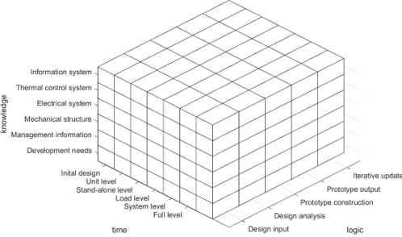
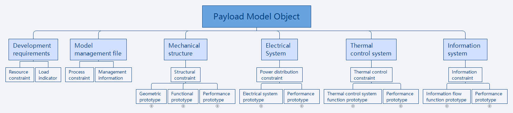
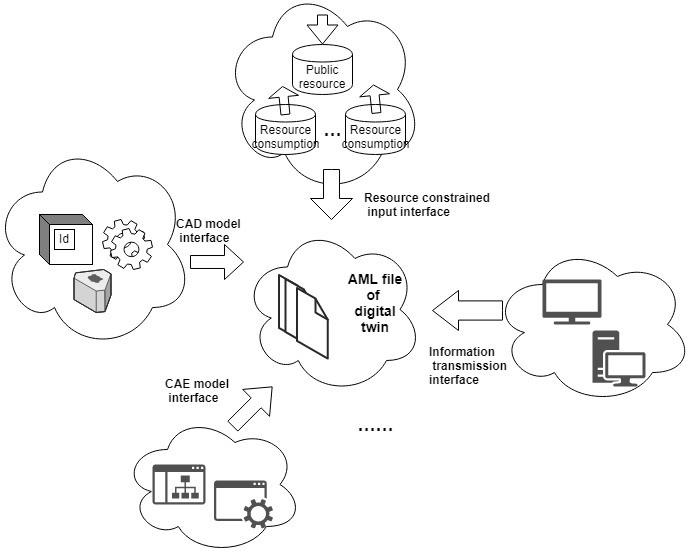
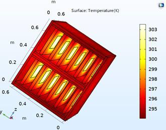
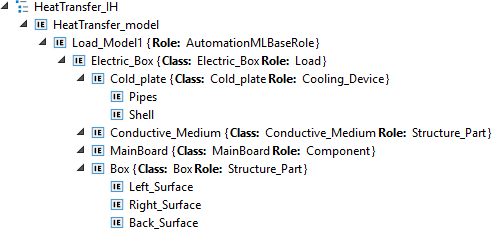
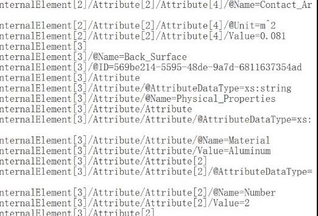
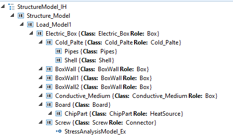

# Обмін даними цифрових двійників на основі AML в обладнанні космічних наукових експериментів

Це переклад статті [Guqi, Peng & Hongen, Zhong. (2020). Data Exchange of Digital Twins Based on AML in Space Science Experiment Equipment. IOP Conference Series: Materials Science and Engineering. 816. 012021. 10.1088/1757-899X/816/1/012021. ](https://www.researchgate.net/publication/341880680_Data_Exchange_of_Digital_Twins_Based_on_AML_in_Space_Science_Experiment_Equipment)

## Анотація

З розвитком систем автоматизованого проєктування (CAD) та виробничих технологій різні галузі переходять до цифровізації, а реалізація цифрової моделі аерокосмічної продукції є важливою складовою концепції «цифрового аерокосмосу».

На основі теорії системної інженерії в цій роботі запропоновано тривимірну концептуальну модель аналізу корисного навантаження протягом життєвого циклу проєктування фізичного пристрою, а також концепцію п’яти-вимірної моделі цифрового двійника на етапі проєктування.

З урахуванням реальних прикладних вимог у статті досліджено зміст і стандарти побудови моделі цифрового двійника корисного навантаження, а також запропоновано використання відображення моделі в AutomationML (AML) для реалізації обміну та інтеграції даних.

## 1. Вступ

З появою кіберфізичних систем, розвитком мережевих технологій, інформаційно-фізичних систем, цифрових та інтелектуальних технологій відбувається цифровізація та інтелектуальна трансформація аерокосмічної продукції. У 2014 році Grieves запропонував концепцію Digital Twin для керування інформацією про продукт на рівні окремого виробу протягом усього його життєвого циклу.

Цифровий двійник постає як віртуальне представлення фізичного продукту — цифрова тінь, що відображає структурні характеристики, обслуговування, експлуатаційні показники та технічний стан фізичної системи. Його ранні застосування [4–7] були зосереджені у військовій та аерокосмічній сферах. NASA та Лабораторії досліджень ВПС США застосовують технологію цифрового двійника для моніторингу технічного стану літальних апаратів [1, 2].

У 2012 році Управління досліджень ВПС США запропонувало концепцію «vital digital twins» з акцентом на ідеї єдиного джерела достовірних даних. Станом на сьогодні в Китаї багато аерокосмічних інститутів проводять дослідження моделей цифрового двійника, зокрема в межах model-based systems engineering (MBSE). Третій департамент запропонував рішення з проєктування аерокосмічної продукції на основі MBSE, а інститут 805 здійснює дослідження застосування MBSE у сфері пілотованої космонавтики. Крім того, Advanced Space Academy запропонувала концепцію цифрового прототипування для ракетоносіїв тощо [3].

Хоча цифрові технології широко застосовуються в розробленні аерокосмічної продукції, у дослідженнях цифрових моделей залишаються певні проблеми:

- (i) Космічна наукова експериментальна стійка (Space Scientific Experimental Rack) охоплює широкий спектр дисциплін (наприклад, оптика, механіка, електрика, тепло тощо), тоді як галузеві стандарти обміну даними ще не є чітко визначеними. Досягнення інтероперабельності між різними галузями є суттєвим викликом для розвитку цифрових двійників.
- (ii) Розроблення Space Scientific Experimental Rack передбачає координацію між кількома науково-дослідними інститутами з використанням відповідного програмного забезпечення керування проєктуванням для міждисциплінарних сфер. Зазначене програмне забезпечення є зрілим, однак проблему сумісності інтерфейсів між різними програмними системами не можна ігнорувати.
- (iii) Існуюче керування даними про продукт зосереджене переважно на керуванні технічним станом. Такий підхід базується на документах розроблення та проєктування замість реалізації повноцінного керування цифровою моделлю.

З огляду на зазначені обставини, ця стаття має на меті представити архітектуру моделі, що надає послуги для різних предметних областей. Ми пропонуємо протокол обміну даними на основі AutomationML для обміну даними між цифровим двійником та іншими системами, а також методологію організації комунікації для такого обміну.

## 2. Теоретичні дослідження побудови моделі цифрового двійника

Модель цифрового двійника відповідає таким базовим характеристикам: віртуальність, унікальність, мультифізичність, багатомасштабність, ієрархічність, інтегрованість, динамічність, надреалістичність, обчислюваність, міждисциплінарність [3]. Для кожної фізичної сутності можна створити її модель цифрового двійника за допомогою інструментів моделювання.

Американський інженер Hall [8] запропонував тривимірну аналітичну модель системної інженерії [9]. У цій роботі ми пропонуємо тривимірну аналітичну концептуальну модель на етапі проєктування, як показано на рис. 1.

Рисунок 1. Тривимірна аналітична концептуальна модель.

На практиці модель цифрового двійника формується на основі часових і знаннєвих зрізів. Життєвий цикл моделі можна поділити на шість етапів. Кожний рівень забезпечує подальшу деталізацію атрибутів моделі на основі попереднього.

Рівень попереднього проєктування переважно спрямований на декомпозицію показників даних, а рівень вузла включає предметно-орієнтовану модель та однодисциплінарну модель. Рівень автономного виробу містить модель симуляції та реалізує частину задач обміну даними. Вищі рівні різних фаз моделювання відповідають різним рівням використання:

- рівень навантаження має задовольняти базові вимоги випробувань;
- системний рівень забезпечує інформаційну взаємодію із зовнішніми системами;
- повний рівень включає знання та дані, накопичені на етапі проєктування, результати випробувань і експлуатаційні дані з реального середовища.

Ці дані можуть використовуватися для прогнозного моделювання майбутньої роботи виробу, а також для підтримки проєктування й симуляції нових моделей. Таким чином, модель цифрового двійника є динамічним цифровим представленням фізичного світу протягом його життєвого циклу.

Відповідно до описаного підходу до моделювання користувач має можливість створювати високорівневу модель фізичного об’єкта. На різних етапах життєвого циклу продукту створюються різні типи моделей, тоді як формування складеного цифрового двійника, що інтегрує численні компоненти з різних галузей, є складним завданням, як показано на рис. 2.

Рисунок 2. Склад об’єкта моделі корисного навантаження

Для відображення експлуатаційного контексту фізичного двійника модель цифрового двійника потребує фізичного прототипу для збирання даних і контекстно-орієнтованої взаємодії. Крім того, такі моделі інколи є взаємоінтероперабельними між собою.

З урахуванням цього в статті запропоновано концепцію п’яти-вимірної моделі цифрового двійника:

MDT = (PE, VE, Ss, DD, CN).

Основні складові цієї моделі можна узагальнити так [11]:

PE (Physical Entity) — фізична сутність. Наприклад, корисне навантаження космічної наукової експериментальної стійки є системною фізичною сутністю, що включає компоненти, набори ресурсів і систему збору інформації, забезпечуючи координацію ресурсів та передавання інформації між підсистемами.

VE (Virtual Entity) — віртуальна сутність,
VE = (Pv, Bv, Rv, Mv), де:

Pv — фізична модель.
Bv — модель поведінкових властивостей, що описує поведінку фізичної моделі в різні моменти часу та на різних масштабах.
Rv — модель, заснована переважно на накопиченні історичних даних, які постійно оновлюються даними про продуктивність, технічне обслуговування та стан системи протягом її життєвого циклу.
Mv — модель керування, що містить управлінську інформацію про віртуальні моделі та організовує зберігання модельних даних на всіх етапах.

Ss (Service Model) — сервісна модель, яка надає послуги як фізичному пристрою, так і віртуальній моделі.

DD (Digital Twin Data Model) — модель даних цифрового двійника, яка є рушійною силою роботи кожного віртуального пристрою та сервісної операції.

CN (Connection Model) — модель з’єднань, ключовий елемент побудови системи цифрового двійника. Вона забезпечує зв’язок між фізичною сутністю та віртуальною моделлю, а також передавання даних між віртуальними моделями.

Отже, дані, пов’язані з фізичною системою, передаються до віртуального середовища для оновлення моделі цифрового двійника. Крім того, необхідно забезпечити механізм комунікації між віртуальними моделями. Для агрегування всіх моделей потрібно реалізувати можливість їх взаємного обміну [9, 10].

## 3. Обмін даними моделі цифрового двійника

Існуючі методи моделювання зазвичай ґрунтуються на використанні інтерфейсів комерційного програмного забезпечення для міждисциплінарних галузей, таких як ANSYS, ADAMS, MATLAB/Simulink. Тому модель цифрового двійника передбачає обмін і передавання даних між кількома інструментами моделювання.

Для задоволення вимог до обміну даними описаної вище моделі цифрового двійника існує кілька способів передавання інформації до інших систем. Порівнявши різні доступні відкриті формати обміну модельними даними (див. табл. 1) [14, 15], у статті запропоновано підхід до обміну даними на основі AML, як показано на рис. 3.

Рисунок 3. Передавання даних у проміжному форматі AML.

AutomationML може використовуватися для зберігання та обміну інженерними даними в різних галузях. Він застосовує CAEX як метамодель для зберігання та обміну інженерними моделями.

За означенням, CAEX підтримує об’єктно-орієнтоване моделювання всіх аспектів і включає чотири основні концепції: role class, interface class, system unit class та instance level [12].

| Ознака                               | AML  | STEP | JT   | XPDL | XML  |
| ------------------------------------ | ---- | ---- | ---- | ---- | ---- |
| Механічні дані                       | +    | +    | +    | -    | -    |
| Електричні дані                      | +    | +    | -    | -    | -    |
| Дані керування процесами             | +    | -    | -    | -    | -    |
| Топологічна інформація               | +    | -    | -    | +    | -    |
| Встановлення концептуальних зв’язків | +    | +    | +    | -    | +    |
| Відстеження залежностей концепцій    | +    | +    | -    | -    | +    |
| Механічні дані                       | +    | +    | -    | -    | +    |

Для організації проміжного формату файлу передавання даних необхідно визначити форму організації даних, типи даних, їх довжину тощо, а також для кожного об’єкта моделі уточнити відповідність відображення між модельними даними [13].

Нижче наведено приклад теплової симуляційної моделі в середовищі COMSOL (як показано на рис. 4), у якому реалізовано подання інформації моделі засобами AML та взаємодію з передаванням даних до моделі механічної структури.

Різні рівні моделі цифрового двійника мають різний вміст обміну даними, а акценти на атрибутах моделі відрізняються. Для цифрової моделі вузла на загальному рівні системи модель у COMSOL містить означення глобальних параметрів, інформацію про компоненти моделі, зокрема геометрію, матеріали, фізичні властивості моделі, а також результати симуляції.

Рисунок 4. Теплова симуляційна модель у COMSOL.

Відповідно до наведеного вище підходу до моделювання було побудовано модель електричного блока. Інформація про екземпляр моделі та елементи даних були відображені у форматі AML, а відповідність подано в таблиці 3.

Різні дані моделі відображаються у чотири категорії AML, де role class, interface class та system unit class є категоріями означення даних у моделі та можуть повторно використовуватися як абстрактна частина моделі. Абстрактні атрибути конкретизуються в instance class для реалізації екземпляра моделі теплопередачі електричного блока.

AML system unit class складається з даних моделі керування, фізичної моделі та структурної моделі. Конкретні модельні дані подаються у вигляді атрибутів класу. Кожний атрибут має власний вміст, формат та інші описові характеристики.

System unit class переважно включає холодну пластину електричного блока, структуру теплопередачі, джерело тепла електричного блока, корпус тощо.

Окрім базових ролей, role class також містить користувацькі класи ролей, такі як компоненти, структурні елементи тощо. Interface class, у свою чергу, включає базові інтерфейсні класи та користувацькі інтерфейсні класи, наприклад три різні інтерфейси теплопередачі.

Імітацію теплового процесу для екземпляра моделі можна реалізувати шляхом застосування різних атрибутів моделі, як показано на рис. 5. Для кращого розуміння та перегляду атрибутів моделі її можна експортувати, фрагменти чого наведено на рис. 6.

Таблиця 2. Відповідність між даними моделі та елементами AML

| Елемент даних           | Приклад                                                   | Відображення в AML                                    |
| ----------------------- | --------------------------------------------------------- | ----------------------------------------------------- |
| Рівень ієрархії, об’єкт | Модуль моделі теплопередачі, система теплопередачі        | InternalElement                                       |
| Властивість             | Структурний атрибут, фізична властивість                  | Attribute                                             |
| Класифікація            | Охолоджувальний пристрій, компоненти, структура           | RoleClass                                             |
| Проста залежність       | Теплопередача                                             | ExternalInterface з ExternalElement для даних зв’язку |
| Спрямована залежність   | Контактна теплопередача                                   | ExternalInterface з InternalElement для даних зв’язку |
| Групи                   | Джерело тепла, холодна пластина, корпус, електричний блок | SystemUnitClass                                       |

Рисунок 5. Передавання даних у проміжному форматі AML.

Рисунок 6. Теплова симуляційна модель у COMSOL.

За допомогою описаного вище методу моделювання було створено модель механічної структури типового електричного блока.

Для механічної структури модель даних робить особливий акцент на відповідній атрибутивній інформації структурної моделі. З метою забезпечення однозначного розуміння вмісту даних подання однакових атрибутів у різних предметних моделях має бути узгодженим.

Модель на основі AML показано на рис. 7.

Рисунок 7. Тривимірна аналітична концептуальна модель.

Можна побачити, що створення моделей на основі AML спрощує обмін даними. Користувач має можливість представляти фізичні компоненти за допомогою високорівневої моделі без необхідності володіння спеціальними знаннями в галузі системної інженерії або мов програмування. Така модель використовується для обміну інформацією, що дозволяє фахівцям із різних галузей і користувачам різних інструментів моделювання ефективно співпрацювати.

## 4. Подальші роботи

У цій статті запропоновано методологію створення моделей із використанням AutomationML та підхід до обміну даними між системами з використанням концепції цифрового двійника.

Завдяки механізму взаємодії таких колаборативних моделей можна ефективно відображати предметну модель у конкретні моделі на основі AML та забезпечувати їх спільне використання з метою підвищення узгодженості та накопичення спільних знань у межах відповідних галузей. Це дозволяє розв’язати проблему сумісності моделей і обміну даними між міжсистемними та багатосистемними середовищами.

Водночас дедалі більше промислових виробників починають підтримувати AML-моделі, які зберігають інженерну інформацію та забезпечують моделювання фізичних і логічних компонентів у різних аспектах.

Завдяки створенню цифрового профілю продукту стає можливим відстежувати показники роботи та історію обслуговування кожного фізичного двійника з часом, а також здійснювати безперервні дослідження та розроблення навіть після продажу фізичного виробу.

Зокрема, такі моделі можуть застосовуватися на етапі попереднього інжинірингу, випробувань, технічного обслуговування систем і в розумному виробництві.

## 5. Висновки

У цій роботі представлено основні виклики сучасної технології цифрових двійників і підхід до обміну даними між різними галузями з використанням високорівневих моделей.

На основі теоретичного дослідження створення моделі цифрового двійника на загальному рівні запропоновано тривимірну модель цифрового двійника на етапі проєктування. Структуру моделі корисного навантаження сформовано відповідно до специфіки відповідної галузі, а також пояснено зміст модельних даних цифрового двійника корисного навантаження в межах п’яти-вимірної структури моделі.

Для підтвердження запропонованого підходу як приклад розглянуто теплове моделювання. На основі цієї моделі використано AutomationML для організації обміну даними між системами.

Застосування моделей дозволяє користувачеві ефективніше створювати цифровий двійник фізичних об’єктів. У подальших дослідженнях планується використовувати модель обміну цифрового двійника для інших цілей.

## 6. References

1. Glaessgen E., Stargel D. The digital twin paradigm for future NASA and U.S. air force vehicles // Proceedings of the 53rd AIAA/ASME/ASCE/AHS/ASC Structures, Structural Dynamics and Materials Conference. Reston, VA, USA: AIAA, 2012. P. 7274–7260.

2. Tuegel E. J., Ingraffea A. R., Eason T. G., et al. Reengineering aircraft structural life prediction using a digital twin // International Journal of Aerospace Engineering. 2011. Vol. 2011. P. 1–14.

3. Zhuang Cunbo, et al. Connotation, architecture and trends of product digital twin // Computer Integrated Manufacturing Systems. 2017. Vol. 23(4). P. 753–768.

4. Tao Fei, Zhang Meng, Cheng Feng, et al. Digital twin workshop: a new paradigm for future workshop // Computer Integrated Manufacturing Systems. 2017. Vol. 23(1). P. 1–9.

5. Tao F., Zhang M., Nee A. Digital Twin Driven Smart Manufacturing. Amsterdam, The Netherlands: Elsevier, 2019.

6. Tao F., Cheng J., Qi Q., et al. Digital twin-driven product design, manufacturing and service with big data // The International Journal of Advanced Manufacturing Technology. 2018. Vol. 94(9–12). P. 3563–3576.

7. Tao F., Zhang M. Digital twin shop-floor: a new shop-floor paradigm towards smart manufacturing // IEEE Access. 2017. Vol. 5. P. 20418–20427.

8. Hall A. D. A Methodology for Systems Engineering. Van Nostrand, 1962.

9. Wang Xiaojun, Chen Haidong. Launch Vehicle Digital Prototype Engineering. China Astronautic Publishing House, 2017.