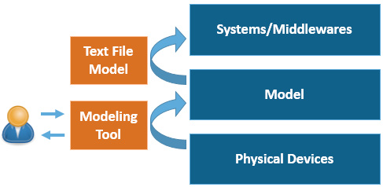
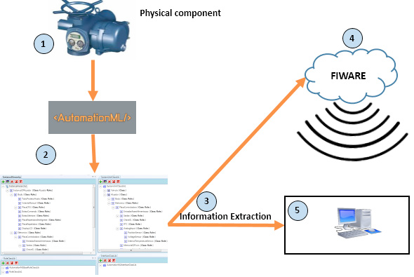
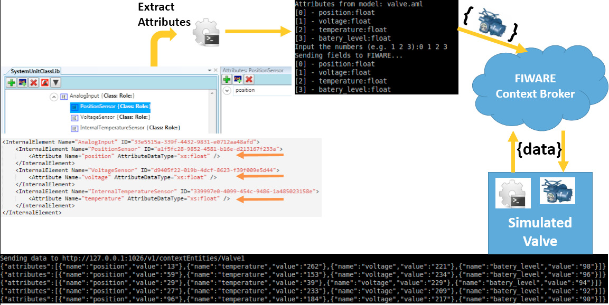

# Моделювання даних цифрового двійника за допомогою AutomationML та методологія обміну даними для передачі інформації

Це переклад статті [Schroeder, Greyce & Steinmetz, Charles & Pereira, Carlos & Espíndola, Danúbia. (2016). Digital Twin Data Modeling with AutomationML and a Communication Methodology for Data Exchange. IFAC-PapersOnLine. 49. 10.1016/j.ifacol.2016.11.115. ](https://www.researchgate.net/publication/311700863_Digital_Twin_Data_Modeling_with_AutomationML_and_a_Communication_Methodology_for_Data_Exchange)

## Анотація:

У контексті кіберфізичних систем, спрямованих на реалізацію системи цифрового двійника для майбутніх виробничих систем і систем сервісного обслуговування продукції, ми пропонуємо використовувати AutomationML для моделювання атрибутів, пов’язаних із цифровим двійником. Також ми показуємо, що така модель є надзвичайно корисною для обміну даними між різними системами, які інтегровані з цифровим двійником. У роботі представлено приклад практичного застосування, у якому промисловий компонент було змодельовано та промоделювано (імітаційно досліджено) для підтвердження працездатності запропонованої методології.

## 1. ВСТУП

Деякі з ключових аспектів, пов’язаних із концепцією Industry 4.0 (Group et al., 2013), включають: масову кастомізацію; гнучке виробництво; відстеження та самоусвідомлення деталей і виробів, а також їхню комунікацію з машинами й іншими виробами; та інші характеристики. Отже, в контексті Industry 4.0 польові пристрої, машини, виробничі установки та окремі вироби будуть підключені до мережі.

Кіберфізичні системи (CPS) запропоновані як ключова концепція архітектур Industry 4.0. CPS можна описати як сукупність фізичних пристроїв, об’єктів та обладнання, що взаємодіють із віртуальним кіберпростором через комунікаційну мережу. Кожен фізичний пристрій матиме свою кіберчастину — цифрове представлення реального пристрою, що зрештою формує «Digital Twin» (цифровий двійник). Таким чином, цифровий двійник може здійснювати моніторинг і керування фізичною сутністю, тоді як фізична сутність передає дані для оновлення своєї віртуальної моделі (Lee, 2008; Baheti and Gill, 2011).

Цифровий двійник є віртуальним представленням реального виробу. Він містить інформацію про виріб від початку його життєвого циклу і до моменту утилізації. Цифровий двійник можна розглядати як кіберпредставлення в межах кіберфізичних систем. Модель цифрового двійника може складатися з різних типів моделей і даних.

Проблема полягає в тому, як створити модель, що агрегує всі ці підмоделі. Така модель має забезпечувати доступ різних систем до даних цифрового двійника.

Метою цієї роботи є представлення моделі, яка надає сервіси для різних застосувань. Ми прагнемо представити можливість використання AutomationML для моделювання цифрового двійника на високому рівні. У цій роботі ставиться за мету продемонструвати модель, побудовану за допомогою AutomationML, для обміну даними між цифровим двійником та іншими системами, а також методологію комунікації для такого обміну даними.

Стаття структурована таким чином: у наступному розділі подано теоретичне підґрунтя та огляд пов’язаних робіт. У розділі 3 представлено моделювання цифрового двійника з використанням AutomationML. У розділі 4 пояснюється методологія комунікації після створення моделі. У розділі 5 описано приклад практичного застосування (case study). Нарешті, у розділі 6 наведено обговорення результатів і висновки цієї роботи.

## 2. ПОВ’ЯЗАНІ ДОСЛІДЖЕННЯ

У цьому розділі буде розглянуто усталені концепції зберігання та обміну даними.

По-перше, відомим підходом до моделювання та зберігання даних є об’єктно-орієнтоване проєктування (Papakonstantinou et al., 1995). Проте обмін даними в цьому випадку здійснюється через окремі з’єднання «точка-точка». Іншою концепцією обміну даними є використання онтологій як спільної семантичної основи для моделювання даних. Роботи, пов’язані з онтологіями, представлені, зокрема, у: Young et al. (2007) та Patil et al. (2005).

Другою концепцією моделювання є XML (Extensible Markup Language). Це мова розмітки, яка визначає набір правил для кодування документів у форматі, що є як людиночитабельним, так і машинно-читабельним. XML здатна описувати різні типи даних і використовується в широкому спектрі інструментів та моделей даних (Mani et al., 2001). Наприклад, у Choi et al. (2010) визначено стандартний формат даних для інформації PPR (product, process and resource — продукт, процес і ресурс) із використанням XML, а також розроблено інтегратор PLM (product lifecycle management — управління життєвим циклом продукції), який підтримує обмін інформацією PPPR між комерційними гетерогенними системами PLM та іншими системами.

Іншим методом є стандарт обміну даними моделей продукції — STEP (Standard for the Exchange of Product Model Data) (Pratt, 2001). Він регулюється ISO 10303 і є сімейством стандартів, що визначають надійну та перевірену методологію опису даних про продукцію протягом усього її життєвого циклу (продуктові дані). STEP широко використовується в комп’ютерно-орієнтованому проєктуванні (CAD) та системах даних про продукцію/управління життєвим циклом (PDM/PLM) (Sudarsan et al., 2005; Whyte et al., 2000). Проте STEP здебільшого опрацьовує дані про продукцію, але не охоплює дані, необхідні для інженерії моніторингу та керування виробництвом [REFERENCE].

Ще одним методом є CAEX (Computer Aided Engineering eXchange) (PAS, 2006). Це абстрактний об’єктно-орієнтований формат даних на основі XML, який описує реальні або логічні об’єкти виробничої установки у вигляді інформаційних об’єктів. Ця концепція корисна не лише для обміну інформацією від рівня польових пристроїв до рівня підприємства, але й для обміну інформацією між різними прикладними системами вищого рівня, наприклад, для систем моніторингу та керування виробництвом, аналізу та інших виробничо-орієнтованих застосувань (Schleipen et al., 2008).

AutomationML визначає CAEX як метамодель для зберігання та обміну інженерними моделями. Його застосовували для моделювання промислових установок і як формат обміну даними в інженерному ланцюгу виробничих систем (Schleipen and Drath, 2009; Lüder et al., 2010). У цій роботі ми пропонуємо використовувати такий тип моделі як джерело даних.

## 3. ЦИФРОВИЙ ДВІЙНИК

Термін «Digital Twin» (цифровий двійник) уперше був представлений широкій аудиторії у роботах Shafto et al. (2010) та Shafto et al. (2012). У цих роботах зазначено:

«Цифровий двійник — це інтегрована багатофізична, багатомасштабна симуляція транспортного засобу або системи, яка використовує найкращі доступні фізичні моделі, оновлення з датчиків, історію експлуатації тощо для відображення життєвого циклу відповідного фізичного об’єкта».

З розвитком кіберфізичних систем цифровий двійник розглядається як віртуальне представлення фізичного продукту — своєрідна цифрова «тінь», що містить усю інформацію та знання про нього. Він пов’язаний із фізичною частиною таким чином, що забезпечується передавання даних від фізичного об’єкта до кіберчастини. Оскільки CPS можна описати як сукупність фізичних пристроїв, об’єктів і обладнання, які взаємодіють із віртуальним кіберпростором через комунікаційну мережу, кібермодель кожної фізичної сутності може розглядатися як її цифрове представлення — «Digital Twin» (Lee, 2008; Baheti and Gill, 2011).

Grieves (2014) визначає цифровий двійник як розподілений і децентралізований підхід до управління інформацією про продукт на рівні окремого виробу протягом його життєвого циклу. Таким чином, цифровий двійник безпосередньо пов’язаний із концепцією систем управління життєвим циклом продукції (PLM) (Kiritsis, 2011). PLM об’єднує різноманітні бізнес-процеси, які створюють, модифікують і використовують дані для підтримки всіх фаз життєвого циклу продукту: від «begin-of-life» (проєктування, виробництво) через «middle-of-life» (експлуатація, обслуговування) до «end-of-life» (переробка, утилізація).

Цифровий двійник включає як статичну, так і динамічну інформацію. Статична інформація може охоплювати геометричні розміри, специфікацію матеріалів (BOM), процеси тощо. Динамічна інформація змінюється з часом протягом життєвого циклу продукту.

Цифровий двійник може мати інтелектуальні властивості. Наприклад, інтелектуальний продукт здатен отримувати інформацію про себе та брати участь у прийнятті рішень щодо власного майбутнього (Meyer et al., 2009). У Hrbínek et al. (2013) наведено кілька характеристик інтелектуального продукту. Узагальнено інтелектуальний продукт:

- (i) має глобальну унікальну ідентифікацію;
- (ii) здатен до комунікації з навколишнім середовищем;
- (iii) може отримувати та зберігати дані про себе;
- (iv) може брати участь у прийнятті рішень щодо власної долі.

Наявність усіх цих характеристик не є обов’язковою для цифрового двійника, оскільки вони більшою мірою стосуються інтелектуального продукту. Однак частина з них є релевантною для управління цифровим двійником. З урахуванням цього основні аспекти створення цифрового двійника можна узагальнити таким чином (Ríos et al., 2015):

- Ідентифікація: продукт повинен мати глобальний ідентифікатор, який пов’язує кожен фізичний виріб із його цифровим представленням. Для цього можуть використовуватися такі технології, як RFID-мітки та Electronic Product Code (EPC) (Brock, 2001), що забезпечують унікальну ідентифікацію кожного фізичного об’єкта у світі протягом усього його життєвого циклу.
- Управління даними: дані та інформація про продукт створюються і розвиваються на трьох етапах життєвого циклу: BOL (begin-of-life), MOL (middle-of-life) та EOL (end-of-life). Обсяг даних зростає на кожному етапі, що породжує проблему управління великими даними (Big Data) та аналітики для збереження лише значущої інформації.
- Моделі цифрового двійника: на різних фазах життєвого циклу створюються різні типи моделей продукту. Серед них — системні моделі, функціональні моделі, тривимірні геометричні моделі, багатофізичні моделі, виробничі моделі та моделі використання. Такі моделі іноді є взаємопов’язаними, що створює складну проблему їхньої інтероперабельності.
- Інформація цифрового двійника: протягом усього життєвого циклу реального продукту генеруються значні обсяги даних (Big Data). Наприклад, інформація про технічне обслуговування та експлуатацію є важливою для застосування методів прогнозування поведінки продукту в майбутніх сценаріях.
- Людино-машинний інтерфейс (HCI): через значний обсяг інформації, що зберігається у різних репозиторіях даних, виникає проблема отримання та відображення необхідної інформації для відповідного користувача у зрозумілому вигляді. Цифровий двійник повинен надавати інформацію різним категоріям користувачів і зацікавлених сторін протягом свого життєвого циклу. Важливим є також спосіб відображення цієї інформації, що пов’язано з розробленням людино-машинних інтерфейсів (HCI) для цифрового двійника.
- Комунікація: необхідно забезпечити спосіб комунікації між місцем зберігання даних і людино-машинним інтерфейсом (HCI). Цифровий двійник може зберігати інформацію в різних базах даних. Однак із розвитком нових технологій Інтернету речей (IoT) виникає потреба у механізмах отримання інформації з цих баз даних у будь-який час і в будь-якому місці.

### 3.1 Моделювання даних цифрового двійника з використанням AutomationML 

У цій роботі основна увага зосереджена на моделях цифрового двійника, описаних вище. Отже, метою статті є представлення високорівневої моделі для обміну даними між гетерогенними системами, оскільки цифровий двійник акумулює дані та інформацію протягом усього життєвого циклу продукту.

Для цього було обрано AutomationML, оскільки він зберігає інженерну інформацію відповідно до об’єктно-орієнтованої парадигми та дозволяє моделювати фізичні й логічні компоненти виробничої установки як інформаційні об’єкти, що інкапсулюють різні аспекти. Об’єкт може складатися з підоб’єктів і сам бути частиною більшої композиції або агрегації.

AutomationML визначає CAEX як метамодель для зберігання та обміну інженерними моделями. Нижче узагальнено його складові та спосіб використання для створення моделей:

- Створення ієрархії компонентів, що називається InstanceHierarchy (IH), від верхнього рівня до окремих компонентів (InternalElements, IE), з інтерфейсами (ExternalInterfaces, EI) та зв’язками (InternalLinks, IL).
- Повторно використовувані SystemUnitClasses (SUC), що визначають типи компонентів.
- Повторно використовувані визначення ролей для абстрактного опису компонентів (RoleClasses, RC).
- Повторно використовувані InterfaceClasses (IC) для визначення точок з’єднання SUC та типів інтерфейсів EI.
- Атрибути для опису характеристик кожного з раніше введених елементів моделювання.

Завдяки такому підходу CAEX підтримує об’єктно-орієнтоване моделювання для всіх зазначених аспектів. ExternalInterfaces, що описують екземпляри SystemUnitClasses, з’єднуються за допомогою InternalLinks через ExternalInterfaces, які, у свою чергу, є екземплярами InterfaceClasses.

## 4. МЕТОДОЛОГІЯ

Ця робота має на меті запропонувати методологію, що дозволяє будувати системи з використанням моделей AML для обміну інформацією. Основна ідея полягає у використанні цієї моделі для представлення фізичних компонентів на високому рівні абстракції. Модель використовується для зберігання та обміну інженерною інформацією з іншими системами без необхідності глибоких технічних знань про конкретну систему. Таким чином, користувачі можуть представляти фізичні компоненти за допомогою високорівневої моделі, яка застосовується для обміну інформацією.

На рисунку 1 показано запропоновану методологію та кроки, необхідні для успішного використання моделей у комунікації між системами.

Рис. 1. Етапи методології

(1) Перший етап полягає у створенні моделі фізичного пристрою за допомогою інструмента моделювання. Такими пристроями можуть бути датчики, виконавчі механізми або інші пристрої, що генерують дані для спільного використання. Моделі широко застосовуються в науці та інженерії для представлення систем із певним рівнем деталізації (Gomaa, 2011) і для проєктування та розроблення систем (Völter et al., 2013). Користувач має можливість створити високорівневу модель фізичного об’єкта, не будучи експертом у мовах програмування систем; достатньо розуміти принципи роботи змодельованого пристрою.

(2) Другий етап передбачає використання створеної моделі іншими системами для отримання інформації про об’єкт. Це дозволяє обмінюватися інформацією між моделями на основі їхніх атрибутів. У такому випадку моделі повинні бути доступні у відкритому форматі, наприклад у вигляді текстового файлу. Існує кілька способів надання інформації іншим системам, зокрема через створення проміжного програмного забезпечення (middleware), що дозволяє розробникам зосередитися на функціональних задачах системи та зробити комунікацію більш абстрактною (Razzaguer et al., 2016).

(3) Третій етап включає системи-споживачі інформації, наприклад системи моніторингу, застосування доповненої реальності або інші компоненти-постачальники інформації. Одна з запропонованих ідей полягає у створенні універсального механізму комунікації між системами на основі моделей.

Запропонована методологія орієнтована на різні сфери застосування, зокрема машинне та промислове обладнання, системи «розумного дому» (автоматизація будівель) або навіть медичні системи. Наприклад, можна змоделювати обладнання лікарні з його основними атрибутами, а цю модель використовувати в системах моніторингу.

## 5. ПРИКЛАД ПРАКТИЧНОГО ЗАСТОСУВАННЯ (CASE STUDY)

Для перевірки запропонованої методології та використання моделей на основі AutomationML було проведено приклад практичного застосування, що включав:

- (i) фізичний компонент із можливими атрибутами для відображення;
- (ii) інструмент моделювання;
- (iii) інструмент, який забезпечує надання даних зовнішнім системам (middleware);
- (iv) зовнішню систему, що виступає споживачем інформації.

### 5.1 Фізичний компонент

У прикладі використано промисловий клапан, який має реальні характеристики, притаманні промисловим застосуванням. Клапан відкривається та закривається, забезпечуючи проходження середовища. Він оснащений виконавчим механізмом, що забезпечує його роботу.

Актюатор є критично важливим для належного функціонування клапана. Він має власні датчики стану, такі як датчик температури, датчик рівня заряду батареї, датчик напруги тощо.

### 5.2 Інструмент моделювання

Як інструмент моделювання було обрано AutomationML, оскільки він надає механізми для відображення компонентів системи автоматизації. На цьому етапі необхідно змоделювати фізичний компонент із відповідними атрибутами, що підлягають обміну.

У цьому прикладі було вирішено передавати дані з датчиків клапана, щоб інші системи могли отримувати до них доступ. Наприклад, якщо оператор бажає контролювати стан клапана зі смартфона, створюється модель цифрового двійника клапана та мобільний застосунок.

У моделі визначаються атрибути, які повинні бути доступними для обміну між системами. На рисунку 3 показано обрані атрибути.

### 5.3 Проміжне програмне забезпечення (Middleware)

Для надання даних зовнішнім системам було використано IoT middleware, оскільки воно зазвичай забезпечує абстракцію складності комунікації між системами, дозволяючи розробникам зосередитися на вирішенні прикладних задач (Razzaguer et al., 2016).

Було обрано FIWARE (Glikson, 2011), оскільки цей інструмент є простим у використанні та підтримує інтеграцію компонентів через механізм Generic Enablers (GE) (Di Cola et al., 2015).

### 5.4 Зовнішні системи

Зовнішня система, що споживає надані дані, була розроблена для роботи на комп’ютері. Система надсилала REST GET-запити та отримувала відповідь у форматі JSON. Отримані дані оброблялися та відображалися користувачеві на екрані.

Для тестування було створено алгоритм, що імітує поведінку клапана. Цей алгоритм також було реалізовано у middleware. Після цього через Інтернет здійснювався обмін даними між системами з використанням XML-файлу, створеного за допомогою AML.

На рисунку 2 показано кроки реалізації прикладу.

Спочатку (1) було представлено фізичний компонент — клапан. Як зазначено вище, він містить атрибути, що відображаються та додаються до моделі.

На другому етапі (2), який відповідає моделюванню, було використано AutomationML, оскільки він задовольняє вимоги моделювання клапана. До моделі додано такі атрибути:

- – положення;
- – напруга;
- – температура;
- – рівень заряду батареї.

На рисунку 3 показано модель в AutomationML, з якої потім витягуються атрибути.

Далі, використовуючи FIWARE як middleware, здійснюється обмін даними між різними системами. У цьому випадку система використовується для симуляції клапана з метою отримання доступних значень атрибутів.

Після завершення моделювання компонента було створено скрипт для отримання інформації, що міститься в моделі, та ідентифікації її атрибутів. Це дозволило перевірити використання моделей для обміну даними в межах даної симуляції.

рис.2.

рис.3.

### 6. ВИСНОВКИ ТА ПОДАЛЬША РОБОТА

У цій роботі, в контексті кіберфізичних систем та Industry 4.0, було представлено концепцію цифрового двійника як засобу обміну даними між системами з використанням високорівневих моделей. Цифровий двійник є цифровим відповідником фізичного пристрою, машини або продукту в CPS. Він містить інформацію, пов’язану з повним життєвим циклом продукту.

Основний акцент роботи зроблено на демонстрації способу обміну даними між системами, які використовують цифровий двійник. Для цього було створено методологію побудови моделей із застосуванням AutomationML. Далі атрибути, необхідні для обміну даними, передаються до middleware, що надає іншим системам доступ до цих атрибутів і забезпечує можливість обміну даними.

Для валідації запропонованого підходу було реалізовано приклад практичного застосування, у якому змодельовано клапан. З моделі було витягнуто атрибути та передано їх зовнішнім системам. У результаті зроблено висновок, що моделі AutomationML можуть використовуватися для обміну даними між системами.

Використання моделей дозволяє користувачу, навіть без знань програмування, змоделювати цифровий двійник обладнання, з яким він працює, і створити моделі для обміну даними між системами.

У подальших дослідженнях планується застосування моделі AutomationML для інших цілей, зокрема для обміну даними в людино-машинних інтерфейсах цифрового двійника.

### ПОДЯКИ

Проєкт було фінансово підтримано CAPES та FINEP (бразильські наукові агентства).