# Незалежне від постачальника моделювання та обмін топологіями промислових мереж за допомогою AutomationML

Це переклад статті [Drath, Rainer & Rentschler, Markus & Hoch, Marco & Mueller, Matthias. (2018). Vendor-Independent modeling and exchange of Fieldbus Topologies with AutomationML. 10.1109/ETFA.2018.8502630. ](https://www.researchgate.net/publication/329673175_Vendor-Independent_modeling_and_exchange_of_Fieldbus_Topologies_with_AutomationML)

Анотація — Для спрощення інженерії польових пристроїв майже кожна організація, що розвиває промислові мережі, розробила власну мову опису пристроїв (Device Description Language, DDL) — формальну мову для опису сервісів і параметрів конфігурування польових пристроїв. DDL зазвичай орієнтовані на потреби відповідного інженерного інструментального середовища конкретної промислової мережі та є непридатними для використання в інструментальних середовищах інших постачальників або в засобах для інших фаз життєвого циклу. У цій статті описано узагальнений підхід до подолання зазначених обмежень за допомогою AutomationML і наведено приклад для майстрів та пристроїв IO-Link, а також для пристроїв CC-Link IE Field. Запропонований метод є універсальним і може повторно використовуватися для інших DDL.

## I. ВСТУП

Сучасні польові пристрої для процесної та фабричної автоматизації мають широкий набір ідентифікаційних і конфігураційних параметрів та можуть налаштовуватися відповідно до конкретного застосування. Для цього вони зазвичай оснащені цифровим інтерфейсом зв’язку, таким як IO-Link, HART, PROFIBUS, Fieldbus Foundation, Ethernet/IP, PROFINET, CC-Link, CC-Link IE Field тощо.

Кожен із цих стандартів промислових мереж сформував власну екосистему спеціалізованих програмних засобів для керування та конфігурування пристроїв, зазвичай на основі підходу мови опису пристроїв (Device Description Language, DDL). У межах цього підходу універсальне програмне забезпечення може конфігурувати та керувати різними пристроями шляхом інтерпретації файлу опису пристрою (Device Description, DD), пов’язаного з конкретним типом пристрою. Економічна перевага полягає в тому, що створення DD за допомогою DDL потребує значно менших зусиль, ніж розроблення спеціалізованого програмного засобу.

Новіші формати на основі XML, такі як GSDML, FDCML, ESI, CSP+ та IODD, мають переваги порівняно з традиційними текстовими форматами GSD, EDDL та EDS, оскільки можуть використовувати схеми моделей даних (XSD) і відповідні можливості XML-парсерів для перевірки узгодженості як синтаксису, так і семантики.

Коли виникає потреба у використанні польового пристрою, файл DD завантажується та інтерпретується інженерним інструментом, який надає користувацькі діалоги та функціональність для введення параметрів з метою конфігурування конкретного екземпляра пристрою.

Усі пристрої одного типу мають один і той самий файл DD, однак параметри окремих екземплярів пристроїв можуть мати різні значення залежно від конкретного застосування. Це ілюструє загальні обмеження DDL:

- У багатьох випадках існує жорстке розділення між інформацією про тип і інформацією про конкретний екземпляр пристрою: типова інформація зберігається в нейтральному файлі DD, тоді як індивідуальні параметри зберігаються у пропрієтарному інженерному інструменті. Не існує незалежного від інструмента способу зберігання конфігурації окремого пристрою протягом його життєвого циклу.
- Коли декілька польових пристроїв з’єднуються в комунікаційну мережу, конфігурація топології зберігається в пропрієтарному інженерному інструменті. Відсутні незалежні від інструмента засоби архівування, розповсюдження, повторного використання або подальшого повторного використання конфігурацій топології.

У цій статті запропоновано метод подолання обох зазначених проблем шляхом використання AutomationML і наведено приклади для компонентів IO-Link в автоматизованій системі (див. пристрої типів Master і Device на рис. 1), а також для CC-Link IE Field. У розділі II розглянуто пов’язані роботи та наявні стандарти промислових мереж, у розділі III сформульовано вимоги до моделювання топологій промислових мереж, у розділі IV наведено приклад топологій IO-Link, тоді як у розділі V — приклад топології CC-Link IE Field з компонентами IO-Link. Нарешті, у розділі VI обговорюються потенційні сценарії застосування, а розділ VII підсумовує результати та окреслює подальші напрями дослідження.

Рис. 1. Базова структура автоматизованої системи з промисловою мережею та IO-Link [1]

## II. ПОВ’ЯЗАНІ РОБОТИ

### A. Технології промислових мереж

Огляд проблем інтеграції для технологій промислових мереж наведено в [2–3], додатково в [3] розглянуто питання горизонтальної, вертикальної та життєциклової інтеграції.

Щодо горизонтальної інтеграції, стандарт IEC 61158 перелічує 79 наявних комунікаційних технологій і описує підхід до приведення всіх технологій промислових мереж до уніфікованої основи, тоді як IEC 62390 спрямований на уніфікацію профілів пристроїв. Програмування контролерів пристроїв стандартизовано в IEC 61131.

Загальна інтеграція охоплюється стандартом ISO 15745, який надає розвинену модель даних для описів пристроїв (див. рис. 2). Ранньою спробою застосування ISO 15745 для створення системно-нейтральної DDL була мова Field Device Configuration Markup Language (FDCML) [4], яка, однак, не набула широкого поширення.

Рис. 2. Онтологія ISO 15745-1

### B. Існуючі стандарти DDL

У цьому розділі коротко представлено деякі наявні стандарти DDL, див. також [2–3]. Основною слабкістю цих стандартів промислових мереж є їхня несумісність між собою та недостатня придатність для горизонтальної й життєциклової інтеграції.

1) EDDL

Організація Profibus Nutzerorganisation (PNO), Fieldbus Foundation, HART Communication Foundation, OPC Foundation та FDT Group створили спільну групу EDDL Cooperation Team (ECT) і об’єднали свої окремі діалекти DDL. Результатом стала мова Electronic Device Description Language (EDDL), яка не використовує XML і була опублікована як стандарт IEC 61804. Вона переважно застосовується в галузі процесної автоматизації.

2) EDS

Організація ODVA підтримує стандарт промислової мережі Ethernet/IP, у якому Electronic Data Sheets (EDS) описують, як пристрій може використовуватися в мережі EtherNet/IP. EDS описує об’єкти, атрибути та сервіси, доступні в пристрої, без використання XML. Файли містять ASCII-подання параметричних об’єктів пристрою та додаткову інформацію, необхідну для адресації об’єктів. В межах ODVA ведуться обговорення щодо створення в майбутньому XML-орієнтованого формату EDS [5].

3) ESI

Для промислової мережі EtherCAT кожен пристрій EtherCAT повинен постачатися з файлом EtherCAT Slave Information (ESI) — документом опису пристрою у форматі XML [6]. Структура файлу ESI визначається XML-схемою EtherCATInfo.xsd (див. рис. 3). EtherCAT також входить до ISO 15745-4.

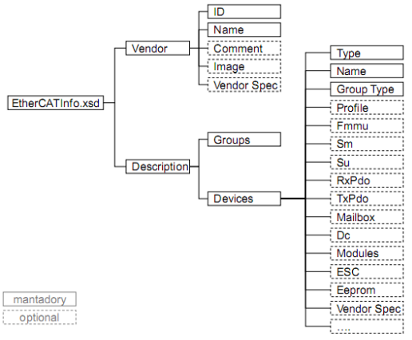

Рис. 3. Структура EtherCATInfo.xsd

Інформація про функціональність пристрою та його налаштування надається файлом ESI, тоді як файл EtherCAT Network Information (ENI) описує топологію мережі, команди ініціалізації для кожного пристрою та команди, які повинні передаватися циклічно [7]. Файл ENI передається майстру, який надсилає команди відповідно до цього файлу.

4) GSDML

Характеристики пристрою PROFINET IO описуються виробником у файлі General Station Description (GSD), який забезпечує інженерне та наглядове програмне забезпечення основою для конфігурування та моніторингу пристроїв системи PROFINET IO. Мова, що використовується для цього, — GSDML (GSD Markup Language), тобто мова на основі XML, яка структурно відповідає ISO 15745-1.

5) POWERLINK XDD

Формат Ethernet Powerlink XML Device Description [8] відповідає ISO 15745-1 і визначає такі типи файлів:

• Файл визначення профілю (XPD) — XML-подання фреймворку POWERLINK, профілю пристрою або прикладного профілю.

• Файл опису пристрою (XDD) моделює тип пристрою POWERLINK і використовується як шаблон для створення екземплярів пристроїв у реальній конфігурації мережі. Файл XDD містить значення за замовчуванням, але не містить значень введення в експлуатацію та фактичних значень.

• Файл конфігурації пристрою (XDC) описує сконфігурований пристрій POWERLINK і зберігає інформацію для конкретного екземпляра пристрою в конкретному мережевому середовищі. У файлі XDC можуть зберігатися всі дані з XDD, а також фактичні значення та/або значення введення в експлуатацію.

6) CSP+

Асоціація CC-Link Partner Association (CLPA) підтримує стандарти сімейства мереж CC-Link, у яких профіль Control & Communication Profile (CSP+) описує, як пристрій може використовуватися в мережі сімейства CC-Link [16][17][18]. Файли CSP+ записуються у форматі XML.

У моделі CSP+ модулі поділяються на віртуальні польові пристрої, що представляють інформацію, пов’язану з комунікаційною функціональністю, і віртуальні керуючі пристрої, що представляють специфічну для модуля інформацію та функціональність.

Файл CSP+ складається з чотирьох розділів:
розділ FILE — описує службову інформацію самого файлу CSP+;
розділ DEVICE — містить інформацію про модуль, зокрема назву, ідентифікацію та специфікації;
розділ BLOCK — описує віртуальні керуючі пристрої;
розділ COMM_IF — описує віртуальні польові пристрої.

Для кожної функції модуля у файлі CSP+ існує розділ BLOCK, а для кожного підтримуваного комунікаційного протоколу — розділ COMM_IF.

Таким чином, різні комунікаційні протоколи, наприклад CC-Link і CC-Link IE Field, можуть бути інтегровані в межах одного формату.

7) IODD

IO-Link був розроблений консорціумом IO-Link і вперше опублікований у 2006 році [1]. У 2010 році його було інтегровано до IEC 61131-9 під назвою «Single-drop digital communication interface for small sensors and actuators» (SDCI). IO-Link не є промисловою мережею, а являє собою послідовний протокол зв’язку типу «точка-точка», не заснований на TCP/IP, призначений для обміну даними з аналоговими та дискретними датчиками й виконавчими механізмами на останніх метрах польового рівня (див. рис. 4).

Рис. 4. Топологія датчиків Ethernet/IO-Link

Кожен пристрій IO-Link повинен постачатися з файлом опису пристрою IO-Link (IODD) — документом опису пристрою у форматі XML. Формат IODD відповідає ISO 15745-1.

Окремий формат DD для майстрів IO-Link консорціумом IO-Link не визначено; зазвичай вони описуються в межах DD відповідної промислової мережі, що часто виявляється слабким місцем екосистеми IO-Link з точки зору горизонтальної та життєциклової інтеграції.

### C. AutomationML

AutomationML — це нейтральний формат даних на основі XML. Він був ініційований компанією Daimler у 2006 році, його архітектура визначена в IEC 62714-1 [9]. Його компактна та розподілена архітектура поєднує наявні усталені формати файлів для різних доменів [10].

Завдяки CAEX (IEC 62424, [11]) він дозволяє зберігати об’єктні моделі відповідно до об’єктно-орієнтованої парадигми, включаючи бібліотеки класів, інтерфейси, атрибути, зв’язки та екземпляри, змодельовані в ієрархіях екземплярів. Крім того, AutomationML має можливість посилатися на зовнішні формати. AutomationML охоплює моделювання геометрії через формат COLLADA і дискретної логіки через PLCopen XML.

### D. Моделювання комунікацій в AutomationML

Робоча група спільноти AutomationML розробила загальну та технологічно незалежну пропозицію щодо моделювання комунікаційних мереж за допомогою AutomationML [12]. Приклад застосування для Ethernet/IP наведено в [13].

Ключовими елементами цього підходу є суворе розділення фізичної мережі, що моделює фізичне з’єднання інфраструктури, і логічної мережі, що моделює логічні взаємозв’язки в комунікаційній мережі. Відповідно, комунікаційний white paper AutomationML містить набір рольових класів для фізичних і логічних елементів мережі та набір технологічно незалежних інтерфейсних класів. Також у ньому описано, як застосовувати ці ролі та інтерфейси для моделювання комунікаційних мереж, специфічних для певної технології. Однак інтеграція DDL у цьому документі не розглядається.

## III. ВИМОГИ ДО МОДЕЛЮВАННЯ ТОПОЛОГІЙ ПРОМИСЛОВИХ МЕРЕЖ

### A. Загальна концепція

Ключове питання полягає в тому, як моделювати конфігурації та топології на основі обмежених класичних DD. Найочевидніший підхід — розширити класичні стандарти DD, але це потребує тривалих циклів стандартизації та зменшило б прийняття в промисловості.

Запропонований у цій статті підхід спрямований на збереження наявних стандартів і забезпечення негайної практичної застосовності шляхом використання AutomationML у спосіб, для якого він був розроблений: AutomationML виступає як «зв’язуючий шар».

Ідея концепції полягає в накладанні моделі AutomationML поверх моделей DD. Класичні описи пристроїв надають інформацію про тип пристрою, тоді як AutomationML забезпечує класи та екземпляри з індивідуальними конфігураціями, а також моделювання ієрархій і зв’язків між екземплярами об’єктів.

Наведені нижче базові вимоги повинні виконуватися в інженерному підході на основі AutomationML для моделювання конфігурацій і топологій промислових мереж.

### B. Вимоги, пов’язані з описами пристроїв

- /1/ Як і в наявних рішеннях промислових мереж, підхід на основі AML повинен передбачати один файл AML на один файл DD для кожного типу пристрою, який називається DD.AML. Уся інформація DD для одного типу пристрою моделюється в одному SystemUnitClass у межах одного файлу DD.AML.
- /2/ Для окремого екземпляра пристрою використовується той самий DD.AML, але з індивідуальними значеннями параметрів і з можливістю ідентифікації за допомогою спеціального ідентифікатора. Таким чином користувач повинен мати змогу однозначно пов’язати один файл DD.AML з конкретним екземпляром пристрою у своїй мережі.
- /3/ Рішення на основі AML повинно мати можливість посилатися всередині DD.AML на наявний класичний файл DD. Відображення параметрів цього класичного файлу у представлення AML повинно бути визначене відповідною організацією промислової мережі, яка бажає підтримувати підхід AML.
- /4/ Повинна існувати можливість керування бібліотеками моделей DD.AML у контейнерах DD.AMLX [14].
- /5/ Повинні бути визначені самопояснювальні правила іменування для файлів DD.AML і DD.AMLX.
- /6/ Файли DD.AML повинні містити лише необхідні дані. Якщо посилаються на наявний класичний DD або бібліотеку DD.AML, моделюються лише потрібні значення параметрів екземпляра; усі дані, що не потрібні або не змінені, явно не моделюються. Це забезпечує компактність файлів DD.AML.

### C. Вимоги, пов’язані зі з’єднаннями

- /1/ Рішення на основі AML повинно забезпечувати можливість моделювання з’єднань.
- /2/ Рішення на основі AML повинно підтримувати типи з’єднань аналогічно до типів пристроїв, тобто описувати кабелі та роз’єми як вироби. Це може бути реалізовано в окремих файлах опису з’єднань, які називаються CD.AML або у контейнерах CD.AMLX. Для екземплярів з’єднань можуть використовуватися ті самі файли CD.AML, але з різними значеннями параметрів (наприклад, довжина кабелю та назва з’єднання) та з унікальною ідентифікацією.
- /3/ Таким чином користувач повинен мати змогу однозначно пов’язати конкретні з’єднання у своїй мережі з файлами CD.AML.

### D. Вимоги, пов’язані з описом топології промислових мереж

- /1/ Граф топології складається з вузлів (пристроїв з інтерфейсами) і ребер (з’єднань між інтерфейсами).
- /2/ У рішенні на основі AML типи пристроїв моделюються як CAEX SystemUnitClass, екземпляри пристроїв — як CAEX InternalElements, а інтерфейси — як CAEX ExternalInterfaces.
- /3/ Ребра повинні моделюватися як CAEX InternalElements з власними інтерфейсами. Моделювання ребер як окремих об’єктів дозволяє описувати, наприклад, фізичні кабелі. Навіть логічні з’єднання можуть бути представлені як об’єкти. Інтерфейси ребра можуть з’єднуватися з інтерфейсами пристроїв за допомогою CAEX InternalLinks.
- /4/ Рішення на основі AML повинно дозволяти моделювати довільні топології автоматизованих пристроїв в одному файлі (TD.AML) або в кількох файлах (TD.AMLX). Чітке розмежування, наприклад, ієрархічної, логічної та фізичної топології повинно бути змодельоване в одному файлі топології AML.
- /5/ Повинна бути можливість моделювати різні фізичні топології в одному або кількох файлах топології AML, такі як силова проводка, комунікаційна проводка або навіть інсталяції різних технологій, наприклад пневматичні трубопроводи між пристроями.
- /6/ Загальний файл моделі топології повинен мати можливість використовувати декілька базових файлів топології. Такий файл зазвичай складається з таких розділів: список базових файлів топології (за наявності), ієрархічний список вузлів з відповідними інтерфейсами (може містити посилання на файли DD.AML), список з’єднань між вузлами в цьому та базових файлах.

## IV. ПРОПОЗИЦІЯ ЩОДО МОДЕЛЮВАННЯ ТОПОЛОГІЙ IO-LINK

### A. Загальна концепція

У цьому розділі раніше описані базові концептуальні ідеї моделювання топологій промислових мереж проілюстровано на прикладі IO-Link. Файли IODD надають інформацію про тип пристроїв IO-Link, тоді як AutomationML забезпечує класи та екземпляри з індивідуальними конфігураціями, а також моделювання зв’язків між екземплярами об’єктів. Для майстрів IO-Link необхідно розробити схему опису пристрою на основі AML.

На першому етапі, відповідно до рекомендацій робочої групи з комунікацій AutomationML, автори розробили специфічні для технології класи AutomationML. На другому етапі бібліотеки типів майстрів і пристроїв IO-Link змодельовано в бібліотеках класів AutomationML з посиланням на оригінальні файли DD. На цій основі типи пристроїв можуть бути створені як екземпляри та параметризовані індивідуально, що забезпечує нейтральне зберігання конфігурацій майстрів і пристроїв IO-Link.

На третьому етапі моделюється повна прикладна топологія IO-Link.

### B. Приклад

На рис. 5 показано приклад топології IO-Link, що складається з двох майстрів IO-Link і трьох пристроїв IO-Link, з’єднаних між собою кабелями IO-Link.

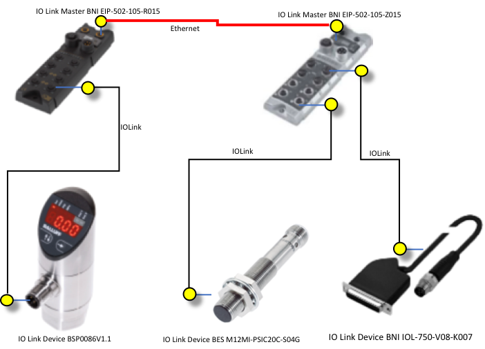

Рис. 5. Приклад топології IO-Link

На рис. 6 топологію IO-Link показано детальніше з відображенням фізичних і логічних з’єднань. Додатково обидва майстри IO-Link з’єднані між собою через Ethernet-з’єднання. Крім того, обидва майстри IO-Link з’єднані ланцюговим підключенням живлення (daisy-chain), яке на рисунку не показано.

Таким чином, у цьому прикладі поєднано три різні фізичні мережі.

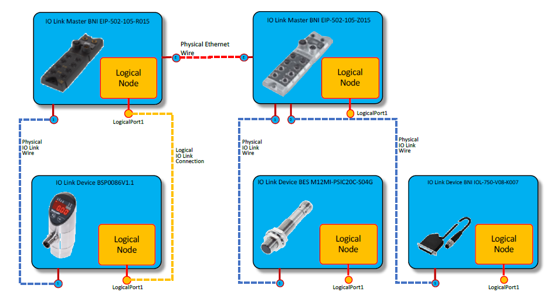

Рис. 6. Схеми логічної та фізичної мереж топології IO-Link (приклад)

### C. Крок 1: Розроблення специфічних для технології рольових класів

Першим кроком моделювання прикладу топології є розроблення специфічних бібліотек рольових класів для кожної використаної технології — IO-Link, Ethernet і PowerPort, як показано на рис. 7:

- ExampleIOLinkRoleClassLib,
- ExampleEthernetRoleClassLib,
- ExamplePowerPortRoleClassLib.

Ці класи лише ілюструють метод; наразі всі рольові класи не мають додаткових атрибутів, які можуть бути додані пізніше.

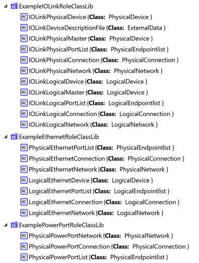

Рис. 7. Виведення специфічної для IO-Link бібліотеки рольових класів із розширеної бібліотеки рольових класів

Ці бібліотеки містять 21 рольовий клас і формують основу для моделювання топологій IO-Link в AutomationML. Усі рольові класи виведені з комунікаційного white paper AutomationML [12], за винятком ролі IOLinkDeviceDescriptionFile, яка виведена з рольового класу ExternalData [15].

Ця роль є важливою для запропонованої концепції, оскільки активує можливість AutomationML моделювати та посилатися на документи в межах об’єктної моделі AutomationML.

Відповідно до рекомендацій робочої групи з комунікацій AutomationML [12], автори також вивели специфічні для технологій інтерфейсні класи для з’єднань IO-Link, Ethernet і PowerPort. Ці класи безпосередньо моделюють інтерфейси — роз’єми (штекери та гнізда) і відповідні логічні кінцеві точки для кожної з зазначених технологій (див. рис. 8).

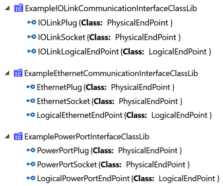

Рис. 8. Виведення специфічних для технологій інтерфейсних класів

Нарешті, необхідні моделі для фізичних кабелів усіх трьох використаних технологій. Вони змодельовані в користувацькій бібліотеці CAEX SystemUnitClass, що містить класи IOLinkWire, EthernetWire та PowerSupplyWire.

На рис. 9 показано ці класи з відповідними кінцевими точками: кабелі IO-Link мають штекер і гніздо, тоді як кабелі Ethernet мають два штекери. Для PowerPort існує декілька конфігурацій; у цьому прикладі змодельовано кабель із двома штекерами.

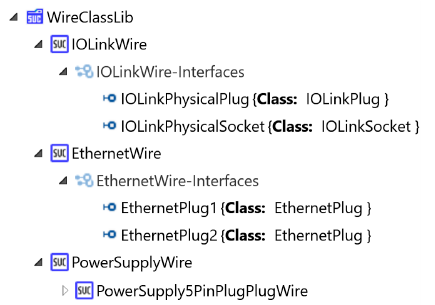

Рис. 9. Бібліотека класів SystemUnit для кабелів IO-Link, Ethernet і живлення

Усі зазначені класи формують основу для моделювання конфігурацій пристроїв IO-Link, а також топологій IO-Link. Вони можуть повторно використовуватися в різних сценаріях застосування IO-Link — від моделювання конфігурації одного окремого пристрою IO-Link до складних мереж із декількома майстрами та пристроями, включаючи ланцюгове підключення живлення PowerPort і мережу Ethernet, що з’єднує майстри IO-Link.

### D. Крок 2: Моделювання пристроїв і майстрів IO-Link в AutomationML

Використовуючи нові рольові класи, типи пристроїв і майстрів IO-Link повинні бути змодельовані кожен як клас AutomationML. Для реалізації прикладу автори розробили специфічну для постачальника бібліотеку SystemUnitClass із необхідними прикладними пристроями IO-Link, які безпосередньо посилаються на відповідні файли IODD.

На рис. 10 це продемонстровано на прикладі пристрою IO-Link BSP0086. Цей клас містить внутрішній елемент IOLinkDescriptionDocument, який посилається на відповідний файл IODD через зовнішній інтерфейс із назвою DocumentLink.

Інтерфейс моделює прив’язку класу пристрою AML до файлу IODD. Атрибут CAEX refURI цього інтерфейсу посилається на фізичний файл IODD. Атрибут CAEX MIMEType встановлено в значення "application/xml", що вказує на те, що файл IODD є XML-файлом.

Крім того, клас моделює логічний вузол пристрою та один фізичний роз’єм IO-Link.

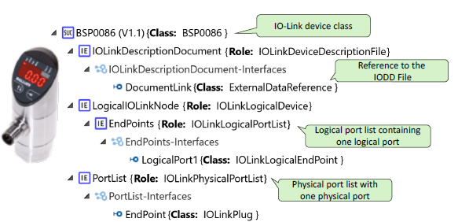

Рис. 10. Модель пристрою IO-Link з посиланням на зовнішній файл IODD

На рис. 11 і рис. 12 показано класи SystemUnit для пристроїв BES M12MI-PSIC20C-S04G та BNI_IOL-750-V08-K007. Архітектура цих моделей ідентична попередньо розглянутому пристрою IO-Link.

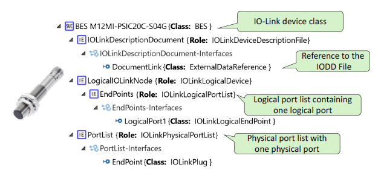

Рис. 11. Модель пристрою IO-Link з посиланням на зовнішній файл IODD

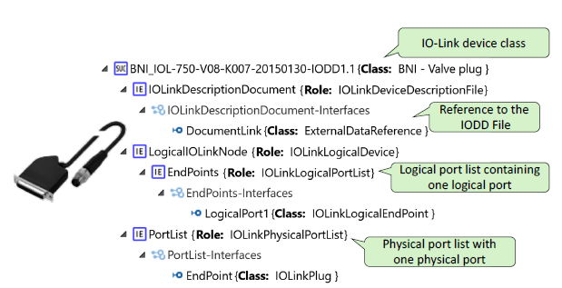

Рис. 12. Модель пристрою IO-Link з посиланням на зовнішній файл IODD

Параметри типів пристроїв із файлів IODD повторно змодельовано в класах AutomationML з метою їх відображення в просторі AutomationML. Це означає, що параметри IODD тепер доступні в моделі класу AutomationML і можуть використовуватися на рівні екземпляра.

На рис. 13 і рис. 14 показано класи AutomationML для двох прикладів майстрів IO-Link: BNI-EIP-502-105-R015 та BNI-EIP-502-T015-105-Z015. Механізм посилання на відповідний файл опису пристрою є ідентичним.

На відміну від пристроїв IO-Link, майстри мають кілька портів, і кожен фізичний порт має відповідний логічний порт. Крім того, кожен майстер має два порти Ethernet і два порти живлення. Можуть бути додані й інші порти; у цьому прикладі акцент зроблено не на повноті, а на загальних принципах моделювання.

Хоча це не входить до меж даного дослідження, доцільним наступним кроком є автоматичне генерування таких бібліотек шляхом зчитування та перетворення бібліотек файлів IODD і файлів опису майстрів (IOLM) у класи SystemUnit AutomationML. Єдиний стандарт IOLM-DD наразі не існує; його доцільно розробити повністю на основі AutomationML у продовженні цієї роботи.

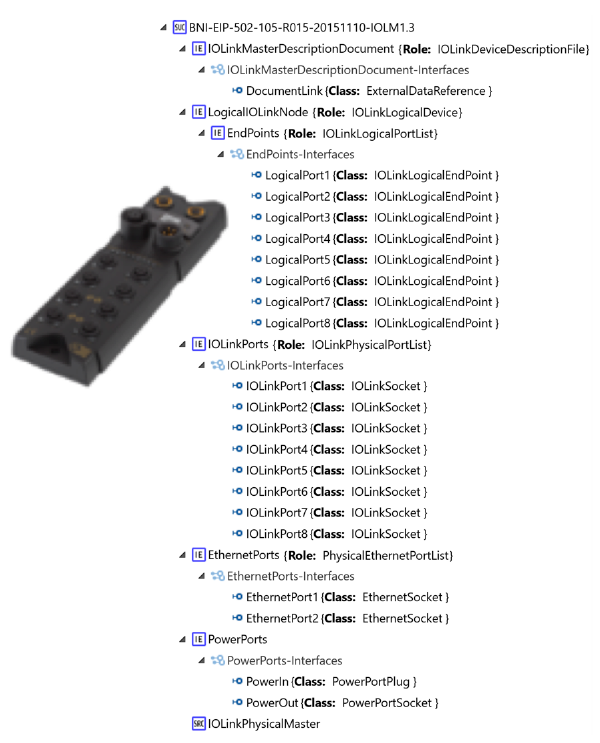

Рис. 13. Бібліотека майстрів IO-Link з посиланням на зовнішній файл IOLM

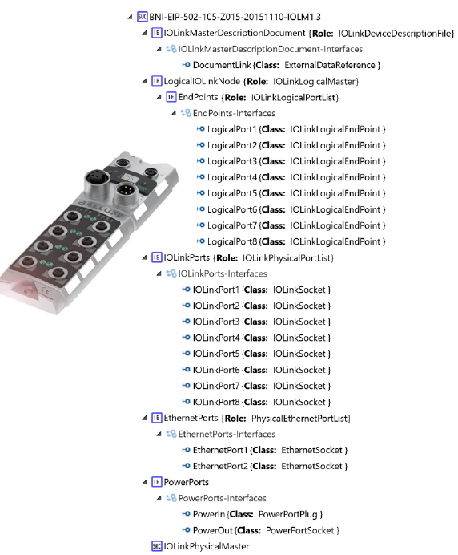

Рис. 14. SystemUnitClass, що моделює майстер IO-Link BNI EIP-502-105-Z015

### E. Крок 3: моделювання топології IO-Link

Оскільки об’єктне моделювання в AutomationML базується на CAEX, усі класи можуть бути інстанційовані в CAEX InstanceHierarchy. Ієрархія екземплярів представляє конкретний проєкт або конфігурацію.

У цьому випадку, відповідно до рекомендацій з моделювання [12], на першому рівні під кореневим об’єктом автори моделюють логічну мережу, фізичну мережу IO-Link, фізичну мережу Ethernet, фізичну мережу PowerPort, а також екземпляри майстрів.

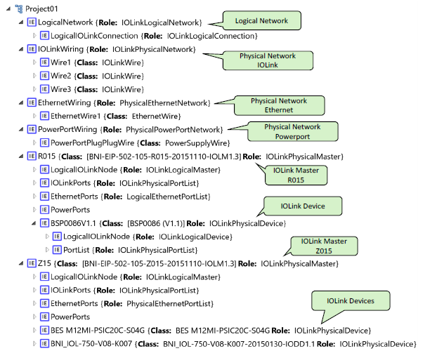

Рис. 15. Модель пристрою IO-Link з посиланням на зовнішній файл IODD

Об’єкт майстра містить вкладені об’єкти, які попередньо визначені у відповідних класах. Крім того, змодельовано відповідні пристрої IO-Link, що підключені до цього майстра.

На рис. 16 показано взаємозв’язок між портами, які з’єднують кінцеві точки фізичних або логічних кабелів із відповідними портами пристроїв.

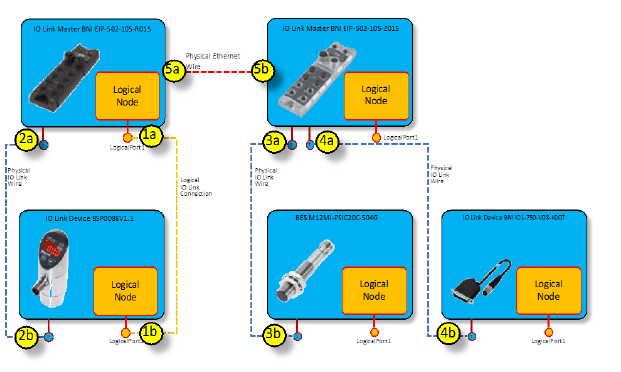

Рис. 16. Модель пристрою IO-Link з посиланням на зовнішній файл IODD

Отриманий файл AutomationML тепер містить усі необхідні стандартні бібліотеки AutomationML, усі класи пристроїв і майстрів IO-Link, а також індивідуальну конфігурацію.

## V. ПРОПОЗИЦІЯ ЩОДО МОДЕЛЮВАННЯ ТОПОЛОГІЙ CC-LINK IE FIELD

### A. Загальна концепція

У цьому розділі раніше описані базові концептуальні ідеї моделювання топологій промислових мереж проілюстровано на прикладі Ethernet-орієнтованої мережі CC-Link IE Field.

Файли CSP+ надають інформацію про тип пристроїв CC-Link IE Field, тоді як AutomationML забезпечує класи для надання загальнозрозумілої семантики, а також екземпляри, що містять індивідуальну конфігураційну інформацію. Крім того, AutomationML дозволяє моделювати зв’язки між екземплярами об’єктів. У випадку CC-Link IE Field як майстри, так і підлеглі пристрої (Slave) описуються файлами опису пристрою CSP+.

На першому етапі, відповідно до рекомендацій робочої групи з комунікацій AutomationML та з урахуванням попереднього розділу, автори розробили специфічні для технології рольові та інтерфейсні класи AutomationML.

На другому етапі бібліотеки типів пристроїв CC-Link IE Field змодельовано в бібліотеках SystemUnitClass AutomationML з посиланням на оригінальні файли DD і з додаванням додаткової інженерної інформації (наприклад, фізичних і логічних портів) для моделювання топології в AutomationML. На цій основі типи пристроїв можуть бути інстанційовані та параметризовані індивідуально, що забезпечує нейтральне зберігання конфігурацій пристроїв CC-Link IE Field.

На третьому етапі як приклад моделюється повна топологія мережі CC-Link IE Field.

### B. Приклад

На рис. 17 показано приклад топології CC-Link IE Field, що складається з одного майстра CC-Link IE Field і трьох підлеглих пристроїв (Slave) CC-Link IE Field, з’єднаних сумісними кабелями Ethernet.

Використано такі модулі:

• RJ71GF11-T2 (майстер CC-Link IE Field)
• MR-J4-10GF-RJ (серво-підсилювач)
• NZ2GF2B1-16D (модуль дискретних входів постійного струму на 16 каналів)
• BNI CIE-104-105-Z015 (шлюз CC-Link IE Field / IO-Link)

Модуль шлюзу CC-Link IE Field / IO-Link може розглядатися як майстер IO-Link. Тому на подальших етапах цей приклад можна розширити шляхом моделювання конфігурації IO-Link, підключеної нижче цього майстра.

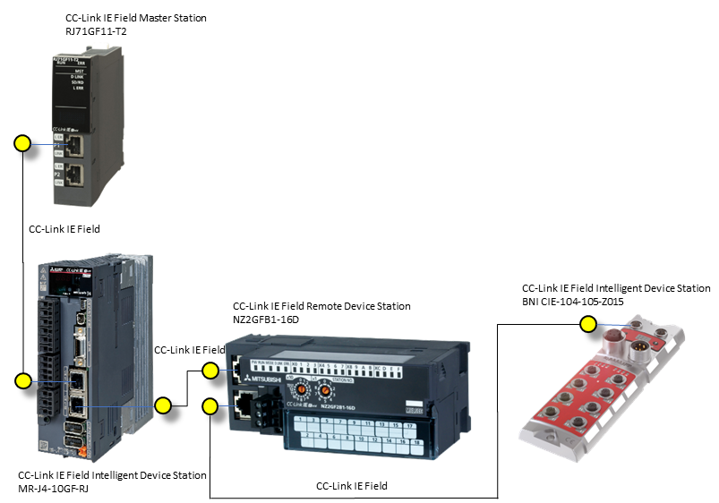

Рис. 17. Приклад топології CC-Link IE Field

На рис. 18 топологію CC-Link IE Field показано детальніше з відображенням фізичних і логічних з’єднань.

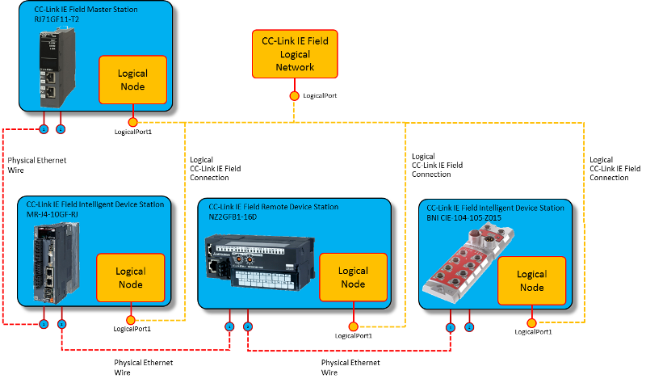

Рис. 18. Схеми логічної та фізичної мереж топології CC-Link IE Field (приклад)

### C. Крок 1: Розроблення специфічних для технології рольових класів

Першим кроком моделювання прикладу є розроблення бібліотеки рольових класів, специфічних для додатково використаної технології CC-Link IE Field, як показано на рис. 19.

Бібліотеки рольових класів для IO-Link, Ethernet і PowerPort, наведені на рис. 8, повторно використовуються в цьому прикладі.

Ці класи лише ілюструють метод; наразі всі рольові класи не мають додаткових атрибутів, які можуть бути додані пізніше.

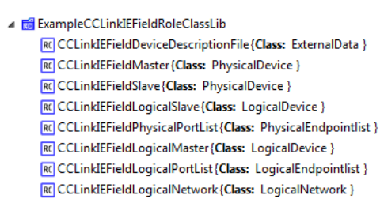

Рис. 19. Бібліотека рольових класів, специфічних для технології CC-Link IE Field

Ця бібліотека містить 8 рольових класів і формує основу для моделювання топологій CC-Link IE Field в AutomationML. Усі рольові класи виведені з комунікаційного white paper AutomationML [12], за винятком ролі CCLinkIEFieldDeviceDescriptionFile, яка виведена з рольового класу ExternalData [15].

Ця роль є важливою для запропонованої концепції, оскільки активує можливість AutomationML моделювати та посилатися на документи в межах об’єктної моделі AutomationML.

Відповідно до рекомендацій робочої групи з комунікацій AutomationML [12], автори вивели специфічний для технології інтерфейсний клас для логічних з’єднань CC-Link IE Field. Для фізичних з’єднань повторно використовується раніше визначена бібліотека інтерфейсних класів EthernetWiring.

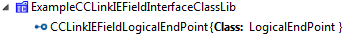

Рис. 20. Бібліотека інтерфейсних класів, специфічних для технології CC-Link IE Field

Класи для моделювання фактичної проводки, як показано на рис. 17 у наведеному прикладі, повторно використовуються.

Усі зазначені класи формують основу для моделювання конфігурацій пристроїв CC-Link IE Field, а також мережевих топологій у спосіб, незалежний від постачальника, що дозволяє безшовний обмін конфігураціями та топологіями між різними інженерними інструментами в межах процесу проєктування.

### D. Крок 2: Моделювання пристроїв і майстрів CC-Link IE Field в AutomationML

Використовуючи нові рольові класи, типи пристроїв CC-Link IE Field можуть бути змодельовані кожен як AutomationML SystemUnitClass. Автори розробили прикладні бібліотеки SystemUnitClass для кожного пристрою, показаного на рис. 21, рис. 22, рис. 23 і рис. 24, які безпосередньо посилаються на відповідні файли CSP+.

Для цього кожен SystemUnitClass містить внутрішній елемент CCLinkIEFieldDescriptionFile, який посилається на відповідний файл CSP+ через зовнішній інтерфейс із назвою DocumentLink. Атрибут CAEX refURI цього інтерфейсу посилається на фізичний файл CSP+. Атрибут CAEX MIMEType встановлено в значення "application/xml", що вказує на те, що файл CSP+ є XML-файлом.

Крім того, кожен клас моделює фізичні та логічні порти пристрою.

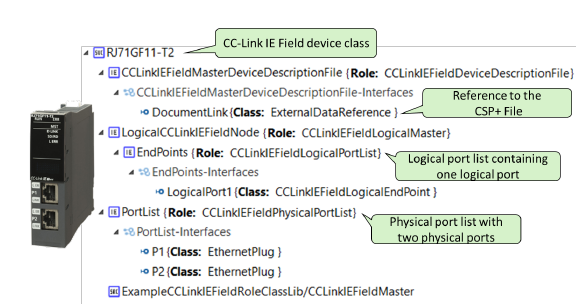

ис. 21. Модель пристрою CC-Link IE Field із посиланням на зовнішній файл CSP+

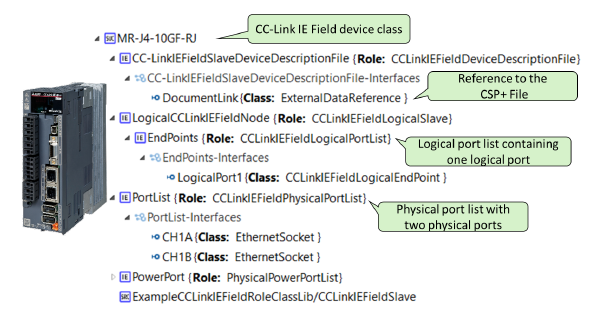

Рис. 22. Модель пристрою CC-Link IE Field із посиланням на зовнішній файл CSP+

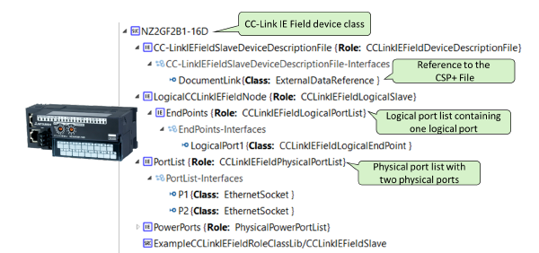

Рис. 23. Модель пристрою CC-Link IE Field із посиланням на зовнішній файл CSP+

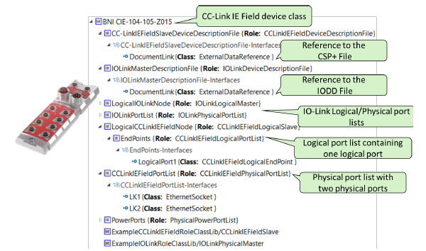

Рис. 24. Модель пристрою CC-Link IE Field із посиланням на зовнішній файл CSP+

### E. Крок 3: Моделювання топології CC-Link IE Field

Оскільки об’єктне моделювання в AutomationML базується на CAEX, усі класи можуть бути інстанційовані в CAEX InstanceHierarchy. Ієрархія інстанцій представляє конкретний проєкт або конфігурацію.

У цьому випадку, відповідно до рекомендацій з моделювання [12], на першому рівні під кореневим об’єктом автори моделюють логічну мережу, фізичну мережу CC-Link IE Field, а також інстанції пристроїв.

Отриманий файл AutomationML (див. рис. 25) тепер містить усі необхідні стандартні та специфічні для технології бібліотеки Role Class і Interface Class AutomationML, усі типи пристроїв CC-Link IE Field як SystemUnitClass, а також індивідуальну конфігурацію і топологію в InstanceHierarchy.

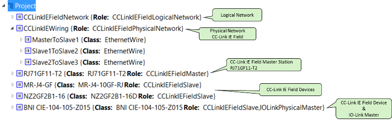

Рис. 25. Топологія CC-Link IE Field

## VI. ОБГОВОРЕННЯ ТА ВАРІАНТИ ЗАСТОСУВАННЯ

Запропонований підхід поєднує переваги класичної концепції DD (у цьому прикладі IODD і CSP+), що стосується типової інформації, з можливостями AutomationML моделювати одну або кілька інстанцій та їхні зв’язки.

Це дозволяє зберегти добре визначені та усталені стандарти IODD і CSP+, а також пов’язані з ними інструментальні екосистеми без змін і забезпечує інвестиційний захист для відповідних зацікавлених сторін та постачальників інструментів. Водночас відкривається можливість подолати проблему незадовільної сумісності між інструментальними ланцюгами на різних етапах життєвого циклу.

Якісно спроєктовані конфігурації пристроїв тепер можуть зберігатися у вигляді файлів AutomationML і додатково збагачуватися інформацією, наприклад CAD-даними та іншими модельними даними.

Новий підхід дозволяє реалізувати такі базові варіанти застосування:

- /1/ Експорт і архівування конфігурацій пристроїв або мережевих топологій, таких як IO-Link чи CC-Link IE Field, у нейтральному форматі з пропрієтарного інженерного інструмента.
  Це робить дані незалежними від конкретного інструмента та підвищує незалежність від постачальників. Забезпечується інвестиційний захист даних і гарантується їх майбутня читабельність, навіть якщо вони зазвичай зберігаються всередині закритих інженерних систем.
- /2/ Передавання конфігурацій між інженерними інструментами.
  Це корисно, коли постачальники виконують конфігурування у власному спеціалізованому інструменті та мають передати результати до інструментів замовника, або коли один інженерний інструмент замінюється іншим.
- /3/ Розповсюдження конфігурацій пристроїв через сервер або хмару для подальшого повторного використання в інших проєктах, для обміну з клієнтами та для створення нових сервісів і бізнес-моделей на майбутньому інженерному маркетплейсі.
  Наприклад, при заміні пристроїв на нові покоління хмарний сервіс конфігурування може автоматично підбирати відповідні набори параметрів для нових пристроїв і запитувати користувача щодо відкритих питань.
- /4/ Конфігурування цифрових двійників (наприклад, OPC UA сервера) шляхом завантаження конфігурацій пристроїв IO-Link або майстра до цифрового двійника.
  Такий типовий сценарій Індустрії 4.0 забезпечує доступ до даних для майбутніх програмних сервісів, таких як перевірки узгодженості, сервіси технічного обслуговування або аналіз даних.

Можливості значно ширші, наведені варіанти застосування є лише початковим переліком.

## VII. ПІДСУМОК І ПЕРСПЕКТИВИ

Запропонований підхід усуває проблему, пов’язану з тим, що DD-файли здатні зберігати лише типову інформацію, але не індивідуальні конфігурації пристроїв, а також не придатні для незалежного від постачальника моделювання топологій промислових мереж.

Запропоновано універсальний підхід на основі AutomationML, який дозволяє включати класичні DD-файли в оболонку AutomationML, що виконує роль зв’язувального шару та може містити відсутні специфікаційні елементи, такі як механічна, електрична та конфігураційна інформація, або навіть повністю замінити класичний DD.

Загальну проблему було розглянуто на прикладі стандартів IO-Link та CC-Link IE Field, однак запропоноване рішення може бути застосоване до будь-яких інших стандартів промислових мереж.

Можливість AutomationML вилучати незмінені дані порівняно з визначенням класу дозволяє зменшити XML-код до суті змінених даних. Це робить файли DD на основі AutomationML компактними та читабельними і підвищує рівень прийняття в промисловості.

Наступним кроком дослідження стане моделювання складних ієрархічних топологій із використанням кількох файлів топологій. Це буде розроблено відповідно до комунікаційного white paper AutomationML.

AutomationML Application Recommendation AR APC [19] описує обмін апаратними конфігураціями, IO-мітками та мережевими конфігураціями між ECAD- та PLC-інженерними інструментами. Описаний підхід у майбутньому буде узгоджено з документом AR APC [19].

Додатково рекомендується автоматично генерувати SystemUnitClass AutomationML шляхом аналізу DD-файлів і перетворення їх у класи AutomationML.

Зрештою, автори прагнуть представити результати цього дослідження спільноті IO-Link та іншим організаціям, що займаються промисловими мережами, з метою розроблення методики впровадження файлів опису пристроїв на основі AutomationML.

## References

[1] IO-Link Consortium. *IO-Link Interface and System Specification*, Version 1.1.2, July 2013. Available at: http://www.io-link.org  

[2] N. Siltala. *Formal Digital Description of Production Equipment Modules for Supporting System Design and Deployment*. Doctoral Thesis, Tampere University of Technology, 2016. Available at: https://tutcris.tut.fi/portal/files/6578644/Siltala_1402.pdf  

[3] A. Gössling. *Device Information Modeling in Automation – A Computer-Scientific Approach*. Doctoral Thesis, Technical University Dresden, February 2014. Available at: https://www.researchgate.net  

[4] IDA Group. *FDCML 2.0 Specification Version 1.0*, 2017. Available at: http://www.fdcml.org  

[5] R. Blair. *A Modern Approach to CIP Device Descriptions*. ODVA 2015 Industry Conference, Frisco, Texas, USA. Available at:  
https://www.odva.org/Portals/0/Library/Conference/2015_ODVA_Conference_Blair_A-Modern-Approach-to-CIP-Device-Descriptions.pdf  

[6] ETG.2000. *EtherCAT Slave Information (ESI) Specification*.  

[7] ETG.2100. *EtherCAT Network Information (ENI) Specification*.  

[8] EPSG Draft Standard 301 (EPSG DS 301). *Ethernet POWERLINK Communication Profile Specification*, Version 1.3.0.  

[9] IEC 62714. *Engineering Data Exchange Format for Use in Industrial Automation Systems Engineering (AutomationML)*, 2012.  

[10] R. Drath. *Data Exchange in Plant Design with AutomationML: Integration with CAEX, PLCopen XML and COLLADA*. Springer (VDI-Buch), Heidelberg, 2010.  

[11] IEC 62424. *Representation of Process Control Engineering – Request in P&ID Diagrams and Data Exchange between P&ID Tools and PCE-CAE Tools*, August 2009.  

[12] AutomationML e.V. *AML Best Practice Recommendations: Communication*, Version 1.0.0, 15 May 2017. Available at:  
https://www.automationml.org/o.red/uploads/dateien/1494834508-WP_Communication_V1.0.0.zip  

[13] F. Bendik, A. Lüder, N. Schmidt. *Exchange of Engineering Data for Communication Systems Based on AutomationML Using an EtherNet/IP Example*. ODVA 2015 Industry Conference, Frisco, Texas, USA. Available at:  
https://www.odva.org/Portals/0/Library/Conference/2015_ODVA_Conference_Bendik_Exchange-of-design-data-using-AutomationML-for-EtherNetIP.pdf  

[14] AutomationML e.V. *AML Best Practice Recommendations: AutomationML Container Document Identifier (BPR Container)*, Version 1.0.0, October 2017.  

[15] AutomationML e.V. *AML Best Practice Recommendations: ExternalDataReference*. Available at:  
https://www.automationml.org/o.red/uploads/dateien/1485865157-BPR%20005E_ExternalDataReference_V1.0.0.zip  

[16] CLPA. *Control & Communication System Profile Specification*, BAPC2008ENG-001-C, June 2017. Available at: https://www.cc-link.org  

[17] CLPA. *CSP+ Creation Guidelines – Outline*, BAP-C3001ENG-001-C, October 2017. Available at: https://www.cc-link.org  

[18] CLPA. *CSP+ Creation Guidelines – CC-Link IE Field Network Detail Version*, BAP-C3001ENG-003, September 2016. Available at: https://www.cc-link.org  

[19] AutomationML e.V. *AML Application Recommendation: Automation Project Configuration*.  

[20] AutomationML e.V. *AR 001E Automation Project Configuration*, Version 1.0.0. Available at:  
https://www.automationml.org/o.red/uploads/dateien/1494835012-AR_001E_Automation_Project_Configuration_V1.0.0.zip  