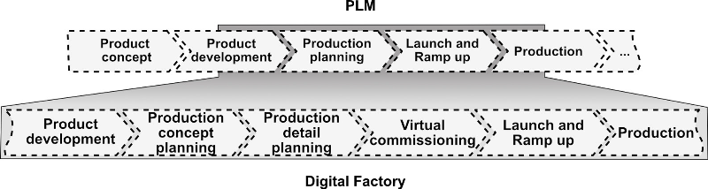
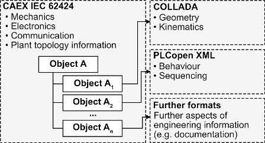
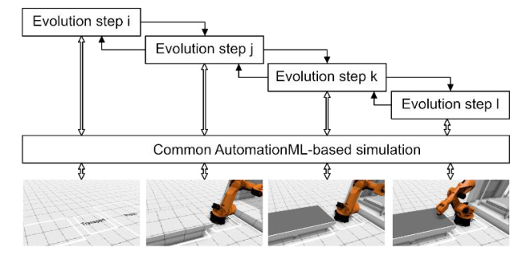
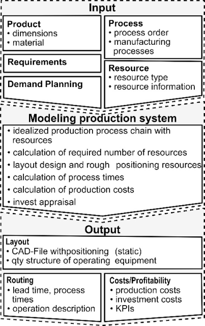
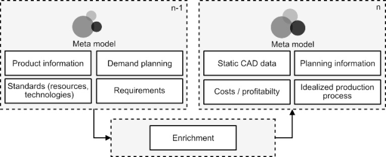
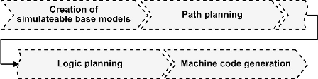
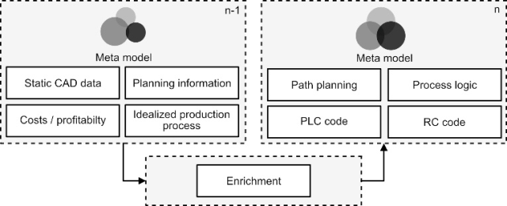

# Еволюція цифрової фабрики – нові можливості для узгодженого інформаційного потоку

Це переклад статті [Breckle, Theresa & Kiesel, Markus & Kiefer, Jens & Beisheim, Nicolai. (2019). The evolving digital factory – new chances for a consistent information flow. Procedia CIRP. 79. 251-256. 10.1016/j.procir.2019.02.059. ](https://www.researchgate.net/publication/331721205_The_evolving_digital_factory_-_new_chances_for_a_consistent_information_flow)

## Анотація

У межах процесу розроблення продукції керування даними та інформацією є важливим завданням. Дані та інформація створюються на кожному етапі цього процесу і зберігаються в програмних засобах, які використовуються для їх формування. Для великомасштабних виробничих систем це призводить до значного обсягу ручної роботи, що є схильною до помилок.

Ця проблема посилюється через зростаючий вплив комп’ютерних наук на такі системи (наприклад, Industrie 4.0), що спричиняє підвищення їхньої складності. Для забезпечення кращого інформаційного потоку необхідні нові підходи.

У цій роботі представлено підхід до еволюційної Цифрової фабрики, яка акумулює та візуалізує всю згенеровану інформацію на основі відкритої стандартної метамоделі.

## 1. Вступ

Спосіб проєктування, конструювання та виготовлення продукції має враховувати доступність нових матеріалів і технологій, а також поширення нових бізнес-моделей для її виробництва та збуту. Вплив економічних, політичних та технологічних змін трансформував попереднє уявлення про виробництво та підходи до проєктування виробничих систем. Це призводить до дедалі складніших завдань планування та нових викликів для компаній. Ці виклики зумовлені все частішою адаптацією фабрик і їхніх виробничих систем, (повторним) використанням знань, а також постійним зростанням вимог і специфікацій [1].

Проєктування виробничої системи зазвичай розподілене між багатьма галузями та учасниками для охоплення всіх задіяних методів, технологій, підходів і рівнів деталізації. У цьому контексті процеси, компоновки та, наприклад, машинні коди моделюються й імітуються для підтримки процесу проєктування в кожній відповідній предметній області. На рис. 1 показано процеси Цифрової фабрики як частину управління життєвим циклом продукції. Зазвичай ці моделі та їхні симуляції відображають різні вбудовані контексти, а також різні рівні деталізації. Крім того, ці моделі розміщені в різних ІТ-системах, використовують різні формати даних і різну термінологію. У деяких випадках результати етапу планування існують лише в паперовій формі. Зміни в моделі або результати симуляцій часто не можуть бути повторно імпортовані в початкову систему керування даними. Це призводить до розриву та неузгодженого інформаційного потоку, що потребує ручної роботи. Наслідком є процес, схильний до помилок, який потребує додаткового часу та витрат.

У цьому контексті необхідно також враховувати постійно зростаючі вимоги щодо безпеки даних, їхньої узгодженості та доступності, а також збільшення обсягів даних. Виконання всіх цих вимог потребує інтелектуальної та узгодженої стандартної моделі даних, а також відповідних інтегрованих методів і засобів підтримки керування даними.

Рис. 1. Огляд управління життєвим циклом продукції (PLM), включаючи Цифрову фабрику

## 2. Дотичні дослідження

### 2.1. Цифрова фабрика

Інтеграція та забезпечення паралельної розробки виробничої системи на етапі її проєктування в межах процесу розроблення продукції є однією з центральних цілей концепції Цифрової фабрики. У літературі не існує остаточного й універсального означення цього поняття. Розвиток концепції Цифрової фабрики не можна вважати завершеним, оскільки технологічний прогрес і наукові досягнення потребують її постійного розширення та адаптації [2].

Одним із підходів до означення є розуміння Цифрової фабрики як сукупності програмних засобів і методологій, що використовуються для проєктування, моделювання, запуску та оптимізації виробничих систем [3–5]. Загальний підхід Цифрової фабрики ґрунтується на ідеї паралельного інжинірингу (concurrent engineering) та концепції комп’ютерно-інтегрованого виробництва (CIM). Однією з цілей інтеграції виробничої придатності продукції з урахуванням відповідних бізнес-обмежень є зменшення кількості ітерацій перевірки шляхом забезпечення їх виконання якомога раніше в межах життєвого циклу продукції.

Ідея Цифрової фабрики передбачає інтеграцію засобів моделювання в життєвий цикл продукції — починаючи з розроблення продукту, через планування виробничих систем та їхнього обладнання, і аж до організації серійного виробництва [6].

У літературі інструменти Цифрової фабрики застосовувалися для віртуального аналізу виробничих систем із одночасним зменшенням пов’язаних витрат і часу. Такий підхід підтримує концепцію управління життєвим циклом продукції, яка передбачає надання інформації про продукт на кожному етапі його існування. Цифрову фабрику можна розглядати як інструмент підтримки прийняття рішень. Завдяки співпраці учасників проєктування, моделювання та виробництва її можна використовувати вже з початкових етапів [5].

Інструменти Цифрової фабрики базуються на філософії PPR (Product, Process, Resources — Продукт, Процес, Ресурси). Процес являє собою набір операцій, що виконуються ресурсами (інструментами, роботами, верстатами тощо) для здійснення виробництва. Незважаючи на значну кількість інструментів, які інтегруються та застосовуються в межах Цифрової фабрики, рівень її впровадження в компаніях досі залишається обмеженим. Це зумовлено складністю концепції, оскільки вона охоплює багато рівнів (від окремої станції до всієї фабрики) та пропонує різноманітні варіанти моделювання.

У контексті Цифрової фабрики взаємодіють різні учасники компанії з відмінними точками зору (конструктори, фахівці з моделювання, виробничий персонал тощо). Різноманіття цих підходів зумовлює складність комунікації та співпраці, що може мати деструктивний характер [7]. Обмін і повторне використання знань та даних на всіх етапах життєвого циклу продукту/фабрики залишаються неузгодженими та недостатньо ефективними [8].

### 2.2. Модель даних

Цілісну модель даних цифрової фабрики наразі складно реалізувати, оскільки інформація розподілена між (a) різними програмними застосунками та (b) різними підрозділами.

Для досягнення інтероперабельності між підрозділами та програмними рішеннями необхідно перетворювати пропрієтарні дані у стандартизовані формати обміну. Це завжди є компромісом між доступною функціональністю та поширеністю формату обміну. Крім того, відображення функціонального простору пропрієтарного формату на простір формату обміну не є бієктивним, що призводить до втрати даних і односпрямованого інформаційного потоку. Ця проблема посилюється зі зростанням кількості використовуваних форматів обміну. Отже, необхідно мінімізувати кількість таких форматів.

Як зазначають Drath та ін. [9] і Bihani та ін. [10], відкритий стандарт AutomationML (IEC 62714-1) здатний поєднати різні фази розроблення, оскільки він охоплює гетерогенні дані, що створюються на різних етапах.

Дослідження стандарту AutomationML розпочалося у 2006 році за участю провідних компаній і наукових установ з метою створення відкритого проміжного формату для Цифрової фабрики. Отже, стандарт має забезпечувати взаємодію інженерних інструментів різних дисциплін. Як показано на рис. 2, стандарт AutomationML використовує набір добре відомих стандартів для досягнення необхідної гнучкості щодо гетерогенних даних.

Рис. 2. Огляд AutomationML [11]

- CAEX використовується як базовий формат, який завдяки своїй XML-основі здатний зберігати практично довільні текстові дані.
- COLLADA — спеціалізований формат даних для геометричної інформації, що може містити як трикутно-орієнтовані набори даних, так і набори даних на основі граничного подання (boundary representation). Крім того, COLLADA підтримує зберігання кінематичної інформації.
- PLCopen XML — це XML-представлення стандарту IEC 61131-3, який є єдиним у світі стандартом для програмування промислових систем керування. Завдяки цьому стає можливим передавання PLC-коду між різними постачальниками та системами.

Хоча стандарт співпрацює з різними організаціями для інтеграції додаткових технологій, наприклад OPC UA, багато постачальників програмних засобів для інженерних застосунків наразі інтегрують цей стандарт у свої рішення.

## 3. Концепція еволюційної Цифрової фабрики

Виробничі системи плануються в різних фазах (як показано на рис. 1). Під час проєктування виробничої системи на кожному окремому кроці фаз процесу планування створюються та/або обробляються дані, інформація і знання.

У процесі планування виробничої системи зазвичай виникають ітераційні цикли. Вони можуть бути спричинені різними чинниками (наприклад, змінами продукту, обмеженнями щодо технологічності виробництва або обмеженнями доступного простору у виробничій зоні). Це вимагає взаємодії різних предметних областей, що охоплює всі складові філософії PPR, аж до сфер віртуального введення в експлуатацію.

Має бути забезпечена можливість повернення з кожного кроку планування до попереднього без втрати даних, інформації або знань. У міру просування процесу планування дані стають більш детальними та точними. Якість результатів планування залежить від доступності та актуальності даних.

Результат кожного кроку процесу зберігається у стандарті AutomationML. Використання цього стандарту дозволяє досягти складної мети, описаної вище. Замість створення нового стандарту, який задовольняє всі вимоги до метамоделі, може застосовуватися та розширюватися вже наявний стандарт AutomationML.

Акумулювання та візуалізація всієї згенерованої інформації в межах відкритої стандартної метамоделі забезпечує цілісну модель даних Цифрової фабрики. Використання цього стандарту прокладає шлях до безперервного, узгодженого та спільного застосування єдиної моделі даних у процесі планування.

Рис. 3. Огляд етапів еволюції Цифрової фабрики

Огляд етапів еволюції для проєктування та моделювання виробничої системи показано на рис. 3.

На першому етапі визначається базова, початкова модель даних, яка головним чином ґрунтується на виробничому ланцюгу процесів (i). На наступному етапі ця модель доповнюється ресурсами та додатковою інформацією, релевантною для планування (j). Далі ця інформація деталізується (k) аж до завершального етапу — віртуального введення в експлуатацію (l). Вирішальним чинником є те, що ітераційні цикли стають можливими завдяки спільній метамоделі на основі AutomationML.

Для підвищення рівня спільної роботи та підтримки розуміння цих високоскладних систем концепція еволюційної Цифрової фабрики використовує централізовану візуалізацію на основі віртуальної реальності, здатну відображати різні рівні її зрілості. Оскільки візуалізація спеціально розроблена для AutomationML, її можна використовувати як для перегляду наявних 3D-моделей, так і для більш складних сценаріїв, наприклад, моделювання виробничих ресурсів (роботів тощо) шляхом підключення до реальної або віртуальної системи керування. Завдяки використанню віртуальної реальності моделі стають наочними та сприйнятними, що сприяє кращому розумінню відповідних процесів.

На відміну від інших форматів обміну, таких як STEP або JT, які переважно орієнтовані на геометрію, AutomationML здатний охоплювати гетерогенні дані, створені на різних етапах життєвого циклу продукції.

### 3.1. Концептуальне планування

Концептуальне планування є першим етапом планування в межах проєктування виробничої системи. На цій ранній стадії планування доступні дані, інформація та знання мають переважно концептуальний характер. Відповідно до філософії PPR, вхідними даними для концептуального планування є відомості щодо продукту, процесу та ресурсів. Метод концептуального планування зображено на рис. 4.

Продукт описується його геометрією (розмірами), матеріалом (властивостями) та структурою (наприклад, специфікацією матеріалів — bill of materials). Для процесу вхідними даними є послідовність операцій і використовувані виробничі технології (тип процесу).

Для здійснення виробництва у виробничій системі необхідні ресурси. Вони описуються за типом та додатковими характеристиками (наприклад, геометричними параметрами, швидкістю, інвестиційними витратами та виробничими можливостями). Стандартизовані ресурси обираються відповідно до корпоративної стратегії, технологічної політики та інших нормативів.

Вхідні дані можуть доповнюватися вимогами (наприклад, проєктно-специфічними або економічними). Для реалістичного проєктування виробничої системи необхідно також враховувати попит замовників у формі планування попиту.

На практиці цей етап планування сьогодні не є достатньо автоматизованим і зазвичай виконується експертами. Результати цієї фази часто не можуть бути передані в цифровій формі до наступних процесів, оскільки вони лише частково — або взагалі не — створюються з використанням інструментів Цифрової фабрики та часто існують у паперовій формі.

Отже, процес концептуального планування виробничої системи насамперед має бути цифровізований. У запропонованому підході моделювання концепції виробничої системи реалізується та трансформується за допомогою методології проєктування, заснованої на знаннях і правилах (див. [12,13]).

Рис. 4. Метод концептуального планування виробничої системи

У процесі моделювання виробничої системи виробничі процеси (наприклад, з’єднання) призначаються окремим виробничим крокам відповідно до послідовності процесу. Для цього процесного ланцюга визначаються відповідні ресурси. У результаті цього першого кроку оцінюється початковий варіант блокового компонування (block layout).

Необхідна виробнича потужність визначається на основі планування попиту. Таким чином, із доступних ресурсів можна обрати той, який здатний забезпечити потрібну продуктивність. На наступному кроці визначені ресурси розміщуються в компонуванні відповідно до ідеалізованого виробничого процесного ланцюга.

Процесний ланцюг із визначеними ресурсами є основою для розрахунку виробничого часу. Ідеалізований виробничий процесний ланцюг є результатом першого етапу еволюції (див. рис. 2). Після розрахунку інвестиційних витрат і оцінювання інвестицій для обраних ресурсів виконується початковий розрахунок виробничих витрат.

Результатом моделювання виробничої системи є статичне компонування (CAD-файл) із розміщеними ресурсами. Перелік усіх необхідних ресурсів міститься у структурі кількості всього виробничого обладнання. На основі ідеалізованого виробничого процесу формується маршрутна карта (routing) із зазначенням часу виконання операцій і їх описів. Для завершення результатів концептуального планування визначається інформація щодо рентабельності у вигляді виробничих витрат, інвестиційних витрат та інших ключових показників ефективності (наприклад, коефіцієнта використання потужності).

Відповідно до підходу еволюційної Цифрової фабрики метамодель збагачується під час концептуального планування. На початку фази планування метамодель (n-1) містить інформацію про продукт, планування попиту, стандарти ресурсів і технологій, а також вимоги. Як показано на рис. 5, перше збагачення метамоделі відбувається під час концептуального планування в процесі моделювання виробничої системи та приводить до формування метамоделі (n).

Після збагачення метамодель включає:

- Статичні CAD-дані: на основі ідеалізованого виробничого процесного ланцюга створено перше, наближене компонування з позиціонуванням ресурсів. Використовуючи стандарт AutomationML, статичні CAD-дані можуть зберігатися у вигляді файлу COLLADA.
- Ідеалізований виробничий процес: містить інформацію про послідовність кроків процесу (попередник і наступник), дані для маршрутної карти (наприклад, початкове визначення та розрахунок виробничого часу, опис змісту операцій), а також зв’язок між процесом і ресурсом.
- Планувальну інформацію: наприклад, структуру кількості всього необхідного обладнання та інформацію про кожен ресурс, виробничі KPI (наприклад, такт часу, тривалість виробничого циклу).
- Витрати / рентабельність: початкові результати розрахунку виробничих і інвестиційних витрат разом із відповідними KPI.

Результатом концептуального планування є файл AutomationML, що містить усі зазначені результати. Ідеалізований виробничий процес, інформація щодо витрат і рентабельності, а також інші планувальні дані як вхід для віртуального введення в експлуатацію можуть бути включені до стандарту AutomationML у вигляді цілісної моделі даних.

Рис. 5. Збагачення метамоделі шляхом концептуального планування

### 3.2. Віртуальне введення в експлуатацію

Означення віртуального введення в експлуатацію (VCOM) згідно з VDI/VDE 3693 Частина 1: «введення в експлуатацію, що включає випробування окремих компонентів і підфункцій системи автоматизації на етапі інжинірингу з використанням методів моделювання та моделей, узгоджених із відповідним завданням» [14].

Ця досить широка сфера сьогодні зазвичай реалізується у вигляді симуляцій Hardware-in-the-loop (HIL) або Software-in-the-loop (SIL), які поєднуються з математичною та/або графічною моделлю. Таким чином, поведінка змодельованої виробничої системи може максимально наближатися до її реального аналога.

На основі такої моделі можливо створювати, тестувати та вдосконалювати програмний код для програмованих логічних контролерів (PLC) і систем керування роботами (RC) виробничої системи. Оскільки код створюється на реальному або змодельованому обладнанні (HIL/SIL), його можна перенести до реальної виробничої системи. Такий підхід забезпечує суттєве підвищення якості програмного коду під час введення реальної системи в експлуатацію.

Через гетерогенну структуру даних у сучасних процесах розроблення створення моделей для віртуального введення в експлуатацію потребує значних зусиль — або у формі ручної праці, або через розроблення спеціалізованих інтерфейсів для різних програмних рішень та інженерних алгоритмів, здатних об’єднувати ці дані. Тому віртуальне введення в експлуатацію зазвичай здійснюється лише один раз — наприкінці етапу проєктування. Це суттєво зменшує можливості внесення змін у конструкцію продукту через зростання вартості змін (Cost-of-Change) на пізніх стадіях розроблення [15].

Отже, для оцінювання змін на ранніх етапах процесу розроблення необхідний вищий рівень автоматизації створення графічних і математичних моделей. З економічної точки зору цього можна досягти лише шляхом удосконалення базової моделі даних.

Оскільки концепція еволюційної Цифрової фабрики забезпечує цілісну модель даних, створення моделей для VCOM може бути суттєво спрощене завдяки ширшим можливостям автоматизації. Це дозволяє виконувати віртуальне введення в експлуатацію окремих підфункцій і сегментів навіть на ранніх стадіях розроблення для перевірки та деталізації важливих функцій.

Для формування таких VCOM-моделей аналізується файл AutomationML, що містить інформацію з попередніх етапів, з метою отримання необхідних даних. Інформація, яка не потрібна для конкретного завдання, зберігається у файлі AutomationML, оскільки може бути необхідною для інших процесів. Спрощений процес перетворення статичних CAD-даних у функціональну модель VCOM показано на рис. 6.

Рис. 6. Огляд спрощеного процесу трансформації статичних CAD-моделей

Ступінь зрілості моделей, створених на попередніх етапах, суттєво впливає на зусилля, необхідні для побудови VCOM-моделей. Факторами зрілості в цьому випадку є, наприклад, наявність оптимізованої для моделювання/руху ієрархічної структури або текстових означень кріплень інструментів із зазначенням їх референтних позицій.

У розглянутому випадку передбачається ідеалізований процес і повністю зрілі моделі, що характерно для інтегрованого та безперервного процесу. На першому етапі до моделі AutomationML додається необхідна інформація для подальших кроків. Після цього виконується планування траєкторії, яке ґрунтується на позиціях, визначених у розділі 3.1 [16].

Далі процес перевірки визначає, чи можуть бути досягнуті всі точки траєкторії з урахуванням таких факторів, як максимальна зона досяжності промислового робота. Для забезпечення коректної взаємодії між окремими системами керування необхідна велика кількість датчиків. Ці датчики інтегруються у програми руху.

Оскільки на цьому етапі обчислення ще не орієнтовані на конкретну систему керування, необхідний етап постобробки для перетворення абстрактних програм у PLCopenXML або навіть у спеціалізовані мови, наприклад KUKA Robot Language (KRL).

Результатом описаного процесу є збагачення метамоделі, що показано на рис. 7. На цьому етапі файл AutomationML може бути відображений у централізованій системі візуалізації на основі віртуальної реальності та підключений до реального або змодельованого обладнання. Таким чином, може бути виконана перевірка віртуального введення в експлуатацію, яка й надалі залишається частково ручним процесом.

Рис. 7. Збагачення метамоделі шляхом віртуального введення в експлуатацію

## 4. Обговорення

Оскільки стандарт AutomationML уже привертає значну увагу в окремих галузях, його повна інтеграція в основні програмні рішення все ще триває. Хоча результати, отримані в межах цього дослідницького проєкту, свідчать про суттєве покращення як усього процесу, так і його підпроцесів, остаточна оцінка запропонованого методу поки що неможлива через недостатню кількість реалізованих інтеграцій.

Окрім проблем упровадження, висока гнучкість AutomationML може призводити до дуже різноманітних результатів, оскільки способи кодування інформації можуть відрізнятися. Це може зумовити різні результати залежно від вихідної системи. Тому необхідно розробити розширені настанови, щоб зробити цю гнучкість керованою.

Оскільки описані вище виклики ймовірно будуть вирішені найближчим часом, автоматизований робочий процес із використанням AutomationML матиме значний позитивний вплив на весь процес розроблення виробничих систем. Однією з можливостей є вже згадана висока гнучкість, яку можна використати для забезпечення різних представлень об’єкта планування. Кожна предметна область, а також кожен рівень прийняття рішень потребують різної інформації про стан або результати процесу планування та його об’єкт. Уся ця інформація може бути зосереджена в одній цілісній моделі даних, що забезпечує її простий обмін і розширення.

У поєднанні з використанням графо-орієнтованих мов проєктування (див. [12,13,16]) ця перевага може бути розвинута ще більше, оскільки такі мови ґрунтуються на концепції центральної моделі. Це підвищує рівень автоматизації під час створення моделей і, відповідно, узгодженість моделі даних.

Ще однією можливістю, що виникає завдяки використанню таких технологій, як AutomationML, є інтеграція інших ключових технологій цифрової трансформації, наприклад eCl@ss або OPC Unified Architecture.

## 5. Висновки та перспективи

У цій роботі представлено новий підхід до еволюційної Цифрової фабрики, що акумулює та візуалізує всю згенеровану інформацію на основі відкритої стандартної метамоделі. Особливо концепції, пов’язані з Industrie 4.0, посилюють потребу в таких нових підходах.

Починаючи з проєктування та розроблення продукту, концептуальне планування є першим кроком у проєктуванні виробничої системи в межах Цифрової фабрики. Подолання складності під час планування складальних систем відображається як у самій задачі планування, так і в розвитку цілісної моделі даних у межах Цифрової фабрики. Водночас існує виклик врахування різних, інколи суперечливих, цілей уже на ранніх етапах планування. Це потребує, зокрема, інтеграції невизначених планувальних даних, а також урахування різних точок зору та критеріїв планування на ранніх стадіях. Саме це є основою для оцінювання та підтримки прийняття рішень.

Створення моделей VCOM є першим кроком до вдосконалення підходів до віртуального введення в експлуатацію. Проте ручна перевірка запланованої виробничої системи залишається схильною до помилок через її високу складність. Автоматизований або напівавтоматизований аудит може сприяти подальшому розвитку процесу VCOM.

Для реалізації такого підходу необхідно розробити систему, здатну визначати відповідні критерії оцінювання та формувати оцінку функціональності системи. Використання повністю автоматизованих та інтегрованих процесів протягом усього життєвого циклу продукту, які наразі розробляються в межах дослідницького проєкту digital product life-cycle (ZaFH), може забезпечити автоматизоване створення та оцінювання сотень або навіть тисяч моделей концептуального планування й віртуального введення в експлуатацію. У результаті ймовірність знаходження оптимальної системи суттєво зростає порівняно з традиційним підходом.

------

### Подяки

Проєкт «digital product life-cycle (ZaFH)» (інформація: https://dip.reutlingen-university.de/) підтримується грантом Європейського фонду регіонального розвитку та Міністерства науки, досліджень і мистецтва землі Баден-Вюртемберг, Німеччина (інформація: [www.rwbefre.baden-wuerttemberg.de](http://www.rwbefre.baden-wuerttemberg.de/)).

### References

[1] ElMaraghy W, ElMaraghy H, Tomiyama T, Monostori L. *Complexity in engineering design and manufacturing*. CIRP Annals - Manufacturing Technology 2012;61(2):793–814.

[2] Westkämper E, Spath D, Constantinescu C, Lentes J. *Digitale Produktion*. Berlin, Heidelberg: Springer Berlin Heidelberg; 2013.

[3] Bracht U, Masurat T. *The Digital Factory between vision and reality*. Computers in Industry 2005;56(4):325–33.

[4] Chryssolouris G, Mavrikios D, Papakostas N, Mourtzis D, Michalos G, Georgoulias K. *Digital manufacturing: History, perspectives, and outlook*. Proceedings of the Institution of Mechanical Engineers, Part B: Journal of Engineering Manufacture 2009;223(5):451–62.

[5] Kühn W. *Digital Factory - Simulation Enhancing the Product and Production Engineering Process*. In: Proceedings of the 38th Conference on Winter Simulation; 2006. p. 1899–1906.

[6] Verein Deutscher Ingenieure. *VDI 4499: Digital Factory Fundamentals*; 2006. Available at: [www.vdi.de](https://www.vdi.de/).

[7] Affonso R, Cheutet V, Ayadi M, Haddar M. *Simulation in product lifecycle: towards a better information management for design projects*. The Journal of Modern Project Management 2013.

[8] Tolio T, Sacco M, Terkaj W, Urgo M. *Virtual Factory: An Integrated Framework for Manufacturing Systems Design and Analysis*. Procedia CIRP 2013;7:25–30.

[9] Drath R, Barth M. *Concept for interoperability between independent engineering tools of heterogeneous disciplines*. In: Proceedings of the IEEE ETFA; Toulouse; 2011.

[10] Bihani P, Drath R. *Concept for AutomationML-based interoperability between multiple independent engineering tools without semantic harmonization: Experiences with AutomationML*. 22nd IEEE International Conference on Emerging Technologies and Factory Automation (ETFA); 2017.

[11] AutomationML. *AutomationML data representation*. Available at: http://automationml.org/ (accessed March 19, 2018).

[12] Breckle T, Kiefer J, Rudolph S, Manns M. *Engineering of assembly systems using graph-based design languages*. Proceedings of the 21st International Conference on Engineering Design (ICED17); Vancouver; 2017. p. 519–528.

[13] Breckle T, Kiefer J, Kiesel M, Manns M. *Konzeptplanung von Montagesystemen mit graphen-basierten Entwurfssprachen*. In: Commerell W, Pawletta T, editors. ASIM-Treffen STS/GMMS 2017: Tagungsband. Wien: ARGESIM Verlag; 2017.

[14] VDI/VDE-Gesellschaft Mess- und Automatisierungstechnik. *Virtuelle Inbetriebnahme - Modellarten und Glossar*. Berlin: Beuth Verlag.

[15] Bias RG, Mayhew DJ (eds.). *Cost-justifying usability: An update for an internet age*. 2nd ed. Amsterdam: Elsevier; 2005.

[16] Kiesel M, Klimant P, Beisheim N, Rudolph S, Putz M. *Using Graph-based Design Languages to Enhance the Creation of Virtual Commissioning Models*. Procedia CIRP 2017;60:279–283.