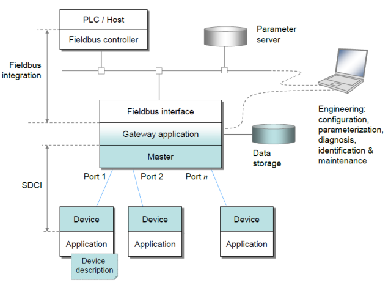
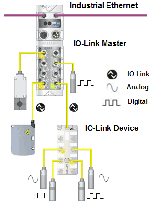
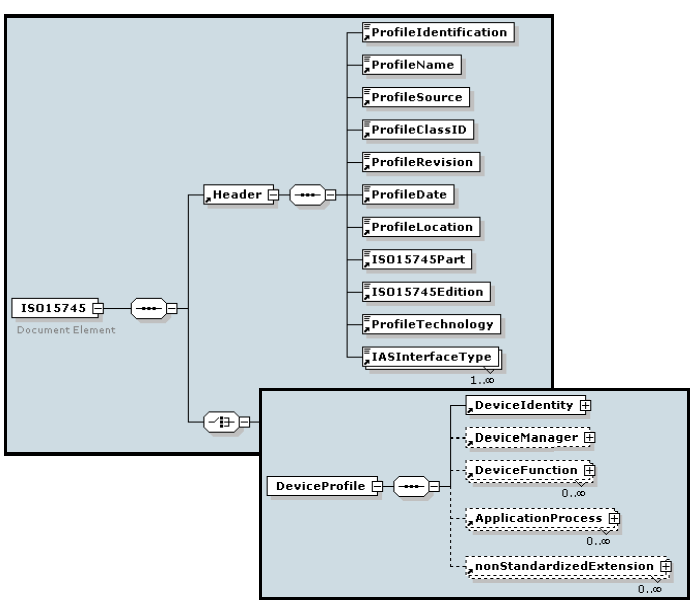
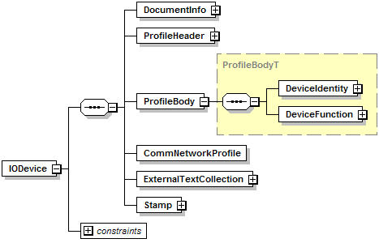
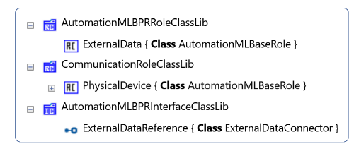
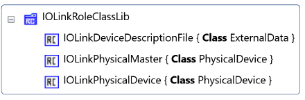
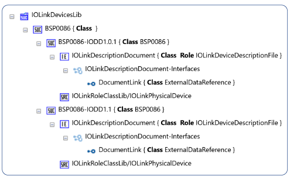
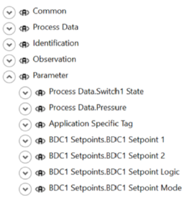
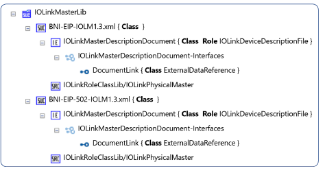
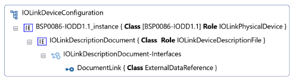

# Моделювання та обмін конфігураціями IO-Link за допомогою AutomationML

Це переклад [Drath, Rainer & Rentschler, Markus. (2018). Modeling and exchange of IO-Link configurations with AutomationML. 1530-1535. 10.1109/COASE.2018.8560422.](https://www.researchgate.net/publication/329612455_Modeling_and_exchange_of_IO-Link_configurations_with_AutomationML/citations)  

Анотація — Мова опису пристроїв (Device Description Language, DDL) є формальною мовою для опису сервісів і параметрів конфігурації польових пристроїв у процесній та дискретній автоматизації. Майже кожна організація, що розробляє промислові мережі, створила власний стандарт, зазвичай адаптований до потреб відповідного інженерного інструментарію цієї мережі.

Однак такі файли опису пристроїв (Device Description, DD) часто є незручними для використання в інструментальних ланцюгах інших виробників та для інших фаз життєвого циклу і не містять необхідної інформації для цих фаз.

У цій статті описано підхід до подолання зазначених недоліків для IO-Link master та пристроїв за допомогою AutomationML.

## I. Вступ

Сучасні польові пристрої для процесної та дискретної автоматизації мають низку параметрів ідентифікації та конфігурації і можуть бути адаптовані до конкретного сценарію застосування. Для цього вони зазвичай оснащуються цифровим комунікаційним інтерфейсом, таким як IO-Link, HART, PROFIBUS, Fieldbus Foundation, Ethernet/IP, PROFINET тощо.

Кожен із цих стандартів зв’язку сформував власну екосистему спеціалізованих програмних інструментів для керування та конфігурування пристроїв, зазвичай на основі підходу Device Description Language (DDL), коли універсальне програмне забезпечення може конфігурувати та керувати різними пристроями шляхом інтерпретації файлу Device Description (DD), пов’язаного з відповідним типом пристрою. Економічна перевага полягає в тому, що створення DD за допомогою DDL потребує значно менших зусиль, ніж розроблення окремого спеціалізованого програмного інструменту.

Новіші формати на основі XML, такі як GSDML, FDCML, ESI та IODD, мають переваги порівняно з традиційними текстовими форматами GSD, EDDL та EDS, оскільки можуть спиратися на схеми моделей даних (XSD) і пов’язані можливості XML-парсерів для перевірки узгодженості як синтаксису, так і семантики.

Коли виникає потреба у використанні польового пристрою, файл DD завантажується та інтерпретується інженерним інструментом, який надає діалогові засоби та функціональність для введення параметрів властивостей з метою конфігурації конкретного пристрою. Усі пристрої одного типу мають однаковий файл DD, проте параметри окремих екземплярів пристроїв можуть мати різні значення залежно від сценарію використання.

Це демонструє чітке розмежування між інформацією про тип і інформацією про конкретний екземпляр пристрою: інформація, специфічна для типу, зберігається в нейтральному файлі DD, тоді як індивідуальні параметри зберігаються у пропрієтарному інженерному інструменті. На жаль, незалежне від інструменту зберігання конфігурації окремих пристроїв протягом їх життєвого циклу не реалізовано.

У цій статті запропоновано метод подолання цієї проблеми на прикладі систем автоматизації IO-Link (див. рис. 1). У розділі 2 коротко пояснюється IO-Link, у розділі 3 наведено огляд пов’язаних робіт, у розділі 4 описано загальні альтернативи розв’язання проблеми, а у розділі 5 представлено запропонований метод. Розділ 6 узагальнює результати та окреслює подальші напрями досліджень.



Рис. 1. Структура системи автоматизації з IO-Link [1]

## II. IO-Link

IO-Link було розроблено консорціумом IO-Link під керівництвом PNO і вперше опубліковано у 2006 році [1]. У 2010 році його інтегровано до стандарту PLC IEC 61131-9 як «Single-drop digital communication interface for small sensors and actuators» (SDCI) [2].

Швидкий ринковий успіх IO-Link призвів до значного зростання кількості проданих пристроїв IO-Link, а також кількості компаній-учасників, що підтримують цей стандарт. У 2017 році понад 140 компаній працювали в межах IO-Link Community над розвитком і просуванням цієї технології. Систематичний подальший розвиток специфікації, зокрема розширення Safety та бездротові розширення, обіцяє появу нових продуктів у майбутньому.

IO-Link — це послідовний комунікаційний протокол, що не базується на TCP/IP, призначений для зв’язку як з аналоговими, так і з дискретними датчиками та виконавчими механізмами на останніх метрах польового рівня. Слід підкреслити, що IO-Link не є промисловою мережею, а є послідовним протоколом типу «точка-точка».

IO-Link підтримує кабельні структури на основі давно усталеного неекранованого трипровідного кабелю для датчиків і виконавчих механізмів та відповідних роз’ємів. Можливі швидкості передавання 4,8 кбіт/с (COM1), 38,4 кбіт/с (COM2) і 230,4 кбіт/с (COM3).

Стандартні 2 байти процесних даних за цикл забезпечують час передавання 400 мкс між IO-Link master та пристроєм у режимі COM3. Для кадрів більшої довжини, до 32 байтів, відповідно збільшуються й тривалості циклів.

Для цифрових входів/виходів підтримується повністю зворотно сумісний режим, так званий SIO-mode.



Рис. 2. Топологія датчиків Ethernet/IO-Link

Окрім можливості передавання циклічних процесних даних, IO-Link містить протокольні механізми для асинхронного обміну даними. Indexed Service Data Units (ISDU) дозволяють користувачеві в режимі «запит–відповідь» отримувати детальну інформацію про пристрій або встановлювати значення параметрів на пристрої IO-Link з метою конфігурації.

Асинхронний механізм подій дає змогу передавати тривожні або інформаційні повідомлення користувачеві в момент їх виникнення без необхідності періодичного опитування.

Деякі елементи даних стандартизовані в межах протоколу (наприклад, версії, тип, серійні номери, тег місця встановлення), а механізм відкритої розширюваності дозволяє виробникам пристроїв означувати додаткові необхідні елементи даних (наприклад, параметри конфігурації, статус або розширену діагностику).

Ця інформація для кожного пристрою IO-Link описується у відповідному файлі IO Device Description (IODD), який може бути легко зчитаний та оброблений користувацькими й прикладними інструментами.

## III. Пов’язані роботи

### A. Технології інтеграції промислових мереж

Огляд проблем інтеграції технологій промислових мереж наведено в [3]. Загальну інтеграцію охоплює стандарт ISO 15745, який забезпечує розвинену модель даних для опису пристроїв (див. рис. 3).

Однією з ранніх спроб застосування ISO 15745 як системно-нейтральної DDL була Field Device Configuration Markup Language (FDCML) [4], однак вона не отримала широкого визнання.



Рис. 3. Онтологія ISO 15745-1

### B. Існуючі стандарти DDL

У цьому розділі коротко представлено деякі існуючі стандарти DDL, див. також [3]. Основною слабкістю цих стандартів є їх несумісність між собою та недостатня придатність для горизонтальної інтеграції й інтеграції протягом життєвого циклу.

1) EDS

Організація ODVA підтримує стандарт Ethernet/IP для промислових мереж, у межах якого Electronic Data Sheets (EDS) описують спосіб використання пристрою в мережі EtherNet/IP.

EDS описує об’єкти, атрибути та сервіси, доступні в пристрої, у вигляді структурованого тексту без використання XML. Файл EDS містить ASCII-представлення параметричних об’єктів пристрою та додаткову інформацію, необхідну для адресації об’єктів.

Файл організовано у вигляді послідовності секцій, кожна з яких починається з назви секції в квадратних дужках (наприклад, [File], [Device] тощо). Усередині кожної секції розміщуються ключові записи. Кожен ключовий запис містить поля, розділені комами. Визначення кожного запису завершується крапкою з комою.

В межах ODVA ведуться обговорення щодо створення XML-орієнтованого формату EDS у майбутньому [5].

2) ESI

Для промислової мережі EtherCAT кожен пристрій EtherCAT має постачатися з файлом EtherCAT Slave Information (ESI) — документом опису пристрою у форматі XML [6].

Структура файлу ESI визначається XML-схемою EtherCATInfo.xsd (див. рис. 3). EtherCAT також є частиною ISO 15745-4.

Інформація про функціональність і налаштування пристрою міститься у файлі ESI, тоді як файл EtherCAT Network Information (ENI) описує топологію мережі, команди ініціалізації для кожного пристрою та команди, які мають передаватися циклічно [7]. Файл ENI передається master-пристрою, який надсилає команди відповідно до цього файлу.

3) GSDML

Характеристики пристрою PROFINET IO описуються виробником у файлі General Station Description (GSD), який надає інженерному та наглядовому програмному забезпеченню основу для конфігурації та моніторингу пристроїв системи PROFINET IO.

Для цього використовується мова GSDML (GSD Markup Language) — мова на основі XML, яка структурно відповідає ISO 15745-1.

4) POWERLINK XDD

Формат Ethernet Powerlink XML Device Description [8] відповідає ISO 15745-1 і визначає такі типи файлів:

Файл визначення профілю (XPD) — це XML-представлення фреймворку POWERLINK, профілю пристрою або прикладного профілю.

Файл опису пристрою (XDD) моделює тип пристрою POWERLINK і використовується як шаблон для створення екземплярів пристроїв у реальній мережевій конфігурації. Файл XDD містить типові (за замовчуванням) значення пристрою, але не містить значень введення в експлуатацію та фактичних значень.

Файл конфігурації пристрою (XDC) описує сконфігурований пристрій POWERLINK і зберігає інформацію для конкретного екземпляра пристрою в певному мережевому середовищі. Файл XDC може містити всю інформацію з XDD разом із фактичними значеннями та/або значеннями введення в експлуатацію.

5) IODD

Кожен пристрій IO-Link має постачатися з файлом IO-Link Device Description (IODD) — документом опису пристрою у форматі XML. IODD відповідає ISO 15745-1.

Спеціалізований формат DD для IO-Link master не визначено консорціумом IO-Link; зазвичай їх опис включається до DD відповідної промислової мережі. Це часто виявляється слабким місцем екосистеми IO-Link з погляду горизонтальної інтеграції та інтеграції протягом життєвого циклу.



Рис. 4. Структура IODD на основі ISO 15745-1

## IV. Підходи до моделювання індивідуальних конфігурацій пристроїв

### A. Підхід 1: розширення стандарту IO-Link

Інтуїтивним підходом до нейтрального моделювання індивідуальних конфігурацій IO-Link є розширення стандарту IODD. Стандарт IODD нового покоління мав би дозволяти моделювати екземпляри пристроїв, похідні від інформації про тип пристрою, а також зберігати дані конкретного екземпляра.

Однак це призвело б до застарівання чинного стандарту IODD та всіх пов’язаних комерційних інженерних інструментів із підтримкою IODD, що потребувало б значних інвестицій у розроблення нового стандарту та адаптацію відповідних інструментів. Важливим чинником успіху будь-якого стандарту є його стабільність, тому стандарт повинен уникати частих змін.

### B. Підхід 2: поєднання IODD з AutomationML

Ідея другого підходу полягає у вирішенні описаної проблеми шляхом залучення вже існуючого стандарту, який додає відсутню функціональність для зберігання та підтримки індивідуальних конфігурацій пристроїв, включаючи параметри та їх конкретні значення, при збереженні стандарту IODD без змін.

Ця концепція має подібність до підходу XDD/XDC у Ethernet Powerlink та підходу ESI/ENI у EtherCAT.

AutomationML надає саме таку функціональність. AutomationML було ініційовано компанією Daimler у 2006 році, а його архітектуру визначено в стандарті IEC 62714, частина 1 [9]. Ключовим елементом AutomationML є легка та розподілена архітектура, яка поєднує найкращі у своєму класі файлові формати для різних доменів [10].

За допомогою CAEX (IEC 62424 [11]) AutomationML дозволяє зберігати об’єктні моделі відповідно до об’єктно-орієнтованої парадигми, включаючи бібліотеки класів, інтерфейси, атрибути, зв’язки та екземпляри, змодельовані в ієрархіях екземплярів. Крім того, він підтримує механізми посилання на зовнішні формати. AutomationML охоплює моделювання геометрії за допомогою формату COLLADA та дискретної логіки за допомогою PLCopen XML.

Механізми AutomationML для посилання на сторонні файли, що містять специфічну інформацію, дозволяють посилатися на IODD, а в майбутньому — й на інші файли DD. Це дає змогу зберегти стандарт IODD без змін, але моделювати інформацію про екземпляри в межах AutomationML. Ця ідея була досліджена авторами та описана в наступному розділі.

## V. Запропоноване рішення

### A. Крок 1: означення ролей, специфічних для IO-Link

На цьому кроці активується можливість AutomationML посилатися на зовнішні файли IODD. Для цього використовуються два класи system unit з набору рекомендацій best practice AutomationML (див. рис. 5): рольові класи ExternalData [12] і PhysicalDevice [13], а також клас інтерфейсу ExternalDataReference [12].

Усі вони походять від базових класів AutomationML, визначених у IEC 62714, частина 1.



Рис. 5. Типові класи AutomationML із набору рекомендацій AML best practice [12][13]

На основі цих наявних класів автори розробили нову бібліотеку рольових класів, специфічну для IO-Link, під назвою IO-LinkRoleClassLib, що містить класи IO-LinkDeviceDescriptionFile, IO-LinkPhysicalMaster та IO-LinkPhysicalDevice (див. рис. 6).



Рис. 6. Нова бібліотека рольових класів AML, специфічна для IO-Link

### B. Крок 2: Бібліотеки AutomationML, що містять інформацію IODD

Використовуючи ці нові ролі, було розроблено нову бібліотеку system unit класів, яка моделює конкретні пристрої IO-Link і безпосередньо посилається на відповідні файли IODD.

На рис. 7 це продемонстровано на прикладі пристрою IO-Link BSP0086 у версіях 1.0.1 та 1.1. Обидва варіанти посилаються на роль IOLinkPhysicalDevice для їх ідентифікації, а також обидва класи містять посилання на відповідний файл IODD через підключений зовнішній інтерфейс із назвою DocumentLink.

Цей інтерфейс моделює прив’язку класу пристрою AML до файлу IODD. Атрибут CAEX refURI цього інтерфейсу вказує на фізичний файл IODD, що реалізує зв’язок між класом пристрою AML і файлом IODD. Атрибут CAEX MIMEType цього інтерфейсу встановлено в значення “application/xml”, що означає, що відповідний файл IODD є XML-файлом.



Рис. 7. Модель пристрою IO-Link із посиланням на зовнішній файл IODD

Після створення посилання на файл IODD усі параметри DD вручну повторно моделюються в класі AutomationML, щоб відобразити їх у просторі AutomationML.

Це означає, що параметри IODD стають доступними в моделі AutomationML і можуть використовуватися в її межах.

На рис. 8 показано частину списку параметрів із файлу IODD, представлених як атрибути AutomationML відповідного класу пристрою.



Рис. 8. Фрагмент атрибутів AutomationML системної одиниці BSP-0086-IODD1.1

Завершальним кроком ці ж самі дії повторюються для моделювання бібліотеки IO-Link master. На рис. 9 це продемонстровано на прикладі двох різних пристроїв IO-Link master.

Обидва класи пов’язані з роллю IO-LinkPhysicalMaster для забезпечення автоматичної ідентифікації відповідних system unit класів.

Хоча це не входить до меж даного дослідження, логічним наступним кроком є автоматичне генерування таких бібліотек шляхом зчитування та перетворення бібліотек IODD і файлів Master-DD (IOLM) у system unit класи AutomationML.

Єдиний уніфікований стандарт IOLM-DD наразі не існує, і в межах подальшого розвитку цієї роботи рекомендовано створити його повністю на основі AutomationML.



Рис. 9. Бібліотека IO-Link master із посиланням на зовнішні файли IOLM

### C. Крок 3: Моделювання індивідуальних конфігурацій за допомогою AML

Після виконання попередніх підготовчих кроків моделювання індивідуальних конфігурацій пристроїв і master-пристроїв IO-Link безпосередньо підтримується засобами AutomationML.

Для цього створюється нова ієрархія екземплярів AutomationML, у межах якої інстанціюється один із system unit класів IO-Link.

На рис. 10 це продемонстровано на прикладі екземпляра пристрою IO-Link BSP0086-IODD1.1. Після створення екземпляра всі властивості та внутрішня інформація класу копіюються до нього, і на цьому рівні в модель AutomationML можуть бути внесені всі індивідуальні значення параметрів із пропрієтарних інженерних інструментів.



Рис. 10. Ієрархія екземплярів AutomationML, що моделює один індивідуальний екземпляр пристрою IO-Link

Отриманий файл AutomationML тепер містить усі необхідні стандартні бібліотеки AutomationML, усі класи пристроїв і master-пристроїв IO-Link, а також індивідуальну конфігурацію. Якщо змінено лише окремі індивідуальні параметри, це виглядає як надмірний обсяг інформації, що зберігається в документі AutomationML.

Для усунення цієї проблеми автори винесли всі рольові класи в окремий файл AutomationML, а всі system unit класи, пов’язані з IO-Link, — в інший окремий файл AutomationML, оскільки ця інформація є загальною для багатьох конфігурацій і має публічний та надлишковий характер.

У підсумковому файлі AutomationML зберігається лише ієрархія екземплярів. Далі, відповідно до правил AutomationML, усі дані, що не відрізняються від визначених у класі, видаляються, і в документі залишаються лише змінені дані.

Отриманий файл AutomationML є стисненою версією, що містить лише релевантну інформацію. Цільовий інструмент, який приймає дані, може автоматично імпортувати такі файли AutomationML і відразу застосувати внесені зміни. На рис. 11 наведено відповідний фрагмент XML-коду AutomationML/CAEX для поточного прикладу, який містить лише необхідну інформацію, а всю бібліотечну інформацію винесено в зовнішні файли AutomationML.

### D. Обговорення та варіанти застосування

Запропонований підхід поєднує переваги концепції IODD щодо інформації про тип і можливості AutomationML для моделювання інформації про конкретні екземпляри.

З одного боку, це створює вигідну ситуацію для спільноти IO-Link, оскільки зберігає чинні добре визначені стандарти IODD і пов’язані екосистеми інженерних інструментів без змін, забезпечуючи інвестиційний захист для зацікавлених сторін і постачальників інструментів.

З іншого боку, це відкриває можливість вирішення описаних проблем, пов’язаних із недостатньою придатністю IO-Link для використання в інструментальних ланцюгах інших фаз життєвого циклу. Коректно розроблені конфігурації пристроїв і master-пристроїв IO-Link тепер можуть зберігатися у форматі AutomationML і в майбутньому можуть бути додатково збагачені, наприклад, даними CAD або іншими модельними даними. Таким чином стає можливим безшовний обмін конфігураціями пристроїв протягом їх життєвого циклу.

Першим і типовим варіантом застосування є експорт і архівування конфігурацій пристроїв у нейтральному форматі з пропрієтарного інженерного інструменту. Це робить дані незалежними від конкретного інструменту та підвищує рівень незалежності від програмного забезпечення. Такий підхід забезпечує інвестиційний захист даних і гарантує їх майбутню читабельність, навіть якщо вони зазвичай зберігаються всередині пропрієтарних інженерних інструментів.

Другим варіантом застосування є передавання цих конфігурацій з одного інженерного інструменту до іншого. Це актуально, коли постачальники виконують конфігурацію у власному спеціалізованому інструменті й повинні передати результат до інженерного інструменту замовника, або коли один інженерний інструмент замінюється іншим.

Третій варіант застосування — розміщення конфігурацій пристроїв на сервері або в хмарі для подальшого повторного використання в інших проєктах, для обміну з клієнтами та службою підтримки, а також для створення нових сервісів і бізнес-моделей у майбутньому інженерному маркетплейсі. Наприклад, у разі заміни пристроїв новими поколіннями хмарний сервіс конфігурації може автоматично підібрати відповідні набори параметрів для налаштування нових пристроїв і за потреби ініціювати уточнювальні запити.

Майбутній варіант застосування в контексті Індустрії 4.0 — це завантаження конфігурацій пристроїв у цифровий двійник (наприклад, OPC UA сервер) майбутнього пристрою або master-пристрою IO-Link для забезпечення доступу до даних з боку програмних сервісів, таких як перевірка узгодженості, сервіси технічного обслуговування або аналіз даних.

Можливості практично необмежені, наведені варіанти застосування є лише початковим переліком.

```xml
<?xml version="1.0" encoding="UTF-8"?>
<CAEXFile 
    FileName="DemoAutomationML_file.aml"
    SchemaVersion="2.15"
    xsi:noNamespaceSchemaLocation="CAEX_ClassModel_V2.15.xsd"
    xmlns:xsi="http://www.w3.org/2001/XMLSchema-instance">

    <AdditionalInformation AutomationMLVersion="2.0">
        <WriterHeader>
            <WriterName>Balluff IO Link Device Manager</WriterName>
            <WriterID>916578CA-FE0D-474E-A4FC-9E1719892369</WriterID>
            <WriterVendor>Balluff GmbH</WriterVendor>
            <WriterVendorURL>www.balluff.com</WriterVendorURL>
            <WriterVersion>4.0.26</WriterVersion>
            <WriterRelease>4.0.26</WriterRelease>
            <LastWritingDateTime>2018-02-08T23:01:24.4712859+01:00</LastWritingDateTime>
            <WriterProjectTitle>Project01</WriterProjectTitle>
            <WriterProjectID>0001</WriterProjectID>
        </WriterHeader>
    </AdditionalInformation>

    <ExternalReference Path="www.demo.de/IOLinkRoleLibraries" Alias="AML1"/>
    <ExternalReference Path="www.demo.de/IOLinkDeviceAndMasterLibraries" Alias="AML2"/>

    <InstanceHierarchy Name="IOLinkDeviceConfiguration">
        <Version>1.0.0</Version>

        <InternalElement 
            Name="BSP0086-IODD1.1_instance"
            RefBaseSystemUnitPath="@AML2/BSP0086/[BSP0086-IODD1.1]"
            ID="c74995c1-9680-4dd4-8ebe-c905d0917298">

            <Attribute Name="Parameter">
                <Attribute 
                    Name="BDC1 Setpoints.BDC1 Setpoint 1"
                    AttributeDataType="xs:string"
                    Unit="bar">
                    <Value>2000</Value>
                </Attribute>

                <Attribute 
                    Name="BDC1 Setpoints.BDC1 Setpoint 2"
                    AttributeDataType="xs:string"
                    Unit="bar">
                    <Value>-1000</Value>
                </Attribute>
            </Attribute>

            <InternalElement 
                Name="IOLinkDescriptionDocument"
                ID="38903e6b-e003-4079-944d-f3bd0e9bf9fe">
                <RoleRequirements 
                    RefBaseRoleClassPath="@AML1/IOLinkRoleClassLib/IOLinkDeviceDescriptionFile"/>
            </InternalElement>

        </InternalElement>
    </InstanceHierarchy>

</CAEXFile>
```

Рис. 11. CAEX XML-код прикладу, що відображає лише релевантні дані

## VI. Підсумки та перспективи

Запропонований підхід усуває проблему, пов’язану з тим, що файли DD здатні зберігати лише інформацію про тип пристрою, але не індивідуальні конфігурації екземплярів. Для створення моделей, придатних для розв’язання всіх задач інтеграції, запропоновано узагальнений підхід на основі AutomationML, який включає специфічні для промислових мереж DDL у вигляді оболонки AutomationML, здатної містити відсутні елементи специфікації, такі як механічна, електрична та конфігураційна інформація.

Загальну проблему було досліджено на прикладі стандарту IO-Link, проте запропоноване рішення може бути застосоване до будь-якого стандарту промислових мереж. У межах трьох кроків файли DD для IO-Link були пов’язані та опубліковані в модельному просторі AutomationML і інстанційовані.

Можливість AutomationML видаляти незмінені дані порівняно з визначенням класу дозволяє легко скоротити XML-код до суті — лише змінених даних. Це робить файли AutomationML компактними та читабельними й підвищує рівень їх прийняття.

Наступним кроком дослідження буде моделювання систем IO-Link master і пристроїв. Подальша розробка здійснюватиметься відповідно до communication white paper AutomationML. Додатковою рекомендацією є автоматичне генерування system unit класів AutomationML шляхом аналізу файлів DD і їх автоматичного перетворення в класи AutomationML.

Зрештою, автори прагнуть представити результати цього дослідження спільноті IO-Link з метою розроблення рекомендацій best practice або відповідних настанов.


1. IO-Link Consortium: "IO-Link Interface and System Specification", Version 1.1.2, July 2013. Available at: http://www.io-link.org

2. IEC 61131-9: Programmable controllers – Part 9: Single-drop digital communication interface for small sensors and actuators (SDCI).

3. Gössling, A.: "Device Information Modeling in Automation – A Computer-Scientific Approach", Doctoral Thesis, February 2014. Available at: https://www.researchgate.net/file.PostFileLoader.html?id=58313ce24048541c3c5430a6&assetKey=AS%3A430379418034176%401479621857067

4. IDA Group: "FDCML 2.0 Specification Version 1.0", 2018. Available at: http://www.fdcml.org

5. Blair, R.: "A Modern Approach to CIP Device Descriptions", ODVA 2015 Industry Conference, October 13–15, 2015, Frisco, Texas, USA. Available at: https://www.odva.org/Portals/0/Library/Conference/2015_ODVA_Conference_Blair_A-Modern-Approach-to-CIP-Device-Descriptions.pdf

6. ETG.2000: EtherCAT Slave Information (ESI) Specification.

7. ETG.2100: EtherCAT Network Information (ENI) Specification.

8. EPSG Draft Standard 301 (EPSG DS 301): Ethernet POWERLINK Communication Profile Specification, Version 1.3.0.

9. IEC 62714: Engineering data exchange format for use in industrial automation systems engineering (AutomationML), 2012.

10. Drath, R.: Data Exchange in Plant Design with AutomationML – Integration with CAEX, PLCopen XML and COLLADA. Springer (VDI-Buch), Heidelberg, 2010.

11. IEC 62424: Representation of process control engineering – Request in P&I diagrams and data exchange between P&ID tools and PCE-CAE tools, August 2009.

12. AutomationML Best Practice Recommendations: ExternalDataReference, Version 1.0.0, 31.01.2017. Available at: https://www.automationml.org/o.red/uploads/dateien/1485865157-BPR%20005E_ExternalDataReference_V1.0.0.zip (checked 11.02.2018).

13. AutomationML Best Practice Recommendations: Communication, Version 1.0.0, 15.05.2017. Available at: https://www.automationml.org/o.red/uploads/dateien/1494834508-WP_Communication_V1.0.0.zip (checked 11.02.2018).