[<- До підрозділу](README.md)		[Коментувати](#feedback)

# CAEX - Computer Aided Engineering eXchange

## Про CAEX

Ефективне проектування технологічних процесів потребує високорозвинених інженерних засобів, які відповідають різним потребам задіяних робочих процесів і підрозділів. Зазвичай такі інженерні засоби спеціалізуються на проектуванні та розробленні різних аспектів об'єкту, наприклад технологічних процесів, проектуванні систем керування технологічними процесами, проектування електроустановок, будівельних споруд, розроблення прикладного ПЗ для SCADA/HMI тощо. Для оптимізації всього інженерного процесу в цілому необхідна ефективна взаємодія між цими інженерними засобами, тобто перенесення проєктних даних і їх синхронізація. Такий обмін потребує стандартизованого формату, який би міг представити систему з усіх потрібних ракурсів. Саме для цього було створено **CAEX** (Computer Aided Engineering Exchange) — це абстрактний об’єктно-орієнтований формат даних на основі XML (читайте [Серіалізація та XML](../../nets/xmljson/xml.md)), який відображає реальні або логічні об’єкти установки у формі об’єктів даних.  

CAEX був спочатку розроблений для обміну даними, що мають значення для задач керування, зокрема між інструментами проєктування технологічного процесу та проєктування автоматизованих систем керування. У 2008-му році він був затверджений у стандарті IEC 62424, який зосереджується на представленні P&ID в форматі CAEX. Тим не менше CAEX є універсальною мовою моделювання для об’єктно-орієнтованих даних. Тобто його елементи мови не обмежені лише галуззю процесного проєктування, а можуть без обмежень використовуватись і в інших сферах, наприклад у електричних установках чи автоматизації будівель. 

Сам стандарт IEC 62424, який наразі має другу редакцію, і націлений на обмін даними, релевантними до P&ID, а сам CAEX означено там в додатку A. У цій частині посібника розглянемо основні ідеї CAEX, в [іншому підрозділі](iec62264.md) зупинимося безпосередньо на стандарті IEC 62424.

На CAEX базується інший стандарт обміну - AutomationML, який затверджено в IEC 62714-1 і має більшу популярність, ніж IEC 62424. AutomationML розглядається у [іншому розділі посібника](aml.md) і все описано нижче, є релевантним до нього, тому варто спочатку ознайомитися з CAEX. 

## CAEX як метамодель

Перед тим, як пояснити що таке CAEX зупинимося на поняттях моделі та метамоделі. **Модель** — це опис певних об’єктів реального світу у зручній для роботи формі. Якщо ми маємо таблицю в Excel або базі даних, у якій записані насоси, їхні характеристики та значення параметрів, то це і є модель. Вона напряму відображає предметну область: тут насос, тут датчик, тут труба. Модель працює з конкретними речами, які ми вимірюємо, рахуємо або проектуємо. Коли ми дивимося на таблицю, де є рядок `Pump-23` і поле `FlowRate = 120`, — це звичайна модель, створена для вирішення конкретної задачі.

**Метамодель** — не описує сам насос і не зберігає його параметри. Замість цього вона означує, які типи об'єктів існують, які властивості можуть мати, як вони пов’язані між собою та які правила формують ці зв’язки. Якщо модель - це таблиця з насосами, то метамодель - це опис правил побудов таблиці та зв'язків комірок. 

Інший приклад. Якщо креслення будинку — це модель, то будівельні норми, що регламентують, які бувають стіни, перекриття, навантаження і типи фундаментів — це метамодель. Модель говорить, “ось фундамент F1”, а метамодель пояснює, що таке фундамент як поняття, які властивості він має, і як його можна використовувати в проекті. Таким чином, модель завжди конкретна, а метамодель — абстрактна. Модель описує речі, а метамодель описує правила, за якими ці речі можна описувати. Модель відповідає на запитання “що тут є?”, а метамодель надає відповідь на запитання “як узагалі можливо щось тут описати?”.

CAEX є метамоделлю для інженерних даних. CAEX не описує конкретний насос, конвеєр або датчик. У мові CAEX немає жодного “Pump-23” чи “Valve-7”.
Замість цього CAEX описує як можна описувати інженерні об’єкти: що таке елемент системи, який у нього тип, які можуть бути атрибути, як виглядає взаємозв’язок між об’єктами, що таке інтерфейс, що таке роль, і як будуються ієрархії. Тобто CAEX не зберігає інженерні дані напряму — він означує правила їх структурування. 

## CAEX як XML-document

Модель CAEX реалізовується як один або кілька файлів XML, в якому представлені:

- об’єкти,
- їхні атрибути,
- ієрархії,
- інтерфейси,
- зв’язки,
- типи та ролі.

Правила побудови моделі означені у файлі XML-схеми `CAEX_ClassModel_V.3.0.xsd`, яку можна завантажити [за посиланням](https://www.automationml.org/about-automationml/publications/amlbook/a-practical-guide/chapter-2-the-caex-and-automationml-guide/). Як вже зазначалося схема CAEX 3.0 стандартизована в додатку A стандарту IEC 62424 Ed.2 і означує структуру всіх типів даних CAEX. Ці будівельні блоки CAEX (далі — елементи CAEX) означують, як саме повинні бути синтаксично структуровані класи, інтерфейси, атрибути, екземпляри та всі інші елементи. Що таке XML-схема можна почитати в розділі посібника [Серіалізація та XML](../../nets/xmljson/xml.md), тут зазначимо що схема використовується для валідації документу моделі, тобто перевірки його на відповідність правилам побудови. Тому якщо буде побудована модель в XML, за схемою можна перевірити її коректність по відношенню до правил CAEX. 

Для перегляду та редагування файлів CAEX можна використовувати як редактори XML (наприклад [XmlNotepad](https://microsoft.github.io/XmlNotepad/) або [XiMpLe XML editor](https://www.ximple.cz)) так і спеціалізовані редактори, зокрема CAEX MDE Workbench, який можна завантажити і встановити [звідси](https://github.com/amlModeling/caex-workbench/tree/master).  Зрештою це може бути і файл типу `*.aml` який відкривається редактором [AutomationML editor](https://www.automationml.org/about-automationml/aml-tools/automationml-editor/). У деяких випадках може зручніше бути працювати через універсальні IDE типу Visual Studio Tools або текстові редактори, такі як Notepad++. Нижче для наглядності демонстрації використовується кілька редакторів XML, і редактор AutomationML editor в якості редактору CAEX.

На рисунку 1 показано приклад структури файлу CAEX у XML редакторі.

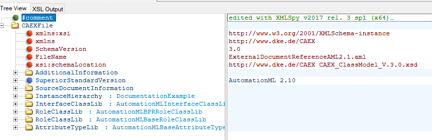 

рис.1. Приклад вигляду структури файлу CAEX у XML редакторі 

Розглянемо основні елементи файлу:

-  `<CAEXFile>` представляє кореневий вузол документа CAEX. Кожен документ XML у тому числі CAEX має лише один кореневий вузол.
- `<SchemaVersion>` відповідає версії файлу схеми CAEX, наприклад `3.0` для останньої актуальної версії
- `<Header>`,  `<FileName>`, та `<SourceDocumentInformation>` використовуються для моделювання організаційної інформації про документ, наприклад, відомостей про версію.
-  `<SuperiorStandardVersion>` вказує на вищестоящий стандарт, який містить додаткові правила або нормативні положення
- `<ExternalReferences>` дозволяє моделювати посилання на зовнішні файли CAEX. Це є основою для поділу моделей об’єктів на кілька файлів і зменшення їхнього розміру шляхом повторного використання бібліотечної інформації, що зберігається окремо.
- `<InstanceHierarchy>` є кореневим вузлом для проєктних даних. Він містить ієрархію екземплярів об’єктів. Можна створювати кілька таких ієрархій. Докладніше про це наведено нижче.
- `<InterfaceClassLib>`, `<RoleClassLib>`, `<SystemUnitClassLib>` і `<AttributeTypeLib>` є контейнерами для моделювання різних типів бібліотек. Вони розширювані та дозволяють створювати бібліотеки користувацьких або нормативних класів.

Перед тим як почати розглядати принципи моделювання в CAEX визначимо кілька фундаментальних понять. 

- **CAEX елементом** будемо називати XML елемент, який означений в CAEX файлі. 
- CAEX дотримується об’єктно-орієнтованої парадигми. Вся інженерна інформація моделюється у вигляді об’єктів або належить до об’єктів. 
- У стандарті, нажаль, часто вживають терміни, які в різних контекстах мають різне значення. Щоб уникнути плутанини, в цьому документів вживаються синоніми до них, про що буде зазначено перед вживанням.

## Вступ до моделювання CAEX

### Представлення об'єктів, їх властивостей та зв'язків

Покажемо формат CAEX на прикладі дуже простого моделювання технологічної установки `ProcessCell1` яка складається з двох ємностей `Tank1` і `Tank2` що зв'язані між собою трубою `Pipe`. Задача моделювання - представити в форматі CAEX властивості установки, її входи/виходи, включені компоненти та їх зв'язки. У загальному технологічну схему можна показати як на рис.2 (вгорі). 

    

рис.2. Приклад модельованої установки (вгорі) і її параметричного представлення (знизу)

У CAEX модель представляється у вигляді **`InstanceHierarchy`** (ієрархія екземплярів) -  це кореневий елемент для системної ієрархії об’єктних екземплярів. Ієрархія екземплярів і є по факту моделлю яка означена в файлі, яка тим не менше може мати зв'язки з бібліотечними  CAEX елементами. Один файл може містити кілька таких моделей, в нашому випадку цю ієрархію назвемо `Production`. На рис.3 показана модель в AutomationML editor, на якому видно кореневий елемент `Production`, який представляє окрему ієрархію в переліку.

Ієрархія `Production` включає в себе об'єкти, які в CAEX представляються як **`InternalElement`**.  Можна вважати що `InternalElement` є типом який представляє компонент структури об'єкта.  `InternalElement` може включати в себе інші `InternalElement`, представляючи таким чином композицію (ієрархію вкладеності) об'єктів. 

У нашому випадку установку можна промоделювати як  4-ри `InternalElement`:  `ProcessCell1` - як вкладений в `Production` , і три включені в нього:  `Tank1` , `Tank2` і `Pipe` (див. рис.3). Необхідність моделювання `Pipe` як окремого об'єкту можна бути пов'язана, наприклад, з описом властивостей трубопроводу, що поєднує ємності. Так чи інакше перелік об'єктів, в яких є потреба в моделюванні, диктується призначенням моделі.       

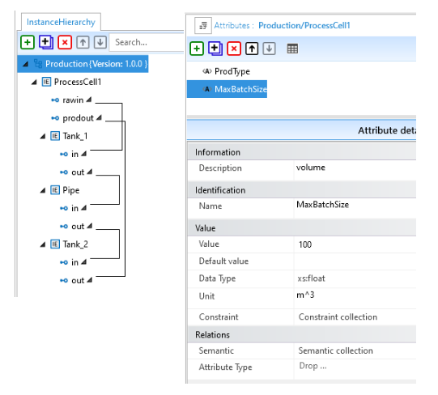

рис.3. Відображення ієрархії екземплярів (ліворуч) та атрибутів (Attributes) 

Для того, щоб показати як компоненти поєднуються між собою, в CAEX передбачений тип **`ExternalInterface`**, який описує зовнішній інтерфейс цих компонентів. У нашому прикладі підключення `ProcessCell1` до інших частин виробництва може відбуватися через `rawin` і `prodout`, які можуть представляти місця підводу і монтажу зовнішніх трубопроводів. Подивіться де це зображено на схемі рис.2 та як це виглядає в моделі на рис.3. Ємності та трубопровід підключаються через з'єднання  `in` та `out`. 

Самі зв'язки між інтерфейсами моделюються за допомогою типу **`InternalLinks`**. На рис.3 в редакторі їх видно через лінії, які поєднують ці інтерфейси. Звісно в XML форматі ніяких ліній немає, це вже представлення конкретних властивостей CAEX елементів в редакторі AutomationML editor. 

Крім самої ієрархії об'єктів та зв'язків між ними модель має містити їх властивості. Для установки `ProcessCell1` це може бути максимальний розмір партії, тип продукту, тощо. Для ємностей це може бути об'єм, тип матеріалу, тощо. В CAEX властивості об'єктів моделюються за допомогою атрибутів (**`Attributes`**). Атрибути CAEX редагуються в AutomationML editor через контекстне вікно об'єкту (рис.3). Варто вже тут зазначити що в XML слово `Attribute` має інше значення, тому не варто їх синонімізувати. 

Описаний вище фрагмент означеної в AutomationML можна завантажити з  репозиторію посібника як [CAEXdemo1_1.aml](CAEXdemo1_1.aml). Її можна відкрити AutomationML редактором або XML редактором. На рис.4 показаний вигляд моделі в XML редакторі. На основі отриманої інформації спробуйте зрозуміти призначення кожного XML елемента.

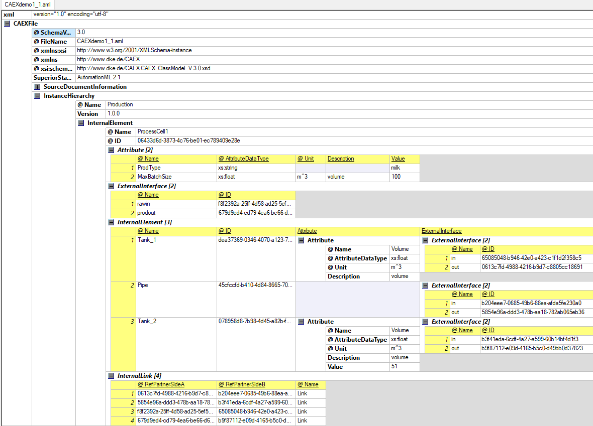

рис.4. Вигляд моделі в XML редакторі (XiMpLe XML editor)

Маючи модель в 3-х виглядах рис.2 - рис.4 давайте розберемо деякі фундаментальні основи CAEX. Нижче вони будуть розглядатися більш детально.

### Ієрархія Екземплярів (`InstanceHierarchy`)

Ієрархії екземплярів CAEX використовуються для зберігання індивідуальної та проєктної інженерної інформації. Вони становлять ядро об’єктної моделі та містять усі об’єкти даних, включно з властивостями, інтерфейсами, зв’язками та посиланнями. Елемент CAEX типу `<InstanceHierarchy>` є кореневим вузлом конкретної моделі та охоплює всі необхідні рівні ієрархії та об’єкти в ній. Він відображає топологію конкретної установки, підсистеми або її окремих уявлень, включно з внутрішніми зв’язками. 

CAEX підтримує кілька ієрархій екземплярів, тобто кілька елементів CAEX типу `<InstanceHierarchy>`. Це може бути корисно наприклад для:

- представлення однієї і тієї установки в різних проекціях - функційної, продуктної або просторового розміщення
- представляти окремі ієрархії: механічна структура, електрична структура, структура керування (PLC, сигнали)
- для великих моделей представляти різні масштаби

Хоч це різні моделі в одному документі CAEX, вони можуть бути зв'язані логічно. У будь якому випадку в CAEX немає обмежень щодо цього.

Екземпляри означуються в ієрархії екземплярів у вигляді вкладених `InternalElements`, які формують дерево об’єктів. Для кожного окремого об’єкта всі необхідні атрибути, інтерфейси та зв’язки означаються на рівні самого екземпляра. 

У той же часто багато об'єктів мають подібну структуру. Наприклад в наведеному вище прикладі `Tank1` і `Tank2` мають однакову структуру, тобто набір атрибутів та інтерфейсів. У цьому випадку у CAEX пропонується використання класів системних одиниць  `SystemUnitClasses`, які є прототипами для `InternalElements` в  `InstanceHierarchy`. Тобто екземпляри створюються на базі класів і залишаються зв'язаними з ними. Це дає можливість з одного боку добавляти в екземпляр нові елементи, а з іншого боку у будь який момент часу оновити екземпляр змінами в класі. Класи переносяться також з екземплярами.  `SystemUnitClasses` також складаються з  `InternalElements`. Детальніше про `SystemUnitClasses` наводиться нижче.

### Внутрішній Елемент (`InternalElement`)

`InternalElement` представляє об'єкт моделювання. Він є тим компонентом, за допомогою яких представляється внутрішня структура.  Внутрішній елмент може включати:  

- `Attributes`: для означення властивостей об’єкта
- `ExternalInterfaces`: для означення інтерфейсів об’єкта, через які відбувається зв'язок між ними
- `InternalLinks`:  для означення зв’язків між інтерфейсами
- інші `InternalElements`: для означення структури через вкладені внутрішні елементи
- `SupportedRoleClass`: для означення ролей через підтримувані класи ролей `RoleClass`

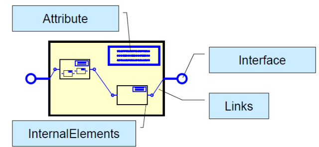

рис.5. Архітектура `InternalElement` та `SystemUnitClass` (Рисунок взятий зі стандарту IEC 62424 Ed.2)

Екземпляри `InternalElements` унікально ідентифікуються за полем унікального ідентифікатору (`ID`). Крім того, що він має бути унікальним в межах документу, після створення його не можна змінювати протягом життєвого циклу об’єкта. Щоб це забезпечити, рекомендується використовувати універсальний унікальний ідентифікатор (`UUID`) відповідно до ISO/IEC 9834-8 або дотримуватися унікальної схеми найменувань, яка гарантує унікальність не тільки в документі але і у часі. Можливою реалізацією UUID є глобальний унікальний ідентифікатор (`GUID`).  Якщо якийсь інший об'єкт посилається на екземпляр об’єкта `InternalElement` повинно використовувати його значення `ID`. 

У той же час інше поле імені (`Name`) - є відображуваним іменем і має лише інформаційний характер. Він може змінюватися з часом або залежно від інструментального засобу, тому в документі Внутрішні Елементи можуть мати однакові імена. 

Тут варто зауважити, що в стандарті IEC 62424 замість слова "поле" у ряді місць вжито термін "тег" ("tag") а в деяких "елемент". Однак термін "tag" в XML має інше призначення і це може внести плутанину. А термін елемент навіть в IEC 62424 має кілька трактувань. Тому в цьому та інших розділах посібника вживається слово "**поле**", яке в AutomationML editor можна передивитися і змінити через закладку `Header` або `Atribute details`. На рис.6 показані поля `InternalElement`  з іменем`Tank_1` та унікальним `ID`.     

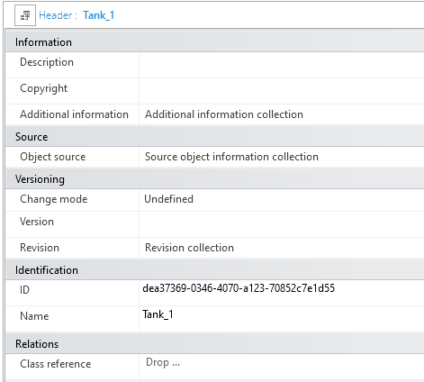

рис.6. Приклад значень полів заголовку `InternalElement` в AutomationML editor

### Атрибут `Attribute`

Атрибути означують властивості об’єкта. Кожен Атрибут має ім'я та значення. Нагадуємо що слово "атрибут" в XML має зовсім інше значення, хоча певну схожість щодо призначення вони мають. Тим не менше, `Attributes` в CAEX в XML нотації є окремими XML-елементами. 

Атрибути можуть бути як в `InternalElement` так і `ExternalInterface` так і в самих `Attribute` (вкладені атрибути). Також вони можуть бути і в деяких інших CAEX елементах, які будуть розглянуті нижче.  

CAEX означує багато полів для атрибутів, тут розглянемо тільки базові, інші розглянуто нижче. 

- `Name` ім'я атрибута, яке має бути унікальне в межах об’єкта
- `Value` (значення): цей елемент дозволяє задати значення властивості, наприклад `3.5`. Десяткові роздільники повинні вибиратися відповідно до означення `AttributeDataType`; наприклад, `xs:float` вимагає використання крапки `.` як десяткового роздільника.
- `Unit` (одиниця вимірювання): цей елемент означує одиницю вимірювання атрибута, наприклад `m`.
- `AttributeDataType` (тип даних атрибута): цей елемент означує тип даних атрибута. Детальніше типи даних атрибута розглядається нижче. 

На рис.7 показаний приклад атрибутів, показані в AutomationML editor та в редакторі XML

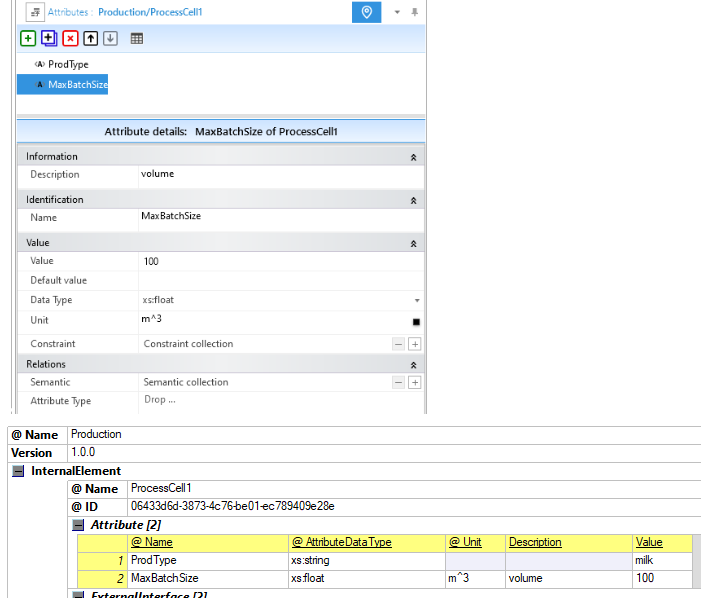

рис.7. Представлення атрибутів в AutomationML editor (вгорі) та в редакторі XML (XiMpLe XML editor)

### Зовнішній Інтерфейс `ExternalInterface` та Внутрішній Зв'язок `InternalLink`

Зовнішній Інтерфейс (`ExternalInterface`) представляє можливості об'єктів зв'язку з іншими об'єктами. Як і Внутрішній Елемент ідентифікація Зовнішнього Інтерфейсу проводиться через унікальний `ID`, за допомогою яких відбувається зв'язок. Перелік полів Зовнішніх інтерфейсів з нашого прикладу показаний на рис.8.     

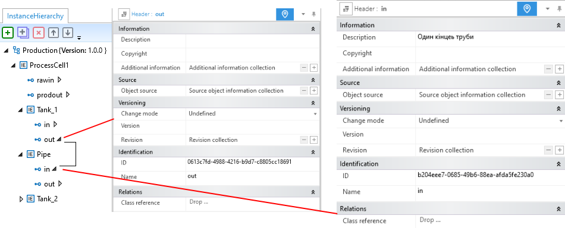

рис.8. Відображення налаштувань `ExternalInterfaces` та зв'язки `InternalLinks` у AutomationML editor

Для зв'язки між інтерфейсами існують Внутрішні Зв'язки (`InternalLinks`). Ці елементи CAEX вкладені в `InternalElement` а не в Зовнішній Інтерфейс, тому мають бути всередині нього. Тобто `InternalLinks` є дійсно внутрішніми для конкретного екземпляра `InternalElement`. У редакторі AutomationML editor ці зв'язки можна показати або сховати (рис.8). Представляються зв'язки через поля `RefPartnerSideA` та `RefPartnerSideB`, в яких вказуються `ID` тих Зовнішніх Інтерфейсів, які він з'єднує між собою. Подивіться на рис.9 як це виглядає в XML.   

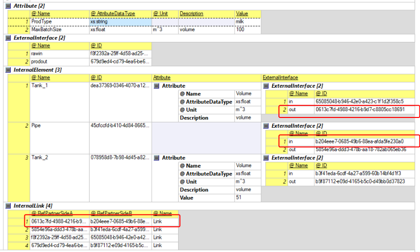

рис.9.  Відображення налаштувань `ExternalInterfaces` та зв'язки `InternalLinks`  в редакторі XML

В стандарті означені наступні властивості CAEX, що стосуються Внутрішніх Зв’язків:

- посилання CAEX повинно з’єднувати пару відповідних інтерфейсів за допомогою їхніх ідентифікаторів (`ID`);
- зв’язки CAEX не мають напрямку;
- дозволяються зв’язки між різними рівнями ієрархії;
- зв’язки CAEX не мають типу даних; якщо це потрібно, типи даних повинні бути призначені окремо відповідним інтерфейсам, але CAEX не означeє цього явно$
- CAEX не забезпечує перевірку узгодженості зв’язків; некоректні зв’язки мають бути виявлені вихідним або цільовим інструментом;
- якщо хоча б одна сторона зв’язку невідома або не означена, відповідний атрибут `RefPartnerSideA` або `RefPartnerSideB` повинен бути порожнім рядком.

## Об’єктно-орієнтовані концепції в CAEX

У цьому розділі ми продовжимо розглядати інші елементи CAEX, які пов'язані з об'єктно-орієнтованими концепціями. Для початку розглянемо ці концепції, потім поступово будемо розглядати елементи через які вони реалізуються. Варто зауважити, що ці концепції хоч і мають певну асоціативність з подібними в програмуванні, треба сприймати їх як саме концепції моделювання.     

### Класи та бібліотеки в CAEX

В CAEX використовуються такі об’єктно-орієнтовані концепції:

- інкапсуляція - всі властивості, інтерфейси, ролі та вкладені елементи описуються всередині відповідного CAEX-об’єкта (наприклад, `InternalElement` або `SystemUnitClass`) і не існують окремо від нього.
- класи та бібліотеки класів - типові описи об’єктів формалізуються у вигляді класів (`SystemUnitClass`, `RoleClass`, `InterfaceClass`, `AttributeType`), які організовуються у відповідних бібліотеках для повторного використання.
- екземпляри та ієрархії екземплярів - CAEX розрізняє типи та їх використання, де конкретні об’єкти моделі задаються як екземпляри (`InternalElement`), структуровані в `InstanceHierarchy`.
- наслідування - використовується між класами в межах бібліотек, дозволяючи похідним класам автоматично успадковувати атрибути, інтерфейси та вкладені структури базових класів.
- зв’язки - CAEX підтримує явні зв’язки між об’єктами через `InternalLink`, що дозволяє моделювати логічні, фізичні або інформаційні відношення незалежно від ієрархії.
- атрибути та типи атрибутів - характеристики об’єктів задаються Атрибутами, при цьому їх структура, семантика та допустимі значення означуються через `AttributeType`.
- бібліотеки типів атрибутів та інтерфейси - CAEX використовує бібліотеки типів атрибутів і бібліотеки інтерфейсів для уніфікованого опису семантики даних і точок взаємодії між об’єктами в різних інженерних дисциплінах.

Деякі з наведених вище концепцій вже були розглянуті, нижче в цьому розділі поступово будуть розкриватися інші.

**Клас CAEX** представляє повторно використовувану модель даних (шаблон) реального фізичного або логічного об’єкта й моделюється у вигляді різними типами класів, в залежності від призначення: 

- `SystemUnitClass` – використовується для прототипування технічних об’єктів і описує їх внутрішню структуру, складові елементи, інтерфейси та атрибути.
- `RoleClass` – призначений для семантичної класифікації об’єктів і означує їх функціональну або концептуальну роль незалежно від конкретної реалізації.
- `InterfaceClass` – описує типізовані точки взаємодії об’єктів і використовується для формалізації можливих з’єднань між ними.
- `AttributeType` – задає тип, семантику та обмеження атрибутів, забезпечуючи уніфікований опис властивостей у різних класах і екземплярах CAEX.

**Екземпляри** — це конкретні індивідуальні об’єкти, які можуть наслідувати властивості класів, якщо вони з ними пов'язані.

Класи об'єднуються у бібліотеки, які по факту є каталогами класів, що містять повторно використовувані класи. Ці класи можуть бути деталізовані за допомогою зв’язків усередині бібліотек, наприклад через наслідування або агрегацію (розглядається нижче). Відповідно до типів класів, у CAEX розрізняє кілька типів бібліотек: `<SystemUnitClassLib>`, `<RoleClassLib>`, `<InterfaceClassLib>` , `<AttributeTypeLib>` 

CAEX дозволяє моделювати будь-яку кількість таких бібліотек, де окремі класи можуть бути організовані в ієрархію всередині своєї бібліотеки, наприклад для створення користувацької деревоподібної структури. Водночас відношення типу «батько-дочірній» між класами не має власної семантики. Це означає, що класи одного типу можуть наслідувати один від одного та таким чином формувати ієрархії класів — навіть між різними бібліотеками або документами CAEX.

Класи та типи CAEX означуються за допомогою поля `Name`, яке має бути унікальним серед об’єктів одного рівня. 

Для демонстрації різних відношень спочатку розглянемо один з класів - `SystemUnitClass`.

### `SystemUnitClass`

`SystemUnitClass` є прототипом, який можна використовувати для створення екземплярів. Структура `SystemUnitClass` подібна до `InternalElement` за винятком того, що `SystemUnitClass` використовується виключно для прототипування (через копіювання) і має додаткову можливість наслідування.  `SystemUnitClass` у свою чергу може вміщувати `InternalElement` , тому `SystemUnitClass`  може виступати прототипом для ієрархічних об'єктів. 

На рис.10 показано приклад, на якому представлено бібліотеку `SystemUnitClassLib` під назвою `ProcessEngineeringClassLib`, яка містить два класи.

- Клас `TankClass` показує структуру простого `SystemUnitClass` із означеними користувачем атрибутами.
- Клас `TankSystemClass` агрегує два об’єкти `T1` і `T2`, які базуються на `TankClass`. Обидва об’єкти успадковують атрибути класу `TankClass`. `T1` задає значення успадкованого атрибута `V`. 


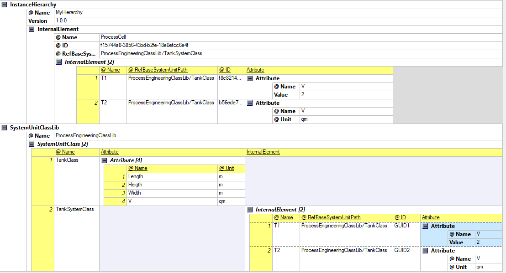

рис.10. Приклад `SystemUnitClass` та посилання на нього з ієрархії екземплярів та інших System Unit.

На рис.10 видно що `ProcessCell` має зв'язок з `SystemUnitClass` з іменем `TankSystemClass` через поле `ClassRefernece` в якому вказане посилання. Подібний синтаксис посилання використовується і для інших зв'язків. Розглянемо як формуються такі посилання.    

### Формування шляхів для посилань

Посилання на класи/типи здійснюється через повні шляхи. Між різними елементами шляху потрібно означити роздільники. CAEX розрізняє два типи роздільників:

- роздільник псевдоніма для зовнішніх посилань в інших файлах (використовується після псевдоніма): `@`
- роздільник об’єктів (використовується між ієрархічними елементами): `/`

Використовуються наступні правила для формування посилань:

- Повний шлях до класу або типу атрибута повинен містити:
  - за наявності, псевдонім, за яким слідує роздільник псевдоніма `@`;
  - назву бібліотеки, за якою слідує роздільник об’єктів `/`;
  - назви всіх батьківських елементів, розділені символом `/`;
  - назву класу або типу, також розділену символом `/`.
- Повний шлях до атрибута класу або типу повинен містити:
  - повний шлях до відповідного об’єкта;
  - у випадку вкладеного атрибута — назви всіх батьківських атрибутів, розділені символом `/`;
  - назву самого атрибута, розділену символом `/`.
- Повний шлях до екземпляра об’єкта повинен складатися з ID цього екземпляра.
- Повний шлях до атрибута екземпляра об’єкта повинен містити:
  - ID екземпляра, за яким слідує роздільник `/`;
  - у випадку вкладеного атрибута — назви всіх батьківських атрибутів, розділені символом `/`;
  - назву атрибута, розділену символом `/`.
- Допускається короткий шлях, якщо клас або атрибут, на який є посилання, розташований на наступному верхньому рівні ієрархії. Такий шлях повинен містити лише назву класу, типу атрибута або самого атрибута.
- Якщо означені роздільники потенційно можуть бути частиною назв об’єктів, слід використовувати таку синтаксичну форму: усі елементи шляху мають бути відокремлені квадратними дужками `[<назва>]`. Це дозволяє використовувати оригінальні назви та водночас означені роздільники.
- Якщо виникає конфлікт, коли такі дужки є частиною назв об’єктів, дужки в іменах об’єктів повинні екрануватися за допомогою стандартних escape-послідовностей XML.
- Використання дужок дозволяється навіть без наявності конфлікту.
- CAEX не перевіряє коректність шляху, ані використання нормативних роздільників, ані існування об’єкта, на який здійснено посилання. Відповідність цьому стандарту вимагає правильного використання шляхів і визначених роздільників.

 Приклади шляхів:

- Повний шлях до класу в бібліотеці: `ProcessEngineeringClassLib/Tank`
- Повний шлях до класу в бібліотеці з використанням квадратних дужок: `[DemoLib]/[Tank/@01]`
- Повний шлях до класу з використанням псевдоніма: `ExternalLibAlias@ClassLib/PipeClass`
- Повний шлях до атрибута класу: `ProcessEngineeringClassLib/Tank/height`
- Повний шлях до типу атрибута: `MyAliasTypeLib/BaseAttributes/SpecialStringAttribute`
- Короткий шлях до класу на наступному верхньому рівні ієрархії бібліотеки: `C_Tank`
- Короткий шлях до атрибута ролі в об’єкті Mapping: `Speed`
- Повний шлях до атрибута інтерфейсу в об’єкті MappingObject: `ID1/Speed`

### Різні типи відношення між об'єктами CAEX 

Тепер коли ми розглянули посилання на прикладі `SystemUnitClass` розберемо різні типи відношень між об'єктами. 

#### Відношення композиції

Вище ми розглядали відношення між `InternalElement` через **композицію**, тобто включення одних `InternalElement` в інші. Таке включення в ієрархії екземплярів відображає топологію конкретної установки, підсистеми або її окремих уявлень, включно з внутрішніми зв’язками. Те саме можна сказати про включення в `SystemUnitClass` елементів  `InternalElement`, тільки тепер цей `SystemUnitClass` є прототипом ієрархічного об'єкту, за яким буде створюватися екземпляр. На рис.11 показаний `SystemUnitClass` з іменем `TankSystemClass` який включає внутрішні елементи `T1` і `T2`, тобто входять до його складу. 

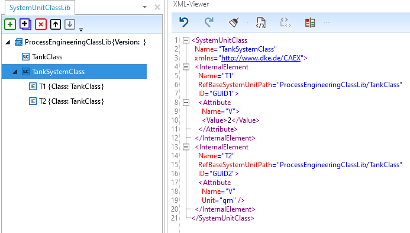

рис.11. Приклад композиції.

У той же час `SystemUnitClass` можуть включати в себе інші  `SystemUnitClass` і організовані в бібліотеці у вигляді дерева. Це включення відбувається на рівні XML-дерева, і впливає виключно на організацію посилання на них за шляхом (path). Тобто воно передусім потрібно для зручності організації бібліотеки (групування, класифікація), і ніяк не впливає на відношення між `SystemUnitClass`. Те саме стосується вкладеності інших типів класів (`RoleClass`, `InterfaceClass`, `AttributeType`).

На рис.12. показаний приклад подібної організації, яке організовує ієрархічність посилань. Так, наприклад, екземпляр, який буде посилатися на `SystemUnitClass` з іменем `PXC.3211813` матиме поле `ClassReference = "[EPLAN_Sample_Project]/[Електротехніка]/[Клеми]/[PXC.3211813]"`

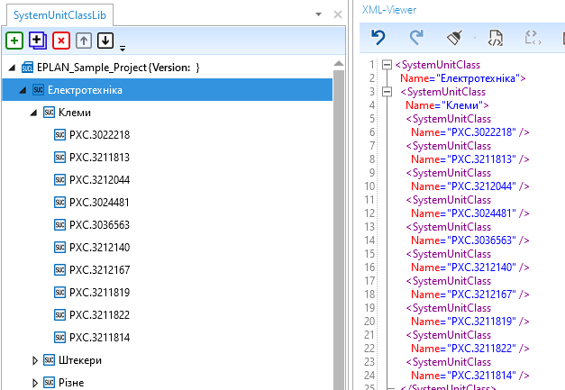

рис.12. Приклад організації бібліотеки шляхом включення класів один в одного.

#### Відношення клас-екземпляр

Коли на базі прототипу класу створюється **екземпляр**, то весь зміст класу-прототипу копіюється в екземпляр і з класом залишається зв'язок. Посилання на клас прототипу в екземплярі вказується в полі `RefBaseSystemUnitPath`.  На рис.13 видно, як CAE елементи `T1` та `T2` посилаються на клас через `RefBaseSystemUnitPath="ProcessEngineeringClassLib/TankClass"`, а `ProcessCell` в ієрархії екземплярів -       `RefBaseSystemUnitPath="ProcessEngineeringClassLib/TankSystemClass"`.

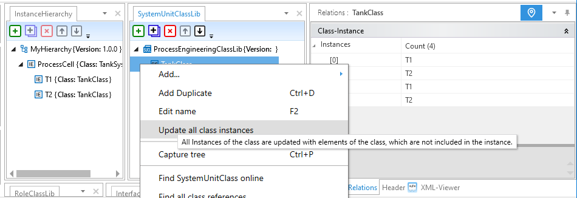

рис.13. Перегляд відношень у AutomationML editor

Варто зауважити що при цьому відбувається тільки копіювання, тобто зв’язок між класом і екземпляром не є відношенням наслідування, яке розглянуто нижче. Після процесу копіювання екземпляр може змінюватися довільним чином. Якщо вихідний клас на який посилається екземпляр змінюється, це не призводить до автоматичних змін у самому екземплярі. Процес відображення або оновлення даних екземпляра відповідно до зміненого вихідного класу є функцією програмного інструменту і не входить до сфери дії вимог CAEX. Поточний шлях до вихідного класу лише підтримує таку можливість. На рис.13 показано як процес оновлення  реалізовано у AutomationML editor - через контекстне меню класу або екземпляру. 

Цей шаблонно-орієнтований підхід до об’єктної моделі відрізняється від класичного об’єктно-орієнтованого програмування, але є необхідним у сфері інжинірингу. CAEX рекомендує, щоб зміни у випущеному класі моделювалися як нова версія класу, яка посилається на попередню за допомогою поля `OldVersion`. Це дозволяє відстежувати зміни у бібліотеках класів під час обміну даними.

Поле `RefBaseSystemUnitPath` не обов’язково має посилатися на клас — він може також посилатися і на екземпляр шляхом дзеркалювання. Про це детально написано нижче. 

Хоча ми познайомилися поки лише з `SystemUnitClass`, відношення клас-екземпляр має стосунок і до інших типів класів. Для зручності пошуку, тут наводяться правила моделювання для відношень клас–екземпляр усіх типів класів, хоча самі класи розглядаються нижче:

- Якщо `<InternalElement>` має відношення екземпляр-клас із `SystemUnitClass`,  він спочатку створюється як копія цього класу, включно з його внутрішньою архітектурою та всією успадкованою інформацією на момент створення. У AutomationML editor наприклад для цього він просто перетягується у відповідне місце ієрархії. Для подальшого використання вихідний клас зберігається у екземплярі в полі `RefBaseSystemUnitPath` у вигляді шляху. Це поле містить повний шлях і назву вихідного класу. Може бути вказано лише один `SystemUnitClass`. Клас у цьому випадку виступає як шаблон.
- Якщо  `<ExternalInterface>` має відношення екземпляр-клас із `InterfaceClass`, він створюється як копія цього класу, включно з його внутрішніми елементами та всією успадкованою інформацією. Для подальшого використання вихідний клас зазначається у полі CAEX `RefBaseClassPath` елемента `<ExternalInterface>`. Поле містить повний шлях і назву вихідного класу. Може бути вказано лише один `InterfaceClass`.
-  Зв’язок між `<InternalElement>` і `RoleClass` задається через поле `RefBaseRoleClassPath` у відповідному елементі `<RoleRequirement>`. Усі специфікації `RoleClass` мають бути скопійовані у відповідний об’єкт CAEX. Якщо атрибут класу ролі не має значення, його можна вилучити з даних екземпляра.
- Зв’язок між `Attribute` і `AttributeType` задається через поле CAEX `RefAttributeType`. Усі специфікації типу мають бути скопійовані у відповідний атрибут CAEX. Якщо атрибут у типі не має значення, його можна вилучити з екземпляра.
- Під час копіювання даних класу до екземпляра всі об’єкти, які мають ідентифікатор `ID`, повинні отримати новий унікальний `ID`. Сам клас при цьому не змінюється. Усі посилання, що використовують старі `ID`, потрібно оновити у всьому документі CAEX.
- Дозволене розширення (добавлення складових) або скорочення (видалення складових) даних екземпляра порівняно з вихідним класом .

#### Відношення наслідування

CAEX підтримує **наслідування** між двома класами, яка передбачає успадкування нащадком всього змісту батьківського класу. Наслідування означає, що всі наявні атрибути, інтерфейси, внутрішні елементи, об’єкти зіставлення та інший вміст батьківського і надбатьківського класів автоматично присутні в об’єктах нащадках.

Наслідування означується через посилання: кожен клас CAEX має поле `RefBaseClassPath`, який указує шлях до відповідного батьківського класу. Концепція наслідування є однаковою для усіх класів  `InterfaceClasses`, `RoleClasses`, `SystemUnitClasses` і `AttributeTypes`. 

На рис.14 показаний приклад, в якому клас `SpecialRobotClass` який має власний атрибут `Weight` наслідує клас `RobotClass`, який має три властивості `Length`, `Height` та `Widht`. На екранному знімку з AutomationML editor видно що нащадок успадковує ці атрибути, це відображається зеленими стрілками. Ці атрибути не можна видалити з нащадка, бо вони зв'язані з батьківським класом.     

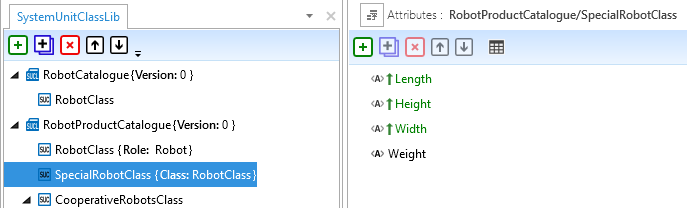 

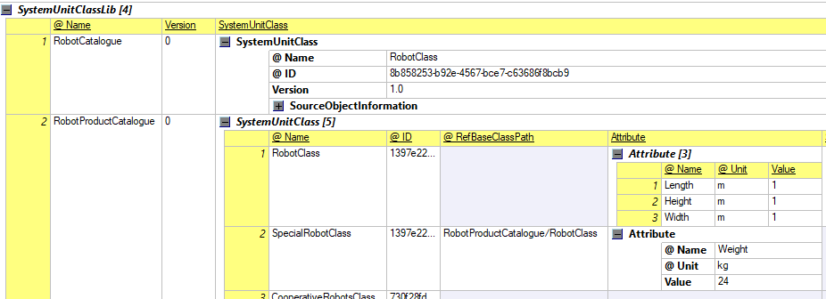

рис.14.  Приклад наслідування класів `SystemUnitClass`

Відношення наслідування має стосунок до всіх типів класів. Для зручності пошуку, тут наводяться правила моделювання для усіх типів класів, хоча самі класи розглядаються нижче:

- Наслідування дозволене між класами одного типу. Перехресне наслідування не допускається; наприклад, `SystemUnitClass` може успадковувати лише від іншого `SystemUnitClass`.
- Клас може мати будь-яку кількість класів нащадків, але лише один батьківський. Усі зміни в батьківському класі автоматично відображаються у всіх класах нащадків. 

- Успадковані класи можуть бути розширені на рівні класу новими атрибутами, інтерфейсами тощо. 

- Успадковані дані дійсні для класу нащадку й за потреби можуть бути фізично скопійовані до нього. Повторне означення та збереження вже успадкованих даних можливе й корисне для переозначення або розширення наявної інформації. Якщо дані фізично скопійовані з батьківського класу до нащадка й пізніше змінені в батьківському, скопійовані дані класу нащадка слід оновити.

- Переозначення властивостей, що успадковуються, можливе шляхом повторного означення відповідних даних із оновленими значеннями у класі нащадка. Поки для атрибутів означені обмеження у батьківському класі, переозначені дані повинні відповідати цим вимогам.

- Видалення успадкованих даних можливе шляхом повторного означення відповідних даних у класі нащадка з атрибутом `ChangeMode`, установленим у значення `deleted`.

- Наслідування підтримується лінійно. Таким чином CAEX дозволяє означувати ланцюги "батьків" і нащадків ("дітей" і "онуків") будь-якої глибини, де "онук" успадковує від батьків і дідусів.

- Якщо використовується наслідування, батьківський клас задається через повний шлях до нього в полі CAEX `RefBaseClassPath`. Потрібно переконатися, що зазначений клас існує та є дійсним.

- Якщо бажаний батьківський клас розташований на один рівень вище за нащадка, в полі `RefBaseClassPath` можна вказати лише його ім’я, без необхідності повного шляху.

- Наслідування є необов’язковим. Якщо воно не потрібне, атрибут посилання `RefBaseClassPath` може бути порожнім або відсутнім.

- Клас не може наслідувати сам себе або свій власний похідний клас.

- CAEX не виконує перевірку узгодженості відношень наслідування чи наявності посилань на дійсні елементи.

#### Відношення екземпляр–екземпляр між інтерфейсами CAEX

Відношення між екземплярами об’єктів моделюються шляхом з’єднання їхніх інтерфейсів `<ExternalInterface>` через елементи `<InternalLink>`.  Цей тип зв'язку розглянуто вище. 

#### Відношення екземпляр–екземпляр — концепція «дзеркала»

CAEX підтримує моделювання кількох ієрархій одночасно. Оскільки різні ієрархічні структури можуть по-різному відображати одні й ті самі дані, може виникнути потреба, щоб один і той самий екземпляр належав до кількох ієрархій. Це реалізується через так звану «дзеркальну концепцію» (*mirror concept*). Екземпляр, на який здійснюється посилання, називається **master object**, а об’єкт, який на нього посилається, — **mirror object** (дзеркальний об’єкт). Обидва розглядаються як ідентичні, однак зміни дозволяється вносити лише до оригіналу — ці зміни потім «віддзеркалюються» у Mirror Object. 

На рис.15 цей принцип пояснено на прикладі двох структур `LocationHierarchy` і `ResourceHierarchy` та відповідної бібліотеки класів системних одиниць `DemoLib`. Внутрішній елемент `Tank1` є екземпляром класу `C_Tank`. Цей об’єкт має друге представлення — `Tank1`, яке розташоване в іншій ієрархії. У той час як основний об’єкт `Tank1` посилається на свій клас `C_Tank`, об’єкт `Tank1` посилається на внутрішній елемент `Tank1`. Таким чином, `Tank1` виступає як «основний об’єкт» (`master object`), а `Tank1` — як «дзеркальний об’єкт» (*mirror object*). У результаті один і той самий об’єкт CAEX присутній у двох різних місцях ієрархії.

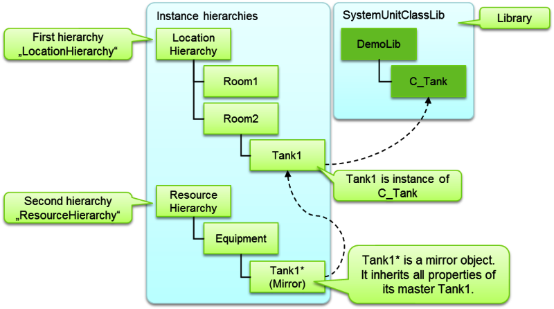

Рис. 15. Перехресні структури (джерело IEC 62424)

Концепцію «дзеркала» можна застосовувати аналогічно і до інтерфейсів CAEX, і до атрибутів. На риc.16 це показано на прикладі атрибутів `Price` об’єктів `Tank` і `Pump`. Ті самі ціни змодельовано в іншій ієрархії в об’єкті `Prices`, який посилається на відповідні основні атрибути (`master attributes`). Крім того, цей рисунок демонструє, як дзеркальні об’єкти можуть бути перебудовані в альтернативну структуру. Однак, за означенням, усі дзеркальні об’єкти завжди є листками (`leaves`) в дереві об’єктів.

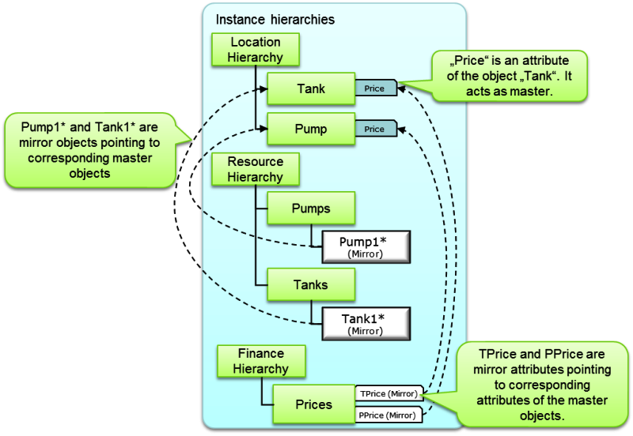

Рис.16. Приклад дзеркальних атрибутів і перебудованих дзеркальних об’єктів (джерело IEC 62424)

Нижче наведені правила моделювання для концепції «дзеркала»:

- Якщо потрібно більше ніж одне представлення елемента CAEX `<InternalElement>`, `<ExternalInterface>` або `<Attribute>`, кожне з них має бути змодельоване як окремий відповідний елемент CAEX у потрібному місці.
  - Один із них повинен виступати як «основний об’єкт» (*master object*). Основний об’єкт містить усю необхідну інформацію, таку як заголовок, атрибути, інтерфейси та внутрішні елементи, і може мати відношення клас–екземпляр до класу або типу CAEX.
  - Інші об’єкти виступають як «дзеркальні об’єкти» (*mirror objects*) і посилаються на основний об’єкт. Дзеркальний об’єкт діє як покажчик на основний. Для цього:
    - `<InternalElement>` повинен зберігати `ID` основного об’єкта в полі CAEX `RefBaseSystemUnitPath`;
    - `<ExternalInterface>` — у полі `RefBaseClassPath`;
    - `<Attribute>` — у полі `RefAttributeType`, де зазначається `ID` батьківського екземпляра основного атрибуту, за яким слідує символ `/` і шлях до атрибуту.
- Дзеркальний об’єкт не може посилатися на будь-який клас або тип.
- Основний об’єкт не повинен мати зворотного посилання на свої дзеркальні об’єкти.
- Якщо потрібні зворотні посилання, їх має обробляти програмний інструмент.
- Дзеркальні об’єкти не повинні мати дочірніх елементів і не повинні містити інформацію про об’єкт, окрім посилання на основний об’єкт або атрибута `ChangeMode`. Будь-які зміни мають виконуватися виключно в основному об’єкті.
- Дзеркальний об’єкт може мати інше ім’я, ніж основний, і власну заголовкову інформацію.
- Дзеркальний `<InternalElement>` або `<ExternalInterface>` повинен мати власний унікальний ID. Дзеркальний об’єкт вважається ідентичним основному, а окремий ID дозволяє відрізняти представлення від оригіналу.
- Якщо основний об’єкт видаляється, усі його дзеркальні об’єкти також мають бути видалені, щоб уникнути неузгодженостей. Це, однак, функціональність програмного інструменту, а не CAEX або AutomationML.
- Можна замінити один із дзеркальних об’єктів основним і видалити старий основний.
- Якщо дзеркальний об’єкт видаляється, основний об’єкт не повинен змінюватися.
- З’єднання CAEX `<InternalLink>` повинні об’єднувати лише основні об’єкти.
- Основний об’єкт і його дзеркальні представлення мають бути розташовані в межах однієї або кількох ієрархій екземплярів CAEX, у межах одного *SystemUnitClass* або *InterfaceClass*.
- Основні та дзеркальні об’єкти не повинні бути розміщені через межі класів.
- Класи ролей (*RoleClasses*) не містять дзеркальних об’єктів.

### Означення атрибутів та `AttributeType`

Вище ми вже коротко розглянули призначення та деякі поля Атрибутів. Тут розберемо деякі складніші варіанти застосування  

Як вже зазначалося, поле `Value` дозволяє задати значення властивості, а вимоги до цього значення означуються через `AttributeDataType`. У CAEX `AttributeDataType` задається як QName типу XML Schema, тому на практиці використовується форма `xs:<тип>`, і перелік допустимих типів не обмежений самим CAEX, а визначається стандартом XSD та підтримкою інструментів. Найчастіше застосовуються `xs:string`, `xs:boolean`, числові типи (`xs:integer`, `xs:decimal`, `xs:float`, `xs:double`), часові типи (`xs:date`, `xs:time`, `xs:dateTime`), а також спеціалізовані типи на кшталт `xs:anyURI`, `xs:token`, `xs:ID`, `xs:QName`. Огляд вбудованих типів даних подано за посиланням: http://www.w3.org/TR/xmlschema-2/#built-in-datatypes. Відповідно до типу даних значення атрибута повинні відповідати правилам XML, наприклад `xs:boolean` очікує значення `true` або `false`, тоді як `TRUE` або `FALSE` не відповідають стандарту.

Таким чином, CAEX не фіксує власний закритий набір типів даних атрибутів, а спирається на механізми XML Schema для забезпечення однозначної інтерпретації та валідації значень.

Поле `DefaultValue` (значення за замовчуванням) дозволяє означити початкове значення атрибута, яке може бути переозначене елементом `Value`. Тобто значення `DefaultValue` в CAEX переважно використовується в бібліотечних класах для задання типових параметрів, тоді як `Value` фіксує конкретні значення при використанні або інстанціюванні цих класів. Якщо значення (`Value`) атрибута CAEX відсутнє, але задано `DefaultValue`, то слід використовувати `DefaultValue` замість `Value`. 

У CAEX елементом `Constraint` задаються обмеження значень атрибутів. Це поле формально означує вимоги до допустимості значень, але не змінює самі дані.  CAEX підтримує два типи обмежень:

- `OrdinalScaledType` дозволяє означувати  `required value` (очікуване значення), `max value` (максимальне) та `min value` (мінімальне). 
- `NominalScaledType` дозволяє означувати дискретний діапазон значень, наприклад для атрибута `safe` допустимий діапазон може бути `yes` та `no`.

Для впорядкованих числових атрибутів використовується `OrdinalScaledType`, у межах якого одночасно можуть бути задані `RequiredMinValue`, `RequiredMaxValue` та `RequiredValue`, що є нормативним і показано у прикладах стандарту. При цьому `RequiredMinValue` і `RequiredMaxValue` означують допустимий діапазон значень, тоді як `RequiredValue` задає конкретне значення, якого вимагає певне обмеження для відповідності класу, ролі або правилу. Таким чином, `Value` описує фактичне значення атрибута, тоді як `Constraint` декларує вимоги до нього, а їх перевірка та інтерпретація покладається на інженерні інструменти, а не на сам формат CAEX. 

Перевірка коректності атрибутів не входить у сферу дії CAEX, і він не забезпечує перевірки узгодженості обмежень чи значень атрибутів; це є завданням вихідного або цільового інструменту.

На рис.17 для Атрибуту `Length`  обмеження вказане типу `OrdinalScaledType`, значення цього атрибута повинне бути в межах від `1` до `15`, а очікуване  значення дорівнює `5`. Для Атрибуту `Colour` вказані обмеження `NominalScaledType`, які задаються переліком доступних кольорів, значення за замовчуванням — `Yellow`, але воно перевизначається значенням `Green` в полі `Value`. 

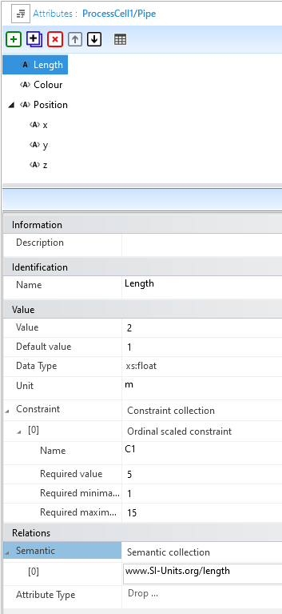 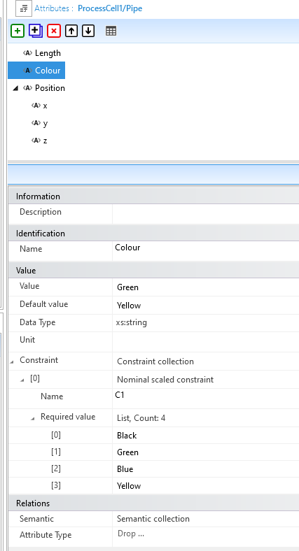

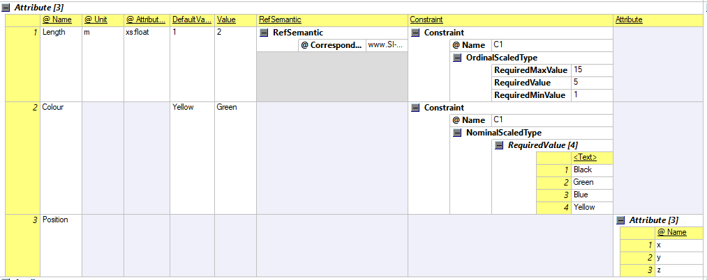

рис.17. Приклад означення Атрибутів CAEX

Поле `RefSemantic` (семантичне посилання) дозволяє означувати семантичне посилання на нормативний або неформальний словник, наприклад одиниці SI, IEC 61987-1, веб-сайт тощо. На рис.17 атрибут `Length` має поле `RefSemantic` і таким способом пов’язаний із зовнішнім семантичним означенням посилається на поняття `length` зі стандартизованого джерела, пов’язаного з системою одиниць SI. Це означає, що атрибут інтерпретується як фізична величина “довжина” незалежно від його локальної назви або контексту використання. Таке семантичне посилання забезпечує однозначне розуміння "довжини" та можливість коректного зіставлення даних між різними CAEX-моделями й інженерними інструментами.

Поле `Attribute` дає можливість вкладати Атрибути в інші Атрибути, таким чином означувати ієрархічні структурні властивості. На рис.17 таким Атрибутом є `Position`, який має вкладені Атрибути `x`, `y`, `z`.

Враховуючи рутинність формування складних Атрибутів, в стандарті передбачено створювати Типи Атрибутів **`AttributeType`** в межах бібліотеки типів Атрибутів `<AttributeTypeLib>`. По факту Типи Атрибутів мають таку саму структуру як Атрибути. 

CAEX дозволяє означити бібліотеки типів атрибутів, що містять користувацькі або стандартизовані типи атрибутів, призначені для повторного використання. Такі бібліотеки можуть застосовуватися для означення складних атрибутів або для створення наперед означеного набору атрибутів із чітко означеним синтаксисом і семантикою. Правила організації `<AttributeTypeLib>` дуже схожі за концепціями за правила організації `<SystemUnitClaasLib>`, зокрема:

- Типи Атрибутів можуть містити вкладені Атрибути, це дозволяє описувати користувацько означені структурні атрибути;
- Типи Атрибутів можуть містити вкладені Типи Атрибутів, що використовується виключно для організації ієрархії типів атрибутів, тобто для зручного відображення бібліотечної структури користувача та організації посилань (див. "формування шляхів"). 
- Відносини успадкування між типами атрибутів означуються за допомогою посилання на батьківський тип атрибута, через поле `RefAttributeType`  На рис.18 Тип Атрибуту `PointInTime` наслідує Тип Атрибуту  `Point` 

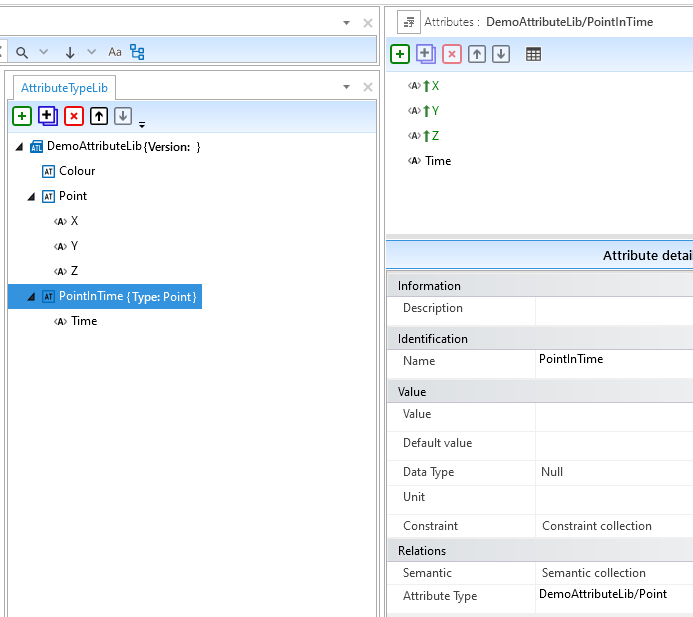


рис.18. Типи Атрибутів

Таким чином `RefAttributeType` є посиланням на тип атрибута, і зберігає шляхове посилання на тип атрибута, означений у бібліотеці `AttributeTypeLib`. 

### `InterfaceClass`

`InterfaceClass` описує типи інтерфейсів, містить набір специфічних атрибутів і використовуються для означення Зовнішніх Інтерфейсів для `RoleClass`, `SystemUnitClass` та `InternalElement`. По факту `InterfaceClass` мають таку саму структуру як `ExternalInterface`, а об'єктні зв'язки схожі за принципом з іншими класами. Зокрема `InterfaceClass` :

- не мають властивості напрямку, якщо напрямок екземпляру або класу необхідний, його слід додати як користувацько означений атрибут CAEX 
- `InterfaceClass` можуть бути організовані в бібліотеці у вигляді дерева, щоб відобразити структуру користувацької бібліотеки
- відносини успадкування означуються за допомогою посилання на батьківський клас інтерфейсу, як це описано вище у "відношенні наслідування"
- Обов’язкові зовнішні інтерфейси мають бути означені за допомогою CAEX-елемента `ExternalInterface`. Агрегація може виконуватися або шляхом посилання на вже існуючий клас інтерфейсу, або шляхом безпосереднього задання всіх необхідних властивостей інтерфейсу за місцем. Агреговані інтерфейси можуть розширюватися, для них можуть бути додані додаткові Атрибути, успадковані Атрибути можуть бути уточнені, а також можуть бути додані вкладені інтерфейси.

На рисунку 19 показано бібліотеку `InterfaceClassLib` із класом інтерфейсу `ProductNode`. Типовими прикладами подальшого використання класів інтерфейсу є `SignalNode`, `DigitalIn`, `DigitalOut` тощо. На рис.20 показаний приклад вкладеного інтерфейсу.

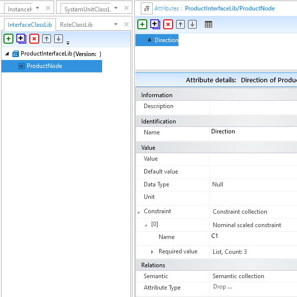

рис.19. Приклад `InterfaceClass`

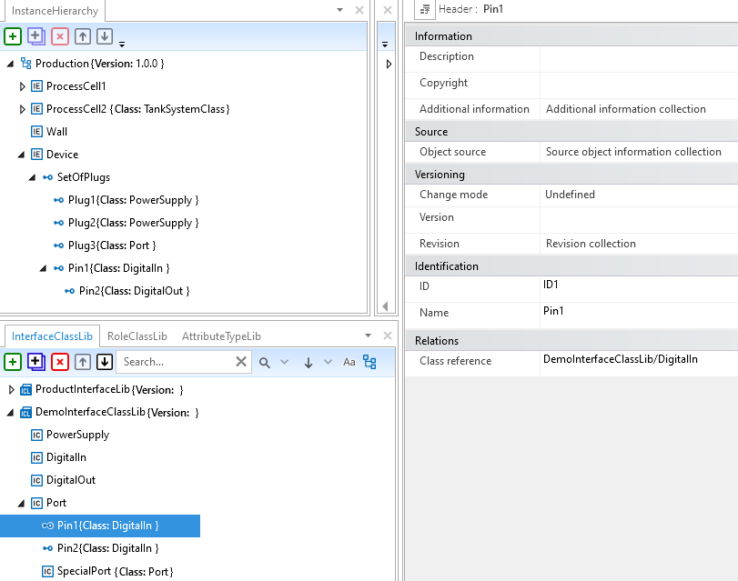


Рис.20. Приклад  `InterfaceClass` з включенням інтерфейсів

### Концепція ролей та `RoleClass`

Основною метою концепції ролей у CAEX є означення в `RoleClass` абстрактної інформації про ролі та функції. Наприклад, коли в проєкті на схемі P&ID з'являється позначення насосу `P1`, то це саме про роль, в якій означується, що саме цей насос буде робити і які в нього мають бути параметри (наприклад тиск, що нагнітається, витрати, тощо). `InternalElements` або `SystemUnitClaass` можуть реалізовувати цю роль, задовольняючи вимоги, які в ній закладені. Означення посилання на роль робиться через поле `RoleRequirements` в якій вказується необхідна роль через шлях.  

Ролі характеризуються Атрибутами CAEX і Зовнішніми Інтерфейсами. Щодо класів ролей діють такі положення:

- RoleClasses не містять вкладених ролей.
- Концепція дочірніх ролей дозволяє описувати ієрархію ролей; сама ієрархія не має семантики.
- Відносини успадкування визначаються за допомогою посилання на батьківський клас ролі.

Розглянемо це на прикладі. На рис. 21 показано бібліотеку `RoleClassLib` з іменем `ProcessRoleClassLib`, яка містить два класи ролей: `Pipe` і `Tank`. Роль `Pipe` містить один атрибут `Diameter` без уточнення його одиниці вимірювання (`Unit`) або значення за замовчуванням (`DefaultValue`). Крім того, вона містить два інтерфейси типу `ProductNode`. Цей базовий клас має атрибут `Direction`, значення якого встановлюється відповідно в `In` або `Out`.

Роль `Tank` додатково демонструє концепцію створення ієрархій ролей і успадкування класів ролей. Роль `Tank` означує лише один Атрибут. Роль `TankWithProductNodes` розміщена як дочірня щодо класу ролі `Tank`. Такий зв’язок між класами, як вже зазначалося означувати довільні бібліотечні ієрархії. У той же час вкладена роль `TankWithProductNodes` посилається на роль `Tank` як на базовий клас. Це означує відношення успадкування: цей клас ролі успадковує всі атрибути та інтерфейси ролі `Tank`.

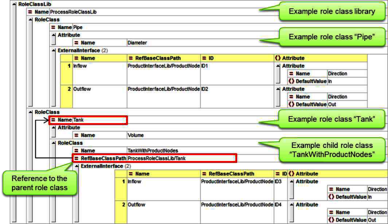


рис.21. Приклад RoleClass з бібліотеки RoleClassLib (Джерело IEC 62424)

Розглянемо це через різні випадки означення даних, які зазначені в стандарті IEC 62424.  На рис. 22 показана концепція ролей через формування вимог та імплементацію для на прикладі `InternalElement` `B1`, який зберігається в довільному місці структури установки. 

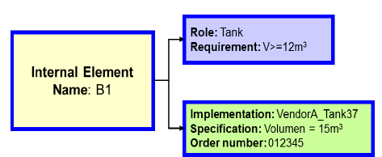

Рис.22. До концепції ролей в CAEX (джерело IEC 62424)

Почнемо з найпростішого варіанту, що елемент `B1` описується лише своїм ім’ям і не має жодного додаткового значення або семантики, а слугує лише заповнювачем для майбутнього використання. Рисунок 23 показує відповідну модель даних CAEX.

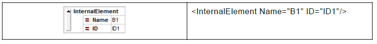

Рис.23. Означення даних CAEX випадок 1 (джерело IEC 62424)

Випадок використання 2. Під час ітеративного проєктування вибирається відповідний клас ролі, який описує роль, яку має виконувати `B1`. Це надає елементу `B1` певного значення або семантики. Клас ролі містить наперед означені Атрибути та Інтерфейси, які необхідні. Якщо відповідний клас ролі не означено, усі вимоги до ролі можуть бути задані безпосередньо тут. У наведеному прикладі елементу `B1` призначено роль `Tank`, а необхідний атрибут `V` установлено як `>= 12 m³`. Робота з ролями дає змогу абстрагуватися від технічних реалізацій. Рис.24 показує відповідну модель даних CAEX.

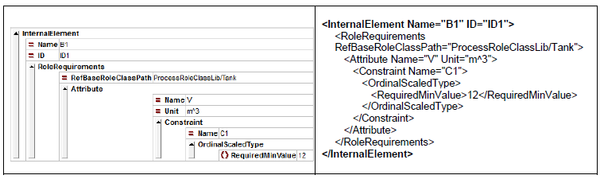

Рис.24. Означення даних CAEX випадок 2 (джерело IEC 62424)

Випадок використання 3. Yа пізнішому етапі проєктування стає актуальною конкретна технічна реалізація. Виходячи з означених вимог, потрібно вибрати відповідну технічну реалізацію у формі `SystemUnitClass`. У наведеному прикладі встановлено посилання на `VendorA_Tank37`. Цей клас задовольняє вимоги. Рис. 25 показує відповідну структуру даних CAEX. Видно, що атрибути, означені у вимогах до ролі, не обов’язково повинні збігатися з назвами атрибутів, які походять із відповідного `SystemUnitClass`. Для цього CAEX підтримує **`MappingObject`**, який дозволяє зіставляти відповідні назви атрибутів між роллю та `SystemUnitClass`. Те саме стосується й інтерфейсів. Детальніше про `MappingObject` наведено нижче

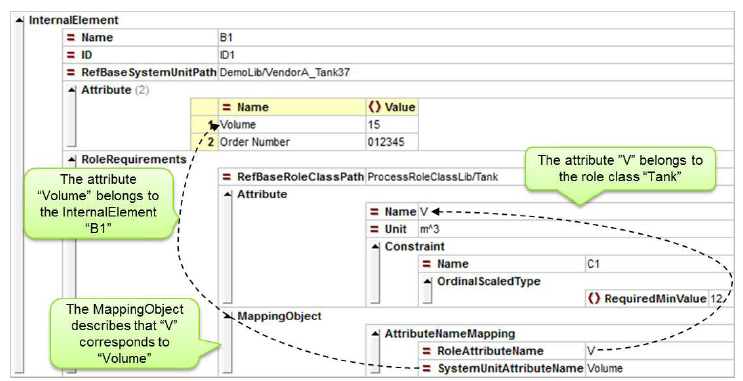

Рис.25. Означення даних CAEX випадок 3 (джерело IEC 62424)

```xml
<InternalElement
    Name="B1"
    ID="ID1"
    RefBaseSystemUnitPath="DemoLib/VendorA_Tank37">
    <Attribute Name="Volume">
        <Value>15</Value>
    </Attribute>
    <Attribute Name="Order Number">
        <Value>012345</Value>
    </Attribute>
    <RoleRequirements RefBaseRoleClassPath="ProcessRoleClassLib/Tank">
        <Attribute Name="V" Unit="m3">
            <Constraint Name="C1">
                <OrdinalScaledType>
                    <RequiredMinValue>12</RequiredMinValue>
                </OrdinalScaledType>
            </Constraint>
        </Attribute>
        <MappingObject>
            <AttributeNameMapping
                RoleAttributeName="V"
                SystemUnitAttributeName="Volume"/>
        </MappingObject>
    </RoleRequirements>
</InternalElement>
```

Щодо концепції ролей застосовуються такі положення:

- Один `InternalElement` може одночасно посилатися лише на один `SystemUnitClass`, але може посилатися на кілька `RoleClasses` одночасно 
- Використання `RoleClasses` або `RoleRequirements` не є обов’язковим. Усі дані проєкту можуть зберігатися без використання концепції ролей. Ця концепція гнучко підтримує ітеративний процес проєктування, але не є обов’язковою.
- Означення `RoleRequirements` у `InternalElement` є дійсним лише для цього окремого `InternalElement`. Воно може бути розширене або скорочене за рахунок додаткових атрибутів CAEX або зовнішніх інтерфейсів CAEX (`ExternalInterfaces`), навіть якщо вони не означені у відповідному `RoleClass`. Це дозволяє розширювати вимоги для конкретного `InternalElement`.
- Понад специфікації, задані у `RoleRequirements`, відповідний `InternalElement` може мати додаткові специфікації (атрибути, інтерфейси), які не визначені у пов’язаному `RoleClass`. Це дозволяє задавати деталі реалізації, специфічні для окремого `InternalElement`.
- Специфікація `InternalElement` може суперечити специфікації `RoleRequirements` або підтримуваному `RoleClass`. AML явно підтримує збереження неузгоджених або неповних інженерних даних. Перевірка коректності даних належить до функцій інструментів, CAEX лише відображає поточні дані.
- CAEX не забезпечує перевірку узгодженості щодо концепції ролей, коректності зіставлення атрибутів чи інтерфейсів або відповідності вимогам.

Промислові пристрої можуть виконувати більше ніж одну роль одночасно. Для цього CAEX передбачає підтримку посилань на кілька ролей. Множинні ролі є важливими, коли об’єкт може мати кілька функціональних призначень. Прикладом є багатофункціональний пристрій, який одночасно є сканером, принтером і факсом. На рис.26 змодельовано об’єкт `MultiDevice01` із трьома атрибутами — `FaxBoudRate`, `PrintSpeed` і `FaxSpeed`, — а також двома інтерфейсами — `PowerSupply` і `USB`.

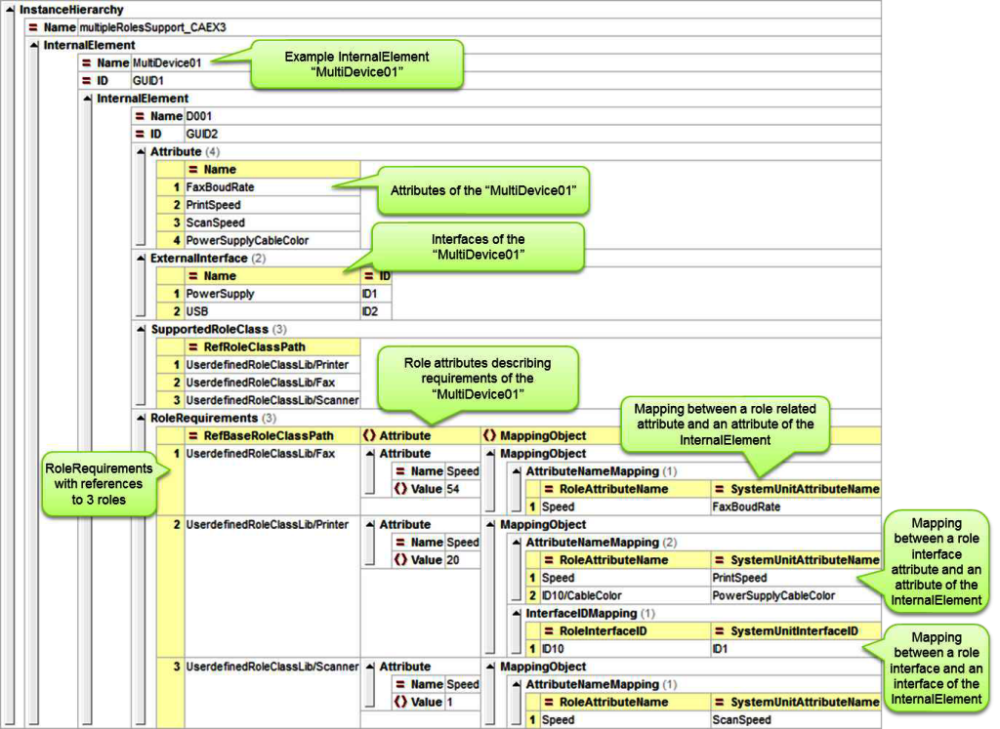

рис.26. Підтримка кількох ролей  (джерело IEC 62424)

Оскільки цей об’єкт може одночасно виконувати три ролі, `InternalElement` `MultiDevice01` моделює три окремі `RoleRequirements` CAEX, що посилаються на ролі `Printer`, `Fax` і `Scanner` відповідно. Вимоги трьох різних ролей моделюються окремо й відображаються у вигляді індивідуальних атрибутів ролей — швидкості друку, факсу та сканера — і відповідних інтерфейсів ролей.

Для кожного RoleRequirement у CAEX може бути визначений необов’язковий елемент MappingObject, який дозволяє вказати, який атрибут або інтерфейс відповідної ролі пов’язаний із яким атрибутом або інтерфейсом відповідного InternalElement. Імена атрибутів ролей, зазначені у MappingObject, задаються відносно класу ролі, на який є посилання; отже, кожен RoleRequirement формує власний контекст.

Відповідний XML-код цього прикладу:

```xml
<InstanceHierarchy Name="multipleRolesSupport_CAEX3">
    <InternalElement Name="MultiDevice01" ID="GUID1">
        <InternalElement Name="D001" ID="GUID2">
            <Attribute Name="FaxBoudRate"/>
            <Attribute Name="PrintSpeed"/>
            <Attribute Name="ScanSpeed"/>
            <Attribute Name="PowerSupplyCableColor"/>
            <ExternalInterface Name="PowerSupply"/>
            <ExternalInterface Name="USB"/>
            <SupportedRoleClass RefRoleClassPath="UserdefinedRoleClassLib/Printer"/>
            <SupportedRoleClass RefRoleClassPath="UserdefinedRoleClassLib/Fax"/>
            <SupportedRoleClass RefRoleClassPath="UserdefinedRoleClassLib/Scanner"/>
            <RoleRequirements RefBaseRoleClassPath="UserdefinedRoleClassLib/Fax">
                <Attribute Name="Speed">
                    <Value>54</Value>
                </Attribute>
                <MappingObject>
                    <AttributeNameMapping
                        RoleAttributeName="Speed"
                        SystemUnitAttributeName="FaxBoudRate"/>
                </MappingObject>
            </RoleRequirements>
            <RoleRequirements RefBaseRoleClassPath="UserdefinedRoleClassLib/Printer">
                <Attribute Name="Speed">
                    <Value>20</Value>
                </Attribute>
                <MappingObject>
                    <AttributeNameMapping
                        RoleAttributeName="Speed"
                        SystemUnitAttributeName="PrintSpeed"/>
                    <AttributeNameMapping
                        RoleAttributeName="ID1/CableColor"
                        SystemUnitAttributeName="PowerSupplyCableColor"/>
                    <InterfaceIDMapping
                        RoleInterfaceID="ID10"
                        SystemUnitInterfaceID="ID1"/>
                </MappingObject>
            </RoleRequirements>
            <RoleRequirements RefBaseRoleClassPath="UserdefinedRoleClassLib/Scanner">
                <Attribute Name="Speed">
                    <Value>1</Value>
                </Attribute>
                <MappingObject>
                    <AttributeNameMapping
                        RoleAttributeName="Speed"
                        SystemUnitAttributeName="ScanSpeed"/>
                </MappingObject>
            </RoleRequirements>
        </InternalElement>
    </InternalElement>
</InstanceHierarchy>
```

Елемент CAEX `SupportedRoleClass` є підлеглим елементом `SystemUnitClass`. Для кожного `SystemUnitClass` він дозволяє означити, які `RoleClasses` він підтримує. Ця концепція забезпечує можливість автоматизованого вибору відповідних `SystemUnitClasses` для певного `RoleClass`.

Щодо `SupportedRoleClass`  застосовуються такі положення:

- `SystemUnitClass` може підтримувати довільну кількість `RoleClasses`.
- Дочірні або батьківські класи відносно підтримуваного `RoleClass` не підтримуються автоматично, оскільки вони можуть бути несумісні з даним `SystemUnitClass`. Якщо дочірні класи `RoleClass` також підтримуються `SystemUnitClass`, їх потрібно явно додати до визначення `SupportedRoleClass`.
- Для кожного підтримуваного `RoleClass` може бути визначений `MappingObject`, який дозволяє задати зіставлення між відповідними назвами атрибутів та інтерфейсами. 
- CAEX не перевіряє коректність підтримуваних `RoleClasses` — ані їхнє існування, ані дійсність. Це повинно реалізовуватися на рівні інструментів імпорту/експорту CAEX або інженерних інструментів-джерел/приймачів.

### Використання `MappingObject`

Елемент CAEX `MappingObject` підтримує концепцію ролей у CAEX. І `RoleClasses`, і `SystemUnitClasses` можуть містити означення атрибутів та інтерфейсів. Якщо `InternalElement` пов’язано з `RoleClass`, назви атрибутів у цих двох структурах можуть не збігатися. `MappingObject` дозволяє виконати їхнє взаємне зіставлення. Щодо MappingObject застосовуються такі положення:

- Якщо атрибути або інтерфейси, визначені у `RoleRequirement`, мають бути пов’язані з відповідними атрибутами або інтерфейсами `InternalElement`, до `InternalElement` слід додати `MappingObject`. Для атрибутів зіставлення вже вважається визначеним, якщо імена атрибутів (або шляхи у разі вкладених атрибутів) збігаються; у цьому випадку окремий `MappingObject` не потрібен.
- Для кожного зіставлення назв атрибутів ролі до `MappingObject` має бути додано елемент `AttributeNameMapping`. `RoleAttributeName` повинен містити назву (або шлях для вкладеного атрибута) атрибута ролі, а `SystemUnitAttributeName` — відповідну назву (або шлях) атрибута `InternalElement`.
- Для кожного зіставлення назв атрибутів інтерфейсів також додається елемент `AttributeNameMapping`. `RoleAttributeName` повинен містити шлях до атрибута, який включає `ID` інтерфейсу та назву (або шлях) атрибута, розділені символом `/`. `SystemUnitAttributeName` повинен містити `ID` інтерфейсу `InternalElement` і відповідну назву атрибута, також розділені символом `/`.
- Для кожного зіставлення інтерфейсів до `MappingObject` додається елемент `InterfaceIDMapping`. `RoleInterfaceID` повинен містити `ID` інтерфейсу ролі, а `SystemUnitInterfaceID` — `ID` відповідного інтерфейсу `InternalElement`
- Якщо атрибут `InternalElement` не має ні значення `Value`, ні значення за замовчуванням `DefaultValue`, але зіставлений із відповідним атрибутом `RoleRequirement` або `SupportedRoleClass`, то ці значення не повинні використовуватися — вони лише відображають вимоги.
- Множинні ролі можуть мати атрибути з однаковими назвами, але з різною семантикою. Зіставлення відповідних атрибутів із батьківським `InternalElement` повинно виконуватися за допомогою `MappingObject`. Зіставлення кількох атрибутів різних ролей із різним значенням до одного атрибута відповідного InternalElement суворо заборонено.

Рисунок 27 показує приклад різних типів зіставлення. У прикладі `RoleClass` означує атрибут `Volume`, інтерфейс `Input` та атрибут інтерфейсу `Diameter`. Внутрішній елемент означчу атрибут `V`, інтерфейс `In` та атрибут інтерфейсу `D`. `MappingObject` означує, що `V` відповідає `Volume`, а `ID0/Diameter` відповідає `ID1/D`. Крім того, він означує, що інтерфейси ролі `ID2` і `ID3` відповідають інтерфейсам `ID4` і `ID5` відповідного `InternalElement`.

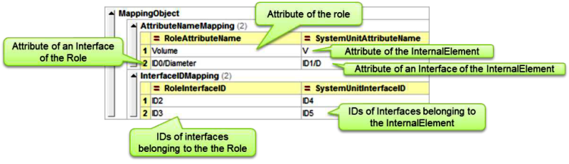

рис.27. Приклад `MappingObject` (джерело IEC 62424)

```xml
<MappingObject>
	<AttributeNameMapping RoleAttributeName="Volume" SystemUnitAttributeName="V"/>
	<AttributeNameMapping RoleAttributeName="ID0/Diameter" SystemUnitAttributeName="ID1/D"/>
	<InterfaceIDMapping RoleInterfaceID="ID2" SystemUnitInterfaceID="ID4"/>
	<InterfaceIDMapping RoleInterfaceID="ID3" SystemUnitInterfaceID="ID5"/>
</MappingObject>
```

### Посилання на зовнішні файли CAEX

CAEX явно підтримує доступ до зовнішніх файлів CAEX за допомогою елемента `ExternalReference`. Щодо `ExternalReferences` застосовуються такі положення:

- Кожен `ExternalReference` повинен посилатися на інший документ CAEX тієї самої версії схеми.
- Кожен `ExternalReference` повинен містити дійсний URI на зовнішній документ CAEX і псевдонім (`Alias`), який має бути унікальним у межах поточного документа CAEX. Інша інформація не повинна зберігатися.
- Зовнішні документи CAEX, на які є посилання, повинні бути дійсними та доступними.
- Псевдонім (`Alias`) може використовуватися для посилань на класи або екземпляри. У цьому випадку тег посилання повинен починатися з імені псевдоніма, за яким слідує роздільник псевдоніма `@`, а далі — шлях до класу або `ID` відповідного `InternalElement` чи `ExternalInterface`.
- CAEX `InternalLinks` або дзеркальні об’єкти можуть посилатися на дзеркальні об’єкти, що зберігаються в іншому файлі. У цьому випадку зовнішній файл (файли) повинен бути вказаний як `ExternalReference`.
- Документи CAEX можуть бути розподілені між кількома файлами. У всіх таких файлах дозволяється наявність кількох посилань `ExternalReference` на ті самі зовнішні файли. Допускаються також циклічні посилання між файлами CAEX. Це означає, що один файл CAEX може посилатися на інший файл CAEX, але розділений файл того самого документа може знову посилатися на той самий файл CAEX.

На рисунку 28 наведено приклад файлу CAEX, який потребує доступу до трьох інших файлів. Файли `CAEXFile01`, `CAEXFile02` і `CAEXFile03` можуть містити різні бібліотеки, на які здійснюються посилання в основному файлі `CurrentCAEXFile`.

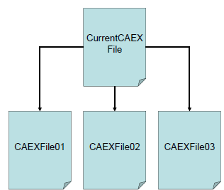

рис.28. Розподілення даних між кількома файлами CAEX

Описаний приклад має бути визначений у CAEX шляхом задання зовнішніх посилань, які містять URI або відносний шлях до зовнішніх файлів CAEX і псевдонім (`Alias`), що забезпечує внутрішній доступ до цього зовнішнього файлу CAEX. Імена псевдонімів повинні бути унікальними, не містити назв об’єктів CAEX, і лише сам документ CAEX може бути вказаний через свій шлях. Приклад посилання на зовнішні файли CAEX показано нижче.

```xml
<ExternalReference Path=".../MyDirectory/CAEXExternalLibrary.xml" Alias="C01"/>
<ExternalReference Path="file://localhost/c:/Temp/anotherCAEXFile.xml" Alias="C02"/>
<ExternalReference Path="http://www.abc.com/ YetanotherCAEXFile.xml" Alias="C03"/>
```

Рисунок A.37 показує приклад використання визначених посилань на зовнішні файли CAEX. Посилання на зовнішній файл задається за допомогою імені псевдоніма, після якого через роздільник псевдоніма “@” вказується повний шлях до відповідного класу.

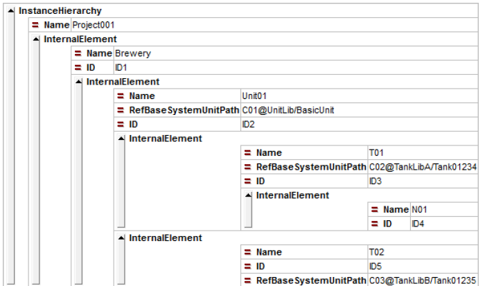

Рис.29. Приклад використання `Alias` 

```xml
<InstanceHierarchy Name="Project01">

    <InternalElement Name="Brewery01" ID="ID1">

        <InternalElement
            Name="Unit01"
            ID="ID2"
            RefBaseSystemUnitPath="CO1@UnitLib/BasicUnit">

            <InternalElement
                Name="T01"
                ID="ID3"
                RefBaseSystemUnitPath="CO2@TankLibA/Tank01234"/>
            
            <InternalElement
                Name="N01"
                ID="ID4"/>
        </InternalElement>

        <InternalElement
            Name="T02"
            ID="ID5"
            RefBaseSystemUnitPath="CO3@TankLibB/Tank01235"/>

    </InternalElement>

</InstanceHierarchy>

```


## Типи даних та елементи CAEX 

| Типи даних і елементи             | Детальний опис                                               |
| --------------------------------- | ------------------------------------------------------------ |
| AdditionalInformation             | Необов’язкове допоміжне поле, яке може містити будь-яку додаткову інформацію про об’єкт CAEX. Використовується в підструктурі заголовка. |
| Alias                             | Описує псевдонім (alias name) зовнішнього файлу CAEX, щоб забезпечити посилання на елементи цього зовнішнього файлу. |
| Attribute                         | Характеризує властивості об’єкта типу SystemUnitClass, RoleClass, InterfaceClass, InternalElement або RoleRequirements. |
| AttributeDataType                 | Описує тип даних атрибута у форматі XML.                     |
| AttributeFamilyType               | Визначає базові структури для визначення типів атрибутів.    |
| AttributeNameMapping              | Дозволяє визначити відповідність між атрибутами спорідненого класу ролей або його інтерфейсів та атрибутами системного модуля, який їх містить. |
| AttributeType                     | Визначає базові структури для опису типів атрибутів.         |
| AttributeTypeLib                  | Елемент-контейнер для ієрархії визначень типів атрибутів. CAEX підтримує кілька бібліотек типів атрибутів. |
| AttributeValueRequirementType     | Визначає базові структури для опису вимог до значень атрибутів. |
| CAEXBasicObject                   | Базовий об’єкт CAEX, який містить основний набір атрибутів і заголовкову інформацію, спільну для всіх елементів CAEX. |
| CAEXFile                          | Кореневий елемент схеми CAEX.                                |
| CAEXObject                        | Базовий об’єкт CAEX, успадкований від CAEXBasicObject, доповнений обов’язковим атрибутом Name і необов’язковим ID. |
| ChangeMode                        | Необов’язково описує зміну стану об’єкта CAEX. Якщо використовується, ChangeMode може мати такі значення: state, create, delete або change. Ця інформація застосовується для керування змінами. |
| Constraint                        | Елемент, який обмежує діапазон допустимих значень визначеного атрибута. |
| Copyright                         | Організаційна інформація про авторські права.                |
| DefaultValue                      | Попередньо визначене значення за замовчуванням для атрибута. |
| Description                       | Текстовий опис для об’єктів CAEX.                            |
| ExternalInterface                 | Опис зовнішнього інтерфейсу об’єкта типу RoleClass, SystemUnitClass або InternalElement. |
| ExternalReference                 | Елемент-контейнер для визначення псевдонімів зовнішніх файлів CAEX. |
| FileName                          | Описує ім’я файлу CAEX.                                      |
| Header                            | Визначає групу організаційної інформації, як-от опис, версію, ревізію, авторські права тощо. |
| ID                                | Необов’язковий атрибут, який описує унікальний ідентифікатор об’єкта CAEX. |
| InstanceHierarchy                 | Кореневий елемент для системної ієрархії об’єктних екземплярів. |
| InterfaceClass                    | Класове визначення для інтерфейсів.                          |
| InterfaceClassLib                 | Елемент-контейнер для ієрархії визначень InterfaceClass. Може містити будь-які визначення класів інтерфейсів. CAEX підтримує кілька бібліотек інтерфейсів. |
| InterfaceClassType                | Використовується для визначення InterfaceClass; забезпечує базові структури для опису класу інтерфейсу. |
| InterfaceFamilyType               | Визначає базові структури для ієрархічної структури InterfaceClass. Ієрархічна структура бібліотеки інтерфейсів має лише організаційний характер. |
| InterfaceIDMapping                | Дозволяє визначити відповідність між інтерфейсами спорідненого класу ролей та інтерфейсами системного модуля, який їх містить. |
| InternalElement                   | Використовується для визначення вкладених об’єктів усередині SystemUnitClass або іншого InternalElement. Дозволяє опис внутрішньої структури об’єкта CAEX. |
| InternalElementType               | Тип, який використовується для визначення вкладених об’єктів усередині SystemUnitClass. |
| InternalLink                      | Використовується для визначення зв’язків між зовнішніми інтерфейсами (CAEX ExternalInterfaces). |
| LastWritingDateTime               | Дата та час створення документа CAEX.                        |
| MappingObject                     | Об’єкт-хост для AttributeNameMapping та InterfaceIDMapping.  |
| MappingType                       | Базовий елемент для MappingObject.                           |
| Name                              | Описує ім’я об’єкта CAEX.                                    |
| NominalScaledType                 | Елемент для визначення обмежень номінальних шкальних значень атрибутів. |
| OrdinalScaledType                 | Елемент для визначення обмежень порядкових шкальних значень атрибутів. |
| OriginName                        | Ім’я джерела документа CAEX, наприклад джерела інженерного інструмента або програми-експортера. |
| OriginID                          | Унікальний ідентифікатор джерела документа CAEX, наприклад унікальний ідентифікатор інженерного інструмента або програми-експортера. ID не повинен змінюватися навіть у разі перейменування файлу. |
| OriginVendor                      | Постачальник джерела даних документа CAEX.                   |
| OriginVendorURL                   | URL-адреса постачальника джерела даних документа CAEX.       |
| OriginVersion                     | Версія джерела документа CAEX, наприклад версія інженерного інструмента або програми-експортера. |
| OriginRelease                     | Реліз джерела документа CAEX, наприклад реліз інженерного інструмента або програми-експортера. |
| OriginProjectTitle                | Назва відповідного вихідного проєкту.                        |
| OriginProjectID                   | Унікальний ідентифікатор відповідного вихідного проєкту.     |
| Path                              | Описує шлях до зовнішнього файлу CAEX. Допускаються як абсолютні, так і відносні шляхи. |
| RefAttributeType                  | Посилання на тип атрибута в бібліотеці атрибутів.            |
| RefBaseClassPath                  | Зберігає посилання на базовий клас. Посилання містить повний шлях до посилання на відповідний клас. |
| RefBaseSystemUnitPath             | Зберігає посилання на InternalElement або SystemUnitClass. Посилання містить повний шлях до цієї інформації. |
| RefSemantic                       | Посилання на визначення атрибута, наприклад на атрибут у стандартизованій бібліотеці; це дозволяє задати семантичне визначення атрибута. |
| RequiredMaxValue                  | Елемент для визначення максимального значення атрибута.      |
| RequiredMinValue                  | Елемент для визначення мінімального значення атрибута.       |
| RequiredValue (NominalScaledType) | Елемент для визначення необхідного значення атрибута. Може бути визначений кілька разів, щоб описати дискретний діапазон значень атрибута. |
| RequiredValue (OrdinalScaledType) | Елемент для визначення необхідного значення атрибута.        |
| Requirements                      | Визначає інформаційні вимоги як обмеження для значення атрибута. |
| Revision                          | Організаційна інформація про стан ревізії.                   |
| RoleClass                         | Визначення класу типу ролі.                                  |
| RoleClassFamilyType               | Визначає базові структури для ієрархічного дерева RoleClass. Ієрархічна структура бібліотеки ролей має лише організаційний характер. |
| RoleClassLib                      | Елемент-контейнер для ієрархії визначень RoleClass. Має містити всі визначення RoleClass. CAEX підтримує кілька бібліотек ролей. |
| RoleClassType                     | Використовується для визначення RoleClass; забезпечує базові структури для опису класу ролей. |
| RoleRequirements                  | Описує вимоги ролей для InternalElement. Дозволяє задати посилання на RoleClass і визначити вимоги ролі, такі як необхідні атрибути й інтерфейси. |
| SchemaVersion                     | Описує версію схеми. Кожен документ CAEX має зазначати, яку версію CAEX він використовує. Номер версії CAEX-документа має відповідати версії, зазначеній у файлі схеми CAEX. |
| SourceDocumentInformationType     | Визначає структуру для моделювання інформації про джерело даних поточного документа CAEX. |
| SourceObjID                       | Атрибут, що представляє ID вихідного об’єкта в моделі даних джерела. |
| SourceObjectInformation           | Організаційна інформація про джерело відповідного об’єкта CAEX. |
| SuperiorStandardVersion           | Описує версію вищестоящого стандарту. Рядок версії визначений у цьому стандарті. |
| SupportedRoleClass                | Дозволяє пов’язати відповідний SystemUnitClass із RoleClass. Це описує, яку роль може виконувати SystemUnitClass. Один SystemUnitClass може бути пов’язаний із кількома ролями. |
| SystemUnitClass                   | Використовується для визначення SystemUnitClass; надає визначення класу типу SystemUnitClass. |
| SystemUnitClassLib                | Елемент-контейнер для ієрархії визначень SystemUnitClass. Має містити всі визначення SystemUnitClass. CAEX підтримує кілька бібліотек SystemUnitClass. |
| SystemUnitClassType               | Визначає базові структури для опису класу SystemUnitClass.   |
| SystemUnitFamilyType              | Визначає базові структури для ієрархічного дерева SystemUnitClass. Ієрархічна структура бібліотеки SystemUnit має лише організаційний характер. |
| Unit                              | Описує одиницю вимірювання змінної.                          |
| UnknownType                       | Елемент для визначення обмежень значень атрибутів із невідомим типом шкали. |
| Value                             | Елемент для опису значення атрибута.                         |
| Version                           | Організаційна інформація про стан версії.                    |


## Джерела

1. AutomationML. A Practical Guide. Edited by Rainer Drath, 2021 ISBN 978-3-11-074622-8, e-ISBN (PDF) 978-3-11-074623-5, e-ISBN (EPUB) 978-3-11-074659-4

2. Schmidt, N.; Lüder, A. *AutomationML in a Nutshell.* AutomationML e.V. Office, State: November 2015.

3. https://www.automationml.org


## Автори


Теоретичне заняття розробив [Олександр Пупена](https://github.com/pupenasan). 

## Feedback

Якщо Ви хочете залишити коментар у Вас є наступні варіанти:

- [Обговорення у WhatsApp](https://chat.whatsapp.com/BRbPAQrE1s7BwCLtNtMoqN)
- [Обговорення в Телеграм](https://t.me/+GA2smCKs5QU1MWMy)
- [Група у Фейсбуці](https://www.facebook.com/groups/asu.in.ua)

Про проект і можливість допомогти проекту написано [тут](https://asu-in-ua.github.io/atpv/)

