[<- До підрозділу](README.md)		[Коментувати](#feedback)

# Класи EPLAN

це чернетка

## EPLANRoleClassLib

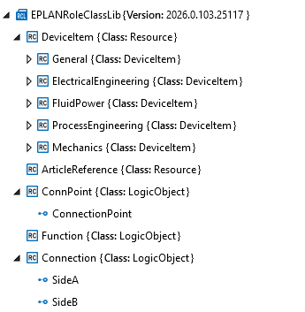

### DeviceItem

Наслідує `AutomationMLBaseRoleClassLib/AutomationMLBaseRole/Resource`. Resource є  базовим абстрактним типом ролі та базовим класом для всіх ролей ресурсів AML. Він описує установки, обладнання або інші виробничі ресурси.

Device Item - це елемент пристрою. Він завжди має головну функцію.

Ієрархія класу DeviceItem співпадає з верхніми рівнями ієрархії функцій Eplan. Бібліотеки означень функцій надаються EPLAN для актуальних застосувань і виробів на ринку; створювати або розширювати їх самостійно неможливо. Ієрархія функцій включає 5 рівнів: 

- `Trade` - означує технічну сферу застосування функції, наприклад `electrical engineering` або `hydraulics`.
- `Area` - означує область у межах сфери, наприклад `coils and contacts` або `motors`.
- `Category` - означує системну поведінку функції. Залежно від категорії (наприклад, контакти, захисні пристрої, котушки, клеми) для функцій доступні певні властивості. Наприклад, властивість `PLC address` існує лише для PLC-функцій, а властивість `Coil: Voltage` — лише для котушок.
- `Group` - Містить базові функції кожної категорії. Наприклад, функція `NO contact (2 connection points)` є загальним означенням, яке уточнюється через `Power NO contact`.
- `Function definition` - означує конкретний тип функції, наприклад `Power NO contact`.

Ця ієрархія доступна в Eplan при виборі функції чи її властивості. Як вже зазначалося два верхні рівні ієрархії означені як ієрархія рольових класів в AML.  

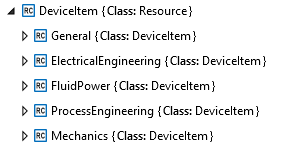

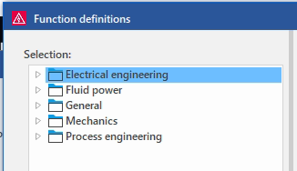

рис.1. Верхінй рівень - `Trade`

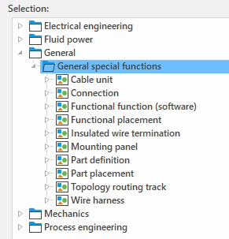

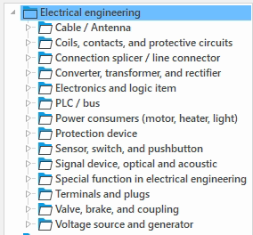

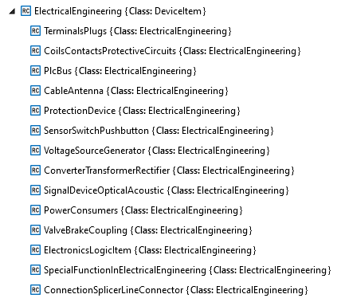

рис.2. `Area` в `Trade = ElectricalEngineering` 

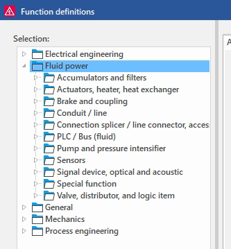

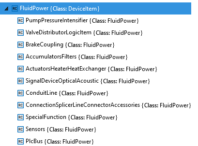

рис.3. `Area` в `Trade = FluidPower` 

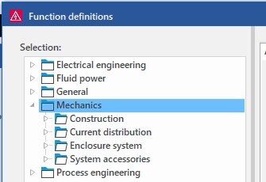

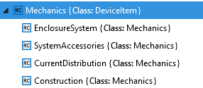

рис.4. `Area` в `Trade = Mechanics` 

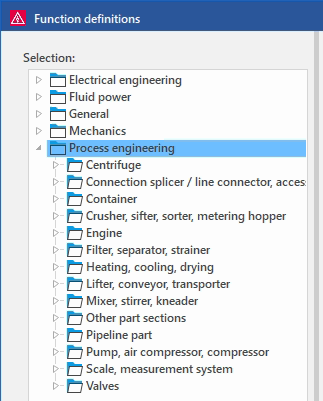

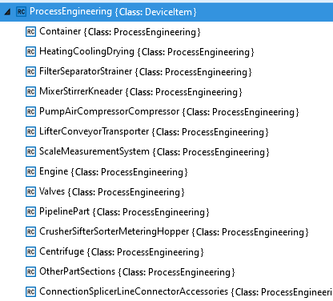

рис.5. `Area` в `Trade = ProcessEngineering` 

Рівень `Category` в AML експортному варіанті означується вже в `InstanceIerarchy` у атрибуті самого вузла. У довіднику EPLAN я не знайшов одного окремого розділу з повним плоским переліком усіх категорій функцій. При аналізі необхідно дивитися це значення безпосередньо в проєкті Eplan, так як і ніші значення - `Group` і `Function Definition`.

На рис.6 наприклад показано означення функції `PLC box`, яка знаходиться в групі `PLC box` категорії `PLC box` Area `Plc/Bus` в `Trade = ElectricalEngineering` .

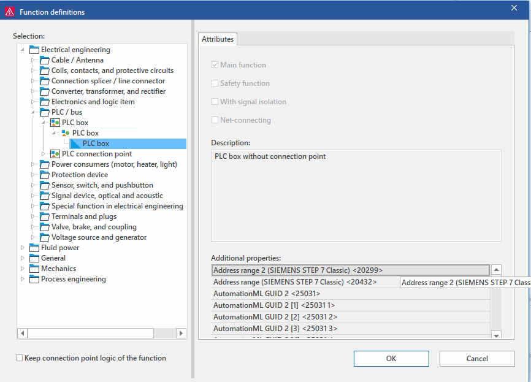

рис.6. 

Якщо подивитися на властивості однієї з функцій, що імпелментує це означення фунуції, то матимемо означення останніх тьох рівнів у властивості `Function definition: Category / Group / Definition <20188>` . Для нашого прикладу (рис.7) це значення буде рівним `301/1/1`

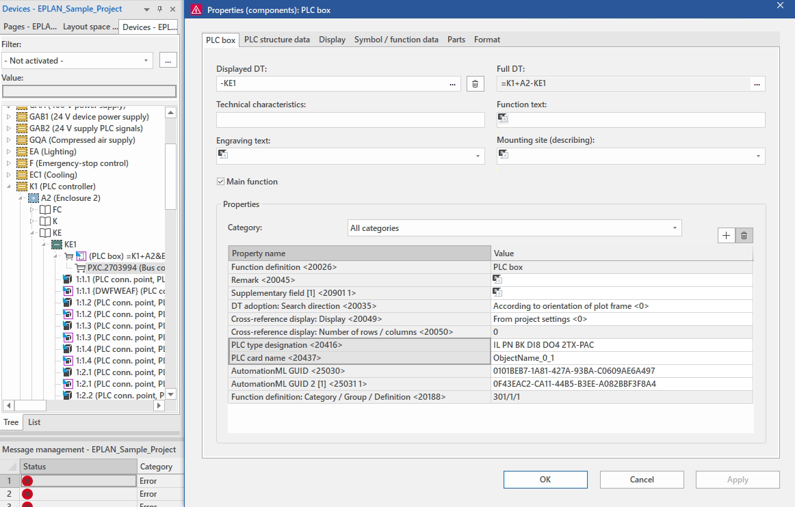

рис.7. 

У AML ми побачимо означення категорії в атрибуті `FunctionCategoryID` екземпляра типу `DeviceItem`, усі інші властивості вже означені на рівні функції.

Інші атрибути `DeviceItem` відповідають ієрархічним позначенням. 

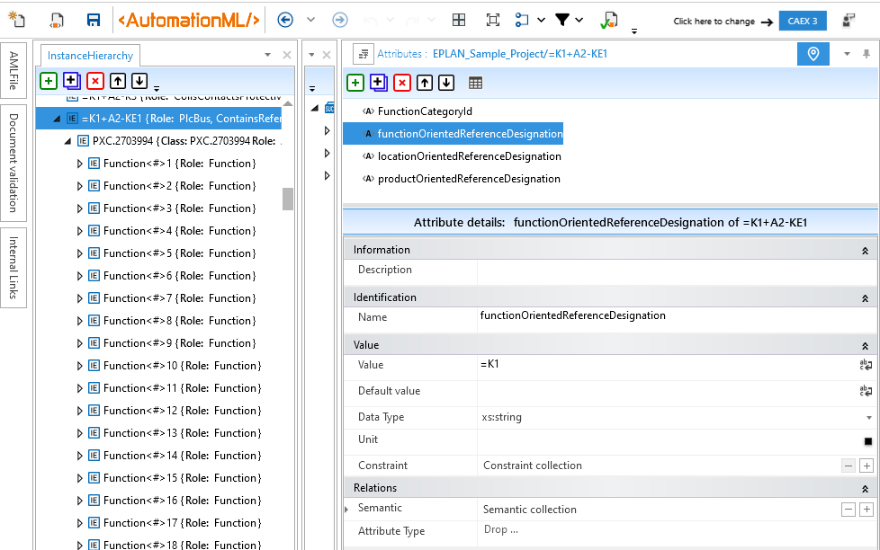

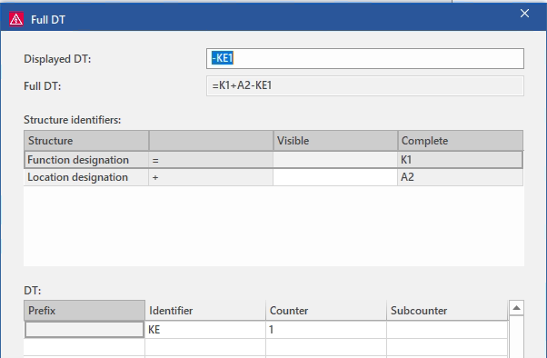

рис.8. 

Усі інші атрибути перенсояться вже на самі функції. 

### ArticleReference

Також наслідує `AutomationMLBaseRoleClassLib/AutomationMLBaseRole/Resource`. Представляє виріб (Part). Вироби в рольовій ієрархії входять в структуру AML як внутрішні вузли.  

### Function

Клас `Function`  в AML представляє однойменний обєкт в Eplan. Вони є складовими елементів пристроїв, і входять в них як включені функції. У AML функції входять до виробів а не до елментів пристроїв. (Якщо виробу немає, функцій також немає) За замовченням при експорті ніякі влативості функції окрім самої функції не переносяться. Вона отримує просто умовну назву і не містить жодних атрибутів. див.рис.8. Щоб функції містили якісь атрибути, необхідно це вказати в опціях експорту. Наприклад на рис.9 вказано, що необхідно експортувати три властивості функцій   

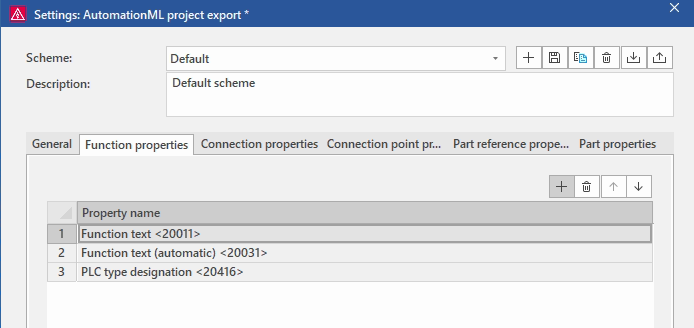

рис.9. 

У цьому випадку онсовна функція  в Eplan що зображена на рис.7. матиме атрибут `PLC type designation`

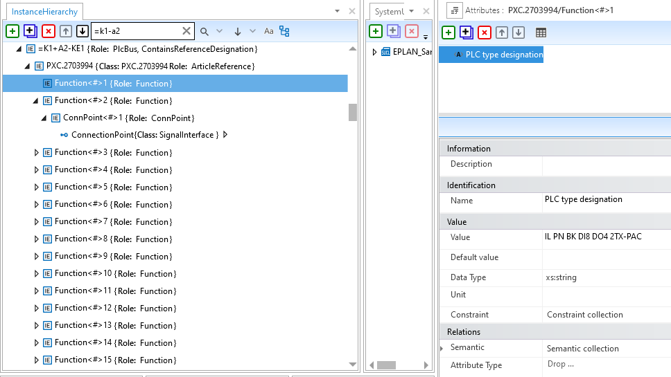

рис.10.

Додаткові функції матимуть атрибути `Function Text`

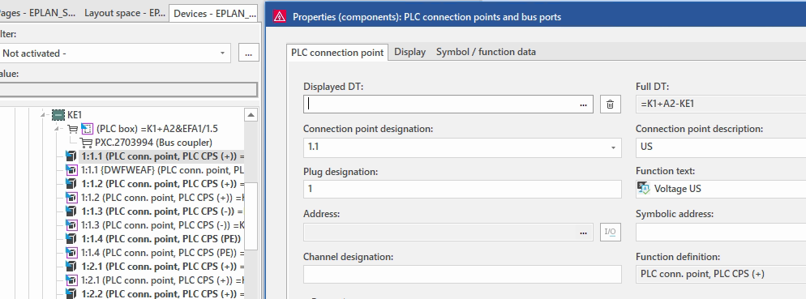

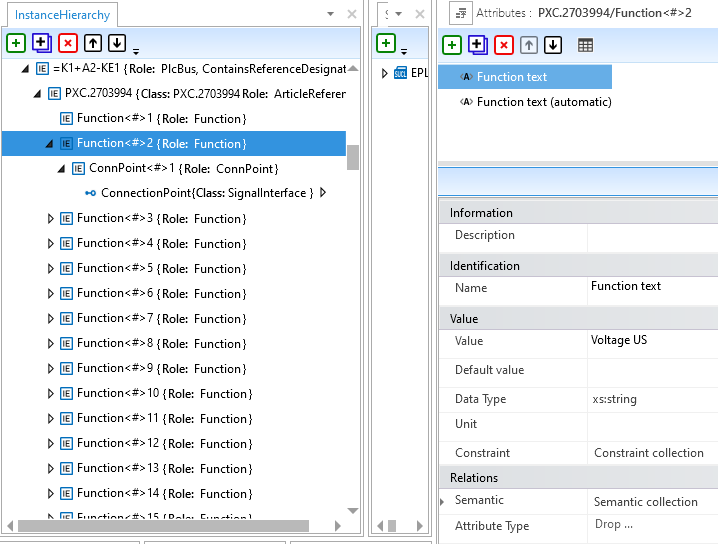

### ConnPoint

Наслідує `AutomationMLBaseRoleClassLib/AutomationMLBaseRole/LogicObject`.  Містить інтерфейс `ConnectionPoint`

ConnPoint реалізує точки підключення в Eplan.

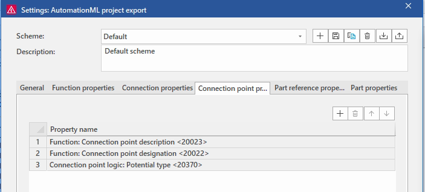

#### ConnectionPoint

### Connection

#### SideA

#### SideB

## Джерела

1. https://www.eplan.help/en-us/infoportal/content/api/2.9/Eplan.EplApi.DataModelu~Eplan.EplApi.DataModel_namespace.html

## Автори

Теоретичне заняття розробив [Олександр Пупена](https://github.com/pupenasan). 

## Feedback

Якщо Ви хочете залишити коментар у Вас є наступні варіанти:

- [Обговорення у WhatsApp](https://chat.whatsapp.com/BRbPAQrE1s7BwCLtNtMoqN)
- [Обговорення в Телеграм](https://t.me/+GA2smCKs5QU1MWMy)
- [Група у Фейсбуці](https://www.facebook.com/groups/asu.in.ua)

Про проект і можливість допомогти проекту написано [тут](https://asu-in-ua.github.io/atpv/)

