[<- До підрозділу](README.md)

# Інтерфейс AS-i: теоретична частина

## 1. Загальні відомості

AS-i (Actuator and Sensor interface) – інтерфейс для підключення датчиків та виконавчих механізмів. Являється альтернативним рішенням використанню безпосереднього підключення польових пристроїв вимірювання та регулювання з дискретними сигналами. Велика кількість проводів замінюється на два, по яким передається інформація і живлення пристроїв одночасно. Надзвичайно простий та зручний монтаж а також завадостійкість зробили цю шину дуже популярною в багатьох країнах світу. 

Електричні і механічні характеристики даного інтерфейсу були розроблені на початку 90-х років за участі одинадцяти компаній, які спеціалізуються в області бінарних датчиків і виконавчих механізмів. AS-i являється відкритим гетерогенним стандартом і описаний в EN 50295. За просунення і розповсюдження AS-i систем відповідає „Асоціація підтримки інтерфейсів для підключення бінарних виконавчих механізмів і датчиків в шину”, або просто Асоціація AS-i (AS-i Association).

Активне просування такої молодої технології пояснюється цілим рядом причин економічного і технічного характеру:

1. Мінімізація витрат на кабельну систему за рахунок: мінімізації або повного виключення (для інтелектуальних датчиків) ліній з нецифровими сигналами; використання дешевого звичайного двохпровідного кабелю;  виключення окремих кабелів електроживлення ведених пристроїв (датчиків і виконавчих механізмів).

2. Економія допоміжного обладнання (клеми, кабельних вводів, кафів і т.інше).

3. Значна економія фінансових і людських ресурсів при проведенні монтажних робіт.

4. Можливість підключення як інтелектуальних (з вбудованим AS-i) так і звичайних датчиків.

5. Надзвичайно малий час опитування (5 мс на всі пристрої), який дозволяє керувати обладнанням у режимі реального часу.

6. Висока ступінь захисту обміну даними між вузлами.

7. Орієнтація на самий нижній рівень автоматизації.

8. Великий вибір ведених пристроїв для встановлення у будь-яких умовах.

9. Наявність широкої номенклатури апаратних засобів для інтеграції мереж AS-і інтерфейсу у існуючі структури АСУТП на любому рівні. 

Шина AS-i не описується в контексті OSI. Але умовно її б можна було показати на двох рівнях: фізичному та канальному. В AS-i використовуються профілі для можливості підключення різноманітних пристроїв, які дозволяють вірно ідентифікувати отримувані дані та формувати дані для відправки. За рахунок використання профілів пристроїв, обмін проходить наперед визначеними даними. 

## 2. Реалізація фізичного рівня

Фізичний рівень забезпечує передачу інформації разом з живленням за рахунок спеціального методу кодування біт, яке використовує комбінацію методу диференційного манчестерського кодування та модуляції струму, яка базується на sin2-хвилях. Такий спосіб кодування дозволяє синхронізувати джерело з приймачем та підвищує надійність передачі. 

Для реалізації AS-i шини необхідно використовувати наступне обладнання: 

- Ведучий мережний пристрій (Master);

- Ведені пристрої (Slave), які в залежності від конструкції поділяються на:

а)модулі AS-i інтерфейсу, за допомогою яких до шини підключаються звичайні датчики і виконавчі механізми;

   б) датчики і виконавчі механізми з вбудованим AS-i інтерфейсом.

- джерело живлення;

- мережний кабель;

- повторювачі, підсилювачі, шлюзи і інші додаткові пристрої.

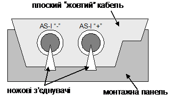

Рис. 5.1. «Жовтий кабель» AS-i шини

Для з’єднання компонентів можна використати будь-який двохжильний кабель, який вибирається в залежності від споживаної потужності. Немає необхідності у використанні екранованого кабелю, чи витої пари. Однак більш просте і швидке виконання монтажу системи можна досягнути за рахунок використання спеціального плоского кабелю AS-i інтерфейсу, який являє собою трапецієвидний двохжильний кабель 2х1,5мм2 з асиметричним профілем („жовтий кабель”) (рис.5.1). Останнє виключає можливість підключення вузлів з неправильною полярністю. Підключення до даного кабелю відбувається методом проколу ізоляції гострими контактами спеціальних контактних пристроїв AS-i (модулі, коробки підключення). Тому немає необхідності в різанні кабелю та зачистки ізоляції в місті установки нового вузла. Окрім того, за рахунок гумової оболонки структура кабелю має особливість самовідновлення. Тобто, якщо контактний пристрій вилучається, прорізані отвори затягуються, що зберігає ступінь захисту ІР67. Зручність монтажу з таким кабелем і зробила AS-i таким популярним, тому його ще називають „жовтим кабелем”. 

AS-i інтерфейс може мати шинну, зіркову або деревовидну топологію. Максимальна довжина всієї мережі – 100м без повторювача, 300м з двома повторювачами. Бітова швидкість фіксована і дорівнює 167 Кбіт/с. 

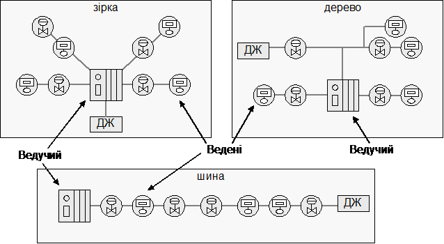

Рис.5.2. Топологія AS-I мережі (ДЖ- джерело живлення)

Реалізується AS-i інтерфейс за допомогою мікросхем ASIC (Application Specific Integrated Circuits), які інтегруються у пристрої, що підключаються до шини. Але можливе підключення звичайних датчиків і виконавчих механізмів за допомогою спеціальних модулів, які мають мікросхему ASIC.

В мережах AS-і інтерфейсу по одній парі проводів передається інформаційний сигнал і живлення ведених пристроїв. Тому для живлення AS-і шини використовуються спеціальні джерела живлення напругою 30 В різної потужності.

Для збільшення дожини лінії зв’язку можуть використовуватись повторювачі і подовжувачі лінії які дозволяють продовжити довжину лінії зв’язку ще на 100 м. Можливе сполучення двох повторювачів або одного повторювача і одного подовжувача (рис. 5.3, рис.5.4), що забезпечує загальну довжину одного сегменту до 300 м.

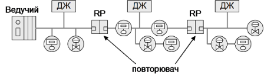

Рис.5.3. Топологія AS-i інтерфейсу з двома повторювачами

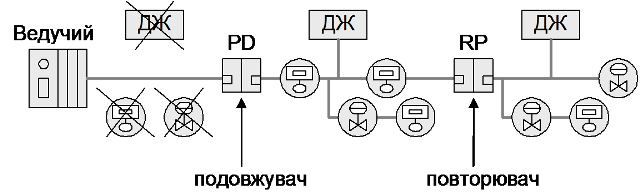

Рис.5.4. Топологія AS-i інтерфейсу з повторювачем і подовжувачем 

На відміну від інших промислових мереж AS-і інтерфейс не вимагає встановлення термінаторів на кінцях мережі.

Нагадаємо, що у якості Ведених пристроїв мережі AS-і інтерфейсу можуть бути як датчики і виконавчі механізми з вбудованим AS-і інтерфейсом (інтелектуальні пристрої), так і звичайні ведені пристрої. Перші підключаються до мережі безпосередньо, другі – через модулі вводу-виводу (МВВ). Це важливо пам’ятати, особливо на стадії проектування мережі, так як до одного сегменту мережі AS-і інтерфейсу можна підключати менше інтелектуальних ведених пристроїв, але можливості інформаційного обміну з ними більше.

Різновиди МВВ по типу пристроїв які підключаються можуть мати:

- 4 входи;

- 4 виходи;

- 2 входи + 2 виходи;

- 4 входи + 4 виходи (для специфікації 2.0);

- 2 аналогових входи;

- 2 аналогових виходи;

- 4 аналогових входи від термодатчиків Pt 100;

- і інші.

Пристрої випускаються з різними конструкціями монтажу та ступені захисту.

На рис.5.5 наведений приклад AS-i мережі.

<a href="media5/5_5.png" target="_blank">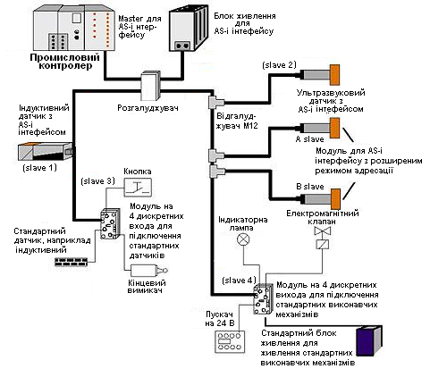</a> 

Рис.5.5. Приклад AS-i мережі

## 3. Принципи функціонування

AS-i інтерфейс – мережа з регламентованим методом доступу Ведучий/Ведений. Ведучий виконує наступні функції:

- ініціалізує систему;

- ідентифікує підключених Ведених;

- забезпечує цілісність нормального циклічного обміну даних;

- забезпечує параметризацію Ведених;

- виконує системну діагностику шини;

- забезпечує переконфігурування адрес Ведених при необхідності.

У режимі нормальної роботи системи Ведучий надсилає кадр з командою кожному Веденому в порядку їх адреси, в якому вказує значення 4-х дискретних виходів Веденого. Той відповідає на нього кадром-відповіддю, в якому надсилає інформацію про стан 4 дискретних входів. Знаючи номери (адреси) всіх присутніх Ведених на шині (до 31), він опитує їх всіх (якщо вони активовані), а потім починає цикл заново. Таким чином до одної шини AS-i можна підключити до 124(31*4) дискретних виходів та до 31\*4(124) дискретних входів одночасно. Оскільки бітова швидкість постійна, а відповідь Веденого не залежить від циклу роботи його програми, то час опитування всіх Ведених (час циклу AS-i) точно вираховується і не перевищує 5мс (для версії V2 - 10 мс).

На рис.5.6 показана спрощена схема обміну даними між Ведучим та Веденим. Комунікаційний процесор Ведучого шини автоматично (без прив’язки до циклу програми користувача) циклічно опитує всіх Ведених. Комунікаційний процесор Веденого займається відновленням вихідних буферів для ЦДП (цифро-дискретних перетворювачів), та відсилає дані з буферів ДЦП (дискретно-цифрових перетворювачів). Програма користувача (ПРК) Ведучого отримує та відсилає дані через буфер, використовуючи внутрішній інтерфейс. Така конструкція дозволяє організувати обмін на шині без участі роботи центрального процесора (ЦП), тобто розпаралелити роботу програми та шини, а також робить прозорою роботу Ведучого з даними Ведених. 

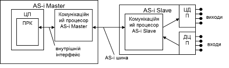

Рис.5.6. Обмін даними між Ведучим та Веденим на шині AS-i.

На рисунку 5.7 більш детально відображена внутрішня структура Ведучого та Веденого, зокрема вказані блоки даних (буфери) та їх типи. У кожного Веденого є буфер для відображення стану входів та виходів (дані процесу), який відображається у відповідному буфері Ведучого. При відправці команди на Ведений, Ведучий роміщує його вихідні дані в полі даних кадру. Ведений отримавши кадр, відновлює вихідні дані свого буферу і відправляє вхідні дані у кадрі-відповіді. Таким чином AS-i функціонує за моделлю Клієнт-Сервер обміну ідентифікованими даними (Polling). 

<a href="media5/5_7.png" target="_blank">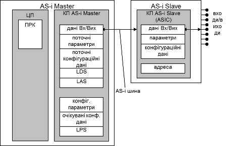</a> 

Рис.5.7. Таблиці даних (буфери) в пристроях AS-i.

Окрім буферів відображення входів/виходів (дані процесу) є також інші буфери, які коротко перерахуємо. Ведучий AS-i має наступні блоки даних: 

- образи даних, які можуть змінитися під час роботи:

  - дані Вх./Вих. (дані процесу);

  - поточні параметри – містять образ поточних параметрів AS-i Slave (параметричні дані); 

  - поточні конфігураційні дані – містять конфігурацію входів виходів і ідентифікаційні коди всіх підключених Ведених пристроїв, після їх зчитування з цих пристроїв (параметричні дані);

  - LDS (List of Detected Slaves) – список всіх знайдених Ведених пристроїв на шині;

  - LAS (List of Active Slaves) – список активованих Ведених пристроїв; обмін даними проводиться тільки з активованими Веденими;

- конфігураційні дані (параметричні дані), які вказуються користувачем при конфігурації Веденого в системі; ці дані необхідні для порівняння їх з образами реальних даних знайдених Ведених та їх конфігурації; вони як правило містяться в енергонезалежній пам’яті Ведучого: 

  - конфігураційні параметри

  - очікувані конфігураційні дані

  - LPS (List of Prospective Slaves) – список очікуваних Ведених на шині. В ньому знаходяться номери (адреси) тих Ведених, яких система очікує знайти на шині;

Ведений на шині має наступні буфери:

-  дані Вх./Вих.(дані процесу);

-  параметри (параметричні дані);

-  конфігураційні дані (параметричні дані) – конфігурація входів/виходів та ідентифікаційні коди даного Веденого („I/O Code” та „ID Code”;

-  адреса – адреса Веденого.

## 4. Етапи роботи шини AS-i

Ведучий на шині AS-i не відразу може приступити до циклічного опитування Ведених. На початку він ініціалізує свої буфери, та настроює мережні вузли. На рис. 5.8 показані стадії та етапи роботи шини.

Стадія ініціалізації, який також називають режимом не встановленого зв’язку (offline) проходить після включення живлення Ведучого. Під час ініціалізації всі вхідні та вихідні дані в буфері Вх./Вих. обнуляються, сконфігуровані (очікувані) параметри копіюються в таблицю поточних параметрів. Таблиці LDS та LAS також обнуляються.

Стадія запуску (“start-up”) проходить в два етапи: знаходження та активація. Спочатку Ведучий визначає, які Ведені підключені до кабелю AS-i і якого типу. Тип Веденого вказується в конфігураційних даних, які туди записуються при його виготовленні. Це „I/O Code” та „Identification (ID) Code”, які задають профіль Веденого пристрою. Таким чином з 1 по 31 Ведені будуть опитані Ведучим і, якщо вони існують, їхні конфігураційні дані („I/O Code” та „ID Code”) будуть добавлені в список знайдених Ведених пристроїв LDS. 

Рис.5.8. Етапи роботи шини

Після того як Ведені знайдені, вони повинні активізуватися Ведучим. В стадії нормальної роботи тільки активні Ведені приймають участь в обміні даними процесу. При їх активації розрізняють два режими роботи Ведучого пристрою:

-  Ведучий в режимі конфігурування (configuration mode): активуються всі знайдені Ведені (за виключенням тих, що мають адресу 0). В даному режимі можливе читання фактичних значень і збереження їх для конфігурування;

-  Ведучий в захищеному режимі (protected mode): активуються тільки ті Ведені, конфігурація яких („I/O Code” та „ID Code”) відповідає очікуваній конфігурації. Тобто Ведучий активує тільки тих Ведених, які знаходяться в списку очікуваних Ведених (LPS) а їх очікувана конфігурація відповідає фактичній(дійсній) конфігурації.

 Адреси всіх активованих Ведених Ведучий заносить в список LAS. Після активації всіх можливих Ведених, Ведучий вступає в стадію нормальної роботи, яка складається з трьох етапів: етап обміну даними; етап адміністрування; етап добавлення.

В стадії нормальної роботи, на етапі обміну даними, ведучий циклічно передає дані (значення виходів) активним Веденим та отримує від них відповідь (значення входів). У випадку виникнення помилки Ведучий повторює транзакцію. 

Після обміну даними з усіма активними Веденими, наступає етап адміністрування, під час якого Ведучий може відправити деяку команду Веденому, наприклад на запис параметричних даних (калібровка, порогове значення), на зміну адреси Веденого і т.д. Ці команди ациклічні і виконуються по одній на повний цикл. 

Після завершення етапу управління, настає етап добавлення, під час якого Ведучий шукає нових Ведених. З кожним новим циклом він буде давати запит на знаходження одного Веденого, якого немає в списках активних. Таким чином, для 100% успіху знаходження нового пристрою на AS-i необхідно максимум 31 цикл. У випадку виявлення такого, необхідно буде ще 3 цикли, для того щоб: прочитати „I/O Code”, прочитати „ID Code”, відправити параметричні дані. Завдяки такому механізму пристрої, які були тимчасово недоступні будуть включені знову. 

Таким чином обмін даними процесу проходить циклічно по моделі Клієнт-Сервер ідентифікованого обміну (полінг), а обмін параметричними даними ациклічно по моделі Клієнт-Сервер обміну повідомленнями. 

## 5. Формат кадру AS-i

Кадри в AS-i від Ведучого до Веденого мають фіксовану довжину незалежно від типу. Так само не змінюється формат відповіді (рис.5.8).  

<a href="media5/5_8_1.png" target="_blank">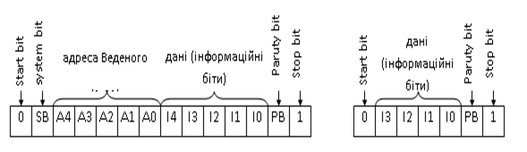</a> 

Рис.5.8. Формат кадру в AS-i: команда від Ведучого – ліворуч; відповідь Веденого – праворуч

Як видно з рисунку, для адреси виділено 5 біт, що дозволяє адресувати 32 пристрої. Адреса 0 зарезервована для механізму автоматичної адресації (розглянуто нижче), тому для Ведених залишається 31 адреса. Системний біт використовується для ідентифікації типу кадру. Для передачі даних використовується 5 інформаційних бітів, у відповіді - 4.  

Для обміну даними процесу використовується формат команди Data Exchnge, який показаний на рис.5.9. 

<a href="media5/5_9.png" target="_blank">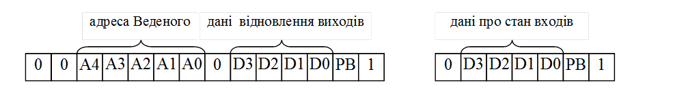</a> 

Рис.5.9. Формат команди “Data Exchange”: команда від Ведучого – зліва; відповідь Веденого – з права

Як бачимо 4-ри біти даних призначені для відправки Ведучим вихідних даних, і чотири для отримання вхідних від Веденого. 5-й інформаційний біт (тобто 4-й починаючи з 0) при передачі не використовується і завжди дорівнює нулю. Таким чином, Ведучий може передати значення 4-х дискретних виходів, а Ведений відповісти, передаючи 4 значення дискретних входів, тобто одна шина AS-i може мати одночасно до 124 дискретних входів та 124 дискретних виходів. Можливе використання 4-х бітів даних для кодування аналогової інформації. Тобто з одним кадром можна передати 4-х розрядне число, або 16 (24) різних значень, що дозволяє підключати такі засоби ЛМІ, як цифрова клавіатура. Деякі профілі передбачають підключення аналогових датчиків(виконавчих механізмів) з більшою розрядністю, обслуговуючи їх за декілька шинних циклів.

Для більшості контролерів, як Ведучих шини AS-i, читання входів і оновлення виходів Ведених пристроїв виконується автоматично (неявно) на початку і в кінці кожного циклу задачі. Це може проходити через змінні образу процесу, аналогічно як для локальних входів і виходів.

Приклад 5.1. AS-i. Мережа на базі Ведучого TSX Premium.

Завдання. Наведіть приклад адресації Ведучого AS-i шини на базі TSX Premium для входів і виходів Ведених пристроїв, відповідно схеми мережі наведеної на рис. 5.10.

<a href="media5/5_10.png" target="_blank">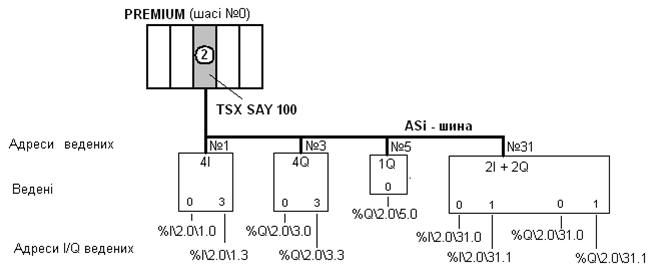</a> 

Рис.5.10.    Структура AS-i шини    

Рішення. З рис.5.10 видно, що у контролері TSX Premium в слоті 2, що знаходиться на шасі 0, встановлений модуль, який виступає у ролі Ведучого на AS-i шині (TSX SAY 100). До цієї шини підключені чотири Ведених, які сконфігуровані настпуним чином:

- ведений №1 для роботи з 4 дискретними входами;

- ведений №3 для роботи з 4 дискретними виходами;

- ведений №5 для роботи з 1 дискретним виходом;

- ведений №31 для роботи з 2 дискретними входами 2 дискретними виходами. 

 Відповідно з синтаксисом мови програмування для цього типу контролерів (рис. 5.11) адреси окремих каналів ведених наведені на рис. 5.10.

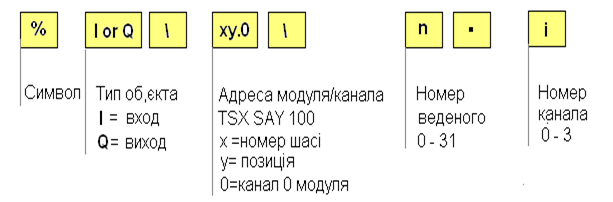

Рис.5.11. Синтаксис звертання до входів-виходів AS-i шини

Наведена адресація означає що:

- %I\2.0\1.3 – вхід 3 веденого №1, каналу 0 модуля TSX SAY 100, який розміщений у слоті № 2 шасі № 0;

- %Q\2.0\31.3 – вихід 0 веденого №31, каналу 0 модуля TSX SAY 100, який розміщений у слоті № 2 шасі № 0;

- і так далі.

## 7. Профілювання Ведучих та Ведених

Ведені пристрої, які підключаються до шини AS-i повинні підтримувати певний профіль Веденого (Slave profile), який визначений виробником і „прошитий” в пам’яті пристрою. Саме за допомогою цього профілю відрізняється спосіб обробки даних, які відсилаються на пристрій і зчитуються з нього. Він робить прозорим і простим користування розподілених засобів Вх./Вих. різного типу та від різних виробників. Профілі дозволяють нарощувати номенклатуру технічних засобів, не змінюючи при цьому протокол і не використовуючи протокол прикладного рівня. 

В AS-i профіль має формат типу X.Y та визначається двома кодами:

- I/O Code (Input/Output Code – код Вх./Вих.);

- ID Code (Identification Code – ідентифікаційний код)

I/O Code характеризує тип веденого пристрою і показує скільки Вх./Вих. можуть бути підключені до нього. Цей код може приймати значення від 0 до 1610 (0 – F16). Ведучий зчитує його через цикл після того, як знайде даного Веденого. 

ID Code призначений для відмінності пристроїв з одним і тим же I/O Code. Тобто це уточнююча інформація до типу пристрою. ID Code теж може приймати значення від 0 до 1610 (0 – F16). Ведучий зчитує його через цикл після того, як зчитає I/O Code даного Веденого. 

Таким чином можна сказати, що в профілі X.Y перше число (X) буде вказувати на I/O Code тобто на кількість вхідних та вихідних бітів даних, а друге(Y) - на I/D Code, тобто на призначення цих бітів. Всі профілі стандартизовані і визначені в AS-i Association. Це значить, що кожний новий I/O Code повинен бути підтвердженим в даній організації і визначений як стандартний. Деякі профілі наведені в 5.10.      

В залежності від можливостей та функцій, які підтримують Ведучі шини, їх відносять до одного з трьох профілів Ведучого AS-i, наведених у табл.5.1. З таблиці видно, що найбільш функціональним буде пристрій (модуль, блок) з профілем Ведучого AS-i М1, найменшим - М0.

Таблиця 5.1. Типи профілів

|                     | Тип профілю | Функціональність                                             |
| ------------------- | ----------- | ------------------------------------------------------------ |
| Мінімальний профіль | М0          | - запис та читання Вх./Вих.                                  |
| Обмежений профіль   | М2          | - запис та читання Вх./Вих.   -  модифікація параметрів Веденого |
| Повний профіль      | М1          | - запис та читання Вх./Вих.   -  модифікація параметрів Веденого   -  тестування та діагностика системи  - перевірка  відповідності очікуваної конфігурації   реальній |

## 8. Автоматична адресація

Автоматична адресація дозволяє підключати Ведені до шини під час її нормальної роботи. Ця функція доступна тільки при роботі в захищеному режимі (Protected Mode). Крім того Ведучий повинен мати профіль не менше M2. Для функціонування такої системи також необхідно, щоб були правильно сконфігуровані „очікувані” Ведені (тип, адреса та профіль).

Всі Ведені мають заводську настройку адреси рівну 0. Коли такий пристрій підключається до шини, протягом максимально 32-х циклів, на етапі добавлення, під цією адресою його знаходить Ведучий. Далі він порівнює LPS та LAS і визначає, Ведених з якими адресами немає на шині. Порівнявши їхні очікувані конфігураційні дані (профілі) він визначає претендента, якщо вони співпадають. Тобто, якщо профіль поки-що не існуючого на шині але записаного в LPS Веденого з адресою 15 співпадає з профілем свіжо-знайденого, то вважається, що це і є той самий очікуваний Ведений. Протягом декількох циклів Ведучий відішле йому його нову адресу (в нашому випадку 15) і занесе його в список активних Ведених (LAS). 

Функція автоматичної адресації може бути використана для одного пристрою за раз. Тобто, поки не ідентифікується і не активується один, інші підключені бути не можуть. Адже декілька Ведених з однією адресою (0) одночасно на шині бути не можуть.

В іншому випадку (без автоматичної адресації) адресу вказують безпосередньо на Веденому.

## 9. AS-i V2.1 та V3.0

Поява нових специфікацій говорить про розвиток даного стандарту. В специфікації AS-interface V2.1 (1998 р.) з’явилася можливість збільшити кількість Ведених пристроїв з 31 до 62. У відповідності до цієї специфікації адресний простір Ведучого, який підтримує дану можливість (профіль М3), ділиться на дві під області: А і В. Використання цих областей стосовно 31-ного Веденого дозволяє підмикати до AS-i 62 Ведених пристрої, які можуть мати до 4-х входів і до 3-х виходів. Тобто всього до шини можна підключити до 248 дискретних входів та до 186 дискретних виходів. Можливість розширеної адресації з’явилась за рахунок використання найстаршого інформаційного біту в команді Ведучого, як допоміжного біту адреси. Саме цей біт задає, до пристрою якого типу (А або В) по тій же адресі звертається Ведучий.  

Допоміжною особливістю даної специфікації є можливість організації обміну даними з аналоговими Веденими пристроями профілів 7.3 і 7.4 без використання допоміжних прикладних функцій. 

В профілі Ведених для їх ідентифікації, в доповнення до ID_Code можуть використовуватись ID1_Code та ID2_Code. Це можливо за рахунок допоміжного(додаткового) циклу а отже і фази добавлення та адміністрування. Таким чином розширений профіль має 4 поля: I/O Code; ID Code; ID1 Code; ID2 Code. 

Час циклу з максимальним набором Ведених пристроїв одного з типів (А або В) не перевищує 5 мс, як і в попередній специфікації. Якщо в AS-i версії 2.1 використовується весь адресний простір Ведучого пристрою, то Ведені пристрої А і В обслуговуються по черзі. В перший цикл обслуговуються ведені пристрої під області А, а в другий – під області В, після чого процес повторюється знову. Таким чином, сумарний час обслуговування всіх Ведених може досягати 10 мс. 

Важливо, що Ведучі, які підтримують нову специфікацію, можуть обслуговувати Ведених попередніх специфікацій. Крім того ведені типу А можуть обслуговувати Ведучі, які не підтримують розширений режим. 

У 3-й специфікації AS-i (2004 р.) кількість можливих Ведених підключених до шини з Ведучим профілю М4 збільшилась до 62, а кількість підключених дискретних датчиків та виконавчих механізмів збільшилась до 496. Крім того в новій версії з’явилась можливість зчитування значень з аналогових датчиків за один цикл шини. Загальна таблиця доступних специфікаціям профілів пристроїв наведена в таблиці. 

Таблиця 5.1 Можливості Версій AS-i 

| Версія             | V2.0                            | V2.11                                      | V3.0                                                         |
| ------------------ | ------------------------------- | ------------------------------------------ | ------------------------------------------------------------ |
| Рік випуску версії | 1994                            | 1998                                       | 2004                                                         |
| Профілі Ведучих    | M0, M1, M2                      | M3                                         | M4                                                           |
| Профілі Ведених    | всі інші профілі                | S-X.A,  S-7.3, S-7.4                       | S-7.5.5, S-7.A.5, S-B.A.5,  S-7.A.7, S-7.A.A, S-7.A.8, S-7.A.9, S-6.0 |
| Нові особливості   | 31 ведений                      | 62 Ведені, розширені ID Code, коди помилок | Синхронізація, нові коммунікац. типи                         |
| Стандарти          | EN 50295:1998  IEC 62026-2:2000 |                                            | IEC  62026-2:200X                                            |

## 10. AS-i профілі

В табл..5.2 наведений діапазон профілів Ведених пристроїв AS-i V2.0. 

Таблиця 5.2 Діапазон профілів Ведених пристроїв AS-i

<a href="media5/t5_2.png" target="_blank">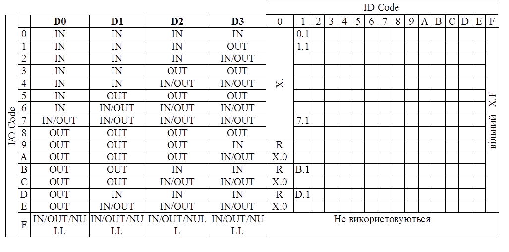</a> 

Колонки DO-D3 вказують використання бітів даних в кадрах типу Data Exchange на етапі обміну даними. Тобто IN вказує на вхідні біти, OUT – на вихідні. Наприклад для I/O Code 4 використовуються всі 4 біти в кадрі від Веденого до Ведучого, а для кадру Ведучого тільки 2-ий та 3-ий. Це може бути скажімо профіль пристрою з 4-ма дискретними входами, та 2-ма дискретними виходами. Літера R вказує на зарезервований профіль.

Профілі X.F (вільні профілі) використовуються у випадку пристроїв з сильно спеціалізованими функціями, які не знаходять широкого використання. Такі профілі також мають пристрої, які очікують стандартизації. 

Профілі X.0 мають Ведені, що не використовують якихось специфічних, наперед визначених функцій. Тобто просто віддалені пристрої Вх./Вих., I/O Code яких визначає кількість дискретних входів та виходів. 

Профіль 0.1 використовується для двох вхідних датчиків (2 канали на кожний датчик), 1.1 - для датчика з функцією тестування, B.1 - для управління двома реверсивними двигунами, D.1 - для управління двигуном з функцією тестування. 

Профіль 7.1 (аналоговий профіль) застосовується для пристроїв з двонаправленим рухом інформації (4 біти туди, 4 в зворотному напрямку) та для аналогових пристроїв. Операцію з аналоговими даними Ведучий проводить за декілька AS-i циклів. Тому для реалізації обміну з даним профілем може знадобитися штучне, тобто програмне оформлення компонування даних, в залежності від специфіки роботи Веденого. В специфікації AS-i V2.1 для роботи з аналоговими пристроями з’явилися профілі 7.3 та 7.4, які спрощують роботу з ними. 

## Контрольні запитання до розділу 5

1.   Яка область призначення мережі AS-і?

2.   Які переваги має AS-і перед іншими промисловими мережами?

3.   Які обмеження має AS-і ?

4.   Які пристрої можна підключати до AS-і?

5.   Які основне обладнання використовується при побудові мережі AS-і ?

6.   Які мережні кабелі можна використовувати при побудові AS-і?

7.   Які переваги має спеціальний "жовтий" AS-і – кабель?

8.   Яку топологію може мати мережі AS-і?

9.   Яка особливість живлення обладнання на AS-і?

10.   Яка максимальна довжина доступна для мережі AS-і? Як можна її збільшити? Яка бітова швидкість використовується? 

11.   Скільки входів виходів може мати Ведений на AS-і V2.0?

12.   Призначення буферів обміну Ведучого і Ведених?

13.   Які процедури відбуваються під час конфігурування шини і окремих її складових?

14.   В яких режимах може працювати Ведучий після активації Ведених?

15.   Поясніть схему обміну даними процесу між Ведучим та Веденими.

16.   Поясніть формат кадру команди від Ведучого.

17.   Поясніть формат кадру відповіді Веденого.

18.   Як можна вирахувати час, за який Ведучий AS-i опитає всіх Ведених на шині?

19.   Поясніть поняття профілювання пристроїв в AS-i. Перерахуйте профілі Ведучих та підтримувані ними функції. 

20.   Які типи профілів використовуються і чим вони відрізняються?

21.   Які особливості нових специфікацій стандарту AS-I V2.1 та V3.0?

22.   Чи можна використовувати на AS-i аналогові Ведені?

Теоретичне заняття розробив [Олександр Пупена](https://github.com/pupenasan). 
