[<- До підрозділу](README.md)

# Протокол CAN: теоретична частина

Протокол CAN (Controller Area Network) – одне із найбільш перспективних і популярних рішень в області промислових мереж. Поява його пов’язана з бурхливим розвитком рівня електроніки в автомобілях. Все більша кількість різнорідних датчиків та блоків управління привела до загрозливого наростання кількості проводок, що ускладнювало монтаж і надійність бортових систем управління. у другій половині 80-х років минулого століття фірма Robert Bosch GmbH (більш відома як BOSH) запропонувала рішення цієї проблеми заміною всіх проводок двохпровідною цифровою послідовною шиною, до якої б підключалися різнорідні пристрої за допомогою спеціалізованого чіп-контролера. Результатом такої роботи стала специфікація на шину CAN версії 1.1. Пізніше деякі недоліки, зокрема які стосуються питань синхронізації, були виправлені і з урахуванням цих виправлень вийшла CAN Специфікація 1.2.

Протокол CAN описаний в контексті канального та частини фізичного рівня моделі OSI. Їх функції реалізовуються у вигляді як окремих мікросхем CAN контролера, так і вбудованих в готові мікроконтролери CAN шини. На сьогоднішній день на базі CAN успішно функціонують багато промислових мереж, які доповнюють CAN додатковими протоколами верхніх рівнів. Серед найбільш популярних мереж, які базуються на CAN, є мережі CANopen, DeviceNet, CAN Kingdom, SDS (Smart Distributed System). Тим не менше, мікроконтролери CAN в поєднанні з різними трансиверами знайшли своє використання і без наявних описаних функцій прикладного рівня. Мережні рішення на базі CAN прийнято називати CAN-шинами. Для координації зусиль виробників, розробників і користувачів CAN-систем і технологій створена некомерційна організація CiA (CAN in Automation), яка включає в себе більше 300 компаній. 

Згідно специфікації версії 1.2, на канальному рівні CAN базується на широкомовній передачі, що використовує метод адресації, орієнтований на ідентифікатор повідомлення (Виробник-Споживач-msg). Тобто кожне повідомлення в мережі має унікальний 11-бітний Ідентифікаторр(IDENTIEFIER), який використовується для фільтрації прийнятих повідомлень кожним вузлом. CAN використовує множинний метод доступу CSMA/CA з використанням поля арбітражу. Для реалізації такої схеми необхідно, щоб на шині один логічний сигнал фізично домінував над іншим, тому вимогою CAN до фізичного рівня є наявність домінантного та рецесивного логічних рівнів сигналів. Послідовність домінантних та рецесивних бітів визначає пріоритет повідомлення, який задається відправником в полі арбітражу кадру, а саме в Ідентифікаторі повідомлення. Детальніше про модель адресації Виробник-Споживач-msg та метод доступу CSMA/CA можна ознайомитись в 2-му розділі. 

## 1. CAN стандарти та їх опис в контексті моделі OSI

Протокол CAN набув визнання вже після випуску першої специфікації. Однак, у зв’язку з все більшим ростом потреб, виникла необхідність в розширені одного з полів кадру (11-бітного Ідентифікатору повідомлення). Для сумісності версій, нова CAN Специфікація 2.0 дозволяє використовувати як старий формат кадру з 11-бітним Ідентифікатором, який отримав назву "стандартний формат", так і новий – "розширений формат" з 29-бітним Ідентифікатором повідомлення. Нова специфікація складається з 2-х частин:

-  Частина "А", яка описує CAN формат повідомлення такий самий, як в CAN Специфікації 1.2;

-  Частина "В", яка описує як стандартний, так і розширений формат.

Для сумісності реалізації CAN з новою специфікацією, достатньо щоб вона була сумісною з Частиною "А", або Частиною "В". Крім того, вузли реалізовані на основі специфікації CAN 1.2 або CAN 2.0 Частини "А", можуть зв’язуватись з вузлами, реалізованими на основі CAN 2.0 Частини "В", використовуючи стандартний формат повідомлення. Можливе одночасне функціонування обох форматів повідомлення на одній мережі, за рахунок наявності резервного біту в стандартному форматі кадру (розглянуто нижче).

CAN Специфікацію 2.0 також називають BOSH CAN 2.0 A/B. В контексті моделі OSI вона описує повністю канальний рівень та частину фізичного (рис.8.1). На фізичному рівні CAN 2.0 описує тільки загальні правила синхронізації, кодування бітів та вимоги до швидкодії. Однак фізичний спосіб передачі бітів, середовище передачі, роз’єми та характеристики трансиверів залишаються поза уваги специфікації. Таким чином CAN визначений повністю на підрівні МАС, частково на LLC та фізичному рівні, а також він накладає певні вимоги на реалізацію інших рівнів (фізичного та прикладного). 

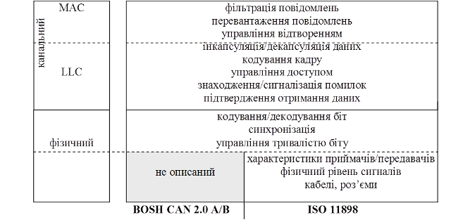

Рис.8.1. Стандарти BOSH CAN та ISO 11898 в контексті OSI-моделі

В 1993 році CAN закріпився у міжнародному стандарті ISO 11898 (CAN High Speed Transceiver and Data Link Layer). Цей стандарт, на відміну від BOSH CAN 2.0 A/B, додатково описує вимоги до високошвидкісних трансиверів та середовища передачі даних (рис.8.1.). Саме ISO 11898 використовується у багатьох мережах, які базуються на CAN (наприклад CANOpen, DeviceNet). Як правило під поняттям "CAN-шина" мають на увазі мережне рішення на базі ISO 11898. 

## 2. Організація канального рівня

### 2.1. Комунікаційні сервіси

Протокол CAN забезпечує два комунікаційні сервіси: це сервіс Запису Об’єкту (Write Object) та сервіс Читання Об’єкту (Read Object). Для обміну даними визначені два типу кадрів - Кадр Даних (DATA FRAME) та Дистанційний Кадр (REMOTE FRAME), які можуть вміщувати до 8 байт даних повідомлення.

При записі об’єкту від одного вузла (Виробника) передається Кадр Даних до одного або більше приймаючих вузлів (Споживачів) (рис.8.2).

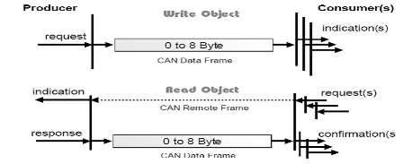

Рис.8.2. Обмін даними між вузлами мережі CAN

Сервіс Читання Об’єкту ініціюється одним або декількома Споживачами. Для цього один з цих вузлів передає Дистанційний Кадр, по якому вузол Виробник відповідає Кадром Даних. В цьому випадку потрібний Кадр Даних та Дистанційний Кадр будуть мати ідентичні Ідентифікатори. 

Широкомовність і фільтрація дає змогу прийняти Кадр Даних на всіх необхідних вузлах. У випадку одночасної передачі по шині Кадру Даних та Дистанційного Кадру з тим же Ідентифікатором, - пріоритет має (виграє арбітраж) Кадр Даних. 

### 2.2.Формати кадрів обміну даними

#### Типи кадрів 

Повідомлення виявляються і управляються чотирма різними типів кадрів:

-  Кадр Даних (DATA FRAME) – несе дані від передавача до приймача;

-  Дистанційний Кадр (REMOTE FRAME) – проводить запит на передачу Кадру Даних з тим же Ідентифікатором;

-  Кадр Помилки (ERROR FRAME) – передається будь яким пристроєм при виявленні помилки;

-  Кадр Перевантаження (OVERLOAD FRAME) – використовується для попередження про необхідність затримки до передачі наступного кадру.

Ми вже зазначали, що перші два типи кадрів служать для обміну даними і можуть бути використані як в стандартному так і в розширеному форматі. Другі два – призначені для управління роботою шини в нештатних ситуаціях. Мінімальна пауза між кадрами називається Міжкадровим Простором (INTERFRAME SPACE).

Кожний кадр складається з бітових полів. Розглянемо формати кадрів для обміну даним, починаючи з Кадру Даних (рис.8.3).

#### Формат Кадру Даних 

 

Рис.8.3. Формат Кадру Даних

Початок кадру (SOF-Start Of Frame) – складається з одного домінантного біту, який призначений для синхронізації приймачів з передавачем. Будь якій станції дозволяється займати шину для передачі, якщо вона в стані очікування, тобто в період Міжкадрового Простору. Всі вузли синхронізуються по передньому фронту сигналу біту SOF. Функція даного біту аналогічна стартовому біту при символьній передачі. 

Поле Арбітражу (ARBITRATION FIELD) – призначене для визначення пріоритету повідомлення/кадру. Склад даного поля різний для стандартного та розширеного форматів (рис.8.4). В стандартному форматі поле має 11-бітний Ідентифікатор та RTR-біт. В розширеному форматі поле має 29-бітний Ідентифікатор, SRR-біт, IDE-біт  і RTR-біт. Біти Ідентифікатору позначаються ID-28…ID-0. У попередніх специфікаціях (1.0-1.2) біт IDE стандартного формату позначався як r1.

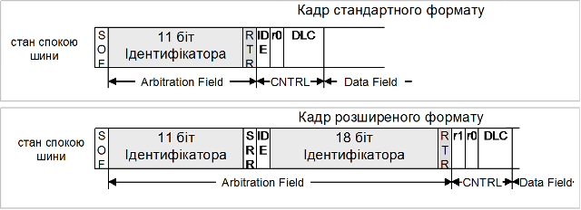

Рис.8.4. Стандартний (11 біт) та розширений (29 біт) формат Кадру Даних.

Для стандартного формату біти Ідентифікатору нумеруються по порядку від ID-28(найбільш значимий) до ID-18(найменш значимий), з яких 7 перших (ID-28...ID-22) – не можуть бути рецесивними. В розширеному форматі Ідентифікатор включає в себе дві секції: 11-бітну BaseID та 18-бітну ExtendedID. BaseID (Базовий ID) – це еквівалент Ідентифікатору в стандартному форматі і визначає базовий пріоритет в розширеному форматі. ExtendedID (Розширений ID) складається з 18 бітів, які позначаються, починаючи з ID-17, закінчуючи ID-0.

Біт RTR (Remote Transmission Request BIT) – вказує на тип кадру. Для Кадру Даних даний біт буде домінантним, для Дистанційного Кадру – рецесивним. Таким чином досягається вищий пріоритет кадру з даними над кадром з запитом на передачу цих даних при тому самому Ідентифікаторі. Однак слід відмітити, що RTR в стандартному форматі йде раніше ніж при передачі розширеного формату кадру, хоч в обох випадках – після бітів Ідентифікатору.

Біт SRR (Substitute Remote Request BIT) – існує тільки в розширеному форматі, і завжди передається в рецесивному стані. Оскільки його позиція співпадає з позицією біту RTR в стандартному форматі, то у випадку одночасної передачі кадрів стандартного та розширеного форматів, з Ідентифікатором стандартного кадру рівним BaseID розширеного, - стандартний кадр буде вигравати арбітраж. 

Біт IDE (Identifier Extension Bit) – для стандартного формату передається домінуючим, для розширеного – рецесивним.

Поле Управління (CONTROL FIELD) - складається з 6 біт (рис.8.5). Чотири з них (DLC3-DLC0) називаються Кодом Довжини Даних (DATA LENGTH CODE) і вказують на кількість байтів в Полі Даних. Інші 2 біти r1 і r0 – зарезервовані і відправляються домінантними. Однак для стандартного формату кадру на місці біту r1 стоїть біт IDE, призначення якого описано вище.

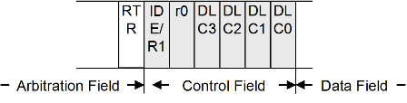

Рис.8.5. Формат ПОЛЯ УПРАВЛІННЯ

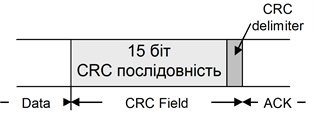

Рис.8.6. Формат ПОЛЯ CRC

Поле Даних (DATA FIELD) – складається з байтів від 0 до 8, які передаються в Кадрі Даних.

Поле CRC – використовується для перевірки контрольної суми. Воно складається з 15-бітової CRC послідовності, після якої йде рецесивний біт під назвою Розмежувач CRC (CRC DELIMITER), який служить для розмежування між послідовністю CRC та полем ACK.

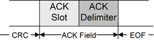

Рис.8.7. Формат Поля ACK

Поле ACK – складається з двох бітів: Слоту ACK (ACK SLOT) та Розмежувача ACK (ACK DELIMITER). Обидва біти передаються рецесивними, а отримувачі, які отримали повідомлення вірно (перевіривши CRC), замінюють Слот ACK на домінантний біт. Таким чином відправник контролює вірну доставку повідомлення.

Кінець кадру (EOF – End Of Frame) – це послідовність із семи рецесивних бітів, які вказують на кінець Кадру Даних або Дистанційного Кадру.

#### Формат Дистанційного Кадру  

Дистанційний Кадр сформований із шести полів: Початку Кадру, Поля Арбітражу, Поля Управління, Поля CRC, Поля ACK, Кінця Кадру (рис.8.8). 

Рис.8.8. Формат Дистанційного Кадру

На відміну від Кадру Даних біт RTR Дистанційного Кадру є рецесивним, а отже при одночасній передачі Кадру Даних та Дистанційного з тим самим Ідентифікатором, арбітраж виграє Кадр Даних. 

Слід зазначити, що в Дистанційному Кадрі немає Поля Даних, оскільки цей тип кадру є тільки ініціатором передачі даних. Для полів Початок Кадру, Поля Арбітражу, Поля Управління, Поля Даних, Послідовності CRC справедливе правило бітового начинення. Всякий раз, коли передавач виявляє в бітовому потоці п’ять послідовних бітів однакової величини, які повинні бути передані, він автоматично включає допоміжний біт в фактичний переданий бітовий потік, який обернений до них по рівню сигналу. Для інших полів а також для Кадрів Помилки та Кадрів Перевантаження це правило не діє. 

### 2.3. Обробка помилок та боротьба з дефектами

#### Типи помилок 

В CAN виділяються 5 різних типів помилок, які не виключають одна одну:

- бітова помилка;

- помилка начинення;

- помилка CRC;

- помилка форми;

- помилка підтвердження.

Бітова помилка (bit error) виникає, коли вузол-відправник, прослуховуючи шину при передачі, виявить інший рівень біту, ніж він передавав. Винятком являються Поле Арбітражу, Поле ACK та Пасивний Прапор Помилки, в яких вияв домінуючого біту замість рецесивного не являється помилкою.

Помилка начинення (stuff error) є результатом вияву послідовності з 6 бітів однакового логічного рівня в тих полях, де діє правило бітової начинки.

Помилка CRC (CRC error), як і в інших протоколах з перевіркою контрольної суми, виникає при відмінності розрахованої CRC з отриманим значенням в CRC Послідовності.

Помилка форми (form error) виникає, коли фіксовані бітові поля мають один або декілька незаконних бітів (домінантний біт в областях Розмежувач CRC , Розмежувач ACK або EOF).

Помилка підтвердження(acknowledgment error) завжди виникає, коли передавач не виявляє в Слоті ACK домінантного біту, що говорить про відсутність підтвердження з боку отримувача(-ів).  

#### Механізм глобалізації помилки 

У випадку виявлення одним з вузлів помилки, передача повинна припинитися, навіть якщо всі інші вузли помилок не виявили. Це досягається за рахунок глобалізації помилки, тобто штучного спотворення бітів, які передаються, задля виявлення помилок усіма вузлами. Тобто, якщо помилку виявив один із вузлів (локальна помилка), він повинен заставити всі інші вузли виявити цю помилку. Для цього, він передає послідовність із 6 домінантних бітів (Прапор Помилки), що приводить до вияву усіма іншими вузлами помилки начинення. Ті, в свою чергу, виявивши локальну помилку теж починають передавати послідовність із 6 біт (рис.8.9). 

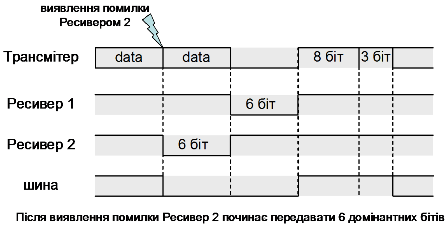

Рис.8.9. Механізм глобалізації локальної помилки

Таким чином, при виникненні помилки на шині з’явиться від 6 до 12 домінантних бітів. Ця послідовність разом з допоміжними бітовими полями формує Кадр Помилки (рис.8.10).  

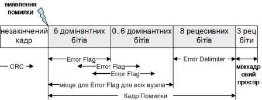

Рис.8.10. Формат Кадру Помилки

Після того, як вузол передає останній біт Прапора Помилки, він посилає рецесивний біт, з контролем його стану на шині. Як тільки цей стан з’явиться на шині (тобто всі вузли передали свій Прапор Помилки), кожний з них передає ще 7 рецесивних бітів. Ця послідовність із 8-ми рецесивних біт називається Розмежувачем Помилки (ERROR DELIMITER). Після Кадру Помилки, дочекавшись паузи із 3-х біт (Міжкадрового Простору) передавач перерваного кадру повторює його передачу знову.

#### Механізми самодіагностики 

Глобалізація помилки могла би привести до абсолютно зворотного ефекту, у випадку виходу з ладу або збоїв в роботі одного з вузлів. Наприклад, якщо вузол починає кожен раз посилати Прапор Помилки, у зв’язку з певними дефектами приймача, шина зациклиться на передачі одного й того самого інформаційного кадру. Однак в CAN визначені механізми для локалізації дефектних вузлів, які не допускають "зависання" мережі. Кожен контролер CAN оснащений засобами самоконтролю, які переводять його в один із 3-х станів:

-  активним до помилок (Active Error);

-  пасивним до помилок(Passive Error);

-  неактивний на шині (Bus Off). 

У нормальному стані вузол знаходиться в активному до помилок стані і у випадку виникнення помилки, веде себе так, як описано вище.  

Якщо вузол по певним причинам (описано нижче) перейшов в пасивний до помилок стан, то при передачі Прапора Помилки (див. рис.8.11) замість домінантних бітів він посилає рецесивні. Це значить, що у випадку виникнення локальної помилки при прийомі кадру на даному вузлі, він не зможе провести її глобалізацію, а отже всі інші вузли на шині помилку не виявлять. 

Тим не менше, при передачі кадру, пасивний до помилок вузол при виявленні помилки сам перериває свій власний кадр послідовністю із 6 рецесивних бітів. Це викличе помилку бітового начинення в інших вузлах, що приведе до глобалізації помилки. По цій причині даний вузол знову повторить передачу кадру. Щоб не зациклити шину даним кадром (адже дефектний вузол може сам спотворювати власну передачу) введена допоміжна пауза (Призупинка Передачі), під час якої інші вузли зможуть почати передачу свого кадру. Неактивний на шині вузол взагалі не приймає участь в передачі.  

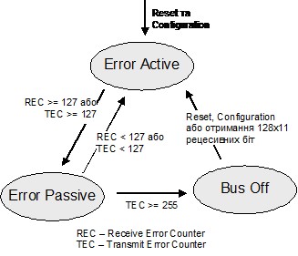

Рис.8.11. Управління станом вузла CAN

Для управління своїм станом, кожен вузол має лічильники для підрахунку помилок приймання REC (Receive Error Counter) та відправки TEC(Transmit Error Counter). На діаграмі на рис.8.11 видно, як вузол переходить з стану в стан, в залежності від значення цих лічильників. В специфікаціях CAN визначені правила збільшення/зменшення значень REC і TEC.

## 3. Реалізація фізичного рівня

Реалізація фізичного рівня для CAN-основаних мереж поділена на 3 підрівні, які описують наступні характеристики:

- PLS (Physical Signaling): кодування/декодування бітів; управління тривалістю біту; синхронізація.  

- MDA (Physical Medium Attachment): характеристики трансмітерів;

- PMI (Medium Dependent Interface): характеристики кабелів та роз’ємів.

Рівень PLS описаний в специфікації CAN 2.0 і реалізовується готовими мікросхемами контролера CAN. Рівні MDA і PMI є предметом інших промислових міжнародних або національних стандартів, або розробляється самостійно за власними специфікаціями. Найбільш загальним є стандарт ISO 11898, який визначає високошвидкісний трансивер для мереж CAN. На початку розглянемо механізми фізичного рівня, які стосуються підрівня PLS і описані в специфікації CAN, нижче розглянемо найбільш популярні способи реалізації інших підрівнів. 

Кодування біт проводиться методом NRZ. Для синхронізації вузлів необхідні фронти, по яким генератор приймача підстроїться під генератор передавача. Для цього CAN кадр починається зі спеціального стартового біту (поле SOF), який переводить шину з рецесивного стану в домінантний. Такий механізм в CAN називається жорсткою синхронізацією (hard synchronization). Далі, під час передачі інших біт з різною полярністю приймач також підстроюється під передавач при зміні сигналу з рецесивного на домінантний стан, використовуючи механізм ресинхронізації (resynchronization). 

## 4. CAN-сумісні стандарти

CAN Специфікація 2.0 є основою для багатьох популярних мереж, тому не описує рівні, які знаходяться вище канального, та частину фізичного. Так, наприклад, є декілька офіційних і промислових стандартів, які визначають підрівень MDA:

- CAN High-Speed (ISO 11898-2) – високошвидкісний;

- CAN Low-Speed (ISO 11519-1) – низькошвидкісний; 

- Fault-Tolerant Transceivers (ISO 11898-3) – стійкий до помилок,  використовуються в автомобільній бортовій електроніці; 

- Truck/Trailer Transceiver (ISO 11992) –  використовується німецьким стандартом LBS(DIN 9684)для машин сільського господарства;

- Single-Wire (SAE 2411) –  однопроводний зв’язок;

- Fiber Optical Transmission – волоконно-оптична передача; 

- Wire-Less Transmission – безпровідна передача;

- Power-Supply Transmission – живлення пристроїв по шині.

Протоколи верхніх рівнів описані в стандартах мереж CANopen, CAN Kingdom, DeviceNet , SDS (Smart Distributed System) та інших. Багато з них базуються на стандарті ISO 11898, тому його розглянемо детальніше. 

### 4.1. Стандарт ISO 11898

#### Загальний огляд ISO 11898 

Стандарт ISO/IS 11898 (Road vehicles. Interchange of digital information. Controller area network (CAN)) складається з п’ятьох частин:

-  ISO 11898-1: описує канальний рівень та частину фізичного аналогічно як в CAN 2.0 частини А;

-  ISO 11898-2: стандарт високошвидкісного доступу до шини, описує трансивери, параметри передачі даних та фізичне середовище для реалізації на фізичному рівні;

-  ISO 11898-3: стандарт низькошвидкісного, стійкого до помилок доступу до шини, описує трансивери, параметри передачі даних та фізичне середовище для реалізації на фізичному рівні;

-  ISO 11898-4: описує обмін даними по часовому тригеру

На відміну від CAN 2.0 частини А, в ISO 11898-1 значення поля DLC може бути більш ніж 8 (до 15). Однак в специфікації від BOSH не визначена жодна з помилок в такій ситуації, що значить про сумісність в реалізації обох стандартів. Додатково визначений новий необов’язковий режим, в якому може перебувати вузол: моніторинг шини (Bus monitoring mode). В цьому режимі вузол може тільки слідкувати за передачею, однак не передавати дані самому.

Для систем з регламентованим часом відновлення даних, може знадобитися допоміжна функція, яка описана в ISO 11898-4 (TTC – Time Triggered Communication). Ця функція визначає умови для генерації повідомлення кожним вузлом через певні інтервали часу, що виключає одночасний доступ до шини декількох пристроїв і дозволяє проводити так зване "планування кадрів". Для реалізації такого функціонування необхідне однакове "проходження часу" на кожному пристрої, що досягається за рахунок синхронізації внутрішніх лічильників по біту SOF або по точці синхронізації останнього біту поля EOF. На основі TTC полегшується створення глобальної системи часу на реалізації верхніх рівнів OSI для мереж, основаних на CAN. Однак використання режиму TTC заперечує використання Кадрів Перевантаження та Кадрів Помилки та повторення передачі кадру у випадку помилки. Реалізовується функція TTC як підрівень між LLC та MAC.

#### ISO 11898-2 

Стандарт ISO 11898-2 описує високошвидкісні трансивери CAN, та вимоги до фізичного середовища. Кожен вузол підключається до шини, яка складається з двох ліній, які називаються CAN_H і CAN_L. Для забезпечення мінімізації ефекту відбиття сигналу в кінцях ліній використовуються узгоджувальні резистори номіналом 120 Ом (рис.8.12).

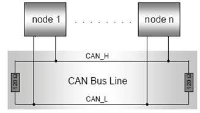

Рис.8.12. Підключення вузлів до CAN мережі по ISO 11898

Використовується диференційний спосіб передачі по напрузі: вузлами ідентифікується рецесивний біт, якщо різниця потенціалів між CAN_H і CAN_L не перевищує 0.5 В, домінантний – якщо більше ніж 0.9 В. Номінальна напруга в домінантному стані – 3.5 В для лінії CAN_H і 1.5 В для CAN_L (рис.8.13). 

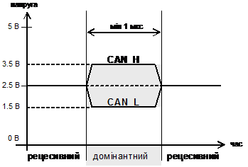

Рис.8.13. Домінантний та рецесивний біти в ISO 11898-2 ПЕРЕВАНТАЖЕННЯ

ISO 11898-2 сумісні вузли являють собою мікроконтролер (mC) та CAN-контролер, які підключені до трансивера, що живиться 5 В (рис.8.14). 

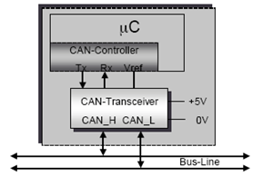

Рис.8.14.  Конструкція CAN-вузлів ISO 11898

Максимально припустима довжина лінії зв’язку визначається різними фізичними обмеженнями, пов’язаними з характеристиками вузлів та кабелю. Використовуючи трансивер згідно ISO 11898-2 і високошвидкісну опторозв’язку можна досягнути максимальної довжини 9 метрів при бітовій швидкості 1 Мбіт/с. При менших швидкостях ця довжина може істотно бути збільшена. В таблиці 8.1 показана довжина лінії, яка може бути досягнута при використанні ISO 11898 сумісного трансивера зі стандартним шинним кабелем, без урахування опторозв’язки. 

Таблиця 8.1. Припустима довжина лінії зв´язку

| БІТОВА ШВИДКІСТЬ | Довжина лінії  зв’язку |
| ---------------- | ---------------------- |
| 1  Мбіт/с        | 30 м                   |
| 800 кбіт/с       | 50 м                   |
| 500 кбіт/с       | 100 м                  |
| 250 кбіт/с       | 250 м                  |
| 125 кбіт/с       | 500 м                  |
| 62,5 кбіт/с      | 1000 м                 |
| 20 кбіт/с        | 2500 м                 |
| 10 кбіт/с        | 5000 м                 |

 Враховуючи велику популярність ISO 11898-2 серед CAN-сумісних промислових мереж, визначимо його загальні характеристики.

-     сумісний з BOSH CAN 2.0 А;

-     використовується симетрична передача по напрузі між CAN_H та CAN_L;

-     середовище передачі – вита пара з характеристичним хвильовим імпедансом 120 Ом;

-     бітова швидкість вибирається з ряду від 10 кБіт/с до 1 Мбіт/с (таб.8.1); підтримка 20 Кбіт/с – обов’язкова;

-     топологія – шина, з короткими відгалуженнями (до 0,3 м при 1Мбіт/с);

-     максимальна довжина лінії зв’язку до 1000 м;

-     два обов’язкових термінальних резистори 120 Ом (108 Ом - 132 Ом) на кінцях лінії;

-     максимум 64 пристрої на один сегмент.

### 4.2. Протоколи прикладного рівня для мереж CAN

 Необхідність у використанні функцій прикладного рівня для мереж CAN породила ряд мережних рішень, деякі з яких дуже схожі між собою. Серед найбільш популярних протоколів прикладного рівня, які базуються на CAN є  CANopen, DeviceNet, CAN Kingdom, SDS (Smart Distributed System). На сьогоднішній день вони стандартизовані в міжнародних стандартах. Зокрема, в EN 50325 описані наступні промислові мережі:

- EN 50325-1 2002 Industrial communications subsystems based on ISO 11898 (CAN) for controller device interfaces - part 1: general requirements;

- EN 50325-2 2000 Part 2: DeviceNet;

- EN 50325-3 2000 Part 3: Smart Distributed System;

- EN 50325-4 2002 Part 4: CANopen.

Крім того в серії стандартів МЕК Industrial Communication Networks (IEC 61158, IEC 61784, IEC 61918) теж стандартизовані деякі рішення, зокрема DeviceNet (у складі сімейства СІР). Загальна картина прикладних рішень на базі CAN показана на рис.8.15. Більшість з них базується на  ISO 11898. 

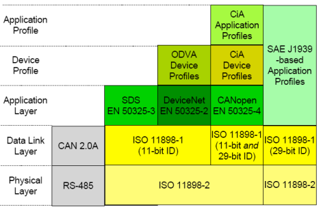

Рис.8.15. Мережі на базі технології CAN

## 5. Реалізація CAN

Декілька компаній реалізують протоколи CAN у вигляді готових мікросхем, задача яких полягає у забезпеченні основних послуг зв’язку: передача даних, запит на дані, слідкування за помилками та їх ідентифікація. Всі існуючі реалізації використовують контролери CAN, функції та інтерфейс яких сумісний з моделлю реалізації від BOSH. Відмінності заключаються в акцептованій фільтрації, можливості буферизації кадрів та використання деяких додаткових функцій.

Є декілька варіантів реалізації всієї системи обміну з використанням протоколу CAN (рис.8.16):

- з окремо виділеним CAN-контролером;

- з інтегрованим CAN-контролером в мікроконтролер;

- з використанням єдиного чіп сету разом з трансивером;

Перевага першого способу реалізації заключається в багатофункціональності та гнучкості. Такий підхід має місце у випадках використання протоколу верхніх рівнів, які базуються на різних реалізаціях канального та фізичного рівня, або навпаки – коли один і той самий контролер CAN використовується для різних мереж (мультипротокольна реалізація, шлюзи і т.д.). 

Інтеграція CAN контролера разом з мікроконтролером збільшує швидкодію взаємодії між складовими та зменшує навантаження на процесори. Ціна такого рішення, порівняно з попереднім способом, як правило нижча, а надійність - вища.

Для систем розподіленого вводу/виводу більш доцільним є використання єдиного мікроконтролера з реалізацією протоколів всіх рівнів. Недоліком таких систем є відсутність можливості комбінації різноманітних технологій тобто гнучкості.

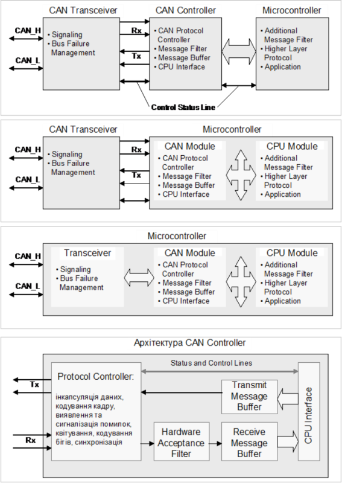

Рис.8.16. Різні варіанти реалізації CAN-вузлів

Окрім контролера протоколу кожен CAN-чіп має вбудований акцептований фільтр для фільтрації повідомлень, буфери для кадрів даних що передаються та відправляються. Реалізація цих функцій а також інтерфейсу з CPU можуть відрізнятися в залежності від реалізації CAN-чіпа. 

CAN – дуже цікаве рішення в області промислових мереж. З одного боку він надзвичайно складний в функціонуванні (і в розумінні), з іншого – надійний і ефективний. Окрім того, наявність великої кількості компонентів CAN (від фірм Intel, Philips, Siemens, Motorola) робить систему недорогою. 

## Контрольні запитання до розділу

1) На яких рівнях моделі OSI описаний протокол CAN? Якими засобами необхідно доповнити мікроконтролер CAN для можливості побудови мережі? 
2) Який метод доступу до шини та модель адресації використовується в CAN? Розкажіть про їх принципи функціонування. 
3) Що таке Ідентифікатор повідомлення і для чого він використовується в CAN шинах?

3. Які CAN стандарти існують на сьогоднішній день і чим вони відрізняються?
4. Яку типи комунікаційних сервісів використовуються в протоколі CAN? Якими типами кадрів забезпечується передача даних? 
5. Як реалізовуються функції Запису Об’єкту та Читання Об’єкту?
6. Якими типами кадрів забезпечується ідентифікація помилки та затримка передачі наступного кадру?
7. За допомогою якого поля кадру даних забезпечується синхронізація приймача з передавачем?
8. Розкажіть про призначення Поля Арбітражу в кадрі даних. З яких частин складається це поле? Які типи Ідентифікаторів Ви знаєте? Як визначається пріоритетність Кадру Даних над Дистанційним Кадром?
9. Який кадр буде вигравати арбітраж стандартний чи розширений? Поясніть чому?
10. Як контролюється вірність доставки даних отримувачем? Як контролюється вірність доставки даних відправником?
11. Поясніть, чому Дистанційний Кадр не має Поля Даних?
12. Які типи помилок виявляються в CAN? 
13. Що таке глобалізація помилки і навіщо вона потрібна? Розкажіть про механізм функціонування глобалізації помилки.
14. Яким чином в CAN реалізовується захист шини від роботи несправних вузлів? В яких станах може знаходитись вузол CAN з точки зору реакцій на помилки?
15. Які функції описує CAN на фізичному рівні? Які функції необхідно додатково реалізувати на фізичному рівні для мереж, які базуються на протоколі CAN?
16. Які механізми використовуються в CAN для синхронізації трансмітерів між собою?
17. Які стандарти, що базуються на CAN, та описують характеристики трансмітерів Ви знаєте?
18. Що описує стандарт ISO 11898?
19. Розкажіть про основні характеристики CAN-шини на базі ISO 11898-2: спосіб передачі бітів, топологія, правила термінування, максимальна довжина ліній зв’язку та відгалужень, бітова швидкість, максимальна кількість пристроїв.
20. Які протоколи верхніх рівнів базуються на CAN протоколі?
21. Які Ви можете назвати варіанти реалізації вузлів CAN?   

Теоретичне заняття розробив [Олександр Пупена](https://github.com/pupenasan). 
