[<- До підрозділу](README.md)

# CANOpen: теоретична частина

CANOpen – це мережна система, яка базується на послідовній шині CAN. Сама назва "CANOpen" говорить про відкритий стандарт з самого початку його створення, який розроблений і підтримується некомерційною організацією CiA Потужність рішень протоколу CAN задіяна в зручних для використання сервісах прикладного рівня CANOpen. CANOpen підтримує передачу даних процесу в реальному часі, циклічний та ациклічний зв’язок, забезпечує можливість синхронної передачі та відмінний захист від помилок. 

## 1. CANOpen в контексті моделі OSI

CANOpen є продуктом від організації CiA і описується серією стандартів та специфікацій, які розвиваються і доповнюються. Розглянемо що представляє собою дана мережа в контексті моделі OSI (рис.9.1).

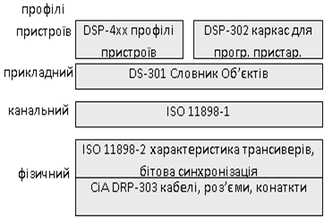

Рис.9.1. CANOpen в контексті OSI-моделі

На фізичному та канальному рівні CANOpen базується на CAN контролері та високошвидкісного трансиверу, які визначені ISO 11898 у частинах 1 та 2. Додатково до них вказані вимоги до бітової синхронізації, характеристики кабелів та роз’ємів. Нижні рівні доповнені протоколом прикладного рівня, комунікаційними профілями та Каркасами (Frameworks) для програмованих пристроїв. Для спрощення механізму обміну з різнорідними пристроями в CANOpen використовується сімейство різнорідних стандартизованих профілів. Таким чином мережа CANOpen описується системою стандартів:

-  ISO 11898-1 та ISO 11898-2 фізичний та канальний рівень;

-  CiA DRP-303-1 – опис рекомендованих характеристик кабелів і рознімів;

-  CiA DRP-303-2 – визначення одиниць СІ та префіксів;

-  CiA DS-301 – прикладний рівень та комунікаційний профіль;

-  CiA DSP-302 – каркас для Програмованих пристроїв;

-  CiA DS-4XX – множина профілів пристроїв.

## 2. Особливості реалізації фізичного рівня

Фізичний рівень, як видно з рис.9.1, базується на ISO 11898-2 з додатковими вимогами, які стосуються формування біту, а також рекомендацій до використання кабелів, роз’ємів та їх контактів. 

Згідно ISO 11898-2 у мережі використовується диференційна передача напруги по двом проводам CAN_H та CAN_L відносно загальної землі CAN_GND (див. розділ 8). Для надійної роботи на шині з довжиною більш ніж 200 метрів рекомендується використання опторозв’язок, а більш ніж 1 км – мостів та повторювачів. 

Крім правил формування бітів в CANOpen додатково визначені рекомендовані кабелі, роз’єми та їх контакти. Стандарт CiA DRP-303-1(CiA Draft Recommendation) рекомендує використовувати кабель з хвильовим опором 120 Ом та з характеристиками, наведеними у табл. 9.1, для шини, яка має менш ніж 64 вузлів.

Таблиця 9.1. Характеристики шини

<a href="media9/t9_1.png" target="_blank">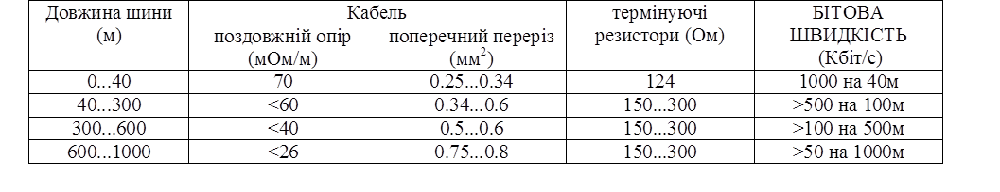</a> 

Кабелі відгалуження краще підбирати з поперечним розрізом 0.25 – 0.34 мм2. Крім опору кабелю необхідно враховувати опір роз’ємів, який повинен бути в межах 2,5 – 10 МОм. В даній рекомендації вказуються також випадки, в яких можна не використовувати термінатори лінії. 

В цій же рекомендації визначені декілька типів роз’ємів та їх контактів (рис.9.2 – 9.5). Найбільш популярний з них 9-піновий sub-D конектор (DIN 41652 або відповідний до нього міжнародний стандарт), який сумісний з стандартом CiA DS-102 (CAN physical layer for industrial applications). Контакти CAN_H і CAN_L є основними і використання їх обов’язкове. Хоч контакт CAN_GND не вказаний як опціональний, при повністю гальванічно-розв’язаних мережах CAN його можна не використовувати. На кожному із вузлів контакти GND і CAN_GND повинні бути з’єднані. CAN_V+ використовується для підключення зовнішнього живлення 24В у випадку необхідності живлення трансиверів і опто-розв’язки для гальванічно-розв’язаних вузлів на шині.

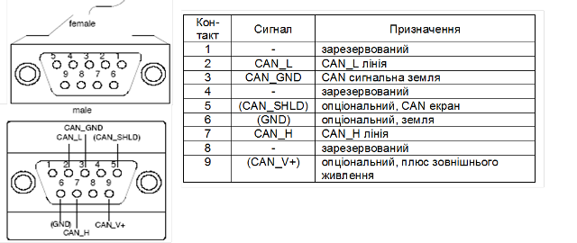

Рис.9.2. Призначення контактів 9-пінових SUB- D конекторів

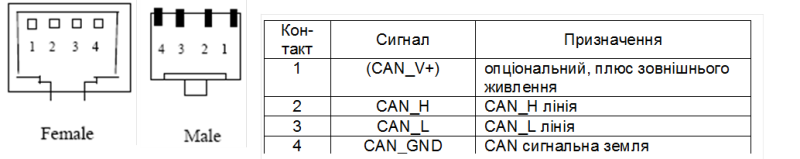

Рис.9.3. Призначення контактів RJ-45 конекторів 

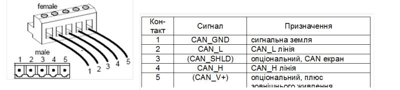

Рис.9.4. Призначення контактів конекторів типу Open Style

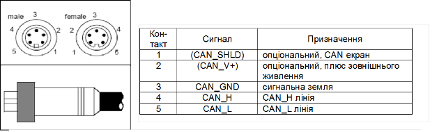

 Рис.9.5. Призначення контактів 5-пінових конекторів типу Mini Style 

Приклад.9.1. CANOPen. Побудова схеми мережних з’єднань для CANOpen на базі засобів Schneider Electric. 

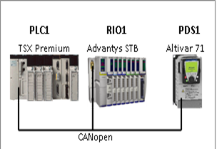

Рис.9.6. Структурна схема системи до прикладу 9.1 

Завдання. Необхідно підібрати технічні засоби та розробити схему мережних з’єднань для CANOpen відповідно до наведеної на рис.9.6 структури до якої входять: PLC1 – TSX Premium (модель в даному випадку не має значення); RIO1 – розподілена система вводу виводу Advantys STB з модулями вводу/виводу DDI3610 (6 входів) та DDO3610 (6 виходів);. PDS1 – частотний перетворювач Altivar 71.

Рішення. Для засобів Шнейдер Електрик рішення на базі CANOpen на сьогоднішній день є одним із базових в системах розподіленого управління, аналогічно як Profibus DP для Siemens. Тому всі необхідні аксесуари (кабелі відгалужувачі, коробки підключення) які необхідні для побудови мережі CANOpen є готовими до використання без додаткової зборки. Виключенням хіба що є сам магістральний кабель, який повинен підключатися до коробок відгалуження. 

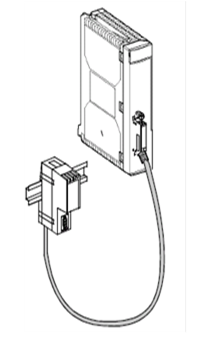

Рис.9.7. Зовнішній вигляд карти TSX CPP110 з відгалуженням

Для підключення ПЛК TSX Premium та TSX Micro до мережі CANOpen використовується комунікаційна карта TSX CPP110 формату PCMCIA. Ця карта поставляється разом з кабелем відгалуження, який в кінці має коробку підключення з вбудованим 9-піновим SUB-D роз’ємом (рис.9.7). Таке виконання дає можливість уніфікувати кабелі відгалуження.

Для підключення модульного острову вводу/виводу Advantys STB необхідно вибрати базовий комунікаційний модуль. Звісно, що це буде модуль для CANOpen, наприклад STB NCO 2212 (рис.9.8). Підключення до модуля виконується через 9-піновий SUB-D конектор, який знаходиться безпосередньо на модулі.      

Для підключення TSX Premium та Advantys STB на великі відстані можна використати коробки відгалуження, які поєднані магістральним кабелем. В нашому прикладі ми використаємо 4-х портову коробку відгалуження (рис.9.9) з вбудованим термінатором лінії.  

Частотні перетворювачі Altivar 71 мають вбудований порт Modbus/CANOpen з типом роз’єму RJ-45. Підключення до магістральної шини рекомендується проводити з використанням спеціальної коробки відгалуження VW3 CAN TAP 2 (рис.9.10). Ця коробка має 2 порти RJ-45 для підключення частотних перетворювача (ATV1 та ATV2) за допомогою кабелю VW3 CA RR 1 та порт для підключення ПК (PowerSuite). Останній дозволяє в режимі роботи системи по Modbus RTU налаштовувати частотні перетворювачі за допомогою спеціального конфігураційного забезпечення PowerSuite. Крім того, дана коробка має вбудований термінатор лінії. 

Схема мережних з’єднань показана на рис.9.11. Специфікація мережних засобів та вузлів дана в таблиці 9.6.

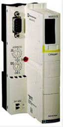

Рис.9.8. Комунікаційний модуль CANOpen STB NCO 2212

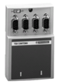

Рис.9.9. Коробка відгалуження TSX CAN TDM4 на 4 порти типу Sub-D 9-pin

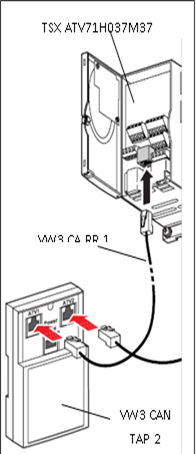

 Рис.9.10. Підключення ATV71 до коробки відгалуження VW3 CAN TAP 2

Таблиця 9.6.  Специфікація мережних засобів

| №    | Позна-чення | Назва                                                        | Тип           | Кіль-кість | Фірма |
| ---- | ----------- | ------------------------------------------------------------ | ------------- | ---------- | ----- |
| 1    | PLC1        | ПЛК TSX Premium                                              | TSX 57204M    | 1 шт.      | SE    |
| 2    | RIO1 (KK2)  | Острів віддаленого вводу/виводу Advantys STB, з комунікаційним модулем CANOpen AdvabtysSTB | STB NCO 2212  | 1 шт.      | -//-  |
| 3    | PDS1        | Частотний  перетворювач Altivar71 для управління асинхронним двигуном | ATV71H037M3   | 1 шт.      | -//-  |
| 4    | KK1         | Комунікаційна PCMCIA карта CANOpen для TSX Micro/Premium     | TSX CPP110    | 1 шт.      | -//-  |
| 5    | KМ1,KМ2     | Магістральний кабель (подвійна екранована вита пара для  CANOpen) | TSX CAN CA100 | 40 м       | -//-  |
| 6    | KM3,КМ4     | Кабель для підключення пристроїв по CANOpen, з обох боків 9-пінова SUB-D розетка, 1 м. | TSX CAN CADD1 | 1 шт.      | -//-  |
| 7    | KM5         | Кабель для підключення пристроїв по CANOpen, з обох боків RJ-45 вилка, 1м | TSX CAN CARR1 | 1 шт.      | -//-. |
| 8    | KП1, КП2    | Коробка підключення пристроїв до магістральної шини CANOpen з 4-ма портами типу 9-пінова SUB-D вилка | TSX CAN TDM4  | 1 шт.      | -//-  |
| 9    | КП3         | Коробка підключення частотних перетворювачів Altivar до магістраль-ної шини CANOpen, 3 порти RJ-45 розетка (2 –  CAN, 1 – Modbus RTU) | VW3 CAN TAP 2 | 1 шт.      | -//-  |

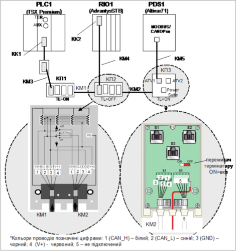

 Рис.9.11. 

Як видно зі схеми в обох кінцях лінії, на коробках підключення необхідно перемикачем виставити термінатори лінії. 

Слід зауважити, що всі елементи підключення від Шнейдер Електрик зроблені згідно CiA DS-102 (для прикладу порівняйте підключення кабелю КМ2 до клем S4 з рис.9.4). Тобто поз.5-9 специфікації з таблиці 9.6. можна замінити на аксесуари власного виготовлення. 

Приклад 9.2. CANOpen. Побудова схеми мережних з’єднань для CANOpen на базі засобів VIPA та LENZE. 

Завдання. Необхідно підібрати технічні засоби та розробити схему мережних з’єднань для CANOpen відповідно до наведеної структури на рис.9.12, до якої входять:  PLC1 – VIPA 200V з процесором, що має вбудований CANOpen інтерфейс (CPU 214CAN); RIO1 – розподілена система вводу виводу VIPA 200V; PDS1 – частотний перетворювач Lenze 8200 Servo.

Рішення. Для підключення розподіленої системи вводу виводу VIPA 200 до CANOpen використовується інтерфейсний модуль VIPA IM253CAN. Цей модуль, а також процесорний модуль CPU 214CAN мають SUB-D 9-піновий роз’єм типу вилка, який відповідає стандарту CiA DS-102. Всі інші аксесуари для підключення (кабелі, конектори, коробки відгалуження) підбираються відповідно до вимог цього ж стандарту.

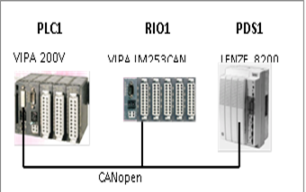

Рис.9.12. Структурна схема системи до прикладу 9.2.

У Lenze є декілька спеціальних моду-лів для підключення частотного перетворю-вача 8200 Servo до CANOpen. Серед них – функціональний модуль E82ZAFCC – CAN System Bus. У цього модуля є свої особливості, щодо використання в CANOpen. Основні з них – це можливість роботи частотних перетворювачів без NMT-Ведучого,та відсутність профілю CANOpen для частотного перетворювача. Нижче (в іншому прикладі) ми розглянемо ці особливості більш детально. Слід зазначити, що в Lenze існують модулі, які підтримують CANOpen на всіх рівнях профілів. Враховуючи відсутність готових аксесуарів, схема мережних з’єднань наведена на рис.9.13. Специфікація мережних засобів та вузлів дана у таблиці 9.7.

Таблиця 9.7. Специфікація мережних засобів

| №    | Позна-чення | Назва                                                        | Тип            | Кіль-кість  | Фірма |
| ---- | ----------- | ------------------------------------------------------------ | -------------- | ----------- | ----- |
| 1    | PLC1        | ПЛК VIPA 214 CAN з  вбудованим інтерефейсом CANOpen          | VIPA 214-2CM02 | 1 шт.       | VIPA  |
| 2    | RIO1 (MK1)  | Система віддаленого вводу/виводу VIPA 200V на базі IM253 CAN | VIPA 253-1CA01 | 1 шт.       | VIPA  |
| 3    | PDS1        | Частотний  перетворювач Lenze 8200 Vector для управління асинхронним  двигуном 0,37 кВт | E82EV371K2C    | 1 шт.       | Lenze |
| 4    | MK2         | Функціональний модуль CAN System Bus для Lenze 8200          | E82ZAFCC       | 1 шт.       | Lenze |
| 5    | KK1,KK2     | 9-піновий SUB-D коннектор типу розетка                       |                | 2 шт.       |       |
| 6    | KМ1,KМ2     | Магістральний кабель, подвійна екранована вита пара для  CANOpen | TSX CAN CA100  | 40 м   40 м | SE    |
| 7    | KМ3,KМ4     | Кабель  відгалуження,  подвійна екранована вита пара для CANOpen | TSX CAN CA100  | 1 м   1 м   | SE    |
| 8    | XT1,  XT2   | Клемна колодка  з 4 клем                                     | TSX CAN CADD1  | 2 шт.       |       |
| 9    | Rt1,  Rt2   | Резистор 120 Ом (0.25 Вт)                                    |                | 2 шт.       |       |

На схемі мережних з’єднань показано підключення PLC1 до клемної колодки XT1 кабелем KM3, та розпайку конектору КК1. Аналогічно проводиться підключення КК2 до ХТ2. Для клемних колодок, конекторів та резисторів виробник не вказаний, оскільки це не має принципового значення. В якості кабелів вибраний стандартний кабель, який пропонується від Шнейдер Електрик. Однак можна вибрати кабель іншого виробника, який задовольняє стандартам CiA DRP-303-1.

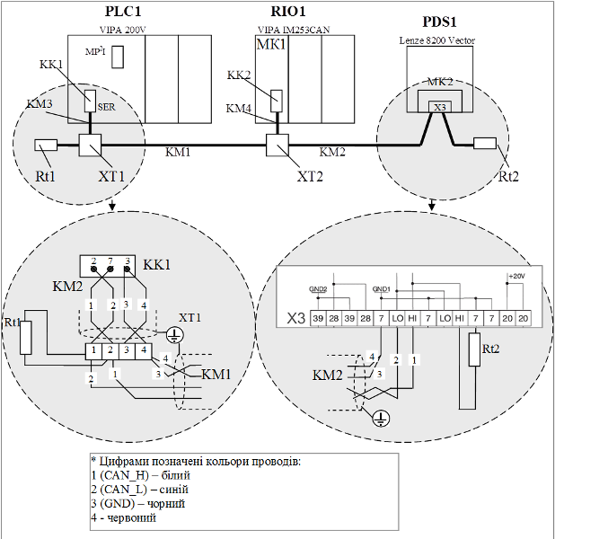

 Рис.9.13. Схема мережних з’єднань до прикладу 9.2

Приклад 9.3. CANOpen. Побудова схеми мережних з’єднань для CANOpen на базі засобів UNITRONICS та LENZE. 

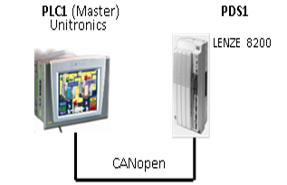

Рис.9.14. Структурна схема системи до прикладу 9.3.

Завдання. Необхідно підібрати технічні засоби та розробити схему мережних з’єднань для CANOpen відповідно до наведеної на рис.9.14 структури, до якої входят:  PLC1 – Unitronics має вбудований CAN інтерфейс, який можна використати в режимі CAN-bus або CANOpen. 

Рішення. Для підключення до CAN  частотного перетворювача Lenze необхідний відповідний комунікаційний модуль E82ZAFCC001, який сумісний з CANOpen. Схема мережних з’єднань буде мати вигляд, як на рис.9.15.

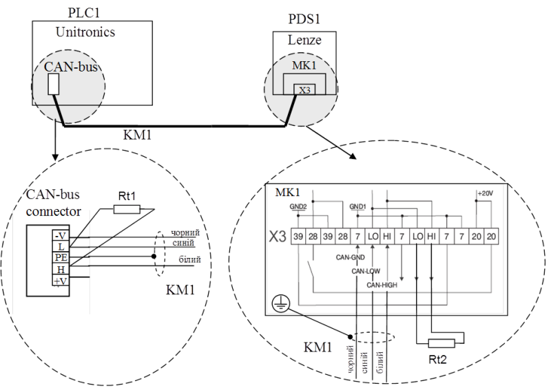

Рис.9.15. Схема мережних з’єднань до прикладу 9.3.

Таблиця 9.8 Специфікація мережних засобів

| №    | Позна-чення | Назва                                                        | Тип           | Кіль-кість | Фірма      |
| ---- | ----------- | ------------------------------------------------------------ | ------------- | ---------- | ---------- |
| 1    | PLC1        | ПЛК Unitronics Visio570                                      | Visio570      | 1 шт.      | Unitronics |
| 2    | PDS1        | Частотний перетворювач Lenze 8200 Vector для управління асинхронним  двигуном 0,37 кВт | E82EV371K2C   | 1 шт.      | LENZE      |
| 3    | MK1         | комунікаційний модуль для роботи в мережі CAN частотних перетворювачів Lenze 8200. | E82ZAFCC001   | 1 шт.      | LENZE      |
| 4    | KM1         | Кабель екранована вита пара                                  | TSX CAN CA100 | 100 м      |            |
| 5    | Rt1,Rt2     | Резистор 120 Ом (0,25 Вт)                                    |               | 2 шт.      |            |

## 3. Базові принципи функціонування

### 3.1. Модель обміну

#### Прикладні Об’єкти та Словник Об’єктів 

Для обміну даними між прикладними Процесами вузлів використовуються Прикладні Об’єкти (Application Objects), які зберігають ці дані в структурованому вигляді. Базовим поняттям прикладного рівня є Словник Об’єктів (Object Dictionary), який вміщує Прикладні Об’єкти, які доступні для обміну, їх типи та опис. Іншими словами, дві прикладні сутності вузлів обмінюються даними через доступні в Словнику Прикладні Об’єкти.

#### Адресація Об’єктів в Словнику 

Кожний Прикладний Об’єкт в словнику має унікальну адресу (індекс), яка складається з 16-бітового Індексу (Index) та 8-бітового Під-індексу (Subindex). Саме по ним проводиться доступ до необхідного об’єкту в Словнику (рис.9.16). 

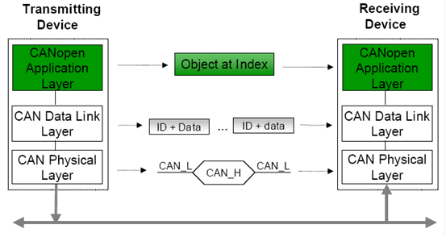

Рис.9.16. Принципи обміну даними між пристроями в CANOpen.

#### Комунікаційні Об’єкти канального рівня 

На канальному рівні обмін відбувається за допомогою Комунікаційних Об’єктів COB (Communication OBject) різних форматів, які передаються CAN-кадрами. Поле Ідентифікатора CAN-кадру відповідає Ідентифікатору СОВ (COB-ID). На фізичному рівні високошвидкісний трансивер передає задані послідовності бітів відповідно до стандарту ISO 11898-2 (рис.9.16).

Параметри Комунікаційних Об’єктів також зберігаються у Словнику Об’єктів, та мають свій Індекс. Крім того, у Словнику зберігаються типи даних, які використовуються для опису Прикладних та Комунікаційних Об’єктів. Таким чином Словник Об’єктів – це центральна частина моделі вузла CANOpen. 

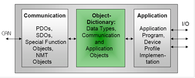

Рис.9.17. Модель пристрою CANOpen

#### Модель пристрою CANOpen 

З точки зору моделі CANOpen кожний пристрій складається з трьох частин (рис.9.17). В центрі моделі знаходиться Словник Об’єктів – набір типів та структурованих даних, які приймають участь в мережному обміні: дані процесу (внутрішні змінні, входи/виходи), їх типи, інформація про способи їх оновлення, конфігураційні параметри пристрою, комунікаційні параметри каналу і таке інше. Всі об’єкти згруповані в Словнику по їх Індексам. Так наприклад в діапазоні 1 по 9Fh знаходяться типи даних, з 1000h по 1FFFh дані комунікаційного профілю і т.д. 

Словник являється проміжним буфером між прикладною програмою пристрою та шиною. Тобто прикладна програма не займається безпосереднім інтерфейсом з шиною, а забезпечує опитування та оновлення значень Прикладних Об’єктів в Словнику. Комунікаційний інтерфейс забезпечує обміном об’єктами Словнику з мережею за допомогою спеціальних сервісів. Така структура забезпечує максимальну швидкодію та гнучкість.   

### 3.2. Комунікаційні сервіси

Канальний рівень CANOpen повинен забезпечити передачу даних між вузлами. Він представляє собою реалізацію CAN (ISO 11898), яка оперує стандартними кадрами з 11-бітним ідентифікатором або розширеними 29-бітними, в залежності від реалізації CAN-контролеру. Контролер CAN не зможе безпосередньо реалізувати обмін Прикладними Об’єктами між пристроями на шині. Очевидно, що додатково повинен існувати механізм за допомогою якого всі операції з Прикладними Об’єктами переводяться всього в два типи CAN кадрів: Кадр Даних та Дистанційний Кадр. Крім того, об’єми даних, які ці кадри повинні "переносити", часто перевищують 8 байт, що потребує передачі декількох CAN-кадрів для реалізації транзакції. 

У CANOpen є декілька типів сервісів для реалізації функцій переносу Прикладних Об’єктів. Всі вони використовують спеціальні Комунікаційні Об’єкти. В залежності від того, який сервіс використовується Комунікаційні Об’єкти діляться на 4-ри групи:

-  Process Data Object (PDO) – для ідентифікованого обміну даними процесу в реальному часі; 

-  Service Data Object (SDO) – для читання чи запису об’єктів по їх адресі у Словнику Об’єктів (обмін параметричними даними);

-  Special Function Objects (SFO) – реалізовують додаткові функції: Синхронізаційний Об’єкт (SYNC) – для синхронізації повідомлень; Аварійний Об’єкт (EMCY) – для аварійних повідомлень; Об’єкт Часовий Відбиток (Time Stamp Object) – для чіткого визначення часу події; 

-  Network Management (NMT) Objects – для управління станом мережі та пристроїв (ініціалізація, слідкування за помилками, управління станом пристрою): NMT повідомлення; Об’єкт Завантаження (Boot-Up Object); Об’єкт Контролю Помилок (Error Control Object).

Відповідно до цих Комунікаційних Об’єктів формується CAN-кадр з певним Ідентифікатором та заповненим полем даних. Серед наведених типів комунікаційних об’єктів тільки PDO та SDO займаються переносом значень Прикладних Об’єктів, а інші два сервіси являються службовими. 

Об’єкти PDO використовуються для реал-тайм обміну ідентифікованими даними процесу (до 8 байт на PDO) в синхронному або асинхронному, циклічному/періодичному чи ациклічному режимах. Обмін PDO налаштовується при конфігурації мережі.

Об’єкти SDO призначені для обміну параметричними даними та даними процесу великого обсягу, шляхом доступу з мережі до Об’єктів Словника по їх індексу (Індекс+Під-індекс). Це аперіодичний клієнт-серверний тип обміну повідомленнями. Обсяг даних, які можна передати за рахунок SDO теоретично не обмежений.    

### 3.3. Основи функціонування сервісу PDO

#### Призначення та типи об’єктів PDO 

Сервіс PDO (Process Data Object) забезпечує функціонування ідентифікованого обміну Комунікаційними Об’єктами PDO. Під сервісом PDO розуміється весь набір функцій, які забезпечують таке функціонування. Комунікаційний Об’єкт PDO – це по суті структура, яка відображає дані процесу (Прикладні Об’єкти). Кожен PDO Об’єкт є унікальним у мережі і має свій унікальний COB-ID ідентифікатор, який співпадає з Ідентифікатором кадру, яким він передається. Параметри Об’єктів PDO розміщуються в Словнику Об’єктів вузлів. 

Об’єкти PDO вміщують дані, які повинні передаватися/прийматися в реальному часі. PDO, який містить дані для відправки по мережі, називають Transmit-PDO (T-PDO), а для приймання даних - Receive-PDO (R-PDO). CANOpen забезпечує відправку даних від T-PDO до R-PDO, які мають однакові COB-ID. 

Для відправки одного об’єкту T-PDO використовується один Кадр Даних CAN, який як відомо може вміщувати не більше 8 байт (див. розділ 8). З цього витікає, що один PDO об’єкт вміщує не більше 8 байт даних. Передача PDO відбувається за моделлю Виробник-Споживач. Сервіс не потребує підтвердження, що значно зменшує мережний трафік, і робить можливим передачу даних процесу в реальному часі. Додатково про модель Виробник-Споживач можна ознайомитися у розділі 2.

#### Реалізація зв’язку  T-PDO з R-PDO

Функціонування сервісу PDO проілюстровано на рис.9.18. PDO Producer вміщує T-PDO з певним COB-ID (позначений ID). Він відправляє Кадр Даних з ідентифікатором ID, в області даних якого розміщується наповнення T-PDO. Вузли, в яких існують R-PDO з COB-ID рівним ID (позначені як PDO Consumer), перепишуть значення даних в наповнення R-PDO. 

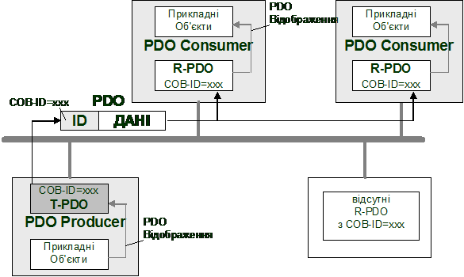

Рис.9.18. Обмін даними за допомогою PDO

Ідентифікатори PDO, тобто їх COB-ID, зв’язують T-PDO та R-PDO логічним каналом, який так і називається Link (Зв’язок). Інформація про ідентифікатори COB-ID, налаштування обміну та наповнення PDO так само знаходяться в Словнику Об’єктів, як і сам PDO. Таким чином процес зв’язку та наповнення об’єктів PDO проводиться шляхом зміни інших Об’єктів із Словника. Це робиться за допомогою службових сервісів та спеціальних конфігураторів, які розглянуті нижче. 

#### Зв’язок даних PDO з Об’єктами Словнику 

Джерелом даних для T-PDO є значення певних Об’єктів Словнику. Так само отримувачами даних R-PDO теж є Об’єкти Словнику. Зв’язок Об’єктів Словнику з наповненням PDO називається PDO-Відображенням (PDO-Mapping). На рис.9.19 показано яким чином відбувається Відображення. В настройках PDO послідовно вказуються індекси Об’єктів (Індекс + Під-індекс), які необхідно відобразити на цей PDO. У вказаному на рисунку прикладі це об’єкти A (тип Unsigned16), В (тип Unsigned8) та С (тип Unsigned8) з відповідними умовним індексами xxxx.xx, yyyy.yy та zzzz.zz. При передачі Т-PDO з таким відображенням, на канальному рівні сформується CAN Кадр Даних, в полі даних якого послідовно передадуться значення об’єкту В (1 байт), А (2 байти), С (1 байт).   

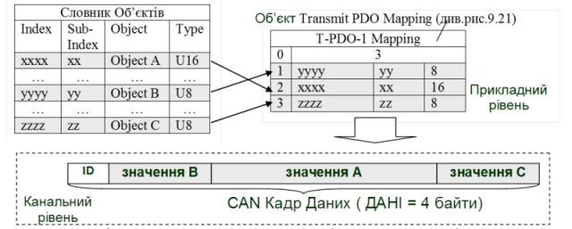

 Рис.9.19. Відображення Прикладних Об’єктів на PDO (PDO-Відображення) 

Враховуючи обмеження на об’єм даних в PDO розміром 8 байт, максимальна кількість Прикладних Об’єктів, які можуть відобразитися у ньому дорівнює 64-м (64 дискретних значень = 8х8 біт). 

Конфігураційні параметри Відображення T-PDO та R-PDO знаходяться у Словнику з наступними Індексами (рис.9.20):

-  Transmit PDO Mapping Parameter (1A00-1BFFh)

-  Receive PDO Mapping Parameter (1600-17FFh);

Конфігураційні параметри відображення представляють собою Об’єкти типу PDO Mapping Parameter. Сам тип теж знаходиться в Словнику Об’єктів під індексом 21h(рис.9.20). Тип визначає масив структурних даних, в якому нульовий запис вказує на кількість елементів в масиві, а наступні - являються безпосередньо елементами, 32-бітне значення яких вказують на розміщення та розмір відображених Об’єктів. Зокрема перші 8-біт вказують на розмір відображеного Об’єкту, наступні 8 на Під-індекс, та останні 16 – на Індекс.   

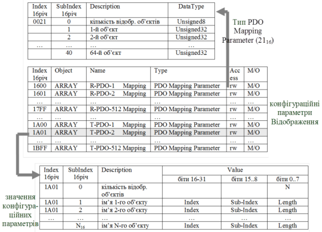

Рис.9.20. Параметри відображення PDO 

#### Комунікаційні параметри обміну PDO 

Крім PDO-Відображення, необхідно також налаштувати такі комунікаційні параметри обміну PDO, як порядок ініціації передачі T-PDO, часові затримки, тощо. Для цього в Словнику Об’єктів є спеціальні записи з типом Communication Parameter (20h) (рис.9.21):

-  Receive PDO Communication Parameter (1400-15FFh);

-  Transmit PDO Communication Parameter (1800-19FFh);

 Призначення полів структури Communication Parameter ми розглянемо в 9.4.3.

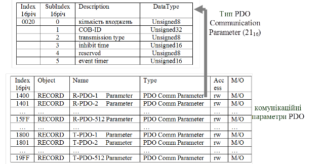

 Рис.9.21. Комунікаційні параметри PDO: Об’єкти Communication Parameter (знизу); структура типу Communication Parameter (зверху)  

#### Основні властивості сервісу PDO

Підводячи підсумки, виділимо основні властивості сервісу PDO:

-  сервіс PDO забезпечує обмін даними процесу в реальному часі;

-  Комунікаційний Об’єкт PDO – це структурні дані, які відображають значення Прикладних Об’єктів зі Словника Об’єктів; цей процес відображення називається PDO-Відображення;

-  в кожному вузлі розміщується два типи PDO: T-PDO, які призначені для передачі та R-PDO – які призначені для отримання даних;

-  T-PDO передається одним CAN Кадром Даних в широкомовному режимі з Ідентифікатором рівним COB-ID цього T-PDO; R-PDO вузлів з таким саме COB-ID приймають ці дані (модель Виробник-Споживач);

-  T-PDO та R-PDO з однаковими COB-ID називаються зв’язаними, а процес присвоєння їм рівних ідентифікаторів – Зв’язуванням;

-  параметри настройки обміну об’єктами PDO, їх типи та об’єкти відображення зберігаються в спеціальних Об’єктах Словника; 

-  максимальна кількість PDO об’єктів в мережі обмежена і дорівнює 512;

Зміна Об’єктів Словника, які відповідають за настройку PDO-обміну може проводитись шляхом використання сервісів SDO та NMT, які розглянуті нижче. 

### 3.4. Базові концепції конфігурування та адміністрування мережі (NMT-Сервіси)

#### Загальні принципи функціонування NMT 

Враховуючи, що область застосування CANOpen це системи розподілених польових засобів управління рівня датчиків, які необхідно конфігурувати та діагностувати, - в протоколі визначений механізм адміністрування мережі. Сервіси, які призначені для адміністрування CANOpen називаються NMT-Сервісами (Network Management), і забезпечують управління та діагностування роботи пристроїв на мережі. Функції адміністрування мережі виконує один із вузлів, який зветься NMT-Ведучий (NMT-Master), всі інші вузли називаються NMT-Ведені (NMT-Slave). Кожний вузол в CANOpen має свою унікальну адресу NODE-ID (від 1 до 127). 

Не слід плутати поняття "NMT-Ведучий" з "Ведучим шини" або "NMT-Ведені" з "Веденими шини". NMT-Ведучий – аналог адміністратору мережі. Він конфігурує всі інші вузли, керує їх операційним станом, діагностує їх роботу, однак не регламентує порядок їх доступу до шини, оскільки в CANOpen (так як і в CAN) використовується випадковий метод доступу з арбітражем (див. розділ 8). А в мережах з централізованим методом доступу типу Ведучий-Ведений – Ведучий шини регламентує доступ до шини для передачі.

NMT-Ведучий бере на себе наступні функції:          

-  ініціалізація вузлів NMT-Ведених;

-  спостереження за станом мережі та її вузлів;

-  завантаження/вивантаження конфігураційних даних вузлів. 

#### Конфігурування NMT-Ведених 

Однією з функцій NMT-Ведучого є конфігурування NMT-Ведених вузлів. Процес конфігурування – це зміна значень потрібних об’єктів в Словнику NMT-Веденого вузла. Запис та читання цих значень проводиться за допомогою SDO-об’єктів по їх Індексу та Під-індексу.

З точки зору розробника мережі, налаштування NMT-Ведучого для конфігурування NMT-Ведених може проводитись різними шляхами:

1) за допомогою явної організації в прикладній програмі обміну Об’єктами SDO;

2) за допомогою спеціалізованої програми (конфігуратора мережі) та файлів EDS; 

Перший спосіб використовується в основному в тих випадках, коли недоступний другий спосіб, наприклад для контролерів з підтримкою безпосереднього обміну кадрами CAN, що надають прямий інтерфейс до канального рівня (наприклад ОПЛК Unitronics). Однак для інших систем, при наявності доступу з прикладної програми до сервісів SDO, можна також організувати перенесення конфігураційних Об’єктів Словнику.  

Другий спосіб автоматизує процес конфігурації NMT-Ведених. Він базується на використанні вбудованих або зовнішніх конфігураторів мереж. Процес конфігурування проходить з використанням файлів EDS (Electronic Data Sheet), в яких у визначеному стандартом форматі зберігається інформація про пристрої. Більша частина цієї інформації представляє собою опис Об’єктів Словника. Таким чином, використовуючи конфігуратор з підключенням EDS-файлів для необхідних типів пристроїв, процес створення конфігурації зводиться до зміни конфігураційних параметрів вузлів системи. Завантаживши конфігураційні дані в вузол NMT-Ведучого, той сам організовує передачу необхідних конфігураційних SDO в NMT-Ведений а також його ініціалізацію та запуск. Продемонструємо це на прикладах.

Приклад 9.4. CANOpen. Створення базової конфігурації CANOpen для ПЛК Premium. 

Завдання. Створити конфігурацію мережі CANOpen для NMT-Ведучого типу ПЛК Premium та налаштувати всі вузли для роботи системи, показаної в задачі 9.1, якщо:

- PLC1 - є NMT-Ведучим з адресою NODE-ID=127;
- RIO1 - NMT-Ведений з адресою NODE-ID=1;
- PDS1- NMT-Ведений з адресою NODE-ID=2;

Бітова швидкість для мережі дорівнює 1 Мбіт/с.

Рішення. Налаштування швидкості та адреси для RIO1 (Advantys STB модуль NCO 2212) проводиться за допомогою вбудованих перемикачів (рис.9.22). Для налаштування швидкості передачі даних, перед увімкненням живлення засобу, нижній перемикач необхідно переключити в позицію BAUD RATE а верхній (вибір бітової швидкості) - в позицію 7 (1 Мбіт/с). Після включення живлення, Advantys запам’ятає вказану швидкість. Адреса пристрою задається комбінацією позицій обох перемикачів: верхній – десятки, нижній – одиниці. Для нашої задачі виставляємо: верхній=0, нижній =1.

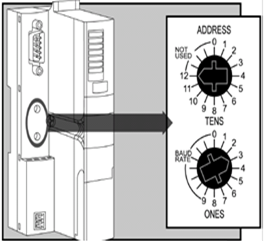

Рис.9.22. Налаштування адреси та БІТОВА ШВИДКІСТЬ для Advantys 

  Налаштування частотного перетворювача PDS1 проводиться за допомогою зовнішньої панелі настройки (можливий варіант – використання спеціалізованого ПЗ - PowerSuite). Виставляємо наступні настройки: CANOpen address=2, CANOpen bit rate = 1 Mbps. 

Для частотного перетворювача необхідно виставити наступні додаткові настройки:

|                                           |             |                                              |
| ----------------------------------------- | ----------- | -------------------------------------------- |
| Drive Menu-> Command->Ref.1.Channel       | CANOpen     | 1 Канал заданої частоти двигуна   - CANOpen  |
| Drive Menu->  Command->Ref.2.Channel      | HMI         | 2 Канал заданої частоти  двигуна - панель    |
| Drive Menu->  Command->Cmd. channel 1     | CANOpen     | 1 Канал управління двигуном - CANOpen        |
| Drive Menu-> Command->Cmd. channel 2      | HMI         | 2 Канал управління двигуном-  панель         |
| Drive Menu->  Command->Profile            | I/O Profile | вибраний профіль                             |
| Drive Menu->  Command->Cmd Switching      | Ch1 Active  | активний канал для управління -  1           |
| Drive Menu-> Command->Copy  Channel 1<->2 | Cmd+ref     | копіювання між каналами:  команди та частота |
| Drive Menu-> Command->F1  key assignment  | T/K         | Призначення кнопки F1– переключення каналів  |
| Drive Menu-> Command->HMI  Cmd            | STOP        | дозволити зупинку двигуна з  панелі          |

Для створення конфігурації мережі для NMT-Ведучого, тобто ПЛК TSX Premium, окрім програм PL7 PRO або Unity PRO, необхідне додаткове спеціалізоване ПЗ – SyCon. Порядок створення конфігурції наступний:

1. Створюється проект конфігурації мережі на SyCon та записується на диск (рис.9.23);

2. Створюється конфігурація ПЛК NMT-Ведучого, тобто TSX Premium, в якій замовляється комунікаційна карта TSX CPP110;

3. Для комунікаційної карти вказується файл проекту мережі, створений за допомогою SyCon (рис. 9.24). 

Для роботи в SyCon необхідні EDS файли для STB NCO 2212, ATV71H037M3 та TSX CPP110. 

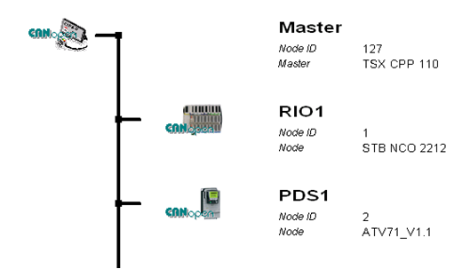

 Рис.9.23. Вигляд конфігурація мережі в SyCon. 

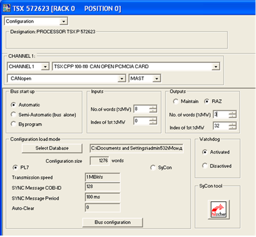

Рис.9.24. Вигляд конфігурація мережі в SyCon. 

Приклад 9.5. CANOpen. Створення базової конфігурації CANOpen для ПЛК VIPA. 

Завдання. Створити конфігурацію мережі CANOpen для NMT-Ведучого типу ПЛК VIPA та налаштувати всі вузли для роботи системи, показаної в прикладі 9.2, якщо:

- PLC1 - являється NMT-Ведучим з адресою NODE-ID=127;
- RIO1 - NMT-Ведений з адресою NODE-ID=1;
- PDS1- NMT-Ведений з адресою NODE-ID=2;
- Бітова швидкість для мережі дорівнює 1 Мбіт/с.

Рішення. Швидкість передачі та адреса модулю IM253CAN налаштовуються за допомогою селектора ADR (рис.9.25). Перед його включенням, селектор встановлюють в позицію 00. Включивши пристрій, протягом 5 с, за допомогою селектора вибирається потрібна швидкість (00 – 1 Мбіт/с), після чого вибрана швидкість запам’ятовується в енергонезалежну пам’ять. Далі вводять потрібну адресу (01 – NODE-ID=1).

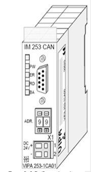

Рис.9.25. Зовнішній вигляд модуля VIPA IM253CAN

  Частотний перетворювач Lenze налаштовується з пульта або за допомогою спеціалізованого ПЗ PowerDrive. Виставляються наступні параметри: C0350 = 2 (номер NODE-ID), C0351 = 4 (1 Мбіт/с), C0352 = 0 (Lenze являється NMT Slave). Настройки активуються після перезапуску частотного перетворювача. 

 Для створення конфігурації мережі для NMT-Ведучого, тобто ПЛК VIPA, окрім програм WIN PLC7  або STEP 7, необхідне додаткове спеціалізоване ПЗ WinCoCT. Порядок створення конфігурції наступний:

1. Створюється проект конфігурації мережі на WinCoCT та експортується в файл з розширенням wld. (рис.9.26);

2. Створюється конфігурація ПЛК NMT-Ведучого, тобто VIPA200 за допомогою програм WIN PLC7  або STEP 7;

3. Імпортується wld файл в проект ПЛК, як DB2000(9.27). 

Для роботи в WinCoCT необхідні EDS файли для всіх вузлів. 

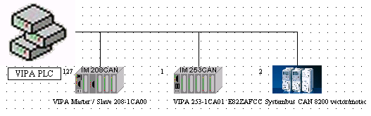

Рис.9.26. Вигляд конфігурація мережі в WinCoCT

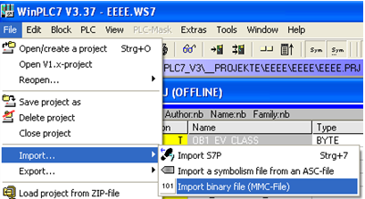

Рис.9.27. Імпорт конфігурації в проект WinPLC7. 

#### Діаграма станів NMT-Веденого

Процес функціонування NMT-Сервісів для управління вузлами прокоментуємо по діаграмі станів NMT-Веденого (рис.9.28). Після включення живлення пристрою, він проходить стадію внутрішньої ініціалізації (Initialization), в якій проводить тестування та налаштовує параметри комунікаційного зв’язку (виставляє бітову швидкість, призначає адресу вузла, назначає COB-ID по змавоченню і т.д.). Після цього, при відсутності внутрішніх помилок, NMT-Ведений переходить в Передопераційний режим (Pre-Operational). У цьому режимі NMT-Ведучий може обмінюватися даними з NMT-Веденим, використовуючи тільки сервіси SDO, обмін об’єктами PDO в цьому режимі недоступний. В Передопераційному режимі NMT-Ведучий використовуючи сервіси SDO може конфігурувати NMT-Ведені вузли, зокрема налаштувати параметри обміну PDO. 

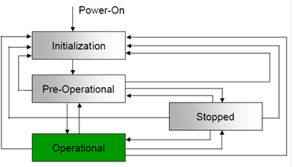

Рис.9.28. Діаграма станів NMT-Веденого

Після зміни необхідних конфігураційних даних в Словнику Об’єктів NMT-Веденого, NMT-Ведучий переводить його в Операційний режим (Operational), в якому обмін даними з NMT-Веденим може проводитись як через SDO так через PDO Об’єкти. NMT-Ведучий може переводити NMT-Веденого в будь який із режимів, показаних на рис. 9.28, зокрема в режим Стоп (Stopped), при якому недоступний обмін ні PDO, ні SDO.

#### Команди NMT

Переведення вузла з режиму в режим відбувається за рахунок спеціального NMT-Об’єкта (рис.9.29). Цей об’єкт передається від NMT-Ведучого до NMT-Ведених одним CAN Кадром Даних з Ідентифікатором рівним 0 (призначений всім вузлам). Значення перших двох байт даних в кадрі визначають тип команди (CS) і адресу вузла призначення (NODE-ID). Адреса вузла надається йому перед переходом в Передопераційний режим за допомогою вбудованих в нього засобів (наприклад DIP-перемикачами). Якщо в NMT-об’єкті NODE-ID=0, то команда призначається всім вузлам мережі. Тип команди може приймати значення:

-  старт Операційного режиму (CS=1);

-  стоп  (CS=2);

-  переведення у Передопераційний режим(CS=80h, );

-  перезапустити вузол (CS=81h);

-  перезапустити комунікацію (CS=82h).

Таким чином використовуючи NMT-Об’єкт, NMT-Ведучий переводить NMT-Ведених в потрібний режим, а використовуючи SDO-Об’єкти – виконує їх конфігурацію. Нагадаємо, що в CANOpen всі Комунікаційні Об’єкти мають унікальний COB-ID, який передається в Ідентифікаторі CAN Кадру Даних. Це значить, що для прийому Об’єктів з відповідним COB-ID, NMT-Ведений повинен налаштувати на них вхідний фільтр (див. розділ 8). NMT-Об’єкт має 0-вий Ідентифікатор і приймається усіма вузлами, а його зміст визначає кому призначена команда. Для можливості обміну з NMT-Веденим іншими Комунікаційими Об’єктами, в CANOpen визначена примусова схема розподілення ідентифікаторів COB-ID по замовченню (див.9.3.5).

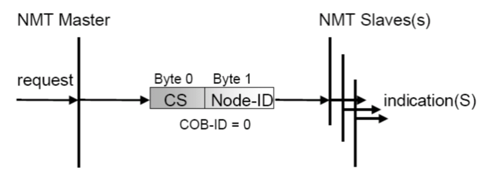

Рис.9.29. Структура NMT-Об’єкту

Приклад 9.6. CANOpen. Конфігурування мережі CANOpen з використанням ПЛК Unitronics та частотних перетворювачів Lenze. 

Завдання. Налаштувати всі вузли для роботи системи, показаної в прикладі 9.3 та написати програму в ПЛК для управління станом LENZE, якщо:

- PLC1 – являється NMT-Ведучим з адресою NODE-ID=1;
- PDS1 – NMT-Ведений з адресою NODE-ID=2;
- БІТОВА ШВИДКІСТЬ для мережі дорівнює 125 Кбіт/с.

Рішення. Частотний перетворювач Lenze налаштовується з пульта або за допомогою спеціалізованого ПЗ PowerDrive. Виставляються наступні параметри: C0350 = 2 (номер NODE-ID), C0351 = 2 (125 Кбіт/с), C0352 = 0 (Lenze являється NMT Slave). Настройки активуються після перезапуску частотного перетворювача

Зі сторони контролера фрагмент програми, що відповідає за обмін в мережі CAN та CANOpen має вигляд наведений на рис. 9.30. В блоці CAN_Layer_2, при першому старті контролера налаштовується тип протоколу та бітова швидкість на комунікаційному порті. 

<a href="media9/9_30.png" target="_blank">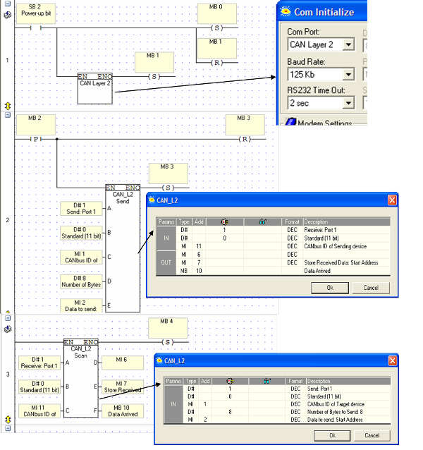</a> 

 Рис. 9.30. Програма для ПЛК UNITRONICS до прикладу 9.6

Для відправлення кадру використовується блок CAN_L2_Send, де настроюється:

-  номер порту, А = 1 (порт 1);

-  кількість біт в ідентифікаторі, В = 0 (11 бітний);

-  в якій змінній будуть знаходитися дані ідентифікатора COB-ID, С= МІ1 (внутрішнє слово);

-  кількість байт даних для відправки, D=8 (8 байт, CAN поле Кадру Даних);

-  номер першої змінної буфера даних для відправки, Е=МІ2.

Таким чином необхідний COB-ID вказується в змінній МІ1, а 8 байт даних знаходяться в змінних MI2- MI5.  

Для переводу частотного перетворювача LENZE в різні режими функціонування, необхідно з ПЛК відіслати широкомовний NMT-Об’єкт (COB-ID=0), з відповідною командою CS, для NODE-ID=2. Тобто телеграми відправки будуть мати вигляд, як на рис.9.31. Тобто MI1=0 (COB-ID), CS знаходиться в молодшому байті змінної MI2, а NODE-ID – у старшому.

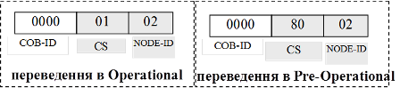

Рис.9.31. Телеграми NMT-Об’єктів для переводу в різні режими вузла з NODE-ID=2

Для отримання відповіді використовується блок CAN_L2_Scan, де встановлюються такі настройки: вхідні – номер порту (А); кількість біт в ідентифікаторі (В), в якій змінній будуть знаходитися дані ідентифікатора (С); вихідні – змінна, в якій знаходиться значення кількості отриманий байт; номер першої змінної, в якій знаходяться отримані дані “user data“ (Е); біт активності отриманого кадру (Е).

### 3.5. Схема розподілення Ідентифікаторів по замовченню

#### Загальна схема розподілу COB-ID

NMT-Ведучий використовує NMT-Об’єкт для переводу вузлів в різні стани. Оскільки COB-ID (Ідентифікатор CAN-кадру) NMT-Об’єкта дорівнює 0, вузли всіх фільтрів пропустять цей кадр. Для обміну іншими Комунікаційними Об’єктами (SDO, PDO, SFO), необхідно щоб вони мали Ідентифікатори відмінні від нуля. Призначення COB-ID можна проводити через сервіс SDO, записавши їх в конкретні записи Словнику. Однак для цього необхідно, щоб хоча б один серверний SDO на кожному вузлі вже мав унікальний COB-ID.

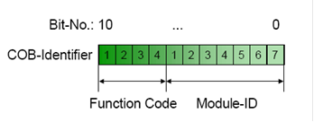

Рис.9.32. Схема присвоєння Ідентифікаторів. 

Тому в CANOpen визначена обов’язкова схема розподілення ідентифікаторів COB-ID по замовченню. Розподіл наперед визначених COB-ID проходить в момент ініціалізації NMT-Веденого і базується на використанні ідентифікаторів модулів вузла (Module-ID), які в свою чергу поєднані з NODE-ID. Module-ID може виставлятись апаратно (перемикачами) або через інший інтерфейс пристрою. Схема розподілення Ідентифікаторів по замовченню складається з функціональної частини (Function Code), яка визначає призначення об’єкту та Module-ID (рис.9.32).

Схема розподілу визначає COB-ID для одного Об’єкту Emergency, одного SDO, 4-рьох T-PDO та 4-рьох R-PDO, одного NodeGuard. 

Більшість ідентифікаторів COB-ID можна змінити за допомогою SDO, однак частина з них доступна в Словнику тільки для читання. Це ідентифікатори для (див. табл.9.9): 

-  NMT-Об’єкту (0); 

-  SDO-Об’єкту по замовченню (1409-1535 і 1537-1663);

-  NMT Error Control (1793-1919);

-  NMT, LMT та DBT сервісів (2015-2031);

-  Safety-relevant Data Objects (SRDO) (257-384) 

#### Схема Ідентифікації SDO 

Функціонування сервісу SDO описане в 9.4.2. Обмін між Клієнтським та Серверним SDO проводиться через два Комунікаційні Об’єкти з кожного боку: Transmit-SDO (T-SDO) та Receive-SDO(R-SDO). Механізм розподілу COB-ID T-SDO/R-SDO по замовченню для Серверних SDO дає можливість в Передопераційному режимі обмінюватися даними NMT-Ведучому з потрібними NMT-Веденими. 

Кожний NMT-Ведений містить принаймні один Серверний SDO. Для цього Об’єкту функціональна частина T-SDO в двійковому вигляді має по замовченню значення FunctionCode=1011b а R-SDO – FunctionCode=1100b. Наприклад для 1-го вузла, ідентифікатори Серверних SDO-об’єктів будуть рівними:

T-SDO-1 = 10110000001b=581h

R-SDO-1 = 11000000001b=601h

#### Схема Ідентифікації PDO

Крім Серверних SDO при ініціалізації NMT-Веденого, надаються Ідентифікатори чотирьом його R-PDO та чотирьом T-PDO. Схема розподілу Function Code для наперед визначених по замовченню Ідентифікаторів дана в таблиці 9.9. 

Таблиця 9.9. Схема розподілу функціональних кодів для  Ідентифікаторів NMT-Ведених

| Об’єкт            | Function Code  (2-кова) | результуючий  COB-ID      | Комунікаційні Параметри по Індексу |
| ----------------- | ----------------------- | ------------------------- | ---------------------------------- |
| NMT               | 0000b                   | 0                         | -                                  |
| SYNC              | 0001b                   | 128 (80h)                 | 1005h, 1006h, 1007h                |
| TIME STAMP        | 0010b                   | 256 (100h)                | 1012h, 1013h                       |
| EMEGRENCY         | 0001b                   | 129 (81h) – 255 (FFh)     | 1014h, 1015h                       |
| T-PDO-1           | 0011b                   | 385 (181h) – 511 (1FFh)   | 1800                               |
| R-PDO-1           | 0100b                   | 513 (201h) – 639 (27Fh)   | 1400                               |
| T-PDO-2           | 0101b                   | 641 (281h) – 767 (2FFh)   | 1801                               |
| R-PDO-2           | 0110b                   | 769 (301h) – 895 (37Fh)   | 1401                               |
| T-PDO-3           | 0111b                   | 897 (381h) – 1023 (3FFh)  | 1802                               |
| R-PDO-3           | 1000b                   | 1025 (401h) – 1151 (47Fh) | 1402                               |
| T-PDO-4           | 1001b                   | 1153 (481h) – 1279 (4FFh) | 1803                               |
| R-PDO-4           | 1010b                   | 1281 (501h) – 1407 (57Fh) | 1403                               |
| Server T-SDO-1    | 1011b                   | 1409 (581h) – 1535 (5FFh) | 1200                               |
| Server R-SDO-1    | 1100b                   | 1537 (601h) – 1663 (67Fh) | 1200                               |
| NMT Error Control | 1110b                   | 1793 (701h) – 1919 (77Fh) | 1016h, 1017h                       |

#### Статичне та динамічне зв’язування

Розподіл Ідентифікаторів для PDO по замовченню дає жорстку схему Зв’язування, яка однозначно визначається Module-ID (NODE-ID). Це наперед визначене статичне PDO-Зв’язування NMT-Ведучого - з NMT-Веденими, яке передбачає Зв’язок всіх PDO в NMT-Ведених з відповідними PDO NMT-Ведучого по схемі, показаній на рис. 9.33(а). Такий тип Зв’язування повинні підтримувати всі вузли CANOpen.

Деякі вузли можуть підтримувати динамічне Зв’язування PDO (PDO-Linking), яке показано на рис. 9.33(б). Якщо підключені пристрої підтримують PDO-Linking і змінну схему ідентифікації, розробник може реалізувати зв’язки між Комунікаційними Об’єктами, назначивши їм довільний COB-ID. 

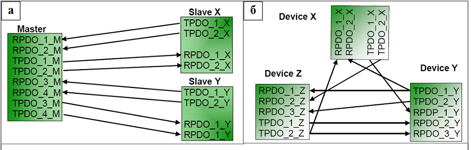

 Рис.9.33. Типи PDO Зв’язування: а – наперед визначене статичне; б – динамічне.

Приклад 9.7. CANOpen. Зв’язування та Відображення PDO для системи CANOpen з TSX Premium. 

Завдання. Забезпечити Зв’язування та Відображення PDO вузлів CANOpen для вирішення задачі, представленої на рис.9.34. Дане завдання стосується декількох задач даного розділу, тому на рис.9.34 слід звертати увагу тільки на змінні вузлів та напрямок їх передачі.

Рішення. Реалізація схеми мережних з’єднань для даної задачі подане в прикладі 9.1. Конфігурація вузлів проводиться згідно прикладу 9.4. Задача передбачає що дані повинні передаватися в реальному часі, тобто необхідно використати сервіс PDO. Всі змінні в частотному перетворювачі PDS1 – 16-бітні аналогові цілі, в RIO1 – дискретні.  

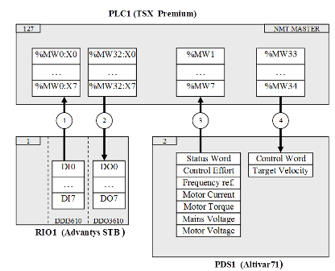

Рис.9.34. Постановка задачі до прикладу 9.7

При створенні конфігурації в CANOpen в SyCon, по замовченню для вузлів виділяється наступна конфігурація:

- RIO1: 4 об’єкти RPDO + 4 об’єкти TPDO
- PDS1: 1 об’єкти RPDO + 1 об’єкти TPDO.

PDO Відображення по замовченню визначається профілем пристрою і не співпадає з поставленим в умові прикладу завданням. 

В конфігураторі SyCon для RIO1 залишаємо тільки 1 PDO та 1 SDO, що цілком достатньо для передачі 8 біт в одному та іншому напрямку.

Від PDS1 необхідно передати сім 16-бітних слів, що займає 16 байт, і передати 2 слова, відповідно 4 байти. Враховуючи обмеження PDO 8-ма байтами, необхідно в PDS1 виділити 2 TPDO та 1 RPDO. 

Замовлення необхідних PDO та PDO-Відображення в SyCon проводиться доволі просто, без необхідності в налаштуванні параметрів Об’єктів Словника, які відповідають за PDO-Сервіси. Кінцева картина наявних PDO для RIO1 та PDS1 показана на рис.9.35. Стрілками показані Об’єкти доступні через PDO, які сконфігуровані в процесі PDO-Відображення (кнопка PDO Contents Mapping). 

Після створення (зміни) конфігурації в SyCon, в проекті PL7 для комунікаційної карти необхідно виділити 8 вхідних слів (1 байт RIO1 + 7 слів PDS1 ) та 3 вихідних (1 байт RIO1 + 2 слова PDS1), так як показано на рис.9.24.

<a href="media9/9_35.png" target="_blank">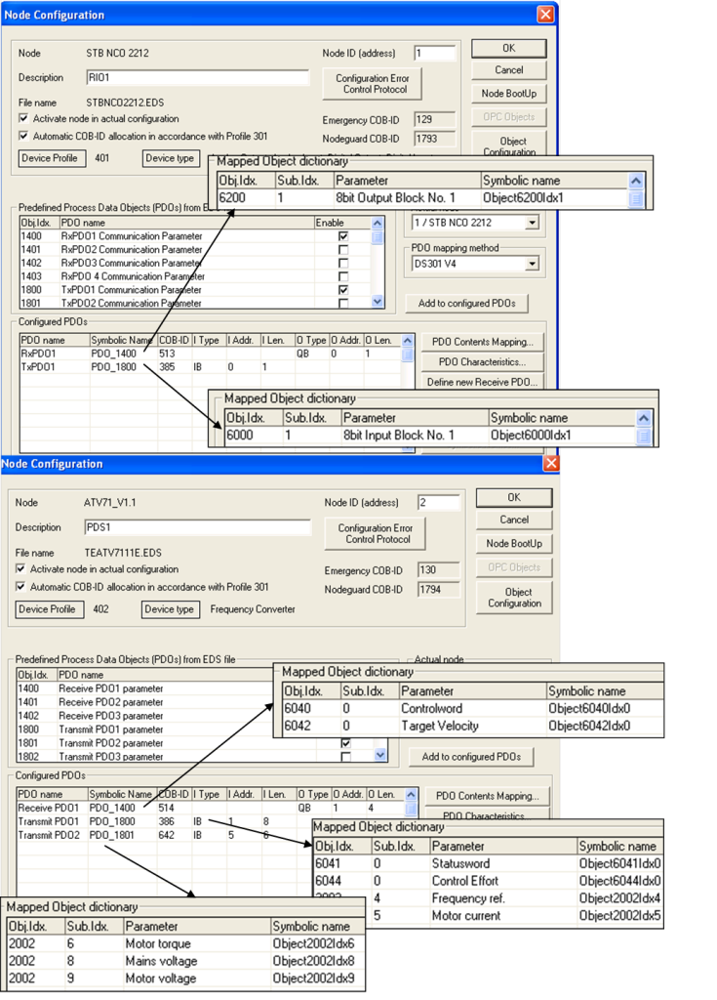</a> 

Рис.9.35. Конфігурування PDO до прикладу 9.7 

Приклад 9.8.  CANOpen. Зв’язування та Відображення PDO для системи CANOpen з VIPA.

Завдання. Забезпечити Зв’язування та Відображення PDO вузлів CANOpen для вирішення задачі, представленої на рис.9.36. Дане завдання стосується декількох задач даного розділу, тому на рис.9.36 слід звертати увагу тільки на змінні вузлів, та напрямок їх передачі.

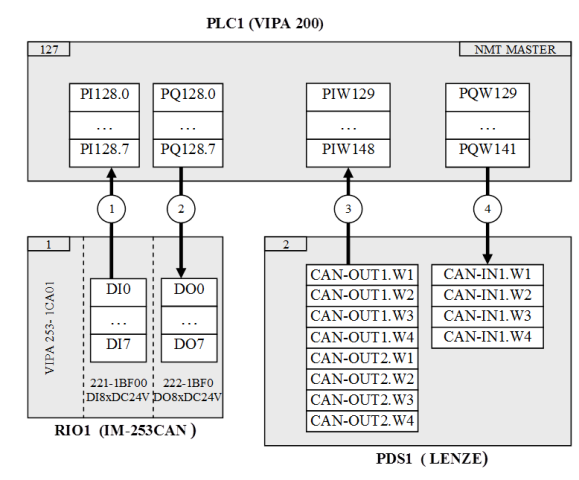

Рис.9.36. Постановка задачі до прикладу 9.7 

Рішення. Реалізація схеми мережних з’єднань для даної задачі подане в прикладі 9.2. Конфігурація вузлів проводиться згідно задачі 9.5. Задача передбачає що дані повинні передаватися в реальному часі, тобто необхідно використати сервіс PDO. Всі змінні в частотному перетворювачі PDS1 – 16-бітні аналогові цілі, в RIO1 – дискретні.  

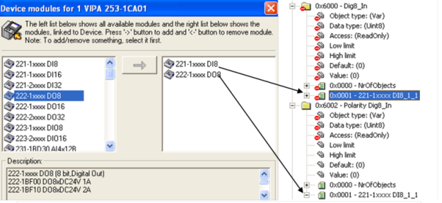

Рис.9.37. Замовлення дискретних модулів (зліва) та відповідні Об’єкти в Словнику (зправа) для RIO1

Першопочатково в конфігураторі мережі WinCoCT для RIO1 замовляються дискретні модулі (див. рис.9.37). Ця процедура автоматично добавляє необхідні Об’єкти в Словник Об’єктів. 

PDO-Зв’язування та PDO-Відображення в WinCoCT проводиться в одному вікні (рис.9.39). Спочатку вибирається два PDO, які необхідно зв’язати (поз.3 на рис.9.39), а потім для кожного PDO вказуються Об’єкти Словника. Так, наприклад, TPDO1 з Індексом 1800h в RIO1 (поз.1 на рис. 9.39) зв’язується з RPDO1 з Індексом 1400h в PLC1 (поз.2). В свою чергу на TPDO1 в RIO1 відображається Обє’кт з Індексом 6000h (поз.4.) і Під-індексом 1, які відповідають за дискретні входи на модулі 221-1BF00 (див. рис.9.36), що з’явився у Словнику після добавлення модулів (рис.9.37). Так саме на RPDO1 в PLC1 відображається Об’єкт з Індексом A4C0h та Під-індексом 1, який відповідає за внутрішній буфер обміну, 8-бітного розміру.   

Загальний список Зв’язаних в мережі PDO згрупований по їх COB-ID, наведений на рис.9.38. 

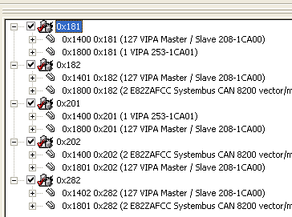

Рис.9.38. Список Зв’язаних PDO та їх COB-ID. 

Змінні, які відповідають в ПЛК1 за вхідні та вихідні дані вказуються в самому конфігураторі WinCoCT. Кількість байт, які передаються в ПЛК= 17, з ПЛК = 9. 

При конфігурації ПЛК1 в WinCoCT пам’ять виділяється блоками по 4 байти. Таким чином для області входів необхідно виділити 5 блоків, а для області виходів - 3 блоки (див. рис.9.40).   

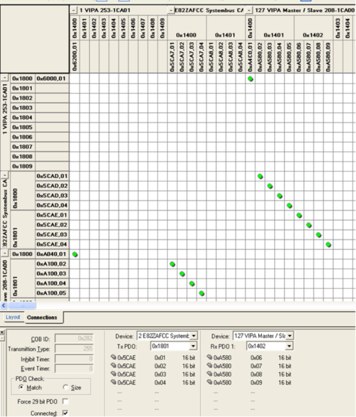

 Рис.9.39. PDO-Зв’язування та PDO-Відображення. 

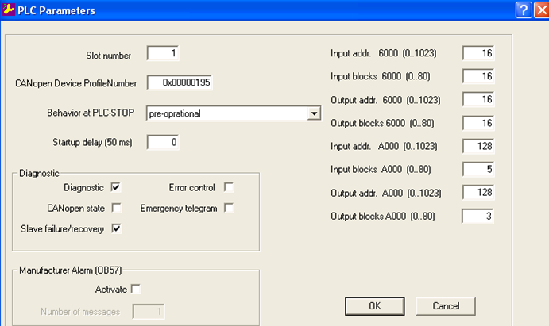

 Рис.9.40. Налаштування параметрів ПЛК. 

## 4. Робота зі Словником Об’єктів

### 4.1. Структура словника об’єктів

Загальна структура Словника Об’єктів всіх пристроїв однакова, оскільки Об’єкти в Словнику розміщуються згідно їх функціонального призначення. Наявність певних Об’єктів є обов’язковою, а їх розміщення визначено стандартом. Інші Об’єкти можуть знаходитися тільки в спеціально виділених областях Індексів. Наявність і властивості Об’єктів Словника доступні розробнику мережі через EDS файли, структура яких стандартизована, що дозволяє переглядати їх за допомогою різних конфігураторів (наприклад SyCon та WinCoCT). 

Загальний розподіл Об’єктів в Словнику показаний в таблиці 9.10. Область з Індексами 1-9Fh виділяється під типи даних. Об’єкти з області комунікаційного профілю відповідають за комунікаційний обмін між пристроями. Частина з цих об’єктів, які відповідають за обмін PDO, розглянута вище, частина наведена в таблиці 9.11. Специфічні для пристрою дані, які визначені його Профілем,  розміщуються в Об’єктах з Індексами 2000-5FFFh. Для CANOpen визначено ряд профілів пристроїв, Прикладні Об’єкти яких завжди розміщуються в області 6000-9FFFh. 

Таблиця 9.10. Загальний розподіл Об’єктів у Словнику

| Index  (16-кова) | Об’єкти (англ)                              | Об’єкти (укр)                                                |
| ---------------- | ------------------------------------------- | ------------------------------------------------------------ |
| 0000             | Reserved                                    | зарезервовані                                                |
| 0001-001F        | Static Data Types                           | Статичні Типи Даних                                          |
| 0020-003F        | Complex Data Types                          | Структурні Типи Даних                                        |
| 0040-005F        | Manufactured Specific Data  Types           | Типи Даних визначені виробником                              |
| 0060-007F        | Device Profile Specific  Static Data Types  | Статичні Типи Даних визначені Профілем пристрою              |
| 0080-009F        | Device Profile Specific  Complex Data Types | Структурні Типи Даних визначені Профілем пристрою            |
| 00A0-0FFF        | Reserved for further use                    | зарезервовані на майбутнє використання                       |
| 1000-1FFF        | Communication Profile Area                  | Область Об’єктів визначених Комунікаційним Профілем          |
| 2000-5FFF        | Manufactured Specific  Profile Area         | Область Об’єктів визначених виробником                       |
| 6000-9FFF        | Standardized Device Profile  Area           | Область Об’єктів визначених Стандартними Профілями  Пристроїв |
| A000-FFFF        | Reserved for further use                    | зарезервовані на майбутнє використання                       |

Таблиця 9.11. Об’єкти області комунікаційного профілю

| Index (16-кова) | Object                                       | Name                          | Type       | Access | M/O  |
| --------------- | -------------------------------------------- | ----------------------------- | ---------- | ------ | ---- |
| 1000            | VAR                                          | device type                   | Unsigned32 | ro     | M    |
| 1001            | VAR                                          | error register                | Unsigned8  | ro     | M    |
| 1002            | VAR                                          | manufacturer status register  | Unsigned32 | ro     | O    |
| 1003            | ARRAY                                        | pre-defined error field       | Unsigned32 | ro     | O    |
| 1004            | зарезервований для майбутнього  використання |                               |            |        |      |
| 1005            | VAR                                          | COB-ID SYNC-message           | Unsigned32 | rw     | O    |
| 1006            | VAR                                          | communication cycle period    | Unsigned32 | rw     | O    |
| 1007            | VAR                                          | synchronous window length     | Unsigned32 | rw     | O    |
| 1008            | VAR                                          | manufacturer device name      | VIS-String | c      | O    |
| 1009            | VAR                                          | manufacturer hardware version | VIS-String | c      | O    |
| 100A            | VAR                                          | manufacturer software version | VIS-String | c      | O    |
| 100B            | зарезервований для майбутнього  використання |                               |            |        |      |
| 100C            | VAR                                          | guard time                    | Unsigned32 | rw     | O    |
| 100D            | VAR                                          | life time factor              | Unsigned32 | rw     | O    |
| 100E            | зарезервований для майбутнього використання  |                               |            |        |      |
| 100F            | зарезервований для майбутнього  використання |                               |            |        |      |
| 1010            | VAR                                          | store parameters              | Unsigned32 | rw     | O    |
| 1011            | VAR                                          | restore default parameters    | Unsigned32 | rw     | O    |
| 1012            | VAR                                          | COB-ID time stamp             | Unsigned32 | rw     | O    |
| 1013            | VAR                                          | high resolution time stamp    | Unsigned32 | rw     | O    |
| 1014            | VAR                                          | COB-ID Emergency              | Unsigned32 | rw     | O    |
| 1015            | VAR                                          | Inhibit Time Emergency        | Unsigned16 | rw     | O    |
| 1016            | ARRAY                                        | Consumer Heartbeat Time       | Unsigned32 | rw     | O    |
| 1017            | VAR                                          | Producer Heartbeat Time       | Unsigned16 | ro     | O    |
| 1018            | RECORD                                       | identity object               | Identity   |        | M    |

## 4.2. Основи функціонування сервісу SDO

SDO (Service Data Object) – це Об’єкти Сервісних Даних, які призначені для доступу до даних Словника Об’єктів по Індексу та Під-Індексу. Використовується Клієнт-Серверна модель обміну між прикладними Процесами. Словник Об’єктів кожного вузла включає мінімум один Серверний Об’єкт SDO, через який можна проводити обмін конфігураційними даними. Клієнтський процес повинен включати Клієнтський SDO, за допомогою якого він формує запит на читання чи запис Об’єкту Словнику, вказуючи його Індекс та Під-Індекс (рис.9.41).

<a href="media9/9_41.png" target="_blank">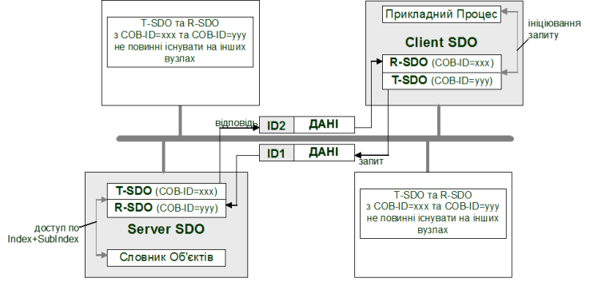</a> 

Рис.9.41. Клієнт-серверна архітектура SDO 

Клієнтські та Серверні SDO створюють канал з двома COB-ID з кожного боку для організації двосторонньої передачі: клієнтський Transmit-SDO (T-SDO) "поєднується" Ідентифікатором серверного Receive-SDO (R-SDO), та навпаки. В одній мережі CANOpen можуть функціонувати до 256 каналів SDO.    

За допомогою сервісу SDO можна зчитувати або записувати дані об’ємом більшим ніж 8 байт. Це досягається шляхом сегментування цих даних. Параметри SDO можна настроювати через Словник Об’єктів (рис.9.42).

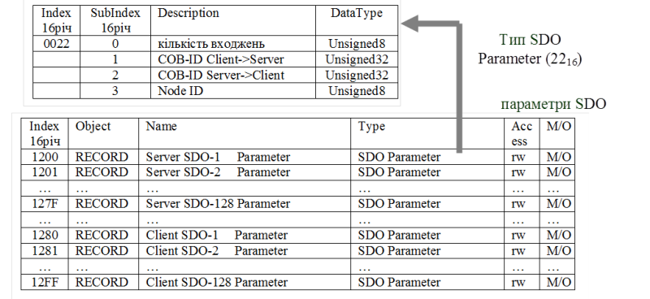

Рис.9.42. SDO в словнику об’єктів

### 4.3. Типи передачі PDO та об’єкт SYNC

#### Типи передачі PDO 

З точки зору ініціації обміну, відправка PDO може проходити в наступних режимах:

-    ациклічний при виникненні специфічної події на пристрої. 

-    ациклічний по запиту. 

-    циклічний з прив’язкою до циклічного об’єкту SYNC. 

З точки зору синхронності в CANOpen виділяють наступні режими передачі:

-  синхронна передача, з прив’язкою до об’єкту SYNC;

-  асинхронна передача, без прив’язки до об’єкту SYNC;

Комбінації цих режимів дають Тип Передачі PDO (Transmission Type), який є одним із полів структури PDO Communication Parameter (див. 9.3.3). Тип Передачі визначає подію, при якій відбувається передача T-PDO. Список всіх доступних значень цих типів в залежності від режимів показаний у вигляді таблиці 9.12.

Таблиця 9.12. Значення поля Transmission Type PDO

| Номер типу | циклічно | ациклічно | синхронно     | асинхронно | тільки по RTR |
| ---------- | -------- | --------- | ------------- | ---------- | ------------- |
| 0          |          | X         | X             |            |               |
| 1-240      | X        |           | X             |            |               |
| 241-251    |          |           | зарезервовано |            |               |
| 252        |          |           | X             |            | X             |
| 253        |          |           |               | X          | X             |
| 254        |          |           |               | X          |               |
| 255        |          |           |               | X          |               |

#### Об’єкт SYNC  

Функціонування синхронного обміну забезпечується шляхом прив’язки ініціації передачі T-PDO до Комунікаційного Об’єкту SYNC (належить до SFO). Цей Об’єкт періодично передається одним з вузлів (SYNC-Producer), яким як правило є NMT-Ведучий. Прив’язавшись до цього Об’єкту, інші вузли (SYNC-Consumer) можуть організувати циклічну передачу. Враховуючи що публікація Об’єкту SYNC періодична, циклічний тип T-PDO буде передаватись теж періодично. З іншого боку, Об’єкт SYNC може служити і для ациклічних передач в якості синхросигналу. Крім того, з отриманням Синхронного Об’єкту, пристрої можуть зберегти значення своїх входів для ефекту квазіодночасності. В будь якому випадку, якщо передача PDO залежить від появи на шині Об’єкту SYNC, цей PDO являється синхронним, якщо ні – асинхронним (рис.9.43).  

Рис.9.43. Синхронні та асинхронні PDO 

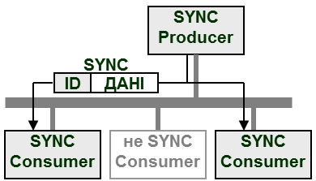

Рис. 9.44. Оновлення Об’єкту SYNC 

Об’єкт SYNC в Словнику Об’єктів знаходиться під Індексом 1005h. Там вказується його Ідентифікатор, який по замовченню дорівнює 128. Повідомлення передається без додаткової передачі даних (рис.9.44). 

Синхронні PDO передаються тільки під час синхронного вікна. Тобто довжина синхронного вікна – це інтервал часу між появою Об’єкту SYNC та дозволеною передачею синхронних PDO (рис.9.45). Ця величина може конфігуруватися окремо для всіх вузлів через Об’єкт Synchronous window length (1007h, величина вказується в мікросекундах). Для оптимальної роботи мережі, кожний SYNC-Consumer в момент конфігурування також отримує значення періоду появи Об’єкту SYNC, який записується в Communication cycle period (1006h, величина вказується в мікросекундах).   

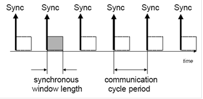

Рис.9.45. Довжина синхронного вікна 

#### Ациклічні синхронні PDO (Тип Передачі 0) 

Цей тип PDO буде передаватись ациклічно при специфічній для пристрою події (наприклад при зміні значення змінної), але тільки в момент отримання Об’єкту SYNC (9.46).

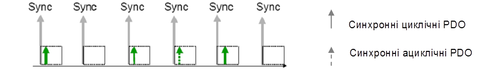

Рис .9.46. Синхронні циклічні та ациклічні PDO

#### Циклічні синхронні PDO (Тип Передачі 1-240) 

Ці PDO передаються синхронно з періодом, який визначається кількістю Об’єктів SYNC між передачами. На цю кількість вказує значення типу PDO (від 1 до 240). Так тип=1 вказує, що PDO буде передаватись з кожною появою Об’єкту SYNC, а тип=2 – з появою кожного другого SYNC.  

#### Синхронні по запиту PDO (Тип Передачі 252) 

Цей тип PDO вказує на те, що дані, які містяться в ньому, повинні бути оновлені в момент отримання Об’єкту SYNC. Для віддаленого вхідного модулю, наприклад, це значить, що в момент отримання Об’єкту SYNC вхідні дані будуть оцифровані і збережені в T-PDO. Однак відправлений T-PDO буде тільки в момент отримання запиту Дистанційного Кадру (RTR). Для статичного зв’язування, запит на зчитування T-PDO генерує NMT-Ведучий, для якого в конфігураторі можна вказати додаткові настройки (наприклад кількість циклів контролеру між опитуваннями).

#### Асинхронні по запиту PDO (Тип Передачі 253) 

Дані для цього типу PDO відновляються відразу при отриманні Дистанційного Кадру, після чого T-PDO відправляється в мережу.

#### Асинхронні ациклічні PDO (Тип Передачі 254 та 255) 

Відправка в мережу цих типів PDO не залежить від появи Об’єкту SYNC. Момент відправки визначається профілем пристрою (Тип Передачі 255) або виробником пристрою (Тип Передачі 254). Для цих типів PDO можна визначити інтервал часу між відправками T-PDO. Цей параметр доступний не для всіх типів пристроїв і настроюється в Комунікаційних Параметрах PDO в полі Event Timer (див. рис.9.21). 

Враховуючи, що Відображені Об’єкти на PDO типів 254 та 255 можуть оновлюватися дуже часто, передача PDO з високим пріоритетом може  витіснити інші PDO. Для запобігання цього ефекту в Комунікаційних Параметрах PDO визначене поле Час Заборони (Inhibit Time), яке вказує на мінімальний час між двома передачами даного PDO (див. рис.9.21). 

### Об’єкт Time Stamp

Для синхронізації процесів по часу, в CANOpen використовується Об’єкт Time Stamp. Даний Об’єкт є 6-байтною послідовністю, яка показує абсолютний час в мілісекундах після опівночі, та кількість днів після 1-го січня 1984 року.. Для більш критичних по часу синхронізацій (порядку мікросекунд) використовується високоякісний time-stamp який кодується 32-бітною послідовністю, що показує кількість мікросекунд. Лічильник мікросекунд таким чином повинен рестартувати кожні 72 хвилини. Даний сервіс функціонує за моделлю Producer-Consumer. 

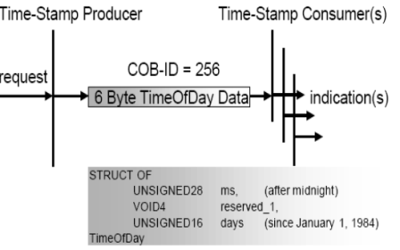

Рис. 9.47. Об’єкт Time Stamp. 

### 4.5. Об’єкт Emergency

Повідомлення Emergency передається при виникненні фатальної помилки на пристрої і має високий пріоритет. Воно відправляється кожен раз при виникненні нової помилки. Коди помилок визначаються за допомогою комунікаційного профілю пристрою. Emergency Object є опціональним. Якщо він підтримується, то повинні підтримуватись як мінімум два коди помилок 00xx (помилок немає) і 11xx(генерація помилки). Вміщує 8 байт даних і підтвердження передачі. Даний сервіс функціонує за моделлю Producer-Consumer. 

<a href="media9/9_48.png" target="_blank">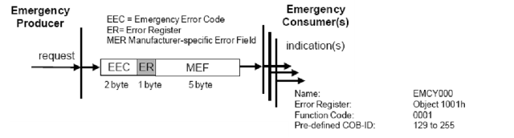</a> 

 Рис. 9.48. Об’єкт Emergency 

### 4.6. Діагностичні сервіси NodeGuard та Heartbeat

#### Node Guarding 

Для слідкування за працездатністю вузлів в мережі, тобто за регулярною передачею ними PDO, NMT Master може вести базу даних стану NMT-Ведених. Цей процес називається Node Guarding (Охорона Вузлів). Для цього NMT-Ведучий регулярно полінгує NMT-Ведених (рис. 9.49). Для виявлення відсутності NMT-Ведучого, NMT-Ведені в свою чергу перевіряють, чи проводився на певному інтервалі полінг (Life Guarding) Node Guarding активний також і в режимі стоп.

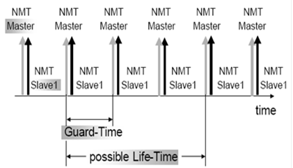

Рис. 9.49. Функціонування Node Guard 

Регулярно NMT Master відправляє Дистанційні Кадри і перевіряє дані в відповіді з записом в базі даних. Якщо вони відрізняються - це відображається в прикладній програмі NMT-Ведучого через Network Event Service. 

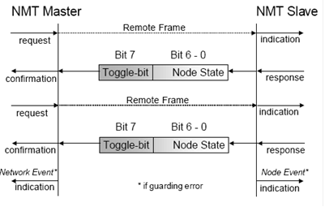

 Рис. 9.50. Виявлення дефектного вузла в Node Guard 

#### Heartbeat 

Протокол Heartbeat (серцебиття) є опціональним і являється рекомендованою альтернативою Node Guarding. З певною циклічністю Heartbeat Producer відправляє Heartbeat-повідомлення з частотою, визначеною Heartbeat Producer Time Object (рис. 9.51). Один, або більше Heartbeat Consumer можуть його отримати. Якщо Heartbeat Consumer не отримає за певний час цей об’єкт – буде згенероване повідомлення Heartbeat Event. Даний сервіс функціонує за моделлю Producer-Consumer. 

 Рис.9.51. Функціонування протоколу Hertbeat

## 5. Специфікації профілів пристроїв CANOpen

### 5.1. Профілі пристроїв в CANOpen

CANOpen використовує профілі пристроїв для забезпечення легкої системної інтеграції пристроїв різних виробників (рис. 9.1). Реалізація обов’язкових характеристик приcтрою у відповідності з CANOpen гарантує коректне функціонування базової мережі. В той же час CANOpen допускає визначення опціональних і спеціально визначених виробником функціональних можливостей приладу.  На сьогоднішній день профілі пристроїв CANOpen визначені для широкого спектра різних типів приладів:

-  CiA DSP-401: I/O Modules;

-  CiA DSP-402: Drives and Motion Control;

-  CiA DSP-403: Human Machine Interface;

-  CiA WD-404: Measuring Devices and Closed-Loop Controllers;

-  CiA DSP-406: Encoders;

-  CiA WD-408: Proportional Hydraulic Valves;

-  CiA WD-409: Door Control (Railways);

-  CiA WDP-4XX: Brake Control (Railways);

-  CiA WDP-4XX: Train Bus Gateways.

Слід зазначити, що основна відмінність прикладних профілів від комунікаційних заключається в тому, що комунікаційний профіль визначає порядок доступу прикладної програми одного вузла до об’єктів іншого, а прикладний профіль визначає призначення цих об’єктів та правила їх використання.

Профілі пристроїв в CANOpen визначають:

-  підтримувані Прикладні Об’єкти;

-  значення комунікаційних параметрів PDO;

-  значення PDO-Відображення по замовченню;

-  додаткові коди помилок;

-  додаткові типи даних.

Кожен пристрій має 32-бітний ідентифікатор, який записаний в Об’єкті Device Type - 1000h (таб. 9.11). Молодше слово ідентифікатора вказує на номер профілю пристрою, старше – вміщує додаткову інформацію про пристрій. Для багатомодульних пристроїв, кожний модуль якого підтримує різні профілі, додаткова інформація в Об’єкті Device Type має значення FFFFh, а номер профілю вказує на профіль пристрою першого модуля. Профілі всіх інших модулів пристрою записуються в об’єктах 67FFh + x  800h (де x = внутрішній номер модуля пристрою).

Стандартизовані CiA профілі пристроїв використовують Об’єкти Словнику з адресами від 6000h по 9FFFh. Нижче розглянемо один з найбільш популярних профілів пристроїв CANOpen – профілю вводу/виводу, а в розділі 11 профіль для пристроїв PDS (DSP-402). 

### 5.2. Профіль модулів вводу/виводу

Профіль I/O Modules описаний в специфікації CiA DSP-401 і призначений для роботи з віддаленими модулями вводу/виводу по мережі CANOpen. Значення молодшого слова вказує на номер профілю (401), старшого – на тип модуля вводу/виводу:

- 1-й біт -  модуль дискретних входів;
- 2-й біт – модуль дискретних виходів;
- 3-й біт – модуль аналогових входів;
- 4-й біт – модуль аналогових виходів.

По замовченню, для даного типу пристрою сконфігуровані два Об’єкти T-PDO та два R-PDO (рис.9.52) які відповідають за виходи та входи пристрою. В першому об’єкті відображаються 64 дискретні сигнали, в другому 4 аналогових. По замовченню всі PDO передаються асинхронно з нульовою затримкою (Inhibit Time=0).  В залежності від можливості пристрою кількість та конфігурація PDO може змінюватись NMT-Ведучим.

Рис.9.52. PDO-Відображення по замовченню для модулів вводу/виводу 

Окрім визначеного по замовченню профілем доступу до каналів вводу/виводу, CANOpen опціонально підтримує інші методи доступу через Об’єкти Словника.

1) Для дискретних входів:

 - доступ до конкретного біту (6020h-6027h) ;

 - 2-байтовий доступ (6100h);

 - 4-байтовий доступ (6120h);

2) Для дискретних виходів:

 - доступ до конкретного біту (6220h-6227h) ;

 - 2-байтовий доступ (6300h);

 - 4-байтовий доступ (6320h);

3) Для аналогових входів:

 - 1-байтовий доступ (6400h);

 - 4-байтовий доступ (6402h);

 - специфічний (6404h);

4) Для аналогових виходів:

 - 1-байтовий доступ (6410h);

 - 4-байтовий доступ (6412h);

 - специфічний (6414h);

Крім того  опціонально підтримуються додаткові функції перетворення. Для дискретних входів можливі такі додаткові функції (рис. 9.53):

-  зміна полярності логіки (6002h);

-  відправка T-PDO по передньому фронту сигналу входу (6008h);

-  відправка T-PDO по задньому фронту сигналу входу (6007h);

-  відправка T-PDO по будь якій зміні (6006h);

-  відправка T-PDO по будь якій зміні (6006h);

-  активація/деактивація відправки по зміні значення (6005h). 

 

Рис. 9.53.Схема перетворення для перших 8-ми дискретних входів (6000h) 

Для дискретних виходів визначені такі можливості (рис.9.54):

-  зміна полярності логіки (6202h);

-  настройка фільтру (6208h);

-  визначення режиму стану виходів при аварійній ситуації (6206h);

-  визначення значення виходів при аварійній ситуації (6207h). 

Для аналогових входів визначені такі можливості (рис.9.55):

-  вхідний діапазон для масштабування (6420h);

-  зміщення для масштабування (642Eh);

-  коефіцієнт масштабування (642Fh); 

-  настройки події активації передачі PDO:

   - --  верхня межа (6424h);

   - --  нижня межа (6425h);

   - --  зона нечутливості (6426h,6427h,6428h)

   - --  активація/деактивація відправки по зміні значення(6423h)

 

Рис. 9.54. Схема перетворення для перших 8-ми дискретних виходів (6200h). 

 

Рис.9.55. Схема перетворення для першого аналогового входу(6401h)

Для аналогових виходів визначені такі можливості (рис. 9.56):

-  вхідний діапазон для масштабування (6440h);

-  зміщення для масштабування (6441h);

-  коефіцієнт масштабування (6442h); 

-  визначення режиму стану виходів при аварійній ситуації (6443h);

-  визначення значення виходів при аварійній ситуації (6444h). 

 

Рис. 9.56. Схема перетворення для першого аналогового виходу (6411h)

## Контрольні запитання до розділу

1.   Поясніть відмінність між CAN та CANOpen? 

2.   Поясніть функціонування CANOpen в контексті моделі OSI. Які стандарти використовує мережа CANOpen на різних рівнях?

3.   На яких стандартах на фізичному рівні базується CANOpen і які додаткові вимоги ставляться на цьому рівні? Наведіть основні характеристики CANOpen на фізичному рівні: спосіб передачі бітів, топологія, правила термінування, максимальна довжина ліній зв’язку та відгалужень, бітова швидкість, максимальна кількість пристроїв.

4.   Які кабелі, роз’єми та призначення контактів рекомендується для використання в CANOpen? Який стандарт це визначає?

5.   Розкажіть про призначення Словнику Об’єктів. Яким чином визначається місце розміщення Об’єктів в Словнику?

6.   Яким чином Прикладні Об’єкти передаються на канальному рівні? Де знаходяться настройки комунікаційного обміну?

7.   Поясніть модель функціонування пристрою-вузлу CANOpen.

8.   Перерахуйте комунікаційні сервіси, які використовуються в CANOpen. Поясніть їх призначення.

9.   Які Комунікаційні Об’єкти використовуються для реал-тайм обміну невеликими обсягами даних процесу? Які Комунікаційні Об’єкти використовуються для ациклічного обміну великими обсягами даних?

10.   Що забезпечують функції сервісу PDO? Які комунікаційні Об’єкти використовуються для функціонування даного сервісу?

11.   Поясніть призначення T-PDO та R-PDO. Як забезпечується їх взаємний Зв’язок та зберігається інформація про нього? Як передається T-PDO на канальному рівні?

12.   Як забезпечується зв’язок даних T-PDO/R-PDO з Об’єктами Словнику? Як називається цей механізм? Де зберігаються настройки таких зв’язків?

13.   Як забезпечується зв’язок даних T-PDO з даними R-PDO? Де зберігаються настройки параметрів комунікаційного обміну?

14.   Яке призначення NMT-сервісів? Яке призначення NMT-Ведучого в CANOpen та які функції він виконує? Поясніть різницю між NMT-Ведучим та Ведучим шини.

15.   Які способи конфігурування можуть бути доступні розробнику для конфігурування NMT-Ведених?

16.   Прокоментуйте роботу діаграми станів NMT-Веденого. Які сервіси доступні в кожному із станів? За допомогою яких Об’єктів налаштовується конфігурація вузла NMT-Веденого перед переводом його в операційний режим? 

17.   Яким чином відбувається перехід NMT-Веденого з одного стану в інший? Які об’єкти для цього використовуються? Як ідентифікується конкретний вузол в CANOpen і для чого це потрібно?

18.   Яким чином забезпечується зв’язок між Комунікаційними Об’єктами вузлів до їх функціонування в операційному режимі? Поясніть механізм розподілу Ідентифікаторів по замовченню. 

19.   Яке правило наперед-визначеного статичного зв’язування PDO в мережі? Що таке динамічне зв’язування PDO?

20.   В чому необхідність знання структури Словнику Об’єктів конкретного засобу? Який ресурс необхідно використати для її визначення? Прокоментуйте загальноприйнятий розподіл Індексів різних типів Об’єктів в Словнику.

21.   Що забезпечують функції сервісу SDO? Які комунікаційні Об’єкти використовуються для функціонування даного сервісу? На якій моделі прикладного обміну базуються сервіси SDO?

22.   Яким чином забезпечується обмін даними за допомогою об’єктів SDO? Як дані SDO-об’єктів зв’язуються з даними Прикладних Об’єктів Словнику? Як забезпечується передача даних великого обсягу?

23.   Які режими ініціації обміну об’єктів PDO є в CANOpen? Поясніть їх функціонування? До яких моделей обміну на прикладному рівні їх можна віднести?

24.   Як забезпечується синхронізація передачі PDO в чітко визначені моменти часу? Що таке синхронне вікно? Який вузол генерує синхронні об’єкти?  

25.   Які комунікаційні режими передачі (Transmission Type) визначені в CANOpen? Прокоментуйте призначення кожного режиму. Де зберігається налаштування режиму для кожного PDO?

26.   Яким чином в CANOpen забезпечується синхронізація годинників реального часу для різних вузлів? 

27.   Яким чином в CANOpen вузол повідомляє про наявність помилки? Які сервіси використовуються для визначення станів NMT-Ведених та NMT-Ведучих вузлів на шині?

28.   Які переваги дає профілювання пристроїв для використання їх в CANOpen? Які типи профілів пристроїв для CANOpen Ви можете назвати? Яким чином в Об’єкті Словнику вказується його приналежність до конкретного профілю?  

29.   Які Ви можете назвати профілі для модулів вводу/виводу CANOpen? Як по замовченню налаштовується для них PDO-Відображення?

30.   Які Прикладні Об’єкти Словнику використовуються по замовченню для налаштування перетворення дискретних входів, дискретних виходів, аналогових входів, аналогових виходів в пристроях відповідних профілів? 

Теоретичне заняття розробив [Олександр Пупена](https://github.com/pupenasan). 
