[<- До підрозділу](README.md)

# Керування перетворювачами частоти Altivar 71 з ПЛК Modicon M340 через мережу MODBUS RTU on RS485 з використанням профілю CiA402

|               |                                                              |
| ------------- | ------------------------------------------------------------ |
| DRIVE         | Altivar 71 (Schneider Electric) + інтегрований порт Modbus/CANOpen |
| FIELDBUS      | MODBUS RTU on RS485                                          |
| DRIVE PROFILE | CiA 402                                                      |
| PLC HARD      | Modicon M340 (Schneider Electric) + інтегрований порт Modbus |
| PLC SOFT      | UNITY PRO > 5.0                                              |

У цьому матеріалі розглядаються питання конфігурування перетворювача частоти (**ПЧ**) під конкретний електродвигун. Мається на увазі, що користувач має досвід роботи як з перетворювачами частоти, так і з програмними пакетами UNITY PRO/Control Expert.

## 1. Постановка задачі

Керування з ПЛК:

- увімкнення/вимкнення силової частини ПЧ;
- запуск/зупинка двигуна;
- керування швидкістю в розімкнутому режимі;

Контроль роботи приводу:

- контроль режиму роботи приводу (функціонування, наявність помилки, місцевий/дистанційний);
- поточна швидкість;
- задана частота;
- струм двигуна;
- момент на двигуні;
- напруга на двигуні

Додаткові завдання.

- Забезпечення можливості перемикання джерела керування частотним перетворювачем між ПЛК (по мережі MODBUS RTU) і місцевим пультом (лицьова панель); перемикання повинне здійснюватися за допомогою перемикача, підключеного до дискретного входу перетворювача частоти; перемикання має бути безударним в обох напрямках;
- зупинка двигуна кнопкою STOP із місцевої панелі, незалежно від режиму роботи.

Вимоги до організації керування: Профіль керування CiA402. Коротко про профілі керування читайте в [теоретичній частині](../pds/teor1.md). 

## 2. Особливості керування ПЧ через мережу MODBUS RTU (теоретична частина)

### 2.1. Загальні засади

Частотні перетворювачі Altivar 71 оснащені вбудованим портом Modbus/CANOpen із роз'ємом RJ-45. Даний порт призначений для конфігурування ATV 71, керування та контролю його роботи як через мережу Modbus RTU так і CANOpen. Режим роботи порту означується конфігураційними налаштуваннями частотного перетворювача, які проводяться через спеціальну панель (пульт), прикріплену на його передній стороні. На мережі Modbus RTU частотний перетворювач є Веденим (Slave) та підтримує наступні функції MODBUS Сервера:

Таблиця 1.

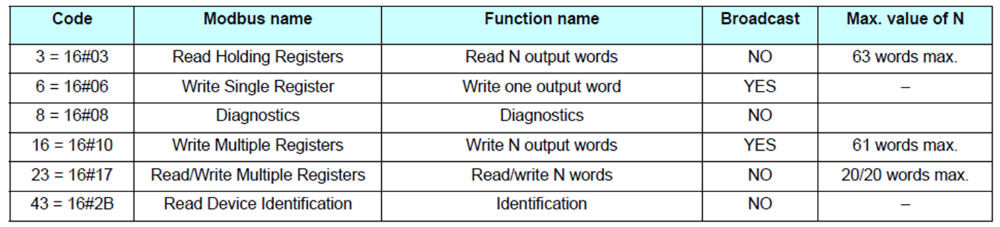

Таким чином, дані для керування та контролю ПЧ, а також усі параметри доступні як Holding Registers (вихідні/внутрішні регістри). Розподіл параметрів ПЧ Altivar 71 в області MODBUS регістрів дано [1].

### 2.2. Функціональні профілі керування ПЧ Altivar 71

Altivar 71 підтримує три функціональні профілі керування станом приводу:

1. I/O Profile, підтримується комунікаціями Modbus, CANopen і карти Ethernet, Fipio, ModbusPlus, Modbus, Uni-Telway, Profibus DP, DeviceNet і INTERBUS.
2. CiA 402 Profile, підтримується комунікаціями Modbus, CANopen і карти Ethernet, Fipio, ModbusPlus, Modbus, Uni-Telway, Profibus DP, DeviceNet і INTERBUS.
3. ODVA Profile підтримується лише DeviceNet

Докладніше про профілі можна прочитати  в [теоретичній частині](../pds/teor1.md). 

У наведеному прикладі використовується функціональний профіль керування CiA 402 `Not Separate`, де силова та керуюча частина заживлені одним живленням (рис.1.). 

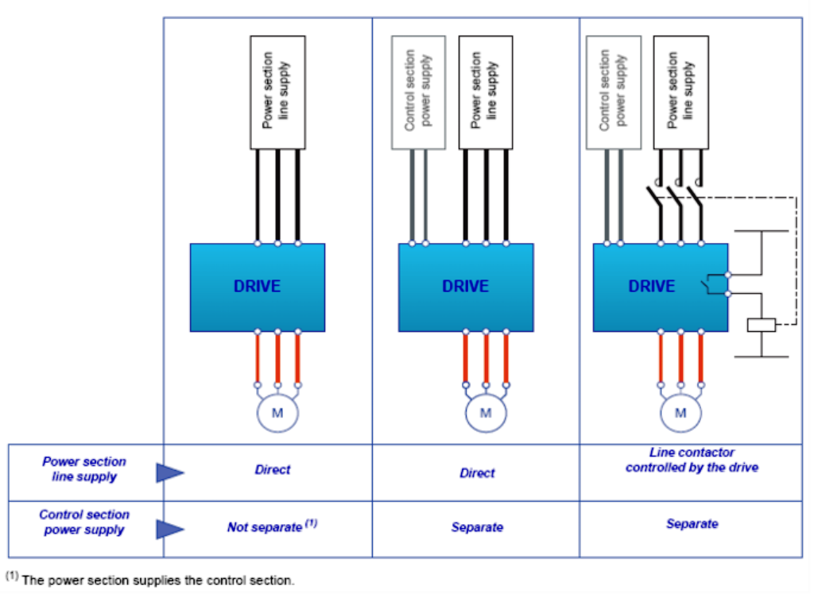

рис.1. Можливі схеми живлення ПЧ

У ПЧ Altivar назви індексів відповідають DRIVECOM, сумісного з профілем CiA 402 в частині керування приводом. У таблиці 2 показано відповідність індексів DRIVECOM назвою параметрів CiA 402.

Таблиця 2.

| Параметр                       | CiA 402                             | DRIVECOM               |
| ------------------------------ | ----------------------------------- | ---------------------- |
| Control word – слово керування | Controlword ($6040_{16}$)           | Control word (CMD)     |
| Status Word – слово стану      | Statusword  ($6041_{16}$)           | Status Word (ETA)      |
| задана швидкість               | Target velocity ($6042_{16}$)       | Speed Reference (LFRD) |
| плинна шивдкість               | Velocity actual value ($6044_{16}$) | Output Speed (RFRD)    |

Для керування ПЧ доступні 2 канали, між якими можна перемикатися. При керуванні CiA 402 Not Separate вибір каналу для команд керування та уставки (завдання) проводиться одночасно. Для I/O Profile і CiA 402 Separate перемикання каналів для слова керування та уставки можна проводити незалежно або з терміналу (дискретним входом), або з MODBUS RTU (в I/O Profile можна змішувати). 

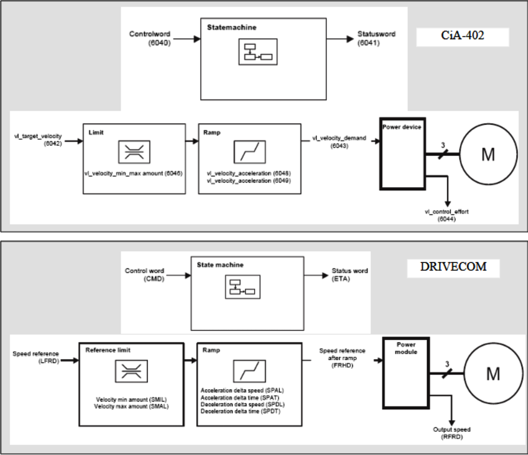

Рис.2. Назва основних параметрів у CiA 402 (вгорі) та відповідність їм назва в DRIVECOM (внизу)

Автомат стану частотного перетворювача Altivar71 з вибраним профілем CiA 402 наведено на рис.3. Для схеми живлення `Not Separate` у стані `Ready to Switch ON` можна відразу надсилати команду `Enable Operation`

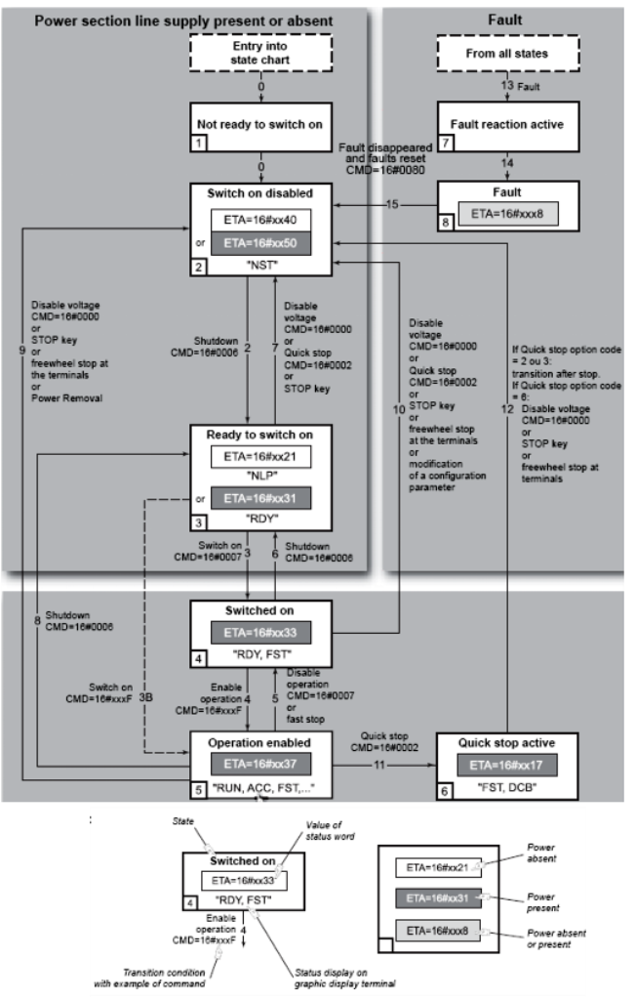

рис.3. Автомат станів для профілю управління CiA 402

Основні біти слова керування (CMD) та статусу (ETA) в Altivar71 з вибраним профілем CiA402 збігаються з таблицями 6 і 7 (Див. [теоретичну частину](../pds/teor1.md)). Слід звернути увагу на наявність у слові ETA Altivar71 14-го біта, що сигналізує про натиснуту кнопку STOP з пульта або терміналу (див. таблицю 3)

Таблиця 3.

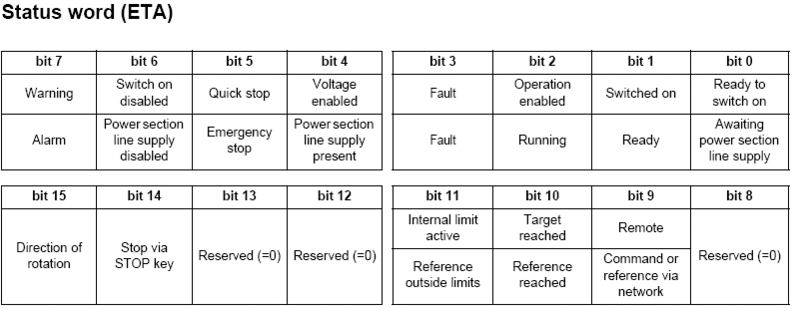

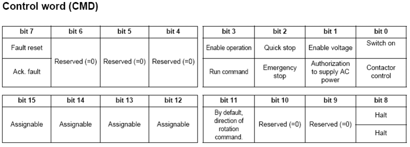

Послідовність дій системного інтегратора для організації керування ПЧ по мережі Modbus RTU.

1. Підключення та конфігурування ПЧ (конфігурування параметрів зв'язку для перетворювача).
2. Підключення та конфігурування комунікаційного порту M340.
3. Програмування М340 в UNITY PRO або Control Expert.
 1. Забезпечення комунікаційного обміну М340 та ПЧ.
 2. Розробка похідного функціонального блоку DFB для керування ПЧ UNITY;
 3. Розробка програми для керування перетворювачем частоти.

## 3. Підключення та конфігурування перетворювача частоти Altivar 71

### 3.1. Підключення

У прикладі використовується варіант підключення через інтегрований порт Modbus із RJ-45 роз'ємом (рис.4). Для підключення можна використовувати відгалуження від магістрального кабелю довжиною до 20 м. Правила підключення ПЧ Altivar 71 до мережі Modbus RTU проводяться відповідно до стандарту MODBUS Organization (http://www.modbus.org/). Слід звернути увагу на обов'язкову наявність захисного зміщення (асиметрії, поляризації лінії) на боці Ведучого пристрою, правила прокладання кабелів Modbus, термінальних резисторів при довжинах порядку >200 м (цими правилами часто нехтують).

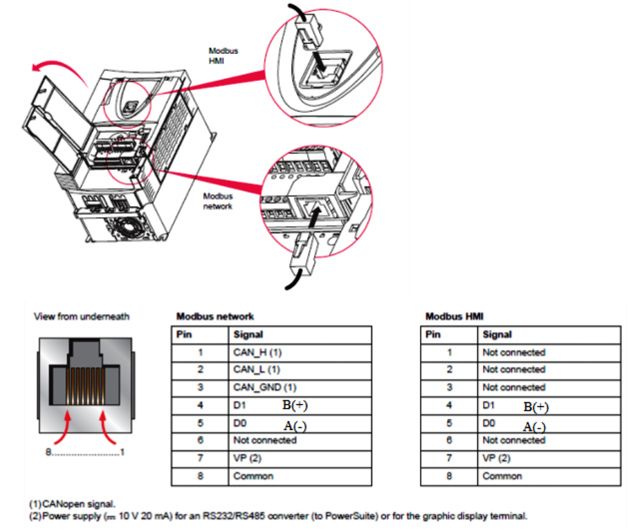

рис.4. Підключення до інтегрованих портів ATV71

### 3.2. Настроювання ПЧ для роботи з Modbus RTU.

Адреси регістрів MODBUS у ПЧ Altivar 71, які забезпечують контроль та керування роботою ПЧ, рознесені в адресному просторі у різних місцях, що передбачає обмін з використанням кількох запитів. Для зменшення кількості запитів на операції читання та запису параметрів у ПЧ Altivar 71 передбачена можливість об'єднання їх у групи (таблиці) які звуться `Communication Scanner`. Наповнення таблиці:

- параметрами запису конфігурується в меню `[1.9 - COMMUNICATION] (COM-)` підменю `[COM. SCANNER OUTPUT] (OCS-)`, 
- для читання – у підменю `[COM. SCANNER INPUT] (ICS-)`. 

Наповнення таблиць проводитимемо згідно з постановкою задачі.

Таблиця 4.

| Параметр                                              | Назва DRIVECOM                    | Адрес регістра MODBUS для  параметру | Адрес регістра MODBUS в таблиці |
| ----------------------------------------------------- | --------------------------------- | ------------------------------------ | ------------------------------- |
| **Наповнення COM. SCANNER OUTPUT (записування в ПЧ)** |                                   |                                      |                                 |
| Слово керування                                       | `Command word` (`CMD`)            | 8501                                 | $12761 (31D9_{16})$             |
| Задана швидкість (уставка)                            | `Speed target` (`LFRD`)           | 8602                                 | $12762$                         |
| **Наповнення COM. SCANNER INPUT (читання з ПЧ)**      |                                   |                                      |                                 |
| Слово стану                                           | `Status word` (`ETA`)             | 3201                                 | $12741 (31С5_{16})$             |
| Швидкість (плинне значення)                           | `Output speed` (`RFRD`)           | 8604                                 | $12742$                         |
| Задане значення частоти                               | `Frequency reference before ramp` | 3203                                 | $12743$                         |
| Струм дивгуна                                         | `Motor current`                   | 3204                                 | $12744$                         |
| Момент на двигуні                                     | `Torque Actual Value`             | 3205                                 | $12745$                         |
| Напруга на двигуні                                    | `Power supply voltage`            | 3207                                 | $12746$                         |

Конфігурування ПЧ можна здійснюватися за допомогою панелі налаштування, параметри якої відображені в таблиці 5.

Таблиця 5.

| Пункт меню/параметр                                          | Значення параметру | Пояснення                                                    |
| ------------------------------------------------------------ | ------------------ | ------------------------------------------------------------ |
| **1.DriveMenu -> 1.9.Communication -> ModbusNetwork**        |                    |                                                              |
| [Modbus Address]                                             | `[1]`              | адресу вузла, у прикладі вибираємо адресу `1`                |
| [Modbus baud rate]                                           | `[19.2 Kbps]`      | бітова швидкість, у прикладі вибираємо 19200 біт/с           |
| [Modbus format]                                              | `[8 E 1]`          | формат символу, наприклад вибираємо 8 біт даних (RTU), паритет парний, 1 стоп-біт |
| **1.DriveMenu -> 1.6.COMMAND**                               |                    |                                                              |
| [Profile]                                                    | `[not separate]`   | функціональний профіль ПЧ, вибираємо профіль CiA 402 Not Separate |
| [Ref. 1 channel]                                             | `[Modbus]`         | джерело завдання та команд керування для каналу 1, вибираємо Modbus |
| [Ref. 2 channel]                                             | `[HMI]`            | джерело завдання та команди керування для каналу 2, вибираємо керування з панелі |
| [Cmd switching]                                              | `[LI6]`            | перемикач між каналами, вибираємо – режим перемикання 6-м дискретним входом ПЧ(LI6) |
| [Copy Channel 1<->2]                                         | `[CMD+REF]`        | Копіювання уставки та команд керування з каналу 1 на 2, вибираємо – копіювати та уставку та команди для безударного переходу |
| **1.DriveMenu -> 1.9.Communication ->[COM. SCANNER OUTPUT]** |                    |                                                              |
| [Scan.Out1 address]                                          | `8501`             | адреса першого регістру в таблиці Communication Scanner для запису (початок таблиці в `12761`), у прикладі адреса CMD (див.табл.4) |
| [Scan.Out2 address]                                          | `8602`             | див. таб.4                                                   |
| **1.DriveMenu -> 1.9.Communication ->[COM. SCANNER INPUT]**  |                    |                                                              |
| [Scan. In1 address]                                          | `3201`             | адресу першого регістра в таблиці Communication Scanner для читання (початок таблиці 12741), у прикладі адресу ETA див. таб.4 |
| [Scan. In2 address]                                          | `8604`             | див. таб.4                                                   |
| [Scan. In3 address]                                          | `3203`             | див. таб.4                                                   |
| [Scan. In4 address]                                          | `3204`             | див. таб.4                                                   |
| [Scan. In5 address]                                          | `3205`             | див. таб.4                                                   |
| [Scan. In6 address]                                          | `3207`             | див. таб.4                                                   |

## 4. Підключення та конфігурування комунікаційного порту М340

### 4.1. Підключення.

У прикладі проводилося безпосереднє підключення інтегрованого порту ПЧ та інтегрованого порту ЦПУ М340 (BMX P342000), тобто без використання додаткових пристроїв. Були з'єднані між собою відповідні контакти згідно з MODBUS on RS-485: `D1`, `D0` і `Common`. Порт M340 у режимі Ведучого (Master) реалізує захисне зміщення (синоніми: асиметрія, поляризація лінії).

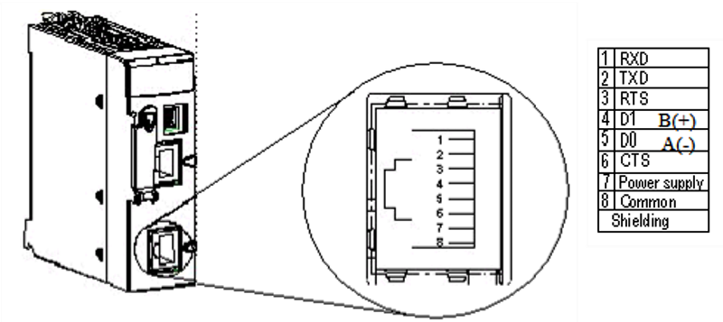   

Рис.5. Призначення контактів інтегрованого послідовного порту ЦПУ М340

### 4.2.Конфігурування порту

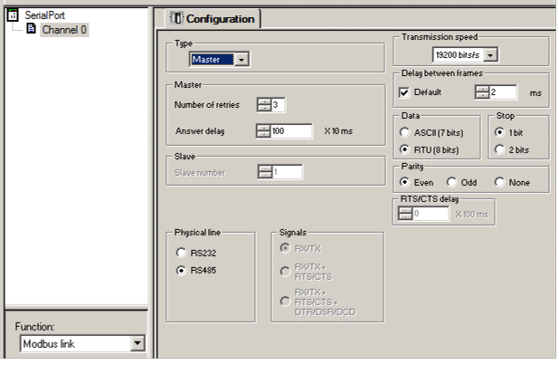

Рис.6. Конфігурування інтегрованого послідовного порту ЦПУ М340

## 5. Програмування М340 в UNITY PRO/Control Expert

### 5.1. Забезпечення комунікаційного обміну М340 та ПЧ

Потрібні параметри керування та контролю приводу згруповані в ПЧ у таблицях `COM. SCANNER` (див. табл.4). Доступ до змінних ПЧ як MODBUS Веденого пристрою здійснюється за допомогою функцій читання, запису або читання/запису Holding Registers (див. таб.1). Для читання регістрів М340 можна скористатися універсальною функцією `READ_VAR`, для запису - `WRITE_VAR`. Для реалізації інших клієнтських функцій Modbus М340 використовується комунікаційна функція `DATA_EXCH`.

Враховуючи підтримку в Altivar 71 функції `23` ($17_{16}$) `Read/Write Multiple Registers`, є сенс використовувати саме її, оскільки операції читання та запису здійснюється в один запит (одну транзакцію). Для реалізації функції читання/запису у прикладі використано DFB Type `RW_MODBUS_M340`. Зміст та робота похідного функціонального блоку, а також експортний файл для UNITY PRO доступні у [цьому розділі посібника](../modbusadvanced/rw23m340.md):

Функціональний блок призначений для читання та запису регістрів у кількості від 1 до 20. Керуючий вхід функції `START_REQ` запускає запити з максимально-можливою продуктивністю. Дані для запису та прочитані дані доступні у вигляді масиву типу `INT`. 

Програма для періодичного (період = 500 мс) зчитування з ПЧ, 6-ти регістрів, починаючи з `12741` (`COM. SCANNER INPUT`), та записи 2-х регістрів, починаючи з `12761` (`COM. SCANNER OUTPUT`), показана на рис.7.

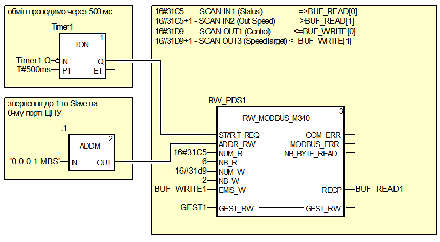

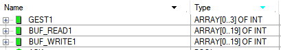

Рис.7. Програма для періодичного зчитування/запису регістрів (зверху) та таблиця змінних (знизу)

Таким чином, дані для керування та контролю ПЧ будуть доступні в наступних змінних М340.

Таблиця 6.

| Параметр                    | Назва DRIVECOM                  | ПЛК          |
| --------------------------- | ------------------------------- | ------------ |
| **ПЧ <-- ПЛК**              |                                 |              |
| Слово керування             | Command word (CMD)              | BUF_WRITE[0] |
| Задана швидкість (уставка)  | Speed target (LFRD)             | BUF_WRITE[1] |
| **ПЧ --> ПЛК**              |                                 |              |
| Слово стану                 | Status word (ETA)               | BUF_READ1[0] |
| Швидкість (плинне значення) | Output speed (RFRD)             | BUF_READ1[1] |
| Задане значення частоти     | Frequency reference before ramp | BUF_READ1[2] |
| Струм двигуна               | Motor current                   | BUF_READ1[3] |
| Момент на двигуні           | Torque-Actual-Value             | BUF_READ1[4] |
| Напруга на двигуні          | Power supply voltage            | BUF_READ1[5] |

### 5.2. Розроблення похідного функціонального блоку DFB для керування ПЧ в UNITY/Control Expert

Для керування ПЧ за профілем CiA402 використовується функціональний блок DriveCiA402. Завдання цього функціонального блоку, організувати керування автоматом стану приводу та його швидкістю на основі:

- вхідних даних про стан частотного перетворювача, отриманих по мережі (слово стану, поточне значення швидкості)
- команд керування (перехід в операційний режим і назад, запуск/зупинка обертання двигуна, швидка зупинка, квітування тривог)
- сформованого завдання (в діапазоні 0-100% максимальної швидкості)

Вихідними даними для функціонального блоку є:

- слово керування (командне слово), яке передається на привід;
- завдання значення швидкості в діапазоні приводу (0-1500 об/хв);
- сигнали контролю стану (наявність попередження/помилки приводу, поточне джерело команд керування, режим роботи, сигнал локальної команди зупинки приводу з пульта, поточна швидкість на двигуні)

 На рис.8 показана структура типу похідного функціонального блоку під назвою DriveCiA402.

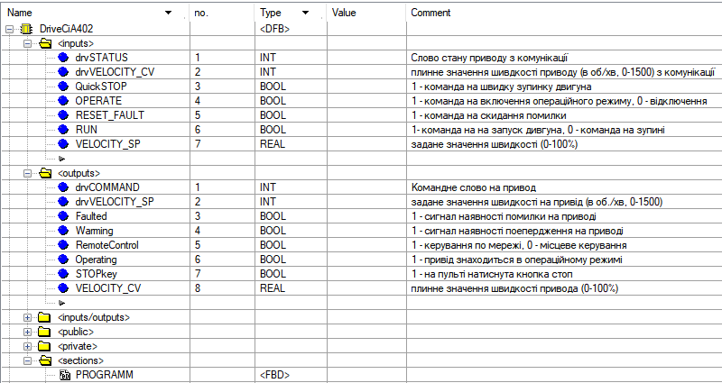

рис.8. Структура DFB Type DriveCiA402.

На рис.9 показано секція DFB Type DriveCiA402 мовою FBD. Програма керує словом керування (`drvCOMMAND`), залежно від слова стану приводу (`drvSTATUS`) та команд `OPERATE`, `RUN`, `RESET_FAULT` (див. рис.9). Для цього слово стан попередньо множиться (`AND`) з маскою. Швидке зупинення та вимкнення режиму `Operate` виконуються в будь-якому стані. Лінійне перетворення масштабів `0-100%` в `0-1500` об/хв і навпаки здійснюється простим множенням та діленням.

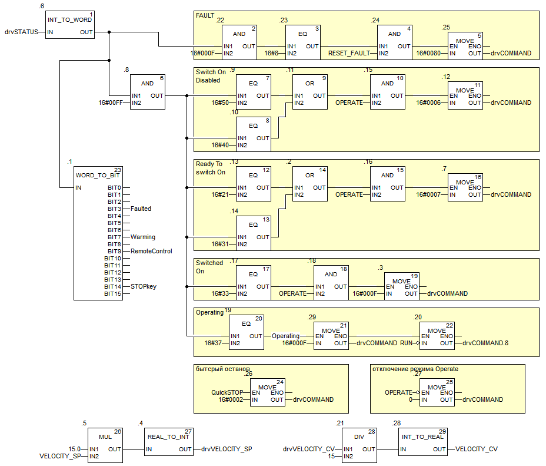

Рис.9. Програма у секції PROGRAMM у DFB Type DriveCiA402.     

### 5.3. Розроблення програми для керування перетворювачем частоти

На рис.10 показаний фрагмент програми використання примірника DFB Type DriveCiA402 з ім'ям `Drive1`. Програма роботи з ПЧ Modbus аналогічна як для CANOpen, оскільки використовується той же профіль CiA 402 при тій же постановці завдання.

Вхідні та вихідні дані з частотних перетворювачів відповідають словам керування та статусу, а також завданню (уставці) та поточному значенню швидкості. Переведення в операційний режим ПЧ і запуск на обертання двигуна здійснюється однією змінною `START`. Безударність переходу з джерела завдання та керування ПЛК (канал 1) на панель (канал 2) забезпечується копіюванням, означеним у налаштуваннях ПЧ (див. таблицю 5). Безударність зворотного переходу забезпечується програмним шляхом за інвертованим сигналом `RemoteControl`. Якщо організувати відключення сигналу `START` по команді `STOP` з локальної панелі, двигун зупиниться, але потім знову запуститься.         

При перевірці працездатності прикладу на лабораторній установці виявилося, що при перемиканні джерела керування та команди з "каналу 2" на "канал 1" ПЧ переходив у режим `SwitchedON` і не виводився в режим `Operational` командою `16#000F`. Ситуація вирішувалася лише будь-якою зміною завдання. [Автор](https://github.com/pupenasan) не знає причини такої поведінки, можливо це пов'язано з демонстративним обладнанням, що використовується під час перевірки. Для працездатності програми, доданий код, який трохи змінює завдання при переході на джерело завдання "канал 1".

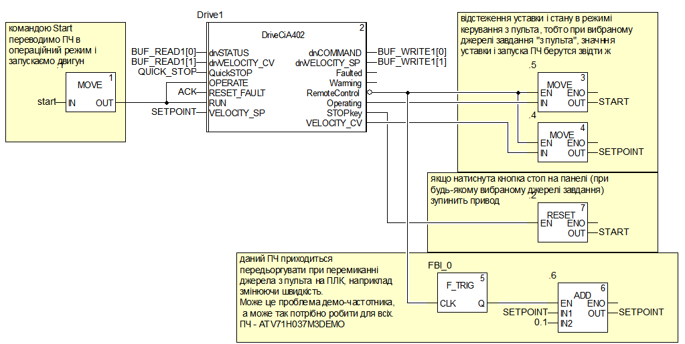

Рис.10. Фрагмент програми секції керування.

Файл експорту проекту доступний [за посиланням](atv71m340.xef)

## Список літератури

1. Altivar 71. Communication parameters Specification 383. Software V2.4. User’s manual. (atv71_parameters_S383_en_v4). 2007-11. [http://www.schneider-electric.com](http://www.schneider-electric.com/)
2. Altivar. CANopen. Integrated Modbus. User’s manual. (atv71_Modbus_Int_EN_V1). 2005-2. [http://www.schneider-electric.com](http://www.schneider-electric.com/)

Практичне заняття розробив [Олександр Пупена](https://github.com/pupenasan). 

Якщо Ви хочете залишити коментар у Вас є наступні варіанти:

- [Обговорення у WhatsApp](https://chat.whatsapp.com/BRbPAQrE1s7BwCLtNtMoqN)
- [Обговорення в Телеграм](https://t.me/+GA2smCKs5QU1MWMy)
- [Група у Фейсбуці](https://www.facebook.com/groups/asu.in.ua)

Про проект і можливість допомогти проекту написано [тут](https://asu-in-ua.github.io/atpv/)