[<- До підрозділу](README.md)	[Коментувати](#feedback)

# Використання FDT/DTM для конфігурування та налаштування ПЧ Altivar: практична частина

**Тривалість**: 1 акад година 

**Мета:** навчитися користуватися технологією FDT/DTM для конфігурування, налаштування та перевірки роботи пристроїв  

## Лабораторна установка для проведення лабораторної роботи у віртуальному середовищі.

**Апаратне забезпечення, матеріали та інструменти для проведення віртуальної лабораторної роботи.** 

- комп'ютер з ОС MS Windows 10 або вище

**Програмне забезпечення, що використане у віртуальній лабораторній роботі.** 

1. PACTware https://www.fieldcommgroup.org/pactware - FDT Frame Applaication 
2. ATV Virtual Training Device - ПЗ для імітації роботи ПЧ Altivar, можна використовувати і реальне обладнання
3. бібліотеки DTM для Altivar
4. ПЗ для програмування ПЛК, що є FDT Frame Applaication, наприклад Machine Expert 

## Загальна постановка задачі

Цілі роботи: 

- встановити FDT Frame Applaication та необхідні бібліотеки DTM для роботи з ПЧ
- використовуючи сканер знайти імітаційну або реальну установку з Altivar
- сконфігурувати ПЧ для керування по мережі
- використовуючи вікна налагодження запустити віртуальний або реальний ПЧ в роботу
- використати середовище програмування PLC як FDT Frame Applaication
- використати технологію FDT для автоматичного формування I/O Mapping для PLC  

## Послідовність виконання роботи

- [ ] Познайомтеся з теоретичними відомостями з [Технологія FDT/DTM: теоретична частина](teor.md)

### 1. Встановлення FDT Frame Application

 Для роботи з технологією FDT/DTM необхідне спеціальне ПЗ FDT Frame Application. Можна використовувати Frame Application від будь якого виробника. У роботі пропонується використовувати PACTware, який можна вільно завантажувати і використовувати для конфігурації пристроїв.

- [ ] Встановіть PACTware <https://www.fieldcommgroup.org/pactware>
- [ ] Запустіть PACTware і створіть новий проєкт

Після створення нового проєкту, автоматично відкриється дерево проєкту, в якому верхній рівень займають комуніаційні DTM (рис.1.). Праворуч буде перелік встановлених комунікаційних DTM, та ті DTM які пропонується використовувати з PACTware від партнерів.  

- [ ] Закрийте проєкт і PACTware

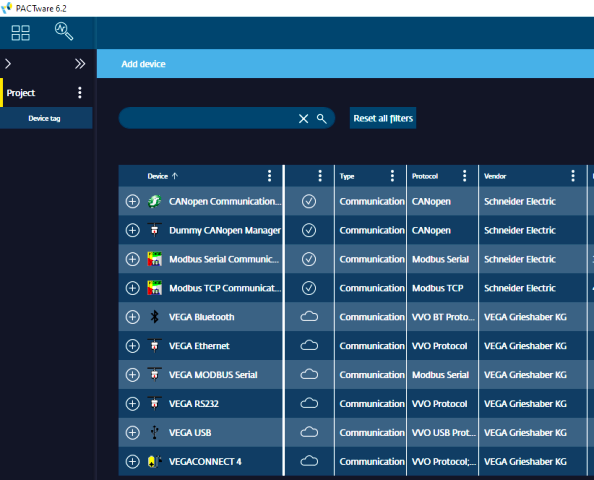

рис.1. Перелік комунікаційних DTM

### 2. Встановлення необхідних бібліотек DTM

У даній лабораторній роботі необхідно конфігурувати ПЧ Altivar з використанням Modbus on TCP. Для цього потрібно дві бібліотеки DTM:

- комунікаційну Modbus TCP
- DTM пристрою, а саме Altivar 

- [ ] Завантажте та встановіть Modbus Communication DTM Library останньої версії з сайту Schneider Electric. На момент розроблення практичного завдання архів можна завантажити за [цим посиланням](https://www.se.com/uk/en/download/document/Modbus%20Communication%20DTM%20Library/)
- [ ] Завантажте та встановіть ATV600 DTM-Library  останньої версії з сайту Schneider Electric. На момент розроблення практичного завдання архів можна завантажити за [цим посиланням](https://www.se.com/us/en/download/document/ATV6xx_DTM_Library_EN/)

**Увага! Якщо Ви використовуєте в лабораторній роботі інше обладнання, необхідно завантажити DTM саме для нього!** 

- [ ] Запустіть PACTware. Якщо він запропонує оновити бібліотеки погодьтется.
- [ ] Створіть новий проєкт.
- [ ] Добавте в проєкт комунікаційний DTM Modbus TCP
- [ ] Подвійним кліком зайдіть в налаштування. Подивіться на зміст закладок.
- [ ] Добавте в комунікацію ATV6xx.
- [ ] Виберіть якусь модель і натисніть `Ok` 

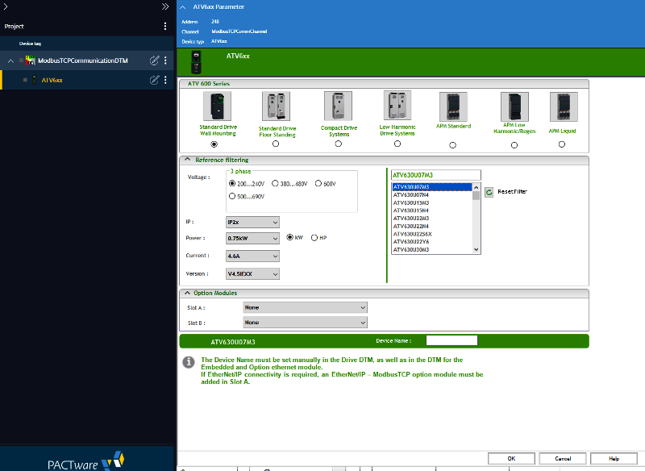

рис.2. Вибір моделі пристрою

- [ ] Прогляньте зміст конфігураційних закладок 
- [ ] Закрийте PACTware

### 3. Встановлення ATV Virtual Training Device

Даний пункт можна не виконувати, якщо використовується реальне обладнання. Тим не менше за можливості його виконання (передбачається отримання тимчасової ліцензії від представника Шнейдер Електрик) варто перед використанням реального обладнання спробувати на імітаційній установці.

 **Увага! ПЗ  ATV Virtual Training Device не працює на віртуальних машинах!**

- [ ] Запросіть у вашого представника Шнейдер Електрик дистрибувати ATV Virtual Training Device.

- [ ] Запустіть інсталятор. Якщо у вас є попередня версія цього інструменту, обов’язково видаліть її перед установкою новішої версії! 

- [ ] Щоб  мати можливість використовувати цей інструмент, ви повинні надіслати запит на ліцензійний ключ (рис.3), заповнивши необхідну інформацію (ім’я, прізвище, адреса електронної  пошти користувача, назва компанії, бажаний термін дії)

  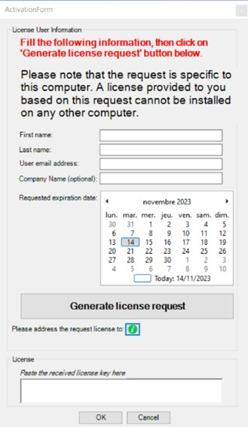

 рис.3. Запит інформацію на ліцензію

- [ ] Після цього натисніть `Generate license request` (рис.4), і буде створено текстовий файл із конкретною  інформацією, необхідною для отримання ліцензії  

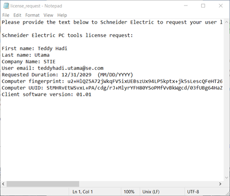

рис.4. Файл ліцензії

- [ ] Скопіюйте та вставте отриманий  текст і надішліть його електронною поштою локальному представнику Schneider Electric, щоб отримати ліцензійний ключ. Можна закрити ATV Virtual Training Device до отримання ліцензії.
- [ ] Після  отримання ліцензійного ключа, вставте його у  відповідний розділ і натисніть «OK».   Після цього ви  можете офіційно використовувати ATV Virtual Training Device.  

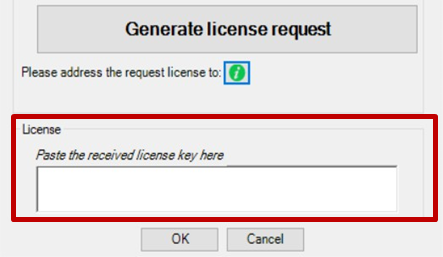

рис.5. Місце вставлення ключа ліцензії.

### 4. Робота та первинне налаштування ATV Virtual Training Device

- [ ] Запустіть ATV Virtual Training Device

- [ ] Ознайомтеся з призначенням та основними можливостями ATV Virtual Training Device з Додатку 1.

ATV Virtual Training Device запускається в режимі налаштування. У цьому режимі можна ознайомитися з інтерфейсом, вибрати модель ПЧ (рис.6) та модель навантаження. Емуляція ПЧ вмикається кнопкою `Start Drive simulation`. 

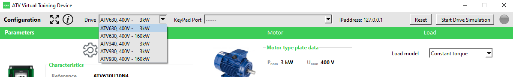

рис.6. Зовнішній вигляді вікна ATV Virtual Training Device у режимі конфігурування.

- [ ] Залиште тип ПЧ за замовченням. Натисніть `Start Drive Simulation` для емуляції ПЧ. 
- [ ] У `Drive State` має бути `RDY`. Якщо стані інший, натисніть `Stop Drive Simulation`, і знову `Start Drive Simulation`. Якщо  `RDY` не з'являється, зверніться до викладача або представника Шнейдер Електрик

За замовченням ПЧ налаштований таким чином, щоб запускався з дискретного входу `DI1` а задана частота задавалася з аналогового входу `AI1`. Ці значення можна емулювати.

- [ ] Виставте задане значення AI1 рівним 5.0 V (50% від діапазону), а `DI1` замкніть.

- [ ] Емулятор повинен запустити ПЧ (присутня звукова емуляція роботи двигуна). При досягненні емульованим двигуном заданої шивдкості, стан повинен перейти в `RUN`. 
- [ ] Подивіться на плинні значення у розділі `Actual eletcric data` (рис.7) 

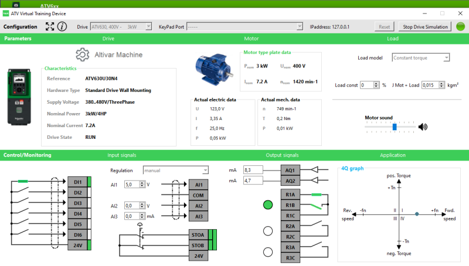

рис.7. Зовнішній вигляді вікна ATV Virtual Training Device у режимі емуляції.

### 5. Сканування мережі через DTM

- [ ] Запустіть PACTware
- [ ] Створіть новий проєкт
- [ ] Виберіть ModbusTCPCommunication DTM.

Технологія FDT/DTM передбачає сервіс сканування мережі для визначення пристроїв. Для цієї можливості необхідно налаштувати сканування. 

- [ ] Зайдіть в налаштування сканування в розділі `Scan`

- [ ] Якщо емулятор ПЧ запускається на тому самому ПК, залиште налаштування IP за замовченням. Якщо на іншому ПК в мережі, впишіть IP адресу підмережі.
- [ ] У розділі `Scan Configuration` виберіть тип `Single` та вкажіть IP адресу ПК, на якому запущено емулятор ПЧ (рис.8). Після чого натисніть `Apply` 

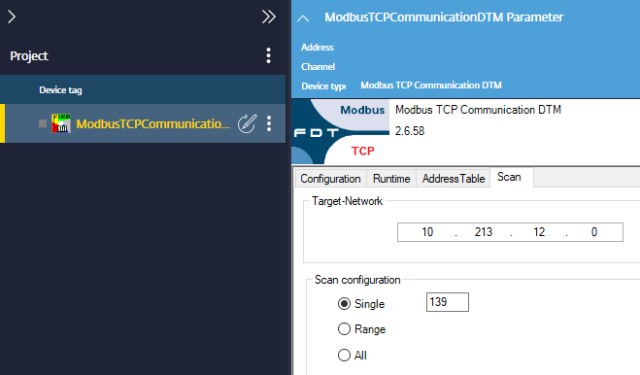

рис.8. Налаштування сканеру 

- [ ] Через контекстне меню `ModbusTCPCommunication` виберіть функцію `Topology Scan` 
- [ ] Натисніть `Scan topology`. У результаті пошуку повинен з'явитися емулятор (рис.9).

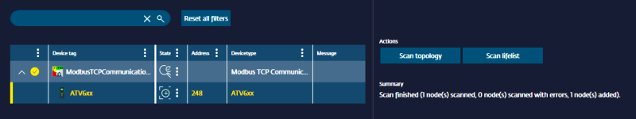

рис.9. Результат пошуку пристроїв в мережі

- [ ] Скористайтеся кнопкою `Back` (`<-`) для переходу в основне меню

### 6. Зчитування конфігурації та стану через DTM

- [ ] З'єднайтеся з ПЧ за допомогою команди контекстного меню `Connect`  (рис.10)

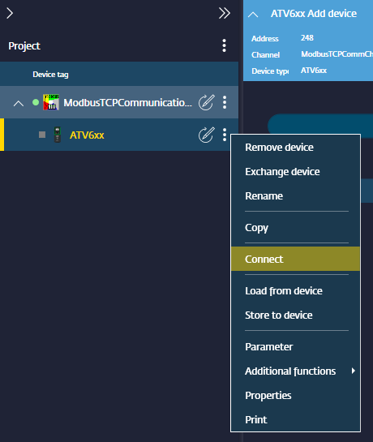

рис.10. 

Після підключення буде автоматично зчитана конфігурація обладнання.

- [ ] За допомогою команди `Parameter` з контекстного меню або використовуючи подвійний клік, зайдіть в налаштування ПЧ.

- [ ] Ознайомтеся з вікном стану та налаштування пристрою (рис.11), зокрема  панеллю статусу (внизу), командами керування (верхня панель). Виясніть в якому режимі знаходиться дані в DTM відносно пристрою, в якому режимі знаходиться пристрій. 

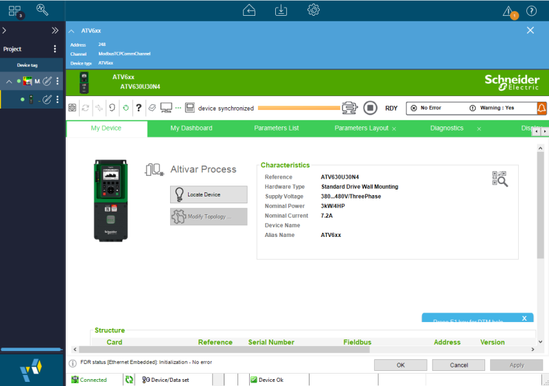

рис.11. 

- [ ] Перейдіть на закладку `My Dashboard` , визначте плинні значення частоти, струму, шивдкості.

- [ ] Перейдіть на вкладку `Parameters Layout->Command and Refernce`. Використовуючи  графічну блок-схему (рис.12) спробуйте визначити наступне:
  - звідки задається задане значення частоти
  - які мінімальні та максимальні значення обмеження частоти
  - яка швидкість розгону та гальмування 

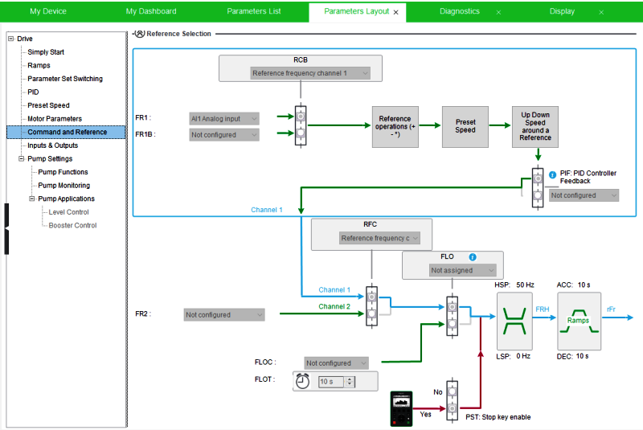

рис.12. Відображення налаштувань `Command and Refernce`

- [ ] Перейдіть в розділ `Inputs & Outputs` (рис.13). Поступово переключаючи `Pages` використовуючи налаштування з полів `IO Assigments` визначте наступне
  - який сигнал забезпечує керування рухом двигуна вперед
  - який сигнал забезпечує скидання аварії
  - які аналогові вхідні сигнали і для чого задіяні
  - які аналогові вихідні сигнали і для чого задіяні
  - які дискретні виходи задіяні і для якої функції 

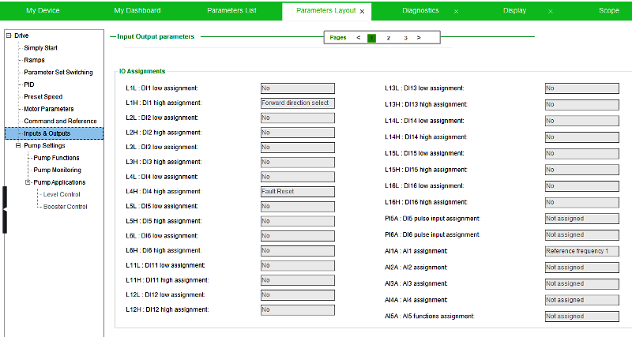

рис.13. Налаштування  `Inputs & Outputs`

### 7. Зміна налаштувань через DTM

Змінювати налаштування можна тільки при зупинці двигуна. 

- [ ] Використовуючи вікно налаштування ATV Virtual Training Device зупиніть двигун
- [ ] У налаштуваннях `FR1` вікна  `Command and Reference` виставте `Embeded Ethernet` і натисніть `Apply`

Це налаштування робить можливим керування ПЧ тільки через канал вбудованого Ethernet по Modbus TCP. Варто зауважити, що ПЧ Altivar мають дуже гнучкі можливості налаштування керування в т.ч. комбіновані режими, перемикання каналів керування, тощо. Дане практичне заняття зосереджується виключно на можливостях FDT/DTM, тому усі інші функції не розглядаються.

- [ ] Подивіться перелік змінених параметрів налаштувань в ПЧ (рис.14)

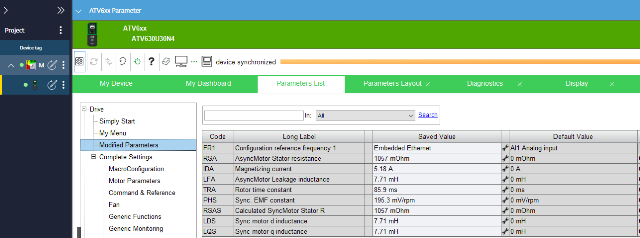

рис.14. Перегляд змінених налаштувань відносно налаштованих за замовченням 

### 8. Керування ПЧ через DTM

DTM дає можливість не тільки зчитувати чи змінювати параметри а також керувати пристроєм.

- [ ] Подивіться на стан приводу. Він має бути в `NST`, оскільки не активовано керування по мережі
- [ ] Активуйте панель керування (`Control Panel`)

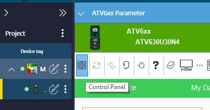

рис.15. Активація панелі керування

- [ ] Внизу з'явиться панель керування (рис.16)

- [ ] Натисніть `Enable` в розділі `Control` панелі керування. Стан приводу повинен перейти в `RDY` 

- [ ] Змініть значення `Reference Frequency` і натисніть  `Run`. Проконтролюйте що емулятор приводу відпрацьовує задані значення чатоти.

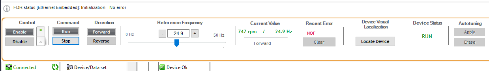

рис.16. Панель керування

- [ ] Зупиніть роботу двигуна  (команда `Stop`)
- [ ] Деактивуйте керування по мережі (команда `Disable`)
- [ ] Збережіть проєкт в PACTware

### 9. Перевірка на реальному обладнанні

- [ ] Якщо в лабораторії наявне реальне обладнання, за узгодженням з викладачем зробіть наступні дії:
  - виставте конфігурування IP адреси на ПЧ, використовуючи локальну панель
  - повторіть дії, аналогічно вказаним в пунктах 4-8 

### 10. Використання Machine Expert як FDT Frame Application

У даному пункті передбачається використання ПЗ для програмування ПЛК як FDT Frame Application. У якості такого ПЗ використовується Machine Expert. ПЗ Machine Expert має обмеження (можливо свідомо штучні) щодо використання FDT/DTM, зокрема:

- він надає можливість добавляти комунікаційні DTM тільки Modbus RTU
- можливості роботи з DTM на інших комунікаціях доступні через сервіси комунікаційних модулів ПЛК 

 Тому в даному пункті розглядаються тільки конфігураційні можливості. Роботу по керуванню можна перевірити тільки з реальним обладнанням що надає доступ по Modbus RTU.

- [ ] Запустіть Machie Expert. Створіть новий порожній проєкт.
- [ ] Через контекстне меню добавте `FDT Connections`

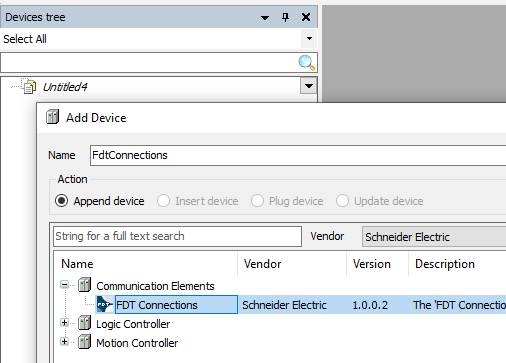

рис.17. Добавлення FDT Connections

- [ ] Добавте `Modbus Serial Line Manager`

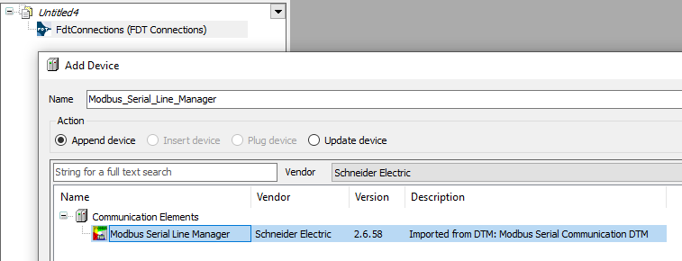

рис.18.

- [ ] Добавте `Altivar 6xx` або інший тип Altivar, якщо він присутній у вашій лабораторії 

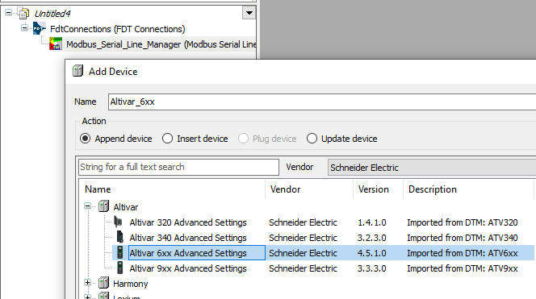

рис.19.

- [ ] Виберіть модель 

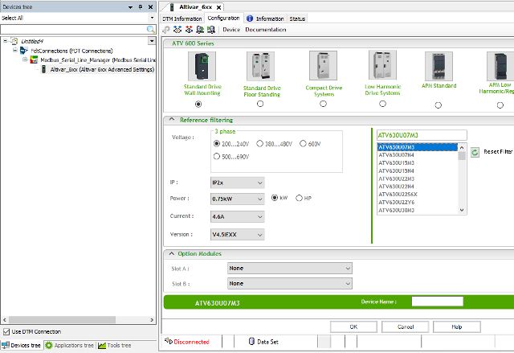

рис.20. 

- [ ] Подивіться на конфігураційні вікна налаштування ПЧ. Дайте відповідь на наступні запитання:
  - Чому ПЗ використане для налаштування ПЧ (PACTware і Machine Expert) різне, а конфігураційні вікна однакові?
  - Спробуйте самостійно визначити розміщення команди для підключення до     

- [ ] Якщо в лабораторії наявне реальне обладнання, за узгодженням з викладачем зробіть наступні дії:
  - виставте конфігурування адреси Modbus Slave на ПЧ, використовуючи локальну панель
  - повторіть дії, аналогічно вказаним в пунктах 4-8 

### 11. Використання FDT для конфігурування комунікацій з PLC

У даному пункті FDT використовується для інтеграції з PLC через автоматичне формування входів/виходів.

- [ ] Створіть проєкт з PLC M241
- [ ] Добавте в Protocol Managers пристрій Industrial Ethernet Manager  

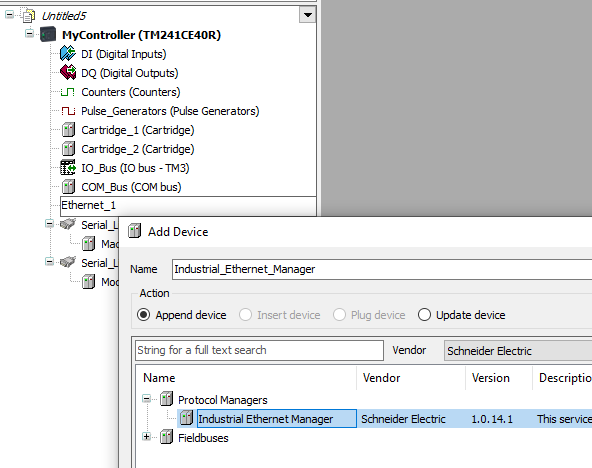

рис.21. 

- [ ] Добавте `Altivar 6xx` або інший тип Altivar, якщо він присутній у вашій лабораторії 

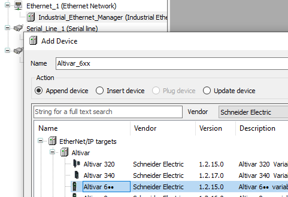

рис.22.

- [ ] Якщо пристрій присутній в лабораторії, підключіться і зчитайте його конфігурацію, якщо ні - виберіть тип. Добавте в SlotA карту з підтримкою Modbus TCP і натисніть Ok.

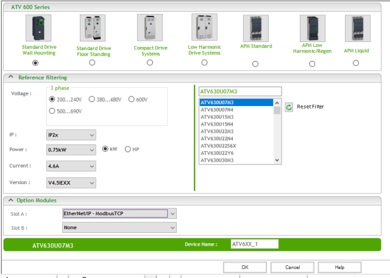

рис.23.

- [ ]  Проконтролюйте що вибраний протокол Modbus TCP

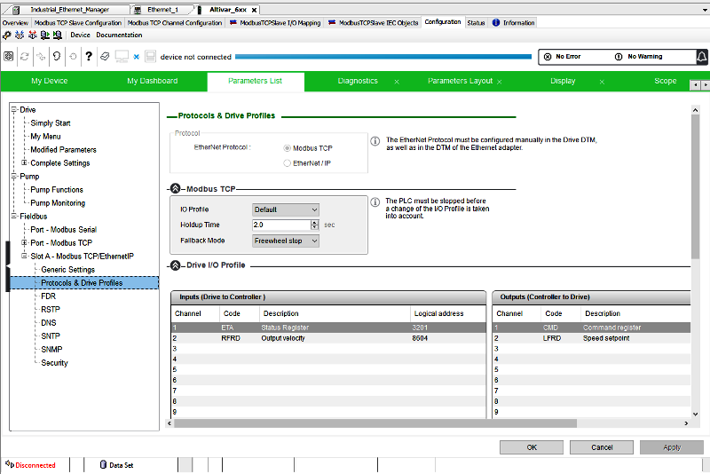

рис.24.

- [ ] У Command and Reference виставте режим керування через комунікаційний модуль 

рис.25.

- [ ] Після цих налаштувань з даним пристроєм будуть асоціюватися відповідні змінні I/O (рис.26)

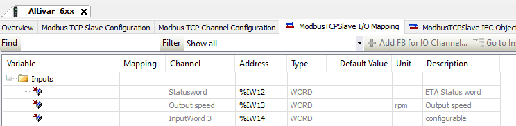

рис.26.

## Додаток 1. ATV Virtual Training Device

### Загальні відомості

ATV Virtual Training Device - це програмне забезпечення для емуляції роботи деяких моделей перетворювачів частоти Altivar. Воно використовується для навчання та відпрацювання налаштувань приводу без підключення реального обладнання. Програма дозволяє виконувати базову параметризацію та керування віртуальним приводом і підтримує такі функції:

- запуск та зупинка приводу;
- задання та зміна опорної швидкості двигуна;
- імітація роботи приводу у різних режимах керування;
- встановлення обмежень швидкості;
- налаштування параметрів розгону та гальмування;
- вибір режиму керування (наприклад 2-провідне або 3-провідне керування);
- імітація сигналів керування приводу;
- відображення основних параметрів роботи приводу;
- тестування базових алгоритмів керування.

Через графічний інтерфейс користувач може:

- задавати параметри конфігурації приводу;
- змінювати уставку швидкості;
- запускати та зупиняти двигун;
- спостерігати зміну швидкості двигуна;
- аналізувати поведінку приводу при зміні параметрів.

Обмеження емуляції:

- модель не відтворює фізичні процеси електродвигуна з високою точністю;
- не підтримуються всі функції реальних приводів;
- відсутня повна діагностика апаратної частини;
- деякі комунікаційні функції можуть працювати лише частково.

### Робота з комунікаціями

Програма підтримує також емуляцію мережевої взаємодії з перетворювачем частоти через протокол Modbus TCP. У цьому режимі емулятор виступає як пристрій Modbus TCP server (slave), до якого можуть підключатися інженерні або керувальні системи. Це дозволяє виконувати такі задачі:

- тестування обміну даними між системою керування та перетворювачем частоти;
- відпрацювання алгоритмів керування приводом через Modbus;
- перевірку роботи прикладних програм PLC без використання реального приводу;
- навчання роботі з регістрами Modbus приводу Altivar.

Через Modbus TCP доступні основні змінні приводу, зокрема:

- слово керування (Control Word);
- слово стану (Status Word);
- опорна швидкість;
- фактична швидкість двигуна;
- інші параметри приводу.

### Емуляція середовища роботи

За допомогою вибору `Load model` користувач може задати тип механічного навантаження, яке буде імітуватися під час роботи віртуального приводу. Це дозволяє наблизити поведінку моделі до реальних умов роботи електропривода з різними механізмами. У програмі доступні такі моделі навантаження:

- `Constant torque` – навантаження з постійним моментом. Така модель характерна для конвеєрів, мішалок, екструдерів та інших механізмів, у яких момент навантаження майже не залежить від швидкості.
- `Variable torque` – навантаження зі змінним моментом. У цій моделі момент змінюється залежно від швидкості, що характерно для вентиляторів і насосів.
- `HQ pump model` – спеціалізована модель насоса, у якій враховується залежність між напором, витратою та швидкістю обертання.
- `Compressor` – модель компресора з характерною нелінійною залежністю навантаження від швидкості.
- `Conveyor` – модель конвеєрного механізму, яка імітує навантаження транспортних систем.

Додатково параметр `Load const` дозволяє змінювати величину навантаження у відсотках від номінального значення. Це дає можливість моделювати різні режими роботи механізму, наприклад часткове або повне завантаження.

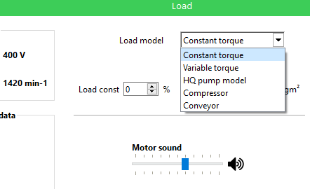

#### Емуляція навантаження

Віртуальний тренажер ATV має функцію імітації різних моделей типових навантажень, які використовуються в промисловості, таких як навантаження з постійним і змінним моментом. Ця функція дозволяє користувачеві вивчити характеристики кожної моделі навантаження.

У моделі з постійним моментом користувач може збільшувати або зменшувати навантаження, змінюючи значення T const, і досліджувати динамічний ефект навантаження, змінюючи значення інерції системи. 

Для обох моделей користувач може виявити зв'язок між потужністю, крутним моментом і швидкістю, що є фундаментальними знаннями для розуміння.

#### Динамічна крива насоса 

ATV Virtual Training Device має функцію відображення динамічної кривої насоса. Завдяки цій функції користувач може досліджувати поведінку насоса, що приводиться в дію від ПЧ та традиційного методу дроселювання. Крім того, можна спостерігати ефект статичного напору насосної системи.
Щоб мати можливість активувати цю функцію, необхідно вибрати тип навантаження для моделі насоса HQ.

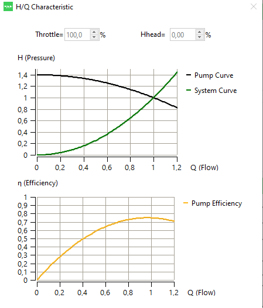

#### 

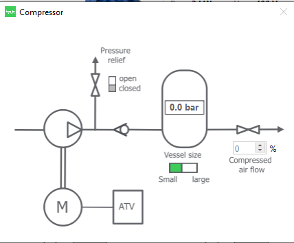

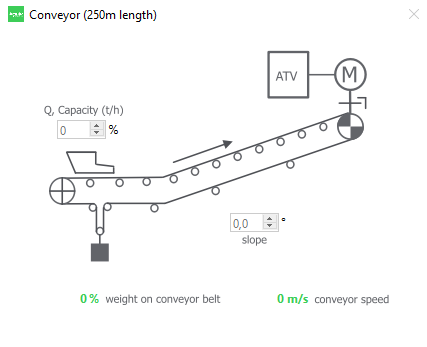

## Автори

Практичне заняття розробив  [Олександр Пупена](https://github.com/pupenasan). 

## Feedback

Якщо Ви хочете залишити коментар у Вас є наступні варіанти:

- [Обговорення у WhatsApp](https://chat.whatsapp.com/BRbPAQrE1s7BwCLtNtMoqN)
- [Обговорення в Телеграм](https://t.me/+GA2smCKs5QU1MWMy)
- [Група у Фейсбуці](https://www.facebook.com/groups/asu.in.ua)

Про проект і можливість допомогти проекту написано [тут](https://asu-in-ua.github.io/atpv/) 
