[<- До підрозділу](README.md)	[Коментувати](#feedback)

# Технологія FDT/DTM: теоретична частина

## 1. Загальні поняття

### Потреби в описах пристрою

На різних стадіях життєвого циклу систем керування задіяні різні спеціалісти з різними потребами в контексті взаємодії з пристроями керування. Ці потреби можна звести до узагальненої таблиці (таб.1)

Таб.1. Потреби у взаємодії з пристроями різному персоналу 

| Узагальнена роль                           | Кого включає                                            | Яка інформація про пристрій потрібна                         |
| ------------------------------------------ | ------------------------------------------------------- | ------------------------------------------------------------ |
| System architects                          | розробники архітектури системи                          | типи пристроїв, функції, інтерфейси, обмеження               |
| Electrical and automation design engineers | проєктанти електричної частини та схем автоматизації    | номенклатура обладнання, сигнали, підключення, клеми, живлення, інтерфейси |
| Control software engineers                 | розробники програм PLC та інтеграції                    | канали I/O, змінні, структури даних, параметри обміну, діагностичні ознаки |
| Network and system integration engineers   | інженери мереж та системної інтеграції                  | топологія, адресація, модульна структура, протоколи, режими зв’язку |
| Commissioning and service engineers        | пусконалагодження, сервіс, діагностика                  | параметри, режими роботи, команди керування, журнали подій, коди помилок |
| Operators and maintenance staff            | оператори та експлуатаційний персонал, asset management | стан пристрою, аварії, попередження, історія параметрів, паспортні дані |
| Engineering platform developers            | розробники SCADA, DCS, AMS та інженерних платформ       | формалізований машинозчитуваний опис пристрою для універсальної інтеграції |

Якщо пристрій підтримує обмін по мережі, то очевидно що отримання інформації та її зміна доступна через певні комунікаційні сервіси. Для підтримки цих задач необхідно, щоб інженерні інструменти та системи керування могли отримувати структуровану інформацію про пристрої (опис пристрою, device description, рис.1), та змінювати її в пристроях. Така інформація повинна описувати властивості пристрою, його параметри, доступні функції, а також правила взаємодії з ним.

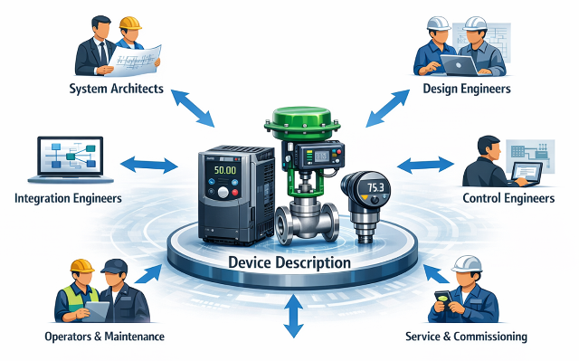

рис.1. Потреби у взаємодії з пристроями різному персоналу 

У традиційному підході інформація щодо обміну потрібними даними міститься в інструкціях та технічних паспортах пристроїв, призначених для людини. Тобто саме людина повинна забезпечити реалізацію обміну між потрібними засобами.   

Розглянемо це на прикладі мережного пристрою. На рис.2 показаний принцип відображення Modbus регістрів на пам'ять пристрою. Щоб забезпечити навіть циклічний обмін з потрібними даними процесу з таким пристроєм, необхідно розробнику програмної частини системи керування (PLC, SCADA/HMI) визначати це відображення і вручну задавати до яких саме регістрів треба підключатися. У випадку якщо виникає потреба в конфігуруванні пристрою або налагодженню з використанням Modbus, необхідно ще забезпечити в цей момент зміну і параметрів, які потребуються саме під час цих процесів.   

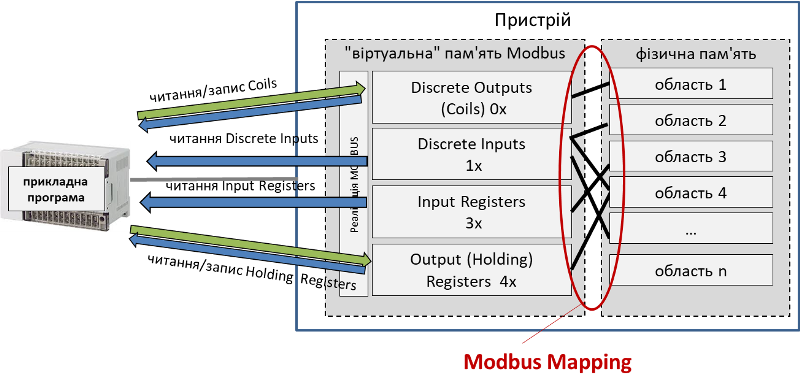

рис.2. Modbus Mapping

Для кращого розуміння, на рис.3 показані фрагменти опису віддаленого модуля аналогових входів, що комунікує по Modbus RTU. У описі регістрів видно, що він містить Holding Reguister від 0 до 3, якими задаються комунікаційні параметри (базова адреса, бітова швидкість передачі, паритет та стопові біти), а в регістрах 1000-1008 - значення зчитуваних даних. Тобто перед використанням, сервісний інженер при налагодженні або заміні дефектного обладнання повинен через Modbus і якусь утиліту для роботи з Modbus, налаштувати комунікаційні параметри, використовуючи для підключення параметри по замовченню. А розробник проєкту для ПЛК повинен реалізувати обмін саме з регістрами 1000-1008. Для інших типів пристроїв або навіть моделей такого ж типу, Modbus відображення та навіть підтримувані функції будуть відрізнятися.    

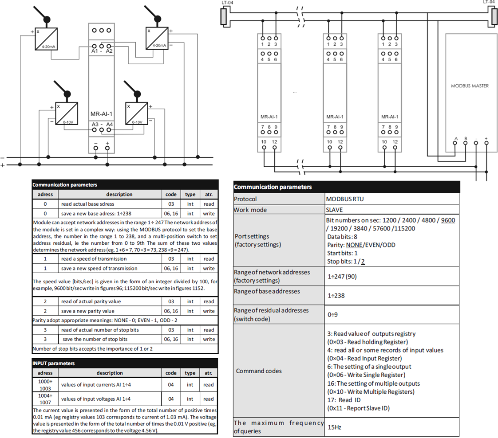

рис.3. Фрагмент з документації по налаштуванню та використанню аналогового вхідного модуля по Modbus

Так проблема різноманітності привела до потреби у машинозчитуваних описах пристроїв, які можуть використовуватися програмними засобами для автоматизованої інтеграції, конфігурування та керування пристроями. Надалі програмні засоби, які використовуються для взаємодії з пристроями для виконання цих функцій будемо називати **інженерними інструментами**. Так, наприклад, якщо б розробник наведеного вище модуля аналогових входів а також інших засобів мав інженерну утиліту для їх конфігурування, то це б значно спростило їх введення в дію та обслугоування.  

Машинозчитувані описи пристроїв (Device Description) виконують роль електронних технічних паспортів пристрою і дозволяють інженерним інструментам отримувати необхідну інформацію без ручного введення даних. При цьому інженерний інструмент не містить інформацію про сам пристрій в його програмі, натомість він використовує опис.  Тобто, інженерні інструменти надають різноманітні функції щодо роботи з різними типами пристроїв, а для розуміння їх можливостей, ці інструменти отримують інформацію з опису пристрою (рис.4).  Так, наприклад, якщо б розробник наведеного вище модуля аналогових входів мав інженерну утиліту, то йому б потрібно було для своїх пристроїв надавати файли описів, які б цей інструмент зміг використати для налаштування.

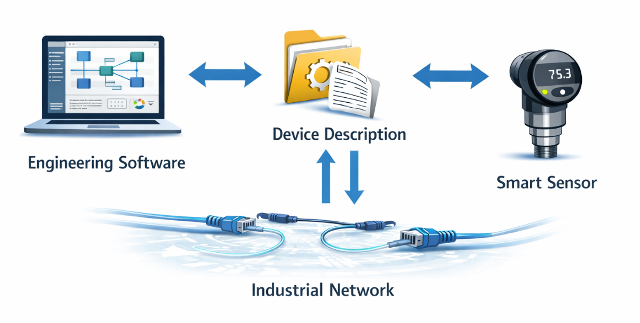

рис.4. Інженерні програмні інструменти та опис пристрою

Таким чином з появою нових мереж на рівні обміну з польовими засобами та розподіленою периферією, з'явилися також різні підходи до електронного опису пристроїв. Найбільш поширеними серед них є профілі пристроїв та електронні описи на основі файлів або програмних модулів. До таких механізмів належать, зокрема, GSD, EDS, EDDL, FDT/DTM, а також більш нові підходи, такі як FDI. Кожен із цих механізмів вирішує задачу інтеграції пристрою у систему керування на своєму рівні та з використанням різних технологічних підходів. Хоч кожна з наведених технологій використовується і сьогодні, у цій лекції детально розглянемо лише FDT, тоді як інші підходи будуть розглянуті лише загально.

Перші машинозчитувані описи пристроїв з’явилися в рамках конкретних промислових мереж. Розробники протоколів зв’язку намагалися спростити інтеграцію пристроїв у інженерні інструменти, формалізувавши інформацію про їх властивості у вигляді спеціалізованих файлів. Такі файли описували ідентифікацію пристрою, параметри конфігурації, структуру даних обміну, а також доступні функції.

Оскільки ці рішення створювалися незалежно в межах різних екосистем, виникло кілька різних форматів електронного опису пристроїв. Наприклад, у мережах PROFIBUS та PROFINET використовуються файли GSD або GSDML, у мережах CANopen, EtherNet/IP та DeviceNet використовуються файли EDS, а в системах HART, FOUNDATION Fieldbus та PROFIBUS PA застосовується мова опису пристроїв EDDL. Хоч ці механізми значно спростили інтеграцію пристроїв у межах конкретних мереж, вони залишалися прив’язаними до відповідних протоколів і не забезпечували універсального способу роботи з пристроями різних типів у єдиному інженерному середовищі. Рис.5 ілюструє проблему використання різних інженерних інструментів у системах керування.

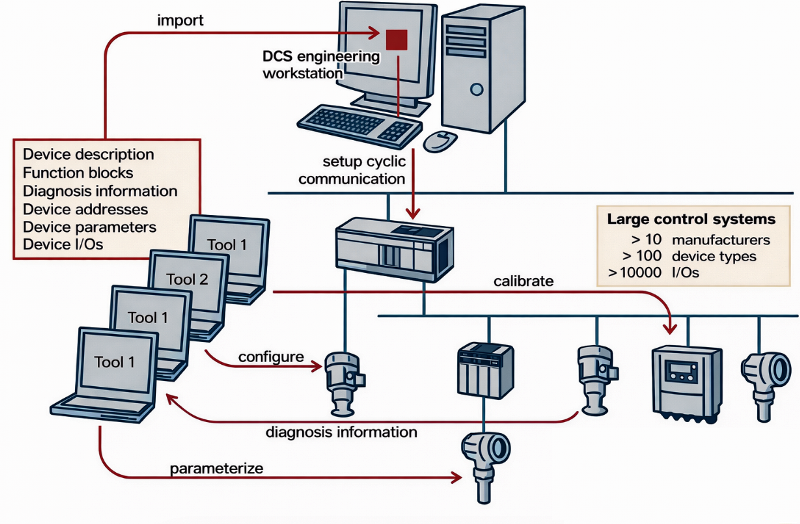

Рис.5. Проблема використання інженерних інструментів в системах керування 

Окрім потреби у машинозчитуваних описах пристроїв, з часом виникла і потреба в уніфікації підходів до їх використання. Специфікація FDT виникла саме як відповідь на потребу створення уніфікованого підходу до інтеграції, конфігурування, введення в експлуатацію, діагностування та обслуговування польових пристроїв у різних інженерних інструментах незалежно від виробника пристрою та використовуваного протоколу промислової мережі.

У такій моделі інженер повинен мати можливість вільно обирати обладнання різних виробників, при цьому інженерний інструмент повинен забезпечувати доступ до всіх функцій пристрою. Крім того, з урахуванням потреб на різних етапах життєвого циклу системи необхідний безшовний обмін даними між пристроями, системами керування та застосунками керування активами. У ідеальному випадку повинен існувати єдиний програмний компонент, що описує можливості пристрою і може використовуватися різними хост-системам

### GSD, GSDML та EDS

Після появи машинозчитуваних описів пристроїв першою задачею, яку необхідно було вирішити, стала підтримка конфігурування промислових мереж у інженерних інструментах. Інженеру необхідно було визначити, які пристрої можуть бути підключені до мережі, які параметри конфігурації вони підтримують, які модулі можуть бути встановлені, а також який обсяг процесних даних передається між пристроєм і системою керування. Для цього інженерні інструменти повинні мати формалізований опис структури пристрою та його мережевих параметрів.

Одним із рішень цієї задачі стали електронні описи пристроїв у вигляді файлів конфігурації мережі. Такі файли дозволяють інженерному інструменту автоматично додавати пристрій до конфігурації мережі, визначати його параметри та структуру обміну даними.

У мережах PROFIBUS для цього використовуються файли GSD (General Station Description). Файл GSD містить інформацію про ідентифікацію пристрою, підтримувані режими роботи, конфігурацію модулів, параметри мережі та структуру процесних даних. Інженерний інструмент використовує цей файл для додавання пристрою до конфігурації мережі та означення параметрів обміну даними. Проте GSD описує лише мережеву інтеграцію пристрою і не містить повного опису його функцій, параметрів або інтерфейсу конфігурування.

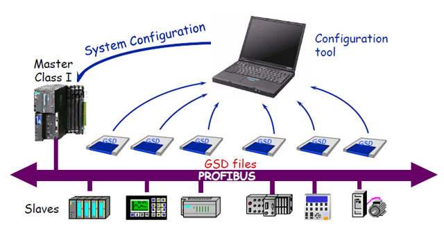

рис.6. Принцип використання GSD

GSD файл є звичайним текстовим файлом, який містить формалізований опис характеристик пристрою для інтеграції в мережу PROFIBUS. Створюють та редагують файли GSD виробники пристрою, оскільки саме вони мають повну інформацію про структуру пристрою, підтримувані модулі, параметри конфігурації та характеристики обміну даними. Тим не менше, формат таких файлів є відкритим і стандартизованим, тому за потреби їх можна переглядати або редагувати і в текстовому вигляді. Для спрощення створення та перевірки таких файлів зазвичай використовуються спеціальні редактори та утиліти перевірки. Такі інструменти допомагають виробнику сформувати коректний опис пристрою відповідно до вимог стандарту, перевірити структуру файлу, а також переконатися, що він може бути правильно інтерпретований інженерними інструментами. 

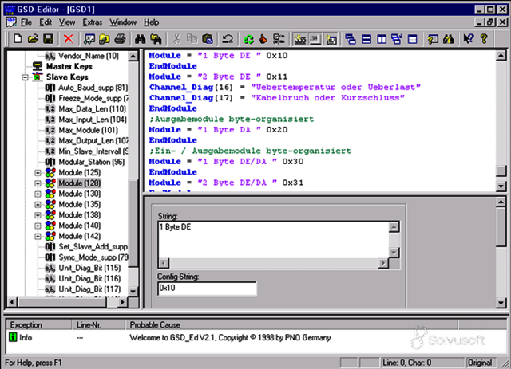

рис.7. Приклад редактору GSD  

З появою мереж PROFINET для цілей опису пристрою був запроваджений інший формат - GSDML (General Station Description Markup Language), який є розвитком підходу GSD. На відміну від GSD, файл GSDML побудований на основі XML і дозволяє описувати складнішу структуру пристрою, включаючи модульні конфігурації, параметри мережевих інтерфейсів та розширені властивості пристрою. Проте основне призначення цього формату залишається тим самим – забезпечити інтеграцію пристрою у конфігурацію мережі та означити структуру процесного обміну. Для форматів на основі XML, таких як GSDML, редактори XML також забезпечують перевірку відповідності XML-схемам та структурам даних, визначеним стандартом.

Подібний підхід використовується і в інших промислових мережах. Наприклад, у мережах CANopen, DeviceNet та EtherNet/IP застосовуються файли EDS (Electronic Data Sheet). Файл EDS також є текстовим файлом, який описує об’єктну модель пристрою, включаючи перелік параметрів, атрибутів та доступних сервісів. Інженерні інструменти використовують цей опис для інтеграції пристрою у мережу та доступу до його параметрів через стандартну модель даних відповідного протоколу.

Таким чином, формати GSD, GSDML та EDS вирішують задачу інтеграції пристрою в конфігурацію промислової мережі та означення структури обміну даними. Проте вони описують переважно мережеві властивості та базову параметризацію пристрою і не охоплюють усіх потреб інженерів, пов’язаних із повним конфігуруванням, діагностикою та обслуговуванням пристроїв. Саме ці обмеження стали причиною розвитку більш універсальних технологій опису пристроїв.

### EDDL

EDDL (Electronic Device Description Language) вперше була використана з протоколом зв’язку HART у 1992 році. На відміну від форматів GSD та EDS, які в основному описують мережеві властивості пристрою та структуру обміну даними, EDDL призначена для опису параметрів пристрою, процедур конфігурування та діагностичних функцій. У 2004 році EDDL було розширено шляхом об’єднання мов опису пристроїв для HART, PROFIBUS і FOUNDATION Fieldbus, що призвело до затвердження міжнародного стандарту IEC 61804-2. Додатковий стандарт IEC 61804-3 розширює EDDL, додаючи покращений користувацький інтерфейс, графічні представлення та можливість зберігання постійних даних. У 2004 році до команди співпраці EDDL приєдналася OPC Foundation, після чого EDDL почали використовувати і в контексті відкритої архітектури OPC Unified Architecture.

У EDDL кожен польовий пристрій представлено електронним дескриптором пристрою (Electronic Device Descriptor, EDD). EDD подається у вигляді текстового файлу, який є незалежним від операційної системи. Інженерні інструменти або системи керування використовують спеціальний інтерпретатор EDDL, який читає відповідні файли EDD для пристроїв, присутніх у системі, і на основі цього опису формує інтерфейси параметризації, конфігурування та діагностики пристрою. EDDL дозволяє описувати:

- параметри пристрою та залежності між ними;
- функції пристрою, наприклад режим симуляції або калібрування;
- графічні представлення, наприклад меню;
- взаємодію з пристроями керування;
- графічні елементи, зокрема
  - розширений користувацький інтерфейс,
  - систему побудови графіків;
- постійне сховище даних.

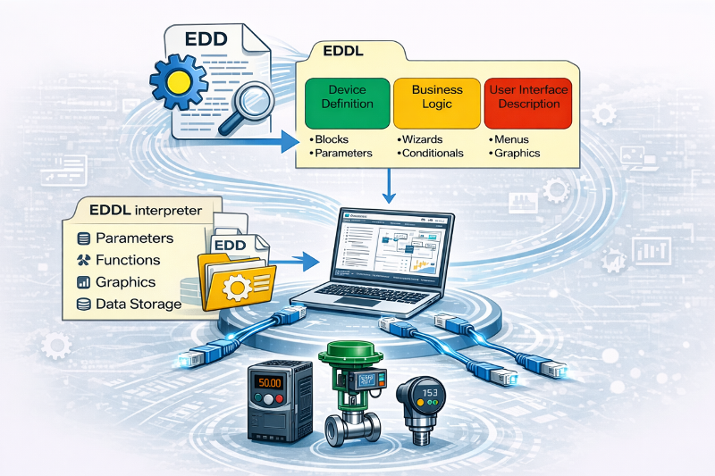

рис.8. Загальна ідея EDDL

На відміну від GSD, GSDML та EDS, EDDL забезпечує опис параметрів пристрою, процедур їх зміни, а також логіки взаємодії з пристроєм. Це дозволяє інженерному інструменту динамічно формувати меню конфігурування та діагностики без необхідності створення окремих програмних модулів для кожного типу пристрою. У таблиці 2 наведені порівняльні характеристики різних форматів описів пристроїв.

Таб.2. Порівняння форматів описів пристроїв.

| Характеристика                                 | GSD                                                          | GSDML                                                        | EDS                                                          | EDDL                                                         |
| ---------------------------------------------- | ------------------------------------------------------------ | ------------------------------------------------------------ | ------------------------------------------------------------ | ------------------------------------------------------------ |
| Повна назва                                    | General Station Description                                  | General Station Description Markup Language                  | Electronic Data Sheet                                        | Electronic Device Description Language                       |
| Основне призначення                            | Опис пристрою для конфігурації мережі PROFIBUS               | Опис пристрою для конфігурації мережі PROFINET               | Опис об’єктної моделі пристрою для мереж CANopen, DeviceNet, EtherNet/IP | Опис параметрів, процедур конфігурування та діагностики пристрою |
| Тип файлу                                      | текстовий файл                                               | XML-файл                                                     | текстовий файл                                               | текстовий файл (скриптова мова опису)                        |
| Основна сфера використання                     | PROFIBUS                                                     | PROFINET                                                     | CANopen, DeviceNet, EtherNet/IP (мережі CIP)                 | HART, FOUNDATION Fieldbus, PROFIBUS PA                       |
| Що описується                                  | ідентифікація пристрою, комунікаційні параметри, модулі, параметри конфігурації, структура процесних даних, базова діагностика | ідентифікація пристрою, комунікаційні параметри, модулі, параметри конфігурації, структура процесних даних, базова діагностика | object dictionary пристрою, параметри, атрибути, сервіси протоколу | параметри пристрою, процедури конфігурування, команди, діагностика |
| Основне застосування в інженерному інструменті | додавання пристрою до конфігурації мережі                    | додавання пристрою до конфігурації PROFINET та опис його модульної структури | інтеграція пристрою у мережу через стандартну об’єктну модель | формування інтерфейсу параметризації та діагностики пристрою |
| Рівень опису                                   | мережевий рівень пристрою                                    | мережевий рівень пристрою                                    | модель даних пристрою                                        | функціональний рівень пристрою                               |
| Підтримка модульної структури                  | так (модулі DP-slave)                                        | так (modules / submodules)                                   | можлива (assemblies, modular device profiles)                | не описує апаратну структуру                                 |
| Підтримка інтерфейсу користувача               | відсутня                                                     | відсутня                                                     | відсутня                                                     | можлива (меню, діалоги, графічні елементи)                   |
| Залежність від протоколу                       | прив’язаний до PROFIBUS                                      | прив’язаний до PROFINET                                      | прив’язаний до конкретного протоколу мереж CIP               | використовується у кількох процесних протоколах              |
| Основні обмеження                              | описує лише конфігурацію мережі                              | описує лише конфігурацію мережі                              | обмежений моделлю протоколу                                  | складно описувати складні функції та інтерфейсу користувача  |

Разом з тим EDDL має і певні обмеження. Хоча файли EDD тестуються виробниками для різних протоколів промислових мереж, не існує єдиної стандартизованої процедури тестування, яка гарантувала б, що конкретний файл EDD коректно працюватиме з усіма реалізаціями інтерпретаторів EDDL. Крім того, функціональність, яку можна описати за допомогою EDDL, обмежена базовими механізмами, означеними стандартом IEC 61804-2. У випадках, коли можливості пристрою виходять за межі цих механізмів, виробники часто використовують додаткові пропрієтарні розширення або окремі програмні модулі поза межами стандарту. З ускладненням сучасних польових пристроїв, що мають значну кількість параметрів, складні алгоритми обробки даних та розвинені засоби діагностики, опис їх функціональності виключно засобами EDDL стає дедалі складнішим. 

### FDT

FDT — це специфікація інтерфейсу, яка стандартизує обмін даними між польовими пристроями та системами керування або інженерними інструментами і системами керування активами:

- забезпечує простий доступ до пристроїв і їх конфігурування через будь-яку хост-систему, що підтримує цей інтерфейс.

- його можна використовувати з будь-яким комунікаційним протоколом
- є незалежним від виробників і визначений як відкрита, публічно доступна специфікація

У цьому пункті зупинимося коротко на базових функціях, у наступних підрозділах FDT розглядається більш детально.

Інформація з польових пристроїв технологічних процесів потрібна протягом усього життєвого циклу установки або застосування. FDT підтримує всі етапи життєвого циклу установки: проєктування, монтаж, введення в експлуатацію, виробництво та технічне обслуговування.

У описах принципів роботи систему FDT порівнюють з системою драйверів принтера, відомою з офісних застосунків. Принтер постачається разом із відповідним драйвером. Цей драйвер реалізує стандартизовані інтерфейси, завдяки чому будь-який офісний застосунок може його використовувати. У FDT апаратний компонент (у цьому випадку польовий пристрій) постачається разом із драйвером, який називається Device Type Manager (DTM) і має стандартизований інтерфейс FDT (рис. 9). Це дає можливість будь-якому застосунку, що підтримує FDT (FDT Frame Application), наприклад інженерній системі або інструменту керування активами, використовувати цей драйвер.

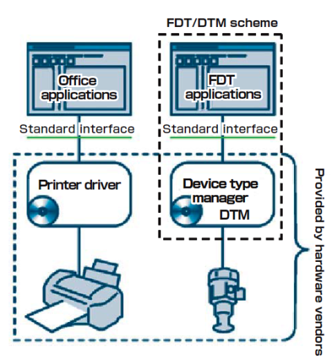

рис.9. Драйвер принтеру у порівнянні з FDT

FDT означує ці стандартизовані програмні інтерфейси у загальному вигляді, щоб можна було створювати інженерні середовища, здатні керувати будь-яким пристроєм від будь-якого виробника, використовуючи довільний комунікаційний протокол відповідно до вимог користувачів (рис.10).

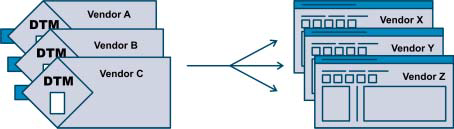

Рис.10. Будь-який DTM може працювати в будь-якому FDT Frame Application.

Виробник пристрою надає інтерфейси для DTM, включаючи можливості зв’язку як із самим пристроєм, так і з іншими DTM. Таким чином, Device Type Manager пристрою одного виробника може взаємодіяти з Device Type Manager пристрою іншого виробника. Це дозволяє підключати продукти різних виробників і отримувати більшу гнучкість. Можна обрати пристрій, що найкраще відповідає вимогам застосування, незалежно від виробника або комунікаційного протоколу.

FDT не обмежується заздалегідь означеним набором семантики опису або графічних елементів. У межах DTM можна реалізувати все, що може бути реалізовано програмним забезпеченням. Це дозволяє виробникам пристроїв реалізовувати будь-яку функціональність, яку вони вважають корисною для своїх користувачів.

### Порівняння FDT та EDDL

Цей підрозділ є перекладом з розділу 14 посібника Industrial Communication Technology Handbook [7].

EDDL і FDT є різними технологіями, обидві спрямовані на забезпечення простого принципу plug-and-play для доступу до інформації в інтелектуальних польових пристроях. Протягом останніх років EDDL і FDT часто розглядалися як конкуруючі технології; однак їх слід розглядати як взаємодоповнювальні.

У дедалі більшій кількості випадків на підприємствах використовують комбінацію EDDL і FDT. Для цього існує щонайменше два сценарії. По-перше, базова інтеграція пристрою виконується за допомогою EDDL, тоді як розширені функції діагностики надаються виробником пристрою у вигляді FDT/DTM, який запускається у FDT frame application. По-друге, деякі виробники пристроїв не створюють DTM для простих або середньої складності пристроїв; у такому випадку відповідні EDD виконуються в інтерпретаторі EDD, реалізованому як DTM.

Оскільки як EDDL, так і FDT мають значну кількість прихильників і обидві технології очевидно залишатимуться актуальними в майбутньому, у галузі була розпочата ініціатива з їх інтеграції. Основною причиною стало те, що багатьом кінцевим користувачам було незручно працювати з двома технологіями одночасно. Ці зусилля з інтеграції EDDL і FDT привели до створення ініціативи Field Device Integration (FDI), до якої увійшли представники FDT Group і EDDL Cooperation Team. Основна ідея FDI полягала в об’єднанні найкращих можливостей стандартів EDDL і FDT.

У вересні 2011 року була створена нова спільна компанія FDI Cooperation LLC (товариство з обмеженою відповідальністю за законодавством США). Керівництво компанією здійснює рада менеджерів, до складу якої входять представники Fieldbus Foundation, FDT Group, HART Communications Foundation, OPC Foundation та PROFIBUS & PROFINET International. FDI Cooperation LLC має на меті розроблення єдиної технології для керування інформацією від інтелектуальних пристроїв у всіх частинах підприємства. Одним із завдань є стандартизація FDI в межах IEC; наразі стандарт FDI розробляється як IEC 62769.

Одним із елементів, що сприяє інтеграції EDDL і FDT, є стандарт IEC 62541 — OPC UA (OPC Unified Architecture), який використовується для стандартизації процесу отримання даних від пристроїв.

### FDI

Ядром технології FDI є масштабований пакет FDI (FDI Package), що представляє собою набір файлів (рис.11), які описують пристрій. Основним елементом пакета є електронний опис пристрою (Electronic Device Description, EDD), який містить:

- опис пристрою (Device Definition, Def);
- бізнес-логіку (Business Logic, BL);
- опис користувацького інтерфейсу (User Interface Description, UID).

EDD базується на мові Electronic Device Description Language (EDDL, IEC 61804-3), який розглянуто вище

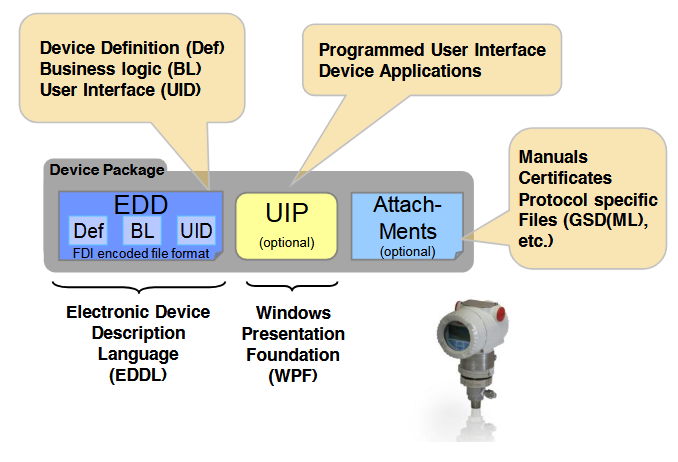

рис.11. FDI Device Package

Додатково пакет може містити плагін користувацького інтерфейсу (User Interface Plug-in, UIP). Він дозволяє створювати довільно програмовані користувацькі інтерфейси, подібно до тих, що використовуються в технології FDT, і реалізується на основі Windows Presentation Foundation (WPF). Виробники пристроїв означують у FDI Device Package, які саме дані, функції та користувацькі інтерфейси повинні бути доступні на FDI-сервері.

Опис пристрою визначає дані польового пристрою та його внутрішню структуру (наприклад блоки). Бізнес-логіка забезпечує узгодженість даних пристрою. Наприклад, вона може автоматично оновлювати значення параметрів при зміні одиниць вимірювання.

Особливо важливу роль відіграють динамічні залежності між параметрами. Наприклад:

- відображення одиниць температури лише тоді, коли вибрано параметр температури;
- показ додаткових налаштувань лише у випадку вибору спеціального типу датчика.

Опис користувацького інтерфейсу (UID) і плагіни UIP означують графічні інтерфейси роботи з польовим пристроєм.

До пакета FDI також можуть додаватися вкладення (attachments), зокрема:

- документація на виріб;
- файли, специфічні для протоколів, наприклад GSD або CFF;
- зображення та інші супровідні матеріали.

У FDI визначено єдиний протоколонезалежний формат кодування для частини EDD у складі пакета FDI.

У технології FDI мову EDDL було значною мірою гармонізовано та уніфіковано між різними протоколами. Єдина версія EDDL стала основою для:

- єдиних інструментів розробки FDI Package (FDI IDE);
- уніфікованих компонентів хост-системи, таких як
  - EDD Engine (інтерпретатор),
  - UID Renderer,
  - UIP Hosting.

Це дозволяє значно підвищити інтероперабельність і якість систем, а також зменшити витрати для виробників пристроїв, виробників систем, організацій промислових мереж і кінцевих користувачів.

Комп'ютери з інженерним інструментом, які підтримують технологію FDI, називаються FDI-хостами. FDI може бути реалізоване в різноманітному програмному забезпеченні керування пристроями, яке входить до складу:

- системи керування технологічним процесом;
- системи керування активами;
- інструменту конфігурації пристроїв на ноутбуці;
- портативного польового комунікатора.

Архітектура FDI дозволяє реалізовувати різні типи хост-систем. Зокрема, можлива інтеграція з FDT-орієнтованими системами, що забезпечує сумісність із технологією FDT. У будь-якому випадку FDI-хост повинен підтримувати всі функції, означені у FDI Device Package. У клієнт-серверній архітектурі сервер надає служби, до яких звертаються різні клієнти (часто розподілені).

Архітектура FDI базується на інформаційній моделі, що використовується в OPC Unified Architecture (OPC UA). Це забезпечує такі переваги, як незалежність від платформи. 

FDI Server імпортує FDI Device Package у свій внутрішній каталог пристроїв. Це значно спрощує керування версіями пакетів FDI, бо вони централізовано керуються на сервері FDI. Оскільки пакети FDI не потребують реєстрації у вигляді інсталяції програмного забезпечення, під час їх використання не виникає небажаних побічних ефектів.

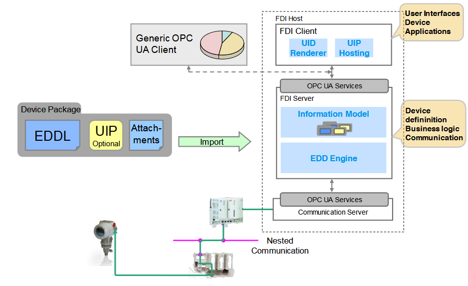

рис.12. FDI host – client server architecture

Представлення екземплярів пристроїв у FDI Server виконується в інформаційній моделі. Інформаційна модель відображає топологію комунікацій системи автоматизації, представляючи всю комунікаційну інфраструктуру та польові пристрої у вигляді об’єктів. У цій же моделі зберігаються дані, функції та користувацькі інтерфейси пристроїв.

Якщо FDI Client хоче працювати з певним пристроєм, він звертається до інформаційної моделі та, наприклад, завантажує користувацький інтерфейс пристрою, щоб відобразити його на стороні клієнта подібно до того, як веббраузер відображає вебсторінку. Інтерпретуючи EDD за допомогою компонента EDD Engine, FDI Server постійно забезпечує узгодженість даних пристрою. Якщо між клієнтом і сервером використовується зв’язок OPC UA, застосовуються механізми автентифікації та шифрування OPC UA, що запобігає несанкціонованому доступу. Інші (не-FDI) клієнти OPC UA, наприклад застосунки MES, також можуть отримувати доступ до параметрів пристроїв в інформаційній моделі без використання спеціалізованого користувацького інтерфейсу пристрою.

FDI-хости не обов’язково повинні реалізовувати клієнт-серверну архітектуру. Архітектура FDI також дозволяє реалізовувати автономні інструменти (standalone tools).

FDI є новою технологією інтеграції, яка в довгостроковій перспективі призначена для заміни існуючих технологій EDDL та FDT. Очевидно, що протягом перехідного періоду необхідно підтримувати вже встановлені системи. У процесній промисловості цей період може тривати понад 10 років. Виробники інженерних інструментів і систем зазвичай мають досвід роботи з питаннями життєвого циклу і розробляють підходи для підтримки апаратного та програмного забезпечення систем. У разі оновлення системного програмного забезпечення завжди можлива міграція від DTM або EDD до FDI без зміни самих пристроїв, оскільки EDD, DTM та новий FDI Package існують лише на комп’ютері, а не в самому пристрої.

Крім того, виробникам пристроїв повинна бути забезпечена можливість ефективно та економічно створювати FDI Package як для нових, так і для вже існуючих пристроїв. Зокрема, має бути можливим повторне використання існуючих вихідних описів EDD або DTM. Технологія FDI підтримує обидва ці підходи.

## 2. Технології FDT/DTM версії 1

### Історія FDT

У 1998 році розпочалася фаза розроблення специфікації в контексті організації ZVEI (Zentralverband Elektrotechnik- und Elektronikindustrie e. V.). У 1999 році розвиток технології прискорився після того, як специфікацію прийняла організація Profibus Nutzerorganisation e. V. (PNO), яка пізніше передала права на неї FDT Group. Перший style guide був опублікований у 2000 році та визначав рекомендації щодо уніфікованого інтерфейсу користувача для DTM. У травні 2001 року специфікація стала публічно доступною у версії 1.2, а з 2005 року - 1.2.1.

Подальший розвиток технології привів до появи нових версій специфікації. Наступним значним кроком стала специфікація FDT2, яка розширила початкову архітектуру FDT 1.2 та запровадила використання сучасних програмних технологій, зокрема платформи .NET. При цьому була збережена зворотна сумісність з попередніми версіями, що дозволило використовувати вже створені DTMs і таким чином захистити інвестиції користувачів у наявні системи. FDT2 також забезпечила більш гнучку реалізацію графічних інтерфейсів користувача, покращені механізми інтеграції пристроїв та підтримку нових протоколів промислових мереж.

Подальший розвиток технології привів до створення FDT 3.0, яка орієнтована на сучасні вимоги цифрового виробництва та концепції Industry 4.0. У цій версії використовується серверно-орієнтована архітектура з центральним FDT Server, який керує DTM та надає доступ до інформації про пристрої через стандартизовані інтерфейси. Для інтеграції з зовнішніми системами використовується OPC UA, через який інші застосунки можуть отримувати доступ до інформаційної моделі пристроїв, параметрів та діагностики. Це дозволяє інтегрувати FDT-системи з MES, системами керування активами та хмарними сервісами. У FDT 3.0 також реалізовано веборієнтований користувацький інтерфейс DTM на основі HTML5 та JavaScript, що забезпечує доступ до функцій пристроїв через веббраузер або мобільні пристрої. Завдяки такому підходу технологія забезпечує платформну незалежність, інтеграцію IT та OT систем, а також можливість побудови архітектур типу sensor-to-cloud для систем керування та керування активами.

Сьогодні технологія FDT є глобальним стандартом інтеграції пристроїв і мереж у системах процесної, гібридної та дискретної автоматизації. Вона дозволяє інтегрувати інтелектуальні польові пристрої різних виробників у програмні системи керування, інженерні інструменти та системи керування активами незалежно від використовуваних комунікаційних протоколів. 

Як вже описано вище, специфікація практично з самого початку FDT розроблялася та підтримувалася організацією FDT Group, AISBL, неприбутковою асоціацією міжнародних компаній, які підтримують поширення технології FDT.  Зараз технологія FDT/DTM управляється та підтримується організацією  FieldComm Group [https://www.fieldcommgroup.org](https://www.fieldcommgroup.org), що забезпечує її подальший розвиток і узгодження з технологією FDI. Разом ці технології формують узгоджений підхід до інтеграції пристроїв, забезпечуючи основу для наступного покоління інтелектуального керування пристроями в процесній і виробничій автоматизації.

На сьогодні існують три основні версії а також кілька підверсій FDT/DTM. У цьому розділі розглянемо першу версію.

Таб.3. Основні характеристики різних версій FDT 

| Характеристика | FDT 1.2       | FDT 2.0        | FDT 3.0             |
| -------------- | ------------- | -------------- | ------------------- |
| Рік            | 2001          | 2012           | ~2018               |
| Технологія     | COM / ActiveX | .NET           | .NET Core + Web     |
| Архітектура    | desktop       | client–server  | distributed / cloud |
| UI             | ActiveX       | WPF / WinForms | HTML5 Web UI        |
| Платформи      | Windows       | Windows        | cross-platform      |
| OPC UA         | ні            | частково       | нативно             |
| Mobile         | ні            | обмежено       | повністю            |
| IIoT           | ні            | частково       | повністю            |

### Загальні терміни

Застосунок, який використовується як інженерне середовище, що підтримує FDT називається **FDT Frame Application**. Він взаємодіє з пристроєм через  **Device Type Manager (DTM)** для цього пристрою. Усі DTM виконуються у FDT Frame Application, наприклад у засобах конфігурування пристроїв, інженерних інструментах систем керування, операторських консолях або системах керування активами. 

DTM інкапсулює всі специфічні для пристрою дані, функції та правила прикладної логіки. Залежно від реалізації DTM може варіюватися від простого графічного інтерфейсу користувача для встановлення параметрів пристрою до складного застосунку, здатного виконувати обширні обчислення для діагностики або технічного обслуговування, а також оцінювати складну прикладну логіку для калібрування пристрою. У версії FDT 1.1 Розрізняють три типи DTM (рис.9):

- **Communication DTM** - Device Type Manager для класу пристроїв, який має прямий доступ до комунікаційного компонента.
- **Gateway DTM** - DTM, що використовується для маршрутизації між різними протоколами (наприклад, з PROFIBUS до HART)
- **Device DTM** - DTM, що представляє щонайменше один польовий пристрій, але може охоплювати і ціле сімейство пристроїв, наприклад серію датчиків тиску.

Device DTM взаємодіє з Communication DTM або Gateway DTM для доступу до відповідного польового пристрою. FDT Frame Application ініціалізує Device Type Managers і з’єднує їх для забезпечення коректної комунікації. 

рис.13. Загальний принцип інтеграції через FDT/DTM.

### Комунікаційна основа

За основу комунікаційної технології у першій версії була вибрана COM (Component Object Model), передова на той момент платформа Microsoft для програмних компонентів. Вона базується на клієнт-серверній архітектурі і забезпечує інтеграцію програмних компонентів у FDT Frame Application. COM забезпечує міжпроцесну взаємодію та динамічне створення об’єктів. COM-компонент надає свою функціональність через інтерфейси. А FDT означує COM-інтерфейси для DTM і FDT Frame Application.

Графічні інтерфейси користувача у версії 1.1 реалізуються за допомогою технології ActiveX. ActiveX є розширенням технології COM, яке означує спосіб інтеграції графічних інтерфейсів користувача в застосунок. У FDT елемент керування ActiveX відображається у FDT Frame Application і з’єднується з DTM для обміну даними. Завдяки цьому він безшовно інтегрується в інтерфейс користувача FDT Frame Application і водночас може відображати повні можливості DTM.

Інша технологія в стеку цієї версії - [XML (Extensible Markup Language)](../../nets/xmljson/xml.md), яка призначена для серіалізації документів. У FDT 1.1 XML-документи використовуються для обміну даними між об’єктами, тобто між FDT Frame Application і DTM. FDT означує структуру такого XML, задаючи так звані XML-схеми (XML Schemata). Вміст документа при цьому надається DTM.

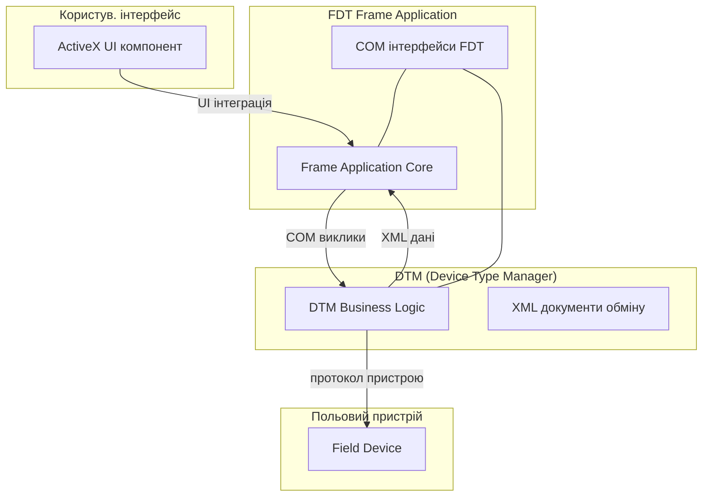

рис.14. Використання комунікаційних технологій FDT версії 1.

### DTM та Frame Application

З програмної точки зору, DTM є програмним компонентом, який розроблений виробником пристрою, який містить прикладне програмне забезпечення, специфічне для цього пристрою. Виробник пристрою відповідає за функціональність і якість DTM.

DTM зазвичай постачається разом із пристроєм, або завантажується з сайту виробника пристрою. DTM містить діалогові вікна та інтерфейси користувача, включаючи довідкову систему, необхідну для застосунку, який він представляє. Інтерфейс користувача може бути багатомовним. DTM також здатний генерувати документацію для пристрою. Крім того, DTM знає правила прикладного використання пристрою та виконує перевірку коректності параметрів. Водночас DTM не має інформації про FDT Frame Application, в якому він виконується.

DTM може містити як функції параметризації, так і конфігурування, наприклад послідовності операцій для складного калібрування, розширені функції діагностики та технічного обслуговування для високоякісних польових пристроїв. Функції діагностики, адаптовані до конкретного пристрою, також реалізуються в DTM.  Тобто DTM не є простим описом, а повноцінним активним компонентом.  

DTM інтегрується в FDT Frame Application, які є інженерними інструментами або автономними засобами введення в експлуатацію чи системи керування активами, які підтримують інтерфейси FDT. Frame Application здатні працювати з будь-яким типом пристрою шляхом інтеграції відповідних DTM без необхідності знання, специфічного для польових пристроїв. Залежно від призначення Frame Application вони можуть мати різний зовнішній вигляд і функціональність (наприклад автономні інструменти конфігурування або інженерні системи систем керування). Зазвичай Frame Application містить клієнтські застосунки, що зосереджені на окремих аспектах, таких як конфігурування, спостереження, планування IO, і використовують сервіси, які надаються DTM.

Часто середовища програмування PLC також є FDT Frame Application. Наприклад, ПЗ Machine Expert та Cotrol Expert від Schneider Electric є Frame Application, що дозволяє як конфігурувати пристрої так і спростити інтеграцію в єдину систему керування. А в середовищі Cotrlo Expert технологія є базовою для конфігурування багатьох модулів архітектури ePAC M580.

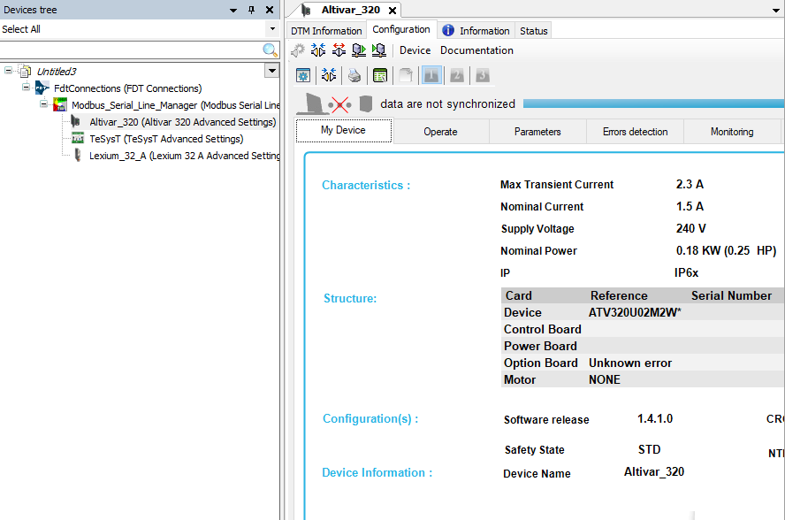

рис.15. Machine Expert у якості Frame Application

Frame Application є середовищем виконання для DTM і надає інтерфейси, що дозволяють бізнес-логіці DTM та інтерфейсам користувача DTM взаємодіяти із зовнішнім середовищем. Крім того, Frame Application керує взаємодією між бізнес-логікою DTM і інтерфейсом користувача DTM, надаючи стандартний інтерфейс обміну повідомленнями (див. рис. 16).

- FDT Frame Application керує всіма екземплярами пристроїв і зберігає їхні дані, але не має знань про специфіку конкретних пристроїв. Воно також забезпечує версіонування даних.
- FDT Frame Application гарантує узгоджену конфігурацію в межах усієї системи та забезпечує багатокористувацьку роботу, а також роботу в архітектурі клієнт-сервер.
- DTM можуть інтегруватися в будь-які FDT Frame Application, і навпаки, FDT Frame Application може інтегрувати будь-які DTM різних виробників.

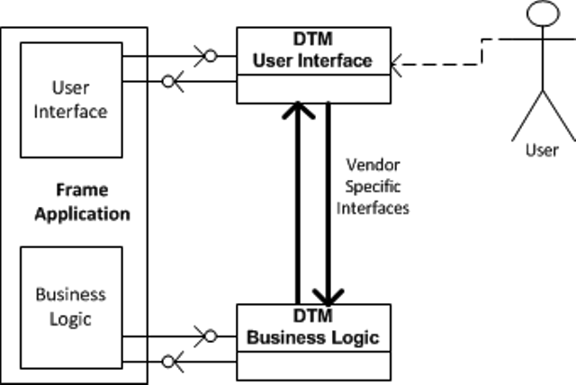

Рис.16. Frame Application FDT1.1

Інтерфейс обміну повідомленнями використовується для передавання повідомлень і подій, специфічних для DTM. Формат цих повідомлень є власним (proprietary) і не інтерпретується Frame Application.

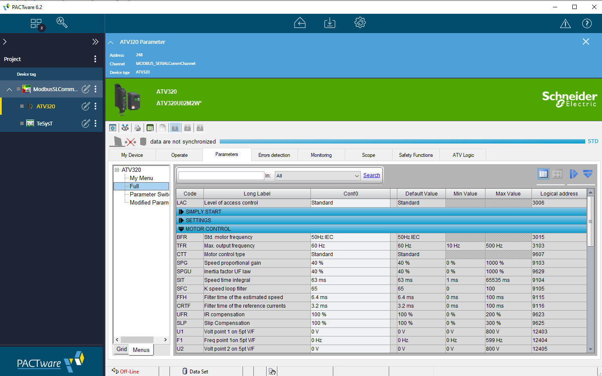

рис.17. Приклад Frame Application та використання DTM для конфігурування ПЧ ATV320

Frame Application може і не мати інтерфейсу користувача.

Частина бізнес-логіки Frame Application відповідає за виконання бізнес-логіки DTM. Вона надає сервіси, які може викликати бізнес-логіка DTM, зокрема:

- зберігати дані у сховищі постійних даних Frame Application
- здійснювати обмін даними з пов’язаним пристроєм
- запитувати відображення додаткових інтерфейсів користувача (наприклад діалогів або додаткових інтерфейсів DTM)
- переглядати топологію FDT та взаємодіяти з іншими DTM
- інформувати Frame Application про події (повідомлення про помилки, трасування, прогрес виконання тощо)
- взаємодіяти з інтерфейсом користувача DTM

Частина інтерфейсу користувача Frame Application робить сервіси DTM доступними для користувачів, наприклад функції та інтерфейси користувача, які підтримуються DTM. Вона розміщує інтерфейси користувача DTM як частину власного інтерфейсу користувача і надає такі сервіси:

- взаємодія з бізнес-логікою DTM
- запит відображення додаткових інтерфейсів користувача (наприклад діалогів або додаткових інтерфейсів DTM)
- перегляд топології FDT та взаємодія з іншими DTM
- інформування Frame Application про події (повідомлення про помилки, трасування, прогрес виконання тощо)

### Архітектура

FDT версії 1 є специфікацією COM-інтерфейсів, що забезпечують взаємодію між прикладним програмним забезпеченням, специфічним для пристрою, і FDT Frame Application. На рис.18 показано область означення інтерфейсів FDT.

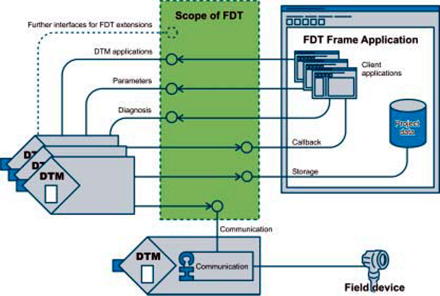

Рис.18 Область означення інтерфейсів FDT

Зазвичай FDT Frame Application включає клієнтські застосунки, які використовують DTM, а також певне сховище даних (наприклад, базу даних) для довготривалого зберігання.

Клієнтські застосунки — це застосунки, що орієнтовані на задачі конфігурування, спостереження, призначення каналів тощо і використовують функціональність, яку надає DTM, що виступає в ролі сервера.

Слід зазначити, що специфікація FDT означує лише COM-інтерфейси, але не означує їхню реалізацію. Вона задає поведінку, яку ці інтерфейси повинні забезпечувати для клієнтських застосунків. Реалізація самих DTM і FDT Frame Application у специфікації не означується.

Пристрої організовані ієрархічно та з’єднані через різні промислові мережі (риc.19). Інженер-проєктувальник, використовуючи FDT Frame Application, повинен відповідним чином з’єднати DTM.

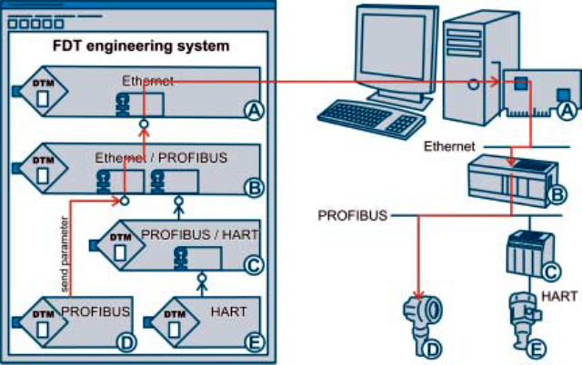

Рис.19. Вкладена комунікація

FDT Frame Application запускає один DTM для кожного польового пристрою. DTM `A` є Communication DTM і надає комунікаційний канал. DTM `B` і `C` на рисунку підтримують функції шлюзу, тому вони також надають комунікаційні канали. Якщо для Device DTM `D` ініціюється завантаження параметрів, цей DTM не звертається безпосередньо до свого польового пристрою. Натомість він передає параметри у комунікаційний канал свого вищого DTM, яким є DTM `B`. DTM `B` перетворює запит із PROFIBUS на Ethernet і передає результат об’єкту каналу Communication DTM. Після цього комунікаційний канал може передати дані на Ethernet-інтерфейс комп’ютера. Дані передаються через Ethernet до контролера. Контролер перетворює Ethernet-пакети на телеграми PROFIBUS і надсилає їх до відповідного польового пристрою.

Як видно з цього прикладу, FDT забезпечує спосіб підтримки різних промислових мереж і доступу до пристроїв із центральної інженерної системи. DTM не потребує прямого з’єднання з польовим пристроєм, як це було характерно для традиційних автономних інструментів (показано на рисунку 1).

Цей приклад також показує, що DTM не повинен мати інформації про топологію мережі. Він повинен підтримувати лише власний комунікаційний протокол. Підключені вище Gateway DTM виконують перетворення протоколів.

Ethernet і PROFIBUS у цьому прикладі наведені лише як приклад. Описаний механізм працює і для більшої кількості ієрархічних рівнів, як показано на рисунку 14, де додатково використовується з’єднувач PROFIBUS–HART (`C`) та додатковий пристрій HART (`D`). Для інших протоколів принцип роботи був би аналогічним.

### DTM style guide

Завдяки FDT кількість різних застосунків і інструментів, з якими працює користувач, зменшилася. Користувачу потрібно працювати лише з кількома FDT Frame Application. Водночас графічні інтерфейси створюються виробниками DTM, і їхня поведінка та зовнішній вигляд можуть відрізнятися. Тому робоча група FDT Group ще з першої версії означила правила та рекомендації щодо поведінки графічного інтерфейсу DTM. Вони охоплюють правила розміщення елементів, представлення параметрів і структуру меню. На рис. 20 показано загальну структуру графічного інтерфейсу DTM відповідно до style guide.

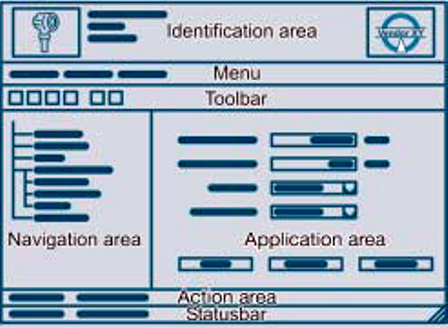

Рис. 20 Інтерфейс користувача DTM згідно style guide

рис.17. Приклад Frame Application та використання DTM для конфігурування ПЧ ATV320 (навдено для зручності порівняння з загальним стилем)

- Область ідентифікації повинна надавати огляд того, який інтерфейс якого DTM зараз відкрито. У ній відображається фотографія польового пристрою та логотип виробника. Також показуються тип пристрою та його назва.

- Рядок меню та панель інструментів розташовуються безпосередньо під областю ідентифікації.

- Область навігації є необов’язковою. Вона організовує складні моделі параметрів у функціональні групи і таким чином спрощує навігацію інформацією в області дій.

- В області дій задаються параметри. Спочатку відображається назва параметра, далі індикатор стану, елемент редагування та одиниця вимірювання параметра. У цій області також повинні бути стандартні кнопки, такі як «OK», «Cancel» та «Apply».

- Рядок стану показує, чи змінюються дані в режимі on-line (безпосередньо на пристрої) чи off-line (у наборі даних DTM). Там також може відображатися поточна роль користувача (наприклад administrator).

## 3. Технології FDT2

### Зміна технологій

Після випуску FDT 1.2 у 2001 році середовище операційних систем Windows, у якому працюють FDT/DTM, суттєво змінилося. Microsoft почала пропонувати технологію .NET, яка стала замінювати технології COM/ActiveX, що використовувалися у FDT 1.x. Оскільки .NET підтримує зворотну сумісність із COM/ActiveX, деякі DTM почали використовувати .NET уже під час випуску FDT 1.2.1, і таким чином основа специфікацій FDT поступово змістилася від COM/ActiveX до .NET.

FDT2, випущений у 2012 році, повністю базується на технології .NET. Крім того, FDT2 містить різні функції, яких вимагали кінцеві користувачі, зберігаючи водночас традиційні можливості специфікації FDT 1.x, такі як налаштування комунікаційного шляху, уніфікована зручність використання, стабільність та взаємодія. Завдяки використанню технології .NET у FDT2 постачальники можуть розробляти DTM за допомогою Windows Presentation Foundation (WPF) — нової технології Microsoft. WPF дозволяє створювати DTM із високорозвиненими інтерфейсами користувача.

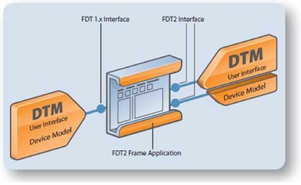

Рис.21. Сумісність між FDT2 і FDT 1.x

Стандарт FDT2 додає можливості моніторингу в реальному часі для фонових процесів і пакетних задач та забезпечує значно вищу продуктивність. Крім того, він пропонує посилені функції безпеки, такі як цифровий підпис і сертифікація DTM, і забезпечує інтеграцію з PLC, що розширює сферу застосування FDT/DTM. Обмін даними було реалізовано за допомогою типів даних, що передаються через інтерфейси, а не через XML.

Інтерфейс користувача використовував Windows Presentation Foundation і WinForms. Це оновлення врахувало тенденцію до використання вільних і відкритих програмних компонентів, що зрештою зробило концепцію FDT/DTM більш перспективною. Крім того, відмова від технологій COM і DCOM дозволила зробити FDT/DTM більш стабільною та надійною програмною платформою. 

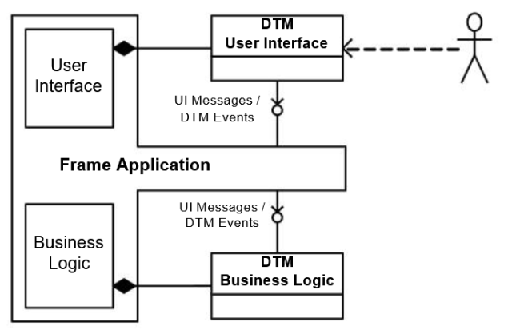

Рис.22 Frame Application FDT2

Разом із FDT2 організація FDT Group також надає спільні компоненти та інструменти для розроблення продуктів, сумісних із FDT2. У FDT 1.x надавалися лише специфікації, тому кожен постачальник мав самостійно реалізовувати відповідні компоненти та інструменти. Для FDT2 основну частину інтерфейсу користувача FDT Group реалізувала як спільні компоненти. Це зменшило навантаження на постачальників під час тестування складної сумісності та взаємодії і дозволило швидше випускати надійні DTM.

Для використання DTM, сумісних із FDT2, потрібен Frame Application, сумісний із FDT2 (FDT2 Frame Application). Такий застосунок також підтримує DTM, сумісні з FDT 1.x. Хоча внутрішня структура DTM, сумісних із FDT2, відрізняється від структури DTM, сумісних із FDT 1.x, через розширену функціональність, зручність використання майже не змінилася. У результаті користувачі можуть працювати з новими DTM, сумісними з FDT2, без спеціального навчання.

Отже, архітектура системи FDT 2:

- Використовує платформу .NET Framework, яка є сучасною технологією з довгостроковою підтримкою.
- Відсутній прямий доступ між бізнес-логікою DTM (DTM BL) і інтерфейсом користувача DTM (DTM UI), а також між DTM і каналом зв’язку.
- Frame Application керує взаємодією між DTM UI, DTM BL, DTM і каналом зв’язку.
- Користувацький інтерфейс повинен бути реалізований із використанням елементів керування WPF або WinForms.
- Використовуються стандартні правила багатопотоковості для Frame Application і DTM.
- Спрощена архітектура, що полегшує інтероперабельність.
- Підвищена безпека, оскільки виконувані модулі DTM повинні бути підписані сертифікатом цифрового підпису коду.

### Клієнт-серверна архітектура

У версії 1.2 інтерфейс користувача міг безпосередньо взаємодіяти з бізнес-логікою DTM. У FDT 2.0 використовується архітектура клієнт–сервер, яка дозволяє запускати інтерфейс користувача та бізнес-логіку на різних комп’ютерах. Це стало можливим тому, що взаємодія між цими компонентами здійснюється виключно через Frame Application. Завдяки цьому покращується взаємодія компонентів, оскільки стандартизується спосіб їх спільної роботи та додається підтримка мережевих функцій.

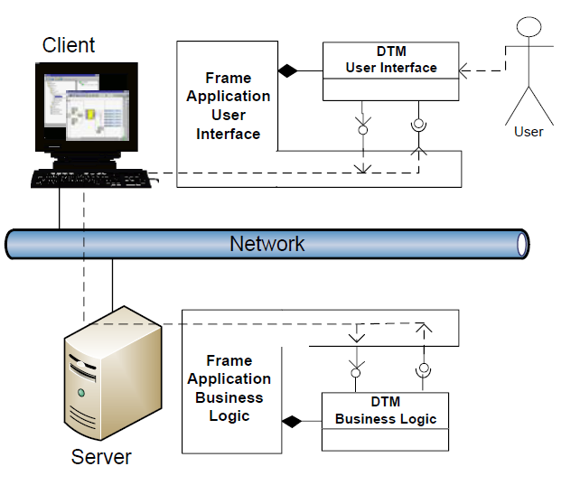

рис.23. Клієнт-серверна архітектура FDT2

Ця можливість створює дві важливі переваги:

- З’являється можливість реалізації централізованих репозиторіїв DTM на серверах, що у свою чергу дозволила технології FDT робити онлайн-оновлення у спільному репозиторії DTM. Завдяки цьому кожен користувач у багатокористувацькому середовищі завжди має доступ до найновішої версії потрібних йому DTM.
- DTM тепер можуть розгортатися з використанням мобільних рішень. Оскільки інтерфейси користувача, бізнес-логіка та Frame Application можуть працювати на різних пристроях, стає можливим використання мобільних пристроїв для запуску Frame Application. Таким чином будь-який мобільний пристрій може працювати або як робоча станція керування активами, або як портативний конфігуратор.

### Інтеграція з OPC UA

FDT 2.0 має ще одну додаткову можливість — інтеграцію сервера OPC UA. Цей сервер може працювати або як Frame Application, або як OPC UA Server. Завдяки цьому OPC UA Server може створювати інформаційну модель OPC UA, яка відображає взаємодію DTM між собою у Frame Application, що фактично є представленням того, як пристрої взаємодіють у реальній системі.

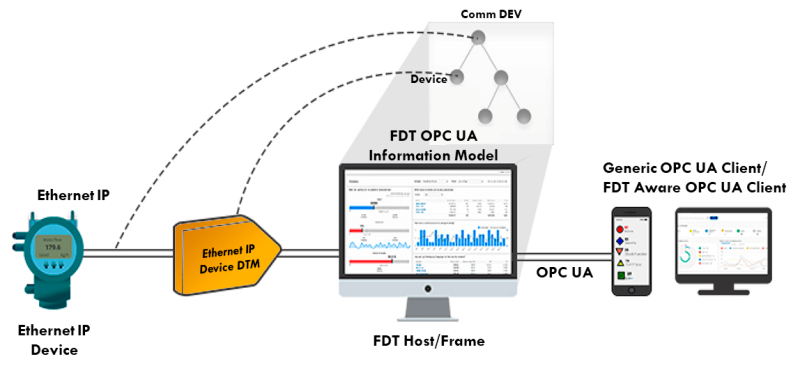

рис.24. Відображення DTM пристрою Ethernet/IP у об’єктній моделі OPC UA

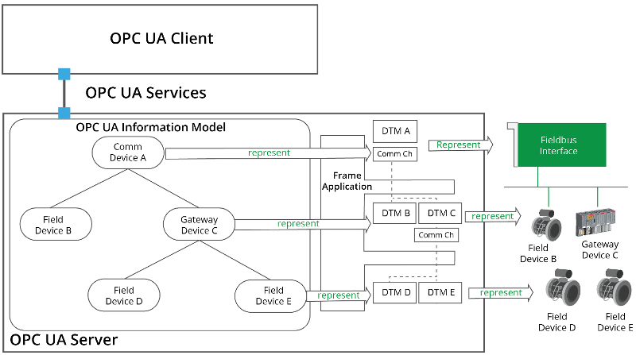

рис.25. Приклад внутрішньої реалізації відображення

Отже в FDT 2 OPC UA Server:

- OPC UA Server виконує подвійну роль: він виступає як Frame Application відповідно до FDT 2.0 і одночасно як OPC UA Server.
- OPC UA Server містить Frame Application, яке виконує DTM, що представляють фізичні пристрої.
- Інформація, яку надають DTM, використовується для формування інформаційної моделі OPC UA.
- FDT Group та OPC Foundation спільно працюють над специфікацією, яка означує інформаційну модель для відображення інформації DTM.

### Порівняння FDT1 та FTD2

Версія FDT 2.1 включила функціональні покращення та усунення помилок. Також була додана підтримка кількох одночасних online-з’єднань для комунікації. Раніше стандарт FDT/DTM підтримував лише одне online-з’єднання.

Підтримка нових протоколів стала можливою через встановлення будь-якого DTM, що використовує відповідний протокол. Раніше для цього потрібно було встановлювати спеціалізовані Communication DTM і Gateway DTM для відповідного протоколу. Значна кількість постачальників DCS і PLC почала використовувати технологію FDT/DTM, інтегруючи її у свої інженерні програмні засоби для спрощення роботи.

Найсуттєвіша зміна, яка відбулася в еволюції технології FDT/DTM від версії 1.2 до версії 2.1, стосується способу організації та обміну даними між об’єктами, означеними стандартом.

Замість використання документів на основі XML для обміну даними, у версії 2.0 застосовуються об’єкти .NET. Це швидший метод, оскільки XML-документи необхідно щоразу аналізувати і перебудовувати під час обміну. Використання об’єктів .NET означає, що DTM стають об’єктами, які функціонують як цифрові представлення реальних польових пристроїв.

Ця зміна вводить одну вимогу: DTM обмінюються інформацією у вигляді типів даних. Модуль типів даних означує операції, які можуть виконуватися над даними, значення цих даних та спосіб зберігання значень такого типу. Використання типів даних вимагає створення інформаційної моделі, яка слугує основою для DTM. У DTM версії 2.0 інтерфейс користувача відокремлений від логічної моделі пристрою, тоді як у DTM версії 1.2 ці частини були об’єднані.

У результаті DTM стають більш гнучкими: інтерфейси користувача можуть виконуватися на робочій станції, тоді як логіка пристрою працює на сервері. Тісний зв’язок між пристроєм і відповідним DTM дозволяє автоматично визначати правильний DTM для конкретного типу або версії пристрою. У версії 1.2 призначення DTM виконувалося вручну, що часто призводило до проблем через використання несумісних DTM для пристроїв.

Розгортання повного середовища FDT/DTM на підприємстві створює логічну топологію, яка відображає фізичну топологію. Фізична топологія є представленням реальної мережевої структури, утвореної фактичними пристроями, шлюзами та перетворювачами середовища. Логічна топологія є представленням взаємозв’язків обміну даними між DTM.

| Концепція                                 | FDT 1.2x                                                     | FDT 2.0                                                      |
| ----------------------------------------- | ------------------------------------------------------------ | ------------------------------------------------------------ |
| Означення інтерфейсів                     | Інтерфейси FDT 1.2x означені як COM-інтерфейси та поширюються у вигляді COM DLL | Інтерфейси FDT 2.0 означені як інтерфейси .NET і поширюються у вигляді primary assembly |
| Реалізація бізнес-логіки DTM              | Бізнес-логіка DTM реалізована як COM-об’єкт, який поширюється як COM Server у вигляді DLL або EXE | Бізнес-логіка DTM реалізована як .NET-клас, який поширюється у .NET Assembly |
| Реалізація користувацького інтерфейсу DTM | Користувацький інтерфейс DTM реалізований як елемент керування ActiveX | Користувацький інтерфейс DTM реалізований як елемент керування WPF |
| Обмін даними                              | FDT 1.2.x використовує XML для обміну даними через інтерфейси | FDT 2.0 використовує типи даних, що передаються за значенням через інтерфейси. Для FDT 2.0 також реалізована підтримка OPC UA |

Щоб забезпечити взаємодію між усіма програмними компонентами, було створено набір спільних компонентів, які керують такими аспектами, як поведінка інтерфейсу. Такий підхід забезпечує сумісність компонентів і спрощує створення DTM, що зменшує витрати на розроблення.

Опціональне використання сервера OPC UA у складі Frame Application вимагає сумісності між інформаційною моделлю, що використовується DTM, і інформаційними моделями, які застосовуються в OPC UA сервері. У результаті формується представлення DTM у вигляді інформаційної моделі OPC UA. Ця модель надає доступ до даних вузлів, представлених DTM, через сервіси OPC UA, роблячи ці дані доступними для будь-якого клієнта OPC UA.

## 4. Технології FDT3

Стандарт FDT3.0 включає кілька типів DTM, серед яких:

- Device DTM, 
- Interpreter DTM, 
- Universal DTM, 
- Communications DTM 
- Gateway DTM.

Ця специфікація використовує серверно-орієнтовану архітектуру з центральним FDT Server, який керує DTM та надає доступ до інформації про пристрої через стандартизовані інтерфейси. Для інтеграції з зовнішніми системами використовується OPC UA, через який інші застосунки можуть отримувати доступ до інформаційної моделі пристроїв, параметрів та діагностики. Це дозволяє інтегрувати FDT-системи з MES, системами керування активами та хмарними сервісами.  У FDT 3.0 також реалізовано веборієнтований користувацький інтерфейс DTM на основі HTML5 та JavaScript, що забезпечує доступ до функцій пристроїв через веббраузер або мобільні пристрої. Завдяки такому підходу технологія забезпечує платформну незалежність, інтеграцію IT та OT систем, а також можливість побудови архітектур типу sensor-to-cloud для систем керування та керування активами.

DTM стандарту FDT 3.0 також еволюціонували: бізнес-логіка перенесена на технологію Microsoft .NET Core, що підтримується багатьма платформами, а не тільки Windows. А інтерфейс користувача реалізований на основі вебтехнологій HTML5, що розширює можливості представлення інформації про пристрої та активи. Використання вебтехнологій дозволяє серверним розподіленим архітектурам покращити взаємодію з користувачем через рішення для мобільного та віддаленого доступу.

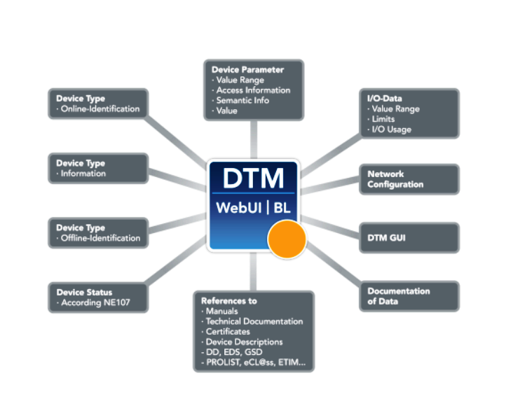

рис.26. Нові властивості DTM

На відміну від DTM, побудованих на основі ранніх стандартів FDT 1.2 або FDT 2.0, DTM стандарту FDT 3.0 використовують адаптивні функції сенсорних екранів у рамках розроблення на основі HTML 5.0, що є обов’язковим для використання на планшетах і смартфонах. Це забезпечує використання знайомого інтерфейсу сучасних мобільних пристроїв безпосередньо в середовищі DTM.

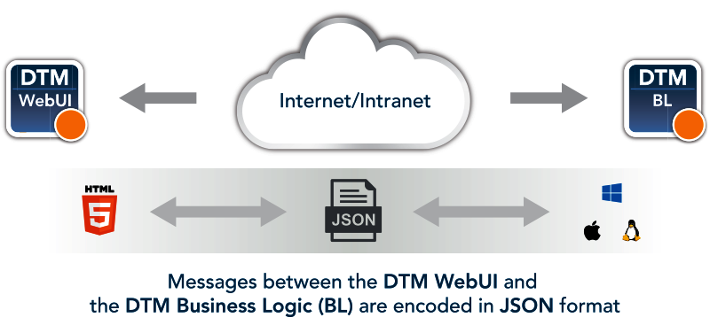

рис.27. Використання HTML5 для WebUI 

З появою стандарту FDT 3.0 організація FDT Group випустила відповідні інструментальні набори FDT 3.0 DTM Common Components, щоб допомогти виробникам швидше розпочати розроблення FDT у сучасному інтегрованому середовищі розроблення (IDE). Оновлені FDT 3.0 DTM Common Components — єдині у своєму роді платформонезалежні інструменти тестування в галузі — допомагають зменшити обсяг інженерної роботи, спростити сертифікацію DTM і скоротити час виходу нових продуктів на ринок. Коли набори DTM Common Components уперше були представлені разом зі стандартом FDT 2.0, їх основним призначенням було покращення взаємодії між компонентами та прискорення розроблення DTM для виробників приладів. У стандарті FDT 3.0 ці можливості були розширені з використанням багаторічного галузевого досвіду, закладеного в цей інструментарій.

Нативна інтеграція OPC UA дозволяє публікувати дані для широкого спектра застосувань. Це надає кінцевим користувачам готове рішення для доступу до інформації DTM та її використання в хмарних застосунках. Стандарт FDT 3.0 та його компоненти DTM Common Components підтримують безпечну процедуру розгортання DTM, що дозволяє розробникам пакувати та підписувати DTM і забезпечує клієнтам впевненість у тому, що ці компоненти протестовані та сертифіковані FDT Group. Оновлені механізми безпеки також забезпечують неможливість заперечення авторства та виявлення змін, що дозволяє користувачам бути впевненими у джерелі своїх DTM і знати, що їхня функціональність не була змінена сторонніми особами.

FDT Group також представила новий репозиторій FDT hub для сертифікованих DTM. Цей репозиторій, який може розміщуватися в хмарі або локально, використовується для безпечного зберігання та керування DTM і забезпечує автоматичне виявлення пристроїв та повідомлення користувачів про доступність нових оновлень DTM. Завдяки рішенню FDT hub необхідність самостійного пошуку DTM зникає. Спільнота виробників тепер може керувати своїми DTM із використанням прав доступу на основі ролей користувачів.

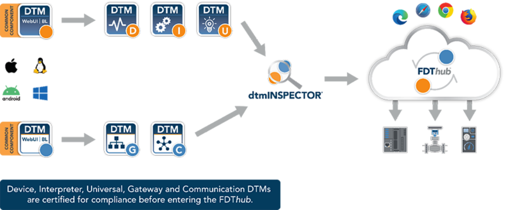

рис.28. FDT hub

## 5. Сценарії використання

**Сервісний інструмент**

FDT може використовуватися для створення сервісного інструменту, який застосовується для конфігурування та параметризації пристроїв безпосередньо в полі. Такий інструмент можна розглядати як заміну автономних засобів. Сервісний інструмент зазвичай використовує з’єднання типу точка-точка, а пристрої виявляються шляхом сканування мережі. Поточна конфігурація зчитується у DTM, після чого зміни виконуються безпосередньо на пристрої. Зміни конфігурації можуть бути роздруковані для архівування. FDT підтримує цей сценарій таким чином:

- побудова топології шляхом сканування мережі 
- завантаження конфігурації та параметрів із пристрою 
- конфігурування і параметризація
- друк конфігурації

**Інженерний інструмент**

Інженерний інструмент також може отримати переваги від використання FDT. Топологія зазвичай планується в режимі off-line, а потім перевіряється шляхом сканування мережі. Іноді дані плануються поза системою та імпортуються. DTM попередньо конфігуруються в режимі off-line; дані завантажуються в пристрій, коли він стає доступним. Інженерний інструмент відстежує зміни конфігурації та архівує історичні дані. Крім того, записується інформація аудиту дій.

У цьому випадку FDT використовується для:

- перевірки запланованої топології 
- попереднього конфігурування 
- виявлення змін конфігурації 
- реєстрації інформації аудиту

**Конфігурування майстра шини**

Комунікаційний майстер може конфігуруватися за допомогою інструменту з підтримкою FDT. FDT забезпечує для цього такі можливості:

- отримання даних конфігурації майстра (наприклад GSD для PROFIBUS) 

**Система керування**

Пристрої, підключені до промислової мережі, можуть бути інтегровані в систему керування за допомогою FDT. Сигнали вводу і виводу можуть бути створені та включені до функціонального планування системи. Для цього FDT означує:

- процесні канали, що надають інформацію про адресацію та типи даних сигналів вводу/виводу

**Керування активами**

Збирання даних активів для аналізу системою керування активами також підтримується FDT. Від пристроїв може отримуватися інформація, важлива для керування активами. Можна запитувати лічильники напрацювання. DTM може виконувати діагностику та обчислювати дату наступного сервісного інтервалу.

Для цього використовуються такі елементи FDT:

- доступ до значень, важливих для керування активами, та отримання лічильників роботи
- виявлення технічного стану та реалізації предиктивного обслуговування

**Масштабованість**

FDT може використовуватися у простих випадках, наприклад для конфігурування пристроїв у майстернях або невеликих установках. Основні операції виконуються через інтерфейси користувача DTM, і часто встановлюється пряме з’єднання з польовим пристроєм у режимі on-line. FDT надає повний доступ до всієї функціональності DTM, що відповідає повній функціональності пристрою. Перемикання між режимами роботи може здійснюватися, наприклад, через вкладки або меню. Поточні налаштування конфігурації та значення параметрів зчитуються з пристрою та відображаються користувачу таким чином, щоб їх можна було легко змінити. Змінені значення можуть бути записані назад у пристрій. Пристрій може бути діагностований і відкалібрований. Якщо пристрій надає інформацію про обслуговування, його стан може бути переглянутий.

FDT може ефективно використовуватися для керування сотнями пристроїв. Система керування активами може контролювати рівні технологічних середовищ і формувати замовлення на ресурси, яких бракує. Така система також містить інформацію про технічне обслуговування всіх пристроїв і виконує діагностичні перевірки. Крім того, може використовуватися система HMI, яка забезпечує оперативне керування. Наприклад, технологічні значення відображаються разом із графічним зображенням резервуара. Якщо значення виходить за встановлені межі, відображаються аварійні повідомлення. На відміну від простого сценарію, у таких системах часто використовуються функції, які не потребують взаємодії через інтерфейс користувача. Інформація обробляється у фоновому режимі з визначеними інтервалами часу та може фільтруватися.

### Приклад сканування

На комп’ютері, де встановлено багато DTM, але топологія мережі ще не визначена, користувач може виконати сканування всієї мережі незалежно від протоколів.

Спочатку FDT Frame Application виконує так зване оновлення каталогу, щоб визначити, які DTM встановлені. У результаті визначається, які DTM є Communication DTM, а які — Device DTM. Це виконується через відповідний означений інтерфейс. DTM повертає XML-документ, який відповідає схемі DTMInformationSchema. Цей документ містить статичну інформацію про протоколи, які надає або потребує DTM. 

Після цього FDT Frame Application запускає всі Communication DTM по одному та виконує запит, щоб перевірити, чи може DTM виявити відповідне апаратне забезпечення. Сканування апаратного забезпечення може займати певний час, тому цей метод одразу повертає керування, а процес розпізнавання виконується у фоновому режимі.

Результат сканування апаратного забезпечення передається асинхронно через відповідний інтерфейс. Результатом також є XML-документ, але цього разу відповідно до схеми DTMScanIdentSchema. 

Отримавши цю інформацію, FDT Frame Application перевіряє таблицю встановлених DTM, щоб визначити, чи існує Communication DTM, який відповідає знайденому апаратному забезпеченню. Якщо так, він запускається і додається до топології. Якщо ні, користувач може отримати повідомлення, що апаратне забезпечення знайдено, але його неможливо використати без встановлення інших DTM.

Після визначення Communication DTM той самий механізм застосовується для пошуку польових пристроїв. FDT Frame Application запитує канали Communication DTM і виконує ScanRequest через для кожного каналу.

Отримана інформація вже є специфічною для протоколу та відповідає схемі FDTxxxScanIdentSchema, де xxx є назвою протоколу. Далі виконується XSL-перетворення, яке формує результат відповідно до схеми DTMScanIdentSchema. Це один із механізмів, за допомогою яких FDT забезпечує незалежність від протоколу.

Коли перетворення завершено, FDT Frame Application знову звертається до таблиці доступних DTM. Якщо знайдено DTM, що відповідає отриманій інформації, він додається до топології мережі. На цьому етапі враховуються лише Device DTM.

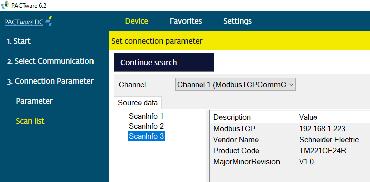

рис.29. Приклад сканування.

## Джерела

1. FDT Technical Description www.fdtgroup.org Open access to device intelligence https://fs.gongkong.com/files/technicalData/200902/2009020615422300002.pdf
1. https://www.fieldcommgroup.org/technologies/fdt
1. https://www.yokogawa.com/mea/library/resources/media-publications/yokogawa-fieldmate-and-device-dtm-compliance-with-fdt2
1. https://www.automation.com/article/smart-manufacturing-data-driven-fdt-3-0-device
1. https://www.linkedin.com/pulse/brief-history-device-management-part-2-from-eddl-torrez-contreras/
1. https://www.automation.com/article/fdt-3-0-guide-standardized-responsive-web-user-int
1. Zurawski R. (ed.). Industrial Communication Technology Handbook. 2nd ed. Boca Raton: CRC Press, 2015.
1. https://www.fieldcommgroup.org/sites/default/files/imce_files/technology/documents/fdi-white-paper-2012.pdf

## Автори

Теоретичне заняття розробив [Олександр Пупена](https://github.com/pupenasan). 

## Feedback

Якщо Ви хочете залишити коментар у Вас є наступні варіанти:

- [Обговорення у WhatsApp](https://chat.whatsapp.com/BRbPAQrE1s7BwCLtNtMoqN)
- [Обговорення в Телеграм](https://t.me/+GA2smCKs5QU1MWMy)
- [Група у Фейсбуці](https://www.facebook.com/groups/asu.in.ua)

Про проект і можливість допомогти проекту написано [тут](https://asu-in-ua.github.io/atpv/)
