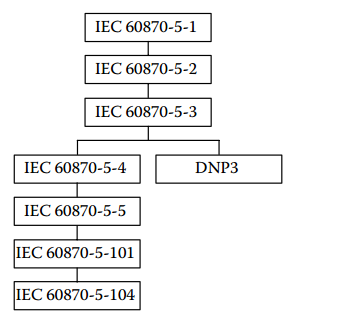
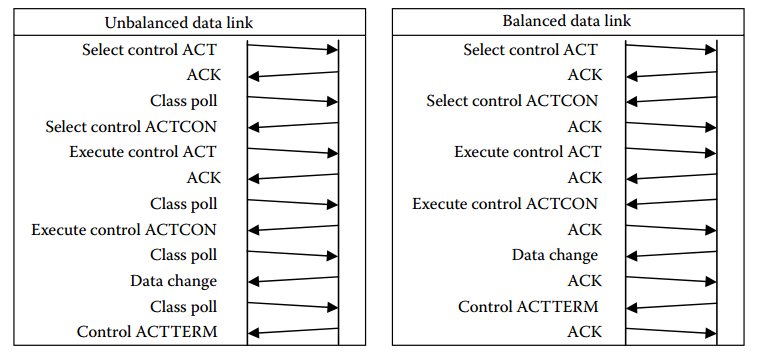
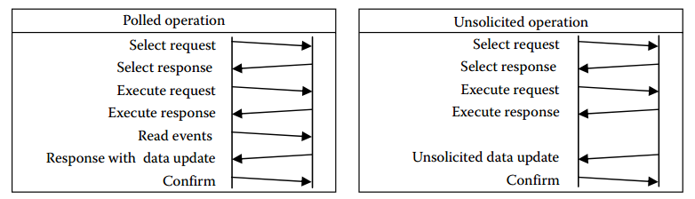

# DNP3 та IEC 60870-5

Перелкда статті від Andrew C. West (*Invensys Operations Management)*

## 1. Вимоги до збору даних SCADA в Електроенергетиці та інших промисловостях

Електросилові мережі (Electric power networks) складаються з систем передачі (transmission systems) і розподільчих систем (distribution systems). **Системи передачі** (transmissionsystems) складаються з високовольтних ліній електропередач (high-voltage power lines) і відносно невеликої кількості великих підстанцій (large substations). Вони поставляють енергію для термінальних станцій (terminal stations), де трансформатори понижують напругу і передають в розподільчу мережу (distribution network). **Розподільчі мережі** (distribution network) включають в себе велику кількість невеликих підстанцій і трансформаторів, які далі понижують напругу до необхідної в мережі живлення (mains voltages) і розподіляються до побутових і комерційних споживачів. Великі **генераторні станції** (Large generation stations) підключаються безпосередньо до системи передачі, а невеликі - можуть підключатися як до системи передачі так і до розподільчих мереж.

Сучасні підстанції включають в себе обладнання для контролю і захисту системи живлення. Ці системи контролюють багато величин, таких як напруга, струм, споживана потужність і стан вимикачів та іншого обладнання. Деякі пристрої на підстанціях виконують функції автоматичного відключення живлення при проблемних випадках, таких як перевантаження, короткого замикання або несправностей, пов’язаних з електричними штормами (induced by electrical storms). Підстанція передачі високої напруги (high-voltagetransmission substations), яка включає підстанції низької напруги, є найбільш сильно контрольованою і захищуваною ділянкою, а обладнання розподіленої системи, як правило, отримують менш суворий контроль для кожної ділянки, але мають набагато більшу кількість силових елементів (plant items), які можуть бути контрольованими.

Підстанції, як правило контролюються SCADA-системами. Вони з’єднуються з диспетчерським пунктом (control center), передаючи туди свої дані, де ця інформація використовується для забезпечення віддаленого моніторингу та керування силовими мережами (power network) оперативним персоналом. Оператори виконують рутинну роботу по перемиканню енергоблоків (plant) для їх запуску, виведення з експлуатації і швидкого відновлення подачі живлення після збоїв.

Динамічні характеристики електричної мережі залежать від дуже швидких змін поведінки мережі які зумовлені реакцією на будь-які зміни навантаження в мережі наявними генераторами або збуреннями. Таким чином, SCADA-система повинна забезпечувати швидке опитування контрольованих даних та підтримку видачі команд керування з мінімальною часовою затримкою передачі від диспетчерського пункту до польового обладнання. Необхідна швидкість реагування (час між зміною в польовому обладнанні та відображення, або час між командою від оператору і її виконання в польовому обладнанні) в мережах передачі зазвичай повинна бути меншою 5 с. Через таку високу швидкість реагування, SCADA-системи для електроенергетики часто вважаються системами реального часу або наближеними до реального часу.

Керування енергетичною системою вимагає високої цілісності як отримуваних даних (data reporting) так і керуючих сигналів. Для того, щоб швидко зробити висновок про необхідну дію, оператор повинен мати точну та вірну звітну інформацію, передану в диспетчерський пункт. Система повинна правильно реагувати на будь-які команди оператора і проводити дії тільки на тому обладнанні, яке запитується оператором: ненавмисне функціонування інших пристроїв не допустимо і являє собою ризик для безпеки персоналу та обладнання. Якщо який-небудь вид команди керування не проходить крок перевірки, команда буде відкинута, не допускаючи можливість неправильного виконання запитуваної команди.

При виникненні несправностей в електроенергетичних системах, як правило, діє встановлене на підстанціях автоматизоване захисне обладнання, яке виявляє ці несправності і вживає заходів щодо мінімізації збитку для системи. Вони забезпечують автоматичне відключення або ізоляцію несправної ділянки мережі. Дії цього захисного обладнання є швидкими і ретельно налаштовуються через складний набір параметрів, які впливають на їх роботу. Для перевірки правильності роботи даного обладнання і допомоги правильного налаштування параметрів, потрібна фіксація точного значення часу зміни даних, які контролюються засобами захисту. Так само час реакції цього обладнання має важливе значення для пост-аварійного аналізу (postmortem analysis) будь-якої несправності і відповідної роботи обладнання. Для збору цих даних необхідна фіксація часу змін з точністю в діапазоні від мілісекунд до мікросекунд, а дані можуть включати в себе запис гармонік напруги та струму в різних точках системи електроживлення. Для взаємної кореляції даних, зібраних в різних місцях мережі живлення, необхідна точна синхронізація часу, який використовується для формування відмітки часу (time-stamp) для цих даних. Звітні дані з відміткою часу, що передаються до системи що їх архівує, іноді називають звітами "послідовності подій" або **SOE** (sequence of events).

Електроенергетичні SCADA-системи є одними з найбільш ранніх застосунків широко-територіальної розподіленої телеметрії. Основна енергоустановка (primary plant) в генераторних станціях і підстанціях має тривалий термін служби (зазвичай 30 або більше років). Зв’язане з нею керуюче обладнання і системи зв'язку, як правило, мають сумірну, хоч дещо коротшу тривалість життя - порядку 10 років. Таким чином, існує багато SCADA-систем, що використовують відносно старі комунікаційні системи або їх структура застаріла. Ці комунікаційні системи часто мають обмежену пропускну здатність і можуть мати відносно високий відсоток помилок в порівнянні з використовуваними в інших застосунках, таких як інформаційні технології (ІТ) або автоматизація виробництва. Багато встановлених систем працюють через послідовні канали передачі даних зі швидкостями в діапазоні 300-9600 бод. Навіть якщо обладнання може бути оновлене, не завжди можливо значно змінити доступну пропускну здатність без заміни всієї комунікаційної системи. Коли відбуваються оновлення, іноді, але не завжди, приймаються сучасні мережні технології. Для деяких областей застосування традиційних систем послідовної передачі даних є більш ефективним або більш економічно-доцільним. Це може бути особливо доцільно в тому разі, коли необхідно забезпечити доступ до великої кількості польових пристроїв, використовуючи спільний носій, наприклад, радіоканал з обмеженою пропускною здатністю.

Вимоги, що пред'являються до швидкого оновлення даних при доступній обмеженій пропускній здатності диктують необхідність ефективного її використання. Вимоги до цілісності даних і команд задовольняються за допомогою механізмів, що перевіряють і підтверджують їх правильність. Точна відмітка часу даних вимагає підтримки SOE а також механізму точної синхронізації часу між декількома широко-територіально розосередженими пристроями. Деякі з цих вимог за своєю природою супротивні (наприклад, короткий час очікування і низька пропускна здатність), тому при їх вирішенні повинен бути досягнутий компроміс.

Традиційно ці потреби задовольнялися постачальниками, що забезпечують різні власні (пропрієтарні) протоколи і інтерфейси зв'язку, які безпосередньо спрямовані на задоволення цих вимог. Останнім часом для цієї мети були розроблені і широко застосовуються ряд відкритих стандартних протоколів.

Сучасні SCADA-системи практично повсюдно впровадили стандартні інтерфейси з телекомунікаційної індустрії, таких як інтерфейси V.24/V.28 (RS-232) або V.11 (RS-422/RS-485) для послідовних інтерфейсів або з’єднання через модем, і будь-який з IEEE 802 інтерфейсів для Ethernet (зазвичай з TCP/IP) з 100BaseT і 100BaseFX, які в даний час є загально-використовуваними. Ці інтерфейси використовуються зі SCADA-специфічними протоколами: У електроенергетиці, найбільш часто використовувані SCADA-протоколи IEC 60870-5-101 або IEC 60870-5-104 (домінуючі в Європі) і DNP3 (поширений в англомовних країнах). Нижче описані ці два сімейства протоколів.

Деякі інші галузі промисловості (наприклад, залізничний транспорт) мають схожі вимоги до SCADA, що використовуються в електроенергетиці (наприклад, керування потужністю тягача). Для вирішення подібних задач вони прийняли ті ж самі стандарти SCADA-протоколів, однак для інших (наприклад, для інтерфейсів функціональної безпеки, сигналізації) були прийняті інші стандарти.

До інших великих галузей промисловості, що мають сильно розподілені SCADA-мережі входить нафто- і газо-трубопроводні магістралі, об’єкти водопостачання та очистки стічних вод. Ці галузі мають ряд вимог, подібних до SCADA-систем в електроенергетиці, однак мають ряд суттєвих відмінностей.

У нафто- і газо-трубпопровідному транспортуванні, системах водопостачання і очистки стічних вод, як правило, не потрібна така мала періодичність опитування: Тиск в газопроводах, витрати і рівні для рідин, як правило, швидко не змінюються або не потребують швидкої реакції. Як правило, це дозволяє організовувати більш повільний збір даних, часто є прийнятним період в діапазоні від декількох хвилин до декількох годин. Помітним виключенням з цього є негайне повідомлення про "термінові" тривожні ситуації, які можуть викликати необхідність втручання оператора або виклик обслуговуючого персоналу.

Для таких трубопровідних об’єктів існує ряд додаткових вимог, яких немає в енергетичних системах, тому тут окрім протоколів електроенергетики використовується також Modbus (де не потрібно дані з відміткою часу або SOE дані). У нафто- газо-трубпопровідному транспортуванні також до сих пір поширені фірмові (пропрієтарні) протоколи.

В останні роки об’єкти водопостачання Великобританії та Австралії для SCADA-інтерфейсів стандартизували протокол DNP3. Тут використовуються функціональні можливості SOE для забезпечення точної реєстрації дій польових засобів, дозволяючи нечасте їх опитування. DNP3 підтримує механізм незапитуваної звітності (unsolicited reporting), де з польових засобів можуть передаватися звіти про зміни без необхідності запиту від головної станції. Використання цієї функції дозволяє оперативно відображати невідкладні стани тривоги, не вимагаючи частого опитування кожної віддаленої ділянки.

Профілі серії МЕК 60870 не були широко прийняті в нафто- і газо-трубопроводному транспортуванні та водопостачанні можливо через те, що ці стандарти сприймалися специфічними виключно для енергетики.

## 2. Загальні особливості IEC 60870-5 та DNP3: типи даних, передача звітів по винятку, відновлення після помилки

Серія стандартів Міжнародної електротехнічної комісії 60870-5 були розроблені Технічним комітетом 57 в період з 1988 по 2000 роки. Деякі частини були оновлені з подальшими змінами і розширеннями. Ця серія включає в себе профілі МЕК 60870-5-101[1] і 60870-5-104[2] для основних задач телекерування через послідовний порт і TCP/IP з’єднання. Стандарти IEC 60870-5 визнані в якості міжнародних стандартів для протоколів передачі в SCADA-системах електроенергетики. Їх використання для цих цілей уповноважене в багатьох країнах на законодавчому рівні, також вони широко застосовуються в Європі і в тих країнах, де мають значний вплив європейські компанії і конвенції.

IEC 60870 частини -5-1 до -5-5 означують довідникові правила для опису протоколів телекерування в SCADA-системах. Частина -5-101 (іноді також відома як "TeleControl 101" або "Т101") описує повністю означений профіль для базових задач Телекерування на основі цих правил. T101 включає в себе означення об'єктів даних і функцій загального призначення і характерних для енергетичних систем, застосовних безпосередньо для SCADA-зв'язку підстанції та диспетчерського пункту. Частина 5-104 ("T104") означує передачу T101 поверх TCP/IP з деякими незначними функціональними розширеннями, такими як додавання мітки часу для об'єктів керування.

DNP3 [3] є протоколом загального призначення для SCADA-систем. Він базується на правилах, розроблених в перших (ранніх) частинах МЕК 60870, і додає до них деякі поняття. Ці додані правила сильно відрізняються від тих, які з’явилися в стандартах МЕК пізніше, починаючи 60870-5. Стандарт означує типи даних і функції для передачі в SCADA-системах даних загального призначення. Хоч протокол був розроблений для застосування в енергетичних системах, він не включає в себе об’єкти характерні для енергетичних систем.

DNP3 був спочатку розроблений канадською компанією розробників SCADA-систем Westronic, а в 1993 році був викладений для загального користування. У даний час протокол підтримується незалежною організацією під назвою DNP Users Group. Він вважається стандартом де-факто для зв'язку в SCADA-системах електропостачання Північної Америки, де використовується більш ніж на 80% енергосистем [4]. DNP3 є стандартом де-факто також в SCADA-комунікаціях електроенергетики більшості інших англомовних країн та місцях, де північноамериканські виробники мають значний вплив на ринок. Протокол DNP3 був створений в результаті прагматичної адаптації стандарту МЕК 60870 до потреб ринку ще до появи МЕК 60870-5-101. Його поява на ринку в якості відкритого стандарту сприяло його прийняттю а тепер і ратифікації в якості стандарту IEEE 1815.

Спадщина протоколів і залежностей в документації показані на рис.1.

**Рис.1. Залежності специфікацій.**

 Елементи, які є загальними для обох протоколів IEC 60870-5-101/-104 та DNP3 включають в себе наступне:

- T101/T104 і DNP3 адаптовані до еталонної моделі «Архітектури підвищеної продуктивності» ("Enhanced Performance Architecture", **EPA**) описаної в МЕК 60870-5-3, яка використовує тільки фізичний, канальний і прикладний рівні 7-рівневої еталонної моделі ISO і розподіляє між ними функції мережного, транспортного, сеансового рівня і представлення. Пізніше DNP3 розширив модель EPA транспортною "функцією" (псевдо-рівнем), який забезпечує збірку повідомлень з декількох кадрів канального рівня
- T101 і DNP3 використовує формати кадрів і правила їх обробки, що визначені в IEC 60870- 5-1 і IEC 60870-5-2. Вони забезпечують хорошу ефективність повідомлення з хорошим виявленням помилок і відмов, задоволення основних вимог SCADA-систем електроенергетичних об’єктів до цілісності та ефективності.
- T101/T104 і DNP3 засновані на парадигмі «Звіт по винятку" (“Report by Exception” або **RBE**), де при нормальній роботі звіти, що передаються, включають тільки змінені дані. Це відповідає основній вимозі SCADA-систем електроенергетичних об’єктів щодо ефективності повідомлень звітності (за рахунок усунення непотрібних звітів про незмінені дані), а також направлено на задоволення вимог щодо повернення інформації SOE (відправка змін в послідовностях і з відміткою часу). Механізм RBE вимагає початкового збору всіх даних з польового пристрою через "опитування цілісності" і подальшої звітності про всі зміни в правильній хронологічній послідовності. Якщо це буде зроблено правильно, без втрати даних SOE, то отриманий на приймальній станції образ даних буде завжди правильним.
- Процедури команд керування включають в себе механізм "Select Before Operate" («Вибрати перед виконанням») або " Select/Execute" («Вибрати/Виконати») який також називається "керування в два проходи". Цей механізм забезпечує виконання команд керування зі значно поліпшеним захистом від помилок випадкових даних, наведених електромагнітними завадами в системі зв'язку. Це відповідає вимозі забезпечення перевірки цілісності команд керування SCADA-систем електроенергетичних об’єктів.
- Об'єкти даних включають в себе прапорці якості, які надають додаткову інформацію для кваліфікації або перевірки достовірності даних, що передаються (звітуються).
- Відмітки часу зміни даних, які вказують на час вимірювання звітних даних які передаються.
- Типи даних та функцій, підтримувані як IEC 60870-5-101/-104 так і DNP3 включають
- Передача статусу одно-бітного об’єкту 
- Передача статусу двох-бітного об’єкту 
- Передача аналогового виміряного значення у форматі цілого
- Передача аналогового виміряного значення у форматі з плаваючою комою
- Передача лічильників (також називається акумулятором або інтегральна сума)
- Команда керування бінарним виходом (вкл./відкл. або розімкнути/замкнути)
- Команда керування уставкою цілого типу або з плаваючою комою
- Команда керування фіксацією лічильників/акумуляторів
- Можливість читання та запису файлів на або з польових пристроїв
- Можливість установки дати і часу (годинник і календар) в польових пристроях, в тому числі корекції затримки поширення (propagation delay) системи зв'язку
- Можливість перезапуску віддаленого пристрою
- Команди для виконання "опитування цілісності" (збір оновленого образу файлу з усіма даними від польового пристрою)
- Команди для збору конкретної підмножин даних з польового пристрою
- Експлуатаційні режими роботи, в яких польовий пристрій може передавати змінені дані без опитування ведучою (Master) станцією.
- Процедури випробувань для перевірки правильності роботи реалізації протоколу на пристрої.
- Для підтримки функціональності SOE, пристрої включають буфери подій (event data buffers). Протоколи означують механізми для перевірки правильності даних в цих буферах: Ці дані можна повторно оновити, якщо необхідно переконатися в їх правильності. Після перевірки дані можуть бути видалені з буферів подій.
- T104 і DNP3 мають стандартизовані означення XML-файлів для відображення в них стандартних об'єктів даних і їх атрибутів для логічних вузлів (Logical Node), визначених в стандарті автоматизації підстанцій IEC 61850. T101 також може використовувати процес відображення T104
- DNP3 має процедуру аутентифікації доступу, яка заснована на стандарті МЕК 62351-5. Еквівалентні функціональні можливості на момент написання для T101 і T104 знаходяться в стадії розробки.

Будь-який пристрій, який реалізує ці протоколи може вибрати для цього тільки ті частини протоколу (об'єкти даних і функції), які необхідні для підтримки роботи цього пристрою. Кожен протокол має деякі обов'язкові "службові" функціональні можливості, які повинні бути реалізовані.

## 3. Різниця між принципами функціонування, форматом повідомлення, ефективністю, TCP/IP транспортом для IEC 60870-5 та DNP3

У той час як T101, T104 і DNP3 мають багато спільних експлуатаційних характеристик, такі як використання RBE, є деякі відмінності в деталях принципів функціонування протоколів IEC 60870-5 і DNP3. Ці відмінності проявляються в форматах об'єктів даних і повідомлень і в послідовності команд, які використовуються для маніпулювання ними.

У деяких випадках, протоколи IEC 60870 і DNP3 вживають різну термінологію для описування того ж самого, і навпаки – подібну термінологію для описування різних речей. Це призводить до плутанини, особливо тих людей, які добре знайомі з деталями одного протоколу, і які мають відносно поверхневі знання з іншою. У таких випадках існуючі дружні відносини з одним протоколом легко призводять до нерозуміння або неправильної реалізації іншого. Для того, щоб чітко розуміти подібності та відмінності протоколів може знадобитися детальне ознайомлення з обома наборами специфікацій. Іноді, для того, щоб правильно вибрати параметри конфігурації і т.д, кінцеві користувачі також повинні бути в курсі цих деталей.

Приклад різниці в термінології: Обладнання ведучої станції (master station), як правило, знаходиться в диспетчерському пункті SCADA-системи, яка в IEC 60870 називається "**контролюючою станцією**" (“controlling station”) а в DNP3 - "**ведучою**" (“master”); таке обладнання підстанції як віддалений термінальний блок (**RTU**, remote terminal unit), який передає дані підстанції до диспетчерського пункту в IEC 60870 називається "**контрольованою станцією**" («**controlled station**») а в DNP3 - "**зовнішньою станцією**" (“**outstation**”).

Прикладом однакових термінів, що значать дещо різні речі є у використанні класів даних. У МЕК 60870-5 існує два класи даних, що використовуються для опитування даних у процедурах небалансної передачі (unbalanced data link procedures): дані класу 1 відповідають високому пріоритету (як правило, дані по подіям), і дані класу 2 - низькому пріоритету (зазвичай циклічні аналогові вимірювання). У DNP3 існує чотири класи: Клас 0 для передачі "статичних даних", що відповідають поточному значенню всіх видів даних; і класів 1, 2 і 3, які представляють три окремі пріоритетні групи для даних по події. Механізми прийняття рішення вибору класу, який повинен зчитуватися, для цих протоколів різні.

Основний принцип протоколів серії IEC 60870-5 базується на тому, що на підстанції контрольована станція повинна визначити, які дані повинні бути відправлені в контролюючу станцію (ведучу станцію). У **балансному режимі роботи** (balanced mode) контрольована станція просто передає будь-які дані, які хоче і коли хоче. Контролююча станція просто підтверджує отримання даних і коли це потрібно видає керуючі команди. У **небалансному режимі роботи** (unbalanced mode) контрольована станція діє подібним чином, але повинна чекати, поки надійде запит опитування від контролюючої станції (фактично «запрошення до передачі"), на який вона відповідає відправкою одного повідомлення. Контролююча станція має слабий вплив на те, що контрольована станція буде передавати, а саме має можливість запросити дані "Класу 1" або "Класу 2". Зазвичай контролююча станція запитує дані класу 2 (низький пріоритет, як правило, циклічні дані). Якщо попередня відповідь вказує на те, що є дані з високим пріоритетом (шляхом установки прапорця запиту доступу) то контролююча станція запрошує дані класу 1. Таким способом контрольована станція є принциповою в керуванні правильною послідовністю представлення даних на контролюючу станцію. У DNP3, зовнішня станція (outstation) завжди відповідає саме тими даними, які запросив ведучий: Ведучий має повний контроль над тим, що буде надіслано. Для того, щоб в DNP3 були правильно відправлені збережені в пристрої дані, майстер повинен запросити тільки статичні дані (поточне значення входів), і якщо вони є, також запрошувати всі буферизовані події для тих же входів в одному запиті. Це дуже важливо для правильного отримання даних.

*Примітка*: При реалізації будь-якого протоколу, потрібне розуміння базових принципів. Можна погано реалізувати небалансну передачу в контрольованій станції T101 таким чином, що критична вимога щодо порядку запиту на звіти вимірювань і плинні вимірювання порушується схованими параметрами конфігурації. Таким же чином, можна порушити цю ж вимогу в майстра DNP3, що не буде запитувати буферизовані події при запитуванні статичних даних.

Відмінності між IEC 60870-5-101/-104 та DNP3 в наступному:

-  Профіль T101 використовується тільки через послідовні канали зв'язку, а T104 тільки для використання через транспорт TCP/IP. Для профілю T104 використовується урізана версія кадру канального рівня, означеного в T101 (IEC 60870-5-1 FT1.2), а також змінені правила підтвердження повідомлення. У T101 дозволяється використовувати небалансні послуги зв’язку (потрібно для використання у мультиточкових каналах) або балансні (вимагає виділену лінію зв'язку в повнодуплексному режимі точка-точка між парами пристроїв). Функціонування обміну даними у T104 в основному таке ж саме, як робота T101 в режимі балансного зв’язку. Однак в T104 може бути відправлено певна налаштовувана кількість інформаційних повідомлень (I-кадри) ще до отримання підтвердження попередніх, в той час як правила T101 вимагають підтвердження кожного окремого кадру. DNP3 завжди використовує кадр послідовного каналу (на основі IEC 60870-5-1 FT3) і правила "балансної передачі", які модифіковані для забезпечення нормального багатоточкового функціонування на напівдуплексних каналах. Коли DNP3 використовується з TCP/IP або UDP/IP, кадр послідовного каналу інкапсулюється в TCP або UDP-пакети. Цей процес спрощує програми обробки пакетів (вони однаково функціонують для послідовного каналу або IP), а також спрощує використання DNP3 з інтерфейсами типу терміналу сервера, який просто обгортає або розгортає кадри послідовного каналу в/з TCP/IP пакети, і не потребує формування нового кадру для послідовної лінії передачі.
- T101/T104 повідомлення можуть містити тільки один тип даних (наприклад, однобітні двійкові входи або цілі аналогові вимірювані величини). DNP3 повідомлення можуть містити кілька типів даних в одному повідомленні, скільки в повідомленні може міститися декілька «функцій» (наприклад, для читання, команди управління, звітна відповідь і т.п.), які можуть застосовуватися до даних різного типу. Через це відповідь на команду, такі як опитування цілісності може складатися з декількох невеликих повідомлень в T101 або T104 і невеликою кількістю великих повідомлень в DNP3. Це може вплинути на ефективність передачі звітів в різних протоколах, особливо по каналах передачі даних зі спеціальними властивостями, такими як радіоканал даних (час опитування може бути довгим в порівнянні з часом передачі) і супутникові канали зв'язку (плата за кількість байт: Більше пакетів = більше накладних витрат = більша вартість).
- Повідомлення Т101/T104 обмежені максимальним розміром одного кадру каналу передачі даних. Як правило, це дозволяє передавати близько 250 байт даних в одному повідомленні. DNP3 повідомлення не мають ніякого логічного обмеження на розмір: DNP3 використовує транспортну функцію і фрагментування на прикладному рівні; для створення повідомлень будь-якої довжини і передавання їх у вигляді послідовності фрагментів прикладного рівня (як правило розміром 2048 байт) повідомлення розбивається на багато транспортних сегментів з метою відправки їх кадрами канального рівня обмеженої довжини.
- Для перевірки доставки даних DNP3 використовує явний механізм підтвердження на прикладному рівні. T101 простежує правильну роботу прикладного рівня опираючись на підтвердження кожного кадру канального рівня або перемикаючи один біт номеру послідовності (відомий як Frame Count Bit або FCB) в наступному запиті. T104 опирається на підтвердження кількості переданих повідомлень. Максимальний розмір вікна в T104 конфігуруєтся (параметр K), але, як правило, встановлений рівним 12. DNP3 також дозволяє використовувати підтвердження канального рівня МЕК (за винятком TCP/IP), тим не менше, використання цього не забезпечує функціональної вигоди і не рекомендується.
- Згідно Т101 і T104 моделі адресації елементів даних всередині пристрою кожен вид даних, будучи членом одного набору об'єктів, ідентифікується **адресою об'єкта інформації** (**IOA**, information object address). Значення адреси IOA може призначатися у будь-якому місці в допустимих межах (що може варіюватися в залежності від загальносистемних параметрів, які визначають розмір області IOA і як вона відформатована). Згідно DNP3 моделі всі дані в пристрої знаходяться у вигляді набору одновимірних масивів з розділенням їх для кожного типу даних. Кожен елемент даних ідентифікується в масиві за допомогою порядкового номера, починаючи з нуля для першого елемента. В усіх наведених протоколах, максимальна ефективність по кількості отриманих повідомлень досягається в тому випадку, якщо діапазон або порядковий номер IOA для якого-небудь одного типу даних являє собою один безперервний ряд без проміжків. Для Т101/T104, це означає присвоєння адресі IOA значення від *X* до *X + n* − 1, для *n* об'єктів одного і того ж типу, а для DNP3 це означає присвоєння індексів від 0 до *n* − 1 для *n* об'єктів одного і того ж типу. У зв'язку з цим, модель даних МЕК дещо нагадує поняття відображення регістрів, яке використовується в Modbus.
- Ідентифікація даних в системі Т101 або T104 є унікальною комбінацією ідентифікатора пристрою (так званої загальної адреси блока даних **ASDU** (Application Service Data Unit) або **CAA**) і IOA кожного елемента даних в пристрої. Ця ідентифікація не залежить від адреси на канальному рівні (в T101) або IP-адреси (в T104) пристрою. Кожен окремий об'єкт даних в пристрої T101/T104 (пристрій, що має одне значення CAA) повинні мати різні IOA. У DNP3, поєднання послідовного каналу пристрою (або IP-адреси), DNP-адреси пристрою, типу даних а також індексу об'єкта разом однозначно ідентифікують об'єкт даних.
- Оскільки в одному повідомленні МЕК можуть переноситися дані або функція тільки одного типу, відповідь на деякі прикладні функції складаються з послідовності повідомлень, починаючи з "команди старту послідовності" (“begin command sequence”) або активації підтвердження повідомлення (ACTCON), за якими слідують одне або більше повідомлення даних і завершується "командою кінця послідовності" або активації припинення повідомлення (ACTTERM). У DNP3, для тієї ж функціональності, як правило, потрібно тільки одне повідомлення у відповідь.
- Повідомлення T101 і T104 включають в себе значення "причини передачі" (**СОТ**), яке допомагає при керуванні в багато-крокових відповідях на команду та інколи корисно для відображення причини передачі даних. Наприклад, СОТ може розрізняти зміни, які відбулися спонтанно (наприклад, відключення автоматичного вимикача через дію захисту), або тому, що оператор видав команду керування для викликання зміни. Ця інформація може бути додана до відповідних записів журналу подій. DNP3 не включає в себе таку інформацію, тобто не вказує причину зміни, а лише факт зміни.
- DNP3 означує об'єкти даних SCADA лише загального використання (наприклад, дискретний вхід, вихід заданого значення) без присвоєння конкретного призначення для цих об'єктів. На додаток до цих основних типів, T101 і T104 означують декілька об'єктів характерних для енергетичних систем, таких як «інформація про положення відпайок» (“stepposition information”), що представляє номер відгалуження трансформатора (transformer tap number), інформація про роботу релейного захисту (protection events), упакована інформація про спрацювання пускових органів (packed protection start events) і упакована інформація про спрацювання вихідних ланцюгів захисту (packed protection circuitinformation).
- DNP3 означує деякі комплексні загальні об'єкти даних, такі як об'єкти «Рядок октетів» ("Octet String") і об'єкти "Набір даних" (“Data Set”), які можуть бути означені для забезпечення таких функцій, як робота зі значеннями багатобайтових змінних або комплексних структур даних. DNP3 також підтримує передачу звітів атрибутів пристроїв (інформація шильдика). T101 і T104 підтримує 32-бітний рядок загального призначення (32 bit string), який можна використати довільним чином.
- T101 і T104 означують "нормалізовані"(normalized), "масштабовані"( scaled) і «з плаваючою комою»( floating-point) об'єкти даних, у якості різних видів аналогових об'єктів. Кожен з цих трьох типів також має окремі типи команд уставки. Нормалізований і масштабований аналоговий об’єкт є 16 бітним цілим числом, а об’єкт з плаваючою комою використовує "короткий" 32-бітний формат, означений в IEEE 754. Для цілочисельних форматів нормалізоване значення даних представляє -1.0 до +1.0-2-15, тоді як масштабовані дані представляються значеннями від -32768 до +32767. Обидва перед відправкою і після прийому повинні бути "відмасштабовані", але з різними коефіцієнтами масштабування. Існує рекомендація в стандарті, що коефіцієнти які використовуються для масштабованих значень завжди є степеню 10 (наприклад, 0,001, 0,01, 0,1, 1, 10, 100 і т.д.), і цей спрощений підхід, як видається, широко використовується. Пристрої, як правило, підтримують тільки один із цих двох форматів (нормований або масштабований), що призводить до деяких проблем сумісності. Нормований формат, зазвичай використовується трохи частіше, ніж масштабований. DNP3 обробляє 16-розрядне ціле, 32-розрядне ціле, 32-розрядне з плаваючою комою, і 64- розрядне з плаваючою комою в якості альтернативних форматів повідомлень для подання того ж об'єкта. Формат, який використовується повинен бути обраний відповідно до даних. Дані цілого формату можуть бути масштабовані при необхідності лінійним масштабуванням (Y = AX + B).
- DNP3 дозволяє використовувати "незапрошувані звіти" (unsolicited reporting) на будь-якому каналі, де пристрої здатні виявляти активність каналу, щоб уникнути зіткнень. У цьому режимі звітності, зовнішня станція може відправити повідомлення про подію до ведучої станції без опитування. У T101 функціонування режиму подібного до цього вимагає використання балансного режиму передачі даних і потребує між контролюючою станцією і кожною контрольованою спеціального дуплексного каналу зв'язку типу «точка-точка». Це необхідно щоб будь-якому пристрою дозволялося передавати в будь-який час без можливості зіткнення повідомлень. Кількість повідомлень з тими ж даними прикладного рівня однакова в балансних і небалансних режимах (див.рис.2). Порядок і зміст повідомлень "канального рівня" дещо відрізняється між цими двома режимами. У DNP3, використання незапрошуваних звітів не потребує періодичного опитування подій, тому скорочується кількість необхідних повідомлень (див. рис. 3).

Через обмеження в один тип даних на кожне повідомлення і один СОТ на кожне повідомлення, більшість послідовностей команд в T101 і T104 вимагають багато транзакцій. У T101 кожна транзакція вимагає, щоб повідомлення передавалися в кожному напрямку. Наприклад, двопрохідна команда керування по з’єднанню Т101, що показано на рис. 2, як правило, включає в себе 12 повідомлень.

Еквівалентна транзакція для DNP3, що показана на рис. 3, вимагає, щоб сім повідомлень було надіслано в тих системах, де ведучий опитує зовнішні станції, або шість повідомлень – якщо використовується незапрошувана звітність. Подібні відмінності між протоколами відбуваються для більшості видів транзакцій.

При роботі поверх TCP/IP, різниця між T104 і DNP3 менш виражена і її більш важко оцінити. Для деяких операцій T104 буде більш ефективним, якщо він здатний посилати потік інформаційних кадрів і отримувати єдине підтвердження для цього набору кадрів (еквівалентно виключення всіх ACK крім останнього з правої колонки рис.2). TCP/IP пакетів підтвердження, пов'язаний з цією послідовністю також може буде два або більше. У DNP3 та ж функція може виконуватися з двома або трьома повідомленнями DNP3 (в залежності від використання незатребуваного повідомлення) і двох або трьох TCP/IP пакетів підтвердження. Якщо беруть участь великі обсяги даних, кількість DNP3 і T104 повідомлень збільшиться.

Рис.2 T101 Двопрохідна послідовність команд.

**Рис.3**  DNP3 Двопрохідна послідовність команд.

# Посилання

1. IEC 60870-5-101 Ed. 2, Telecontrol Equipment and System—Part 5: Transmission protocols— Section 101: Companion standard for basic Telecontrol task*s*, International Electrotechnical Commission, 2002;[ www.iec.ch](http://www.iec.ch/)
2. IEC 60870-5-104 Ed. 2, Telecontrol equipment and systems—Part 5: Transmission protocols— Section 104: Network access for IEC 60870-5-101 using standard transport profiles, International Electrotechnical Commission, 2005,[ www.iec.ch](http://www.iec.ch/)
3. DNP3 Specification, Ver. 2, vv. 1–8, DNP Users Group 2007–2009;[ www.dnp.org](http://www.dnp.org/)

Leivo, E. and Newton, C., More than 80% of global utility respondents claim to have substation automation and integration programs underway, *Newton-Evans Research Company Market Trends Digest*, 28, 2–4, 2nd Quarter 2006.