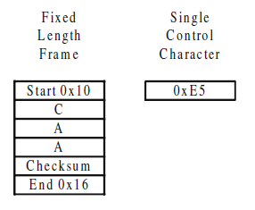
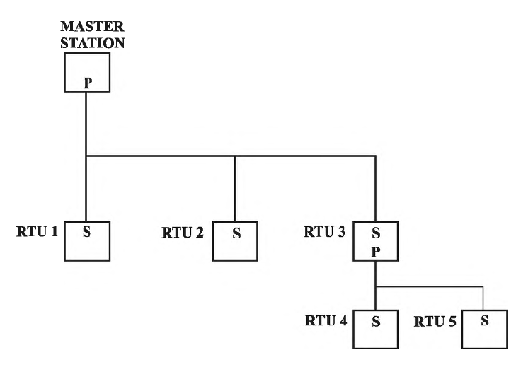
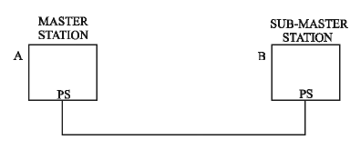
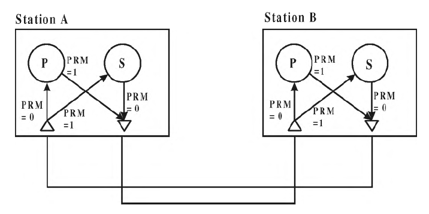
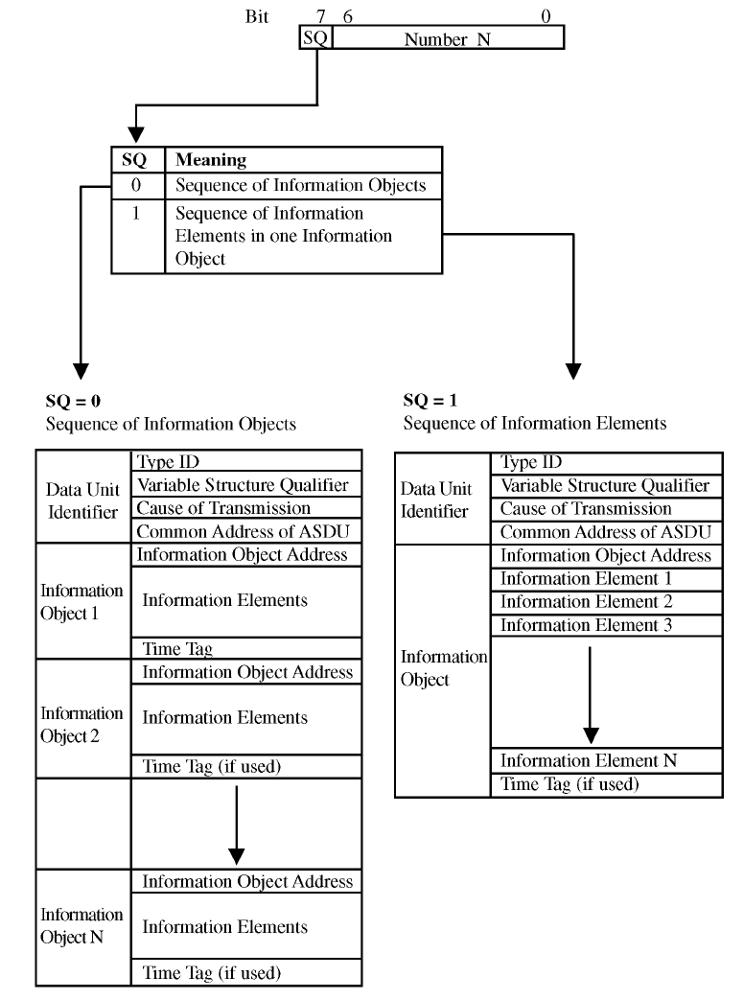
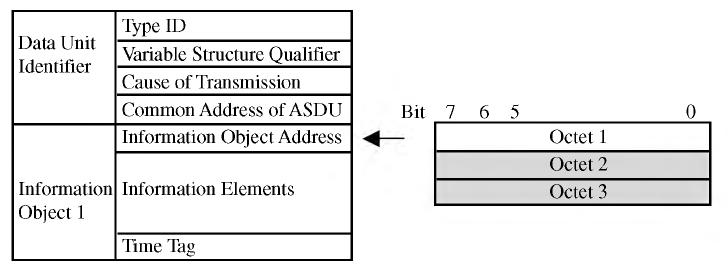
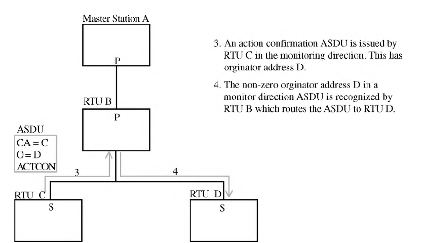
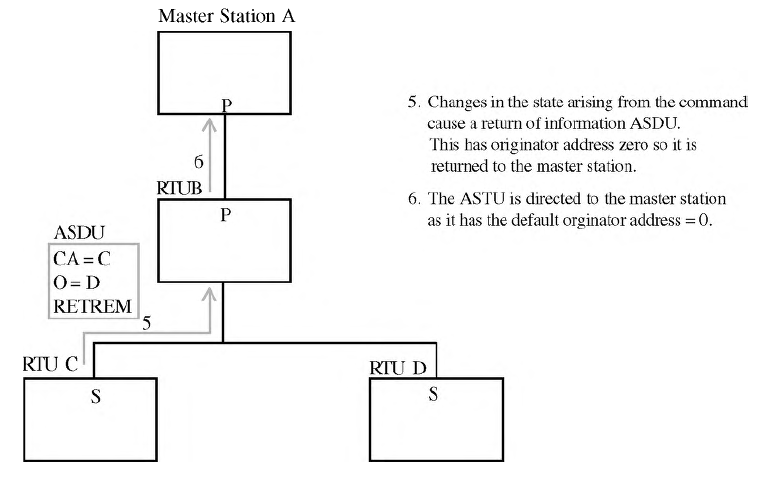

[До підрозділу](README.md)

# Практичні сучасні протоколи SCADA: DNP3, 60870.5 та пов’язані системи

У цій частині наведений вільний переклад деяких розділів книги "Practical Modern SCADA Protocols: DNP3, 60870.5 and Related Systems" авторів Gordon Clarke CP Eng BEng MBA (Author), Deon Reynders Pr Eng BSc (ElecEng) (Hons) MBA (Author) 2003-го року випуску. Книгу не важко знайти в Інтернеті. Хоч вона і вже досить стара, основні моменти IEC 60870-5 добре висвітлені в ній. 

Словник термінів:

- master - ведучий, станція яка керує доступом в мультиточковій передачі 
- slave - ведений, станція яка може передавати повідомлення за запитом від ведучого
- collision - колізія, конфліктна ситуація, коли кілька станцій хочуть передавати свої повідомлення по одній лінії передачі одночасно  
- controlling station - керуюча станція 
- controlled station - керована станція 
- monitor direction - напрямок моніторингу, передача контрольованих даних 
- control direction - напрямок керування, передача команд 
- dual-mode operation - дворежимна робота, одночасна передача контрольованих даних та команд   
- primary station - первинна станція (стосовно порту), станція що може ініціювати передачу по каналу зв'язку
- secondary station - вторинна станція (стосовно порту), станція яка може передавати дані тільки за запитами первинної станції
- intermediate station - проміжна станція (стосовно порту), як керована та і керуюча станція (на різних портах)
- outstation - підстанція

# 7. Огляд IEC 60870-5

## 7.1. Про IEC 60870-5?

IEC 60870-5 посилається на набір стандартів, створених Міжнародною електротехнічною комісією (МЕК, IEC), щоб забезпечити відкритий стандарт для телеметричної передачі інформації та команд керування в SCADA.

Стандарт надає детальний функціональний опис обладнання та систем телеконтролю для керування територіально розподіленими процесами, іншими словами - для систем SCADA. Стандарт призначений для застосування в електротехнічній промисловості та містить об’єкти даних, які спеціально призначені для таких застосувань. Однак він не обмежується такими застосуваннями, оскільки містить об’єкти даних, які можна застосувати до загальних застосувань SCADA у будь-якій галузі. Тим не менш, протокол IEC 60870-5 в основному використовується в електротехнічній промисловості європейських країн.

Коли набір стандартів IEC 60870-5 був спочатку завершений у 1995 році з публікацією профілю IEC 870-5-101, він охоплював лише передачу через відносно низьку пропускну здатність послідовних ліній передачі. З ровитком мережних технологій IEC 60870-5 став використовувати набір протоколів TCP/IP. Подібна історія була і у іншого схожого протоколу - DNP3.

У цьому розділі коротко описані основні функції IEC 60870-5. Більш детально протокол розглядається в наступних розділах, а саме специфікація протоколу від фізичного до прикладного рівня.

## 7.2. Стандарти

IEC 60870 відноситься до стандарту, розробленого між 1988 і 2000 роками Міжнародною електротехнічною комісією (IEC). IEC — це організація, що складається з національних комітетів з усього світу, і її роль полягає у сприянні міжнародній співпраці зі стандартизації в електричній та електронній сферах. Цей стандарт спочатку згадувався як IEC 870, але згодом був доданий префікс «60».

Стандарт IEC 60870 має ієрархічну структуру, що складається з шести частин і ряду супутніх стандартів. Кожна частина складається з ряду розділів, кожен з яких публікувався поступово в часі. На додаток до основних частин, є чотири «супутні» стандарти, які містять дрібні деталі стандарту для певної сфери застосування. Супутні стандарти розширюють означення, надане основними частинами стандарту, додаючи спеціальні інформаційні об’єкти для сфери застосування. Структуру стандарту IEC 60870 показано на рисунку 7.1. Тут показано основні частини стандарту, а також розділи та супутні стандарти, що стосуються протоколів передачі.


Рис.7.1. Структура IEC 60870

У нижній частині рисунка можна побачити супутній стандарт IEC 60870-5-101. Він називається "Супутній стандарт для базових завдань дистанційного керування". Не дивлячись на "супутність" саме цей документ найчастіше мається на увазі, коли IEC 870 або IEC 60870 обговорюються в контексті систем SCADA. Це пояснюється тим, що лише з випуском цього документа було створено повне означення для стеку протоколу передачі SCADA, оскільки саме цей документ надає всі об’єкти даних прикладного рівня, необхідні для роботи SCADA. Тим не менше, хоча IEC 60870-5-101 завершує означення протоколу передачі, він містить багато посилань на деталі, що містяться в розділах 1-5 частини 5.

Четвертий супутній стандарт, тобто IEC 60870-5-104, сьогодні також має особливе значення для розуміння стандарту, оскільки він означує транспортування  через мережі прикладних повідомлень IEC 60870-5. Його повна назва — "Доступ до мережі за допомогою стандартних транспортних профілів", що стосується використання TCP/IP для транспортних і мережних протоколів. Цей супутній стандарт був опублікований у грудні 2000 року, приблизно через шість років після публікації IEC 60870-5-101. Він, звичайно, забезпечує зовсім інший фізичний механізм і механізм транспортування даних, ніж IEC 60870-101, але залишає без змін більшість функцій верхнього прикладного рівня та об’єктів даних.

Стандарти обговорюються більш детально в наступному розділі цього посібника. Ключові моменти, на які слід звернути увагу в цьому огляді, — це ієрархічна структура стандарту, історії поступового розвитку та випуску частин стандартів, а також тому факту, що двома основними описовими документами є профілі IEC 60870-5-101, та нещодавньому випуску IEC 60870 -5-104.

## 7.3. Системна топологія

IEC 60870-5-101, який ще називають T101, підтримує одноточкові та багатоточкові канали зв’язку, які передають послідовні бітові дані з низькою пропускною здатністю. Він забезпечує вибір використання збалансованого або незбалансованого зв'язку на рівні каналу. При незбалансованому (ubalanced) зв’язку лише ведучий вузол (master) може ініціювати зв’язок шляхом передачі первинних кадрів. Це спрощує проектування системи, оскільки немає необхідності підтримувати уникнення колізій при доступі до загального середовища передачі. Весь комунікаційний обмін ініціюється запитами від головної (master) станції, наприклад запитом даних користувача.

Доступний також збалансований (Balanced) зв’язок, але він обмежений лише з’єднаннями типу "точка-точка". Таким чином, хоча T101 може підтримувати  повідомлення від веденого (slave) ініційовані ним самим, це не можна зробити в багатоточковій топології. Натомість ведучий повинен використовувати схему циклічного опитування, щоб опитати вторинні станції.

Збалансований зв’язок, доступний тільки в з’єднанні "точка-точка" (2 станції в мережі):

- Будь-хто може ініціювати транзакцію
- Підвищена ефективність використання системи зв'язку
- Проблеми колізій, оскільки дві станції можуть намагатися передавати одночасно повідомлення. Потрібне уникнення зіткнення та відновлення передачі
- Для T101 доступне лише для з’єднань "точка-точка" 

Незбалансований зв'язок, підходить для багатоточкового зв'язку:

- Лише ведучий може надсилати первинні кадри
- Уникнення колізій не потрібне
- Функція канального рівня у веденого є простішою

Згідно з IEC 60870-5 передбачається ієрархічна структура, так що для будь-яких двох станцій, які спілкуються одна з одною, одна є керуючою станцією, а інша є керованою станцією. Існує також означений "напрямок моніторингу" та "напрямок керування". Таким чином контрольовані дані, такі як аналогові значення з поля, надсилаються в напрямку моніторингу, а команди надсилаються в напрямку керування. Якщо станція одночасно надсилає контрольовані дані та надсилає команди, вона діє як керована та керуюча станція. Це означується як дворежимна робота. Це передбачено протоколом, але вимагає використання адрес відправника в ASDU.

## 7.4. Структура повідомлення

Структура повідомлення згідно з IEC 60870-5-101 формується кадром канального рівня, що містить: адресу каналу зв’язку, керуючу інформацію, прапорець, який вказує, чи доступні дані класу 1, і додаткові прикладні дані. Кожен кадр може нести максимум один application service data unit (ASDU). На рис.7.2 показано структуру кадру канального рівня і структуру ASDU прикладного рівня, що передається цим кадром.


Рисунок 7.2 Структура повідомлення відповідно до IEC 60870-5-101

У випадку, коли користувацькі дані (user data) у кадрі не потрібні, можна використовувати або кадр фіксованої довжини, або односимвольне підтвердження. Вони забезпечують ефективне використання смуги зв’язку.



Рисунок 7.3. Кадр фіксованої довжини та єдиний контрольний символ

## 7.5. Адресація

Згідно з IEC 60870-5-101 адресація є як на канальному рівні, так і на прикладному рівні. Поле адреси посилання може мати 1 або 2 октети для незбалансованого зв’язку та 0, 1 або 2 октети для збалансованого зв’язку. Оскільки збалансований зв’язок є «точка-точка», адреса з’єднання є надлишковою, але може бути включена задля безпеки. Адреса канального рівня `FF` або `FFFF` означується як широкомовна адреса і може використовуватися для адресації всіх станцій на канальному рівні.

На прикладному рівні ASDU містить загальну адресу розміром 1 або 2 октети. Це означується як адреса керуючої станції в "напрямку керування" та адреса керованої станції в "напрямку моніторингу". Загальна адреса ASDU в поєднанні з адресою інформаційного об’єкта, що міститься в самих даних, утворюють унікальну адресу для кожного елемента даних.

Як і в DNP, на пристрої може бути більше однієї логічної або загальної адреси. Що стосується канального рівня, адреса `FF` або `FFFF` означується як широкомовна адреса. Тому, щоб надіслати широкомовне повідомлення, необхідно включити цю адресу як у поле передачі даних, так і в поле прикладної адреси. 

За бажанням на системній основі у ASDU можуть також передаватись і адреси джерела. Це не показано на рис.7.2, але є необов’язковою частиною поля причини передачі.

Адреса інформаційного об’єкта має довжину від 1 до 3 октетів і може надаватися або лише один раз у ASDU, або для кожного окремого інформаційного об’єкта в ASDU. Це дозволяє ефективно передавати блоки послідовної інформації.

## 7.6. Версії мереж

Згідно з IEC 60870-5 існує два різні методи транспортування повідомлень. Фактично це два різні, але тісно пов’язані протоколи. Перший — IEC 60870-5-101 (також називають T101), який забезпечує бітовий послідовний зв’язок через канали зв’язку з низькою пропускною здатністю. Цей метод використовує кадр каналу передачі даних, показаний на рис. 7.2, разом із означеними процедурами для передачі даних через мережу зв’язку.

Другий метод був означений набагато пізніше з випуском IEC 60870-5-104 (називають T104). У цьому протоколі нижні рівні протоколу були повністю замінені транспортними та мережними протоколами TCP та IP. Ці протоколи забезпечують транспортування блоків даних служби прикладних програм (ASDU), показаних на рис. 7.2, через корпоративні локальні мережі та глобальні мережі за допомогою цих стандартних протоколів. Структура протоколу або "стеку протоколів" показана в таблиці 7.1.


Таблиця 7.1. Стек протоколів IEC 60870-5-104

У той час як T101 забезпечує повне визначення стека протоколів аж до фізичного рівня, це не надається в T104, оскільки використовуються існуючі та різноманітні операції фізичного та канального рівня.

Загалом, окрім абсолютно іншої роботи транспортування повідомлень, робота протоколу на рівні програми та користувача не змінюється. Деякі конкретні винятки є в області синхронізації часу та широкомовних повідомлень.

## 7.7 Об'єкти прикладного рівня

IEC 60870-5 містить інформацію про набір інформаційних об’єктів, які підходять як для загальних застосувань SCADA, так і для застосувань електричних систем зокрема. Різні типи даних мають унікальний ідентифікаційний номер типу. У один будь-який пакет ASDU може бути включено тільки один тип даних. Як показано на рис. 7.2 першим полем в ASDU є ідентифікатор типу.

Типи інформаційних об’єктів згруповані за напрямком і типом інформації наступним чином:


Таблиця 7.2. Групи типів інформаційних об’єктів

## 7.8 Сумісність

Сумісність (Interoperability ) згідно з IEC 60870-5 досягається за рахунок десятисторінкової заяви про сумісність. Це ідентифікує різні режими роботи, конфігуровані параметри, ASDU, причини передачі та іншу інформацію, важливу для забезпечення сумісності. 

Оскільки IEC 60870-5 має просту структуру з точки зору типів даних і параметрів адресації даних, цей підхід є відносно простим. Необхідно перевірити сумісність реалізацій керуючої станції з реалізаціями керованої станції та переконатися, що всі необхідні типи даних підтримуються.

# 8. Основи IEC 60870-5

## 8.1 Стандарт IEC 60870-5

### 8.1.1 Загальна структура стандарту

Стандарт IEC 60870-5 був розроблений Технічним комітетом 57 Міжнародної електротехнічної комісії, Робоча група 03, і опублікований поступово з 1988 року.

Структуру IEC 60870-5 було представлено вище, в розділі 7.1. Це показало, як стандарт структурований у ієрархічний спосіб, і проілюструвало, як супутні стандарти пов’язані з іншими розділами, що входять до частини 5. Таблиця 8.1 розширює цю інформацію, показуючи повну структуру IEC 60870 разом із роками публікації складових частин та секції.

Розділи з IEC 60870-5-1 по IEC 60870-5-5 є основними специфікаційними документами для частини 5 стандарту з назвою «Протоколи передачі». Супутні стандартні розділи, або просто супутні стандарти, від IEC 60870-5-101 до IEC 60870-5-104 є окремими прикладними протоколами, призначеними для певних цілей. Вони надають означення об’єктів даних і функцій прикладного рівня для повного означення робочого протоколу. Вони також називаються профілями, і іноді можуть мати скорочені посилання `T101`, `T102`, `T103` і `T104`, де `T` означає дистанційне керування або "телекерування".

Як сказано в розділі 7, IEC 60870-5-101 надав перший повний робочий протокол SCADA відповідно до IEC 60870-5. Це означує всі необхідні функції прикладного рівня та об’єкти даних для забезпечення застосувань дистанційного керування, що працюють на широко територіально-розподілених системах, використовуючи бітово-послідовний зв’язок з низькою пропускною здатністю. Він охоплює загальні зв’язки з RTU, включаючи типи даних і служби, які підходять для електричних систем і систем підстанцій. Типи даних є загальними та підходять для більш широкого застосування SCADA.

Супутні стандарти IEC 60870-5-102 і IEC 60870-5-103 забезпечують типи даних і функції для підтримки систем електричного захисту. До них відносяться дистанційний захист, диференціальний захист лінії та диференціальний захист трансформатора.

Як пояснюється в огляді, додатковий стандарт IEC 60870-5-104 має особливе значення. Це означує роботу протоколу передачі через мережі з використанням стандартних транспортних профілів із зазначенням протоколів TCP та IP. Цей супутній стандарт насправді не є незалежним від IEC 60870-5-101, але замінює розділи транспортування повідомлень мережною версією, залишаючи функції прикладного рівня в основному незмінними.


Таблиця 8.1. Повна структура стандарту IEC 60870

### 8.1.2 Розробка стандартів

Стандарти IEC час від часу підлягають перегляду та випуску поправок, і з моменту публікації IEC 60870-5-101 до цього профілю було видано дві поправки. Перша поправка додала невелику кількість означень інформаційних об’єктів. Друга поправка додала значну кількість уточнюючих деталей, мета яких полягала в тому, щоб усунути неоднозначності та таким чином краще забезпечити оперативну сумісність. Очікується, що протягом 2002 року стандарт буде перевидано як один документ разом із двома поправками.

Зі змінами повна версія цього профілю виглядає так, як показано в таблиці 8.2.


Таблиця 8.2. IEC 60870-5-101 з поправками

### 8.1.3 Отримання стандартів

Якщо потрібен доступ до стандартів, їх можна придбати онлайн в IEC (на сайті www.iec.ch). Як альтернативу, яка може бути менш дорогою, варто перевірити, чи були вони опубліковані як національний стандарт, як це часто буває. В Австралії IEC 60870-5 розділи 1-5 доступні як AS 60870.5.1 до AS 60870.5.5 і доступні в Інтернеті (на www.standards.com.au). Однак супутні стандарти наразі недоступні, їх потрібно отримати в IEC.

Альтернативою придбанню стандартів є перегляд їх у державній чи університетській бібліотеці.

### 8.1.4 Опис вмісту

У цьому розділі коротко описано зміст кожного розділу IEC 60870-5. Це має на меті надати керівництво, щоб допомогти читачеві, якщо необхідно звернутися до них.

#### IEC 60870-5-1 1990 Transmission frame formats

Це описує роботу фізичного та канального рівня з точки зору послуг, що надаються вищим рівням. Він надає вибір із чотирьох типів кадрів канального рівня, позначених як `FT1.1`, `FT1.2`, `FT2` і `FT3`, кожен з яких має різний рівень захисту від помилок даних. Описано версії кадрів фіксованої та змінної довжини, і для кожного надається набір правил передачі. Дві одиничні передачі контрольних символів забезпечуються як ефективний засіб передачі керуючої інформації, такої як підтвердження.

#### 8.1.5 IEC 60870-5-2 1990 Link transmission procedures

Цей розділ представляє чотири формати кадру з IEC 60870-5-1, а потім описує внутрішні процеси з точки зору сервісних примітивів і процедур передачі. Сервісні примітиви (service primitives) — це контрольні індикації, що передаються між канальним рівнем і його користувачем вищого рівня, а процедури передачі описують послідовність подій, що відбуваються через фізичну лінію зв’язку. Описано поле керування, яке передається по каналу зв’язку та використовується процедурами канального рівня кожної сторони каналу зв’язку для керування процесом передачі. Для опису того, чи може передача ініціюватись лише головною станцією чи будь-якою станцією представлені та використовуються терміни "незбалансована" та "збалансована передача". Послуги та процедури передачі детально представлені як для незбалансованих, так і для збалансованих передач.

#### 8.1.6 IEC 60870-5-3 1992 General structure of application data

У цьому розділі представлені дві моделі структури даних на прикладному рівні. Версія еталонної моделі 2 показує, як прикладні дані користувача, наприклад інформація про точку для передачі, інкапсулюються в ASDU з додаванням інформації керування протоколом програми або без неї, а потім передаються на базовий рівень зв’язку для передачі. Він також описує загальну структуру для даних програми та правила для формування блоків даних програми в цілому.

#### 8.1.7 IEC 60870-5-4 1993 Definition and coding of application information elements

Цей розділ містить правила для означення інформаційних елементів і означає загальний набір інформаційних елементів, які можуть використовуватися для передачі інформації в програмах телекерування. До них належать загальні елементи, такі як цілі числа зі знаком і без знака, числа з фіксованою комою та з плаваючою комою, бітові рядки та елементи часу. Метою цього розділу є надання набору інформаційних будівельних блоків, з яких супутній стандарт або профіль може вибірково використовувати для створення повного набору інформаційних об’єктів рівня програми. Однак у цьому розділі не вибрано такий набір інформаційних об’єктів.

#### 8.1.8 IEC 60870-5-5 1995 Basic application functions

У цьому розділі описано функції найвищого рівня протоколу передачі, які є функціями застосунків вище рівня 7 моделі OSI. Примітиви прикладного сервісу — це індикації запиту та відповіді, що передаються між прикладним рівнем і користувачем застосунку. Описано прикладні функції.

Представлено набір базових прикладних функцій і пов’язаних службових примітивів, або запитів і індикацій. Вони охоплюють функції найвищого рівня, які будуть потрібні для виконання операцій дистанційного керування. Вони включають ініціалізацію станції, методи отримання даних, синхронізацію годинника, передачу команд, підрахунок суматора та передачу файлів. Знову ж таки, у цьому розділі зазначено, що роль конкретного супутнього стандарту полягатиме у виборі з цих функцій і, можливо, додаванні до них у визначенні повного робочого протоколу.

### 8.1.9 IEC 60870-5-101 1995 Companion standard for basic telecontrol tasks (including amendments 1 and 2).

Супутній стандарт означує повний протокол дистанційного керування шляхом детального вибору опцій, описаних у розділах 1–5 частини 5 стандарту IEC 60870, та означення повного набору ASDU.

Його основні підрозділи перераховані нижче, і короткий опис їх змісту слідує за цим списком.

#### Загальні правила

Це справді вступ, який означує основні параметри, зроблені для фізичного рівня, канального рівня, прикладного рівня і процесу користувача. Фактично вони надають короткий огляд кожного з наступних розділів.

#### Фізичний рівень

Тут описуються вимоги до інтерфейсу із зовнішнім обладнанням передачі даних, що використовує стандарт ITU-T V.24/V.28 (RS-232) або збалансовані сигнали X.24/X.27 (RS-485). Описано типи фіксованих мережевих конфігурацій, такі як точка-точка та багатоточкове.

#### Канальний рівень

Зроблено вибір формату кадру `F1.2`, а також фіксовану та змінну довжину кадру. Детально означена робота канального рівня, вибираючи з `IEC 60870-5-2`. Робота каналу описана як для незбалансованої, так і для збалансованої роботи, що відповідає тому, чи може ініціювати передачу повідомлень лише головна станція чи будь-яка інша станція. Поправка 2 містить значну додаткову інформацію, що уточнює процедури з використанням діаграм переходів станів.

#### Прикладний рівень і процес користувача

Це означує загальну структуру даних прикладного рівня, ASDU, означує набір доступних ASDU та робить вибір функцій програми з IEC 60870-5-5. Означення ASDU здійснюється у двох підрозділах. Перший підрозділ означує доступні інформаційні елементи. Вони використовуються у другому підрозділі як будівельні блоки для побудови повного набору ASDU. Підрозділ процесу користувача робить вибір із IEC 60870-5-5 і містить додаткові деталі для деяких функцій.

#### Сумісність

Це надає метод опцій для означення конкретних функцій, які підтримуються певним продуктом, у таких заголовках типу:

- Система або пристрій
- Конфігурація мережі
- Фізичний рівень
- Канальний рівень
- Прикладний рівень

## 8.2 Архітектура протоколу

### 8.2.1 Еталонна модель EPA та OSI

Що стосується DNP3, IEC 60870-5 базується на трирівневій архітектурі підвищеної продуктивності або моделі EPA для передачі даних. Ці моделі детально описано далі в цьому тексті, де показано, як модель EPA є спрощеною формою семирівневої еталонної моделі OSI для забезпечення оптимальної продуктивності для застосувань дистанційного керування.

На рис. 8.1 представлено зв’язок між моделлю OSI та моделлю EPA. Це показує, що модель EPA в основному пропускає презентаційний, сеансовий і транспортний рівні моделі OSI.


Рис. 8.1. Зв'язок моделі EPA з моделлю рівня OSI 7

Структура моделі EPA підходить для безперервної операційної системи, яка працює в одній мережі. Один шар зазвичай додається до верхньої частини базового представлення моделі EPA, ідентифікованого як рівень користувача. Це включено для представлення різних функцій або процесів, які повинні бути означені для забезпечення операцій системи дистанційного керування. Їх необхідно означити, щоб забезпечити взаємодію між обладнанням, що призведе до створення повністю працездатної системи дистанційного керування, а не просто системи передачі даних.

Для першого означеного допоміжного стандарту IEC 60870-5-101 (профілю T101) чотирирівнева модель, показана в правій частині рисунка 8.1, забезпечує точне представлення архітектури протоколу. У випадку мережевої версії IEC 60870-5-104 або профілю T104 необхідно включити додаткові рівні моделі OSI, щоб забезпечити передачу повідомлень через мережі за допомогою стандартних мережевих протоколів. Це транспортний і мережевий рівні, що відповідають використанню протоколів TCP і IP. Ці дві архітектури показано на рис. 8.2 нижче.


Рисунок 8.2 Архітектури для T101 і T104

Як видно з рисунка 8.2, робота нижніх рівнів мережевої версії IEC 60870-5-104 повністю відрізняється від роботи НЕмережної версії IEC 60870-5-101. Ці рівні відповідають усім рівням нижче прикладного рівня, які для цих архітектур є рівнями, пов’язаними з транспортуванням повідомлень.

Решта цієї глави буде зосереджена лише на НЕ-мережній версії. До мережної версії ми повернемося в Розділі 9.

### 8.2.2 Вибір зі стандартів для протоколу

Перевага еталонної моделі OSI та моделей EPA, отриманих з неї та показаних на рис. 8.2, полягає в тому, що вони забезпечують основу для опису роботи протоколу. Опис роботи протоколу полягає у означенні функцій кожного рівня та означенні структури інформації, що передається між рівнями.

Відповідно до стандарту IEC протокол повністю означено супутнім стандартом IEC 60870-5-101. Він робить це, посилаючись на основні розділи стандарту IEC 60870-5 і роблячи конкретні вибори з опцій, які можуть бути доступні в цих розділах.

У таблиці 8.3 показано, як різні розділи набору стандартів IEC 60870-5 відповідають рівням моделі.


Таблиця 8.3 Вибір стандартів для IEC 60870-5-101

Для порівняння відповідна інформація для мережної версії IEC 60870-5104 наведена в таблиці 8.4. Це ілюструє, як нижні рівні супутнього стандарту IEC 60870-5-101 були повністю замінені стандартними транспортними профілями TCP/IP.


Таблиця 8.4. Вибір стандартів для IEC 60870-5-104

## 8.3 Фізичний рівень

Фізичний рівень пов'язаний з передачею та прийомом даних через фізичне середовище. Цей рівень стосується передачі бітів і байтів, але не надає значення цим байтам. Фізичний інтерфейс означується з точки зору електричних характеристик і окремих сигналів, що проходять через інтерфейс.

Означення фізичного рівня включає специфікацію сигнального інтерфейсу між IEC 60870-5 і пристроями зв’язку із зовнішнім світом, а також мережні конфігурації, які до них приєднані. Вони показані на рис. 8.3. Це показує сервер ведучої станції SCADA, підключений до радіомодему через послідовний порт, що працює на швидкості 9,6 кБ/с. Радіомодеми утворюють багатоточкову зіркову конфігурацію, у якій ведучий зв’язується з обома зовнішніми станціями одночасно, і будь-яка зовнішня станція може зв’язуватися з ведучою.


Рис. 8.3. Взаємодія з мережею зв'язку

### 8.3.1 Інтерфейс зв'язку

Щоб дозволити використання стандартного обладнання для передачі даних, стандарт використовує існуючі широко використовувані стандарти, що охоплюють обмін між термінальним обладнанням для передачі даних (DTE) і обладнанням для передачі даних (DCE). Ці стандарти інтерфейсу зв’язку є еквівалентами ITU-T добре відомих стандартів RS-232 і RS-485 Асоціації електротехнічної промисловості (EIA). Вони забезпечують незбалансовану та збалансовану повнодуплексну послідовну передачу даних між пристроєм даних і комунікаційним обладнанням, таким як модем.

Використання цього інтерфейсу показано на рис. 8.3 під час з’єднання між сервером ведучої станції SCADA та радіомодемом. Інтерфейс DTE-DCE — це просто кабель RS-232 між послідовним портом комп’ютера та аналогічним портом на радіомодемі. Він також використовується між RTU та їхніми радіомодемами.

Швидкості передачі даних визначаються наступним чином:


Таблиця 8.5. Швидкість передачі інтерфейсу DTE-DCE

На додаток до інтерфейсів, які використовують зазначені стандарти, слід зазначити, що профіль T101 дозволяє використовувати інші фізичні інтерфейси за домовленістю між постачальником і користувачем.

### 8.3.2 Конфігурації мережі

Профіль T101 означує підтримку таких мережевих конфігурацій або топології:

- Точка-точка (Point-to-point)
- Кілька точка-точка (Multiple point-to-point)
- Багатоточкова зірка (Multi-point-star)
- Багатоточкова партійна лінія (Multi-point-party line)
- Багатоточкове кільце (Multi-point-ring)

Вони означені стандартом IEC 60870-1-1 і зображені на рисунку 8.4. На схемі квадратні символи позначають керуючі або ведучі станції, а трикутники позначають керовані або зовнішні станції. Маленькі кружечки в точках з’єднання – це порти.


Рис. 8.4. Конфігурації мережі

З діаграми видно, що вони діляться на два основних типи; точка-точка і багатоточкове. З’єднання «точка-точка» має одну ведучу станцію та одну зовнішню станцію (outstation). Багатоточкова мережа має ведучу станцію, підключену до кількох зовнішніх станцій. Конфігурація кільця відрізняється лише тим, що вона включає резервування, надаючи другий порт на ведучій станції, який можна використовувати для зв’язку, якщо кільце розірветься.
У конфігураціях «точка-точка» або ведуча, або зовнішні станції(-и) можуть передавати повідомлення за умови використання повнодуплексного каналу. У багатоточкових конфігураціях ведуча станція паралельно спілкується з усіма підключеними зовнішніми станціями. Зовнішні станції спільно використовують зворотний канал зв’язку, і тому лише одна з них може передавати одночасно.

Зверніть увагу, що комбінації каналів можуть утворювати ієрархічну мережу, де проміжні RTU можуть діяти як локальні ведучі станції для RTU, підключених до них. Їх іноді називають суб-ведучими станціями (sub-master stations).

## 8.4 Канальний рівень

Канальний рівень відповідає за передачу даних по каналу зв'язку, а також за те, щоб дані були отримані в повному обсязі та не пошкоджені помилками. Він робить це за допомогою одиниці даних, відомої як кадр (frame), у поєднанні з процедурами для керування передачею та прийомом. Кадр складається з достатньо великого обсягу даних, щоб нести керуючу інформацію, таку як адреса призначення, перевірочна інформація, яка використовується для виявлення помилок, і корисне навантаження даних, якщо потрібно. Це також обсяг даних, який не є надто великим, щоб помилка передачі не призвела до втрати занадто великої кількості даних або щоб розбіжності в синхронізації між передавачем і приймачем могли призвести до втрати синхронізму.

IEC 60870-5-101 (T101), означує роботу канального рівня, посилаючись на стандарти та вибираючи їх із стандартів, означених у таблиці 8.1, повторених у наступному фрагменті:


У цьому розділі докладно пояснюється робота канального рівня, починаючи зі структури кадру даних, а потім розглядаючи процедури передачі.

### 8.4.1 Формат кадру

Формат кадру, який використовує T101, називається форматом `FT1.2`. Є дві форми цього кадру: одна з фіксованою довжиною, а інша - зі змінною. Кадр фіксованої довжини не містять даних користувача, і тому використовується лише для команд керування лінією даних і кадрів підтвердження. Окрім кадрів фіксованої та змінної довжини, існує кадр «єдиного керуючого символу» (‘single control character), який складається всього лиш з одного байта. Цей тип кадру можна використовувати лише для підтвердження.

Ці кадри показані на рис. 8.5 і 8.6. На рисунку 8.5 показана фактична бітова схема, яку можна побачити на фізичному каналі, інтерпретована зліва направо. Це представлення включає початкові та стопові біти, які передаються з кожним байтом або октетом кадру. Загальна конструкція кадру показана на рис. 8.6. Це не представляє бітовий шаблон, а показує лише інформаційний вміст до рівня октету. Для відповідності застосовним стандартам вони представлені вертикально в порядку октетів. Таким чином, перший октет показано вгорі, а наступні октети – нижче. Пояснення порядку бітів і октетів включено в наступний розділ.


Рис. 8.5 Бітове представлення кадру `FT1.2`

З наведеного вище представлення послідовності бітів можна побачити, що максимальна швидкість передачі даних кадру становить приблизно вісім одинадцятих швидкості передачі бітів. Це ще більше зменшується, коли враховуються накладні витрати кадру, такі як адресація, початкові та кінцеві символи, контрольна сума та керуюча інформація. Ці накладні витрати можна побачити на рис. 8.6, який показує загальну структуру кадру.


Рис. 8.6 Варіанти кадру `FT1.2` відповідно до IEC 60870-5-101

Стосовно кадрів каналу даних відзначаються наступні моменти:

- Лише кадр змінної довжини може переносити дані користувача
- Кадр змінної довжини може передавати до 253 октетів даних користувача
- Довжина `L` повторюється двічі, і два значення `L` повинні бути рівними, щоб кадр був прийнятий як дійсний
- Максимальна довжина кадру становить 261 октет. Однак меншу максимальну довжину кадру може вказати виробник або користувач системи як системний параметр
- Кадр фіксованої довжини становить 5 або 6 октетів

- Поле адреси `A` може складатися з 1 або 2 октетів, що означується фіксованим системним параметром
- Широкомовна адреса означується як `0xFF` або `0xFFFF` для 1 та 2 октетних адрес відповідно
- Контрольна сума — це сума за модулем 256 даних користувача кадру (а не даних користувача посилання). Це дані між останнім початковим символом і контрольною сумою, `L` октетів для змінного кадру
- Правила стверджують, що між символами в кадрі допускається інтервалу простою тривалістю не більше одного біту, а після виявлення приймачем помилки кадру має бути дозволений інтервал простою тривалістю 33 біт.

### 8.4.2 Порядок інформації

Однією технічною деталлю, яку може бути важко знайти в стандартах, є порядок бітів і байтів. Відповідно до IEC 60870-5, як і для DNP3, наступна послідовність є стандартною.

Біти передаються, починаючи з молодшого значущого байта (LSB) і закінчуючи старшим байтом (MSB). Коли задано представлення послідовності бітів, біти відображаються в такому порядку. Однак, коли зображується структура повідомлення в термінах байтів або октетів, msb знаходиться ліворуч, а lsb — праворуч, що узгоджується з числовим зважуванням бітів. Хороший спосіб подумки вирішити це - уявити, що октет зміщується вправо з регістра UART на канал зв'язку.

Подібно до байтів, молодший байт (LSB) передається першим, а старший байт (MSB) передається останнім.

Порядок бітів і байтів показано на рис.8.7.


Рис. 8.7. Порядок інформації

### 8.4.3 Концепції канального рівня

У цьому розділі представлені деякі поняття, важливі для розуміння роботи процедур передачі канального рівня. Далі детальна робота канального рівня обговорюється з точки зору цих концепцій.

Це:

- Первинний і вторинний
- Незбалансована і збалансована
- Процедури обслуговування
- Сервісні примітиви
- Процедури передачі

### 8.4.4 Первинний і вторинний

Терміни первинний (primary) і вторинний (secondary ) стосуються здатності станції ініціювати зв'язок по каналу зв'язку. Тільки первинна станція може ініціювати зв'язок. Вторинні станції повинні зачекати, доки їх не опитує основна станція, перш ніж вони зможуть передавати дані. Точніше ці терміни застосовуються до окремих комунікаційних портів станцій, оскільки в ієрархічній системі проміжна станція (intermediate station) буде як контрольованою, так і керуючою станцією. Це показано на рис. 8.8. Це показує ієрархічну мережеву конфігурацію з основними та вторинними портами, позначеними P і S.



Рис. 8.8 Первинні та вторинні станції

На рис. 8.8 RTU 3 є як керуючою, так і керованою станцією. Зверніть увагу, що кожна з двох ліній зв'язку має лише одну первинну станцію.

### 8.4.5 Незбалансована і збалансована передача

Терміни «незбалансована передача» (unbalanced transmission) і «збалансована передача» (‘balanced transmission) пов’язані з термінами «первинний» і «вторинний». Незбалансована передача відноситься до конфігурації, де керуюча станція діє як первинна на каналі зв’язку, а одна або більше керованих станцій діють як вторинні станції. Станції не є рівноправними на рівні зв’язку, а отже, є незбалансованими за своїми функціями.

Це ситуація на рис. 8.8 для кожного з двох каналів зв’язку. У цій конфігурації керуюча станція повинна отримувати дані від контрольованих станцій шляхом опитування кожної по черзі для отримання даних. Це тому, що вони не можуть ініціювати передачі самостійно. Перевага незбалансованого зв'язку полягає в тому, що немає можливості колізій між керованими станціями, які намагаються одночасно передати інформацію.

Збалансована передача відноситься до конфігурації, коли будь-яка станція на каналі може діяти як первинна, що означає, що вона може ініціювати зв’язок. Ця конфігурація також відома як однорангові комунікації.

Відповідно до стандарту IEC 60870-5-101 можна збалансувати лише канали «точка-точка» (тобто дві станції). Багатоточкові з’єднання повинні бути незбалансованими. Це на відміну від DNP3, який використовує лише збалансовану передачу, і, отже, має мати процедури для подолання колізій, які можуть виникнути, коли більше ніж одна зовнішня станція починає зв’язок одночасно.

Збалансована лінія зв’язку показана на рис. 8.9. У цьому випадку ведуча станція з’єднана через зв’язок «точка-точка» з суб-веденою станцією. Зауважте, що кожна станція може діяти як первинна так вторинна на портах для цього каналу. Насправді їх можна розглядати як два окремі процеси в кожній станції, що насправді є логікою їх розташування в межах станцій. Станція A має первинний процес і вторинний процес, що працюють одночасно для цього зв’язку, а станція B має те саме.



Рис. 8.9 Збалансовані комунікації

На рис. 8.10 показано первинний і вторинний процеси для незбалансованої передачі. Процеси представлені колами, визначеними як первинні (P) або вторинні (S). Первинна станція реалізує лише первинний процес, а кожна вторинна станція реалізує лише вторинний процес. Зауважте, що фактично існує окреме логічне з’єднання для кожної вторинної станції, і необхідно, щоб первинна реєструвала стан кожного з’єднання.


Рис. 8.10 Процеси незбалансованої передачі

На рисунку 8.11 показано процеси для збалансованої передачі. У цьому випадку для кожної станції існує первинний і вторинний процес.



Рис. 8.11 Процеси незбалансованої передачі

### 8.4.6 Сервісні процедури

Термін "послуги" або "сервіси" є описом функції канального рівня, він надає певні послуги прикладному рівню, для здійснення передачі даних.

Існує три основних типи послуг, які надаються канальним рівнем даних, які мають такі назви:

- Надіслати/не відповісти (Send/no reply)
- Надіслати/підтвердити (Send/confirm)
- Запит/відповідь (Request/respond)

Сервіс надсилання/невідповіді використовується для надсилання повідомлення або команди, для яких не потрібна відповідь від адресованої станції. Він використовується для надсилання широкомовних повідомлень і для повідомлень, для яких підтвердження отримання не є важливим. Сервіс надсилання/підтвердження використовується для надсилання команди або даних, які мають бути надійно передані. Для цього сервісу потрібна відповідь з підтвердженням. Сервіс запит/відповідь використовується для отримання даних від керованої станції. У цьому випадку керована станція відповідає не підтвердженням, а необхідними даними.

Ці сервіси показано на рис. 8.12. Це показує рівень зв’язку двох станцій на каналі зв’язку та діаграму часової послідовності взаємодії сервісу. На кожній стороні показані команди, дані та відповіді, які передаються між канальним рівнем і прикладним рівнем. Вони називаються «сервісними примітивами». У центрі передача повідомлення позначена назвою процедури передачі.


Рис. 8.12 Сервіси канального рівня 

Процедури передачі — це набір правил, які забезпечують успішне виконання передачі у відповідь на запити користувача канального рівня. Вони повинні вміти справлятися з помилками на каналі передачі, які можуть викликати помилки або спричинити втрату інформації. Процедури передачі відрізняються для незбалансованих і збалансованих каналів зв’язку та описані для кожного в наступних розділах.

### 8.4.7 Ініціалізація зв'язку

Ініціалізація каналу зв’язку – це сервіс каналу передачі даних, який виконується після того, як станція була в автономному режимі та знову стала доступною. Поки вдена станція знаходиться в автономному режимі, ведуча періодично надсилає функції запиту статусу зв’язку, доки не буде отримано статус відповіді на зв’язок. Послідовність показана нижче як для незбалансованого, так і для збалансованого режимів.

Ініціалізація станції/каналу, незбалансований режим:

- Ведучий надсилає запит статусу посилання, доки не буде отримано статус посилання
- Ведучий надсилає скидання посилання
- Посилання активне після отримання ACK
- Ведений генерує подію завершення ініціалізації станції

Ініціалізація станції/лінку, збалансований режим:

- Кожна станція надсилає запит статусу зв’язку, поки не буде отримано статус зв’язку
- Кожна станція надсилає скидання зв’язку
- Посилання активне після отримання ACK на кожній станції
- Один або обидва можуть генерувати подію завершення ініціалізації станції

### 8.4.8 Процедура незбалансованої передачі 

Незбалансовані процедури передачі потрібні для каналів, відмінних від точки-точка, тобто багатоточкових каналів. Для цих каналів керуюча станція повинна керувати трафіком даних шляхом опитування зовнішніх станцій щодо даних. Лише тоді, коли керуюча або первинна станція на каналі опитує певну вторинну станцію, ця станція може відповісти.

### 8.4.9 Поле керування

Поле керування в кадрі є центральним для роботи процедур передачі. Це поле майже ідентичне тому, що використовується протоколом DNP3, оскільки воно було отримано з того самого вихідного документа, IEC 60870-5-2 1992. Інтерпретація поля керування залежить від того, чи є зв’язок основним чи вторинним повідомленням. На рисунку 8.13 показано поле керування для незбалансованих процедур передачі, включаючи короткі описи значень функціональних кодів для первинних і вторинних повідомлень.


Рисунок 8.13 Поле керуввання - незбалансована передача


Таблиця 8.6. Значення бітів поля керування - незбалансована передача

У таблицях нижче наведено детальні значення кодів функцій у полі керування. Значення відрізняються залежно від того, чи є повідомлення первинним чи вторинним. Біт підрахунку кадрів використовується лише в основному напрямку та дійсний лише для певних функцій. На це вказує стан дійсного біта підрахунку кадрів.

Функціональні коди з первинної станції


Коди 5-7, 12-15 зарезервовані.
Функціональні коди від вторинної станції


\*Коди 2-7, 10, 12-13 зарезервовані \*\*Зверніть увагу, що контрольний код 0xE5 може використовуватися замість кадрів FC0 або FC9.
Таблиця 8.7 Коди функцій - незбалансована передача

Функції керуючих бітів пояснюються більш детально в наступних параграфах. 

#### Первинні біти

Біт PRM встановлюється, якщо кадр є первинним (ініціює) або вторинним (відповідає). Це безпосередньо використовується канальним рівнем для інтерпретації коду функції.

#### Кількість біт кадрів

Це біт підрахунку кадрів (FCB) і дійсний біт підрахунку кадрів (FCV). Ці біти використовуються лише для первинних повідомлень. Біт підрахунку кадрів використовується для виявлення втрат або дублювання кадрів на вторинній станції. Допустимий біт підрахунку кадрів дозволяє використовувати FCB. Коли біт FCV є істинним, FCB перемикається для кожної успішної транзакції SEND-CONFIRM між тією самою первинною та другорядною станціями.

Ось як вони працюють:

- Після запуску каналу передачі даних або невдалої транзакції вторинна станція не прийматиме жодних первинних кадрів SEND-CONFIRM із FCV=1, доки транзакція скидання не буде завершена. Це означає, що він прийматиме лише посилання RESET або команду процесу користувача RESET
- Після того, як вторинна станція отримає кадр зв’язку RESET від первинної станції та відповість CONFIRM, цей канал буде працювати, доки не станеться помилка передачі кадру.
- Додаткова станція очікує, що наступний кадр міститиме FCV=1 і FCB=1
- Наступне основне повідомлення SEND-CONFIRM матиме FCV=1 і FCB=1. Додаткова станція прийме це, оскільки FCB дійсний і встановлений, як очікувалося.
- Кожне наступне первинне повідомлення SEND-CONFIRM по черзі очищатиме або встановлюватиме FCB.

#### Біт керування потоком даних

Біт керування потоком даних (DFC) включається у вторинні кадри. Додаткова станція встановить DFC = 1, якщо подальше надсилання даних користувача призведе до переповнення її буфера. Після отримання кадру з DFC = 1 основна станція припинить надсилати дані, але запитуватиме статус зв’язку, поки DFC = 0.

#### Біт вимоги доступу

Означено два класи даних: клас 1 і клас 2. Дані класу 1 мають вищий пріоритет, ніж дані класу 2. Біт ACD є засобом для вторинної станції вказувати первинній станції про наявність даних класу 1.

#### Поле адреси

Поле адреси кадру канального рівня має довжину в один або два октети, що встановлюється як фіксований системний параметр. Це поле містить адресу посилання вторинної станції. Кадр, переданий первинною станцією по каналу зв'язку, містить адресу каналу зв'язку вторинної станції, на яку направлено повідомлення. Кадр, переданий вторинною станцією на первинну, містить власну адресу зв'язку. Таким чином, первинна станція може означити, від якої вторинної станції надійшло повідомлення.

#### Процедури передачі

У цьому розділі коротко обговорюються процедури . Процедури дуже схожі на ті, що використовуються в протоколі DNP3. На це можна посилатися для додаткової ілюстрації представлених концепцій.

Зауважте, що в наступних процедурах нова процедура не починається, доки попередня не буде завершена. Саме з цієї причини однорозрядний біт підрахунку кадрів є достатнім для захисту від помилок порядкового номера кадру; є кадр вікна рівно одна.

##### Процедури SEND/NO REPLY

Кадр передається, і перед будь-якими подальшими передачами основним потрібен мінімальний час простою лінії 33 біти. Після отримання повідомлення на вторинному сервері воно перевіряється на наявність помилок шляхом порівняння з октетом контрольної суми, і якщо воно дійсне, про це повідомляється користувачеві служби.

##### Процедури SEND/CONFIRM

Первинна станція передасть повідомлення. Якщо підтвердження не отримано від вторинної станції протягом налаштованого періоду очікування, вона повторно передасть повідомлення до налаштованої кількості повторних спроб.

Якщо вторинна станція отримує повідомлення, вона відповість позитивним або негативним підтвердженням, код функції 0 або 1. FC=0 означає, що повідомлення правильно отримано та прийнято, і в цьому випадку процедура завершується. FC=1 означає, що вторинний пристрій не може прийняти повідомлення, оскільки його буфер заповнений або з іншої причини. У цьому випадку основний буде повторювати спроби до налаштованої кількості повторів.

Ця процедура використовує біт підрахунку кадрів (FCB), щоб гарантувати, що послідовність повідомлень не порушується. FCB перемикається з кожною передачею SEND/CONFIRM від основної станції, а очікуваний прапор FCB підтримується вторинною станцією. Якщо повідомлення, надіслане основою станцією, не підтверджується вторинною, воно повторно передається з незмінним FCB. Таким чином, повідомлення, втрачене або пошкоджене в напрямку передачі від основного до вторинного, при повторній передачі все ще матиме очікуване значення FCB. Як альтернатива, якщо проблема полягала в тому, що підтвердження від вторинної станції було втрачено або пошкоджено, вторинна станція могла б розпізнати отримання повторно переданого повідомлення від основної за незмінним бітом FCB. У цьому випадку він повторно передає вихідне повідомлення підтвердження.

Як альтернатива надсиланню кадру підтвердження, довжина якого становить щонайменше шість октетів (тобто якщо використовується однооктетна адреса), дозволена відповідь з єдиним керуючим символом (шістнадцяткове 0xE5). Цю опцію можна використовувати для підвищення ефективності передачі, коли немає необхідності передавати будь-яку іншу інформацію назад до основної станції.

##### Процедури REQUEST/RESPOND 

Ця процедура подібна до SEND/CONFIRM, за винятком того, що замість отримання підтвердження від вторинної станції повертається кадр, що містить дані, або повертається негативна відповідь, яка вказує на відсутність даних. У разі негативної відповіді може бути повернуто кадр із FC=9 або єдиний контрольний символ (0xE5).

Що стосується процедур SEND/CONFIRM, біт підрахунку кадрів перемикається на кожному кінці для кожної передачі повідомлення, і це використовується для виявлення помилок у передачі в будь-якому напрямку. По суті, коли і первинний, і вторинний збільшують свої біти кількості кадрів і погоджуються, процедура завершена.

#### Філософія передачі

Для незбалансованої передачі лише керуюча або первинна станція на каналі може ініціювати передачу. Через це необхідно, щоб система опитування була реалізована первинною станцією, щоб означити, чи є дані про зміни, доступні на кожній вторинній станції.

Щоб досягти цього, керуюча станція циклічно опитуватиме дані кожної вторинної станції. Зазвичай він опитує дані користувача класу 2 за допомогою коду функції запит-відповідь 10. Потім вторинна станція поверне будь-які дані класу 2, які в неї є, і в той же час вона вкаже, чи є якісь дані класу 1 доступними встановлення біта вимоги доступу (ACD). Зазвичай аналогові значення призначаються до класу 2 і оновлюються під час циклічного сканування, а всі інші дані, такі як події, призначаються до класу 1.

Зауважте, що хоча операція опитування виконується канальним рівнем, сама послідовність опитування реалізується вищим рівнем протоколу, рівнем процесу користувача. Вищий рівень генерує запити на послуги з використанням примітивів служб для визначення дій опитування, які мають виконуватися канальним рівнем.

### 8.4.10 Процедури збалансованої передачі

Процедури збалансованої передачі можна використовувати лише для з’єднань «точка-точка», оснащених дуплексним каналом зв’язку. При збалансованій передачі кожна станція може діяти як первинна, так і вторинна станції одночасно. Поле керування та процедури передачі дещо змінено порівняно з незбалансованим корпусом, щоб відповідати цій операції.

#### Поле керування

Існує дві модифікації поля керування каналом передачі даних для збалансованої передачі. По-перше, біт вимоги доступу (ACD) не потрібен, оскільки будь-яка станція може ініціювати передачу. Другий - це включення біта напрямку (DIR). Це вказує напрямок передачі повідомлення між двома станціями. Поле керування для збалансованої передачі показано на рис. 8.14.


Рисунок 8.14. Поле керування - збалансована передача


Таблиця 8.8. Значення бітів поля керування - збалансована передача

У таблицях нижче наведено детальні значення кодів функцій у полі керування. Зміни від кодів незбалансованої передачі показані курсивом.

Функціональні коди з первинної станції


Коди 5-7, 12-15 зарезервовані.

Функціональні коди від вторинної станції


\*Коди 2-7, 10, 12-13 зарезервовані.
\*\*Зверніть увагу, що контрольний код 0xE5 може використовуватися замість FC0. Таблиця 8.9
Функціональні коди - збалансована передача
Зміни функцій через незбалансовану трансмісію:

- Додано код первинної функції тестового посилання FC=2
- Запити на вимогу доступу та дані користувача класу 1 або 2 видалено (первинні функціональні коди FC = 8, 10, 11)
- Коди вторинної відповіді FC = 8, 9 були видалені

Ці зміни відображають зміни способу передачі даних. При збалансованій передачі послуга запит/відповідь використовується не для передачі даних користувача, а лише для перевірки статусу посилання. Дані користувача передаються безпосередньо канальним рівнем за допомогою служби надсилання.

### 8.4.11 Поле адреси

Поле адреси для збалансованого зв'язку може бути нульовим, одним або двома октетами. Таким чином, у збалансованому зв’язку є можливість не мати поля адреси. Це так, тому що, оскільки на кожному кінці каналу є лише одна станція, немає потреби у вторинному процесі на будь-якому кінці для перевірки адреси.

По суті, для збалансованого каналу біт напряму (DIR) замінює адресу, роблячи включення адреси каналу зайвим.

#### Процедури передачі

Процедури передачі для збалансованої передачі такі ж, як і для незбалансованої передачі. Єдина відмінність полягає в тому, що на кожній станції одночасно працюють як первинні, так і вторинні процеси. Це схоже на два незбалансовані зв’язки, що працюють паралельно. Ці процеси підтримують окрему послідовність бітів підрахунку кадрів для кожної первинно-вторинної лінії зв’язку та використовують її для виявлення помилок і відновлення після них так само, як працює одна незбалансована первинно-вторинна лінія зв’язку.

#### Філософія передачі

Для збалансованої передачі будь-яка станція на лінії може ініціювати передачу. Тому немає потреби в опитуванні станції щодо даних, оскільки вона може надіслати їх безпосередньо, коли вони доступні. Це змінює послуги, що використовуються на канальному рівні, від випадку незбалансованої передачі. Якщо незбалансована передача використовує службу запиту/відповіді для отримання даних користувача від вторинної станції, для збалансованої передачі станція з даними просто використовує службу відправлення/підтвердження безпосередньо. Порівняння малюнків 8.13 і 8.14 показує, що вторинні коди для відповіді з даними користувача FC8 і FC9 недоступні для збалансованої передачі. Натомість коди основних функцій FC3 або FC4 використовуються для безпосереднього надсилання даних.

### 8.4.12 Безпека каналу передачі даних

IEC 60870-5-101 і DNP3 використовують формати кадрів `FT1.2` і `FT3`, означені IEC 60780-5-1 відповідно. Ці формати відрізняються за своїми положеннями безпеки, як показано в таблиці 8.6. IEC 60870-5-101 використовує 8-бітну контрольну суму та максимальний розмір кадру 255 байт. DNP використовує 16-бітний циклічний надлишковий код (CRC) для кожні 16 байт даних користувача, що містяться в тілі кадру.


Таблиця 8.10  Безпека помилок рівня зв’язку

Вплив цих відмінностей у безпеці часто називають «відстанню Хеммінга». Це дорівнює мінімальній кількості однобітових помилок, необхідних для того, щоб неправильне повідомлення було помилково прийнято як правильне, тобто система безпеки вийшла з ладу. Це 4 і 6 для методів, які використовуються `FT1.2` і `FT3`. Однак ці цифри ігнорують вплив співвідношення бітів коду безпеки до бітів повідомлення, яке у випадку DNP є вищим через включення CRC-кодів у розділ основної частини формату кадру `FT3`.

### 8.4.13 Дані канального рівня та дані прикладного рівня

Існує різниця між даними канального рівня та даними на рівні прикладного рівня, яка є незначною, і її важко зрозуміти з першого погляду. Це випливає з того факту, що повідомлення прикладного рівня обробляються просто як дані на рівні канального рівня, і найкраще це можна проілюструвати на прикладі.

Візьмемо випадок, коли незбалансоване з’єднання працює між первинною станцією A та вторинною станцією D. Припустимо, що прикладний рівень станції D вимагає деяких конкретних даних від A. Це у зворотному напрямку до більшості трафіку даних, який зазвичай надходить від вторинної станції до первинної. У цьому випадку запит на рівні програми від D створить запит на доступ класу 1 на канальному рівні. Для цього доведеться почекати до тієї станції яка опитується для отримання даних основною станцією A. На цьому етапі, якщо дані класу 2 були опитані, вона відповість будь-якими даними класу 2 або кадром FC9 «NACK - немає даних», але в будь-якому випадку ACD (попит на доступ) встановлений біт. Первинна станція A потім запитає дані класу 1 від станції D, і в цей момент D зможе передавати свої дані класу 1. Це міститиме запит на прикладному рівні від D, щоб первинна станція надсилала необхідні дані на прикладному рівні.

Кадр канального рівня, який запитувався опитуванням від основного A, передав запит на прикладному рівні від станції D. Це призвело до того, що прикладний рівень A використовував службу надсилання для повернення запитуваних даних на станцію D. Зауважте, що запит канального рівня в напрямок від A до D (опитування) призвів до запиту рівня програми від D до A.

У наступних розділах, присвячених прикладному рівню та вище, роботу канального рівня можна розглядати як механізм транспортування повідомлень, який, як можна припустити, просто транспортує повідомлення рівня прикладної програми, якщо це необхідно. Однак усвідомлення транспортного механізму є важливим для розуміння часу відгуку, оскільки він залежатиме від режиму передачі та частоти опитування для незбалансованого режиму.

## 8.5 Прикладний рівень

Інші розділи глави 8 описують роботу прикладного рівня та вище протоколу IEC 60870-5. Більшість цього розділу стосується як немережних, так і мережних версій протоколу, IEC 60870-5-101 та IEC 60870-5-104. Області, які відрізняються, обговорюються в наступному розділі в розділі «Додаткові міркування» IEC 60870-5.

Ця інформація подається в такій послідовності:

- Загальна структура повідомлення
- Структура ASDU
- Адресація та маршрутизація повідомлень
- Інформаційні елементи
- Набір ASDU

### 8.5.1 Загальна структура повідомлення

У огляді була представлена загальна структура повідомлення згідно з IEC 60870-5. Це показано на рис. 8.15 показана як ASDU передаються як link user data на канальному рівні відповідно до IEC 60870-5-101. Для мережної версії IEC 60870-5-104 ASDU передається протоколами TCP/IP замість канального рівня T101, тому кадр зв’язку, показаний нижче, не застосовується до цього випадку.


Рисунок 8.15. Структура повідомлення згідно з IEC 60870-5-101

Єдиний важливий момент, на який слід звернути увагу щодо взаємозв’язку між ASDU та кадром канального рівня, це те, що на кадр допускається максимум один ASDU. Це встановлює верхню межу для розміру ASDU у 255 октетів мінус 2-3 октети для полів керування посиланням і адреси.

### 8.5.2 Структура ASDU

Структура ASDU складається з двох основних розділів:

- ідентифікатор блоку даних (Data Unit Identifier) 
- самі дані, що складаються з одного або кількох інформаційних об’єктів (Information object). 

Ідентифікатор блоку даних означує конкретний тип даних, надає адресацію для ідентифікації конкретної ідентифікації даних і включає додаткову інформацію в поле причини передачі. Тепер по черзі обговорюються поля ASDU.

#### Ідентифікація типу (Type ID)

Поле ідентифікації типу є однооктетним беззнаковим цілим полем. Його вміст інтерпретується як код у діапазонах, показаних нижче.


Рисунок 8.16. Поле ідентифікації типу

До цих кодів застосовуються такі примітки:

- Значення `<0>` не використовується
- Діапазон `<128..255>` не означений стандартом і може використовуватися окремими постачальниками для певних системних ролей. Однак це має наслідки для сумісності

У діапазоні означень стандартних типів наразі визначено 58 конкретних типів. Вони згруповані, як показано в таблиці 8.11, яка показує загальні групи та номери ідентифікаційних кодів типу, які визначені.


Таблиця 8.11. Означені групи кодів типу

Важливо зазначити, що ідентифікація типу застосовується до всього ASDU, тому, якщо в ASDU міститься кілька інформаційних об’єктів, усі вони будуть одного типу.

У таблиці 8.13 наведено повний список типів ASDU. Таблиця розбита на групи кодів, наведені в таблиці 8.11. Повні відомості про кожен окремий тип ASDU наведено в розділі «Набір ASDU» далі в цьому тексті.

Таблиця 8.13 також містить посилання на інформаційні коди, які можуть зустрічатися. Ці посилання означено IEC 60870-5-5. Вони забезпечують ієрархічну систему посилань, використовуючи таку структуру:


Таблиця 8.12. Структура коду довідкової інформації

Наприклад, `M_ME_TA_1` — це відстежувана інформація, виміряне значення з тегом часу та тип A, яке є нормалізованим значенням із якістю.


Таблиця 8.13а. Типи ASDU - обробляють інформацію в напрямку моніторингу

Таблиця 8.13b показує типи, які були додані до цієї категорії з поправкою 2 IEC 60870-5-101. Вони забезпечують довший формат тегу часу.


Таблиця 8.13б. Типи ASDU - обробка інформації в напрямку моніторингу, продовження


Таблиця 8.13г. Типи ASDU - передача файлів

#### Класифікатор змінної структури (Variable structure qualifier)

Класифікатор змінної структури — це один октет, який означує кількість інформаційних об’єктів або інформаційних елементів і спосіб їх адресації. Він містить семирозрядне двійкове число та 1-розрядне поле, яке вказує, яка з двох різних можливих інформаційних структур використовується. На рис. 8.17 показано поле кваліфікатора структури змінної, за яким слідує деталізація двох інформаційних структур.



Рисунок 8.17. Класифікатор і структури змінної структури

З рисунка 8.17 видно, що існують дві різні структури, залежно від стану старшого біта кваліфікатора змінної структури. Це називається бітом SQ, який можна розглядати як біт кваліфікатора структури.

При `SQ = 0` структура є послідовністю інформаційних об'єктів. Кожен інформаційний об’єкт має власну адресу, тому інформаційні елементи, що містяться, не повинні мати послідовних адрес. Кількість інформаційних об'єктів задається семибітним значенням `N`. Тому в цьому ASDU може бути до 127 інформаційних об'єктів.

Коли `SQ = 1`, структура містить лише один інформаційний об’єкт, але він може містити кілька інформаційних елементів, усі в одному форматі, наприклад, виміряне значення. У цьому випадку є лише одна адреса інформаційного об’єкта та лише одна тега часу (якщо використовується).
Вплив біта SQ полягає в тому, що для кожного ідентифікаційного номера типу може бути фактично два ASDU. Це видно в підрозділі, де представлено набір ASDU, де буде видно, що деякі типи мають обидві варіації (SQ=0 і SQ=1), а інші мають лише одну з них.

#### Причина передачі (Cause of transmission)

Поле причини передачі (COT) використовується для керування маршрутизацією повідомлень як у мережі зв’язку, так і в межах станції, шляхом направлення ASDU до правильної програми чи завдання для обробки. У цьому підрозділі спочатку розглядатиметься структура та значення підполів у COT, а потім розглядатиметься, як вони використовуються.


Рисунок 8.18 Поле причини передачі

Причиною передачі або COT є шестибітний код, який використовується для інтерпретації інформації на станції призначення. Коди наведено в таблиці 8.14. Кожен означений тип ASDU має певний піднабір кодів, які мають значення для нього, і вони наведені в розділі, що представляє набір ASDU.
Біт `PN` — це біт позитивного/негативного підтвердження. Це має значення при використанні з командами керування. Цей біт використовується, коли команда керування віддзеркалюється в напрямку монітора, і він забезпечує індикацію того, була команда виконана чи ні. Якщо біт PN не має значення, він обнулюється.

`T` або тестовий біт встановлюється, коли ASDU генеруються з метою тестування і не призначені для керування процесом або зміни стану системи. Використовується для тестування передачі та обладнання.

Адреса відправника необов’язкова на основі системи. Це забезпечує засіб для керуючої станції, щоб явно ідентифікувати себе. Це не є обов’язковим, якщо в системі є лише одна керуюча станція, але потрібно, коли є більше ніж одна керуюча станція, або якщо деякі станції є подвійними станціями. Це станції, які діють як керовані, так і керуючі станції. За таких обставин адресу відправника можна використовувати для направлення підтвердження команди назад до конкретної керуючої станції, яка видала команду, а не до всієї системи. Єдиним винятком із цього є адреса джерела нуль `<0>`. Це має такий самий ефект, як якщо б адреси відправника не було. Його називають адресою за замовчуванням, і його ефект полягає в тому, що повідомлення передається всім станціям. Використання адреси відправника більш детально розглядається в розділі «Адресування та маршрутизація повідомлень».


Таблиця 8.14 Коди причин передачі (COT)

#### Загальна адреса ASDU (Common address of ASDU)


Рисунок 8.19. Загальна адреса ASDU 

Загальна адреса ASDU має довжину один або два октети, фіксовані для кожної системи. Адреса називається загальною адресою, оскільки вона є спільною для всіх даних, що містяться в ASDU. Зазвичай це інтерпретується як адреса станції, однак її можна структурувати, щоб сформувати адресу станції/сектору, де окремі станції розбиваються на кілька логічних одиниць. Адреса `<0>` не використовується.

Найвища адреса `0xFF` або `0xFFFF` є глобальною. Це означає, що ASDU з цією адресою буде інтерпретуватися всіма станціями. Використання глобальної адреси обмежено переліченими нижче ASDU. Вони використовуються, коли ту саму функцію програми необхідно запустити одночасно.


#### Адреса інформаційного об'єкта (Information object address)

Адреса інформаційного об'єкта є першим полем інформаційного об'єкта. Вона ідентифікує конкретні дані в межах певної станції. Адреса інформаційного об'єкта може мати довжину один, два або три октети. Однак випадок трьох октетів надається лише для того, щоб дозволити структуровані адресні системи, і одній станції дозволено лише 65 536 різних адрес інформаційних об’єктів, як для двооктетної адресації. Нульова адреса інформаційного об'єкта зарезервована для випадку, коли адреса нерелевантна. Адреса інформаційного об’єкта наведена на рисунку 8.20.



Рисунок 8.20. Адреса інформаційного об'єкта

На основі системи конкретні дані однозначно ідентифікуються комбінацією загальної адреси та адреси інформаційного об’єкта.

Прикладом того, як це може працювати на практиці, є наявність кількох ідентичних інтелектуальних електронних пристроїв IED, підключених до суб-головного RTU, який, у свою чергу, підключений до головної станції. Це можуть бути повторні закривачі в системі розподілу. Кожне IED матиме ідентичну внутрішню структуру даних, означену виробником пристрою. Швидше за все, це будуть кілька десятків інформаційних елементів або точок даних, до яких може бути адресована однооктетна адреса інформаційного об'єкта. Однак, оскільки система включає RTU, які мають набагато більше точок даних, у всій системі використовується двооктетна адресація. На рівні конфігурації системи буде єдина модель для цього типу реклосера, і конфігурація кожного пристрою в базі даних системи буде залежати від використання стандартного відображення точок для цього типу пристрою та додавання номера станції до формувати унікальні точкові посилання.

### 8.5.4 Адресація та маршрутизація повідомлень 

#### Керування та відстеження напрямків

Важливим поняттям у розумінні адресації відповідно до IEC 60870-5 є різниця між напрямками керування та моніторингу. Передбачається, що вся система має ієрархічну структуру, що включає централізоване керування. Відповідно до протоколу кожна станція є або керуючою станцією, або керованою станцією. Структура мережі зв’язку зазвичай узгоджується з цим, і для незбалансованих каналів зв’язку керуючі станції будуть первинними, а керовані станції – вторинними на рівні каналу зв’язку. Це природно випливає з того факту, що ієрархічна структура включає кілька керованих станцій, керованих однією або принаймні кількома керуючими станціями.

У такій системі керуючі повідомлення, такі як команди або запити, передаються керуючою станцією, і вони призводять до дій і повертають інформацію, передану керованою станцією.

#### Адресація ASDU

Повідомлення адресуються в напрямку керування за допомогою поля загальної адреси ASDU. Це поле адреси складається з одного або двох октетів і означує станцію (або логічну станцію), до якої адресується ASDU. Однак у напрямку монітора поле загальної адреси містить адресу станції, яка повертає дані. Це потрібно для того, щоб дані можна було однозначно ідентифікувати та зіставити з потрібними точками в образах системних даних.

У деяких випадках станція, яка загалом є керованою станцією, може сама діяти як керуюча станція, можливо, для опитування ведучої станції щодо даних або для ініціювання дії в іншій керованій станції. Це називається операцією у зворотному напрямку. Станція, яка може діяти як в прямому, так і в зворотному напрямку, називається дворежимною або комбінованою. Коли дворежимна станція видає керуючий ASDU іншій станції, вона повинна як загальну адресу ASDU встановити адресу керованої станції. Це необхідно, як і для будь-якого ASDU напряму керування, щоб призначена станція могла розпізнати повідомлення як направлене до неї. Коли дію буде виконано, буде необхідний подальший зв’язок із керуючою станцією для надсилання повідомлення про підтвердження дії та, можливо, повідомлення про виконання, якщо використовується двофазна робота. Але оскільки повідомлення про вказівки монітора містять адресу керованої станції, це не можна використовувати для направлення зв’язку назад до керуючої станції. Замість цього для цієї мети використовується октет адреси джерела поля причини передачі. Його робота описана в наступних параграфах і на рисунку.

Коли ASDU напряму керування передається дворежимною станцією, яка не є головною станцією системи, ця станція повинна включати ненульове значення в октет адреси відправника поля причини передачі. Це не впливає на напрямок керування ASDU, але використовується в напрямку моніторингу для направлення повідомлень підтвердження дії та завершення дії назад до відправника. Коли керована станція повертає підтвердження дії або інше повідомлення, що виникає з цього керуючого ASDU, воно включає адресу відправника з ASDU управління напрямком у відповідь напрямку моніторингу. Відповідальністю будь-яких проміжних пристроїв маршрутизації є розпізнавання ненульової адреси відправника в ASDU напрямку моніторингу та направлення її назад до цього джерела.

Оскільки підполе адреси відправника має довжину лише один октет, а загальні адреси можуть складатися з двох октетів, зрозуміло, що або будь-які подвійні станції в системі мають бути пронумеровані в діапазоні `<1..256>`, або потрібно використовувати зіставлення між адресами джерела та загальними адресами, якщо вони не входять до цього діапазону.

Слід зазначити, що внаслідок керуючої дії також можуть бути деякі зміни в межах керованої станції, які потрібно передати ведучій станції, а не дворежимній станції, яка ініціювала керуючу дію. Зазвичай вони призначені для передачі зміненого стану системи, а також можуть включати події з тегами часу. ASDU, які передають цю інформацію, мають бути направлені до головної станції та, можливо, до інших областей мережі, якщо потрібно. Цим ASDU надається нульове значення адреси відправника. Таким чином, у системі, яка містить дворежимні станції, необхідно використовувати підполе адреси відправника, і для всіх повідомлень про напрямок моніторингу, що повертаються до ведучої станції, це поле матиме нульове значення.
Ці поняття проілюстровано на рис. 8.21. Це показує систему з проміжними RTU, які діють як контролери та концентратори даних, і кількома керованими станціями, пов’язаними з ними. Один із них видає команду одноранговій станції. Як підтвердження дії, так і повідомлення даних про зміну генеруються та направляються до правильних адресатів за допомогою поля адреси автора.


Рисунок 8.21. Команда керування видається з дворежимного RTU



Рисунок 8.22. Підтвердження активації ASDU повернуто до дворежимного RTU



Рисунок 8.23. Інформація про моніторинг повертається ведучій SCADA

## 8.6 Інформаційні елементи (Information elements)

Як було показано в попередніх розділах про структуру ASDU, прикладні дані переносяться в ASDU в одному або кількох інформаційних об’єктах. 

Залежно від прапора змінної структури може існувати кілька інформаційних об’єктів, кожен з яких містить означений набір з одного або більше інформаційних елементів, або може існувати лише один інформаційний об’єкт, що містить кілька ідентичних інформаційних елементів. У будь-якому випадку інформаційний елемент є основним компонентом, який використовується для передачі інформації за протоколом. Інформаційні елементи використовуються як будівельні блоки у означенні набору ASDU згідно з протоколом.

У цьому розділі представлений набір інформаційних будівельних блоків. Вони згадуються в наступному розділі, коли означено набір ASDU.

У наведених нижче означеннях слід враховувати ці правила тлумачення:

- Описи ключів дають логічний стан для встановленого біта, тобто біт = 1
- Порожні бітові позиції зарезервовані та повинні бути очищені, тобто біт = 0
- Позиції бітів були пронумеровані <0..7> для узгодженості в цьому тексті та степенях 2, які представляють позиції. Зверніть увагу, що документи IEC фактично використовують <1..8>. Це лише питання означення, яке не змінює значення

Набір інформаційних елементів наведено в таблиці 8.15. Далі йдуть представлення кожного з елементів даних, згруповані за загальним типом.


Таблиця 8.15. Інформаційні елементи

#### Quality bits

Біти якості самі по собі не є інформаційними елементами, а з’являються як окремі біти в інформаційних елементах. Вони означені в цьому розділі.

Зверніть увагу, що біти якості встановлюються або очищаються незалежно один від одного. Перевірка показує, що їх можна використовувати для розрізнення різних типів ситуацій або проблем, які можуть впливати на дані. Чи будуть використані всі, залежатиме від системи. Простий підхід полягав би в тому, щоб інтерпретувати будь-які встановлені біти якості як «погане значення», тоді як більш складні підходи можуть диференціювати на основі фактичного набору бітів. Їх окремі значення пояснюються нижче.

#### Blocked (BL)

Це означає, що значення точки таке ж, як і до блокування. Блокування запобігає оновленню значення точки.

#### Substituted (SB)

Це місце, де значення було замінено або примусово введено вручну чи іншим чином. Це означає, що значення не є похідним від звичайного вимірювання.

#### Not topical (NT)

Це означає, що значення не було успішно оновлено під час останнього оновлення.

#### Invalid (IV)

Це вказує на те, що значення не можна використовувати, оскільки воно може бути неправильним через несправність або інший ненормальний стан.

#### Overflow bit (OV)

Це означає, що значення виходить за межі означеного діапазону. Він використовується переважно з аналоговими чи лічильними значеннями.

#### Elapsed time invalid (EI)

Це використовується з подіями захисного обладнання. Якщо встановлено, це означає, що значення інтервалу часу, що минув, недійсне. Це означає, що з певних причин не можна покладатися на значення часу, що минув, і його слід ігнорувати.

### 8.6.1 Інформаційні елементи, пов’язані з процесом

У цьому підрозділі представлені такі інформаційні елементи з таблиці 8.15.


Table 8.15 Extract A Process related information elements

> Деталі наведені в книзі. 

## 8.7 Набір ASDU

У цьому розділі представлено набір блоків даних ASDU, означених згідно з IEC 60870-5-101. ASDU — це одиниці даних на прикладному рівні, які використовуються для передачі інформації SCADA між керуючими станціями та керованими станціями. Таким чином, існують ASDU для кожного типу передачі інформації, наприклад надсилання керуючих параметрів, надсилання заданих значень, надсилання команд для встановлення або очищення конкретних точок стану, а також для надсилання таких даних, як виміряні аналогові значення або значення лічильників.

На рис. 9.17 представлена загальна структура ASDU. Це показало, що кожен ASDU складається з ідентифікатора блоку даних, за яким слідує один або більше інформаційних об’єктів. Читач пам’ятає, що існує два типи структур, які можна використовувати, і вони залежать від стану біта SQ поля кваліфікатора змінної структури, яке знаходиться в ідентифікаторі блоку даних. Якщо біт SQ дорівнює нулю, то дозволено декілька інформаційних об’єктів від 1 до 127.

Дві структури показані в спрощеному вигляді на рисунках 8.24 і 8.25.


Рисунок 8.24 Спрощена структура ASDU з SQ=0


Рисунок 8.25 Спрощена структура ASDU з SQ=1

Для ідентифікації кожного визначеного типу існує або одна, або дві форми ASDU залежно від того, дозволено один чи обидва коди змінної структури. ASDU складаються з компонентів, які були представлені та описані в попередніх розділах. Вони підсумовані нижче.

Компоненти ASDU:

- Ідентифікатор одиниці даних

  - Ідентифікатор типу

  - Специфікатор змінної структури 

  - Причина передачі 

  - Спільна адреса ASDU

- Інформаційний об'єкт

  - Адреса інформаційного об'єкту

  - Один або більше інформаційних елементів

  - Часовий тег, якщо використовується

- Додаткові інформаційні об'єкти (якщо SQ = 0)

  - Адреса інформаційного об'єкта 

  - Один або більше інформаційних елементів

  - Часовий тег, якщо використовується


У наступних підрозділах показано ASDU, упорядковані за номерами типів і групами. Щоб уникнути непотрібних повторів, для кожного ASDU відображаються лише інформаційні об’єкти. Читач повинен пам'ятати, що повний ASDU має ідентифікатор блоку даних перед інформаційним об'єктом або об'єктами.

Також зауважте, що для кожного з SQ = 0 і SQ = 1 показано лише один інформаційний об’єкт. У випадку SQ = 0, що передбачає послідовність інформаційних об’єктів, читач повинен знати, що хоча представлено лише один інформаційний об’єкт, декілька інформаційних об'єктів можуть бути використані для формування ASDU.

У випадку SQ = 1, який передбачає послідовність інформаційних елементів в одному інформаційному об’єкті, звичайно, існує лише один інформаційний об’єкт. Для них зауважте, що існує лише одна адреса інформаційного об’єкта та один тег часу, якщо він використовується. Адреси інформаційних об’єктів для послідовних інформаційних елементів у ASDU отримують шляхом збільшення адреси першого інформаційного елемента. Таким чином, для i-го інформаційного елемента адреса задається IOA + I - 1. Таким чином, позначка часу застосовується до всіх інформаційних елементів у ASDU.

### 8.7.1 Process information in monitor direction

### 8.7.2 System information in control direction

### 8.7.3 Parameter in control direction

### 8.7.4 File transfer


# 9. Додаткові міркування щодо IEC 60870-5

### Цілі

У цьому розділі представлені наступні додаткові міркування щодо використання IEC 60870-5:

- Функції прикладного рівня
- Інтероперабельність
- Мережна версія IEC 60870-5-104

У цьому тексті представлено та описано особливості протоколу IEC 60870-5. Представлені описи призначені для того, щоб допомогти користувачам зрозуміти обладнання, що реалізує протокол. Виробники оригінального обладнання для таких систем і всі, хто потребує повного розуміння всіх аспектів протоколу, повинні звернутися до фактичних стандартів IEC для повної інформації та можливих майбутніх поправок.

## 9.1 Прикладні функції

Прикладні функції реалізуються на рівні процесу користувача як керуючої, так і керованої станцій. Працюючи в інтерактивному режимі та використовуючи комунікаційну систему, включаючи канальний рівень зв’язку та фізичний рівень, вони складають загальний процес, який реалізує операції SCADA.

У наступних підрозділах описано основні функції. Ці функції детально описані в IEC 60870-5-101, який в основному посилається на IEC 60870-5-5 і робить вибір із нього.

### 9.1.1 Ініціалізація станції

#### Загальна процедура

Ініціалізація станції потрібна при першому включенні станції або після скидання. Його метою є забезпечення впорядкованого початку операцій моніторингу та керування. Дотримувана процедура полягає в тому, щоб спочатку скинути канальний рівень, відновити зв’язок каналу, а потім розпочати сервіси на рівні програми. Коли процес ініціалізації керованої станції буде завершено, він надішле ASDU кінця ініціалізації на керуючу станцію, щоб можна було розпочати функції керування та моніторингу. Процедура включає в себе функції як прикладного рівня, так і канального рівня.

Ініціалізація керуючої станції:

- Канальний рівень встановлює зв'язки з керованими станціями
- Керуюча станція надсилає `C_EI` (кінець ініціалізації) ASDU активним керованим станціям, щоб повідомити їм, що вони можуть розпочати надсилання інформації про процес
- Керовані станції можуть розпочати надсилання даних процесу, якщо вони доступні
- Керуюча станція виконує загальне опитування
- Керуюча станція може виконувати синхронізацію годинника

Ініціалізація керованої станції:

- Канальний рівень встановлює зв'язок із керуючою станцією
- Коли прикладний рівень буде готовий, керована станція може надіслати `M_EI` (кінець ініціалізації) ASDU на керуючу станцію
- Керована станція тепер відповідає на загальні запити або інші команди від керуючої станції


Рисунок 9.1 Загальна послідовність ініціалізації керуючої станції

На рис. 9.1 показана загальна послідовність ініціалізації для керуючої станції. Після початку ініціалізації  сервіси канального рівня будуть встановлені шляхом синхронізації по каналу зв’язку з керованими станціями. Це може статися до повної ініціалізації функцій прикладного рівня. Коли всі функції прикладного рівня доступні, починається загальний запит та інші функції. У прикладі керуюча станція починає загальний запит після ініціалізації з «холодного». У цьому випадку він не має даних керованої станції, тому він повинен отримати стан усіх даних процесу.


Figure 9.2 Загальна послідовність ініціалізації керованої станції

На рисунку 9.2 показана послідовність ініціалізації для керованої станції. У цьому випадку команда процесу скидання ASDU передається керуючою станцією на дистанційно керовану станцію. Це скидає локальну станцію. Лише після того, як канал зв’язку та всі функції прикладного рівня стануть доступними, завершення ініціалізації `M_EI` ASDU передається на керуючу станцію.

ASDU закінчення ініціалізації має передаватися кожною керованою станцією після власної ініціалізації. У випадку кількох логічних віддалених блоків в одному фізичному пристрої, кожен повинен передавати окремий кінцевий ASDU ініціалізації. У цьому випадку існує одна адреса канального рівня, але більше однієї загальної адреси ASDU для пристрою.

#### Функція канального рівня

Функція канального рівня була представлена в іншому місці цього тексту, тому тут наведено лише короткий огляд. Служби канального рівня відповідають за встановлення зв’язку, і вони починають це робити одразу після ввімкнення чи скидання. На незбалансованому каналі первинна станція неодноразово надсилає «запит статусу каналу», поки не отримає відповідь «статус каналу». Потім він надсилає «скидання віддаленого з’єднання», яке синхронізує біт підрахунку кадрів (FCB) по з’єднанню. Після завершення цієї послідовності зв’язок доступний для послуг зв’язку з прикладним рівнем. Збалансований зв’язок — це в основному два незбалансованих зв’язки, що працюють у протилежних напрямках, тому процес синхронізації відбувається незалежно для кожного напрямку.

### 9.1.2 Збір даних

У стандарті IEC 60870-5 описані такі методи, які використовуються для збору даних:

- Шляхом опитування (By polling)
- Циклічна передача даних (Cyclic data transmission)
- Збір подій (Acquisition of events)
- Загальне опитування (General interrogation) 

Намагаючись пояснити або зрозуміти ці процеси, важливо чітко розуміти, чи описуються процеси канального рівня чи прикладного рівня. Коли на канальному рівні використовується незбалансований зв’язок, важливо, щоб процедура опитування працювала весь час для послідовного опитування кожної станції, щоб дати їй можливість передавати. Якщо цього не зробити, керована станція не зможе спілкуватися, тому що вона повинна чекати, поки її опитують, перш ніж вона зможе щось передати.

Тому важливо визнати, що коли використовуються незбалансовані комунікації, система опитування повинна працювати. Ця система працює у спосіб, який є прозорим для прикладних процесів. Це функція комунікаційних сервісів і міститься в процесах, що виконуються на канальному та прикладному рівні, але не на рівні процесу користувача.

Відповідно до стандарту IEC 60870-5-101 опитування (polling) — це процес, який працює безперервно, коли використовуються незбалансовані зв’язки, і його функція полягає в тому, щоб послідовно перевіряти наявність даних прикладного рівня від керованих станцій і запитувати їх передачу, коли вони існують на станції.

Такі дані можуть виникати в результаті будь-якого з наведених нижче процесів прикладного рівня, описаних у наступних підрозділах:

- Загальне опитування (General interrogation)
- Передача даних про події (Event data transmission)
- Циклічна передача даних (Cyclic data transmission)
- Фонове сканування (Background scan)

Загальне використання цих засобів збору даних таке:

- Після ініціалізації ведучої станції або проміжного чи субведучого пристрою використовується загальний запит для отримання поточних даних у системі. Це створює поточний «мережний образ» стану системи. Після того, як це отримано, його потрібно лише оновити, щоб наступні зміни залишалися актуальними
- Дані про події створюються на контрольованих станціях, коли точки стану змінюють стан або коли аналогові значення змінюються більш ніж на означений крок. Вони передаються керованими станціями, позначеними кодом спонтанної причини передачі. Вони розпізнаються головною станцією як події та використовуються для оновлення зображення мережі для цих точок. Зміни також можуть ініціювати інші дії, такі як тривоги оператора, налаштовані на ведучій станції. За бажанням, деякі зміни можуть бути передані двічі, спочатку з високим пріоритетом, щоб оновити зміну стану, а по-друге, з нижчим пріоритетом, щоб забезпечити зміну стану з міткою часу. Це називається подвійною передачею та використовується для реєстрації подій
- Циклічна передача даних використовується для повільного, але постійного оновлення значень вимірювань процесу, тобто аналогових значень. Це покращує звіт про генерацію подій змін, тому що якби використовувалося лише це, більшість точок були б помилковими на величину відхилення, яка ініціює подію. Циклічна передача даних ініціюється керованими станціями 
- Фонове сканування працює як циклічна передача даних, оскільки це повільний, але безперервний процес. Він забезпечує резервну копію для обробки подій і захищає від того, що зображення мережі стає неправильним через втрату або пошкодження повідомлення. Фонове сканування ініціюється на керованих станціях, як і для циклічних даних. Як правило, фонове сканування виконується з нижчою швидкістю, ніж циклічна передача даних, оскільки його метою є суто забезпечення безпеки від невиявленої втрати даних

#### Загальне опитування (General interrogation)

Загальне опитування використовується для оновлення керуючої станції після ініціалізації або після втрати чи компрометації інформації. Це схоже на циклічну передачу даних керованими станціями, оскільки передбачає передачу всіх статичних даних. Загальне опитування відбувається, коли керуюча станція видає керованій станції команду опитування `C_IC`. Отримавши команду опитування, керована станція передає свою інформацію про процес на керуючу станцію.

Конкретні дані, які вимагає загальне опитування, можуть бути означені або як усі дані, або за групою. У керуючому напрямку номер групи встановлюється як значення `QOI` або кваліфікатора опитування. Це може мати значення `<20>` для глобального опитування або `<21..36>`, що відповідає групам від 1 до 16. Коли інформація повертається в напрямку монітора, група ідентифікується за кодом причини передачі тієї ж групи число, тобто в діапазоні `<20..36>`. Зауважте, що для повернення інформації для загального опитування використовуються лише типи даних без тегів часу. Це можна побачити, вивчивши набір ASDU та зазначивши дійсні причини передачі. Це показує, що у відповідь на загальний запит використовуються лише такі типи ASDU: `<1, 3, 5, 7, 9, 11, 13, 20, 21 і 100>`.

Приклад загальної процедури опитування показаний на рис. 9.3 і описаний далі.


Рис. 9.3 Процедура загального опитування

Процедура загального опитування, показана на рис.9.3, описана нижче:

- Процедура загального опитування починається з ASDU типу 100, який передається керуючою станцією. Він має причину передачі `<6>`, що означає активацію (ACT). QOI або кваліфікатор коду запиту, що міститься в цьому ASDU, містить групу запиту. У цьому випадку встановлено значення `<20>`, що означає загальний запит, тобто запитуються всі дані
- Отримавши це, керована станція спочатку видає підтвердження активації в напрямку моніторингу. Це той самий тип `100` ASDU, але з причиною передачі `<7>`. Він містить ті самі дані QOI. Потім керована станція збирає запитані дані
- Керуюча станція може перейти до опитування інших станцій, не чекаючи повернення даних від цієї станції
- Коли станція має доступні зворотні дані, вона вкаже, що доступні дані класу 1 під час наступного опитування канального рівня, а потім надішле ці дані за допомогою ASDU, що відповідає типам даних. Вони міститимуть причину передачі `<20>`, вказуючи, що вони передаються у відповідь на загальну команду опитування групи `20`. Коли всі дані станції передано, вона повинна надіслати `ACT TERM` ASDU завершення дії. Це ASDU типу `100` із причиною передачі `<10>`

Хоча на рис. 9.3 показано загальне опитування, спрямоване на певну станцію, немає причин, чому глобальне загальне опитування не може бути виконано. Глобальний загальний опитування може бути здійснене за допомогою глобальної загальної адреси `<0xFF або 0xFFFF>`. Це вимагає даних з усіх станцій, які можуть бути або всіма даними, або можуть бути обрані за номерами груп, які можуть бути використані для впровадження системи пріоритетів.

#### Отримання подій

У сучасній системі SCADA ефективне використання обмеженої смуги пропускання досягається за допомогою обробки змінених даних. Цей підхід передбачає надсилання лише змінених даних до ведучих станцій, а не надсилання статичних даних у кожній передачі до ведучої. Коли відбуваються зміни в даних, вони генерують дані «події». Дані події містять змінені елементи даних, а також можуть містити теги часу, щоб вказати, коли відбулася зміна.

Події генеруються на прикладному рівні керованої станції та передаються з кодом причини передачі (COT) `<3> спонтанно`. Це вказує на керуючу станцію, що вони є зміненими даними.

Завдяки ефективності використання пропускної здатності зв’язку передача подій є звичайним засобом, за допомогою якого база даних керуючої станції підтримує поточний стан процесу на керованих станціях.

#### Циклічна передача даних

Циклічна передача даних використовується для забезпечення періодичного оновлення даних процесу до поточних значень. Цей тип даних також називають «статичними» даними, що означає дані про поточний стан. Циклічна передача даних зазвичай використовується як додатковий захід для обробки лише змінених даних і зазвичай виконується з низьким пріоритетом.

Циклічні дані позначаються причиною передачі коду COT `<1>`. Перевірка набору ASDU показує, що тільки інформація про процес у даних моніторингу без тегів часу, придатна для аналогових вимірювань, має цей COT. Циклічні дані призначені лише для оновлення аналогового значення. Зазвичай системи також налаштовані повідомляти про зміни аналогових значень, коли вони відхиляються від попередньо надісланого значення на визначену величину. Зазвичай це може становити від `1%` до `5%` діапазону, залежно від важливості точності відображення. Циклічна передача даних доповнює це, забезпечуючи регулярне оновлення аналогових значень.

Циклічна передача даних здійснюється на рівні прикладних функцій керованої станції. Вона періодично генерує циклічні дані та робить їх доступними для передачі на керуючу станцію сервісами канального рівня.

#### Фонове сканування

Фонове сканування дуже схоже на циклічну передачу даних для аналогових значень. Це для інших типів даних без тегів часу, таких як значення цифрового стану. Що стосується циклічного сканування, то воно ініціюється керованою станцією, а не керуючою чи ведучою станцією. Фонове сканування працює на безперервній основі з низьким пріоритетом. Значення процесу, які повідомляються циклічною передачею даних, не надсилаються разом із фоновим скануванням. Причина передачі COT `<2>` використовується в напрямку монітора для ідентифікації ASDU, згенерованих фоновим скануванням.

#### Порядок передачі інформації

Коли зі станції передаються як дані подій, так і статичні дані, важливо переконатися, що обробка відбувається в правильній послідовності. Наприклад, якщо подія зміни для точки генерується після зчитування статичних даних, але їх отримання та обробка на станції керування відбуваються у зворотному порядку, тоді результуюче зображення для цієї точки в базі даних станції керування буде неправильним. Щоб запобігти цьому, існує означений порядок пріоритету передачі, якого керована станція повинна дотримуватися під час передачі даних на керуючу станцію.

Цей порядок призначений для того, щоб найважливіші дані доставлялися в останню чергу. Зазначений порядок наведено в таблиці 9.1. Цей порядок пріоритетів не заважає керуючій станції запитувати дані в будь-якому іншому порядку. Для детальної інформації про конкретні пріоритети ASDU читач повинен звернутись безпосередньо до стандарту, у якому перераховані конкретні номери типів для кожного пріоритету.


Таблиця 9.1 Порядок передачі інформації керованою станцією

Читач може помітити очевидний конфлікт між вказаним порядком передачі та тим фактом, що операція канального рівня викликає передачу даних класу 2 перед початком будь-якої передачі даних класу 1 від контрольованої станції. Це відбувається тому, що лише після того, як кадр передається з установленим бітом ACD, керуюча станція дізнається про наявність даних класу 1, які очікують передачі.

Можливо, саме з цієї причини клас 2 зазвичай використовується лише для циклічних аналогових даних або взагалі не використовується. З аналоговими  даними помилка в послідовності обробки навряд чи спричинить серйозну проблему. Усі інші дані зазвичай розглядаються як клас 1 і передаються у означеному порядку пріоритету, з поточними статичними даними останніми.

#### Подвійна передача

Подвійна передача відноситься до передачі як подій без міток часу, так і подій із мітками часу, що виникають внаслідок одноразових змін стану. Це дозволено відповідно до IEC 60870-5 для всіх типів інформації, які можуть передаватися спонтанно, тобто з кодом причини передачі COT = `<3>.` Це відображає різне використання даних із тегами часу та даних без тегів. Дані з тегами часу зазвичай використовуються для забезпечення послідовності записів подій, які можуть використовуватися для відображення тенденцій або безпосередньо операторами для аналізу послідовностей подій. Однак дані без тегів часу можуть використовуватися безпосередньо для логічного керування системою. Ці два типи даних можуть передаватися з різним пріоритетом, при цьому дані без міток часу мають вищий пріоритет.

### 9.1.3 Синхронізація годинників

Синхронізація часу виконується для того, щоб дані з мітками часу від зовнішніх станцій мали точну інформацію про час. Усі годинники схильні до помилок часу, що призведе до розбіжності між часом ведучої станції та часом віддаленої станції, якщо синхронізація не виконується.

Синхронізація - це простий процес. Головна станція передає повідомлення, що містить час відповідно до свого годинника, на одну або декілька зовнішніх станцій. Це може бути широкомовне повідомлення, надіслане на всі зовнішні станції. Отримавши новий час, кожна зовнішня станція налаштовує свій власний годинник на час у повідомленні, а також час корекції, щоб врахувати час, який знадобився б для передачі повідомлення та його запису в власний буфер.

Після цього зовнішня станція надсилає будь-які раніше буферизовані дані з тегами часу, а потім надсилає повідомлення підтвердження, що містить власний час годинника в момент, коли головна станція передала команду синхронізації. Головна станція може використовувати цей час для обчислення різниці між часом зовнішньої станції та головною станцією в точці синхронізації.

Наступні два підрозділи детально описують процес синхронізації часу та пояснюють, як визначається затримка передавання, а звідси й корекція часу.

#### Процес синхронізації часу

На рисунку 9.4 показано, як виконується процес синхронізації часу. На діаграмі час годинника ведучої станції показано ліворуч, затримка передачі показана горизонтально по шляху зв'язку, а час виходу на станцію показано праворуч. Час також рухається зверху вниз на діаграмі.


Рисунок 9.4 Процедура синхронізації часу

На рис. 9.4 відбувається така послідовність синхронізації часу:

- У момент часу `T=10.0` ведуча станція надсилає команду синхронізації. Несинхронізований час відключення в цей момент становить `TNS=7,0`
- Повідомлення надходить і записується в буфер зовнішньої станції на `1,0` секунду пізніше, що є сумою часу затримки передавання плюс довжина самого повідомлення. Це значення є часом корекції `tc`
- Зовнішня станція тепер синхронізує свій годинник, встановлюючи його на переданий час головної станції плюс оцінку часу корекції `tc`. Ця точка позначена зірочкою (`*`). Тепер синхронізований час відключення `TS=11.0`. Цей час дорівнює часу ведучої станції за умови, що оцінка часу корекції `tc` хороша
- Зовнішня станція надсилає ASDU підтвердження дії назад до ведучої станції, але не раніше, ніж надсилає будь-які дані з тегами часу, накопичені до синхронізації
- ASDU підтвердження дії містить несинхронізований час відключення в момент синхронізації за вирахуванням корекції часу `tc`. Таким чином, це оцінка часу відсутності на момент, коли головний пристрій видав команду синхронізації. У цьому випадку це `T*NS - tc = 8,0 - 1,0 = 7,0 с`
- Ведуча станція отримує це та може обчислити помилку часу, яка накопичилася на зовнішній станції в точці синхронізації. У цьому випадку це значення становить `10,0 - 7,0 = 3,0 с`

Зрозуміло, що точність цього процесу залежить від точності, з якою можна зробити значення корекції часу. Це значення є сумою часу затримки передавання повідомлення та тривалості повідомлення. Остання визначається довжиною кадру в бітах, поділеною на швидкість передачі в бітах за секунду. Точність цього повинна бути високою. Затримка передавання є функцією мережі зв’язку та може бути змінною. Саме мінливість затримки передачі встановлює межу точності синхронізації годинника. Процес вимірювання затримки передачі обговорюється в наступному розділі.

Щоб забезпечити надійність даних із тегами часу, синхронізація годинника має виконуватися протягом періоду, який можна налаштувати на зовнішній станції. Якщо цього не відбувається, дані з тегом часу надсилаються з недійсним бітом (IV), встановленим у полі часу.

Один технічний момент, який цікавить насамперед виробників систем, полягає в тому, що ця функція не є виключно функцією прикладного рівня. Для цього потрібні компоненти на рівні канального рівня, щоб час передачі команди синхронізації можна було правильно ввести в кадр.

Зрозуміло, що точність цього процесу залежить від точності, з якою можна зробити значення корекції часу. Це значення є сумою часу затримки передавання повідомлення та тривалості повідомлення. Остання визначається довжиною кадру в бітах, поділеною на швидкість передачі в бітах за секунду. Точність цього повинна бути високою. Затримка передавання є функцією мережі зв’язку та може бути змінною. Саме мінливість затримки передачі встановлює межу точності синхронізації годинника. Процес вимірювання затримки передачі обговорюється в наступному розділі.

Щоб забезпечити надійність даних із тегами часу, синхронізація годинника має виконуватися протягом періоду, який можна налаштувати на зовнішній станції. Якщо цього не відбувається, дані з тегом часу надсилаються з недійсним бітом (`IV`), встановленим у полі часу.

Один технічний момент, який цікавить насамперед виробників систем, полягає в тому, що ця функція не є виключно функцією прикладного рівня. Для цього потрібні компоненти на рівні канального рівня, щоб час передачі команди синхронізації можна було правильно ввести в кадр.

#### Отримання затримки передачі

Як зрозуміло з процедури синхронізації, правильна синхронізація годинника зовнішньої станції залежить від того, чи відомо зовнішній станції час затримки між ведучою станцією та нею. Вимірювання цього виконується ведчою станцією та надсилається на зовнішню станцію для зберігання та використання в наступних корекціях часу. Зрозуміло, що час затримки має бути функцією фізичної системи та потребуватиме оновлення лише після змін конфігурації системи.

Процедура використовує команду `C_CD` отримання затримки типу `106`. Це видається головною станцією з `COT = 6` (активація), а потім повертається зовнішньою станцією. Він несе час надсилання `SDT` у напрямку керування та надсилає назад, що містить час повернення `SDT + tR` у напрямку моніторингу. Значення `tR` — це просто час, необхідний для передачі повідомлення на зовнішній станції. Головна станція записує час отримання назад як RDT, час затримки повернення.

Потім ведуча станція обчислює час затримки як середнє значення часу прямого та зворотного напрямків, віднімаючи час обороту в межах зовнішньої станції.

Цей середній час затримки розраховується за такою формулою:

```
tD = [RDT - (SDT + tR)] / 2
```

Потім ведуча станція надсилає той самий тип `106` команди отримання затримки назад до зовнішньої станції з `COT = 3` спонтанним. Це інтерпретується як «затримка завантаження» (load delay), і зовнішня станція зберігає передане значення як час затримки. Згодом це можна використовувати для синхронізації годинника.

Що стосується самого процесу синхронізації, отримання часу затримки є функцією як прикладного рівня, так і компонентів канального рівня. Зокрема, зрозуміло, що час, який повертається від зовнішньої станції (`SDT +tR`), має бути часом, коли кадр, що містить ASDU, фактично передається, а не коли він буферизується для очікування передачі. З незбалансованим зв’язком, звичайно, це може бути деякою затримкою пізніше, коли безперервна система опитування рівня зв’язку опитує цю зовнішню станцію щодо даних.

### 9.1.4 Command transmission

Передача команд описана стандартом і наведено деталі її роботи. Є дві стандартні командні процедури:

- Пряма команда (Direct command)
- Вибір і виконання команди (Select and execute command)

Прямі команди викликають негайні зміни за умови, що немає логічних сил, які перешкоджають роботі конкретних виходів. Послідовність команд «Вибір і виконання» може використовуватися для більшої безпеки від ненавмисних помилок як оператора, так і помилки системи дистанційного керування.
Який тип послідовності команд використовується, вказується в QOC або кваліфікаторі командного поля ASDU. Відповідні типи ASDU належать до інформації про процес у групі напрямків керування. Вони включають:

- Type 45 Single Command C_SC
- Type 46 Double Command C_DC
- Type 47 Regulating Step Command C_RC
- Types 48-50 Set-point Commands C_SE

### 9.1.5 Інші функції

Стандарти (IEC 60870-5-101 та IEC 60870-5-5) включають детальну інформацію про наступні прикладні функції, які не розглядаються детально в цьому курсі. Для кожного з них подано короткий зміст. За потреби можна звернутися до стандартів для отримання деталей.

- Передача інтегрованих суматорів (Transmission of integrated totals)
- Завантаження параметрів (Parameter loading)
- Процедура тестування (Test procedure)
- Передача файлів (File transfer)

#### Передача інтегрованих суматорів 

Це відноситься до інтеграції або підрахунку значень у лічильниках. Процес підрахунку здійснюється протягом певного відомого інтервалу часу. Якщо цей інтервал завершено до передачі значень лічильника, тоді застосовується термін «передача інтегрованих підсумків». Через значні та невизначені затримки між отриманням і передачею, які є типовими для систем SCADA, це незмінно тип підсумкових даних, які передаються. Це загальні показники за періоди часу, які були завершені.

Є дві загальні форми передачі даних: суматори (totals)  та інкрементальні значення (incremental values). Якщо передаються заморожені копії лічильників у певний час, то інкрементальні значення за кожен період обчислюються на ведучій станції. Якщо лічильники зовнішньої станції скидаються після кожного заморожування, то передані заморожені значення фактично вже є інкрементальними лічильниками.

Обидва типи підрахунку враховуються стандартом. Вони вказуються в командах лічильника кваліфікатором QCC поля запиту лічильника.

#### Завантаження параметрів

Параметри – це значення, які змінюють спосіб функціонування системи. Протокол передбачає двофазову процедуру завантаження параметрів. Це враховує загальну вимогу щодо одночасної зміни кількох параметрів. Після завантаження параметрів усі вони активуються одночасно за допомогою команди активації параметра.

#### Процедура тестування

Процедура тестування — це просто повторне тестування від прикладного рівня однієї станції до іншої, а потім повернення. Це не спричиняє жодних операцій чи змін стану. Тестовий ASDU C_TS передається на контрольовану станцію, а потім повертається нею.

#### Передача файлів

Функції передачі файлів враховують той факт, що файли можуть бути більшими за максимальний розмір ASDU, і тому їх потрібно розбивати для передачі. Файл може бути організований у розділи (sections ), а ці у сегменти(segments). Процедури зв'язку відрізняються для напрямків керування та моніторингу. Файли, згенеровані на зовнішніх пристроях, повідомляються на керуючу станцію шляхом надсилання каталогу ASDU. Коли керуюча станція завантажує файл, вихідний файл на зовнішній станції видаляється, звільняючи буферний простір для інших файлів. Файли, передані в керуючому напрямку, в основному використовуються для завантаження параметрів або програм. Це керується керуючою станцією, тому директорії не використовуються та не передаються в цьому напрямку.

## 9.2 Сумісність

### 9.2.1 Загальні міркування

Сумісність згідно з IEC 60870-5 відноситься до здатності різних систем працювати разом, щоб забезпечити функції дистанційного керування відповідно до протоколу. Щоб гарантувати, що це буде так, необхідно переконатися, що різні вибори, які можна зробити за протоколом, усі сумісні в системі.

Відповідно до протоколу існує ряд параметрів, які можна вибирати, керуючи такими параметрами, як, наприклад, розміри адрес і вибір піднаборів ASDU. Для будь-якого конкретного пристрою, наприклад інтелектуального електронного пристрою, може бути забезпечена підтримка лише певних типів ASDU. Це має сенс, оскільки пристрій повинен мати лише можливості, необхідні для підтримки власних функцій. Інші параметри, такі як швидкість зв’язку, можуть бути конфігурованими елементами, які можуть бути встановлені на одне з ряду можливих значень, як того вимагає користувач.

Щоб мати можливість перевірити, чи конкретний пристрій сумісний із специфікаціями, вибраними для повної системи, потрібен засіб опису всіх цих параметрів і додаткових параметрів. IEC 60870-5-101 забезпечує це шляхом включення до стандарту розділу взаємодії. Це розділ 8 стандарту IEC 60870-5-101, поправка 2. Він призначений для використання виробниками для опису конкретних функцій своїх систем.

### 9.2.2 Документ сумісності 

Читачеві буде корисно ознайомитись із бланком заяви про взаємодію, посилаючись на стандарт, або заповненою, доступною для обладнання, сумісного зі стандартом IEC 60870-5. Через обмеження авторського права це не було включено до цього тексту.

Розділ сумісності має такі розділи. Кожен із них має прапорці або елементи списку, які дозволяють указати деталі для певного пристрою чи системи.

System or device selection:

- System definition
- Controlling station definition (master)
- Controlled station definition (slave)

Network configuration:

- Point-to-point
- Multiple point-to-point
- Multi-point-partyline
- Multi-point-star

Physical layer:

- Transmission speed (control direction)
- Transmission speed (monitor direction)

Link layer:

- Balanced or unbalanced
- Address field of link; octets, structure
- Maximum frame length
- Standard assignment of ASDUs to class 2 (types 9, 11, 13, 21)
- Special assignment of ASDUs to class 2 (list)

Application layer:

- Common address of ASDU; 1 or 2 octets
- Information object address; octets, structure
- Cause of transmission; 1 octet, or 2 with originator address
- Selection of ASDUs; full list, mark with X, R or B for using in standard, reverse or both directions
- Cause of transmission codes for each type (table with boxes)

Basic application functions:

- Station initialization
- Cyclic data transmission
- Read procedure
- Spontaneous transmission
- Double transmission; list of type numbers
- Station interrogation; checkbox list for groups 1-16 and global
- Clock synchronization
- Command transmission
- Transmission of integrated totals
- Parameter loading
- Parameter activation
- Test procedure

### 9.2.3 Сертифікація та перевірка

На відміну від DNP3, немає повноважень для надання сертифікації відповідності IEC 60870-5, авторизованої безпосередньо IEC. Проте є комерційні випробувальні лабораторії, які пропонують тестування за цим стандартом.

На веб-сайті http://www.trianglemicroworks.com/iec60870-5 на сторінці «Розробники IEC 60870-5» перераховано консультантів, у тому числі фірми, які пропонують тестування на відповідність стандарту. Також перераховано фірми, які пропонують набори тестів, які можна використовувати для тестування системи. До них належать ASE, Cybertec, FGH, KEMA, PTI і Tele-Data.

## 9.3 Інші джерела інформації

IEC 60870-5 не має офіційної групи користувачів, однак існує список розсилки, де кілька членів робочої групи IEC та інші технічні експерти обговорюють і відповідають на запитання щодо протоколів.

Це можна отримати з веб-сайту trianglemicroworks:

- http://www.trianglemicroworks.com/iec60870-5/index.htm
  На цьому сайті є значний список розробників протоколу, згрупований за категоріями типу обладнання подібно до того, що доступний на веб-сайті DNP3. Він також надає доступ до технічних документів і записів обговорень.
  З сайту повторюється така інформація про розсилку:

- Список розсилки було створено в результаті обговорень на засіданні Робочої групи 03 Технічного комітету IEC 57 у Люцерні (квітень 1998 р.) щодо ймовірної сумісності продуктів, які претендують на відповідність стандарту IEC 60870-5-101, бажання користувачів отримати продукти «підключи та працюй» і як найкраще допомогти користувачам і постачальникам узгоджено інтерпретувати стандарт. Метою списку розсилки є створення місця, де розробники та користувачі стандарту IEC 60870-5 можуть обговорювати різні інтерпретації специфікацій, намагаючись досягти консенсусу щодо кожної теми. Список розсилки відкритий для будь-кого, хто цікавиться IEC 60870-5, і членські внески не стягуються.

## 9.4 Робота в мережі

### 9.4.1 Загальний вступ

У цьому підрозділі описано роботу протоколу IEC 60870-5-101 (або T101) у мережах із використанням стандартних транспортних профілів. Іншими словами, це робота в мережах з використанням протоколів TCP/IP. З початку використання протоколу T101 зростав інтерес до можливості використання стандартних мережевих профілів для передачі повідомлень протоколу. Безсумнівно, це сталося з постійно зростаючим проникненням і використанням локальних і глобальних мереж, які можуть запропонувати готову комунікаційну інфраструктуру, привабливу для SCADA завдяки економії, якої можна досягти за рахунок встановлення окремої комунікаційної інфраструктури.

Зацікавленість у цьому призвела до деяких спроб інкапсулювати повідомлення T101, включаючи компоненти канального рівня, для передачі через мережі. Це коротко згадується у вступі до IEC 60870-5-104, де згадується використання станцій типу дизассемблера пакетів (PAD) для забезпечення доступу для збалансованого зв’язку. Однак такий підхід не базується на стандартизації, тому його можна застосовувати лише в обмежених випадках.

Потреба в стандарті для передачі протоколу зв’язку через мережі даних була вирішена з випуском IEC 60870-5-104 у 2000 році. Це стандартизувало використання функцій додатків і об’єктів даних протоколу з іншим механізмом транспортування повідомлень, який повністю замінено зв’язковий і фізичний рівні, визначені профілем T101. Структура цього в розрізі стандартів наведена в таблиці 9.2.


Таблиця 9.2 Вибір стандартів для IEC 60870-5-104

Таблиця 9.2 показує, що функції процесу користувача та означення рівня застосунків T101 були збережені, але рівні, нижчі від них, були замінені транспортними та мережевими профілями TCP/IP. Нижчий канал передачі даних і фізичні рівні взагалі не означені, оскільки вони не реалізовані безпосередньо користувачами T104. Це тому, що межа протоколу знаходиться на рівні мережного інтерфейсу.

Не накладаючи жодних обмежень на мережі, стандарт вказує на такі приклади мереж, які можуть використовуватися в TCP/IP:

- X.25
- FR (frame relay)
- ATM (режим асинхронного переказу)
- ISDN (інтегрована мережа передачі даних)

### 9.4.2 Архітектура

Загальна схема зв’язку обладнання на базі T104 — це стек протоколів TCP/IP, що підключається до локальної мережі через порт, сумісний зі стандартом IEEE 802.3. Це показано на малюнку 9.5.


Рис. 9.5 Архітектура IEC 60870-5-104

На рис. 9.5 показано пристрій на основі T104, який підключається до локальної мережі IEEE 802.3. З локальної мережі повідомлення можуть передаватись безпосередньо до інших пристроїв T104 у локальній мережі або через маршрутизатори до віддаленого обладнання, такого як ведуча станція. Адаптація до конкретної мережі за межами маршрутизатора залежить від вибору відповідного пристрою маршрутизатора.

Якщо потрібне резервування, це можна забезпечити на рівні мережі через декілька маршрутизаторів у локальній мережі. Для більш високого рівня резервування саме обладнання може бути забезпечене більш ніж одним мережевим підключенням до локальної мережі.

Окрім інтерфейсу на основі локальної мережі, протокол дозволяє використовувати інтерфейс послідовної лінії відповідно до набору протоколів TCP/IP, визначеного RFC 2200 (зверніться до http://www.ietf.org для поточних RFC). Вибір цього стека протоколів показано на рис. 9.6, відтвореному з IEC 60870-5-104.


Рис. 9.6. Вибір стека протоколу з RFC 2200

### 9.4.3 APDU структура

Блок даних протоколу програми — це одиниця інформації, яка доставляється (або до) рівня програми до (або від) основних транспортних функцій протоколу для передачі. Згідно із загальним визначенням протоколу, APDU складається із заголовка, що містить керуючу інформацію, APCI, плюс дані, які називаються блоком даних сервісу програми або ASDU. Це показано на рис. 9.7. Однак для T101 заголовок APCI не був потрібен, тому APDU був таким же, як і ASDU.


Рис. 9.7 Формування блоку даних протоколу програми

Відповідно до T104 потрібен APCI, який разом із ASDU, як визначено в T101, утворює APDU. Структура APDU, включаючи поле керування APCI, показана у вертикальному форматі на рисунку 9.8.


Рис. 9.8 APDU, включаючи керуючу інформацію протоколу програми

На рис. 9.8 структура ASDU не детально описана. ASDU належать до T010, з деякими додатковими ASDU, означеними T104.

### 9.4.4 Структура поля керування

Існує три формати для поля керування, позначені форматами I, S та U. Кожна версія має однакову довжину, яка становить чотири октети. Букви вказують на функції форматів: інформаційні, керуючі та ненумеровані.


Рис. 9.9. Поле керування форматом інформації (I).

Поле керування форматом I використовується для APDU, які містять ASDU. Тобто ці керуючі поля використовуються в APDU, які містять інформацію. Зауважте, що це поле позначається нулем у позиції першого біта.


Рисунок 9.10 Поле керування форматом Supervisory (S).

На рисунку 9.10 показано поле керування форматом супервізора. Цей формат позначається 1 у позиції першого біта, а потім нулем у позиції другого біта. У полі є лише порядковий номер отримання. Цей тип використовується для APDU, які містять лише заголовок APCI. Вони не містять жодної інформації. Таким чином, можна зробити висновок, що функція нагляду обмежена керуванням транспортуванням APDU


Рис. 9.11. Поле керування форматом ненумерованого елемента керування (U).

На рис. 9.11 показано ненумероване поле керування форматом керування. Вони також використовуються в APDU, які містять лише APCI. Цей формат керування використовується як механізм старт-стоп для потоку інформації. Порядкових номерів немає. Це поле керування також може використовуватися, якщо між станціями доступне більше ніж одне з’єднання, і перемикання між з’єднаннями має здійснюватися без втрати даних.

Якщо в цих полях керування використовуються порядкові номери, вони використовуються для керування проходженням APDU через мережу. Кожному надісланому APDU присвоюється порядковий номер. Це відбувається в обох напрямках. Одержувач APDU повідомляє відправнику найвищий отриманий порядковий номер, і відправник використовує це як основу для повторного надсилання ASDU, які можуть бути втрачені. Одержувач може використовувати поле керування передачею інформації (формат I) або поле керування функцією контролю (формат S), щоб повідомити відправнику порядковий номер. Це залежатиме від того, чи надсилає отримувач інформацію у протилежному напрямку.

Читач може впізнати цю систему з іншого місця цього тексту. Дуже подібні функції використовуються в протоколі HDLC, представленому в розділі «Основи комунікацій SCADA». Перегляд цього матеріалу може допомогти зрозуміти цей процес.

Читач може звернутися безпосередньо до стандарту T104 (IEC 60870-5-104) для отримання додаткової інформації щодо операцій передачі даних, однак наведеної тут інформації достатньо для розпізнавання та розуміння структури інформації, яку можна побачити, якщо використовувати аналізатори пакетів. для перегляду комунікацій.

### 9.4.5 Номер порту та адреси

Адреси TCP/IP складаються з номера порту та IP-адреси. Вони використовуються на транспортному (TCP) і мережевому (IP) рівнях відповідно. Кожна окрема частина обладнання, підключеного до мережі, має власну IP-адресу, яка є спеціальною адресою, яку призначає Управління з присвоєння номерів Інтернету (IANA) певним типам процесів додатків. Для IEC 60870-5-104 це число `2404`. Це номер порту, через який встановлюються з'єднання TCP/IP.

### 9.4.6 Набір ASDU

Набір ASDU, визначений у T104, є більшою частиною тих, що підпадають під T101, плюс невеликий набір додаткових ASDU.

Зміни в порівнянні з набором ASDU T101:

- ASDU з двооктетними тегами часу не використовуються. Це номери <2, 4, 6, 8, 10, 12, 14, 16, 17, 18, 19>
- Команда перевірки типу <104> не використовується. Новий тип <107> замінює це та включає тег часу в ASDU
- Додано типи команд <58, 59, 60, 61, 62, 63 і 64>. Вони схожі на команди T101 <45 ..51>, але кожна з них містить семиоктетну позначку часу

Причини змін до набору ASDU походять із того факту, що мережне спілкування може демонструвати непередбачувані затримки та може змінити порядок доставки APDU. 

У випадку двооктетних тегів часу, які були видалені, передача «кінець години» від зовнішньої станції могла б надійти не в порядку щодо даних з тегами часу. Це означало б, що година для даних із тегами часу лише з 2-октетними часами може бути неправильно витлумачена.

У випадку команд додано функцію команд із тегами часу, щоб команди можна було перевірити на тривалість. Це відображає ймовірність того, що команда APDU може бути серйозно затримана в мережі, що згодом спричинить небажану керуючу дію.

Номери та описи додаткових типів команд наведено нижче. Їх структура не представлена. Він ідентичний вказаній еквівалентній структурі T101, за винятком того, що до нього додається час із семи октетів. Мітка ASDU має «T» замість «N», але в іншому вона не змінюється.


Таблиця 9.3. Команда з типами ASDU з тегами часу

### 9.4.7 Синхронізація годинника

Синхронізація годинника через мережі, швидше за все, буде менш надійною через змінні затримки, які виникають через чергування в точках мережної маршрутизації. Проте постачальники мережних послуг можуть вказати затримки в найгіршому випадку, і за умови, що вони прийнятні, синхронізація годинника з ведучої станції все ще має сенс. Функція синхронізації годинника T101 здебільшого збережена, за винятком того, що функціональні можливості рівня зв’язку видалено.
