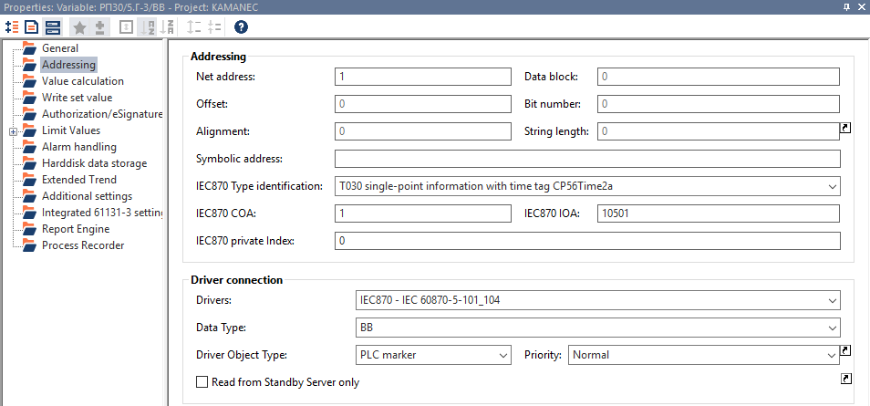

[<- До підрозділу](README.md)

# Основи IEC 60870-5

## Функції систем телемеханіки та стандарти IEC 60870

### Пристрої і системи телемеханіки 

Системи **дистанційного керування** (**telecontrol system**) які на постсовєтському просторі прийнято називати **системами телемеханіки** служать для контролю та керування територіально-розподіленими технологічними процесами. Вони включають усе обладнання та функції для отримання, обробки, передачі та відображення необхідної технологічної інформації.  

Типовий випадок системи телемеханіки зображено на рис.1. З експлуатаційної точки зору система може обслуговувати всю енергомережу або бути розділена на різні рівні відповідальності або навіть на частково або повністю незалежні підсистеми. Локальні системи керування електростанціями зазвичай незалежні від системи дистанційного керування енергетичною мережею, але певна контрольована інформація подається від систем керування електростанціями до системи дистанційного керування енергетичною мережею. І навпаки, певна керуюча інформація, наприклад задані значення для виробництва електроенергії, передається на електростанції (наприклад, у випадку автоматичного регулювання навантаження/частоти).

рис.1. Типова ієрархічна структура системи телемеханіки для мережі передачі та розподілення електроенергії. 

Позначення на схемі (рис.1): 

- MCC (Main control centre) - головний (або національний) пункт керування; 
- RCC (Regoinal control centre) - регіональний або обласний пункт керування; 
- DCC (District control centre) - районний пункт керування; 
- PS (Power Station) - електростанція; 
- трикутник - підстанція (oustation), керована станція (controlled station) або віддалений термінальний пристрій (RTU remote terminal unit);
- подвійна лінія - альтернативний варіант звязку, в якому електростанція може бути керованою або обласним або районним пунктом керування.

Конфігурації системи телемеханіки варіюються від кількох точкових функцій моніторингу та керування до багаторівневих систем, що охоплюють великі розподілені території. Використання комп’ютерних технологій на всіх рівнях системи дозволяє системам та архітектурам телемеханіки  використовувати розподілений інтелект з можливостями попередньої обробки інформації, щоб уникнути надлишкового потоку даних. Для життєво важливих функцій з метою виконання означених вимог доступності та надійності забезпечується резервування. Розширені функції обробки, такі як керування частотою, співвідношення навантаження/частота, аналіз безпеки, оцінка стану та короткострокове прогнозне керування енергією, можуть виконуватися або окремою комп’ютерною системою реального часу, або самою системою телемеханіки, відповідно до вибору архітектури системи. Слід також зазначити, що обладнання та підсистеми часто виробляються різними постачальниками та/або походять від різних поколінь технологій. Таким чином, їх інтеграція в системи дистанційного керування створює проблеми інтерфейсу, які іноді важко вирішити. 

### Стандарти IEC 60870

Стандарти IEC 60870 забезпечують уніфікацію різних способів комунікації в системах телемеханіки. Він має ієрархічну структуру, що складається з шести частин і ряду супутніх стандартів. Кожна частина складається з ряду розділів, кожен з яких публікувався поступово в часі. На додаток до основних частин, є чотири «супутні» стандарти до IEC 60870-5, які містять дрібні деталі стандарту для певної сфери застосування. 

Супутні стандарти розширюють означення, надане основними частинами стандарту, додаючи спеціальні інформаційні об’єкти для сфери застосування. Один з таких "супутніх" стандартів є IEC 60870-5-101, який називається "Супутній стандарт для базових завдань дистанційного керування". Не дивлячись на "супутність" саме цей документ найчастіше мається на увазі, коли в контексті систем SCADA обговорюються стандарти IEC 870 або IEC 60870. Це пояснюється тим, що лише з випуском цього документа було створено повне означення для стеку протоколу передачі SCADA, оскільки саме цей документ надає всі об’єкти даних прикладного рівня, необхідні для роботи SCADA. Тим не менше, хоча IEC 60870-5-101 завершує означення протоколу передачі, він містить багато посилань на деталі, що містяться в розділах 1-5 частини 5. 

Четвертий супутній стандарт, тобто IEC 60870-5-104, сьогодні також має особливе значення для розуміння стандарту, оскільки він означує транспортування  через мережі прикладних повідомлень IEC 60870-5. Його повна назва — "Доступ до мережі за допомогою стандартних транспортних профілів", що стосується використання TCP/IP для транспортних і мережних протоколів. Цей супутній стандарт був опублікований у грудні 2000 року, приблизно через шість років після публікації IEC 60870-5-101. Він, забезпечує зовсім інший фізичний механізм і механізм транспортування даних, ніж IEC 60870-101, але залишає без змін більшість функцій верхнього прикладного рівня та об’єктів даних.

У даній лекції ми не будемо детально зупинятися на розділах стандарту, натомість зосередимося на практичному використанні двох протоколів:

- IEC 60870-5-101, який використовує послідовні інтерфейси зв'язку, та прописаний на канальному рівні; він також відомий як `T101` 
- IEC 60870-5-104, який використовує у якості транспорту TCP/IP; він також відомий як `T104` 

### Напрямки передачі

Важливим поняттям у розумінні обміну відповідно до IEC 60870-5 є різниця між напрямками керування та моніторингу. Передбачається, що вся система має ієрархічну структуру, яка включає централізоване керування. Відповідно до протоколу кожна станція є або **керуючою станцією** (**controlling station**), або **керованою станцією** (**controlled station**). Оскільки ієрархічна структура включає кілька керованих станцій, які керуються однією або кількома керуючими станціями. У такій системі керуючі повідомлення, такі як команди або запити, передаються керуючою станцією, і вони призводять до дій і повертають інформацію, передану керованою станцією. Тому кажуть про напрямки:

- **monitor direction** - **напрямок моніторингу**, передача контрольованих даних від керованої станції до керуючої 
- **control direction** - **напрямок керування**, передача команд від керуючої станції до керованої 

Керуючу станцію часто називають **Ведучою** (**Master**), а керовану - **Веденою** (**Slave**). 

### Функції

Відповідно до стандартів IEC 60870 система телемеханіки повинна забезпечити виконання функцій, які охоплюють особливі потреби технологічного процесу, до якого вона застосовується: дані та команди, які необхідно передавати між керуючими та керованими станціями, і сервісні функції. Основні прикладні функції забезпечують обмін даними, в стандарті вони мають таку назву:

- Телеіндикація (Teleindication) - отримання дискретної інформації про стан (одно-, дво- або багатоточкова).
- Телеметрія (Telemetering ) - отримання аналогових вимірювальних величин.
- Телепідрахунок (Telecounting) - отримання інформації про інтегровані змінні або приріст.

- Телекерування (Telecommand), телепереключення (teleswitching) - передача одинарних або подвійних команд, імпульсні або тривалі команди.
- Телерегулювання та телеуставка (Teleregulation and teleadjusting) - передача неперервно або дискретно змінюваних величин.

Окрім основних функцій, система телемеханіки може забезпечити виконання додаткових функцій оброблення, зокрема: 

- індикація меж; 
- автоматична інтерпретація тривог; 
- відображення станів несправності; 
- відображення сумарних виміряних значень; 
- оцінка стану в режимі реального часу; 
- процедури локалізації несправностей (технологічного процесу та телемеханіки); 
- реєстрація подій у режимі реального часу для поставарійного аналізу ; 
- регулювання навантаження/частоти та економічне керування енергією; 
- моніторинг та аналіз безпеки; 
- відображення інтегрованих виміряних величин; 
- короткостроковий енергетичний менеджмент; 
- оцінка непередбачених обставин; 
- автоматичне скидання та відновлення навантаження; 
- гідротермічна оптимізація та зобов'язання обладнання.

Для виконання прикладних функцій пристрої системи телемеханіки виконують оперативне оброблення, що передбачає правильний збір даних і відповідне представлення, зокрема: 

- узгодження вхідних/вихідних сигналів на межі людино-машинного інтерфейсу; 
- придушення дрижання контактів; 
- виявлення помилкової інформації про стан; 
- перевірка меж вимірювальних величин; 
- перевірка достовірності; 
- перевірка імпульсної зміни; 
- розрахунок інженерних значень вимірюваних величин (масштабування); 
- підсумовування та інші арифметичні дії. 

Сучасні технології дозволяють економічно реалізувати додаткові функції оперативного оброблення в межах станцій збору інформації та концентраторів інформації. Ця процедура називається **попереднім обробленням** (**preprocessing**). Попереднє оброблення може зменшити обсяг даних, що передаються, і може запобігти, особливо в надзвичайних ситуаціях, можливому перевантаженню каналів передачі, центрального процесора та людино-машинного інтерфейсу.

**Телеіндикація** та **телеметрія** передбачає отримання не тільки значень стану а і може супроводжуватися **відміткою часу** який також називають **тегом часу**.  

**Телепідрахунок** передбачає що інтегральні значення надходять на пристрої телемеханіки у формі дискретних кодованих величин або імпульсів приросту, що складаються один з одним у внутрішніх лічильниках. Телепідрахунок означується як передача значень вимірюваних величин, які було проінтегрованих за заданим параметром, наприклад, за часом. Інтегрування може здійснюватись до або після передачі. Якщо інтегрування здійснюється до передачі, використовується термін передача інтегральних значень (transmission of integrated totals). **Інтегральне значення** (**integrated total**) - це величина, проінтегрована за певний період часу. Поточний час та періодичний часовий інтервал послідовного отримання інтегральних значень є параметрами системи. Деякі системи використовують періодичні команди початку опитування інтегральних значень на керуючій станції, а в інших системах періодична активація викликається місцевим джерелом часу (годинником) на керованій станції. Синхронізація за часом підтримується системою телемеханіки або зовнішніми синхронізуючими процедурами, наприклад, прийомом національного (державного) або міжнародного радіосигналу точного часу. Для отримання інформації від лічильників застосовуються два різні методи:

- Отримання інтегральних значень. Керована станція періодично в певний час запам'ятовує (заморожує) інтегральне значення в буферній пам'яті і передає запам'ятовані значення на керуючу станцію. Лічильники продовжують працювати, не скидаючись у вихідний стан. У цьому випадку значення приросту за період розраховується на самій керуючій станції, як різниця між двома послідовно переданими значеннями.
- Отримання інформації про приріст. Керована станція періодично в певний час запам'ятовує (заморожує) інтегральне значення в буферній пам'яті і скидає інтегральні значення в нуль. Ці запам'ятовувані значення передаються на керуючу станцію.

В **телекеруванні** для зміни стану обладнання або процесу використовуються **команди**. Вони можуть ініціюватись оператором SCADA або автоматичними керуючими процедурами на керуючій станції. Це може привести у тому числі до: 

- зміни стану електричних контакторів, роз'єднувачів, вимикачів; 
- пуску або зупинку місцевого процесу керування; 
- виконання кроку в місцевій керуючій послідовності; 
- встановлення точки, межі для сигналів аварій, особливі параметри і т.п.  

Для передачі команд є дві стандартні процедури:

1) пряма (безпосередня) команда (Direct command);
2) команди вибору та виконання (Select and execute command).

**Безпосередня команда** (Direct command) використовується керуючою станцією для прямих операцій керування процесами на віддаленій керовані станції. Прикладна функція на керованій станції перевіряється за умовами безпеки (чи не заблокований), і якщо перевірка позитивна, операція виконується. **Команди вибору та виконання** (Select and execute command) використовуються для підготовки заданої керуючої операції на віддаленій керованій станції, перевірки, що керуюча операція підготовлена правильно а потім відправляється ще одна команда на виконання. Перевірка виконується оператором або процедурою користувача. Керована станція не починає операцію керування, доки не отримає сигнал виконання. 

Є спеціальні команди **двопозиційна команда** (double commands) - це тип команд, які використовуються для керування об'єктами, що можуть мати два незалежні стани, наприклад ввімкнено/вимкнено або відкрити/закрити. Використовуються два біти для передачі стану: один біт використовується для сигналу ON (активація), другий біт — для сигналу OFF (деактивація). Це дозволяє забезпечити чітку ідентифікацію команди та уникнути помилок. Типовий приклад - реле або вимикач:

- 01: команда "Ввімкнути" (ON).
- 10: команда "Вимкнути" (OFF).
- 00: відсутність команди (нейтральний стан).
- 11: заборонений стан (може використовуватися для діагностики помилок).

Перевага подвійної команди в тому, що завдяки використанню двох незалежних бітів зменшується ймовірність некоректного виконання команди через помилку в передачі сигналу. Цей підхід особливо корисний у системах телемеханіки, де критично важлива надійність керування об'єктами.

Завантаження параметрів використовується в системах при зміні на керованій станції заздалегідь означених (встановлених) параметрів, наприклад, значень порогів або меж вимірювань. Зазвичай завантаження параметра виконується у два кроки:

1) Один або більше одного параметра завантажується на керовану станцію відповідною командою завантаження параметра. На керованій станції ці параметри запам'ятовуються, але ще не активні.
2) На другому кроці попередньо завантажені параметри активізуються за допомогою командою активації параметру.

Ці два кроки є обов'язковими, якщо певна кількість параметрів необхідно активувати точно в один час. При завантаженні одного параметра активацію можна поєднати із завантаженням, тобто ці процедури можна виконати в один крок.

### Процедура ініціалізації станцій

Процедура ініціалізації роботи станції потрібна для встановлення станції у правильний робочий стан до того, як розпочнуться телемеханічні операції. Розрізняють холодну та гарячу процедури запуску:

- **Холодний запуск** - це процедура початкового завантаження станції, щоб привести базу даних до поточного стану. Передбачається, що інформація про змінні процесу скинута у вихідний стан до завантаження. 
- **Гарячий запуск** - це процедура перезавантаження станції, яка встановлюється у вихідний стан або повторно активується. Ця процедура означає, що інформацію про змінні процесу, отриману до повторної активації, не буде скинуто. 

Керована станція може встановлюватися у вихідний стан за місцевою командою або на запит з керуючої станції.

## Організація мережі для IEC 60870-5

### Фізична реалізація IEC 60870-5-101

Як вже було зазначено вище, протокол IEC 60870-5-101, який відомий також як профіль T101, базується на стандартних промислових інтерфейсах RS-232, RS-485 та інших, описаних в посібнику [за цим посиланням](../serial/teor.md) з символьним способом передачі. При цьому може використовуватися модемне з'єднання. Профіль T101 означує підтримку таких мережевих конфігурацій або топології (рис.2):

- Точка-точка (Point-to-point)
- Кілька точка-точка (Multiple point-to-point)
- Багатоточкова зірка (Multi-point-star)
- Багатоточкова партійна лінія (Multi-point-party line)
- Багатоточкове кільце (Multi-point-ring)

На схемі квадратні символи позначають керуючі станції, а трикутники позначають керовані станції. Маленькі кружечки в точках з’єднання – це порти.

Рис. 2. Конфігурації мережі

У загальному їх можна звести до двох основних типів: з'єднання точка-точка і багатоточкове. З’єднання «точка-точка» має одну **ведучу станцію** (**master station**) та одну **підстанцію** (**outstation**). Багатоточкова мережа має ведучу станцію, підключену до кількох підстанцій. Конфігурація кільця відрізняється лише тим, що вона включає лінії резервування, надаючи другий порт на ведучій станції, який можна використовувати для зв’язку, якщо кільце розірветься.

У конфігураціях «точка-точка» за умови використання повнодуплексного каналу передавати повідомлення можуть як ведуча станція так і підстанції. У багатоточкових конфігураціях ведуча станція паралельно спілкується з усіма підключеними підстанціями. При цьому підстанції спільно використовують зворотний канал зв’язку, і тому лише одна з них може передавати дані в один момент часу.

Зверніть увагу, що комбінації каналів можуть утворювати ієрархічну мережу, де проміжні RTU можуть діяти як локальні ведучі станції для RTU, підключених до них. Їх іноді називають суб-ведучими станціями (sub-master stations).

### Реалізація зв'язку по канальному рівню IEC 60870-5-101

Канальний рівень в мережах відповідає за передачу даних по каналу зв'язку, а також за те, щоб дані були отримані в повному обсязі та не пошкоджені помилками. Дані передаються у вигляді кадрів (frame), який окрім корисних даних несе додаткову керуючу інформацію, таку як адреса призначення та контрольну суму. Формат кадру, який використовує T101, називається форматом `FT1.2`, він використовує 8-бітну контрольну суму та максимальний розмір кадру 255 байт.

Канальний рівень забезпечує сервіси передачі кадрів запитів, кадрів з підтвердженням так і широкомовних без підтвердження. Існує окремий сервіс канального рівня, що передбачає ініціалізацію каналу зв’язку. Він виконується після того, як станція була в автономному режимі та знову стала доступною. Поки ведена станція знаходиться в автономному режимі, ведуча періодично надсилає функції запиту статусу зв’язку, доки не буде отримано статус відповіді на зв’язок. 

Враховуючи що в профілі T101 передбачається мультиточкові конфігурації передбачається регулювання методу доступу до загального середовища передачі. У стандарті для цього означені спеціальні терміни. Тільки **первинна** (**primary**) станція може ініціювати зв'язок, а **вторинні** (**secondary**) станції повинні зачекати, доки їх не опитує основна станція, перш ніж вони зможуть передавати дані. Точніше ці терміни застосовуються до окремих комунікаційних портів станцій, оскільки в ієрархічній системі проміжна станція (intermediate station) на різних портах може бути як первинною так і вторинною. На рис.3 показуна ієрархічна мережна конфігурація з первинними (P) та вторинними (S) станціями. 

Рис.3 Первинні та вторинні станції

Також в стандарті використовуються терміни «незбалансована передача»  і «збалансована передача», які пов’язані з термінами «первинний» і «вторинний». **Незбалансована передача (unbalanced transmission)** відноситься до конфігурації, де керуюча станція діє як первинна на каналі зв’язку, а одна або більше керованих станцій діють як вторинні станції. Станції не є рівноправними на рівні зв’язку, а отже, є незбалансованими за своїми функціями. У конфігурації на рис.3 для отримання даних керуюча станція (Master sation) повинна отримувати дані від керованих станцій шляхом опитування кожної по черзі. Це тому, що вони не можуть ініціювати передачі самостійно. Перевага незбалансованого зв'язку полягає в тому, що немає можливості колізій між керованими станціями, які намагаються одночасно передати інформацію. 

**Збалансована передача (balanced transmission)** відноситься до конфігурації, коли будь-яка станція на каналі може діяти як первинна, що означає, що вона може ініціювати зв’язок. Ця конфігурація також відома як **однорангові комунікації**. Відповідно до стандарту IEC 60870-5-101 можна збалансувати лише канали «точка-точка», тобто дві станції в одній мережі. У прикладі, що показаний на рис.4 ведуча станція з’єднана через зв’язок «точка-точка» з суб-веденою станцією. Зауважте, що кожна станція для цього каналу може діяти як первинна так і вторинна. Насправді їх можна розглядати як два окремі процеси в кожній станції, що насправді є логікою їх розташування в межах станцій. Зауважте, що фактично існує окреме логічне з’єднання для кожної вторинної станції, і необхідно, щоб первинна реєструвала стан кожного з’єднання.

Рис.4. Збалансовані комунікації

Для багатоточкових каналів з незбалансованою передачею керуюча станція повинна керувати трафіком даних шляхом опитування зовнішніх станцій щодо даних. Лише тоді, коли керуюча або первинна станція на каналі опитує певну вторинну станцію, ця станція може відповісти. Для цього використовуються різноманітні службові поля кадру, зокрема **поле адреси вторинної станції**, яка може мати довжину в один або два октети (8-бітні байти). Кадр, переданий первинною станцією по каналу зв'язку, містить адресу каналу зв'язку вторинної станції, на яку направлено повідомлення. Кадр, переданий вторинною станцією на первинну, містить власну адресу зв'язку. Таким чином, первинна станція зможе визначити, від якої вторинної станції надійшло повідомлення. 

Через незбалансовану передачу необхідно, щоб система опитування була реалізована первинною станцією, щоб означити, чи є дані про зміни, доступні на кожній вторинній станції, адже та не може ініціювати передачу. Щоб досягти цього, керуюча станція циклічно опитуватиме дані кожної вторинної станції. Зазвичай вона опитує дані за допомогою коду функції запит-відповідь, після чого вторинна станція поверне як запитувані дані, так і подієві. Зауважте, що хоча операція опитування виконується канальним рівнем, сама послідовність опитування реалізується прикладним рівнем. 

Для збалансованого зв'язку поле адреси можна не вказувати, бо на кожному кінці каналу є лише одна станція, немає потреби у вторинному процесі на будь-якому кінці для перевірки адреси. Процедури передачі для збалансованої передачі такі ж, як і для незбалансованої передачі. Для збалансованої передачі будь-яка станція на лінії може ініціювати передачу, тому немає потреби в опитуванні станції щодо даних, оскільки вона може надіслати їх безпосередньо, коли вони доступні. Якщо незбалансована передача використовує службу запиту/відповіді для отримання даних користувача від вторинної станції, для збалансованої передачі станція з даними просто використовує сервіс відправлення/підтвердження безпосередньо. 

Таким чином у SCADA-програмах при налаштуванні зв'язку по T101 з контрольованою станцією необхідно вказати параметри послідовного порта, вибрати тип адресації (1-октетний або 2-х октетний) та вказати адресу.      

Рис.5. Приклад налаштування T101 в SCADA zenon

### Організація мережі для IEC 60870-5-104

Загальна схема зв’язку обладнання на базі T104 — це стек протоколів TCP/IP, який є основою для сучасних комп'ютерних мереж, про які можна прочитати в посібнику за [цим посиланням](../../nets/README.md).

Рис. 6 Архітектура IEC 60870-5-104

Адаптація до конкретної мережі за межами маршрутизатора залежить від вибору відповідного пристрою маршрутизатора. Якщо потрібне резервування, це можна забезпечити на рівні мережі через декілька маршрутизаторів у локальній мережі. Для більш високого рівня резервування саме обладнання може бути забезпечене більш ніж одним мережевим підключенням до локальної мережі. 

Пакети TCP доходять до адресата за IP-адресою, як це робиться в усіх мережах IP. Стандартний номер порту призначення дорівнює `2404`. Це номер порту, через який встановлюються з'єднання TCP/IP.

Відповідно до T104 до корисних даних які передаються TCP пакетом добавляються додаткові службові поля (називаються APCI), які включають додаткову службову інформацію, що необхідна для керування пакетами. 

Набір прикладних функцій, означений у T104, є більшою частиною тих, що підпадають під T101. Ці функції ми розглянемо нижче. 

Таким чином у SCADA-програмах при налаштуванні зв'язку по T101 з контрольованою станцією необхідно вказати IP адресу, за необхідності змінити TCP порт. Також можна вказати параметри резервування, що передбачає налаштування адрес резервного підключення та часові параметри.        

Рис.7. Приклад налаштування T104 в SCADA zenon

## Адресація та маршрутизація повідомлень 

Так само як і в більшості мереж, обмін даними між станціями згідно IEC 60870-5 відбувається шляхом передачі повідомлень в пакетах прикладного рівня **ASDU** (application service data unit), які є носіями даних та команд. У свою чергу ASDU передаються кадрами по послідовним інтерфейсам в IEC 60870-5-101, або пакетами TCP/IP в IEC 60870-5-104, як це розглянуто вище.  Стандарт зосереджений саме на такому представленні інформації про обмін, де вказується призначення полів пакетів, та вимоги до обміну, однак для кінцевого користувача ця інформація є надлишковою. У той же час в SCADA-програмах або інших програмних засобах можуть надаватися налаштовувані параметри саме у термінології пакетів та кадрів. Нижче ми будемо розглядати найбільш важливі для користувача властивості без деталізації представленні в пакеті, однак деякі концепції необхідно пояснювати. Надалі в тексті для спрощення прийняття означений в стандарті термін ASDU здебільшого буде називатися просто повідомленням.

Використовуючи канали передачі (канальний рівень для IEC 60870-5-101 та TCP/IP для IEC 60870-5-104) повідомлення приходять фізично на вказаний вузол (пристрій). Однак далі ці повідомлення можуть стосуватися різних підстанцій, якщо цей пристрій може маршрутизувати їх далі. Наприклад RTU може складатися з кількох логічних підстанцій **LRU** (logical remote units, використовується також термін сектор (**sector**). Наприклад на рис.8 `LRU1...LRU4` фізично доступні через `RTU1`.  Тому повідомлення адресуються до керованої станції за допомогою **загальної адреси** (**common address**, **COA**). Ця адреса складається з одного або двох октетів (8-бітних байтів) і означує керовану станцію, до якої адресується пакет. В загальному RTU може розділяти свій адресний простір на кілька LRU, навіть якщо це не буде фізично відокремлена підстанція.  

На рис.8 якщо в пакеті, що фізично прибув до RTU1, вказана загальна адреса `LRU2`, то дані будуть запитувані в `LRU2`. У той же час усі LRU (у цьому прикладі від `LRU 1` до `LRU 4`) можуть бути опитані одночасно за допомогою команди опитування станції із загальною адресою COA рівною `FF` або `FFFF` .  Може бути і інша ситуація, коли один LRU (наприклад `LRU 5+n+m+1` на рис.8) розподіляється між більш ніж однією фізично керованою станцією (`RTU 7` і `RTU 8` рис.8), кожна з яких підключена через окремий фізичний канал. У цьому випадку запит станції необхідно надіслати на кожну станцію фізично керованій станції (`RTU 7` і `RTU 8`), що можна зробити за допомогою широкомовної адреси канального рівня для IEC 60870-5-101 або IP для IEC 60870-5-104. 

рис.8. Ієрархічне розподілення загальних адрес  

У напрямку моніторингу адреса станції, яка повертає дані містить поле своєї загальної адреси COA. Це потрібно для того, щоб дані можна було однозначно ідентифікувати та зіставити з потрібними даними в образах системних даних. Адреса `0xFF` (для однобайтового варіанту) або `0xFFFF` (для двобайтового варіанту) є глобальною. Це означає, що пакет з цією адресою буде сприйматися всіма станціями. Використання глобальної адреси можливе тільки для деяких команд, які треба виконати одночасно, а саме:

| Номер типу об'єкту | Символьне  посилання | Опис                          | Мета                                                      |
| ------------------ | ------------------------- | ----------------------------- | --------------------------------------------------------- |
| `100`              | C_IC_NA_1                 | interrogation command         | Відповісти певним знімком системних даних у звичайний час |
| `101`              | C_CI_NA_1                 | counter interrogation command | Заморозити суматори (totals) в один момент часу           |
| `103`              | C_CS_NA_1                 | clock synchronization command | Синхронізувати годинники                                  |
| `105`              | C_RP_NA_1                 | reset process command         | Скинути команди процесу                                   |

Перелік інших типів об'єктів буде наведено нижче.

У деяких випадках керована станція може сама діяти як керуюча станція, можливо, для опитування ведучої станції щодо даних, або для ініціювання дії в іншій керованій станції (наприклад при шлюзуванні). Це називається операцією у зворотному напрямку. Станція, яка може діяти як в прямому, так і в зворотному напрямку, називається **дворежимною** (dual-mode) або **комбінованою** (**combined**). Коли дворежимна станція видає керуюче повідомлення іншій станції, вона повинна встановити загальну адресу керованої станції. Це необхідно, як і для будь-якого повідомлення напряму керування, щоб призначена станція могла розпізнати повідомлення як направлене до неї. Коли дію буде виконано, буде необхідний подальший зв’язок із керуючою станцією для надсилання повідомлення про підтвердження дії та, можливо, повідомлення про виконання, якщо використовується двофазна робота. Але оскільки повідомлення про вказівки монітора містять адресу керованої станції, це не можна використовувати для направлення зв’язку назад до керуючої станції, яка відправила пакет запиту. Замість цього для цієї мети використовується додаткова адреса, яка вказується в полі **причини передачі** (**cause of transmission, COT**). Ця адреса називається **адреса ініціатора** (**originator address**). Коли пакет керування передається дворежимною станцією, яка не є ведучою станцією системи, ця станція повинна включати ненульове значення в октеті адреси відправника поля причини передачі. Це не впливає на напрямок керування повідомлення, але використовується в напрямку моніторингу для направлення повідомлень підтвердження дії та завершення дії назад до ініціатора. Коли керована станція повертає підтвердження дії або інше повідомлення, що виникає з цього керуючого повідомлення, воно включає адресу ініціатора у відповідь напрямку моніторингу. Відповідальністю будь-яких проміжних пристроїв маршрутизації є розпізнавання ненульової адреси відправника і відправки назад до цього ініціатора.

Оскільки підполе адреси ініціатора має довжину лише один октет, а загальні адреси можуть складатися з двох октетів, зрозуміло, що або будь-які подвійні станції в системі мають бути пронумеровані в діапазоні `<1..255>`, або потрібно використовувати зіставлення між адресами джерела та загальними адресами, якщо вони не входять до цього діапазону.

Слід зазначити, що внаслідок керуючої дії також можуть бути деякі зміни в межах керованої станції, які потрібно передати ведучій станції, а не дворежимній станції, яка ініціювала керуючу дію. Зазвичай вони призначені для передачі зміненого стану системи, а також можуть включати події з тегами часу. Повідомлення, які передають цю інформацію, мають бути направлені до головної станції та, можливо, до інших областей мережі, якщо потрібно. Цим повідомленням надається нульове значення адреси ініціатору. Таким чином, у системі, яка містить дворежимні станції, необхідно використовувати підполе адреси ініціатора, і для всіх повідомлень про напрямок моніторингу, що повертаються до ведучої станції, це поле матиме нульове значення.

Ці поняття проілюстровано на рис.9. Це показує систему з проміжними RTU, які діють як контролери та концентратори даних, і кількома керованими станціями, пов’язаними з ними. Одна із них видає команду одноранговій станції. Як підтвердження дії, так і повідомлення даних про зміну генеруються та направляються до правильних адресатів за допомогою поля адреси ініціатора. 

Рисунок 9. Команда керування видається з дворежимного RTU

Рисунок 10. Підтвердження активації ASDU повернуто до дворежимного RTU

Рисунок 11. Інформація про моніторинг повертається ведучій SCADA

Рисунок 12. Приклад налаштування адрес в SCADA zenon

## Ідентифікація інформаційних об'єктів на станції/секторі

Інформаційні об'єкти в 60870-5 можуть містять як самі дані, або команди так і якісні показники. Додатково за необхідності об'єкти можуть містити відмітки часу. Для означення того які саме дані необхідно прочитати чи передати, а також чи потрібна відмітка часу, необхідно вказати:

- ідентифікатор типу інформаційного об'єкту Type ID
- адреса інформаційного об'єкту

### Типи інформаційних об'єктів  

Ідентифікатори типу інформаційних об'єктів означуються ієрархічними поіменованими посиланнями, які при передачі в пакеті прикладного рівня (ASDU) означуються числовим значеннями. Ці числові значення в діапазоні від 1 до 127 мають стандартні посилання, тоді як діапазон 128..255 не означений стандартом і може використовуватися окремими постачальниками для певних системних ролей (область приватних типів). У діапазоні означень стандартних типів наразі визначено 58 конкретних типів. Вони згруповані, як показано в таблиці 1, яка показує загальні групи та номери ідентифікаційних кодів типу.

Таб.1. Коди типів

| Означені коди типів | Група                                                        |
| ------------------- | ------------------------------------------------------------ |
| 1..40               | Інформація про процес в напрямку моніторингу (від керованої до керуючої станції) |
| 45..51              | Інформація про процес в напрямку керування (від керуючої до керованої станції) |
| 70                  | Системна інформація в напрямку моніторингу                   |
| 100..106            | Системна інформація в напрямку керування                     |
| 110..113            | Параметри в напрямку керування                               |
| 120..126            | Передача файлів                                              |

Для користувача зручно оперувати символьним посиланнями а не числовими типами, тому в стандарті IEC 60870-5-5 прийняті правила ідентифікації типів. Вони забезпечують ієрархічну систему посилань, в якій символьна назва типу формується за шаблоном `X_Y_Z_n`  використовуючи таку структуру:

Таб.2. Принципи ієрархічного найменування посилань

| Рівень | Символ | Опис                                                         |
| ------ | ------ | ------------------------------------------------------------ |
|        |        | **Напрямок та характер даних**                               |
| X      | `M_`   | Контрольована інформація (від керованої до керуючої станції) |
|        | `C_`   | Керуюча інформація (від керуючої до керованої станції)       |
|        | `P_`   | Параметри (від керуючої до керованої станції)                |
|        | `F_`   | Передача файлів                                              |
| Y      |        | **Типи точок вимірювання**                                   |
|        | `_SP_` | Одинарна двійкова точка введення ((Single-point information), має значення `0` або `1` |
|        | `_DP_` | Подвійна двійкова точка введення ( Double-point information), яка може приймати стани від `0` до `3` і зазвичай використовується для сигналізації про стани вимикачів і автоматичних вимикачів. |
|        | `_ST_` | Значення кроку (Step position) в діапазоні від `-64` до `+63`, в основному використовується для відображення положення кроку трансформатора або іншої інформації про положення. |
|        | `_BO_` | Інформація про стан у вигляді двійкового рядка з 32 бітів (Bitstring with 32 bits). Використовується як для вимірювання так і для команд |
|        | `_ME_` | Аналогове вимірювання (Measured value)                       |
|        | `_IT_` | Інтегральні значення (Integrated totals)                     |
|        | `_SC_` | Одинарна команда (Single command) використовується 1 біт. Кожна точка буде статично параметризована в таблиці точок таким чином, що одна точка має бути налаштована для розмикання, а інша для замикання однобітових перемикачів. |
|        | `_DC_` | Подвійна команда (Double command) використовуються 2 біти. Кожна точка буде статично параметризована в таблиці точок таким чином, що одна точка має бути налаштована для розмикання, а інша для замикання двобітових перемикачів. |
|        | `_RC_` | Команда регулювання кроку (Regulating step command)  Зазвичай використовується для надсилання імпульсів до ступінчастого перемикання трансформаторів вгору та вниз. Кожна точка буде статично параметризована в таблиці точок таким чином, що одна точка повинна бути налаштована для підвищення, а інша для зниження положення сходинки трансформатора |
|        | `_SE_` | Команда зміни уставки заданим значенням (Set point command). Використовується для надсилання заданих значень для уставок |
| Z      |        | **Наявність і тип відмітки (тегу) часу**                     |
|        | `_Nx`  | Без тегів часу з типом `x`                                   |
|        | `_Tx`  | З тегами часу з типом `x`                                    |
|        |        | щодо типу даних                                              |
|        | `_yA`  | Тип A з використанням 16-бітного сигналу, значення від `-32768` до `+32767` : статус і нормалізоване (0.0-0.9999), з якістю |
|        | `_yB`  | Тип B з використанням 16-бітного сигналу, значення від `-32768` до `+32767` : масштабоване (`-32768` до `+32767`), з якістю |
|        | `_yC`  | Тип C з використанням 16-бітного сигналу, значення від `-32768` до `+32767` : коротке число з плаваючою комою (32-бітне), з якістю |
|        | `_yD`  | Тип D: нормалізоване (0.0-1.0), без якості                   |
|        | `_yE`  | Тип E: масштабоване (з вказаним діапазоном), значення        |
|        | `_yF`  | Тип F: коротке число з плаваючою комою                       |
| n      |        | Остання цифра за стандартом IEC 60870-5 вказує на номер супутнього стандарту, однак і для T101 і для T104 цифра завжди рівною `1` |

Наприклад, `M_ME_TA_1` — це контрольована інформація, виміряне значення з тегом часу та типом `A`, яке є нормалізованим значенням із якістю.

Таб.3. Посилання на типи

| Номер  типу | Символьне  посилання | Опис (eng)                                                   | Опис (укр)                                 | Примітка                             |
| ---------------- | ------------------------- | ------------------------------------------------------------ | ------------------------------------------ | ------------------------------------ |
|                  | `M_`                      | Контрольована інформація (від керованої до керуючої станції) |                                            |                                      |
| `1`              | M_SP_NA_1                 | single-point information                                     | одно-елементна інформація                  |                                      |
| `2`              | M_SP_TA_1                 | single-point information with time tag with                  | одно-елементна інформація з відміткою часу | з `CP24Time2a`, є тільки для T101    |
| `3`              | M_DP_NA_1                 | double-point information                                     |                                            |                                      |
| `4`              | M_DP_TA_1                 | double-point information with time tag                       |                                            | з `CP24Time2a`, є тільки для T101    |
| `5`              | M_ST_NA_1                 | step position information                                    |                                            |                                      |
| `6`              | M_ST_TA_1                 | step position information with time tag                      |                                            | з `CP24Time2a`, є тільки для T101    |
| `7`              | M_BO_NA_1                 | bitstring of 32 bit                                          |                                            |                                      |
| `8`              | M_BO_TA_1                 | bitstring of 32 bit with time tag                            |                                            | з `CP24Time2a`, є тільки для T101    |
| `9`              | M_ME_NA_1                 | measured value, normalized value                             |                                            |                                      |
| `10`             | M_ME_TA_1                 | measured value, normalized value with time tag               |                                            | з `CP24Time2a`, є тільки для T101    |
| `11`             | M_ME_NB_1                 | measured value, scaled value                                 |                                            |                                      |
| `12`             | M_ME_TB_1                 | measured value, scaled value with time tag                   |                                            | з `CP24Time2a`, є тільки для T101    |
| `13`             | M_ME_NC_1                 | measured value, short floating point number                  |                                            |                                      |
| `14`             | M_ME_TC_1                 | measured value, short floating point number with time tag    |                                            | з `CP24Time2a`, є тільки для T101    |
| `15`             | M_IT_NA_1                 | integrated totals                                            |                                            |                                      |
| `16`             | M_IT_TA_1                 | integrated totals with time tag                              |                                            | з `CP24Time2a`, є тільки для T101    |
| `17`             | M_EP_TA_1                 | event of protection equipment with time tag                  |                                            | з `CP24Time2a`, є тільки для T101    |
| `18`             | M_EP_TB_1                 | packed start events of protection equipment with time tag    |                                            | з `CP24Time2a`, є тільки для T101    |
| `19`             | M_EP_TC_1                 | packed output circuit information of protection equipment with time tag |                                            | з `CP24Time2a`, є тільки для T101    |
| `20`             | M_PS_NA_1                 | packed single-point information with status change detection |                                            |                                      |
| `21`             | M_ME_ND_1                 | measured value, normalized value without quality descriptor  |                                            |                                      |
| `30`             | M_SP_TB_1                 | single-point information with time tag CP56Time2a            |                                            |                                      |
| `31`             | M_DP_TB_1                 | double-point information with time tag CP56Time2a            |                                            |                                      |
| `32`             | M_ST_TB_1                 | step position information with time tag CP56Time2a           |                                            |                                      |
| `33`             | M_BO_TB_1                 | bitstring of 32 bits with time tag CP56Time2a                |                                            |                                      |
| `34`             | M_ME_TD_1                 | measured value, normalized value with time tag CP56Time2a    |                                            |                                      |
| `35`             | M_ME_TE_1                 | measured value, scaled value with time tag CP56Time2a        |                                            |                                      |
| `36`             | M_ME_TF_1                 | measured value, short floating point number with time tag CP56Time2a |                                            |                                      |
| `37`             | M_IT_TB_1                 | integrated totals with time tag CP56Time2a                   |                                            |                                      |
| `38`             | M_EP_TD_1                 | event of protection equipment with time tag CP56Time2a       |                                            |                                      |
| `39`             | M_EP_TE_1                 | packed start events of protection equipment with time tag CP56Time2a |                                            |                                      |
| `40`             | M_EP_TF_1                 | packed output circuit information of protection equipment with time tag CP56Time2a |                                            |                                      |
| `30`             | M_SP_TB_1                 | single-point information with time tag CP56Time2a            |                                            |                                      |
| `31`             | M_DP_TB_1                 | double-point information with time tag CP56Time2a            |                                            |                                      |
| `32`             | M_ST_TB_1                 | step position information with time tag CP56Time2a           |                                            |                                      |
| `33`             | M_BO_TB_1                 | bitstring of 32 bits with time tag CP56Time2a                |                                            |                                      |
| `34`             | M_ME_TD_1                 | measured value, normalized value with time tag CP56Time2a    |                                            |                                      |
| `35`             | M_ME_TE_1                 | measured value, scaled value with time tag CP56Time2a        |                                            |                                      |
| `36`             | M_ME_TF_1                 | measured value, short floating point number with time tag CP56Time2a |                                            |                                      |
| `37`             | M_IT_TB_1                 | integrated totals with time tag CP56Time2a                   |                                            |                                      |
| `38`             | M_EP_TD_1                 | event of protection equipment with time tag CP56Time2a       |                                            |                                      |
| `39`             | M_EP_TE_1                 | packed start events of protection equipment with time tag CP56Time2a |                                            |                                      |
| `40`             | M_EP_TF_1                 | packed output circuit information of protection equipment with time tag CP56Time2a |                                            |                                      |
|                  | `C_`                      | **Керуюча інформація (від керуючої до керованої станції)**   |                                            |                                      |
| `45`             | C_SC_NA_1                 | single command                                               |                                            | тільки для T101 в T104 натомість 58  |
| `46`             | C_DC_NA_1                 | double command                                               |                                            | тільки для T101 в T104 натомість 59  |
| `47`             | C_RC_NA_1                 | regulating step command                                      |                                            | тільки для T101 в T104 натомість 60  |
| `48`             | C_SE_NA_1                 | set point command, normalized value                          |                                            | тільки для T101 в T104 натомість 61  |
| `49`             | C_SE_NB_1                 | set point command, scaled value                              |                                            | тільки для T101 в T104 натомість 62  |
| `50`             | C_SE_NC_1                 | set point command, short floating point number               |                                            | тільки для T101 в T104 натомість 63  |
| `51`             | C_BO_NA_1                 | bitstring of 32 bits                                         |                                            | тільки для T101 в T104 натомість 64  |
| `58`             | C_SC_TA_1                 | single command with time tag CP56Time2a                      |                                            | тільки для T104                      |
| `59`             | C_DC_TA_1                 | double command with time tag CP56Time2a                      |                                            | тільки для T104                      |
| `60`             | C_RC_TA_1                 | regulating step command with time tag CP56Time2a             |                                            | тільки для T104                      |
| `61`             | C_SE_TA_1                 | set point command, normalized value with time tag CP56Time2a |                                            | тільки для T104                      |
| `62`             | C_SE_TB_1                 | set point command, scaled value with time tag CP56Time2a     |                                            | тільки для T104                      |
| `63`             | C_SE_TC_1                 | set point command, short floating point number with time tag CP56Time2a |                                            | тільки для T104                      |
| `64`             | C_BO_TA_1                 | bitstring of 32 bits                                         |                                            | тільки для T104                      |
| `70`             | M_EI_NA_1                 | end of initialization                                        |                                            |                                      |
| `100`            | C_IC_NA_1                 | interrogation command                                        |                                            |                                      |
| `101`            | C_CI_NA_1                 | counter interrogation command                                |                                            |                                      |
| `102`            | C_RD_NA_1                 | read command                                                 |                                            |                                      |
| `103`            | C_CS_NA_1                 | clock synchronization command                                |                                            |                                      |
| `104`            | C_TS_NA_1                 | test command                                                 |                                            |                                      |
| `105`            | C_RP_NA_1                 | reset process command                                        |                                            |                                      |
| `106`            | C_CD_NA_1                 | delay acquisition command                                    |                                            | тільки для T101 в T104 натомість 107 |
| `107`            | C_CD_TA_1                 | delay acquisition command  with time tag CP56Time2a          |                                            | тільки для T104                      |
|                  | `P_`                      | **Параметри (від керуючої до керованої станції)**            |                                            |                                      |
| `110`            | P_ME_NA_1                 | parameter of measured value, normalized value                |                                            |                                      |
| `111`            | P_ME_NB_1                 | parameter of measured value, scaled value                    |                                            |                                      |
| `112`            | P_ME_NC_1                 | parameter of measured value, short floating point number     |                                            |                                      |
| `113`            | P_AC_NA_1                 | parameter activation                                         |                                            |                                      |
|                  | `F_`                      | Передача файлів                                              |                                            |                                      |
| `120`            | F_FR_NA_1                 | file ready                                                   |                                            |                                      |
| `121`            | F_SR_NA_1                 | section ready                                                |                                            |                                      |
| `122`            | F_SC_NA_1                 | call directory, select File, call File, call section         |                                            |                                      |
| `123`            | F_LS_NA_1                 | last section, last segment                                   |                                            |                                      |
| `124`            | F_AF_NA_1                 | ack File, ack section                                        |                                            |                                      |
| `125`            | F_SG_NA_1                 | segment                                                      |                                            |                                      |
| `126`            | F_DR_TA_1                 | directory                                                    |                                            |                                      |

#### Адреса інформаційного об'єкта (Information object address, IOA)

Адреса інформаційного об'єкта (**IOA**) ідентифікує конкретні дані в межах певної станції, вона може мати довжину один, два або три октети. Однак випадок трьох октетів надається лише для того, щоб дозволити структуровані адресні системи, і одній станції дозволено лише 65 536 різних адрес інформаційних об’єктів, як для двооктетної адресації. Нульова адреса інформаційного об'єкта зарезервована для випадку, коли адреса нерелевантна. Адреса інформаційного об’єкта наведена на рисунку 13.

Рис.13. Адреса інформаційного об'єкта в структурі повідолмення

На основі такої системи конкретні дані однозначно ідентифікуються комбінацією загальної адреси COA та адреси інформаційного об’єкта IOA. Прикладом того, як це може працювати на практиці, є наявність кількох ідентичних інтелектуальних електронних пристроїв IED, підключених до суб-головного RTU, який, у свою чергу, підключений до головної станції. Це можуть бути повторні закривачі в системі розподілу. Кожне IED матиме ідентичну внутрішню структуру даних, означену виробником пристрою. Швидше за все, це будуть кілька десятків інформаційних елементів або точок даних, до яких може бути адресована однооктетна адреса інформаційного об'єкта. Однак, оскільки система включає RTU, які мають набагато більше точок даних, у всій системі використовується двооктетна адресація. На рівні конфігурації системи буде єдина модель для цього типу реклосера, і конфігурація кожного пристрою в базі даних системи буде залежати від використання стандартного відображення точок для цього типу пристрою та додавання номера станції до формувати унікальні точкові посилання.

Рис.14. Приклад налаштування змінної в SCADA zenon 

### Біти якості

Блоки даних, що передбачають якість при передачі включають біти якості. Ці біти з’являються як окремі біти в інформаційних елементах, вони встановлюються в одиницю, якщо є відповідна проблема або використовувана функція (блокування, заміна) і їх можна використовувати для розрізнення різних типів ситуацій або проблем, які можуть впливати на дані. Як будуть використовуватися ці біти залежатиме від реалізації. У найпростішому випадку будь-які встановлені біти якості можуть інтерпретуватися як «погане значення», тоді як більш складні підходи можуть диференціювати проблеми за конкретним набором. У таблиці нижче коротко описані ці біти, значення одиниці вказує на причину виникнення.

| Позначення | Назва                | Причина                                                      |
| ---------- | -------------------- | ------------------------------------------------------------ |
| `BL`       | Blocked              | встановлене блокування, значення точки таке ж, як і до блокування; блокування запобігає оновленню значення точки. |
| `SB`       | Substituted          | встановлене значення було замінено значенням-замінником - примусово введено вручну чи іншим чином; тобто значення не є виміряним прямим способом |
| `NT`       | Not topical          | значення не було успішно оновлено під час останнього оновлення |
| `IV`       | Invalid              | значення не можна використовувати, оскільки воно може бути неправильним через несправність або інший ненормальний стан |
| `OV`       | Overflow bit         | значення виходить за межі означеного діапазону: переважно використовується з аналоговими чи лічильними значеннями |
| `EI`       | Elapsed time invalid | значення інтервалу часу, що минув, недійсне; використовується з подіями захисного обладнання. |

### Відмітка часу

Передача даних з відміткою часу дає можливість отримати точні значення часу зміни контрольованої величини. Для типів що передають відмітку часу разом зі значенням вона може передаватися в форматі тегів часу 2-х байтової `CP16Time2a`, 3-х байтової послідовності `CP24Time2a`  або семибайтової `CP56Time2a`.

Тег часу `CP56Time2a` містить астрономічний час в повному форматі. 

Тег часу типу `CP24Time2a` містить лише `mm:ss.ms` і використовується для мітки часу змінної, за допомогою якої станція отримувач використовує власний годинник, щоб доповнити відсутню інформацію. Даний формат не підтримується в T104, тому типи  

Тег часу типу `CP16Time2a` використовується для вказівки додаткового відносного часу, наприклад часу спрацювання реле захисту після команди, або тривалість роботи захисту.

## Ініціювання передачі

Однією з особливостей обміну даними в системах телемеханіки є їх велика кількість. Передача даних в напрямку моніторингу може ініціюватися:

- спорадично, за зміни стану на керованій станції, наприклад положення вимикачів чи значення вимірювальної величини
- за запитом від керуючої станції
- циклічна передача, коли дані від керованої станції передаються періодично   

Також може комбінуватися. 

Збір даних за допомогою опитування використовується в системах SCADA, що працюють з небалансними процедурами передачі даних, щоб отримати на керуючій станції дійсний стан змінних процесу керованої станції. При цьому керована станція відсилає дані тільки коли її опитує керуюча станція.

Циклічна передача даних виконується з низьким пріоритетом, що означає, що вона може бути перервана запитом зв'язку з появою подій. Керована станція циклічно записує дійсні значення змінних величин процесу у буферну пам'ять. Далі значення буферної пам'яті передаються до керуючої станції з циклічними інтервалами. 

Для передач повідомлень на керованій станції має бути буфер, щоб зберегти події, які можуть виникати швидше, ніж відбувається їхнє пересилання на керуючу станцію. У балансних системах передача подій із заданим пріоритетом перериває циклічну процедуру передачі з нижчим пріоритетом.
У небалансних системах процес передачі на керуючу станцію повинен чекати на запит з неї

## Емулятори клієнтів та серверів

- https://github.com/med7at69/IEC104-RTU-Simulator - на python
- https://elseta.com/the-vinci-software/ 

Це не завершена лекція.

Теоретичне заняття розробив [Олександр Пупена](https://github.com/pupenasan). 

Про проект народного посібника "Автоматизація технологічних процесів та виробництв" і як допомогти проекту читайте [у описі проекту](../../README.md)

