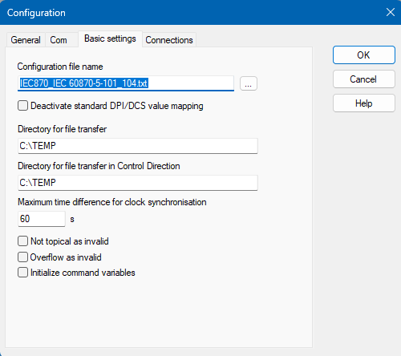
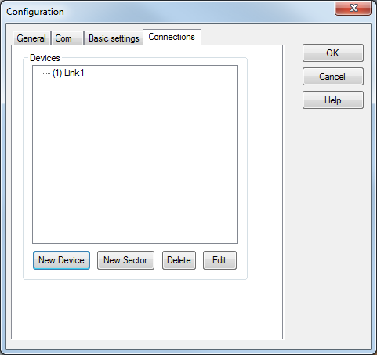
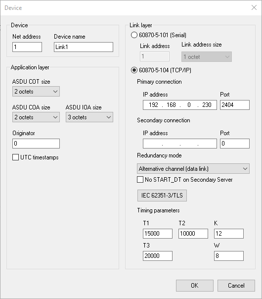
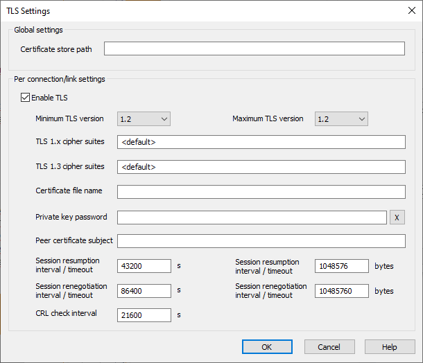
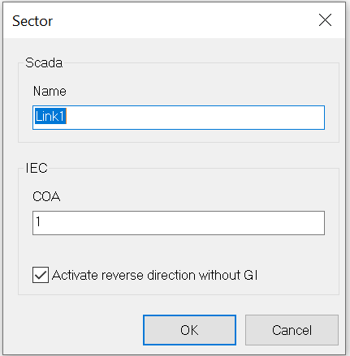
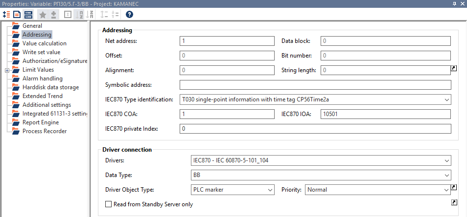
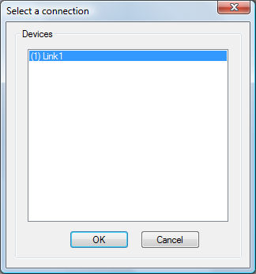
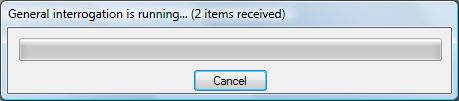
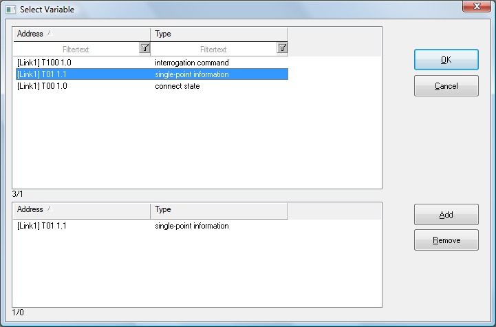

[<- До підрозділу](README.md)

# Налаштування драйверу IEC 60870 в SCADA zenon

Цей теоретичний матеріал розрахований для людей, які знайомі з принципами роботи IEC 60870 та SCADA zenon. З теоретичними основами протоколів можна ознайомитися в цій [лекції](teor.md), з SCADA zenon можна познайомитися в підрозділах [SCADA HMI](../../scadahmi/README.md),  

## Загальні налаштування

На рис.1 показані загальні налаштування драйверу IEC 60870 в SCADA zenon. Розглянемо ці налаштування. 

рис.1. Вікно конфігурування IEC 60870 в SCADA zenon

Опція `Deactivate standard DPI/DCS value mapping` вливає на спосіб відображення подвійних точок вимірювання (див також Відображення значень подвійної точки (double point)) 

- Не виставлена (за замовчуванням): значення подвійних повідомлень (DPI та DCS) налаштовані відповідно до операційних елементів zenon. Використовуйте цю конфігурацію, якщо необхідно використовувати функціональні можливості zenon Energy Edition. Драйвер перетворює значення подвійних повідомлень (DPI та DCS) для Service Engine: `intermediate` | `off` | `on` | `fault` в : `2` | `0` | `1` | `3` , так що в Service Engine значення 0 означає, наприклад, OFF , а 1 означає ON.

- Виставлена: значення подвійних повідомлень пересилаються до zenon точно такими, якими вони є: `intermediate` | `off` | `on` | `fault`
  = `0` | `1` | `2` | `3`.  Однак у цьому випадку не можна використовувати обробку команд, наприклад, для запису подвійних повідомлень.

Варто зауважити, що драйвер перетворює лише значення змінної, яке відповідає діапазону значень DPI/DCS. DPI/DCS складається, згідно зі стандартом, з 2 бітів; всі інші біти змінної не передаються.

Поле `Directory for file transfer` містить шлях на комп’ютері Service Engine, у якій мають зберігатися файли, які отримуються веденим пристроєм IEC60870 (GET).

Поле `Directory for file transfer in Control Direction` містить шлях до папки, в якій знаходяться файли, які надсилаються (PUT) на ведений пристрій IEC60870.

Значення `Maximum time difference for clock synchronisation` встановлює максимальне відхилення часу, яке запускає синхронізацію часу у системі zenon. Якщо драйвер отримує `ASDU<103>` (у зворотному напрямку) з часом, відмінним від установленого на локальному ПК, і різниця отриманого часу менша за значення, встановлене для цієї властивості, драйвер змінює час на локальному ПК. Якщо різниця в часі перевищує встановлене значення, драйвер не синхронізує годинник ПК. Встановлення значення 0 запобігає синхронізації часу на ПК у зворотному напрямку. За замовчуванням: 60 с

Опція `Not topical as invalid` вказує чи треба відобразити стан змінної IEC 870 біт `NT_870` (`not topical`) у змінну zenon .

- вситавлена: якщо драйвер zenon отримує змінну IEC 870 зі статусом `Not Topical`, для змінної zenon також встановлюється біт стану 18 (`INVALID`). У результаті змінна відповідно позначається під час відображення в Service Engine, якщо в конфігурації проекту активовано властивість елемента `Display status of variable`.
- не виставлена: біт статусу `INVALID` також не відображається на змінній zenon.

Опція `Overflow as invalid` вказує чи треба відобразити біт статусу змінної IEC 870 `OV_870` (`Overflow`) у змінну zenon.

- виставлена: якщо драйвер zenon отримує змінну IEC 870 зі статусом `Overflow`, для змінної zenon також встановлюється біт стану 18 (INVALID). У результаті змінна відповідно позначається під час відображення в Service Engine, якщо в конфігурації проекту було активовано властивість `Display status of variable`

- не виставленя: біт статусу INVALID також не відображається на змінній zenon.

Опція `Initialize command variables` вказує чи Ініціалізувати командні змінні IEC870 значенням і бітом стану.

- виставлена: під час ініціалізації всім змінним команди (ідентифікатор типів `45–63`) присвоюється значення `0` із активованим бітом стану `NT`. Якщо активовано `remanent image`, значення командних змінних зберігаються, а їхні значення та статуси відновлюються під час запуску.

- не виставлена: командні змінні ініціалізуються без значення та біта стану.

## Налаштування Connections

Налаштування передбачає дворівневу архітектуру, де на верхньому рівні розміщені пристрої, до яких треба підключатися (Devices), а на нижньому логічні сектори (Sectors).

- Devices
- Sectors. Увага: налаштовані сектори повинні бути присутніми в ПЛК.

### Device

Підключення до Пристрою складається з підключення фізичного пристрою та кількох секторів загальної адреси ASDU в цьому пристрої. Як і будь який пристрій в zenon кожен пристрій IEC 870 ідентифікується через логічний `Net address`. Він у свою чергу відповідає зв'язаний з налаштовуваним для протоколу `Link address` або IP-адресу.

`Device name` - назва пристрою, що відображається у списку пристроїв. Також під час онлайн-імпорту це ім’я стає частиною імені імпортованої змінної.

Опція `Reverse Direction` - означує, чи активний зворотний напрямок для цього підключення. 

- виставлена: змінні надсилаються у зворотному напрямку. `EOI` не надсилається, доки не буде встановлено з’єднання, включаючи загальний запит для всіх з’єднань.
- знято (за замовчуванням): немає зв'язку у зворотному напрямку.

### Application layer

У цій частині налаштовуються опції для прикладного рівня драйвера. Тут необхідно виставити конфігурацію, яка співпадає з пристроєм, до якого відбувається підключення. Якщо конфігурація неправильна, то зв’язку з пристроєм не буде.

- `ASDU COT size` - Означує довжину COT (причина передачі). Вибір розміру адреси з розкривного списку. Для типу з’єднання 60870-5-104 (TCP/IP), відповідно до стандарту очікується значення 2 октети .

- `ASDU COA size` - Означує довжину COA (загальна адреса об’єкта/загальна адреса ASDU). Якщо для рівня зв’язку вибрано тип з’єднання 60870-5-104 (TCP/IP), відповідно до стандарту очікується значення 2 октети .

- `ASDU IOA size` - Вибір розміру адреси IOA (Адреса інформаційного об'єкта). Якщо для рівня зв’язку вибрано тип з’єднання 60870-5-104 (TCP/IP),  відповідно до стандарту очікується значення 3 октети.

- `Originator` - ідентифікаційний номер головного пристрою IEC60870 (від 0 до 255), який надсилається пристрою при надсиланні команд, щоб той міг визначити від якого Ведучого пристрою прийшла команда і кому відповідно передавати відповідь (якщо через цю комунікацію передають дані кілька Ведучих).  Це значення відправника надсилається тільки в тому випадку, якщо для ASDU COT-Size налаштовано значення 2 октети. Типове значення: 0. Якщо для ASDU COT-Size налаштовано значення 1 октет, поле неактивне. 

- `UTC Timestamps` - якщо прапорець виставлений для команди очікується або використовується позначка часу у форматі UTC (наприклад, синхронізація часу `T103`), інакше сприймається як місцевий час відповідно до стандарту. Згідно стандарту IEC60870 всі компоненти повинні використовувати місцевий час а не UTC.

### Link layer

У цій частині налаштовуються зв’язок з послідовним портом або через TCP/IP. Варто зауважити що у контексті IEC104 процедури сеансу та безпеки побудовані над транспортним рівнем (TCP), тоді як у IEC101 процедури сеансу та безпеки побудовані над канальним рівнем.

Для IEC101 вказується адреса пристрою через  `link adsress`. 

Для IEC104 вказується IP адреса та порт. Якщо передбачається резервування, то додаткові налаштування вказуються в `Secondary Connection`.    При цьому вказується `Redundancy mode`, який означує тип зв'язку з основним і резервним сервером у разі резервування. Тут є кілька варіантів:

- `Alternative channel (data link)`  - спочатку встановлюється з'єднання з Веденим, якщо з'єднання переривається і повторне з'єднання не вдається, встановлюється з'єднання з другим Веденим. Дане налаштування не відповідає стандарту 

- `Acc. IEC 60870-5-104 Ed. 2(data link)` - відбувається підключення до обох налаштованих IP-адрес які утворюють групу резервування.
  Ця поведінка означена стандартом IEC 60870-5-104, версія 2.0. Її треба виставляти лише за умови що пристрій підтримує вказівки версії 2.0 щодо резервування підключення. 
- `Both channels active (application)` - драйвер обмінюється даними одночасно з основною та резервною IP-адресами. Отримані значення приймаються обома з’єднаннями та надсилаються до середовища виконання zenon. Телеграми в командному напрямку завжди надсилаються на обидва з'єднання. Для цього режиму резервування є також опція `No START_DT on Secondary Server`, яка вказує на необхідність обміну з резервним сервером у режимі резервування серверів zenon. Якщо опція встановлена то обмін даними здійснюється лише з основним сервером, за винятком тестових кадрів. START_DT не надсилається на вторинний сервер, поки він не стає основним. Якщо знята то дані передаються і на резервний сервер.  

Група налаштувань `Timing parameters` призначена для виставлення часових параметрів:

- `T1` - час очікування у мілісекундах для підтвердження надісланих кадрів. Якщо протягом `T1` кадр ASDU або APCI не підтверджується, це вважається помилкою з’єднання. Діапазон значень: 0 - 4294967295 Типове значення: 15000 мс

- `T2` - час очікування в мілісекундах, протягом якого має відбутися підтвердження через S-кадр (APCI), якщо не було обміну даними (через ASDU). Діапазон значень: 0 - 4294967295. За замовчуванням: 10000 мс. Відповідно до стандарту IEC 60870-5-104, `T2` має бути меншим за `T1` і однаковим на Ведучому та Веденому.

- `T3` - час очікування у мс для тестових кадрів - періодичних U-кадрів (APCI) для тестового етапу підключення, якщо немає обміну даними (через ASDU). Діапазон значень: 0 - 4294967295. За замовчуванням: 20000 мс. Процедура перевірки відбувається у фоновому режимі. Якщо кадр `TestFR` не підтверджено протягом `T1`, це вважається помилкою підключення. Тому доцільно встановити `T3` > `T1`. Виняток: для резервних з’єднань відповідно до версії 2.0 стандарту IEC 60870-5-104 рекомендується скоротити `T3` на стороні Ведучого (наприклад, 5s).

- `K` - максимальна кількість I-кадрів, для яких ще не отримано підтвердження. Якщо кількість `k` невиконаних підтверджень перевищено, це розпізнається як помилка підключення. Діапазон значень: 0 - 4294967295 За замовчуванням: `12` . 

- `W` – максимальна кількість I-кадрів, отриманих до моменту відправлення підтвердження. Значення `w` має бути менше `k`. Діапазон значень: 0–4294967295. Типове значення: `8`.  

Зверніть увагу, що Ведучий і Ведений  мають використовувати однакове значення `w` і`k`!  У мережах швидкого Ethernet може бути доцільним збільшити параметри `k` і `w` (у Ведучому та Веденому) в  `10` або `100` разів, наприклад. `k=120`, `w=80`. Це може збільшити продуктивність.

Зверніть увагу. Відповідно до стандарту IEC 60870-5 підлеглий пристрій 870 для кожного сектора (COA) і напрямку передачі (напрямок моніторингу або управління) може мати лише один інформаційний об’єкт (IO) з певною адресою IOA. Значення IO може, залежно від причини передачі (COT), передаватися в повідомленнях ASDU з тегом часу або без нього. Приклад: передача виконується один раз як T01 на основі загального запиту, потім як T02 або T30 у разі спонтанної зміни значення. Усі ці три ідентифікатори типу є одноточковою інформацією з міткою часу (тегом часу) або без неї. Таким чином, ці три ідентифікатори типу сумісні один з одним. Проте IO не повинен змінювати кодування значення, наприклад, з T01 - single на T03 - double. Якщо в драйвері IEC870 (основному) створено декілька змінних, які мають однакові COA , IOA та напрямок передачі, це може призвести до небажаних дій у zenon. Приклад: підтримується така поведінка:

- Дві змінні: сигнал T01 (напрямок моніторингу) і команда T45 (напрямок керування) з однаковою адресою COA та IOA. Зазвичай і рекомендовано, щоб команда та відповідь від інформаційного об’єкта мали однакові адреси COA та IOA.

- Змінна T01: містить значення інформаційного об’єкта з міткою часу або без неї. Драйвер передасть значення та мітку часу (якщо доступна) з ASDU з T01 (інформація про значення), або T02, або T30 (події з тегом часу) до змінної. Таким чином, для змінних, створених через онлайн-імпорт, немає необхідності вручну змінювати властивість Type ID на IO з тегом часу. (через онлайн-імпорт означає загальний запит, який надсилає IO без мітки часу.)

Наведене нижче підтримується обмежено: Кілька змінних з різними ідентифікаторами типу в напрямку передачі з однаковою адресою COA та IOA.
Якщо виникає ASDU із COA та IOA, то отримане значення, біти стану та позначка часу передаються до всіх змінних із цим COA/IOA та ідентифікаторами сумісного типу. Ви можете знайти список ідентифікаторів типів, для яких є 3 сумісні варіанти, у вузлі  Allocation of the data types node.
Примітка: це стосується zenon версії 8.10. У попередніх версіях значення надавалися лише одній зі змінних, а всі інші змінні з адресацією ігнорувалися.

Параметри `TLS settings` задаються в окремому вікні.

### Sector

Кожен `Device` може містити декілька секторів. Сектор ідентифікується за допомогою його загальної адреси об’єкта (`COA`), яка також називається загальною адресою ASDU і може містити кілька точок даних — інформаційних об’єктів (IO).

Для кожного `Device` має бути означено принаймні один `Sector`. Драйвер ігнорує всі ASDU (кадри з даними), які надсилає `Device`  (підлеглий пристрій 870), якщо ASDU містить `COA`, який не належить до жодного попередньо означеного Сектора. Починаючи зв’язок із Пристроєм, драйвер надсилає загальний (станційний) запит - `C_IC_NA_1` - виключно для COA означених секторів.

COA - Загальна адреса об’єкта, також відома (в IEC 60870-5-101 7.2.4) як загальна адреса ASDU, за допомогою якої адресується сектор. Цей номер видається виробником пристрою (870 slave), знаходиться в області 1..254 (`0xFE`) або 1..65534 (`0xFFFE`), залежно від розміру CAO slave. Примітка: COA `0xFF`(`FF`) інтерпретується деякими Веденими як широкомовна трансляція. Усі сектори, налаштовані в діалоговому вікні драйвера (COA), повинні бути присутніми в пристрої! Якщо означено сектор, який не існує в Веденому пристрої, початковий загальний запит (`C_IC_NA_1`) не буде виконано.

## Змінні та обмін даними 

### Налаштування адреси змінних

Окремі точки даних – інформаційні об’єкти – адресуються через вказівку:

- COA (загальна адреса об’єкта = загальна адреса ASDU) що вказує на сектор на Пристрої, у якому знаходяться дані 
- ідентифікацією типу інформаційного об'єкту IEC 60870 (Type identification), який означує потрібну функцію (що робити з даними) та можливі значення змінної (див. список сумісності). Усі типи мають номери, в налаштуваннях змінної для вказівки типу використовується формат `Tx`, де `x` - номер типу 
- IOA (інформаційна адреса об’єкта) означує зсув даних у цьому секторі

Для створення змінних, які відображають інформаційні об’єкти з ідентифікацією типу<1..37>, драйвер підтримує онлайн-імпорт.

Для змінних zenon налаштування адреси для IEC870 відрізняється від налаштування інших змінних. Такі поля як `Data block` , `Offset` , `Alignment`, `Bit number` , `Driver connection/Priority`, не застосовні, натомість використовуються спеціальні властивості, характерні для цього драйверу. Властивості `Name` та `Identification` мають ті самі призначення як і для змінних інших драйверів. `Net address` - аналогічно до інших типів підключення, це логічна адреса пристрою для вказівки підключеного пристрою. Нижче наведені властивості, характерні змінним саме для цього типу драйверу.

- `IEC870 Type identification` Означує напрямок зв’язку, тип і функцію змінної відповідно до специфікації IEC 60870. Можна надати ідентифікатор типу `with time tag` та  `with time tag CP56Time2a` та без мітки часу в діапазоні `T01..T37`. Наприклад, якщо змінну було створено з типом одноточкової інформації `T01`, драйвер може приймати від пристрою як значення без мітки часу для неї, так і з нею, тобто `T02` або `T30`. У zenon значення, які отримані з міткою часу записують цю мітку часу як мітку часу змінної zenon. Примітка, Type ID `T00` (`Internal state`) передбачено для додаткових, специфічних для драйвера функцій.

- `IEC870 COA` - загальна адреса об'єкта (загальна адреса ASDU), яка вказує на сектор пристрою, в якому знаходиться змінна. 

- `IEC870 IOA` - Адреса інформаційного об'єкта, тобто зміщення змінної в межах сектора (COA). Діапазон значень IOA залежить від розміру IOA ASDU: від 0/1 до 255, або 65535, або 16777215 (розмір IOA 3 октети). Для інформаційних об’єктів з ідентифікацією типу `1..64` значення `0` IOA не має значення відповідно до стандарту IEC 60870.

- `IEC870 private Index` - ця властивість стосується лише змінних із ідентифікатором типу в приватному діапазоні, наприклад `T160`. Типове значення: `0`

- `Driver connection/Driver Object Type` - Тип об'єкта змінних. Залежно від драйвера, який використовується, вибирається під час створення змінної та може бути змінений тут. За замовчуванням: `PLC marker`

- `Driver connection/Data Type` - Тип даних змінної. 

- `Read from Standby Server only` -  Джерело значення змінної для відображення в zenon, якщо проект використовується в резервній мережі zenon. Якщо опція виставлена, то змінна візуалізує значення з драйвера, який працює на резервному сервері. Значення з основного сервера не відображаються.

### Об'єкти драйверу

Об’єкти драйвера – це області, які доступні в пристрої. Нижче наведено, які об’єкти драйвера надаються драйвером і які типи даних IEC можна призначити відповідним об’єктам драйвера. 

| Тип об'єкта драйвера  | Тип  каналу | Читання                                                      | Запис                                                        | Підтримувані типи                                       | Comment                                                      |
| --------------------- | ----------- | ------------------------------------------------------------ | ------------------------------------------------------------ | ------------------------------------------------------- | ------------------------------------------------------------ |
| PLC marker            | 8           | Значення та біти стану командної змінної оновлюються під час отримання ASDU з підтвердженням (COT_actcon(7) та/або COT_actterm(10) тощо). | Драйвер підтримує зв'язок у зворотному напрямку для змінних `T30` і `T31` з активною властивістю `write set value`. | BOOL, SINT, USINT, INT, UINT, DINT, UDINT, REAL, STRING | Змінні, які відповідають інформаційним об’єктам у пристрої та мають `T00` (внутрішній стан). Ідентифікатор типу: -`1..37`, `126`, `136..141` – отримання/читання -`45..103`, `122`, `160` – запис |
| Communication details | 35          | +                                                            | +                                                            | BOOL, SINT, USINT, INT, UINT, DINT, UDINT, REAL, STRING | Змінні для статичного аналізу комунікації; Значення передаються між драйвером і Service Engine, а не до пристрою. Примітка: адресація та поведінка однакові для більшості драйверів zenon. |

Термін `channel type` є внутрішнім числовим описом типу об’єкта драйвера. Він також використовується для розширеного імпорту/експорту змінних DBF. `channel type`  використовується для розширеного імпорту/експорту CSV змінної в стовпці `HWObjectType`.

### Відображення типів даних: загальна інформація

Відображення типів даних з ПЛК на типи даних zenon

| IEC 60870 short name                    | ASDU Type ID | Data type | Кодування значення (відповідно до IEC 60870) / коментар      | Data type  |
| --------------------------------------- | ------------ | --------- | ------------------------------------------------------------ | ---------- |
| M_SP_NA_1                               | 1            | BOOL      | SPI <0..1>single-point information                           | 8          |
| M_SP_TA_1                               | 2            | BOOL      | SPI single-point information with time tag (CP24Time2a)      | 8          |
| M_SP_TB_1                               | 30           | BOOL      | SPI single-point information with time tag (CP56Time2a)      | 8          |
| M_DP_NA_1                               | 3            | USINT     | DPI <0..3> with Mapping of Double Point Values double-point information | 9          |
| M_DP_TA_1                               | 4            | USINT     | DPI with Mapping of Double Point Values (CP24Time2a)         | 9          |
| M_DP_TB_1                               | 31           | USINT     | DPI with Mapping of Double Point Values (CP56Time2a)         | 9          |
| M_ST_NA_1                               | 5            | USINT     | Corresponds to whole VTI (IEC60870-5-101 7.2.6.5). Bit 8 is the Transient bit.step position information | 9          |
| M_ST_TA_1                               | 6            | USINT     | VTI (CP24Time2a)                                             | 9          |
| M_ST_TB_1                               | 32           | USINT     | VTI (CP56Time2a)                                             | 9          |
| M_BO_NA_1                               | 7            | UDINT     | BSI (32 bits)bitstring of 32 bits                            | 4          |
| M_BO_TA_1                               | 8            | UDINT     | BSI (CP24Time2a)                                             | 4          |
| M_BO_TB_1                               | 33           | UDINT     | BSI (CP56Time2a)                                             | 4          |
| M_ME_NA_1                               | 9            | REAL      | NVA <–1..+1 –2–15>, in practice <-1..0,9999>measured value, normalized value | 5          |
| M_ME_TA_1                               | 10           | REAL      | NVA (CP24Time2a)                                             | 5          |
| M_ME_TD_1                               | 34           | REAL      | NVA (CP56Time2a)                                             | 5          |
| M_ME_NB_1                               | 11           | INT       | SVA <–215..+215–1> = <-32768..32767>measured value, scaled value | 1          |
| M_ME_TB_1                               | 12           | INT       | SVA (CP24Time2a)                                             | 1          |
| M_ME_TE_1                               | 35           | INT       | SVA (CP56Time2a)                                             | 1          |
| M_ME_NC_1                               | 13           | REAL      | R32measured value, short floating point number               | 5          |
| M_ME_TC_1                               | 14           | REAL      | R32 (CP24Time2a)                                             | 5          |
| M_ME_TF_1                               | 36           | REAL      | R32 (CP56Time2a)                                             | 5          |
| M_IT_NA_1                               | 15           | DINT      | BCR.Counter reading <-231..+231-1>integrated totals          | 3          |
| M_IT_TA_1                               | 16           | DINT      | BCR.Counter reading (CP24Time2a)                             | 3          |
| M_IT_TB_1                               | 37           | DINT      | BCR.Counter reading (CP56Time2a)                             | 3          |
| C_SC_NA_1                               | 45           | BOOL      | SCSsingle command                                            | 8          |
| C_SC_TA_1                               | 58           | BOOL      | SCS (CP56Time2a)                                             | 8          |
| C_DC_NA_1                               | 46           | USINT     | DCS with Mapping of Double Point Values double command       | 9          |
| C_DC_TA_1                               | 59           | USINT     | DCS (CP56Time2a) with Mapping of Double Point Values         | 9          |
| C_RC_NA_1                               | 47           | USINT     | RCSregulating step command                                   | 9          |
| C_RC_TA_1                               | 60           | USINT     | RCS (CP56Time2a)                                             | 9          |
| C_SE_NA_1                               | 48           | REAL      | NVAset point command, normalized value                       | 5          |
| C_SE_TA_1                               | 61           | REAL      | NVA (CP56Time2a)                                             | 5          |
| C_SE_NB_1                               | 49           | INT       | SVAset point command, scaled value                           | 1          |
| C_SE_TB_1                               | 62           | INT       | SVA (CP56Time2a)                                             | 1          |
| C_SE_NC_1                               | 50           | REAL      | R32set point command, short floating point number            | 5          |
| C_SE_TC_1                               | 63           | REAL      | R32 (CP56Time2a)                                             | 5          |
| C_BO_NA_1                               | 51           | UDINT     | BSI (32 bits)bitstring of 32 bits command                    | 4          |
| C_BO_TA_1                               | 64           | UDINT     | BSI (CP56Time2a) (32 bits)                                   | 4          |
| C_IC_NA_1                               | 100          | BOOL      | 1 during execution(general) interrogation command            | 8          |
| C_CS_NA_1                               | 103          | BOOL      | 1 during executionclock synchronization command              | 8          |
| C_RP_NA_1                               | 105          | USINT     | QRP reset process command                                    | 9          |
| F_SC_NA_1                               | 122          | STRING    | Command for file transfer, for example “DIR” or “GET”        | 12         |
| F_DR_TA_1                               | 126          | STRING    | Response variable for file transfer "DIR" result             | 12         |
| private range, in monitoring direction  | 135..141     | Numerical | Addressing for Siemens-specific private Type ID area: -135 - USINT, a diagnosis byte from error telegram with component sums. -136 - USINT, a DPI. From received ASDU, the driver also maps the 2-bit fields to the value of the variable:Bit SL (switching action running) - PROGRESS status bit.Bit SF (switching case) - CB_TRIP status bit.If the CB_TR_I status bit is set for the variable, the bit SF is ignored. -137 - BOOL x 16; the array with SPI, with IEC870 private Index: 0..15. -138 - USINT x 8; the array with DPI, with IEC870 private Index: 0..7. -139 - USINT x 4; the array with DPI with SF and SL bits; with IEC870 private Index: 0..3. 140 - DINT - as M_ME_TE_1 (T35) but with double length (4 bytes). -141 - UINT - as M_BO_TB_1 (T33) but with only the half of the length (bitstring with 16 bits). | 9, 8, 3, 2 |
| private range, in controlling direction | 160          | BOOL      | Command with factor and time stated in Siemens-specific private Type ID area, Variable with IEC870 private Index: property  - 0..15 - index is command number; with factor 0, time 0; - Index 100..115 - corresponds to command number 0..15 with factor 20, time 0; - Index 150..165 - command number 0..15 with factor 30, time 0. | 8          |

- Тег часу CP24Time2a містить лише mm:ss.ms; використовується для мітки часу змінної, за допомогою якої драйвер використовує годинник ПК, щоб доповнити відсутню інформацію. Якщо значення хвилин вище, ніж на годиннику ПК, драйвер автоматично повертає час на одну годину назад.
- Для мітки часу змінної використовується  тег часу CP56Time2a використовується .
- Тип ID приватної зони (private range) - це типи, які не передбачені стандартом IEC 60870, тому залежать від виробника. Драйвер підтримує підгрупу приватних форматів контролерів Siemens.

- ASDU Type ID: Ідентифікація типу IEC60870-5-101, відповідає властивості змінної «Ідентифікація типу IEC870».
- Data type - номер ідентифікатору типу zenon

У напрямку керування драйвер надсилає ASDU з точним ідентифікатором типу змінної, для якої відбувся запис встановленого значення. Пристрій надсилає назад ASDU з підтвердженням виконання команди. Драйвер оцінює ASDU для всіх змінних з однаковою адресацією (COA та IOA) та ідентичним ідентифікатором типу. 

У напрямку монітора драйвер розподіляє значення, мітку часу та біти стану всім змінним, у яких COA та IOA відповідають адресації отриманого повідомлення ASDU, якщо ідентифікація типу в ASDU сумісна з властивістю Type ID змінної.

Ідентифікатори типів (у діапазоні `T01..T37`), які відрізняються лише кодуванням інформації про час (тег часу), сумісні. У таблиці типів даних IEC ідентифікатори типу мають однакову ідентифікацію для кодування значення, наприклад: DPI.

Якщо змінну було створено з ідентифікатором типу в діапазоні `T01..T37`, драйвер приймає для неї значення з міткою часу та без мітки часу від пристрою, наприклад ASDU типу `*_NA_1`, `*_TA_1` і `*_TB_1`.  У zenon значення, отримані з тегом часу, отримують зовнішню позначку часу, наприклад. У проекті для даних з певного контролера було створено 3 змінні з однаковими адресами COA та IOA:

- `var1`: BOOL з `T01` (одноточкова інформація)
- `var2`: USINT з `T30` (одноточкова інформація з тегом часу CP56Time2a)
- `var3`: USINT з `T03` (подвійна інформація) (не сумісний)

Якщо драйвер отримує ASDU з `T02` (одноточкова інформація з тегом часу), він оновлює значення, біти стану та позначку часу змінних `var1` і `var2`. Однак, оскільки змінна `var3` має ідентифікатор типу, який не сумісний із ASDU, вона не оновлюється. Для `var3` драйвер реєструє попередження «Отримано ідентифікацію несумісного типу».

### Робота з подвійними точками (double point)

#### Відображення (DPI Mapping)

Відображення Double Point Value (`DPI`) є стандартною функцією драйвера zenon, є внутрішнім процесом в середовищі виконання  zenon і не впливає на зв’язок драйвера з пристроєм. Конфігурація виконується в налаштуваннях драйвера на вкладці `Basic Settings`, як це вже було вказано вище. Рекомендується у конфігурації драйвера залишити опцію `Deactivate standard double point value mapping` неактивною (за замовченням).

Драйвер використовує відображення DPI для перетворення значень таким чином, щоб вони відображалися у зручній для користувача формі. Однак це стосується лише HMI, бо драйвер завжди спілкується з одним пристроєм зі значеннями подвійних точок із 2-бітною інформацією. Це відповідає означенням енергетичного стандарту. Це означає, що дійсне значення буде наступним:

| Parameter (пристрій) | Double Point (обмін) | Значення | Meaning                                                      |
| -------------------- | -------------------- | -------- | ------------------------------------------------------------ |
| Intermediate         | 00b                  | 0        | Перемикач не замкнутий і не розімкнутий , наприклад, кінцеве положення ще не досягнуто. |
| Off                  | 01b                  | 1        | Перемикач розімкнутий                                        |
| On                   | 10b                  | 2        | Перемикач замнкутий                                          |
| Fault                | 11b                  | 3        | Помилка                                                      |

Подвійні точки кодуються 2-бітами в енергетичному секторі з історичних причин: передача телеграми через послідовне з’єднання (RS232) із серією значень, які містять лише `0`, не була захищена від помилок передачі. Щоб підвищити достовірність, у перших стандартах було вирішено, що значення для OFF не має надсилатися як `0`, а як `01b`, що відповідає десятковій `1`. Ці подвійні значення також точно відображають тип запису двох датчиків фізичне положення перемикача.

Однак значення, надіслані таким чином, можуть заплутати людей:

- OFF = 1
- ON = 2

Люди звикли до всіх інших пристроїв і систем:

- OFF = 0
- ON = 1

У той же час у тому ж стандарті значення єдиної точки визначаються як OFF = 0 і  ON = 1. Щоб уникнути небезпечних неправильних дій користувача, драйвер zenon Energy пропонує власне відображення подвійних точок. Без DPI Mapping користувач повинен завжди знати про технічний рівень, на якому він діє та отримує або надсилає інформацію. У стресових ситуаціях це може дуже легко призвести до серйозних помилок, наприклад, якщо надіслано ON замість OFF.

За допомогою `Double Point Value` усі подвійні точки в середовищі виконання SCADA zenon мають такі значення:

- Intermediate = 2
- Off = 0
- On = 1
- Fault = 3

Цю функцію можна вимкнути в налаштуваннях драйвера, як було вказано вище. Однак деякі функції zenon, такі як обробка команд або ALC, тоді більше не можна використовувати. Рекомендація: не використовуйте числові елементи та числові значення для відображення OFF/ON або OPEN/CLOSE. Замість цього використовуйте комбіновані елементи з графічними символами або текстовими елементами.

#### Команди з подвійними точками (double command, dcs)

Для подвійних команд працює наступне загальне правило: у пристрій відправляється те саме значення, яке записується в командну змінну. Якщо командна є змінною з типом ID `T46` або `T59` і має значення `<3` комунікація з пристроєм відображається наступним чином. 

| zenon value | значеня змінної DCS | Значить  |
| ----------- | ------------------- | -------- |
| 0 = 00b     | 01b = 1             | Off      |
| 1 = 01b     | 10b =2              | On       |
| 2 = 10b     | 00b =0              | Проміжне |
| 3 = 11b     | 11b = 3             | Помилка  |
| 4 = 100b    | 00b = 0             | Проміжне |
| 5 = 101b    | 01b = 1             | Off      |
| 6 = 110b    | 10b = 2             | On       |
| 7 = 111b    | 11b = 3             | Помилка  |

Оскільки значення DCS складається з двох бітів, усі вищі значення відсікаються та не надсилаються. 

### Початкова ініціалізація та загальне опитування (GI)

Як передбачено стандартом IEC 60870, одразу після встановлення з’єднання, драйвер автоматично надсилає загальний запит `C_IC_NA_1`  (General interrogation, GI) до усіх Ведених IEC 870. Драйвер надсилає початкові загальні запити для всіх секторів за їхніми COA, означених у конфігурації драйвера. Якщо під час поточного загального опитування в певному секторі отримано повідомлення про кінець ініціалізації `M_EI_NA_1` (COT_acttermnot yet received), запит GI скасовується та починається знову. Якщо початковий загальний запит для сертифіката автентичності ще не було ініційовано, драйвер відмовиться від будь-якої спроби запустити команду `T45..T64`. Відповідне повідомлення буде записано в журнал: `Poke to unconnected device`. Лише після підтвердження початкового запиту GI Веденим (OT_actcon received) від драйвера до Веденого буде відправлено  “write set value command to a T45..T64 variable in the sector”. Якщо початкові запити GI виконано, драйвер встановлює значення змінної стану зв’язку (`T00`, `COA 0`, `IOA 0`) в `5`.

Загальне опитування можна запустити вручну у будь який час. Для цього необхідно змінювати значення зміної BOOL типу `ID=T100`. `IOA` цих змінних має бути `0`. Для запуску загального опитування в цю змінну треба записати `1`. Якщо загальний запит не вдалося виконати правильно, ця змінна отримає статус `INVALID`. Змінні типу `T100` можна створювати окремо для кожного сектора (за адресою COA). Таким чином, можна перевірити, до якого з окремих секторів Веденого пристрою 870 можна дістатися.

### Команди вибору та виконання

Драйвер підтримує команди прямого виконання та вибору та виконання. Щоб запустити команду прямого виконання, установіть значення для змінної з типом `C_*` (`T45..T103`).

Команда  "select and execute” («вибрати та виконати») можлива лише разом із модулем zenon `Command Processing`. Для команд прямого виконання та вибору та виконання кваліфікатор команди типу `T45` (`T58`), `T46` (`T59`), `T47` (`T60`) можна означити лише в `Command Processing` – у кваліфікаторі властивості команди деяких типів дій. У іншому випадку параметр `QOC` у командах завжди має значення `0` .

Щоб мати можливість використовувати команди «вибрати та виконати», необхідно виконати обробку команд (`Command Processing`). Крім того, для змінних команд має бути активовано властивість «Select Before Operate». Під час обробки команд, коли користувач ініціює дію, драйвер надсилає команду «Select » (ASDU з IEC Qualifier S/E дорівнює 1 (вибір)), що приводить до зміни біту статусу `SE_870` командної змінної. За цим слідує команда Execute (ASDU з IEC Qualifier S/E дорівнює 0 (виконання)) або команду Cancel (ASDU з COT 8). Ця команда Execute запускається автоматично в одноетапних діях і тільки після підтвердження користувача в двох-етапних діях (кнопка підтвердження). Скасування (Cancel, дезактивація) може бути запущено лише з двоетапної дії, якщо користувач скасовує команду під час виконання дії та не підтверджує обробку команди.

Під час виконання команди за допомогою обробки команд драйвер оновлює біти стану змінної `T45..T64` наступним чином:

- Вибір: `SE_870` + `COT_act` (6), потім `SE_870` + `COT_actcon` (7), з можливістю з `N_CONF` (`N_CONF` відповідає `IEC P/N` рівним 1 - негативний)

- Виконання: `COT_act`(6), потім `COT_actcon`(7) з можливістю `N_CONF`, потім, можливо, `COT_actterm`(10)

- Скасування: `SE_870` + `COT_deact`(8), потім `COT_deactcon`(9),з можливістю `SE_870`

Сторожовий таймер обробки команд оцінює ці біти стану змінної `Action`.

Увага: якщо значення змінної встановлено безпосередньо, а не за допомогою дії обробки команди, тоді:

- Драйвер ігнорує властивість `Select Before Operate` змінної команди

- Драйвер використовує команду  'direct execute'  та надсилає команду з IEC Qualifier S/E = 0 (виконання) та IEC QOC = 0 (без додаткового визначення).

### Статусні біти змінних

Драйвер відображає додаткову інформацію, отриману від Веденого пристрою 870, у бітах стану змінних zenon. Цей біт стану можна вибрати в матрицях реакцій, у комбінованих елементах і у формулі блокування (Interlocking ).

- Біти `GI` (біт 16) або `SPONT` (біт 17) або `INVALID` (біт 18). Біт стану `GI` (біт 16) сигналізує про те, що значення отримано із загальним запитом (General Interrogation). В іншому випадку отримані значення мають біт стану `SPONT` (спонтанний) незалежно від відповідної причини передачі (`COTx`). У разі збою з’єднання всі змінні отримують біт стану `INVALID` без `SPONT`. Отриманий IEC статус `INV` відображається з обома бітами стану (обидва `INVALID`, а також `SPONT`).
- Біт  `T_INVAL` (bit 49, real time invalid) встановлюється драйвером IEC870, якщо отримана зовнішня мітка часу позначена як недійсна (біт `IV` у мітці часу IEC). У цьому випадку значення змінної позначається локальним часом ПК.
- Біт `BL_870` (bit 44) вказує на статус блокування в IEC, тобто що значення блокується для передачі і залишається в тому стані, в якому воно було до блокування.

- Біт `SB_870` (bit 45) вказує на статус заміни в IEC, тобто значення було замінено оператором або автоматичним джерелом.

- Біт `NT_870` (bit 46) вказує на статус неактуальності в IEC, тобто значення не було успішно оновлено у Веденого, або недоступне протягом певного періоду часу, наприклад, через відсутність контакту з апаратним забезпеченням.

- Біт `OV_870` (bit 47) вказує на переповнення, тобто значення виходить за межі попередньо означеного діапазону сигналу.

- Біт `SE_870` (bit 48) відповідає біту кваліфікатору `S/E` і використовується в поєднанні з командами `Select і execute` (`Select before operation`): служить для розрізнення умов команди `Select` і `Execute`.

- Біти `COTx` (bits 32..37) зберігають значення `Cause of Transmission` (Причина передачі)

- Біт `N_CONF` (bit 38) відповідає біту `P/N` і використовується в поєднанні з командами: служить для розрізнення позитивного (`0`) або негативного (`1`) підтвердження команди. Ведений пристрій 870 може передавати `P/N = 1` за допомогою `COT_actcon`(7), `COT_deactcon`(9) або `COT_actterm`(10).

- Біт `WR-SUC` (bit 41) вказує на підтвердження запису. Якщо для запису заданого значення або дії рецепту запису або обробки команди було запитано підтвердження запису (статусний біт `WR-ACK`), цей статусний біт уже встановлено після надсилання команди - `COT_act` (6). Не потрібно чекати `COT_actcon` (7).  Примітка. У VBA старші 32 біти стану змінної можна запитувати за допомогою `StatusExtValue`().

### Змінна для синхронізації часу

Драйвер IEC870 підтримує надсилання команд `T103`. Для цього необхідно створити змінну BOOL з ідентифікатором типу `T103` (`C_CS_NA_1` - команда синхронізації годинника) і відповідну мережеву адресу. IOA цих змінних має бути 0. Якщо для змінної встановлено значення `1` (TRUE), драйвер надсилатиме поточний час комп’ютера zenon до пристрою. Змінна містить значення `1`, доки контролер не підтвердить команду.

Примітка. Команда `T103` зазвичай потрібна в контексті IEC 60870-5-101 (послідовні з’єднання), де пристрої не можуть отримати прямий сигнал від сервера часу, наприклад, через протокол SNPT.

## Комунікації

Зв'язок з ПЛК відбувається спонтанно. Це означає, що всі зміни значень підключеного пристрою обробляються драйвером. Загальні налаштування драйвера такі як лобальний час оновлення та пріоритет не впливають на драйвер IEC870. 

Пристрій надсилає три зміни значення з інтервалом 5 мс, всі ці зміни пересилаються до zenon. Наприклад якщо ви використовуєте матрицю реакції, яка реагує на кожну зміну значення та запускає запис у списку хронологічних подій (CEL), CEL міститиме три записи з інтервалом 5 мс. Те саме стосується спонтанного архівування або тривог тощо. Жодне зі значень не втрачається.

Поточний статус зв'язку підключення до Веденого пристрою 870 можна запитати за допомогою змінної USINT типу внутрішнього стану `ID=T00`, `COA=0` і `IOA=0`. Якщо значення цієї змінної дорівнює `5`, це означає, що прикладний рівень IEC 60870 працює нормально і загальне опитування було успішно завершено. Якщо з’єднання встановлено, але значення статусу з’єднання не досягло `5` через тривалий період часу, це може означати проблему зв’язку або помилку конфігурації.

Ознаки недійсного підключення або помилки конфігурації, коли значення статусу підключення не досягає значення `5` навіть через тривалий час, хоча встановлено з'єднання з драйвером і відбувається обмін даними та зв’язок. Наприклад, це може статися, якщо в конфігурації драйвера налаштовано сектори, які недоступні у Веденому пристрої 870, або якщо Ведений пристрій не виконує загальний запит для одного із секторів (`COT=actterm (10)` не отримано).

### ASDUs with "time tag CP24Time2a"

The time information from the IEC 60870-5-101 type CP24Time2a - in ASDU with T02, T04 etc. - only contains minutes, seconds and milliseconds. Date information (year, month, day) and information about to the hour is not transferred. The driver reverts to the PC clock in order to add the missing time information (year, month, day and hour). If a CP24Time2a with a difference of more than plus/minus 30 minutes is received, the driver corrects the timestamp automatically by one hour plus/minus. At this a possible date change is also considered.

Note: This is not applicable for the CP56Time2a (IEC 60870-5-104) timestamp in ASDU with T30, T31 etc. The driver transfers this timestamp 1:1 and without validation or adjustment of the variables, even if this CP56Time2a timestamp is suspected of having incorrect time synchronization.

### ASDU з "time tag CP24Time2a"

Інформація про час з IEC 60870-5-101 типу CP24Time2a - в ASDU з T02, T04 тощо - містить лише хвилини, секунди та мілісекунди. Інформація про дату (рік, місяць, число) та інформація про годину не передається. Драйвер повертається до годинника ПК, щоб додати відсутню інформацію про час (рік, місяць, день і година). Якщо отримано CP24Time2a з різницею більше ніж плюс/мінус 30 хвилин, драйвер автоматично виправляє позначку часу на одну годину плюс/мінус. При цьому також розглядається можлива зміна дати.

Примітка. Це не стосується мітки часу CP56Time2a (IEC 60870-5-104) в ASDU з T30, T31 тощо. Драйвер передає цю мітку часу 1:1 і без перевірки чи коригування змінних, навіть якщо ця мітка часу CP56Time2a підозрюється наявність неправильної синхронізації часу.

### T105 Command - Reset Process Command

The IEC870 driver supports the sending of T105 commands. To do this, a USINT variable with the Type IDT105 (C_RP_NA_1) and the corresponding Net address and COA must be created.

If a set value with the value <> 0 is set for the variable, the driver will send ASDU<105> to the slave. This ASDU contains the set value in the QRP field. The values 1 (general reset of process) and 2 (reset of pending information with time tag of the event buffer) for QRP are defined in the standard. The sent value is also set as the current value on the zenon variable. An incoming confirmation ASDU<105> with COT_actcon(7) from the slave is evaluated: the QRP field is used as a new current value of the variable and the status bits of the variable are updated accordingly.

### Hysteresis

In general the driver also supports hysteresis. The hysteresis is only considered for numeric data types if hysteresis <> 0 was configured. For variables with hysteresis = 0 and for variables of data typeBOOL or STRING the driver sends all values received to Service Engine.

### Reverse direction

For selected ASDUs, the driver also supports communication in the other direction than the one defined in the standard (Reverse Direction).

General interrogation in Reverse Direction

If the driver sends a general interrogation in Reverse Direction (General Interrogation - C_IC_NA_1 with COT=act(6)) receives such a request immediately COT=actcon(7) and then with COT=actterm(10) telegrams positively confirmed and completed immediately. If the queried sector COA = is the broadcast adresse (FFFF), confirmations are sent for all configured sectors. There are no messages or readings in Reverse Direction sent to the communication partner because of the general interrogation.

Value change in Reverse Direction

If values are set on the variables of below IEC870 Type identifications in the Service Engine, the driver sends a message - on ASDU in Reverse Direction with COT=spont(3). The driver also sends this message to the communication partner if the communication partner did not send a general interrogation in Reverse Direction beforehand. The value changed in zenon is sent to the communication partner with COT=spont but forwarded to Service Engine as an actual value with the variable status COT=retloc(12), so it is possible in a reaction matrix to distinguish these values from the received ones.

Note: If the value sent comes back immediately afterwards from the communication partner in Monitoring Direction , the variable status COT=retloc(12) is overwritten with the received COT.

IEC 60870 short name

ASDU type ID

IEC 60870 description

M_SP_NA_1

1

single-point information

M_DP_NA_1

3

double-point information

M_ME_NC_1

13

measured value, short floating point number

M_SP_TB_1

30

single-point information with time tag CP56Time2a

M_DP_TB_1

31

double-point information with time tag CP56Time2a

M_ME_TF_1

36

measured value, short floating point number with time tag CP56Time2a

Attention: If communication in Reverse Direction is not desired, or the communication partner does not support it, you must ensure that the variables for messages and measured values in the Service Engine are configured as read-only.

Time synchronization in Reverse Direction

The driver offers the possibility to accept and evaluate a T103 telegram in Reverse Direction - from the 870 slave. If the driver receives from the communication partner an ASDU<103> with COT=spont(3), on the zenon computer the time is taken from the telegram. However, only if the time from the telegram does not differ from the one set on the computer Maximum time difference for clock synchronisation (see driver dialog - Basic settings).

Note: You can disable time synchronization in Reverse Direction by setting the property Maximum time difference for clock synchronisation to the value 0.

## Онлайн імпорт з пристрою

Змінні можна створити за допомогою онлайн-імпорту з драйвера в напрямку повідомлення (T01..T37). Ви повинні створити змінні для команд (T45..T64) вручну, оскільки в протоколі IEC 60870 команди є лише для запису. Неможливо прочитати їх адресу за допомогою контролера. Примітка. Стандарт IEC 60870 пропонує означити адресацію COA + IOA команди так само, як і адресацію повідомлення, до якого застосовується команда. Багато виробників контролерів також дотримуються цієї пропозиції стандарту. Якщо контролер дотримується цього принципу, ви можете після онлайн-імпорту змінних напрямку повідомлення генерувати змінні для команд, копіюючи імпортовані змінні та налаштовуючи копії властивості type ID, наприклад, копія повідомлення T01 -> команда T45.

Процес імпорту

1) У драйвері налаштуйте підключення до контролера та закрийте діалогове вікно налаштування драйвера.

2) Виберіть команду Імпортувати змінні з драйвера в контекстному меню драйвера в списку драйверів.

3) У діалоговому вікні виберіть підключення, з якого ви хочете прочитати змінні:

Після того, як ви натиснули кнопку OK, драйвер надсилає загальний запит (GI - «команда загального запиту») на вибраний пристрій. Цей загальний запит виконується для всіх налаштованих секторів (CAO).

4) Якщо загальні опитування секторів контролера завершені, усі інформаційні об’єкти (IO), що містяться в них, зіставляються в список. Якщо, поки поточні загальні опитування ще не завершено, контролер також спонтанно (або циклічно) надсилає ASDU, включені в них IO також враховуються драйвером. Причина передачі (COT) у ASDU та значення або статус IO не мають жодного впливу під час імпорту; драйвер лише збирає інформацію про адресування.

Драйвер автоматично генерує пропозиції для імен змінних - з ідентифікатора з'єднання та з адресації, отриманої пристроєм: Type ID, COA і IOA. Діалогове вікно для вибору змінних для імпорту:

Список міститься інформаційних об'єктів (IO) знаходиться у верхній частині діалогового вікна; змінні, які ви вибрали як змінні для імпорту (створення), знаходяться в нижній частині.

1. Двічі клацніть запис IO або виберіть запис IO + кнопку Add, щоб додати IO до нижнього списку змінних, які потрібно імпортувати.
2. Натисніть кнопку OK, щоб створити вибрані змінні - у нижньому списку діалогового вікна - у проекті zenon.

Теоретичне заняття розробив [Олександр Пупена](https://github.com/pupenasan). 

Про проект народного посібника "Автоматизація технологічних процесів та виробництв" і як допомогти проекту читайте [у описі проекту](../../README.md)