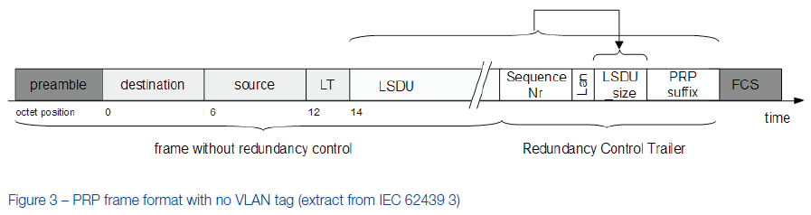

# Концепції мережевих з’єднань. Висока доступність в промисловому Ethernet

Це частковий переклад білої книги "Media Redundancy Concepts. High Availability in Industrial Ethernet." Оригінал доступний за посиланням: 

https://resources.ipd.com.au/documents/white-papers/Media-Redundancy-Concepts.pdf

## 1. Вступ

Загальна ідея резервування мережевих з’єднань і резервних шляхів з’явилася майже одночасно з використанням Ethernet для промислових комунікацій, так само як і дилема, що випливає з визначення самої технології Ethernet: її широкомовна природа не допускає фізичних петель і, відповідно, фактично забороняє наявність резервних шляхів передавання даних.

Однак відмовостійкість, яка вимагає застосування резервних структур, є життєво важливою базовою вимогою для багатьох систем автоматизації.
Це означає, що використання Ethernet у застосуваннях автоматизаційної техніки потребує протоколів, здатних розв’язувати проблему фізичних петель, що виникають при введенні резервних шляхів з’єднання.

Щоб зробити можливим використання резервних комунікаційних структур у офісних мережах, IEEE (Institute of Electrical and Electronics Engineers) визначив протокол **Spanning Tree Protocol (STP)**, який був опублікований у стандарті 802.1D у 1990 році. Вперше це дало змогу всім комутаторам Ethernet використовувати алгоритм для побудови взаємопов’язаних мережевих структур, хоча з часом перемикання порядку десятків секунд.
Пізніше були розроблені інші протоколи, засновані на базових механізмах STP, краще пристосовані до специфічних вимог промислового середовища, зокрема з істотно зменшеними часами перемикання.

Цей оглядовий документ подає узагальнення поточного стану технології та її рішень, а також окреслює низку конкретних прикладів застосувань.

## 2. Причини резервування мережевих з’єднань

Резервування мережевих з’єднань використовується насамперед для уникнення єдиних точок відмови в промислових комунікаційних мережах. У будь-якому місці, де існує така точка відмови, можлива ситуація, коли мережа зв’язку, наприклад на автоматизованій виробничій лінії, може бути повністю виведена з ладу через одну технічну несправність. Наслідки такої відмови потенційно можуть бути надзвичайно дорогими. Якщо ж застосовано резервні структури, то одинична відмова лише переводить мережу у режим обмеженої працездатності. Обмін даними через мережу залишається можливим, а наявність резервної системи дає змогу виконати ремонт і відновити попередній безвідмовний стан. Додаткову детальну інформацію про системи з високою доступністю, резервування з’єднань, моделі відмов і відновлення можна знайти у джерелі [1].

Резервні мережеві структури використовуються з двома різними цілями:

1. Балансування навантаження. Обсяг мережевого трафіку по певному шляху за певний проміжок часу може перевищувати пропускну здатність одного кабелю передавання даних. Додавання додаткових резервних з’єднань збільшує ефективну пропускну здатність початкового каналу. Для цього зазвичай використовується протокол керування агрегуванням каналів IEEE Link Aggregation Control Protocol (LACP) [2].
2. Відмовостійкість. Додаткові фізичні з’єднання між учасниками мережі вводяться для того, щоб система могла переключитися на вторинний мережевий шлях у разі відмови основного.

Хоча другий випадок може включати перший, у промисловому середовищі використання резервування з’єднань зазвичай обмежується саме другою метою. У промислових мережах відмовостійкість є набагато важливішою, ніж розподіл навантаження, тому більшість протоколів, що застосовуються у цій галузі, спеціалізуються на забезпеченні високої доступності.

Висока доступність є ключовою вимогою для всіх систем автоматизації — як у виробництві, так і в процесних або підстанційних застосуваннях. Відмови компонентів, які ніколи не можна повністю виключити, необхідно обробляти таким чином, щоб мінімізувати їхній вплив на систему в цілому.

## 3. Основні вимоги для промислового використання

Однією з фундаментальних вимог до будь-якої мережі Ethernet є уникнення петель. У будь-який момент часу між джерелом повідомлення та його одержувачем повинен існувати лише один шлях. Будь-які петлі призводять до того, що пакети даних циркулюють без кінця й зрештою перевантажують мережу, тому Ethernet не допускає наявності альтернативних активних шляхів до своїх пристроїв. Але резервування мережевих з’єднань потребує саме таких альтернативних шляхів. Розв’язання цього протиріччя потребує спеціального протоколу, який контролює резервування.

Такий протокол має гарантувати, що в будь-який момент часу існує лише один логічний шлях до кожного пристрою, навіть якщо фізичних шляхів кілька. Протокол забезпечує це, активуючи лише один із можливих шляхів, тоді як решта перебувають у режимі очікування.

Рішення, вперше реалізоване в протоколі STP, базується на моніторингу з’єднань, виявленні переривань зв’язку та перемиканні на альтернативний шлях щойно відмову зафіксовано. Слід зазначити, що цей принцип означає наявність певного часу переривання зв’язку, оскільки спочатку потрібно виявити відмову, а вже потім мережа може перемкнутися на резервний шлях і відновити обмін даними.

Залежно від складності мережі, тривалість таких переривань може бути складно передбачити.

До протоколів резервування з’єднань, що використовуються в промисловому середовищі, висуваються такі основні вимоги:

1. Детермінованість часу перемикання: у разі відмови час, необхідний протоколу для перемикання з основного логічного шляху на вторинний альтернативний і для відновлення зв’язку, має бути передбачуваним.
2. Вимоги до інсталяції: якщо використання протоколу і/або дотримання заданих часів перемикання накладають обмеження на встановлення, наприклад щодо фізичної топології або максимальної кількості комутаторів, що можуть бути використані, такі вимоги мають бути чітко визначені.
3. Протокол має базуватися на стандартизованому методі. Лише це може гарантувати прозорість, сумісність і, як наслідок, захищеність інвестицій.

Перша вимога є абсолютно критичною для застосувань у технологіях автоматизації та споріднених системах. Протокол резервування з’єднань може використовуватися лише тоді, коли є надійні та розраховані значення, що визначають абсолютну верхню межу часу перемикання мережі у разі відмови. Тільки це забезпечує відповідність мережі вимогам застосування, яке використовує її як середовище передавання.

Якщо протокол резервування мережевих з’єднань може перемикатися достатньо швидко, щоб протокольний трафік і прикладні процеси продовжували роботу без порушень, то механізм резервування стає прозорим для функціонування прикладної системи, а вимоги до часу виконуються.

## 4. Технології та рішення

### 4.1 RSTP/MSTP – Rapid/Multiple Spanning Tree Protocol

#### 4.1.1 Огляд RSTP/MSTP

Протягом останніх років раніше згаданий протокол Spanning Tree Protocol (STP) значною мірою був витіснений швидшим варіантом — **Rapid Spanning Tree Protocol (RSTP)**. Це оптимізована версія STP, остаточно описана у стандарті IEEE 802.1D 2004 [3]. Реалізації RSTP можуть працювати в різних топологіях, підтримують більшу кількість комутаторів і досягають покращеного часу перемикання — порядку однієї секунди. Однак RSTP усе ще не гарантує детермінованої поведінки під час відмов. Час реакції залежить від того, в якій частині мережі сталася відмова, а також від конкретної реалізації протоколу. З цієї причини було зроблено низку спроб оптимізувати RSTP шляхом обмеження його використання кільцевими топологіями та застосування фіксованих заздалегідь визначених параметрів. На сьогодні ці оптимізації дозволили досягти часу перемикання порядку 100 мс або менше (див. розділ 4.1.2). Як випливає з назви, протокол Rapid Spanning Tree створює деревоподібну структуру з’єднань між комутаторами Ethernet і деактивує всі ті шляхи, які не входять до активного дерева.

Таким чином, між будь-якими двома пристроями існує лише один активний шлях. Цей протокол використовує так звані BPDU (Bridge Protocol Data Units) для обміну даними між комутаторами. Один із комутаторів визначається як кореневий міст (root bridge), і саме від нього обчислюються оптимальні шляхи в мережі. Якщо в мережі відбуваються зміни — наприклад, через фізичне роз’єднання — це повідомляється іншим комутаторам за допомогою BPDU з позначкою зміни топології (Topology Change Notification). У відповідь мережа повторно обчислює дерево, активує відповідні альтернативні шляхи та таким чином відновлює зв’язок.

**MSTP (Multiple Spanning Tree Protocol)** [4] є подальшим розвитком RSTP і працює за тим самим принципом. Проте, якщо RSTP функціонує незалежно від VLAN, то MSTP завжди працює всередині VLAN і тому забезпечує більшу гнучкість мережевих структур, наприклад для реалізації балансування навантаження між кількома VLAN і мережевими шляхами. MSTP і RSTP сумісні між собою і можуть використовуватися разом у межах однієї мережі.

#### 4.1.2 Використання в кільцевих структурах

Якщо топологію обмежено кільцем, можна досягти детермінованого та передбачуваного часу перемикання в RSTP, за умови що відомі параметри таймінгів комутаторів. Стандарт IEC 62439-1 містить приклад розрахунку, який також передбачає додаткові обмеження протоколу. Наприклад, щоб запобігти впливу ззовні, RSTP не повинен бути активований на портах, що не входять до кільця. 

Оскільки RSTP спочатку не був розроблений для кільцевих топологій, його архітектура має певні недоліки у порівнянні з MRP, описаним у розділі 4.2. Для мережевих пристроїв, що підтримують і MRP (з параметрами 200 мс або менше), і RSTP, але не мають вимог до використання конкретного протоколу, зазвичай перевага віддається MRP.

Також слід зазначити, що RSTP має вбудований захист від перевантаження, щоб запобігти надмірній кількості BPDU-повідомлень, які можуть перевантажити окремі сегменти мережі. У найгіршому випадку цей захист може суттєво збільшити час переналаштування мережі через втрату BPDU — аж до кількох секунд. Це обмеження менш помітне в кільцевих структурах через їхню простішу топологію, але все ж може виникати. Особливо часто це трапляється в сітчастих мережах, зокрема у складних топологіях із великою кількістю комутаторів і з’єднань.

#### 4.1.3 Використання в сітчастих мережах

Однією з головних переваг RSTP є підтримка всіх типів сітчастих (mesh) топологій. Така гнучкість у проєктуванні мережі є суттєвою перевагою порівняно з жорсткими обмеженнями, які накладають кільцеві протоколи, такі як MRP.

Однак ця гнучкість має і серйозний недолік — час переналаштування мережі, який у взаємопов’язаних структурах залежить, серед іншого, від складності топології та місця, де сталася відмова. Оскільки RSTP, на відміну від MRP, є децентралізованим протоколом, він може створювати непередбачувані ситуації змагання під час встановлення нових шляхів зв’язку, особливо при виборі нового кореневого мосту. Це призводить до часу переналаштування мережі, який можна оцінити лише приблизно, що обмежує застосування RSTP, особливо в сітчастих мережах.

У випадку сітчастих мереж невеликої складності (наприклад, кільця з двома чи трьома додатковими петлями або підкільцями) детальний аналіз може дозволити визначити верхні межі часу реакції, але ці значення завжди потрібно розраховувати індивідуально. На відміну від протоколів MRP, HSR і PRP, тут неможливо сформулювати загальні твердження.

Один із методів визначення часу переналаштування на основі конкретних сценаріїв застосування був розроблений компанією Hirschmann/Belden у процесі міжнародної стандартизації для наступної редакції стандарту IEC 62439-1.

### 4.2 MRP – Media Redundancy Protocol

Одним із протоколів, що спеціально розроблений для промислових застосувань, є протокол резервування мережевих з’єднань **MRP (Media Redundancy Protocol)**. Цей протокол описаний у стандарті IEC 62439-2, який є промисловим стандартом для високодоступних Ethernet-мереж. MRP означений лише для кільцевих топологій із максимально 50 пристроями та гарантує повністю детерміновану поведінку при перемиканні. Його абсолютна верхня межа часу перемикання в разі відмови становить 500 мс, 200 мс, 30 мс або навіть 10 мс — залежно від вибраного набору параметрів.

Типові значення часу перемикання для MRP становлять від половини до чверті від зазначених найгірших випадків. Таким чином, за типовим навантаженням мережі кільце MRP, налаштоване на граничне значення 200 мс, перемикається з основного шляху на резервний за 50–60 мс; кільце, сконфігуроване на 10 мс, реагує відповідно швидше.

Кожен вузол MRP потребує комутатора з двома портами кільця, підключеними до нього. У межах MRP один із цих вузлів виконує роль керівника резервування — **Media Redundancy Manager (MRM)**. MRM здійснює моніторинг і керування топологією кільця, щоб мати змогу реагувати на відмови в мережі. Це відбувається шляхом надсилання тестових Ethernet-кадрів для контролю резервування через один порт кільця та приймання їх на інший, і навпаки. У нормальному (безвідмовному) стані MRM блокує передавання звичайного трафіку на одному зі своїх портів кільця, за винятком службових кадрів протоколу MRP. Логічно це перетворює фізичну кільцеву структуру на лінійну для звичайного трафіку, що дозволяє уникнути петель. Якщо MRM перестає отримувати тестові кадри, що свідчить про розрив передавання в кільці — наприклад, через відмову пристрою або пошкодження лінії, — він розблоковує свій раніше заблокований резервний порт і відкриває його для звичайного мережевого трафіку. Усі пристрої кільця тоді знову стають доступними через резервний шлях мережі.

Усі інші вузли кільця виконують роль **Media Redundancy Clients (MRC)**. Кожен MRC передає тестові кадри резервування, які надсилає MRM, від одного порту кільця до іншого. Крім того, він реагує на отримані кадри реконфігурації (зміни топології) від MRM, фіксує зміни стану свого порту та повідомляє про це керівнику. Якщо таке повідомлення про зміну стану надходить до MRM раніше, ніж він сам виявить відмову через відсутність тестових кадрів, то отримана від MRC інформація використовується для підтвердження відмови. Це гарантує, що перемикання MRM з основного на резервний шлях завжди здійснюється за найкоротший можливий час.

Така гнучкість у виборі часу перемикання та чіткий поділ ролей між MRM і MRC дозволяють кільцю MRP охоплювати широкий спектр практичних вимог і бути оптимально налаштованим під конкретні застосування.

### 4.3 PRP – Parallel Redundancy Protocol

Хоча швидке кільце MRP сьогодні може задовольняти дуже широкий спектр вимог, усе ще існують застосування, які не допускають жодного часу перемикання. Для таких випадків потрібно застосовувати зовсім інший підхід до забезпечення гарантовано високої доступності.

Основою цього нового підходу до мережевого резервування є наявність двох незалежних активних шляхів між двома пристроями. Відправник використовує дві незалежні мережеві інтерфейсні карти, які передають одні й ті самі дані одночасно. Протокол контролю резервування забезпечує, щоб одержувач використовував лише перший отриманий пакет, а другий відкидав. Якщо отримано лише один пакет, одержувач знає, що сталася відмова на іншому шляху.

Цей принцип реалізовано в **Parallel Redundancy Protocol (PRP)**, який описаний у стандарті IEC 62439-3. PRP використовує дві незалежні мережі будь-якої топології і не обмежується лише кільцевими структурами.

Дві незалежні паралельні мережі можуть бути кільцями MRP, мережами з RSTP або навіть звичайними мережами без резервування. Основна перевага PRP полягає в **безперервності зв’язку при відмові** — перемикання здійснюється без жодних затримок, що забезпечує максимально можливу доступність. Звичайно, це справедливо лише за умови, що обидві мережі не виходять з ладу одночасно.

PRP реалізується **в кінцевих пристроях**, тоді як комутатори в мережі залишаються стандартними і не потребують підтримки цього протоколу. Кінцевий пристрій із функцією PRP називається **DAN P (Double Attached Node for PRP)** і має підключення до кожної з двох незалежних мереж. Ці дві мережі можуть мати однакову або різну топологію та/або продуктивність.

Звичайний пристрій із одним мережевим інтерфейсом (**SAN – Single Attached Node**) може бути підключений безпосередньо лише до однієї з двох мереж. У такому випадку, зрозуміло, пристрій не матиме резервного шляху у разі відмови. Альтернативно SAN може бути підключений через спеціальний **Redundancy Box (RedBox)**, який з’єднує один або кілька SAN-пристроїв із обома мережами. Пристрої SAN не потребують знань про PRP — це можуть бути стандартні Ethernet-вузли.

У багатьох застосуваннях лише критично важливе обладнання оснащується двома мережевими інтерфейсами, тоді як менш важливі пристрої можуть підключатися як SAN, з RedBox або без нього.

Реалізація пристрою **DAN P** (Double Attached Node for PRP) керує процесом резервування та обробляє дублікати кадрів. Коли верхні рівні отримують пакет для передавання, модуль PRP надсилає цей кадр у мережу одночасно через обидва порти. Під час проходження двома незалежними мережами ці кадри зазвичай зазнають різних затримок на шляху до одержувача. На приймальному боці модуль PRP передає перший отриманий пакет у верхні рівні, тобто до прикладного рівня, а другий відкидає. Таким чином, інтерфейс для прикладного рівня є ідентичним будь-якому іншому стандартному Ethernet-інтерфейсу.

**Redundancy Box (RedBox)** реалізує протокол PRP для всіх підключених пристроїв SAN та фактично працює як проксі-механізм резервування для всіх типів стандартного обладнання. Дублікати кадрів розпізнаються за допомогою спеціального поля **Redundancy Control Trailer (RCT)**, яке додається до кожного кадру з’єднання PRP або RedBox. Окрім ідентифікатора мережі (LAN A або B) та довжини корисних даних кадру, ці 32-бітні ідентифікаційні поля також містять порядковий номер, який збільшується для кожного кадру, надісланого вузлом. Завдяки цьому RedBox або DAN P можуть розпізнавати дублікати й за потреби відкидати їх, спираючись на унікальні характеристики кадру — фізичну MAC-адресу джерела та порядковий номер.

Оскільки RCT вставляється в кінець кадру (див. рисунок 3), увесь протокольний трафік може бути прочитаний пристроями SAN, які сприймають RCT лише як додаткове заповнення без будь-якого значення. Це означає, що SAN, підключений безпосередньо до мережі PRP, тобто без RedBox, може обмінюватися даними з усіма DAN P і з будь-якими іншими SAN у тій самій мережі (мережа A або B). Єдине обмеження полягає в тому, що він не має зв’язку з вузлами іншої мережі, оскільки DAN P не передає кадри з однієї LAN в іншу.

Час перемикання PRP задовольняє найвищі вимоги, а сама технологія є надзвичайно гнучкою щодо структури мережі та можливих топологій. Водночас вона потребує вдвічі більшої кількості мережевої інфраструктури — комутаторів та інших компонентів.

### 4.4 HSR – High Availability Seamless Redundancy

Протокол **HSR (High Availability Seamless Redundancy)** є подальшим розвитком підходу PRP, хоча HSR функціонує насамперед як протокол створення резервування середовища передавання, тоді як PRP, як було описано в попередньому розділі, забезпечує резервування мережі. Обидва протоколи — PRP і HSR — описані у стандарті IEC 62439-3.

На відміну від PRP, HSR призначений переважно для використання в (резервно з’єднаних) кільцевих топологіях. Як і PRP, він використовує два мережеві порти, проте HSR-з’єднання реалізується через **DAN H (Double Attached Node for HSR)**, який об’єднує ці два інтерфейси у кільце (див. рисунок 4).

Кадр, що надходить із прикладного рівня, отримує спеціальний **HSR-тег**, який додається під час обробки з’єднання HSR. Подібно до RCT у PRP, цей тег містить довжину корисних даних, порт, через який кадр було передано, і порядковий номер кадру. Проте, на відміну від PRP, заголовок HSR використовується для інкапсуляції Ethernet-кадру (див. рисунок 5). Це має перевагу, оскільки дублікати кадрів можуть бути розпізнані всіма пристроями одразу після отримання заголовка HSR — немає потреби чекати, поки буде прийнято весь кадр і його RCT, щоб розпізнати дублікат. Завдяки цьому, подібно до режиму **cut-through switching**, окремі HSR-з’єднання або RedBox можуть почати передавання кадру на другий порт кільця одразу після повного отримання заголовка HSR і завершення процедури розпізнавання дубліката.

Кожен вузол HSR зчитує з мережі всі кадри, адресовані саме йому, і передає їх прикладному рівню. Мультикаст- та широкомовні повідомлення передаються кожним вузлом кільця далі по колу й також передаються на прикладний рівень. Щоб запобігти нескінченному циркулюванню мультикаст- і широкомовних кадрів, вузол, який першим надіслав такий кадр у кільце, видаляє його, щойно він завершить повне проходження по кільцю (див. схему потоку даних HSR на рисунку 4).

На відміну від PRP, інтегрувати вузли SAN безпосередньо в мережу HSR неможливо, не порушивши цілісність кільця: SAN не має другого мережевого інтерфейсу, необхідного для замкненого кільця. Це є однією з причин, чому вузли SAN можуть підключатися до мереж HSR лише через спеціальні пристрої RedBox. Друга причина полягає в інкапсуляції мережевого трафіку в кільці, яку забезпечує заголовок HSR. На відміну від PRP, це унеможливлює участь звичайних мережевих вузлів у трафіку HSR. Якщо у випадку PRP вузли SAN сприймають поля RCT як звичайне заповнення, то для HSR це неможливо: положення HSR-тега в кадрі означає, що він завжди інтерпретується як дійсна інформація рівня 2, що заважає вузлам SAN коректно зчитувати корисні дані кадру.

Оскільки деяким пристроям HSR може бути потрібно обмінюватися даними з керувальною станцією або ноутбуком для налаштування й діагностики, з’єднання HSR тимчасово допускають підключення пристроїв, які передають стандартні Ethernet-кадри, навіть через порти кільця. У цьому випадку HSR-з’єднання працюють без інкапсуляції заголовка HSR; такий трафік не передається до самої HSR-мережі, а лише забезпечує двосторонній зв’язок між конфігураційною станцією, підключеною до порту HSR, і самим пристроєм HSR.

Звичайна робота HSR відновлюється лише після замикання кільця. З’єднання між двома кільцями HSR завжди реалізуються за допомогою двох елементів з’єднання кілець, відомих як QuadBox. Вони забезпечують зв’язок між двома кільцями HSR без єдиної точки відмови (див. рисунок 6).

Щодо часу перемикання, HSR поводиться так само, як і PRP: під час надсилання дубльованих кадрів через обидва порти з’єднання HSR, у разі відмови один кадр усе одно буде переданий через мережевий шлях, що залишився працездатним. Це означає, що резервування також функціонує без жодного часу перемикання, і, на відміну від PRP, не потребує двох паралельних мереж. Однак мережа HSR завжди має форму кільця або структури з’єднаних кілець, що робить її менш гнучкою в етапі інсталяції порівняно з PRP. Передавання дубльованих кадрів у двох напрямках також означає, що фактично лише 50% пропускної здатності мережі доступні для передавання даних.

## 5. Підсумок

На практиці не існує ідеальної топології мережі чи ідеального протоколу резервування з’єднань, який би повністю охоплював усі можливі застосування й вимоги. Вибір відповідної топології та протоколу завжди залежить від додаткових факторів — таких як вимоги до фізичної інсталяції або час перемикання, необхідний для конкретного застосування.

Для узагальнення в таблиці нижче наведено основні протоколи та головні параметри технологій резервування, розглянутих у цьому документі.

| Протокол                | Топологія          | Макс. кількість пристроїв | Найгірший випадок (час переналаштування)                     | Типовий час переналаштування                                 |
| ----------------------- | ------------------ | ------------------------- | ------------------------------------------------------------ | ------------------------------------------------------------ |
| RSTP (IEEE 802.1D-2004) | Кільце             | 40                        | Понад 2 с при втраті більше одного BPDU                      | Залежить від реалізації RSTP і кількості комутаторів у кільці. Зазвичай між 100 мс і 200 мс для 40 пристроїв |
| RSTP (IEEE 802.1D-2004) | Будь-яка           | Будь-яка                  | Понад 2 с при втраті більше одного BPDU                      | Важко оцінити, потребує детального аналізу конкретної мережі |
| MRP (IEC 62439-2)       | Кільце             | 50                        | 500 мс, 200 мс, 30 мс, 10 мс (залежно від вибраного набору параметрів) | Прибл. 200 мс, 60 мс, 15 мс, <10 мс (залежно від вибраного набору параметрів) |
| PRP (IEC 62439-3)       | Подвійна, будь-яка | Будь-яка                  | 0 мс                                                         | 0 мс                                                         |
| HSR (IEC 62439-3)       | Кільця (з’єднані)  | 512                       | 0 мс                                                         | 0 мс                                                         |

Сучасний стан технології Ethernet цілком дозволяє задовольнити вимоги навіть найскладніших застосувань. Якщо на етапі планування комунікаційної мережі обрано правильну технологію, можна мінімізувати ризики проєкту ще на ранніх стадіях.

Цей оглядовий документ є першим кроком у напрямку визначення найбільш відповідної технології. Для отримання додаткових консультацій, послуг і рекомендацій звертайтеся до команди фахівців Belden HiCom Center, яка із задоволенням допоможе вам із порадами та підтримкою у створенні оптимального рішення відповідно до ваших індивідуальних потреб [5].

## 6. References

[1] Hubert Kirrmann – Fault tolerant computing in industrial automation (http://lamspeople.epfl.ch/kirrmann/Pubs/FT_Tutorial_HK_050418.pdf)
[2] IEEE 802.1AX-2008 (http://standards.ieee.org/getieee802/download/802.1AX-2008.pdf)
[3] IEEE 802.1D-2004 (http://standards.ieee.org/getieee802/download/802.1D-2004.pdf)
[4] IEEE 802.1Q-2005/cor1-2008 (http://standards.ieee.org/getieee802/download/802.1Q-2005_Cor1-2008.pdf)
[5] Hirschmann Service und Support(http://www.beldensolutions.com/de/Service/index.phtml)