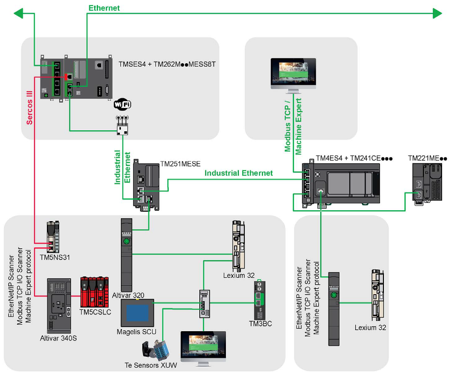
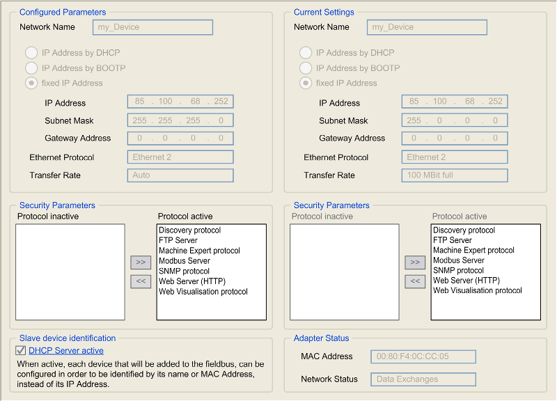
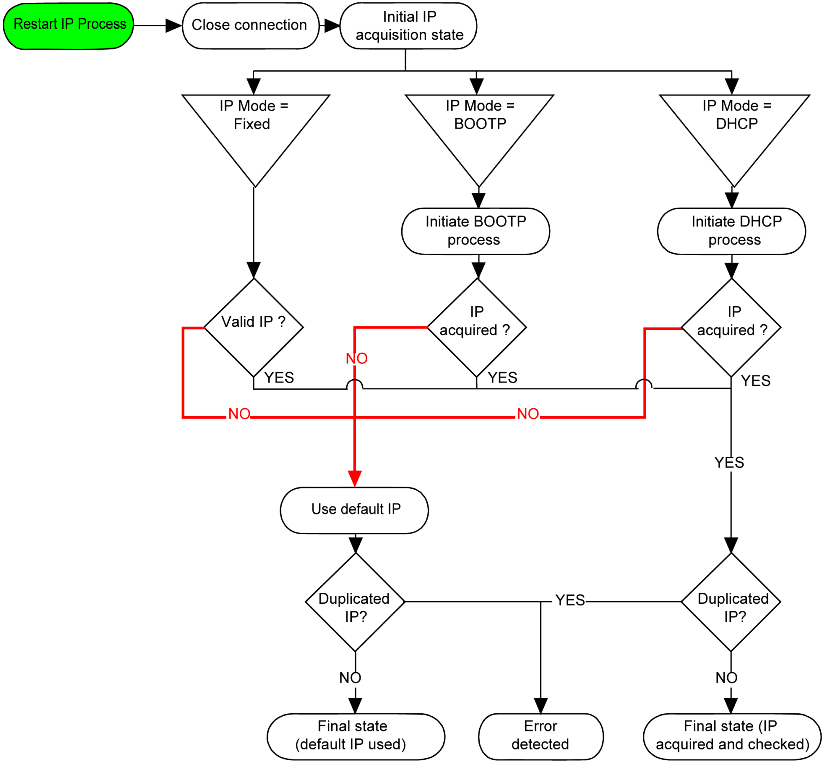
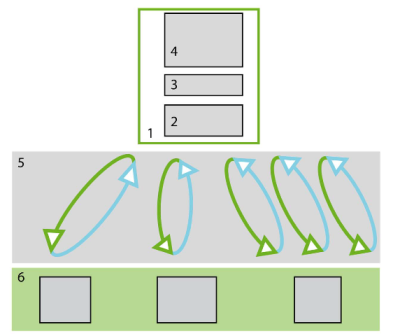

[<- До підрозділу](README.md)	[PLC MachineStruxure](../../plc/ecostruxuremachineexpert.md)	[Коментувати](#feedback)

# Огляд Industrial EtherNet в EcoStruxure Machine Expert

## Огляд

Industrial Ethernet – це термін, який використовується для позначення промислових протоколів, що використовують стандартний фізичний рівень Ethernet. У мережі Industrial Ethernet можна підключати:

- промислові пристрої (промислові протоколи)
- непромислові пристрої (інші протоколи Ethernet)

У EcoStruxure Machine Expert Industrial Ethernet охоплює:

- EtherNet/IP
- Modbus TCP
- TCP/UDP
- Sercos

рис.1.

## Доступні сервіси

Ethernet у контролерах, що програмуються в середовищі Machine Expert надає велику кількість сервісів. Контролер має вбудовану підтримку базових мережних протоколів Ethernet і TCP/IP, які забезпечують адресацію, маршрутизацію та передачу даних у мережі. На їх основі реалізуються прикладні мережні служби контролера. PLC надає набір стандартних сервісів, що працюють поверх Ethernet і TCP/IP та забезпечують інженерний доступ, діагностику, передавання файлів і взаємодію з іншими системами. До них належать:

- **FDT/DTM/EDS management** - Сервіс підтримує інтеграцію описів пристроїв і засобів їх конфігурації у середовищі інженерії. FDT/DTM використовується для конфігурації та діагностики пристроїв за допомогою Device Type Manager. DTM є програмним компонентом, який описує конкретний пристрій і надає інтерфейс його налаштування. EDS (Electronic Data Sheet) використовується для опису пристроїв EtherNet/IP і містить інформацію про параметри, об’єкти та підтримувані з’єднання. Завдяки цим механізмам Machine Expert може автоматично інтегрувати мережні пристрої у проєкт і надавати засоби їх конфігурації.

- **FDR** (Fast Device Replacement). Механізм швидкої заміни пристрою. Конфігурація пристрою зберігається у контролері. Якщо пристрій замінюється новим, контролер автоматично передає йому збережені параметри. Це дозволяє замінити пристрій без повторної ручної конфігурації.

- **DHCP server**. Контролер може виконувати функцію DHCP-сервера. У цьому режимі PLC автоматично призначає IP-адреси мережним пристроям.
  Це спрощує налаштування мережі та дозволяє автоматично конфігурувати адресацію пристроїв під час їх підключення.

- **Керування безпекою**. PLC підтримує параметри мережної безпеки для обмеження доступу до контролера. До таких механізмів можуть належати:

  - обмеження доступу до сервісів контролера

  - керування правами доступу

  - фільтрація мережних з’єднань

  - налаштування правил доступу через firewall (для деяких моделей контролерів).

- **Modbus TCP server**. У цьому режимі контролер працює як сервер Modbus TCP. Інші пристрої або системи (SCADA, HMI, інші PLC) можуть підключатися до контролера та читати або записувати його змінні. Доступ до даних здійснюється через стандартні області пам'яті Modbus які відображаються на адреси %I (Digital Input), %Q (Coils) та %MW (Holding Registers).  Без будь-якої конфігурації вбудований Ethernet-порт контролера підтримує Modbus-сервер за Unit ID, рівного 255, та порту 502 (можна змінити програмно). Функціональність Modbus server включена у прошивку контролера і не потребує жодних дій з програмування. Завдяки цій можливості доступ до нього можливий у станах RUNNING, STOPPED та EMPTY.
- **Modbus TCP slave device**.  Функція Modbus TCP Slave Device додає до контролера ще одну функцію Modbus-сервера. До цього сервера клієнтський застосунок Modbus звертається, вказуючи налаштований Unit ID (Modbus-адресу) у діапазоні 1…247. Цей сервіс додається до порта контролера явно в апаратній конфігурації. Ця функціональність створює в контролері спеціальну область I/O яка надає доступ до об’єктів %IW і %QW контролера. Функціональність Modbus TCP Slave Device дозволяє розмістити в цій області об’єкти I/O контролера, до яких потім можна звертатися одним запитом Modbus читання або запису регістрів. Modbus TCP Slave Device може визначати привілейований клієнтський застосунок Modbus, з’єднання з яким не буде примусово закрито (вбудовані Modbus-з’єднання можуть бути закриті, коли потрібно більше ніж 8 з’єднань). " cторожовий таймер, пов’язаний із привілейованим з’єднанням, zrbq дозволяє перевірити, чи опитується контролер привілейованим ведучим пристроєм. 

- **Modbus TCP client**. Контролер може працювати як клієнт Modbus TCP і ініціювати запити до інших пристроїв. У цьому режимі PLC читає або записує регістри віддалених пристроїв Modbus TCP під керуванням комунікацйних функцій, які викликаються з програми користувача. Modbus TCP client без будь-якої додаткової конфігурації підтримує такі функціональні блоки з бібліотеки PLCCommunication: ADDM, READ_VAR, SEND_RECV_MSG, SINGLE_WRITE, WRITE_READ_VAR, WRITE_VAR.

- **EtherNet/IP Adapter** (контролер як target). У цьому режимі контролер виступає як Adapter (target) у мережі EtherNet/IP. Інший контролер або сканер може підключитися до PLC і обмінюватися з ним I/O-даними. Таким чином PLC може використовуватися як підлеглий вузол у мережі EtherNet/IP.

- **EtherNet/IP Originator**. Контролер може працювати як originator EtherNet/IP. У цьому режимі PLC ініціює з’єднання з іншими пристроями EtherNet/IP і виконує обмін даними під керуванням комунікацйних функцій, які викликаються з програми користувача. 

- **Web server**.Як стандартне оснащення контролер має вбудований Web-сервер із попередньо означеним, вбудованим вебсайтом. Сторінки цього сайту можна використовувати для налаштування та керування модулями, а також для діагностики і моніторингу прикладної програми. Ці сторінки готові до використання у веббраузері і не потребують жодної конфігурації або програмування. Доступ до Web-сервера можливий за допомогою таких браузерів: Google Chrome (версія 30.0 або новіша), Mozilla Firefox (версія 1.5 або новіша) Web-сервер може підтримувати до 10 одночасно відкритих сесій. Web-сервер дозволяє віддалено контролювати контролер і його прикладну програму, виконувати різні операції обслуговування, включно зі зміною даних і параметрів конфігурації, а також змінювати стан контролера. Перед віддаленим керуванням необхідно переконатися, що фізичне оточення машини та технологічного процесу знаходиться у безпечному стані і не створює ризику для людей або майна. Вбудований Web-сервер контролера M241 надає такі можливості.

  - Моніторинг та керування станом контролера: поточний стан PLC, включаючи режим роботи (RUN, STOP), системну інформацію, а також загальні параметри контролера.
  - Моніторинг прикладної програми: дані прикладної програми та значення змінних. Читання та запис змінних прикладної програми і за потреби змінювати їх. Читання осцилограм.

  - Діагностика мережі Ethernet - переглядати параметри мережевого інтерфейсу та перевіряти мережне з’єднання.
  - Ping-перевірка мережних пристроїв.
  - Діагностика Industrial Ethernet протоколів, наприклад EtherNet/IP. На них можна переглядати стан з’єднань і підключених пристроїв.
  - Змінювати файл пост-конфігурації.

- **FTP server** (FTP та TFTP). Контролер підтримує передавання файлів через протоколи FTP і TFTP.
- **FTP Client**. Контролер підтримує роботу FTP-клієнта через відповідні комунікаційні функції.
- **SNMP**. Контролер підтримує протокол SNMP (Simple Network Management Protocol), який використовується для мережного моніторингу.
  Через SNMP системи керування мережею можуть отримувати інформацію про стан пристрою, параметри мережі та діагностичні дані. Крім цього є бібліотекчні функції для роботи в якості SNMP-клієнту.

- **IEC VAR ACCESS**. Цей сервіс забезпечує доступ до змінних прикладної програми PLC через мережу використовуючи імена. Зовнішні інструменти або системи можуть читати та записувати значення змінних контролера для моніторингу, налагодження або інтеграції з іншими системами.

Ці сервіси працюють безпосередньо через Ethernet-інтерфейс контролера і не потребують спеціального менеджера мережних обмінів. Окремо у системі виділено компонент **Industrial Ethernet Manager**. Він призначений для конфігурації та керування циклічним обміном даними з мережними пристроями. Через цей компонент налаштовуються служби так званого scanner-типу, які реалізують періодичний обмін I/O-даними. До таких служб належать:

- EtherNet/IP Scanner
- Modbus TCP IOScanner
- (для деяких контролерів, наприклад M262) Sercos Master.

Ці служби створюють з’єднання з веденими пристроями і забезпечують циклічний обмін даними між контролером та пристроями мережі.

Окрім наведених вище мережних сервісів, контролери, що програмуються у середовищі Machine Expert, також надають низку сервісів, характерних для середовища виконання CODESYS. Ці сервіси використовують власний (пропрієтарний) комунікаційний протокол CODESYS runtime, який працює поверх TCP/IP. Саме через цей протокол здійснюється інженерна взаємодія між середовищем розроблення та контролером, а також доступ зовнішніх клієнтів до змінних прикладної програми.

- Сервіс **інженерного доступу до контролера**. Через нього виконується підключення середовища розроблення до PLC, завантаження прикладної програми, запуск і зупинка виконання, а також онлайн-моніторинг і налагодження. Цей механізм забезпечує обмін даними між інженерним середовищем і runtime системою контролера та дозволяє працювати з програмою безпосередньо під час її виконання.

- **Символьний доступ** до змінних прикладної програми. Під час компіляції проєкту формується таблиця символів, яка містить список змінних, доступних для зовнішніх систем. Завдяки цьому зовнішні клієнти можуть звертатися до змінних за їх іменами, а не через адреси пам’яті. Такий доступ використовується інженерними інструментами, системами моніторингу, а також механізмами інтеграції з іншими програмними платформами. На основі символічного доступу реалізується вище згаданий сервіс IEC VAR ACCESS, який забезпечує мережний обмін даними між PLC та іншими пристроями, наприклад HMI або SCADA. Через цей механізм зовнішні клієнти можуть читати і записувати змінні прикладної програми. На відміну від протоколів типу Modbus, де використовується адресна модель регістрів, у цьому випадку застосовується символічна адресація змінних відповідно до моделі даних IEC 61131.

- **NGVL**. Це мережні глобальні списки змінних (Network Global Variable Lists, NGVL). У цьому випадку змінні, оголошені в спеціальному глобальному списку, автоматично передаються між контролерами або іншими вузлами мережі. Такий обмін відбувається без явного програмування запитів: дані періодично публікуються в мережу та приймаються іншими вузлами, які підписані на відповідний список змінних. Цей механізм часто використовується для обміну даними між кількома PLC або для швидкої інтеграції контролерів у розподілених системах керування.
- **TCP/UDP**. Можна використовувати обмін пакетами з використанням TCP або UDP з використанням комунікаційних функцій. ([Бібліотека NetBaseServices Codesys: TCP/UDP](../../plc/tcpudp/codesys.md))  

Порти для протоколів наступні:

| Протокол       | Порти призначення                              |
| -------------- | ---------------------------------------------- |
| Machine Expert | UDP 1740, 1741, 1742, 1743; TCP 1105           |
| FTP            | TCP 21, 20                                     |
| HTTP           | TCP 80                                         |
| Modbus         | TCP 502                                        |
| Discovery      | UDP 27126, 27127                               |
| SNMP           | UDP 161, 162                                   |
| NVL            | UDP (типове значення 1202)                     |
| EtherNet/IP    | UDP 2222; TCP 44818                            |
| TFTP           | UDP 69 (використовується лише для FDR-сервера) |

Типове значення порту Modbus (502) може бути змінене за допомогою команди changeModbusPort.

Окрім наведених вище сервісів та протоколів, які підтримуються всіма сучасними PLC сімейства Machine Struxure, PLC M262 також підтримують наступні протоколи та сервіси.

- **MQTT** - Контролер підтримує протокол MQTT із можливістю підписування та шифрування повідомлень. Це дозволяє безпосередньо передавати дані у хмарні сервіси або системи IIoT через брокер MQTT без використання додаткових шлюзів.

- **OPC UA** - Контролери M262 підтримують OPC UA для інтеграції з системами верхнього рівня. Залежно від моделі контролера може бути доступний OPC UA Server або OPC UA Client/Server. Протокол підтримує підписування та шифрування, що забезпечує безпечний обмін даними між PLC і SCADA, MES або іншими системами.

- **HTTP API** - Контролер надає HTTP API, яке дозволяє взаємодіяти з прикладною програмою через стандартні HTTP-запити. Це використовується для інтеграції з вебсервісами, хмарними платформами або іншими IT-системами.

- **DNS Client** - Підтримується клієнт DNS, що дозволяє використовувати доменні імена замість IP-адрес при зверненні до мережних сервісів.

- **SMTP Client** - Підтримується відправлення електронних повідомлень через SMTP. Це використовується для передачі аварійних повідомлень, сповіщень або сервісної інформації.

- **POP3 Client** - Контролер може отримувати електронні повідомлення через POP3, що дозволяє реалізувати деякі механізми віддаленого керування або обміну даними.

## Налаштування Ethernet в M241

На рис.3 у області Configured Parameters задаються параметри, які будуть застосовані до Ethernet-інтерфейсу після завантаження конфігурації в контролер. Вказується ім’я пристрою Network Name, яке використовується для ідентифікації в мережі та може застосовуватися під час отримання IP-адреси через DHCP. Нижче вибирається спосіб отримання IP-адреси: автоматично через DHCP, через BOOTP або як фіксована IP-адреса. Якщо вибрано фіксовану адресу, задаються IP Address, Subnet Mask та Gateway Address. Також відображаються параметри Ethernet Protocol (тип Ethernet-кадру) і Transfer Rate, який зазвичай працює в режимі автоузгодження швидкості та дуплексу.

У області Current Settings показуються фактичні параметри Ethernet-інтерфейсу, які зараз використовуються контролером. Тут відображається реальна IP-адреса, маска підмережі, шлюз, тип Ethernet-протоколу та швидкість з’єднання. Ці значення можуть відрізнятися від налаштованих параметрів, якщо, наприклад, адреса отримана динамічно через DHCP.

рис.3

У області Security Parameters можна керувати мережними сервісами контролера. Список праворуч містить активні протоколи, наприклад Discovery protocol, FTP Server, Machine Expert protocol, Modbus Server, SNMP protocol, Web Server (HTTP) і Web Visualisation protocol. Сервіси можна переміщати між списками Protocol active та Protocol inactive, тим самим дозволяючи або забороняючи доступ до них через Ethernet.

У блоці Slave device identification параметр DHCP Server active дозволяє активувати вбудований DHCP-сервер контролера. У цьому режимі пристрої, що підключаються до промислової мережі, можуть бути ідентифіковані за іменем пристрою або MAC-адресою замість IP-адреси.

У нижній правій частині знаходиться область Adapter Status, де відображається апаратна інформація Ethernet-адаптера. Тут показується MAC Address мережевого інтерфейсу та Network Status, який відображає поточний стан обміну даними через мережу.

Існує кілька способів призначення IP-адреси Ethernet-інтерфейсу контролера:

- призначення адреси сервером DHCP
- призначення адреси сервером BOOTP
- фіксована IP-адреса
- файл постконфігурації. Якщо файл постконфігурації існує, цей спосіб призначення адреси має пріоритет над іншими.

IP-адресу також можна змінити динамічно за допомогою:

- вкладки Communication Settings  у середовищі Machine Expert
- функціонального блока `changeIPAddress` 

Якщо спроба призначення адреси вибраним способом не вдалася, інтерфейс використовує стандартну IP-адресу, сформовану на основі MAC-адреси.

IP-адресами слід керувати уважно, оскільки кожен пристрій у мережі повинен мати унікальну адресу. Наявність кількох пристроїв з однаковою IP-адресою може призвести до некоректної роботи мережі та пов’язаного обладнання. Переконайтеся, що системний адміністратор веде облік призначених IP-адрес у мережі та підмережах, а також повідомляйте його про будь-які зміни конфігурації.

Наведена діаграма показує різні системи адресації, що використовуються для контролера.

Якщо пристрій, налаштований на використання методів адресації DHCP або BOOTP, не може зв’язатися з відповідним сервером, контролер використовує стандартну IP-адресу. При цьому він постійно повторює запити до сервера. Процес отримання IP-адреси запускається повторно у таких випадках:

- перезапуск контролера
- повторне підключення Ethernet-кабелю
- завантаження прикладної програми (якщо змінюються параметри IP)
- виявлення сервера DHCP або BOOTP після того, як попередня спроба призначення адреси була невдалою.

## Сервіси Industrial Ethernet Manager

Контролер керує режимом роботи Industrial Ethernet. Це керування виконується за допомогою стабільного та циклічного обміну даними (служба scanner). Служби scanner доступні для таких протоколів:

- EtherNet/IP 
- Modbus TCP 

Принцип роботи Industrial Ethernet scanner наступний. Контролер виконує роль центрального вузла мережі, який циклічно обмінюється даними з веденими пристроями, які в термінології такого обміну позначаються як slave. Цей обмін організований у вигляді періодичного опитування.

рис.2.

Всередині контролера виділено кілька логічних рівнів.

1 – Controller. Це сам PLC, який виконує програму керування та керує обміном даними по мережі.

2 – I/O images. Образи входів і виходів. Це область пам’яті контролера, у якій зберігаються дані, отримані від мережних пристроїв, а також значення, які потрібно передати їм. Для прикладної програми ці дані виглядають як звичайні змінні.

3 – Application interface. Інтерфейс прикладної програми до образів I/O. Через цей рівень прикладна програма читає дані від пристроїв і записує дані для передачі їм.

4 – Application. Прикладна програма PLC, яка виконує алгоритм керування. Вона працює з образами входів і виходів, не взаємодіючи безпосередньо з мережними протоколами.

5 – Обмін даними по Modbus або EtherNet/IP. Це механізм мережного обміну. Контролер циклічно виконує обмін даними з кожним веденим пристроєм через з’єднання Modbus TCP або EtherNet/IP. Під час кожного циклу:

- контролер відправляє вихідні дані для пристрою;
- отримує від нього вхідні дані;
- оновлює відповідні області I/O images.

6 – Slave devices. Ведені пристрої мережі Industrial Ethernet: модулі вводу-виводу, приводи, інші контролери або інтелектуальні польові пристрої. Вони відповідають на запити контролера і передають свої дані.

У наступній таблиці наведено основні можливості:

| Основні можливості        | Опис                                                         |
| ------------------------- | ------------------------------------------------------------ |
| FDR                       | Fast Device Replacement: конфігурація пристрою зберігається у контролері. Коли пристрій замінюється, конфігурація автоматично завантажується в новий пристрій. |
| DTM                       | Для пристроїв, що підтримують DTM: технологія FDT/DTM дозволяє конфігурувати мережні пристрої в EcoStruxure Machine Expert. Див. Device Type Manager User Guide. |
| Libraries                 | Функції / функціональні блоки (призначені для пристрою), доступні для використання прикладною програмою. |
| Predefined connections    | Використовуються для налаштування циклічного обміну даними. Потрібно вибрати одне із запропонованих з’єднань, яке містить необхідну інформацію. Докладніше див. Cyclic Data Exchanges (див. EcoStruxure Machine Expert EtherNet/IP, User Guide). |
| Predefined data exchanges | Циклічний обмін даними налаштовується автоматично: одне попередньо означене з’єднання автоматично вибирається під час додавання пристрою до проєкту. |
| User parameters           | Параметри, які автоматично передаються пристрою під час увімкнення живлення. Ці параметри використовуються під час заміни пристроїв, що не підтримують FDR. |

## Можливості контролерів

### M241/M251

У цих таблицях наведено контролери, що підтримують Industrial Ethernet.

Industrial Ethernet

| Параметр            | TM251MESE, TM241CE24, TM241CE40, TM241CEC24 |
| ------------------- | ------------------------------------------- |
| Топологія           | Daisy chain та зірка через комутатори       |
| Пропускна здатність | 10/100 Мбіт/с                               |

EtherNet/IP Scanner

| Параметр                | TM251MESE, TM241CE24, TM241CE40, TM241CEC24                  |
| ----------------------- | ------------------------------------------------------------ |
| Продуктивність          | До 16 пристроїв EtherNet/IP target, керованих контролером, з моніторингом у часовому інтервалі 10 мс |
| Кількість з’єднань      | 0…16                                                         |
| Кількість вхідних слів  | 0…1024                                                       |
| Кількість вихідних слів | 0…1024                                                       |
| Обмін I/O               | Служба EtherNet/IP Scanner. Функціональний блок для конфігурації та передавання даних |
| Режим                   | Originator/Target                                            |

Modbus TCP IOScanner

| Параметр                | TM251MESE, TM241CE24, TM241CE40, TM241CEC24                  |
| ----------------------- | ------------------------------------------------------------ |
| Продуктивність          | До 64 ведених пристроїв Modbus TCP, керованих контролером, з моніторингом у часовому інтервалі 35 мс |
| Кількість каналів       | 0…64                                                         |
| Кількість вхідних слів  | 0…2048                                                       |
| Кількість вихідних слів | 0…2048                                                       |
| Обмін I/O               | Служба Modbus TCP IOScanner. Функціональний блок для передавання даних |
| Режим                   | Master/Slave                                                 |

Можливо одночасно використовувати до 16 пристроїв EtherNet/IP і Modbus TCP. Пристрої можуть безпосередньо використовуватися для конфігурації, моніторингу та керування. Забезпечується прозорість мережі між мережею керування та мережею пристроїв (контролер може використовуватися як шлюз). Примітка: використання контролера як шлюзу може впливати на його продуктивність.

### M262 

У таблицях наведено контролери, що підтримують Industrial Ethernet.

Industrial Ethernet

| Параметр            | TM262L• / TM262M•                                            |
| ------------------- | ------------------------------------------------------------ |
| Топологія           | Daisy chain та зірка через комутатори                        |
| Пропускна здатність | 10/100 Мбіт/с для порту Ethernet 110/100/1000 Мбіт/с для порту Ethernet 2 |

EtherNet/IP Scanner

| Параметр                | TM262L• / TM262M•                                            |
| ----------------------- | ------------------------------------------------------------ |
| Продуктивність          | До 64 пристроїв EtherNet/IP target, керованих контролером, з моніторингом у часовому інтервалі 20 мс |
| Кількість з’єднань      | TM262L10, TM262M15: 0…64, максимум 96 ведених пристроївTM262L20, TM262M25, TM262M35: 0…64 |
| Кількість вхідних слів  | 0…15360                                                      |
| Кількість вихідних слів | 0…15360                                                      |
| Обмін I/O               | Служба EtherNet/IP Scanner. Функціональний блок для конфігурації та передавання даних |
| Режим                   | Originator/Target                                            |

Sercos Master

| Параметр       | TM262L• / TM262M•                                            |
| -------------- | ------------------------------------------------------------ |
| Продуктивність | TM262M15: 0…4 осі з 12 пристроями Sercos IIITM262M25: 0…8 осей з 16 пристроями Sercos IIITM262M35: 0…16 осей з 24 пристроями Sercos IIIПристрої Sercos III контролюються з часовим інтервалом 4 мс |

Modbus TCP IOScanner

| Параметр                | TM262L• / TM262M•                                            |
| ----------------------- | ------------------------------------------------------------ |
| Продуктивність          | До 64 ведених пристроїв Modbus TCP, керованих контролером, з моніторингом у часовому інтервалі 10 мс |
| Кількість з’єднань      | TM262L10, TM262M15: 0…64, максимум 96 ведених пристроївTM262L20, TM262M25, TM262M35: 0…64 |
| Кількість вхідних слів  | 0…8000                                                       |
| Кількість вихідних слів | 0…8000                                                       |
| Обмін I/O               | Служба Modbus TCP IOScanner. Функціональний блок для передавання даних |
| Режим                   | Master/ведений                                               |

Інші служби

- FDT/DTM management
- FDR (Fast Device Replacement)
- DHCP server
- Керування безпекою (див. Security Parameters and Firewall Configuration)
- Modbus TCP server
- Modbus TCP client
- EtherNet/IP Adapter (контролер як target у EtherNet/IP)
- EtherNet/IP Originator
- Modbus TCP server (контролер як ведений у Modbus TCP)
- Web server
- FTP server (протоколи FTP та TFTP)
- SNMP
- IEC VAR ACCESS
- Кільцева топологія (Ring Topology)

Додаткові можливості

Можливо одночасно використовувати пристрої EtherNet/IP і Modbus TCP:• TM262L10, TM262M15: до 96 пристроїв• TM262L20, TM262M25, TM262M35: до 128 пристроїв.Пристрої можуть безпосередньо використовуватися для конфігурації, моніторингу та керування.Забезпечується прозорість мережі між мережею керування та мережею пристроїв (контролер може використовуватися як шлюз; див. Modicon M262 Logic/Motion Controller Programming Guide).Примітка: використання контролера як шлюзу може впливати на його продуктивність.

## Джерела

1. EcoStruxure Machine Expert Fieldbuses and Networks User Guide, 09/2021, Schneider Electric
2. Modicon M241 Logic Controller Programming Guide 05/2019, Schneider Electric

## Відео

## Автори

Теретичне заняття розробив  [Олександр Пупена](https://github.com/pupenasan). 

## Feedback

Якщо Ви хочете залишити коментар у Вас є наступні варіанти:

- [Обговорення у WhatsApp](https://chat.whatsapp.com/BRbPAQrE1s7BwCLtNtMoqN)
- [Обговорення в Телеграм](https://t.me/+GA2smCKs5QU1MWMy)
- [Група у Фейсбуці](https://www.facebook.com/groups/asu.in.ua)

Про проект і можливість допомогти проекту написано [тут](https://asu-in-ua.github.io/atpv/) 