[<- До підрозділу](README.md)

# Призначення та функції промислових мереж

## 1. Призначення промислових комунікацій

### 1.1. Обчислювальні мережі на підприємстві

Сучасні системи керування та інформаційні системи базуються на забезпеченні єдиного інформаційного простору, який забезпечується поєднанням пристроїв комунікаційними мережами. На рис.1 наведений приклад узагальненої інтегрованої структури системи керування підприємством із якої видно, що одним із основних елементів цієї схеми є використання різноманітних обчислювальних мереж на різних рівнях керування. 

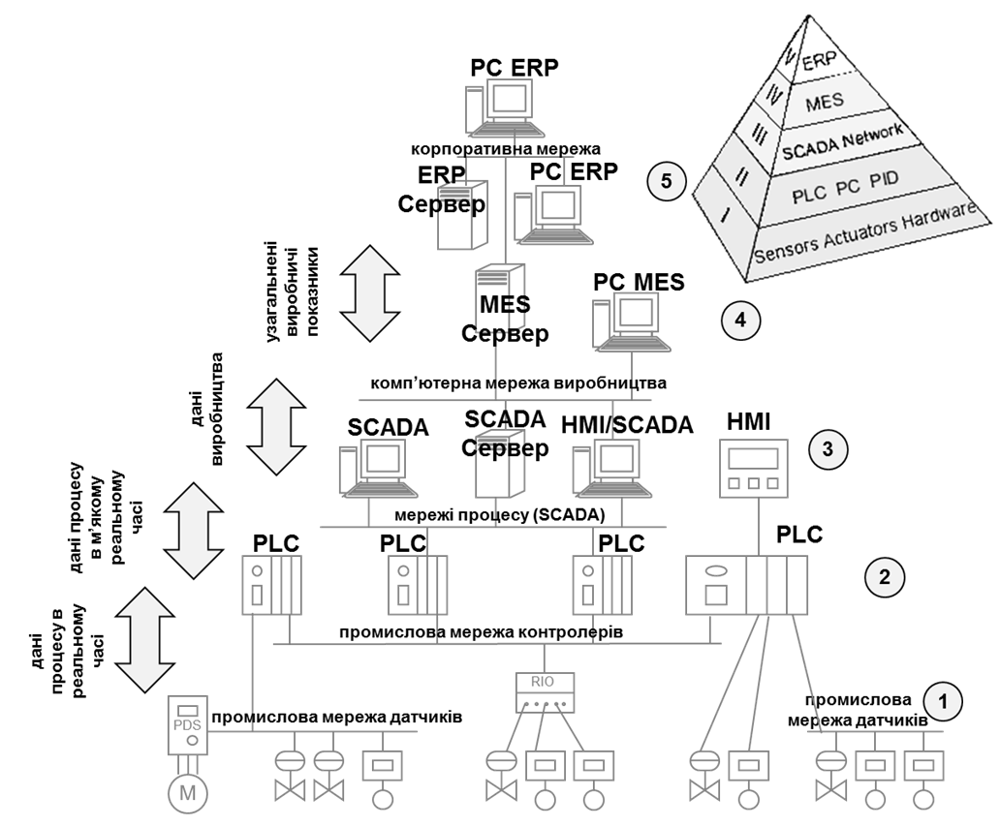

Рис. 1. Приклад узагальненої структури інтегрованої системи керування

Є суттєві відмінності у вимогах до інформаційних мереж (структури, технічного і програного забезпечення) які використовуються на різних рівнях керування. Мережі верхнього рівня є комп'ютерними мережами, які на сьогоднішній день типово організовані в єдину систему з використанням стеку TCP/IP, а на нижньому рівні часто базуються на провідних та безпровідних варіантах Ethernet. Про ці мережі можна ознайомитися в [розділі Основи комп'ютерних мереж](../../nets/README.md) . Нижній рівень часто базується на інших технологіях, які з одного боку у свій час розвивалися дещо окремо від комп'ютерних мереж а з іншого мають дещо інше призначення та вимоги до функціонування.  

### 1.2. Поняття реального часу

Один із ключових аспектів функціонування промислових мереж є забезпечення реального часу. **Реальний час** — режим роботи автоматизованої системи обробки інформації і керування, при якому враховуються обмеження на часові характеристики функціонування  (tвиконання < tмакс). **Жорсткий реальний час** — режим роботи системи, при якому порушення часових обмежень рівнозначно відмові системи і веде до неможливості вирішення поставленої задачі. **М'який реальний час** — режим роботи системи, при якому порушення часових обмежень призводять (тільки) до зниження якості роботи системи. Окремо також інколи виділяють **ізохронний режим** — режим роботи системи, при якому усі підсистеми виконують дії одночасно через чітко визначені проміжки
 (tмін < tвиконання < tмакс)

Будь-яка система називається **системою реального часу** (СРЧ), якщо правильність її функціонування залежить не тільки від логічної коректності обчислень, але і від часу, за який ці обчислення проводяться. 

Система керування, що працює у реальному часі, повинна: 

- зібрати дані, 
- провести їх обробку за заданими алгоритмами і 
- видати керувальні впливи 
- за такий проміжок часу, який забезпечує успішне вирішення поставлених перед системою завдань.

Функціонування розподіленої СРЧ можливе тільки при: 

- виконанні локальний функцій в РЧ 
- обміну даними в РЧ  

### 1.3. Обмін між засобами автоматизації в системах АСКТП 

Для того щоб зрозуміти призначення промислових мереж необхідно розглянути ті програмно-технічні засоби рівня АСКТП, які вони об'єднують і з якою метою. Ці засоби за функціональним призначенням можна класифікувати на:

- засоби людино-машинного інтерфейсу;

- контролери;

- периферійні пристрої;

- датчики/виконавчі механізми

- програматори/конфігуратори.

Необхідність їх інтеграції в єдину систему диктується функціональними а відповідно і інформаційними зв’язками. Розглянемо це для кожного конкретного типу засобу. 

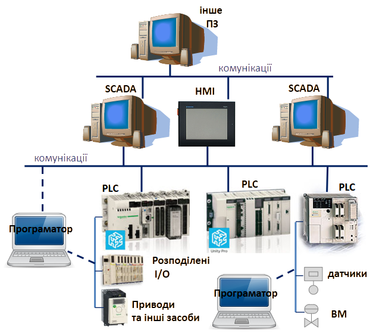

рис.2. Типи пристроїв АСУ ТП на базі SCADA (+PLC)

#### Обмін між контролерами

Пристрої з функціями автоматичного керування в даному посібнику будемо називати контролерами. Саме в них реалізуються алгоритми керування. До цих пристроїв можна віднести:

- ПЛК - програмовані логічні контролери (PLC - Programming Logical Controller);

- IBM РС-сумісні (PC-base) контролери;

- ОПЛК – ПЛК з вбудованою операторською панелю ОП (ОPLC);

- контролери-регулятори з мережним інтерфейсом.

У якості ПЛК у системах контролю й управління різними технологічними процесами у цей час застосовуються контролери як вітчизняних, так і закордонних виробників. У наведеному переліку до ПЛК також будемо відносити програмовані реле. До IBM РС-сумісних контролерів будемо відносити промислові IBM РС-сумісні ПК, які використовуються для задач автоматичного управління. ПЛК з вбудованими функціями ОП та регулятори з наявним мережним інтерфейсом також будемо відносити до даних засобів.  

У системах управління контролери повинні обмінюватись з периферійними пристроями та модулями вводу/виводу, іншими контролерами, програматорами, засобами людино-машинного інтерфейсу, а в деяких випадках і з засобами рівня АСУП. Розглянемо кожен з цих варіантів, щоб виділити потреби та відповідно вимоги до мереж. 

Обмін між контролерами відбувається для забезпечення наступних функцій (рис.3): 

- обмін даними процесу в реальному часі
- обмін діагностичними даними 
- обмін даними стану (системи з резервуванням)

У такому обміні ПЛК вважаються рівноправними учасниками, які виконують свої локальні завдання. Якщо ж ПЛК з точки зору керування виступає як підлеглий, такий обмін можна розглядати як частковий випадок обміну з розподіленою периферією.  

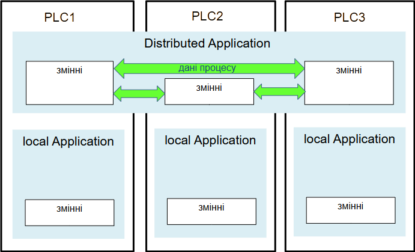

Рис.3. Обмін між контролерами

Під **даними процесу** розуміються дані, що циклічно в неперервному режимі отримуються з об'єкту керування та/або формуються для керування об'єктом. Така потреба виникає в системах з розподіленим керуванням, де кожен контролер забезпечує керування окремою ділянкою, але при цьому сумісно вони забезпечують координоване керування їх об'єднанням.  

Під **діагностичними даними** в даному контексті розуміється інформація про стан контролера або його підлеглих з точки зору наявності помилок та їх інтерпретації. 

При координації роботи декількох контролерів, необхідно побудувати канал зв’язку між ними з такими особливостями комунікаційного обміну:

-     наявність загальної бази даних процесу, яка циклічно (періодично) оновлюється;

-     обмін даними процесу та повідомленнями по запиту;

-     наявність реального часу;

Наявність загальної бази даних процесу або мережних змінних процесу необхідна у випадку коли одні і ті ж дані використовуються багатьма контролерами. Тобто дані процесу, які є джерелом інформації для одного контролера потрібні багатьом іншим контролерам цієї системи. У випадку коли дані необхідно відіслати тільки одному вузлу і тільки при певних подіях, є доцільним організовувати обмін даними по запиту. 

Окремо варто виділяти обмін між ПЛК в системах з резервуванням, де мережа слугує для виконання кількох функцій. На рис.4 показаний варіант реалізації такої системи, в якій є два ПЛК: первинний контролер, що працює в режимі керування процесом; резервний контролер, який в режимі "на підхваті", тобто пасивно спостерігає за процесом та за первинним контролером. Для такої схеми обидва контролери обмінюються статусною інформацією та образом процесу через спеціально виділену мережу `М2`, яка має забезпечити таку швидкість передачі, щоб при збої первинного контролеру, резервний на наступний цикл взяв на себе функції керування (гаряче резервування). Ця мережа також може забезпечувати синхронізацію завантажених проектів. Мережа `М3` має іншу функцію - забезпечити обмін даними з засобами вводу/виводу, і вона є спільною для обидвох ПЛК. Мережа `М1`забезпечує зв'язок з верхнім рівнем. Варто зауважити, що всі три наведені мережі мають різне призначення, наразі ми розглянули тільки зв'язок між ПЛК, нижче розглянемо інші звязки.             

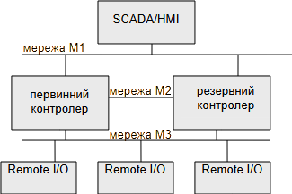

рис.4. Мережі в системах з резервуванням ПЛК

#### Обмін контролерів з периферійними засобами 

До периферійних засобів можна віднести різного роду інтелектуальні (intelligent) датчики та виконавчі механізми, які мають цифровий інтерфейс зв’язку, або засоби розподіленого/віддаленого вводу/виводу (Distributed I/O, Remote I/O). Останні забезпечують перетворення сигналів пристроїв зв’язку з об’єктом (ПЗО) в цифровий вигляд та навпаки та обмінюються даними вводу/виводу з процесорним вузлом (контролером). У зв’язку з подорожчанням кабельної продукції, здешевленням мікропроцесорної техніки, гнучкістю та зручністю експлуатації, живучості кінцевої системи – пристрої розподіленого вводу/виводу набувають великої популярності. На рис.5 наведені різні способи підключення периферійних пристроїв до контролерів.

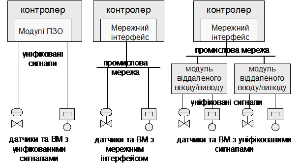

Рис.5. Різні способи підключення периферійних пристроїв до ПЛК

На сьогоднішній день існує велика гама пристроїв віддаленого вводу/виводу. Порівняно з технологією передачі уніфікованого сигналу (0-10В, 4-20 мА) цифровий зв’язок дає наступні переваги:

-     менш чутливий до зовнішніх завад;

-     дає можливість розширеної діагностики пристрою;

-     дає можливість змінювати конфігурацію у реальному часі без зупинки роботи управляючої програми;

-     дає можливість будувати системи з мережею без виділеного ведучого вузла.

Конфігурування польових периферійних пристроїв може проводитись за допомогою спеціальних засобів – конфігураторів, або безпосередньо самим контролером. 

Окремо необхідно виділити засоби управління приводами (POWER DRIVE SYSTEMS - PDS). До них відносяться перетворювачі частоти, сервоприводи та приводи з позиціонованням. Ці засоби, крім своїх основних функцій – керування двигунами, нерідко включають також функції контролера, людино-машинного інтерфейсу та функції вводу/виводу. Все що стосується особливостей обміну даними для вище наведених типів периферійних засобів, може бути актуальними і для PDS. З’єднання по цифровому зв’язку з PDS дає такі переваги:

- отримання всієї інформацію про стан привода та двигуна;

- повне керування приводом та двигуном;

- віддалене та швидке конфігурування системи приводу;

- менша витрата інформаційного кабелю порівняно зі зв’язком за уніфікованим сигналом 4-20мА/24В; 

- віддалена діагностика привода;

- можливість безпосереднього обміну між приводами. 

Розглянемо тепер обмін між контролерами та периферійними пристроями вводу/виводу або польовими засобами (наприклад перетворювач частоти, ПЧ). Щоб зрозуміти цей тип обміну треба представити що це спосіб реалізації обміну між процесорним модулем та іншими модулями в системі ПЛК. Тобто мережа в даному випадку має реалізовувати усі функції шини вводу/виводу ПЛК. Тобто щоб краще уявити як мережа має функціонувати, варт вважати що пристрої в цій мережі є віддаленими модулями ПЛК і мають реалізовувати наступний функціонал (рис.6):

- обмін даними процесу: ПЛК з пристроями обмінюються даними I/O в реальному часі
- обмін параметричними даними: ПЛК відправляє конфігураційні дані на пристрої (наприклад набір модулів на острові вводу/виводу) та параметричні дані їх налаштування (наприклад налаштування аналогових каналів);
- команди управління режимом роботи пристроїв: ПЛК керує станом пристроїв, наприклад переведення з режиму зупинки в режим виконання;
- діагностичні дані: ПЛК з пристроями обмінюється інформацією про стан а також причинами помилок.

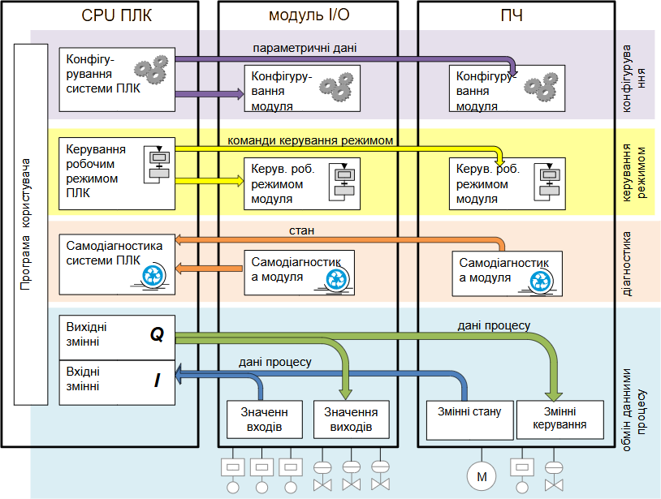

рис.6. Обмін між ПЛК та периферійними пристроями

Найкраще це зрозуміти через послідовність введення в дію. Припустимо до ПЛК (до CPU) підключено модуль вводу/виводу та перетворювач частоти (див.рис.6). Програміст створює проект для ПЛК, в якому конфігурується мережа, і в цю конфігурацію добавлено модуль з налаштуваннями та ПЧ. До того, як ПЛК запускається модуль I/O та ПЧ знаходяться в неопераційному режимі, оскільки їх головний керуючий їм не дав наказу на роботу. Після завантаження проекту в ПЛК та переведення його в режим RUN, процесорний модуль ПЛК (або його комунікаційний представник) завантажує конфігурацію та налаштування в модулі та ПЧ, та після їх готовності відправляє команду на їх запуск в операційний режим. У операційному режимі функціонує обмін даними процесу, та моніторинг стану модулів, а також моніторинг комунікаційного обміну модулями та ПЧ(щоб розуміти що CPU в роботі).  В ідеалі наведений алгоритм має однаково працювати як для локальних шин так і промислових мереж.

Особливістю апаратно-програмних засобів «контролерного» рівня керування заключаються у пред'явленні жорстких вимог до часу їх реакції на зміну даних процесу які поступають від датчиків та видачі управляючих дій на виконавчі механізми. Тобто вони повинні функціонувати в реальному для процесу часі.  Для цього типу зв’язку характерні такі особливості:

- циклічне (періодичне) відновлення даних на читання та запис;

- забезпечення реального часу;

- можливість прив’язки циклу мережі до циклу контролеру;

- можливість гарячого підключення засобів;  

Цикл мережі, тобто повний цикл опитування та відновлення інформації всіх засобів вводу/виводу, може проходити незалежно від циклу контролера, оскільки обмін даними між мережею і програмою контролера як правило проводиться через буфер обміну. Такий підхід максимально продуктивний, однак не завжди задовольняє вимогам процесу. Для деяких задач необхідна чітка синхронізація робочих циклів мережі і контролера. Тобто на початку циклу мережі опитуються всі засоби вводу, а в кінці відновлюються дані всіх засобів виводу.

Для багатьох процесів керування принциповою є можливість заміни або підключення нових віддалених засобів вводу/виводу в період функціонування мережі, так звана «гаряча заміна».     

#### Обмін між периферійними пристроями

Деякі реалізації надають можливість прямого обміну даними процесу між периферійними пристроями (рис.7).

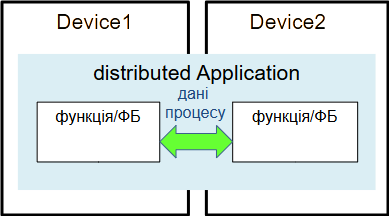

 рис.7. Обмін між периферійними пристроями

Слід зазначити, що мережі з реалізацією обміну між польовими (периферійними) вузлами без виділеного ведучого виключають наявність контролера шини в комунікаційному процесі, а отже - підвищують надійність системи. Однак така можливість доступна тільки для деяких промислових мереж. Слід зазначити, що на відміну від автоматизованих систем керування технологічними процесами (АСКТП) в системах керування інтелектуальними будівлями та будинками (системи SMART HOUSE та BMS – Building Management Systems) використання інтелектуальних датчиків та приводів є скоріше правилом ніж виключенням. 

#### Обмін SCADA/HMI та контролерами або периферійними пристроями

Основним завданням засобів SCADA/HMI є збирання, зберігання, попередня обробка, передача і відображення технологічної інформації (даних процесу) для забезпечення ефективної взаємодії системи управління і оператора.

Технічно вони можуть бути реалізовані як (рис.8):

-     термінали та операторські панелі (ОП);

-     автоматизовані робочі місця (АРМ) оператора виконані на базі промислового чи офісного персонального комп’ютера з встановленим спеціалізованим програмним забезпеченням - SCADA/HMI.

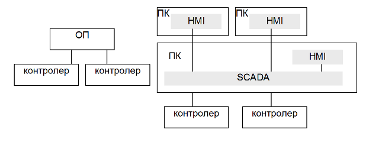

Рис.8. Реалізація засобів людино-машинного інтерфейсу в ІАСУ

Термінали та операторські панелі – це мікропроцесорні засоби людино-машинного інтерфейсу (HMI - Humain Machine Interface), в яких обов’язково присутній хоча б один інтерфейс підключення до цифрової мережі, за допомогою якого відбувається обмін даними з контролерами. На сьогоднішній день функціонально операторські панелі наближаються до ПК зі SCADA/HMI. 

АРМ на базі ПК з виконавчою системою HMI забезпечує відображення та зміну даних, що розміщені на серверах SCADA. Виконавчі системи SCADA (Supervisory Control And Data Acquisition - диспетчерське керування й збір даних) відіграють роль програм-серверів, які забезпечують збір, попередню обробку даних, опосередковану їх зміну та контроль значень (тривоги), ведення архіву та доступ до архівних даних. Таким чином HMI системи повинні мати доступ до даних реального часу, які акумулюються в серверах SCADA. Останні, в свою чергу, доступаються до даних контролерів, периферійних засобів, до інших SCADA, або до інших програмно-технічних засобів. Практично всі сучасні програмні пакети для побудови систем SCADA призначені також для побудови АРМ з функціями HMI, тому вони мають назву SCADA/HMI. Крім того виконавчі системи SCADA та HMI в автоматизованих системах середньої складності як правило виконуються на одному ПК.

Обмін між засобами SCADA/HMI та контролером в загальному зводиться до:

- двосторонній обмін даними процесу
- обмін діагностичними даними з ПЛК на SCADA/HMI
- керування станом ПЛК зі SCADA/HMI->PLC

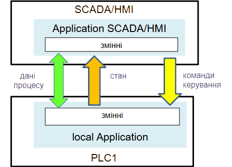

рис.8. Обмін між SCADA/HMI та контролерами

Незалежно від типу наведених вище засобів, їх вхідні дані процесу як правило повинні відновлюватись циклічно або періодично, з заданим інтервалом часу. Це обумовлено необхідністю з боку оператора контролю за процесом. У деяких випадках необхідно налаштувати надходження вхідних даних процесу в SCADA тільки при певній події, яка буде визначатись в контролері. Те саме стосується надходження даних з контролерів або з серверів SCADA в HMI. Більшість засобів SCADA/HMI передбачають можливість опитувати дані процесу з різною частотою. Передача даних в зворотному напрямку (SCADA->контролер, HMI->SCADA, ОП->контролер) відбувається, як правило, при зміні їх значень. 

Так як ОП та засоби SCADA/HMI призначені для контролю за даними процесу з боку оператора - це виключає необхідність забезпечення передачі інформації в жорсткому реальному часі. В більшості автоматизованих систем запізнення даних (невчасне їх оновлення) не є аварійно-небезпечним, але сигналізується засобами аварійно-попереджувальної сигналізації. Таким чином для засобів людино-машинного інтерфейсу виділимо наступні характеристики зв’язку:

- періодичне зчитування даних процесу з контролерів/периферійних засобів;

- запис значень даних процесу при їх зміні;

- м’який реальний час.

#### Обмін між SCADA/HMI

В автоматизованих інтегрованих системах управління може виникнути необхідність в обміні даними між ОП, системами SCADA/HMI у різній їх комбінації.  Тобто програмна та технічна інтеграція для наведених засобів передбачає об’єднання їх з контролерами або периферійними засобами та між собою. В свою чергу SCADA/HMI системи можуть обмінюватися даними з ПТЗ рівня АСУП. До цього обміну відноситься обмін даними процесу, діагностичними даними, архівними даними процесу та іншою інформацією. За певним виключенням цей обмін не характерний для промислових мереж, тому на ньому зупинятися не будемо. 

#### Обмін з програматорами/конфігураторами

В якості програматорів/конфігураторів можуть використовуватись або комп’ютери з встановленим спеціальним програмним забезпеченням або спеціалізовані пристрої. Незалежно від технічної реалізації засобів цього типу, вони необхідні лише для налаштування роботи інших ПТЗ в системі та їх діагностики. Програматори мають інтерфейс для підключення до мережі, який використовується тільки за необхідності перепрограмування або переконфігурування. Виділимо такі особливості обміну:

- підключення тільки за необхідності
- обмін параметричними даними для завантаження та вивантаження конфігурації
- обмін даними процесу як правило з метою налагодження  
- обмін діагностичними даними з метою налагодження 
- керування станом пристроїв

-     спеціально виділений логічний канал зв’язку;

-     низька пріоритетність повідомлень;

-     можливість гарячого переконфігурування системи зв’язку;  

В зв’язку з особливістю використання даних засобів, для них є доцільним резервувати окремий логічний канал, який при будь якій дійсній конфігурації системи буде вільним. Інакше можливе виникнення ситуації неможливості переконфігурування пристрою, внаслідок задіяння всіх можливих каналів, що є неприпустимим. Крім того, протокол мережі повинен бути забезпечений функціями запису конфігурації, діагностики, управлінням станом пристрою, тощо. 

Процес конфігурації одного вузла мережі, не повинен заважати її нормальному функціонуванню. Можливість гарячої заміни програми, або її частини, без зупинки роботи системи є одним із основних показників ефективності програмно-технічного комплексу. Низька пріоритетність повідомлень дає можливість не заважати реальному часу обміну між іншими вузлами на тій самій мережі.

Програматори/конфігуратори в основному оперують конфігураційними або іншими словами параметричними даними. Винятком є режим налагоджування, коли наладчику необхідно спостерігати та змінювати дані процесу. Слід зазначити, що параметричні дані на засоби вводу/виводу як правило пустапають не безпосередньо з конфігураторів, а через ведучий вузол мережі – контролер.    

#### Загальні властивості обміну даними/командами

У загальному серед усіх наведених вище обмінів можна виділити наступні:

- обмін даним процесу:
  - порівняно невеликі об'єми, які як правило включають тільки оперативні дані контролю та керування   
  - передбачають оновлення в реальному часі, або в м'якому реальному часі (SCADA/HMI)
  - для I/O циклічний/періодичний обмін або за зміни значення
  - має вище пріоритет за параметричний обмін конфігураційними даними  
- обмін параметричними даними:
  - порівняно великі обсяги даних, які вміщують програму, конфігурацію, параметри, тощо 
  - НЕ потребують реального часу
  - обмін тільки за необхідності: завантаження/вивантаження, зміна конфігурації 
  - мають низький пріоритет 
- обмін діагностичними даними:
  - передача стану пристрою передбачає циклічний обмін в реальному часі з високим пріоритетом  
  - передача причини помилки робиться за необхідністю (за запитом) низький пріоритет 
- керування станом/режимом:
  - переведення в режими:  операційний (Operate/RUN), зупинка (NotOperate/STOP) передопераційний (PreoPerate), ініціалізація (Init) , і т.д.    
  - передача команди за запитом користувача або керуючою системою
  - високий пріоритет

Цей перелік властивостей можна вважати функціональними вимогами до промислових мереж. Враховуючи різні особливості цих вимог для різних комбінацій підключень та чи інша промислова мережа має певну область застосувань, про що буде вказано нижче.  

Для підведення підсумку по інформаційній взаємодії між вузлами АСКТП, зведемо загальні характеристики такого обміну в таблицю (таб1.1). На перетині рядків та колонок вказуються характеристики інформаційного обміну між ПТЗ вказаному в найменуванні рядків та колонок. Для компактності введені скорочення. 

Таблиця 1. Наявність та характеристика інформаційного зв’язку між ПТЗ в ІАСУ

|                          | Засоби SCADA/HMI                                             | контролери  (PLC)                                            | периферійні засоби (RIO)                                     | програматори/ конфігуратори (PG)                             |
| ------------------------ | ------------------------------------------------------------ | ------------------------------------------------------------ | ------------------------------------------------------------ | ------------------------------------------------------------ |
| Засоби SCADA/HMI         | періодичне зчитування даних процесу  SCAD/HMI<-SCADA;  запис значень процесу SCADA/НMI  ->SCADA по запиту;  м’який реальний час; | періодичне зчитування даних процесу  SCAD/HMI<-PLC;   запис  значень процесу SCADA/НMI -> PLC по  запиту;  м’який  реальний час; | циклічне (періодичне) зчитування даних процесу SCAD/HMI<-RIO;   запис значень процесу   SCADA/НMI  -> RIO по запиту;    м’який  реальний час | підключення  до SCADA тільки при необхідності за-ливки файлів вико-нання (параметричних  даних); наявність команд діагнос-тики, зупинки, ре-старту виконавчої системи; |
| Контролери (PLC)         |                                                              | наявність загальної бази даних процесу, яка циклічно (періодично)  оновлюється; обмін даними  процесу та повідомленнями по запиту;  наявність реального часу; | циклічне (періодичне) відновлення даних процесу на  читання та запис;  забезпечення реального часу; можливість  прив’язки  циклу мережі до циклу контролеру; мож-ливість  гарячого підключення засобів; | підключення до  ПЛК тільки при необхідності;  наявність спеціально виділеного каналу зв’язку;  наявність команд на запис конфігурації (параметричні  дані), діагности-ки, зупинки, рестарту і інше.;   низька пріори-тетність повідом-лень (парметричних  даних); можливість гарячого переконфігурування системи зв’язку; |
| Периферійні засоби (RIO) |                                                              |                                                              | можливе тільки при наявності інтелекту в RIO з  можливістю програмування | аналогічно  RIO<->PLC                                        |
| Програматори (PG)        |                                                              |                                                              |                                                              | може  використовуватись для проектування з декількома розробниками |

<iframe width="560" height="315" src="https://www.youtube.com/embed/jPn2-9OfAEQ?si=BHoMJ-gLDblCE4By" title="YouTube video player" frameborder="0" allow="accelerometer; autoplay; clipboard-write; encrypted-media; gyroscope; picture-in-picture; web-share" referrerpolicy="strict-origin-when-cross-origin" allowfullscreen></iframe>

## 2. Функції та властивості промислових мереж

### 2.1. Означення промислової мережі та їх градація

Згідно українських стандартів ДСТУ, **Польова шина** – це локальна мережа з лінійною топологією, призначеною для інформаційного обміну між проблемно і об'єктно орієнтованими блоками (пристроями) та територіально розосередженими джерелами: датчиками, перетворювачами, засобами ручного введення) та приймачами (підсилювачами, виконавчими пристроями, засобами віддзеркалення інформації). В стандарті МЕК 61158 під терміном **Fieldbus** розуміється цифрова, послідовна, мультиточкова шина з промисловими інструментальними пристроями та пристроями управління такими як – але не обмежено ними – датчиками, виконавчими механізмами та контролерами. У даному посібнику англомовний термін Fieldbus (дослівний переклад „польова шина”) переводиться як "промислова мережа". В термінології МЕК є ряд обмежень, означені словами "шина" ("bus"), "мультиточкова" ("multipoint"), в які не вписуються ряд промислових мереж. У означенні ДСТУ фігурує централізований підхід, який характерний тільки для мереж рівня датчиків та виконавчих механізмів. Тому в даному посібнику під промисловою мережею розуміється промислова комунікаційна система з послідовною передачею бітів, яка використовує металевий кабель, оптоволокно або радіохвилі для зв’язку між мікропроцесорними засобами автоматизації. Слід зазначити, що в деяких джерелах терміни "польова шина" та "промислова мережа" не є синонімами. Означення, які наведені в даному посібнику  можуть не співпадати з прийнятими в інших джерелах.

У подальшому при розгляді матеріалу будемо використовувати умовний розподіл промислових мереж в залежності від області застосування на два рівня. 

- Рівень датчиків, завданням мереж якого є безпосереднє або через модулі/вводу виводу опитування датчиків і керування роботою різноманітних виконавчих механізмів. Умовно цей рівень можна розділити на два підрівня: рівень датчиків/виконавчих механізмів (Sensor/Actuator Level) та польовий рівня (Field Level). Перші призначені для роботи безпосередньо з інтелектуальними датчиками/ВМ, а другі для зв’язку з польовими засобами (розподіленим засобами вводу/виводу, приводними засобами, операторськими терміналами та панелями). В даному посібнику оба типи мереж відносяться до рівня датчиків. 

- Рівень контролерів (Controller level або Cell Level), промислові мережі якого приймають участь у вирішенні завдань по керуванню виробництвом в цілому або комплексом технологічних процесів і забезпечують обмін між контролерами, засобами SCADA/HMI та засобами рівня АСУП. 

Дане розділення є умовним і може не співпадати з прийнятими в інших джерелах. 

### 2.2. Функціональне призначення промислових мереж

Розглянуті у першому розділі типові програмно-технічні засоби та особливості обміну між ними дозволять визначити типові функції промислових мереж. До них можна віднести:

1.   Обмін даними процесу в реальному часі.

2.   Програмування та конфігурація вузлів.

3.   Діагностика вузлів.

4.   Керування станом вузла.

5.   Функції резервного переключення між вузлами мережі.

Обмін даними процесу в реальному часі - це одна з найважливіших функцій реалізації промислової мережі як рівня датчиків так і рівня контролерів. Дані технологічного процесу постійно змінюються в часі, тому необхідно їх доставити від джерела до споживача в потрібному обсязі, за означений інтервал часу. Доставка даних процесу в реальному часі є одним із показників ефективності конкретної реалізації мережі. Фізичні рамки реального часу чисельно означуються для конкретної системи керування. Тому одне рішення може задовольняти вимогам реального часу для однієї системи та зовсім не задовольняти для іншої.  

За допомогою функцій програмування та конфігурування вузлів більшість сучасних мікропроцесорних засобів, зокрема контролери та периферійні ПТЗ, можуть програмуватись з використанням спеціалізованого програмного забезпечення, встановленого на ПК або програматорі. На відміну від функцій обміну даними процесу, ці функції не накладають жорстких вимог до обміну в реальному часі. 

Діагностика роботи вузлів мережі є такою ж важливою, як і діагностика складових будь якої мікропроцесорної системи. Функції діагностики дозволяють визначити факт (функція виявлення аварії) та причину відмови пристрою (ідентифікація аварії), що дозволяє визначити та замінити дефектний вузол, а в системах з резервуванням (standby) – переключитися на резервні підсистеми. Вияв факту несправності вузла повинен бути визначений в режимі реального часу, для можливості зворотної реакції системи на збій, що особливо стосується функціонально-небезпечних процесів. Тому ця функція базується на високо-пріоритетних повідомленнях. Ідентифікація аварії як правило потрібна для обслуговуючого персоналу, для можливості усунення проблеми, тому особливих вимог до реального часу не потребує.   

Функції керування станом вузла необхідні для можливості запуску, перезапуску, зупинки роботи програмного забезпечення та ініціалізації вузла. Враховуючи можливість функціонування декількох вузлів в системі, команди керування станом вузла мають нижчий пріоритет перед обміном даними процесу в реальному часі.  

За рахунок функцій резервування вузлів в системі промислова мережа дає зручний і порівняно недорогий спосіб підвищення живучості та надійності системи. Технічні засоби систем з резервуванням діляться на основні або первинні (Primary) та резервні (Standby). В нормальному режимі функціонування у системі працюють основні вузли, у випадку виходу яких з ладу, їх функції беруть на себе резервні. В таких системах промислової мережі забезпечують можливість самодіагностики вузлів, тобто вияву дефектних засобів, переключення на резервні вузли та підтримку каналів зв’язку з основними та резервними засобами. Промислова мережа може забезпечити:

- резервування віддалених периферійних засобів;
- резервування контролерів;
- резервування серверів SCADA; 
- резервування каналів зв’язку: контролер <-> периферійні засоби, контролер <-> SCADA/HMI, контролер <-> контролер, і інші.

### 2.3. Обмін даними

Для забезпечення вищевказаних функцій в мережі циркулюють дані та команди. В свою чергу дані, можна умовно поділити на два типи: дані процесу та параметричні дані. Перший тип даних використовується для обміну даними процесу в реальному часі, а другі – для функцій програмування/конфігурування та функцій діагностики що відповідають за ідентифікацію несправності. 

В залежності від типу обміну (обмін даними процесу або параметричними даними) дані можуть бути наступних форматів:

- числові або аналогові (Integer/Word, Float/Real, Doubleword/Long);

- дискретні або бінарні (Digital/Boolean);

- часові (Time, Date, BCD, BinaryTime)

- масиви та блоки даних (Array, Datablock);

- структурні дані;

- строкові (String);

Перші три групи відносяться до типів фіксованої довжини. Текстові типи можуть відрізнятися своїм форматом. Передача структурних даних є необов’язковою, однак може значно підвищити функціональність мережі та полегшити роботу розробників системи. До обміну структурними даними будемо також відносити об’єктний підхід, при якому одна прикладна сутність доступається до властивостей та методів об’єкту іншої прикладної сутності. Таким чином доступ до даних при такому підході – це доступ до методів та властивостей об’єкту.

В одній і тій самій системі можуть бути дані, які необхідно відновлювати постійно (циклічно або періодично) та по необхідності. Можна навести такі схеми відновлення за періодичністю:

- **циклічне** відновлення: відновлення даних проходить регулярно, повторюючись, тобто після чергового відновлення всіх даних – цикл повторюється;

- **періодичне** відновлення: циклічне відновлення з постійною тривалістю циклу; тобто через задані інтервали часу нові дані надходять від джерела до споживача;

- **ациклічне(аперіодичне) при зміні значення** даних або їх стану: дані відправляються від джерела до споживача тільки при зміні їх значення.

- **ациклічне(аперіодичне) по запиту**: дані надходять до споживача після його запиту.

Циклічне відновлення проходить постійно, з мінімально можливими паузами між циклами відновлення даних. Періодичне відновлення теж проходить по циклу, але через рівні інтервали часу, що чітко визначає рамки часу доставки даних. Обидва способи використовується для обміну даними процесу. Недоліком обидвох способів є постійне завантаження мережі даними, які передаються. Так, наприклад, у працюючій системі протягом певного часу може не бути ніяких змін у технологічному процесі, але по промисловій мережі будуть курсувати одні і ті ж значення даних. Може бути і інша ситуація: в межах циклу опитування даних відбудеться зміна їх значень, які система не встигне передати. Перевагою періодичного способу є можливість визначення мережного трафіку, який витрачається на цей обмін. 

Для циклічного та періодичного відновлення характерна циклічність операцій. Тому надалі в порівняльних характеристиках їх будемо називати одним терміном - циклічно-періодичні, якщо не буде вказано інше. Циклічно-періодичні операції відновлення можуть проходити шляхом як зчитування даних з джерела так і шляхом відправки даних самим джерелом.  

Альтернативою циклічно-періодичному відновленню для обміну даними процесу може бути відправка джерелом значень ациклічно (в посібнику також використовується термін аперіодично, як синонім), тільки у разі їх зміни. Така схема ініціації відправки даних також називається подійно-орієнтована (event-triggered). У цьому випадку значно заощаджуються ресурси промислової мережі, оскільки більшу частину часу дані не змінюються. Недоліком такого способу є невизначеність в завантаженні мережі в кожний момент часу. 

Ациклічне відновлення по запиту більш підходить до ситуацій, коли у разі виникнення визначеної події споживачу необхідно зчитати певні дані з джерела. Як правило таким способом користуються при доступі до параметричних даних, однак він може використовуватись і при доступі до даних процесу. При відновленні даних цим способом витрачається додатковий час на формування, відправку та обробку запитів. 

У деяких системах є необхідність прив’язки ініціації певних дій до  конкретних часових або синхронізуючих міток. Це потрібно для синхронності (одночасності) виконання цих дій на декількох (або на всіх) вузлах мережі. До синхронних дій можна віднести одночасне відновлення вхідних даних (одночасне зчитування входів вузлів у їх вхідні буфери), одночасне відновлення вихідних даних (одночасний запис значень вихідних буферів вузлів на їх виходи), одночасну передачу даних в мережу. 

При передачі даних говорять про **синхронну** або **асинхронну** передачу. Асинхронна передача не прив’язана до синхронізуючих сигналів і може початися у довільний момент, тоді як синхронна – тільки після появи певного синхросигналу.

Особливий вид синхронних дій – **ізохронна** передача, яка передбачає передачу даних через постійні інтервали часу. Особливістю ізохронної передачі порівняно з періодичною є обов’язкова синхронність роботи внутрішніх тактових годинників, на яких базується ізохронна передача. Інакше кажучи ізохронна передача більш жорстко визначає рамки періодичності відновлення даних.  

Синхронність та ізохронність використовується наприклад, при необхідності синхронізувати робочі цикли контролера і мережі. Інший приклад – задача позиціонування з використанням електроприводів PDS, де синхронна та ізохронна передача є принципово необхідною. 

Розглянемо це на прикладі. Реалізація промислової мережі дає можливість віддаленому пристрою вводу/виводу (надалі пристрій) відправляти дані у будь-який момент часу (наприклад з використанням мережі CANOpen). Продемонструємо яким чином буде відбуватися передача значень входів даного пристрою при:

1)   аперіодичному відновленні, по зміні значення асинхронно;

2)   періодичному відновленні (кожні 500 мс) асинхронно;

3)   аперіодичному відновленні, по зміні значення синхронно з початком циклу контролера;

4)   періодичному відновленні (кожні 500 мс), по зміні значення синхронно з початком циклу контролеру;

Варіант 1. Пристрій опитує входи з максимальною швидкістю. Як тільки значення одного із його входів змінилось, воно відправляється контролеру при наданій можливості передачі.

Варіант 2. Кожні 500 мс пристрій опитує свої входи і при наданій можливості передачі відразу відправляє їх на контролер, незалежно від їх значення.

Варіант 3. Пристрій опитує входи з максимальною швидкістю. Контролер генерує синхросигнал на початку кожного робочого циклу (для прикладу цикл контролеру 100 мс). Після отримання синхроімпульсу, значення входів передається контролеру, якщо їх стан змінився з попередньої передачі.

Варіант 4. Кожні 500 мс пристрій опитує входи. Контролер генерує синхросигнал на початку кожного робочого циклу (для прикладу цикл контролеру 100 мс). Пристрій передає значення входів тільки після отримання синхроімпульсу.

Як бачимо, в третьому випадку відновлення входів пристрою для контролеру буде відбуватися з дискретністю 100 мс, але тільки в момент зміни їх значення. У четвертому випадку значення входів пристрою для контролера буде відновлятися з періодичністю 500 мс. В обидвох випадках відновлення входів контролеру буде проходити на початку його робочого циклу. 

### 2.4. Загальні вимоги до промислових мереж

Промислові мережі споріднені комп’ютерним мережам, однак порівняно з останніми, вимоги до промислових мереж дещо відрізняються. Ідеальний варіант промислової мережі повинен задовольняти наступним вимогам.

1. Властивість детермінованості.

2. Завадостійкість та промислові умови експлуатації.

3. Надійність та живучість.

4. Простота, зручність інсталяції та обслуговування.

5. Можливість подачі живлення по кабельній системі мережі.

6. Вільна топологія.

#### Детермінованість

Властивість детермінізму тісно пов’язана з реальним часом, про який вище було неодноразово згадано. Слід звернути увагу, що промислова мережа повинна забезпечити своєчасну доставку та цілісність даних процесу. З іншого боку, промислова мережа повинна забезпечити ациклічний обмін параметричними даними, які можуть бути передані без чіткого означення часу їх доставки, однак в межах допустимого. Так, наприклад, одночасно із обміном даними процесу з розподіленими модулями вводу/виводу, необхідно змінювати конфігурацію одного з них. 

З вищесказаного можна зробити висновок, що промислова мережа повинна надавати можливість обміну обидвома типами даних, тобто надавити час для реал-тайм трафіку (для обміну даними процесу) та не реал-тайм трафіку (для обміну параметричними даними). Це можливо при умові означення пріоритетності повідомлень для обміну даними процесу, або розділення загального мережного часу на циклічно-періодичний обмін даними процесу та ациклічний обмін параметричними даними. 

Слід зазначити, що не всі промислові мережі гарантують повну детермінованість. Навіть при чіткому розумінні побудови протоколу, деякі програмно-технічні засоби, наприклад ПК з офісними операційними системами (наприклад Widows) можуть внести певну невизначеність у роботу мережі. 

Для комп’ютерних мереж наявність повної детермінованості не є обов’язковою. Для класичного та комутованого Ethernet ця особливість є одним із каменем спотикання визнання її в області промислових мереж. Детальніше про це можна прочитати в розділі 10 даного посібника.  

#### Завадостійкість та промислові умови експлуатації

В промислових умовах експлуатації поряд з кабелем мережі може знаходитися силове електрообладнання, що може спричинити спотворення корисного сигналу самоіндукуючими паразитними струмами. Для боротьби з цим явищем у промислових мережах використовують спеціальні методи кодування/модуляції бітової послідовності, екранований кабель, захисне зміщення і інше. 

Промислові умови експлуатації, які обумовлюються надмірними температурами, вологістю, вібрацією або іншими кліматичними факторами потребують використання кабельної продукції і комутуючих засобів (конектори, роз’єми, коробки і інше) спеціального виконання. В деяких випадках є необхідність в іскробезпечному виконанні мережі, що накладає додаткові вимоги на середовище та способи передачі даних. 

Щодо пило- та вологозахисту технічних засобів в промислових мережах, згідно стандартів IEC 529, EN 60529 та ГОСТ 14254-96, всі електричні засоби прийнято класифікувати та маркувати по ступені захисту **IP**-кодом (Ingress Pritection). ІР-код - це двохзначне число, перша цифра якого вказує на ступінь захисту електрообладнання від твердих тіл, а друга – від води. Чим більше ці цифри, тим краще оболонка (корпус) засобу захищає його від попадання твердих тіл або рідини. 

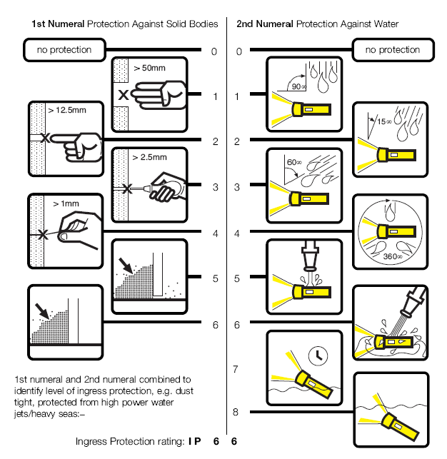

рис.9. Ступінь захисту IP 

Перша цифра ІР вказує на наступні ступені захисту електрообладнання від твердих тіл: IP 0x – захисту немає; IP 1x – захист від твердих тіл >50 мм (захист від проникнення в корпус руки); IP 2x – захист від твердих тіл >12 мм (захист від проникнення в корпус пальця); IP 3x – захист від твердих тіл >2.5 мм (захист від проникнення в корпус інтсрументу); IP 4x - захист від твердих тіл >1 мм (захист від проникнення невеликих тіл: гвинти, гайки і т.п.); IP 5x – пилозахищеність (пил може попадати всередину в дуже малих кількостях); IP 6x – пилонепроникність (повне виключення попадання пилу); 

Друга цифра ІР вказує на наступні ступені захисту електрообладнання від води: IP x0 – захисту немає; IP x1 – захист від вертикальних капель (попадання капель зверху на засіб не порушує його роботу); IP x2 – захист від капель, що падають під кутом <=15 град до вертикалі; IP x3 – захист від падаючих бризк під кутом <=60 град до вертикалі (захист від дощу); IP x4 – захист від бризк в будь якому напрямку; IP x5 – захист від струй води в будь якому напрямку; IP x6 – захист від морських хвиль (допускається короткочасне погруження в рідину); IP x7 – доступне короткочасне знаходження в рідині на глибині до 1 м; IP x8 – повна водонепроникність (допускається постійне знаходження на глибині 1м);

Якщо в коді замість однієї цифри вказується літера Х, то ступінь захисту по цій категорії не обумовлюється.

Згідно ГОСТ 14254-96, ІР код може бути доповнений однією додатковою та однією допоміжною літерами. Перша додаткова літера вказує на захист від доступу до небезпечних частин електрообладнання. Вона вказується тільки у випадках, якщо першої цифри в ІР-коді немає, або ступінь захисту від доступу до небезпечних частин вище ніж обумовленою нею. Друга допоміжна літера, доповнює інформацію про ступінь захисту, яка вказується в описі самого приладу. 

Позначення додатковою літерою степені захисту від доступу до небезпечних частин: ІР ххАх – захищено від доступу тильною стороною руки; ІР ххBх – захищено від доступу пальцем руки; ІР ххCх – захищено від доступу інструментом; ІР ххDх – захищено від доступу дротом.  

Так код ІР 23 CS, буде характеризувати таку ступінь захисту: (2) – оболонка захищає людей від доступу до небезпечних частин пальцями рук; захищає обладнання всередині оболонки від попадання зовнішніх твердих предметів діаметром, рівним або більшим 12,5 мм; (3) – оболонка захищає обладнання всередині оболонки від шкідливої дії води в виді дощу; (С) – оболонка захищає людей від доступу до небезпечних частин, якщо вони тримають в руках інструмент діаметром, рівним або більшим 2,5 мм, і довжиною, яка не перевищує 100 мм (інструмент може проникати на всю свою довжину в оболонку); (S) – оболонка піддана випробуванню на відповідність захисту від шкідливих дій внаслідок попадання води, коли всі її частини обладнання знаходяться в стані нерухомості. 

Стандарт IEC EN 62262 (попередня версія EN 50102) визначають ступінь захисту електрообладнання від механічної дії (ударостійкість). Цей захист визначається **ІК**-кодом, який вказує на максимальну енергію удару, яку витримує оболонка засобу: IK00 (0 Дж), IK01(0,14 Дж), IK02(0,2 Дж), IK03(0,35 Дж), IK04(0,5 Дж), IK05(0,7 Дж), IK06(1 Дж), IK07(2 Дж), IK08(5 Дж), IK09(10 Дж) IK10(20 Дж). 

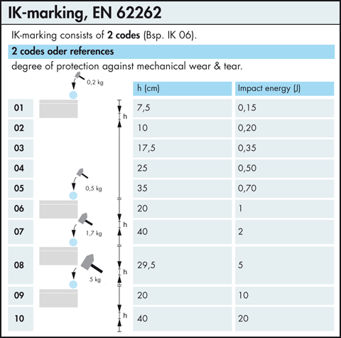

рис.10. Ступінь захисту від механічної дії IK 

Також може передбачатися EX виконання (вибухозахищене) згідно IEC 60079 - це класифікація вибухонебезпечних зон та маркування вибухозахищеного обладнання. Ex-вироби - це вироби, які повністю або частково використовуються для використання електричної енергії і включають один або більше видів вибухозахисту для умов потенційно вибухонебезпечного газового середовища. До таких, поряд з іншими, належать пристрої для вироблення, передачі, розподілу, зберігання, вимірювання, регулювання, перетворення та споживання електричної енергії, пристрої електрозв'язку, а також вироби, що застосовуються у вибухонебезпечних зонах, які можуть бути джерелом займання. Ex-компоненти – частини Ex-виробу, які окремо у вибухонебезпечному середовищі не використовують; при вбудовуванні в Ех-обладнання Ex-компонентів обов'язково потрібно підтвердження відповідності їх вибухозахисних властивостей вимогам нормативних документів. Ех-системи - агрегати із з'єднаних між собою Ех-виробів, у яких з'єднання має бути виконане відповідно до описового документа системи, з тим, щоб воно відповідало вимогам вибухозахисту. Ех-обладнання - загальний термін, що застосовується до Ех-виробів (пристроїв), компонентів та систем.

Таким чином промислові умови експлуатації для промислових мереж обумовлюються спеціальними виконаннями технічних засобів та матеріалів, такими як: тип кабелю, ступінь захисту по IP, по IK, по NEMA, захист від агресивних середовищ, вібростійкість та ін.  

#### Надійність та живучість 

Надійність системи перш за все залежить від надійності її компонентів та структури мережі. Мережні технології дають можливість будувати системи з резервуванням, що дозволяє збільшити надійність роботи мережі або окремих її компонентів. Резервування окремих, найменш надійних мережних компонентів дозволяє збільшити живучість системи. Однак слід зазначити, що надійність у більшості випадків реалізується на рівні програмно-апаратного забезпечення вузлів, а не мережних компонентів. В свою чергу протоколи промислових мереж повинні забезпечити можливість діагностики мережі, для своєчасного виявлення дефектних вузлів, а самі мережні компоненти повинні мати надійність значно вищу ніж мережні вузли.

В промислових мережах необхідно, щоб при виявленні дефектного вузлу,  він автоматично відключався, не порушуючи працездатність всієї мережі. Це здійснюється засобами самодіагностики мережних адаптерів, які можуть перевести вузол у режим аварійної зупинки, відправити сигнал аварії слідкуючому пристрою і відключитись від комунікаційного обміну.

#### Простота, зручність інсталяції та обслуговування

В промислових умовах експлуатації простій обладнання може привести до аварійної зупинки виробничої лінії, що відповідно приводить до втрат різного характеру. Тому обслуговуючий персонал, наприклад служба КВПіА, повинен швидко виявити причину зупинки та замінити дефектну частину системи, при цьому не зупиняючи функціонування мережі. Гаряча заміна вузлів, або їх частини – одна з основних вимог до промислових мереж. Процедура заміни або добавлення нового вузла повинна проходити швидко та легко. 

Для прикладу, можна привести процедуру добавлення нового вузла на шину AS-і, де кабель мережі у необхідному місті просто проколюється самою коробкою-адаптером підключення. При відключенні адаптеру, гумова ізоляція кабелю повертає його до попереднього стану 

Для промислових мереж бажана наявність таких властивостей: 

- мережні компоненти підключаються через конектори, в гіршому випадку через легкодоступні гвинтові або пружинні з’єднувачі, але ніяк не через пайку; 
- мінімальна конфігурація (наприклад мережна адреса) для вузлів розподіленої периферії виставляється через перемикачі безпосередньо на пристрої; 
- можливість гарячої заміни вузлів та складових мережі.   

#### Живлення вузлів по кабелю мережі

Це важлива але не принципова вимога до промислових мереж. Живлення як правило потрібне датчикам та виконавчим механізмам, які підключаються до мережі. Щоб не прокладати живлення окремим кабелем, воно подається по тому ж самому кабелю, що і цифровий сигнал, а інколи і по тій самій інформаційній парі проводів, створюючи несучий сигнал для модуляції. Сучасні мережі рівня датчиків як правило забезпечують можливість живлення датчиків по мережі. 

#### Вільна топологія

Потрібна топологія мережі диктується територіальним розміщенням мережних вузлів. Тому в ідеальному варіанті мережа повинна мати вільну топологію, що особливо актуально для мереж рівня датчиків та виконавчих механізмів. Однак більшість промислових мереж мають шинну топологію, рідше – дерево видну або кільцеву. Для деяких мереж топологію можна вибрати, виходячи з вимог та обмежень поставленої задачі.

Для вибору потрібної топології, у деяких мережах використовуються спеціальні адаптери. Інший шлях – побудова інтермереж з використанням міжмережних адаптерів (мостів, шлюзів).

### 2.5. Характеристики промислових мереж 

Таким чином промислові мережі виділяються серед комунікаційних систем характеристиками, які зведені в таблицю 2.

Таблиця 2. Характеристики промислових мереж (Підсумкова таблиця)

|                             |                                                              |
| --------------------------- | ------------------------------------------------------------ |
| Визначення                  | Промислова  мережа – промислова комунікаційна система з послідовною передачею  бітів, яка використовує металевий кабель, оптоволокно або радіохвилі для  зв’язку між мікропроцесорними засобами автоматизації. |
| Градація                    | - рівень датчиків (включає рівень  польових засобів);   - рівень контролерів; |
| Функціональне призначення   | 1.Обмін даними процесу в реальному часі (обмін даними процесу).   2.Програмування та конфігурування вузлів (обмін параметричними даними).   3.Діагностика вузлів.   4.Керування станом вузла.   5.Функції резервного переключення між вузлами мережі. |
| Обмін даними                | 1. Призначення даних:   a. обмін даними процесу та станом;   b. обмін параметричними даними;   2. Формати даних: числові (аналогові);  дискретні (бінарні); часові; масиви (блоки даних); структурні дані  (+об’єктний підхід);строкові.   3. Спосіб відновлення даних   -   циклічне відновлення(дані процесу);   -   періодичне відновлення (дані  процесу);   -   ациклічне при зміні значення  (дані процесу);   -   ациклічне по запиту  (параметричні дані або дані процесу);   4. Часова синхронізація   -   синхронна передача   -   асинхронна передача |
| Вимоги до промислових мереж | 1. Властивість  детермінованості (для обміну даними процесу).    2. Завадостійкість та  промислові умови експлуатації.    3. Надійність та живучість.    4. Простота, зручність  інсталяції та обслуговування.    5. Можливість подачі живлення  по кабельній системі мережі.    6. Вільна топологія. |

## Питання для самоперевірки

1.   Де і для чого використовуються на підприємстві обчислювальні мережі.  
2.   Що значить термін "реальний час".
3.   Які засоби підключаються до промислових мереж і з якою метою.
4.   З якими засобами, якими даними і для чого обмінюються промислові контролери.
5.   З якими засобами, якими даними і для чого обмінюються периферійні пристрої.
6.   З якими засобами, якими даними і для чого обмінюються засоби SCADA/HMI.
7.   З якими засобами, якими даними і для чого обмінюються конфігуратори та програматори.
8.   Дайте означення промисловій мережі, яке використовується в ДСТУ (під терміном "польова шина"), в МЕК (під терміном "fieldbus") та в даному посібнику. 
9.   Як діляться промислові мережі по області застосування?
10.   Перерахуйте та коротко охарактеризуйте типові функції які виконують промислові мережі.
11.   Поясніть в чому особливості обміну даними процесу в реальному часі. 
12.   Поясніть призначення функцій діагностики, конфігурування/програмування, управління станом вузла?
13.   Наведіть приклад використанням промислових мереж при резервуванні вузлів.
14.   Класифікуйте за призначенням дані, які циркулюють в промисловій мережі.
15.   Якими форматами даних як правило обмінюються в промислових мережах?
16.   Класифікуйте тип обміну даними за циклічністю. Наведіть приклади для використання кожного типу.
17.   Синхронна, асинхронна та ізохронна відправка даних. Наведіть приклади необхідності синхронної передачі.
18.   Перерахуйте та коротко охарактеризуйте вимоги, що накладаються на промислові мережі.
19.   В чому полягає властивість детермінованості промислових мереж? На доставку яких даних накладаються умови детермінованості.
20.   В чому полягає завадостійкість та промислові умови експлуатації? Розкажіть про ступінь захисту ІР. На що вказує ІК код? 
21.   В чому полягає надійність та живучість промислової мережі?
22.   Чим пояснюється вимоги до простоти, зручності інсталяції та обслуговування, живлення вузлів по кабелю мережі, вибір вільної топології?

<iframe width="560" height="315" src="https://www.youtube.com/embed/pK29BfDRVtA?si=_Sa9_VVAiU2N2Fmx" title="YouTube video player" frameborder="0" allow="accelerometer; autoplay; clipboard-write; encrypted-media; gyroscope; picture-in-picture; web-share" referrerpolicy="strict-origin-when-cross-origin" allowfullscreen></iframe>

Теоретичне заняття розробив [Олександр Пупена](https://github.com/pupenasan). 
