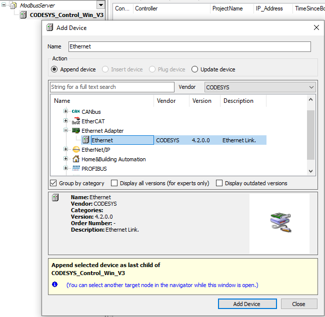
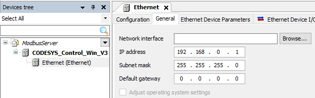
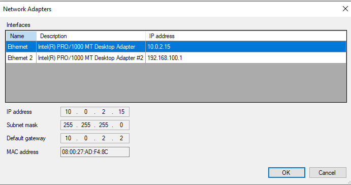
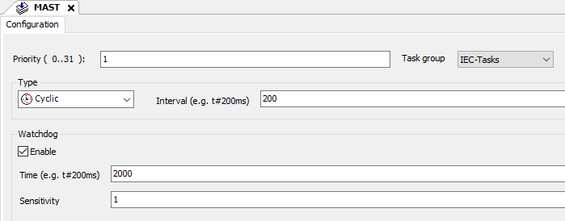
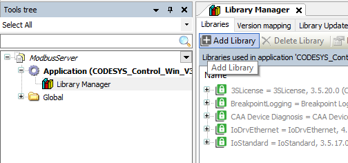
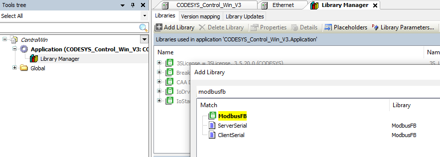
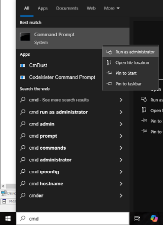
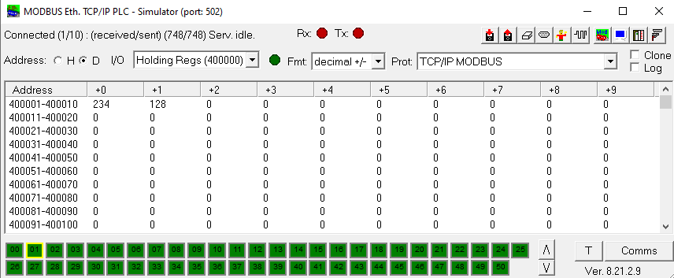
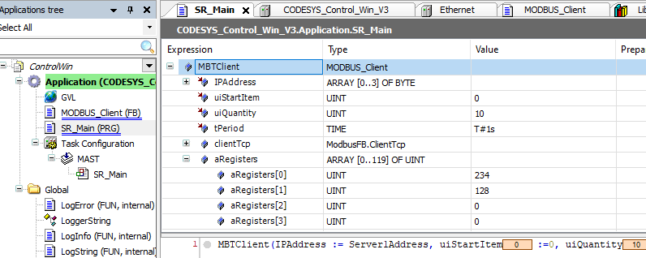

[<- До підрозділу](README.md)	[CODESYS (загальні теми)](../../plc/codesys.md) 	[PLC MachineStruxure M241, M251, M262 та інші](../../plc/ecostruxuremachineexpert.md) 	[Коментувати](#feedback)

# Реалізація Modbus TCP Client в CODESYS Control Win з використанням бібліотеки ModbusFB 

## Теоретична частина

У CODESYS Control Win та в інших PLC під CODESYS є кілька варіантів реалізації Modbus TCP Client. Здебільшого в PLC він реалізований на рівні операційної системи і не потребує написання коду. Однак у ряді випадків потребується програмна реалізація. Зокрема це може бути пов'язано з необхідністю перевірки роботи програми без наявного PLC у зв'язці з іншими програмними засобами, наприклад іншими PLC. Цей варіант потребує використання повноцінного середовища виконання, наприклад з використанням CODESYS Control Win. 

Серед доступних бібліотек для реалізації Modbus є ModbusFB, яка описана в [онлайн довіднику ModbusFB](https://content.helpme-codesys.com/en/libs/ModbusFB/Current/ModbusFB/fld-ModbusFB.html). Реалізація Modbus TCP Client  і з використанням цієї бібліотеки і є предметом даного розідлу.

### `ClientTCP` 

Зверніть увагу: деякі вхідні змінні, що стосуються конфігурації з’єднання, зчитуються під час фронту сигналу xConnect (перехід FALSE → TRUE). Щоб змінити конфігурацію з’єднання, прикладна програма повинна:

- роз’єднатися (xConnect := FALSE і виконати FB)
- змінити відповідні вхідні змінні
- під’єднатися (xConnect := TRUE і виконати FB)

Client надає певну статистику відправлених повідомлень запиту та отриманих коректних повідомлень відповіді. Некоректні повідомлення відкидаються на рівні комунікації, тому не відображаються у статистиці. Для аналізу ситуацій, коли можуть виникати некоректні повідомлення відповіді, можна використовувати udiLogOptions з LoggingOptions.WarnOnReceivedInvalidFrames.

Inputs

| Name            | Type                 | Initial                                | Comment                                                      |
| --------------- | -------------------- | -------------------------------------- | ------------------------------------------------------------ |
| xConnect        | BOOL                 | FALSE                                  | Підключитися до сервера (slave).                             |
| aIPAddr         | ARRAY [0..3] OF BYTE | [255, 255, 255, 255]                   | IP-адреса ETH сервера (slave), зчитується лише при фронті xConnect. |
| uiPort          | UINT                 | 502                                    | Порт ETH сервера (slave), зчитується лише при фронті xConnect. |
| tConnectTimeout | TIME                 | TIME#1s0ms                             | Тайм-аут підключення (у мс), зчитується лише при фронті xConnect. |
| udiLogOptions   | UDINT                | LoggingOptions.ClientConnectDisconnect | Опції журналювання (logging).                                |

Outputs

| Name                        | Type  | Comment                                                      |
| --------------------------- | ----- | ------------------------------------------------------------ |
| xConnected                  | BOOL  | Клієнт (master) підключений до сервера (slave).              |
| xError                      | BOOL  | Помилка.                                                     |
| eErrorID                    | Error | Статус помилки.                                              |
| udiNumMsgSent               | UDINT | Кількість повідомлень запиту, відправлених з моменту підключення. |
| udiNumMsgReply              | UDINT | Кількість повідомлень відповіді, отриманих з моменту підключення. |
| udiNumMsgExcReply           | UDINT | Кількість повідомлень відповіді з виключенням (exception), отриманих з моменту підключення. |
| udiNumMsgExcReplyIllFct     | UDINT | Кількість повідомлень відповіді з виключенням, що сигналізують про недопустиму функцію. |
| udiNumMsgExcReplyIllDataAdr | UDINT | Кількість повідомлень відповіді з виключенням, що сигналізують про недопустиму адресу даних. |
| udiNumReplyTimeouts         | UDINT | Кількість тайм-аутів відповіді з моменту підключення.        |
| udiNumReqNotProcessed       | UDINT | Кількість запитів, не оброблених вчасно (“голодування запитів”). |
| udiNumReqParamError         | UDINT | Кількість запитів, запущених з помилкою параметрів.          |
| udiLastTransactionTime      | UDINT | Час транзакції в мс — різниця між відправленням запиту та отриманням відповіді. |


### `ClientRequestReadHoldingRegisters` 

Клієнтський запит ReadHoldingRegisters (функція FC03).

Inputs

| Name            | Type                            | Initial     | Comment                                                      |
| --------------- | ------------------------------- | ----------- | ------------------------------------------------------------ |
| xExecute        | BOOL                            |             | Фронт сигналу: запускає означену операцію. FALSE: скидає означену операцію після досягнення стану ready. |
| udiTimeOut      | UDINT                           |             | Максимальний час виконання операції [µs], 0 – без обмеження часу. |
| uiUnitId        | UINT                            | 0           | Unit-ID пристрою, якому надсилається запит.                  |
| udiReplyTimeout | UDINT                           | (50 * 1000) | Тайм-аут відповіді в µs – максимально допустимий час між відправленням запиту та отриманням відповіді, за замовчуванням 50 ms. |
| uiMaxRetries    | UINT                            | 0           | Максимальна кількість повторних запитів у випадку тайм-ауту відповіді. |
| uiStartItem     | UINT                            | 0           | Перший “елемент даних” для читання.                          |
| uiQuantity      | UINT                            | 1           | Кількість “елементів даних” для читання. ReadCoils / ReadDiscreteInputs: 1..2000; ReadHoldingRegisters / ReadInputRegisters: 1..125. |
| pData           | POINTER TO ARRAY [0..0] OF UINT | 0           | Вказівник на масив результатів; пам’ять повинна бути виділена викликаючою стороною. |

Outputs

| Name       | Type           | Comment                                                    |
| ---------- | -------------- | ---------------------------------------------------------- |
| xDone      | BOOL           | Досягнуто стану ready.                                     |
| xBusy      | BOOL           | Операція виконується.                                      |
| xError     | BOOL           | Досягнуто стану помилки.                                   |
| eErrorID   | Error          | Статус помилки.                                            |
| eException | ExceptionCodes | Код виключення запиту.                                     |
| uiRetryCnt | UINT           | Кількість повторних запитів у випадку тайм-ауту відповіді. |

InOut

| Name    | Type   | Comment              | Inherited from |
| ------- | ------ | -------------------- | -------------- |
| rClient | Client | Посилання на Client. | ClientRequest  |

### `ClientRequestWriteMultipleRegisters` 

Input

| Name            | Type                            | Initial | Опис                                                         |
| --------------- | ------------------------------- | ------- | ------------------------------------------------------------ |
| xExecute        | BOOL                            |         | Фронт TRUE запускає визначену операцію. FALSE скидає визначену операцію після досягнення стану готовності. |
| udiTimeOut      | UDINT                           |         | Максимальний час виконання операції (мкс). 0 означає відсутність обмеження часу виконання. |
| uiUnitId        | UINT                            | 0       | Ідентифікатор пристрою (Unit ID), якому надсилається запит.  |
| udiReplyTimeout | UDINT                           | 50*1000 | Таймаут відповіді в мкс – максимальний час між відправленням запиту та отриманням відповіді. Типово 50 мс. |
| uiMaxRetries    | UINT                            | 0       | Максимальна кількість повторних запитів у випадку таймауту відповіді. |
| uiStartItem     | UINT                            | 0       | Перший елемент даних для читання/запису.                     |
| uiQuantity      | UINT                            | 1       | Кількість елементів даних.                                   |
| pData           | POINTER TO ARRAY [0..0] OF UINT | 0       | Вказівник на масив даних.                                    |

Output

| Name       | Type           | Опис                                                         |
| ---------- | -------------- | ------------------------------------------------------------ |
| xDone      | BOOL           | Досягнуто стану готовності.                                  |
| xBusy      | BOOL           | Операція виконується.                                        |
| xError     | BOOL           | Виникла помилка.                                             |
| eErrorID   | Error          | Статус помилки.                                              |
| eException | ExceptionCodes | Код винятку запиту.                                          |
| uiRetryCnt | UINT           | Кількість повторних спроб запиту у випадку таймауту відповіді. |

InOut

| Name    | Type   | Опис                        |
| ------- | ------ | --------------------------- |
| rClient | Client | Посилання на об’єкт Client. |

## Практична частина

### 1. Встановлення CODESYS Control Win

- [ ] Встановіть CODESYS Control Win V3. Інструкція по встановленню знаходиться за [посиланням](../../plc/simul/labcodesyscontrolwin.md)

### 2. Створення проєкту з конфігурацією

- [ ] Створіть проєкт з назвою `ModbusClient`
- [ ] У апаратній конфігурації добавте пристрій CODESYS Control Win V3. Як це зробити описано в [Встановлення та робота з CODESYS Control Win: практичне заняття ](../../plc/simul/labcodesyscontrolwin.md)
- [ ] Запустіть програмного PLC CODESYS Control Win та завантажте туди проєкт
- [ ] Від'єднайте середовище розробки від PLC  CODESYS Control Win 
- [ ] У межах пристрою  CODESYS Control Win добавте карту  `Ethernet`



рис.1.

- [ ] Зайдіть в налаштування добавленої карти Ethernet, натисніть кнопку `Browse...`



рис.2.

- [ ] Підключіться до програмного ПЛК та виберіть мережний адаптер через який буде відбуватися підключення. 



рис.3.

- [ ] Для задачі MAST виставте інтервал 200 мс та час сторожового таймеру 2 с, для того щоб ControlWin не сильно навантажував ПК та не вилітав при перевищенні задачі.



рис.4.

### 3. Добавлення бібліотеки Modbus та Standard

- [ ] Зайдіть в Tools Tree



рис.5.

- [ ] Добавте бібліотеку ModbusFB



рис.6.

- [ ] Подивіться на зміст бібліотеки і подивіться синтаксис функціонального блоку ClientTCP
- [ ] Добавте також бібліотеку `Standard` для реалізації стандартних програмних блоків IEC61131-3

### 4. Реалізація Modbus TCP Client

- [ ] Створіть функціональний блок з іменем `MODBUS_Client` на мові ST.
- [ ] У розділі означення змінних вставте наступний код  

```pascal
FUNCTION_BLOCK MODBUS_Client
VAR_INPUT
	IPAddress: ARRAY [0..3] OF BYTE;
	uiStartItem: UINT :=0; 
	uiQuantity: UINT:=10;
	tPeriod: TIME := T#1S;   
END_VAR
VAR
	clientTcp: ModbusFB.ClientTcp;
	aRegisters : ARRAY[0..119] OF UINT;
	Request: ModbusFB.ClientRequestReadHoldingRegisters;
	tmTimer: TON;
	xConnect: BOOL;
	eLastError: Error;
END_VAR
```

- [ ] У розділі коду вставте наступний код

```pascal
IF NOT clientTcp.xConnected AND xConnect THEN
	xConnect := FALSE;
ELSE
 	xConnect := TRUE;
END_IF; 
clientTcp (
	aIPaddr:=IPAddress, 
	uiPort:=502,
	xConnect:= xConnect, 
	tConnnectTimeOut := T#3S);
Request (
	rClient:=clientTcp, 
	xExecute := tmTimer.Q, 
	uiUnitId:=1, 
	uiStartItem:=uiStartItem, 
	uiQuantity:=uiQuantity, 
	pData:=ADR(aRegisters), 
	udiReplyTimeout := 1000000, //1 s
	udiTimeOut := 2000000, //2 s
	);
IF Request.xError THEN 
	eLastError:= Request.eErrorID;
END_IF;
tmTimer (IN :=  clientTcp.xConnected AND NOT (Request.xDone OR Request.xError), PT:= tPeriod);
```

- [ ] У розділі означення змінних POU `SR_Main` добавте наступні змінні, зверніть увагу що значення ініціалізації масиву має бути за вашою IP адресою:

```pascal
PROGRAM SR_Main
VAR
	MBTClient : MODBUS_Client;
	Server1Address: ARRAY [0..3] OF BYTE := [10, 0, 2, 15]; //IP address
END_VAR
```

- [ ] У розділ коду POU `SR_Main` добавте наступний код:

```pascal
MBTClient(IPAddress := Server1Address, uiStartItem :=0, uiQuantity :=10, tPeriod:=t#1s );
```

- [ ] Зробіть компіляцію проєкту, завантажте в ControlWin та запустіть на виконання.

### 5. Встановлення тестового Modbus Server

Для перевірки роботи клієнта необідно встановити тестовий Modbus Server. У цьому паркичному занятті пропонується використовувати безкоштовне ПЗ  `Modrsim2`

- [ ] Завантажте `Modrsim2` якщо його немає на Вашому ПК перейшовши за [цим посиланням](https://sourceforge.net/projects/modrssim2/) , натиснувши `download`. Це імітатор Modbus Server, який буде слугувати джерелом даних. 
- [ ] Створіть папку на диску, перемістіть туди файл, та завантажте в неї файл `mfc100.dll` який знаходиться за [цим посиланням](https://drive.google.com/file/d/1l7gpSOrhGIJb0aswPrErFtmPPG2JKAo0/view?usp=drive_link). Ця бібліотека потрібна для роботи `Modrssim2`.
- [ ] Якщо буде потреба, то завантажте та встановіть Microsoft Visual C++ Redistributable for Visual Studio 2010 http://go.microsoft.com/fwlink/?LinkID=177916&clcid=0x489 

Для того щоб вхідний порт який використовує Modbus TCP не блокувався брандмауером до нього необхідно надати доступ. Це можна зробити через командний рядок. 

- [ ] Запустіть командний рядок в режимі адміністратора



рис.7.

- [ ] Виконайте наступну команду:

```cmd
netsh advfirewall firewall add rule name="Modbus TCP 502" dir=in action=allow protocol=TCP localport=502
```

### 6. Перевірка роботи

- [ ] Запустіть `Modrsim2`, проконтролюйте що він підключаєтсья саме по Modbus TCP
- [ ] Якщо програма в PLC вже в режимі виконання, то Ви маєте побачити кількість клієнтів рівною 1 (`Connected (1/10)`) а також що відбувається опитування 1-го веденого.   



рис.8.

- [ ] Змініть значення регістрів в `Modrsim2` і подивіться як вони змінилися в Machine Expert або CodeSys

 

рис.9

### 7. Індивідуальне завдання

- [ ] Змініть прогграму так, щоб клієнт звератвся за іншим UnitID, відповідно до Вашого варіанту і перевірте роботу
- [ ] Змініть програму так, зчитування відбувалося з іншого діапазону HoldingRegisters, відповідно до Вашого варіанту і перевірте роботу

### 8. Завдання на підвищену оцінку

- [ ] Використовуючи функцію `ClientRequestWriteMultipleRegisters` реалізуйте самостійно запис регістрів за тригером. 

### 9. Підготовка та відправлення звіту

- На Google диску створіть папку з назвою `MyLabs`, якщо вона ще не створена, а в ній створіть папку `LabMBClient`. Посилання на папку `MyLabs` необхідно переслати викладачу для звітності.
- У межах папки `LabMBClient` розмістіть файл проєкту.
- У межах папки `LabMBClient` створіть Google документ з копіями екрану та іншими матеріалами, якщо такі потребуються.

## Джерела

1. [Онлайн допомога ModbusFB](https://content.helpme-codesys.com/en/libs/ModbusFB/Current/ModbusFB/fld-ModbusFB.html)
1. [Example projects for MODBUS](https://forge.codesys.com/prj/codesys-example/modbus/home/Home/)

## Автори


Теоретичне заняття розробив [Олександр Пупена](https://github.com/pupenasan). 

## Feedback

Якщо Ви хочете залишити коментар у Вас є наступні варіанти:

- [Обговорення у WhatsApp](https://chat.whatsapp.com/BRbPAQrE1s7BwCLtNtMoqN)
- [Обговорення в Телеграм](https://t.me/+GA2smCKs5QU1MWMy)
- [Група у Фейсбуці](https://www.facebook.com/groups/asu.in.ua)

Про проект і можливість допомогти проекту написано [тут](https://asu-in-ua.github.io/atpv/)